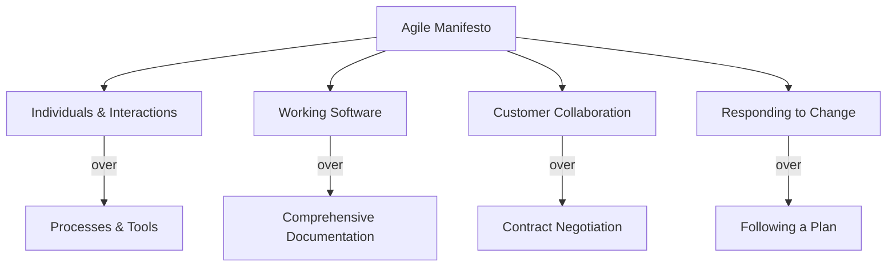
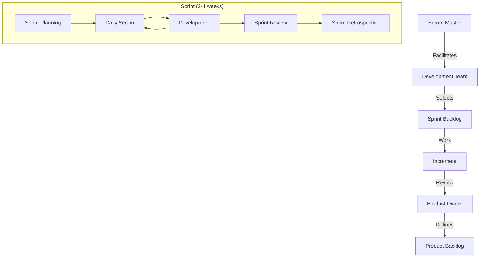
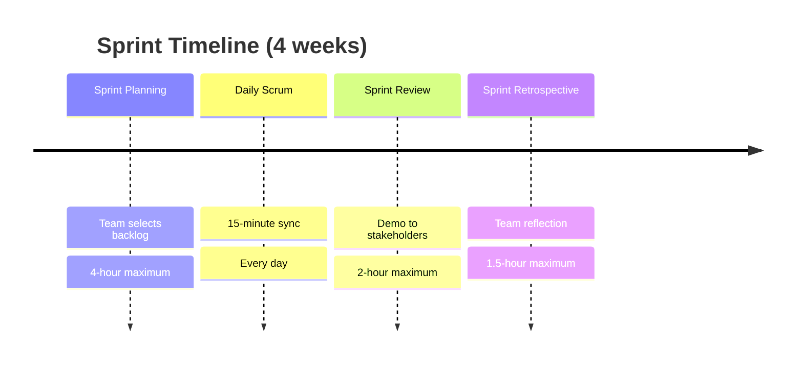
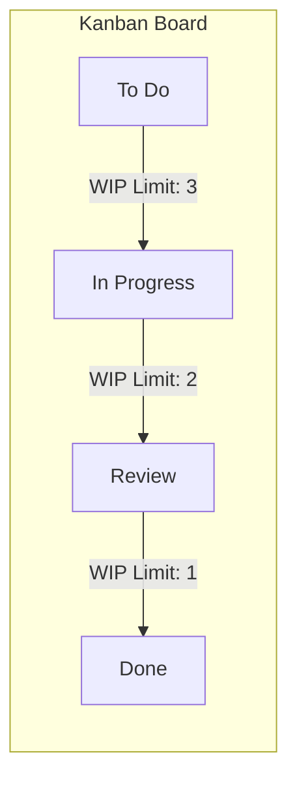
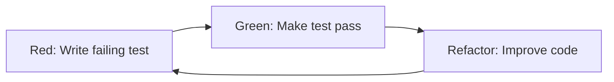
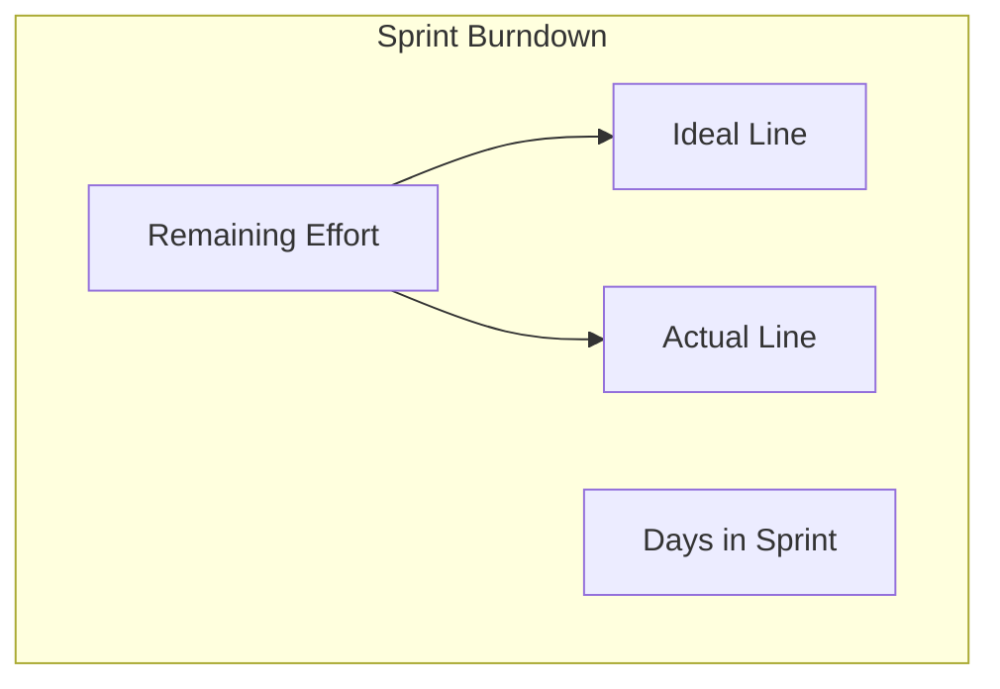

# Agile Methodologies

## Learning Objectives

After completing this chapter, the student will be able to:
- Explain the Agile Manifesto values and twelve principles
- Compare Scrum, Extreme Programming, and Kanban
- Execute Scrum ceremonies: sprint planning, daily scrum, review, retrospective
- Write user stories with INVEST criteria
- Apply estimation techniques: story points, planning poker, t-shirt sizing
- Design test-driven development (TDD) cycles in TypeScript
- Implement a burndown chart generator
- Apply XP practices: pair programming, continuous integration, refactoring

## Theory

### The Agile Manifesto

In 2001, seventeen software practitioners published the Manifesto for Agile Software Development:

> **We are uncovering better ways of developing software by doing it and helping others do it. Through this work we have come to value:**
>
> **Individuals and interactions** over processes and tools
> **Working software** over comprehensive documentation
> **Customer collaboration** over contract negotiation
> **Responding to change** over following a plan
>
> *That is, while there is value in the items on the right, we value the items on the left more.*



### The Twelve Principles

1. Our highest priority is to satisfy the customer through early and continuous delivery of valuable software.
2. Welcome changing requirements, even late in development. Agile processes harness change for the customer's competitive advantage.
3. Deliver working software frequently, from a couple of weeks to a couple of months, with a preference to the shorter timescale.
4. Business people and developers must work together daily throughout the project.
5. Build projects around motivated individuals. Give them the environment and support they need, and trust them to get the job done.
6. The most efficient and effective method of conveying information to and within a development team is face-to-face conversation.
7. Working software is the primary measure of progress.
8. Agile processes promote sustainable development. The sponsors, developers, and users should be able to maintain a constant pace indefinitely.
9. Continuous attention to technical excellence and good design enhances agility.
10. Simplicity — the art of maximizing the amount of work not done — is essential.
11. The best architectures, requirements, and designs emerge from self-organizing teams.
12. At regular intervals, the team reflects on how to become more effective, then tunes and adjusts its behavior accordingly.

### Scrum

Scrum is the most widely adopted Agile framework. It is founded on empirical process control: transparency, inspection, and adaptation.



**Scrum Roles:**

| Role | Responsibility |
|------|----------------|
| **Product Owner** | Manages Product Backlog, maximises value, represents stakeholders |
| **Scrum Master** | Facilitates Scrum process, removes impediments, coaches the team |
| **Development Team** | Self-organising, cross-functional, 3-9 members, owns delivery |

**Scrum Artifacts:**

| Artifact | Description | Who Owns |
|----------|-------------|----------|
| **Product Backlog** | Ordered list of everything needed in the product | Product Owner |
| **Sprint Backlog** | Selected backlog items + plan for the sprint | Development Team |
| **Increment** | Sum of all completed backlog items, potentially releasable | Development Team |

**Scrum Events:**



### Extreme Programming (XP)

XP takes Agile practices to an engineering extreme:

| Practice | Description | Benefit |
|----------|-------------|---------|
| **TDD** | Write tests before code | Defect prevention, design clarity |
| **Pair Programming** | Two developers at one workstation | Code quality, knowledge sharing |
| **Continuous Integration** | Integrate and test multiple times daily | Early defect detection |
| **Refactoring** | Improve design without changing behaviour | Maintainability |
| **Simple Design** | Simplest solution that works | Reduced complexity |
| **Collective Ownership** | Anyone can change any code | Team velocity |
| **Coding Standards** | Consistent code conventions | Readability |
| **Metaphor** | Shared system vocabulary | Communication |
| **Sustainable Pace** | 40-hour work week | Team health |
| **On-Site Customer** | Real user available to the team | Correct priorities |

### Kanban

Kanban is a visual workflow management method originated at Toyota.

**Core Kanban principles:**
1. **Visualise the work:** Use a board with columns (To Do, In Progress, Done)
2. **Limit Work in Progress (WIP):** Cap the number of items in each column
3. **Manage flow:** Measure cycle time and lead time
4. **Make policies explicit:** Define done criteria for each column
5. **Improve collaboratively:** Evolve the process using data



| Metric | Definition | Significance |
|--------|------------|--------------|
| **Lead time** | Request to delivery | Customer experience |
| **Cycle time** | Work started to delivery | Team efficiency |
| **Throughput** | Items completed per time period | Team capacity |
| **WIP** | Items in progress | Flow bottleneck indicator |
| **CFD (Cumulative Flow Diagram)** | Items per status over time | Queue health |

### User Stories

A **user story** is a concise description of functionality from the user's perspective.

**Standard format:**
```
As a <role>, I want <goal> so that <benefit>.
```

**INVEST criteria:**

| Letter | Criterion | Meaning |
|--------|-----------|---------|
| **I** | Independent | Can be delivered separately |
| **N** | Negotiable | Details can be refined through conversation |
| **V** | Valuable | Delivers value to stakeholders |
| **E** | Estimable | Can be sized appropriately |
| **S** | Small | Fits within a sprint |
| **T** | Testable | Acceptance criteria are clear |

**Acceptance Criteria (Given-When-Then):**

```gherkin
Feature: User Login
  Scenario: Successful login with valid credentials
    Given the user is on the login page
    When the user enters valid username and password
    And clicks the login button
    Then the user is redirected to the dashboard
    And a success message is displayed
```

### Estimation in Agile

| Technique | Description | Best For |
|-----------|-------------|----------|
| **Planning Poker** | Team simultaneously estimates with cards | Consensus building |
| **T-Shirt Sizing** | XS, S, M, L, XL categories | Quick sizing |
| **Affinity Mapping** | Group stories by size on a wall | Large backlogs |
| **Dot Voting** | Team votes on relative effort | Visual comparison |

**Story points** are relative units of effort that combine:
- Volume of work
- Complexity
- Uncertainty
- Risk

| Points | T-Shirt | Typical Scope |
|--------|---------|---------------|
| 1 | XS | Tiny fix, trivial change |
| 2 | S | Known change, simple logic |
| 3 | M | Moderate feature |
| 5 | L | Complex feature |
| 8 | XL | Large feature, some unknowns |
| 13 | XXL | Epic, needs splitting |

**Velocity:** The total story points a team completes per sprint. Used for forecasting.

### Test-Driven Development (TDD)

TDD follows the Red-Green-Refactor cycle:



**TDD Rules:**
1. Write production code only to make a failing test pass
2. Write only enough test to fail
3. Write only enough code to pass the test

### Burndown Charts

A burndown chart shows remaining work over time:



## Examples

### Example 1: Sprint Burndown Chart Generator

```typescript
interface SprintDay {
  day: number;
  date: string;
  remainingPoints: number;
}

class BurndownCalculator {
  public generate(
    totalPoints: number,
    sprintDays: number,
    actualDailyCompletion: number[]
  ): SprintDay[] {
    const ideal = this.idealBurn(totalPoints, sprintDays);

    let actualRemaining = totalPoints;
    const actual: SprintDay[] = [];

    for (let i = 0; i < sprintDays; i++) {
      if (i < actualDailyCompletion.length) {
        actualRemaining = Math.max(0, actualRemaining - actualDailyCompletion[i]);
      }
      actual.push({
        day: i + 1,
        date: new Date(Date.now() + i * 86400000).toISOString().split('T')[0],
        remainingPoints: actualRemaining,
      });
    }

    return actual;
  }

  public idealBurn(totalPoints: number, sprintDays: number): SprintDay[] {
    const dailyBurnRate = totalPoints / sprintDays;
    const burn: SprintDay[] = [];

    for (let i = 0; i < sprintDays; i++) {
      const remaining = totalPoints - (i + 1) * dailyBurnRate;
      burn.push({
        day: i + 1,
        date: new Date(Date.now() + i * 86400000).toISOString().split('T')[0],
        remainingPoints: Math.round(remaining * 100) / 100,
      });
    }

    return burn;
  }

  public isOnTrack(
    currentRemaining: number,
    initialTotal: number,
    sprintDays: number,
    currentDay: number
  ): boolean {
    const idealRemaining = initialTotal * (1 - currentDay / sprintDays);
    return currentRemaining <= idealRemaining;
  }

  public forecastCompletion(
    initialTotal: number,
    actualBurnRate: number
  ): number {
    const remaining = initialTotal - actualBurnRate;
    const currentVelocity = actualBurnRate;
    if (currentVelocity <= 0) return Infinity;
    return Math.ceil(remaining / currentVelocity);
  }
}
```

### Example 2: TDD in TypeScript

**Step 1 — Write the failing test (Red):**

```typescript
// StringCalculator.test.ts
import { describe, it, expect } from 'vitest';

function add(numbers: string): number {
  return 0; // placeholder
}

describe('StringCalculator', () => {
  it('returns 0 for empty string', () => {
    expect(add('')).toBe(0);
  });

  it('returns the number for single input', () => {
    expect(add('1')).toBe(1);
    expect(add('5')).toBe(5);
  });

  it('sums two comma-separated numbers', () => {
    expect(add('1,2')).toBe(3);
  });

  it('sums multiple numbers', () => {
    expect(add('1,2,3,4')).toBe(10);
  });

  it('handles newline delimiters', () => {
    expect(add('1\n2,3')).toBe(6);
  });

  it('supports custom delimiters', () => {
    expect(add('//;\n1;2')).toBe(3);
  });

  it('throws for negative numbers', () => {
    expect(() => add('1,-2,3')).toThrow('negatives not allowed: -2');
  });

  it('ignores numbers > 1000', () => {
    expect(add('2,1001')).toBe(2);
  });
});
```

**Step 2 — Implement to pass (Green):**

```typescript
function add(numbers: string): number {
  if (numbers === '') return 0;

  let delimiter = /,|\n/;
  let nums = numbers;

  // Custom delimiter
  if (nums.startsWith('//')) {
    const match = nums.match(/^\/\/(.+)\n/);
    if (match) {
      delimiter = new RegExp(match[1]);
      nums = nums.slice(match[0].length);
    }
  }

  const parts = nums.split(delimiter).map(Number);
  const negatives = parts.filter((n) => n < 0);

  if (negatives.length > 0) {
    throw new Error(`negatives not allowed: ${negatives.join(',')}`);
  }

  return parts.filter((n) => n <= 1000).reduce((a, b) => a + b, 0);
}
```

**Step 3 — Refactor:**

```typescript
class StringCalculator {
  private static readonly DEFAULT_DELIMITER = /,|\n/;
  private static readonly MAX_NUMBER = 1000;

  public add(numbers: string): number {
    if (numbers === '') return 0;

    const { delimiter, rest } = this.parseDelimiter(numbers);
    const tokens = rest.split(delimiter);
    const parsed = tokens.map(Number);
    this.validateNoNegatives(parsed);

    return parsed
      .filter((n) => n <= StringCalculator.MAX_NUMBER)
      .reduce((a, b) => a + b, 0);
  }

  private parseDelimiter(input: string): { delimiter: RegExp; rest: string } {
    if (input.startsWith('//')) {
      const match = input.match(/^\/\/(.+)\n/);
      if (match) {
        return {
          delimiter: new RegExp(match[1]),
          rest: input.slice(match[0].length),
        };
      }
    }
    return { delimiter: StringCalculator.DEFAULT_DELIMITER, rest: input };
  }

  private validateNoNegatives(numbers: number[]): void {
    const negatives = numbers.filter((n) => n < 0);
    if (negatives.length > 0) {
      throw new Error(`negatives not allowed: ${negatives.join(',')}`);
    }
  }
}
```

### Example 3: User Story Manager with INVEST Validation

```typescript
interface UserStory {
  id: string;
  role: string;
  goal: string;
  benefit: string;
  acceptanceCriteria: string[];
  storyPoints?: number;
  priority: number;
  status: 'backlog' | 'selected' | 'in_progress' | 'done' | 'accepted';
}

interface InvestScore {
  independent: number;   // 0-2
  negotiable: number;    // 0-2
  valuable: number;      // 0-2
  estimable: number;     // 0-2
  small: number;         // 0-2
  testable: number;      // 0-2
  total: number;         // 0-12
  pass: boolean;
}

class StoryManager {
  private stories: UserStory[] = [];
  private counter = 0;

  public createStory(
    role: string,
    goal: string,
    benefit: string,
    acceptanceCriteria: string[],
    priority: number
  ): UserStory {
    const story: UserStory = {
      id: `US-${++this.counter}`,
      role,
      goal,
      benefit,
      acceptanceCriteria,
      priority,
      status: 'backlog',
    };
    this.stories.push(story);
    return story;
  }

  public formatStory(story: UserStory): string {
    return [
      `Story ${story.id}:`,
      `As a ${story.role},`,
      `I want ${story.goal}`,
      `so that ${story.benefit}.`,
      '',
      'Acceptance Criteria:',
      ...story.acceptanceCriteria.map((c, i) => `  ${i + 1}. ${c}`),
    ].join('\n');
  }

  public validateINVEST(story: UserStory): InvestScore {
    const score: InvestScore = {
      independent: this.scoreIndependence(story),
      negotiable: story.status === 'selected' ? 2 : 1,
      valuable: this.scoreValue(story),
      estimable: story.storyPoints !== undefined ? 2 : 0,
      small: (story.storyPoints ?? 13) <= 8 ? 2 : story.storyPoints !== undefined ? 1 : 0,
      testable: story.acceptanceCriteria.length >= 2 ? 2 : story.acceptanceCriteria.length === 1 ? 1 : 0,
      total: 0,
      pass: false,
    };
    score.total = score.independent + score.negotiable + score.valuable
      + score.estimable + score.small + score.testable;
    score.pass = score.total >= 8;
    return score;
  }

  private scoreIndependence(story: UserStory): number {
    // Simple heuristic: check for dependency keywords
    const dependencies = ['dependent', 'depends', 'blocked by', 'requires'];
    const hasDependencies = dependencies.some(
      (d) => story.goal.toLowerCase().includes(d)
    );
    return hasDependencies ? 0 : 2;
  }

  private scoreValue(story: UserStory): number {
    if (!story.benefit || story.benefit.trim().length < 10) return 0;
    const strongValue = ['revenue', 'cost', 'time', 'user satisfaction',
      'competitive', 'compliance', 'security', 'performance'];
    const hasValueSignal = strongValue.some(
      (v) => story.benefit.toLowerCase().includes(v)
    );
    return hasValueSignal ? 2 : 1;
  }

  public getSprintCapacity(teamHours: number, avgHoursPerPoint: number): number {
    return Math.floor(teamHours / avgHoursPerPoint);
  }

  public selectStoriesForSprint(capacity: number): UserStory[] {
    const sorted = [...this.stories]
      .filter((s) => s.status === 'backlog')
      .sort((a, b) => a.priority - b.priority);

    let total = 0;
    const selected: UserStory[] = [];

    for (const story of sorted) {
      const points = story.storyPoints ?? 0;
      if (total + points <= capacity) {
        story.status = 'selected';
        total += points;
        selected.push(story);
      }
    }

    return selected;
  }
}
```

### Example 4: Sprint Retrospective Analyzer

```typescript
type RetroAction = {
  description: string;
  owner: string;
  dueDate: Date;
  status: 'open' | 'in_progress' | 'done';
};

type RetroCategory = 'start' | 'stop' | 'continue';

interface SprintRetrospective {
  sprintNumber: number;
  startDate: Date;
  endDate: Date;
  items: { category: RetroCategory; description: string }[];
  actions: RetroAction[];
  happinessLevel: number; // 1-5
  velocity: number;
  completedPoints: number;
}

class RetroManager {
  private retros: SprintRetrospective[] = [];

  public createRetro(
    sprintNumber: number,
    startDate: Date,
    endDate: Date,
    velocity: number,
    completedPoints: number
  ): SprintRetrospective {
    const retro: SprintRetrospective = {
      sprintNumber,
      startDate,
      endDate,
      items: [],
      actions: [],
      happinessLevel: 3,
      velocity,
      completedPoints,
    };
    this.retros.push(retro);
    return retro;
  }

  public addItem(
    retro: SprintRetrospective,
    category: RetroCategory,
    description: string
  ): void {
    retro.items.push({ category, description });
  }

  public addAction(
    retro: SprintRetrospective,
    description: string,
    owner: string,
    dueDate: Date
  ): void {
    retro.actions.push({
      description,
      owner,
      dueDate,
      status: 'open',
    });
  }

  public getActionCompletionRate(): number {
    const allActions = this.retros.flatMap((r) => r.actions);
    if (allActions.length === 0) return 0;
    const done = allActions.filter((a) => a.status === 'done').length;
    return done / allActions.length;
  }

  public generateRetroReport(sprintNumber: number): string {
    const retro = this.retros.find((r) => r.sprintNumber === sprintNumber);
    if (!retro) return `No retro for sprint ${sprintNumber}`;

    const startItems = retro.items.filter((i) => i.category === 'start');
    const stopItems = retro.items.filter((i) => i.category === 'stop');
    const continueItems = retro.items.filter((i) => i.category === 'continue');
    const openActions = retro.actions.filter((a) => a.status !== 'done');

    return [
      `=== Sprint ${sprintNumber} Retrospective ===`,
      `Velocity: ${retro.velocity} (completed ${retro.completedPoints} points)`,
      `Happiness: ${'😀'.repeat(retro.happinessLevel)}${'😐'.repeat(5 - retro.happinessLevel)}`,
      '',
      '🔴 Start Doing:',
      ...startItems.map((i) => `  - ${i.description}`),
      '',
      '🔴 Stop Doing:',
      ...stopItems.map((i) => `  - ${i.description}`),
      '',
      '🟢 Continue Doing:',
      ...continueItems.map((i) => `  - ${i.description}`),
      '',
      '📋 Open Action Items:',
      ...openActions.map((a) =>
        `  - ${a.description} (owner: ${a.owner}, due: ${a.dueDate.toISOString().split('T')[0]})`
      ),
    ].join('\n');
  }

  public getVelocityTrend(): { direction: 'improving' | 'declining' | 'stable'; avg: number } {
    const recent = this.retros.slice(-5);
    if (recent.length < 3) return { direction: 'stable', avg: 0 };
    const avg = recent.reduce((s, r) => s + r.velocity, 0) / recent.length;
    const firstHalf = recent.slice(0, Math.floor(recent.length / 2));
    const secondHalf = recent.slice(Math.floor(recent.length / 2));
    const firstAvg = firstHalf.reduce((s, r) => s + r.velocity, 0) / firstHalf.length;
    const secondAvg = secondHalf.reduce((s, r) => s + r.velocity, 0) / secondHalf.length;
    return {
      direction: secondAvg > firstAvg * 1.1 ? 'improving' : secondAvg < firstAvg * 0.9 ? 'declining' : 'stable',
      avg,
    };
  }
}
```

### Example 5: Kanban Board

```typescript
type ColumnName = 'backlog' | 'in_progress' | 'review' | 'done';

interface Card {
  id: string;
  title: string;
  assignee: string;
  column: ColumnName;
  cycleTimeStarted?: Date;
  cycleTimeCompleted?: Date;
}

class KanbanBoard {
  private wipLimits: Record<ColumnName, number> = {
    backlog: Infinity,
    in_progress: 3,
    review: 2,
    done: Infinity,
  };

  private cards: Card[] = [];

  public addCard(title: string, assignee: string): Card {
    const card: Card = { id: `CARD-${this.cards.length + 1}`, title, assignee, column: 'backlog' };
    this.cards.push(card);
    return card;
  }

  public moveCard(cardId: string, toColumn: ColumnName): boolean {
    const card = this.cards.find((c) => c.id === cardId);
    if (!card) return false;

    // Check WIP limit
    const columnCount = this.cards.filter((c) => c.column === toColumn).length;
    if (columnCount >= this.wipLimits[toColumn]) {
      return false;
    }

    if (toColumn === 'in_progress' && card.column !== 'in_progress') {
      card.cycleTimeStarted = new Date();
    }
    if (toColumn === 'done') {
      card.cycleTimeCompleted = new Date();
    }

    card.column = toColumn;
    return true;
  }

  public getCycleTime(cardId: string): number | null {
    const card = this.cards.find((c) => c.id === cardId);
    if (!card || !card.cycleTimeStarted || !card.cycleTimeCompleted) return null;
    const diff = card.cycleTimeCompleted.getTime() - card.cycleTimeStarted.getTime();
    return Math.round(diff / 3600000); // hours
  }

  public getAverageCycleTime(): number {
    const completed = this.cards.filter((c) => c.cycleTimeCompleted);
    if (completed.length === 0) return 0;
    const total = completed.reduce((s, c) => s + (c.cycleTimeCompleted!.getTime() - c.cycleTimeStarted!.getTime()), 0);
    return Math.round(total / completed.length / 3600000);
  }

  public getThroughput(days: number): number {
    const cutoff = new Date(Date.now() - days * 86400000);
    return this.cards.filter(
      (c) => c.cycleTimeCompleted && c.cycleTimeCompleted >= cutoff
    ).length;
  }

  public getLeadTime(cardId: string): number | null {
    const card = this.cards.find((c) => c.id === cardId);
    if (!card || !card.cycleTimeCompleted) return null;
    // Lead time from creation to completion (simplified)
    const created = new Date(); // would use actual created date in practice
    return Math.round((card.cycleTimeCompleted.getTime() - created.getTime()) / 3600000);
  }
}
```

## Summary

Agile methodologies emphasize iterative development, customer collaboration, and responsiveness to change over rigid planning. The Agile Manifesto provides four values and twelve principles. Scrum implements agile through defined roles (Product Owner, Scrum Master, Development Team), artifacts (Product Backlog, Sprint Backlog, Increment), and events (Sprint Planning, Daily Scrum, Sprint Review, Sprint Retrospective). Extreme Programming adds engineering practices like TDD, pair programming, and continuous integration. Kanban visualises workflow and limits work in progress. User stories capture requirements in an INVEST-compliant format. Estimation uses story points and velocity for forecasting. Burndown charts track sprint progress. Agile adoption requires cultural shift, not just process change.

## Practical Takeaways

1. **Agile is not a methodology, it is a mindset** — values and principles matter more than ceremony
2. **Short feedback loops** — the shorter the cycle, the faster you learn and adapt
3. **Self-organising teams outperform directed teams** — trust the team to find the best way
4. **Velocity is unique to each team** — never compare velocities across teams
5. **TDD reduces defect density by 40-80%** — the investment in tests pays for itself
6. **Done means "potentially shippable"** — if it is not tested and documented, it is not done

## Chapter Quiz

**Q1: Which of the following is NOT one of the four values of the Agile Manifesto?**
- A) Individuals and interactions over processes and tools
- B) Working software over comprehensive documentation
- C) Strict adherence to plans over responding to change
- D) Customer collaboration over contract negotiation

**Answer: C** — The Manifesto values responding to change over following a plan, not the reverse.

**Q2: In Scrum, who is responsible for maximising the value of the Product Backlog?**
- A) Scrum Master
- B) Development Team
- C) Product Owner
- D) Stakeholders

**Answer: C** — The Product Owner owns the Product Backlog.

**Q3: What does the 'S' in INVEST stand for?**
- A) Specific
- B) Secure
- C) Small
- D) Scalable

**Answer: C** — INVEST criteria: Independent, Negotiable, Valuable, Estimable, Small, Testable.

**Q4: The Red-Green-Refactor cycle is associated with:**
- A) Scrum
- B) Test-Driven Development
- C) Kanban
- D) User Story mapping

**Answer: B** — TDD follows Red (failing test), Green (passing test), Refactor (improve code).

**Q5: What is the recommended WIP limit in Kanban designed to do?**
- A) Increase multitasking
- B) Identify bottlenecks and reduce context switching
- C) Maximise developer utilisation
- D) Ensure thorough documentation

**Answer: B** — WIP limits expose bottlenecks and reduce context switching overhead.

### TypeScript: Agile Methodology Tools

```typescript
// === Sprint Velocity Calculator ===
function calcVelocity(sprintHistory: number[]): { avg: number; med: number; trend: "up" | "down" | "stable" } {
  const avg = Math.round(sprintHistory.reduce((s, v) => s + v, 0) / sprintHistory.length);
  const sorted = [...sprintHistory].sort((a, b) => a - b);
  const mid = Math.floor(sorted.length / 2);
  const med = sorted.length % 2 === 0 ? (sorted[mid - 1] + sorted[mid]) / 2 : sorted[mid];
  const recent = sprintHistory.slice(-3);
  const trend: "up" | "down" | "stable" = recent[2] > recent[0] ? "up" : recent[2] < recent[0] ? "down" : "stable";
  return { avg, med, trend };
}
console.log(calcVelocity([30, 32, 28, 35, 29, 31]));

// === Burndown Chart Data Generator ===
function generateBurndown(totalPoints: number, days: number, dailyCompletion: number[]): { ideal: number[]; actual: number[]; days: number[] } {
  const ideal = Array.from({ length: days + 1 }, (_, i) => totalPoints * (1 - i / days));
  let remaining = totalPoints;
  const actual = [remaining, ...dailyCompletion.map((c) => { remaining = Math.max(0, remaining - c); return remaining; })];
  return { ideal, actual, days: Array.from({ length: days + 1 }, (_, i) => i) };
}
const burndown = generateBurndown(50, 10, [6, 4, 5, 7, 3, 5, 6, 4, 5, 5]);
console.log(burndown.actual);

// === Story Point Estimator (Planning Poker) ===
const fibonacciScale = [1, 2, 3, 5, 8, 13, 21];
function estimatePoints(estimates: number[]): { final: number; confidence: "high" | "medium" | "low"; spread: number } {
  const avg = estimates.reduce((s, e) => s + e, 0) / estimates.length;
  const closest = fibonacciScale.reduce((prev, curr) => Math.abs(curr - avg) < Math.abs(prev - avg) ? curr : prev);
  const variance = estimates.reduce((s, e) => s + (e - avg) ** 2, 0) / estimates.length;
  const std = Math.sqrt(variance);
  return { final: closest, confidence: std <= 2 ? "high" : std <= 5 ? "medium" : "low", spread: Math.round(std * 100) / 100 };
}
console.log(estimatePoints([3, 5, 5, 3, 8]));

// === Backlog Prioritizer (MoSCoW + WSJF) ===
interface BacklogItem {
  id: string; value: number; timeCriticality: number; riskReduction: number; jobSize: number;
}
function wsjf(item: BacklogItem): number {
  return (item.value + item.timeCriticality + item.riskReduction) / item.jobSize;
}
function prioritizeBacklog(items: BacklogItem[]): BacklogItem[] {
  return [...items].sort((a, b) => wsjf(b) - wsjf(a));
}
const backlog: BacklogItem[] = [
  { id: "US-1", value: 10, timeCriticality: 8, riskReduction: 3, jobSize: 5 },
  { id: "US-2", value: 5, timeCriticality: 2, riskReduction: 8, jobSize: 3 },
  { id: "US-3", value: 8, timeCriticality: 5, riskReduction: 2, jobSize: 8 },
  { id: "US-4", value: 3, timeCriticality: 3, riskReduction: 5, jobSize: 2 },
];
console.log(prioritizeBacklog(backlog).map((i) => `${i.id}: WSJF=${wsjf(i).toFixed(2)}`));

// === Cycle Time Calculator ===
function cycleTime(completedItems: { started: Date; finished: Date }[]): { avg: number; p50: number; p95: number } {
  const days = completedItems.map((i) => (i.finished.getTime() - i.started.getTime()) / (1000 * 60 * 60 * 24));
  const sorted = [...days].sort((a, b) => a - b);
  const avg = days.reduce((s, d) => s + d, 0) / days.length;
  const idx50 = Math.floor(sorted.length * 0.5);
  const idx95 = Math.floor(sorted.length * 0.95);
  return { avg: Math.round(avg * 10) / 10, p50: sorted[idx50], p95: sorted[Math.min(idx95, sorted.length - 1)] };
}
const now = Date.now();
console.log(cycleTime([
  { started: new Date(now - 5 * 86400000), finished: new Date(now) },
  { started: new Date(now - 3 * 86400000), finished: new Date(now) },
]));

// === Velocity Forecaster ===
function forecastVelocity(history: number[], confidence = 0.85): { min: number; likely: number; max: number } {
  const avg = history.reduce((s, v) => s + v, 0) / history.length;
  const std = Math.sqrt(history.reduce((s, v) => s + (v - avg) ** 2, 0) / history.length);
  const z = confidence === 0.85 ? 1.44 : confidence === 0.95 ? 1.96 : 1;
  return { min: Math.round(avg - z * std), likely: Math.round(avg), max: Math.round(avg + z * std) };
}
console.log(forecastVelocity([30, 32, 28, 35, 29, 31]));
```

### TypeScript: Agile Metrics Tools

```typescript
// === Sprint Velocity Tracker ===
interface Sprint { number: number; plannedPoints: number; completedPoints: number; }
class VelocityTracker {
  private sprints: Sprint[] = [];
  addSprint(sprint: Sprint): void { this.sprints.push(sprint); }
  getAverageVelocity(): number {
    if (this.sprints.length === 0) return 0;
    return Math.round(this.sprints.reduce((s, sp) => s + sp.completedPoints, 0) / this.sprints.length);
  }
  getVelocityTrend(): { increasing: boolean; percentage: number } {
    if (this.sprints.length < 2) return { increasing: true, percentage: 0 };
    const first = this.sprints[0].completedPoints;
    const last = this.sprints[this.sprints.length - 1].completedPoints;
    return { increasing: last >= first, percentage: first > 0 ? Math.round(((last - first) / first) * 100) : 0 };
  }
  predictCompletion(backlogPoints: number): number {
    const avg = this.getAverageVelocity();
    return avg > 0 ? Math.ceil(backlogPoints / avg) : -1;
  }
}

// === Burndown Chart Calculator ===
function calculateBurndown(days: number, totalPoints: number, actual: { day: number; remaining: number }[]): { ideal: number[]; actual: number[] } {
  const ideal = Array.from({ length: days }, (_, i) => Math.round(totalPoints * (1 - i / days)));
  const actualData: number[] = [];
  for (let d = 0; d < days; d++) {
    const entry = actual.find(a => a.day === d);
    actualData.push(entry ? entry.remaining : actualData[actualData.length - 1] ?? totalPoints);
  }
  return { ideal, actual: actualData };
}

// === Kanban WIP Limit Enforcer ===
function enforceWIP(columns: { name: string; wipLimit: number; items: number; }[]): { column: string; withinLimit: boolean; violation: number }[] {
  return columns.map(col => ({
    column: col.name,
    withinLimit: col.items <= col.wipLimit,
    violation: Math.max(0, col.items - col.wipLimit),
  }));
}

// === Cycle Time Analyzer ===
interface WorkItem { id: string; started: Date; completed: Date; }
function cycleTime(item: WorkItem): number { return (item.completed.getTime() - item.started.getTime()) / (1000 * 60 * 60 * 24); }
function averageCycleTime(items: WorkItem[]): number {
  if (items.length === 0) return 0;
  return Math.round(items.reduce((s, i) => s + cycleTime(i), 0) / items.length);
}

// === Throughput Calculator ===
function throughput(items: WorkItem[], periodDays: number): number {
  return Math.round(items.length / periodDays);
}

const tracker = new VelocityTracker();
tracker.addSprint({ number: 1, plannedPoints: 30, completedPoints: 25 });
tracker.addSprint({ number: 2, plannedPoints: 30, completedPoints: 28 });
tracker.addSprint({ number: 3, plannedPoints: 35, completedPoints: 32 });
console.log(tracker.getAverageVelocity()); // ~28
console.log(tracker.predictCompletion(100)); // ~4 sprints

const burndown = calculateBurndown(10, 50, [{ day: 0, remaining: 50 }, { day: 5, remaining: 30 }, { day: 10, remaining: 5 }]);
console.log(burndown.ideal[0], burndown.actual[0]);

const wipCheck = enforceWIP([{ name: "In Progress", wipLimit: 3, items: 5 }, { name: "Review", wipLimit: 2, items: 1 }]);
console.log(wipCheck); // Violation in "In Progress"
```

## Exercises

### Review Questions

1. What are the four values of the Agile Manifesto?
2. Describe the roles and responsibilities in a Scrum team.
3. What is the purpose of the Sprint Retrospective?
4. Explain the INVEST criteria for user stories.
5. How does Kanban differ from Scrum?
6. What are the five core Kanban principles?
7. Describe the three phases of Test-Driven Development.
8. What is velocity and how is it used in planning?

### Application Problems

1. Write five user stories for an online banking application following the standard format. Each must include at least three acceptance criteria.

2. Given a team velocity of 30 points per sprint and a backlog of stories valued at 3, 5, 8, 3, 13, 5, 2, 8, 3, 5 points (priority order), determine which stories fit in the next sprint.

3. Convert the StringCalculator TDD example to accept a variable number of arguments: `add(...args: string[]): number`. Write the tests first.

### Challenge Problem

A team of 6 developers is transitioning from waterfall to Scrum. They currently do not write automated tests, have no CI pipeline, and the product owner is unavailable after sprint planning. Their first sprint produced zero working software — the team tried to implement all features at once. Diagnose the root causes. Develop a transformation roadmap covering: team training, engineering practices (TDD, CI, pair programming), Scrum adoption (correct ceremony execution, PO commitment), and cultural changes. Implement a TypeScript team maturity model that assesses the team across 10 dimensions (TDD adoption, CI maturity, backlog management, estimation accuracy, etc.) and generates an improvement plan.

