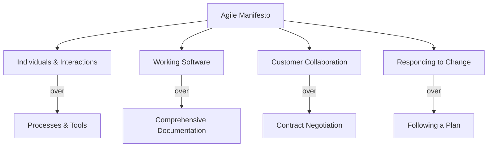
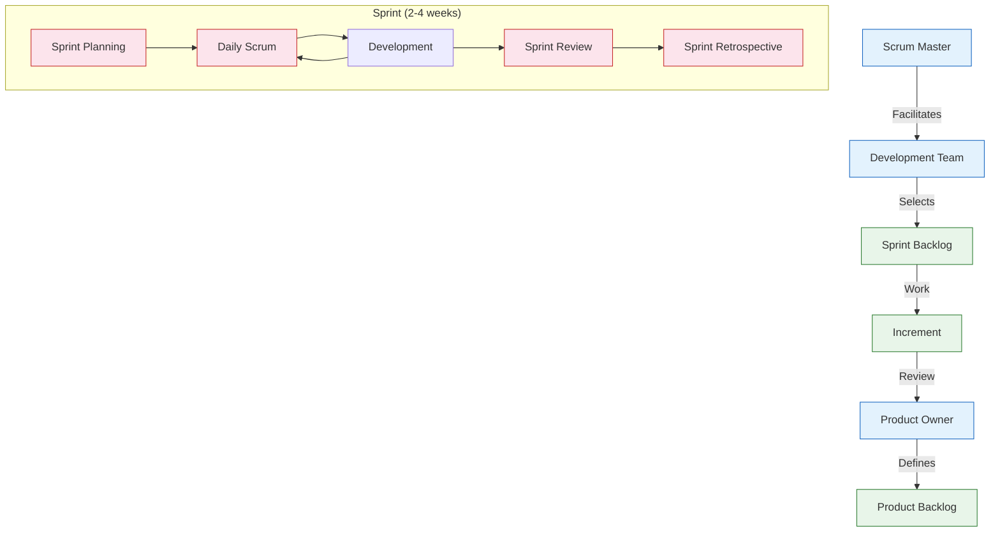
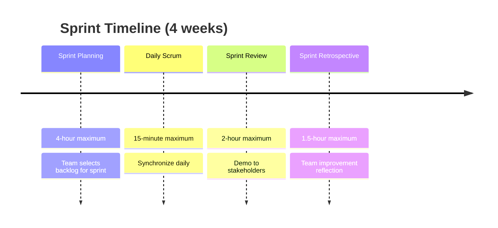
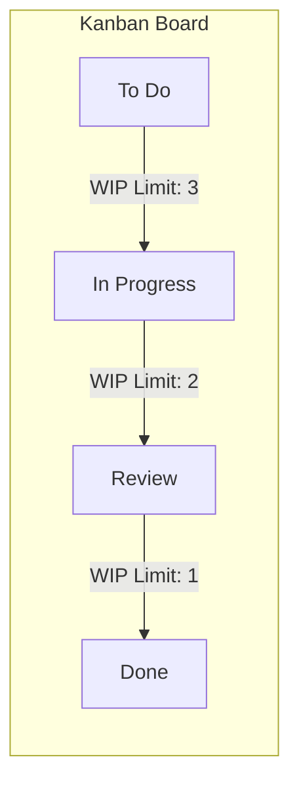
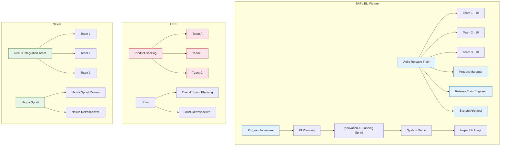
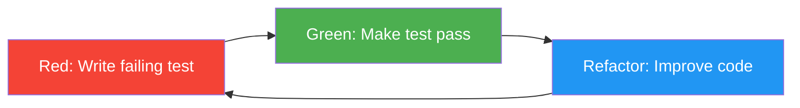
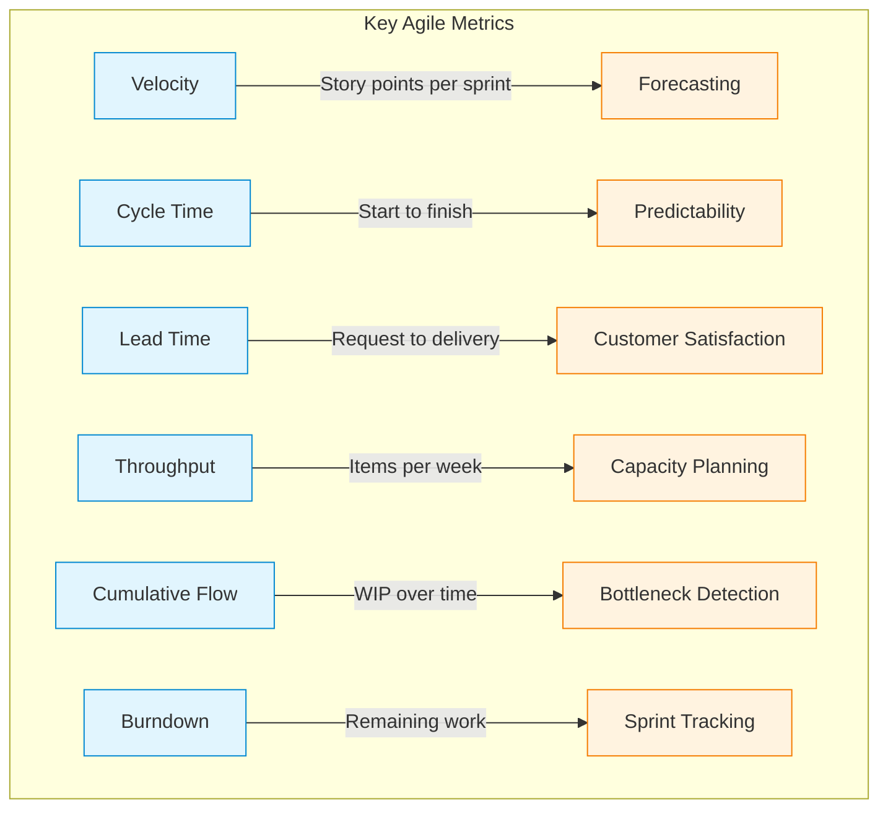
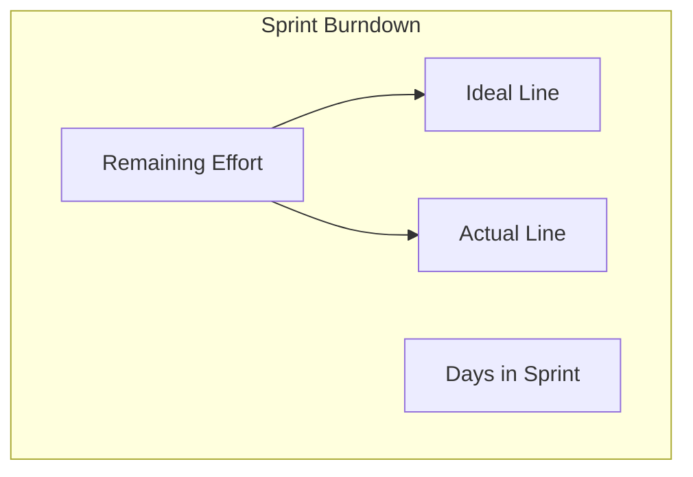

# Agile Methodologies

## Learning Objectives

- [x] Explain the Agile Manifesto values and twelve principles
- [x] Compare Scrum, Extreme Programming, Kanban, and scaled agile frameworks
- [x] Execute Scrum ceremonies: sprint planning, daily scrum, review, retrospective
- [x] Write user stories with INVEST criteria and acceptance criteria
- [x] Apply estimation techniques: story points, planning poker, t-shirt sizing, affinity mapping
- [x] Design test-driven development (TDD) and BDD cycles in TypeScript
- [x] Implement agile metrics tools: velocity tracker, burndown charts, CFD, cycle time
- [x] Configure scaled agile frameworks (SAFe, LeSS, Nexus)

## Theory

### The Agile Manifesto

In 2001, seventeen software practitioners published the Manifesto for Agile Software Development:

> **We are uncovering better ways of developing software by doing it and helping others do it. Through this work we have come to value:**
>
> **Individuals and interactions** over processes and tools
> **Working software** over comprehensive documentation
> **Customer collaboration** over contract negotiation
> **Responding to change** over following a plan
>
> *That is, while there is value in the items on the right, we value the items on the left more.*



### The Twelve Principles

1. Our highest priority is to satisfy the customer through early and continuous delivery of valuable software.
2. Welcome changing requirements, even late in development. Agile processes harness change for the customer's competitive advantage.
3. Deliver working software frequently, from a couple of weeks to a couple of months, with a preference to the shorter timescale.
4. Business people and developers must work together daily throughout the project.
5. Build projects around motivated individuals. Give them the environment and support they need, and trust them to get the job done.
6. The most efficient and effective method of conveying information to and within a development team is face-to-face conversation.
7. Working software is the primary measure of progress.
8. Agile processes promote sustainable development. The sponsors, developers, and users should be able to maintain a constant pace indefinitely.
9. Continuous attention to technical excellence and good design enhances agility.
10. Simplicity — the art of maximizing the amount of work not done — is essential.
11. The best architectures, requirements, and designs emerge from self-organizing teams.
12. At regular intervals, the team reflects on how to become more effective, then tunes and adjusts its behavior accordingly.

### Scrum

Scrum is the most widely adopted Agile framework. It is founded on empirical process control: transparency, inspection, and adaptation.



**Scrum Roles:**

| Role | Responsibility | Key Activities |
|------|----------------|----------------|
| **Product Owner** | Manages Product Backlog, maximises value, represents stakeholders | Backlog refinement, priority decisions, stakeholder communication |
| **Scrum Master** | Facilitates Scrum process, removes impediments, coaches the team | Ceremony facilitation, impediment removal, team coaching |
| **Development Team** | Self-organising, cross-functional, 3-9 members, owns delivery | Sprint execution, quality ownership, estimation |

**Scrum Artifacts:**

| Artifact | Description | Who Owns | Review Frequency |
|----------|-------------|----------|------------------|
| **Product Backlog** | Ordered list of everything needed in the product | Product Owner | Continuous refinement |
| **Sprint Backlog** | Selected backlog items + plan for the sprint | Development Team | Daily in Scrum |
| **Increment** | Sum of all completed backlog items, potentially releasable | Development Team | Sprint Review |

**Scrum Events (timeboxed):**



### Extreme Programming (XP)

XP takes Agile practices to an engineering extreme:

| Practice | Description | Benefit | Difficulty |
|----------|-------------|---------|------------|
| **TDD** | Write tests before code | Defect prevention, design clarity | High |
| **Pair Programming** | Two developers at one workstation | Code quality, knowledge sharing | Medium |
| **Continuous Integration** | Integrate and test multiple times daily | Early defect detection | High |
| **Refactoring** | Improve design without changing behaviour | Maintainability | Medium |
| **Simple Design** | Simplest solution that works | Reduced complexity | Medium |
| **Collective Ownership** | Anyone can change any code | Team velocity | Low |
| **Coding Standards** | Consistent code conventions | Readability | Low |
| **Metaphor** | Shared system vocabulary | Communication | Low |
| **Sustainable Pace** | 40-hour work week | Team health | Medium |
| **On-Site Customer** | Real user available to the team | Correct priorities | High |

### Kanban

Kanban is a visual workflow management method originated at Toyota.

**Core Kanban principles:**
1. **Visualise the work:** Use a board with columns (To Do, In Progress, Done)
2. **Limit Work in Progress (WIP):** Cap the number of items in each column
3. **Manage flow:** Measure cycle time and lead time
4. **Make policies explicit:** Define done criteria for each column
5. **Improve collaboratively:** Evolve the process using data



**Kanban vs Scrum:**

| Aspect | Scrum | Kanban |
|--------|-------|--------|
| Cadence | Fixed sprints (1-4 weeks) | Continuous flow |
| Roles | PO, SM, Dev Team | No prescribed roles |
| Changes | No changes during sprint | Changes at any time |
| Metrics | Velocity, burndown | Cycle time, throughput, CFD |
| WIP limits | Implicit (sprint scope) | Explicit per column |
| Release | End of sprint | Continuous or on-demand |
| Best for | Complex work with defined goals | Support, maintenance, operations |

| Metric | Definition | Significance |
|--------|------------|--------------|
| **Lead time** | Request to delivery | Customer experience |
| **Cycle time** | Work started to delivery | Team efficiency |
| **Throughput** | Items completed per time period | Team capacity |
| **WIP** | Items in progress | Flow bottleneck indicator |
| **CFD (Cumulative Flow Diagram)** | Items per status over time | Queue health, cycle time |

### User Stories

A **user story** is a concise description of functionality from the user's perspective.

**Standard format:**
```
As a <role>, I want <goal> so that <benefit>.
```

**INVEST criteria:**

| Letter | Criterion | Meaning | Evaluation Question |
|--------|-----------|---------|---------------------|
| **I** | Independent | Can be delivered separately | Does this story depend on other stories? |
| **N** | Negotiable | Details can be refined through conversation | Can we change the implementation approach? |
| **V** | Valuable | Delivers value to stakeholders | Does the user/owner care about this? |
| **E** | Estimable | Can be sized appropriately | Can the team estimate this? |
| **S** | Small | Fits within a sprint | Can we complete this in one sprint? |
| **T** | Testable | Acceptance criteria are clear | Can we verify the story is done? |

**Acceptance Criteria (Given-When-Then):**

```gherkin
Feature: User Login
  Scenario: Successful login with valid credentials
    Given the user is on the login page
    When the user enters valid username and password
    And clicks the login button
    Then the user is redirected to the dashboard
    And a success message is displayed

  Scenario: Failed login with invalid credentials
    Given the user is on the login page
    When the user enters invalid username or password
    Then an error message is displayed
    And the user remains on the login page
```

### Estimation in Agile

| Technique | Description | Best For | Accuracy |
|-----------|-------------|----------|----------|
| **Planning Poker** | Team simultaneously estimates with cards (Fibonacci) | Medium-to-large teams | High |
| **T-Shirt Sizing** | XS, S, M, L, XL categories | Quick sizing, early backlogs | Medium |
| **Affinity Mapping** | Group stories by size on a wall | Large backlogs, bulk estimation | Medium |
| **Dot Voting** | Team votes on relative effort | Visual comparison | Low |
| **Three-Point** | Best case + worst case + most likely | Risk-aware estimation | Medium |
| **Bucket System** | Stories placed into pre-sized buckets | Very large backlogs | Medium |

**Story points** are relative units of effort that combine:
- Volume of work
- Complexity
- Uncertainty
- Risk

| Points | T-Shirt | Typical Scope | Example |
|--------|---------|---------------|---------|
| 1 | XS | Tiny fix, trivial change | Fix typo in error message |
| 2 | S | Known change, simple logic | Add field to form |
| 3 | M | Moderate feature | Implement search filter |
| 5 | L | Complex feature | Payment integration |
| 8 | XL | Large feature, some unknowns | Third-party API integration |
| 13 | XXL | Epic, needs splitting | Full auth system |

**Velocity:** The total story points a team completes per sprint. Used for forecasting.

```
Forecasted Sprints = Remaining Backlog Points / Average Velocity
```

**Velocity guidelines:**
- Never compare velocity across teams (each team's scale is unique)
- Use a rolling average of 3-5 sprints for forecasting
- Normalize velocity after team changes (new member, departures)
- Track velocity trend (improving/declining/stable) rather than absolute value

### Scaled Agile Frameworks

When Agile needs to scale beyond a single team, several frameworks provide coordination mechanisms:

| Framework | Teams | Coordination | Roles | Key Practices |
|-----------|-------|--------------|-------|---------------|
| **SAFe** | 50-500+ | Program Increment (PI) planning, ART | Release Train Engineer, Product Manager, Solution Architect | PI Planning, System Demo, Inspect & Adapt |
| **LeSS** | 2-8 teams | One Product Backlog, one Sprint | Product Owner (scaled), Scrum Masters | Overall Sprint Planning, Joint Retrospective |
| **Nexus** | 3-9 teams | Nexus Integration Team | Product Owner, Scrum Master(s), Nexus Integration Team | Nexus Sprint, Sprint Retrospective, Refinement |



**SAFe Configuration Levels:**

| Level | Description | Example |
|-------|-------------|---------|
| **Essential SAFe** | Minimum viable: ART + Teams | 50-125 people |
| **Large Solution SAFe** | Multiple ARTs + Solution Train | 125-500 people |
| **Portfolio SAFe** | Multiple Solution Trains + Portfolio | 500+ people |

**SAFe Core Competencies:**
1. Lean-Agile Leadership
2. Team and Technical Agility
3. Agile Product Delivery
4. Enterprise Solution Delivery
5. Lean Portfolio Management
6. Organisational Agility
7. Continuous Learning Culture

### Agile Testing

**Test-Driven Development (TDD):**

TDD follows the Red-Green-Refactor cycle:



**TDD Rules:**
1. Write production code only to make a failing test pass
2. Write only enough test to fail
3. Write only enough code to pass the test

**Behavior-Driven Development (BDD):**

BDD extends TDD with business-readable scenarios:

```gherkin
Feature: Shopping Cart
  Scenario: Add item to cart
    Given the user is viewing a product
    When the user clicks "Add to Cart"
    Then the item appears in the shopping cart
    And the cart count increments by 1
```

**Acceptance Test-Driven Development (ATDD):**
- Team collaboratively defines acceptance tests before implementation
- Tests are automated and become part of the regression suite
- Three amigos: Developer + Tester + Business Analyst

### Agile Metrics



| Metric | Formula | Target | Usage |
|--------|---------|--------|-------|
| **Velocity** | Sprint points completed | Consistent trend | Forecasting |
| **Cycle time** | Date done − Date started | < 3 days | Process improvement |
| **Lead time** | Date done − Date requested | < 5 days | Customer satisfaction |
| **Throughput** | Items / time period | Increasing trend | Capacity |
| **Defect leakage** | Production defects / total defects | < 5% | Quality |
| **Happiness metric** | Team survey (1-5) | > 4.0 | Team health |

### Burndown Charts

A burndown chart shows remaining work over time:



## Examples

### Example 1: SprintBoard — Backlog, Sprint Planning, Task Tracking, Velocity

A complete sprint board implementation with backlog management, sprint planning with capacity-based selection, task tracking, and velocity computation.

```typescript
type StoryStatus = 'backlog' | 'refined' | 'selected' | 'in_progress' | 'review' | 'done' | 'accepted';
type TaskStatus = 'todo' | 'in_progress' | 'done';
type Priority = 'critical' | 'high' | 'medium' | 'low';

interface Story {
  id: string;
  title: string;
  description: string;
  role: string;
  goal: string;
  benefit: string;
  acceptanceCriteria: string[];
  storyPoints: number;
  priority: Priority;
  status: StoryStatus;
  order: number;
  tasks: Task[];
  createdAt: Date;
}

interface Task {
  id: string;
  description: string;
  assignee: string;
  estimatedHours: number;
  actualHours: number;
  status: TaskStatus;
}

interface Sprint {
  id: number;
  name: string;
  startDate: Date;
  endDate: Date;
  goal: string;
  stories: Story[];
  capacity: number;
  velocity: number | null;
  completedAt?: Date;
}

class SprintBoard {
  private backlog: Story[] = [];
  private sprints: Sprint[] = [];
  private storyCounter = 0;
  private taskCounter = 0;

  public addStory(
    title: string, role: string, goal: string, benefit: string,
    acceptanceCriteria: string[], storyPoints: number, priority: Priority
  ): Story {
    const story: Story = {
      id: `US-${++this.storyCounter}`, title, description: `As a ${role}, I want ${goal} so that ${benefit}.`,
      role, goal, benefit, acceptanceCriteria, storyPoints, priority,
      status: 'backlog', order: this.backlog.length + 1, tasks: [], createdAt: new Date(),
    };
    this.backlog.push(story);
    return story;
  }

  public addTask(storyId: string, description: string, assignee: string, estimatedHours: number): Task {
    const story = this.findStory(storyId);
    const task: Task = {
      id: `TASK-${++this.taskCounter}`, description, assignee, estimatedHours, actualHours: 0, status: 'todo',
    };
    story.tasks.push(task);
    return task;
  }

  public refineBacklog(): Story[] {
    return this.backlog.filter(s => s.status === 'backlog');
  }

  public planSprint(name: string, startDate: Date, endDate: Date, goal: string): Sprint {
    const capacity = this.computeCapacity(startDate, endDate);
    const sprint: Sprint = {
      id: this.sprints.length + 1, name, startDate, endDate, goal,
      stories: [], capacity, velocity: null,
    };
    this.sprints.push(sprint);
    return sprint;
  }

  public selectStoriesForSprint(sprintId: number, maxPoints?: number): Story[] {
    const sprint = this.findSprint(sprintId);
    const selected: Story[] = [];
    const capacity = maxPoints ?? sprint.capacity;
    let total = 0;

    const refined = this.backlog
      .filter(s => s.status === 'backlog')
      .sort((a, b) => {
        const priorityOrder: Record<Priority, number> = { critical: 0, high: 1, medium: 2, low: 3 };
        return priorityOrder[a.priority] - priorityOrder[b.priority];
      });

    for (const story of refined) {
      if (total + story.storyPoints <= capacity) {
        story.status = 'selected';
        total += story.storyPoints;
        selected.push(story);
      }
    }
    sprint.stories = selected;
    return selected;
  }

  public startTask(taskId: string): void {
    const task = this.findTask(taskId);
    task.status = 'in_progress';
  }

  public completeTask(taskId: string, actualHours: number): void {
    const task = this.findTask(taskId);
    task.status = 'done';
    task.actualHours = actualHours;
  }

  public completeStory(storyId: string): void {
    const story = this.findStory(storyId);
    if (story.tasks.some(t => t.status !== 'done')) {
      throw new Error('Cannot complete story with unfinished tasks');
    }
    story.status = 'done';
  }

  public completeSprint(sprintId: number): { velocity: number; completedStories: Story[] } {
    const sprint = this.findSprint(sprintId);
    const completed = sprint.stories.filter(s => s.status === 'done' || s.status === 'accepted');
    sprint.velocity = completed.reduce((s, story) => s + story.storyPoints, 0);
    sprint.completedAt = new Date();
    return { velocity: sprint.velocity, completedStories: completed };
  }

  public getVelocity(sprintCount = 3): { average: number; trend: 'improving' | 'stable' | 'declining' } {
    const recent = this.sprints.filter(s => s.velocity !== null).slice(-sprintCount);
    if (recent.length === 0) return { average: 0, trend: 'stable' };
    const avg = Math.round(recent.reduce((s, sp) => s + sp.velocity!, 0) / recent.length);
    if (recent.length < 3) return { average: avg, trend: 'stable' };

    const firstHalf = recent.slice(0, Math.floor(recent.length / 2));
    const secondHalf = recent.slice(Math.floor(recent.length / 2));
    const firstAvg = firstHalf.reduce((s, sp) => s + sp.velocity!, 0) / firstHalf.length;
    const secondAvg = secondHalf.reduce((s, sp) => s + sp.velocity!, 0) / secondHalf.length;

    const diff = ((secondAvg - firstAvg) / firstAvg) * 100;
    const trend = diff > 10 ? 'improving' : diff < -10 ? 'declining' : 'stable';
    return { average: avg, trend };
  }

  public forecastCompletion(backlogPoints: number): number {
    const { average } = this.getVelocity();
    return average > 0 ? Math.ceil(backlogPoints / average) : -1;
  }

  public generateSprintReport(sprintId: number): string {
    const sprint = this.findSprint(sprintId);
    const completed = sprint.stories.filter(s => s.status === 'done' || s.status === 'accepted').length;
    const totalTasks = sprint.stories.reduce((s, st) => s + st.tasks.length, 0);
    const doneTasks = sprint.stories.reduce((s, st) => s + st.tasks.filter(t => t.status === 'done').length, 0);
    return [
      `═══════════════════════════════════════`,
      `  Sprint ${sprint.id}: ${sprint.name}`,
      `  Goal: ${sprint.goal}`,
      `  Period: ${sprint.startDate.toISOString().split('T')[0]} → ${sprint.endDate.toISOString().split('T')[0]}`,
      `═══════════════════════════════════════`,
      `  Capacity: ${sprint.capacity} points`,
      `  Stories: ${sprint.stories.length} (${completed} completed)`,
      `  Tasks: ${doneTasks}/${totalTasks}`,
      `  Velocity: ${sprint.velocity ?? 'N/A'}`,
      `  Forecast accuracy: ${sprint.velocity && sprint.capacity ? Math.round((sprint.velocity / sprint.capacity) * 100) : 'N/A'}%`,
    ].join('\n');
  }

  private computeCapacity(startDate: Date, endDate: Date): number {
    const days = Math.ceil((endDate.getTime() - startDate.getTime()) / 86400000);
    return days * 3; // 3 story points per day heuristic
  }

  private findStory(id: string): Story {
    const story = this.backlog.find(s => s.id === id) || this.sprints.flatMap(sp => sp.stories).find(s => s.id === id);
    if (!story) throw new Error(`Story ${id} not found`);
    return story;
  }

  private findSprint(id: number): Sprint {
    const sprint = this.sprints.find(s => s.id === id);
    if (!sprint) throw new Error(`Sprint ${id} not found`);
    return sprint;
  }

  private findTask(taskId: string): Task {
    for (const story of this.backlog) {
      const task = story.tasks.find(t => t.id === taskId);
      if (task) return task;
    }
    throw new Error(`Task ${taskId} not found`);
  }
}

// Usage
const board = new SprintBoard();
const story1 = board.addStory('User Login', 'User', 'log in with email', 'access my account',
  ['Valid email/password redirects to dashboard', 'Invalid credentials show error', '3 failed attempts lock account for 15 minutes'], 5, 'critical');
const story2 = board.addStory('Password Reset', 'User', 'reset my password', 'recover access',
  ['Email with reset link sent', 'Link expires after 1 hour', 'New password must meet strength requirements'], 3, 'high');

board.addTask(story1.id, 'Create login form UI', 'Alice', 4);
board.addTask(story1.id, 'Implement authentication API', 'Bob', 8);
board.addTask(story1.id, 'Write E2E tests', 'Charlie', 4);

const sprint = board.planSprint('Sprint 1', new Date('2025-01-06'), new Date('2025-01-19'), 'Implement user authentication');
board.selectStoriesForSprint(sprint.id);
board.completeTask('TASK-1', 4);
board.completeTask('TASK-2', 7);
board.completeStory('US-1');
const result = board.completeSprint(sprint.id);
console.log(`Velocity: ${result.velocity}`);
console.log(board.getVelocity());
console.log(board.generateSprintReport(sprint.id));
```

### Example 2: AgileMetrics — Velocity, Cycle Time, Burndown Computation

A comprehensive agile metrics calculator that computes velocity, cycle time statistics, burndown data, cumulative flow, and generates formatted reports.

```typescript
interface SprintData {
  number: number;
  plannedPoints: number;
  completedPoints: number;
  startDate: Date;
  endDate: Date;
}

interface WorkItemData {
  id: string;
  type: 'story' | 'task' | 'bug';
  status: string;
  requestedDate: Date;
  startedDate?: Date;
  completedDate?: Date;
  points?: number;
}

interface CycleTimeStats {
  average: number;
  median: number;
  p85: number;
  p95: number;
  max: number;
}

class AgileMetrics {
  private sprints: SprintData[] = [];
  private workItems: WorkItemData[] = [];

  public recordSprint(sprint: SprintData): void {
    this.sprints.push(sprint);
  }

  public recordWorkItem(item: WorkItemData): void {
    this.workItems.push(item);
  }

  public getVelocity(sprintCount = 3): { average: number; median: number; trend: 'up' | 'down' | 'stable'; data: number[] } {
    const recent = this.sprints.slice(-sprintCount);
    const data = recent.map(s => s.completedPoints);
    const avg = Math.round(data.reduce((a, b) => a + b, 0) / data.length);
    const sorted = [...data].sort((a, b) => a - b);
    const mid = Math.floor(sorted.length / 2);
    const median = sorted.length % 2 === 0 ? (sorted[mid - 1] + sorted[mid]) / 2 : sorted[mid];
    const trend: 'up' | 'down' | 'stable' = data.length >= 3
      ? (data[data.length - 1] > data[0] ? 'up' : data[data.length - 1] < data[0] ? 'down' : 'stable')
      : 'stable';
    return { average: avg, median, trend, data };
  }

  public getCycleTime(workItemIds?: string[]): CycleTimeStats {
    const items = workItemIds
      ? this.workItems.filter(w => workItemIds.includes(w.id))
      : this.workItems.filter(w => w.startedDate && w.completedDate);

    const cycleTimes = items
      .filter(w => w.startedDate && w.completedDate)
      .map(w => (w.completedDate!.getTime() - w.startedDate!.getTime()) / (1000 * 60 * 60 * 24));

    if (cycleTimes.length === 0) return { average: 0, median: 0, p85: 0, p95: 0, max: 0 };

    const sorted = [...cycleTimes].sort((a, b) => a - b);
    const avg = cycleTimes.reduce((a, b) => a + b, 0) / cycleTimes.length;
    const mid = Math.floor(sorted.length / 2);
    const median = sorted.length % 2 === 0 ? (sorted[mid - 1] + sorted[mid]) / 2 : sorted[mid];
    const p85 = sorted[Math.floor(sorted.length * 0.85)];
    const p95 = sorted[Math.floor(sorted.length * 0.95)];
    const max = sorted[sorted.length - 1];

    return {
      average: Math.round(avg * 10) / 10,
      median: Math.round(median * 10) / 10,
      p85: Math.round(p85 * 10) / 10,
      p95: Math.round(p95 * 10) / 10,
      max: Math.round(max * 10) / 10,
    };
  }

  public getLeadTime(): CycleTimeStats {
    const items = this.workItems.filter(w => w.completedDate);
    const leadTimes = items.map(w => (w.completedDate!.getTime() - w.requestedDate.getTime()) / (1000 * 60 * 60 * 24));

    if (leadTimes.length === 0) return { average: 0, median: 0, p85: 0, p95: 0, max: 0 };

    const sorted = [...leadTimes].sort((a, b) => a - b);
    const avg = leadTimes.reduce((a, b) => a + b, 0) / leadTimes.length;
    const mid = Math.floor(sorted.length / 2);
    const median = sorted.length % 2 === 0 ? (sorted[mid - 1] + sorted[mid]) / 2 : sorted[mid];

    return {
      average: Math.round(avg * 10) / 10,
      median: Math.round(median * 10) / 10,
      p85: sorted[Math.floor(sorted.length * 0.85)],
      p95: sorted[Math.floor(sorted.length * 0.95)],
      max: sorted[sorted.length - 1],
    };
  }

  public getThroughput(days: number): number {
    const cutoff = new Date(Date.now() - days * 86400000);
    return this.workItems.filter(w => w.completedDate && w.completedDate >= cutoff).length;
  }

  public computeBurndown(totalPoints: number, sprintDays: number, dailyCompletion: number[]): {
    ideal: number[]; actual: number[]; days: number[]; onTrack: boolean
  } {
    const ideal = Array.from({ length: sprintDays + 1 }, (_, i) =>
      Math.round(totalPoints * (1 - i / sprintDays) * 100) / 100
    );
    let remaining = totalPoints;
    const actual = [remaining, ...dailyCompletion.map(c => {
      remaining = Math.max(0, remaining - c);
      return remaining;
    })];
    const onTrack = actual[actual.length - 1] <= ideal[ideal.length - 1];
    return {
      ideal, actual, days: Array.from({ length: sprintDays + 1 }, (_, i) => i), onTrack,
    };
  }

  public generateVelocityReport(): string {
    const v = this.getVelocity();
    return [
      '=== Velocity Report ===',
      `Average Velocity: ${v.average} points/sprint`,
      `Median Velocity: ${v.median} points/sprint`,
      `Trend: ${v.trend === 'up' ? '📈 Improving' : v.trend === 'down' ? '📉 Declining' : '📊 Stable'}`,
      `Recent: ${v.data.join(' → ')}`,
      `Forecast (50 pts): ~${v.average > 0 ? Math.ceil(50 / v.average) : 'N/A'} sprints`,
    ].join('\n');
  }

  public generateCycleTimeReport(): string {
    const ct = this.getCycleTime();
    const lt = this.getLeadTime();
    return [
      '=== Flow Metrics Report ===',
      '── Cycle Time (days) ──',
      `  Average: ${ct.average}`,
      `  Median:  ${ct.median}`,
      `  P85:     ${ct.p85}`,
      `  P95:     ${ct.p95}`,
      `  Max:     ${ct.max}`,
      '── Lead Time (days) ──',
      `  Average: ${lt.average}`,
      `  Median:  ${lt.median}`,
      `  Throughput (7d): ${this.getThroughput(7)} items`,
      `  Throughput (30d): ${this.getThroughput(30)} items`,
    ].join('\n');
  }

  public generateCumulativeFlowData(): { date: Date; backlog: number; inProgress: number; done: number }[] {
    // Simplified CFD: computes cumulative counts over time
    const result: { date: Date; backlog: number; inProgress: number; done: number }[] = [];
    const dates = [...new Set(this.workItems.map(w => w.requestedDate.toISOString().split('T')[0]))].sort();
    for (const dateStr of dates) {
      const date = new Date(dateStr);
      const all = this.workItems.filter(w => w.requestedDate <= date);
      const backlog = all.filter(w => !w.startedDate || w.startedDate > date).length;
      const inProgress = all.filter(w => w.startedDate && w.startedDate <= date && (!w.completedDate || w.completedDate > date)).length;
      const done = all.filter(w => w.completedDate && w.completedDate <= date).length;
      result.push({ date, backlog, inProgress, done });
    }
    return result;
  }
}

// Usage
const metrics = new AgileMetrics();
metrics.recordSprint({ number: 1, plannedPoints: 30, completedPoints: 25, startDate: new Date('2025-01-06'), endDate: new Date('2025-01-19') });
metrics.recordSprint({ number: 2, plannedPoints: 30, completedPoints: 28, startDate: new Date('2025-01-20'), endDate: new Date('2025-02-02') });
metrics.recordSprint({ number: 3, plannedPoints: 30, completedPoints: 32, startDate: new Date('2025-02-03'), endDate: new Date('2025-02-16') });
metrics.recordSprint({ number: 4, plannedPoints: 30, completedPoints: 30, startDate: new Date('2025-02-17'), endDate: new Date('2025-03-02') });

metrics.recordWorkItem({ id: 'US-1', type: 'story', status: 'done', requestedDate: new Date('2025-01-06'), startedDate: new Date('2025-01-07'), completedDate: new Date('2025-01-10'), points: 5 });
metrics.recordWorkItem({ id: 'US-2', type: 'story', status: 'done', requestedDate: new Date('2025-01-06'), startedDate: new Date('2025-01-08'), completedDate: new Date('2025-01-14'), points: 8 });

console.log(metrics.generateVelocityReport());
console.log(metrics.generateCycleTimeReport());
const burndown = metrics.computeBurndown(50, 10, [6, 4, 5, 7, 3, 5, 6, 4, 5, 5]);
console.log(`Sprint on track: ${burndown.onTrack}`);
```

### Example 3: ScaledAgileConfig — SAFe/LeSS/Nexus Configuration

A scaled agile framework configurator that supports SAFe, LeSS, and Nexus with team setup, ART configuration, PI planning, and dependency management.

```typescript
type Framework = 'safe' | 'less' | 'nexus';

interface TeamDefinition {
  name: string;
  members: number;
  focus: string;
  velocity: number;
}

interface ARTDefinition {
  name: string;
  teams: TeamDefinition[];
  piLengthWeeks: number;
  sprintLengthWeeks: number;
  releaseTrainEngineer: string;
  productManager: string;
  systemArchitect: string;
}

interface ScaledConfig {
  framework: Framework;
  art?: ARTDefinition;
  productBacklogOwner?: string;
  nexusIntegrationTeam?: string[];
  dependencies: Dependency[];
}

interface Dependency {
  id: string;
  from: string;
  to: string;
  description: string;
  milestone: Date;
  status: 'identified' | 'committed' | 'resolved';
}

class ScaledAgileConfig {
  private configs: ScaledConfig[] = [];
  private dependencies: Dependency[] = [];

  public configureSAFe(name: string, teams: TeamDefinition[], rte: string, pm: string, architect: string, piWeeks: number, sprintWeeks: number): ScaledConfig {
    const config: ScaledConfig = {
      framework: 'safe',
      art: { name, teams, piLengthWeeks: piWeeks, sprintLengthWeeks: sprintWeeks, releaseTrainEngineer: rte, productManager: pm, systemArchitect: architect },
      dependencies: [],
    };
    this.configs.push(config);
    return config;
  }

  public configureLeSS(productBacklogOwner: string, teams: TeamDefinition[]): ScaledConfig {
    const config: ScaledConfig = {
      framework: 'less',
      productBacklogOwner,
      dependencies: [],
    };
    this.configs.push(config);
    return config;
  }

  public configureNexus(integrationTeam: string[], teams: TeamDefinition[]): ScaledConfig {
    const config: ScaledConfig = {
      framework: 'nexus',
      nexusIntegrationTeam: integrationTeam,
      dependencies: [],
    };
    this.configs.push(config);
    return config;
  }

  public addDependency(from: string, to: string, description: string, milestone: Date): Dependency {
    const dep: Dependency = {
      id: `DEP-${this.dependencies.length + 1}`, from, to, description, milestone, status: 'identified',
    };
    this.dependencies.push(dep);
    return dep;
  }

  public resolveDependency(depId: string): void {
    const dep = this.dependencies.find(d => d.id === depId);
    if (dep) dep.status = 'resolved';
  }

  public getCriticalPathDependencies(): Dependency[] {
    // Find dependencies that are on the critical path (longest chain)
    const graph = new Map<string, Dependency[]>();
    for (const dep of this.dependencies) {
      if (!graph.has(dep.from)) graph.set(dep.from, []);
      graph.get(dep.from)!.push(dep);
    }
    return this.dependencies.filter(d => d.status !== 'resolved' && d.milestone.getTime() - Date.now() < 14 * 86400000);
  }

  public computeARTVelocity(): { totalVelocity: number; teamVelocities: Record<string, number> } {
    const teamVelocities: Record<string, number> = {};
    let total = 0;
    for (const config of this.configs) {
      if (config.art) {
        for (const team of config.art.teams) {
          teamVelocities[team.name] = team.velocity;
          total += team.velocity;
        }
      }
    }
    return { totalVelocity: total, teamVelocities };
  }

  public generatePIPlanningBoard(piNumber: number, piStart: Date): string {
    const velocity = this.computeARTVelocity();
    const criticalDeps = this.getCriticalPathDependencies();
    const sprintCount = this.configs[0]?.art?.piLengthWeeks
      ? Math.ceil(this.configs[0].art.piLengthWeeks / this.configs[0].art.sprintLengthWeeks)
      : 0;

    const lines = [
      `═══════════════════════════════════════════`,
      `  PI ${piNumber} Planning Board`,
      `  Start: ${piStart.toISOString().split('T')[0]}`,
      `  ART Velocity: ${velocity.totalVelocity} points/PI`,
      `  Sprints in PI: ${sprintCount}`,
      `═══════════════════════════════════════════`,
      '',
      '  Teams:',
      ...Object.entries(velocity.teamVelocities).map(([name, vel]) =>
        `    ${name}: ${vel} pts/sprint (${vel * sprintCount} pts/PI)`
      ),
      '',
      '  Critical Dependencies:',
      ...(criticalDeps.length > 0
        ? criticalDeps.map(d => `    ⚠ ${d.from} → ${d.to}: ${d.description} (due: ${d.milestone.toISOString().split('T')[0]})`)
        : ['    ✅ No critical dependencies']),
      '',
      '  PI Objectives: (to be filled during PI Planning)',
      '    1. ____________________________________________',
      '    2. ____________________________________________',
      '    3. ____________________________________________',
    ];
    return lines.join('\n');
  }

  public getConfigSummary(): string {
    return this.configs.map(config => {
      const base = `Framework: ${config.framework.toUpperCase()}`;
      if (config.art) {
        return `${base} | ART: ${config.art.name} | Teams: ${config.art.teams.length} | PI: ${config.art.piLengthWeeks}w | RTE: ${config.art.releaseTrainEngineer}`;
      }
      if (config.productBacklogOwner) {
        return `${base} | PBO: ${config.productBacklogOwner}`;
      }
      if (config.nexusIntegrationTeam) {
        return `${base} | Integration Team: ${config.nexusIntegrationTeam.join(', ')}`;
      }
      return base;
    }).join('\n');
  }
}

// Usage
const scaled = new ScaledAgileConfig();
scaled.configureSAFe('Mobile App ART', [
  { name: 'Auth Team', members: 6, focus: 'Authentication', velocity: 25 },
  { name: 'Payments Team', members: 5, focus: 'Payment Processing', velocity: 20 },
  { name: 'Profile Team', members: 4, focus: 'User Profiles', velocity: 18 },
], 'Dr. Smith (RTE)', 'Jane (PM)', 'Bob (Architect)', 12, 2);

scaled.addDependency('Payments Team', 'Auth Team', 'Payment requires auth token validation', new Date('2025-02-15'));
scaled.addDependency('Profile Team', 'Auth Team', 'Profile edit requires auth session', new Date('2025-02-10'));

console.log(scaled.getConfigSummary());
console.log(scaled.generatePIPlanningBoard(1, new Date('2025-01-06')));
console.log('ART Velocity:', scaled.computeARTVelocity());
```

### Example 4: Sprint Burndown Chart Generator

```typescript
interface SprintDay {
  day: number;
  date: string;
  remainingPoints: number;
}

class BurndownCalculator {
  public generate(totalPoints: number, sprintDays: number, actualDailyCompletion: number[]): SprintDay[] {
    let actualRemaining = totalPoints;
    const actual: SprintDay[] = [];
    for (let i = 0; i < sprintDays; i++) {
      if (i < actualDailyCompletion.length) actualRemaining = Math.max(0, actualRemaining - actualDailyCompletion[i]);
      actual.push({ day: i + 1, date: new Date(Date.now() + i * 86400000).toISOString().split('T')[0], remainingPoints: actualRemaining });
    }
    return actual;
  }

  public idealBurn(totalPoints: number, sprintDays: number): SprintDay[] {
    const dailyBurnRate = totalPoints / sprintDays;
    const burn: SprintDay[] = [];
    for (let i = 0; i < sprintDays; i++) {
      const remaining = totalPoints - (i + 1) * dailyBurnRate;
      burn.push({ day: i + 1, date: new Date(Date.now() + i * 86400000).toISOString().split('T')[0], remainingPoints: Math.round(remaining * 100) / 100 });
    }
    return burn;
  }

  public isOnTrack(currentRemaining: number, initialTotal: number, sprintDays: number, currentDay: number): boolean {
    const idealRemaining = initialTotal * (1 - currentDay / sprintDays);
    return currentRemaining <= idealRemaining;
  }

  public forecastCompletion(initialTotal: number, actualBurnRate: number): number {
    const remaining = initialTotal - actualBurnRate;
    if (actualBurnRate <= 0) return Infinity;
    return Math.ceil(remaining / actualBurnRate);
  }
}
```

### Example 5: TDD in TypeScript — String Calculator Kata

**Step 1 — Write the failing test (Red):**

```typescript
// StringCalculator.test.ts
import { describe, it, expect } from 'vitest';

function add(numbers: string): number {
  return 0; // placeholder
}

describe('StringCalculator', () => {
  it('returns 0 for empty string', () => { expect(add('')).toBe(0); });
  it('returns the number for single input', () => { expect(add('1')).toBe(1); expect(add('5')).toBe(5); });
  it('sums two comma-separated numbers', () => { expect(add('1,2')).toBe(3); });
  it('sums multiple numbers', () => { expect(add('1,2,3,4')).toBe(10); });
  it('handles newline delimiters', () => { expect(add('1\n2,3')).toBe(6); });
  it('supports custom delimiters', () => { expect(add('//;\n1;2')).toBe(3); });
  it('throws for negative numbers', () => { expect(() => add('1,-2,3')).toThrow('negatives not allowed: -2'); });
  it('ignores numbers > 1000', () => { expect(add('2,1001')).toBe(2); });
});
```

**Step 2 — Implement to pass (Green) and refactor:**

```typescript
class StringCalculator {
  private static readonly DEFAULT_DELIMITER = /,|\n/;
  private static readonly MAX_NUMBER = 1000;

  public add(numbers: string): number {
    if (numbers === '') return 0;
    const { delimiter, rest } = this.parseDelimiter(numbers);
    const tokens = rest.split(delimiter);
    const parsed = tokens.map(Number);
    this.validateNoNegatives(parsed);
    return parsed.filter(n => n <= StringCalculator.MAX_NUMBER).reduce((a, b) => a + b, 0);
  }

  private parseDelimiter(input: string): { delimiter: RegExp; rest: string } {
    if (input.startsWith('//')) {
      const match = input.match(/^\/\/(.+)\n/);
      if (match) return { delimiter: new RegExp(match[1]), rest: input.slice(match[0].length) };
    }
    return { delimiter: StringCalculator.DEFAULT_DELIMITER, rest: input };
  }

  private validateNoNegatives(numbers: number[]): void {
    const negatives = numbers.filter(n => n < 0);
    if (negatives.length > 0) throw new Error(`negatives not allowed: ${negatives.join(',')}`);
  }
}
```

### Example 6: Story INVEST Validator

```typescript
interface UserStory {
  id: string;
  role: string;
  goal: string;
  benefit: string;
  acceptanceCriteria: string[];
  storyPoints?: number;
  priority: number;
  status: 'backlog' | 'selected' | 'in_progress' | 'done' | 'accepted';
}

interface InvestScore {
  independent: number; negotiable: number; valuable: number;
  estimable: number; small: number; testable: number;
  total: number; pass: boolean;
}

class StoryManager {
  private stories: UserStory[] = [];
  private counter = 0;

  public createStory(role: string, goal: string, benefit: string, acceptanceCriteria: string[], priority: number): UserStory {
    const story: UserStory = { id: `US-${++this.counter}`, role, goal, benefit, acceptanceCriteria, priority, status: 'backlog' };
    this.stories.push(story);
    return story;
  }

  public validateINVEST(story: UserStory): InvestScore {
    const score: InvestScore = {
      independent: this.scoreIndependence(story),
      negotiable: story.status === 'selected' ? 2 : 1,
      valuable: this.scoreValue(story),
      estimable: story.storyPoints !== undefined ? 2 : 0,
      small: (story.storyPoints ?? 13) <= 8 ? 2 : story.storyPoints !== undefined ? 1 : 0,
      testable: story.acceptanceCriteria.length >= 2 ? 2 : story.acceptanceCriteria.length === 1 ? 1 : 0,
      total: 0, pass: false,
    };
    score.total = score.independent + score.negotiable + score.valuable + score.estimable + score.small + score.testable;
    score.pass = score.total >= 8;
    return score;
  }

  private scoreIndependence(story: UserStory): number {
    const dependencies = ['dependent', 'depends', 'blocked by', 'requires'];
    return dependencies.some(d => story.goal.toLowerCase().includes(d)) ? 0 : 2;
  }

  private scoreValue(story: UserStory): number {
    if (!story.benefit || story.benefit.trim().length < 10) return 0;
    const strongValue = ['revenue', 'cost', 'time', 'user satisfaction', 'competitive', 'compliance', 'security', 'performance'];
    return strongValue.some(v => story.benefit.toLowerCase().includes(v)) ? 2 : 1;
  }
}
```

### Real-World Case Studies

**Case Study 1: Spotify — Agile at Scale with Squads, Tribes, Chapters, and Guilds**

Spotify's famous engineering culture organizes 1,000+ engineers into autonomous squads (like Scrum teams) that form tribes (like mini-startups). Chapters promote skill development across squads, and guilds spread knowledge across tribes. Key practices:
- Squads own a mission (e.g., "search"), not a component
- Tribes have 40-150 people with shared office space
- Chapters (e.g., "Web Chapter") meet weekly for skill development
- Guilds (e.g., "Testing Guild") form organically around topics
- "You build it, you run it" philosophy with full DevOps ownership

**Case Study 2: ING Netherlands — Agile Transformation of a Bank**

ING restructured 3,500 employees into 350 squads organized in 13 tribes. The transformation took 18 months and involved:
- Breaking down silos between business and IT
- Adopting Scrum with two-week sprints
- Implementing continuous delivery with automated testing
- Removing traditional job titles (everyone is an "engineer")
- Measuring success by time-to-market (from 6 months to 2 weeks)

**Case Study 3: Salesforce — Scaling Agile with SAFe**

Salesforce adopted SAFe to coordinate 5,000+ engineers across 80+ Scrum teams. Results:
- Predictable quarterly releases (3x/year → quarterly)
- Reduced integration time from 45 days to 5 days
- 30% increase in productivity per team
- Improved cross-team dependency management through PI Planning

## Summary

Agile methodologies represent a paradigm shift from predictive, plan-driven development to adaptive, value-driven delivery. The Agile Manifesto's four values (individuals and interactions, working software, customer collaboration, responding to change) and twelve principles provide the philosophical foundation. Scrum operationalizes these principles through defined roles (Product Owner, Scrum Master, Development Team), artifacts (Product Backlog, Sprint Backlog, Increment), and timeboxed events (Sprint Planning, Daily Scrum, Sprint Review, Sprint Retrospective). Extreme Programming adds engineering rigor with practices like TDD, pair programming, and continuous integration. Kanban offers a flow-based alternative for teams needing flexibility without sprint cadences.

User stories in INVEST-compliant format with Given-When-Then acceptance criteria capture requirements from the user's perspective. Agile estimation uses relative sizing (story points) rather than absolute time, with planning poker as the gold standard for consensus-based estimation. Velocity tracking enables evidence-based forecasting. The SprintBoard, AgileMetrics, and ScaledAgileConfig implementations demonstrate how to build practical tools for backlog management, sprint tracking, metrics computation, and scaled coordination with SAFe, LeSS, and Nexus. Real-world cases from Spotify (squad/tribe model), ING (enterprise agile transformation), and Salesforce (SAFe at scale) show that agile adoption requires deep cultural change alongside process implementation.

## Practical Takeaways

1. **Agile is not a methodology, it is a mindset** — values and principles matter more than ceremony
2. **Short feedback loops** — the shorter the cycle, the faster you learn and adapt; aim for 2-week sprints
3. **Self-organising teams outperform directed teams** — trust the team to find the best way; micromanagement destroys agility
4. **Velocity is unique to each team** — never compare velocities across teams; use velocity for forecasting, not evaluation
5. **TDD reduces defect density by 40-80%** — the investment in tests pays for itself within 6 months
6. **Done means "potentially shippable"** — if it is not tested, documented, and integrated, it is not done
7. **Scrum without technical practices is cargo cult agile** — TDD, CI, refactoring, and pair programming are essential for real agility
8. **Scale only when necessary** — most teams should not scale beyond 9 people; use LeSS before SAFe

## Chapter Quiz

| Question | Answer | Explanation |
|----------|--------|-------------|
| Q1: Which of the following is NOT one of the four values of the Agile Manifesto? | C | The Manifesto values responding to change over following a plan, not strict plan adherence |
| Q2: In Scrum, who is responsible for maximising the value of the Product Backlog? | C | The Product Owner owns the Product Backlog and makes priority decisions |
| Q3: What does the 'S' in INVEST stand for? | C | Small — stories should fit within a single sprint |
| Q4: The Red-Green-Refactor cycle is associated with: | B | TDD: Red (failing test), Green (passing test), Refactor (improve code) |
| Q5: What is the recommended WIP limit in Kanban designed to do? | B | WIP limits expose bottlenecks, reduce context switching, and improve flow |

## Exercises

<details>
<summary><b>Exercise 1:</b> Implement a planning poker estimator that takes team members' estimates, detects outliers (significant deviation from median), and facilitates consensus by flagging items needing discussion.</summary>

```typescript
const FIBONACCI = [0, 0.5, 1, 2, 3, 5, 8, 13, 20, 40, 100];

interface EstimationRound {
  storyId: string;
  estimates: Map<string, number>;
  finalEstimate: number | null;
  consensus: boolean;
  outliers: string[];
}

class PlanningPoker {
  private rounds: EstimationRound[] = [];

  public submitEstimate(storyId: string, estimator: string, estimate: number): void {
    let round = this.rounds.find(r => r.storyId === storyId && r.finalEstimate === null);
    if (!round) {
      round = { storyId, estimates: new Map(), finalEstimate: null, consensus: false, outliers: [] };
      this.rounds.push(round);
    }
    round.estimates.set(estimator, estimate);
  }

  public resolveRound(storyId: string): { finalEstimate: number; consensus: boolean; outliers: string[] } {
    const round = this.rounds.find(r => r.storyId === storyId);
    if (!round || round.estimates.size < 2) throw new Error('Need at least 2 estimates');

    const values = [...round.estimates.values()].sort((a, b) => a - b);
    const median = values[Math.floor(values.length / 2)];
    const threshold = median * 0.5;

    round.outliers = [...round.estimates.entries()]
      .filter(([, v]) => Math.abs(v - median) > threshold && v !== FIBONACCI[FIBONACCI.length - 1])
      .map(([name]) => name);

    const finalValue = FIBONACCI.reduce((prev, curr) => Math.abs(curr - median) < Math.abs(prev - median) ? curr : prev);
    round.finalEstimate = finalValue;
    round.consensus = round.outliers.length === 0;
    return { finalEstimate: finalValue, consensus: round.consensus, outliers: round.outliers };
  }
}

const poker = new PlanningPoker();
poker.submitEstimate('US-1', 'Alice', 5);
poker.submitEstimate('US-1', 'Bob', 8);
poker.submitEstimate('US-1', 'Charlie', 5);
poker.submitEstimate('US-1', 'Diana', 3);
console.log(poker.resolveRound('US-1'));
```
</details>

<details>
<summary><b>Exercise 2:</b> Build a cumulative flow diagram (CFD) generator that tracks the count of backlogged, in-progress, and completed items over time and identifies bottlenecks.</summary>

```typescript
interface CFDDataPoint {
  date: Date;
  backlogCount: number;
  inProgressCount: number;
  doneCount: number;
}

interface CFDBottleneck {
  date: Date;
  inProgressSpike: boolean;
  reason: string;
}

class CumulativeFlowDiagram {
  private data: CFDDataPoint[] = [];

  public recordSnapshot(date: Date, backlog: number, inProgress: number, done: number): void {
    this.data.push({ date, backlogCount: backlog, inProgressCount: inProgress, doneCount: done });
  }

  public detectBottlenecks(): CFDBottleneck[] {
    const bottlenecks: CFDBottleneck[] = [];
    for (let i = 2; i < this.data.length; i++) {
      const prev = this.data[i - 1];
      const curr = this.data[i];
      const inProgressGrowth = curr.inProgressCount - prev.inProgressCount;
      const doneGrowth = curr.doneCount - prev.doneCount;
      if (inProgressGrowth > 3 && doneGrowth < 1) {
        bottlenecks.push({ date: curr.date, inProgressSpike: true, reason: `WIP grew by ${inProgressGrowth} but only ${doneGrowth} items completed` });
      }
    }
    return bottlenecks;
  }

  public averageCycleTime(): number {
    // Using Little's Law: Cycle Time = WIP / Throughput
    const avgWIP = this.data.reduce((s, d) => s + d.inProgressCount, 0) / this.data.length;
    const totalDone = this.data[this.data.length - 1].doneCount - this.data[0].doneCount;
    const throughput = totalDone / this.data.length;
    return throughput > 0 ? Math.round(avgWIP / throughput * 10) / 10 : 0;
  }
}

const cfd = new CumulativeFlowDiagram();
cfd.recordSnapshot(new Date('2025-01-06'), 20, 5, 0);
cfd.recordSnapshot(new Date('2025-01-07'), 18, 8, 2);
cfd.recordSnapshot(new Date('2025-01-08'), 16, 12, 3); // WIP spike
cfd.recordSnapshot(new Date('2025-01-09'), 15, 14, 4); // bottleneck
cfd.recordSnapshot(new Date('2025-01-10'), 14, 10, 8);
console.log('Bottlenecks:', cfd.detectBottlenecks());
console.log('Avg Cycle Time:', cfd.averageCycleTime());
```
</details>

<details>
<summary><b>Exercise 3:</b> Create a sprint retrospective analyzer that categorizes team feedback into Start/Stop/Continue, tracks action item completion rates, and generates a retrospective health trend.</summary>

```typescript
interface RetroAction { description: string; owner: string; dueDate: Date; status: 'open' | 'in_progress' | 'done'; }

class RetrospectiveAnalyzer {
  private actions: RetroAction[] = [];

  public categorizeFeedback(feedback: string): 'start' | 'stop' | 'continue' {
    const lower = feedback.toLowerCase();
    if (lower.startsWith('start') || lower.includes('should begin')) return 'start';
    if (lower.startsWith('stop') || lower.includes('should cease') || lower.includes('too much')) return 'stop';
    return 'continue';
  }

  public addAction(description: string, owner: string, dueDate: Date): void {
    this.actions.push({ description, owner, dueDate, status: 'open' });
  }

  public completeAction(description: string): void {
    const action = this.actions.find(a => a.description === description);
    if (action) action.status = 'done';
  }

  public completionRate(): number {
    if (this.actions.length === 0) return 0;
    const done = this.actions.filter(a => a.status === 'done').length;
    return Math.round((done / this.actions.length) * 100);
  }

  public generateImprovementPlan(): string {
    const overdue = this.actions.filter(a => a.status !== 'done' && a.dueDate < new Date());
    const inProgress = this.actions.filter(a => a.status === 'in_progress');
    const health = this.completionRate();
    const status = health >= 70 ? '✅ Healthy' : health >= 40 ? '⚠ Needs Attention' : '❌ Critical';
    return [
      '=== Team Improvement Health ===',
      `  Action Completion: ${health}% — ${status}`,
      `  Overdue Items: ${overdue.length}`,
      `  In Progress: ${inProgress.length}`,
      '',
      '  Overdue Actions:',
      ...(overdue.length > 0 ? overdue.map(a => `    ⚠ ${a.description} (${a.owner})`) : ['    ✅ None']),
      '',
      '  Recommendations:',
      '    1. Review overdue items in next retro',
      '    2. Assign clear owners with deadlines',
      '    3. Track action items visibly on team board',
    ].join('\n');
  }
}

const retro = new RetrospectiveAnalyzer();
retro.addAction('Implement automated E2E tests', 'Alice', new Date('2025-02-01'));
retro.addAction('Reduce meeting time by 30%', 'Bob', new Date('2025-01-15'));
retro.completeAction('Reduce meeting time by 30%');
console.log(retro.generateImprovementPlan());
```
</details>

<details>
<summary><b>Exercise 4:</b> Design a team maturity assessment model that evaluates a team across 10 agile dimensions (TDD adoption, CI maturity, backlog management, estimation accuracy, etc.) and generates an improvement roadmap.</summary>

```typescript
interface DimensionScore {
  dimension: string;
  score: number; // 1-5
  weight: number;
  recommendations: string[];
}

class TeamMaturityModel {
  public assess(dimensions: DimensionScore[]): { overall: number; level: string; strengths: string[]; weaknesses: string[]; roadmap: string } {
    const totalWeight = dimensions.reduce((s, d) => s + d.weight, 0);
    const weightedScore = dimensions.reduce((s, d) => s + d.score * d.weight, 0) / totalWeight;
    const overall = Math.round(weightedScore * 10) / 10;

    const level = overall >= 4.5 ? 'Optimizing' : overall >= 3.5 ? 'Quantitatively Managed' : overall >= 2.5 ? 'Defined' : overall >= 1.5 ? 'Managed' : 'Initial';
    const strengths = dimensions.filter(d => d.score >= 4).map(d => d.dimension);
    const weaknesses = dimensions.filter(d => d.score <= 2).map(d => d.dimension);

    const roadmap = [
      `=== Team Maturity Assessment ===`,
      `  Overall: ${overall}/5.0 — Level: ${level}`,
      `  Strengths: ${strengths.join(', ') || 'None'}`,
      `  Areas to Improve: ${weaknesses.join(', ') || 'None'}`,
      '',
      '  Improvement Plan:',
      ...dimensions.filter(d => d.score < 3).flatMap(d => [
        `  📌 ${d.dimension} (${d.score}/5):`,
        ...d.recommendations.map(r => `     - ${r}`),
      ]),
    ].join('\n');

    return { overall, level, strengths, weaknesses, roadmap };
  }
}

const assessor = new TeamMaturityModel();
const result = assessor.assess([
  { dimension: 'TDD Adoption', score: 2, weight: 3, recommendations: ['Start with red-green-refactor kata', 'Pair on first TDD stories', 'Set 50% coverage target'] },
  { dimension: 'CI Maturity', score: 3, weight: 3, recommendations: ['Add automated deployment stage', 'Implement quality gates'] },
  { dimension: 'Backlog Management', score: 4, weight: 2, recommendations: [] },
  { dimension: 'Estimation Accuracy', score: 2, weight: 2, recommendations: ['Track estimation vs actuals', 'Use planning poker consistently', 'Calibrate story point scale'] },
  { dimension: 'Retro Effectiveness', score: 4, weight: 2, recommendations: [] },
]);
console.log(result.roadmap);
```
</details>

<details>
<summary><b>Exercise 5:</b> Implement a complete digital Kanban board with WIP enforcement, cycle time tracking, swimlanes, and a cumulative flow diagram generator.</summary>

```typescript
type ColumnName = 'backlog' | 'analysis' | 'in_progress' | 'review' | 'done';

interface Card {
  id: string; title: string; assignee: string; column: ColumnName;
  swimlane: string; priority: number; size: number;
  startedAt?: Date; completedAt?: Date;
}

class KanbanBoard {
  private wipLimits: Record<ColumnName, number> = { backlog: Infinity, analysis: 4, in_progress: 3, review: 2, done: Infinity };
  private cards: Card[] = [];
  private snapshots: { date: Date; columnCounts: Record<ColumnName, number> }[] = [];

  public addCard(title: string, assignee: string, swimlane: string, priority: number, size: number): Card {
    const card: Card = { id: `CARD-${this.cards.length + 1}`, title, assignee, column: 'backlog', swimlane, priority, size };
    this.cards.push(card);
    return card;
  }

  public moveCard(cardId: string, toColumn: ColumnName): { success: boolean; reason?: string } {
    const card = this.cards.find(c => c.id === cardId);
    if (!card) return { success: false, reason: 'Card not found' };

    const columnCount = this.cards.filter(c => c.column === toColumn).length;
    if (columnCount >= this.wipLimits[toColumn]) return { success: false, reason: `WIP limit ${this.wipLimits[toColumn]} reached for ${toColumn}` };

    if (toColumn === 'in_progress' && card.column !== 'in_progress') card.startedAt = new Date();
    if (toColumn === 'done' && !card.completedAt) card.completedAt = new Date();
    card.column = toColumn;
    this.recordSnapshot();
    return { success: true };
  }

  public getCycleTime(cardId: string): number | null {
    const card = this.cards.find(c => c.id === cardId);
    if (!card || !card.startedAt || !card.completedAt) return null;
    return (card.completedAt.getTime() - card.startedAt.getTime()) / (1000 * 60 * 60);
  }

  public getAverageCycleTime(): number {
    const completed = this.cards.filter(c => c.completedAt && c.startedAt);
    if (completed.length === 0) return 0;
    const total = completed.reduce((s, c) => s + (c.completedAt!.getTime() - c.startedAt!.getTime()), 0);
    return Math.round(total / completed.length / 3600000 * 10) / 10;
  }

  public getThroughput(days: number): number {
    const cutoff = new Date(Date.now() - days * 86400000);
    return this.cards.filter(c => c.completedAt && c.completedAt >= cutoff).length;
  }

  private recordSnapshot(): void {
    const columnCounts: Record<ColumnName, number> = { backlog: 0, analysis: 0, in_progress: 0, review: 0, done: 0 };
    for (const card of this.cards) columnCounts[card.column]++;
    this.snapshots.push({ date: new Date(), columnCounts });
  }

  public generateBoardView(): string {
    const columns: ColumnName[] = ['backlog', 'analysis', 'in_progress', 'review', 'done'];
    return columns.map(col => {
      const items = this.cards.filter(c => c.column === col);
      const wipStatus = items.length > this.wipLimits[col] ? '⚠ OVER WIP' : `(${items.length}/${this.wipLimits[col]})`;
      const swimlanes = [...new Set(items.map(c => c.swimlane))];
      return `[${col.toUpperCase()}] ${wipStatus}\n${swimlanes.map(sl => `  ${sl}:\n    ${items.filter(c => c.swimlane === sl).map(c => `${c.id}: ${c.title} (${c.assignee})`).join('\n    ')}`).join('\n')}`;
    }).join('\n\n');
  }
}

const kanban = new KanbanBoard();
const card1 = kanban.addCard('Implement login', 'Alice', 'Auth', 1, 5);
const card2 = kanban.addCard('Password reset', 'Bob', 'Auth', 2, 3);
kanban.moveCard(card1.id, 'analysis');
kanban.moveCard(card1.id, 'in_progress');
kanban.moveCard(card2.id, 'analysis');
console.log(kanban.generateBoardView());
```
</details>

### TypeScript: Agile Methodology Tools

```typescript
// === Sprint Velocity Calculator ===
function calcVelocity(sprintHistory: number[]): { avg: number; med: number; trend: "up" | "down" | "stable" } {
  const avg = Math.round(sprintHistory.reduce((s, v) => s + v, 0) / sprintHistory.length);
  const sorted = [...sprintHistory].sort((a, b) => a - b);
  const mid = Math.floor(sorted.length / 2);
  const med = sorted.length % 2 === 0 ? (sorted[mid - 1] + sorted[mid]) / 2 : sorted[mid];
  const recent = sprintHistory.slice(-3);
  const trend: "up" | "down" | "stable" = recent[2] > recent[0] ? "up" : recent[2] < recent[0] ? "down" : "stable";
  return { avg, med, trend };
}
console.log(calcVelocity([30, 32, 28, 35, 29, 31]));

// === Story Point Estimator (Planning Poker) ===
const fibonacciScale = [1, 2, 3, 5, 8, 13, 21];
function estimatePoints(estimates: number[]): { final: number; confidence: "high" | "medium" | "low"; spread: number } {
  const avg = estimates.reduce((s, e) => s + e, 0) / estimates.length;
  const closest = fibonacciScale.reduce((prev, curr) => Math.abs(curr - avg) < Math.abs(prev - avg) ? curr : prev);
  const variance = estimates.reduce((s, e) => s + (e - avg) ** 2, 0) / estimates.length;
  const std = Math.sqrt(variance);
  return { final: closest, confidence: std <= 2 ? "high" : std <= 5 ? "medium" : "low", spread: Math.round(std * 100) / 100 };
}
console.log(estimatePoints([3, 5, 5, 3, 8]));

// === Backlog Prioritizer (WSJF) ===
interface BacklogItem { id: string; value: number; timeCriticality: number; riskReduction: number; jobSize: number; }
function wsjf(item: BacklogItem): number {
  return (item.value + item.timeCriticality + item.riskReduction) / item.jobSize;
}
function prioritizeBacklog(items: BacklogItem[]): BacklogItem[] {
  return [...items].sort((a, b) => wsjf(b) - wsjf(a));
}
const backlog: BacklogItem[] = [
  { id: "US-1", value: 10, timeCriticality: 8, riskReduction: 3, jobSize: 5 },
  { id: "US-2", value: 5, timeCriticality: 2, riskReduction: 8, jobSize: 3 },
  { id: "US-3", value: 8, timeCriticality: 5, riskReduction: 2, jobSize: 8 },
  { id: "US-4", value: 3, timeCriticality: 3, riskReduction: 5, jobSize: 2 },
];
console.log(prioritizeBacklog(backlog).map(i => `${i.id}: WSJF=${wsjf(i).toFixed(2)}`));

// === Cycle Time Calculator ===
function cycleTime(completedItems: { started: Date; finished: Date }[]): { avg: number; p50: number; p95: number } {
  const days = completedItems.map(i => (i.finished.getTime() - i.started.getTime()) / (1000 * 60 * 60 * 24));
  const sorted = [...days].sort((a, b) => a - b);
  const avg = days.reduce((s, d) => s + d, 0) / days.length;
  return { avg: Math.round(avg * 10) / 10, p50: sorted[Math.floor(sorted.length * 0.5)], p95: sorted[Math.floor(sorted.length * 0.95)] };
}
const now = Date.now();
console.log(cycleTime([
  { started: new Date(now - 5 * 86400000), finished: new Date(now) },
  { started: new Date(now - 3 * 86400000), finished: new Date(now) },
]));

// === Velocity Forecaster ===
function forecastVelocity(history: number[], confidence = 0.85): { min: number; likely: number; max: number } {
  const avg = history.reduce((s, v) => s + v, 0) / history.length;
  const std = Math.sqrt(history.reduce((s, v) => s + (v - avg) ** 2, 0) / history.length);
  const z = confidence === 0.85 ? 1.44 : confidence === 0.95 ? 1.96 : 1;
  return { min: Math.round(avg - z * std), likely: Math.round(avg), max: Math.round(avg + z * std) };
}
console.log(forecastVelocity([30, 32, 28, 35, 29, 31]));
```
