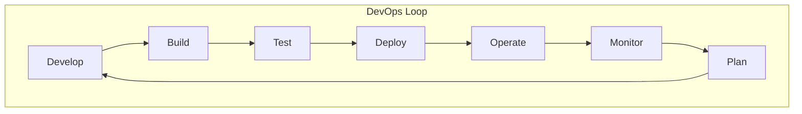
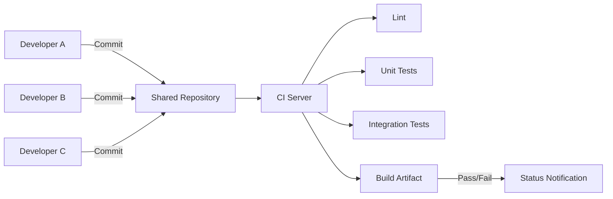
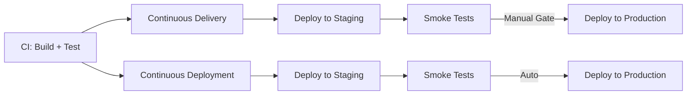
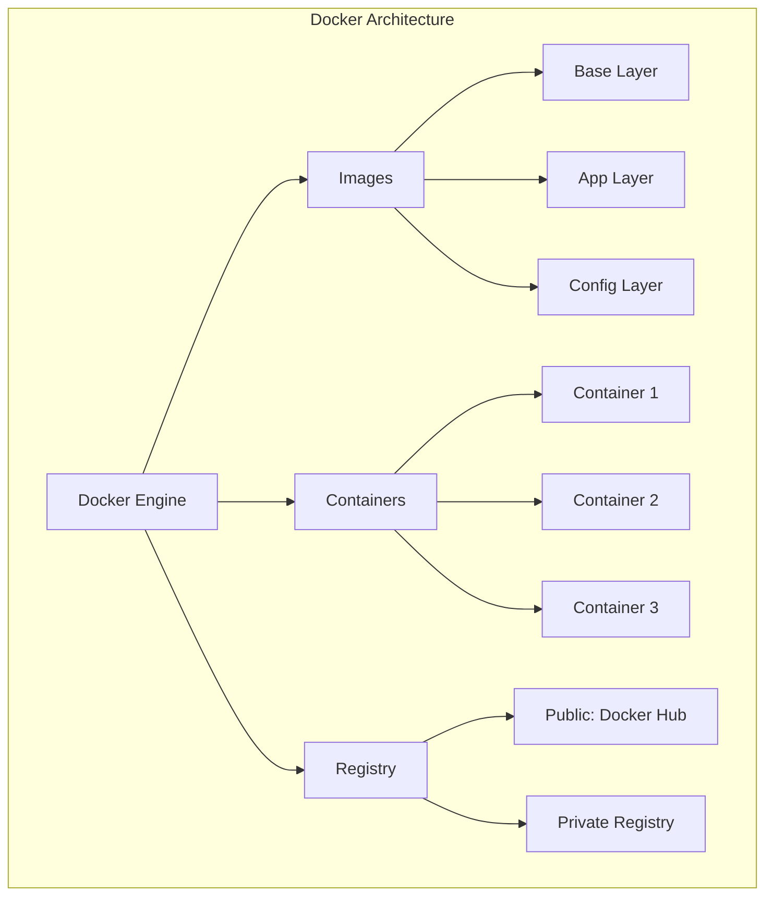
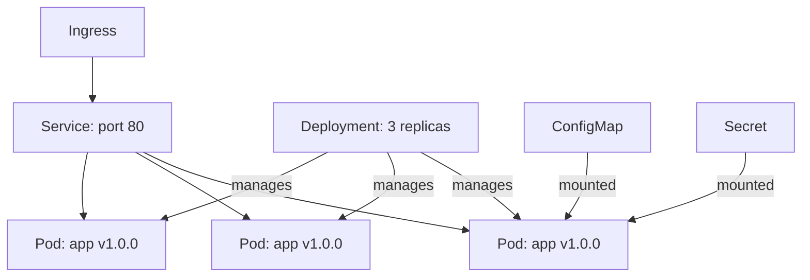
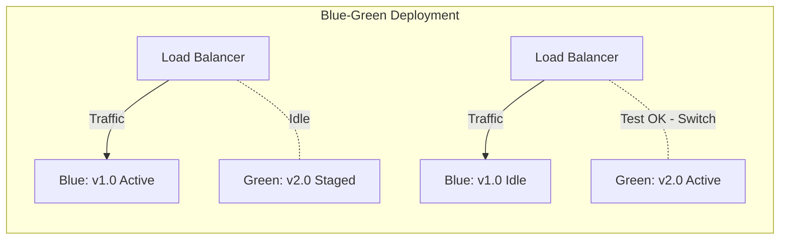

# DevOps and CI/CD

## Learning Objectives

After completing this chapter, the student will be able to:
- Explain DevOps principles and culture
- Implement a continuous integration pipeline with automated builds, tests, and linting
- Design a continuous delivery pipeline that deploys to staging environments
- Configure infrastructure as code using declarative approaches
- Apply containerisation with Docker and orchestration with Kubernetes
- Implement monitoring, logging, and observability
- Analyse deployment strategies: blue-green, canary, rolling
- Build a complete CI/CD pipeline in TypeScript

## Theory

### What is DevOps?

DevOps is a cultural and technical movement that bridges the gap between development (Dev) and operations (Ops). It emphasises automation, measurement, sharing, and short feedback loops to deliver software faster and more reliably.



**The Three Ways of DevOps (Gene Kim):**

| Way | Principle | Practice |
|-----|-----------|----------|
| **First Way** | Systems thinking (flow) | Small batches, CI/CD, trunk-based development |
| **Second Way** | Amplify feedback loops | Monitoring, alerting, blameless postmortems |
| **Third Way** | Culture of experimentation | Chaos engineering, fault injection, continuous improvement |

### Continuous Integration (CI)

CI is the practice of merging all developer code into a shared mainline multiple times per day, with each merge verified by an automated build and test suite.

**CI requirements:**
- Version control (Git)
- Automated build script
- Automated test suite
- CI server (Jenkins, GitHub Actions, GitLab CI)
- Fast feedback (< 10 minutes)



**CI best practices:**
1. Commit frequently (multiple times daily)
2. Keep the build fast (< 10 minutes)
3. Fix broken builds immediately (stop the line)
4. Run tests in isolation
5. Maintain a single source repository
6. Automate everything

### Continuous Delivery (CD)

Continuous Delivery ensures that every change passing all tests is potentially releasable to production. Continuous Deployment goes further — every passing change is automatically deployed.

| Practice | Frequency | Approval Gate |
|----------|-----------|---------------|
| **Continuous Integration** | Per commit | Build + test pass |
| **Continuous Delivery** | On demand (per commit) | Human approval |
| **Continuous Deployment** | Per commit (auto) | None (fully automated) |



### Infrastructure as Code (IaC)

IaC manages infrastructure (networks, VMs, load balancers) through machine-readable definition files rather than manual configuration.

| Tool | Language | State Management | Best For |
|------|----------|------------------|----------|
| **Terraform** | HCL (HashiCorp Language) | State file (remote) | Multi-cloud infrastructure |
| **Pulumi** | TypeScript, Python, Go, C# | State file (managed) | Developers wanting real languages |
| **AWS CDK** | TypeScript, Python, Java, C# | AWS CloudFormation | AWS-only infrastructure |
| **Ansible** | YAML playbooks | Agentless | Configuration management |
| **CloudFormation** | YAML/JSON | AWS-managed | AWS-native teams |

**IaC principles:**
- **Idempotency:** Running the same code produces the same result
- **Declarative:** Specify desired state, not steps to achieve it
- **Versioned:** Infrastructure code lives in version control
- **Reviewable:** Changes go through pull requests
- **Testable:** Infrastructure can be validated in CI

### Containerisation

Containers package an application with all its dependencies into a single, portable unit.



**Dockerfile example:**

```dockerfile
# Multi-stage build
FROM node:20-alpine AS builder
WORKDIR /app
COPY package*.json ./
RUN npm ci
COPY . .
RUN npm run build

FROM node:20-alpine AS runner
WORKDIR /app
COPY --from=builder /app/dist ./dist
COPY --from=builder /app/node_modules ./node_modules
COPY package*.json ./
EXPOSE 3000
CMD ["node", "dist/index.js"]
```

### Kubernetes (K8s)

Kubernetes is an open-source container orchestration platform.

| Resource | Purpose |
|----------|---------|
| **Pod** | Smallest deployable unit (one or more containers) |
| **Deployment** | Declares desired state for pods (replicas, updates) |
| **Service** | Stable network endpoint for a set of pods |
| **Ingress** | External HTTP/HTTPS routing to services |
| **ConfigMap** | Non-sensitive configuration data |
| **Secret** | Sensitive data (passwords, tokens) |
| **PersistentVolume** | Storage infrastructure |
| **Namespace** | Virtual cluster for resource isolation |



### Deployment Strategies

| Strategy | Description | Downtime | Rollback | Cost |
|----------|-------------|----------|----------|------|
| **Recreate** | Terminate old, deploy new | Yes | Re-deploy old | Low |
| **Rolling** | Gradually replace instances | No | Reverse the rollout | Medium |
| **Blue-Green** | Two identical environments, switch traffic | No | Switch back | High |
| **Canary** | Route small % of traffic to new version | No | Reroute traffic | Medium |
| **A/B Testing** | Route traffic based on user segments | No | Reroute | Medium |



### Monitoring and Observability

| Pillar | What it answers | Tools |
|--------|-----------------|-------|
| **Metrics** | What is happening? | Prometheus, Grafana, Datadog |
| **Logging** | Why is it happening? | ELK Stack, Loki, CloudWatch |
| **Tracing** | Where is it happening? | Jaeger, Zipkin, OpenTelemetry |
| **Alerting** | When should we care? | PagerDuty, OpsGenie, Alertmanager |

**The USE Method (Brendan Gregg):**
- **Utilisation:** Percentage of resource being used
- **Saturation:** Amount of queued work
- **Errors:** Count of error events

**Four Golden Signals (Google SRE):**
1. **Latency:** Time to serve a request
2. **Traffic:** Demand on the system
3. **Errors:** Rate of failed requests
4. **Saturation:** How "full" the service is

## Examples

### Example 1: GitHub Actions CI Pipeline

```yaml
name: CI Pipeline

on:
  push:
    branches: [main, develop]
  pull_request:
    branches: [main]

env:
  NODE_VERSION: '20'

jobs:
  lint:
    runs-on: ubuntu-latest
    steps:
      - uses: actions/checkout@v4
      - uses: actions/setup-node@v4
        with:
          node-version: ${{ env.NODE_VERSION }}
          cache: 'npm'
      - run: npm ci
      - run: npm run lint
      - run: npm run typecheck

  test:
    needs: lint
    runs-on: ubuntu-latest
    strategy:
      matrix:
        node-version: ['18', '20', '22']
    steps:
      - uses: actions/checkout@v4
      - uses: actions/setup-node@v4
        with:
          node-version: ${{ matrix.node-version }}
          cache: 'npm'
      - run: npm ci
      - run: npm test -- --coverage
      - uses: actions/upload-artifact@v4
        with:
          name: coverage-${{ matrix.node-version }}
          path: coverage/

  build:
    needs: test
    runs-on: ubuntu-latest
    steps:
      - uses: actions/checkout@v4
      - uses: actions/setup-node@v4
        with:
          node-version: ${{ env.NODE_VERSION }}
          cache: 'npm'
      - run: npm ci
      - run: npm run build
      - uses: actions/upload-artifact@v4
        with:
          name: build-artifact
          path: dist/
      - run: npm pack
      - uses: actions/upload-artifact@v4
        with:
          name: npm-package
          path: '*.tgz'
```

### Example 2: CD Pipeline with Deployment Strategies

```typescript
interface DeploymentConfig {
  serviceName: string;
  image: string;
  tag: string;
  replicas: number;
  strategy: 'rolling' | 'blue-green' | 'canary';
}

interface HealthCheckResponse {
  status: 'healthy' | 'unhealthy';
  responseTime: number;
}

class DeploymentManager {
  private currentVersion = '1.0.0';

  public async deploy(config: DeploymentConfig): Promise<boolean> {
    console.log(`Deploying ${config.serviceName}:${config.tag}`);

    switch (config.strategy) {
      case 'rolling':
        return this.rollingDeploy(config);
      case 'blue-green':
        return this.blueGreenDeploy(config);
      case 'canary':
        return this.canaryDeploy(config);
      default:
        throw new Error(`Unknown strategy: ${config.strategy}`);
    }
  }

  private async rollingDeploy(config: DeploymentConfig): Promise<boolean> {
    const batchSize = Math.max(1, Math.floor(config.replicas * 0.25));

    for (let i = 0; i < config.replicas; i += batchSize) {
      const batch = Math.min(batchSize, config.replicas - i);
      console.log(`Rolling update: updating ${batch} of ${config.replicas} pods`);

      await this.updateInstances(batch, config.image, config.tag);
      await this.drainOldConnections();

      if (!(await this.healthCheck())) {
        await this.rollback(config);
        return false;
      }
    }

    this.currentVersion = config.tag;
    console.log('Rolling update complete');
    return true;
  }

  private async blueGreenDeploy(config: DeploymentConfig): Promise<boolean> {
    // Deploy to green (inactive) environment
    const greenEnv = 'green';
    console.log(`Deploying to ${greenEnv} environment`);

    await this.deployToEnvironment(greenEnv, config.image, config.tag);

    if (!(await this.runSmokeTests(greenEnv))) {
      await this.destroyEnvironment(greenEnv);
      return false;
    }

    // Switch router to green
    await this.switchTraffic('green');
    console.log('Traffic switched to green environment');

    // Keep blue for rollback
    return true;
  }

  private async canaryDeploy(config: DeploymentConfig): Promise<boolean> {
    const phases = [
      { trafficPercent: 5, duration: 300000 },  // 5 min
      { trafficPercent: 25, duration: 600000 }, // 10 min
      { trafficPercent: 50, duration: 600000 }, // 10 min
      { trafficPercent: 100, duration: 0 },     // full
    ];

    for (const phase of phases) {
      console.log(`Canary: routing ${phase.trafficPercent}% traffic`);
      await this.setTrafficWeight(config.serviceName, phase.trafficPercent);

      if (phase.duration > 0) {
        await this.delay(phase.duration);
      }

      if (!(await this.monitorErrors(config.serviceName))) {
        console.log('Error rate exceeded threshold, rolling back');
        await this.setTrafficWeight(config.serviceName, 0);
        return false;
      }
    }

    console.log('Canary deployment successful - 100% traffic');
    this.currentVersion = config.tag;
    return true;
  }

  private async healthCheck(): Promise<boolean> {
    const result = await this.getHealthEndpoint();
    return result.status === 'healthy' && result.responseTime < 5000;
  }

  private async rollback(config: DeploymentConfig): Promise<void> {
    console.log(`Rolling back ${config.serviceName} to ${this.currentVersion}`);
  }

  // Simulated methods
  private async updateInstances(count: number, image: string, tag: string): Promise<void> {
    await this.delay(1000);
  }

  private async drainOldConnections(): Promise<void> {
    await this.delay(500);
  }

  private async deployToEnvironment(env: string, image: string, tag: string): Promise<void> {
    await this.delay(2000);
  }

  private async runSmokeTests(env: string): Promise<boolean> {
    await this.delay(1000);
    return Math.random() > 0.1;
  }

  private async destroyEnvironment(env: string): Promise<void> {
    await this.delay(500);
  }

  private async switchTraffic(env: string): Promise<void> {
    await this.delay(1000);
  }

  private async getHealthEndpoint(): Promise<HealthCheckResponse> {
    await this.delay(200);
    return { status: 'healthy', responseTime: 150 };
  }

  private async setTrafficWeight(service: string, percent: number): Promise<void> {
    await this.delay(500);
  }

  private async monitorErrors(service: string): Promise<boolean> {
    await this.delay(1000);
    const errorRate = Math.random();
    return errorRate < 0.05;
  }

  private delay(ms: number): Promise<void> {
    return new Promise((resolve) => setTimeout(resolve, ms));
  }
}
```

### Example 3: Infrastructure as Code (Pulumi TypeScript)

```typescript
import * as aws from '@pulumi/aws';
import * as pulumi from '@pulumi/pulumi';

interface ServiceStackConfig {
  environment: string;
  instanceCount: number;
  domainName: pulumi.Input<string>;
}

export class ServiceStack extends pulumi.ComponentResource {
  constructor(
    name: string,
    config: ServiceStackConfig,
    opts?: pulumi.ComponentResourceOptions
  ) {
    super('pai:platform:ServiceStack', name, {}, opts);

    // VPC
    const vpc = new aws.ec2.Vpc(`${name}-vpc`, {
      cidrBlock: '10.0.0.0/16',
      tags: { Name: `${name}-vpc`, Environment: config.environment },
    }, { parent: this });

    const subnet = new aws.ec2.Subnet(`${name}-subnet`, {
      vpcId: vpc.id,
      cidrBlock: '10.0.1.0/24',
      mapPublicIpOnLaunch: true,
    }, { parent: this });

    // Security group
    const sg = new aws.ec2.SecurityGroup(`${name}-sg`, {
      vpcId: vpc.id,
      ingress: [
        { protocol: 'tcp', fromPort: 80, toPort: 80, cidrBlocks: ['0.0.0.0/0'] },
        { protocol: 'tcp', fromPort: 443, toPort: 443, cidrBlocks: ['0.0.0.0/0'] },
      ],
      egress: [
        { protocol: '-1', fromPort: 0, toPort: 0, cidrBlocks: ['0.0.0.0/0'] },
      ],
    }, { parent: this });

    // Application Load Balancer
    const alb = new aws.lb.LoadBalancer(`${name}-alb`, {
      internal: false,
      loadBalancerType: 'application',
      subnets: [subnet.id],
      enableDeletionProtection: config.environment === 'production',
    }, { parent: this });

    const targetGroup = new aws.lb.TargetGroup(`${name}-tg`, {
      port: 80,
      protocol: 'HTTP',
      targetType: 'ip',
      vpcId: vpc.id,
      healthCheck: {
        enabled: true,
        path: '/health',
        interval: 30,
        healthyThreshold: 2,
        unhealthyThreshold: 5,
      },
    }, { parent: this });

    // ECS Cluster
    const cluster = new aws.ecs.Cluster(`${name}-cluster`, {}, { parent: this });

    const taskDefinition = new aws.ecs.TaskDefinition(`${name}-task`, {
      family: name,
      networkMode: 'awsvpc',
      requiresCompatibilities: ['FARGATE'],
      cpu: '256',
      memory: '512',
      containerDefinitions: JSON.stringify([
        {
          name: 'app',
          image: `${process.env.AWS_ACCOUNT_ID}.dkr.ecr.${process.env.AWS_REGION}.amazonaws.com/${name}:latest`,
          essential: true,
          portMappings: [{ containerPort: 80, hostPort: 80, protocol: 'tcp' }],
          environment: [
            { name: 'NODE_ENV', value: config.environment },
          ],
          logConfiguration: {
            logDriver: 'awslogs',
            options: {
              'awslogs-group': `/ecs/${name}`,
              'awslogs-region': process.env.AWS_REGION!,
              'awslogs-stream-prefix': 'ecs',
            },
          },
          healthCheck: {
            command: ['CMD-SHELL', 'curl -f http://localhost/health || exit 1'],
            interval: 30,
            timeout: 5,
            retries: 3,
          },
        },
      ]),
    }, { parent: this });

    const service = new aws.ecs.Service(`${name}-service`, {
      cluster: cluster.arn,
      taskDefinition: taskDefinition.arn,
      desiredCount: config.instanceCount,
      launchType: 'FARGATE',
      networkConfiguration: {
        assignPublicIp: true,
        subnets: [subnet.id],
        securityGroups: [sg.id],
      },
      loadBalancers: [{
        targetGroupArn: targetGroup.arn,
        containerName: 'app',
        containerPort: 80,
      }],
      deploymentCircuitBreaker: {
        enable: true,
        rollback: true,
      },
      deploymentMinimumHealthyPercent: 100,
      deploymentMaximumPercent: 200,
    }, { parent: this });

    // Outputs
    this.registerOutputs({
      loadBalancerDns: alb.dnsName,
      clusterArn: cluster.arn,
      serviceName: service.name,
    });
  }
}
```

### Example 4: Observability Stack

```typescript
// Structured logging
interface LogEntry {
  level: 'debug' | 'info' | 'warn' | 'error';
  message: string;
  timestamp: string;
  service: string;
  traceId?: string;
  spanId?: string;
  correlationId?: string;
  metadata?: Record<string, unknown>;
}

class StructuredLogger {
  private readonly service: string;

  constructor(service: string) {
    this.service = service;
  }

  public info(message: string, metadata?: Record<string, unknown>): void {
    this.emit({ level: 'info', message, metadata });
  }

  public error(message: string, error?: Error, metadata?: Record<string, unknown>): void {
    this.emit({
      level: 'error',
      message,
      metadata: {
        ...metadata,
        errorName: error?.name,
        errorMessage: error?.message,
        stackTrace: error?.stack,
      },
    });
  }

  public warn(message: string, metadata?: Record<string, unknown>): void {
    this.emit({ level: 'warn', message, metadata });
  }

  public debug(message: string, metadata?: Record<string, unknown>): void {
    this.emit({ level: 'debug', message, metadata });
  }

  private emit(entry: Omit<LogEntry, 'timestamp' | 'service'>): void {
    const logEntry: LogEntry = {
      ...entry,
      timestamp: new Date().toISOString(),
      service: this.service,
      traceId: process.env['TRACE_ID'],
      spanId: process.env['SPAN_ID'],
    };
    const output = JSON.stringify(logEntry);

    switch (entry.level) {
      case 'error':
        console.error(output);
        break;
      case 'warn':
        console.warn(output);
        break;
      default:
        console.log(output);
    }
  }
}

// Health check endpoint middleware
interface HealthCheckResult {
  status: 'healthy' | 'degraded' | 'unhealthy';
  checks: Record<string, { status: string; latency: number }>;
  uptime: number;
  version: string;
}

class HealthCheckRegistry {
  private checks: Map<string, () => Promise<boolean>> = new Map();
  private readonly startTime = Date.now();
  private readonly version: string;

  constructor(version: string) {
    this.version = version;
  }

  public register(name: string, check: () => Promise<boolean>): void {
    this.checks.set(name, check);
  }

  public async runAll(): Promise<HealthCheckResult> {
    const results: Record<string, { status: string; latency: number }> = {};
    let overallStatus: 'healthy' | 'degraded' | 'unhealthy' = 'healthy';

    for (const [name, check] of this.checks) {
      const start = Date.now();
      try {
        const passed = await check();
        const latency = Date.now() - start;
        results[name] = {
          status: passed ? 'pass' : 'fail',
          latency,
        };
        if (!passed) {
          overallStatus = 'degraded';
        }
      } catch {
        results[name] = { status: 'fail', latency: Date.now() - start };
        overallStatus = 'unhealthy';
      }
    }

    if (Object.values(results).some((r) => r.status === 'fail')) {
      overallStatus = 'unhealthy';
    }

    return {
      status: overallStatus,
      checks: results,
      uptime: Date.now() - this.startTime,
      version: this.version,
    };
  }
}
```

### Example 5: Docker Multi-Stage Build Script

```dockerfile
# Stage 1: Build
FROM node:20-alpine AS builder
WORKDIR /build

# Cache dependencies
COPY package.json package-lock.json ./
RUN npm ci --only=production && cp -R node_modules /prod_modules
RUN npm ci

# Build application
COPY tsconfig.json ./
COPY src/ ./src/
RUN npm run build

# Stage 2: Production
FROM node:20-alpine
RUN addgroup -S appgroup && adduser -S appuser -G appgroup
WORKDIR /app

# Copy production dependencies and built code
COPY --from=builder /prod_modules ./node_modules
COPY --from=builder /build/dist ./dist
COPY package.json ./

USER appuser
EXPOSE 3000

HEALTHCHECK --interval=30s --timeout=3s --start-period=5s --retries=3 \
  CMD wget --no-verbose --tries=1 --spider http://localhost:3000/health || exit 1

ENV NODE_ENV=production
CMD ["node", "dist/index.js"]
```

## Summary

DevOps bridges development and operations through culture, automation, and measurement. CI integrates code changes frequently with automated builds and tests. CD extends this to automated deployment. Infrastructure as Code manages infrastructure through version-controlled definition files. Containerisation with Docker and orchestration with Kubernetes provide portable, scalable deployment. Deployment strategies (rolling, blue-green, canary) balance speed and safety. Observability through metrics, logging, tracing, and alerting provides system understanding. A complete DevOps pipeline automates the entire flow from commit to production with quality gates at each stage.

## Practical Takeaways

1. **CI/CD is not optional** — manual deployment is the #1 source of production incidents
2. **Build once, deploy many** — the same artifact moves through all environments
3. **Fail fast** — the earlier a defect is caught, the cheaper it is to fix
4. **Infrastructure is code** — everything should be in version control
5. **Observability over monitoring** — understand WHY, not just WHAT
6. **Rollback is a feature** — every deployment must have a tested rollback plan

## Chapter Quiz

**Q1: What does CI stand for in DevOps?**
- A) Continuous Implementation
- B) Continuous Integration
- C) Code Integration
- D) Compiler Integration

**Answer: B** — Continuous Integration is the practice of merging code frequently with automated verification.

**Q2: In Gene Kim's Three Ways of DevOps, the First Way emphasises:**
- A) Feedback loops
- B) Systems thinking and flow
- C) Experimentation culture
- D) Security

**Answer: B** — The First Way focuses on the flow of work from development to operations.

**Q3: Which deployment strategy involves maintaining two identical environments and switching traffic between them?**
- A) Rolling
- B) Canary
- C) Blue-Green
- D) Recreate

**Answer: C** — Blue-Green maintains two environments and switches the load balancer.

**Q4: Which IaC tool allows you to write infrastructure definitions in TypeScript?**
- A) Terraform
- B) Ansible
- C) Pulumi
- D) CloudFormation

**Answer: C** — Pulumi supports TypeScript, Python, Go, and C#.

**Q5: The four golden signals of monitoring are:**
- A) CPU, Memory, Disk, Network
- B) Latency, Traffic, Errors, Saturation
- C) Build, Test, Deploy, Monitor
- D) Uptime, Reliability, Performance, Security

**Answer: B** — These four signals comprehensively describe service health from Google SRE.

### TypeScript: DevOps Tools

```typescript
// === CI/CD Pipeline Validator ===
interface PipelineStage {
  name: string;
  required: boolean;
  duration: number;
  dependsOn: string[];
  passed: boolean;
}
function validatePipeline(stages: PipelineStage[]): { ready: boolean; blockages: string[] } {
  const blockages: string[] = [];
  for (const stage of stages) {
    const depsMet = stage.dependsOn.every((dep) => stages.find((s) => s.name === dep)?.passed);
    if (!stage.passed && stage.required && depsMet) blockages.push(`${stage.name} failed`);
    if (!depsMet) blockages.push(`${stage.name} blocked by: ${stage.dependsOn.filter((d) => !stages.find((s) => s.name === d)?.passed).join(", ")}`);
  }
  return { ready: blockages.length === 0, blockages };
}
const pipeline: PipelineStage[] = [
  { name: "Lint", required: true, duration: 1, dependsOn: [], passed: true },
  { name: "Build", required: true, duration: 3, dependsOn: ["Lint"], passed: true },
  { name: "Unit Tests", required: true, duration: 5, dependsOn: ["Build"], passed: false },
  { name: "Integration Tests", required: true, duration: 8, dependsOn: ["Unit Tests"], passed: false },
  { name: "Deploy", required: false, duration: 2, dependsOn: ["Integration Tests"], passed: false },
];
console.log(validatePipeline(pipeline));

// === Deployment Risk Scorer ===
interface DeployRisk {
  factor: string;
  weight: number;
  score: number;
}
function assessDeploymentRisk(risks: DeployRisk[]): { total: number; severity: "low" | "medium" | "high" } {
  const total = risks.reduce((s, r) => s + r.weight * r.score, 0) / risks.reduce((s, r) => s + r.weight, 0);
  const severity = total < 3 ? "low" : total < 7 ? "medium" : "high";
  return { total: Math.round(total * 10) / 10, severity };
}
const deployRisks: DeployRisk[] = [
  { factor: "Changes LOC", weight: 3, score: 4 },
  { factor: "Files modified", weight: 2, score: 6 },
  { factor: "New dependencies", weight: 4, score: 2 },
  { factor: "Database changes", weight: 5, score: 8 },
  { factor: "Previous rollbacks", weight: 3, score: 1 },
];
console.log(assessDeploymentRisk(deployRisks));

// === Rollback Checker ===
interface DeploymentRecord {
  version: string;
  timestamp: Date;
  healthy: boolean;
  duration: number;
}
function canRollback(history: DeploymentRecord[]): { possible: boolean; target?: string; reason?: string } {
  if (history.length < 2) return { possible: false, reason: "No previous deployment to rollback to" };
  const lastHealthy = [...history].reverse().find((d, i) => d.healthy && i > 0);
  if (!lastHealthy) return { possible: false, reason: "No healthy previous deployment found" };
  return { possible: true, target: lastHealthy.version };
}
const deployHistory: DeploymentRecord[] = [
  { version: "v2.0", timestamp: new Date(), healthy: false, duration: 300 },
  { version: "v1.9", timestamp: new Date(Date.now() - 3600000), healthy: true, duration: 280 },
  { version: "v1.8", timestamp: new Date(Date.now() - 7200000), healthy: true, duration: 260 },
];
console.log(canRollback(deployHistory));

// === SLI / SLO / Error Budget Calculator ===
function errorBudget(sli: number, slo: number, windowDays: number): { remaining: number; consumed: number; budgetDaysLeft: number } {
  const allowedErrors = (1 - slo / 100) * windowDays * 24 * 60;
  const actualErrors = (1 - sli / 100) * windowDays * 24 * 60;
  const remaining = Math.max(0, allowedErrors - actualErrors);
  const consumed = (actualErrors / allowedErrors) * 100;
  const budgetDaysLeft = allowedErrors > 0 ? (remaining / (actualErrors / windowDays)) : windowDays;
  return {
    remaining: Math.round(remaining),
    consumed: Math.round(consumed * 10) / 10,
    budgetDaysLeft: Math.round(budgetDaysLeft * 10) / 10,
  };
}
console.log(errorBudget(99.5, 99.9, 30));

// === Dockerfile Best Practice Checker ===
function checkDockerfile(content: string): string[] {
  const issues: string[] = [];
  const lines = content.split("\n").map((l) => l.trim());
  if (!lines.some((l) => l.startsWith("FROM "))) issues.push("Missing FROM instruction");
  if (lines.some((l) => l.startsWith("FROM ") && l.includes(":latest"))) issues.push("Avoid :latest tag in production");
  if (!lines.some((l) => l.startsWith("EXPOSE "))) issues.push("Missing EXPOSE instruction");
  if (!lines.some((l) => l.startsWith("HEALTHCHECK"))) issues.push("Missing HEALTHCHECK");
  return issues;
}
console.log(checkDockerfile("FROM node:18\nWORKDIR /app\nCOPY . .\nCMD npm start"));

// === Canary Analyzer ===
function analyzeCanary(canaryErrors: number, canaryTotal: number, baselineErrors: number, baselineTotal: number): { increase: number; rollback: boolean } {
  const canaryRate = canaryTotal > 0 ? canaryErrors / canaryTotal : 0;
  const baselineRate = baselineTotal > 0 ? baselineErrors / baselineTotal : 0;
  const increase = baselineRate > 0 ? (canaryRate - baselineRate) / baselineRate * 100 : canaryRate * 100;
  return { increase: Math.round(increase * 100) / 100, rollback: increase > 50 };
}
console.log(analyzeCanary(5, 1000, 2, 1000)); // 150% increase, rollback
```

### TypeScript: Pipeline & Deployment Tools

```typescript
// === CI/CD Pipeline Simulator ===
interface Stage { name: string; duration: number; dependsOn: string[]; status: "pending" | "running" | "passed" | "failed"; }
class PipelineSimulator {
  private stages: Map<string, Stage> = new Map();
  
  addStage(name: string, duration: number, dependsOn: string[] = []): void {
    this.stages.set(name, { name, duration, dependsOn, status: "pending" });
  }

  async run(): Promise<{ totalTime: number; results: Record<string, string> }> {
    const start = Date.now();
    const results: Record<string, string> = {};
    
    const runStage = async (name: string): Promise<void> => {
      const stage = this.stages.get(name)!;
      const deps = stage.dependsOn.map(d => this.stages.get(d)!);
      await Promise.all(deps.filter(d => d.status !== "passed").map(d => runStage(d.name)));
      stage.status = "running";
      await new Promise(r => setTimeout(r, stage.duration));
      stage.status = "passed";
      results[name] = "passed";
    };

    const entryStages = [...this.stages.values()].filter(s => s.dependsOn.length === 0);
    await Promise.all(entryStages.map(s => runStage(s.name)));
    return { totalTime: Date.now() - start, results };
  }
}

// === Deployment Risk Calculator ===
interface Deployment { version: string; time: Date; success: boolean; rollbackTime?: number; }
function calculateDeploymentRisk(deployments: Deployment[]): { failureRate: number; avgRecovery: number; recommendation: string } {
  const failures = deployments.filter(d => !d.success);
  const failureRate = Math.round((failures.length / deployments.length) * 100);
  const rollbacks = failures.filter(f => f.rollbackTime !== undefined);
  const avgRecovery = rollbacks.length > 0
    ? Math.round(rollbacks.reduce((s, r) => s + (r.rollbackTime ?? 0), 0) / rollbacks.length)
    : 0;
  const recommendation = failureRate > 10 ? "Improve testing" : failureRate > 5 ? "Monitor closely" : "Acceptable";
  return { failureRate, avgRecovery, recommendation };
}

// === Canary Release Manager ===
class CanaryManager {
  constructor(private initialWeight = 100, private stepSize = 25, private intervalMs = 60000) {}
  private currentWeight = this.initialWeight;

  async rollout(): Promise<{ phase: number; weight: number; stable: boolean }[]> {
    const phases: { phase: number; weight: number; stable: boolean }[] = [];
    let phase = 0;
    while (this.currentWeight > 0) {
      this.currentWeight = Math.max(0, this.currentWeight - this.stepSize);
      phase++;
      const stable = this.currentWeight === 0;
      phases.push({ phase, weight: this.currentWeight, stable });
      await new Promise(r => setTimeout(r, 10));
    }
    return phases;
  }
}

// === SLA Calculator ===
function calculateUptime(downtimeMinutes: number, periodDays = 30): string {
  const totalMinutes = periodDays * 24 * 60;
  const uptime = ((totalMinutes - downtimeMinutes) / totalMinutes) * 100;
  return `${uptime.toFixed(3)}%`;
}

console.log(calculateUptime(43.2)); // 99.9% (three nines)
const canary = new CanaryManager(100, 25);
console.log(canary.rollout());
```

## Exercises

### Review Questions

1. What are the Three Ways of DevOps?
2. How does continuous delivery differ from continuous deployment?
3. What is the difference between declarative and imperative IaC approaches? Give examples.
4. Describe the blue-green deployment strategy and its advantages.
5. What are the four golden signals of monitoring?
6. What is the USE method for resource analysis?

### Application Problems

1. Design a CI pipeline for a microservices project with 10 services. Specify tools, stages, parallelisation strategy, and feedback mechanisms.

2. Write a Dockerfile for a Java Spring Boot application that uses multi-stage builds to minimise final image size.

3. Design a canary deployment plan for a critical payment service. Specify traffic percentages, duration of each phase, rollback criteria, and monitoring thresholds.

### Challenge Problem

A legacy monolithic application is deployed manually once per month by a senior operations engineer who is leaving the company. There are no automated tests, no CI, and no on-call monitoring. Infrastructure is configured manually in the AWS console. Design a six-month DevOps transformation plan. Address containerisation of the monolith, automated test adoption, CI pipeline construction, IaC for all infrastructure, blue-green deployment setup, monitoring and alerting with Prometheus and Grafana, and a runbook for incidents. Implement a TypeScript program that models the transformation milestones and tracks dependencies between initiatives.

