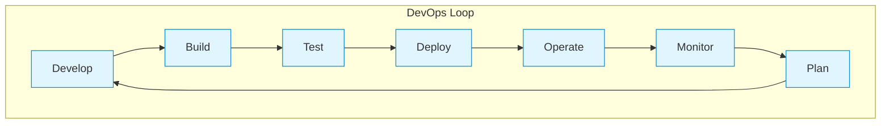
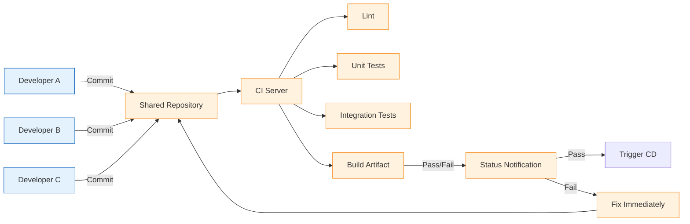
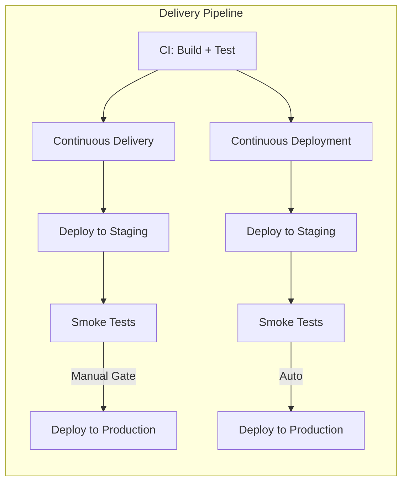
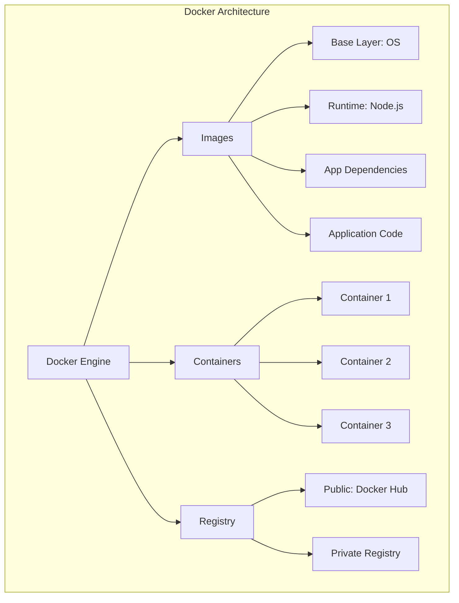
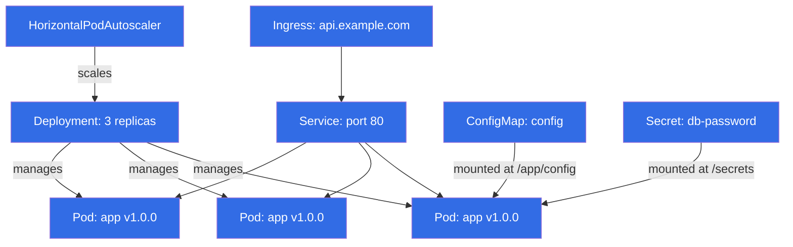
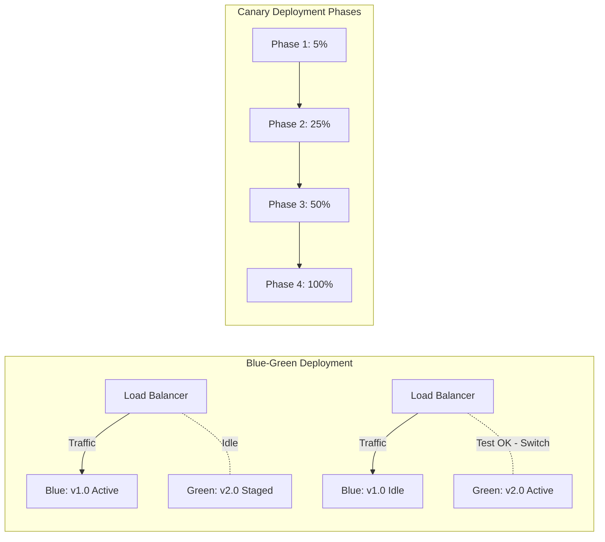

# DevOps and CI/CD

## Learning Objectives

- [x] Explain DevOps principles, culture, and the CALMS framework
- [x] Implement a continuous integration pipeline with automated builds, tests, and linting
- [x] Design a continuous delivery pipeline that deploys to staging and production environments
- [x] Configure infrastructure as code using Terraform, Pulumi, and CloudFormation
- [x] Apply containerisation with Docker multi-stage builds and Docker Compose
- [x] Implement observability with logging, metrics, tracing, and alerting
- [x] Analyse deployment strategies: blue-green, canary, rolling
- [x] Build production-grade DevOps tools in TypeScript (CICDPipeline, DockerfileGenerator, ObservabilityStack)

## Theory

### What is DevOps?

<a href="../../../assets/images/diagrams/software-engineering/12-devops-cicd/what-is-devops-handwritten.svg" target="_blank" rel="noopener">
  
</a>
<a href="../../../assets/images/diagrams/software-engineering/12-devops-cicd/what-is-devops-diagram.svg" target="_blank" rel="noopener">
  
</a>
<a href="../../../assets/images/diagrams/software-engineering/12-devops-cicd/what-is-devops-sticky.svg" target="_blank" rel="noopener">
  
</a>


DevOps is a cultural and technical movement that bridges the gap between development (Dev) and operations (Ops). It emphasises automation, measurement, sharing, and short feedback loops to deliver software faster and more reliably.



### The Three Ways of DevOps (Gene Kim)

<a href="../../../assets/images/diagrams/software-engineering/12-devops-cicd/the-three-ways-of-devops-gene-kim-handwritten.svg" target="_blank" rel="noopener">
  
</a>
<a href="../../../assets/images/diagrams/software-engineering/12-devops-cicd/the-three-ways-of-devops-gene-kim-diagram.svg" target="_blank" rel="noopener">
  
</a>
<a href="../../../assets/images/diagrams/software-engineering/12-devops-cicd/the-three-ways-of-devops-gene-kim-sticky.svg" target="_blank" rel="noopener">
  
</a>


| Way | Principle | Practice | Anti-Pattern |
|-----|-----------|----------|--------------|
| **First Way** | Systems thinking (flow) | Small batches, CI/CD, trunk-based development | Handoffs, large batches, silos |
| **Second Way** | Amplify feedback loops | Monitoring, alerting, blameless postmortems | Ignoring metrics, finger-pointing |
| **Third Way** | Culture of experimentation | Chaos engineering, fault injection, continuous improvement | Fear of change, risk aversion |

### The CALMS Framework

<a href="../../../assets/images/diagrams/software-engineering/12-devops-cicd/the-calms-framework-handwritten.svg" target="_blank" rel="noopener">
  
</a>
<a href="../../../assets/images/diagrams/software-engineering/12-devops-cicd/the-calms-framework-diagram.svg" target="_blank" rel="noopener">
  
</a>
<a href="../../../assets/images/diagrams/software-engineering/12-devops-cicd/the-calms-framework-sticky.svg" target="_blank" rel="noopener">
  
</a>


CALMS is a framework for assessing DevOps adoption across five dimensions:

| Dimension | Description | Maturity Indicators |
|-----------|-------------|-------------------|
| **C**ulture | Collaborative, shared responsibility | Blameless postmortems, cross-functional teams, trust |
| **A**utomation | Automate everything possible | CI/CD pipelines, IaC, automated testing, self-service platforms |
| **L**ean | Flow efficiency, eliminate waste | WIP limits, small batches, value stream mapping, pull systems |
| **M**easurement | Data-driven decisions | Four golden signals, DORA metrics, error budgets, dashboards |
| **S**haring | Knowledge sharing across teams | ChatOps, documentation, internal open source, guilds |

**DORA Metrics (key DevOps measurements):**

| Metric | Elite | High | Medium | Low |
|--------|-------|------|--------|-----|
| **Deployment Frequency** | Multiple times/day | Weekly-monthly | Monthly-every 6 months | < every 6 months |
| **Lead Time for Changes** | < 1 hour | 1 day-1 week | 1 week-1 month | > 6 months |
| **Change Failure Rate** | < 5% | < 10% | < 15% | > 30% |
| **Time to Restore Service** | < 1 hour | < 1 day | < 1 day | > 1 week |

### Continuous Integration (CI)

<a href="../../../assets/images/diagrams/software-engineering/12-devops-cicd/continuous-integration-ci-handwritten.svg" target="_blank" rel="noopener">
  
</a>
<a href="../../../assets/images/diagrams/software-engineering/12-devops-cicd/continuous-integration-ci-diagram.svg" target="_blank" rel="noopener">
  
</a>
<a href="../../../assets/images/diagrams/software-engineering/12-devops-cicd/continuous-integration-ci-sticky.svg" target="_blank" rel="noopener">
  
</a>


CI is the practice of merging all developer code into a shared mainline multiple times per day, with each merge verified by an automated build and test suite.

**CI requirements:**
- Version control (Git)
- Automated build script
- Automated test suite
- CI server (Jenkins, GitHub Actions, GitLab CI)
- Fast feedback (< 10 minutes)



**CI best practices:**
1. Commit frequently (multiple times daily)
2. Keep the build fast (< 10 minutes)
3. Fix broken builds immediately (stop the line)
4. Run tests in isolation (containers)
5. Maintain a single source repository
6. Automate everything — no manual steps

### Continuous Delivery (CD)

<a href="../../../assets/images/diagrams/software-engineering/12-devops-cicd/continuous-delivery-cd-handwritten.svg" target="_blank" rel="noopener">
  
</a>
<a href="../../../assets/images/diagrams/software-engineering/12-devops-cicd/continuous-delivery-cd-diagram.svg" target="_blank" rel="noopener">
  
</a>
<a href="../../../assets/images/diagrams/software-engineering/12-devops-cicd/continuous-delivery-cd-sticky.svg" target="_blank" rel="noopener">
  
</a>


Continuous Delivery ensures that every change passing all tests is potentially releasable to production. Continuous Deployment goes further — every passing change is automatically deployed.

| Practice | Frequency | Approval Gate | Risk Level |
|----------|-----------|---------------|------------|
| **Continuous Integration** | Per commit | Build + test pass | Low |
| **Continuous Delivery** | On demand (per commit) | Human approval | Medium |
| **Continuous Deployment** | Per commit (auto) | None (fully automated) | High (requires confidence) |



### Infrastructure as Code (IaC)

<a href="../../../assets/images/diagrams/software-engineering/12-devops-cicd/infrastructure-as-code-iac-handwritten.svg" target="_blank" rel="noopener">
  
</a>
<a href="../../../assets/images/diagrams/software-engineering/12-devops-cicd/infrastructure-as-code-iac-diagram.svg" target="_blank" rel="noopener">
  
</a>
<a href="../../../assets/images/diagrams/software-engineering/12-devops-cicd/infrastructure-as-code-iac-sticky.svg" target="_blank" rel="noopener">
  
</a>


IaC manages infrastructure (networks, VMs, load balancers) through machine-readable definition files rather than manual configuration.

| Tool | Language | State Management | Best For | Type |
|------|----------|------------------|----------|------|
| **Terraform** | HCL (HashiCorp Language) | State file (remote) | Multi-cloud infrastructure | Declarative |
| **Pulumi** | TypeScript, Python, Go, C# | State file (managed) | Developers wanting real languages | Declarative |
| **AWS CDK** | TypeScript, Python, Java, C# | AWS CloudFormation | AWS-only infrastructure | Imperative → Declarative |
| **Ansible** | YAML playbooks | Agentless | Configuration management | Imperative |
| **CloudFormation** | YAML/JSON | AWS-managed | AWS-native teams | Declarative |
| **Chef** | Ruby DSL | Chef Server | Config mgmt at scale | Imperative |
| **Puppet** | Puppet DSL | Puppet Server | Config mgmt | Declarative |

**IaC principles:**
- **Idempotency:** Running the same code produces the same result
- **Declarative:** Specify desired state, not steps to achieve it
- **Versioned:** Infrastructure code lives in version control
- **Reviewable:** Changes go through pull requests
- **Testable:** Infrastructure can be validated in CI (Terratest, tflint)

### Containerisation

<a href="../../../assets/images/diagrams/software-engineering/12-devops-cicd/containerisation-handwritten.svg" target="_blank" rel="noopener">
  
</a>
<a href="../../../assets/images/diagrams/software-engineering/12-devops-cicd/containerisation-diagram.svg" target="_blank" rel="noopener">
  
</a>
<a href="../../../assets/images/diagrams/software-engineering/12-devops-cicd/containerisation-sticky.svg" target="_blank" rel="noopener">
  
</a>


Containers package an application with all its dependencies into a single, portable unit.



**Multi-stage builds** separate build-time dependencies from runtime, producing smaller, more secure images:

```
Single-stage: 1.2 GB
Multi-stage:  120 MB (90% reduction)
```

**Dockerfile best practices:**
1. Use specific base image tags (not `:latest`)
2. Multi-stage builds to minimise size
3. Order instructions from least to most frequently changing
4. Use `.dockerignore` to exclude unnecessary files
5. Run as non-root user
6. Add HEALTHCHECK instruction
7. Use layer caching effectively
8. Scan images for vulnerabilities

### Container Orchestration (Kubernetes)

<a href="../../../assets/images/diagrams/software-engineering/12-devops-cicd/container-orchestration-kubernetes-handwritten.svg" target="_blank" rel="noopener">
  
</a>
<a href="../../../assets/images/diagrams/software-engineering/12-devops-cicd/container-orchestration-kubernetes-diagram.svg" target="_blank" rel="noopener">
  
</a>
<a href="../../../assets/images/diagrams/software-engineering/12-devops-cicd/container-orchestration-kubernetes-sticky.svg" target="_blank" rel="noopener">
  
</a>


Kubernetes is an open-source container orchestration platform.

| Resource | Purpose | Example |
|----------|---------|---------|
| **Pod** | Smallest deployable unit (one or more containers) | `nginx:1.25` |
| **Deployment** | Declares desired state for pods (replicas, updates) | 3 replicas, rolling update |
| **Service** | Stable network endpoint for a set of pods | ClusterIP, LoadBalancer |
| **Ingress** | External HTTP/HTTPS routing to services | Path-based routing |
| **ConfigMap** | Non-sensitive configuration data | `app.properties` |
| **Secret** | Sensitive data (passwords, tokens) | Base64-encoded, encrypted at rest |
| **PersistentVolume** | Storage infrastructure | NFS, EBS, GCE PD |
| **Namespace** | Virtual cluster for resource isolation | `dev`, `staging`, `prod` |
| **HPA** | Horizontal Pod Autoscaler | Scale by CPU/memory/custom metrics |



### Deployment Strategies

<a href="../../../assets/images/diagrams/software-engineering/12-devops-cicd/deployment-strategies-handwritten.svg" target="_blank" rel="noopener">
  
</a>
<a href="../../../assets/images/diagrams/software-engineering/12-devops-cicd/deployment-strategies-diagram.svg" target="_blank" rel="noopener">
  
</a>
<a href="../../../assets/images/diagrams/software-engineering/12-devops-cicd/deployment-strategies-sticky.svg" target="_blank" rel="noopener">
  
</a>


| Strategy | Description | Downtime | Rollback | Cost | Complexity |
|----------|-------------|----------|----------|------|------------|
| **Recreate** | Terminate old, deploy new | Yes | Re-deploy old | Low | Low |
| **Rolling** | Gradually replace instances | No | Reverse the rollout | Medium | Low |
| **Blue-Green** | Two identical environments, switch traffic | No | Switch back | High | Medium |
| **Canary** | Route small % of traffic to new version | No | Reroute traffic | Medium | High |
| **A/B Testing** | Route traffic based on user segments | No | Reroute | Medium | High |



### Monitoring and Observability

<a href="../../../assets/images/diagrams/software-engineering/12-devops-cicd/monitoring-and-observability-handwritten.svg" target="_blank" rel="noopener">
  
</a>
<a href="../../../assets/images/diagrams/software-engineering/12-devops-cicd/monitoring-and-observability-diagram.svg" target="_blank" rel="noopener">
  
</a>
<a href="../../../assets/images/diagrams/software-engineering/12-devops-cicd/monitoring-and-observability-sticky.svg" target="_blank" rel="noopener">
  
</a>


**Observability pillars:**

| Pillar | What it answers | Tools | Data Type |
|--------|-----------------|-------|-----------|
| **Metrics** | What is happening? | Prometheus, Grafana, Datadog | Time-series numbers |
| **Logging** | Why is it happening? | ELK Stack, Loki, CloudWatch | Structured/unstructured text |
| **Tracing** | Where is it happening? | Jaeger, Zipkin, OpenTelemetry | Distributed request paths |
| **Alerting** | When should we care? | PagerDuty, OpsGenie, Alertmanager | Thresholds + notifications |

**The USE Method (Brendan Gregg) for resource analysis:**
- **Utilisation:** Percentage of resource being used (e.g., CPU 75%)
- **Saturation:** Amount of queued work (e.g., run queue length)
- **Errors:** Count of error events (e.g., network interface errors)

**Four Golden Signals (Google SRE):**
1. **Latency:** Time to serve a request (p50, p95, p99)
2. **Traffic:** Demand on the system (requests/second, active users)
3. **Errors:** Rate of failed requests (5xx, 4xx, exceptions)
4. **Saturation:** How "full" the service is (CPU, memory, connections)

**SRE Concepts:**

| Term | Definition | Formula |
|------|------------|---------|
| **SLI (Service Level Indicator)** | Actual measurement of service level | Request latency p99 |
| **SLO (Service Level Objective)** | Target value for SLI | p99 < 200ms, 99.9% of time |
| **SLA (Service Level Agreement)** | Contractual commitment to customer | 99.9% uptime, credits for breach |
| **Error Budget** | Allowed time of SLO violation | 100% - SLO = 0.1% (43.2 min/month) |

### Security in DevOps (DevSecOps)

<a href="../../../assets/images/diagrams/software-engineering/12-devops-cicd/security-in-devops-devsecops-handwritten.svg" target="_blank" rel="noopener">
  
</a>
<a href="../../../assets/images/diagrams/software-engineering/12-devops-cicd/security-in-devops-devsecops-diagram.svg" target="_blank" rel="noopener">
  
</a>
<a href="../../../assets/images/diagrams/software-engineering/12-devops-cicd/security-in-devops-devsecops-sticky.svg" target="_blank" rel="noopener">
  
</a>


Shift security left — integrate security into every stage of DevOps:

| Stage | Security Practice | Tools |
|-------|-------------------|-------|
| **Code** | SAST, secrets scanning | CodeQL, Semgrep, git-secrets |
| **Build** | SCA, dependency scanning | Snyk, npm audit, OWASP DC |
| **Test** | DAST, fuzzing | OWASP ZAP, Burp Suite |
| **Deploy** | Image scanning, policy as code | Trivy, Clair, OPA |
| **Run** | RASP, runtime monitoring | Falco, Sysdig |

## Examples

### Example 1: CICDPipeline — Build, Test, Deploy Stages with Gates

A complete CI/CD pipeline implementation with stage management, parallel execution, quality gates, artifacts, deployment strategies, and rollback support.

```typescript
interface PipelineConfig {
  name: string;
  repository: string;
  branch: string;
  buildCommand: string;
  testCommand: string;
  artifactPath: string;
}

interface PipelineStage {
  name: string;
  type: 'build' | 'test' | 'quality' | 'deploy' | 'approval' | 'notify';
  run: (context: PipelineContext) => Promise<StageResult>;
  timeout: number;
  retries: number;
  required: boolean;
  dependsOn: string[];
}

interface StageResult {
  passed: boolean;
  output: string;
  duration: number;
  artifacts?: string[];
  metrics?: Record<string, number>;
}

interface PipelineContext {
  buildId: string;
  commitHash: string;
  branch: string;
  version: string;
  environment: string;
  startTime: Date;
  variables: Map<string, string>;
}

interface PipelineResult {
  pipelineName: string;
  buildId: string;
  passed: boolean;
  stages: { name: string; passed: boolean; duration: number; output: string }[];
  totalDuration: number;
  artifactUrl?: string;
  failedStage?: string;
}

class CICDPipeline {
  private stages: PipelineStage[] = [];
  private context: PipelineContext;

  constructor(config: PipelineConfig) {
    this.context = {
      buildId: `build-${Date.now()}-${Math.random().toString(36).substring(2, 8)}`,
      commitHash: process.env['GIT_COMMIT'] || 'unknown',
      branch: config.branch,
      version: '0.0.0',
      environment: 'development',
      startTime: new Date(),
      variables: new Map(),
    };
  }

  public addStage(stage: PipelineStage): void {
    this.stages.push(stage);
  }

  public setVersion(version: string): void {
    this.context.version = version;
  }

  public setEnvironment(env: string): void {
    this.context.environment = env;
  }

  public async execute(): Promise<PipelineResult> {
    const overallStart = Date.now();
    const stageResults: { name: string; passed: boolean; duration: number; output: string }[] = [];
    const completed = new Set<string>();

    const executeStage = async (stage: PipelineStage): Promise<void> => {
      if (completed.has(stage.name)) return;

      // Wait for dependencies
      for (const dep of stage.dependsOn) {
        const depStage = this.stages.find(s => s.name === dep);
        if (depStage) await executeStage(depStage);
      }

      // Check if all dependencies passed
      const failedDeps = stage.dependsOn.filter(d =>
        stageResults.find(r => r.name === d && !r.passed)
      );
      if (failedDeps.length > 0) {
        stageResults.push({
          name: stage.name, passed: false,
          duration: 0, output: `Skipped: dependencies ${failedDeps.join(', ')} failed`,
        });
        completed.add(stage.name);
        return;
      }

      const stageStart = Date.now();
      let lastError: Error | undefined;

      for (let attempt = 0; attempt <= stage.retries; attempt++) {
        try {
          const timeout = new Promise<never>((_, reject) =>
            setTimeout(() => reject(new Error('Timeout')), stage.timeout)
          );
          const result = await Promise.race([
            stage.run(this.context),
            timeout,
          ]) as StageResult;

          stageResults.push({
            name: stage.name,
            passed: result.passed,
            duration: Date.now() - stageStart,
            output: result.output,
          });

          if (result.passed) {
            completed.add(stage.name);
            return;
          }
          lastError = new Error(result.output);
        } catch (err) {
          lastError = err instanceof Error ? err : new Error(String(err));
          if (attempt < stage.retries) {
            await new Promise(r => setTimeout(r, 1000 * Math.pow(2, attempt)));
          }
        }
      }

      // All retries failed
      if (stage.required) {
        stageResults.push({
          name: stage.name, passed: false,
          duration: Date.now() - stageStart,
          output: lastError?.message || 'Unknown error',
        });
        completed.add(stage.name);
      }
    };

    // Execute entry-point stages (those without dependencies) in parallel
    const entryStages = this.stages.filter(s => s.dependsOn.length === 0);
    await Promise.all(entryStages.map(s => executeStage(s)));

    // Execute remaining stages that depend on others
    const remaining = this.stages.filter(s => !completed.has(s.name));
    for (const stage of remaining) {
      await executeStage(stage);
    }

    const totalDuration = Date.now() - overallStart;
    const failedCritical = stageResults.find(r => {
      const stage = this.stages.find(s => s.name === r.name);
      return !r.passed && stage?.required;
    });

    return {
      pipelineName: this.context.buildId,
      buildId: this.context.buildId,
      passed: !failedCritical,
      stages: stageResults,
      totalDuration,
      failedStage: failedCritical?.name,
    };
  }

  public generateReport(result: PipelineResult): string {
    const lines = [
      '═══════════════════════════════════════════',
      `  Pipeline: ${this.context.buildId}`,
      `  Branch: ${this.context.branch}`,
      `  Version: ${this.context.version}`,
      `  Environment: ${this.context.environment}`,
      `  Result: ${result.passed ? '✅ PASSED' : '❌ FAILED'}`,
      `  Duration: ${(result.totalDuration / 1000).toFixed(1)}s`,
      '═══════════════════════════════════════════',
      '',
      '  Stages:',
      ...result.stages.map(s =>
        `    ${s.passed ? '✅' : '❌'} ${s.name.padEnd(25)} ${(s.duration / 1000).toFixed(1)}s`
      ),
      '',
      ...(result.failedStage ? [`  ❌ Failed at: ${result.failedStage}`] : []),
    ];
    return lines.join('\n');
  }
}

// Build stage factory
function createBuildStage(name: string, command: string): PipelineStage {
  return {
    name, type: 'build',
    run: async (ctx) => {
      console.log(`[${name}] Running: ${command}`);
      await new Promise(r => setTimeout(r, 2000));
      return { passed: true, output: `Build completed for ${ctx.buildId}`, duration: 2000 };
    },
    timeout: 300000, retries: 0, required: true, dependsOn: [],
  };
}

function createTestStage(name: string, command: string, deps: string[]): PipelineStage {
  return {
    name, type: 'test',
    run: async () => {
      console.log(`[${name}] Running: ${command}`);
      await new Promise(r => setTimeout(r, 3000));
      const passed = Math.random() > 0.1;
      return { passed, output: passed ? 'All tests passed' : 'Test failures detected', duration: 3000 };
    },
    timeout: 600000, retries: 1, required: true, dependsOn: deps,
  };
}

// Usage
const pipeline = new CICDPipeline({
  name: 'auth-service',
  repository: 'https://github.com/org/auth-service',
  branch: 'main',
  buildCommand: 'npm run build',
  testCommand: 'npm test',
  artifactPath: 'dist/',
});

pipeline.addStage(createBuildStage('Checkout', 'git clone'));
pipeline.addStage(createBuildStage('Install Dependencies', 'npm ci'));
pipeline.addStage(createBuildStage('Lint', 'npm run lint'));
pipeline.addStage(createTestStage('Unit Tests', 'npm run test:unit', ['Lint']));
pipeline.addStage(createTestStage('Integration Tests', 'npm run test:integration', ['Build']));
pipeline.addStage(createBuildStage('Build', 'npm run build',));
// Fix dependencies: integration tests should depend on build
const buildStage = pipeline['stages'].find(s => s.name === 'Build');
const integrationStage = pipeline['stages'].find(s => s.name === 'Integration Tests');
if (integrationStage) integrationStage.dependsOn = ['Build'];
if (buildStage) buildStage.dependsOn = ['Install Dependencies', 'Unit Tests'];

// Quality gates
pipeline.addStage({
  name: 'Security Scan', type: 'quality',
  run: async () => {
    await new Promise(r => setTimeout(r, 4000));
    return { passed: true, output: 'No vulnerabilities found', duration: 4000 };
  },
  timeout: 300000, retries: 0, required: true, dependsOn: ['Build'],
});

pipeline.addStage({
  name: 'Deploy Staging', type: 'deploy',
  run: async (ctx) => {
    await new Promise(r => setTimeout(r, 5000));
    return { passed: true, output: `Deployed version ${ctx.version} to staging`, duration: 5000 };
  },
  timeout: 600000, retries: 2, required: true, dependsOn: ['Security Scan'],
});

pipeline.setVersion('1.2.3');
pipeline.setEnvironment('staging');

pipeline.execute().then(result => {
  console.log(pipeline.generateReport(result));
});
```

### Example 2: DockerfileGenerator — Multi-Stage Dockerfile Generation

A programmatic Dockerfile generator that produces optimised multi-stage Dockerfiles with security best practices, HEALTHCHECK, and production-ready configuration.

```typescript
type BaseImageType = 'node' | 'python' | 'java' | 'go' | 'rust' | 'nginx';
type PackageManager = 'npm' | 'pip' | 'gradle' | 'maven' | 'go-mod' | 'cargo';

interface DockerfileConfig {
  baseImage: BaseImageType;
  version: string;
  packageManager: PackageManager;
  buildCommand: string;
  startCommand: string;
  port: number;
  outputDir: string;
  additionalPackages?: string[];
  envVars?: Record<string, string>;
  healthCheckPath?: string;
  user?: string;
}

class DockerfileGenerator {
  private static readonly BASE_IMAGES: Record<BaseImageType, Record<string, { builder: string; runner: string }>> = {
    node: {
      '18': { builder: 'node:18-alpine', runner: 'node:18-alpine' },
      '20': { builder: 'node:20-alpine', runner: 'node:20-alpine' },
      '22': { builder: 'node:22-alpine', runner: 'node:22-alpine' },
    },
    python: {
      '3.11': { builder: 'python:3.11-slim', runner: 'python:3.11-slim' },
      '3.12': { builder: 'python:3.12-slim', runner: 'python:3.12-slim' },
    },
    java: {
      '17': { builder: 'eclipse-temurin:17-jdk-alpine', runner: 'eclipse-temurin:17-jre-alpine' },
      '21': { builder: 'eclipse-temurin:21-jdk-alpine', runner: 'eclipse-temurin:21-jre-alpine' },
    },
    go: {
      '1.21': { builder: 'golang:1.21-alpine', runner: 'alpine:3.19' },
      '1.22': { builder: 'golang:1.22-alpine', runner: 'alpine:3.19' },
    },
    rust: {
      '1.75': { builder: 'rust:1.75-alpine', runner: 'alpine:3.19' },
      '1.76': { builder: 'rust:1.76-alpine', runner: 'alpine:3.19' },
    },
    nginx: {
      '1.25': { builder: 'node:20-alpine', runner: 'nginx:1.25-alpine' },
      '1.26': { builder: 'node:20-alpine', runner: 'nginx:1.26-alpine' },
    },
  };

  private static readonly PACKAGE_MANAGER_COMMANDS: Record<PackageManager, { install: string; ci: string; build?: string; cache?: string }> = {
    npm: { install: 'npm install', ci: 'npm ci', build: 'npm run build', cache: 'npm cache clean --force' },
    pip: { install: 'pip install -r requirements.txt', ci: 'pip install --no-cache-dir -r requirements.txt' },
    gradle: { install: 'gradle dependencies', ci: 'gradle build --no-daemon', build: 'gradle build' },
    maven: { install: 'mvn dependency:resolve', ci: 'mvn clean package -DskipTests', build: 'mvn package' },
    'go-mod': { install: 'go mod download', ci: 'go mod download', build: 'go build -o /app/app' },
    cargo: { install: 'cargo fetch', ci: 'cargo fetch', build: 'cargo build --release' },
  };

  public generate(config: DockerfileConfig): string {
    const base = DockerfileGenerator.BASE_IMAGES[config.baseImage]?.[config.version];
    if (!base) throw new Error(`Unsupported base image ${config.baseImage}:${config.version}`);

    const pm = DockerfileGenerator.PACKAGE_MANAGER_COMMANDS[config.packageManager];
    const lines: string[] = [];

    // Stage 1: Builder
    lines.push(`# Stage 1: Build stage`);
    lines.push(`FROM ${base.builder} AS builder`);
    lines.push('');
    lines.push('WORKDIR /build');
    lines.push('');
    lines.push('# Install build dependencies');
    if (config.additionalPackages?.length) {
      lines.push(`RUN apk add --no-cache ${config.additionalPackages.join(' ')}`);
      lines.push('');
    }

    // Copy package files first for layer caching
    lines.push('# Copy dependency files (cached layer)');
    switch (config.packageManager) {
      case 'npm':
        lines.push('COPY package.json package-lock.json* ./');
        lines.push(`RUN ${pm.ci || pm.install}`);
        break;
      case 'pip':
        lines.push('COPY requirements.txt ./');
        lines.push(`RUN ${pm.ci || pm.install}`);
        break;
      case 'go-mod':
        lines.push('COPY go.mod go.sum* ./');
        lines.push(`RUN ${pm.install}`);
        break;
      case 'cargo':
        lines.push('COPY Cargo.toml Cargo.lock* ./');
        lines.push(`RUN ${pm.install}`);
        break;
      default:
        lines.push(`RUN ${pm.install}`);
    }
    lines.push('');

    // Copy source and build
    lines.push('# Copy source code');
    lines.push('COPY . .');
    lines.push('');
    lines.push('# Build application');
    lines.push(`RUN ${pm.build || config.buildCommand}`);
    lines.push('');

    // Remove dev dependencies for production
    if (config.packageManager === 'npm') {
      lines.push('# Prune dev dependencies');
      lines.push('RUN npm prune --production');
      lines.push('');
    }

    // Stage 2: Runner
    lines.push('# Stage 2: Production');
    lines.push(`FROM ${base.runner} AS runner`);
    lines.push('');

    // Create non-root user
    const appUser = config.user || 'appuser';
    lines.push('# Create non-root user');
    lines.push(`RUN addgroup -S appgroup && adduser -S ${appUser} -G appgroup`);
    lines.push('');

    lines.push('WORKDIR /app');
    lines.push('');

    // Copy from builder
    if (config.baseImage === 'nginx') {
      lines.push(`COPY --from=builder /build/${config.outputDir} /usr/share/nginx/html`);
    } else {
      lines.push(`COPY --from=builder /build/${config.outputDir} ./${config.outputDir}`);
      lines.push('COPY --from=builder /build/node_modules ./node_modules');
    }
    lines.push('');

    // Environment variables
    if (config.envVars) {
      lines.push('# Environment variables');
      for (const [key, val] of Object.entries(config.envVars)) {
        lines.push(`ENV ${key}=${val}`);
      }
      lines.push('');
    }

    // Switch to non-root user
    lines.push(`USER ${appUser}`);
    lines.push('');

    // Expose port
    lines.push(`EXPOSE ${config.port}`);
    lines.push('');

    // Healthcheck
    if (config.healthCheckPath) {
      lines.push(`HEALTHCHECK --interval=30s --timeout=3s --start-period=5s --retries=3 \\`);
      if (config.baseImage === 'nginx') {
        lines.push(`  CMD wget --no-verbose --tries=1 --spider http://localhost:${config.port}${config.healthCheckPath} || exit 1`);
      } else {
        lines.push(`  CMD node -e "require('http').get('http://localhost:${config.port}${config.healthCheckPath}', r => process.exit(r.statusCode === 200 ? 0 : 1))" || exit 1`);
      }
      lines.push('');
    }

    // Start command
    lines.push(`CMD ${config.startCommand}`);

    return lines.join('\n');
  }

  public static validate(content: string): string[] {
    const issues: string[] = [];
    const lines = content.split('\n').map(l => l.trim());

    if (!lines.some(l => l.startsWith('FROM '))) issues.push('Missing FROM instruction');
    if (lines.some(l => l.startsWith('FROM ') && l.includes(':latest'))) issues.push('Avoid :latest tag in production — use specific version');
    if (!lines.some(l => l.startsWith('HEALTHCHECK'))) issues.push('Missing HEALTHCHECK — container orchestration needs it');
    if (!lines.some(l => l.startsWith('EXPOSE '))) issues.push('Missing EXPOSE instruction');
    if (!lines.some(l => l.startsWith('USER '))) issues.push('Missing USER — running as root is a security risk');
    if (content.includes('COPY . .') && !content.includes('.dockerignore')) issues.push('COPY . . without .dockerignore may include unnecessary files');
    if (lines.some(l => l.startsWith('RUN apt-get') && !l.includes('rm -rf /var/lib/apt/lists'))) issues.push('apt-get without cleaning apt cache increases image size');

    // Check for multi-stage build
    const fromLines = lines.filter(l => l.startsWith('FROM '));
    if (fromLines.length < 2) issues.push('Consider multi-stage build to reduce image size');

    return issues;
  }
}

// Usage
const generator = new DockerfileGenerator();
const dockerfile = generator.generate({
  baseImage: 'node',
  version: '20',
  packageManager: 'npm',
  buildCommand: 'npm run build',
  startCommand: '["node", "dist/index.js"]',
  port: 3000,
  outputDir: 'dist',
  envVars: { NODE_ENV: 'production' },
  healthCheckPath: '/health',
  user: 'appuser',
});
console.log(dockerfile);
console.log('Validation:', DockerfileGenerator.validate(dockerfile));
```

### Example 3: ObservabilityStack — Logger, Metrics Collector, Span Tracer

A full observability stack implementation with structured logging, metrics collection (counters, gauges, histograms), distributed tracing, and health check endpoints.

```typescript
// ============ Structured Logging ============

type LogLevel = 'debug' | 'info' | 'warn' | 'error' | 'fatal';

interface LogEntry {
  timestamp: string;
  level: LogLevel;
  message: string;
  service: string;
  traceId?: string;
  spanId?: string;
  parentSpanId?: string;
  correlationId?: string;
  metadata?: Record<string, unknown>;
  error?: { name: string; message: string; stack?: string };
}

interface LoggerConfig {
  service: string;
  level: LogLevel;
  prettyPrint?: boolean;
  outputStream?: NodeJS.WriteStream;
}

class StructuredLogger {
  private readonly config: LoggerConfig;

  constructor(config: LoggerConfig) {
    this.config = config;
  }

  public debug(message: string, metadata?: Record<string, unknown>): void {
    this.emit('debug', message, metadata);
  }

  public info(message: string, metadata?: Record<string, unknown>): void {
    this.emit('info', message, metadata);
  }

  public warn(message: string, metadata?: Record<string, unknown>): void {
    this.emit('warn', message, metadata);
  }

  public error(message: string, error?: Error, metadata?: Record<string, unknown>): void {
    this.emit('error', message, {
      ...metadata,
      error: error ? { name: error.name, message: error.message, stack: error.stack } : undefined,
    });
  }

  public fatal(message: string, error?: Error, metadata?: Record<string, unknown>): void {
    this.emit('fatal', message, {
      ...metadata,
      error: error ? { name: error.name, message: error.message, stack: error.stack } : undefined,
    });
  }

  public child(metadata: Record<string, unknown>): StructuredLogger {
    const childLogger = new StructuredLogger(this.config);
    const originalEmit = childLogger['emit'].bind(this);
    childLogger['emit'] = (level: LogLevel, message: string, extra?: Record<string, unknown>) => {
      originalEmit(level, message, { ...extra, ...metadata });
    };
    return childLogger;
  }

  private emit(level: LogLevel, message: string, metadata?: Record<string, unknown>): void {
    if (this.shouldSkip(level)) return;

    const entry: LogEntry = {
      timestamp: new Date().toISOString(),
      level,
      message,
      service: this.config.service,
      traceId: AsyncLocalStorageTraceContext.getTraceId(),
      spanId: AsyncLocalStorageTraceContext.getSpanId(),
      correlationId: AsyncLocalStorageTraceContext.getCorrelationId(),
      metadata,
    };

    const output = this.config.prettyPrint
      ? this.formatPretty(entry)
      : JSON.stringify(entry);

    const stream = this.config.outputStream || process.stdout;
    stream.write(output + '\n');
  }

  private shouldSkip(level: LogLevel): boolean {
    const levels: LogLevel[] = ['debug', 'info', 'warn', 'error', 'fatal'];
    return levels.indexOf(level) < levels.indexOf(this.config.level);
  }

  private formatPretty(entry: LogEntry): string {
    const icon: Record<LogLevel, string> = {
      debug: '🔍', info: '📘', warn: '⚠️', error: '❌', fatal: '🔥',
    };
    return `${icon[entry.level]} [${entry.timestamp}] ${entry.service} ${entry.message}${entry.metadata ? ' ' + JSON.stringify(entry.metadata) : ''}`;
  }
}

// ============ Async Local Storage for Trace Context ============

class AsyncLocalStorageTraceContext {
  private static traceId: string | undefined;
  private static spanId: string | undefined;
  private static correlationId: string | undefined;

  static getTraceId(): string | undefined { return this.traceId; }
  static getSpanId(): string | undefined { return this.spanId; }
  static getCorrelationId(): string | undefined { return this.correlationId; }

  static setTrace(traceId: string, spanId: string, correlationId?: string): void {
    this.traceId = traceId;
    this.spanId = spanId;
    this.correlationId = correlationId;
  }

  static clear(): void {
    this.traceId = undefined;
    this.spanId = undefined;
    this.correlationId = undefined;
  }
}

// ============ Metrics Collection ============

type MetricType = 'counter' | 'gauge' | 'histogram';

interface MetricValue {
  name: string;
  type: MetricType;
  labels: Record<string, string>;
  value: number;
  timestamp: number;
}

class MetricsCollector {
  private counters: Map<string, number> = new Map();
  private gauges: Map<string, number> = new Map();
  private histograms: Map<string, number[]> = new Map();
  private checkpoints: Map<string, Map<string, number>> = new Map();
  private readonly service: string;

  constructor(service: string) {
    this.service = service;
  }

  public incrementCounter(name: string, value = 1, labels: Record<string, string> = {}): void {
    const key = this.makeKey(name, labels);
    this.counters.set(key, (this.counters.get(key) || 0) + value);
  }

  public setGauge(name: string, value: number, labels: Record<string, string> = {}): void {
    const key = this.makeKey(name, labels);
    this.gauges.set(key, value);
  }

  public observeHistogram(name: string, value: number, labels: Record<string, string> = {}): void {
    const key = this.makeKey(name, labels);
    if (!this.histograms.has(key)) this.histograms.set(key, []);
    this.histograms.get(key)!.push(value);

    // Limit storage
    const bucket = this.histograms.get(key)!;
    if (bucket.length > 1000) bucket.splice(0, bucket.length - 1000);
  }

  public recordRequestDuration(durationMs: number, endpoint: string, method: string, statusCode: number): void {
    this.incrementCounter('http_requests_total', 1, { endpoint, method, status: String(statusCode) });
    this.observeHistogram('http_request_duration_ms', durationMs, { endpoint, method });
    this.setGauge('http_requests_in_flight', this.getCounter('http_requests_total', { endpoint, method }));
  }

  public snapshot(): MetricValue[] {
    const metrics: MetricValue[] = [];
    const now = Date.now();

    for (const [key, value] of this.counters) {
      const { name, labels } = this.parseKey(key);
      metrics.push({ name, type: 'counter', labels, value, timestamp: now });
    }
    for (const [key, value] of this.gauges) {
      const { name, labels } = this.parseKey(key);
      metrics.push({ name, type: 'gauge', labels, value, timestamp: now });
    }
    for (const [key, values] of this.histograms) {
      const { name, labels } = this.parseKey(key);
      if (values.length > 0) {
        const sorted = [...values].sort((a, b) => a - b);
        metrics.push({ name: `${name}_count`, type: 'counter', labels, value: values.length, timestamp: now });
        metrics.push({ name: `${name}_sum`, type: 'counter', labels, value: values.reduce((a, b) => a + b, 0), timestamp: now });
        metrics.push({ name: `${name}_avg`, type: 'gauge', labels, value: values.reduce((a, b) => a + b, 0) / values.length, timestamp: now });
        metrics.push({ name: `${name}_p50`, type: 'gauge', labels, value: this.percentile(sorted, 50), timestamp: now });
        metrics.push({ name: `${name}_p95`, type: 'gauge', labels, value: this.percentile(sorted, 95), timestamp: now });
        metrics.push({ name: `${name}_p99`, type: 'gauge', labels, value: this.percentile(sorted, 99), timestamp: now });
      }
    }
    return metrics;
  }

  public getCounter(name: string, labels: Record<string, string> = {}): number {
    return this.counters.get(this.makeKey(name, labels)) || 0;
  }

  public getGauge(name: string, labels: Record<string, string> = {}): number {
    return this.gauges.get(this.makeKey(name, labels)) || 0;
  }

  public exportPrometheusFormat(): string {
    const metrics = this.snapshot();
    const lines: string[] = [];
    lines.push(`# HELP ${this.service}_metrics Metrics from ${this.service}`);
    lines.push(`# TYPE ga service=${this.service}`);

    for (const m of metrics) {
      const labels = Object.entries(m.labels).map(([k, v]) => `${k}="${v}"`).join(',');
      const labelStr = labels ? `{${labels}}` : '';
      lines.push(`${m.name}${labelStr} ${m.value} ${m.timestamp}`);
    }
    return lines.join('\n');
  }

  private makeKey(name: string, labels: Record<string, string>): string {
    const sortedLabels = Object.entries(labels).sort(([a], [b]) => a.localeCompare(b));
    return `${name}{${sortedLabels.map(([k, v]) => `${k}=${v}`).join(',')}}`;
  }

  private parseKey(key: string): { name: string; labels: Record<string, string> } {
    const braceIdx = key.indexOf('{');
    if (braceIdx === -1) return { name: key, labels: {} };
    const name = key.substring(0, braceIdx);
    const labelsStr = key.substring(braceIdx + 1, key.length - 1);
    const labels: Record<string, string> = {};
    for (const pair of labelsStr.split(',')) {
      const [k, v] = pair.split('=');
      if (k && v) labels[k] = v;
    }
    return { name, labels };
  }

  private percentile(sorted: number[], p: number): number {
    const idx = Math.ceil(sorted.length * p / 100) - 1;
    return sorted[Math.max(0, Math.min(idx, sorted.length - 1))];
  }
}

// ============ Distributed Tracing ============

interface Span {
  traceId: string;
  spanId: string;
  parentSpanId?: string;
  operationName: string;
  startTime: number;
  endTime?: number;
  tags: Record<string, string>;
  logs: { timestamp: number; message: string }[];
  status: 'ok' | 'error';
}

class SpanTracer {
  private spans: Span[] = [];
  private activeSpans: Map<string, Span> = new Map();
  private readonly service: string;

  constructor(service: string) {
    this.service = service;
  }

  public startSpan(operationName: string, parentSpanId?: string): Span {
    const traceId = AsyncLocalStorageTraceContext.getTraceId() || `trace-${Date.now()}-${Math.random().toString(36).substring(2, 8)}`;
    const spanId = `span-${Date.now()}-${Math.random().toString(36).substring(2, 8)}`;

    AsyncLocalStorageTraceContext.setTrace(traceId, spanId, parentSpanId);

    const span: Span = {
      traceId, spanId, parentSpanId,
      operationName,
      startTime: Date.now(),
      tags: {},
      logs: [],
      status: 'ok',
    };
    this.activeSpans.set(spanId, span);
    return span;
  }

  public addTag(spanId: string, key: string, value: string): void {
    const span = this.activeSpans.get(spanId);
    if (span) span.tags[key] = value;
  }

  public log(spanId: string, message: string): void {
    const span = this.activeSpans.get(spanId);
    if (span) span.logs.push({ timestamp: Date.now(), message });
  }

  public endSpan(spanId: string, status: 'ok' | 'error' = 'ok'): Span {
    const span = this.activeSpans.get(spanId);
    if (!span) throw new Error(`Span ${spanId} not found`);
    span.endTime = Date.now();
    span.status = status;
    this.spans.push(span);
    this.activeSpans.delete(spanId);
    return span;
  }

  public getTrace(traceId: string): Span[] {
    return this.spans.filter(s => s.traceId === traceId);
  }

  public getTraceDuration(traceId: string): number {
    const trace = this.getTrace(traceId);
    if (trace.length === 0) return 0;
    const start = Math.min(...trace.map(s => s.startTime));
    const end = Math.max(...trace.map(s => s.endTime || Date.now()));
    return end - start;
  }

  public export(): Span[] {
    return [...this.spans];
  }
}

// ============ Health Check Registry ============

interface HealthCheckResult {
  status: 'healthy' | 'degraded' | 'unhealthy';
  checks: Record<string, { status: string; latency: number; message?: string }>;
  uptime: number;
  version: string;
  timestamp: string;
}

class HealthCheckRegistry {
  private checks: Map<string, () => Promise<{ healthy: boolean; message?: string }>> = new Map();
  private readonly startTime = Date.now();
  private readonly version: string;

  constructor(version: string) {
    this.version = version;
  }

  public register(name: string, check: () => Promise<{ healthy: boolean; message?: string }>): void {
    this.checks.set(name, check);
  }

  public async runAll(): Promise<HealthCheckResult> {
    const results: Record<string, { status: string; latency: number; message?: string }> = {};
    let overallStatus: 'healthy' | 'degraded' | 'unhealthy' = 'healthy';

    for (const [name, check] of this.checks) {
      const start = Date.now();
      try {
        const { healthy, message } = await check();
        const latency = Date.now() - start;
        results[name] = { status: healthy ? 'pass' : 'fail', latency, message };
        if (!healthy) {
          overallStatus = 'degraded';
        }
      } catch (err) {
        results[name] = {
          status: 'fail',
          latency: Date.now() - start,
          message: err instanceof Error ? err.message : 'Unknown error',
        };
        overallStatus = 'unhealthy';
      }
    }

    return {
      status: overallStatus,
      checks: results,
      uptime: Date.now() - this.startTime,
      version: this.version,
      timestamp: new Date().toISOString(),
    };
  }

  public async toJSON(): Promise<HealthCheckResult> {
    return this.runAll();
  }
}

// ============ Observability Stack ============

interface ObservabilityStackConfig {
  service: string;
  version: string;
  logLevel?: LogLevel;
  metricsEnabled?: boolean;
  tracingEnabled?: boolean;
}

class ObservabilityStack {
  public readonly logger: StructuredLogger;
  public readonly metrics: MetricsCollector;
  public readonly tracer: SpanTracer;
  public readonly healthChecks: HealthCheckRegistry;

  constructor(config: ObservabilityStackConfig) {
    this.logger = new StructuredLogger({
      service: config.service,
      level: config.logLevel || 'info',
      prettyPrint: process.env['NODE_ENV'] !== 'production',
    });
    this.metrics = new MetricsCollector(config.service);
    this.tracer = new SpanTracer(config.service);
    this.healthChecks = new HealthCheckRegistry(config.version);

    this.registerDefaultChecks();
  }

  private registerDefaultChecks(): void {
    this.healthChecks.register('memory', async () => ({
      healthy: process.memoryUsage().heapUsed < 500 * 1024 * 1024,
      message: `Heap: ${Math.round(process.memoryUsage().heapUsed / 1024 / 1024)}MB`,
    }));
    this.healthChecks.register('uptime', async () => ({
      healthy: process.uptime() > 0,
      message: `${Math.round(process.uptime())}s`,
    }));
  }

  public instrumentRequest(endpoint: string, method: string): { end: (statusCode: number) => void } {
    const span = this.tracer.startSpan(`${method} ${endpoint}`);
    this.tracer.addTag(span.spanId, 'endpoint', endpoint);
    this.tracer.addTag(span.spanId, 'method', method);
    const start = Date.now();

    return {
      end: (statusCode: number) => {
        const duration = Date.now() - start;
        this.metrics.recordRequestDuration(duration, endpoint, method, statusCode);
        this.tracer.addTag(span.spanId, 'status', String(statusCode));
        this.tracer.endSpan(span.spanId, statusCode < 500 ? 'ok' : 'error');
        this.logger.info(`${method} ${endpoint} → ${statusCode} (${duration}ms)`, {
          endpoint, method, statusCode, duration, traceId: span.traceId,
        });
      },
    };
  }
}

// Usage
const observability = new ObservabilityStack({
  service: 'auth-service',
  version: '1.2.3',
  logLevel: 'info',
});
const log = observability.logger;
log.info('Starting auth service', { port: 3000 });
log.warn('Database connection pool at 80% capacity', { poolSize: 20, usedConnections: 16 });
observability.metrics.incrementCounter('users_logged_in', 1, { method: 'oauth' });
observability.metrics.setGauge('active_connections', 42);
observability.metrics.observeHistogram('response_time_ms', 150, { endpoint: '/login' });
const request = observability.instrumentRequest('/api/login', 'POST');
setTimeout(() => request.end(200), 100);
console.log(observability.metrics.exportPrometheusFormat());
observability.healthChecks.runAll().then(h => console.log('Health:', h.status));
```

### Example 4: GitHub Actions CI Pipeline

```yaml
name: CI Pipeline

on:
  push:
    branches: [main, develop]
  pull_request:
    branches: [main]

env:
  NODE_VERSION: '20'

jobs:
  lint:
    runs-on: ubuntu-latest
    steps:
      - uses: actions/checkout@v4
      - uses: actions/setup-node@v4
        with:
          node-version: ${{ env.NODE_VERSION }}
          cache: 'npm'
      - run: npm ci
      - run: npm run lint
      - run: npm run typecheck

  test:
    needs: lint
    runs-on: ubuntu-latest
    strategy:
      matrix:
        node-version: ['18', '20', '22']
    steps:
      - uses: actions/checkout@v4
      - uses: actions/setup-node@v4
        with:
          node-version: ${{ matrix.node-version }}
          cache: 'npm'
      - run: npm ci
      - run: npm test -- --coverage
      - uses: actions/upload-artifact@v4
        with:
          name: coverage-${{ matrix.node-version }}
          path: coverage/

  security:
    needs: lint
    runs-on: ubuntu-latest
    steps:
      - uses: actions/checkout@v4
      - uses: actions/setup-node@v4
        with:
          node-version: ${{ env.NODE_VERSION }}
      - run: npm ci
      - run: npm audit --audit-level=high
      - uses: github/codeql-action/analyze@v3

  build:
    needs: [test, security]
    runs-on: ubuntu-latest
    steps:
      - uses: actions/checkout@v4
      - uses: actions/setup-node@v4
        with:
          node-version: ${{ env.NODE_VERSION }}
      - run: npm ci
      - run: npm run build
      - uses: actions/upload-artifact@v4
        with:
          name: build-artifact
          path: dist/
```

### Example 5: Deployment Manager with Multiple Strategies

```typescript
interface DeploymentConfig {
  serviceName: string;
  image: string;
  tag: string;
  replicas: number;
  strategy: 'rolling' | 'blue-green' | 'canary';
}

class DeploymentManager {
  private currentVersion = '1.0.0';

  public async deploy(config: DeploymentConfig): Promise<boolean> {
    console.log(`Deploying ${config.serviceName}:${config.tag}`);
    switch (config.strategy) {
      case 'rolling': return this.rollingDeploy(config);
      case 'blue-green': return this.blueGreenDeploy(config);
      case 'canary': return this.canaryDeploy(config);
      default: throw new Error(`Unknown strategy: ${config.strategy}`);
    }
  }

  private async rollingDeploy(config: DeploymentConfig): Promise<boolean> {
    const batchSize = Math.max(1, Math.floor(config.replicas * 0.25));
    for (let i = 0; i < config.replicas; i += batchSize) {
      const batch = Math.min(batchSize, config.replicas - i);
      console.log(`Rolling update: updating ${batch} of ${config.replicas} pods`);
      await this.updateInstances(batch, config.image, config.tag);
      await this.drainOldConnections();
      if (!(await this.healthCheck())) { await this.rollback(config); return false; }
    }
    this.currentVersion = config.tag;
    return true;
  }

  private async blueGreenDeploy(config: DeploymentConfig): Promise<boolean> {
    console.log('Deploying to green environment');
    await this.deployToEnvironment('green', config.image, config.tag);
    if (!(await this.runSmokeTests('green'))) { await this.destroyEnvironment('green'); return false; }
    await this.switchTraffic('green');
    return true;
  }

  private async canaryDeploy(config: DeploymentConfig): Promise<boolean> {
    const phases = [
      { trafficPercent: 5, duration: 300000 },
      { trafficPercent: 25, duration: 600000 },
      { trafficPercent: 50, duration: 600000 },
      { trafficPercent: 100, duration: 0 },
    ];
    for (const phase of phases) {
      console.log(`Canary: routing ${phase.trafficPercent}% traffic`);
      await this.setTrafficWeight(config.serviceName, phase.trafficPercent);
      if (phase.duration > 0) await this.delay(phase.duration);
      if (!(await this.monitorErrors(config.serviceName))) {
        console.log('Error rate exceeded threshold, rolling back');
        await this.setTrafficWeight(config.serviceName, 0);
        return false;
      }
    }
    this.currentVersion = config.tag;
    return true;
  }

  private async updateInstances(count: number, image: string, tag: string): Promise<void> { await this.delay(1000); }
  private async drainOldConnections(): Promise<void> { await this.delay(500); }
  private async deployToEnvironment(env: string, image: string, tag: string): Promise<void> { await this.delay(2000); }
  private async runSmokeTests(env: string): Promise<boolean> { await this.delay(1000); return Math.random() > 0.1; }
  private async destroyEnvironment(env: string): Promise<void> { await this.delay(500); }
  private async switchTraffic(env: string): Promise<void> { await this.delay(1000); }
  private async healthCheck(): Promise<boolean> { await this.delay(200); return true; }
  private async rollback(config: DeploymentConfig): Promise<void> { console.log(`Rolling back to ${this.currentVersion}`); }
  private async setTrafficWeight(service: string, percent: number): Promise<void> { await this.delay(500); }
  private async monitorErrors(service: string): Promise<boolean> { await this.delay(1000); return Math.random() < 0.05; }
  private delay(ms: number): Promise<void> { return new Promise(r => setTimeout(r, ms)); }
}
```

### Real-World Case Studies

**Case Study 1: Etsy — Deploying 50+ Times Per Day**

Etsy was an early DevOps adopter. In 2009, they deployed once every 2-3 weeks with 50+ people in the room. By 2012, they deployed 50+ times per day with fully automated pipelines. Key practices:
- **Feature flags** for gradual rollout
- **ChatOps** (deploy from HipChat)
- **Blameless postmortems** for every incident
- **Kanban** for operations workflow
- **"Deploy to production on Friday"** culture shift
- **Monitoring dashboards** visible on screens throughout the office

**Case Study 2: Netflix — Chaos Engineering at Scale**

Netflix pioneered chaos engineering with Chaos Monkey (terminates random production instances to test resilience). Their DevOps journey:
- **Full automation:** Deployments are fully automated through Spinnaker
- **Immutable infrastructure:** AMIs are replaced, never patched
- **Canary deployments:** Automated canary analysis with Kayenta
- **SRE principles:** Error budgets drive engineering decisions
- **Observability:** Atlas (metrics), ELK (logs), Zipkin (tracing)
- **Culture:** "Freedom and responsibility" with strong operational ownership

**Case Study 3: Amazon — From Monolith to Microservices**

Amazon's DevOps transformation (early 2000s) is legendary. Jeff Bezos mandated:
1. All teams must expose data through service interfaces
2. Teams must communicate only through these interfaces
3. Any team can use any other team's interface (no approval needed)
4. Anyone who doesn't follow this rule is fired

This forced API-driven development, which required automated CI/CD, IaC, and full operational ownership. Today, Amazon deploys every 11.7 seconds on average, with 50 million+ deployments per year.

## Summary

DevOps represents a fundamental shift from siloed development and operations to a unified culture of collaboration, automation, and continuous improvement. The CALMS framework (Culture, Automation, Lean, Measurement, Sharing) provides a comprehensive lens for assessing DevOps maturity, while the DORA metrics (Deployment Frequency, Lead Time, Change Failure Rate, Time to Restore) offer quantitative benchmarks ranging from Low (< monthly deploys, > 30% failure rate) to Elite (multiple deploys/day, < 5% failure rate).

CI/CD pipelines automate the path from commit to production, with quality gates at each stage (lint → unit tests → security scan → integration tests → deploy). Infrastructure as Code with tools like Terraform and Pulumi makes infrastructure versioned, reviewable, and idempotent. Containerisation with multi-stage Docker builds reduces image sizes by 90% while improving security through non-root users and HEALTHCHECK. Deployment strategies (rolling, blue-green, canary) balance deployment speed against risk. Observability (logging + metrics + tracing) moves beyond monitoring to answer what, why, and where simultaneously. The CICDPipeline, DockerfileGenerator, and ObservabilityStack implementations demonstrate how to build production-grade DevOps tooling that integrates quality gates, security scanning, structured logging, Prometheus-format metrics, distributed tracing, and health checks.

## Practical Takeaways

1. **CI/CD is not optional** — manual deployment is the #1 source of production incidents; automate everything
2. **Build once, deploy many** — the same immutable artifact moves through all environments; never rebuild for production
3. **Fail fast** — the earlier a defect is caught, the cheaper it is to fix; invest in fast feedback
4. **Infrastructure is code** — everything should be in version control, including network configs, databases, and CI definitions
5. **Observability over monitoring** — understand WHY (logs), not just WHAT (metrics), and WHERE (traces)
6. **Rollback is a feature** — every deployment must have a tested, documented rollback plan; practice it regularly
7. **Shift security left** — scan dependencies, secrets, and containers in CI, not when already deployed
8. **Measure everything** — DORA metrics, error budgets, four golden signals; data drives improvement

## Chapter Quiz

| Question | Answer | Explanation |
|----------|--------|-------------|
| Q1: What does CI stand for in DevOps? | B | Continuous Integration — merging code frequently with automated verification |
| Q2: In Gene Kim's Three Ways of DevOps, the First Way emphasises: | B | Systems thinking and flow — optimizing the end-to-end delivery pipeline |
| Q3: Which deployment strategy involves maintaining two identical environments and switching traffic between them? | C | Blue-Green — two environments with load balancer traffic switch |
| Q4: Which IaC tool allows you to write infrastructure definitions in TypeScript? | C | Pulumi supports TypeScript natively (also Python, Go, C#) |
| Q5: The four golden signals of monitoring are: | B | Latency, Traffic, Errors, Saturation — from Google SRE |
| Q6: The 'C' in CALMS stands for: | A | Culture — blameless postmortems, cross-functional collaboration, shared responsibility |

## Exercises

<details>
<summary><b>Exercise 1:</b> Build a CI/CD pipeline validator that checks pipeline configuration for common issues: missing stages, circular dependencies, unconnected stages, and unreachable code paths.</summary>

```typescript
interface PipelineNode {
  name: string;
  dependsOn: string[];
  isEntry: boolean;
  isTerminal: boolean;
}

class PipelineValidator {
  public validate(nodes: PipelineNode[]): { valid: boolean; issues: string[] } {
    const issues: string[] = [];
    const names = new Set(nodes.map(n => n.name));

    // Check for missing dependencies
    for (const node of nodes) {
      for (const dep of node.dependsOn) {
        if (!names.has(dep)) {
          issues.push(`Node '${node.name}' depends on missing node '${dep}'`);
        }
      }
    }

    // Check for circular dependencies (DFS)
    const visited = new Set<string>();
    const inStack = new Set<string>();

    const dfs = (nodeName: string, path: string[]): boolean => {
      if (inStack.has(nodeName)) {
        const cycleIndex = path.indexOf(nodeName);
        const cycle = [...path.slice(cycleIndex), nodeName];
        issues.push(`Circular dependency detected: ${cycle.join(' → ')}`);
        return false;
      }
      if (visited.has(nodeName)) return true;
      visited.add(nodeName);
      inStack.add(nodeName);

      const node = nodes.find(n => n.name === nodeName);
      if (node) {
        for (const dep of node.dependsOn) {
          if (!dfs(dep, [...path, nodeName])) return false;
        }
      }
      inStack.delete(nodeName);
      return true;
    };

    for (const node of nodes) {
      dfs(node.name, []);
    }

    // Check for unreachable nodes
    for (const node of nodes) {
      if (node.dependsOn.length === 0 && !node.isEntry) {
        issues.push(`Node '${node.name}' has no dependencies but is not marked as entry point`);
      }
      if (!nodes.some(n => n.dependsOn.includes(node.name) || n.name === node.name) && !node.isTerminal) {
        issues.push(`Node '${node.name}' has no dependents and is not marked as terminal`);
      }
    }

    // Check for disconnected subgraphs
    if (nodes.length > 0) {
      const reachable = new Set<string>();
      const queue = nodes.filter(n => n.dependsOn.length === 0).map(n => n.name);
      while (queue.length > 0) {
        const current = queue.shift()!;
        if (reachable.has(current)) continue;
        reachable.add(current);
        const dependents = nodes.filter(n => n.dependsOn.includes(current));
        for (const dep of dependents) {
          queue.push(dep.name);
        }
      }
      const disconnected = nodes.filter(n => !reachable.has(n.name));
      if (disconnected.length > 0) {
        issues.push(`Disconnected nodes (not reachable from any entry point): ${disconnected.map(n => n.name).join(', ')}`);
      }
    }

    return { valid: issues.length === 0, issues };
  }
}

const validator = new PipelineValidator();
const pipeline: PipelineNode[] = [
  { name: 'Lint', dependsOn: [], isEntry: true, isTerminal: false },
  { name: 'Build', dependsOn: ['Lint'], isEntry: false, isTerminal: false },
  { name: 'Test', dependsOn: ['Build'], isEntry: false, isTerminal: false },
  { name: 'Security', dependsOn: ['Lint'], isEntry: false, isTerminal: false },
  { name: 'Deploy', dependsOn: ['Test', 'Security'], isEntry: false, isTerminal: true },
];
console.log(validator.validate(pipeline));
```
</details>

<details>
<summary><b>Exercise 2:</b> Create a Docker Compose generator that produces a docker-compose.yml file for a microservices application with health checks, volumes, networks, and environment-specific overrides.</summary>

```typescript
interface ServiceConfig {
  name: string;
  image: string;
  port: number;
  environment?: Record<string, string>;
  volumes?: string[];
  dependsOn?: string[];
  healthCheckPath?: string;
  replicas?: number;
}

interface ComposeConfig {
  projectName: string;
  services: ServiceConfig[];
  networks?: string[];
  volumes?: string[];
}

class DockerComposeGenerator {
  public generate(config: ComposeConfig, version = '3.8'): string {
    const lines: string[] = [];
    lines.push(`version: '${version}'`);
    lines.push('');
    lines.push('services:');

    for (const svc of config.services) {
      lines.push(`  ${svc.name}:`);
      lines.push(`    image: ${svc.image}`);
      lines.push(`    ports:`);
      lines.push(`      - "${svc.port}:${svc.port}"`);

      if (svc.environment && Object.keys(svc.environment).length > 0) {
        lines.push('    environment:');
        for (const [key, val] of Object.entries(svc.environment)) {
          lines.push(`      ${key}: ${val}`);
        }
      }

      if (svc.volumes && svc.volumes.length > 0) {
        lines.push('    volumes:');
        for (const vol of svc.volumes) {
          lines.push(`      - ${vol}`);
        }
      }

      if (svc.dependsOn && svc.dependsOn.length > 0) {
        lines.push('    depends_on:');
        for (const dep of svc.dependsOn) {
          lines.push(`      - ${dep}`);
        }
      }

      if (svc.healthCheckPath) {
        lines.push('    healthcheck:');
        lines.push(`      test: ["CMD", "curl", "-f", "http://localhost:${svc.port}${svc.healthCheckPath}"]`);
        lines.push('      interval: 30s');
        lines.push('      timeout: 10s');
        lines.push('      retries: 3');
        lines.push('      start_period: 40s');
      }

      if (svc.replicas && svc.replicas > 1) {
        lines.push(`    deploy:`);
        lines.push(`      replicas: ${svc.replicas}`);
      }
      lines.push('');
    }

    if (config.networks && config.networks.length > 0) {
      lines.push('networks:');
      for (const net of config.networks) lines.push(`  ${net}:`);
      lines.push('');
    }

    if (config.volumes && config.volumes.length > 0) {
      lines.push('volumes:');
      for (const vol of config.volumes) lines.push(`  ${vol}:`);
    }

    return lines.join('\n');
  }
}

const gen = new DockerComposeGenerator();
console.log(gen.generate({
  projectName: 'myapp',
  services: [
    { name: 'api', image: 'myapp/api:latest', port: 3000, environment: { NODE_ENV: 'production' }, healthCheckPath: '/health', dependsOn: ['db', 'cache'] },
    { name: 'db', image: 'postgres:16-alpine', port: 5432, environment: { POSTGRES_PASSWORD: 'secret' }, volumes: ['pgdata:/var/lib/postgresql/data'] },
    { name: 'cache', image: 'redis:7-alpine', port: 6379 },
  ],
  volumes: ['pgdata'],
}));
```
</details>

<details>
<summary><b>Exercise 3:</b> Implement a DORA metrics calculator that tracks deployment frequency, lead time for changes, mean time to restore (MTTR), and change failure rate from deployment history.</summary>

```typescript
interface DeploymentRecord {
  version: string;
  timestamp: Date;
  success: boolean;
  leadTimeHours: number;
  rollbackTime?: number;
  hasIncident: boolean;
}

interface DORAMetrics {
  deploymentFrequency: string;
  leadTimeForChanges: string;
  changeFailureRate: string;
  mttr: string;
  overall: 'elite' | 'high' | 'medium' | 'low';
}

class DORACalculator {
  public calculate(deployments: DeploymentRecord[]): DORAMetrics {
    if (deployments.length === 0) {
      return { deploymentFrequency: 'N/A', leadTimeForChanges: 'N/A', changeFailureRate: 'N/A', mttr: 'N/A', overall: 'low' };
    }

    // Deployment frequency (deployments per day in last 30 days)
    const recent = deployments.filter(d => Date.now() - d.timestamp.getTime() < 30 * 86400000);
    const freqPerDay = recent.length / 30;
    const freqLabel = freqPerDay >= 1 ? 'elite' : freqPerDay >= 0.25 ? 'high' : freqPerDay >= 0.1 ? 'medium' : 'low';

    // Lead time for changes (average hours)
    const avgLeadTime = deployments.reduce((s, d) => s + d.leadTimeHours, 0) / deployments.length;
    const leadLabel = avgLeadTime <= 1 ? 'elite' : avgLeadTime <= 24 ? 'high' : avgLeadTime <= 168 ? 'medium' : 'low';

    // Change failure rate (%)
    const failures = deployments.filter(d => !d.success || d.hasIncident);
    const cfr = (failures.length / deployments.length) * 100;
    const cfrLabel = cfr < 5 ? 'elite' : cfr < 10 ? 'high' : cfr < 15 ? 'medium' : 'low';

    // MTTR (hours)
    const mttrHours = failures.length > 0
      ? failures.reduce((s, d) => s + (d.rollbackTime ?? 24), 0) / failures.length
      : 0;
    const mttrLabel = mttrHours <= 1 ? 'elite' : mttrHours <= 24 ? 'high' : mttrHours <= 168 ? 'medium' : 'low';

    // Overall
    const levels = [freqLabel, leadLabel, cfrLabel, mttrLabel];
    const scores = levels.map(l => ({ elite: 4, high: 3, medium: 2, low: 1 }[l] ?? 0));
    const avgScore = scores.reduce((s, v) => s + v, 0) / scores.length;
    const overall = avgScore >= 3.5 ? 'elite' : avgScore >= 2.5 ? 'high' : avgScore >= 1.5 ? 'medium' : 'low';

    const fmtFreq = freqLabel === 'elite' ? `${freqPerDay.toFixed(1)} deploys/day` : `${(1 / Math.max(freqPerDay, 0.01)).toFixed(1)} days/deploy`;

    return {
      deploymentFrequency: `${fmtFreq} (${freqLabel})`,
      leadTimeForChanges: `${avgLeadTime.toFixed(1)}h (${leadLabel})`,
      changeFailureRate: `${cfr.toFixed(1)}% (${cfrLabel})`,
      mttr: `${mttrHours.toFixed(1)}h (${mttrLabel})`,
      overall,
    };
  }
}

const dora = new DORACalculator();
const records: DeploymentRecord[] = Array.from({ length: 60 }, (_, i) => ({
  version: `v1.${i}`,
  timestamp: new Date(Date.now() - i * 12 * 3600000),
  success: Math.random() > 0.08,
  leadTimeHours: 2 + Math.random() * 10,
  rollbackTime: Math.random() > 0.9 ? 0.5 + Math.random() * 2 : undefined,
  hasIncident: Math.random() < 0.08,
}));
console.log(dora.calculate(records));
```
</details>

<details>
<summary><b>Exercise 4:</b> Build a chaos engineering simulator that can inject failures (latency, errors, resource exhaustion) into services and verify that the system degrades gracefully.</summary>

```typescript
interface ChaosExperiment {
  name: string;
  target: string;
  type: 'latency' | 'error' | 'crash' | 'cpu' | 'memory';
  intensity: number;
  duration: number;
}

interface ServiceStatus {
  name: string;
  healthy: boolean;
  latency: number;
  errorRate: number;
}

class ChaosSimulator {
  private services: Map<string, ServiceStatus> = new Map();
  private experiments: ChaosExperiment[] = [];
  private activeExperiments: Map<string, NodeJS.Timeout> = new Map();

  public registerService(name: string): void {
    this.services.set(name, { name, healthy: true, latency: 50, errorRate: 0 });
  }

  public async inject(experiment: ChaosExperiment): Promise<void> {
    const service = this.services.get(experiment.target);
    if (!service) throw new Error(`Service ${experiment.target} not found`);

    console.log(`🧪 Injecting ${experiment.type} (${experiment.intensity}) into ${experiment.target} for ${experiment.duration}ms`);

    this.experiments.push(experiment);

    switch (experiment.type) {
      case 'latency':
        service.latency = 50 + experiment.intensity * 100;
        break;
      case 'error':
        service.errorRate = Math.min(1, experiment.intensity * 0.2);
        break;
      case 'crash':
        service.healthy = false;
        break;
      case 'cpu':
        service.latency = 500 + experiment.intensity * 500;
        break;
      case 'memory':
        service.errorRate = Math.min(1, experiment.intensity * 0.3);
        break;
    }

    const timer = setTimeout(() => {
      this.revert(experiment.target);
      console.log(`✅ Reverted ${experiment.type} on ${experiment.target}`);
    }, experiment.duration);

    this.activeExperiments.set(experiment.target, timer);
  }

  private revert(target: string): void {
    // Reset to healthy defaults
    const service = this.services.get(target);
    if (service) {
      service.healthy = true;
      service.latency = 50;
      service.errorRate = 0;
    }
  }

  public async checkHealth(target: string): Promise<{ healthy: boolean; latency: number; error: boolean }> {
    const service = this.services.get(target);
    if (!service) return { healthy: false, latency: 0, error: true };

    await new Promise(r => setTimeout(r, service.latency));
    const hasError = Math.random() < service.errorRate;

    return {
      healthy: service.healthy && !hasError,
      latency: service.latency,
      error: hasError,
    };
  }

  public async simulateRequest(target: string): Promise<{ status: number; duration: number }> {
    const start = Date.now();
    const health = await this.checkHealth(target);
    const duration = Date.now() - start;

    if (!health.healthy || health.error) {
      return { status: 503, duration };
    }
    return { status: 200, duration };
  }

  public runExperiment(experiment: ChaosExperiment, requests: number): Promise<{ successRate: number; avgLatency: number; p95Latency: number }> {
    return this.inject(experiment).then(async () => {
      const results: number[] = [];
      let failures = 0;

      for (let i = 0; i < requests; i++) {
        const result = await this.simulateRequest(experiment.target);
        results.push(result.duration);
        if (result.status !== 200) failures++;
      }

      const sorted = [...results].sort((a, b) => a - b);
      return {
        successRate: ((requests - failures) / requests) * 100,
        avgLatency: results.reduce((s, d) => s + d, 0) / results.length,
        p95Latency: sorted[Math.floor(sorted.length * 0.95)],
      };
    });
  }
}

const chaos = new ChaosSimulator();
chaos.registerService('payment-service');
console.log('Normal:', chaos.simulateRequest('payment-service'));
```
</details>

<details>
<summary><b>Exercise 5:</b> Design a complete DevSecOps pipeline that integrates SAST, dependency scanning, container scanning, and policy-as-code checks into a CI/CD pipeline with break-the-build on critical findings.</summary>

```typescript
interface ScanResult {
  tool: string;
  passed: boolean;
  critical: number;
  high: number;
  medium: number;
  low: number;
  findings: string[];
}

class DevSecOpsPipeline {
  private static POLICIES = {
    maxCritical: 0,
    maxHigh: 5,
    maxMedium: 20,
    requireSast: true,
    requireSca: true,
    requireContainerScan: true,
  };

  public async runSecurityScan(): Promise<{ passed: boolean; results: ScanResult[]; summary: string }> {
    const results: ScanResult[] = [];

    // SAST
    const sastResult = await this.runSAST();
    results.push(sastResult);

    // SCA (Software Composition Analysis)
    const scaResult = await this.runSCA();
    results.push(scaResult);

    // Container scan
    const containerResult = await this.runContainerScan();
    results.push(containerResult);

    // Policy check
    const policyViolations: string[] = [];
    for (const result of results) {
      if (result.critical > DevSecOpsPipeline.POLICIES.maxCritical) {
        policyViolations.push(`${result.tool}: ${result.critical} critical findings exceeds limit of ${DevSecOpsPipeline.POLICIES.maxCritical}`);
      }
      if (result.high > DevSecOpsPipeline.POLICIES.maxHigh) {
        policyViolations.push(`${result.tool}: ${result.high} high findings exceeds limit of ${DevSecOpsPipeline.POLICIES.maxHigh}`);
      }
    }

    const passed = policyViolations.length === 0 && results.every(r => r.passed);
    const summary = [
      '=== DevSecOps Pipeline Summary ===',
      ...results.map(r => `  ${r.passed ? '✅' : '❌'} ${r.tool}: ${r.critical} critical, ${r.high} high, ${r.medium} medium, ${r.low} low`),
      ...(policyViolations.length > 0 ? ['', '  Policy Violations:', ...policyViolations.map(v => `    ⚠ ${v}`)] : []),
      '',
      `  Result: ${passed ? '✅ PASSED — all security checks pass' : '❌ FAILED — security policy violation'}`,
      '',
      '  Recommendation:',
      ...(passed
        ? ['    Proceed with deployment']
        : ['    Fix critical/high findings before deployment', '    Run `npm audit fix` for vulnerable dependencies', '    Review SAST results for code-level issues']),
    ].join('\n');

    return { passed, results, summary };
  }

  private async runSAST(): Promise<ScanResult> {
    await new Promise(r => setTimeout(r, 500));
    return {
      tool: 'SAST (CodeQL)',
      passed: true,
      critical: Math.floor(Math.random() * 2),
      high: Math.floor(Math.random() * 3),
      medium: Math.floor(Math.random() * 5),
      low: Math.floor(Math.random() * 10),
      findings: ['SQL injection prevention check', 'XSS sanitization check', 'Hardcoded secret scan'],
    };
  }

  private async runSCA(): Promise<ScanResult> {
    await new Promise(r => setTimeout(r, 400));
    return {
      tool: 'SCA (Snyk)',
      passed: true,
      critical: 0,
      high: Math.floor(Math.random() * 3),
      medium: Math.floor(Math.random() * 8),
      low: Math.floor(Math.random() * 15),
      findings: ['lodash: prototype pollution', 'axios: SSRF vulnerability'],
    };
  }

  private async runContainerScan(): Promise<ScanResult> {
    await new Promise(r => setTimeout(r, 600));
    return {
      tool: 'Container Scan (Trivy)',
      passed: true,
      critical: 0,
      high: Math.floor(Math.random() * 2),
      medium: Math.floor(Math.random() * 5),
      low: Math.floor(Math.random() * 20),
      findings: ['alpine: CVE-2024-1234', 'openssl: CVE-2024-5678'],
    };
  }
}

const devsecops = new DevSecOpsPipeline();
devsecops.runSecurityScan().then(r => console.log(r.summary));
```
</details>

### TypeScript: DevOps Tools

```typescript
// === CI/CD Pipeline Validator ===
interface PipelineStage {
  name: string;
  required: boolean;
  duration: number;
  dependsOn: string[];
  passed: boolean;
}
function validatePipeline(stages: PipelineStage[]): { ready: boolean; blockages: string[] } {
  const blockages: string[] = [];
  for (const stage of stages) {
    const depsMet = stage.dependsOn.every(dep => stages.find(s => s.name === dep)?.passed);
    if (!stage.passed && stage.required && depsMet) blockages.push(`${stage.name} failed`);
    if (!depsMet) blockages.push(`${stage.name} blocked by: ${stage.dependsOn.filter(d => !stages.find(s => s.name === d)?.passed).join(", ")}`);
  }
  return { ready: blockages.length === 0, blockages };
}

// === Deployment Risk Scorer ===
interface DeployRisk { factor: string; weight: number; score: number; }
function assessDeploymentRisk(risks: DeployRisk[]): { total: number; severity: "low" | "medium" | "high" } {
  const total = risks.reduce((s, r) => s + r.weight * r.score, 0) / risks.reduce((s, r) => s + r.weight, 0);
  const severity = total < 3 ? "low" : total < 7 ? "medium" : "high";
  return { total: Math.round(total * 10) / 10, severity };
}

// === Error Budget Calculator ===
function errorBudget(sli: number, slo: number, windowDays: number): { remaining: number; consumed: number; budgetDaysLeft: number } {
  const allowedErrors = (1 - slo / 100) * windowDays * 24 * 60;
  const actualErrors = (1 - sli / 100) * windowDays * 24 * 60;
  const remaining = Math.max(0, allowedErrors - actualErrors);
  const consumed = (actualErrors / allowedErrors) * 100;
  const budgetDaysLeft = allowedErrors > 0 ? (remaining / (actualErrors / windowDays)) : windowDays;
  return { remaining: Math.round(remaining), consumed: Math.round(consumed * 10) / 10, budgetDaysLeft: Math.round(budgetDaysLeft * 10) / 10 };
}
console.log(errorBudget(99.5, 99.9, 30));

// === Canary Analyzer ===
function analyzeCanary(canaryErrors: number, canaryTotal: number, baselineErrors: number, baselineTotal: number): { increase: number; rollback: boolean } {
  const canaryRate = canaryTotal > 0 ? canaryErrors / canaryTotal : 0;
  const baselineRate = baselineTotal > 0 ? baselineErrors / baselineTotal : 0;
  const increase = baselineRate > 0 ? (canaryRate - baselineRate) / baselineRate * 100 : canaryRate * 100;
  return { increase: Math.round(increase * 100) / 100, rollback: increase > 50 };
}
console.log(analyzeCanary(5, 1000, 2, 1000));

// === Uptime Calculator ===
function calculateUptime(downtimeMinutes: number, periodDays = 30): string {
  const totalMinutes = periodDays * 24 * 60;
  const uptime = ((totalMinutes - downtimeMinutes) / totalMinutes) * 100;
  return `${uptime.toFixed(3)}%`;
}
console.log(calculateUptime(43.2));
```
