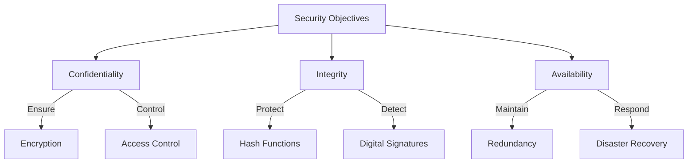
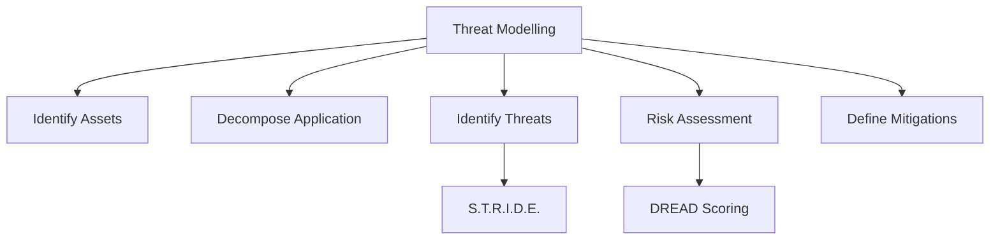
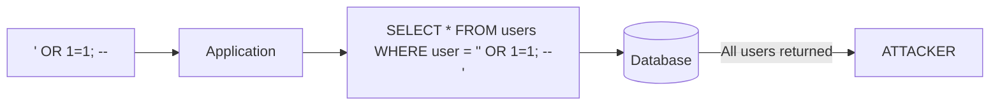
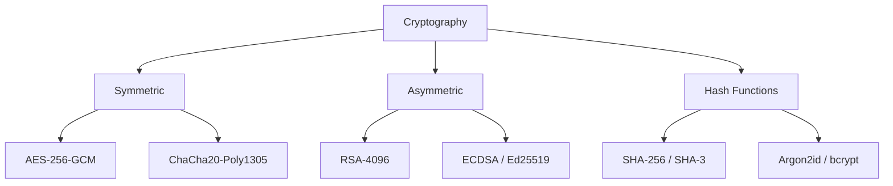

# Security Engineering

## Learning Objectives

After completing this chapter, the student will be able to:
- Explain the core principles of security engineering
- Apply the OWASP Top 10 to web application development
- Implement authentication and authorisation patterns
- Protect against injection, XSS, CSRF, and SSRF attacks
- Use secure coding practices in TypeScript
- Apply cryptographic primitives correctly
- Manage secrets and configuration securely
- Design security testing: SAST, DAST, dependency scanning

## Theory

### The CIA Triad

Security engineering rests on three fundamental principles:



| Principle | Definition | Attack Example | Defence |
|-----------|------------|----------------|---------|
| **Confidentiality** | Unauthorised parties cannot read data | Data breach | Encryption, access control |
| **Integrity** | Data cannot be modified undetected | SQL injection | Input validation, hashing |
| **Availability** | System is accessible when needed | DDoS | Rate limiting, CDN |

### The OWASP Top 10

The Open Web Application Security Project publishes the Top 10 Web Application Security Risks:

| Rank | Risk | Description |
|------|------|-------------|
| A01 | **Broken Access Control** | Users can act outside their permissions |
| A02 | **Cryptographic Failures** | Weak or missing encryption |
| A03 | **Injection** | Untrusted data executes as commands |
| A04 | **Insecure Design** | Missing security controls in design |
| A05 | **Security Misconfiguration** | Default credentials, unnecessary features enabled |
| A06 | **Vulnerable Components** | Outdated libraries with known CVEs |
| A07 | **AuthN/AuthZ Failures** | Weak authentication, session management flaws |
| A08 | **Software & Data Integrity** | Supply chain attacks, unsigned updates |
| A09 | **Logging & Monitoring Failures** | Undetected breaches |
| A10 | **SSRF** | Server-side request forgery |

### Threat Modelling



**STRIDE Model (Microsoft):**
- **S**poofing: Faking identity
- **T**ampering: Modifying data
- **R**epudiation: Denying actions
- **I**nformation Disclosure: Exposing data
- **D**enial of Service: Crashing the system
- **E**levation of Privilege: Gaining unauthorised access

### Authentication vs Authorisation

| Aspect | Authentication | Authorisation |
|--------|----------------|---------------|
| **Question** | Who are you? | What can you do? |
| **Mechanism** | Passwords, MFA, SSO | Roles, permissions, ACLs |
| **Storage** | Session tokens, JWT | Policy database |
| **Failure** | 401 Unauthorized | 403 Forbidden |
| **Protocol** | OAuth 2.0, OpenID Connect | RBAC, ABAC, PBAC |

### Common Attack Vectors

#### SQL Injection

SQL injection occurs when untrusted data is concatenated into SQL queries.



**Defence:** Parameterised queries / prepared statements.

#### Cross-Site Scripting (XSS)

XSS injects malicious scripts into web pages viewed by other users.

| Type | Description | Persistence |
|------|-------------|-------------|
| **Stored XSS** | Malicious script stored in database | Permanent |
| **Reflected XSS** | Script in URL, echoed back | Single request |
| **DOM XSS** | Client-side script modifies DOM | Client-only |

**Defence:** Output encoding, Content Security Policy (CSP).

#### Cross-Site Request Forgery (CSRF)

CSRF tricks authenticated users into performing unintended actions.

**Defence:** CSRF tokens, SameSite cookies, Origin/Referer header validation.

### Secure Coding Principles

1. **Least Privilege:** Every component operates with the minimum permissions needed.
2. **Defence in Depth:** Multiple independent security layers.
3. **Fail Secure:** When something fails, it should fail in a secure state.
4. **Complete Mediation:** Every access is checked, every time.
5. **Secure by Default:** Default configuration is the most secure.
6. **Economy of Mechanism:** Keep security mechanisms simple.
7. **Open Design:** Security should not rely on secrecy of implementation.
8. **Psychological Acceptability:** Security should not make the system difficult to use.

### Cryptographic Primitives



| Use Case | Algorithm | Key Length |
|----------|-----------|------------|
| **Encrypt data at rest** | AES-256-GCM | 256 bits |
| **Encrypt data in transit** | TLS 1.3 | 2048+ bits RSA / ECDHE |
| **Password hashing** | Argon2id, bcrypt | Salt + work factor |
| **Integrity / signatures** | SHA-256, Ed25519 | 256 bits |
| **Key exchange** | ECDHE | Curve25519 |

## Practical Takeaways

1. **Never roll your own crypto** — use well-audited libraries
2. **Sanitise input, encode output** — two different operations, both required
3. **Password hashing is not encryption** — bcrypt/Argon2id, never SHA or MD5
4. **Security is not a feature — it is a property of the system**
5. **HTTPS everywhere** — even internal services should use TLS
6. **Log security events** — you cannot respond to breaches you do not detect

## Examples

### Example 1: Secure Authentication with JWT

```typescript
import { randomBytes, createHash, timingSafeEqual } from 'crypto';

interface JWTPayload {
  sub: string;
  role: string;
  iat: number;
  exp: number;
}

class AuthService {
  private readonly JWT_SECRET: string;
  private readonly ISSUER = 'myapp';
  private readonly ACCESS_TOKEN_EXPIRY = 900; // 15 min
  private readonly REFRESH_TOKEN_EXPIRY = 604800; // 7 days

  constructor() {
    this.JWT_SECRET = process.env['JWT_SECRET'] ?? this.generateSecret();
  }

  private generateSecret(): string {
    return randomBytes(64).toString('hex');
  }

  public generateAccessToken(userId: string, role: string): string {
    return this.signJWT({
      sub: userId,
      role,
      iat: Math.floor(Date.now() / 1000),
      exp: Math.floor(Date.now() / 1000) + this.ACCESS_TOKEN_EXPIRY,
    });
  }

  public generateRefreshToken(): string {
    return randomBytes(64).toString('hex');
  }

  public verifyAccessToken(token: string): JWTPayload {
    return this.verifyJWT(token);
  }

  // Secure password hashing
  public async hashPassword(password: string): Promise<string> {
    const salt = randomBytes(16).toString('hex');
    const iterations = 100000;
    const hash = createHash('sha512');

    let derived = password;
    for (let i = 0; i < iterations; i++) {
      derived = hash.update(derived + salt).digest('hex');
    }

    return `${iterations}:${salt}:${derived}`;
  }

  public async verifyPassword(
    password: string,
    storedHash: string
  ): Promise<boolean> {
    const [iterations, salt, hash] = storedHash.split(':');
    const parsedIterations = parseInt(iterations, 10);

    let derived = password;
    const hashObj = createHash('sha512');
    for (let i = 0; i < parsedIterations; i++) {
      derived = hashObj.update(derived + salt).digest('hex');
    }

    // Timing-safe comparison prevents timing attacks
    return timingSafeEqual(
      Buffer.from(hash),
      Buffer.from(derived)
    );
  }

  // Simple JWT implementation for educational purposes
  private signJWT(payload: JWTPayload): string {
    const header = Buffer.from(
      JSON.stringify({ alg: 'HS256', typ: 'JWT' })
    ).toString('base64url');
    const body = Buffer.from(JSON.stringify(payload)).toString('base64url');
    const signature = createHash('sha256')
      .update(`${header}.${body}${this.JWT_SECRET}`)
      .digest('base64url');
    return `${header}.${body}.${signature}`;
  }

  private verifyJWT(token: string): JWTPayload {
    const [header, body, signature] = token.split('.');
    const expectedSignature = createHash('sha256')
      .update(`${header}.${body}${this.JWT_SECRET}`)
      .digest('base64url');

    if (!timingSafeEqual(
      Buffer.from(signature),
      Buffer.from(expectedSignature)
    )) {
      throw new Error('Invalid token signature');
    }

    const payload: JWTPayload = JSON.parse(
      Buffer.from(body, 'base64url').toString()
    );

    if (payload.exp < Math.floor(Date.now() / 1000)) {
      throw new Error('Token expired');
    }

    return payload;
  }
}
```

### Example 2: SQL Injection Prevention

```typescript
import { randomBytes } from 'crypto';

// Parameterised query builder (type-safe)
interface QueryParams {
  text: string;
  values: unknown[];
}

class QueryBuilder {
  public static select(
    table: string,
    columns: string[],
    where?: { field: string; operator: string; value: unknown }[]
  ): QueryParams {
    const params: unknown[] = [];
    const conditions: string[] = [];

    for (const clause of where ?? []) {
      const paramIndex = params.length + 1;
      conditions.push(`${clause.field} ${clause.operator} $${paramIndex}`);
      params.push(clause.value);
    }

    const whereClause = conditions.length > 0
      ? ` WHERE ${conditions.join(' AND ')}`
      : '';

    return {
      text: `SELECT ${columns.join(', ')} FROM ${table}${whereClause}`,
      values: params,
    };
  }

  public static insert(
    table: string,
    data: Record<string, unknown>
  ): QueryParams {
    const columns = Object.keys(data);
    const values = Object.values(data);
    const placeholders = values.map((_, i) => `$${i + 1}`);

    return {
      text: `INSERT INTO ${table} (${columns.join(', ')}) VALUES (${placeholders.join(', ')}) RETURNING id`,
      values,
    };
  }

  public static update(
    table: string,
    data: Record<string, unknown>,
    where: { field: string; value: unknown }
  ): QueryParams {
    const columns = Object.keys(data);
    const values = Object.values(data);
    const setClauses = columns.map((col, i) => `${col} = $${i + 1}`);

    const whereIdx = values.length + 1;
    return {
      text: `UPDATE ${table} SET ${setClauses.join(', ')} WHERE ${where.field} = $${whereIdx}`,
      values: [...values, where.value],
    };
  }

  public static sanitizeIdentifier(identifier: string): string {
    // Prevent SQL injection in table/column names (whitelist approach)
    if (!/^[a-zA-Z_][a-zA-Z0-9_]*$/.test(identifier)) {
      throw new Error(`Invalid identifier: ${identifier}`);
    }
    return identifier;
  }
}

// Usage
const query = QueryBuilder.select(
  'users',
  ['id', 'email', 'name'],
  [{ field: 'email', operator: '=', value: 'user@example.com' }]
);
// query.text = "SELECT id, email, name FROM users WHERE email = $1"
// query.values = ['user@example.com']
```

### Example 3: Input Validation and Sanitisation

```typescript
class InputValidator {
  private errors: string[] = [];

  public validateEmail(email: string): this {
    const emailRegex = /^[^\s@]+@[^\s@]+\.[^\s@]+$/;
    if (!emailRegex.test(email)) {
      this.errors.push('Invalid email format');
    }
    return this;
  }

  public validateRequired(value: string, fieldName: string): this {
    if (!value || value.trim().length === 0) {
      this.errors.push(`${fieldName} is required`);
    }
    return this;
  }

  public validateLength(
    value: string,
    min: number,
    max: number,
    fieldName: string
  ): this {
    const len = value.trim().length;
    if (len < min || len > max) {
      this.errors.push(
        `${fieldName} must be ${min}-${max} characters (got ${len})`
      );
    }
    return this;
  }

  public validateAllowedValues<T>(
    value: T,
    allowed: T[],
    fieldName: string
  ): this {
    if (!allowed.includes(value)) {
      this.errors.push(
        `${fieldName} must be one of: ${allowed.join(', ')}`
      );
    }
    return this;
  }

  public validatePattern(
    value: string,
    pattern: RegExp,
    fieldName: string
  ): this {
    if (!pattern.test(value)) {
      this.errors.push(`${fieldName} has invalid format`);
    }
    return this;
  }

  public validateNumeric(
    value: string,
    fieldName: string,
    min?: number,
    max?: number
  ): this {
    const num = Number(value);
    if (isNaN(num)) {
      this.errors.push(`${fieldName} must be a number`);
      return this;
    }
    if (min !== undefined && num < min) {
      this.errors.push(`${fieldName} must be >= ${min}`);
    }
    if (max !== undefined && num > max) {
      this.errors.push(`${fieldName} must be <= ${max}`);
    }
    return this;
  }

  public hasErrors(): boolean {
    return this.errors.length > 0;
  }

  public getErrors(): string[] {
    return [...this.errors];
  }
}

// Output encoding to prevent XSS
class OutputEncoder {
  public static encodeHtml(input: string): string {
    return input
      .replace(/&/g, '&amp;')
      .replace(/</g, '&lt;')
      .replace(/>/g, '&gt;')
      .replace(/"/g, '&quot;')
      .replace(/'/g, '&#x27;')
      .replace(/\//g, '&#x2F;');
  }

  public static encodeJs(input: string): string {
    return input.replace(/['"\\\n\r\t\b\f]/g, (char) => {
      const replacements: Record<string, string> = {
        "'": "\\'",
        '"': '\\"',
        '\\': '\\\\',
        '\n': '\\n',
        '\r': '\\r',
        '\t': '\\t',
        '\b': '\\b',
        '\f': '\\f',
      };
      return replacements[char] ?? char;
    });
  }

  public static encodeUrl(input: string): string {
    return encodeURIComponent(input);
  }
}
```

### Example 4: CSRF Protection Middleware

```typescript
import { randomBytes, createHash, timingSafeEqual } from 'crypto';

interface SessionData {
  csrfToken: string;
  userId?: string;
}

class CSRFProtection {
  private readonly sessions = new Map<string, SessionData>();

  public generateToken(sessionId: string): string {
    const token = randomBytes(32).toString('hex');
    const hash = this.hashToken(token);

    this.sessions.set(sessionId, {
      ...this.sessions.get(sessionId),
      csrfToken: hash,
    });

    return token;
  }

  public validateToken(sessionId: string, token: string): boolean {
    const session = this.sessions.get(sessionId);
    if (!session?.csrfToken) return false;

    const hash = this.hashToken(token);
    return timingSafeEqual(
      Buffer.from(hash),
      Buffer.from(session.csrfToken)
    );
  }

  private hashToken(token: string): string {
    return createHash('sha256').update(token).digest('hex');
  }

  // Middleware for Express-like frameworks
  public middleware(
    req: { method: string; headers: Record<string, string>; body: Record<string, string> },
    res: { status: (code: number) => { json: (data: object) => void } }
  ): boolean {
    const safeMethods = ['GET', 'HEAD', 'OPTIONS'];
    if (safeMethods.includes(req.method.toUpperCase())) {
      return true; // Safe methods do not need CSRF protection
    }

    const token =
      req.headers['x-csrf-token'] ??
      req.headers['x-xsrf-token'] ??
      req.body?.['_csrf'];

    const sessionId = req.headers['cookie'] ?? '';

    if (!token || !this.validateToken(sessionId, token as string)) {
      res.status(403).json({ error: 'Invalid CSRF token' });
      return false;
    }

    return true;
  }
}

// Content Security Policy builder
class CSPBuilder {
  private directives: Record<string, string[]> = {};

  public defaultSrc(...sources: string[]): this {
    this.directives['default-src'] = sources;
    return this;
  }

  public scriptSrc(...sources: string[]): this {
    this.directives['script-src'] = sources;
    return this;
  }

  public styleSrc(...sources: string[]): this {
    this.directives['style-src'] = sources;
    return this;
  }

  public imgSrc(...sources: string[]): this {
    this.directives['img-src'] = sources;
    return this;
  }

  public connectSrc(...sources: string[]): this {
    this.directives['connect-src'] = sources;
    return this;
  }

  public build(): string {
    return Object.entries(this.directives)
      .map(([key, sources]) => `${key} ${sources.join(' ')}`)
      .join('; ');
  }
}

// Usage
const csp = new CSPBuilder()
  .defaultSrc("'self'")
  .scriptSrc("'self'", "'strict-dynamic'", "'nonce-abc123'")
  .styleSrc("'self'", "'unsafe-inline'")
  .imgSrc("'self'", 'https:')
  .connectSrc("'self'", 'https://api.example.com')
  .build();
```

### Example 5: Secrets Manager

```typescript
import { createCipheriv, createDecipheriv, randomBytes } from 'crypto';

interface SecretConfig {
  key: Buffer;
  algorithm: string;
}

class SecretsManager {
  private static readonly ALGORITHM = 'aes-256-gcm';
  private static readonly KEY_LENGTH = 32;
  private static readonly IV_LENGTH = 16;
  private static readonly TAG_LENGTH = 16;

  private config!: SecretConfig;

  constructor() {
    const keyHex = process.env['SECRETS_ENCRYPTION_KEY'];
    if (!keyHex || keyHex.length !== 64) {
      throw new Error(
        'SECRETS_ENCRYPTION_KEY must be a 64-character hex string'
      );
    }
    this.config = {
      key: Buffer.from(keyHex, 'hex'),
      algorithm: SecretsManager.ALGORITHM,
    };
  }

  public encryptSecret(plaintext: string): string {
    const iv = randomBytes(SecretsManager.IV_LENGTH);
    const cipher = createCipheriv(
      this.config.algorithm,
      this.config.key,
      iv,
      { authTagLength: SecretsManager.TAG_LENGTH }
    );

    let encrypted = cipher.update(plaintext, 'utf8', 'hex');
    encrypted += cipher.final('hex');
    const authTag = cipher.getAuthTag().toString('hex');

    // Store iv:authTag:ciphertext
    return `${iv.toString('hex')}:${authTag}:${encrypted}`;
  }

  public decryptSecret(encrypted: string): string {
    const [ivHex, tagHex, ciphertext] = encrypted.split(':');
    const iv = Buffer.from(ivHex, 'hex');
    const authTag = Buffer.from(tagHex, 'hex');

    const decipher = createDecipheriv(
      this.config.algorithm,
      this.config.key,
      iv,
      { authTagLength: SecretsManager.TAG_LENGTH }
    );
    decipher.setAuthTag(authTag);

    let plaintext = decipher.update(ciphertext, 'hex', 'utf8');
    plaintext += decipher.final('utf8');
    return plaintext;
  }

  public static validateSecretKey(keyHex: string): boolean {
    return /^[0-9a-f]{64}$/i.test(keyHex);
  }
}

// Environment variable validator
class EnvConfig {
  private readonly errors: string[] = [];

  public requireString(key: string): this {
    if (!process.env[key]) {
      this.errors.push(`Missing required env: ${key}`);
    }
    return this;
  }

  public requireUrl(key: string): this {
    const val = process.env[key];
    if (!val) {
      this.errors.push(`Missing required env: ${key}`);
      return this;
    }
    try {
      new URL(val);
    } catch {
      this.errors.push(`Invalid URL in env: ${key}`);
    }
    return this;
  }

  public requireNumber(key: string, min?: number, max?: number): this {
    const val = process.env[key];
    if (val === undefined) {
      this.errors.push(`Missing required env: ${key}`);
      return this;
    }
    const num = Number(val);
    if (isNaN(num)) {
      this.errors.push(`Invalid number in env: ${key}`);
      return this;
    }
    if (min !== undefined && num < min) {
      this.errors.push(`${key} must be >= ${min}`);
    }
    if (max !== undefined && num > max) {
      this.errors.push(`${key} must be <= ${max}`);
    }
    return this;
  }

  public hasErrors(): boolean {
    return this.errors.length > 0;
  }

  public getErrors(): string[] {
    return [...this.errors];
  }

  public validate(): void {
    if (this.errors.length > 0) {
      throw new Error(`Configuration errors:\n${this.errors.join('\n')}`);
    }
  }
}
```

## Chapter Quiz

**Q1: Which of the following is NOT part of the STRIDE threat model?**
- A) Spoofing
- B) Tampering
- C) Injection
- D) Information Disclosure

**Answer: C** — Injection is from OWASP Top 10, not STRIDE. STRIDE includes Spoofing, Tampering, Repudiation, Information Disclosure, Denial of Service, Elevation of Privilege.

**Q2: What is the best defence against SQL injection?**
- A) Input escaping
- B) Parameterised queries
- C) Stored procedures
- D) WAF rules

**Answer: B** — Parameterised queries (prepared statements) ensure separation of code and data.

**Q3: The HTTP status code returned when a user is authenticated but not authorised to access a resource is:**
- A) 401 Unauthorized
- B) 403 Forbidden
- C) 404 Not Found
- D) 405 Method Not Allowed

**Answer: B** — 401 is for unauthenticated, 403 is for authenticated but not authorised.

**Q4: Which algorithm is recommended for password storage?**
- A) SHA-256
- B) AES-256
- C) Argon2id
- D) MD5

**Answer: C** — Argon2id (and bcrypt) are memory-hard password hashing algorithms. SHA and MD5 are fast and vulnerable to brute force.

**Q5: Content Security Policy (CSP) is primarily a defence against:**
- A) SQL Injection
- B) Cross-Site Scripting (XSS)
- C) CSRF
- D) SSRF

**Answer: B** — CSP restricts which scripts can execute, preventing XSS.

## Summary

Security engineering is the discipline of building systems that remain secure under attack. The CIA triad (Confidentiality, Integrity, Availability) provides foundational principles. The OWASP Top 10 catalogues the most critical web application risks. Threat modelling using STRIDE identifies security threats systematically. Secure coding practices include input validation, output encoding, parameterised queries, CSRF tokens, and Content Security Policy. Cryptographic primitives must be applied correctly using well-audited libraries. Secrets management ensures that credentials and keys are never hardcoded or exposed. Security testing includes static analysis (SAST), dynamic analysis (DAST), and dependency scanning. Security is an emergent property of the entire system, not a single feature.

## Exercises

### Review Questions

1. Explain the CIA triad with an example of an attack on each principle.
2. List the OWASP Top 10 and describe the three highest-ranked risks.
3. What is the difference between authentication and authorisation?
4. Describe stored XSS, reflected XSS, and DOM XSS.
5. What is CSRF and how is it prevented?
6. What is the principle of least privilege?

### Application Problems

1. Design a threat model for an online banking application using STRIDE. Identify at least two threats per category.

2. Implement a secure password change endpoint that requires the current password, enforces complexity rules, prevents reuse, and logs the event. Use TypeScript.

3. Write a Content Security Policy for a blog that loads scripts only from self, Google Analytics, and a CDN, with 'strict-dynamic' for inline scripts.

### Challenge Problem

You are the security lead for a healthcare SaaS platform (HIPAA regulated) that stores patient health records. It uses a React frontend, Java Spring Boot backend, PostgreSQL database, and AWS infrastructure. The system was recently pen-tested and the report found: SQL injection in patient search, stored XSS in notes, missing encryption on PHI at rest, no MFA for providers, and hardcoded AWS keys in source code. Design a comprehensive remediation plan. Prioritise fixes by risk. For each finding, specify the vulnerable code pattern, the exploit scenario, the fix (with code examples), and the verification method. Implement a TypeScript security scanner that checks code patterns for the five vulnerabilities found.
