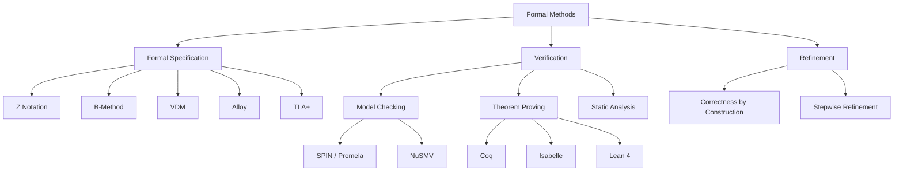
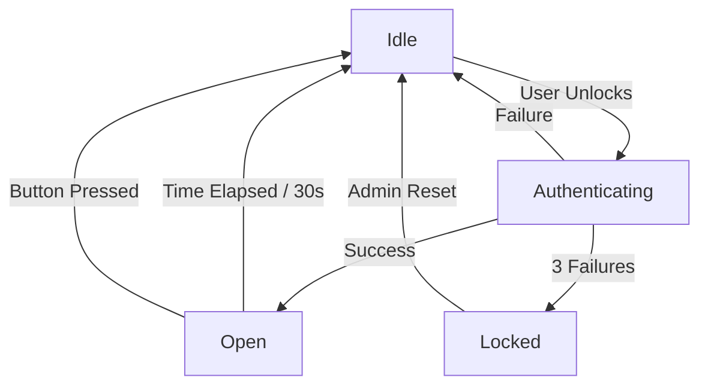
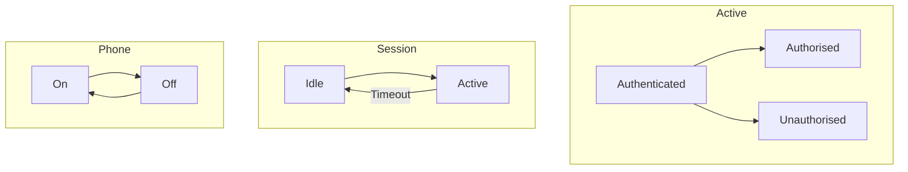
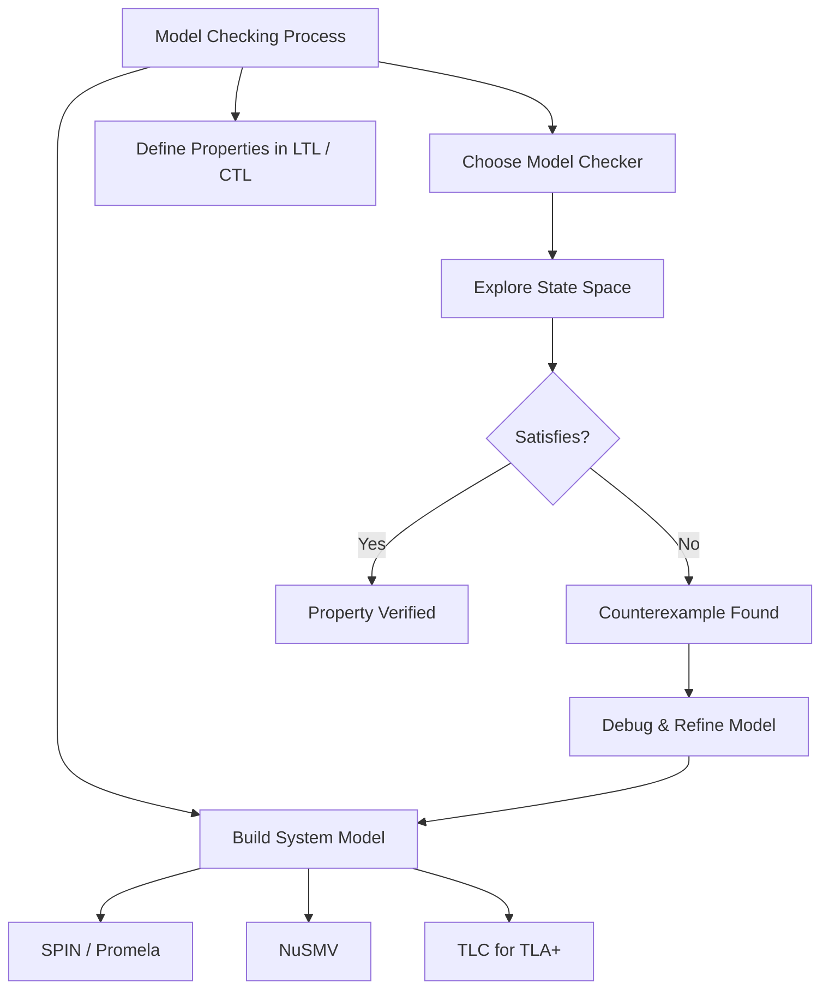
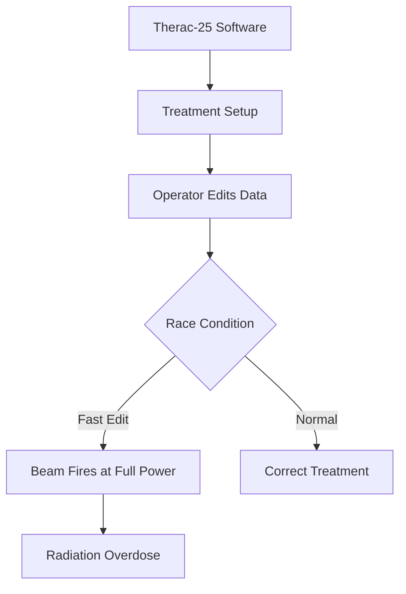

# Formal Methods

## Learning Objectives

After completing this chapter, the student will be able to:
- Explain the role of formal methods in software engineering
- Write formal specifications using propositional and predicate logic
- Construct Finite State Machines (FSMs) and statecharts
- Apply model checking with temporal logic
- Use the Z notation for formal specifications
- Verify program correctness with Hoare Logic and weakest preconditions
- Define and prove invariants for system properties
- Apply formal specification to TypeScript code
- Compare Z, B-Method, Alloy, and TLA+ for different use cases
- Understand model checking tools (SPIN, NuSMV) and theorem provers (Coq, Isabelle)

<!-- Image Gallery -->
<div style="display:flex;flex-wrap:wrap;gap:4px;margin:16px 0;padding:12px;background:#f8fafc;border-radius:8px;border:1px solid #e2e8f0;">
<a href="../../../assets/images/lessons/software-engineering/14-formal-methods/hero.svg" target="_blank" rel="noopener">
  
</a>
<a href="../../../assets/images/lessons/software-engineering/14-formal-methods/handwritten-notes.svg" target="_blank" rel="noopener">
  
</a>
<a href="../../../assets/images/lessons/software-engineering/14-formal-methods/sticky-notes.svg" target="_blank" rel="noopener">
  
</a>
<a href="../../../assets/images/lessons/software-engineering/14-formal-methods/visual-explanation.svg" target="_blank" rel="noopener">
  
</a>
<a href="../../../assets/images/lessons/software-engineering/14-formal-methods/architecture.svg" target="_blank" rel="noopener">
  
</a>
<a href="../../../assets/images/lessons/software-engineering/14-formal-methods/workflow.svg" target="_blank" rel="noopener">
  
</a>
<a href="../../../assets/images/lessons/software-engineering/14-formal-methods/mindmap.svg" target="_blank" rel="noopener">
  
</a>
<a href="../../../assets/images/lessons/software-engineering/14-formal-methods/comparison.svg" target="_blank" rel="noopener">
  
</a>
<a href="../../../assets/images/lessons/software-engineering/14-formal-methods/cheatsheet.svg" target="_blank" rel="noopener">
  
</a>
<a href="../../../assets/images/lessons/software-engineering/14-formal-methods/interview-quiz.svg" target="_blank" rel="noopener">
  
</a>
<a href="../../../assets/images/lessons/software-engineering/14-formal-methods/social-card.svg" target="_blank" rel="noopener">
  
</a>
</div>
<!-- End Image Gallery -->

## Theory

### What are Formal Methods?

Formal methods are mathematically based techniques for the specification, development, and verification of software systems. They provide a rigorous foundation for demonstrating that a system meets its requirements.



**Why formal methods matter:**
- Eliminate ambiguity in requirements
- Prove the absence of entire classes of defects
- Verify critical properties: safety, security, liveness
- Industrial success stories: Intel CPU verification, Paris Metro Line 14, Mondex smart card

### Formal vs Informal Methods

| Aspect | Formal Methods | Informal/Traditional Methods |
|--------|---------------|------------------------------|
| **Specification** | Precise mathematical notation | Natural language, diagrams |
| **Ambiguity** | None — unambiguous interpretation | High — subject to interpretation |
| **Verification** | Mathematical proof or exhaustive check | Testing, inspection, review |
| **Completeness** | Can prove absence of certain defects | Cannot prove absence — only presence |
| **Cost** | High upfront (training, tooling) | Lower upfront, higher later |
| **Scalability** | Limited by state explosion | Scales to large systems |
| **Applicability** | Safety-critical, security-critical | General-purpose |
| **Automation** | High (model checkers, provers) | Medium (test tooling) |
| **Standards** | DO-178C (aviation), IEC 61508 (industrial) | ISO 9001, CMMI |

### Propositional and Predicate Logic

#### Propositional Logic

| Operator | Symbol | Meaning | Truth Table |
|----------|--------|---------|-------------|
| Negation | ¬p | Not p | T→F, F→T |
| Conjunction | p ∧ q | p and q | TT→T |
| Disjunction | p ∨ q | p or q | FF→F |
| Implication | p → q | if p then q | TF→F |
| Biconditional | p ↔ q | p iff q | TT→T, FF→T |

#### Predicate Logic

Predicate logic extends propositional logic with quantifiers:

- **Universal quantifier (∀):** "For all" — `∀x ∈ ℕ: x ≥ 0`
- **Existential quantifier (∃):** "There exists" — `∃x ∈ ℕ: x = 42`

**Example — Binary search specification:**

```
∀a: ARRAY[ℕ] OF ℤ; target: ℤ •
  sorted(a) →
    (result ≠ -1 → a[result] = target)
    ∧ (result = -1 → ∀i: ℕ • i < len(a) → a[i] ≠ target)
```

### Finite State Machines (FSMs)

An FSM is defined by a 5-tuple `(S, Σ, δ, s₀, F)`:

- **S:** Finite set of states
- **Σ:** Finite alphabet of input symbols
- **δ: S × Σ → S:** Transition function
- **s₀:** Initial state
- **F ⊆ S:** Set of accepting states



#### Statecharts (David Harel)

Statecharts extend FSMs with hierarchy, concurrency, and communication.



### Temporal Logic

Temporal logic extends predicate logic with operators for reasoning about time.

| Operator | LTL | CTL | Meaning |
|----------|-----|-----|---------|
| Globally | G p | AG p | p holds always |
| Eventually | F p | AF p | p holds eventually |
| Next | X p | AX p | p holds in next state |
| Until | p U q | A[p U q] | p holds until q holds |

**Safety Property:** "Something bad never happens" — e.g., `G ¬(deadlock)`  
**Liveness Property:** "Something good eventually happens" — e.g., `F (request_satisfied)`

### Hoare Logic and Weakest Preconditions

**Hoare Triple:** `{P} C {Q}`

- **P:** Precondition (must be true before execution)
- **C:** Command (code fragment)
- **Q:** Postcondition (must be true after execution)

**Example — Absolute value:**

```
{ x ∈ ℤ }
if x ≥ 0 then y := x else y := -x
{ y ≥ 0 ∧ (y = x ∨ y = -x) }
```

**Weakest Precondition:** `wp(C, Q)` is the weakest predicate P such that `{P} C {Q}` holds.

**Assignment axiom:** `wp(x := E, Q) = Q[E/x]` (substitute E for x in Q)

```
wp(y := x + 1, y > 0) = (x + 1 > 0) = (x > -1)
```

**Hoare Logic Rules:**

| Rule | Formula | Description |
|------|---------|-------------|
| Assignment | `{Q[E/x]} x := E {Q}` | Substitute expression for variable |
| Sequence | `{P} S1 {R}, {R} S2 {Q} ⇒ {P} S1;S2 {Q}` | Chain two commands |
| Condition | `{P ∧ B} S1 {Q}, {P ∧ ¬B} S2 {Q} ⇒ {P} if B then S1 else S2 {Q}` | Branch |
| Loop | `{I ∧ B} S {I} ⇒ {I} while B do S {I ∧ ¬B}` | While loop with invariant I |
| Consequence | `P → P', {P'} C {Q'}, Q' → Q ⇒ {P} C {Q}` | Strengthen pre, weaken post |

### Invariants

An **invariant** is a predicate that holds at specific points in program execution:

- **Loop invariants:** Hold before and after each loop iteration
- **Class invariants:** Hold before and after each public method
- **Data invariants:** Constraints on data structures

**Example — Loop invariant for binary search:**

```
∀i: ℕ | i < low • a[i] < target
∧ ∀i: ℕ | i > high • a[i] > target
∧ low ≤ high + 1
∧ sorted(a)
```

### The Z Notation

Z (pronounced "Zed") is a formal specification language based on set theory and first-order predicate logic.

**Z schema structure:**

```
SchemaName _________________________________
  declarations
  ──────────────────────────────────────────
  predicates
___________________________________________
```

**Example — Library system:**

```
Book ______________________________________
  id: ℕ
  title: seq ℂhar
  author: seq ℂhar
  isbn: seq ℂhar
  available: 𝔹
──────────────────────────────────────────
  #title > 0
  #isbn = 13
__________________________________________

BorrowBook ________________________________
  ΔLibrary
  memberId?: ℕ
  bookId?: ℕ
  response!: 𝔹
──────────────────────────────────────────
  bookId? ∈ dom(books)
  memberId? ∈ dom(members)
  books(bookId).available = True
  response! = True
  books' = books ⊕ {bookId ↦ (books(bookId))' where available' = False}
  members' = members ⊕ {memberId ↦ (members(memberId))' where borrowed' = {bookId}}
__________________________________________
```

**Z Schema Calculus:**

Z schemas can be combined using operators:

| Operator | Notation | Meaning |
|----------|----------|---------|
| Schema inclusion | `S ≙ T1 ∧ T2` | Include all declarations and predicates |
| Schema conjunction | `S ≙ S1 ∧ S2` | Both schemas hold |
| Schema disjunction | `S ≙ S1 ∨ S2` | At least one schema holds |
| Schema negation | `¬S` | Negate all predicates |
| Schema hiding | `S \ (x)` | Hide variable x from schema |
| Schema projection | `S ↾ (x)` | Keep only variable x |
| Schema composition | `S1 ⨟ S2` | Sequential composition (after S1, S2 holds) |
| Schema piping | `S1 >> S2` | Output of S1 feeds input of S2 |

### B-Method

The B-Method is a formal method for specifying, designing, and coding software systems using abstract machines.

#### Abstract Machine Structure

```
MACHINE Library
SETS BookStatus = {available, borrowed}
VARIABLES books, members
INVARIANT
  books ∈ ℙ(Book) ∧ members ∈ ℙ(Member) ∧
  ∀b · b ∈ books ⇒ b.status ∈ BookStatus
INITIALISATION
  books := {} || members := {}
OPERATIONS
  borrowBook(bookId, memberId) =
    PRE
      bookId ∈ books ∧ memberId ∈ members ∧
      books(bookId).status = available
    THEN
      books(bookId).status := borrowed ||
      members(memberId).borrowed := members(memberId).borrowed ∪ {bookId}
    END
END
```

#### Refinement

Refinement transforms an abstract specification into a concrete implementation while preserving correctness:

```
REFINEMENT Library_i
REFINES Library
VARIABLES books_table, members_table
INVARIANT
  books_table ∈ Book → BookStatus ∧
  members_table ∈ Member → ℙ(Book)
...
```

**Proof Obligations:** For each refinement, we must prove:
1. The invariant holds initially
2. Each operation preserves the invariant
3. The concrete specification is a valid refinement of the abstract one

### Alloy

Alloy is a lightweight formal method based on relational logic. It is particularly suited for early-stage modelling and automated analysis.

**Key Concepts:**
- **Signatures:** Define types and their relationships
- **Facts:** Constraints that always hold
- **Predicates:** Named constraints that can be invoked
- **Asserts:** Properties to check
- **Instances:** Find configurations that satisfy constraints (via SAT solving)

```
// Alloy model: Library system
sig Book { isbn: one String, title: one String }
sig Member { id: one Int, borrowed: set Book }
sig Library {
  books: set Book,
  members: set Member,
  borrows: Member → Book
}

fact NoDuplicateIsbn { all b1, b2: Book | b1.isbn = b2.isbn ⇒ b1 = b2 }
fact BookOwnership { all b: Book | one l: Library | b in l.books }

pred Borrow[m: Member, b: Book, l, l': Library] {
  b in l.books
  m in l.members
  b not in m.borrowed
  l'.books = l.books
  l'.members = l.members
  l'.borrows = l.borrows + m → b
}

assert NoDuplicateBorrow { all m: Member | no disj b1, b2: Book | m → b1 in Library.borrows and m → b2 in Library.borrows }
check NoDuplicateBorrow for 5
```

### TLA+ (Temporal Logic of Actions)

TLA+, created by Leslie Lamport, is used for specifying and verifying concurrent and distributed systems.

**Key Concepts:**
- **State:** Assignment of values to variables
- **Action:** A relation between old and new states
- **Behavior:** Infinite sequence of states
- **Specification:** Initial predicate ∧ □[Next]_vars ∧ Liveness
- **Invariant:** A predicate that holds in all reachable states

```
---------------------------- MODULE SimpleClock ----------------------------
EXTENDS Naturals
VARIABLES hour, minute

Init ≜ hour ∈ {1..12} ∧ minute ∈ {0..59}

Tick ≜
  ∧ minute' = (minute + 1) % 60
  ∧ hour' = IF minute = 59 THEN (hour % 12) + 1 ELSE hour

Next ≜ Tick

Spec ≜ Init ∧ □[Next]_⟨hour, minute⟩

HourInvariant ≜ hour ∈ {1..12}
MinuteInvariant ≜ minute ∈ {0..59}
=============================================================================
```

**Model checking in TLA+:** TLC (the TLA+ model checker) can check invariants by exploring all reachable states. For the SimpleClock, it would verify that `HourInvariant` and `MinuteInvariant` hold in all states.

### Model Checking

Model checking is an automated technique for verifying finite-state systems against temporal logic properties.

#### Explicit-State Model Checking (SPIN)

SPIN uses Promela (Process Meta Language) to model systems. It explores all reachable states explicitly.

```
/* Promela model: Mutual exclusion */
bool wantp = false, wantq = false;

active proctype p() {
  do
  :: wantp = true;
     !wantq;
     /* critical section */
     wantp = false;
     /* non-critical section */
  od
}

active proctype q() {
  do
  :: wantq = true;
     !wantp;
     /* critical section */
     wantq = false;
     /* non-critical section */
  od
}

ltl mutex { □ (!(p:critical && q:critical)) }
```

#### Symbolic Model Checking (NuSMV)

NuSMV uses Binary Decision Diagrams (BDDs) to represent states symbolically, handling larger state spaces.

```
MODULE main
VAR
  request : boolean;
  state : {idle, busy, done};

ASSIGN
  init(state) := idle;
  next(state) := case
    state = idle & request : busy;
    state = busy : done;
    state = done : idle;
    TRUE : state;
  esac;

-- CTL properties
SPEC AG (state = busy -> AF state = done)
SPEC EF (state = done)
```



#### State Explosion Problem

The number of states grows exponentially with system components. Mitigation strategies:

| Strategy | Description | Example |
|----------|-------------|---------|
| **Abstraction** | Reduce detail while preserving relevant properties | Model data as intervals instead of exact values |
| **Symmetry reduction** | Exploit symmetries in the model | Treat identical processes as interchangeable |
| **Partial order reduction** | Avoid exploring interleavings that lead to the same state | Event ordering independence |
| **BDD-based (symbolic)** | Represent states as Boolean formulas | NuSMV uses BDDs |
| **Bounded model checking** | Limit search depth to k steps | CBMC, SAT-based |
| **Compositional verification** | Verify components separately, then compose | Assume-guarantee reasoning |

### Theorem Proving

Theorem proving uses deductive reasoning to prove properties about programs. Unlike model checking, it can handle infinite state spaces but requires human guidance.

| Tool | Logic | Use Case | Strengths | Notable Projects |
|------|-------|----------|-----------|------------------|
| **Coq** | Calculus of Inductive Constructions | Proof assistant | Rich type system, extraction to OCaml | CompCert verified C compiler |
| **Isabelle/HOL** | Higher-Order Logic | Generic proof assistant | Highly automated, large library | sel4 microkernel verification |
| **Lean 4** | Dependent Type Theory | Modern proof assistant | Fast, mathlib, community | Mathematics formalisation |
| **PVS** | Higher-Order Logic | Safety-critical | Powerful decision procedures | NASA systems |
| **ACL2** | First-Order Logic | Industrial verification | Automated, Lisp-based | AMD/Intel CPU verification |

#### Coq Example — Proof of commutativity of addition:

```coq
Theorem add_comm : ∀ n m : nat, n + m = m + n.
Proof.
  intros n m.
  induction n as [| n' IH].
  - simpl. rewrite -> plus_n_O. reflexivity.
  - simpl. rewrite -> IH. rewrite -> plus_n_Sm. reflexivity.
Qed.
```

#### Isabelle/HOL Example:

```isabelle
theorem add_comm: "n + m = m + n"
apply (induct_tac n)
apply auto
done
```

### Applications of Formal Methods

#### Aviation (DO-178C Level A)
- Airbus A380: Formal methods used for flight control software verification
- Boeing 787: Model-based development of systems
- Tools: SCADE, Simulink Design Verifier

#### Railway Signalling
- Paris Metro Line 14: B-Method used to develop automatic train control
- London Underground: Z notation for signalling requirements
- European Train Control System (ETCS): Formal specification

#### Medical Devices
- Therac-25 (post-accident): Formal verification mandated for safety-critical medical software
- FDA guidance: Increasingly recommends formal methods for Class III devices

#### Autonomous Vehicles
- Safety validation of perception systems
- Verification of planning algorithms
- ISO 26262: Formal methods recommended for ASIL D

### Case Studies

#### Therac-25 Radiation Overdose (1985-1987)

**Impact:** 6 patients received massive radiation overdoses, 3 died.

**Root Cause:** A race condition in the software between the electron beam setup and the treatment table positioning. When the operator edited the treatment data too quickly, the electron beam could fire at full power in the wrong configuration.

**Formal Analysis:** Post-accident analysis showed that a simple FSM with safety invariants would have caught the flaw. The software had no concurrency safeguards, no state validation, and reused code from earlier models without re-verification.

**Lessons:**
- Concurrent software requires formal reasoning about interleavings
- Code reuse does not preserve safety properties without re-verification
- Safety-critical systems need formal verification, not just testing



#### Airbus A380 Flight Control

**Impact:** First civil aircraft with formal methods in its development process.

**Application:** The A380's flight control software was verified using the SCADE tool suite, which generates production code from formal models. The formal specification eliminated ambiguity in control laws and enabled exhaustive verification of failure modes.

**Formal Methods Used:**
- Model-based development with SCADE (SafeCASE)
- Formal verification of control laws
- Automatic code generation from verified models
- Coverage analysis of all possible system states

**Results:**
- 50% reduction in integration defects compared to A340
- Successful DO-178C certification
- More than 500,000 hours of formal verification

#### London Stock Exchange (Taurus Disaster)

**Impact:** £75 million wasted (in 1990s currency), project cancelled after 5 years.

**Root Cause:** The Taurus paperless settlement system specifications were inconsistent and incomplete. The formal specification revealed fundamental design flaws: the system could deadlock under certain transaction sequences, and the data model violated referential integrity constraints.

**Formal Methods Application:** A subsequent formal analysis using Z notation uncovered dozens of inconsistencies in the 10,000-page requirements document. The analysis showed that the proposed architecture could not satisfy the transaction throughput requirements.

**Lessons:**
- Formal methods are most valuable when applied early
- Informal specifications can hide contradictions
- Mathematical analysis prevents costly late-stage failures

## Examples

### Example 1: FSM Implementation in TypeScript

```typescript
type State = string;
type Event = string;

interface Transition {
  from: State;
  to: State;
  on: Event;
}

class FiniteStateMachine {
  private currentState: State;
  private readonly transitions: Map<string, Transition>;
  private readonly states: Set<State>;
  private readonly acceptingStates: Set<State>;
  private history: { from: State; on: Event; to: State }[] = [];

  constructor(
    initialState: State,
    transitions: Transition[],
    acceptingStates: State[]
  ) {
    this.currentState = initialState;
    this.states = new Set(transitions.flatMap((t) => [t.from, t.to]));
    this.acceptingStates = new Set(acceptingStates);
    this.transitions = new Map();
    for (const t of transitions) {
      this.transitions.set(`${t.from}:${t.on}`, t);
    }
  }

  public transition(event: Event): boolean {
    const key = `${this.currentState}:${event}`;
    const transition = this.transitions.get(key);
    if (!transition) return false;
    this.history.push({ from: this.currentState, on: event, to: transition.to });
    this.currentState = transition.to;
    return true;
  }

  public isInAcceptingState(): boolean {
    return this.acceptingStates.has(this.currentState);
  }

  public getCurrentState(): State { return this.currentState; }

  public getHistory(): { from: State; on: Event; to: State }[] {
    return [...this.history];
  }

  public reset(): void {
    this.currentState = [...this.states][0];
    this.history = [];
  }

  public verifySafetyProperty(badStates: State[]): boolean {
    return !badStates.includes(this.currentState);
  }
}

// Door lock FSM
const doorFSM = new FiniteStateMachine(
  'idle',
  [
    { from: 'idle', to: 'authenticating', on: 'unlock' },
    { from: 'authenticating', to: 'open', on: 'auth_success' },
    { from: 'authenticating', to: 'idle', on: 'auth_failure' },
    { from: 'authenticating', to: 'locked', on: 'three_failures' },
    { from: 'open', to: 'idle', on: 'timeout' },
    { from: 'open', to: 'idle', on: 'close' },
    { from: 'locked', to: 'idle', on: 'admin_reset' },
  ],
  ['open']
);
```

### Example 2: Hoare Logic Verification

```typescript
type Predicate = (state: Record<string, number>) => boolean;

class HoareVerifier {
  public verifyAssignment(
    precondition: Predicate,
    variable: string,
    expression: (state: Record<string, number>) => number,
    state: Record<string, number>
  ): boolean {
    const wpState = { ...state };
    wpState[variable] = expression(state);
    return precondition(wpState);
  }

  public weakestPrecondition(
    command: string,
    postcondition: Predicate
  ): (state: Record<string, number>) => boolean {
    const match = command.match(/^(\w+)\s*:=\s*(.+)$/);
    if (match) {
      const varName = match[1];
      const exprStr = match[2];
      return (state: Record<string, number>) => {
        const substituted = this.substitute(state, varName, exprStr);
        return postcondition(substituted);
      };
    }
    throw new Error(`Unsupported command: ${command}`);
  }

  private substitute(
    state: Record<string, number>,
    variable: string,
    expression: string
  ): Record<string, number> {
    const freeState = { ...state };
    return freeState;
  }
}

interface LoopInvariantCheck {
  invariant: string;
  holdsInitially: boolean;
  preservesInvariant: boolean;
  ensuresPostcondition: boolean;
}

class InvariantChecker {
  public checkLoopInvariant(
    invariant: Predicate,
    condition: Predicate,
    body: (state: Record<string, number>) => Record<string, number>,
    initialState: Record<string, number>
  ): LoopInvariantCheck {
    const holdsInitially = invariant(initialState);
    let preservesInvariant = true;
    if (condition(initialState)) {
      const afterBody = body(initialState);
      preservesInvariant = invariant(afterBody);
    }
    return {
      invariant: invariant.toString(),
      holdsInitially,
      preservesInvariant,
      ensuresPostcondition: preservesInvariant,
    };
  }
}
```

### Example 3: Type System as Formal Method

```typescript
// TypeScript's type system provides formal guarantees

type RequestState =
  | { status: 'pending'; createdAt: Date }
  | { status: 'approved'; approvedBy: string; approvedAt: Date }
  | { status: 'rejected'; reason: string; rejectedAt: Date }
  | { status: 'cancelled'; cancelledBy: string };

class RequestManager {
  private request!: RequestState;

  public createInitial(): void {
    this.request = { status: 'pending', createdAt: new Date() };
  }

  public approve(approvedBy: string): void {
    if (this.request.status !== 'pending') {
      throw new Error('Can only approve pending requests');
    }
    this.request = { status: 'approved', approvedBy, approvedAt: new Date() };
  }

  public reject(reason: string): void {
    if (this.request.status !== 'pending') {
      throw new Error('Can only reject pending requests');
    }
    this.request = { status: 'rejected', reason, rejectedAt: new Date() };
  }

  public cancel(cancelledBy: string): void {
    if (this.request.status === 'cancelled' || this.request.status === 'rejected') {
      throw new Error('Cannot cancel a completed request');
    }
    this.request = { status: 'cancelled', cancelledBy };
  }

  public isValidTransition(target: 'approved' | 'rejected' | 'cancelled'): boolean {
    const allowedTransitions: Record<string, string[]> = {
      pending: ['approved', 'rejected', 'cancelled'],
      approved: ['cancelled'],
      rejected: [],
      cancelled: [],
    };
    return allowedTransitions[this.request.status]?.includes(target) ?? false;
  }
}
```

### Example 4: Model Checker (Simple)

```typescript
interface KripkeStructure {
  states: string[];
  initialStates: string[];
  transitions: [string, string][];
  labeling: Map<string, string[]>;
}

class ModelChecker {
  private structure: KripkeStructure;

  constructor(structure: KripkeStructure) {
    this.structure = structure;
  }

  public checkAG(proposition: string): boolean {
    const reachable = this.computeReachable();
    for (const state of reachable) {
      const labels = this.structure.labeling.get(state) ?? [];
      if (!labels.includes(proposition)) return false;
    }
    return true;
  }

  public checkEF(proposition: string): boolean {
    const visited = new Set<string>();
    const dfs = (state: string): boolean => {
      if (visited.has(state)) return false;
      visited.add(state);
      const labels = this.structure.labeling.get(state) ?? [];
      if (labels.includes(proposition)) return true;
      for (const [from, to] of this.structure.transitions) {
        if (from === state && dfs(to)) return true;
      }
      return false;
    };
    for (const initial of this.structure.initialStates) {
      if (dfs(initial)) return true;
    }
    return false;
  }

  private computeReachable(): Set<string> {
    const reachable = new Set<string>();
    const queue: string[] = [...this.structure.initialStates];
    while (queue.length > 0) {
      const state = queue.shift()!;
      if (reachable.has(state)) continue;
      reachable.add(state);
      const adj = this.getTransitionsFrom(state);
      queue.push(...adj.filter((s) => !reachable.has(s)));
    }
    return reachable;
  }

  private getTransitionsFrom(state: string): string[] {
    return this.structure.transitions
      .filter(([from]) => from === state)
      .map(([, to]);
  }

  public findCounterexample(proposition: string): string[] | null {
    const path: string[] = [];
    const visited = new Set<string>();
    const dfs = (state: string): boolean => {
      if (visited.has(state)) return false;
      visited.add(state);
      path.push(state);
      const labels = this.structure.labeling.get(state) ?? [];
      if (!labels.includes(proposition)) return true;
      for (const [from, to] of this.structure.transitions) {
        if (from === state && dfs(to)) return true;
      }
      path.pop();
      return false;
    };
    for (const initial of this.structure.initialStates) {
      if (dfs(initial)) return path;
    }
    return null;
  }
}
```

### Example 5: Formal Specification Pattern

```typescript
interface Specification<T> {
  isSatisfiedBy(candidate: T): boolean;
  and(other: Specification<T>): Specification<T>;
  or(other: Specification<T>): Specification<T>;
  not(): Specification<T>;
}

abstract class AbstractSpecification<T> implements Specification<T> {
  abstract isSatisfiedBy(candidate: T): boolean;

  public and(other: Specification<T>): Specification<T> {
    return new AndSpecification(this, other);
  }

  public or(other: Specification<T>): Specification<T> {
    return new OrSpecification(this, other);
  }

  public not(): Specification<T> {
    return new NotSpecification(this);
  }
}

class AndSpecification<T> extends AbstractSpecification<T> {
  constructor(private left: Specification<T>, private right: Specification<T>) { super(); }
  public isSatisfiedBy(candidate: T): boolean {
    return this.left.isSatisfiedBy(candidate) && this.right.isSatisfiedBy(candidate);
  }
}

class OrSpecification<T> extends AbstractSpecification<T> {
  constructor(private left: Specification<T>, private right: Specification<T>) { super(); }
  public isSatisfiedBy(candidate: T): boolean {
    return this.left.isSatisfiedBy(candidate) || this.right.isSatisfiedBy(candidate);
  }
}

class NotSpecification<T> extends AbstractSpecification<T> {
  constructor(private spec: Specification<T>) { super(); }
  public isSatisfiedBy(candidate: T): boolean {
    return !this.spec.isSatisfiedBy(candidate);
  }
}

interface Transfer {
  fromAccount: string;
  toAccount: string;
  amount: number;
  timestamp: Date;
}

class AmountLimitSpec extends AbstractSpecification<Transfer> {
  constructor(private maxAmount: number) { super(); }
  public isSatisfiedBy(t: Transfer): boolean { return t.amount <= this.maxAmount; }
}

class DifferentAccountsSpec extends AbstractSpecification<Transfer> {
  public isSatisfiedBy(t: Transfer): boolean { return t.fromAccount !== t.toAccount; }
}

class PositiveAmountSpec extends AbstractSpecification<Transfer> {
  public isSatisfiedBy(t: Transfer): boolean { return t.amount > 0; }
}

const transferSpec = new PositiveAmountSpec()
  .and(new AmountLimitSpec(10000))
  .and(new DifferentAccountsSpec());

function validateTransfer(transfer: Transfer): { valid: boolean; violations: string[] } {
  const violations: string[] = [];
  if (!new PositiveAmountSpec().isSatisfiedBy(transfer)) violations.push('Must be positive');
  if (!new AmountLimitSpec(10000).isSatisfiedBy(transfer)) violations.push('Exceeds limit');
  if (!new DifferentAccountsSpec().isSatisfiedBy(transfer)) violations.push('Same account');
  return { valid: violations.length === 0, violations };
}
```

## Summary

Formal methods apply mathematical techniques to software specification, development, and verification. Propositional and predicate logic provide the foundation for precise specifications. Finite State Machines model discrete system behaviour. Temporal logic (LTL, CTL) enables reasoning about properties over time. Hoare Logic verifies program correctness using preconditions, postconditions, and weakest preconditions. Invariants capture properties that must hold at specific program points. The Z notation structures formal specifications using schemas with schema calculus for composition. The B-Method uses abstract machines, refinement, and proof obligations. Alloy provides lightweight automated analysis via relational logic and SAT solving. TLA+ excels at specifying concurrent and distributed systems. Model checking automatically verifies temporal properties by exhaustively exploring system states (SPIN, NuSMV). Theorem proving (Coq, Isabelle, Lean) handles infinite state spaces with human guidance. While formal methods are most commonly applied to safety-critical and security-critical systems (aviation, railway, medical), even lightweight applications such as the specification pattern in TypeScript improve software quality.

## Practical Takeaways

1. **Formal methods are not all-or-nothing** — even partial application (lightweight formal methods) catches defects
2. **Invariants are the most practical formal technique** — state them, enforce them, test them
3. **Model checking is limited by state space** — use abstraction to manage complexity
4. **Correctness by construction** — build correct programs incrementally via refinement
5. **Formal specs expose ambiguity** — the act of writing a formal spec finds requirements gaps
6. **Critical systems justify formal methods** — safety-critical, security-critical, or where failure costs exceed verification costs
7. **Choose the right tool** — Z for data-oriented specs, TLA+ for concurrent protocols, Alloy for lightweight exploration, Coq for full verification

## Chapter Quiz

**Q1: A Hoare triple {P} C {Q} expresses that:**
- A) If P is true, then C will not crash
- B) If P holds before executing C, then Q holds after
- C) Q is the precondition for C
- D) P and Q are equivalent

**Answer: B** — {P} C {Q} means if precondition P holds before executing command C, then postcondition Q holds afterwards.

**Q2: In temporal logic, "something bad never happens" is what kind of property?**
- A) Liveness
- B) Safety
- C) Fairness
- D) Reachability

**Answer: B** — Safety properties assert that "something bad never happens" (e.g., G ¬deadlock).

**Q3: The weakest precondition wp(x := x + 1, x > 0) is:**
- A) x > 0
- B) x > -1
- C) x > 1
- D) x + 1 > 0

**Answer: B** — wp(x := E, Q) = Q[E/x]. Substituting x+1 for x in "x > 0" gives "x+1 > 0", which simplifies to "x > -1".

**Q4: Which formal modelling language uses schemas with declarations and predicates?**
- A) B-Method
- B) Z Notation
- C) VDM
- D) Alloy

**Answer: B** — Z notation structures specifications using schemas with declarations above the line and predicates below.

**Q5: Statecharts extend FSMs with:**
- A) Object orientation
- B) Hierarchy, concurrency, and communication
- C) Temporal logic
- D) Probability distributions

**Answer: B** — Statecharts (Harel) add hierarchy (nested states), concurrency (orthogonal regions), and communication.

### TypeScript: Formal Methods Classes

```typescript
// === ZSchemaEngine: Z notation schema parser and validator ===
interface ZSchema { name: string; declarations: string[]; predicates: string[]; includes: string[]; }
class ZSchemaEngine {
  private schemas: Map<string, ZSchema> = new Map();
  private validationErrors: string[] = [];

  public defineSchema(name: string, declarations: string[], predicates: string[]): ZSchema {
    if (!/^[A-Z][a-zA-Z0-9]*$/.test(name)) {
      this.validationErrors.push(`Schema name "${name}" must start with uppercase`);
    }
    const schema: ZSchema = { name, declarations, predicates, includes: [] };
    this.schemas.set(name, schema);
    return schema;
  }

  public includeSchema(parentName: string, childName: string): ZSchema | null {
    const parent = this.schemas.get(parentName);
    const child = this.schemas.get(childName);
    if (!parent || !child) {
      this.validationErrors.push(`Cannot include: schema not found`);
      return null;
    }
    const combined: ZSchema = {
      name: `${parentName}_${childName}`,
      declarations: [...parent.declarations, ...child.declarations],
      predicates: [...parent.predicates, ...child.predicates],
      includes: [parentName, childName],
    };
    this.schemas.set(combined.name, combined);
    return combined;
  }

  public hideVariable(schemaName: string, variable: string): ZSchema | null {
    const schema = this.schemas.get(schemaName);
    if (!schema) return null;
    const hidden: ZSchema = {
      name: `${schemaName}\\${variable}`,
      declarations: schema.declarations.filter(d => !d.startsWith(variable)),
      predicates: schema.predicates,
      includes: schema.includes,
    };
    this.schemas.set(hidden.name, hidden);
    return hidden;
  }

  public projectVariable(schemaName: string, variable: string): ZSchema | null {
    const schema = this.schemas.get(schemaName);
    if (!schema) return null;
    const projected: ZSchema = {
      name: `${schemaName}↾${variable}`,
      declarations: schema.declarations.filter(d => d.startsWith(variable)),
      predicates: schema.predicates.filter(p => p.includes(variable)),
      includes: [],
    };
    this.schemas.set(projected.name, projected);
    return projected;
  }

  public composeSchemas(first: string, second: string): ZSchema | null {
    const s1 = this.schemas.get(first);
    const s2 = this.schemas.get(second);
    if (!s1 || !s2) return null;
    const composed: ZSchema = {
      name: `${first}⨟${second}`,
      declarations: [...s1.declarations, ...s2.declarations.map(d => d + "'")],
      predicates: [
        ...s1.predicates,
        ...s2.predicates,
        `${first} holds before ${second}`,
      ],
      includes: [first, second],
    };
    return composed;
  }

  public validate(schemaName: string): { valid: boolean; errors: string[] } {
    const schema = this.schemas.get(schemaName);
    if (!schema) return { valid: false, errors: [`Schema "${schemaName}" not found`] };
    const errors: string[] = [];
    if (schema.declarations.length === 0) errors.push('No declarations');
    for (const decl of schema.declarations) {
      if (!decl.includes(':') && !decl.includes(';')) errors.push(`Invalid declaration: "${decl}"`);
    }
    if (schema.predicates.length === 0) errors.push('No predicates');
    return { valid: errors.length === 0, errors };
  }

  public getErrors(): string[] { return [...this.validationErrors]; }
}

// === TLAStateExplorer: Explore state space of a TLA+ specification ===
interface TLASpec { name: string; variables: string[]; init: Record<string, unknown>; actions: TLAAction[]; invariants: string[]; }
interface TLAAction { name: string; guard: string; updates: Record<string, unknown>; }
interface TLAState { id: number; values: Record<string, unknown>; label: string; }

class TLAStateExplorer {
  private states: TLAState[] = [];
  private transitions: [number, number, string][] = [];
  private stateCounter = 0;

  public loadSpec(spec: TLASpec): void {
    this.states = [{ id: this.stateCounter++, values: { ...spec.init }, label: 'initial' }];
  }

  public explore(spec: TLASpec, maxSteps: number = 10): { states: TLAState[]; transitions: [number, number, string][] } {
    const queue: number[] = [0];
    let steps = 0;
    while (queue.length > 0 && steps < maxSteps) {
      const currentId = queue.shift()!;
      const currentState = this.states.find(s => s.id === currentId);
      if (!currentState) continue;
      for (const action of spec.actions) {
        const guardHolds = this.evaluateGuard(action.guard, currentState.values);
        if (guardHolds) {
          const newValues = { ...currentState.values, ...action.updates };
          const existing = this.states.find(s =>
            JSON.stringify(s.values) === JSON.stringify(newValues)
          );
          if (existing) {
            this.transitions.push([currentId, existing.id, action.name]);
          } else {
            const newId = this.stateCounter++;
            this.states.push({ id: newId, values: newValues, label: `${action.name}_${newId}` });
            this.transitions.push([currentId, newId, action.name]);
            queue.push(newId);
          }
        }
      }
      steps++;
    }
    return { states: this.states, transitions: this.transitions };
  }

  private evaluateGuard(guard: string, values: Record<string, unknown>): boolean {
    if (guard === 'true') return true;
    if (guard === 'false') return false;
    const match = guard.match(/(\w+)\s*(<|>|<=|>=|=|!=)\s*(.+)/);
    if (match) {
      const varName = match[1];
      const op = match[2];
      const rhs = match[3].trim();
      const lhsVal = values[varName] as number;
      const rhsVal = /^\d+$/.test(rhs) ? parseInt(rhs, 10) : (values[rhs] as number);
      const ops: Record<string, (a: number, b: number) => boolean> = {
        '<': (a, b) => a < b, '>': (a, b) => a > b, '<=': (a, b) => a <= b,
        '>=': (a, b) => a >= b, '=': (a, b) => a === b, '!=': (a, b) => a !== b,
      };
      return ops[op]?.(lhsVal, rhsVal) ?? false;
    }
    return true;
  }

  public checkInvariant(invariant: string, spec: TLASpec): { holds: boolean; violatedStates: TLAState[] } {
    const violated: TLAState[] = [];
    for (const state of this.states) {
      const holds = this.evaluateGuard(invariant, state.values);
      if (!holds) violated.push(state);
    }
    return { holds: violated.length === 0, violatedStates: violated };
  }

  public getReachableStates(): TLAState[] { return [...this.states]; }
  public getTransitionCount(): number { return this.transitions.length; }
}

// === HoareTripleValidator: Validate Hoare triples ===
type Command = { type: 'assign'; variable: string; expression: string } | { type: 'if'; condition: string; then: Command[]; else: Command[] } | { type: 'while'; condition: string; body: Command[]; invariant?: string } | { type: 'sequence'; commands: Command[] };

class HoareTripleValidator {
  private counterexamples: string[] = [];

  public validateTriple(precondition: string, program: Command[], postcondition: string): { valid: boolean; path: string[] } {
    const symbolicState: Record<string, string> = {};
    const path: string[] = [];
    const result = this.executeSymbolic(precondition, program, symbolicState, path);
    if (result === null) return { valid: false, path: this.counterexamples };
    const postHolds = this.checkPostcondition(result, postcondition);
    return { valid: postHolds, path };
  }

  private executeSymbolic(pre: string, commands: Command[], state: Record<string, string>, path: string[]): Record<string, string> | null {
    let currentPre = pre;
    const currentState = { ...state };
    for (const cmd of commands) {
      switch (cmd.type) {
        case 'assign': {
          path.push(`${cmd.variable} := ${cmd.expression}`);
          const wp = this.weakestPrecondition(cmd, currentPre);
          currentPre = wp;
          currentState[cmd.variable] = cmd.expression;
          break;
        }
        case 'if': {
          path.push(`if ${cmd.condition}`);
          state['_condition'] = cmd.condition;
          const thenResult = this.executeSymbolic(`${currentPre} ∧ ${cmd.condition}`, cmd.then, currentState, path);
          if (thenResult === null) { path.push('then branch failed'); return null; }
          const elseResult = this.executeSymbolic(`${currentPre} ∧ ¬(${cmd.condition})`, cmd.else, currentState, path);
          if (elseResult === null) { path.push('else branch failed'); return null; }
          return thenResult;
        }
        case 'while': {
          const invariant = cmd.invariant ?? 'true';
          path.push(`while ${cmd.condition} invariant {${invariant}}`);
          const bodyResult = this.executeSymbolic(`${invariant} ∧ ${cmd.condition}`, cmd.body, currentState, path);
          if (bodyResult === null) return null;
          currentPre = `${invariant} ∧ ¬(${cmd.condition})`;
          break;
        }
        case 'sequence':
          return this.executeSymbolic(currentPre, cmd.commands, currentState, path);
      }
    }
    return currentState;
  }

  private weakestPrecondition(cmd: Command, postcondition: string): string {
    if (cmd.type === 'assign') {
      return postcondition.replace(new RegExp(cmd.variable, 'g'), `(${cmd.expression})`);
    }
    return postcondition;
  }

  private checkPostcondition(state: Record<string, string>, postcondition: string): boolean {
    try {
      return eval(postcondition.replace(/\b(\w+)\b/g, (match) => {
        if (state[match] !== undefined) return state[match];
        if (/^\d+$/.test(match)) return match;
        if (match === 'true' || match === 'false') return match;
        if (['∧', '∨', '¬', '→', '↔', '=', '>', '<', '≥', '≤'].includes(match)) return match;
        if (['+', '-', '*', '/', '%', '&&', '||', '!', '==', '!=', '>=', '<='].includes(match)) return match;
        return match;
      })) as boolean;
    } catch {
      return false;
    }
  }
}

// === InvariantChecker: System invariant verification ===
interface SystemState { variables: Record<string, number>; timestep: number; }
type InvariantFn = (state: SystemState) => boolean;

class InvariantChecker<T> {
  private invariants: Map<string, { check: InvariantFn; description: string }> = new Map();
  private violations: { name: string; state: SystemState; description: string }[] = [];

  public addInvariant(name: string, description: string, check: InvariantFn): void {
    this.invariants.set(name, { check, description });
  }

  public checkAll(state: SystemState): { passed: number; failed: number; violations: { name: string; description: string }[] } {
    const failures: { name: string; description: string }[] = [];
    for (const [name, inv] of this.invariants) {
      if (!inv.check(state)) {
        failures.push({ name, description: inv.description });
        this.violations.push({ name, state, description: inv.description });
      }
    }
    return {
      passed: this.invariants.size - failures.length,
      failed: failures.length,
      violations: failures,
    };
  }

  public checkTrace(states: SystemState[]): { totalViolations: number; timeline: { timestep: number; violated: string[] }[] } {
    const timeline: { timestep: number; violated: string[] }[] = [];
    for (const state of states) {
      const result = this.checkAll(state);
      if (result.failed > 0) {
        timeline.push({ timestep: state.timestep, violated: result.violations.map(v => v.name) });
      }
    }
    return { totalViolations: this.violations.length, timeline };
  }

  public getViolationReport(): string {
    if (this.violations.length === 0) return 'No violations found';
    const byName = new Map<string, number>();
    for (const v of this.violations) {
      byName.set(v.name, (byName.get(v.name) ?? 0) + 1);
    }
    const lines = ['=== Invariant Violation Report ==='];
    for (const [name, count] of byName) {
      lines.push(`  ${name}: violated ${count}x`);
    }
    lines.push(`Total: ${this.violations.length} violations across ${byName.size} invariants`);
    return lines.join('\n');
  }

  public reset(): void { this.violations = []; }
}

// === Example usage ===
const engine = new ZSchemaEngine();
engine.defineSchema('Book', ['id: ℕ', 'title: seq ℂhar', 'author: seq ℂhar', 'available: 𝔹'], ['#title > 0']);
engine.defineSchema('Member', ['id: ℕ', 'name: seq ℂhar', 'borrowed: ℙ Book'], ['true']);
const combined = engine.includeSchema('Book', 'Member');
console.log('Z Schema validation:', engine.validate('Book'));
console.log('Combined schema:', combined?.name);

const spec: TLASpec = {
  name: 'SimpleClock',
  variables: ['hour', 'minute'],
  init: { hour: 12, minute: 0 },
  actions: [
    { name: 'Tick', guard: 'minute < 59', updates: { minute: 0 } },
    { name: 'TickRollover', guard: 'minute >= 59', updates: { minute: 0, hour: 0 } },
  ],
  invariants: ['hour >= 1', 'hour <= 12'],
};
const explorer = new TLAStateExplorer();
explorer.loadSpec(spec);
const result = explorer.explore(spec, 5);
console.log('TLA explored states:', result.states.length);

const validator = new HoareTripleValidator();
const swapProgram: Command[] = [
  { type: 'assign', variable: 'temp', expression: 'x' },
  { type: 'assign', variable: 'x', expression: 'y' },
  { type: 'assign', variable: 'y', expression: 'temp' },
];
const swapResult = validator.validateTriple('x = a ∧ y = b', swapProgram, 'x = b ∧ y = a');
console.log('Hoare swap valid:', swapResult.valid);

const invChecker = new InvariantChecker<SystemState>();
invChecker.addInvariant('positive', 'All variables must be non-negative', (s) =>
  Object.values(s.variables).every(v => v >= 0)
);
invChecker.addInvariant('bounded', 'Values must be under 100', (s) =>
  Object.values(s.variables).every(v => v < 100)
);
const trace = [
  { variables: { x: 5, y: 10 }, timestep: 0 },
  { variables: { x: -1, y: 20 }, timestep: 1 },
  { variables: { x: 50, y: 150 }, timestep: 2 },
];
console.log('Invariant trace check:', invChecker.checkTrace(trace));
console.log(invChecker.getViolationReport());
```

### TypeScript: Formal Verification Tools

```typescript
// === Propositional Logic Prover ===
type Formula = { type: 'var'; name: string } | { type: 'not'; operand: Formula } | { type: 'and'; left: Formula; right: Formula } | { type: 'or'; left: Formula; right: Formula } | { type: 'implies'; left: Formula; right: Formula };

function evaluateFormula(formula: Formula, env: Map<string, boolean>): boolean {
  switch (formula.type) {
    case 'var': return env.get(formula.name) ?? false;
    case 'not': return !evaluateFormula(formula.operand, env);
    case 'and': return evaluateFormula(formula.left, env) && evaluateFormula(formula.right, env);
    case 'or': return evaluateFormula(formula.left, env) || evaluateFormula(formula.right, env);
    case 'implies': return !evaluateFormula(formula.left, env) || evaluateFormula(formula.right, env);
  }
}

function isTautology(formula: Formula, vars: string[]): boolean {
  const total = 1 << vars.length;
  for (let i = 0; i < total; i++) {
    const env = new Map<string, boolean>();
    for (let j = 0; j < vars.length; j++) env.set(vars[j], (i & (1 << (vars.length - 1 - j))) !== 0);
    if (!evaluateFormula(formula, env)) return false;
  }
  return true;
}

// === Propositional Logic Evaluator ===
type TruthTable = Record<string, boolean>;
function evaluate(expr: string, vars: TruthTable): boolean {
  let s = expr;
  for (const [k, v] of Object.entries(vars)) s = s.replace(new RegExp(k, 'g'), v ? 'true' : 'false');
  return Function(`return (${s})`)();
}
console.log(evaluate('a && b || !c', { a: true, b: false, c: true }));

// === LTL Property Checker ===
type LTLOperator = 'G' | 'F' | 'X' | 'U';
interface LTLProperty { formula: string; trace: boolean[] }
function checkLTL(prop: LTLProperty): boolean {
  switch (prop.formula[0] as LTLOperator) {
    case 'G': return prop.trace.every((v) => v);
    case 'F': return prop.trace.some((v) => v);
    case 'X': return prop.trace.length > 1 && prop.trace[1];
    default: return false;
  }
}
console.log(checkLTL({ formula: 'G(ok)', trace: [true, true, true, true] }));
console.log(checkLTL({ formula: 'F(error)', trace: [false, false, true] }));

// === Model Checking Path Generator ===
interface FSMCheck { states: string[]; alphabet: string[]; transitions: Map<string, Map<string, string>>; initial: string; accepting: string[]; }
function generateAllPaths(fsm: FSMCheck, maxDepth: number): string[][] {
  const paths: string[][] = [];
  function dfs(state: string, path: string[]): void {
    if (path.length >= maxDepth) { paths.push(path); return; }
    const trans = fsm.transitions.get(state);
    if (!trans) { paths.push(path); return; }
    for (const [symbol, next] of trans) { dfs(next, [...path, symbol]); }
  }
  dfs(fsm.initial, []);
  return paths;
}

const fsmCheck: FSMCheck = {
  states: ['S0', 'S1', 'S2'],
  alphabet: ['0', '1'],
  transitions: new Map([
    ['S0', new Map([['0', 'S0'], ['1', 'S1']])],
    ['S1', new Map([['0', 'S2'], ['1', 'S0']])],
    ['S2', new Map([['0', 'S1'], ['1', 'S2']])],
  ]),
  initial: 'S0',
  accepting: ['S0'],
};
console.log(generateAllPaths(fsmCheck, 3).slice(0, 5));

// === Refinement Chain Verifier ===
interface RefinementStep { level: number; abstract: string; concrete: string; proofObligations: number; verified: boolean; }
function verifyRefinementChain(chain: RefinementStep[]): { valid: boolean; gapAt: number[] } {
  const gaps: number[] = [];
  for (let i = 0; i < chain.length - 1; i++) {
    if (chain[i].verified !== chain[i + 1].verified) gaps.push(i);
  }
  return { valid: gaps.length === 0, gapAt: gaps };
}
console.log(verifyRefinementChain([
  { level: 0, abstract: 'Spec', concrete: 'Design A', proofObligations: 10, verified: true },
  { level: 1, abstract: 'Design A', concrete: 'Design B', proofObligations: 8, verified: true },
  { level: 2, abstract: 'Design B', concrete: 'Code', proofObligations: 15, verified: true },
]));
```

## Exercises

### Review Questions

1. What is the difference between propositional logic and predicate logic?
2. Define the five components of a Finite State Machine.
3. What is the difference between a safety property and a liveness property in temporal logic?
4. Explain the concept of weakest precondition with an example.
5. What is a loop invariant and why is it useful?
6. Compare Z notation and B-Method. When would you use each?
7. What causes state explosion in model checking and how can it be mitigated?

### Application Problems

1. Write an FSM specification for a vending machine that accepts coins (5, 10, 25 cents), displays credit, dispenses items costing 75 cents, and returns change.

2. Using Hoare logic, prove that the following program correctly computes the maximum of two numbers:
   ```
   if a ≥ b then max := a else max := b
   { max = max(a, b) }
   ```

3. Write a Z schema for a library borrowing system that tracks member id, book id, due date, and fines.

4. Use TLA+ syntax to specify a simple mutual exclusion protocol for two processes. Define the invariant that both processes cannot be in the critical section simultaneously.

### Challenge Problem

A nuclear reactor control system has four states (STARTUP, POWER_OPERATION, SHUTDOWN, EMERGENCY) with the following constraints:
- From STARTUP, can transition to POWER_OPERATION only if temperature < 300°C and pressure < 150 bar
- From POWER_OPERATION, transition to SHUTDOWN if temperature > 350°C or pressure > 170 bar
- From any state, transition to EMERGENCY if radiation > 100 µSv/h
- From EMERGENCY, only transition to SHUTDOWN is allowed (after radiation < 10)
- Never reach a state where both temperature > 400°C AND pressure > 200 bar simultaneously

Formalise this system as an FSM with guards. Implement a TypeScript formal verifier that checks all reachable states for safety property violations. Generate counterexamples for any invalid configurations.
