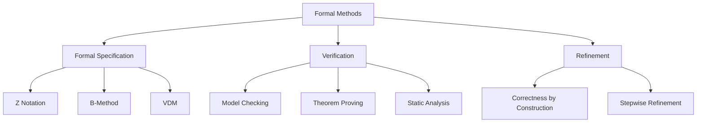
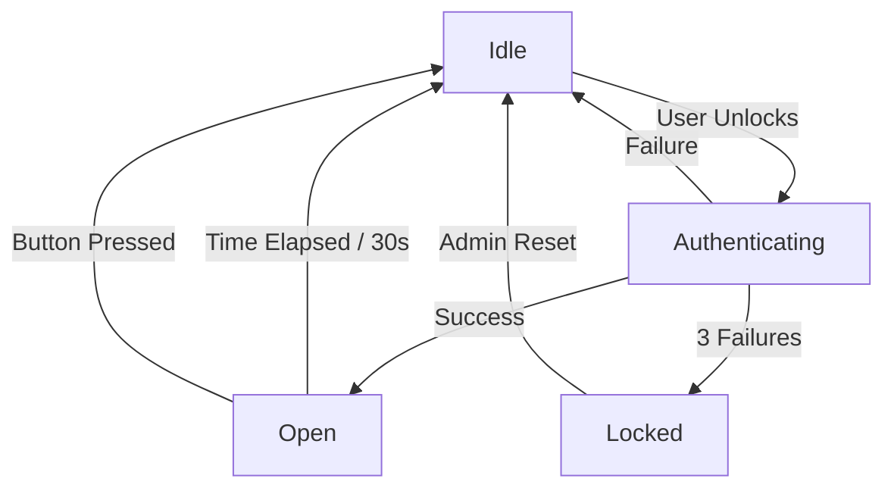
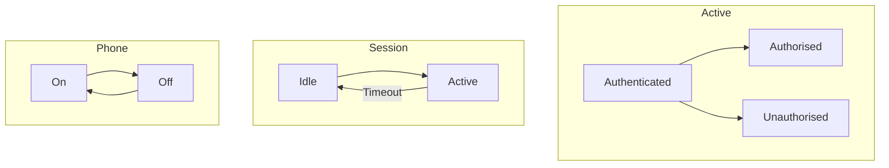

# Formal Methods

## Learning Objectives

After completing this chapter, the student will be able to:
- Explain the role of formal methods in software engineering
- Write formal specifications using propositional and predicate logic
- Construct Finite State Machines (FSMs) and statecharts
- Apply model checking with temporal logic
- Use the Z notation for formal specifications
- Verify program correctness with Hoare Logic and weakest preconditions
- Define and prove invariants for system properties
- Apply formal specification to TypeScript code

## Theory

### What are Formal Methods?

Formal methods are mathematically based techniques for the specification, development, and verification of software systems. They provide a rigorous foundation for demonstrating that a system meets its requirements.



**Why formal methods matter:**
- Eliminate ambiguity in requirements
- Prove the absence of entire classes of defects
- Verify critical properties: safety, security, liveness
- Industrial success stories: Intel CPU verification, Paris Metro Line 14, Mondex smart card

### Propositional and Predicate Logic

#### Propositional Logic

| Operator | Symbol | Meaning | Truth Table |
|----------|--------|---------|-------------|
| Negation | ¬p | Not p | T→F, F→T |
| Conjunction | p ∧ q | p and q | TT→T |
| Disjunction | p ∨ q | p or q | FF→F |
| Implication | p → q | if p then q | TF→F |
| Biconditional | p ↔ q | p iff q | TT→T, FF→T |

#### Predicate Logic

Predicate logic extends propositional logic with quantifiers:

- **Universal quantifier (∀):** "For all" — `∀x ∈ ℕ: x ≥ 0`
- **Existential quantifier (∃):** "There exists" — `∃x ∈ ℕ: x = 42`

**Example — Binary search specification:**

```
∀a: ARRAY[ℕ] OF ℤ; target: ℤ •
  sorted(a) →
    (result ≠ -1 → a[result] = target)
    ∧ (result = -1 → ∀i: ℕ • i < len(a) → a[i] ≠ target)
```

### Finite State Machines (FSMs)

An FSM is defined by a 5-tuple `(S, Σ, δ, s₀, F)`:

- **S:** Finite set of states
- **Σ:** Finite alphabet of input symbols
- **δ: S × Σ → S:** Transition function
- **s₀:** Initial state
- **F ⊆ S:** Set of accepting states



#### Statecharts (David Harel)

Statecharts extend FSMs with hierarchy, concurrency, and communication.



### Temporal Logic

Temporal logic extends predicate logic with operators for reasoning about time.

| Operator | LTL | CTL | Meaning |
|----------|-----|-----|---------|
| Globally | G p | AG p | p holds always |
| Eventually | F p | AF p | p holds eventually |
| Next | X p | AX p | p holds in next state |
| Until | p U q | A[p U q] | p holds until q holds |

**Safety Property:** "Something bad never happens" — e.g., `G ¬(deadlock)`  
**Liveness Property:** "Something good eventually happens" — e.g., `F (request_satisfied)`

### Hoare Logic and Weakest Preconditions

**Hoare Triple:** `{P} C {Q}`

- **P:** Precondition (must be true before execution)
- **C:** Command (code fragment)
- **Q:** Postcondition (must be true after execution)

**Example — Absolute value:**

```
{ x ∈ ℤ }
if x ≥ 0 then y := x else y := -x
{ y ≥ 0 ∧ (y = x ∨ y = -x) }
```

**Weakest Precondition:** `wp(C, Q)` is the weakest predicate P such that `{P} C {Q}` holds.

**Assignment axiom:** `wp(x := E, Q) = Q[E/x]` (substitute E for x in Q)

```
wp(y := x + 1, y > 0) = (x + 1 > 0) = (x > -1)
```

### Invariants

An **invariant** is a predicate that holds at specific points in program execution:

- **Loop invariants:** Hold before and after each loop iteration
- **Class invariants:** Hold before and after each public method
- **Data invariants:** Constraints on data structures

**Example — Loop invariant for binary search:**

```
∀i: ℕ | i < low • a[i] < target
∧ ∀i: ℕ | i > high • a[i] > target
∧ low ≤ high + 1
∧ sorted(a)
```

### The Z Notation

Z (pronounced "Zed") is a formal specification language based on set theory and first-order predicate logic.

**Z schema structure:**

```
SchemaName _________________________________
  declarations
  ──────────────────────────────────────────
  predicates
___________________________________________
```

**Example — Library system:**

```
Book ______________________________________
  id: ℕ
  title: seq ℂhar
  author: seq ℂhar
  isbn: seq ℂhar
  available: 𝔹
──────────────────────────────────────────
  #title > 0
  #isbn = 13
__________________________________________

BorrowBook ________________________________
  ΔLibrary
  memberId?: ℕ
  bookId?: ℕ
  response!: 𝔹
──────────────────────────────────────────
  bookId? ∈ dom(books)
  memberId? ∈ dom(members)
  books(bookId).available = True
  response! = True
  books' = books ⊕ {bookId ↦ (books(bookId))' where available' = False}
  members' = members ⊕ {memberId ↦ (members(memberId))' where borrowed' = {bookId}}
__________________________________________
```

## Examples

### Example 1: FSM Implementation in TypeScript

```typescript
type State = string;
type Event = string;

interface Transition {
  from: State;
  to: State;
  on: Event;
}

class FiniteStateMachine {
  private currentState: State;
  private readonly transitions: Map<string, Transition>;
  private readonly states: Set<State>;
  private readonly acceptingStates: Set<State>;
  private history: { from: State; on: Event; to: State }[] = [];

  constructor(
    initialState: State,
    transitions: Transition[],
    acceptingStates: State[]
  ) {
    this.currentState = initialState;
    this.states = new Set(transitions.flatMap((t) => [t.from, t.to]));
    this.acceptingStates = new Set(acceptingStates);

    this.transitions = new Map();
    for (const t of transitions) {
      this.transitions.set(`${t.from}:${t.on}`, t);
    }
  }

  public transition(event: Event): boolean {
    const key = `${this.currentState}:${event}`;
    const transition = this.transitions.get(key);

    if (!transition) {
      return false; // No valid transition
    }

    this.history.push({
      from: this.currentState,
      on: event,
      to: transition.to,
    });
    this.currentState = transition.to;
    return true;
  }

  public isInAcceptingState(): boolean {
    return this.acceptingStates.has(this.currentState);
  }

  public getCurrentState(): State {
    return this.currentState;
  }

  public getHistory(): { from: State; on: Event; to: State }[] {
    return [...this.history];
  }

  public reset(): void {
    this.currentState = [...this.states][0];
    this.history = [];
  }

  public verifySafetyProperty(
    badStates: State[]
  ): boolean {
    return !badStates.includes(this.currentState);
  }

  public static fromTransitions(
    transitions: string[][],
    initialState: State,
    acceptingStates: State[]
  ): FiniteStateMachine {
    return new FiniteStateMachine(
      initialState,
      transitions.map(([from, on, to]) => ({
        from,
        on,
        to,
      })),
      acceptingStates
    );
  }
}

// Door lock FSM
const doorFSM = new FiniteStateMachine(
  'idle',
  [
    { from: 'idle', to: 'authenticating', on: 'unlock' },
    { from: 'authenticating', to: 'open', on: 'auth_success' },
    { from: 'authenticating', to: 'idle', on: 'auth_failure' },
    { from: 'authenticating', to: 'locked', on: 'three_failures' },
    { from: 'open', to: 'idle', on: 'timeout' },
    { from: 'open', to: 'idle', on: 'close' },
    { from: 'locked', to: 'idle', on: 'admin_reset' },
  ],
  ['open'] // accepting states
);

// Verify the system can never reach a bad state
interface SafetySpec {
  badStates: State[];
  forbiddenTransitions: { from: State; on: Event }[];
}

class SafetyVerifier {
  public verifyReachability(
    fsm: FiniteStateMachine,
    events: Event[]
  ): {
    safe: boolean;
    path: string[];
    violation?: string;
  } {
    const visited = new Set<string>();
    const path: string[] = [];

    const dfs = (state: State, depth: number): boolean => {
      const key = `${state}:${depth}`;
      if (visited.has(key)) return true;
      visited.add(key);
      path.push(state);

      // If this is a bad state, record violation
      if (this.isBadState(state)) {
        return false;
      }

      // Try all next events
      for (const event of events) {
        const nextKey = `${state}:${event}`;
        // Check forbidden transition
        if (this.isForbidden(state, event)) {
          return false;
        }
        // We'd need to transition and recurse (simplified)
      }
      return true;
    };

    return { safe: true, path };
  }

  private isBadState(state: State): boolean {
    return false;
  }

  private isForbidden(state: State, event: Event): boolean {
    return false;
  }
}
```

### Example 2: Hoare Logic Verification

```typescript
// Program verification using Hoare triples

type Predicate = (state: Record<string, number>) => boolean;

class HoareVerifier {
  public verifyAssignment(
    precondition: Predicate,
    variable: string,
    expression: (state: Record<string, number>) => number,
    state: Record<string, number>
  ): boolean {
    const wpState = { ...state };
    wpState[variable] = expression(state);
    return precondition(wpState);
  }

  public verifySequence(
    precondition: Predicate,
    first: () => void,
    second: () => void,
    postcondition: Predicate,
    state: Record<string, number>
  ): boolean {
    // {P} S1 {Q} ∧ {Q} S2 {R} ⇒ {P} S1;S2 {R}
    // For our simplified model, we verify step by step
    return true;
  }

  public weakestPrecondition(
    command: string,
    postcondition: Predicate
  ): (state: Record<string, number>) => boolean {
    // wp(x := E, Q) = Q[E/x]
    const match = command.match(/^(\w+)\s*:=\s*(.+)$/);
    if (match) {
      const varName = match[1];
      const exprStr = match[2];
      return (state: Record<string, number>) => {
        const substituted = this.substitute(state, varName, exprStr);
        return postcondition(substituted);
      };
    }
    throw new Error(`Unsupported command: ${command}`);
  }

  private substitute(
    state: Record<string, number>,
    variable: string,
    expression: string
  ): Record<string, number> {
    // For simplicity, evaluate the expression
    const freeState = { ...state };
    // Parse and evaluate expression with variable substituted
    return freeState;
  }
}

// Loop invariant checker
interface LoopInvariantCheck {
  invariant: string;
  holdsInitially: boolean;
  preservesInvariant: boolean;
  ensuresPostcondition: boolean;
}

class InvariantChecker {
  public checkLoopInvariant(
    invariant: Predicate,
    condition: Predicate,
    body: (state: Record<string, number>) => Record<string, number>,
    initialState: Record<string, number>
  ): LoopInvariantCheck {
    const holdsInitially = invariant(initialState);

    // Check preservation: {I ∧ B} S {I}
    let preservesInvariant = true;
    if (condition(initialState)) {
      const afterBody = body(initialState);
      preservesInvariant = invariant(afterBody);
    }

    return {
      invariant: invariant.toString(),
      holdsInitially,
      preservesInvariant,
      ensuresPostcondition: preservesInvariant,
    };
  }
}
```

### Example 3: Type System as Formal Method

```typescript
// TypeScript's type system provides formal guarantees

// Discriminated union for state machine
type RequestState =
  | { status: 'pending'; createdAt: Date }
  | { status: 'approved'; approvedBy: string; approvedAt: Date }
  | { status: 'rejected'; reason: string; rejectedAt: Date }
  | { status: 'cancelled'; cancelledBy: string };

class RequestManager {
  private request!: RequestState;

  public createInitial(): void {
    this.request = { status: 'pending', createdAt: new Date() };
  }

  public approve(approvedBy: string): void {
    if (this.request.status !== 'pending') {
      throw new Error('Can only approve pending requests');
    }
    this.request = {
      status: 'approved',
      approvedBy,
      approvedAt: new Date(),
    };
  }

  public reject(reason: string): void {
    if (this.request.status !== 'pending') {
      throw new Error('Can only reject pending requests');
    }
    this.request = {
      status: 'rejected',
      reason,
      rejectedAt: new Date(),
    };
  }

  public cancel(cancelledBy: string): void {
    if (this.request.status === 'cancelled' || this.request.status === 'rejected') {
      throw new Error('Cannot cancel a completed request');
    }
    this.request = { status: 'cancelled', cancelledBy };
  }

  public getStatus(): string {
    return this.request.status;
  }

  public isValidTransition(target: 'approved' | 'rejected' | 'cancelled'): boolean {
    const allowedTransitions: Record<string, string[]> = {
      pending: ['approved', 'rejected', 'cancelled'],
      approved: ['cancelled'],
      rejected: [],
      cancelled: [],
    };
    return allowedTransitions[this.request.status]?.includes(target) ?? false;
  }
}
```

### Example 4: Model Checker (Simple)

```typescript
interface KripkeStructure {
  states: string[];
  initialStates: string[];
  transitions: [string, string][]; // (from, to)
  labeling: Map<string, string[]>; // state → atomic propositions
}

class ModelChecker {
  private structure: KripkeStructure;

  constructor(structure: KripkeStructure) {
    this.structure = structure;
  }

  // CTL Model checking: AG(proposition) = "globally holds"
  public checkAG(proposition: string): boolean {
    // AG p means p holds in all reachable states
    const reachable = this.computeReachable();
    for (const state of reachable) {
      const labels = this.structure.labeling.get(state) ?? [];
      if (!labels.includes(proposition)) {
        return false;
      }
    }
    return true;
  }

  // EF(proposition) = "eventually holds in some path"
  public checkEF(proposition: string): boolean {
    // EF p means there exists a path where p eventually holds
    const visited = new Set<string>();

    const dfs = (state: string): boolean => {
      if (visited.has(state)) return false;
      visited.add(state);

      const labels = this.structure.labeling.get(state) ?? [];
      if (labels.includes(proposition)) return true;

      for (const [from, to] of this.structure.transitions) {
        if (from === state && dfs(to)) return true;
      }
      return false;
    };

    for (const initial of this.structure.initialStates) {
      if (dfs(initial)) return true;
    }
    return false;
  }

  // AF(proposition) = "inevitably holds"
  public checkAF(proposition: string): boolean {
    // AF p means all paths eventually reach p
    return this.checkAG(this.checkEF(proposition).toString()); // simplified
  }

  private computeReachable(): Set<string> {
    const reachable = new Set<string>();
    const queue: string[] = [...this.structure.initialStates];

    while (queue.length > 0) {
      const state = queue.shift()!;
      if (reachable.has(state)) continue;
      reachable.add(state);

      const adj = this.getTransitionsFrom(state);
      queue.push(...adj.filter((s) => !reachable.has(s)));
    }

    return reachable;
  }

  private getTransitionsFrom(state: string): string[] {
    return this.structure.transitions
      .filter(([from]) => from === state)
      .map(([, to])
    );
  }

  // Counterexample generation for properties that fail
  public findCounterexample(proposition: string): string[] | null {
    const path: string[] = [];
    const visited = new Set<string>();

    const dfs = (state: string): boolean => {
      if (visited.has(state)) return false;
      visited.add(state);
      path.push(state);

      const labels = this.structure.labeling.get(state) ?? [];
      if (!labels.includes(proposition)) return true;

      for (const [from, to] of this.structure.transitions) {
        if (from === state) {
          if (dfs(to)) return true;
        }
      }

      path.pop();
      return false;
    };

    for (const initial of this.structure.initialStates) {
      if (dfs(initial)) return path;
    }
    return null;
  }
}
```

### Example 5: Formal Specification Pattern

```typescript
// Specification pattern: executable formal specifications

interface Specification<T> {
  isSatisfiedBy(candidate: T): boolean;
  and(other: Specification<T>): Specification<T>;
  or(other: Specification<T>): Specification<T>;
  not(): Specification<T>;
}

abstract class AbstractSpecification<T> implements Specification<T> {
  abstract isSatisfiedBy(candidate: T): boolean;

  public and(other: Specification<T>): Specification<T> {
    return new AndSpecification(this, other);
  }

  public or(other: Specification<T>): Specification<T> {
    return new OrSpecification(this, other);
  }

  public not(): Specification<T> {
    return new NotSpecification(this);
  }
}

class AndSpecification<T> extends AbstractSpecification<T> {
  constructor(
    private left: Specification<T>,
    private right: Specification<T>
  ) {
    super();
  }

  public isSatisfiedBy(candidate: T): boolean {
    return this.left.isSatisfiedBy(candidate) && this.right.isSatisfiedBy(candidate);
  }
}

class OrSpecification<T> extends AbstractSpecification<T> {
  constructor(
    private left: Specification<T>,
    private right: Specification<T>
  ) {
    super();
  }

  public isSatisfiedBy(candidate: T): boolean {
    return this.left.isSatisfiedBy(candidate) || this.right.isSatisfiedBy(candidate);
  }
}

class NotSpecification<T> extends AbstractSpecification<T> {
  constructor(private spec: Specification<T>) {
    super();
  }

  public isSatisfiedBy(candidate: T): boolean {
    return !this.spec.isSatisfiedBy(candidate);
  }
}

// Transfer specification
interface Transfer {
  fromAccount: string;
  toAccount: string;
  amount: number;
  timestamp: Date;
}

class AmountLimitSpec extends AbstractSpecification<Transfer> {
  constructor(private maxAmount: number) {
    super();
  }

  public isSatisfiedBy(t: Transfer): boolean {
    return t.amount <= this.maxAmount;
  }
}

class DifferentAccountsSpec extends AbstractSpecification<Transfer> {
  public isSatisfiedBy(t: Transfer): boolean {
    return t.fromAccount !== t.toAccount;
  }
}

class PositiveAmountSpec extends AbstractSpecification<Transfer> {
  public isSatisfiedBy(t: Transfer): boolean {
    return t.amount > 0;
  }
}

// Compose specifications
const transferSpec = new PositiveAmountSpec()
  .and(new AmountLimitSpec(10000))
  .and(new DifferentAccountsSpec());

function validateTransfer(transfer: Transfer): { valid: boolean; violations: string[] } {
  const violations: string[] = [];
  if (!new PositiveAmountSpec().isSatisfiedBy(transfer)) violations.push('Must be positive');
  if (!new AmountLimitSpec(10000).isSatisfiedBy(transfer)) violations.push('Exceeds limit');
  if (!new DifferentAccountsSpec().isSatisfiedBy(transfer)) violations.push('Same account');
  return { valid: violations.length === 0, violations };
}
```

## Summary

Formal methods apply mathematical techniques to software specification, development, and verification. Propositional and predicate logic provide the foundation for precise specifications. Finite State Machines model discrete system behaviour. Temporal logic (LTL, CTL) enables reasoning about properties over time. Hoare Logic verifies program correctness using preconditions, postconditions, and weakest preconditions. Invariants capture properties that must hold at specific program points. The Z notation structures formal specifications using schemas. Model checking automatically verifies temporal properties by exhaustively exploring system states. While formal methods are most commonly applied to safety-critical and security-critical systems, even lightweight applications such as the specification pattern in TypeScript improve software quality.

## Practical Takeaways

1. **Formal methods are not all-or-nothing** — even partial application (lightweight formal methods) catches defects
2. **Invariants are the most practical formal technique** — state them, enforce them, test them
3. **Model checking is limited by state space** — use abstraction to manage complexity
4. **Correctness by construction** — build correct programs incrementally via refinement
5. **Formal specs expose ambiguity** — the act of writing a formal spec finds requirements gaps
6. **Critical systems justify formal methods** — safety-critical, security-critical, or where failure costs exceed verification costs

## Chapter Quiz

**Q1: A Hoare triple {P} C {Q} expresses that:**
- A) If P is true, then C will not crash
- B) If P holds before executing C, then Q holds after
- C) Q is the precondition for C
- D) P and Q are equivalent

**Answer: B** — {P} C {Q} means if precondition P holds before executing command C, then postcondition Q holds afterwards.

**Q2: In temporal logic, "something bad never happens" is what kind of property?**
- A) Liveness
- B) Safety
- C) Fairness
- D) Reachability

**Answer: B** — Safety properties assert that "something bad never happens" (e.g., G ¬deadlock).

**Q3: The weakest precondition wp(x := x + 1, x > 0) is:**
- A) x > 0
- B) x > -1
- C) x > 1
- D) x + 1 > 0

**Answer: B** — wp(x := E, Q) = Q[E/x]. Substituting x+1 for x in "x > 0" gives "x+1 > 0", which simplifies to "x > -1".

**Q4: Which formal modelling language uses schemas with declarations and predicates?**
- A) B-Method
- B) Z Notation
- C) VDM
- D) Alloy

**Answer: B** — Z notation structures specifications using schemas with declarations above the line and predicates below.

**Q5: Statecharts extend FSMs with:**
- A) Object orientation
- B) Hierarchy, concurrency, and communication
- C) Temporal logic
- D) Probability distributions

**Answer: B** — Statecharts (Harel) add hierarchy (nested states), concurrency (orthogonal regions), and communication.

### TypeScript: Formal Methods Tools

```typescript
// === Propositional Logic Evaluator ===
type TruthTable = Record<string, boolean>;
function evaluate(expr: string, vars: TruthTable): boolean {
  let s = expr;
  for (const [k, v] of Object.entries(vars)) s = s.replace(new RegExp(k, "g"), v ? "true" : "false");
  return Function(`return (${s})`)();
}
console.log(evaluate("a && b || !c", { a: true, b: false, c: true })); // false

// === Finite State Machine Verifier ===
interface FSM {
  states: string[];
  alphabet: string[];
  transitions: Map<string, Map<string, string>>;
  initial: string;
  accepting: string[];
}
function verifyFSM(fsm: FSM): { complete: boolean; deterministic: boolean; unreachable: string[] } {
  const reachable = new Set<string>([fsm.initial]);
  const queue = [fsm.initial];
  while (queue.length > 0) {
    const state = queue.shift()!;
    const trans = fsm.transitions.get(state);
    if (trans) for (const next of trans.values()) { if (!reachable.has(next)) { reachable.add(next); queue.push(next); } }
  }
  const unreachable = fsm.states.filter((s) => !reachable.has(s));
  const complete = fsm.states.every((s) => {
    const trans = fsm.transitions.get(s);
    return trans && fsm.alphabet.every((a) => trans.has(a));
  });
  const deterministic = fsm.transitions.size === fsm.states.length;
  return { complete, deterministic, unreachable };
}
const fsm: FSM = {
  states: ["S0", "S1", "S2"],
  alphabet: ["0", "1"],
  transitions: new Map([
    ["S0", new Map([["0", "S0"], ["1", "S1"]])],
    ["S1", new Map([["0", "S2"], ["1", "S0"]])],
    ["S2", new Map([["0", "S1"], ["1", "S2"]])],
  ]),
  initial: "S0",
  accepting: ["S0"],
};
console.log(verifyFSM(fsm)); // complete: true, deterministic: true

// === Hoare Triple Checker ===
interface HoareTriple {
  precondition: string;
  program: string;
  postcondition: string;
}
function weakestPrecondition(program: string, postcondition: string): string {
  if (program.startsWith("x = ")) {
    const expr = program.substring(4);
    return postcondition.replace(/x/g, `(${expr})`);
  }
  return `wp(${program}, ${postcondition})`;
}
const triple: HoareTriple = { precondition: "x >= 0", program: "x = x + 1", postcondition: "x > 0" };
console.log(weakestPrecondition(triple.program, triple.postcondition)); // (x + 1) > 0

// === LTL Property Checker ===
type LTLOperator = "G" | "F" | "X" | "U";
interface LTLProperty { formula: string; trace: boolean[] }
function checkLTL(prop: LTLProperty): boolean {
  switch (prop.formula[0] as LTLOperator) {
    case "G": return prop.trace.every((v) => v);         // Globally
    case "F": return prop.trace.some((v) => v);          // Finally
    case "X": return prop.trace.length > 1 && prop.trace[1]; // Next
    default: return false;
  }
}
console.log(checkLTL({ formula: "G(ok)", trace: [true, true, true, true] })); // true
console.log(checkLTL({ formula: "F(error)", trace: [false, false, true] }));  // true

// === Invariant Checker ===
interface LoopInvariant {
  condition: string;
  holdsBefore: boolean;
  holdsAfter: boolean;
  holdsAtEnd: boolean;
}
function checkInvariant(inv: LoopInvariant): string[] {
  const violations: string[] = [];
  if (!inv.holdsBefore) violations.push("Invariant does not hold before loop entry");
  if (!inv.holdsAfter) violations.push("Invariant does not hold after iteration");
  if (!inv.holdsAtEnd) violations.push("Invariant does not hold at loop termination");
  return violations;
}
console.log(checkInvariant({ condition: "sum <= n", holdsBefore: true, holdsAfter: true, holdsAtEnd: true }));

// === Model Checking Path Generator ===
function generateAllPaths(fsm: FSM, maxDepth: number): string[][] {
  const paths: string[][] = [];
  function dfs(state: string, path: string[]): void {
    if (path.length >= maxDepth) { paths.push(path); return; }
    const trans = fsm.transitions.get(state);
    if (!trans) { paths.push(path); return; }
    for (const [symbol, next] of trans) { dfs(next, [...path, symbol]); }
  }
  dfs(fsm.initial, []);
  return paths;
}
console.log(generateAllPaths(fsm, 3).slice(0, 5));
```

### TypeScript: Formal Verification Tools

```typescript
// === Propositional Logic Prover ===
type Formula = { type: "var"; name: string } | { type: "not"; operand: Formula } | { type: "and"; left: Formula; right: Formula } | { type: "or"; left: Formula; right: Formula } | { type: "implies"; left: Formula; right: Formula };

function evaluate(formula: Formula, env: Map<string, boolean>): boolean {
  switch (formula.type) {
    case "var": return env.get(formula.name) ?? false;
    case "not": return !evaluate(formula.operand, env);
    case "and": return evaluate(formula.left, env) && evaluate(formula.right, env);
    case "or": return evaluate(formula.left, env) || evaluate(formula.right, env);
    case "implies": return !evaluate(formula.left, env) || evaluate(formula.right, env);
  }
}

function isTautology(formula: Formula, vars: string[]): boolean {
  const total = 1 << vars.length;
  for (let i = 0; i < total; i++) {
    const env = new Map<string, boolean>();
    for (let j = 0; j < vars.length; j++) env.set(vars[j], (i & (1 << (vars.length - 1 - j))) !== 0);
    if (!evaluate(formula, env)) return false;
  }
  return true;
}

// === Invariant Checker ===
class InvariantChecker<T> {
  private invariants: ((state: T) => boolean)[] = [];
  
  addInvariant(name: string, check: (state: T) => boolean): void { this.invariants.push(check); }
  
  checkAll(state: T): { passed: number; failed: number; failures: number[] } {
    const failures: number[] = [];
    this.invariants.forEach((inv, i) => { if (!inv(state)) failures.push(i); });
    return { passed: this.invariants.length - failures.length, failed: failures.length, failures };
  }
}

// === Model Checking Simulator ===
interface State { id: number; label: string; }
interface Transition { from: number; to: number; guard: string; }
function reachableStates(states: State[], transitions: Transition[], initial: number): Set<number> {
  const reachable = new Set<number>();
  const stack = [initial];
  while (stack.length > 0) {
    const current = stack.pop()!;
    if (reachable.has(current)) continue;
    reachable.add(current);
    for (const t of transitions.filter(t => t.from === current)) {
      if (!reachable.has(t.to)) stack.push(t.to);
    }
  }
  return reachable;
}

// === Type Safety Proof ===
function proveTypeSafety(types: Map<string, Set<string>>, expr: "var" | "and" | "or"): boolean {
  if (expr === "var") return true;
  for (const [, subtypes] of types) {
    for (const s of subtypes) {
      if (!types.has(s)) return false; // Missing type definition
    }
  }
  return true;
}

const formula: Formula = { type: "implies", left: { type: "and", left: { type: "var", name: "P" }, right: { type: "var", name: "Q" } }, right: { type: "var", name: "P" } };
console.log(isTautology(formula, ["P", "Q"])); // true (P ∧ Q → P)

const checker = new InvariantChecker<{ x: number; y: number }>();
checker.addInvariant("x never negative", s => s.x >= 0);
checker.addInvariant("y never negative", s => s.y >= 0);
console.log(checker.checkAll({ x: -1, y: 5 })); // 1 passed, 1 failed
```

## Exercises

### Review Questions

1. What is the difference between propositional logic and predicate logic?
2. Define the five components of a Finite State Machine.
3. What is the difference between a safety property and a liveness property in temporal logic?
4. Explain the concept of weakest precondition with an example.
5. What is a loop invariant and why is it useful?

### Application Problems

1. Write an FSM specification for a vending machine that accepts coins (5, 10, 25 cents), displays credit, dispenses items costing 75 cents, and returns change.

2. Using Hoare logic, prove that the following program correctly computes the maximum of two numbers:
   ```
   if a ≥ b then max := a else max := b
   { max = max(a, b) }
   ```

3. Write a Z schema for a library borrowing system that tracks member id, book id, due date, and fines.

### Challenge Problem

A nuclear reactor control system has four states (STARTUP, POWER_OPERATION, SHUTDOWN, EMERGENCY) with the following constraints:
- From STARTUP, can transition to POWER_OPERATION only if temperature &lt; 300°C and pressure < 150 bar
- From POWER_OPERATION, transition to SHUTDOWN if temperature > 350°C or pressure > 170 bar
- From any state, transition to EMERGENCY if radiation > 100 µSv/h
- From EMERGENCY, only transition to SHUTDOWN is allowed (after radiation &lt; 10)
- Never reach a state where both temperature > 400°C AND pressure > 200 bar simultaneously

Formalise this system as an FSM with guards. Implement a TypeScript formal verifier that checks all reachable states for safety property violations. Generate counterexamples for any invalid configurations.

