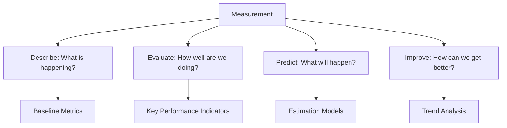
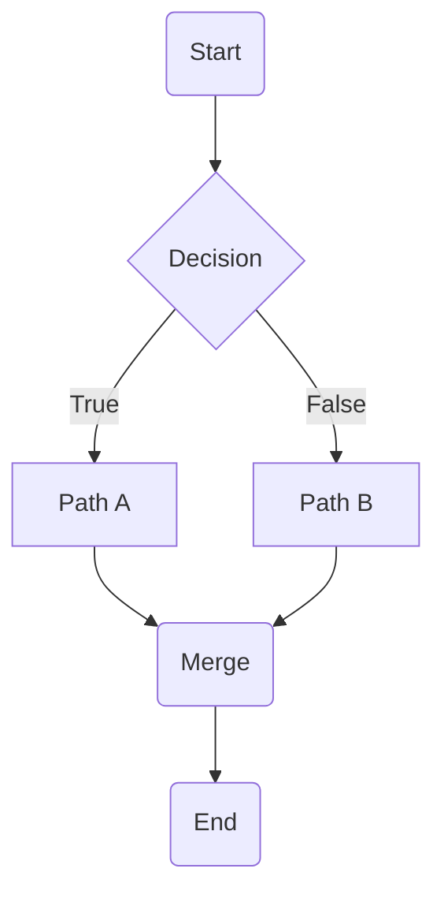

# Software Metrics and Measurement

## Learning Objectives

After completing this chapter, the student will be able to:
- Distinguish between process, product, and project metrics
- Measure software size using LOC, function points, and object points
- Calculate and interpret complexity metrics (cyclomatic, Halstead, coupling)
- Analyse maintainability using the Maintainability Index
- Apply GQM (Goal-Question-Metric) to derive meaningful metrics
- Implement metrics collection and dashboards in TypeScript
- Interpret metrics to drive process improvement

## Theory

### Why Measure Software?

"If you cannot measure it, you cannot improve it." — Lord Kelvin

Software measurement serves four purposes:



### Metric Classification

| Category | What it measures | Examples |
|----------|-----------------|----------|
| **Product metrics** | Software product characteristics | Size, complexity, defects, performance |
| **Process metrics** | Development process characteristics | Cycle time, defect injection rate, rework % |
| **Project metrics** | Project management characteristics | Schedule variance, cost variance, team velocity |

### GQM Paradigm (Goal-Question-Metric)

GQM provides a structured way to derive metrics from goals:

```mermaid
graph TD
    GOAL[Goal: Improve defect detection] --> Q1[Question 1: How many defects are found before release?]
    GOAL --> Q2[Question 2: Which phase finds the most defects?]
    GOAL --> Q3[Question 3: How long do defects remain undetected?]
    
    Q1 --> M1[Metric: Pre-release defect density]
    Q1 --> M2[Metric: Post-release defect density]
    Q2 --> M3[Metric: Defects found per phase]
    Q2 --> M4[Metric: Phase defect detection rate]
    Q3 --> M5[Metric: Defect latency (days)]
```

**Applying GQM:**

| Level | Example |
|-------|---------|
| **Goal** | Improve on-time delivery |
| **Question 1** | How accurate are our estimates? |
| Metric 1 | Estimation accuracy (actual / estimated) |
| Metric 2 | Schedule variance |
| **Question 2** | What causes schedule overruns? |
| Metric 3 | Requirements change rate |
| Metric 4 | Rework percentage |

### Size Metrics

#### Lines of Code (LOC)

| Type | Counts | Usage |
|------|--------|-------|
| **Physical LOC** | All lines, including comments and blanks | Simple counting |
| **Logical LOC** | Executable statements only | Language-independent comparison |
| **Source LOC (SLOC)** | Source statements (no comments/blanks) | Productivity measurement |

**Normalisation:**

| Measure | Formula |
|---------|---------|
| **Productivity** | LOC / person-month |
| **Defect density** | Defects / KLOC |
| **Cost per LOC** | Total cost / LOC |

#### Function Points

As detailed in Chapter 8 (Project Management), function points measure functionality from the user's perspective.

| Type | Weight (Simple) | Weight (Average) | Weight (Complex) |
|------|-----------------|------------------|-----------------|
| External Input | 3 | 4 | 6 |
| External Output | 4 | 5 | 7 |
| External Inquiry | 3 | 4 | 6 |
| Internal Logical File | 7 | 10 | 15 |
| External Interface File | 5 | 7 | 10 |

### Complexity Metrics

#### Cyclomatic Complexity (McCabe)

`M = E - N + 2P`

Where E = edges, N = nodes, P = connected components.



**Complexity = 3** (3 decision points: start, decision, merge)

| M | Risk | Test Cases Needed |
|---|------|-------------------|
| 1-10 | Low risk, simple | M |
| 11-20 | Moderate risk | M |
| 21-50 | High risk | M |
| 50+ | Untestable | M |

#### Halstead Complexity Metrics

Maurice Halstead's software science metrics measure program vocabulary and length:

| Metric | Formula | Meaning |
|--------|---------|---------|
| **n₁** | Unique operators | Program vocabulary richness |
| **n₂** | Unique operands | Data complexity |
| **N₁** | Total operators | Program length |
| **N₂** | Total operands | Data usage |
| **Vocabulary** | n = n₁ + n₂ | Total vocabulary |
| **Length** | N = N₁ + N₂ | Program length |
| **Volume** | V = N × log₂(n) | Program size in bits |
| **Difficulty** | D = (n₁ / 2) × (N₂ / n₂) | How hard to write/understand |
| **Effort** | E = D × V | Required mental effort |
| **Time (seconds)** | T = E / 18 | Time to implement |

### Maintainability Index

The Maintainability Index (MI) combines four metrics:

```
MI = 171 - 5.2 × ln(V) - 0.23 × (G) - 16.2 × ln(LOC) + 50 × sin(√(2.4 × CM))
```

Where:
- V = Halstead Volume
- G = Cyclomatic Complexity
- LOC = Lines of Code
- CM = Percent of comments

| MI Score | Maintainability |
|----------|----------------|
| 85-100 | Highly maintainable |
| 65-85 | Moderately maintainable |
| < 65 | Difficult to maintain |

### Defect Metrics

| Metric | Formula | Target |
|--------|---------|--------|
| **Defect density** | Defects / KLOC | < 1 defect/KLOC for high quality |
| **Defect detection rate** | Pre-release defects / Total defects | > 95% |
| **Defect removal efficiency** | Fixed defects / Reported defects | > 90% |
| **Mean time to failure (MTTF)** | Operating time / Failures | Application dependent |
| **Defect arrival rate** | Defects / time period | Decreasing trend |
| **Backlog index** | Open defects / Total defects | < 10% |

### Process Metrics

| Metric | Formula | Purpose |
|--------|---------|---------|
| **Cycle time** | Time from start to completion | Process efficiency |
| **Lead time** | Time from request to delivery | Customer satisfaction |
| **Velocity** | Story points per sprint | Team throughput |
| **Rework %** | Rework effort / Total effort | Quality of initial work |
| **Phase containment** | Defects found in phase / Defects injected | Phase effectiveness |

## Practical Takeaways

1. **Metrics are means, not ends** — measure to improve, not to judge
2. **Never use a single metric in isolation** — each metric tells part of the story
3. **GQM prevents vanity metrics** — always derive metrics from goals
4. **Automate collection** — manual metrics are unreliable and unsustainable
5. **Trends over thresholds** — a declining trend matters more than a single value
6. **Share metrics transparently** — hidden metrics erode trust

## Examples

### Example 1: Metrics Collection Framework

```typescript
interface CodeMetrics {
  loc: number;
  sloc: number;
  commentLines: number;
  cyclomaticComplexity: number;
  functionCount: number;
  classCount: number;
  depthOfInheritance: number;
  couplingBetweenObjects: number;
}

class MetricsCollector {
  public async analyzeFile(sourceCode: string): Promise<CodeMetrics> {
    const lines = sourceCode.split('\n');
    const codeLines = lines.filter((l) => l.trim().length > 0);
    const commentLines = lines.filter(
      (l) => l.trim().startsWith('//') || l.trim().startsWith('/*') || l.trim().startsWith('*')
    );

    // Count functions and classes
    const functionMatches = sourceCode.match(/(function\s+\w+|=>\s*{|\([^)]*\)\s*{)/g) ?? [];
    const classMatches = sourceCode.match(/class\s+\w+/g) ?? [];

    // Simple cyclomatic complexity count
    const predicates = (
      sourceCode.match(/if\s*\(|else\s+if|for\s*\(|while\s*\(|case\s+|catch\s*\(/g) ?? []
    ).length;

    // Inheritance depth (simplified: count extends keywords)
    const extendsCount = (sourceCode.match(/extends\s+\w+/g) ?? []).length;

    // Coupling (simplified: count import statements)
    const imports = (sourceCode.match(/import\s+\{[^}]*\}\s+from/g) ?? []).length;

    return {
      loc: lines.length,
      sloc: codeLines.length,
      commentLines: commentLines.length,
      cyclomaticComplexity: 1 + predicates,
      functionCount: functionMatches.length,
      classCount: classMatches.length,
      depthOfInheritance: extendsCount > 0 ? extendsCount + 1 : 0,
      couplingBetweenObjects: imports,
    };
  }

  public calculateMaintainabilityIndex(metrics: CodeMetrics): number {
    const V = metrics.sloc * Math.log2(
      Math.max(1, metrics.functionCount + metrics.classCount)
    );
    const G = metrics.cyclomaticComplexity;
    const LOC = metrics.sloc;
    const CM = LOC > 0 ? metrics.commentLines / LOC : 0;

    const mi = 171
      - 5.2 * Math.log(Math.max(1, V))
      - 0.23 * G
      - 16.2 * Math.log(Math.max(1, LOC))
      + 50 * Math.sin(Math.sqrt(2.4 * CM * 100));

    return Math.min(100, Math.max(0, Math.round(mi)));
  }
}

// Performance metrics
interface PerformanceMetrics {
  responseTimePercentiles: { p50: number; p90: number; p95: number; p99: number };
  throughput: number;
  errorRate: number;
  cpuUsage: number;
  memoryUsage: number;
}

class PerformanceMonitor {
  private responseTimes: number[] = [];
  private errorCount = 0;
  private requestCount = 0;

  public recordResponseTime(ms: number): void {
    this.responseTimes.push(ms);
    this.requestCount++;
  }

  public recordError(): void {
    this.errorCount++;
    this.requestCount++;
  }

  public getMetrics(): PerformanceMetrics {
    const sorted = [...this.responseTimes].sort((a, b) => a - b);
    const len = sorted.length;

    return {
      responseTimePercentiles: {
        p50: len > 0 ? sorted[Math.floor(len * 0.5)] : 0,
        p90: len > 0 ? sorted[Math.floor(len * 0.9)] : 0,
        p95: len > 0 ? sorted[Math.floor(len * 0.95)] : 0,
        p99: len > 0 ? sorted[Math.floor(len * 0.99)] : 0,
      },
      throughput: this.requestCount,
      errorRate: this.requestCount > 0 ? this.errorCount / this.requestCount : 0,
      cpuUsage: process.cpuUsage().user / 1000000,
      memoryUsage: process.memoryUsage().heapUsed / 1024 / 1024,
    };
  }

  public reset(): void {
    this.responseTimes = [];
    this.errorCount = 0;
    this.requestCount = 0;
  }
}
```

### Example 2: GQM Metric Designer

```typescript
type GoalCategory = 'quality' | 'productivity' | 'predictability' | 'customer_satisfaction';

interface Goal {
  id: string;
  description: string;
  category: GoalCategory;
  questions: Question[];
}

interface Question {
  id: string;
  text: string;
  metrics: Metric[];
}

interface Metric {
  id: string;
  name: string;
  formula: string;
  collectionMethod: 'automated' | 'manual' | 'survey';
  frequency: 'daily' | 'weekly' | 'sprint' | 'monthly' | 'release';
  target: string;
}

class GQMFramework {
  private goals: Goal[] = [];

  public createGoal(
    description: string,
    category: GoalCategory
  ): Goal {
    const goal: Goal = {
      id: `G-${this.goals.length + 1}`,
      description,
      category,
      questions: [],
    };
    this.goals.push(goal);
    return goal;
  }

  public addQuestion(goalId: string, text: string): Question {
    const goal = this.goals.find((g) => g.id === goalId);
    if (!goal) throw new Error(`Goal ${goalId} not found`);

    const question: Question = {
      id: `Q-${goal.questions.length + 1}`,
      text,
      metrics: [],
    };
    goal.questions.push(question);
    return question;
  }

  public addMetric(
    questionId: string,
    name: string,
    formula: string,
    collectionMethod: Metric['collectionMethod'],
    frequency: Metric['frequency'],
    target: string
  ): Metric {
    const question = this.findQuestion(questionId);
    const metric: Metric = {
      id: `M-${this.countAllMetrics() + 1}`,
      name,
      formula,
      collectionMethod,
      frequency,
      target,
    };
    question.metrics.push(metric);
    return metric;
  }

  private findQuestion(questionId: string): Question {
    for (const goal of this.goals) {
      const q = goal.questions.find((q) => q.id === questionId);
      if (q) return q;
    }
    throw new Error(`Question ${questionId} not found`);
  }

  private countAllMetrics(): number {
    return this.goals.reduce(
      (sum, g) => sum + g.questions.reduce(
        (sq, q) => sq + q.metrics.length, 0
      ), 0
    );
  }

  public generateReport(): string {
    return this.goals.map((goal) => {
      const lines = [
        `Goal: ${goal.description} [${goal.category}]`,
      ];
      for (const question of goal.questions) {
        lines.push(`  Question: ${question.text}`);
        for (const metric of question.metrics) {
          lines.push(`    [${metric.id}] ${metric.name}: ${metric.formula}`);
          lines.push(`      Collection: ${metric.collectionMethod}, Frequency: ${metric.frequency}`);
          lines.push(`      Target: ${metric.target}`);
        }
      }
      return lines.join('\n');
    }).join('\n\n');
  }
}
```

### Example 3: Quality Dashboard

```typescript
interface QualityGate {
  name: string;
  metric: string;
  threshold: number;
  operator: 'lt' | 'gt' | 'lte' | 'gte' | 'eq';
}

interface DashboardSnapshot {
  timestamp: Date;
  buildId: string;
  metrics: Record<string, number>;
  gates: { gate: string; passed: boolean; actual: number }[];
  overallStatus: 'pass' | 'fail' | 'warning';
}

class QualityDashboard {
  private readonly gates: QualityGate[] = [];
  private readonly history: DashboardSnapshot[] = [];

  public addGate(gate: QualityGate): void {
    this.gates.push(gate);
  }

  public recordSnapshot(buildId: string, metrics: Record<string, number>): DashboardSnapshot {
    const gateResults = this.gates.map((gate) => {
      const actual = metrics[gate.metric] ?? 0;
      let passed: boolean;

      switch (gate.operator) {
        case 'lt': passed = actual < gate.threshold; break;
        case 'gt': passed = actual > gate.threshold; break;
        case 'lte': passed = actual <= gate.threshold; break;
        case 'gte': passed = actual >= gate.threshold; break;
        case 'eq': passed = actual === gate.threshold; break;
        default: passed = false;
      }

      return { gate: gate.name, passed, actual };
    });

    const failures = gateResults.filter((g) => !g.passed).length;
    const overallStatus: 'pass' | 'fail' | 'warning' =
      failures === 0 ? 'pass' : failures <= 1 ? 'warning' : 'fail';

    const snapshot: DashboardSnapshot = {
      timestamp: new Date(),
      buildId,
      metrics,
      gates: gateResults,
      overallStatus,
    };

    this.history.push(snapshot);
    return snapshot;
  }

  public getTrend(metricName: string, lastN: number = 10): {
    values: number[];
    direction: 'improving' | 'declining' | 'stable';
    average: number;
  } {
    const recent = this.history.slice(-lastN);
    const values = recent.map((s) => s.metrics[metricName] ?? 0);

    if (values.length < 2) {
      return { values, direction: 'stable', average: values[0] ?? 0 };
    }

    const average = values.reduce((a, b) => a + b, 0) / values.length;
    const firstHalf = values.slice(0, Math.floor(values.length / 2));
    const secondHalf = values.slice(Math.floor(values.length / 2));
    const firstAvg = firstHalf.reduce((a, b) => a + b, 0) / firstHalf.length;
    const secondAvg = secondHalf.reduce((a, b) => a + b, 0) / secondHalf.length;

    const direction = secondAvg < firstAvg * 0.95
      ? 'improving'
      : secondAvg > firstAvg * 1.05
        ? 'declining'
        : 'stable';

    return { values, direction, average };
  }

  public generateSummary(): string {
    if (this.history.length === 0) return 'No data recorded';

    const latest = this.history[this.history.length - 1];
    const passRate = this.history.filter((s) => s.overallStatus === 'pass').length / this.history.length;

    return [
      `Dashboard Summary (${this.history.length} snapshots)`,
      `Latest Build: ${latest.buildId} | Status: ${latest.overallStatus.toUpperCase()}`,
      `Pass Rate: ${(passRate * 100).toFixed(1)}%`,
      '',
      'Gates:',
      ...latest.gates.map((g) =>
        `  ${g.passed ? '✓' : '✗'} ${g.gate}: ${g.actual} (${g.passed ? 'pass' : 'FAIL'})`
      ),
      '',
      'Metrics:',
      ...Object.entries(latest.metrics)
        .map(([key, val]) => `  ${key}: ${typeof val === 'number' ? val.toFixed(2) : val}`),
    ].join('\n');
  }
}
```

### Example 4: Halstead Complexity Calculator

```typescript
interface HalsteadMetrics {
  uniqueOperators: number;    // n1
  uniqueOperands: number;    // n2
  totalOperators: number;    // N1
  totalOperands: number;     // N2
  vocabulary: number;        // n = n1 + n2
  length: number;            // N = N1 + N2
  volume: number;            // V = N * log2(n)
  difficulty: number;        // D = (n1/2) * (N2/n2)
  effort: number;            // E = D * V
  timeSeconds: number;       // T = E / 18
  bugsDelivered: number;     // B = V / 3000
}

class HalsteadAnalyzer {
  // Operator keywords in TypeScript
  private static readonly OPERATORS = new Set([
    '+', '-', '*', '/', '%', '=', '==', '===', '!=', '!==',
    '<', '>', '<=', '>=', '&&', '||', '!', '&', '|', '^', '~',
    '<<', '>>', '>>>', '??', '?.',
    'if', 'else', 'for', 'while', 'do', 'switch', 'case',
    'return', 'break', 'continue', 'throw', 'try', 'catch',
    'function', '=>', 'class', 'new', 'typeof', 'instanceof',
    'void', 'delete', 'in', 'of', 'as', 'is',
  ]);

  public analyze(sourceCode: string): HalsteadMetrics {
    const tokens = this.tokenize(sourceCode);
    const operators = new Map<string, number>();
    const operands = new Map<string, number>();

    for (const token of tokens) {
      if (HalsteadAnalyzer.OPERATORS.has(token)) {
        operators.set(token, (operators.get(token) ?? 0) + 1);
      } else if (/^\w+$/.test(token)) {
        operands.set(token, (operands.get(token) ?? 0) + 1);
      }
    }

    const n1 = operators.size;
    const n2 = operands.size;
    const N1 = Array.from(operators.values()).reduce((a, b) => a + b, 0);
    const N2 = Array.from(operands.values()).reduce((a, b) => a + b, 0);
    const n = n1 + n2;
    const N = N1 + N2;
    const V = n > 0 ? N * Math.log2(n) : 0;
    const D = n2 > 0 ? (n1 / 2) * (N2 / n2) : 0;
    const E = D * V;
    const T = E / 18;
    const B = V / 3000;

    return {
      uniqueOperators: n1,
      uniqueOperands: n2,
      totalOperators: N1,
      totalOperands: N2,
      vocabulary: n,
      length: N,
      volume: Math.round(V * 100) / 100,
      difficulty: Math.round(D * 100) / 100,
      effort: Math.round(E),
      timeSeconds: Math.round(T),
      bugsDelivered: Math.round(B * 100) / 100,
    };
  }

  private tokenize(code: string): string[] {
    // Simple tokenizer for analysis
    return code
      .replace(/\/\/.*$/gm, '')        // Remove single-line comments
      .replace(/\/\*[\s\S]*?\*\//g, '')  // Remove block comments
      .replace(/"[^"]*"/g, '""')         // Normalize string literals
      .replace(/'[^']*'/g, "''")
      .replace(/`[^`]*`/g, '``')
      .split(/\s+|(?=[{}\[\]();.,:])|(?<=[{}\[\]();.,:])/g)
      .filter((t) => t.length > 0);
  }
}
```

### Example 5: Defect Metrics Tracker

```typescript
type DefectPhase = 'requirements' | 'design' | 'implementation' | 'testing' | 'production';
type DefectSeverity = 'critical' | 'major' | 'minor' | 'trivial';

interface DefectRecord {
  id: string;
  description: string;
  injectedPhase: DefectPhase;
  detectedPhase: DefectPhase;
  severity: DefectSeverity;
  fixEffortHours: number;
  detectionDate: Date;
  fixDate?: Date;
}

class DefectMetricsAnalyzer {
  private defects: DefectRecord[] = [];
  private sequence = 0;

  public recordDefect(
    description: string,
    injectedPhase: DefectPhase,
    detectedPhase: DefectPhase,
    severity: DefectSeverity,
    fixEffortHours: number
  ): DefectRecord {
    const defect: DefectRecord = {
      id: `BUG-${++this.sequence}`,
      description,
      injectedPhase,
      detectedPhase,
      severity,
      fixEffortHours,
      detectionDate: new Date(),
    };
    this.defects.push(defect);
    return defect;
  }

  public markFixed(defectId: string): void {
    const defect = this.defects.find((d) => d.id === defectId);
    if (defect) {
      defect.fixDate = new Date();
    }
  }

  public getDefectDensity(kloc: number): number {
    return this.defects.length / kloc;
  }

  public getPhaseContainment(phase: DefectPhase): number {
    const injected = this.defects.filter((d) => d.injectedPhase === phase);
    const detected = injected.filter((d) => d.detectedPhase === phase);
    return injected.length > 0 ? detected.length / injected.length : 0;
  }

  public getDefectDetectionRate(): number {
    const total = this.defects.length;
    const preRelease = this.defects.filter((d) => d.detectedPhase !== 'production').length;
    return total > 0 ? preRelease / total : 0;
  }

  public getAverageFixTime(detectedPhase: DefectPhase): number {
    const relevant = this.defects
      .filter((d) => d.detectedPhase === detectedPhase && d.fixDate);
    if (relevant.length === 0) return 0;
    const totalHours = relevant.reduce((sum, d) => {
      const diff = d.fixDate!.getTime() - d.detectionDate.getTime();
      return sum + diff / 3600000;
    }, 0);
    return totalHours / relevant.length;
  }

  public generatePhaseDefectReport(): string {
    const phases: DefectPhase[] = ['requirements', 'design', 'implementation', 'testing', 'production'];
    return [
      'Phase Defect Report',
      'Injected → Detected | Count | Containment',
      ...phases.map((injected) => {
        const injectedCount = this.defects.filter((d) => d.injectedPhase === injected).length;
        const detectedInPhase = this.defects.filter(
          (d) => d.injectedPhase === injected && d.detectedPhase === injected
        ).length;
        const containment = injectedCount > 0 ? detectedInPhase / injectedCount : 0;
        return `${injected.padEnd(15)} | ${String(injectedCount).padStart(4)} | ${(containment * 100).toFixed(1)}%`;
      }),
      '',
      `Detection Rate: ${(this.getDefectDetectionRate() * 100).toFixed(1)}%`,
    ].join('\n');
  }
}
```

## Chapter Quiz

**Q1: The GQM paradigm stands for:**
- A) Goal, Quality, Metric
- B) Goal, Question, Metric
- C) General, Quantitative, Measurement
- D) Graded, Qualified, Measured

**Answer: B** — GQM stands for Goal-Question-Metric, a structured approach to deriving metrics from goals.

**Q2: The Halstead complexity metric that represents the mental effort required to implement a program is:**
- A) Volume
- B) Difficulty
- C) Effort
- D) Length

**Answer: C** — Halstead Effort (E = D × V) represents the total mental effort required.

**Q3: A Maintainability Index score of 60 indicates:**
- A) Highly maintainable
- B) Moderately maintainable
- C) Difficult to maintain
- D) Cannot be maintained

**Answer: B** — 65-85 is moderately maintainable; 60 is just below moderate threshold (difficult).

**Q4: Which metric measures the percentage of defects caught in the same phase they were introduced?**
- A) Defect detection rate
- B) Phase containment
- C) Defect density
- D) Defect removal efficiency

**Answer: B** — Phase containment ratio measures defects caught in their injection phase.

**Q5: A cyclomatic complexity value of 15 would be classified as:**
- A) Low risk
- B) Moderate risk
- C) High risk
- D) Untestable

**Answer: B** — 11-20 is moderate risk.

## Summary

Software metrics provide quantitative data for describing, evaluating, predicting, and improving software processes and products. The GQM paradigm ensures metrics align with goals. Size metrics (LOC, function points) measure scale. Complexity metrics (cyclomatic complexity, Halstead) assess understandability and testability. The Maintainability Index combines multiple metrics into a single maintainability score. Defect metrics track quality across phases. Process metrics measure development efficiency. Metrics collection should be automated, trend-focused, and transparent. Meaningful interpretation requires context, trends over time, and multiple metrics used together.

## Exercises

### Review Questions

1. What is the difference between product, process, and project metrics?
2. Describe the GQM approach with an example.
3. What does cyclomatic complexity measure and how is it calculated?
4. What four components make up the Maintainability Index?
5. What is the difference between defect density and defect detection rate?

### Application Problems

1. Apply GQM to derive metrics for the goal "Reduce production defects by 50% in six months."

2. Calculate Halstead metrics for the following code:
   ```typescript
   function factorial(n: number): number {
     let result = 1;
     for (let i = 2; i <= n; i++) {
       result *= i;
     }
     return result;
   }
   ```

3. A project has 15 KLOC and 12 defects detected during development and 8 defects found post-release. Calculate: defect density, defect detection rate, and phase containment. Interpret the results.

### Challenge Problem

Design a comprehensive measurement program for a 50-person software engineering organisation. Apply GQM to derive metrics for three goals: improve on-time delivery, reduce post-release defects, and increase team productivity. For each goal, define 2-3 questions and 2-4 metrics per question. Specify collection methods (automated tooling, manual entry), collection frequency, visualisation dashboards, and review cadence. Identify and discuss potential Goodhart's Law effects for each metric (what behaviours might the metric incentivise that undermine the true goal?). Implement a TypeScript program that collects five metrics daily, tracks them over time, generates trend reports, and alerts when any metric deviates more than 2 standard deviations from its rolling 30-day mean.
