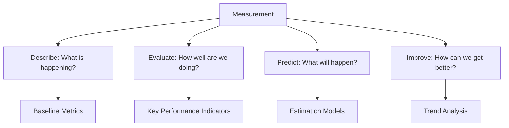
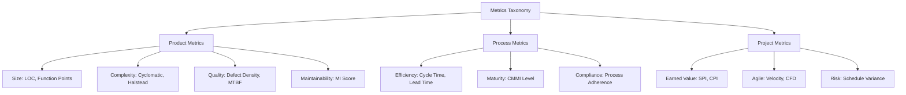
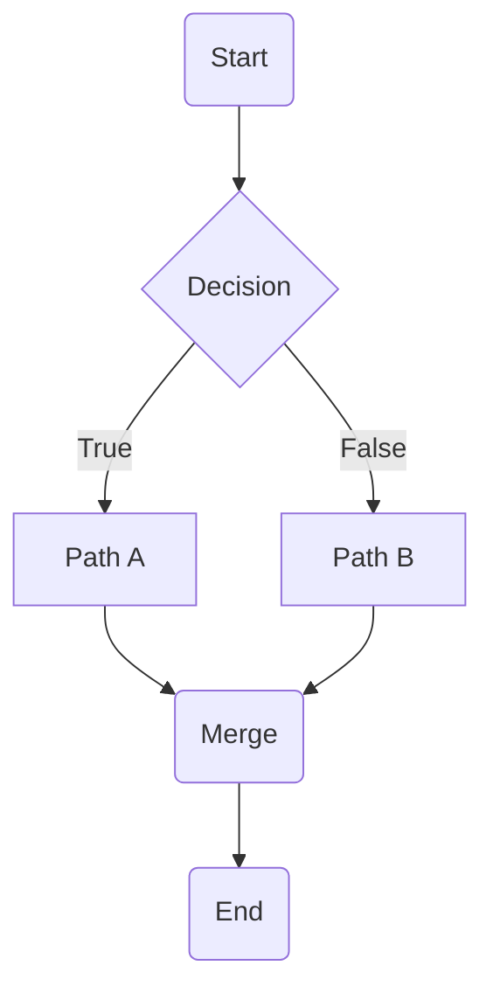
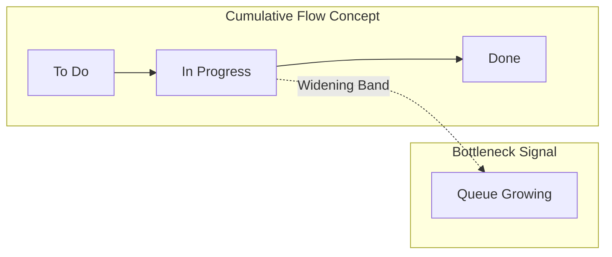

# Software Metrics and Measurement

## Learning Objectives

After completing this chapter, the student will be able to:
- Distinguish between process, product, and project metrics
- Measure software size using LOC, function points, and object points
- Calculate and interpret complexity metrics (cyclomatic, Halstead, coupling)
- Analyse maintainability using the Maintainability Index
- Apply GQM (Goal-Question-Metric) to derive meaningful metrics
- Implement metrics collection and dashboards in TypeScript
- Interpret metrics to drive process improvement
- Apply earned value management (SPI, CPI) for project tracking
- Use defect prediction models and reliability growth modelling
- Understand DORA metrics and their role in DevOps improvement

<!-- Image Gallery -->
<section class="lesson-visuals" aria-label="Visual learning resources">
  <header><span>VISUAL LEARNING</span><h2>See it. Review it. Remember it.</h2></header>
  <a class="lesson-visual-card" href="../../../assets/images/lessons/software-engineering/15-metrics/handwritten-notes.svg" target="_blank" rel="noopener">
    
    <span><strong>Handwritten notes</strong>Condensed notes for deliberate review.</span>
  </a>
  <a class="lesson-visual-card" href="../../../assets/images/lessons/software-engineering/15-metrics/sticky-notes.svg" target="_blank" rel="noopener">
    
    <span><strong>Sticky-note revision</strong>Fast recall prompts for revision.</span>
  </a>
  <a class="lesson-visual-card" href="../../../assets/images/lessons/software-engineering/15-metrics/visual-explanation.svg" target="_blank" rel="noopener">
    
    <span><strong>Visual concept guide</strong>A connected explanation of the key ideas.</span>
  </a>
</section>
<!-- End Image Gallery -->

## Theory

### Why Measure Software?

"If you cannot measure it, you cannot improve it." — Lord Kelvin

Software measurement serves four purposes:



### Metric Classification

| Category | What it measures | Examples |
|----------|-----------------|----------|
| **Product metrics** | Software product characteristics | Size, complexity, defects, performance |
| **Process metrics** | Development process characteristics | Cycle time, defect injection rate, rework % |
| **Project metrics** | Project management characteristics | Schedule variance, cost variance, team velocity |



### GQM Paradigm (Goal-Question-Metric)

GQM provides a structured way to derive metrics from goals:

```mermaid
graph TD
    GOAL[Goal: Improve defect detection] --> Q1[Question 1: How many defects are found before release?]
    GOAL --> Q2[Question 2: Which phase finds the most defects?]
    GOAL --> Q3[Question 3: How long do defects remain undetected?]
    
    Q1 --> M1[Metric: Pre-release defect density]
    Q1 --> M2[Metric: Post-release defect density]
    Q2 --> M3[Metric: Defects found per phase]
    Q2 --> M4[Metric: Phase defect detection rate]
    Q3 --> M5[Metric: Defect latency (days)]
```

**Detailed GQM Example — Improve Production Stability:**

| Level | Content |
|-------|---------|
| **Goal** | Reduce production incidents by 50% within 6 months |
| **Question 1** | How many incidents occur per deployment? |
| Metric 1.1 | Incident rate per deployment (incidents / deployments) |
| Metric 1.2 | Incident severity distribution (critical, major, minor) |
| **Question 2** | What is the mean time to detect incidents? |
| Metric 2.1 | Mean Time to Detect (MTTD) in minutes |
| Metric 2.2 | Percentage of incidents detected by monitoring vs user reports |
| **Question 3** | How quickly are incidents resolved? |
| Metric 3.1 | Mean Time to Resolve (MTTR) in hours |
| Metric 3.2 | SLA breach rate (%) |
| **Question 4** | What causes incidents? |
| Metric 4.1 | Root cause categories (code change, config, infrastructure, external) |
| Metric 4.2 | Change failure rate (%) |

**Applying GQM:**

| Level | Example |
|-------|---------|
| **Goal** | Improve on-time delivery |
| **Question 1** | How accurate are our estimates? |
| Metric 1 | Estimation accuracy (actual / estimated) |
| Metric 2 | Schedule variance |
| **Question 2** | What causes schedule overruns? |
| Metric 3 | Requirements change rate |
| Metric 4 | Rework percentage |

### Size Metrics

#### Lines of Code (LOC)

| Type | Counts | Usage |
|------|--------|-------|
| **Physical LOC** | All lines, including comments and blanks | Simple counting |
| **Logical LOC** | Executable statements only | Language-independent comparison |
| **Source LOC (SLOC)** | Source statements (no comments/blanks) | Productivity measurement |

**Normalisation:**

| Measure | Formula |
|---------|---------|
| **Productivity** | LOC / person-month |
| **Defect density** | Defects / KLOC |
| **Cost per LOC** | Total cost / LOC |

#### Function Points

As detailed in Chapter 8 (Project Management), function points measure functionality from the user's perspective.

| Type | Weight (Simple) | Weight (Average) | Weight (Complex) |
|------|-----------------|------------------|-----------------|
| External Input | 3 | 4 | 6 |
| External Output | 4 | 5 | 7 |
| External Inquiry | 3 | 4 | 6 |
| Internal Logical File | 7 | 10 | 15 |
| External Interface File | 5 | 7 | 10 |

### Code Metrics

#### Cyclomatic Complexity (McCabe)

`M = E - N + 2P`

Where E = edges, N = nodes, P = connected components.



**Complexity = 3** (3 decision points: start, decision, merge)

| M | Risk | Test Cases Needed |
|---|------|-------------------|
| 1-10 | Low risk, simple | M |
| 11-20 | Moderate risk | M |
| 21-50 | High risk | M |
| 50+ | Untestable | M |

#### Extended Cyclomatic Complexity

Extensions to McCabe's original metric:

| Variant | Formula | Description |
|---------|---------|-------------|
| **Strict Cyclomatic** | M = E - N + 2 | For single-function graphs |
| **Modified Cyclomatic** | M = π + 1 | Where π = number of predicates |
| **Essential Cyclomatic** | M - m | Removes structured programming constructs |
| **Design Complexity** | M_d = E_d - N_d + 2 | For the design structure graph |

#### Halstead Complexity Metrics

Maurice Halstead's software science metrics measure program vocabulary and length:

| Metric | Formula | Meaning |
|--------|---------|---------|
| **n₁** | Unique operators | Program vocabulary richness |
| **n₂** | Unique operands | Data complexity |
| **N₁** | Total operators | Program length |
| **N₂** | Total operands | Data usage |
| **Vocabulary** | n = n₁ + n₂ | Total vocabulary |
| **Length** | N = N₁ + N₂ | Program length |
| **Volume** | V = N × log₂(n) | Program size in bits |
| **Difficulty** | D = (n₁ / 2) × (N₂ / n₂) | How hard to write/understand |
| **Effort** | E = D × V | Required mental effort |
| **Time (seconds)** | T = E / 18 | Time to implement |
| **Delivered Bugs** | B = V / 3000 | Estimated bug count |

#### Coupling and Cohesion Metrics

| Metric | Formula | Description |
|--------|---------|-------------|
| **Coupling Between Objects (CBO)** | Count of classes referenced | Higher = worse maintainability |
| **Response for a Class (RFC)** | Count of methods that can be invoked | Higher = more complex |
| **Lack of Cohesion (LCOM)** | (M - Σμ)/M where M = methods, μ = methods sharing fields | Higher = less cohesive |
| **Depth of Inheritance (DIT)** | Length of inheritance chain | Higher = more complex testing |
| **Number of Children (NOC)** | Count of immediate subclasses | Higher = more reuse potential |

### Maintainability Index

The Maintainability Index (MI) combines four metrics:

```
MI = 171 - 5.2 × ln(V) - 0.23 × (G) - 16.2 × ln(LOC) + 50 × sin(√(2.4 × CM))
```

Where:
- V = Halstead Volume
- G = Cyclomatic Complexity
- LOC = Lines of Code
- CM = Percent of comments

| MI Score | Maintainability |
|----------|----------------|
| 85-100 | Highly maintainable |
| 65-85 | Moderately maintainable |
| < 65 | Difficult to maintain |

### Quality Metrics

| Metric | Formula | Target | Description |
|--------|---------|--------|-------------|
| **Defect density** | Defects / KLOC | < 1 defect/KLOC | Normalised defect count |
| **Defect detection rate** | Pre-release defects / Total defects | > 95% | Effectiveness of testing |
| **Defect removal efficiency** | Fixed defects / Reported defects | > 90% | Responsiveness to fixes |
| **Mean Time to Failure (MTTF)** | Operating time / Failures | Application dependent | Reliability measure |
| **Mean Time Between Failures (MTBF)** | (Total time - downtime) / Failures | Application dependent | Includes repair time |
| **Mean Time to Repair (MTTR)** | Total repair time / Repairs | < 4 hours | Recovery speed |
| **Defect arrival rate** | Defects / time period | Decreasing trend | Quality trajectory |
| **Backlog index** | Open defects / Total defects | < 10% | Managing technical debt |
| **First Pass Yield (FPY)** | Defect-free units / Total units | > 90% | Process quality |
| **Customer Satisfaction (CSAT)** | Survey score (1-5) | > 4.0 | User perception |

### Agile Metrics

| Metric | Formula | Purpose |
|--------|---------|---------|
| **Sprint Velocity** | Story points completed per sprint | Team throughput estimation |
| **Cycle Time** | Time from start of work to completion | Process efficiency |
| **Lead Time** | Time from request to delivery | Customer satisfaction |
| **Work in Progress (WIP)** | Active tasks at any time | Flow management |
| **Throughput** | Items completed per unit time | Delivery rate |
| **Cumulative Flow** | Running total of tasks by status | Bottleneck identification |
| **Burndown** | Remaining work vs time | Sprint progress tracking |
| **Burnup** | Completed work vs total scope | Scope change visibility |
| ** predictability** | Story points completed / Story points planned | Estimation accuracy |

#### Cumulative Flow Diagram (CFD)



### Process Metrics

| Metric | Formula | Purpose |
|--------|---------|---------|
| **Cycle time** | Time from start to completion | Process efficiency |
| **Lead time** | Time from request to delivery | Customer satisfaction |
| **Velocity** | Story points per sprint | Team throughput |
| **Rework %** | Rework effort / Total effort | Quality of initial work |
| **Phase containment** | Defects found in phase / Defects injected | Phase effectiveness |
| **CMMI Maturity Level** | 1-5 assessment | Organisational capability |
| **Process Compliance** | Audited process adherence | Discipline |
| **Escaped Defects** | Production defects / Total defects | Quality of release process |

### Project Metrics — Earned Value Management

Earned Value Management (EVM) integrates scope, schedule, and cost.

| Metric | Formula | Meaning | Interpretation |
|--------|---------|---------|----------------|
| **Planned Value (PV)** | Budgeted cost of work scheduled | What we planned to accomplish | Baseline |
| **Earned Value (EV)** | Budgeted cost of work performed | What we actually accomplished | Progress measure |
| **Actual Cost (AC)** | Actual cost incurred | What we spent | Cost tracking |
| **Schedule Variance (SV)** | EV - PV | Ahead or behind schedule | SV > 0 = ahead |
| **Cost Variance (CV)** | EV - AC | Under or over budget | CV > 0 = under budget |
| **SPI (Schedule Perf Index)** | EV / PV | Schedule efficiency | SPI > 1 = ahead |
| **CPI (Cost Perf Index)** | EV / AC | Cost efficiency | CPI > 1 = under budget |
| **Estimate at Completion (EAC)** | BAC / CPI | Forecast total cost | Updated budget |
| **To-Complete Performance Index** | (BAC - EV) / (BAC - AC) | Required efficiency | > 1 = must improve |

### Prediction Metrics

#### Defect Prediction Models

Defect prediction uses historical data and code metrics to forecast defect-prone modules:

| Model Type | Inputs | Output | Technique |
|------------|--------|--------|-----------|
| **Regression-based** | Complexity, churn, coverage | Defect count per module | Poisson/Negative Binomial |
| **Classification-based** | Code metrics, developer metrics | Defect-prone (yes/no) | Random Forest, SVM |
| **Bayesian Networks** | Causal dependencies | Probability of defects | Bayesian inference |
| **Deep Learning** | AST, commit history | Defect likelihood | LSTM, Graph Neural Nets |

**Defect Prediction Formula (Logistic Regression):**

```
P(defect) = 1 / (1 + e^-(β₀ + β₁·complexity + β₂·churn + β₃·coverage + β₄·age))
```

#### Reliability Growth Models

| Model | Formula | Use Case |
|-------|---------|----------|
| **Jelinski-Moranda** | λ(t) = φ(N - i + 1) | Early life testing |
| **Goel-Okumoto** | μ(t) = a(1 - e^(-bt)) | Cumulative defects found |
| **Musa-Okumoto** | μ(t) = a·ln(1 + bt) | Large systems |
| **Littlewood-Verral** | Bayesian approach | Uncertain environments |

**Goel-Okumoto Model:**

`μ(t) = a(1 - e^(-bt))`

Where:
- μ(t) = expected number of defects found by time t
- a = total expected defects
- b = defect discovery rate

## Examples

### Example 1: Metrics Collection Framework

```typescript
interface CodeMetrics {
  loc: number;
  sloc: number;
  commentLines: number;
  cyclomaticComplexity: number;
  functionCount: number;
  classCount: number;
  depthOfInheritance: number;
  couplingBetweenObjects: number;
}

class MetricsCollector {
  public async analyzeFile(sourceCode: string): Promise<CodeMetrics> {
    const lines = sourceCode.split('\n');
    const codeLines = lines.filter((l) => l.trim().length > 0);
    const commentLines = lines.filter(
      (l) => l.trim().startsWith('//') || l.trim().startsWith('/*') || l.trim().startsWith('*')
    );

    const functionMatches = sourceCode.match(/(function\s+\w+|=>\s*{|\([^)]*\)\s*{)/g) ?? [];
    const classMatches = sourceCode.match(/class\s+\w+/g) ?? [];
    const predicates = (
      sourceCode.match(/if\s*\(|else\s+if|for\s*\(|while\s*\(|case\s+|catch\s*\(/g) ?? []
    ).length;

    const extendsCount = (sourceCode.match(/extends\s+\w+/g) ?? []).length;
    const imports = (sourceCode.match(/import\s+\{[^}]*\}\s+from/g) ?? []).length;

    return {
      loc: lines.length,
      sloc: codeLines.length,
      commentLines: commentLines.length,
      cyclomaticComplexity: 1 + predicates,
      functionCount: functionMatches.length,
      classCount: classMatches.length,
      depthOfInheritance: extendsCount > 0 ? extendsCount + 1 : 0,
      couplingBetweenObjects: imports,
    };
  }

  public calculateMaintainabilityIndex(metrics: CodeMetrics): number {
    const V = metrics.sloc * Math.log2(
      Math.max(1, metrics.functionCount + metrics.classCount)
    );
    const G = metrics.cyclomaticComplexity;
    const LOC = metrics.sloc;
    const CM = LOC > 0 ? metrics.commentLines / LOC : 0;

    const mi = 171
      - 5.2 * Math.log(Math.max(1, V))
      - 0.23 * G
      - 16.2 * Math.log(Math.max(1, LOC))
      + 50 * Math.sin(Math.sqrt(2.4 * CM * 100));

    return Math.min(100, Math.max(0, Math.round(mi)));
  }
}

// Performance metrics
interface PerformanceMetrics {
  responseTimePercentiles: { p50: number; p90: number; p95: number; p99: number };
  throughput: number;
  errorRate: number;
  cpuUsage: number;
  memoryUsage: number;
}

class PerformanceMonitor {
  private responseTimes: number[] = [];
  private errorCount = 0;
  private requestCount = 0;

  public recordResponseTime(ms: number): void {
    this.responseTimes.push(ms);
    this.requestCount++;
  }

  public recordError(): void {
    this.errorCount++;
    this.requestCount++;
  }

  public getMetrics(): PerformanceMetrics {
    const sorted = [...this.responseTimes].sort((a, b) => a - b);
    const len = sorted.length;
    return {
      responseTimePercentiles: {
        p50: len > 0 ? sorted[Math.floor(len * 0.5)] : 0,
        p90: len > 0 ? sorted[Math.floor(len * 0.9)] : 0,
        p95: len > 0 ? sorted[Math.floor(len * 0.95)] : 0,
        p99: len > 0 ? sorted[Math.floor(len * 0.99)] : 0,
      },
      throughput: this.requestCount,
      errorRate: this.requestCount > 0 ? this.errorCount / this.requestCount : 0,
      cpuUsage: process.cpuUsage().user / 1000000,
      memoryUsage: process.memoryUsage().heapUsed / 1024 / 1024,
    };
  }

  public reset(): void {
    this.responseTimes = [];
    this.errorCount = 0;
    this.requestCount = 0;
  }
}
```

### Example 2: GQM Metric Designer

```typescript
type GoalCategory = 'quality' | 'productivity' | 'predictability' | 'customer_satisfaction';

interface Goal {
  id: string;
  description: string;
  category: GoalCategory;
  questions: Question[];
}

interface Question {
  id: string;
  text: string;
  metrics: Metric[];
}

interface Metric {
  id: string;
  name: string;
  formula: string;
  collectionMethod: 'automated' | 'manual' | 'survey';
  frequency: 'daily' | 'weekly' | 'sprint' | 'monthly' | 'release';
  target: string;
}

class GQMFramework {
  private goals: Goal[] = [];

  public createGoal(
    description: string,
    category: GoalCategory
  ): Goal {
    const goal: Goal = {
      id: `G-${this.goals.length + 1}`,
      description,
      category,
      questions: [],
    };
    this.goals.push(goal);
    return goal;
  }

  public addQuestion(goalId: string, text: string): Question {
    const goal = this.goals.find((g) => g.id === goalId);
    if (!goal) throw new Error(`Goal ${goalId} not found`);
    const question: Question = {
      id: `Q-${goal.questions.length + 1}`,
      text,
      metrics: [],
    };
    goal.questions.push(question);
    return question;
  }

  public addMetric(
    questionId: string,
    name: string,
    formula: string,
    collectionMethod: Metric['collectionMethod'],
    frequency: Metric['frequency'],
    target: string
  ): Metric {
    const question = this.findQuestion(questionId);
    const metric: Metric = {
      id: `M-${this.countAllMetrics() + 1}`,
      name,
      formula,
      collectionMethod,
      frequency,
      target,
    };
    question.metrics.push(metric);
    return metric;
  }

  private findQuestion(questionId: string): Question {
    for (const goal of this.goals) {
      const q = goal.questions.find((q) => q.id === questionId);
      if (q) return q;
    }
    throw new Error(`Question ${questionId} not found`);
  }

  private countAllMetrics(): number {
    return this.goals.reduce(
      (sum, g) => sum + g.questions.reduce((sq, q) => sq + q.metrics.length, 0), 0
    );
  }

  public generateReport(): string {
    return this.goals.map((goal) => {
      const lines = [`Goal: ${goal.description} [${goal.category}]`];
      for (const question of goal.questions) {
        lines.push(`  Question: ${question.text}`);
        for (const metric of question.metrics) {
          lines.push(`    [${metric.id}] ${metric.name}: ${metric.formula}`);
          lines.push(`      Collection: ${metric.collectionMethod}, Frequency: ${metric.frequency}`);
          lines.push(`      Target: ${metric.target}`);
        }
      }
      return lines.join('\n');
    }).join('\n\n');
  }
}
```

### Example 3: Quality Dashboard

```typescript
interface QualityGate {
  name: string;
  metric: string;
  threshold: number;
  operator: 'lt' | 'gt' | 'lte' | 'gte' | 'eq';
}

interface DashboardSnapshot {
  timestamp: Date;
  buildId: string;
  metrics: Record<string, number>;
  gates: { gate: string; passed: boolean; actual: number }[];
  overallStatus: 'pass' | 'fail' | 'warning';
}

class QualityDashboard {
  private readonly gates: QualityGate[] = [];
  private readonly history: DashboardSnapshot[] = [];

  public addGate(gate: QualityGate): void {
    this.gates.push(gate);
  }

  public recordSnapshot(buildId: string, metrics: Record<string, number>): DashboardSnapshot {
    const gateResults = this.gates.map((gate) => {
      const actual = metrics[gate.metric] ?? 0;
      let passed: boolean;
      switch (gate.operator) {
        case 'lt': passed = actual < gate.threshold; break;
        case 'gt': passed = actual > gate.threshold; break;
        case 'lte': passed = actual <= gate.threshold; break;
        case 'gte': passed = actual >= gate.threshold; break;
        case 'eq': passed = actual === gate.threshold; break;
        default: passed = false;
      }
      return { gate: gate.name, passed, actual };
    });

    const failures = gateResults.filter((g) => !g.passed).length;
    const overallStatus: 'pass' | 'fail' | 'warning' =
      failures === 0 ? 'pass' : failures <= 1 ? 'warning' : 'fail';

    const snapshot: DashboardSnapshot = {
      timestamp: new Date(),
      buildId,
      metrics,
      gates: gateResults,
      overallStatus,
    };
    this.history.push(snapshot);
    return snapshot;
  }

  public getTrend(metricName: string, lastN: number = 10): {
    values: number[];
    direction: 'improving' | 'declining' | 'stable';
    average: number;
  } {
    const recent = this.history.slice(-lastN);
    const values = recent.map((s) => s.metrics[metricName] ?? 0);
    if (values.length < 2) return { values, direction: 'stable', average: values[0] ?? 0 };

    const average = values.reduce((a, b) => a + b, 0) / values.length;
    const firstHalf = values.slice(0, Math.floor(values.length / 2));
    const secondHalf = values.slice(Math.floor(values.length / 2));
    const firstAvg = firstHalf.reduce((a, b) => a + b, 0) / firstHalf.length;
    const secondAvg = secondHalf.reduce((a, b) => a + b, 0) / secondHalf.length;
    const direction = secondAvg < firstAvg * 0.95 ? 'improving' : secondAvg > firstAvg * 1.05 ? 'declining' : 'stable';

    return { values, direction, average };
  }

  public generateSummary(): string {
    if (this.history.length === 0) return 'No data recorded';
    const latest = this.history[this.history.length - 1];
    const passRate = this.history.filter((s) => s.overallStatus === 'pass').length / this.history.length;
    return [
      `Dashboard Summary (${this.history.length} snapshots)`,
      `Latest Build: ${latest.buildId} | Status: ${latest.overallStatus.toUpperCase()}`,
      `Pass Rate: ${(passRate * 100).toFixed(1)}%`,
      '',
      'Gates:',
      ...latest.gates.map((g) =>
        `  ${g.passed ? '✓' : '✗'} ${g.gate}: ${g.actual} (${g.passed ? 'pass' : 'FAIL'})`
      ),
      '',
      'Metrics:',
      ...Object.entries(latest.metrics)
        .map(([key, val]) => `  ${key}: ${typeof val === 'number' ? val.toFixed(2) : val}`),
    ].join('\n');
  }
}
```

### Example 4: Halstead Complexity Calculator

```typescript
interface HalsteadMetrics {
  uniqueOperators: number;
  uniqueOperands: number;
  totalOperators: number;
  totalOperands: number;
  vocabulary: number;
  length: number;
  volume: number;
  difficulty: number;
  effort: number;
  timeSeconds: number;
  bugsDelivered: number;
}

class HalsteadAnalyzer {
  private static readonly OPERATORS = new Set([
    '+', '-', '*', '/', '%', '=', '==', '===', '!=', '!==',
    '<', '>', '<=', '>=', '&&', '||', '!', '&', '|', '^', '~',
    '<<', '>>', '>>>', '??', '?.',
    'if', 'else', 'for', 'while', 'do', 'switch', 'case',
    'return', 'break', 'continue', 'throw', 'try', 'catch',
    'function', '=>', 'class', 'new', 'typeof', 'instanceof',
    'void', 'delete', 'in', 'of', 'as', 'is',
  ]);

  public analyze(sourceCode: string): HalsteadMetrics {
    const tokens = this.tokenize(sourceCode);
    const operators = new Map<string, number>();
    const operands = new Map<string, number>();

    for (const token of tokens) {
      if (HalsteadAnalyzer.OPERATORS.has(token)) {
        operators.set(token, (operators.get(token) ?? 0) + 1);
      } else if (/^\w+$/.test(token)) {
        operands.set(token, (operands.get(token) ?? 0) + 1);
      }
    }

    const n1 = operators.size;
    const n2 = operands.size;
    const N1 = Array.from(operators.values()).reduce((a, b) => a + b, 0);
    const N2 = Array.from(operands.values()).reduce((a, b) => a + b, 0);
    const n = n1 + n2;
    const N = N1 + N2;
    const V = n > 0 ? N * Math.log2(n) : 0;
    const D = n2 > 0 ? (n1 / 2) * (N2 / n2) : 0;
    const E = D * V;
    const T = E / 18;
    const B = V / 3000;

    return {
      uniqueOperators: n1, uniqueOperands: n2,
      totalOperators: N1, totalOperands: N2,
      vocabulary: n, length: N,
      volume: Math.round(V * 100) / 100,
      difficulty: Math.round(D * 100) / 100,
      effort: Math.round(E),
      timeSeconds: Math.round(T),
      bugsDelivered: Math.round(B * 100) / 100,
    };
  }

  private tokenize(code: string): string[] {
    return code
      .replace(/\/\/.*$/gm, '')
      .replace(/\/\*[\s\S]*?\*\//g, '')
      .replace(/"[^"]*"/g, '""')
      .replace(/'[^']*'/g, "''")
      .replace(/`[^`]*`/g, '``')
      .split(/\s+|(?=[{}\[\]();.,:])|(?<=[{}\[\]();.,:])/g)
      .filter((t) => t.length > 0);
  }
}
```

### Example 5: Defect Metrics Tracker

```typescript
type DefectPhase = 'requirements' | 'design' | 'implementation' | 'testing' | 'production';
type DefectSeverity = 'critical' | 'major' | 'minor' | 'trivial';

interface DefectRecord {
  id: string;
  description: string;
  injectedPhase: DefectPhase;
  detectedPhase: DefectPhase;
  severity: DefectSeverity;
  fixEffortHours: number;
  detectionDate: Date;
  fixDate?: Date;
}

class DefectMetricsAnalyzer {
  private defects: DefectRecord[] = [];
  private sequence = 0;

  public recordDefect(
    description: string,
    injectedPhase: DefectPhase,
    detectedPhase: DefectPhase,
    severity: DefectSeverity,
    fixEffortHours: number
  ): DefectRecord {
    const defect: DefectRecord = {
      id: `BUG-${++this.sequence}`,
      description,
      injectedPhase,
      detectedPhase,
      severity,
      fixEffortHours,
      detectionDate: new Date(),
    };
    this.defects.push(defect);
    return defect;
  }

  public markFixed(defectId: string): void {
    const defect = this.defects.find((d) => d.id === defectId);
    if (defect) defect.fixDate = new Date();
  }

  public getDefectDensity(kloc: number): number {
    return this.defects.length / kloc;
  }

  public getPhaseContainment(phase: DefectPhase): number {
    const injected = this.defects.filter((d) => d.injectedPhase === phase);
    const detected = injected.filter((d) => d.detectedPhase === phase);
    return injected.length > 0 ? detected.length / injected.length : 0;
  }

  public getDefectDetectionRate(): number {
    const total = this.defects.length;
    const preRelease = this.defects.filter((d) => d.detectedPhase !== 'production').length;
    return total > 0 ? preRelease / total : 0;
  }

  public getAverageFixTime(detectedPhase: DefectPhase): number {
    const relevant = this.defects.filter((d) => d.detectedPhase === detectedPhase && d.fixDate);
    if (relevant.length === 0) return 0;
    const totalHours = relevant.reduce((sum, d) => {
      const diff = d.fixDate!.getTime() - d.detectionDate.getTime();
      return sum + diff / 3600000;
    }, 0);
    return totalHours / relevant.length;
  }

  public generatePhaseDefectReport(): string {
    const phases: DefectPhase[] = ['requirements', 'design', 'implementation', 'testing', 'production'];
    return [
      'Phase Defect Report',
      'Injected → Detected | Count | Containment',
      ...phases.map((injected) => {
        const injectedCount = this.defects.filter((d) => d.injectedPhase === injected).length;
        const detectedInPhase = this.defects.filter(
          (d) => d.injectedPhase === injected && d.detectedPhase === injected
        ).length;
        const containment = injectedCount > 0 ? detectedInPhase / injectedCount : 0;
        return `${injected.padEnd(15)} | ${String(injectedCount).padStart(4)} | ${(containment * 100).toFixed(1)}%`;
      }),
      '',
      `Detection Rate: ${(this.getDefectDetectionRate() * 100).toFixed(1)}%`,
    ].join('\n');
  }
}
```

### Case Studies

#### Microsoft Windows Quality

**Context:** Microsoft's Windows division adopted a metrics-driven quality approach in the 2000s, implementing a comprehensive measurement program.

**Metrics Used:**
- Bug rates per developer per day
- Defect density by component
- Code churn (lines added/modified/deleted per week)
- Build break rate
- Bug reopen rate
- Customer callback rate per build

**Key Insights:**
- Components with churn > 20% had 3× higher defect density
- Code review coverage > 85% correlated with 60% fewer post-release defects
- Bug reopen rate > 5% indicated insufficient root cause analysis
- Components with coupling > 10 dependencies had 4× higher maintenance cost

**Outcomes:** Windows 7 had 50% fewer crashes than Windows Vista, achieved through data-driven quality gates that blocked components from shipping unless they met specific defect density and test coverage thresholds.

#### Google DORA Metrics

**Context:** Google's DevOps Research and Assessment (DORA) team identified four key metrics that predict IT performance.

**The Four DORA Metrics:**

| Metric | Elite Performers | High Performers | Medium Performers | Low Performers |
|--------|-----------------|----------------|-------------------|----------------|
| **Deployment Frequency** | On-demand (multiple/day) | Between once/day and once/week | Between once/week and once/month | Less than once/month |
| **Lead Time for Changes** | Less than 1 hour | Between 1 day and 1 week | Between 1 week and 1 month | Between 1 month and 6 months |
| **Time to Restore Service** | Less than 1 hour | Less than 1 day | Less than 1 day | More than 1 day |
| **Change Failure Rate** | 0-5% | 0-5% | 0-15% | 0-46% |

**Key Insights:**
- Elite performers deploy 208× more frequently than low performers
- Lead time is 2,555× faster for elite performers
- Change failure rate is 7× lower for elite performers
- Time to restore is 2,604× faster

**Outcomes:** DORA metrics became the industry standard for measuring DevOps effectiveness. Organisations that track and improve these metrics show 2× higher likelihood of achieving organisational performance goals.

#### NASA Software Defect Prevention

**Context:** NASA's Software Assurance Technology Center (SATC) developed rigorous defect prevention programs for mission-critical flight software.

**Metrics Used:**
- **SATC Defect Density Goal:** < 0.1 defects per KLOC for flight software
- **Code Complexity Limit:** Cyclomatic complexity < 10 per function
- **Test Coverage Requirement:** 100% MC/DC (Modified Condition/Decision Coverage)
- **Peer Review Coverage:** 100% of all code changes

**Key Insights:**
- 70% of defects were introduced in the requirements phase but only 30% were detected there
- Code with complexity > 20 had 10× higher defect density
- Each hour of peer review prevented 4 hours of rework
- Software with defect density > 1/KLOC was considered unacceptable for flight

**Outcomes:** NASA's Space Shuttle software achieved a defect density of 0.01 per KLOC — one of the lowest ever recorded. The approach combined formal methods, rigorous peer review, comprehensive testing, and continuous measurement.

## Summary

Software metrics provide quantitative data for describing, evaluating, predicting, and improving software processes and products. The GQM paradigm ensures metrics align with goals. Size metrics (LOC, function points) measure scale. Complexity metrics (cyclomatic complexity, Halstead) assess understandability and testability. Coupling and cohesion metrics measure modularity. The Maintainability Index combines multiple metrics into a single maintainability score. Defect metrics track quality across phases. Process metrics measure development efficiency. Agile metrics (velocity, cycle time, CFD) support iterative delivery. Earned value management integrates scope, schedule, and cost. DORA metrics benchmark DevOps performance. Metrics collection should be automated, trend-focused, and transparent. Meaningful interpretation requires context, trends over time, and multiple metrics used together.

## Practical Takeaways

1. **Metrics are means, not ends** — measure to improve, not to judge
2. **Never use a single metric in isolation** — each metric tells part of the story
3. **GQM prevents vanity metrics** — always derive metrics from goals
4. **Automate collection** — manual metrics are unreliable and unsustainable
5. **Trends over thresholds** — a declining trend matters more than a single value
6. **Share metrics transparently** — hidden metrics erode trust
7. **Use DORA metrics** — deployment frequency, lead time, MTTR, change failure rate benchmark DevOps capability
8. **EVM integrates scope, schedule, cost** — the best single-view project health indicator

## Chapter Quiz

**Q1: The GQM paradigm stands for:**
- A) Goal, Quality, Metric
- B) Goal, Question, Metric
- C) General, Quantitative, Measurement
- D) Graded, Qualified, Measured

**Answer: B** — GQM stands for Goal-Question-Metric, a structured approach to deriving metrics from goals.

**Q2: The Halstead complexity metric that represents the mental effort required to implement a program is:**
- A) Volume
- B) Difficulty
- C) Effort
- D) Length

**Answer: C** — Halstead Effort (E = D × V) represents the total mental effort required.

**Q3: A Maintainability Index score of 60 indicates:**
- A) Highly maintainable
- B) Moderately maintainable
- C) Difficult to maintain
- D) Cannot be maintained

**Answer: B** — 65-85 is moderately maintainable; 60 is just below moderate threshold (difficult).

**Q4: Which metric measures the percentage of defects caught in the same phase they were introduced?**
- A) Defect detection rate
- B) Phase containment
- C) Defect density
- D) Defect removal efficiency

**Answer: B** — Phase containment ratio measures defects caught in their injection phase.

**Q5: A cyclomatic complexity value of 15 would be classified as:**
- A) Low risk
- B) Moderate risk
- C) High risk
- D) Untestable

**Answer: B** — 11-20 is moderate risk.

**Q6: In earned value management, a CPI of 0.8 means:**
- A) Project is ahead of schedule
- B) Project is under budget
- C) Project is over budget
- D) Project is on track

**Answer: C** — CPI < 1 means cost overrun. CPI = EV/AC = 0.8 means earning 80 cents for every dollar spent.

**Q7: According to DORA, elite performers have a change failure rate of:**
- A) 0-5%
- B) 6-10%
- C) 11-20%
- D) 21-40%

**Answer: A** — Elite performers achieve 0-5% change failure rate, meaning deployments rarely cause incidents.

### TypeScript: Software Metrics Classes

```typescript
// === GQMFramework: Full GQM implementation ===
interface GQMGoal { id: string; description: string; category: string; }
interface GQMQuestion { id: string; goalId: string; text: string; }
interface GQMMetric { id: string; questionId: string; name: string; formula: string; target: number; actual: number; weight: number; }

class GQMFramework {
  private goals: GQMGoal[] = [];
  private questions: GQMQuestion[] = [];
  private metrics: GQMMetric[] = [];

  public addGoal(description: string, category: string): GQMGoal {
    const goal: GQMGoal = { id: `G${this.goals.length + 1}`, description, category };
    this.goals.push(goal);
    return goal;
  }

  public addQuestion(goalId: string, text: string): GQMQuestion {
    const q: GQMQuestion = { id: `Q${this.questions.length + 1}`, goalId, text };
    this.questions.push(q);
    return q;
  }

  public addMetric(questionId: string, name: string, formula: string, target: number): GQMMetric {
    const m: GQMMetric = { id: `M${this.metrics.length + 1}`, questionId, name, formula, target, actual: 0, weight: 1 };
    this.metrics.push(m);
    return m;
  }

  public recordMetric(metricId: string, value: number): void {
    const metric = this.metrics.find(m => m.id === metricId);
    if (metric) metric.actual = value;
  }

  public evaluateGoal(goalId: string): { goal: string; score: number; status: string; gaps: string[] } {
    const goalQs = this.questions.filter(q => q.goalId === goalId);
    const scores: number[] = [];
    const gaps: string[] = [];
    for (const q of goalQs) {
      const qMetrics = this.metrics.filter(m => m.questionId === q.id);
      for (const m of qMetrics) {
        if (m.actual === 0 && m.target > 0) gaps.push(`Metric "${m.name}" has no data recorded`);
        else scores.push(m.actual / m.target);
      }
    }
    const avgScore = scores.length > 0 ? scores.reduce((a, b) => a + b, 0) / scores.length * 100 : 0;
    return {
      goal: this.goals.find(g => g.id === goalId)?.description ?? '',
      score: Math.round(avgScore),
      status: avgScore >= 80 ? 'On track' : avgScore >= 50 ? 'At risk' : 'Off track',
      gaps,
    };
  }

  public generateFullReport(): string {
    const lines: string[] = ['=== GQM Full Report ==='];
    for (const goal of this.goals) {
      const evalResult = this.evaluateGoal(goal.id);
      lines.push(`\n[${goal.category}] ${goal.description}: ${evalResult.status} (${evalResult.score}%)`);
      const goalQs = this.questions.filter(q => q.goalId === goal.id);
      for (const q of goalQs) {
        lines.push(`  Q: ${q.text}`);
        const qMetrics = this.metrics.filter(m => m.questionId === q.id);
        for (const m of qMetrics) {
          const pct = m.target > 0 ? Math.round((m.actual / m.target) * 100) : 0;
          lines.push(`    M: ${m.name} = ${m.actual} / ${m.target} (${pct}%) [${m.formula}]`);
        }
      }
    }
    return lines.join('\n');
  }
}

// === ComplexityAnalyzer: McCabe + Halstead + coupling ===
interface ComplexityReport {
  mccabe: number; halsteadVolume: number; halsteadDifficulty: number;
  maintainabilityIndex: number; couplingCount: number; cohesionScore: number;
  risk: string; recommendedTests: number;
}

class ComplexityAnalyzer {
  public analyzeFull(sourceCode: string): ComplexityReport {
    const lines = sourceCode.split('\n');
    const codeLines = lines.filter(l => l.trim().length > 0).length;

    // McCabe
    const predicates = (sourceCode.match(/if\s*\(|else\s+if|for\s*\(|while\s*\(|case\s+|catch\s*\(|&&|\|\|/g) ?? []).length;
    const mccabe = 1 + predicates;

    // Halstead (simplified)
    const tokens = sourceCode.split(/\s+|(?=[{}();,+\-*/=<>!&|])/).filter(t => t.length > 0);
    const operators = tokens.filter(t => /[+\-*/=<>!&|{}();,]/.test(t));
    const operands = tokens.filter(t => /^[a-zA-Z_]\w*$/.test(t) && !/^(if|else|for|while|return|function|const|let|var|class|import|export)$/.test(t));
    const n1 = new Set(operators).size;
    const n2 = new Set(operands).size;
    const N1 = operators.length;
    const N2 = operands.length;
    const halsteadVolume = (N1 + N2) * Math.log2(Math.max(1, n1 + n2));
    const halsteadDifficulty = n2 > 0 ? (n1 / 2) * (N2 / n2) : 0;

    // MI
    const commentLines = lines.filter(l => l.trim().startsWith('//') || l.trim().startsWith('/*')).length;
    const cm = codeLines > 0 ? commentLines / codeLines : 0;
    const mi = Math.round(Math.max(0, 171 - 5.2 * Math.log(Math.max(1, halsteadVolume)) - 0.23 * mccabe - 16.2 * Math.log(Math.max(1, codeLines)) + 50 * Math.sin(Math.sqrt(2.4 * cm * 100))));

    // Coupling
    const couplingCount = (sourceCode.match(/import\s+/g) ?? []).length;

    // Cohesion (simplified — ratio of methods that use class fields)
    const classMethods = (sourceCode.match(/\w+\s*\([^)]*\)\s*{/g) ?? []).length;
    const fieldRefs = (sourceCode.match(/this\.\w+/g) ?? []).length;
    const cohesionScore = classMethods > 0 ? Math.min(1, fieldRefs / (classMethods * 2)) : 1;

    const risk = mccabe <= 10 ? 'Low' : mccabe <= 20 ? 'Moderate' : mccabe <= 50 ? 'High' : 'Untestable';

    return { mccabe, halsteadVolume: Math.round(halsteadVolume), halsteadDifficulty: Math.round(halsteadDifficulty * 100) / 100, maintainabilityIndex: mi, couplingCount, cohesionScore: Math.round(cohesionScore * 100) / 100, risk, recommendedTests: mccabe };
  }
}

// === AgileMetricsDashboard: Full agile metrics ===
interface SprintRecord { id: string; planned: number; completed: number; defects: number; cycleTimes: number[]; }

class AgileMetricsDashboard {
  private sprints: SprintRecord[] = [];

  public addSprint(record: SprintRecord): void { this.sprints.push(record); }

  public velocity(rollingCount: number = 3): { average: number; trend: 'up' | 'down' | 'stable'; lastN: number[] } {
    const recent = this.sprints.slice(-rollingCount).map(s => s.completed);
    const avg = recent.length > 0 ? recent.reduce((a, b) => a + b, 0) / recent.length : 0;
    const trend = recent.length >= 3
      ? (recent[recent.length - 1] > recent[0] ? 'up' : recent[recent.length - 1] < recent[0] ? 'down' : 'stable')
      : 'stable';
    return { average: Math.round(avg * 10) / 10, trend, lastN: recent };
  }

  public cycleTimePercentiles(cycleTimes?: number[]): { p50: number; p75: number; p85: number; p95: number; p99: number } {
    const all = cycleTimes ?? this.sprints.flatMap(s => s.cycleTimes);
    const sorted = [...all].sort((a, b) => a - b);
    const perc = (p: number) => sorted[Math.min(Math.ceil((p / 100) * sorted.length) - 1, sorted.length - 1)] ?? 0;
    return { p50: perc(50), p75: perc(75), p85: perc(85), p95: perc(95), p99: perc(99) };
  }

  public throughput(): { total: number; averagePerSprint: number } {
    const total = this.sprints.reduce((s, sp) => s + sp.completed, 0);
    return { total, averagePerSprint: this.sprints.length > 0 ? Math.round(total / this.sprints.length * 10) / 10 : 0 };
  }

  public defectTrend(): { sprints: number[]; rates: number[]; trend: 'improving' | 'declining' | 'stable' } {
    const rates = this.sprints.map(s => s.completed > 0 ? s.defects / s.completed : 0);
    const mid = Math.floor(rates.length / 2);
    const firstHalf = rates.slice(0, mid);
    const secondHalf = rates.slice(mid);
    const fAvg = firstHalf.length > 0 ? firstHalf.reduce((a, b) => a + b, 0) / firstHalf.length : 0;
    const sAvg = secondHalf.length > 0 ? secondHalf.reduce((a, b) => a + b, 0) / secondHalf.length : 0;
    return {
      sprints: this.sprints.map(s => parseInt(s.id.replace(/\D/g, ''), 10)),
      rates,
      trend: sAvg < fAvg * 0.9 ? 'improving' : sAvg > fAvg * 1.1 ? 'declining' : 'stable',
    };
  }

  public getCFD(): { sprints: string[]; todo: number[]; inProgress: number[]; done: number[] } {
    let cumulativeTodo = 0, cumulativeInProg = 0, cumulativeDone = 0;
    const todo: number[] = []; const inProgress: number[] = []; const done: number[] = [];
    for (const s of this.sprints) {
      cumulativeTodo += s.planned;
      cumulativeInProg += s.planned - s.completed;
      cumulativeDone += s.completed;
      todo.push(cumulativeTodo);
      inProgress.push(cumulativeInProg);
      done.push(cumulativeDone);
    }
    return { sprints: this.sprints.map(s => s.id), todo, inProgress, done };
  }

  public predictability(): number {
    return this.sprints.length > 0
      ? Math.round(this.sprints.reduce((s, sp) => s + (sp.planned > 0 ? sp.completed / sp.planned : 1), 0) / this.sprints.length * 100)
      : 0;
  }
}

// === DefectPredictor: ML-inspired defect prediction ===
interface DefectFeatures {
  complexity: number; churn: number; coverage: number; age: number; coupling: number; priorDefects: number;
}
interface PredictionResult { probability: number; riskLevel: 'low' | 'medium' | 'high' | 'critical'; contributingFactors: string[]; }

class DefectPredictor {
  private readonly WEIGHTS = { complexity: 0.3, churn: 0.25, coverage: -0.2, age: -0.1, coupling: 0.2, priorDefects: 0.15 };
  private readonly BIAS = -2.5;
  private historicalData: { features: DefectFeatures; actualDefects: number }[] = [];

  public addHistoricalRecord(features: DefectFeatures, defects: number): void {
    this.historicalData.push({ features, actualDefects: defects });
  }

  public predict(features: DefectFeatures): PredictionResult {
    const logit = this.BIAS
      + this.WEIGHTS.complexity * features.complexity
      + this.WEIGHTS.churn * features.churn
      + this.WEIGHTS.coverage * features.coverage
      + this.WEIGHTS.age * features.age
      + this.WEIGHTS.coupling * features.coupling
      + this.WEIGHTS.priorDefects * features.priorDefects;

    const probability = 1 / (1 + Math.exp(-logit));
    const riskLevel = probability > 0.7 ? 'critical' : probability > 0.5 ? 'high' : probability > 0.3 ? 'medium' : 'low';

    const factors: string[] = [];
    if (features.complexity > 15) factors.push(`High complexity (${features.complexity})`);
    if (features.churn > 30) factors.push(`High churn (${features.churn}%)`);
    if (features.coverage < 60) factors.push(`Low coverage (${features.coverage}%)`);
    if (features.coupling > 10) factors.push(`High coupling (${features.coupling})`);
    if (features.priorDefects > 5) factors.push(`Prior defect history (${features.priorDefects})`);

    return { probability: Math.round(probability * 100) / 100, riskLevel, contributingFactors: factors };
  }

  public trainModel(): { coefficients: Record<string, number>; accuracy: number } {
    let correct = 0;
    for (const record of this.historicalData) {
      const prediction = this.predict(record.features);
      const predictedDefect = prediction.probability > 0.5 ? 1 : 0;
      const actualDefect = record.actualDefects > 0 ? 1 : 0;
      if (predictedDefect === actualDefect) correct++;
    }
    return {
      coefficients: { ...this.WEIGHTS, bias: this.BIAS },
      accuracy: this.historicalData.length > 0 ? Math.round(correct / this.historicalData.length * 100) : 0,
    };
  }

  public getRiskDistribution(modules: { name: string; features: DefectFeatures }[]): { highRisk: string[]; mediumRisk: string[]; lowRisk: string[] } {
    const high: string[] = []; const medium: string[] = []; const low: string[] = [];
    for (const mod of modules) {
      const pred = this.predict(mod.features);
      if (pred.riskLevel === 'critical' || pred.riskLevel === 'high') high.push(mod.name);
      else if (pred.riskLevel === 'medium') medium.push(mod.name);
      else low.push(mod.name);
    }
    return { highRisk: high, mediumRisk: medium, lowRisk: low };
  }
}

// === EarnedValueAnalyzer: EVM calculations ===
interface EVMData {
  plannedValue: number; earnedValue: number; actualCost: number; budgetAtCompletion: number;
}
interface EVMResult {
  pv: number; ev: number; ac: number; bac: number;
  sv: number; cv: number; spi: number; cpi: number;
  eac: number; etc: number; tcpi: number; vac: number;
  onSchedule: boolean; onBudget: boolean;
}

class EarnedValueAnalyzer {
  public calculate(data: EVMData): EVMResult {
    const sv = data.earnedValue - data.plannedValue;
    const cv = data.earnedValue - data.actualCost;
    const spi = data.plannedValue > 0 ? data.earnedValue / data.plannedValue : 0;
    const cpi = data.actualCost > 0 ? data.earnedValue / data.actualCost : 0;
    const eac = cpi > 0 ? data.budgetAtCompletion / cpi : data.budgetAtCompletion;
    const etc = eac - data.actualCost;
    const tcpi = (data.budgetAtCompletion - data.earnedValue) / (data.budgetAtCompletion - data.actualCost);
    const vac = data.budgetAtCompletion - eac;

    return {
      pv: data.plannedValue, ev: data.earnedValue, ac: data.actualCost, bac: data.budgetAtCompletion,
      sv, cv, spi: Math.round(spi * 100) / 100, cpi: Math.round(cpi * 100) / 100,
      eac: Math.round(eac), etc: Math.round(etc),
      tcpi: Math.round(tcpi * 100) / 100, vac: Math.round(vac),
      onSchedule: sv >= 0, onBudget: cv >= 0,
    };
  }

  public trackOverTime(reports: EVMData[]): { spiTrend: number[]; cpiTrend: number[]; projectedEac: number; } {
    const spiTrend = reports.map(r => this.calculate(r).spi);
    const cpiTrend = reports.map(r => this.calculate(r).cpi);
    const latestCpi = cpiTrend[cpiTrend.length - 1];
    const latestBac = reports[reports.length - 1].budgetAtCompletion;
    return {
      spiTrend,
      cpiTrend,
      projectedEac: latestCpi > 0 ? Math.round(latestBac / latestCpi) : latestBac,
    };
  }

  public forecastCompletion(status: EVMResult, plannedDuration: number): { estimatedDuration: number; estimatedEndDate: Date; varianceWeeks: number } {
    const estimatedDuration = status.spi > 0 ? plannedDuration / status.spi : plannedDuration;
    const now = new Date();
    const estimatedEnd = new Date(now.getTime() + (estimatedDuration - plannedDuration) * 7 * 24 * 60 * 60 * 1000);
    return {
      estimatedDuration: Math.round(estimatedDuration * 10) / 10,
      estimatedEndDate: estimatedEnd,
      varianceWeeks: Math.round((estimatedDuration - plannedDuration) * 10) / 10,
    };
  }
}

// === Example usage ===
const gqm = new GQMFramework();
const g1 = gqm.addGoal('Reduce production defects by 50%', 'quality');
const q1 = gqm.addQuestion(g1.id, 'How many defects escape to production?');
gqm.addMetric(q1.id, 'Escaped Defect Rate', 'escaped / total * 100', 5);
gqm.addMetric(q1.id, 'Test Coverage', 'covered / total * 100', 80);
gqm.recordMetric('M1', 8);
gqm.recordMetric('M2', 72);
console.log(gqm.evaluateGoal(g1.id));

const analyzer = new ComplexityAnalyzer();
const code = `function process(x: number) { if (x > 0) { if (x > 10) return 'big'; return 'small'; } return 'none'; }`;
console.log('Complexity:', analyzer.analyzeFull(code));

const agile = new AgileMetricsDashboard();
agile.addSprint({ id: 'S1', planned: 20, completed: 18, defects: 3, cycleTimes: [2, 3, 4, 2, 3] });
agile.addSprint({ id: 'S2', planned: 22, completed: 20, defects: 2, cycleTimes: [1, 2, 3, 2, 4] });
agile.addSprint({ id: 'S3', planned: 20, completed: 22, defects: 1, cycleTimes: [1, 1, 2, 2, 1] });
console.log('Velocity:', agile.velocity());
console.log('CFD:', agile.getCFD());

const predictor = new DefectPredictor();
predictor.addHistoricalRecord({ complexity: 5, churn: 10, coverage: 85, age: 12, coupling: 3, priorDefects: 1 }, 0);
predictor.addHistoricalRecord({ complexity: 25, churn: 40, coverage: 45, age: 3, coupling: 15, priorDefects: 8 }, 5);
const prediction = predictor.predict({ complexity: 18, churn: 25, coverage: 60, age: 6, coupling: 10, priorDefects: 3 });
console.log('Defect Prediction:', prediction);

const evm = new EarnedValueAnalyzer();
const evmResult = evm.calculate({ plannedValue: 100000, earnedValue: 85000, actualCost: 95000, budgetAtCompletion: 500000 });
console.log('EVM:', evmResult);
```

### TypeScript: Advanced Metrics Tools

```typescript
// === Halstead Complexity Metrics ===
interface HalsteadMetricsInput { n1: number; n2: number; N1: number; N2: number; }
function calculateHalstead(m: HalsteadMetricsInput): Record<string, number> {
  const vocabulary = m.n1 + m.n2;
  const length = m.N1 + m.N2;
  const volume = length * Math.log2(vocabulary);
  const difficulty = (m.n1 / 2) * (m.N2 / m.n2);
  const effort = difficulty * volume;
  const time = effort / 18;
  const bugs = volume / 3000;
  return {
    vocabulary: Math.round(vocabulary), length: Math.round(length),
    volume: Math.round(volume), difficulty: Math.round(difficulty * 100) / 100,
    effort: Math.round(effort), timeSec: Math.round(time), bugs: Math.round(bugs * 100) / 100,
  };
}

// === Reliability Metrics ===
interface ReliabilityData { totalTime: number; failures: number; avgRepairTime: number; }
function calculateReliability(data: ReliabilityData): { mtbf: number; mttr: number; availability: number } {
  const mtbf = data.failures > 0 ? data.totalTime / data.failures : data.totalTime;
  const mttr = data.avgRepairTime;
  const availability = mtbf / (mtbf + mttr);
  return { mtbf: Math.round(mtbf), mttr: Math.round(mttr), availability: Math.round(availability * 10000) / 100 };
}

// === Prediction Accuracy (MRE - Magnitude of Relative Error) ===
function mre(actual: number, estimated: number): number {
  return actual > 0 ? Math.abs(actual - estimated) / actual : 0;
}
function mmre(actuals: number[], estimates: number[]): number {
  const mres = actuals.map((a, i) => mre(a, estimates[i]));
  return Math.round(mres.reduce((s, m) => s + m, 0) / mres.length * 100) / 100;
}

// === Effort Estimation (COCOMO-style) ===
function cocomo(sizeKLOC: number, mode: 'organic' | 'semi-detached' | 'embedded'): { effort: number; duration: number; team: number } {
  const params = { organic: { a: 2.4, b: 1.05, c: 2.5, d: 0.38 }, 'semi-detached': { a: 3.0, b: 1.12, c: 2.5, d: 0.35 }, embedded: { a: 3.6, b: 1.20, c: 2.5, d: 0.32 } };
  const p = params[mode];
  const effort = p.a * Math.pow(sizeKLOC, p.b);
  const duration = p.c * Math.pow(effort, p.d);
  return { effort: Math.round(effort * 10) / 10, duration: Math.round(duration * 10) / 10, team: Math.ceil(effort / duration) };
}

// === Balanced Scorecard for Software Engineering ===
interface BSCPerspective { name: string; weight: number; metrics: { name: string; value: number; target: number; weight: number }[]; }
class BalancedScorecard {
  private perspectives: BSCPerspective[] = [];

  addPerspective(p: BSCPerspective): this { this.perspectives.push(p); return this; }

  score(): { overall: number; breakdown: Record<string, { score: number; status: string }> } {
    const breakdown: Record<string, { score: number; status: string }> = {};
    let totalWeighted = 0, totalWeight = 0;
    for (const p of this.perspectives) {
      let pScore = 0, pWeight = 0;
      for (const m of p.metrics) {
        const achieved = Math.min(m.value / m.target, 1);
        pScore += achieved * m.weight;
        pWeight += m.weight;
      }
      const finalScore = pWeight > 0 ? Math.round((pScore / pWeight) * 100) : 0;
      breakdown[p.name] = { score: finalScore, status: finalScore >= 90 ? 'Green' : finalScore >= 70 ? 'Yellow' : 'Red' };
      totalWeighted += finalScore * p.weight;
      totalWeight += p.weight;
    }
    return { overall: totalWeight > 0 ? Math.round(totalWeighted / totalWeight) : 0, breakdown };
  }
}

const halstead = calculateHalstead({ n1: 15, n2: 20, N1: 80, N2: 120 });
console.log(halstead);
console.log(cocomo(50, 'semi-detached'));

const bsc = new BalancedScorecard();
bsc.addPerspective({ name: 'Customer', weight: 25, metrics: [{ name: 'NPS', value: 72, target: 80, weight: 50 }, { name: 'Defect Rate', value: 0.5, target: 0.3, weight: 50 }] });
bsc.addPerspective({ name: 'Internal Process', weight: 25, metrics: [{ name: 'Cycle Time', value: 4, target: 3, weight: 40 }, { name: 'Deploy Frequency', value: 20, target: 25, weight: 30 }, { name: 'Test Coverage', value: 82, target: 90, weight: 30 }] });
bsc.addPerspective({ name: 'Learning', weight: 25, metrics: [{ name: 'Training Hours', value: 40, target: 50, weight: 50 }, { name: 'Certification', value: 60, target: 80, weight: 50 }] });
bsc.addPerspective({ name: 'Financial', weight: 25, metrics: [{ name: 'ROI', value: 150, target: 200, weight: 60 }, { name: 'Cost Variance', value: 5, target: 10, weight: 40 }] });
console.log('BSC Score:', bsc.score());
```

## Exercises

### Review Questions

1. What is the difference between product, process, and project metrics?
2. Describe the GQM approach with an example.
3. What does cyclomatic complexity measure and how is it calculated?
4. What four components make up the Maintainability Index?
5. What is the difference between defect density and defect detection rate?
6. Explain the four DORA metrics and their significance.
7. What is the difference between SPI and CPI in earned value management?

### Application Problems

1. Apply GQM to derive metrics for the goal "Reduce production defects by 50% in six months."

2. Calculate Halstead metrics for the following code:
   ```typescript
   function factorial(n: number): number {
     let result = 1;
     for (let i = 2; i <= n; i++) {
       result *= i;
     }
     return result;
   }
   ```

3. A project has 15 KLOC and 12 defects detected during development and 8 defects found post-release. Calculate: defect density, defect detection rate, and phase containment. Interpret the results.

4. A project has PV = $100,000, EV = $80,000, AC = $90,000, BAC = $500,000. Calculate SPI, CPI, EAC, and TCPI. Is the project on schedule? On budget?

5. An Agile team completes 18, 22, 20, 24, and 19 story points over five sprints. Calculate velocity (3-sprint rolling average), trend, and predictability.

### Challenge Problem

Design a comprehensive measurement program for a 50-person software engineering organisation. Apply GQM to derive metrics for three goals: improve on-time delivery, reduce post-release defects, and increase team productivity. For each goal, define 2-3 questions and 2-4 metrics per question. Specify collection methods (automated tooling, manual entry), collection frequency, visualisation dashboards, and review cadence. Identify and discuss potential Goodhart's Law effects for each metric (what behaviours might the metric incentivise that undermine the true goal?). Implement a TypeScript program that collects five metrics daily, tracks them over time, generates trend reports, and alerts when any metric deviates more than 2 standard deviations from its rolling 30-day mean.
