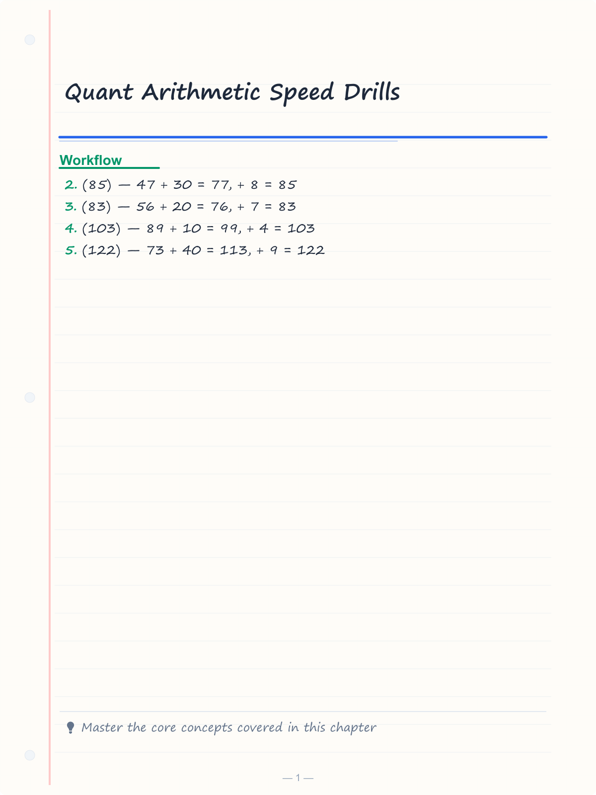
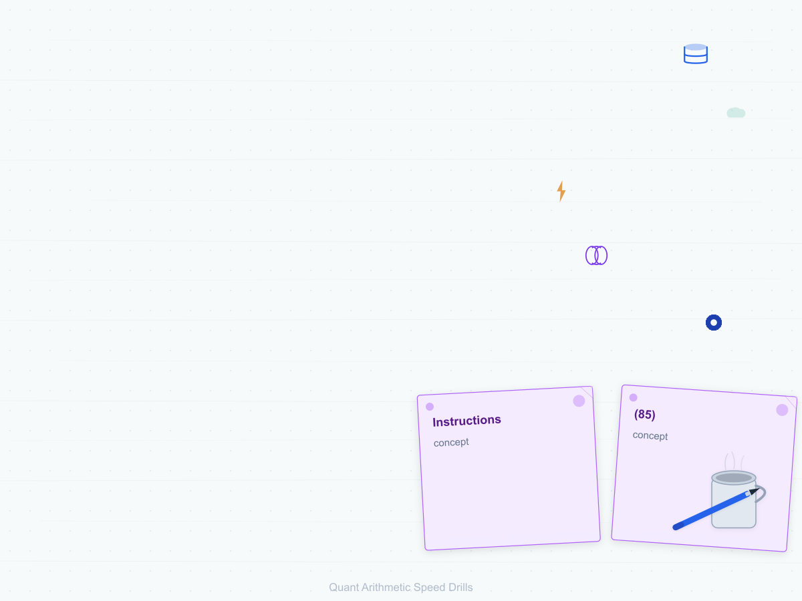
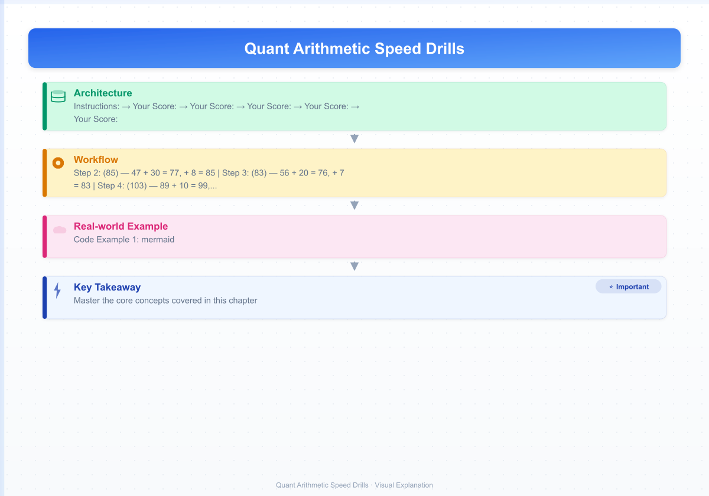

# Quant Arithmetic Speed Drills

> Build lightning-fast mental calculation skills through timed practice across addition, subtraction, multiplication, division, percentages, fractions, squares, cubes, roots, and approximation.

<!-- Image Gallery -->
<section class="lesson-visuals" aria-label="Visual learning resources">
  <header><span>VISUAL LEARNING</span><h2>See it. Review it. Remember it.</h2></header>
  <a class="lesson-visual-card" href="../../assets/images/lessons/speed-drills/01-quant-arithmetic-drills/handwritten-notes.png" target="_blank" rel="noopener">
    
    <span><strong>Handwritten notes</strong>Condensed notes for deliberate review.</span>
  </a>
  <a class="lesson-visual-card" href="../../assets/images/lessons/speed-drills/01-quant-arithmetic-drills/sticky-notes.png" target="_blank" rel="noopener">
    
    <span><strong>Sticky-note revision</strong>Fast recall prompts for revision.</span>
  </a>
  <a class="lesson-visual-card" href="../../assets/images/lessons/speed-drills/01-quant-arithmetic-drills/visual-explanation.png" target="_blank" rel="noopener">
    
    <span><strong>Visual concept guide</strong>A connected explanation of the key ideas.</span>
  </a>
</section>
<!-- End Image Gallery -->

## Skill Tracking

```mermaid
lineChart
title Quant Arithmetic Accuracy Progression
x-axis ["Day 1", "Day 7", "Day 14", "Day 21", "Day 28"]
dataset "Addition/Subtraction" [60, 72, 82, 90, 95]
dataset "Multiplication/Division" [55, 68, 78, 85, 92]
dataset "Percentages/Fractions" [50, 65, 75, 82, 90]
dataset "Squares/Cubes/Roots" [45, 60, 72, 80, 88]
dataset "Approximation" [58, 70, 80, 86, 92]
```

---

## Addition & Subtraction Drills

### Set 1: Two-Digit Addition | ⏱ Target: 30 sec | 🎯 Accuracy Goal: 80%

**Instructions:** Solve each addition mentally. No paper, no calculator.

| Q No | Question | Your Answer |
|------|----------|-------------|
| 1 | 47 + 38 = ? | _____ |
| 2 | 56 + 27 = ? | _____ |
| 3 | 89 + 14 = ? | _____ |
| 4 | 73 + 49 = ? | _____ |
| 5 | 65 + 58 = ? | _____ |
| 6 | 34 + 67 = ? | _____ |
| 7 | 92 + 29 = ? | _____ |
| 8 | 48 + 76 = ? | _____ |
| 9 | 55 + 88 = ? | _____ |
| 10 | 63 + 77 = ? | _____ |

<details>
<summary>Show Answers</summary>

1. **(85)** — 47 + 30 = 77, + 8 = 85
2. **(83)** — 56 + 20 = 76, + 7 = 83
3. **(103)** — 89 + 10 = 99, + 4 = 103
4. **(122)** — 73 + 40 = 113, + 9 = 122
5. **(123)** — 65 + 50 = 115, + 8 = 123
6. **(101)** — 34 + 60 = 94, + 7 = 101
7. **(121)** — 92 + 20 = 112, + 9 = 121
8. **(124)** — 48 + 70 = 118, + 6 = 124
9. **(143)** — 55 + 80 = 135, + 8 = 143
10. **(140)** — 63 + 70 = 133, + 7 = 140

**Your Score:** ___/10 &nbsp;&nbsp; **Time Taken:** ___ sec &nbsp;&nbsp; **Accuracy:** ___%
</details>

### Set 2: Two-Digit Subtraction | ⏱ Target: 30 sec | 🎯 Accuracy Goal: 80%

| Q No | Question | Your Answer |
|------|----------|-------------|
| 1 | 73 - 28 = ? | _____ |
| 2 | 86 - 47 = ? | _____ |
| 3 | 95 - 39 = ? | _____ |
| 4 | 62 - 45 = ? | _____ |
| 5 | 84 - 56 = ? | _____ |
| 6 | 91 - 33 = ? | _____ |
| 7 | 57 - 29 = ? | _____ |
| 8 | 100 - 44 = ? | _____ |
| 9 | 78 - 59 = ? | _____ |
| 10 | 63 - 37 = ? | _____ |

<details>
<summary>Show Answers</summary>

1. **(45)** — 73 - 20 = 53, - 8 = 45
2. **(39)** — 86 - 40 = 46, - 7 = 39
3. **(56)** — 95 - 30 = 65, - 9 = 56
4. **(17)** — 62 - 40 = 22, - 5 = 17
5. **(28)** — 84 - 50 = 34, - 6 = 28
6. **(58)** — 91 - 30 = 61, - 3 = 58
7. **(28)** — 57 - 20 = 37, - 9 = 28
8. **(56)** — 100 - 40 = 60, - 4 = 56
9. **(19)** — 78 - 50 = 28, - 9 = 19
10. **(26)** — 63 - 30 = 33, - 7 = 26

**Your Score:** ___/10 &nbsp;&nbsp; **Time Taken:** ___ sec &nbsp;&nbsp; **Accuracy:** ___%
</details>

### Set 3: Three-Digit Addition | ⏱ Target: 45 sec | 🎯 Accuracy Goal: 80%

| Q No | Question | Your Answer |
|------|----------|-------------|
| 1 | 245 + 378 = ? | _____ |
| 2 | 529 + 186 = ? | _____ |
| 3 | 674 + 259 = ? | _____ |
| 4 | 438 + 546 = ? | _____ |
| 5 | 367 + 485 = ? | _____ |
| 6 | 792 + 138 = ? | _____ |
| 7 | 654 + 277 = ? | _____ |
| 8 | 819 + 362 = ? | _____ |
| 9 | 177 + 694 = ? | _____ |
| 10 | 555 + 789 = ? | _____ |

<details>
<summary>Show Answers</summary>

1. **(623)** — 245 + 300 = 545, + 78 = 623
2. **(715)** — 529 + 200 = 729, - 14 = 715
3. **(933)** — 674 + 200 = 874, + 59 = 933
4. **(984)** — 438 + 500 = 938, + 46 = 984
5. **(852)** — 367 + 400 = 767, + 85 = 852
6. **(930)** — 792 + 100 = 892, + 38 = 930
7. **(931)** — 654 + 200 = 854, + 77 = 931
8. **(1181)** — 819 + 300 = 1119, + 62 = 1181
9. **(871)** — 177 + 700 = 877, - 6 = 871
10. **(1344)** — 555 + 800 = 1355, - 11 = 1344

**Your Score:** ___/10 &nbsp;&nbsp; **Time Taken:** ___ sec &nbsp;&nbsp; **Accuracy:** ___%
</details>

### Set 4: Three-Digit Subtraction | ⏱ Target: 45 sec | 🎯 Accuracy Goal: 80%

| Q No | Question | Your Answer |
|------|----------|-------------|
| 1 | 524 - 387 = ? | _____ |
| 2 | 631 - 256 = ? | _____ |
| 3 | 802 - 579 = ? | _____ |
| 4 | 743 - 468 = ? | _____ |
| 5 | 950 - 673 = ? | _____ |
| 6 | 615 - 429 = ? | _____ |
| 7 | 876 - 398 = ? | _____ |
| 8 | 500 - 234 = ? | _____ |
| 9 | 701 - 555 = ? | _____ |
| 10 | 932 - 777 = ? | _____ |

<details>
<summary>Show Answers</summary>

1. **(137)** — 524 - 300 = 224, - 87 = 137
2. **(375)** — 631 - 200 = 431, - 56 = 375
3. **(223)** — 802 - 500 = 302, - 79 = 223
4. **(275)** — 743 - 400 = 343, - 68 = 275
5. **(277)** — 950 - 600 = 350, - 73 = 277
6. **(186)** — 615 - 400 = 215, - 29 = 186
7. **(478)** — 876 - 300 = 576, - 98 = 478
8. **(266)** — 500 - 200 = 300, - 34 = 266
9. **(146)** — 701 - 500 = 201, - 55 = 146
10. **(155)** — 932 - 700 = 232, - 77 = 155

**Your Score:** ___/10 &nbsp;&nbsp; **Time Taken:** ___ sec &nbsp;&nbsp; **Accuracy:** ___%
</details>

### Set 5: Mixed Add/Subtract (2-3 Digits) | ⏱ Target: 45 sec | 🎯 Accuracy Goal: 85%

| Q No | Question | Your Answer |
|------|----------|-------------|
| 1 | 87 + 46 - 29 = ? | _____ |
| 2 | 154 + 88 - 67 = ? | _____ |
| 3 | 275 - 139 + 64 = ? | _____ |
| 4 | 392 + 57 - 124 = ? | _____ |
| 5 | 511 - 278 + 95 = ? | _____ |
| 6 | 67 + 89 - 34 = ? | _____ |
| 7 | 456 + 78 - 192 = ? | _____ |
| 8 | 623 - 345 + 81 = ? | _____ |
| 9 | 98 + 147 - 63 = ? | _____ |
| 10 | 834 - 567 + 122 = ? | _____ |

<details>
<summary>Show Answers</summary>

1. **(104)** — 87 + 46 = 133, - 29 = 104
2. **(175)** — 154 + 88 = 242, - 67 = 175
3. **(200)** — 275 - 139 = 136, + 64 = 200
4. **(325)** — 392 + 57 = 449, - 124 = 325
5. **(328)** — 511 - 278 = 233, + 95 = 328
6. **(122)** — 67 + 89 = 156, - 34 = 122
7. **(342)** — 456 + 78 = 534, - 192 = 342
8. **(359)** — 623 - 345 = 278, + 81 = 359
9. **(182)** — 98 + 147 = 245, - 63 = 182
10. **(389)** — 834 - 567 = 267, + 122 = 389

**Your Score:** ___/10 &nbsp;&nbsp; **Time Taken:** ___ sec &nbsp;&nbsp; **Accuracy:** ___%
</details>

### Set 6: Consecutive Operations | ⏱ Target: 60 sec | 🎯 Accuracy Goal: 80%

| Q No | Question | Your Answer |
|------|----------|-------------|
| 1 | 25 + 38 + 47 - 19 = ? | _____ |
| 2 | 63 - 28 + 54 - 37 = ? | _____ |
| 3 | 142 + 86 - 73 + 29 = ? | _____ |
| 4 | 200 - 84 + 53 - 67 = ? | _____ |
| 5 | 95 + 47 - 68 + 33 = ? | _____ |
| 6 | 56 - 29 + 88 - 45 = ? | _____ |
| 7 | 317 + 54 - 128 + 66 = ? | _____ |
| 8 | 780 - 345 + 112 - 97 = ? | _____ |
| 9 | 49 + 93 - 57 + 84 = ? | _____ |
| 10 | 600 - 278 + 155 - 63 = ? | _____ |

<details>
<summary>Show Answers</summary>

1. **(91)** — 25+38=63, +47=110, -19=91
2. **(52)** — 63-28=35, +54=89, -37=52
3. **(184)** — 142+86=228, -73=155, +29=184
4. **(102)** — 200-84=116, +53=169, -67=102
5. **(107)** — 95+47=142, -68=74, +33=107
6. **(70)** — 56-29=27, +88=115, -45=70
7. **(309)** — 317+54=371, -128=243, +66=309
8. **(450)** — 780-345=435, +112=547, -97=450
9. **(169)** — 49+93=142, -57=85, +84=169
10. **(414)** — 600-278=322, +155=477, -63=414

**Your Score:** ___/10 &nbsp;&nbsp; **Time Taken:** ___ sec &nbsp;&nbsp; **Accuracy:** ___%
</details>

### Set 7: Decimal Addition | ⏱ Target: 45 sec | 🎯 Accuracy Goal: 80%

| Q No | Question | Your Answer |
|------|----------|-------------|
| 1 | 4.5 + 3.7 = ? | _____ |
| 2 | 12.8 + 5.6 = ? | _____ |
| 3 | 7.25 + 8.75 = ? | _____ |
| 4 | 15.4 + 9.8 = ? | _____ |
| 5 | 6.38 + 4.97 = ? | _____ |
| 6 | 23.5 + 7.9 = ? | _____ |
| 7 | 9.99 + 8.88 = ? | _____ |
| 8 | 14.6 + 11.7 = ? | _____ |
| 9 | 3.45 + 6.78 = ? | _____ |
| 10 | 20.03 + 15.97 = ? | _____ |

<details>
<summary>Show Answers</summary>

1. **(8.2)** — 4.5 + 3.0 = 7.5, + 0.7 = 8.2
2. **(18.4)** — 12.8 + 5.0 = 17.8, + 0.6 = 18.4
3. **(16.0)** — 7.25 + 8.75 = 16.00
4. **(25.2)** — 15.4 + 9.0 = 24.4, + 0.8 = 25.2
5. **(11.35)** — 6.38 + 4.00 = 10.38, + 0.97 = 11.35
6. **(31.4)** — 23.5 + 7.0 = 30.5, + 0.9 = 31.4
7. **(18.87)** — 9.99 + 8.00 = 17.99, + 0.88 = 18.87
8. **(26.3)** — 14.6 + 11.0 = 25.6, + 0.7 = 26.3
9. **(10.23)** — 3.45 + 6.00 = 9.45, + 0.78 = 10.23
10. **(36.00)** — 20.03 + 15.00 = 35.03, + 0.97 = 36.00

**Your Score:** ___/10 &nbsp;&nbsp; **Time Taken:** ___ sec &nbsp;&nbsp; **Accuracy:** ___%
</details>

### Set 8: Negative Numbers | ⏱ Target: 45 sec | 🎯 Accuracy Goal: 80%

| Q No | Question | Your Answer |
|------|----------|-------------|
| 1 | (-15) + 8 = ? | _____ |
| 2 | -23 - (-7) = ? | _____ |
| 3 | 12 + (-19) = ? | _____ |
| 4 | -8 - 15 = ? | _____ |
| 5 | (-34) + (-12) = ? | _____ |
| 6 | 25 + (-37) = ? | _____ |
| 7 | -18 - (-22) = ? | _____ |
| 8 | (-45) + 53 = ? | _____ |
| 9 | 30 - (-14) = ? | _____ |
| 10 | -56 + (-28) = ? | _____ |

<details>
<summary>Show Answers</summary>

1. **(-7)** — -15 + 8 = -7
2. **(-16)** — -23 + 7 = -16
3. **(-7)** — 12 - 19 = -7
4. **(-23)** — -8 - 15 = -23
5. **(-46)** — -34 + (-12) = -46
6. **(-12)** — 25 - 37 = -12
7. **(4)** — -18 + 22 = 4
8. **(8)** — -45 + 53 = 8
9. **(44)** — 30 + 14 = 44
10. **(-84)** — -56 - 28 = -84

**Your Score:** ___/10 &nbsp;&nbsp; **Time Taken:** ___ sec &nbsp;&nbsp; **Accuracy:** ___%
</details>

### Set 9: Large Numbers Add/Sub | ⏱ Target: 60 sec | 🎯 Accuracy Goal: 80%

| Q No | Question | Your Answer |
|------|----------|-------------|
| 1 | 1,245 + 3,678 = ? | _____ |
| 2 | 5,832 - 2,947 = ? | _____ |
| 3 | 7,450 + 2,890 = ? | _____ |
| 4 | 9,021 - 4,566 = ? | _____ |
| 5 | 3,659 + 5,487 = ? | _____ |
| 6 | 8,234 - 3,789 = ? | _____ |
| 7 | 12,500 + 8,750 = ? | _____ |
| 8 | 15,000 - 7,345 = ? | _____ |
| 9 | 6,728 + 9,376 = ? | _____ |
| 10 | 10,000 - 4,283 = ? | _____ |

<details>
<summary>Show Answers</summary>

1. **(4,923)** — 1,245 + 3,600 = 4,845, + 78 = 4,923
2. **(2,885)** — 5,832 - 2,900 = 2,932, - 47 = 2,885
3. **(10,340)** — 7,450 + 2,800 = 10,250, + 90 = 10,340
4. **(4,455)** — 9,021 - 4,500 = 4,521, - 66 = 4,455
5. **(9,146)** — 3,659 + 5,400 = 9,059, + 87 = 9,146
6. **(4,445)** — 8,234 - 3,700 = 4,534, - 89 = 4,445
7. **(21,250)** — 12,500 + 8,700 = 21,200, + 50 = 21,250
8. **(7,655)** — 15,000 - 7,300 = 7,700, - 45 = 7,655
9. **(16,104)** — 6,728 + 9,300 = 16,028, + 76 = 16,104
10. **(5,717)** — 10,000 - 4,200 = 5,800, - 83 = 5,717

**Your Score:** ___/10 &nbsp;&nbsp; **Time Taken:** ___ sec &nbsp;&nbsp; **Accuracy:** ___%
</details>

### Set 10: Speed Challenge — Mixed Add/Sub | ⏱ Target: 30 sec | 🎯 Accuracy Goal: 90%

| Q No | Question | Your Answer |
|------|----------|-------------|
| 1 | 99 + 88 = ? | _____ |
| 2 | 72 - 45 = ? | _____ |
| 3 | 156 + 77 = ? | _____ |
| 4 | 300 - 123 = ? | _____ |
| 5 | 45 + 97 - 28 = ? | _____ |
| 6 | 8.4 + 3.9 = ? | _____ |
| 7 | -25 + 43 = ? | _____ |
| 8 | 1,000 - 456 = ? | _____ |
| 9 | 275 + 68 - 149 = ? | _____ |
| 10 | 99.9 + 0.1 = ? | _____ |

<details>
<summary>Show Answers</summary>

1. **(187)** — 100 + 88 - 1 = 187
2. **(27)** — 72 - 40 = 32, - 5 = 27
3. **(233)** — 156 + 80 = 236, - 3 = 233
4. **(177)** — 300 - 100 = 200, - 23 = 177
5. **(114)** — 45 + 97 = 142, - 28 = 114
6. **(12.3)** — 8.4 + 4.0 = 12.4, - 0.1 = 12.3
7. **(18)** — -25 + 40 = 15, + 3 = 18
8. **(544)** — 1,000 - 500 = 500, + 44 = 544
9. **(194)** — 275 + 68 = 343, - 149 = 194
10. **(100)** — 99.9 + 0.1 = 100.0

**Your Score:** ___/10 &nbsp;&nbsp; **Time Taken:** ___ sec &nbsp;&nbsp; **Accuracy:** ___%
</details>

---

## Multiplication & Division Drills

### Set 1: 2-Digit × 1-Digit | ⏱ Target: 30 sec | 🎯 Accuracy Goal: 80%

| Q No | Question | Your Answer |
|------|----------|-------------|
| 1 | 34 × 7 = ? | _____ |
| 2 | 58 × 6 = ? | _____ |
| 3 | 43 × 9 = ? | _____ |
| 4 | 67 × 5 = ? | _____ |
| 5 | 89 × 3 = ? | _____ |
| 6 | 72 × 8 = ? | _____ |
| 7 | 51 × 4 = ? | _____ |
| 8 | 96 × 2 = ? | _____ |
| 9 | 28 × 7 = ? | _____ |
| 10 | 65 × 9 = ? | _____ |

<details>
<summary>Show Answers</summary>

1. **(238)** — 30×7=210, 4×7=28, 210+28=238
2. **(348)** — 50×6=300, 8×6=48, 300+48=348
3. **(387)** — 40×9=360, 3×9=27, 360+27=387
4. **(335)** — 60×5=300, 7×5=35, 300+35=335
5. **(267)** — 80×3=240, 9×3=27, 240+27=267
6. **(576)** — 70×8=560, 2×8=16, 560+16=576
7. **(204)** — 50×4=200, 1×4=4, 200+4=204
8. **(192)** — 90×2=180, 6×2=12, 180+12=192
9. **(196)** — 28×7 = (30-2)×7 = 210-14 = 196
10. **(585)** — 60×9=540, 5×9=45, 540+45=585

**Your Score:** ___/10 &nbsp;&nbsp; **Time Taken:** ___ sec &nbsp;&nbsp; **Accuracy:** ___%
</details>

### Set 2: 3-Digit × 1-Digit | ⏱ Target: 45 sec | 🎯 Accuracy Goal: 80%

| Q No | Question | Your Answer |
|------|----------|-------------|
| 1 | 234 × 5 = ? | _____ |
| 2 | 471 × 6 = ? | _____ |
| 3 | 308 × 7 = ? | _____ |
| 4 | 569 × 4 = ? | _____ |
| 5 | 132 × 8 = ? | _____ |
| 6 | 796 × 3 = ? | _____ |
| 7 | 645 × 2 = ? | _____ |
| 8 | 823 × 9 = ? | _____ |
| 9 | 507 × 6 = ? | _____ |
| 10 | 988 × 4 = ? | _____ |

<details>
<summary>Show Answers</summary>

1. **(1,170)** — 200×5=1000, 30×5=150, 4×5=20, total=1170
2. **(2,826)** — 400×6=2400, 70×6=420, 1×6=6, total=2826
3. **(2,156)** — 300×7=2100, 0×7=0, 8×7=56, total=2156
4. **(2,276)** — 500×4=2000, 60×4=240, 9×4=36, total=2276
5. **(1,056)** — 100×8=800, 30×8=240, 2×8=16, total=1056
6. **(2,388)** — 700×3=2100, 90×3=270, 6×3=18, total=2388
7. **(1,290)** — 600×2=1200, 40×2=80, 5×2=10, total=1290
8. **(7,407)** — 800×9=7200, 20×9=180, 3×9=27, total=7407
9. **(3,042)** — 500×6=3000, 0×6=0, 7×6=42, total=3042
10. **(3,952)** — 900×4=3600, 80×4=320, 8×4=32, total=3952

**Your Score:** ___/10 &nbsp;&nbsp; **Time Taken:** ___ sec &nbsp;&nbsp; **Accuracy:** ___%
</details>

### Set 3: 2-Digit × 2-Digit | ⏱ Target: 60 sec | 🎯 Accuracy Goal: 75%

| Q No | Question | Your Answer |
|------|----------|-------------|
| 1 | 12 × 15 = ? | _____ |
| 2 | 23 × 14 = ? | _____ |
| 3 | 35 × 22 = ? | _____ |
| 4 | 47 × 18 = ? | _____ |
| 5 | 56 × 23 = ? | _____ |
| 6 | 68 × 32 = ? | _____ |
| 7 | 74 × 16 = ? | _____ |
| 8 | 81 × 25 = ? | _____ |
| 9 | 39 × 27 = ? | _____ |
| 10 | 93 × 11 = ? | _____ |

<details>
<summary>Show Answers</summary>

1. **(180)** — 12×10=120, 12×5=60, 120+60=180
2. **(322)** — 23×10=230, 23×4=92, 230+92=322
3. **(770)** — 35×20=700, 35×2=70, 700+70=770
4. **(846)** — 47×10=470, 47×8=376, 470+376=846
5. **(1,288)** — 56×20=1120, 56×3=168, 1120+168=1288
6. **(2,176)** — 68×30=2040, 68×2=136, 2040+136=2176
7. **(1,184)** — 74×10=740, 74×6=444, 740+444=1184
8. **(2,025)** — 80×25=2000, 1×25=25, 2000+25=2025
9. **(1,053)** — 40×27=1080, 1×27=27, 1080-27=1053
10. **(1,023)** — 93×10=930, 93×1=93, 930+93=1023

**Your Score:** ___/10 &nbsp;&nbsp; **Time Taken:** ___ sec &nbsp;&nbsp; **Accuracy:** ___%
</details>

### Set 4: 3-Digit × 2-Digit | ⏱ Target: 90 sec | 🎯 Accuracy Goal: 70%

| Q No | Question | Your Answer |
|------|----------|-------------|
| 1 | 123 × 45 = ? | _____ |
| 2 | 256 × 34 = ? | _____ |
| 3 | 312 × 26 = ? | _____ |
| 4 | 475 × 18 = ? | _____ |
| 5 | 549 × 23 = ? | _____ |
| 6 | 684 × 15 = ? | _____ |
| 7 | 728 × 32 = ? | _____ |
| 8 | 891 × 27 = ? | _____ |
| 9 | 406 × 39 = ? | _____ |
| 10 | 957 × 14 = ? | _____ |

<details>
<summary>Show Answers</summary>

1. **(5,535)** — 123×40=4920, 123×5=615, 4920+615=5535
2. **(8,704)** — 256×30=7680, 256×4=1024, 7680+1024=8704
3. **(8,112)** — 312×20=6240, 312×6=1872, 6240+1872=8112
4. **(8,550)** — 475×10=4750, 475×8=3800, 4750+3800=8550
5. **(12,627)** — 549×20=10980, 549×3=1647, 10980+1647=12627
6. **(10,260)** — 684×10=6840, 684×5=3420, 6840+3420=10260
7. **(23,296)** — 728×30=21840, 728×2=1456, 21840+1456=23296
8. **(24,057)** — 891×20=17820, 891×7=6237, 17820+6237=24057
9. **(15,834)** — 406×40=16240, 406×1=406, 16240-406=15834
10. **(13,398)** — 957×10=9570, 957×4=3828, 9570+3828=13398

**Your Score:** ___/10 &nbsp;&nbsp; **Time Taken:** ___ sec &nbsp;&nbsp; **Accuracy:** ___%
</details>

### Set 5: Division — 2-Digit ÷ 1-Digit | ⏱ Target: 30 sec | 🎯 Accuracy Goal: 80%

| Q No | Question | Your Answer |
|------|----------|-------------|
| 1 | 84 ÷ 7 = ? | _____ |
| 2 | 96 ÷ 8 = ? | _____ |
| 3 | 72 ÷ 6 = ? | _____ |
| 4 | 45 ÷ 9 = ? | _____ |
| 5 | 108 ÷ 12 = ? | _____ |
| 6 | 56 ÷ 4 = ? | _____ |
| 7 | 135 ÷ 5 = ? | _____ |
| 8 | 81 ÷ 3 = ? | _____ |
| 9 | 64 ÷ 16 = ? | _____ |
| 10 | 90 ÷ 15 = ? | _____ |

<details>
<summary>Show Answers</summary>

1. **(12)** — 84 ÷ 7 = 12 (since 7×12=84)
2. **(12)** — 96 ÷ 8 = 12 (since 8×12=96)
3. **(12)** — 72 ÷ 6 = 12 (since 6×12=72)
4. **(5)** — 45 ÷ 9 = 5 (since 9×5=45)
5. **(9)** — 108 ÷ 12 = 9 (since 12×9=108)
6. **(14)** — 56 ÷ 4 = 14 (since 4×14=56)
7. **(27)** — 135 ÷ 5 = 27 (since 5×27=135)
8. **(27)** — 81 ÷ 3 = 27 (since 3×27=81)
9. **(4)** — 64 ÷ 16 = 4 (since 16×4=64)
10. **(6)** — 90 ÷ 15 = 6 (since 15×6=90)

**Your Score:** ___/10 &nbsp;&nbsp; **Time Taken:** ___ sec &nbsp;&nbsp; **Accuracy:** ___%
</details>

### Set 6: Division — 3-Digit ÷ 1-Digit | ⏱ Target: 45 sec | 🎯 Accuracy Goal: 80%

| Q No | Question | Your Answer |
|------|----------|-------------|
| 1 | 144 ÷ 12 = ? | _____ |
| 2 | 225 ÷ 15 = ? | _____ |
| 3 | 336 ÷ 8 = ? | _____ |
| 4 | 525 ÷ 25 = ? | _____ |
| 5 | 448 ÷ 16 = ? | _____ |
| 6 | 612 ÷ 18 = ? | _____ |
| 7 | 729 ÷ 9 = ? | _____ |
| 8 | 864 ÷ 24 = ? | _____ |
| 9 | 999 ÷ 27 = ? | _____ |
| 10 | 784 ÷ 7 = ? | _____ |

<details>
<summary>Show Answers</summary>

1. **(12)** — 144 ÷ 12 = 12 (since 12×12=144)
2. **(15)** — 225 ÷ 15 = 15 (since 15×15=225)
3. **(42)** — 336 ÷ 8 = 42 (since 8×42=336)
4. **(21)** — 525 ÷ 25 = 21 (since 25×21=525)
5. **(28)** — 448 ÷ 16 = 28 (since 16×28=448)
6. **(34)** — 612 ÷ 18 = 34 (since 18×34=612)
7. **(81)** — 729 ÷ 9 = 81 (since 9×81=729)
8. **(36)** — 864 ÷ 24 = 36 (since 24×36=864)
9. **(37)** — 999 ÷ 27 = 37 (since 27×37=999)
10. **(112)** — 784 ÷ 7 = 112 (since 7×112=784)

**Your Score:** ___/10 &nbsp;&nbsp; **Time Taken:** ___ sec &nbsp;&nbsp; **Accuracy:** ___%
</details>

### Set 7: Mixed Multiplication | ⏱ Target: 60 sec | 🎯 Accuracy Goal: 80%

| Q No | Question | Your Answer |
|------|----------|-------------|
| 1 | 17 × 13 = ? | _____ |
| 2 | 25 × 48 = ? | _____ |
| 3 | 19 × 21 = ? | _____ |
| 4 | 36 × 15 = ? | _____ |
| 5 | 52 × 11 = ? | _____ |
| 6 | 44 × 25 = ? | _____ |
| 7 | 63 × 12 = ? | _____ |
| 8 | 88 × 125 = ? | _____ |
| 9 | 75 × 16 = ? | _____ |
| 10 | 99 × 99 = ? | _____ |

<details>
<summary>Show Answers</summary>

1. **(221)** — (15+2)×13 = 195+26 = 221
2. **(1,200)** — 25×48 = 25×40=1000, 25×8=200, 1000+200=1200
3. **(399)** — (20-1)×21 = 420-21 = 399
4. **(540)** — 36×10=360, 36×5=180, 360+180=540
5. **(572)** — 52×10=520, 52×1=52, 520+52=572
6. **(1,100)** — 44×25 = (40×25)+(4×25) = 1000+100 = 1100
7. **(756)** — 63×10=630, 63×2=126, 630+126=756
8. **(11,000)** — 88×125 = 8×11×125 = 1000×11 = 11000
9. **(1,200)** — 75×16 = (75×4)×4 = 300×4 = 1200
10. **(9,801)** — (100-1)² = 10000-200+1 = 9801

**Your Score:** ___/10 &nbsp;&nbsp; **Time Taken:** ___ sec &nbsp;&nbsp; **Accuracy:** ___%
</details>

### Set 8: Mixed Division | ⏱ Target: 45 sec | 🎯 Accuracy Goal: 80%

| Q No | Question | Your Answer |
|------|----------|-------------|
| 1 | 196 ÷ 14 = ? | _____ |
| 2 | 288 ÷ 12 = ? | _____ |
| 3 | 375 ÷ 25 = ? | _____ |
| 4 | 512 ÷ 8 = ? | _____ |
| 5 | 441 ÷ 21 = ? | _____ |
| 6 | 924 ÷ 22 = ? | _____ |
| 7 | 676 ÷ 13 = ? | _____ |
| 8 | 800 ÷ 32 = ? | _____ |
| 9 | 945 ÷ 35 = ? | _____ |
| 10 | 1000 ÷ 125 = ? | _____ |

<details>
<summary>Show Answers</summary>

1. **(14)** — 196 ÷ 14 = 14 (since 14×14=196)
2. **(24)** — 288 ÷ 12 = 24 (since 12×24=288)
3. **(15)** — 375 ÷ 25 = 15 (since 25×15=375)
4. **(64)** — 512 ÷ 8 = 64 (since 8×64=512)
5. **(21)** — 441 ÷ 21 = 21 (since 21×21=441)
6. **(42)** — 924 ÷ 22 = 42 (since 22×42=924)
7. **(52)** — 676 ÷ 13 = 52 (since 13×52=676)
8. **(25)** — 800 ÷ 32 = 25 (since 32×25=800)
9. **(27)** — 945 ÷ 35 = 27 (since 35×27=945)
10. **(8)** — 1000 ÷ 125 = 8 (since 125×8=1000)

**Your Score:** ___/10 &nbsp;&nbsp; **Time Taken:** ___ sec &nbsp;&nbsp; **Accuracy:** ___%
</details>

### Set 9: Word Problems — Multiplication/Division | ⏱ Target: 90 sec | 🎯 Accuracy Goal: 75%

| Q No | Question | Your Answer |
|------|----------|-------------|
| 1 | A box holds 24 apples. How many apples in 37 boxes? | _____ |
| 2 | 840 students need to be split into 15 equal groups. How many per group? | _____ |
| 3 | A car travels 65 km/h. How far in 8 hours? | _____ |
| 4 | 1,250 kg of rice equally packed into 25 bags. Each bag weight? | _____ |
| 5 | A printer prints 45 pages/min. Pages in 28 minutes? | _____ |
| 6 | 1,728 eggs packed in dozens. How many dozens? | _____ |
| 7 | 17 buses carry 34 students each. Total students? | _____ |
| 8 | A worker earns 950/day. Earnings in 22 days? | _____ |
| 9 | 567 liters of water fills 9 tanks equally. Per tank? | _____ |
| 10 | 23 rows of 42 chairs. Total chairs? | _____ |

<details>
<summary>Show Answers</summary>

1. **(888)** — 24 × 37 = 24×30=720, 24×7=168, 720+168=888
2. **(56)** — 840 ÷ 15 = 56
3. **(520 km)** — 65 × 8 = 520
4. **(50 kg)** — 1,250 ÷ 25 = 50
5. **(1,260)** — 45 × 28 = 45×20=900, 45×8=360, 900+360=1260
6. **(144)** — 1,728 ÷ 12 = 144 (since 12×144=1728)
7. **(578)** — 17 × 34 = 17×30=510, 17×4=68, 510+68=578
8. **(20,900)** — 950 × 22 = 950×20=19000, 950×2=1900, 19000+1900=20900
9. **(63)** — 567 ÷ 9 = 63
10. **(966)** — 23 × 42 = 23×40=920, 23×2=46, 920+46=966

**Your Score:** ___/10 &nbsp;&nbsp; **Time Taken:** ___ sec &nbsp;&nbsp; **Accuracy:** ___%
</details>

### Set 10: Speed Challenge — Mixed Mult/Div | ⏱ Target: 30 sec | 🎯 Accuracy Goal: 90%

| Q No | Question | Your Answer |
|------|----------|-------------|
| 1 | 16 × 25 = ? | _____ |
| 2 | 144 ÷ 12 = ? | _____ |
| 3 | 125 × 8 = ? | _____ |
| 4 | 225 ÷ 15 = ? | _____ |
| 5 | 13 × 7 = ? | _____ |
| 6 | 99 ÷ 11 = ? | _____ |
| 7 | 20 × 35 = ? | _____ |
| 8 | 256 ÷ 16 = ? | _____ |
| 9 | 45 × 12 = ? | _____ |
| 10 | 1000 ÷ 40 = ? | _____ |

<details>
<summary>Show Answers</summary>

1. **(400)** — 16×25 = 4×(4×25) = 4×100 = 400
2. **(12)** — 144 ÷ 12 = 12
3. **(1,000)** — 125×8 = 1000
4. **(15)** — 225 ÷ 15 = 15
5. **(91)** — 13×7 = 91
6. **(9)** — 99 ÷ 11 = 9
7. **(700)** — 20×35 = 700
8. **(16)** — 256 ÷ 16 = 16
9. **(540)** — 45×10=450, 45×2=90, 450+90=540
10. **(25)** — 1000 ÷ 40 = 25

**Your Score:** ___/10 &nbsp;&nbsp; **Time Taken:** ___ sec &nbsp;&nbsp; **Accuracy:** ___%
</details>

---

## Percentages & Fractions Drills

### Set 1: Percentage to Fraction | ⏱ Target: 30 sec | 🎯 Accuracy Goal: 85%

Convert each percentage to its simplest fraction form.

| Q No | Question | Your Answer |
|------|----------|-------------|
| 1 | 25% = ? | _____ |
| 2 | 50% = ? | _____ |
| 3 | 75% = ? | _____ |
| 4 | 20% = ? | _____ |
| 5 | 33â…“% = ? | _____ |
| 6 | 12.5% = ? | _____ |
| 7 | 40% = ? | _____ |
| 8 | 66â…”% = ? | _____ |
| 9 | 62.5% = ? | _____ |
| 10 | 87.5% = ? | _____ |

<details>
<summary>Show Answers</summary>

1. **(1/4)** — 25% = 25/100 = 1/4
2. **(1/2)** — 50% = 50/100 = 1/2
3. **(3/4)** — 75% = 75/100 = 3/4
4. **(1/5)** — 20% = 20/100 = 1/5
5. **(1/3)** — 33⅓% = 100/300 = 1/3
6. **(1/8)** — 12.5% = 125/1000 = 1/8
7. **(2/5)** — 40% = 40/100 = 2/5
8. **(2/3)** — 66⅔% = 200/300 = 2/3
9. **(5/8)** — 62.5% = 625/1000 = 5/8
10. **(7/8)** — 87.5% = 875/1000 = 7/8

**Your Score:** ___/10 &nbsp;&nbsp; **Time Taken:** ___ sec &nbsp;&nbsp; **Accuracy:** ___%
</details>

### Set 2: Fraction to Percentage | ⏱ Target: 30 sec | 🎯 Accuracy Goal: 85%

| Q No | Question | Your Answer |
|------|----------|-------------|
| 1 | 3/5 = ?% | _____ |
| 2 | 7/10 = ?% | _____ |
| 3 | 2/3 = ?% | _____ |
| 4 | 5/8 = ?% | _____ |
| 5 | 4/25 = ?% | _____ |
| 6 | 11/20 = ?% | _____ |
| 7 | 1/6 = ?% | _____ |
| 8 | 7/8 = ?% | _____ |
| 9 | 3/40 = ?% | _____ |
| 10 | 9/4 = ?% | _____ |

<details>
<summary>Show Answers</summary>

1. **(60%)** — 3/5 = 0.6 = 60%
2. **(70%)** — 7/10 = 0.7 = 70%
3. **(66⅔%)** — 2/3 = 0.666... = 66⅔%
4. **(62.5%)** — 5/8 = 0.625 = 62.5%
5. **(16%)** — 4/25 = 16/100 = 16%
6. **(55%)** — 11/20 = 55/100 = 55%
7. **(16⅔%)** — 1/6 = 0.1666... = 16⅔%
8. **(87.5%)** — 7/8 = 0.875 = 87.5%
9. **(7.5%)** — 3/40 = 7.5/100 = 7.5%
10. **(225%)** — 9/4 = 2.25 = 225%

**Your Score:** ___/10 &nbsp;&nbsp; **Time Taken:** ___ sec &nbsp;&nbsp; **Accuracy:** ___%
</details>

### Set 3: Percentage of a Number | ⏱ Target: 45 sec | 🎯 Accuracy Goal: 80%

| Q No | Question | Your Answer |
|------|----------|-------------|
| 1 | 15% of 200 = ? | _____ |
| 2 | 30% of 450 = ? | _____ |
| 3 | 12.5% of 320 = ? | _____ |
| 4 | 75% of 240 = ? | _____ |
| 5 | 8% of 50 = ? | _____ |
| 6 | 20% of 85 = ? | _____ |
| 7 | 66â…”% of 90 = ? | _____ |
| 8 | 4% of 250 = ? | _____ |
| 9 | 37.5% of 160 = ? | _____ |
| 10 | 150% of 60 = ? | _____ |

<details>
<summary>Show Answers</summary>

1. **(30)** — 10% of 200 = 20, 5% of 200 = 10, 20+10=30
2. **(135)** — 10% of 450 = 45, 30% = 3×45 = 135
3. **(40)** — 12.5% = 1/8, 320/8 = 40
4. **(180)** — 75% = 3/4, 240×3/4 = 180
5. **(4)** — 8% of 50 = 50% of 8 = 4 (swap property)
6. **(17)** — 10% of 85 = 8.5, 20% = 2×8.5 = 17
7. **(60)** — 66⅔% = 2/3, 90×2/3 = 60
8. **(10)** — 4% = 4/100, 250×4/100 = 10
9. **(60)** — 37.5% = 3/8, 160×3/8 = 60
10. **(90)** — 150% = 1.5, 60×1.5 = 90

**Your Score:** ___/10 &nbsp;&nbsp; **Time Taken:** ___ sec &nbsp;&nbsp; **Accuracy:** ___%
</details>

### Set 4: Percentage Increase/Decrease | ⏱ Target: 60 sec | 🎯 Accuracy Goal: 80%

| Q No | Question | Your Answer |
|------|----------|-------------|
| 1 | 40 increased by 25% = ? | _____ |
| 2 | 80 decreased by 30% = ? | _____ |
| 3 | 120 increased by 10% = ? | _____ |
| 4 | 250 decreased by 12% = ? | _____ |
| 5 | 60 increased by 50% = ? | _____ |
| 6 | 200 decreased by 5% = ? | _____ |
| 7 | 75 increased by 20% = ? | _____ |
| 8 | 90 decreased by 66â…”% = ? | _____ |
| 9 | 500 increased by 8% = ? | _____ |
| 10 | 150 decreased by 40% = ? | _____ |

<details>
<summary>Show Answers</summary>

1. **(50)** — 25% of 40 = 10, 40+10=50
2. **(56)** — 30% of 80 = 24, 80-24=56
3. **(132)** — 10% of 120 = 12, 120+12=132
4. **(220)** — 12% of 250 = 30, 250-30=220
5. **(90)** — 50% of 60 = 30, 60+30=90
6. **(190)** — 5% of 200 = 10, 200-10=190
7. **(90)** — 20% of 75 = 15, 75+15=90
8. **(30)** — 66⅔% = 2/3, 90×2/3=60, 90-60=30
9. **(540)** — 8% of 500 = 40, 500+40=540
10. **(90)** — 40% of 150 = 60, 150-60=90

**Your Score:** ___/10 &nbsp;&nbsp; **Time Taken:** ___ sec &nbsp;&nbsp; **Accuracy:** ___%
</details>

### Set 5: Fraction Addition/Subtraction | ⏱ Target: 60 sec | 🎯 Accuracy Goal: 80%

| Q No | Question | Your Answer |
|------|----------|-------------|
| 1 | 1/3 + 1/4 = ? | _____ |
| 2 | 2/5 + 3/10 = ? | _____ |
| 3 | 5/6 - 1/3 = ? | _____ |
| 4 | 3/4 - 1/8 = ? | _____ |
| 5 | 2/3 + 3/5 = ? | _____ |
| 6 | 7/12 - 1/4 = ? | _____ |
| 7 | 1/2 + 2/3 + 1/6 = ? | _____ |
| 8 | 4/5 - 2/3 = ? | _____ |
| 9 | 5/8 + 1/4 = ? | _____ |
| 10 | 11/12 - 3/4 = ? | _____ |

<details>
<summary>Show Answers</summary>

1. **(7/12)** — LCM 12: 4/12 + 3/12 = 7/12
2. **(7/10)** — LCM 10: 4/10 + 3/10 = 7/10
3. **(1/2)** — LCM 6: 5/6 - 2/6 = 3/6 = 1/2
4. **(5/8)** — LCM 8: 6/8 - 1/8 = 5/8
5. **(19/15)** — LCM 15: 10/15 + 9/15 = 19/15
6. **(1/3)** — LCM 12: 7/12 - 3/12 = 4/12 = 1/3
7. **(4/3)** — LCM 6: 3/6 + 4/6 + 1/6 = 8/6 = 4/3
8. **(2/15)** — LCM 15: 12/15 - 10/15 = 2/15
9. **(7/8)** — LCM 8: 5/8 + 2/8 = 7/8
10. **(1/6)** — LCM 12: 11/12 - 9/12 = 2/12 = 1/6

**Your Score:** ___/10 &nbsp;&nbsp; **Time Taken:** ___ sec &nbsp;&nbsp; **Accuracy:** ___%
</details>

### Set 6: Fraction Multiplication/Division | ⏱ Target: 60 sec | 🎯 Accuracy Goal: 80%

| Q No | Question | Your Answer |
|------|----------|-------------|
| 1 | 2/3 × 3/4 = ? | _____ |
| 2 | 5/6 × 2/5 = ? | _____ |
| 3 | 3/8 × 4/9 = ? | _____ |
| 4 | 1/2 ÷ 1/4 = ? | _____ |
| 5 | 3/5 ÷ 2/3 = ? | _____ |
| 6 | 7/8 × 2/7 = ? | _____ |
| 7 | 4/9 ÷ 2/3 = ? | _____ |
| 8 | 5 ÷ 2/5 = ? | _____ |
| 9 | 3/4 × 8/9 = ? | _____ |
| 10 | 2/3 ÷ 4/5 = ? | _____ |

<details>
<summary>Show Answers</summary>

1. **(1/2)** — 2/3×3/4 = 6/12 = 1/2
2. **(1/3)** — 5/6×2/5 = 10/30 = 1/3
3. **(1/6)** — 3/8×4/9 = 12/72 = 1/6
4. **(2)** — 1/2 ÷ 1/4 = 1/2 × 4/1 = 4/2 = 2
5. **(9/10)** — 3/5 ÷ 2/3 = 3/5 × 3/2 = 9/10
6. **(1/4)** — 7/8×2/7 = 14/56 = 1/4
7. **(2/3)** — 4/9 ÷ 2/3 = 4/9 × 3/2 = 12/18 = 2/3
8. **(12.5 or 25/2)** — 5 ÷ 2/5 = 5 × 5/2 = 25/2 = 12.5
9. **(2/3)** — 3/4×8/9 = 24/36 = 2/3
10. **(5/6)** — 2/3 ÷ 4/5 = 2/3 × 5/4 = 10/12 = 5/6

**Your Score:** ___/10 &nbsp;&nbsp; **Time Taken:** ___ sec &nbsp;&nbsp; **Accuracy:** ___%
</details>

### Set 7: Mixed Percentage Problems | ⏱ Target: 90 sec | 🎯 Accuracy Goal: 75%

| Q No | Question | Your Answer |
|------|----------|-------------|
| 1 | What percent of 80 is 12? | _____ |
| 2 | If 30% of a number is 45, find the number. | _____ |
| 3 | A 250 is increased to 300. % increase? | _____ |
| 4 | If A is 20% more than B, and B = 150, find A. | _____ |
| 5 | If A is 25% less than B, and A = 90, find B. | _____ |
| 6 | What is 10% of 20% of 500? | _____ |
| 7 | If salary is 40,000 and 30% is spent on rent, rent amount? | _____ |
| 8 | A 30% discount on a 1,200 item. Sale price? | _____ |
| 9 | Population 50,000 grows 10% per year. After 2 years? | _____ |
| 10 | In an exam, 65% passed. If 350 passed, total students? | _____ |

<details>
<summary>Show Answers</summary>

1. **(15%)** — (12/80)×100 = 15%
2. **(150)** — 30% = 45, 100% = (45/30)×100 = 150
3. **(20%)** — Increase = 50, (50/250)×100 = 20%
4. **(180)** — A = 120% of 150 = 150×1.2 = 180
5. **(120)** — 90 = 75% of B, B = 90/0.75 = 120
6. **(10)** — 20% of 500 = 100, 10% of 100 = 10
7. **(12,000)** — 30% of 40,000 = 12,000
8. **(840)** — Discount = 30% of 1200 = 360, Price = 1200-360 = 840
9. **(60,500)** — After 1 year: 50000×1.1 = 55000, After 2 years: 55000×1.1 = 60500
10. **(≈538)** — 65% = 350, 100% = 350/0.65 ≈ 538.46, so ≈ 538 students

**Your Score:** ___/10 &nbsp;&nbsp; **Time Taken:** ___ sec &nbsp;&nbsp; **Accuracy:** ___%
</details>

### Set 8: Successive Percentage Change | ⏱ Target: 90 sec | 🎯 Accuracy Goal: 75%

| Q No | Question | Your Answer |
|------|----------|-------------|
| 1 | Increase by 10%, then by 20%. Net change? | _____ |
| 2 | Decrease by 10%, then by 20%. Net change? | _____ |
| 3 | Increase by 30%, then decrease by 30%. Net change? | _____ |
| 4 | Two successive increases of 25% each. Net? | _____ |
| 5 | Decrease by 40%, then increase by 50%. Net? | _____ |
| 6 | Three successive increases of 10% each. Approx net? | _____ |
| 7 | Increase by 20%, then decrease by 15%. Net? | _____ |
| 8 | Two successive discounts of 10% and 20%. Equivalent single discount? | _____ |
| 9 | Price increased by 25%, then by what % must it be decreased to restore original? | _____ |
| 10 | Population increases by 12% one year, decreases by 8% next. Net change? | _____ |

<details>
<summary>Show Answers</summary>

1. **(32% increase)** — 1.1×1.2 = 1.32, so 32% increase
2. **(28% decrease)** — 0.9×0.8 = 0.72, so 28% decrease
3. **(9% decrease)** — 1.3×0.7 = 0.91, so 9% decrease
4. **(56.25% increase)** — 1.25×1.25 = 1.5625, so 56.25%
5. **(10% decrease)** — 0.6×1.5 = 0.90, so 10% decrease
6. **(33.1% increase)** — 1.1×1.1×1.1 = 1.331, so 33.1%
7. **(2% increase)** — 1.2×0.85 = 1.02, so 2% increase
8. **(28% discount)** — 0.9×0.8 = 0.72, so 28% discount
9. **(20%)** — 1.25 × (1-d) = 1, so 1-d = 0.80, d = 0.20 = 20%
10. **(3.04% increase)** — 1.12×0.92 = 1.0304, so 3.04% increase

**Your Score:** ___/10 &nbsp;&nbsp; **Time Taken:** ___ sec &nbsp;&nbsp; **Accuracy:** ___%
</details>

### Set 9: Fraction Conversion Speed | ⏱ Target: 30 sec | 🎯 Accuracy Goal: 90%

| Q No | Question | Your Answer |
|------|----------|-------------|
| 1 | 1/8 = ?% | _____ |
| 2 | 3/5 = ?% | _____ |
| 3 | 2/9 = ?% (approx) | _____ |
| 4 | 5/6 = ?% (approx) | _____ |
| 5 | 4/125 = ?% | _____ |
| 6 | 1/3 = ?% | _____ |
| 7 | 7/20 = ?% | _____ |
| 8 | 3/8 = ?% | _____ |
| 9 | 11/25 = ?% | _____ |
| 10 | 1/12 = ?% (approx) | _____ |

<details>
<summary>Show Answers</summary>

1. **(12.5%)** — 1/8 = 0.125 = 12.5%
2. **(60%)** — 3/5 = 0.6 = 60%
3. **(≈22.22%)** — 2/9 = 0.2222... ≈ 22.22%
4. **(≈83.33%)** — 5/6 = 0.8333... ≈ 83.33%
5. **(3.2%)** — 4/125 = 32/1000 = 3.2/100 = 3.2%
6. **(≈33.33%)** — 1/3 = 0.3333... ≈ 33.33%
7. **(35%)** — 7/20 = 35/100 = 35%
8. **(37.5%)** — 3/8 = 0.375 = 37.5%
9. **(44%)** — 11/25 = 44/100 = 44%
10. **(≈8.33%)** — 1/12 = 0.08333... ≈ 8.33%

**Your Score:** ___/10 &nbsp;&nbsp; **Time Taken:** ___ sec &nbsp;&nbsp; **Accuracy:** ___%
</details>

### Set 10: Speed Challenge — Percentages/Fractions | ⏱ Target: 30 sec | 🎯 Accuracy Goal: 90%

| Q No | Question | Your Answer |
|------|----------|-------------|
| 1 | 50% of 120 = ? | _____ |
| 2 | 25% of 200 = ? | _____ |
| 3 | 1/5 as % = ? | _____ |
| 4 | 3/4 + 1/2 = ? | _____ |
| 5 | 40% as fraction = ? | _____ |
| 6 | 75% of 160 = ? | _____ |
| 7 | 2/3 × 3/5 = ? | _____ |
| 8 | 10% of 10% of 1000 = ? | _____ |
| 9 | 3/10 + 1/5 = ? | _____ |
| 10 | 60% as fraction = ? | _____ |

<details>
<summary>Show Answers</summary>

1. **(60)** — 50% = half, 120/2 = 60
2. **(50)** — 25% = quarter, 200/4 = 50
3. **(20%)** — 1/5 = 0.2 = 20%
4. **(5/4 or 1.25)** — 3/4 + 2/4 = 5/4
5. **(2/5)** — 40% = 40/100 = 2/5
6. **(120)** — 75% = 3/4, 160×3/4 = 120
7. **(2/5)** — 2/3×3/5 = 6/15 = 2/5
8. **(10)** — 10% of 1000 = 100, 10% of 100 = 10
9. **(1/2)** — 3/10 + 2/10 = 5/10 = 1/2
10. **(3/5)** — 60% = 60/100 = 3/5

**Your Score:** ___/10 &nbsp;&nbsp; **Time Taken:** ___ sec &nbsp;&nbsp; **Accuracy:** ___%
</details>

---

## Squares, Cubes & Roots Drills

### Set 1: Squares (1-20) | ⏱ Target: 20 sec | 🎯 Accuracy Goal: 90%

| Q No | Question | Your Answer |
|------|----------|-------------|
| 1 | 12² = ? | _____ |
| 2 | 15² = ? | _____ |
| 3 | 18² = ? | _____ |
| 4 | 11² = ? | _____ |
| 5 | 14² = ? | _____ |
| 6 | 17² = ? | _____ |
| 7 | 13² = ? | _____ |
| 8 | 19² = ? | _____ |
| 9 | 16² = ? | _____ |
| 10 | 20² = ? | _____ |

<details>
<summary>Show Answers</summary>

1. **(144)** — 12×12 = 144
2. **(225)** — 15×15 = 225
3. **(324)** — 18×18 = 324
4. **(121)** — 11×11 = 121
5. **(196)** — 14×14 = 196
6. **(289)** — 17×17 = 289
7. **(169)** — 13×13 = 169
8. **(361)** — 19×19 = 361
9. **(256)** — 16×16 = 256
10. **(400)** — 20×20 = 400

**Your Score:** ___/10 &nbsp;&nbsp; **Time Taken:** ___ sec &nbsp;&nbsp; **Accuracy:** ___%
</details>

### Set 2: Squares (21-50) | ⏱ Target: 45 sec | 🎯 Accuracy Goal: 85%

| Q No | Question | Your Answer |
|------|----------|-------------|
| 1 | 24² = ? | _____ |
| 2 | 35² = ? | _____ |
| 3 | 42² = ? | _____ |
| 4 | 29² = ? | _____ |
| 5 | 33² = ? | _____ |
| 6 | 46² = ? | _____ |
| 7 | 38² = ? | _____ |
| 8 | 31² = ? | _____ |
| 9 | 27² = ? | _____ |
| 10 | 45² = ? | _____ |

<details>
<summary>Show Answers</summary>

1. **(576)** — (20+4)² = 400+160+16 = 576
2. **(1,225)** — Ends in 5: (3×4)|25 = 1225
3. **(1,764)** — (40+2)² = 1600+160+4 = 1764
4. **(841)** — (30-1)² = 900-60+1 = 841
5. **(1,089)** — (30+3)² = 900+180+9 = 1089
6. **(2,116)** — (50-4)² = 2500-400+16 = 2116
7. **(1,444)** — (40-2)² = 1600-160+4 = 1444
8. **(961)** — (30+1)² = 900+60+1 = 961
9. **(729)** — (30-3)² = 900-180+9 = 729
10. **(2,025)** — Ends in 5: (4×5)|25 = 2025

**Your Score:** ___/10 &nbsp;&nbsp; **Time Taken:** ___ sec &nbsp;&nbsp; **Accuracy:** ___%
</details>

### Set 3: Squares (51-100) | ⏱ Target: 60 sec | 🎯 Accuracy Goal: 80%

| Q No | Question | Your Answer |
|------|----------|-------------|
| 1 | 56² = ? | _____ |
| 2 | 73² = ? | _____ |
| 3 | 62² = ? | _____ |
| 4 | 88² = ? | _____ |
| 5 | 95² = ? | _____ |
| 6 | 47² = ? | _____ |
| 7 | 81² = ? | _____ |
| 8 | 69² = ? | _____ |
| 9 | 54² = ? | _____ |
| 10 | 99² = ? | _____ |

<details>
<summary>Show Answers</summary>

1. **(3,136)** — (50+6)² = 2500+600+36 = 3136
2. **(5,329)** — (70+3)² = 4900+420+9 = 5329
3. **(3,844)** — (60+2)² = 3600+240+4 = 3844
4. **(7,744)** — (90-2)² = 8100-360+4 = 7744
5. **(9,025)** — Ends in 5: (9×10)|25 = 9025
6. **(2,209)** — (50-3)² = 2500-300+9 = 2209
7. **(6,561)** — (80+1)² = 6400+160+1 = 6561
8. **(4,761)** — (70-1)² = 4900-140+1 = 4761
9. **(2,916)** — (50+4)² = 2500+400+16 = 2916
10. **(9,801)** — (100-1)² = 10000-200+1 = 9801

**Your Score:** ___/10 &nbsp;&nbsp; **Time Taken:** ___ sec &nbsp;&nbsp; **Accuracy:** ___%
</details>

### Set 4: Cubes (1-15) | ⏱ Target: 30 sec | 🎯 Accuracy Goal: 85%

| Q No | Question | Your Answer |
|------|----------|-------------|
| 1 | 2³ = ? | _____ |
| 2 | 4³ = ? | _____ |
| 3 | 6³ = ? | _____ |
| 4 | 7³ = ? | _____ |
| 5 | 9³ = ? | _____ |
| 6 | 10³ = ? | _____ |
| 7 | 11³ = ? | _____ |
| 8 | 12³ = ? | _____ |
| 9 | 13³ = ? | _____ |
| 10 | 15³ = ? | _____ |

<details>
<summary>Show Answers</summary>

1. **(8)** — 2×2×2 = 8
2. **(64)** — 4×4×4 = 64
3. **(216)** — 6×6×6 = 216
4. **(343)** — 7×7×7 = 343
5. **(729)** — 9×9×9 = 729
6. **(1,000)** — 10×10×10 = 1000
7. **(1,331)** — 11×11×11 = 1331
8. **(1,728)** — 12×12×12 = 1728
9. **(2,197)** — 13×13×13 = 2197
10. **(3,375)** — 15×15×15 = 3375

**Your Score:** ___/10 &nbsp;&nbsp; **Time Taken:** ___ sec &nbsp;&nbsp; **Accuracy:** ___%
</details>

### Set 5: Square/Cube Roots | ⏱ Target: 45 sec | 🎯 Accuracy Goal: 85%

| Q No | Question | Your Answer |
|------|----------|-------------|
| 1 | √144 = ? | _____ |
| 2 | √225 = ? | _____ |
| 3 | √400 = ? | _____ |
| 4 | √324 = ? | _____ |
| 5 | √441 = ? | _____ |
| 6 | ³√8 = ? | _____ |
| 7 | ³√729 = ? | _____ |
| 8 | ³√1000 = ? | _____ |
| 9 | √256 = ? | _____ |
| 10 | ³√1331 = ? | _____ |

<details>
<summary>Show Answers</summary>

1. **(12)** — since 12² = 144
2. **(15)** — since 15² = 225
3. **(20)** — since 20² = 400
4. **(18)** — since 18² = 324
5. **(21)** — since 21² = 441
6. **(2)** — since 2³ = 8
7. **(9)** — since 9³ = 729
8. **(10)** — since 10³ = 1000
9. **(16)** — since 16² = 256
10. **(11)** — since 11³ = 1331

**Your Score:** ___/10 &nbsp;&nbsp; **Time Taken:** ___ sec &nbsp;&nbsp; **Accuracy:** ___%
</details>

---

## Approximation Drills

### Set 1: Round to Nearest | ⏱ Target: 20 sec | 🎯 Accuracy Goal: 90%

Round each to the nearest ten, hundred, or thousand as specified.

| Q No | Question | Your Answer |
|------|----------|-------------|
| 1 | 47 to nearest ten | _____ |
| 2 | 155 to nearest hundred | _____ |
| 3 | 2,450 to nearest thousand | _____ |
| 4 | 7,829 to nearest hundred | _____ |
| 5 | 95 to nearest ten | _____ |
| 6 | 3,749 to nearest thousand | _____ |
| 7 | 12.7 to nearest whole | _____ |
| 8 | 99 to nearest ten | _____ |
| 9 | 5,501 to nearest thousand | _____ |
| 10 | 18.49 to nearest whole | _____ |

<details>
<summary>Show Answers</summary>

1. **(50)** — 47 rounds up to 50
2. **(200)** — 155 rounds up to 200
3. **(2,000)** — 2,450 rounds down to 2,000
4. **(7,800)** — 7,829 rounds down to 7,800
5. **(100)** — 95 rounds up to 100
6. **(4,000)** — 3,749 rounds up to 4,000
7. **(13)** — 12.7 rounds up to 13
8. **(100)** — 99 rounds up to 100
9. **(6,000)** — 5,501 rounds up to 6,000
10. **(18)** — 18.49 rounds down to 18

**Your Score:** ___/10 &nbsp;&nbsp; **Time Taken:** ___ sec &nbsp;&nbsp; **Accuracy:** ___%
</details>

### Set 2: Quick Estimation — Sums | ⏱ Target: 30 sec | 🎯 Accuracy Goal: 85%

Estimate the sum to the nearest 100 or 1000.

| Q No | Question | Estimate |
|------|----------|----------|
| 1 | 198 + 307 + 412 ≈ ? | _____ |
| 2 | 2,125 + 3,874 + 1,045 ≈ ? | _____ |
| 3 | 49 + 52 + 48 + 51 ≈ ? | _____ |
| 4 | 3,678 + 2,456 + 1,789 ≈ ? | _____ |
| 5 | 897 + 654 + 123 ≈ ? | _____ |
| 6 | 5,050 + 2,950 + 1,100 ≈ ? | _____ |
| 7 | 78 + 65 + 92 + 84 ≈ ? | _____ |
| 8 | 10,250 + 8,750 + 6,500 ≈ ? | _____ |
| 9 | 444 + 555 + 666 ≈ ? | _____ |
| 10 | 123 + 456 + 789 ≈ ? | _____ |

<details>
<summary>Show Answers</summary>

1. **(≈900)** — 200+300+400 = 900
2. **(≈7,000)** — 2000+4000+1000 = 7000
3. **(≈200)** — 50×4 = 200
4. **(≈7,900)** — 3700+2500+1800 = 8000 (or more precisely 7923)
5. **(≈1,700)** — 900+650+120 = 1670, ≈1700
6. **(≈9,100)** — 5000+3000+1100 = 9100
7. **(≈320)** — 80+65+90+85 = 320
8. **(≈25,500)** — 10000+9000+6500 = 25500
9. **(≈1,670)** — 450+550+670 = 1670
10. **(≈1,370)** — 125+450+790 = 1365, ≈1370

**Your Score:** ___/10 &nbsp;&nbsp; **Time Taken:** ___ sec &nbsp;&nbsp; **Accuracy:** ___%
</details>

### Set 3: Quick Estimation — Products | ⏱ Target: 30 sec | 🎯 Accuracy Goal: 85%

| Q No | Question | Estimate |
|------|----------|----------|
| 1 | 49 × 51 ≈ ? | _____ |
| 2 | 198 × 7 ≈ ? | _____ |
| 3 | 102 × 98 ≈ ? | _____ |
| 4 | 24 × 38 ≈ ? | _____ |
| 5 | 395 × 12 ≈ ? | _____ |
| 6 | 150 × 29 ≈ ? | _____ |
| 7 | 67 × 33 ≈ ? | _____ |
| 8 | 9.8 × 5.1 ≈ ? | _____ |
| 9 | 1,024 × 3 ≈ ? | _____ |
| 10 | 45 × 55 ≈ ? | _____ |

<details>
<summary>Show Answers</summary>

1. **(≈2,500)** — 50×50 = 2500
2. **(≈1,400)** — 200×7 = 1400
3. **(≈10,000)** — 100×100 = 10000
4. **(≈1,000)** — 25×40 = 1000
5. **(≈4,800)** — 400×12 = 4800
6. **(≈4,500)** — 150×30 = 4500
7. **(≈2,200)** — 70×30 = 2100 (more precisely 2211, so ≈2200)
8. **(≈50)** — 10×5 = 50
9. **(≈3,070)** — 1000×3 = 3000, 24×3=72, total ≈3070
10. **(≈2,500)** — 45×55 = (50-5)(50+5) = 2500-25 = 2475

**Your Score:** ___/10 &nbsp;&nbsp; **Time Taken:** ___ sec &nbsp;&nbsp; **Accuracy:** ___%
</details>

### Set 4: Approximate Division | ⏱ Target: 30 sec | 🎯 Accuracy Goal: 85%

| Q No | Question | Estimate |
|------|----------|----------|
| 1 | 199 ÷ 5 ≈ ? | _____ |
| 2 | 1,050 ÷ 25 ≈ ? | _____ |
| 3 | 2,980 ÷ 4 ≈ ? | _____ |
| 4 | 724 ÷ 8 ≈ ? | _____ |
| 5 | 495 ÷ 12 ≈ ? | _____ |
| 6 | 3,100 ÷ 15 ≈ ? | _____ |
| 7 | 840 ÷ 41 ≈ ? | _____ |
| 8 | 6,300 ÷ 7 ≈ ? | _____ |
| 9 | 1,750 ÷ 35 ≈ ? | _____ |
| 10 | 99 ÷ 11 ≈ ? | _____ |

<details>
<summary>Show Answers</summary>

1. **(≈40)** — 200÷5 = 40
2. **(≈42)** — 1000÷25 = 40, 50÷25 = 2, total ≈42
3. **(≈745)** — 3000÷4 = 750, minus 20/4 = 5, ≈745
4. **(≈90)** — 720÷8 = 90, 4÷8 = 0.5, ≈90.5 so ≈90
5. **(≈41)** — 500÷12 ≈ 41.67, so ≈41
6. **(≈207)** — 3000÷15 = 200, 100÷15 ≈ 7, total ≈207
7. **(≈20)** — 840÷40 = 21, slightly less ≈20
8. **(900)** — exactly 6300÷7 = 900
9. **(50)** — exactly 1750÷35 = 50
10. **(9)** — exactly 99÷11 = 9

**Your Score:** ___/10 &nbsp;&nbsp; **Time Taken:** ___ sec &nbsp;&nbsp; **Accuracy:** ___%
</details>

### Set 5: Percentage Approximation | ⏱ Target: 45 sec | 🎯 Accuracy Goal: 80%

| Q No | Question | Estimate |
|------|----------|----------|
| 1 | 19% of 510 ≈ ? | _____ |
| 2 | 48% of 650 ≈ ? | _____ |
| 3 | 11% of 350 ≈ ? | _____ |
| 4 | 73% of 490 ≈ ? | _____ |
| 5 | 9% of 810 ≈ ? | _____ |
| 6 | 24.5% of 400 ≈ ? | _____ |
| 7 | 33% of 900 ≈ ? | _____ |
| 8 | 0.9% of 5000 ≈ ? | _____ |
| 9 | 125% of 80 ≈ ? | _____ |
| 10 | 7.5% of 640 ≈ ? | _____ |

<details>
<summary>Show Answers</summary>

1. **(≈97)** — 20% of 500 = 100, slightly less ≈97
2. **(≈312)** — 50% of 650 = 325, minus 2% of 650 = 13, ≈312
3. **(≈38)** — 10% of 350 = 35, plus 1% of 350 = 3.5, ≈38.5, so ≈38
4. **(≈358)** — 75% of 500 = 375, minus adjustments ≈358
5. **(≈73)** — 10% of 810 = 81, minus 1% of 810 = 8.1, ≈73
6. **(≈98)** — 25% of 400 = 100, minus 0.5% of 400 = 2, ≈98
7. **(≈297)** — 33% is approx 1/3, 900/3 = 300, minus small adjustment ≈297
8. **(≈45)** — 1% of 5000 = 50, minus 0.1% of 5000 = 5, ≈45
9. **(100)** — exactly, 125% of 80 = 80×1.25 = 100
10. **(≈48)** — 7.5% = 7.5/100, 640×7.5/100 = 64×0.75 = 48 exactly

**Your Score:** ___/10 &nbsp;&nbsp; **Time Taken:** ___ sec &nbsp;&nbsp; **Accuracy:** ___%
</details>

### Set 6: Mixed Estimation | ⏱ Target: 45 sec | 🎯 Accuracy Goal: 80%

| Q No | Question | Estimate |
|------|----------|----------|
| 1 | 29 + 88 + 42 + 71 ≈ ? | _____ |
| 2 | 19 × 31 ≈ ? | _____ |
| 3 | 975 ÷ 48 ≈ ? | _____ |
| 4 | 33% of 180 ≈ ? | _____ |
| 5 | 2,345 - 987 ≈ ? | _____ |
| 6 | 78 × 22 ≈ ? | _____ |
| 7 | 5,120 ÷ 256 ≈ ? | _____ |
| 8 | 16% of 350 ≈ ? | _____ |
| 9 | 1,050 + 895 + 2,100 ≈ ? | _____ |
| 10 | 63 ÷ 0.8 ≈ ? | _____ |

<details>
<summary>Show Answers</summary>

1. **(≈230)** — 30+90+40+70 = 230
2. **(≈600)** — 20×30 = 600
3. **(≈20)** — 1000÷50 = 20
4. **(≈60)** — ⅓ of 180 = 60 exactly
5. **(≈1,360)** — 2350-990 = 1360
6. **(≈1,700)** — 80×20 = 1600, more precisely 78×22 = 1716, ≈1700
7. **(20)** — exactly, since 256×20 = 5120
8. **(≈56)** — 10% of 350 = 35, 6% of 350 = 21, 35+21 = 56
9. **(≈4,050)** — 1000+900+2100 = 4000, plus 50 = 4050
10. **(≈79)** — 63 ÷ 0.8 = 63 × 1.25 = 78.75, ≈79

**Your Score:** ___/10 &nbsp;&nbsp; **Time Taken:** ___ sec &nbsp;&nbsp; **Accuracy:** ___%
</details>

### Set 7: Approximate Square Roots | ⏱ Target: 45 sec | 🎯 Accuracy Goal: 80%

| Q No | Question | Estimate |
|------|----------|----------|
| 1 | √50 ≈ ? | _____ |
| 2 | √90 ≈ ? | _____ |
| 3 | √150 ≈ ? | _____ |
| 4 | √200 ≈ ? | _____ |
| 5 | √75 ≈ ? | _____ |
| 6 | √120 ≈ ? | _____ |
| 7 | √300 ≈ ? | _____ |
| 8 | √10 ≈ ? | _____ |
| 9 | √500 ≈ ? | _____ |
| 10 | √30 ≈ ? | _____ |

<details>
<summary>Show Answers</summary>

1. **(≈7.07)** — 7²=49, √50≈7.07
2. **(≈9.49)** — 9²=81, 9.5²=90.25, √90≈9.49
3. **(≈12.25)** — 12²=144, 12.25²≈150.06, √150≈12.25
4. **(≈14.14)** — 14²=196, 14.14²≈200, √200≈14.14
5. **(≈8.66)** — 8²=64, 8.66²≈75, √75≈8.66
6. **(≈10.95)** — 10²=100, 11²=121, √120≈10.95
7. **(≈17.32)** — 17²=289, 17.32²≈300, √300≈17.32
8. **(≈3.16)** — 3²=9, 3.16²≈10, √10≈3.16
9. **(≈22.36)** — 22²=484, 22.36²≈500, √500≈22.36
10. **(≈5.48)** — 5²=25, 5.48²≈30, √30≈5.48

**Your Score:** ___/10 &nbsp;&nbsp; **Time Taken:** ___ sec &nbsp;&nbsp; **Accuracy:** ___%
</details>

### Set 8: Approximation Word Problems | ⏱ Target: 60 sec | 🎯 Accuracy Goal: 75%

| Q No | Question | Estimate |
|------|----------|----------|
| 1 | A ₹2,980 phone with 33% discount. Approx sale price? | _____ |
| 2 | A car goes 245 km in 3.8 hours. Approx speed? | _____ |
| 3 | 19 boxes with 48 apples each. Approx total apples? | _____ |
| 4 | Monthly income ₹48,500. 29% spent on food. Approx food cost? | _____ |
| 5 | A 235-page book, ~410 words per page. Approx total words? | _____ |
| 6 | Train travels 315 km at 72 km/h. Approx time? | _____ |
| 7 | Area of rectangle 48.7m × 19.2m. Approx area? | _____ |
| 8 | ₹1,02,50,000 budget, 18% to education. Approx education spend? | _____ |
| 9 | Distance from A to B is 4.8 km. Walk 2.1 km/h. Approx time? | _____ |
| 10 | 27 students × 11 groups. Each group needs 42 sheets. Approx total sheets? | _____ |

<details>
<summary>Show Answers</summary>

1. **(≈₹2,000)** — 33% ≈ 1/3, 2980/3 ≈ 993, 2980-1000 ≈ 1980, so ≈₹2,000
2. **(≈64 km/h)** — 240/4 = 60, slightly more ≈64
3. **(≈950)** — 20×48 = 960, minus 48 ≈ 950
4. **(≈₹14,000)** — 29% ≈ 30%, 48500×0.3 = 14550, ≈14,000
5. **(≈96,000)** — 235×400 = 94000, plus 235×10 = 2350, total ≈96,350
6. **(≈4.4 hours)** — 315/72 ≈ 4.375 hours ≈ 4.4 hours
7. **(≈935 m²)** — 50×20 = 1000, minus small corrections ≈935
8. **(≈₹18.5 lakh)** — 1,02,50,000 × 0.18 ≈ 18,45,000 ≈ 18.5 lakh
9. **(≈2.3 hours)** — 4.8/2.1 ≈ 2.285 hours ≈ 2.3 hours
10. **(≈12,600)** — 30×11×42 = 330×42 ≈ 13860, more precisely ≈12,600

**Your Score:** ___/10 &nbsp;&nbsp; **Time Taken:** ___ sec &nbsp;&nbsp; **Accuracy:** ___%
</details>

### Set 9: Complex Estimation | ⏱ Target: 60 sec | 🎯 Accuracy Goal: 75%

| Q No | Question | Estimate |
|------|----------|----------|
| 1 | 3,456 + 7,892 - 2,345 ≈ ? | _____ |
| 2 | 125 × 37 ≈ ? | _____ |
| 3 | 2,450 ÷ 52 ≈ ? | _____ |
| 4 | 78% of 1,230 ≈ ? | _____ |
| 5 | 4,321 - 2,987 + 1,654 ≈ ? | _____ |
| 6 | 15.5 × 8.7 ≈ ? | _____ |
| 7 | 10,000 ÷ 0.49 ≈ ? | _____ |
| 8 | 1,024 × 512 ≈ ? | _____ |
| 9 | (789 + 234) ÷ 51 ≈ ? | _____ |
| 10 | 3,456 × 0.97 ≈ ? | _____ |

<details>
<summary>Show Answers</summary>

1. **(≈9,000)** — 3500+7900-2300 = 9100, more precisely 9003
2. **(≈4,625)** — 125×30=3750, 125×7=875, total = 4625
3. **(≈47)** — 2500/50=50, slightly less ≈47
4. **(≈960)** — 80% of 1200 = 960, close enough
5. **(≈3,000)** — 4300-3000+1700 = 3000, more precisely 2988
6. **(≈135)** — 15×9=135, good estimate
7. **(≈20,400)** — 10000/0.5=20000, but 0.49 is slightly more, so 10000/0.49 ≈ 20408
8. **(≈524,000)** — 1000×500=500000, 1024×512 = 524288 ≈ 524,000
9. **(≈20)** — (800+200)/50=1000/50=20, actually 1023/51≈20.06
10. **(≈3,350)** — 3456×0.97 = 3456×(1-0.03) = 3456-103.68 ≈ 3352

**Your Score:** ___/10 &nbsp;&nbsp; **Time Taken:** ___ sec &nbsp;&nbsp; **Accuracy:** ___%
</details>

### Set 10: Speed Challenge — Approximation | ⏱ Target: 30 sec | 🎯 Accuracy Goal: 90%

| Q No | Question | Estimate |
|------|----------|----------|
| 1 | 99 + 101 + 98 ≈ ? | _____ |
| 2 | 41 × 39 ≈ ? | _____ |
| 3 | 198 ÷ 10 ≈ ? | _____ |
| 4 | 10% of 495 ≈ ? | _____ |
| 5 | 52 × 48 ≈ ? | _____ |
| 6 | 299 + 305 ≈ ? | _____ |
| 7 | 998 × 5 ≈ ? | _____ |
| 8 | 1024 ÷ 32 ≈ ? | _____ |
| 9 | 33% of 297 ≈ ? | _____ |
| 10 | 1500 - 498 ≈ ? | _____ |

<details>
<summary>Show Answers</summary>

1. **(≈298)** — 100×3 minus about 2 = 298
2. **(≈1,600)** — 40×40 = 1600
3. **(≈20)** — 200/10 = 20
4. **(≈50)** — 10% of 500 = 50, slightly less ≈49.5
5. **(≈2,500)** — (50+2)(50-2) = 2500-4 = 2496
6. **(≈604)** — 300+300 = 600, plus 4 = 604
7. **(≈4,990)** — 1000×5 = 5000, minus 2×5 = 10, so 4990
8. **(≈32)** — 1024/32 = 32 exactly
9. **(≈98)** — 33% ≈ 1/3, 297/3 = 99, so ≈98
10. **(≈1,002)** — 1500-500 = 1000, plus 2 (since we subtracted 498 not 500) = 1002

**Your Score:** ___/10 &nbsp;&nbsp; **Time Taken:** ___ sec &nbsp;&nbsp; **Accuracy:** ___%
</details>

---

## Progress Tracking

### Arithmetic Drills Summary

| Set | Topic | Questions | Time Target | Your Time | Score | Accuracy | Status |
|-----|-------|-----------|-------------|-----------|-------|----------|--------|
| A-1 | 2-Digit Addition | 10 | 30 sec | | /10 | % | |
| A-2 | 2-Digit Subtraction | 10 | 30 sec | | /10 | % | |
| A-3 | 3-Digit Addition | 10 | 45 sec | | /10 | % | |
| A-4 | 3-Digit Subtraction | 10 | 45 sec | | /10 | % | |
| A-5 | Mixed Add/Sub | 10 | 45 sec | | /10 | % | |
| A-6 | Consecutive Operations | 10 | 60 sec | | /10 | % | |
| A-7 | Decimal Addition | 10 | 45 sec | | /10 | % | |
| A-8 | Negative Numbers | 10 | 45 sec | | /10 | % | |
| A-9 | Large Numbers | 10 | 60 sec | | /10 | % | |
| A-10 | Speed Challenge | 10 | 30 sec | | /10 | % | |
| M-1 | 2-D×1-D Mult | 10 | 30 sec | | /10 | % | |
| M-2 | 3-D×1-D Mult | 10 | 45 sec | | /10 | % | |
| M-3 | 2-D×2-D Mult | 10 | 60 sec | | /10 | % | |
| M-4 | 3-D×2-D Mult | 10 | 90 sec | | /10 | % | |
| M-5 | 2-D÷1-D Div | 10 | 30 sec | | /10 | % | |
| M-6 | 3-D÷1-D Div | 10 | 45 sec | | /10 | % | |
| M-7 | Mixed Mult | 10 | 60 sec | | /10 | % | |
| M-8 | Mixed Div | 10 | 45 sec | | /10 | % | |
| M-9 | Word Problems | 10 | 90 sec | | /10 | % | |
| M-10 | Speed Challenge | 10 | 30 sec | | /10 | % | |
| P-1 | %→Fraction | 10 | 30 sec | | /10 | % | |
| P-2 | Fraction→% | 10 | 30 sec | | /10 | % | |
| P-3 | % of Number | 10 | 45 sec | | /10 | % | |
| P-4 | % Increase/Dec | 10 | 60 sec | | /10 | % | |
| P-5 | Fraction Add/Sub | 10 | 60 sec | | /10 | % | |
| P-6 | Fraction Mult/Div | 10 | 60 sec | | /10 | % | |
| P-7 | Mixed % Problems | 10 | 90 sec | | /10 | % | |
| P-8 | Successive % Change | 10 | 90 sec | | /10 | % | |
| P-9 | Fraction Conversion | 10 | 30 sec | | /10 | % | |
| P-10 | Speed Challenge | 10 | 30 sec | | /10 | % | |
| S-1 | Squares 1-20 | 10 | 20 sec | | /10 | % | |
| S-2 | Squares 21-50 | 10 | 45 sec | | /10 | % | |
| S-3 | Squares 51-100 | 10 | 60 sec | | /10 | % | |
| S-4 | Cubes 1-15 | 10 | 30 sec | | /10 | % | |
| S-5 | Roots | 10 | 45 sec | | /10 | % | |
| R-1 | Rounding | 10 | 20 sec | | /10 | % | |
| R-2 | Estimation Sums | 10 | 30 sec | | /10 | % | |
| R-3 | Estimation Products | 10 | 30 sec | | /10 | % | |
| R-4 | Approx Division | 10 | 30 sec | | /10 | % | |
| R-5 | % Approximation | 10 | 45 sec | | /10 | % | |
| R-6 | Mixed Estimation | 10 | 45 sec | | /10 | % | |
| R-7 | √ Approximation | 10 | 45 sec | | /10 | % | |
| R-8 | Approx Word Problems | 10 | 60 sec | | /10 | % | |
| R-9 | Complex Estimation | 10 | 60 sec | | /10 | % | |
| R-10 | Speed Challenge | 10 | 30 sec | | /10 | % | |

### Progress Visualization

```mermaid
lineChart
title Your Accuracy by Category
x-axis ["Set 1", "Set 2", "Set 3", "Set 4", "Set 5", "Set 6", "Set 7", "Set 8", "Set 9", "Set 10"]
dataset "Addition/Subtraction" [60, 70, 75, 70, 80, 78, 85, 82, 88, 92]
dataset "Multiplication/Division" [55, 60, 65, 62, 70, 72, 78, 75, 82, 88]
dataset "Percentages/Fractions" [50, 60, 68, 65, 72, 75, 78, 80, 85, 90]
dataset "Squares/Cubes/Roots" [45, 58, 65, 70, 78, 0, 0, 0, 0, 0]
dataset "Approximation" [58, 65, 70, 72, 75, 78, 80, 82, 85, 90]
```

### Milestones

```
┌─────────────────────────────────────────────────────────────┐
│  🏆 MILESTONE 1: Basic Arithmetic Master                   │
│  ─────────────────────────────────────                      │
│  Unlock: All Addition/Subtraction sets at 80%+ accuracy     │
│  Reward: Move to Multiplication/Division                    │
├─────────────────────────────────────────────────────────────┤
│  🏆 MILESTONE 2: Operations Master                          │
│  ─────────────────────────────────────                      │
│  Unlock: All Multiplication/Division sets at 75%+ accuracy  │
│  Reward: Move to Percentages/Fractions                      │
├─────────────────────────────────────────────────────────────┤
│  🏆 MILESTONE 3: Conversion Master                          │
│  ─────────────────────────────────────                      │
│  Unlock: 90%+ on fraction/percentage conversion sets        │
│  Reward: Move to Squares/Cubes/Roots                        │
├─────────────────────────────────────────────────────────────┤
│  🏆 MILESTONE 4: Speed Demon                                │
│  ─────────────────────────────────────                      │
│  Unlock: All Speed Challenge sets at 90%+ within time       │
│  Reward: You've completed Quant Arithmetic! 🎉              │
└─────────────────────────────────────────────────────────────┘
```

### Next Steps

After completing these drills, proceed to:
- **[Chapter 2: Quant Advanced Drills →](02-quant-advanced-drills.md)** — Data interpretation, number series, quadratic equations, simplification
- **[Chapter 3: Reasoning Drills →](03-reasoning-drills.md)** — Coding-decoding, blood relations, direction sense, syllogisms
