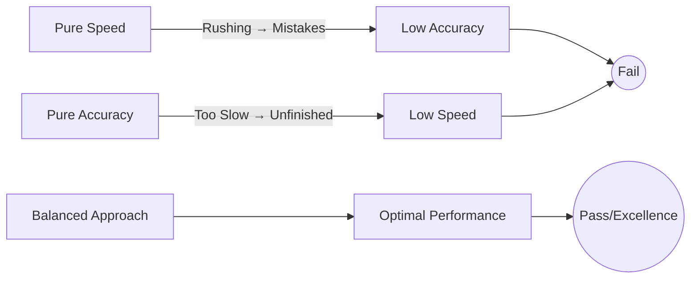
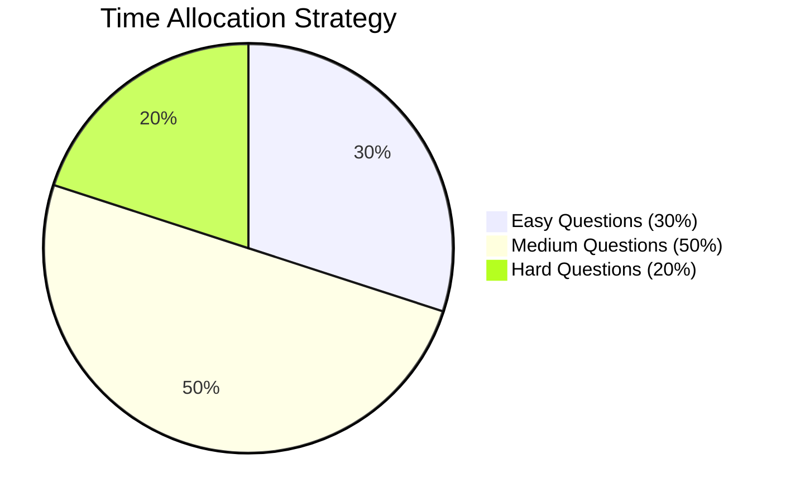
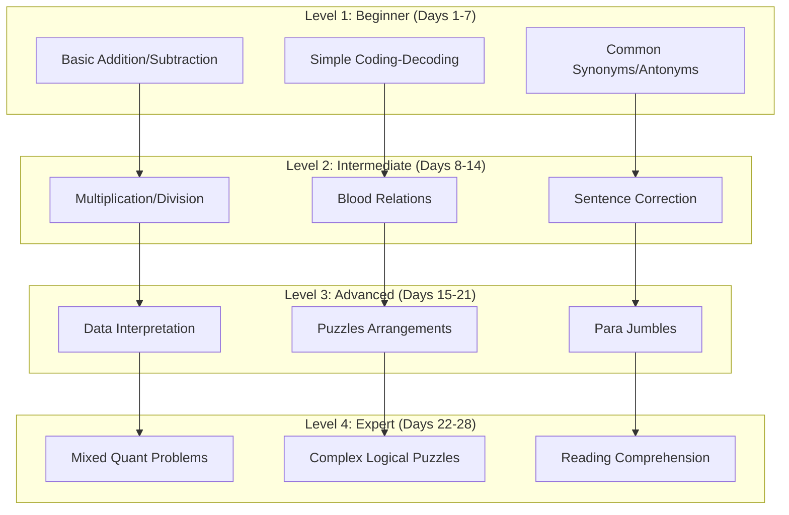

# Speed & Accuracy Drills

> Master the art of solving problems quickly without sacrificing precision. This course transforms your test-taking ability through timed, structured practice across quantitative aptitude, reasoning, and verbal ability domains.

## Why Speed & Accuracy Matter

In competitive exams, interviews, and time-bound assessments, knowing the concept is only half the battle. The other half is **execution under pressure**. Every second counts, and every wrong answer costs you marks.

### The Speed-Accuracy Tradeoff



**The principle**: Speed without accuracy is guessing. Accuracy without speed is incomplete. You need **controlled speed** — fast enough to finish, careful enough to be right.

```
┌─────────────────────────────────────────────────────────┐
│                                                         │
│   Performance = Speed × Accuracy × Stamina              │
│                                                         │
│   Where:                                                │
│   - Speed   = Questions attempted per minute            │
│   - Accuracy = Correct answers ÷ Total attempts         │
│   - Stamina = Ability to maintain both for 2-3 hours   │
│                                                         │
└─────────────────────────────────────────────────────────┘
```

### The Skill Improvement Curve

```mermaid
lineChart
title Speed-Accuracy Growth Over 30 Days
x-axis ["Day 1", "Day 5", "Day 10", "Day 15", "Day 20", "Day 25", "Day 30"]
dataset "Speed (Qs/min)" [2, 3, 4, 5, 5.5, 6, 7]
dataset "Accuracy (%)" [55, 65, 72, 80, 85, 88, 92]
dataset "Composite Score" [110, 195, 288, 400, 468, 528, 644]
```

Your skill improvement follows three phases:

1. **Phase 1 (Days 1–10): Foundation** — Focus on accuracy. Slow down to get things right. Build mental habits.
2. **Phase 2 (Days 11–20): Transition** — Gradually increase speed while maintaining 75%+ accuracy.
3. **Phase 3 (Days 21–30): Optimization** — Push speed limits while keeping accuracy above 85%.

## Time Management Strategies

### The Three-Bucket Approach

Not all questions are equal. Classify every question within 10 seconds of reading it:

| Bucket | Type | Strategy | Time Allocation |
|--------|------|----------|-----------------|
| **Easy** | You know the formula, you've done similar before | Solve immediately | 30% of total time |
| **Medium** | You've seen it but need a moment to recall | Solve but mark for review if uncertain | 50% of total time |
| **Hard** | You've never seen this type or it requires complex computation | Skip after 30 seconds, return if time permits | 20% of total time |



### The 2-Minute Rule

If you cannot make progress on a question within **2 minutes**:
1. Mark your best guess (if no negative marking)
2. Flag it for review
3. Move on

Never spend more than 3 minutes on any single question in a timed test.

### The 3-Pass Method

| Pass | Focus | Time Spent |
|------|-------|------------|
| **Pass 1** | Answer all easy questions you're confident about | 40% of total time |
| **Pass 2** | Attempt medium-difficulty questions | 40% of total time |
| **Pass 3** | Review flagged questions, attempt hard ones if time remains | 20% of total time |

### Guessing Strategy

| Scenario | Strategy |
|----------|----------|
| No negative marking | Always guess |
| Negative marking (−1/3 or −1/4) | Eliminate 2 options, then guess |
| Negative marking (−1/2) | Only guess if you can eliminate 3 options |
| No idea at all | Leave blank (if negative marking exists) |

### Mental Math Shortcuts

```typescript
// Quick percentage calculation
// Find X% of Y faster by swapping: X% of Y = Y% of X
// Example: 8% of 25 = 25% of 8 = 2

function quickPercent(x: number, y: number): number {
  // Use the commutative property of percentages
  const swapResult = (y * x) / 100;
  const directResult = (x * y) / 100;
  // They're the same! Use whichever is easier mentally
  return directResult;
}

// Fast squaring (numbers ending in 5)
function squareEndingInFive(n: number): number {
  // e.g., 35² = (3×4) | 25 = 12 | 25 = 1225
  const tens = Math.floor(n / 10);
  const result = (tens * (tens + 1)) * 100 + 25;
  return result;
}

// Multiplication using difference of squares
// a × b = ((a+b)/2)² - ((a-b)/2)²
// Example: 97 × 103 = 100² - 3² = 10000 - 9 = 9991
function multiplyUsingSquares(a: number, b: number): number {
  const avg = (a + b) / 2;
  const diff = (Math.abs(a - b)) / 2;
  return avg * avg - diff * diff;
}
```

## 30-Day Drill Schedule

### Week 1: Foundation (Accuracy First)

| Day | Focus Area | Drills | Time | Accuracy Goal |
|-----|-----------|--------|------|---------------|
| 1 | Quant Arithmetic | Addition/Subtraction (Sets 1-3) | 20 min | 60% |
| 2 | Quant Arithmetic | Multiplication/Division (Sets 1-3) | 20 min | 60% |
| 3 | Quant Arithmetic | Percentages/Fractions (Sets 1-3) | 20 min | 60% |
| 4 | Reasoning | Coding-Decoding (Sets 1-3) | 20 min | 60% |
| 5 | Reasoning | Blood Relations (Sets 1-3) | 20 min | 60% |
| 6 | Verbal Ability | Synonyms/Antonyms (Sets 1-3) | 20 min | 60% |
| 7 | Review | Re-do mistakes from Week 1 | 30 min | 70% |

### Week 2: Building Consistency

| Day | Focus Area | Drills | Time | Accuracy Goal |
|-----|-----------|--------|------|---------------|
| 8 | Quant Advanced | Data Interpretation (Sets 1-3) | 25 min | 65% |
| 9 | Quant Advanced | Number Series (Sets 1-3) | 25 min | 65% |
| 10 | Logical Reasoning | Puzzles (Sets 1-3) | 25 min | 65% |
| 11 | Logical Reasoning | Data Sufficiency (Sets 1-3) | 25 min | 65% |
| 12 | Verbal Ability | Sentence Completion (Sets 1-3) | 25 min | 65% |
| 13 | Verbal Ability | Error Spotting (Sets 1-3) | 25 min | 65% |
| 14 | Review | Full-length mixed set | 40 min | 70% |

### Week 3: Speed Transition

| Day | Focus Area | Drills | Time | Accuracy Goal |
|-----|-----------|--------|------|---------------|
| 15 | Quant Arithmetic | Sets 4-7 (timed, reduced time) | 20 min | 75% |
| 16 | Quant Advanced | Quadratic/Simplification (Sets 4-7) | 25 min | 75% |
| 17 | Reasoning | Direction/Syllogism (Sets 4-7) | 20 min | 75% |
| 18 | Logical Reasoning | Assumptions/Input-Output (Sets 4-7) | 25 min | 75% |
| 19 | Verbal Ability | Para Jumbles/Cloze (Sets 4-7) | 25 min | 75% |
| 20 | Mixed | All domains — 30 questions | 30 min | 75% |
| 21 | Review | Weak areas analysis | 40 min | 80% |

### Week 4: Optimization & Test Readiness

| Day | Focus Area | Drills | Time | Accuracy Goal |
|-----|-----------|--------|------|---------------|
| 22 | Quant | Full quant mock (Sets 8-10 all topics) | 35 min | 80% |
| 23 | Reasoning | Full reasoning mock (Sets 8-10 all topics) | 30 min | 80% |
| 24 | Verbal | Full verbal mock (Sets 8-10 all topics) | 30 min | 80% |
| 25 | Mixed | Mixed domain (Sets 8-10 hardest) | 40 min | 85% |
| 26 | Weak Areas | Targeted practice on bottom 3 topics | 40 min | 85% |
| 27 | Timing | Attempt with 20% less time per set | 30 min | 80% |
| 28 | Full Mock | 60-question comprehensive test | 60 min | 85% |
| 29 | Review | Analyze mistakes, note patterns | 45 min | — |
| 30 | Final Mock | 60-question comprehensive test | 60 min | 90% |

## Progress Tracking Sheet

### Daily Score Tracker

| Day | Topic | Set | Score | Time | Accuracy | Speed (Q/min) | Notes |
|-----|-------|-----|-------|------|----------|---------------|-------|
| 1 | Add/Sub | 1 | | | | | |
| 1 | Add/Sub | 2 | | | | | |
| 1 | Add/Sub | 3 | | | | | |
| | | | | | | | |
| 2 | Mult/Div | 1 | | | | | |
| 2 | Mult/Div | 2 | | | | | |
| 2 | Mult/Div | 3 | | | | | |
| | | | | | | | |
| 3 | Percent | 1 | | | | | |
| 3 | Percent | 2 | | | | | |
| 3 | Percent | 3 | | | | | |
| | | | | | | | |
| 4 | Coding | 1 | | | | | |
| 4 | Coding | 2 | | | | | |
| 4 | Coding | 3 | | | | | |
| | | | | | | | |
| 5 | Blood | 1 | | | | | |
| 5 | Blood | 2 | | | | | |
| 5 | Blood | 3 | | | | | |
| | | | | | | | |
| 6 | Syn/Ant | 1 | | | | | |
| 6 | Syn/Ant | 2 | | | | | |
| 6 | Syn/Ant | 3 | | | | | |
| | | | | | | | |
| 7 | Review | Review | | | | | |
| | | | | | | | |
| 8 | DI | 1 | | | | | |
| 8 | DI | 2 | | | | | |
| 8 | DI | 3 | | | | | |
| | | | | | | | |
| 9 | Series | 1 | | | | | |
| 9 | Series | 2 | | | | | |
| 9 | Series | 3 | | | | | |
| | | | | | | | |
| 10 | Puzzles | 1 | | | | | |
| 10 | Puzzles | 2 | | | | | |
| 10 | Puzzles | 3 | | | | | |
| | | | | | | | |
| 11 | Data Suff | 1 | | | | | |
| 11 | Data Suff | 2 | | | | | |
| 11 | Data Suff | 3 | | | | | |

### Weekly Summary Table

| Week | Avg Accuracy | Avg Speed (Q/min) | Total Q Attempted | Correct | Incorrect | Improvement |
|------|-------------|-------------------|-------------------|---------|-----------|-------------|
| Week 1 | | | | | | |
| Week 2 | | | | | | |
| Week 3 | | | | | | |
| Week 4 | | | | | | |

### Weak Area Identification Matrix

Use this table to identify patterns in your mistakes:

| Question Type | Common Mistake | Frequency | Root Cause | Action Plan |
|--------------|----------------|-----------|------------|-------------|
| Percentages | Decimal error | ||||
| Time-Speed-Distance | Unit conversion | ||||
| Blood Relations | Generation count | ||||
| Syllogisms | "Some not" confusion | ||||
| Para Jumbles | Opening sentence | ||||
| Error Spotting | Subject-verb agreement | ||||

### Accuracy Benchmark Percentiles

| Percentile | Quant Accuracy | Reasoning Accuracy | Verbal Accuracy | Composite Score |
|------------|---------------|-------------------|-----------------|-----------------|
| Top 1% | 95%+ | 95%+ | 95%+ | 95%+ |
| Top 5% | 90%+ | 90%+ | 88%+ | 89%+ |
| Top 10% | 85%+ | 85%+ | 82%+ | 84%+ |
| Top 25% | 78%+ | 80%+ | 75%+ | 78%+ |
| Top 50% | 65%+ | 68%+ | 62%+ | 65%+ |
| Below 50% | <65% | <68% | <62% | <65% |

## How to Use This Course

### Recommended Study Session Structure

```
┌──────────────────────────────────────────────────┐
│              30-MINUTE DRILL SESSION             │
├──────────────────────────────────────────────────┤
│                                                  │
│  Warm-up (2 min)                                 │
│  └─ Quick mental math: 5 simple calculations     │
│                                                  │
│  Drill Set 1 (8 min)                             │
│  └─ Timed, record time and score                 │
│                                                  │
│  Review Set 1 (3 min)                            │
│  └─ Check answers, understand mistakes           │
│                                                  │
│  Drill Set 2 (8 min)                             │
│  └─ Timed, try to beat Set 1 performance         │
│                                                  │
│  Review Set 2 (3 min)                            │
│  └─ Check answers, log progress                  │
│                                                  │
│  Cooldown (6 min)                                │
│  └─ Re-attempt mistakes from both sets           │
│  └─ Note patterns in error log                   │
│                                                  │
└──────────────────────────────────────────────────┘
```

### Rules for Effective Practice

1. **Never practice without a timer.** Without time pressure, you're not building speed.
2. **Review every mistake.** Understand *why* you got it wrong — was it concept, calculation, or reading error?
3. **Re-attempt mistakes after 48 hours.** Spaced repetition cures blind spots.
4. **Track your accuracy per topic.** Don't guess which topics are weak — let the data tell you.
5. **Increase difficulty gradually.** Master 60% accuracy before pushing to 70%, then 80%.
6. **Simulate exam conditions.** Do drills in a quiet room, no phone, no interruptions.
7. **Rest.** Your brain consolidates learning during sleep. Overtraining causes burnout.

### Common Speed Breakers and Fixes

| Speed Breaker | Symptom | Fix |
|--------------|---------|-----|
| Calculation dependency | Reaching for calculator | Practice mental math daily |
| Re-reading questions | Reading 2-3 times | Active reading: underline key data |
| Perfectionism | Spending too long verifying | Trust first instinct, move on |
| Option matching | Scanning options repeatedly | Cover options, solve, then match |
| Question skipping | Spending 30s deciding to skip | Use 10-second rule |
| Review loops | Re-checking answered questions | Mark as final, don't revisit |
| Anxiety | Freezing on difficult questions | Deep breath, skip, build momentum |

## Drill Difficulty Progression



## Scoring Methodology

### Composite Score Calculation

```typescript
interface DrillResult {
  correct: number;
  total: number;
  timeTakenMinutes: number;
  timeAllowedMinutes: number;
}

function calculateAccuracy(result: DrillResult): number {
  return Math.round((result.correct / result.total) * 100);
}

function calculateSpeed(result: DrillResult): number {
  return Math.round((result.total / result.timeTakenMinutes) * 10) / 10;
}

function calculateCompositeScore(result: DrillResult): number {
  const accuracy = result.correct / result.total;
  const speedRatio = result.timeAllowedMinutes / result.timeTakenMinutes;
  // Cap speed ratio at 1.5 to prevent gaming by rushing
  const effectiveSpeed = Math.min(speedRatio, 1.5);
  return Math.round(accuracy * effectiveSpeed * 100);
}

function getGrade(compositeScore: number): string {
  if (compositeScore >= 90) return 'A+ — Excellent';
  if (compositeScore >= 80) return 'A — Very Good';
  if (compositeScore >= 70) return 'B+ — Good';
  if (compositeScore >= 60) return 'B — Fair';
  if (compositeScore >= 50) return 'C — Needs Work';
  return 'D — Start Again';
}
```

## Error Log Template

For every mistake, note:

```
Date: ___________  Topic: ___________  Set: ___________

Question: _________________________________________________
____________________________________________________________

My answer: ___   Correct answer: ___

Mistake type (circle one):
  READING  |  CONCEPT  |  CALCULATION  |  CARELESS  |  TIMING

What went wrong: __________________________________________
____________________________________________________________

Correct approach: __________________________________________
____________________________________________________________

Re-attempt result (after 48h): ___/___
```

## Daily Warm-Up Routine

Before every drill session, spend 2 minutes on this warm-up:

```
1. 15 + 28 = ___
2. 84 - 37 = ___
3. 6 × 13 = ___
4. 144 ÷ 12 = ___
5. 30% of 200 = ___
6. Square root of 121 = ___
7. 7² = ___
8. 5³ = ___
9. 1/4 + 1/3 = ___
10. 0.75 as fraction = ___
```

<details>
<summary>Warm-Up Answers</summary>

1. 43
2. 47
3. 78
4. 12
5. 60
6. 11
7. 49
8. 125
9. 7/12
10. 3/4

</details>

## Drill Index

| File | Topic | Sets | Time per Set | Total Questions |
|------|-------|------|-------------|-----------------|
| [01-quant-arithmetic-drills.md](01-quant-arithmetic-drills.md) | Quant Arithmetic | 45 | 30 sec - 3 min | 450+ |
| [02-quant-advanced-drills.md](02-quant-advanced-drills.md) | Quant Advanced | 40 | 2 - 5 min | 250+ |
| [03-reasoning-drills.md](03-reasoning-drills.md) | Reasoning | 50 | 1 - 3 min | 300+ |
| [04-logical-reasoning-drills.md](04-logical-reasoning-drills.md) | Logical Reasoning | 40 | 2 - 4 min | 200+ |
| [05-verbal-ability-drills.md](05-verbal-ability-drills.md) | Verbal Ability | 60 | 1 - 5 min | 350+ |
| **Total** | **All Domains** | **235** | **—** | **1550+** |

## Tips for Maximum Improvement

1. **Start each session with your weakest topic.** Your mind is freshest at the beginning.
2. **Use the Pomodoro technique:** 25 min drill, 5 min break, 25 min drill.
3. **Keep a "mistake journal."** Writing errors by hand reinforces correct patterns.
4. **Practice in blocks of 3 sessions** per topic per week for best retention.
5. **Simulate exam noise** in Week 4 — practice with a clock ticking or background chatter.
6. **Hydrate and breathe.** Shallow breathing reduces cognitive performance by up to 15%.
7. **Sleep on it.** Major improvements often appear after a good night's sleep, not during practice.

## Frequently Asked Questions

### Q: I'm scoring below 50% accuracy. What should I do?
A: Stop timing yourself. Focus purely on understanding the concepts. Work through problems slowly with full concentration until accuracy reaches 70%, then reintroduce the timer.

### Q: I'm fast but inaccurate. How do I fix this?
A: You're rushing. Force yourself to reduce speed by 30% using the "read twice, solve once" rule. Verify each calculation step. Accuracy will improve, then you can gradually increase speed.

### Q: I'm accurate but too slow. How do I speed up?
A: You're likely over-verifying. Set a strict timer for each question (e.g., 90 seconds). If you can't finish, move on. Practice mental math shortcuts daily. Your brain will adapt.

### Q: How many hours per day should I practice?
A: 45-60 minutes is optimal. Beyond 90 minutes, marginal returns diminish sharply. Quality over quantity.

### Q: When will I see improvement?
A: Most people see measurable improvement (10-15% accuracy gain) within 10-14 days of consistent practice. Speed improvements typically appear in weeks 2-3.

### Q: What if I plateau at 75-80% accuracy?
A: Plateaus are normal. Change your practice method: switch from topic drills to mixed sets, reduce time per question by 10%, or focus exclusively on the question types where you make mistakes.

---

**Ready? Begin with [Chapter 1: Quant Arithmetic Drills →](01-quant-arithmetic-drills.md)**
