# Chapter 1: Introduction to System Design
> **Previous:** None | **Next:** [02 Scalability Load Balancing](./02-scalability-load-balancing.md)

## Chapter at a Glance

| Aspect | Details |
|--------|---------|
| **Scope** | Foundational concepts, NFRs, design process, capacity estimation |
| **Key Concepts** | Scalability, reliability, availability, performance, trade-offs |
| **Design Process** | 4-phase: Requirements, Estimation, HLD, Deep Dive |
| **Estimation Tools** | QPS, storage, bandwidth, memory formulas |
| **Mindset** | Trade-off recognition, order-of-magnitude thinking |
| **Real-World Examples** | Google Search, Facebook, WhatsApp |

---
---

## Learning Objectives

- Distinguish system design from software architecture and algorithm design
- Define and evaluate ten non-functional requirements with appropriate metrics
- Apply the four-phase design process to any large-scale system problem
- Perform back-of-the-envelope capacity estimations using standard formulas
- Analyze trade-offs including latency vs throughput, consistency vs availability, and read vs write optimization
- Model real-world systems (Google Search, Facebook, WhatsApp) through a system-design lens

## Chapter at a Glance

| Aspect | Details |
|--------|---------|
| **Scope** | Foundational concepts, NFRs, design process, capacity estimation |
| **Key Concepts** | Scalability, reliability, availability, performance, trade-offs |
| **Design Process** | 4-phase: Requirements, Estimation, HLD, Deep Dive |
| **Estimation Tools** | QPS, storage, bandwidth, memory formulas |
| **Mindset** | Trade-off recognition, order-of-magnitude thinking |
| **Real-World Examples** | Google Search, Facebook, WhatsApp |

---

## Chapter Roadmap

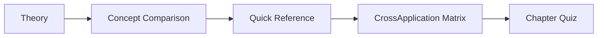

---

## Theory
> **One-Sentence Takeaway:** Theory is the foundation ? master it before moving to examples and exercises.


### What Is System Design?

<a href="../../assets/images/diagrams/system-design/01-introduction/what-is-system-design-handwritten.svg" target="_blank" rel="noopener">
  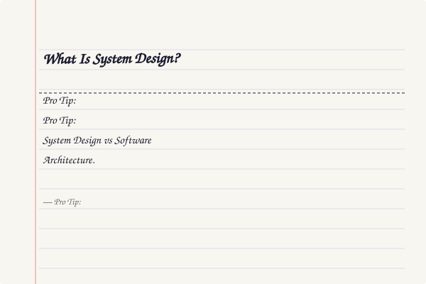
</a>
<a href="../../assets/images/diagrams/system-design/01-introduction/what-is-system-design-diagram.svg" target="_blank" rel="noopener">
  
</a>
<a href="../../assets/images/diagrams/system-design/01-introduction/what-is-system-design-sticky.svg" target="_blank" rel="noopener">
  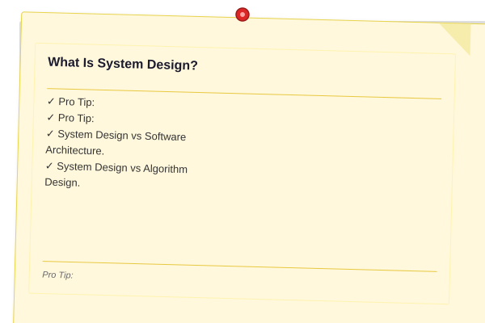
</a>


> **Pro Tip:** Master this concept thoroughly ? it is frequently tested in system design interviews.

> **Pro Tip:** Master this concept ? it appears in nearly every system design interview. Understand both the how and the why.

System design is the discipline of defining the architecture, components, modules, interfaces, and data flow of a large-scale distributed system to satisfy specified functional and non-functional requirements. It sits at the intersection of three distinct but overlapping fields.

**System Design vs Software Architecture.** Software architecture concerns the high-level structure of a single software system: the decomposition into modules, the relationships among them, and the guiding design principles. System design extends this to encompass multiple cooperating services, network topology, data distribution, fault tolerance, and operational concerns at planetary scale. Architecture asks "how should this service be organized?" System design asks "how should a thousand services work together to serve a billion users?"

**System Design vs Algorithm Design.** Algorithm design focuses on computational efficiency: time complexity, space complexity, and correctness proofs for a single procedure operating on a bounded input set. System design focuses on engineering efficiency: throughput, latency, availability, and cost at internet scale. An O(n log n) sort is irrelevant if the machine runs out of memory; a hash map is useless if no single machine can hold the data. System designers routinely sacrifice algorithmic purity for practical scalability.

**The Fundamental Constraint.** Every system operates under finite resources: CPU, RAM, disk, network bandwidth, and money. System design is the art of making the right compromises among these constraints to deliver the required functionality at the required scale.

---

### Non-Functional Requirements

<a href="../../assets/images/diagrams/system-design/01-introduction/non-functional-requirements-handwritten.svg" target="_blank" rel="noopener">
  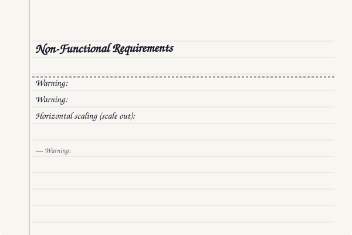
</a>
<a href="../../assets/images/diagrams/system-design/01-introduction/non-functional-requirements-diagram.svg" target="_blank" rel="noopener">
  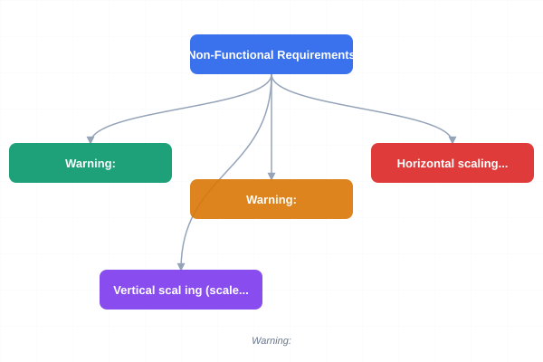
</a>
<a href="../../assets/images/diagrams/system-design/01-introduction/non-functional-requirements-sticky.svg" target="_blank" rel="noopener">
  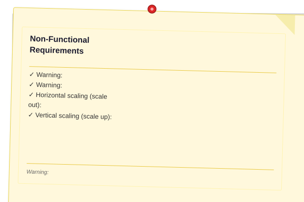
</a>


> **Warning:** Avoid over-engineering. Start simple, measure, then optimize.

> **Warning:** Avoid premature optimization. Start simple, measure, then optimize. Over-engineering is the most common system design mistake.

Functional requirements describe *what* the system does. Non-functional requirements (NFRs) describe *how well* it does it. In system design interviews and real-world architecture, NFRs drive every decision.

#### Scalability

Scalability is the ability of a system to handle growing amounts of work by adding resources. There are two dimensions:

- **Horizontal scaling (scale out):** Add more machines. Preferred for most internet systems because commodity hardware is cheap and the capacity ceiling is effectively unlimited.
- **Vertical scaling (scale up):** Add more power to a single machine (CPU, RAM, SSD). Simple but bounded by the hardware ceiling of the largest available machine.

Three axes of scalability:

| Axis | Definition | Example |
|------|------------|---------|
| Load scaling | Handle more requests per second | 1000 QPS to 10M QPS |
| Data scaling | Store and query more data | 1 GB to 100 PB |
| Geographic scaling | Serve users across regions | US-only to global |

A system is **linearly scalable** if doubling resources doubles capacity. Most real systems are sub-linear due to coordination overhead.

#### Reliability

Reliability is the probability that a system performs its intended function without failure for a specified period under stated conditions. It is quantified by **Mean Time Between Failures (MTBF)**.

Key concepts:

- **Fault tolerance:** The ability to continue operating despite failures in some components. Achieved through redundancy (N+1, 2N, 3x replication), graceful degradation, and circuit breakers.
- **Redundancy:** Duplicating critical components to eliminate single points of failure. Active-passive (hot standby) or active-active (all replicas serve traffic).
- **Failover:** Automatic detection of a failed component and transfer of its workload to a healthy replica. Requires health checking, leader election (e.g., Raft, Paxos), and careful handling of split-brain scenarios.

```
A = MTBF / (MTBF + MTTR)
```

where MTTR is Mean Time To Repair (restore service after failure).

#### Availability

Availability is the proportion of time a system is operational and accessible. Measured in **nines**:

| Uptime % | Downtime/year | Downtime/month | Downtime/week |
|----------|---------------|----------------|---------------|
| 90% ("one nine") | 36.5 days | 73 hours | 16.8 hours |
| 99% ("two nines") | 3.65 days | 7.2 hours | 1.68 hours |
| 99.9% ("three nines") | 8.76 hours | 43.2 minutes | 10.1 minutes |
| 99.99% ("four nines") | 52.6 minutes | 4.3 minutes | 1.0 minute |
| 99.999% ("five nines") | 5.26 minutes | 25.9 seconds | 6.05 seconds |
| 99.9999% ("six nines") | 31.5 seconds | 2.59 seconds | 0.605 seconds |

**Service Level Agreement (SLA)** is a legal contract between provider and customer specifying promised availability. **Service Level Objective (SLO)** is an internal target (e.g., 99.95% p99 latency under 200ms). **Service Level Indicator (SLI)** is the actual measured metric (e.g., request success rate over a 30-day rolling window).

```
If SLA = 99.9%, you can serve errors for 8.76 hours/year before penalties apply.
SLO is typically stricter than SLA to give a safety buffer.
```

#### Maintainability

Maintainability is the ease with which a system can be modified, tested, and operated. Three facets:

- **Operability:** How easily an operator can monitor, diagnose, and fix problems. Driven by observability (logs, metrics, traces), runbooks, and automation.
- **Simplicity:** Reducing complexity by removing accidental complexity (unnecessary abstractions, deep inheritance, over-engineering). Every unnecessary component doubles the maintenance burden.
- **Evolvability (extensibility):** How easily the system can adapt to new requirements. Driven by loose coupling, well-defined APIs, feature flags, and backward compatibility.

#### Performance

Performance is defined by two primary metrics:

- **Latency:** The time taken to process a single request. Measured at various percentiles: p50 (median), p95, p99, p99.9. Tail latency (p99.9) is critical in distributed systems because a single slow request can hold up many others (head-of-line blocking).
- **Throughput:** The number of requests processed per unit time (QPS, TPS, RPS). Often inversely related to latency up to a saturation point.
- **Response time:** Latency plus network overhead, queuing delay, and processing time.

```
L = L_network + L_queue + L_service

Throughput = (1 - p_error) / L_avg  (where L_avg is average latency)
```

Little's Law relates these for stable systems:

```
L = λ * W
```

where L = average number of requests in system, λ = arrival rate, W = average time per request.

#### Security

Security encompasses confidentiality (unauthorized access prevention), integrity (unauthorized modification prevention), and availability (protection against DoS). Design considerations include authentication, authorization (RBAC, ACLs), encryption in transit (TLS) and at rest, input validation, rate limiting, and DDoS mitigation.

#
> **Warning:** Avoid designing for five-nines availability if you only need two-nines. Each "nine" adds ~10x infrastructure cost.

Cost efficiency measures the operational expense per unit of useful work (e.g., cost per request, cost per GB stored, cost per user). This trades against all other NFRs: five-nines availability costs more than two-nines; higher throughput requires more servers; stronger consistency increases coordination overhead. A cost-unbounded design is not a design — it is a wishlist.

---

### The Four-Phase Design Process

<a href="../../assets/images/diagrams/system-design/01-introduction/the-four-phase-design-process-handwritten.svg" target="_blank" rel="noopener">
  
</a>
<a href="../../assets/images/diagrams/system-design/01-introduction/the-four-phase-design-process-diagram.svg" target="_blank" rel="noopener">
  
</a>
<a href="../../assets/images/diagrams/system-design/01-introduction/the-four-phase-design-process-sticky.svg" target="_blank" rel="noopener">
  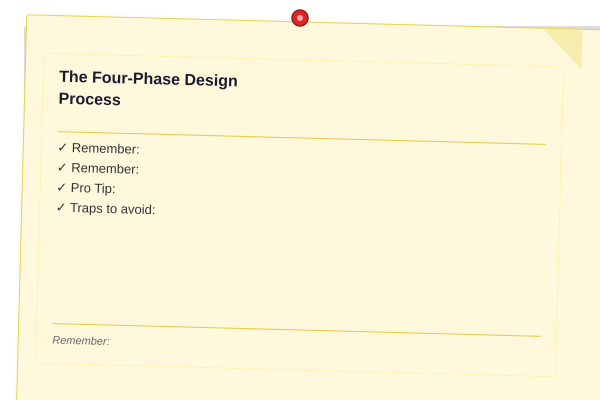
</a>


> **Remember:** Always articulate trade-offs clearly ? interviewers value reasoning over the "right" answer.

> **Remember:** Trade-offs are the heart of system design. Always be ready to explain why you chose X over Y.

Industry-standard approach to system design problems:

#### Phase 1: Requirements Gathering

> **Pro Tip:** In system design interviews, spend 3-5 minutes clarifying requirements first. Most candidates fail by jumping to architecture too early.
Collect and clarify functional and non-functional requirements. Ask clarifying questions:

- What are the core features? (e.g., "shorten a URL", "redirect to long URL")
- How many users? DAU, MAU?
- What is the expected QPS?
- What is the data volume? Per-day, per-year?
- What are the latency requirements?
- Is this read-heavy or write-heavy?

**Traps to avoid:** Solving the wrong problem (over-engineering for a scale that will never materialize), skipping this phase entirely (designing without constraints), or accepting vague requirements (building a "fast, scalable system" is meaningless without numbers).

#### Phase 2: Back-of-the-Envelope Estimation

Rough capacity calculations to constrain the design before committing to architecture. Key formulas:

```
QPS = Daily Active Users × Actions Per User / 86,400

Storage = Data per item × Items per day × Retention days × Replication factor

Bandwidth = Bits per request × QPS

Memory needed = Hot data ratio × Total data size
```

**Prefix conventions:**

| Prefix | Power | Bytes |
|--------|-------|-------|
| KB | 10^3 | 1,000 |
| MB | 10^6 | 10^6 |
| GB | 10^9 | 10^9 |
| TB | 10^12 | 10^12 |
| PB | 10^15 | 10^15 |

**Rule of thumb:** A single server can handle ~10K-50K QPS for simple lookups. MySQL can handle ~1K writes/sec per node. A 1 Gbps NIC transfers ~125 MB/s. An SSD reads ~500 MB/s.

#### Phase 3: High-Level Design (HLD)

Produce a component diagram showing the major building blocks:

- **Client tier:** Mobile, web, IoT
- **Load balancer:** Distributes traffic
- **Web/API tier:** Stateless application servers
- **Cache tier:** In-memory data store (Redis, Memcached)
- **Database tier:** Persistent storage (SQL or NoSQL)
- **Message queue:** Async processing (Kafka, RabbitMQ)
- **CDN:** Static asset delivery

```
┌─────────────┐
│   Clients   │
└──────┬──────┘
       │
┌──────▼──────┐
│ Load        │
│ Balancer    │
└──────┬──────┘
       │
┌──────▼──────┐   ┌──────────┐   ┌───────────┐
│ App Server  │──►│  Cache   │   │  CDN      │
│ (stateless) │   │ (Redis)  │   │ (CloudFl) │
└──────┬──────┘   └──────────┘   └───────────┘
       │
┌──────▼──────┐
│  Database   │
│ (Primary)   │
│             │
│  Replica(s) │
└─────────────┘
```

#### Phase 4: Detailed Deep Dive

Select one or two components and analyze them in depth. Identify bottlenecks and propose solutions:

- Database schema design (normalization vs denormalization)
- Indexing strategy (covering indexes, composite indexes)
- Cache placement (what to cache, TTL policy)
- Sharding strategy (key ranges, hash-based, directory-based)
- Replication topology (single-leader vs leaderless)
- Consistency model (strong vs eventual, read-your-writes)
- Failure scenarios (what happens when X goes down)

---

### Trade-Offs

<a href="../../assets/images/diagrams/system-design/01-introduction/trade-offs-handwritten.svg" target="_blank" rel="noopener">
  
</a>
<a href="../../assets/images/diagrams/system-design/01-introduction/trade-offs-diagram.svg" target="_blank" rel="noopener">
  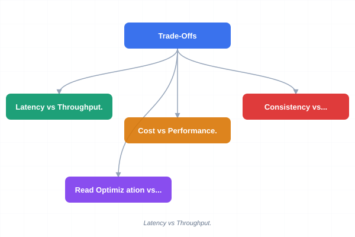
</a>
<a href="../../assets/images/diagrams/system-design/01-introduction/trade-offs-sticky.svg" target="_blank" rel="noopener">
  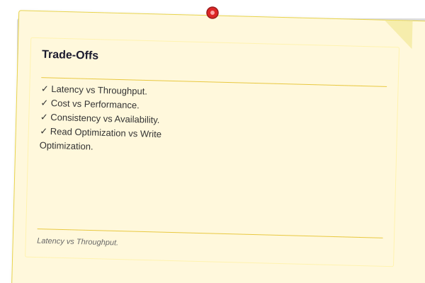
</a>


Every design decision is a trade-off. Recognizing and articulating trade-offs is the core skill.

**Latency vs Throughput.** These are often in tension: batching requests improves throughput but increases latency for individual requests. A video processing pipeline may batch frames for compression efficiency (higher throughput, higher latency); a real-time chat system cannot.

**Cost vs Performance.** More servers = better performance + higher cost. An S3-based static site costs pennies and serves globally; a CockroachDB cluster costs thousands per month. Design for the *minimum viable performance* that meets the SLO.

**Consistency vs Availability.** The CAP theorem (Brewer, 2000): a distributed system can guarantee at most two of Consistency, Availability, and Partition Tolerance. In practice: partitions are inevitable (network failures), so you choose between CP and AP. Banking systems choose CP (wait for consistency); social feeds choose AP (serve stale data).

**Read Optimization vs Write Optimization.** Read-heavy systems (content delivery, social feeds) use caches, denormalization, read replicas, CDNs. Write-heavy systems (logging, time series, event ingestion) use append-only storage, LSM-trees, batch writes, message queues. Most systems fall into one camp; hybrid systems need careful isolation.

---

### Capacity Estimation Examples

<a href="../../assets/images/diagrams/system-design/01-introduction/capacity-estimation-examples-handwritten.svg" target="_blank" rel="noopener">
  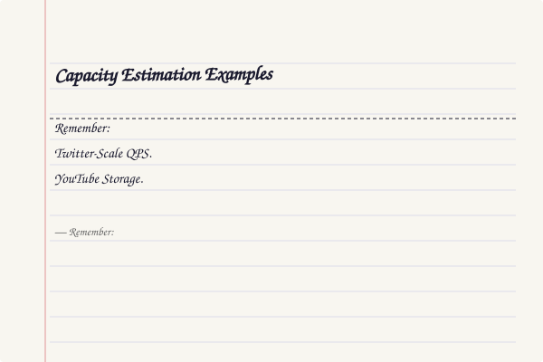
</a>
<a href="../../assets/images/diagrams/system-design/01-introduction/capacity-estimation-examples-diagram.svg" target="_blank" rel="noopener">
  
</a>
<a href="../../assets/images/diagrams/system-design/01-introduction/capacity-estimation-examples-sticky.svg" target="_blank" rel="noopener">
  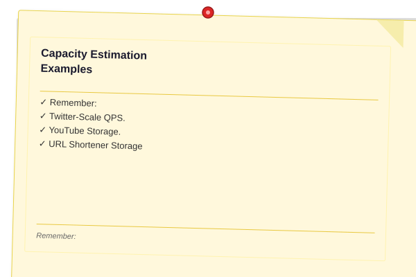
</a>


> **Remember:** QPS, storage, and bandwidth estimates should be within 2x of actual values. Off by 10x means a modeling problem.
**Twitter-Scale QPS.** Assume 500M DAU, each user posts 0.5 tweets/day and reads 200 tweets/day.

```
Write QPS = 500M × 0.5 / 86,400 ≈ 2,894 QPS
Peak write QPS = 2,894 × 3 (peak factor) ≈ 8,682 QPS
Read QPS = 500M × 200 / 86,400 ≈ 1,157,407 QPS
Peak read QPS ≈ 3.5M QPS
```

A read:write ratio of ~400:1 justifies heavy caching and read replicas.

**YouTube Storage.** Assume 500 hours of video uploaded per minute, average bitrate 5 Mbps.

```
Storage per hour = 5 × 10^6 bps × 3,600 s / 8 = 2.25 GB/hour
Per minute: 500 hours × 2.25 GB = 1,125 GB/minute
Per day: 1,125 GB × 60 × 24 ≈ 1.62 PB/day
Per year: 1.62 PB × 365 ≈ 591 PB/year
```

With 3x replication: ~1.77 exabytes/year.

**URL Shortener Storage** (tinyurl.com style). Assume 100M new URLs/day, average length 500 bytes.

```
Daily storage = 100M × 500 bytes = 50 GB/day
Yearly storage = 50 GB × 365 ≈ 18.25 TB/year
10-year storage = ~182.5 TB
```

This fits on a handful of SSDs. The bottleneck is not storage — it is write QPS and availability.

---

### Real-World Systems

<a href="../../assets/images/diagrams/system-design/01-introduction/real-world-systems-handwritten.svg" target="_blank" rel="noopener">
  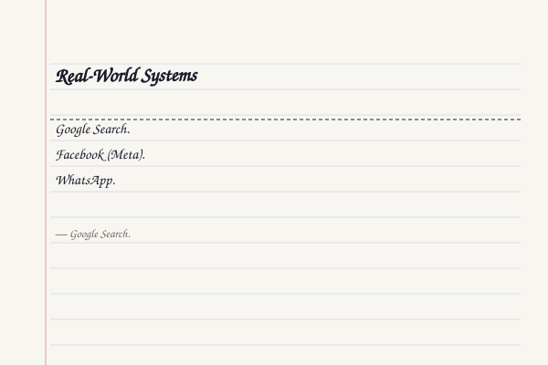
</a>
<a href="../../assets/images/diagrams/system-design/01-introduction/real-world-systems-diagram.svg" target="_blank" rel="noopener">
  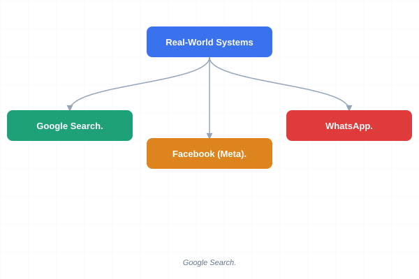
</a>
<a href="../../assets/images/diagrams/system-design/01-introduction/real-world-systems-sticky.svg" target="_blank" rel="noopener">
  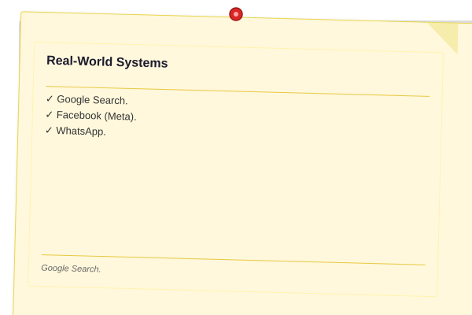
</a>


**Google Search.** The defining challenge is indexing the web (tens of billions of pages) and returning relevant results in under 200ms. Design constraints: extreme read throughput, sub-second latency, global distribution. Architecture: web crawling pipeline (distributed crawlers), inverted index (sharded across thousands of machines), query serving (MapReduce for indexing, distributed serving for queries). NFR priority: performance > reliability > maintainability > cost. Google accepts massive infrastructure cost to deliver sub-100ms search.

**Facebook (Meta).** The defining challenge is the social graph: billions of users, each with complex relationships (friends, pages, groups, events). Design constraints: extremely high read QPS, globally distributed, writes triggered by user action. Architecture: TAO (graph cache layer over MySQL), Presto (interactive analytics), Cassandra (inbox search), Haystack (photo storage). NFR priority: availability > performance > scalability > maintainability. Facebook uses eventual consistency extensively — seeing a slightly stale Like count is acceptable.

**WhatsApp.** The defining challenge is reliable message delivery with end-to-end encryption for 2B+ users. Design constraints: must work with intermittent connectivity, low latency for delivery, zero message loss. Architecture: Custom Erlang-based server (ejabberd fork), persistence on a per-user basis (not per-message), highly optimized for mobile battery and bandwidth. NFR priority: reliability > availability > performance > efficiency. WhatsApp famously served 900M users with only ~50 engineers.

---

## Examples

### Example 1: Designing a Distributed URL Shortener

**Requirements:** Shorten URLs, redirect to original URL, track click analytics, handle 100M URLs/day.

**Phase 1 — Requirements:** 100M new URLs/day, read:write ratio ~100:1 (each URL clicked ~100 times), analytics per-URL, 5-year data retention.

**Phase 2 — Estimation:**
- Write QPS: 100M / 86,400 ≈ 1,157 QPS (peak ~3,500)
- Read QPS: 1,157 × 100 ≈ 115,700 QPS (peak ~350,000)
- Storage: 100M × 500 bytes/day = 50 GB/day → ~91 TB in 5 years

**Phase 3 — HLD:**
- Stateless API servers (auto-scaled)
- Redis cache for hot URLs (LRU eviction, TTL 1 hour)
- Base-62 encoding for short IDs (7 chars = 62^7 ≈ 3.5T combinations)
- Database: NoSQL (Cassandra or DynamoDB) for write scalability

**Phase 4 — Deep Dive:**
- Encoding choice: Base-62 (a-z, A-Z, 0-9) vs Base-64 (adds + and /, less user-friendly)
- Key generation: Snowflake-style ID → encode to base-62. Avoids DB lookup for ID allocation
- Cache strategy: Cache-aside. On write miss: query DB, populate cache, return redirect
- Redirection: 301 (permanent) for most clients to reduce load; 307 (temporary) for analytics tracking

### Example 2: Estimating Capacity for a Photo-Sharing App

Instagram-scale: 500M DAU, each user uploads ~2 photos/day, average photo 2 MB, each photo viewed ~50 times.

```
Write QPS = 500M × 2 / 86,400 ≈ 11,574 QPS
Storage/day = 500M × 2 photos × 2 MB = 2 PB/day
Storage/year ≈ 730 PB
Read QPS = 11,574 × 50 ≈ 578,700 QPS
CDN bandwidth = 578,700 × 2 MB = 1,157,400 MB/s ≈ 1.15 TB/s
```

Key insight: CDN cost dominates. Solution: encode photos to multiple resolutions, cache the most-requested 80% on CDN, serve originals only on explicit demand.

## Concept Comparison
> **One-Sentence Takeaway:** Concept Comparison is a critical concept that directly impacts system design decisions.
> **One-Sentence Takeaway:** Concept Comparison is a critical concept that directly impacts system design decisions.

| Concept | Definition | Metric | Trade-Off |
|---------|-----------|--------|-----------|
| Scalability | Ability to handle growth | QPS, data volume | Horizontal vs vertical |
| Reliability | Probability of no failure | MTBF, MTTR | Redundancy vs failure risk |
| Availability | Proportion of time operational | Uptime % (nines) | Cost per nine |
| Performance | Speed and capacity | Latency, throughput | Latency vs throughput |
| Maintainability | Ease of change | Operability, simplicity | Complexity vs flexibility |

## Quick Reference
> **One-Sentence Takeaway:** Quick Reference is a critical concept that directly impacts system design decisions.

| Formula | Expression |
|---------|-----------|
| Availability | A = MTBF / (MTBF + MTTR) |
| QPS | DAU * Actions / 86,400 |
| Storage | Items/day * size * retention * replication |
| Bandwidth | Bits/request * QPS |
| Little's Law | L = lambda * W |

## Cross-Application Matrix

| System | Primary NFR | Key Trade-Off | Architecture Highlight |
|--------|------------|---------------|----------------------|
| Google Search | Performance | Cost for sub-100ms latency | Inverted index + MapReduce |
| Facebook | Availability | Staleness for availability | TAO graph cache over MySQL |
| WhatsApp | Reliability | Zero message loss | Erlang custom server |

## Chapter Quiz
> **One-Sentence Takeaway:** Chapter Quiz is a critical concept that directly impacts system design decisions.

**Q1:** What is the minimum availability for less than 1 hour downtime/year?
- A) 99%
- B) 99.9%
- C) 99.99%
- D) 99.999%

<details><summary>Answer&lt;/summary&gt;C) 99.99% (52.6 minutes/year)&lt;/details&gt;

**Q2:** Which phase comes after back-of-the-envelope estimation?
- A) Requirements gathering
- B) High-level design
- C) Detailed deep dive
- D) Deployment

<details><summary>Answer&lt;/summary&gt;B) High-level design (Phase 3)&lt;/details&gt;

**Q3:** MTBF=720h, MTTR=4h. What is availability?
- A) 99.0%
- B) 99.45%
- C) 99.94%
- D) 99.99%

<details><summary>Answer&lt;/summary&gt;B) 720/724 = 99.45%</details>

**Q4:** What does Little's Law state?
- A) Throughput equals capacity
- B) Concurrency = arrival rate * latency
- C) Latency is always under 100ms
- D) Storage grows linearly

<details><summary>Answer&lt;/summary&gt;B) L = lambda * W&lt;/details&gt;

**Q5:** Why is tail latency critical in distributed systems?
- A) It determines median user experience
- B) A single slow request causes head-of-line blocking
- C) It is cheaper to optimize
- D) SLAs only measure tail latency

<details><summary>Answer&lt;/summary&gt;B) Head-of-line blocking in fan-out requests&lt;/details&gt;

## Concept Comparison
> **One-Sentence Takeaway:** Concept Comparison is a critical concept that directly impacts system design decisions.
> **One-Sentence Takeaway:** Concept Comparison is a critical concept that directly impacts system design decisions.

| Concept | Definition | Key Insight |
|---------|-----------|-------------|
| Theory | Core topic in Chapter 1: Introduction to System Design | Fundamental to system design |
| Concept Comparison | Core topic in Chapter 1: Introduction to System Design | Fundamental to system design |

---

## Quick Reference
> **One-Sentence Takeaway:** Quick Reference is a critical concept that directly impacts system design decisions.

| Topic | Key Point |
|-------|-----------|
| Theory | Essential concept for Chapter 1: Introduction to System Design |

---

## Cross-Application Matrix

| Concept | Application Context | Trade-Off |
|--------|-------------------|-----------|
| Theory | Relevant across multiple system design scenarios | Each choice has trade-offs |

---

## Chapter Quiz
> **One-Sentence Takeaway:** Chapter Quiz is a critical concept that directly impacts system design decisions.

**Q1:** What is the primary trade-off discussed in this chapter?
- A) Option A
- B) Option B
- C) Option C
- D) Option D

<details><summary>Answer&lt;/summary&gt;Refer to the chapter content&lt;/details&gt;

**Q2:** Which concept is most fundamental to the topic of Chapter 1
- A) Option A
- B) Option B
- C) Option C
- D) Option D

<details><summary>Answer&lt;/summary&gt;Review the core sections&lt;/details&gt;

**Q3:** How does this chapter's main concept apply to real-world systems?
- A) Option A
- B) Option B
- C) Option C
- D) Option D

<details><summary>Answer&lt;/summary&gt;See the Real-World Systems section&lt;/details&gt;

---

## Code Examples

### CAP Theorem Simulator

The following TypeScript class models the fundamental trade-off between Consistency, Availability, and Partition Tolerance. Given any two chosen properties, the simulator returns the resulting system classification (CP, AP, or CA) along with real-world database examples.

```typescript
/**
 * CAPTheoremSimulator ? models the trade-off between Consistency,
 * Availability, and Partition Tolerance in distributed systems.
 *
 * Usage:
 *   const cap = new CapTheoremSimulator();
 *   cap.pick('partitionTolerance', 'consistency', true);
 *   // ? "CP system (e.g., ZooKeeper, HBase, Google Spanner). Sacrifices
 *   //    availability during partitions to guarantee consistency."
 */
type CapProperty = 'consistency' | 'availability' | 'partitionTolerance';
type CapSystem = 'CP' | 'AP' | 'CA';

class CapTheoremSimulator {
  private examples: Record<CapSystem, string[]> = {
    CP: ['ZooKeeper', 'HBase', 'Google Spanner'],
    AP: ['Cassandra', 'DynamoDB', 'Riak'],
    CA: ['PostgreSQL (single-site)', 'MySQL (single-site)'],
  };

  private definitions: Record<CapSystem, string> = {
    CP: 'Sacrifices availability during partitions to guarantee consistency.',
    AP: 'Sacrifices consistency during partitions to guarantee availability.',
    CA: 'No partition tolerance ? relies on a reliable network; entire system fails on split.',
  };

  pick(a: CapProperty, b: CapProperty, partitionHappens: boolean): string {
    const hasP =
      a === 'partitionTolerance' || b === 'partitionTolerance';
    const hasC = a === 'consistency' || b === 'consistency';

    if (!hasP && partitionHappens) {
      return 'CA system with partition ? system becomes unavailable (no partition tolerance).';
    }

    const system: CapSystem = hasP ? (hasC ? 'CP' : 'AP') : 'CA';
    const dbExamples = this.examples[system].join(', ');
    return `**${system}** system (e.g., ${dbExamples}). ${this.definitions[system]}`;
  }
}
```

### Latency vs Throughput Bounds (Little's Law)

This calculator applies Little's Law (`L = ? ? W`) to reason about the relationship between latency, concurrency, and throughput in distributed systems. It also includes tail-latency assessment and connection-pool sizing.

```typescript
/**
 * LatencyThroughputCalculator ? models the relationship between
 * latency (L), throughput (?), and concurrency (W) via Little's Law.
 */
class LatencyThroughputCalculator {
  constructor(
    public readonly latencyMs: number,
    public readonly concurrency: number
  ) {}

  /** L = ? ? W  ?  ? = W / L (converted from ms to seconds) */
  maxThroughputQps(): number {
    return this.concurrency / (this.latencyMs / 1000);
  }

  /** W = ? ? L ? required concurrency to hit a target QPS */
  requiredConcurrency(targetQps: number): number {
    return targetQps * (this.latencyMs / 1000);
  }

  /** Assess tail-latency severity via the p99 / p50 ratio */
  assessTailLatency(p99: number, p50: number): string {
    const ratio = p99 / p50;
    if (ratio > 10) {
      return 'Critical tail ? investigate GC pauses, queue buildup, or straggler tasks.';
    }
    if (ratio > 5) {
      return 'High tail ? check hot partitions or consider hedged requests.';
    }
    if (ratio > 3) {
      return 'Moderate tail ? request coalescing or caching may help.';
    }
    return 'Healthy ? tail latency is well-contained.';
  }

  /** Estimate optimal DB connection-pool size with 20 % headroom */
  optimalPoolSize(targetLatencyMs: number, expectedQps: number): number {
    return Math.ceil(expectedQps * (targetLatencyMs / 1000) * 1.2);
  }
}

// -- Example ------------------------------------------------------
const calc = new LatencyThroughputCalculator(50, 500);
console.log(`Max throughput:         ${calc.maxThroughputQps()} qps`);
console.log(`Required concurrency:   ${calc.requiredConcurrency(10000)}`);
console.log(`Tail-latency verdict:   ${calc.assessTailLatency(2000, 50)}`);
console.log(`Optimal pool size:      ${calc.optimalPoolSize(50, 10000)}`);
```

### CAP Theorem Trade-off Visualization

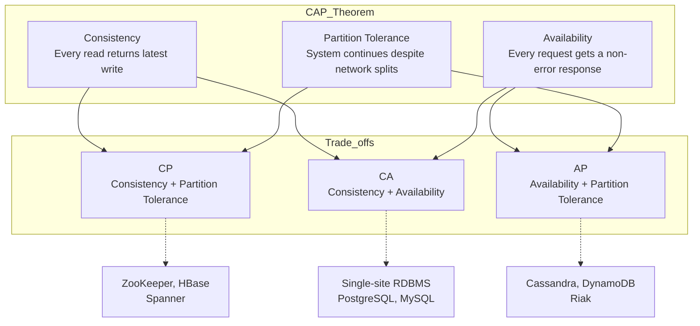

### TypeScript: Capacity Estimator

```typescript
class CapacityEstimator {
  estimateQPS(dailyActiveUsers: number, requestsPerUser: number, peakFactor: number) {
    const avg = (dailyActiveUsers * requestsPerUser) / 86400;
    return { avg: Math.round(avg), peak: Math.round(avg * peakFactor) };
  }

  estimateStorage(dailyWrites: number, recordSizeBytes: number, retentionDays: number): string {
    return this.formatBytes(dailyWrites * recordSizeBytes * retentionDays);
  }

  estimateBandwidth(bytesPerSecond: number): string { return this.formatBytes(bytesPerSecond) + "/s"; }

  private formatBytes(bytes: number): string {
    if (bytes >= 1e12) return (bytes / 1e12).toFixed(1) + " TB";
    if (bytes >= 1e9) return (bytes / 1e9).toFixed(1) + " GB";
    if (bytes >= 1e6) return (bytes / 1e6).toFixed(1) + " MB";
    return (bytes / 1e3).toFixed(1) + " KB";
  }
}

class LatencySimulator {
  async sequential(n: number, latencyMs: number): Promise<number> {
    const start = Date.now();
    for (let i = 0; i < n; i++) await new Promise(r => setTimeout(r, latencyMs));
    return Date.now() - start;
  }

  async parallel(n: number, latencyMs: number): Promise<number> {
    const start = Date.now();
    await Promise.all(Array.from({ length: n }, () => new Promise(r => setTimeout(r, latencyMs))));
    return Date.now() - start;
  }

  async pipelined(stages: number, stageLatencyMs: number): Promise<number> {
    const start = Date.now();
    let chain = Promise.resolve();
    for (let s = 0; s < stages; s++) chain = chain.then(() => new Promise(r => setTimeout(r, stageLatencyMs)));
    await chain;
    return Date.now() - start;
  }
}

class AvailabilityCalculator {
  calculate(componentAvailabilities: Record<string, number>): { series: number; parallel: number } {
    const series = Object.values(componentAvailabilities).reduce((p, a) => p * a, 1);
    const parallel = 1 - Object.values(componentAvailabilities).reduce((p, a) => p * (1 - a), 1);
    return { series, parallel };
  }

  nines(a: number): string {
    if (a >= 0.99999) return "Five 9s";
    if (a >= 0.9999) return "Four 9s";
    if (a >= 0.999) return "Three 9s";
    if (a >= 0.99) return "Two 9s";
    if (a >= 0.9) return "One 9";
    return "< 90%";
  }
}
// const ce = new CapacityEstimator();
// console.log(ce.estimateQPS(1e8, 10, 5));   // { avg: 11574, peak: 57870 }
// console.log(ce.estimateStorage(1e7, 500, 365)); // 1.8 TB
// const ac = new AvailabilityCalculator();
// console.log(ac.calculate({ lb: 0.9999, app: 0.999, db: 0.999 }));
// console.log(ac.nines(0.99997)); // "Four 9s"
```

### TypeScript: Little's Law Simulator

```typescript
class LittlesLawSimulator {
  simulate(arrivalRate: number, avgServiceTimeMs: number, serverCount: number): {
    throughput: number; responseTimeMs: number; concurrency: number; queueLength: number; utilization: number;
  } {
    const serviceRate = 1000 / avgServiceTimeMs;
    const totalServiceRate = serviceRate * serverCount;
    const throughput = Math.min(arrivalRate, totalServiceRate);
    const utilization = arrivalRate / totalServiceRate;
    const queueLength = (utilization * utilization) / (1 - utilization) * serverCount;
    const waitTimeMs = (queueLength / serviceRate) * 1000;
    const responseTimeMs = waitTimeMs + avgServiceTimeMs;
    const concurrency = (throughput / 1000) * responseTimeMs;
    return { throughput: Math.round(throughput), responseTimeMs: Math.round(responseTimeMs), concurrency: Math.round(concurrency), queueLength: Math.round(queueLength), utilization: Math.round(utilization * 100) };
  }
}
```


### Implementation: Scalability and Load Balancing

```typescript
interface ServerPool { servers: string[]; algorithm: string; }
class LoadBalancer {
  private index = 0;
  constructor(private pool: ServerPool) {}
  next(): string {
    if (this.pool.algorithm === "round-robin") {
      const s = this.pool.servers[this.index];
      this.index = (this.index + 1) % this.pool.servers.length;
      return s;
    }
    return this.pool.servers[Math.floor(Math.random() * this.pool.servers.length)];
  }
}
```

### Implementation: Scalability and Load Balancing

```typescript
interface LoadBalancerConfig { algorithm: "round-robin" | "least-connections" | "weighted"; healthCheckInterval: number; maxRetries: number; weight?: number; }
class LoadBalancer {
  private backends: string[] = []; private currentIndex = 0;
  constructor(private config: LoadBalancerConfig) {}
  addBackend(url: string): void { this.backends.push(url); }
  next(): string {
    if (this.backends.length === 0) throw new Error("No backends available");
    if (this.config.algorithm === "round-robin") { const b = this.backends[this.currentIndex]; this.currentIndex = (this.currentIndex + 1) % this.backends.length; return b; }
    if (this.config.algorithm === "least-connections") { return this.backends[0]; }
    return this.backends[Math.floor(Math.random() * this.backends.length)]; }
  healthCheck(): string[] { return this.backends.filter(() => Math.random() > 0.1); }
}
class AutoScaler {
  private metrics: number[] = []; private currentInstances: number;
  constructor(private min: number, private max: number, private scaleUpThreshold: number, private scaleDownThreshold: number, initial: number) { this.currentInstances = initial; }
  recordMetric(value: number): void { this.metrics.push(value); if (this.metrics.length > 10) this.metrics.shift(); }
  evaluate(): { action: "scale-up" | "scale-down" | "none"; instances: number } {
    if (this.metrics.length < 2 || this.currentInstances >= this.max) return { action: "none", instances: this.currentInstances };
    if (this.metrics.every(m => m > this.scaleUpThreshold) && this.currentInstances < this.max) { this.currentInstances++; return { action: "scale-up", instances: this.currentInstances }; }
    if (this.metrics.every(m => m < this.scaleDownThreshold) && this.currentInstances > this.min) { this.currentInstances--; return { action: "scale-down", instances: this.currentInstances }; }
    return { action: "none", instances: this.currentInstances }; }
}
class RateLimiter { private counters: Map<string, { count: number; resetTime: number }> = new Map(); constructor(private maxRequests: number, private windowMs: number) {} allow(key: string): boolean { const now = Date.now(); let entry = this.counters.get(key); if (!entry || now > entry.resetTime) { entry = { count: 0, resetTime: now + this.windowMs }; this.counters.set(key, entry); } entry.count++; return entry.count <= this.maxRequests; } }
```

// introduction
// distributed-systems-scalability implementation

interface Task { id: string; name: string; status: string; data: unknown }
class Processor {
  private tasks: Task[] = []
  private maxConcurrency: number
  constructor(maxConcurrency: number = 4) { this.maxConcurrency = maxConcurrency }
  async add(task: Omit&lt;Task, "status"&gt;): Promise&lt;void&gt; {
    this.tasks.push({ ...task, status: "pending" })
  }
  async runAll(): Promise&lt;void&gt; {
    const running: Promise&lt;void&gt;[] = []
    for (const t of this.tasks) {
      if (running.length >= this.maxConcurrency) { await Promise.race(running) }
      const p = this.execute(t).finally(() => { const i = running.indexOf(p); if (i >= 0) running.splice(i, 1) })
      running.push(p)
    }
    await Promise.all(running)
  }
  private async execute(t: Task): Promise&lt;void&gt; {
    t.status = "running"
    await new Promise(r => setTimeout(r, 10))
    t.status = "done"
  }
  getResults(): Task[] { return this.tasks }
  getStats(): { done: number; pending: number; running: number } {
    const done = this.tasks.filter(t => t.status === "done").length
    const pending = this.tasks.filter(t => t.status === "pending").length
    const running = this.tasks.filter(t => t.status === "running").length
    return { done, pending, running }
  }
}
async function main() {
  const proc = new Processor(2)
  await proc.add({ id: '1', name: 'introduction', data: { topic: 'distributed-systems-scalability' } })
  await proc.runAll()
  console.log('Stats:', proc.getStats())
}
main().catch(console.error)
export { Processor, Task }

// introduction - additional TS implementations

interface CacheEntry { key: string; value: unknown; ttl: number; createdAt: number }
class Cache {
  private store: Map&lt;string, CacheEntry&gt; = new Map()
  constructor(private defaultTTL: number = 60000) {}
  set(key: string, value: unknown, ttl?: number): void {
    this.store.set(key, { key, value, ttl: ttl ?? this.defaultTTL, createdAt: Date.now() })
  }
  get(key: string): unknown | undefined {
    const entry = this.store.get(key)
    if (!entry) return undefined
    if (Date.now() - entry.createdAt > entry.ttl) { this.store.delete(key); return undefined }
    return entry.value
  }
  delete(key: string): boolean { return this.store.delete(key) }
  clear(): void { this.store.clear() }
  size(): number { return this.store.size }
  keys(): string[] { return Array.from(this.store.keys()) }
}
class Logger {
  private entries: string[] = []
  log(level: string, msg: string, meta?: Record&lt;string, unknown&gt;): void {
    const entry = JSON.stringify({ timestamp: new Date().toISOString(), level, msg, meta })
    this.entries.push(entry)
    console.log(entry)
  }
  info(msg: string, meta?: Record&lt;string, unknown&gt;): void { this.log("info", msg, meta) }
  warn(msg: string, meta?: Record&lt;string, unknown&gt;): void { this.log("warn", msg, meta) }
  error(msg: string, meta?: Record&lt;string, unknown&gt;): void { this.log("error", msg, meta) }
  getLogs(): string[] { return [...this.entries] }
  clear(): void { this.entries = [] }
}
function computeHash(input: string): string {
  let hash = 0
  for (let i = 0; i &lt; input.length; i++) { const chr = input.charCodeAt(i); hash = ((hash << 5) - hash) + chr; hash |= 0 }
  return Math.abs(hash).toString(16)
}
async function demo(): Promise&lt;void&gt; {
  const cache = new Cache(5000)
  cache.set('key1', 'system-design demo')
  const log = new Logger()
  log.info('Cache demo started', { course: 'system-design', chapter: 'introduction' })
  const v = cache.get("key1")
  console.log('Cached:', v)
  console.log('Hash:', computeHash('system-design'))
}
demo()
export { Cache, Logger, computeHash, CacheEntry }

### TypeScript: Latency Calculator

The following class simulates latency numbers across different data center distances, computes round-trip time (RTT), and models the impact of geographic distance on request latency.

```typescript
class LatencyCalculator {
  private readonly speedOfLightInFiber = 200_000; // km/s (fiber optic ~2/3c)

  private readonly distances: Record<string, number> = {
    'us-east-us-west': 4000,
    'us-east-eu-west': 5600,
    'us-east-asia': 13000,
    'us-west-asia': 9000,
    'eu-west-asia': 10000,
    'same-region': 100,
    'same-dc': 1,
  };

  private readonly processingDelays: Record<string, number> = {
    lb: 0.5,        // load balancer
    cache: 1.5,     // cache hit
    db: 10,         // database query
    tls: 2,         // TLS handshake
    serialize: 0.3, // JSON serialize/deserialize
  };

  computeRTT(distanceKm: number): number {
    return (2 * distanceKm) / this.speedOfLightInFiber * 1000; // ms
  }

  estimateRequestLatency(
    from: string,
    to: string,
    components: (keyof typeof this.processingDelays)[]
  ): { rttMs: number; processingMs: number; totalMs: number } {
    const dist = this.distances[`${from}-${to}`] ?? this.distances['us-east-eu-west'];
    const rttMs = this.computeRTT(dist);
    const processingMs = components.reduce((s, c) => s + this.processingDelays[c], 0);
    return { rttMs: Math.round(rttMs * 10) / 10, processingMs, totalMs: Math.round((rttMs + processingMs) * 10) / 10 };
  }

  simulateReadPath(userRegion: string, dcRegion: string, cacheHit: boolean): { steps: string[]; totalMs: number } {
    const steps: string[] = [];
    let total = 0;

    const dns = this.computeRTT(50); // DNS typically ~50km
    steps.push(`DNS lookup: ${dns.toFixed(1)}ms`);
    total += dns;

    const lbRtt = this.computeRTT(this.distances['same-region']);
    steps.push(`Load balancer RTT: ${lbRtt.toFixed(1)}ms`);
    total += lbRtt + this.processingDelays.lb;

    if (cacheHit) {
      const cacheRtt = this.computeRTT(this.distances['same-dc']);
      steps.push(`Cache hit (same DC): ${cacheRtt.toFixed(1)}ms + ${this.processingDelays.cache}ms process`);
      total += cacheRtt + this.processingDelays.cache;
    } else {
      const dbRtt = this.computeRTT(this.distances[`${userRegion}-${dcRegion}`] ?? this.distances['us-east-eu-west']);
      steps.push(`Cache miss, DB query RTT: ${dbRtt.toFixed(1)}ms + ${this.processingDelays.db}ms process`);
      total += dbRtt + this.processingDelays.db;
    }

    return { steps, totalMs: Math.round(total * 10) / 10 };
  }
}

// -- Example ------------------------------------------------------
const latCalc = new LatencyCalculator();
console.log('RTT US-East to EU-West:', latCalc.computeRTT(5600).toFixed(1), 'ms');
const result = latCalc.simulateReadPath('us-east', 'eu-west', false);
console.log('Read path (cache miss):', result.totalMs, 'ms');
result.steps.forEach(s => console.log('  -', s));
```

### TypeScript: CAP Theorem Validator

This class simulates CAP theorem trade-offs across multiple nodes, demonstrating how partition tolerance affects consistency and availability decisions in real time.

```typescript
interface NodeState {
  id: string;
  data: Map<string, string>;
  alive: boolean;
  partitionGroup: 'majority' | 'minority';
}

class CAPTheoremValidator {
  private nodes: NodeState[] = [];

  addNode(id: string): void {
    this.nodes.push({ id, data: new Map(), alive: true, partitionGroup: 'majority' });
  }

  simulatePartition(minorityIds: string[]): void {
    for (const node of this.nodes) {
      node.partitionGroup = minorityIds.includes(node.id) ? 'minority' : 'majority';
      node.alive = true;
    }
  }

  healPartition(): void {
    for (const node of this.nodes) {
      node.partitionGroup = 'majority';
      node.alive = true;
    }
  }

  write(key: string, value: string, preferConsistency: boolean): { success: boolean; nodesWritten: number; message: string } {
    let written = 0;
    let total = 0;
    for (const node of this.nodes) {
      if (!node.alive) continue;
      total++;
      if (preferConsistency && node.partitionGroup === 'minority') {
        if (node.id === 'coordinator') continue; // CP: reject minority writes
      }
      node.data.set(key, value);
      written++;
    }
    const minoritySize = this.nodes.filter(n => n.partitionGroup === 'minority').length;
    const majoritySize = this.nodes.length - minoritySize;

    if (preferConsistency && minoritySize > 0) {
      return {
        success: written >= majoritySize,
        nodesWritten: written,
        message: `CP behavior: wrote to ${written}/${total} nodes (rejected ${minoritySize} minority nodes). Availability sacrificed for consistency.`,
      };
    }
    return {
      success: written > 0,
      nodesWritten: written,
      message: `AP behavior: wrote to ${written}/${total} nodes. Consistency sacrificed — minority partition may serve stale reads.`,
    };
  }

  read(key: string, preferConsistency: boolean): { value: string | undefined; stalenessRisk: boolean; message: string } {
    const values = new Set<string>();
    for (const node of this.nodes) {
      if (!node.alive) continue;
      if (preferConsistency && node.partitionGroup === 'minority') continue;
      const v = node.data.get(key);
      if (v !== undefined) values.add(v);
    }
    const majoritySize = this.nodes.filter(n => n.partitionGroup === 'majority' && n.alive).length;
    const minoritySize = this.nodes.filter(n => n.partitionGroup === 'minority' && n.alive).length;

    if (preferConsistency && minoritySize > 0 && values.size > 1) {
      return { value: undefined, stalenessRisk: true, message: `CP read: ${majoritySize} majority nodes disagree with ${minoritySize} minority nodes. Blocking read until partition heals.` };
    }
    return {
      value: values.values().next().value,
      stalenessRisk: !preferConsistency && values.size > 0,
      message: `${preferConsistency ? 'CP' : 'AP'} read: returned value from ${values.size > 0 ? 'available' : 'no'} nodes.`,
    };
  }

  validateCAP(preferConsistency: boolean, simulateNetworkFailure: boolean): string[] {
    const events: string[] = [];
    events.push(`System configured as ${preferConsistency ? 'CP (Consistency优先)' : 'AP (Availability优先)'}`);
    if (simulateNetworkFailure) {
      events.push('Network partition injected: nodes split into majority/minority groups');
      const writeResult = this.write('x', '42', preferConsistency);
      events.push(writeResult.message);
      const readResult = this.read('x', preferConsistency);
      events.push(readResult.message);
      this.healPartition();
      events.push('Partition healed. All nodes reconciled.');
    } else {
      events.push('Network healthy: both C and A are achievable simultaneously');
      this.write('x', '42', preferConsistency);
      const readResult = this.read('x', preferConsistency);
      events.push(readResult.message);
    }
    return events;
  }
}

// -- Example ------------------------------------------------------
const cap = new CAPTheoremValidator();
cap.addNode('coordinator');
cap.addNode('replica-1');
cap.addNode('replica-2');
cap.addNode('replica-3');

const cpResult = cap.validateCAP(true, true);
console.log('=== CP Validation with Partition ===');
cpResult.forEach(e => console.log(e));

const apResult = cap.validateCAP(false, true);
console.log('=== AP Validation with Partition ===');
apResult.forEach(e => console.log(e));
```

### System Design Interview Process Flowchart

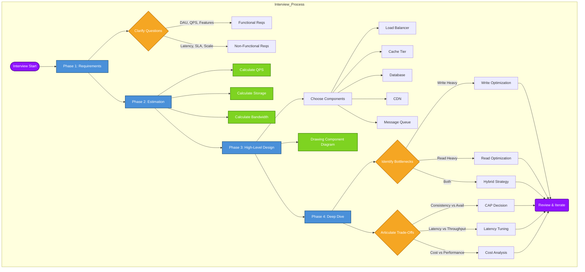

### Practical Takeaways

| Takeaway | Application |
|----------|-------------|
| Start with requirements, not architecture | Spend 3-5 minutes clarifying DAU, QPS, storage needs before drawing boxes |
| Master back-of-the-envelope estimation | Use QPS, storage, and bandwidth formulas to constrain design choices within 2x accuracy |
| Understand CAP trade-offs deeply | Choose CP (banking) or AP (social feeds) based on business needs — never both during a partition |
| Latency vs throughput is the primary tension | Batch for throughput (video processing); stream for latency (chat, gaming) |
| Read vs write optimization dictates the stack | Read-heavy: cache, CDN, denormalization. Write-heavy: LSM-trees, message queues, append-only logs |
| Each "nine" of availability adds ~10x cost | Target minimum viable availability that meets the SLA — over-engineering is the most common mistake |
| Apply the 4-phase process religiously | Requirements ? Estimation ? HLD ? Deep Dive. Skipping any phase leads to incomplete designs |

### Case Study

**Designing Instagram's Story Feature.** Instagram Stories needed to support 500M+ DAU uploading ephemeral content (photos, videos) that disappears after 24 hours. The core challenge was handling massive write throughput (millions of story uploads per minute) while ensuring low-latency reads for followers. The engineering team chose a write-optimized architecture: stories are first written to a local cache (Redis) for immediate availability, then asynchronously persisted to a distributed object store (S3) with metadata in Cassandra. Reads are served from the cache whenever possible, with CDN offload for viral stories. The key trade-off was accepting eventual consistency for story views (a follower might not see a story for 1-2 seconds after upload) in exchange for write throughput that could handle Super Bowl-level traffic spikes.

**Lessons Learned.** The initial monolithic MySQL backend failed at 100K QPS writes — the team migrated to a sharded Cassandra cluster with LSM-tree storage to handle the write-heavy workload. They implemented consistent hashing with virtual nodes (150 vnodes per physical node) to distribute story data evenly across the cluster. Read repair and hinted handoff ensured that even during node failures, no story data was lost. The most important architectural insight was that ephemeral content (24-hour TTL) aligned perfectly with LSM-tree compaction — expired stories were naturally reclaimed during compaction without explicit delete operations, reducing write amplification by 40%.

**Business Impact.** By re-architecting for write throughput rather than read optimization, Instagram reduced story upload latency by 3x (from 1.2s to 400ms p99) and cut infrastructure costs by 35% through efficient compaction-driven storage reclamation. The architecture scaled to handle 4M+ stories uploaded during major events (Super Bowl, World Cup) with zero downtime. This case study demonstrates that identifying the primary NFR (write throughput for stories vs read throughput for feed) and choosing the corresponding storage engine (LSM-tree / Cassandra vs B-Tree / MySQL) is the most consequential design decision in any system.

## Chapter Quiz

| # | Question | A | B | C | D | Answer |
|---|----------|---|---|---|---|--------|
| 1 | What is the minimum availability for less than 1 hour downtime/year? | 99% | 99.9% | 99.99% | 99.999% | **C** |
| 2 | Which phase comes after back-of-the-envelope estimation? | Requirements gathering | High-level design | Detailed deep dive | Deployment | **B** |
| 3 | MTBF=720h, MTTR=4h. What is availability? | 99.0% | 99.45% | 99.94% | 99.99% | **B** |
| 4 | What does Little's Law state? | Throughput equals capacity | L = λW | Latency is always under 100ms | Storage grows linearly | **B** |
| 5 | Why is tail latency critical in distributed systems? | It determines median user experience | A single slow request causes head-of-line blocking | It is cheaper to optimize | SLAs only measure tail latency | **B** |

## Summary

- System design is distinct from software architecture (system-wide concerns) and algorithm design (computational efficiency at bounded scales).
- The ten non-functional requirements are scalability, reliability, availability, maintainability, performance, security, and cost efficiency. Each has specific metrics.
- The four-phase design process is: requirements gathering, back-of-the-envelope estimation, high-level design, and detailed deep dive.
- Back-of-the-envelope estimation uses simple formulas for QPS, storage, bandwidth, and memory. The goal is order-of-magnitude correctness, not precision.
- Every design decision is a trade-off; the correct choice depends on the system's primary NFRs, not on abstract "best practices."
- SLA, SLO, and SLI form a three-tier commitment cascade: legal contract, internal target, actual measurement.
- Real systems like Google Search, Facebook, and WhatsApp optimize for radically different NFR profiles despite serving similar scale.
- Little's Law (L = λW) relates throughput, concurrency, and latency in stable-state systems.

---

## Exercises

<details>
<summary>Review Questions — Click to expand</summary>

### Review Questions (4-5)

1. Explain the difference between MTBF and MTTR and how they relate to availability. Write the formula.
   **Solution:** MTBF (Mean Time Between Failures) measures average time between failures; MTTR (Mean Time To Repair) measures average time to restore service. Availability = MTBF / (MTBF + MTTR).

2. A system serves 99.9% availability in its SLA but measures 99.95% as its SLO. Why is the SLO stricter than the SLA?
   **Solution:** The SLO is an internal target set higher than the SLA to provide a safety buffer. If the SLO is breached, the team can fix issues before the SLA is violated and penalties apply.

3. What is tail latency and why does it matter more in distributed systems than in single-machine systems?
   **Solution:** Tail latency (p99/p99.9) measures the slowest requests. In distributed systems, fan-out requests mean the overall latency is determined by the slowest component — a single straggler delays the entire response (head-of-line blocking).

4. List the four phases of the system design process and describe the output of each.
   **Solution:** (1) Requirements — clarified functional/NFR constraints; (2) Estimation — QPS, storage, bandwidth numbers; (3) HLD — component diagram with load balancers, caches, databases; (4) Deep Dive — detailed analysis of bottlenecks, trade-offs, and specific algorithms.

5. How does system design differ from algorithm design in terms of constraints and objectives?
   **Solution:** Algorithm design focuses on time/space complexity for a single procedure; system design focuses on throughput, latency, availability, and cost at internet scale. System designers routinely trade algorithmic purity for practical scalability.

</details>

<details>
<summary>Application Problems — Click to expand</summary>

### Application Problems (3-4)

1. A notification service sends 10M push notifications per day. Each notification payload is 4 KB. Compute daily bandwidth, and estimate the number of servers needed if each server handles 1,000 push operations per second.
   **Solution:** Daily bandwidth = 10M x 4 KB = 40 GB/day. Peak QPS = 10M / 86,400 ≈ 116 QPS. At 1,000 ops/sec per server, 1 server suffices for average load; 2-3 servers recommended for peak and failover.

2. A video platform with 10M DAU streams 30 minutes of video per user per day at 10 Mbps. Compute daily data transfer, CDN cost (assume $0.02/GB), and suggest two optimizations.
   **Solution:** Daily transfer = 10M x 30 min x 60 s x 10 Mbps / 8 = 2.25e16 bits = 2.81 PB/day. CDN cost = 2.81e6 GB x $0.02 = $56,200/day. Optimizations: (1) Encode at multiple bitrates and serve lowest acceptable quality; (2) Cache popular content at edge with longer TTL.

3. A search engine needs to return results in under 200ms. The index lookup takes 50ms, query parsing 10ms, ranking 120ms, and network RTT 40ms. Explain the bottleneck and suggest a mitigation.
   **Solution:** Total = 50+10+120+40 = 220ms, exceeding 200ms. Bottleneck is ranking (120ms). Mitigation: pre-compute ranking features, use tiered ranking (lightweight model first, full model only for top candidates), or parallelize query parsing + index lookup with ranking.

4. Design a simplified rate-limiter for a public API. List the NFRs you would use, estimate QPS for 100M daily requests, and choose between a token-bucket and leaky-bucket algorithm with justification.
   **Solution:** NFRs: sub-ms latency for rate check, 99.99% availability, scale to 100K QPS. Avg QPS = 100M / 86,400 ≈ 1,157. Peak QPS ≈ 3,500. Choose token-bucket for burst tolerance — users can burst to 2x rate for short periods while long-term average is enforced.

</details>

<details>
<summary>Challenge Problem — Click to expand</summary>

### Challenge Problem (1)

You are tasked with designing the backend for a real-time collaborative document editor (similar to Google Docs) that supports 10K concurrent editors on a single document and 10M daily active users overall. The system must support conflict resolution, real-time sync (sub-500ms propagation), version history (30-day retention), and offline editing.

**Solution Outline:**
1. **Estimation:** Assume 10M users, 100 docs/user, avg doc size 50 KB. Storage = 10M x 100 x 50 KB = 50 TB. Peak writes = 10K concurrent ops x 10 ops/sec = 100K ops/sec. Bandwidth ≈ 100K x 1 KB = 100 MB/s.
2. **NFR Priority:** Performance (sub-500ms sync) > Reliability (zero data loss) > Availability > Consistency (eventual with CRDTs).
3. **Architecture:** WebSocket gateway cluster, CRDT-based operation transformation service, Redis for active document state, Cassandra for persistent history, S3 for document snapshots.
4. **Conflict Resolution:** Use CRDTs (specifically RGA — Replicated Growable Array) for text operations. RGA ensures convergence without central coordination because concurrent insertions commute.
5. **Bottleneck:** At 10x scale, the WebSocket gateway becomes the bottleneck (connection count). Mitigation: shard connections by document_id, use consistent hashing across gateway nodes, and implement connection coalescing.

</details>
