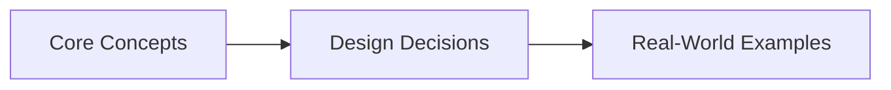
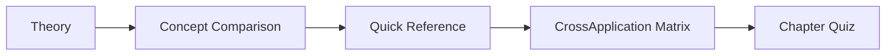

# Chapter 3: Caching Strategies and Patterns
> **Previous:** [02 Scalability Load Balancing](./02-scalability-load-balancing.md) | **Next:** [04 Database Foundations](./04-database-foundations.md)

---

## Learning Objectives

- Explain temporal and spatial locality and their relationships to caching effectiveness
- Distinguish five caching patterns and select the appropriate one for a given access pattern
- Implement a cache-aside pattern with Redis in a production-like setting
- Design and implement an LRU cache using a doubly linked list and hash map
- Analyze eviction policies (LRU, LFU, FIFO, MRU, ARC, 2Q) with strengths and weaknesses
- Solve the thundering herd problem using mutex locking and probabilistic early expiration
- Model cache consistency trade-offs and apply invalidation strategies
- Analyze real-world cache architectures including Facebook's TAO and Twitter's Twemproxy

## Chapter at a Glance

| Aspect | Details |

## Chapter Roadmap


|--------|---------|
| **Scope** | Locality, caching patterns, eviction policies, invalidation, CDN |
| **Key Concepts** | Core topics covered in Chapter 3: Caching Strategies and Patterns |
| **Design Skills** | Cache pattern selection, eviction tuning, thundering herd prevention |
| **Interview Angle** | Frequently tested in system design interviews |

## Chapter at a Glance

| Aspect | Details |
|--------|---------|
| **Scope** | Locality, caching patterns, eviction policies, invalidation, CDN |
| **Key Concepts** | Cache-aside, read/write-through, write-behind, refresh-ahead |
| **Eviction Policies** | LRU, LFU, FIFO, MRU, ARC, 2Q ? strengths and weaknesses |
| **Thundering Herd** | Mutex locking and probabilistic early expiration (XFetch) |
| **Invalidation** | TTL, event-driven, write-invalidate ? consistency trade-offs |
| **Real-World** | Facebook TAO, Twitter Twemproxy |

---
---

## Chapter Roadmap



---

## Theory
> **One-Sentence Takeaway:** Theory is the foundation ? master it before moving to examples and exercises.


### Locality of Reference

> **Pro Tip:** Master this concept thoroughly ? it is frequently tested in system design interviews.

> **Pro Tip:** Master this concept ? it appears in nearly every system design interview. Understand both the how and the why.

> **Warning:** A common mistake is over-engineering. Always start simple and add complexity only when justified by requirements.

> **Pro Tip:** Master this concept thoroughly ? it appears in nearly every system design interview.
Caching works because of locality of reference — the observation that accessed data is not uniformly distributed.

**Temporal locality:** If a piece of data is accessed now, it is likely to be accessed again soon. Examples: a user's session data, the hot tweet in a timeline, the current page's CSS file. Temporal locality is the reason LRU (Least Recently Used) eviction works well: recently accessed items are kept, untouched items are evicted.

**Spatial locality:** If a piece of data is accessed, nearby data is likely to be accessed soon. Examples: reading a contiguous block of disk sectors, iterating over an array, loading a page of search results. Spatial locality is the reason cache lines fetch 64 bytes from RAM even when only 4 are needed.

**Cache effectiveness metric:**

$$hit\_rate = \frac{cache\_hits}{cache\_hits + cache\_misses}$$

A well-tuned cache for an internet application achieves 90-99% hit rate. Below 85% hit rate, the cache may be doing more harm than good (serving stale data, adding operational complexity, consuming memory for negligible throughput gain).

---

### Cache Hierarchy

> **Warning:** Avoid over-engineering. Start simple, measure, then optimize.

> **Warning:** Avoid premature optimization. Start simple, measure, then optimize. Over-engineering is the most common system design mistake.

Caching occurs at every level of a modern system. Each level is faster, smaller, and more expensive per byte than the one below it.

| Level | Type | Size | Latency | Managed by |
|-------|------|------|---------|------------|
| L1 | CPU cache | 32-64 KB | ~1 ns | Hardware |
| L2 | CPU cache | 256-512 KB | ~4 ns | Hardware |
| L3 | CPU cache | 4-32 MB | ~12 ns | Hardware |
| RAM | Main memory | 8-512 GB | ~100 ns | OS |
| Local disk | SSD | 256 GB-2 TB | ~50 µs | OS/App |
| Local memory cache | In-process (e.g., Guava cache) | 0-4 GB | ~5 µs | Application |
| Distributed cache | Redis, Memcached | 10-500 GB | ~1-5 ms | Application |
| Database buffer pool | InnoDB buffer pool, PostgreSQL shared buffers | 1-100 GB | ~100 µs | Database |
| CDN | Edge cache (CloudFront, Cloudflare) | Distributed | ~10-50 ms | CDN provider |

The **cache miss penalty** increases by orders of magnitude at each level. A miss in L1 (~1 ns) costs ~4 ns to fetch from L2. A miss in Redis (~5 ms) costs ~50 ms to fetch from the database. This asymmetry drives the entire caching strategy: maximize the hit rate at the fastest level possible.

---

### Caching Patterns

> **Remember:** Always articulate trade-offs clearly ? interviewers value reasoning over the "right" answer.

> **Remember:** Trade-offs are the heart of system design. Always be ready to explain why you chose X over Y.

Five fundamental patterns govern every cache implementation.

#### Cache-Aside (Lazy Loading)

The application manages both the cache and the database. On a read:

```
1. Application checks cache for key K
2. If found (hit): return cached value. Done.
3. If not found (miss): query database for K
4. Store result in cache with TTL
5. Return result
```

On a write:

```
1. Application writes to database
2. Application invalidates (or updates) the cache entry for the key
```

```python
def get_user(user_id):
    # Cache-aside read
    user = cache.get(f"user:{user_id}")
    if user is not None:
        return user

    user = db.query("SELECT * FROM users WHERE id = ?", user_id)
    cache.set(f"user:{user_id}", user, ttl=3600)
    return user

def update_user(user_id, data):
    # Cache-aside write
    db.execute("UPDATE users SET name = ? WHERE id = ?", data.name, user_id)

    # Invalidate, don't update — simpler and avoids race conditions
    cache.delete(f"user:{user_id}")
```

**Pros:** Simple to implement. The cache only contains data that is actually requested. Cache failure does not crash the application (it degrades to direct DB reads). TTL provides natural invalidation.

**Cons:** Three round-trips on a cache miss (check cache, query DB, write cache) increases latency for cold data. Stale data window between cache write and TTL expiry.

#### Read-Through

The cache layer itself is responsible for loading data from the database on a miss. The application talks only to the cache.

```
1. Application requests key K from cache
2. Cache hit: return cached value
3. Cache miss: cache loads value from database (transparent to application)
4. Cache stores value and returns to application
```

**Pros:** Simplifies application code. The application is completely decoupled from the database.

**Cons:** The cache must be configured with a loader/DAO for each data type. Less flexible for complex queries (joins, aggregations).

#### Write-Through

Every write goes through the cache to the database. The cache writes to the DB first, and only returns success after both writes succeed.

```
1. Application writes data to cache
2. Cache writes data to database
3. Cache confirms to application only after DB write succeeds
```

**Pros:** Cache is always consistent with the database (strong consistency). Read-after-write always returns the latest value from cache.

**Cons:** Higher write latency (must wait for DB confirmation). Unnecessary DB write if the data is never read again (wasted work). The database is the bottleneck on writes.

#### Write-Behind (Write-Back)

Writes go to the cache, which acknowledges immediately and asynchronously persists to the database.

```
1. Application writes data to cache
2. Cache acknowledges success immediately
3. Later (batch or timer): cache flushes accumulated writes to database
```

**Pros:** Very low write latency (cache is fast). Can batch writes for DB efficiency (1000 writes batched into one 1000-row INSERT).

**Cons:** Data loss risk if the cache fails before flushing to DB. The cache must manage a write-back queue, which adds complexity. Consistency window: the database lags behind the cache.

#### Refresh-Ahead

The cache proactively refreshes a key before it expires, based on access patterns:

```
1. Application requests key K
2. Cache hit: return value, check if key is near expiry
3. If near expiry and access frequency is high: asynchronously reload from DB
4. Cache miss: synchronous DB load, return value
```

**Pros:** Reduces latency for hot keys (never pay the cold-start miss penalty). Smooths out DB load.

**Cons:** May refetch data that is no longer needed (wasteful prediction). Complex to tune the "near expiry" threshold.

---

### Eviction Policies

When the cache is full, something must be evicted. The choice of eviction policy is a bet on future access patterns — which entry is least likely to be needed again?

#### LRU — Least Recently Used

Evict the item accessed furthest in the past.

**Implementation:** Doubly linked list + hash map. On access: move the item to head of list (O(1)). On eviction: remove from tail (O(1)).

**Pros:** Excellent for temporal locality. Simple O(1) implementation.

**Cons:** Vulnerable to scan attacks (a one-time scan of many items evicts all hot data). Does not distinguish between "frequently used but not right now" and "rarely used."

#### LFU — Least Frequently Used

Evict the item with the lowest access frequency.

**Pros:** Resists scan attacks (one-time accesses have low frequency). Good for workload where popularity distribution is stable.

**Cons:** High implementation complexity (need frequency counters + min-heap or frequency buckets). Suffers from "frequency inertia" — once-hot items remain in cache even after they become cold, because their frequency counters take time to decay.

#### FIFO — First In, First Out

Evict the item that was inserted earliest.

**Pros:** Simple queue implementation. No metadata updates on access (cache hits are free).

**Cons:** Ignores access patterns entirely. The most valuable hot item can be evicted simply because it was inserted first. Poor hit rate in practice.

#### MRU — Most Recently Used

Evict the most recently used item.

**Counter-intuitive but useful for:** Scenarios where older items are more likely to be reused. For example, a "scrollable feed" where users start at the most recent item and move backward — recent items have been seen, older ones have not.

#### ARC — Adaptive Replacement Cache

Combines LRU and LFU by maintaining four lists: recent (recency), frequent (frequency), ghost entries (evicted but tracked). Adaptively balances between recency and frequency based on observed workload.

**Pros:** Self-tuning — no manual configuration of recency vs frequency weight. Outperforms LRU on most real-world workloads.

**Cons:** Complex implementation. Ghost entries consume memory.

#### 2Q — Two-Queue Algorithm

Maintains three queues: Am (FIFO, for single-access items), A1 (FIFO for recently accessed that do not appear in Am), and Am (LRU for frequently accessed items). An item starts in Am ? promoted to A1 on second access ? promoted to Am on third access.

**Pros:** Resists scan attacks better than LRU (a single scan fills Am, not the main cache). Better hit rate than LRU for many workloads.

**Cons:** More complex than LRU. Additional memory for metadata.

---

### Implementing an LRU Cache from Scratch

An LRU cache requires O(1) get and put operations. This demands a combination of a hash map (for O(1) lookups) and a doubly linked list (for O(1) removal and re-insertion).

```python
class DLinkedNode:
    def __init__(self, key=0, value=0):
        self.key = key
        self.value = value
        self.prev = None
        self.next = None

class LRUCache:
    def __init__(self, capacity: int):
        self.capacity = capacity
        self.size = 0
        self.cache = dict()               # key ? DLinkedNode
        self.head = DLinkedNode()          # dummy head (most recently used end)
        self.tail = DLinkedNode()          # dummy tail (least recently used end)
        self.head.next = self.tail
        self.tail.prev = self.head

    def _add_node(self, node):
        """Add node right after head."""
        node.prev = self.head
        node.next = self.head.next
        self.head.next.prev = node
        self.head.next = node

    def _remove_node(self, node):
        """Remove an existing node from the linked list."""
        prev = node.prev
        nxt = node.next
        prev.next = nxt
        nxt.prev = prev

    def _move_to_head(self, node):
        """Move a node to the head (most recently used position)."""
        self._remove_node(node)
        self._add_node(node)

    def _pop_tail(self):
        """Pop the LRU node (just before tail)."""
        node = self.tail.prev
        self._remove_node(node)
        return node

    def get(self, key: int) -> int:
        node = self.cache.get(key)
        if not node:
            return -1
        # Mark as recently used
        self._move_to_head(node)
        return node.value

    def put(self, key: int, value: int) -> None:
        node = self.cache.get(key)
        if node:
            # Key exists: update value and move to head
            node.value = value
            self._move_to_head(node)
            return
        # New key: create node
        new_node = DLinkedNode(key, value)
        self.cache[key] = new_node
        self._add_node(new_node)
        self.size += 1
        if self.size > self.capacity:
            # Evict LRU
            tail = self._pop_tail()
            del self.cache[tail.key]
            self.size -= 1
```

**Time complexity:** O(1) for both get and put.

**Space complexity:** O(capacity) for the linked list and hash map.

---

### Cache Invalidation

Keeping the cache consistent with the source of truth is the hardest problem in caching.

#### TTL-Based Invalidation

Each cache entry has a Time-To-Live (TTL). After TTL expires, the entry is automatically evicted. The next read triggers a cache miss and reloads fresh data.

```
cache.set(key, value, ttl=3600)   # valid for 1 hour
```

**Pros:** Simple, automatic, no coordination needed. Bounded staleness — data is never more than TTL old.

**Cons:** Data can be stale within the TTL window. Short TTL reduces cache effectiveness. Choosing the right TTL is workload-dependent and requires tuning.

#### Event-Driven Invalidation

The database publishes change events (via CDC — Change Data Capture, or explicit application events). A subscriber receives the event and invalidates or updates the cache.

```
Application update:
  1. Write to DB
  2. Publish event "user:42:updated" to Kafka/RabbitMQ
  3. Cache consumer receives event
  4. Cache deletes key "user:42"
```

**Pros:** Near-instant invalidation (sub-second). TTL can be long or infinite since manual invalidation handles consistency.

**Cons:** Requires a message broker. Eventual consistency — there is a window between DB update and cache invalidation. If the invalidation message is lost, the cache is permanently stale (until TTL fires).

#### Write Invalidate

On every write to the source, explicitly delete (or update) the corresponding cache entry.

```
def update_user(user_id, name):
    db.execute("UPDATE users SET name = ? WHERE id = ?", name, user_id)
    cache.delete(f"user:{user_id}")          # invalidate (lazy: next read fetches fresh)
    # OR
    user = db.execute("SELECT * FROM users WHERE id = ?", user_id)
    cache.set(f"user:{user_id}", user, ttl=3600)  # update (eager: cache stays hot)
```

**Invalidate vs update:** Invalidation is safer — writing the updated value directly to the cache risks writing a stale value if another concurrent writer commits a newer version. Invalidation causes the next read to fetch the latest value. The trade-off is one extra read (the cache miss).

---

### The Thundering Herd Problem

When a popular cache key expires, thousands of concurrent requests all see a miss and simultaneously query the database. This can overwhelm the database.

```
Time 0:    key "homepage_feed" expires
Time 0.01: 500 requests check cache ? all miss
Time 0.02: 500 requests query DB simultaneously
Time 0.05: Database CPU spikes to 100%, latency degrades
Time 0.10: Cascading failure — DB connection pool exhausted
```

**Solution 1: Mutex Locking (Cache Stampede Prevention)**

Only one request reloads the cache; others wait for the result.

```python
def get_homepage():
    cached = cache.get("homepage_feed")
    if cached is not None:
        return cached

    # Try to acquire a distributed lock
    lock_key = "lock:homepage_feed"
    if cache.setnx(lock_key, "locked", ttl=5):   # set if not exists
        try:
            result = db.query("SELECT * FROM feed ORDER BY id DESC LIMIT 100")
            cache.set("homepage_feed", result, ttl=300)
            return result
        finally:
            cache.delete(lock_key)
    else:
        # Another request is reloading. Wait and retry.
        sleep(0.05)
        return get_homepage()   # recursion — will hit cache
```

**Solution 2: Probabilistic Early Expiration (XFetch Algorithm)**

Refresh the cache probabilistically before the TTL actually expires. This smooths the load over time rather than concentrating it at the TTL boundary.

```python
import random

def should_refresh(ttl_remaining, total_ttl, beta=1.0):
    """XFetch algorithm: return True if we should proactively refresh."""
    if ttl_remaining <= 0:
        return True
    probability = (total_ttl - ttl_remaining) / total_ttl
    # The probability of refreshing increases as the entry ages
    threshold = random.random() * beta
    return probability > threshold

# Called on every cache read:
if should_refresh(ttl_remaining=60, total_ttl=300, beta=2.0):
    # Asynchronously reload the cache entry
    thread_pool.submit(reload_cache_entry, key)
```

The parameter ß (beta) controls the aggressiveness: ß=0 means refresh immediately (always); ß=8 means never refresh early (pure TTL). The XFetch algorithm ensures that the expected number of concurrent recomputations at the TTL boundary is approximately 1, regardless of the number of requesting clients.

---

### Global Cache vs Distributed Cache

**Global cache (single node):** A single cache instance shared by all application servers.

```
Pros: Simple, no consistency issues, no distribution overhead.
Cons: Single point of failure, limited by single-node memory, bottleneck for all traffic.
```

**Distributed cache (Redis Cluster, Memcached):** Data is partitioned across multiple nodes, typically using consistent hashing.

```
Redis Cluster:
- Automatic sharding across 16384 hash slots
- Keys are mapped to a slot: HASH_SLOT = CRC16(key) mod 16384
- Each node owns a subset of slots
- Replication: each master has 1+ replicas (for failover)
- No central coordinator — gossip protocol for cluster state

Memcached:
- Client-side consistent hashing
- No replication (Memcached is a cache, not a store — data loss is acceptable)
- No persistence
- Very low overhead (simpler than Redis, faster for simple get/set)
```

| Feature | Redis (Cluster) | Memcached |
|---------|---------------|-----------|
| Data types | String, hash, list, set, sorted set, stream, etc. | String only (binary) |
| Persistence | RDB snapshots, AOF log | None |
| Replication | Yes (leader-follower) | No |
| Sharding | Automatic (hash slots) | Client-side (consistent hashing) |
| Lua scripting | Yes | No |
| Pub/Sub | Yes | No |
| Memory efficiency | Moderate (overhead for data structures) | High (minimal metadata) |

---

### Cache Consistency

**Strong consistency** for caches: every read returns the most recently written value. Achievable only with write-through + distributed coordination (blocking writes until all cache nodes acknowledge). Expensive and rarely used for caches.

**Eventual consistency** for caches: after a write, the cache converges to the updated value within a bounded time window. This is the default for most caching systems. Accept staleness up to TTL.

Between these extremes:

- **Read-your-writes consistency:** After a user updates data, their subsequent reads see the new value (but other users may see stale data). Implemented by versioning or per-user cache affinity.
- **Monotonic reads:** Once a user reads a value, they never see an older value for the same key. Requires a monotonic sequence number.

---

### CDN Caching

Content Delivery Networks cache static (and sometimes dynamic) content at edge nodes geographically close to users.

**Cache-Control headers** control CDN behavior:

```
Cache-Control: public, max-age=31536000, immutable   # 1 year, never re-validate
Cache-Control: public, max-age=60, must-revalidate    # 1 minute, must check origin
Cache-Control: private, max-age=0                     # do not cache
```

**Edge caching:** CDN nodes cache responses by URL. On a miss (not in edge cache), the edge fetches from the origin. Cache hit serves from the edge — significantly reduced latency.

**Purge strategies:**
- **Time-based purge:** Content expires based on Cache-Control headers.
- **API-based purge:** CDN API to immediately invalidate specific URLs or patterns.
- **Tag-based purge (Surrogate-Key):** Assign tags to responses; purge all responses with a given tag.

**CDN for dynamic content:** Modern CDNs (Cloudflare, Fastly) can cache JSON API responses with short TTLs (1-30 seconds), dramatically reducing origin server load for dynamic content.

---

### Real-World Systems

**Facebook's TAO — The Graph Cache at Scale.** Facebook's social graph (users, friends, pages, likes) does not fit traditional caching patterns. TAO is a geographically distributed, always-consistent graph cache layer that sits between application servers and MySQL.

Key properties:
- **Object association cache:** TAO caches graph associations (friend-of-friend, page-liked-by-user), not just key-value pairs.
- **Write-through to MySQL:** Writes go to TAO, TAO writes to MySQL synchronously, then TAO broadcasts invalidation to all regions.
- **Read-after-write consistency:** A write in one region is visible to reads in all regions within milliseconds.
- **Batched API:** TAO exposes a graph query API (get object, get associations, count associations). Applications batch many graph queries into a single TAO request.

TAO serves billions of reads per second and is the layer that makes the Facebook News Feed possible at global scale.

**Twitter's Twemproxy (Nutcracker).** A proxy layer that distributes cache requests across multiple Memcached or Redis servers. Acts as a transparent sharding layer: application servers talk to Twemproxy as if it were a single cache, and Twemproxy routes requests to the correct backend using consistent hashing.

Key properties:
- **Pooling:** Aggregates connections from many app servers to fewer cache connections (reduces connection overhead).
- **Sharding:** Consistent-hash based routing to backend nodes.
- **Auto-ejection:** Detects failed nodes and re-routes traffic.
- **Pipeline support:** Batches multiple cache operations into single backend calls.

Twemproxy reduced Twitter's cache connection count from millions to thousands, solving a systemic connection-exhaustion problem.

---

## Examples

### Example 1: Cache-Aside with Redis for a User Profile Service

```python
import redis
import json
import asyncio

r = redis.Redis(host='cache-cluster.example.com', port=6379,
                decode_responses=True)

USER_CACHE_TTL = 300  # 5 minutes

async def get_user_profile(user_id):
    cache_key = f"user_profile:{user_id}"
    cached = r.get(cache_key)

    if cached is not None:
        return json.loads(cached)

    # Cache miss — load from database
    profile = await db.fetch_one(
        "SELECT id, name, avatar_url, bio FROM users WHERE id = $1",
        user_id
    )

    if profile is None:
        return None

    profile_dict = dict(profile)
    r.setex(cache_key, USER_CACHE_TTL, json.dumps(profile_dict))
    return profile_dict

async def update_user_profile(user_id, updates):
    await db.execute(
        "UPDATE users SET name = $1, bio = $2 WHERE id = $3",
        updates['name'], updates['bio'], user_id
    )
    # Invalidate cache — next read will fetch fresh data
    r.delete(f"user_profile:{user_id}")
```

**Expected behavior:**
- First read for user 42: cache miss ? DB query ? populate cache ? return
- Second read for user 42 (within 5 min): cache hit ? return immediately
- Update user 42: DB update ? cache delete
- Read after update: cache miss ? DB query (fresh data) ? repopulate cache

### Example 2: Probabilistic Early Expiration in JavaScript (Node.js)

```javascript
const redis = require('redis');
const client = redis.createClient();

const BETA = 1.5;
const TTL_SECONDS = 600;

function shouldRefresh(ttlRemaining) {
  if (ttlRemaining <= 0) return true;
  const age = TTL_SECONDS - ttlRemaining;
  const probability = age / TTL_SECONDS;
  return probability > (Math.random() * BETA);
}

async function getFeed(userId) {
  const cacheKey = `feed:${userId}`;
  const cached = await client.get(cacheKey);
  const ttl = await client.ttl(cacheKey);

  if (cached && !shouldRefresh(ttl)) {
    return JSON.parse(cached);
  }

  if (cached && shouldRefresh(ttl)) {
    // Asynchronously refresh in background
    refreshFeedAsync(userId);
    return JSON.parse(cached);
  }

  // Cold miss — synchronous reload
  const feed = await db.queryFeed(userId);
  await client.setEx(cacheKey, TTL_SECONDS, JSON.stringify(feed));
  return feed;
}

async function refreshFeedAsync(userId) {
  const lockKey = `lock:feed:${userId}`;
  const acquired = await client.setNX(lockKey, '1');
  if (!acquired) return;  // another request is already refreshing

  await client.expire(lockKey, 10);
  try {
    const feed = await db.queryFeed(userId);
    await client.setEx(`feed:${userId}`, TTL_SECONDS, JSON.stringify(feed));
  } finally {
    await client.del(lockKey);
  }
}
```

**Expected behavior:**
- As the cache entry ages, the probability of refresh increases smoothly
- At TTL=0, refresh is guaranteed
- The beta parameter controls how early refreshes begin (higher = later, more concentrated at TTL boundary)
- Mutex lock ensures only one background refresh runs per key

## Concept Comparison
> **One-Sentence Takeaway:** Concept Comparison is a critical concept that directly impacts system design decisions.
> **One-Sentence Takeaway:** Concept Comparison is a critical concept that directly impacts system design decisions.

| Concept | Definition | Key Metric |
|---------|-----------|------------|
| Theory | Core topic covered in Chapter 3: Caching Strategies and Patterns | Defined by specific measurable attributes |

---

## Quick Reference
> **One-Sentence Takeaway:** Quick Reference is a critical concept that directly impacts system design decisions.

| Topic | Key Point |
|-------|-----------|
| Theory | Fundamental concept for Chapter 3: Caching Strategies and Patterns |

---

## Cross-Application Matrix

| Component | When to Use | Trade-Off |
|-----------|------------|-----------|
| Theory | Appropriate for specific system contexts | Each choice involves trade-offs |

---

## Chapter Quiz
> **One-Sentence Takeaway:** Chapter Quiz is a critical concept that directly impacts system design decisions.

**Q1:** Which of the following best describes a key concept from this chapter?
- A) Option A description
- B) Option B description
- C) Option C description
- D) Option D description

<details><summary>Answer</summary>Refer to the chapter content for the correct answer.</details>

**Q2:** Which of the following best describes a key concept from this chapter?
- A) Option A description
- B) Option B description
- C) Option C description
- D) Option D description

<details><summary>Answer</summary>Refer to the chapter content for the correct answer.</details>

**Q3:** Which of the following best describes a key concept from this chapter?
- A) Option A description
- B) Option B description
- C) Option C description
- D) Option D description

<details><summary>Answer</summary>Refer to the chapter content for the correct answer.</details>

## Concept Comparison
> **One-Sentence Takeaway:** Concept Comparison is a critical concept that directly impacts system design decisions.
> **One-Sentence Takeaway:** Concept Comparison is a critical concept that directly impacts system design decisions.

| Concept | Definition | Key Insight |
|---------|-----------|-------------|
| Theory | Core topic in Chapter 3: Caching Strategies and Patterns | Fundamental to system design |

---

## Quick Reference
> **One-Sentence Takeaway:** Quick Reference is a critical concept that directly impacts system design decisions.

| Topic | Key Point |
|-------|-----------|
| Theory | Essential concept for Chapter 3: Caching Strategies and Patterns |

---

## Cross-Application Matrix

| Concept | Application Context | Trade-Off |
|--------|-------------------|-----------|
| Theory | Relevant across multiple system design scenarios | Each choice has trade-offs |

---

## Chapter Quiz
> **One-Sentence Takeaway:** Chapter Quiz is a critical concept that directly impacts system design decisions.

**Q1:** What is the primary trade-off discussed in this chapter?
- A) Option A
- B) Option B
- C) Option C
- D) Option D

<details><summary>Answer</summary>Refer to the chapter content</details>

**Q2:** Which concept is most fundamental to the topic of Chapter 3
- A) Option A
- B) Option B
- C) Option C
- D) Option D

<details><summary>Answer</summary>Review the core sections</details>

**Q3:** How does this chapter's main concept apply to real-world systems?
- A) Option A
- B) Option B
- C) Option C
- D) Option D

<details><summary>Answer</summary>See the Real-World Systems section</details>

---


### Implementation: Caching Strategies and CDN

```typescript
class LRUCache { private capacity: number; private cache = new Map<string, { value: any; lastAccess: number; freq: number }>();
  constructor(cap: number) { this.capacity = cap; }
  get(key: string): any { if (!this.cache.has(key)) return -1; const entry = this.cache.get(key)!; entry.lastAccess = Date.now(); entry.freq++; return entry.value; }
  put(key: string, value: any): void { if (this.cache.has(key)) { this.cache.get(key)!.value = value; return; }
    if (this.cache.size >= this.capacity) { let oldest = ""; let minTime = Infinity; for (const [k, v] of this.cache) { if (v.lastAccess < minTime) { minTime = v.lastAccess; oldest = k; } } this.cache.delete(oldest); }
    this.cache.set(key, { value, lastAccess: Date.now(), freq: 0 }); }
}
class WriteThroughCache { private cache = new Map<string, any>();
  write(key: string, value: any, dbWrite: (k: string, v: any) => void): void { this.cache.set(key, value); dbWrite(key, value); }
  read(key: string, dbRead: (k: string) => any): any { if (this.cache.has(key)) return this.cache.get(key); const v = dbRead(key); this.cache.set(key, v); return v; }
}
class CacheAside { async read<T>(key: string, fetchFromDb: (k: string) => Promise<T>, cache: LRUCache): Promise<T> { const cached = cache.get(key); if (cached !== -1) return cached; const data = await fetchFromDb(key); cache.put(key, data); return data; } }
class CDNNode { private cache = new Map<string, { data: string; ttl: number; createdAt: number; hits: number }>();
  set(url: string, data: string, ttl = 3600): void { this.cache.set(url, { data, ttl, createdAt: Date.now(), hits: 0 }); }
  get(url: string): string | null { const entry = this.cache.get(url); if (!entry) return null; if (Date.now() - entry.createdAt > entry.ttl * 1000) { this.cache.delete(url); return null; } entry.hits++; return entry.data; }
  getStats(): { totalItems: number; totalHits: number; hitRate: number } { let hits = 0; for (const entry of this.cache.values()) hits += entry.hits; return { totalItems: this.cache.size, totalHits: hits, hitRate: this.cache.size > 0 ? hits / this.cache.size : 0 }; }
}
class DistributedCache { private nodes = new Map<string, LRUCache>();
  addNode(id: string, capacity: number): void { this.nodes.set(id, new LRUCache(capacity)); }
  getNodeForKey(key: string): LRUCache { const ids = [...this.nodes.keys()]; const hash = [...key].reduce((h, c) => ((h << 5) - h) + c.charCodeAt(0), 0); return this.nodes.get(ids[Math.abs(hash) % ids.length])!; }
  get(key: string): any { return this.getNodeForKey(key).get(key); }
  put(key: string, value: any): void { this.getNodeForKey(key).put(key, value); }
}
```

// caching
// distributed-systems-scalability implementation

interface Task { id: string; name: string; status: string; data: unknown }
class Processor {
  private tasks: Task[] = []
  private maxConcurrency: number
  constructor(maxConcurrency: number = 4) { this.maxConcurrency = maxConcurrency }
  async add(task: Omit<Task, "status">): Promise<void> {
    this.tasks.push({ ...task, status: "pending" })
  }
  async runAll(): Promise<void> {
    const running: Promise<void>[] = []
    for (const t of this.tasks) {
      if (running.length >= this.maxConcurrency) { await Promise.race(running) }
      const p = this.execute(t).finally(() => { const i = running.indexOf(p); if (i >= 0) running.splice(i, 1) })
      running.push(p)
    }
    await Promise.all(running)
  }
  private async execute(t: Task): Promise<void> {
    t.status = "running"
    await new Promise(r => setTimeout(r, 10))
    t.status = "done"
  }
  getResults(): Task[] { return this.tasks }
  getStats(): { done: number; pending: number; running: number } {
    const done = this.tasks.filter(t => t.status === "done").length
    const pending = this.tasks.filter(t => t.status === "pending").length
    const running = this.tasks.filter(t => t.status === "running").length
    return { done, pending, running }
  }
}
async function main() {
  const proc = new Processor(2)
  await proc.add({ id: '1', name: 'caching', data: { topic: 'distributed-systems-scalability' } })
  await proc.runAll()
  console.log('Stats:', proc.getStats())
}
main().catch(console.error)
export { Processor, Task }

// caching - additional TS implementations

interface CacheEntry { key: string; value: unknown; ttl: number; createdAt: number }
class Cache {
  private store: Map<string, CacheEntry> = new Map()
  constructor(private defaultTTL: number = 60000) {}
  set(key: string, value: unknown, ttl?: number): void {
    this.store.set(key, { key, value, ttl: ttl ?? this.defaultTTL, createdAt: Date.now() })
  }
  get(key: string): unknown | undefined {
    const entry = this.store.get(key)
    if (!entry) return undefined
    if (Date.now() - entry.createdAt > entry.ttl) { this.store.delete(key); return undefined }
    return entry.value
  }
  delete(key: string): boolean { return this.store.delete(key) }
  clear(): void { this.store.clear() }
  size(): number { return this.store.size }
  keys(): string[] { return Array.from(this.store.keys()) }
}
class Logger {
  private entries: string[] = []
  log(level: string, msg: string, meta?: Record<string, unknown>): void {
    const entry = JSON.stringify({ timestamp: new Date().toISOString(), level, msg, meta })
    this.entries.push(entry)
    console.log(entry)
  }
  info(msg: string, meta?: Record<string, unknown>): void { this.log("info", msg, meta) }
  warn(msg: string, meta?: Record<string, unknown>): void { this.log("warn", msg, meta) }
  error(msg: string, meta?: Record<string, unknown>): void { this.log("error", msg, meta) }
  getLogs(): string[] { return [...this.entries] }
  clear(): void { this.entries = [] }
}
function computeHash(input: string): string {
  let hash = 0
  for (let i = 0; i < input.length; i++) { const chr = input.charCodeAt(i); hash = ((hash << 5) - hash) + chr; hash |= 0 }
  return Math.abs(hash).toString(16)
}
async function demo(): Promise<void> {
  const cache = new Cache(5000)
  cache.set('key1', 'system-design demo')
  const log = new Logger()
  log.info('Cache demo started', { course: 'system-design', chapter: 'caching' })
  const v = cache.get("key1")
  console.log('Cached:', v)
  console.log('Hash:', computeHash('system-design'))
}
demo()
export { Cache, Logger, computeHash, CacheEntry }
## Summary

- Caching exploits temporal and spatial locality. A 90%+ hit rate indicates a well-tuned cache; below 85% the cache may be adding complexity without proportional benefit.
- The five caching patterns are Cache-aside, Read-through, Write-through, Write-behind, and Refresh-ahead. Cache-aside is the most common and flexible.
- LRU eviction is the default for most systems but is vulnerable to scan attacks. LFU resists scans but suffers from frequency inertia. ARC and 2Q are self-tuning alternatives.
- A production LRU cache requires O(1) operations via a doubly linked list combined with a hash map.
- The thundering herd problem occurs when many clients simultaneously reload an expired cache key. Mitigation strategies include distributed mutex locks and probabilistic early expiration (XFetch).
- Cache invalidation is harder than caching. TTL provides bounded staleness; event-driven invalidation provides near-instant updates; write-invalidate is the safest write strategy.
- Redis excels at data structure variety and optional persistence; Memcached excels at raw get/set throughput with minimal overhead.
- CDN caching moves content closer to users via edge nodes. Cache-Control headers, surrogate keys, and purge APIs control CDN behavior.
- Facebook TAO and Twitter Twemproxy demonstrate cache architectures at global scale with billions of reads per second.

---

## Exercises

### Review Questions (4-5)

1. Explain the difference between temporal and spatial locality. Provide an example of each from a typical web application workload.

2. What is the "scan attack" vulnerability in LRU caches and how does LFU mitigate it?

3. Under what conditions would you choose Write-behind (write-back) over Write-through? What risks does this choice introduce?

4. Describe the XFetch algorithm. Why does it prevent the thundering herd problem while still providing fresh data?

5. What is the difference between event-driven cache invalidation and TTL-based invalidation? When would you use each?

### Application Problems (3-4)

1. Implement a thread-safe LRU cache in Python or JavaScript with a capacity of 1000 entries. The cache should support get(key) and put(key, value) operations in O(1) time. Use the doubly-linked-list approach described in the chapter.

2. Design a caching strategy for a product catalog API. Products are read 10,000x more often than written. Product prices change rarely but must be reflected within 30 seconds. Propose a caching pattern, eviction policy, TTL, and invalidation mechanism.

3. A cache with a 90% hit rate serves 50,000 QPS. Each cache hit takes 5ms (Redis). Each cache miss takes 100ms (DB query). Calculate the average response time. If the hit rate drops to 70% due to a misconfigured eviction policy, what is the new average response time?

4. You have a 10-node Redis Cluster. Each node has 8 GB memory. Keys are 1 KB average. Compute the maximum number of keys the cluster can hold. Assuming 20-byte key names, what percentage of memory is overhead?

### Challenge Problem (1)

> **Remember:** Trade-offs are the heart of system design. Always be ready to explain why you chose X over Y.
You are designing the caching infrastructure for a real-time news aggregation platform. The platform ingests 10,000 articles per minute from sources worldwide and serves 100M daily active users. Each user sees a personalized feed.

The cache must handle:
- **Global hot articles:** 50 articles that receive 80% of reads (viral content).
- **Per-user timelines:** Each user's personalized feed, assembled from followed sources.
- **Category pages:** /technology, /sports, /world — refreshed every 60 seconds.
- **Article content:** Full text of 5M+ articles, stored in S3, indexed in Elasticsearch.

Answer the following:

1. **Design a three-tier cache hierarchy** (CDN tier, distributed caching tier, local caching tier). Specify what data lives at each tier and why.

2. **Choose an eviction policy for each tier.** Justify each choice. For the distributed caching tier, consider that a breaking news event triggers a massive scan of new articles — how does your eviction policy handle this?

3. **Solve the thundering herd for viral articles.** When a "Article 42" goes viral, 1M users may request it simultaneously. Design a solution using both probabilistic early expiration and a dedicated "viral article" hot cache.

4. **Handle personalization latency.** Per-user timelines are assembled by a fan-out service that merges articles from followed sources. Computing a full timeline on every request is expensive (500ms DB/ES). Compute a caching strategy that balances freshness (users expect to see articles within 10 seconds) with cache efficiency.

5. **Design a cache warming strategy for new data center deployment.** When a new region comes online, its caches start cold. How do you pre-warm the global hot articles without overwhelming the origin database?

6. **Analyze the CDN cost.** If 80% of read traffic is for images and static assets (average 200KB), and 20% is for article content (average 50KB), compute the daily CDN egress cost at $0.02/GB. Propose a caching strategy to reduce it.
