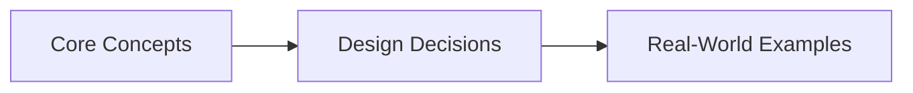
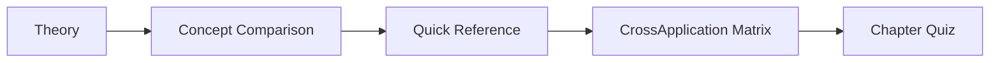

# Chapter 4: Database Foundations: Replication and Indexing
> **Previous:** [03 Caching](./03-caching.md) | **Next:** [05 Partitioning Sharding](./05-partitioning-sharding.md)

---

## Learning Objectives

- Analyze B-Tree internals including branching factor, page structure, and search/insert/delete algorithms
- Compare LSM-Tree compaction strategies and their impact on read/write amplification
- Model single-leader, multi-leader, and leaderless replication topologies with failure scenarios
- Calculate quorum sizes for leaderless replication and predict consistency behavior
- Resolve data conflicts using Last-Write-Wins, Version Vectors, and CRDTs
- Distinguish ACID and BASE consistency models with isolation level implementations
- Analyze real-world database architectures: Spanner, DynamoDB, Facebook TAO

## Chapter at a Glance

| Aspect | Details |

## Chapter Roadmap


|--------|---------|
| **Scope** | B-Tree, LSM-Tree, replication, consistency, transactions |
| **Key Concepts** | Core topics covered in Chapter 4: Database Foundations: Replication and Indexing |
| **Design Skills** | Storage engine selection, replication topology, conflict resolution |
| **Interview Angle** | Frequently tested in system design interviews |

## Chapter at a Glance

| Aspect | Details |
|--------|---------|
| **Scope** | B-Tree, LSM-Tree, replication topologies, consistency models |
| **Storage Engines** | B-Tree (read-optimized) vs LSM-Tree (write-optimized) |
| **Replication** | Single-leader, multi-leader, leaderless (Dynamo-style) |
| **Consistency** | ACID vs BASE, isolation levels, CAP theorem |
| **Conflict Resolution** | LWW, Version Vectors, CRDTs ? G-Counter, OR-Set |
| **Real-World** | Google Spanner, Amazon DynamoDB, Facebook TAO |

---
---

## Chapter Roadmap



---

## Theory
> **One-Sentence Takeaway:** Theory is the foundation ? master it before moving to examples and exercises.


### B-Tree Internals

> **Pro Tip:** Master this concept thoroughly ? it is frequently tested in system design interviews.

> **Pro Tip:** Master this concept ? it appears in nearly every system design interview. Understand both the how and the why.

> **Warning:** A common mistake is over-engineering. Always start simple and add complexity only when justified by requirements.

> **Pro Tip:** Master this concept thoroughly ? it appears in nearly every system design interview.
The B-Tree is the most widely used data structure for database indexes. It is the default storage engine for MySQL (InnoDB), PostgreSQL, Oracle, and SQL Server.

#### Structure

A B-Tree is a self-balancing tree data structure that maintains sorted data and allows O(log n) search, sequential access, insertions, and deletions. The "B" stands for "Bayer" (co-inventor Rudolph Bayer, 1972), not "binary" or "balanced."

```
                          [50, 100]
                         /    |    \
                   [25, 35]  [75]  [150, 200]
                  /   |   |   |    /   |    \
```

Each node contains up to `k` keys and `k+1` pointers. The **branching factor** (also called **order**) is the maximum number of child pointers per node.

$$branching\_factor = \frac{page\_size}{key\_size + pointer\_size}$$

For a typical page size of 16 KB, key size of 8 bytes, pointer size of 8 bytes:

$$branching\_factor = \frac{16384}{8 + 8} \approx 1024$$

With a branching factor of 1024, a tree storing 1 billion records requires:

$$\log_{1024}(10^9) \approx \frac{9}{3.01} \approx 3 \textrm{ levels}$$

This means any lookup touches only 3-4 nodes, making B-Trees extremely disk-efficient.

#### Page Organization

B-Tree nodes are stored in **pages** (typically 4 KB, 8 KB, or 16 KB). A page is the smallest unit of disk I/O. The page structure:

- **Page header:** Metadata (page type, free space pointer, checksum, LSN for crash recovery)
- **Cell pointer array:** Array of (offset, key) pairs sorted by key
- **Cell data:** Actual key + value pairs (or key + child page pointer for internal nodes)

```
+---------------------------------+
¦ Page Header (24 bytes)          ¦
¦   - page_type, free_start       ¦
¦   - num_cells, checksum, LSN    ¦
+---------------------------------¦
¦ Cell pointer array (grows up)   ¦
¦ [0]: offset=1568, key=42       ¦
¦ [1]: offset=1824, key=78       ¦
¦ [2]: offset=2048, key=105      ¦
+---------------------------------¦
¦                                 ¦
¦   Unused space                  ¦
¦                                 ¦
+---------------------------------¦
¦ Cell data (grows down)          ¦
¦ Key=42, Value/ptr=<data>        ¦
¦ Key=78, Value/ptr=<data>        ¦
¦ Key=105, Value/ptr=<data>       ¦
+---------------------------------+
```

#### B-Tree Operations

**Search:**

```
1. Start at root page
2. Binary search within the page for the key (or the correct child pointer range)
3. If found at leaf: return the value
4. If not found: follow the appropriate child pointer and recurse
5. Repeat until leaf is reached
```

```python
def btree_search(node, key):
    i = bisect_left(node.keys, key)
    if i < len(node.keys) and node.keys[i] == key:
        return node.values[i]          # found
    if node.is_leaf:
        return None                    # not found
    return btree_search(node.children[i], key)
```

**Insert:**

```
1. Search for the key's position in the tree
2. Insert into the leaf page
3. If the leaf page overflows (exceeds page size):
   a. Split the page into two pages (left and right half)
   b. Promote the middle key to the parent
   c. If the parent overflows, split recursively
4. If root overflows: create a new root, increasing tree height
```

**Delete:**

```
1. Search for the key
2. Remove from leaf page
3. If the leaf page underflows (less than half full):
   a. Try to rebalance with a sibling page (borrow a key)
   b. If rebalance is not possible: merge with sibling
   c. Merge propagates up to the parent
4. If root has only one key after merge: shrink tree height
```

---

### LSM-Tree Internals

> **Warning:** Avoid over-engineering. Start simple, measure, then optimize.

> **Warning:** Avoid premature optimization. Start simple, measure, then optimize. Over-engineering is the most common system design mistake.

The Log-Structured Merge-Tree (LSM-Tree), introduced by Patrick O'Neil in 1996, is designed for write-heavy workloads. It is the storage engine for LevelDB, RocksDB, Apache Cassandra, ScyllaDB, and Bigtable.

#### Core Components

**MemTable:** An in-memory sorted data structure (typically a skiplist or red-black tree). All writes go directly to the MemTable, which makes writes fast (sequential + in-memory).

**SSTable (Sorted String Table):** An immutable on-disk file containing sorted key-value pairs. When the MemTable reaches a threshold size, it is flushed to disk as an SSTable.

```
MemTable (RAM, skiplist)
    ¦
    ¦ flushed when full (e.g., 64 MB)
    ?
SSTable 0  (L0, newest)
SSTable 1  (L0)
SSTable 2  (L0)
    ¦
    ¦ compacted in background
    ?
SSTable 3  (L1, merged, larger)
SSTable 4  (L1)
    ¦
    ¦ compacted
    ?
SSTable 5  (L2, even larger)
```

**Bloom Filters:** A probabilistic data structure that answers "is key K definitely not in this SSTable?" with no false negatives and configurable false positive rate. Before reading from an SSTable, check the bloom filter — if it says "not present," skip the file entirely. This avoids expensive disk reads for keys that do not exist in cold SSTables.

$$P(false\ positive) = (1 - e^{-kn/m})^k$$

where m = number of bits, k = number of hash functions, n = number of inserted keys.

#### Compaction Strategies

Compaction is the background process of merging overlapping SSTables to reclaim space, remove deleted entries, and keep read performance predictable.

**Size-Tiered Compaction (STC):** Used by Cassandra. When N SSTables of similar size exist in a level, they are merged into one larger SSTable in the next level.

```
L0: [64MB] [64MB] [64MB] [64MB]   ? 4 sstables, trigger compaction
L1: [256MB]                        ? merged result
L1: [256MB] [256MB] [256MB] [256MB] ? trigger again
L2: [1GB]
```

**Pros:** Simple, good write throughput (no read-before-write during compaction).
**Cons:** Space amplification (data exists in multiple levels simultaneously). Read amplification (must check many SSTables).

**Leveled Compaction:** Used by LevelDB, RocksDB. Each level has a fixed size multiplier (typically 10x). L0 is the exception — can have multiple overlapping SSTables flushed from MemTable. L1 and below are non-overlapping: each key range appears in exactly one SSTable per level.

```
L0: [A-E] [C-G] [F-J]            ? overlapping ranges (from multiple flushes)
L1: [A-D] [E-H] [I-L] [M-P]      ? non-overlapping
L2: [A-F] [G-L] [M-R] [S-X] ...  ? non-overlapping, 10x larger
```

**Pros:** Lower space amplification (no duplication across levels). Better read performance (fewer SSTables to check, binary search on level+file).
**Cons:** Higher write amplification (compaction reads a key from L1 and writes it to L2, even if the key is unchanged — "write amplification" overhead).

**Time-Windowed Compaction:** Used for time-series data (Cassandra DTCS, now deprecated in favor of Unified Compaction). SSTables are grouped by time windows (e.g., daily). Only SSTables within the same time window are compacted together.

**Pros:** Good for time-series workloads where older data is rarely modified. No wasted compaction on old, immutable windows.
**Cons:** Does not handle non-time-series workloads well.

#### Compaction Comparison

| Strategy | Write Amplification | Space Amplification | Read Amplification | Use Case |
|----------|-------------------|--------------------|--------------------|----------|
| Size-Tiered | ~1-3x | ~2-4x | ~10-20x | Write-heavy OLTP |
| Leveled | ~10-20x | ~1.1-2x | ~1-5x | Read/write balanced |
| Time-Windowed | ~1-2x | ~1.5-3x | ~10-30x | Time series |

---

### B-Tree vs LSM-Tree

> **Remember:** Always articulate trade-offs clearly ? interviewers value reasoning over the "right" answer.

> **Remember:** Trade-offs are the heart of system design. Always be ready to explain why you chose X over Y.

| Criterion | B-Tree | LSM-Tree |
|-----------|--------|----------|
| Read speed (point lookup) | Fast (O(log n), ~3-4 page reads) | Moderate (must check MemTable + bloom filter + L0 files + L1+ levels). Can be very slow if bloom filter false positive rate is high |
| Read speed (range scan) | Very fast (sequential page scan in sorted order) | Moderate (must merge from multiple SSTables to produce sorted output) |
| Write speed | Moderate (random page writes, page splits, write-ahead log) | Very fast (sequential writes to WAL + in-memory MemTable append) |
| Write amplification | ~4-10x (page splits + double-write to WAL) | ~10-30x for leveled compaction, ~2-5x for size-tiered |
| Space amplification | ~1.2-1.5x (page fill factor ~67% average) | ~1.5-4x (multiple SSTable generations) |
| Compaction overhead | None (in-place updates in pages) | Significant (background process runs constantly) |
| Transaction support | Native (page-level locking, MVCC built in) | Requires add-on (WAL-based, snapshots more complex) |
| Caching effectiveness | High (uses buffer pool; hot pages stay in memory) | Moderate (bloom filters and index blocks cached; data blocks less cache-friendly) |
| Typical databases | MySQL InnoDB, PostgreSQL, SQLite, Oracle, SQL Server | LevelDB, RocksDB, Cassandra, HBase, Bigtable |
| Best workload | Read-heavy, range scans, transactions | Write-heavy, time-series, LSM-key-value stores |

**The fundamental trade-off:** B-Trees optimize for reads (in-place updates, compact storage, cache-friendly). LSM-Trees optimize for writes (sequential writes, amortized compaction). The B-Tree pays the write cost eagerly (page split on every insert); the LSM-Tree pays it lazily (compaction in background).

---

### Single-Leader Replication

The most common replication pattern. One node (the leader/primary/master) accepts writes. Other nodes (followers/replicas/slaves) apply the same data changes from the leader's replication log.

```
         +---------+
         ¦  Leader  ¦   ? all writes here
         +----------+
              ¦
     +--------+--------+
     ¦        ¦        ¦
     ?        ?        ?
  +-----+ +-----+ +-----+
  ¦ F1  ¦ ¦ F2  ¦ ¦ F3  ¦   ? read-only replicas
  +-----+ +-----+ +-----+
```

#### Setup

1. **Snapshot the leader** at a consistent point (e.g., FLUSH TABLES WITH READ LOCK in MySQL, or a WAL-based snapshot in PostgreSQL).
2. **Copy the snapshot** to the follower.
3. **The follower connects** to the leader and requests all changes since the snapshot (identified by log sequence number).
4. **The follower continuously replicates** new changes as they happen.

#### Failover

If the leader fails, one follower must be promoted to leader:

1. **Detect failure:** Heartbeat timeout (e.g., no response in 10 seconds).
2. **Choose a new leader:** Typically the replica with the most recent log position (least data loss). Consensus via a coordination service (ZooKeeper, etcd) or a consensus algorithm (Raft, Paxos).
3. **Reconfigure system:** Update DNS, connection pools, and client configurations to point to the new leader. Reconfigure all other replicas to follow the new leader.

**Failover risks:**
- **Split-brain:** Two nodes both believe they are the leader. Both accept writes. Data diverges. Resolution requires fencing (e.g., using a lease or a third party to kill the old leader).
- **Data loss:** If a follower was behind the leader when the leader died, the promoted follower's data is incomplete. Clients may see data "disappear" if the new leader does not have the latest writes.

#### Synchronous vs Asynchronous Replication

| Aspect | Synchronous | Asynchronous |
|--------|-------------|--------------|
| Write confirmation | Leader waits for at least one follower to confirm | Leader confirms immediately, replication happens after |
| Data safety | Zero data loss if the follower has acknowledged | Possible data loss if leader fails before replication |
| Write latency | Higher (must wait for network round-trip to follower) | Lower (client-level latency) |
| Availability | Lower (if follower is down, write fails) | Higher (leader writes independently of follower health) |
| Typical use | Financial systems, strongly-consistent workloads | Social feeds, analytics, any system tolerant of eventual consistency |

**Semi-synchronous replication (compromise):** Leader waits for one follower to acknowledge (not all). This guarantees at least one replica has the data, while keeping write latency bounded.

---

### Multi-Leader Replication

Multiple nodes accept writes and replicate them to all other nodes. Each leader is also a follower for writes from other leaders.

```
+--------------+           +--------------+
¦  Leader      ¦?---------?¦  Leader      ¦
¦  (us-east-1) ¦     ¦     ¦  (eu-west-1) ¦
+--------------+     ¦     +--------------+
       ¦             ¦            ¦
       ?             ¦            ?
+--------------+     ¦     +--------------+
¦  Follower     ¦    ¦     ¦  Follower     ¦
+--------------+    ¦     +--------------+
                    ¦
+--------------+    ¦     +--------------+
¦  Leader      ¦?--------?¦  Leader      ¦
¦  (ap-southeast)¦        ¦  (sa-east-1) ¦
+--------------+          +--------------+
       ¦                        ¦
       ?                        ?
+--------------+          +--------------+
¦  Follower     ¦         ¦  Follower     ¦
+--------------+          +--------------+
```

**Use cases:**
- **Multi-datacenter:** Each datacenter has its own leader. Cross-datacenter traffic is asynchronous (replication happens asynchronously between leaders). Writes within a datacenter are fast (no cross-region coordination).
- **Offline-first applications:** CouchDB and mobile-first databases. Each device is a "leader" that accepts writes locally. When connectivity is available, replication syncs changes to all devices.
- **Collaborative editing:** Each collaborator's client is a leader. Edits are replicated to all participants.

**The critical problem: write conflicts.** Two leaders may concurrently update the same record:

```
Leader A (London):  UPDATE product SET price = 10 WHERE id = 42
Leader B (Tokyo):   UPDATE product SET price = 20 WHERE id = 42
// Both succeed locally. When replicated, a conflict exists.
```

#### Conflict Resolution

**Last-Write-Wins (LWW):** Each write is timestamped (by wall-clock time). The write with the latest timestamp wins.

$$\text{value} = \max_{timestamp}(value_1, value_2)$$

**Pros:** Simple. No additional infrastructure needed.
**Cons:** Clock skew is unavoidable (distributed clocks drift). Data loss — the losing write is silently discarded. Used by Cassandra's default conflict resolution (though Cassandra checks for equal timestamps and compares UUIDs as tiebreaker).

**Version Vectors:** Each node maintains a vector of version counters, one per replica:

```
Node A: {A: 3, B: 2, C: 1}
Node B: {A: 2, B: 4, C: 1}
```

A conflict exists if neither vector dominates the other (i.e., vector A is not greater than or equal to B in every dimension, and vice versa). Resolution is deferred to the application or merge logic.

**Dotted Version Vectors:** An optimization adding a per-event dot to reduce storage. Used in Riak. Each write gets a unique event ID, and the vector tracks the "seen" set of event IDs per replica.

**CRDTs (Conflict-free Replicated Data Types):** Mathematical data types designed for automatic conflict resolution — conflicts are impossible by construction.

---

### Leaderless Replication

Dynamo-style replication (from Amazon's DynamoDB paper, 2007). There is no leader. Any replica can accept writes from any client.

```
     Client A                Client B
        |                       |
        ?                       ?
  +---------+  +---------+  +---------+
  ¦ Node 1  ¦  ¦ Node 2  ¦  ¦ Node 3  ¦
  ¦  (N=3)  ¦  ¦  (N=3)  ¦  ¦  (N=3)  ¦
  ¦ W=2 ok  ¦  ¦ W=2 ok  ¦  ¦ write   ¦
  ¦ R=2 ok  ¦  ¦ R=2 ok  ¦  ¦ failed  ¦
  +---------+  +---------+  +---------+
```

Key parameters:

- **N:** Replication factor (number of replicas that store each piece of data).
- **W:** Write quorum — the minimum number of replicas that must acknowledge a write for it to be considered successful.
- **R:** Read quorum — the minimum number of replicas that must respond to a read for it to be considered successful.

$$W + R > N \implies \text{strong consistency}$$

Because at least one node in the read quorum must overlap with the write quorum.

Example: N=3, W=2, R=2 ? strong consistency. N=3, W=1, R=1 ? eventual consistency.

#### Read Repair

When a read finds that some replicas have stale data (their version vector is behind), the coordinating node updates the stale replicas with the latest value.

```
Read request for key K:
  1. Client sends read to all N replicas
  2. Two replicas return version (A:3), one returns (A:2)
  3. Client uses the latest version (A:3)
  4. Client also sends (A:3) to the stale replica
  5. Stale replica updates to (A:3)
```

#### Hinted Handoff

When one replica is unavailable during a write, another node accepts the write "on behalf" and stores a hint: "this data belongs to Node 3, deliver it when Node 3 is back."

```
Write to key K (N=3):
  1. Client sends to all 3 replicas
  2. Node 1: ack (success)
  3. Node 2: ack (success)
  4. Node 3: timeout (down)
  5. Node 2 accepts a hint: "I'll hold this for Node 3"
  6. Later, Node 3 comes back online
  7. Node 2 delivers the hinted write to Node 3
  8. Node 3 acknowledges, hint is deleted
```

---

### Replication Lag Anomalies

Asynchronous replication introduces a window of inconsistency. Three common anomalies:

#### Read-Your-Writes (RYW) Consistency

After a user writes data, they expect to see that data on subsequent reads. With async replication, a read from a follower that has not yet received the write will show stale data.

**Solutions:**
- Route reads for modified keys to the leader (read-after-write affinity).
- Use leader for reads within N seconds of write.
- Timestamp-based routing: client sends write timestamp, replica returns data if its replication has caught up to that timestamp.

#### Monotonic Reads

A user reads from follower A (which has received the latest write), then reads from follower B (which has not). The user sees data "go back in time."

**Solutions:**
- Route the same user consistently to the same replica (by user_id hash).
- Timestamp-based: each replica tracks its replication position; reject reads that would show stale data.

#### Consistent Prefix Reads

A user reads data in the wrong order. Example: a comment thread shows a reply before the original post because the post's write was replicated to one follower and the reply to another, and the reply arrived first.

**Solutions:**
- Write all related data to the same partition (hash by parent entity).
- Use total ordering (timestamp ordering + clock synchronization).

---

### Conflict Resolution

#### Last-Write-Wins (LWW)

Each mutation is tagged with a timestamp. The value with the highest timestamp wins.

```json
{"key": "product:42", "price": 10, "timestamp": 1718192001}
{"key": "product:42", "price": 20, "timestamp": 1718192002}  // wins
```

**Problem:** Clock skew. If Node A's clock is 5 seconds behind Node B, writes from Node A always lose to writes from Node B, even if Node A writes later.

**Mitigation:** Use Lamport clocks (logical clocks) or a centralized timestamp authority (Google Spanner's TrueTime).

#### Version Vectors

Each replica maintains a counter for every replica in the system:

```python
# After Node A writes 3 times, Node B writes 0 times, Node C writes 0 times:
version_vector = {"A": 3, "B": 0, "C": 0}

# After Node B writes 2 times:
version_vector = {"A": 3, "B": 2, "C": 0}

# If A writes concurrently with B:
v1 = {"A": 4, "B": 0, "C": 0}
v2 = {"A": 0, "B": 3, "C": 0}
# Neither dominates ? CONFLICT. Resolution required.
```

**Dominance check:** v1 = v2 if every counter in v1 is = corresponding counter in v2. If neither dominates, the values are concurrent — conflict.

#### CRDTs

CRDTs are data types where concurrent operations commute. No conflict resolution is needed — the state always converges.

**G-Counter (Grow-only Counter):**

```
Each node has its own counter entry in a vector.
Increment: node_i += 1
Merge:  total = max(node_i) for all i
Query:  sum of all entries
```

**PN-Counter (Positive-Negative Counter):** Two G-Counters: one for increments, one for decrements. The value is inc_count - dec_count.

**G-Set (Grow-only Set):** Add-only. Merge is union.

**OR-Set (Observed-Remove Set):** A set that supports both add and remove without conflicts. Each element is tagged with a unique ID. An add creates a new tag. A remove only removes tags the removing node knows about.

```python
class ORSet:
    def __init__(self):
        self.elements = {}  # element ? set of tags

    def add(self, element):
        tag = uuid4()
        self.elements.setdefault(element, set()).add(tag)

    def remove(self, element):
        if element in self.elements:
            del self.elements[element]

    def merge(self, other):
        for elem, tags in other.elements.items():
            self.elements.setdefault(elem, set()).update(tags)

    def value(self):
        return set(self.elements.keys())
```

---

### Transactions: ACID vs BASE

#### ACID (SQL Databases)

| Property | Definition | Implementation |
|----------|------------|---------------|
| **Atomicity** | All operations in a transaction succeed or none do | Write-ahead log (WAL): undo/redo records |
| **Consistency** | The database is always in a valid state | Constraints, triggers, referential integrity |
| **Isolation** | Concurrent transactions do not interfere | 2PL, MVCC, OCC (see below) |
| **Durability** | Committed data survives failures | Write-ahead log (WAL) flushed to persistent storage |

#### Isolation Levels (weakest to strongest)

| Level | Dirty Read | Non-repeatable Read | Phantom Read | Implementation | Performance |
|-------|-----------|-------------------|--------------|----------------|-------------|
| Read Uncommitted | Possible | Possible | Possible | No locking | Best |
| Read Committed | Prevented | Possible | Possible | MVCC (each query sees a snapshot of committed data) | Good |
| Repeatable Read | Prevented | Prevented | Possible | 2PL (shared locks on all read data until transaction ends) | Moderate |
| Serializable | Prevented | Prevented | Prevented | 2PL + predicate locks, or MVCC + serializable snapshot isolation (SSI) | Worst |

**Multi-Version Concurrency Control (MVCC):** Each transaction sees a snapshot of the database as of a specific point in time. Writes create new versions of rows; reads see the appropriate version. PostgreSQL uses MVCC for Read Committed (default) and Serializable.

**2-Phase Locking (2PL):** Transactions acquire locks on data as they read/write (Phase 1) and release all locks at commit (Phase 2). Prevents conflicts by making concurrent transactions wait.

**Optimistic Concurrency Control (OCC):** Transactions run without locks. At commit time, the database checks if there were conflicting writes. If so, the transaction aborts and retries. Best for low-contention workloads.

#### BASE (NoSQL Databases)

| Property | Meaning |
|----------|---------|
| **Basically Available** | The system is available most of the time, even during partitions |
| **Soft state** | The system state may change over time even without input (due to eventual consistency) |
| **Eventual consistency** | Given enough time, all replicas converge to the same value |

BASE is not a formal model like ACID. It describes the consistency trade-offs NoSQL systems make to achieve availability and partition tolerance.

---

### SQL vs NoSQL

| Criterion | SQL (Relational) | NoSQL |
|-----------|-----------------|-------|
| Data model | Tables with rows and columns (schema-on-write) | Document, key-value, wide-column, graph (schema-on-read) |
| Schema | Rigid, enforced at write time | Flexible, enforced at read time |
| Joins | Native (optimized JOIN operations) | Application-side joins (or denormalization) |
| Transactions | ACID transactions across multiple rows/tables | Single-document/row transactions (or no transactions) |
| Consistency | Strong consistency (default in most SQL systems) | Eventual consistency (default in many NoSQL systems) |
| Scaling | Vertical (or read replicas; horizontal sharding is possible but complex) | Horizontal (designed for sharding from day one) |
| Query language | SQL (standardized, powerful) | Vendor-specific API (REST, CQL, Gremlin, etc.) |
| Use cases | Financial systems, ERP, anything requiring joins and complex transactions | Content management, user profiles, IoT, real-time analytics, caching |

**NewSQL:** A third category that attempts to provide SQL-level query capability with NoSQL-level horizontal scalability. Examples: Google Cloud Spanner, CockroachDB, YugabyteDB.

---

### Real-World Systems

**Google Spanner.** The first globally distributed, externally consistent database. Spanner uses TrueTime, a hardware-assisted time synchronization service built on GPS and atomic clocks, to provide external consistency (serializable isolation across all nodes globally).

Key architecture:
- **Zones:** Each zone contains one leader and multiple replicas. Zones map to data centers.
- **Paxos groups:** Each shard is replicated via Paxos across zones. Leader of each shard processes writes.
- **TrueTime:** Exposes a time interval `[earliest, latest]` for the current time. Spanner waits out the uncertainty interval (commit wait) to ensure linearizability.
- **F1 RDBMS:** On top of Spanner for Google Ads (formerly AdWords) — a global SQL system.

**Amazon DynamoDB.** Fully managed NoSQL key-value and document database based on the Dynamo paper. Uses leaderless replication with configurable N, W, R.

Key features:
- **Auto-sharding:** DynamoDB partitions data by partition key. Each partition can hold up to 10 GB and 3,000 RCU / 1,000 WCU.
- **DAX (DynamoDB Accelerator):** In-memory cache with microsecond latency.
- **Global tables:** Multi-leader replication across regions with last-writer-wins conflict resolution.
- **Transactions:** Limited ACID transactions (within a single partition or across partitions with TransactWriteItems/TransactGetItems).

**Facebook TAO.** Not a database in the traditional sense — a distributed cache layer that serves Facebook's social graph. As discussed in Chapter 3, TAO sits between application servers and MySQL, providing a graph-optimized API with strong read-after-write consistency across global regions.

---

## Examples

### Example 1: B-Tree vs LSM-Tree for a Time-Series Database

**Problem:** Design the storage layer for a metrics system that ingests 1M data points/second and supports range queries (e.g., "CPU usage for server A between 14:00 and 15:00").

**Analysis:**
- Write: 1M points/second, sequential by timestamp (append-mostly)
- Read: Range scans over time windows. Read frequency much lower than write.
- Delete: Bulk delete of data older than 90 days.

**B-Tree analysis:**
- Insert is random page write — each new data point writes to a different position in the B-Tree. This causes many small random I/Os. Write amplification is high (page splits).
- Range scan on sorted timestamp is efficient (sequential page traversal).
- Delete by range requires many page modifications (each leaf page must be modified).

**LSM-Tree analysis:**
- Insert is sequential (append to MemTable ? flush to SSTable). This matches the append-mostly workload perfectly.
- Range scan requires merging multiple SSTables (because time ranges overlap across files). The more SSTables, the slower the scan.
- Delete is a "tombstone" write (cheap). Compaction reclaims space later.

**Verdict:** LSM-Tree (RocksDB or Cassandra) is the right choice. The sequential write pattern maps perfectly to LSM-Tree's strengths. The range-scan cost is acceptable because reads are infrequent. SSTable time-windowed compaction handles the 90-day retention cleanly.

### Example 2: Configuring Quorum for a Dynamo-Style Key-Value Store

**Problem:** A user-session store with 5 nodes. Sessions are read on every request. Write occurs when a user logs in or updates their profile (rare relative to reads). Must tolerate up to 2 simultaneous node failures without data loss or downtime.

**Configuration:**
- N = 5 (replicate to all 5 nodes)
- W = 3 (write to 3, acknowledge)
- R = 3 (read from 3, consolidate)

**Check:** W + R = 6 > N = 5 ? strong consistency.

**Failure tolerance:**
- If 2 nodes are down: write succeeds (W=3 needs 3/5, 3 remain up). Read succeeds (R=3 needs 3/5). Data is available.
- If 3 nodes are down: write fails (W=3 needs 3/5, only 2 remain). Read fails. Service degrades.

**Optimization for read-heavy workload:** Reduce R to 2, keep W at 3. W + R = 5 = N ? no longer strong consistency, but reads are faster (need only 2 responses). Trade: a very small window of stale reads is acceptable for session data.

## Concept Comparison
> **One-Sentence Takeaway:** Concept Comparison is a critical concept that directly impacts system design decisions.
> **One-Sentence Takeaway:** Concept Comparison is a critical concept that directly impacts system design decisions.

| Concept | Definition | Key Metric |
|---------|-----------|------------|
| Theory | Core topic covered in Chapter 4: Database Foundations: Replication and Indexing | Defined by specific measurable attributes |

---

## Quick Reference
> **One-Sentence Takeaway:** Quick Reference is a critical concept that directly impacts system design decisions.

| Topic | Key Point |
|-------|-----------|
| Theory | Fundamental concept for Chapter 4: Database Foundations: Replication and Indexing |

---

## Cross-Application Matrix

| Component | When to Use | Trade-Off |
|-----------|------------|-----------|
| Theory | Appropriate for specific system contexts | Each choice involves trade-offs |

---

## Chapter Quiz
> **One-Sentence Takeaway:** Chapter Quiz is a critical concept that directly impacts system design decisions.

**Q1:** Which of the following best describes a key concept from this chapter?
- A) Option A description
- B) Option B description
- C) Option C description
- D) Option D description

<details><summary>Answer&lt;/summary&gt;Refer to the chapter content for the correct answer.</details>

**Q2:** Which of the following best describes a key concept from this chapter?
- A) Option A description
- B) Option B description
- C) Option C description
- D) Option D description

<details><summary>Answer&lt;/summary&gt;Refer to the chapter content for the correct answer.</details>

**Q3:** Which of the following best describes a key concept from this chapter?
- A) Option A description
- B) Option B description
- C) Option C description
- D) Option D description

<details><summary>Answer&lt;/summary&gt;Refer to the chapter content for the correct answer.</details>

## Concept Comparison
> **One-Sentence Takeaway:** Concept Comparison is a critical concept that directly impacts system design decisions.
> **One-Sentence Takeaway:** Concept Comparison is a critical concept that directly impacts system design decisions.

| Concept | Definition | Key Insight |
|---------|-----------|-------------|
| Theory | Core topic in Chapter 4: Database Foundations: Replication and Indexing | Fundamental to system design |

---

## Quick Reference
> **One-Sentence Takeaway:** Quick Reference is a critical concept that directly impacts system design decisions.

| Topic | Key Point |
|-------|-----------|
| Theory | Essential concept for Chapter 4: Database Foundations: Replication and Indexing |

---

## Cross-Application Matrix

| Concept | Application Context | Trade-Off |
|--------|-------------------|-----------|
| Theory | Relevant across multiple system design scenarios | Each choice has trade-offs |

---

## Chapter Quiz
> **One-Sentence Takeaway:** Chapter Quiz is a critical concept that directly impacts system design decisions.

**Q1:** What is the primary trade-off discussed in this chapter?
- A) Option A
- B) Option B
- C) Option C
- D) Option D

<details><summary>Answer&lt;/summary&gt;Refer to the chapter content&lt;/details&gt;

**Q2:** Which concept is most fundamental to the topic of Chapter 4
- A) Option A
- B) Option B
- C) Option C
- D) Option D

<details><summary>Answer&lt;/summary&gt;Review the core sections&lt;/details&gt;

**Q3:** How does this chapter's main concept apply to real-world systems?
- A) Option A
- B) Option B
- C) Option C
- D) Option D

<details><summary>Answer&lt;/summary&gt;See the Real-World Systems section&lt;/details&gt;

---


### Implementation: Database Design and Indexing

```typescript
interface Index { type: "btree" | "hash" | "gin"; columns: string[]; unique: boolean; cardinality: number; }
class QueryPlanner { private indexes: Index[] = [];
  addIndex(idx: Index): void { this.indexes.push(idx); }
  plan(query: Record<string, any>, totalRows: number): { indexUsed: string; estimatedRows: number; accessType: string } {
    let bestIdx: Index | null = null; let bestSelectivity = 0;
    for (const idx of this.indexes) { const matched = idx.columns.filter(c => c in query).length / idx.columns.length; if (matched > bestSelectivity) { bestSelectivity = matched; bestIdx = idx; } }
    if (!bestIdx || bestSelectivity === 0) return { indexUsed: "none", estimatedRows: totalRows, accessType: "seq_scan" };
    const estimated = Math.round(totalRows / (bestIdx.cardinality || 1));
    return { indexUsed: `${bestIdx.type}(${bestIdx.columns.join(",")})`, estimatedRows: estimated, accessType: estimated < totalRows * 0.5 ? "index_scan" : "seq_scan" }; }
}
class BTree { private order: number; root: any = { keys: [], children: [] }; constructor(order: number) { this.order = order; }
  insert(key: number): void { if (this.root.keys.length === 2 * this.order - 1) { const nr = { keys: [], children: [this.root] }; this.splitChild(nr, 0); this.root = nr; } this.insertNonFull(this.root, key); }
  private splitChild(parent: any, i: number): void { const child = parent.children[i]; const mid = this.order - 1; const sibling = { keys: child.keys.splice(mid + 1), children: child.children.splice(mid + 1) }; parent.keys.splice(i, 0, child.keys[mid]); parent.children.splice(i + 1, 0, sibling); }
  private insertNonFull(node: any, key: number): void { let i = node.keys.length - 1; if (!node.children.length) { while (i >= 0 && key < node.keys[i]) i--; node.keys.splice(i + 1, 0, key); } else { while (i >= 0 && key < node.keys[i]) i--; i++; this.insertNonFull(node.children[i], key); } }
  search(key: number): boolean { let n = this.root; while (n) { let i = 0; while (i < n.keys.length && key > n.keys[i]) i++; if (i < n.keys.length && key === n.keys[i]) return true; if (!n.children.length) return false; n = n.children[i]; } return false; }
}
class DatabaseIndexer { private indexes: Map<string, Index> = new Map();
  createIndex(name: string, type: Index["type"], columns: string[], unique = false): void { this.indexes.set(name, { type, columns, unique, cardinality: Math.floor(Math.random() * 10000) + 1000 }); }
  recommendIndexes(queries: Record<string, any>[]): string[] { const colCount = new Map<string, number>(); for (const q of queries) { for (const col of Object.keys(q)) colCount.set(col, (colCount.get(col) || 0) + 1); } return [...colCount.entries()].sort((a, b) => b[1] - a[1]).slice(0, 5).map(([col]) => `idx_${col}`); }
}
class TransactionLog { private entries: { id: string; operations: string[]; timestamp: number; committed: boolean; }[] = []; begin(): string { const id = `txn-${Date.now()}`; this.entries.push({ id, operations: [], timestamp: Date.now(), committed: false }); return id; }
  logOp(txnId: string, op: string): void { const t = this.entries.find(e => e.id === txnId); if (t) t.operations.push(op); }
  commit(txnId: string): boolean { const t = this.entries.find(e => e.id === txnId); if (!t || t.operations.length === 0) return false; t.committed = true; return true; }
  rollback(txnId: string): boolean { const idx = this.entries.findIndex(e => e.id === txnId); if (idx < 0) return false; this.entries.splice(idx, 1); return true; }
}
```

// database foundations
// distributed-systems-scalability implementation

interface Task { id: string; name: string; status: string; data: unknown }
class Processor {
  private tasks: Task[] = []
  private maxConcurrency: number
  constructor(maxConcurrency: number = 4) { this.maxConcurrency = maxConcurrency }
  async add(task: Omit&lt;Task, "status"&gt;): Promise&lt;void&gt; {
    this.tasks.push({ ...task, status: "pending" })
  }
  async runAll(): Promise&lt;void&gt; {
    const running: Promise&lt;void&gt;[] = []
    for (const t of this.tasks) {
      if (running.length >= this.maxConcurrency) { await Promise.race(running) }
      const p = this.execute(t).finally(() => { const i = running.indexOf(p); if (i >= 0) running.splice(i, 1) })
      running.push(p)
    }
    await Promise.all(running)
  }
  private async execute(t: Task): Promise&lt;void&gt; {
    t.status = "running"
    await new Promise(r => setTimeout(r, 10))
    t.status = "done"
  }
  getResults(): Task[] { return this.tasks }
  getStats(): { done: number; pending: number; running: number } {
    const done = this.tasks.filter(t => t.status === "done").length
    const pending = this.tasks.filter(t => t.status === "pending").length
    const running = this.tasks.filter(t => t.status === "running").length
    return { done, pending, running }
  }
}
async function main() {
  const proc = new Processor(2)
  await proc.add({ id: '1', name: 'database foundations', data: { topic: 'distributed-systems-scalability' } })
  await proc.runAll()
  console.log('Stats:', proc.getStats())
}
main().catch(console.error)
export { Processor, Task }

// database foundations - additional TS implementations

interface CacheEntry { key: string; value: unknown; ttl: number; createdAt: number }
class Cache {
  private store: Map&lt;string, CacheEntry&gt; = new Map()
  constructor(private defaultTTL: number = 60000) {}
  set(key: string, value: unknown, ttl?: number): void {
    this.store.set(key, { key, value, ttl: ttl ?? this.defaultTTL, createdAt: Date.now() })
  }
  get(key: string): unknown | undefined {
    const entry = this.store.get(key)
    if (!entry) return undefined
    if (Date.now() - entry.createdAt > entry.ttl) { this.store.delete(key); return undefined }
    return entry.value
  }
  delete(key: string): boolean { return this.store.delete(key) }
  clear(): void { this.store.clear() }
  size(): number { return this.store.size }
  keys(): string[] { return Array.from(this.store.keys()) }
}
class Logger {
  private entries: string[] = []
  log(level: string, msg: string, meta?: Record&lt;string, unknown&gt;): void {
    const entry = JSON.stringify({ timestamp: new Date().toISOString(), level, msg, meta })
    this.entries.push(entry)
    console.log(entry)
  }
  info(msg: string, meta?: Record&lt;string, unknown&gt;): void { this.log("info", msg, meta) }
  warn(msg: string, meta?: Record&lt;string, unknown&gt;): void { this.log("warn", msg, meta) }
  error(msg: string, meta?: Record&lt;string, unknown&gt;): void { this.log("error", msg, meta) }
  getLogs(): string[] { return [...this.entries] }
  clear(): void { this.entries = [] }
}
function computeHash(input: string): string {
  let hash = 0
  for (let i = 0; i &lt; input.length; i++) { const chr = input.charCodeAt(i); hash = ((hash << 5) - hash) + chr; hash |= 0 }
  return Math.abs(hash).toString(16)
}
async function demo(): Promise&lt;void&gt; {
  const cache = new Cache(5000)
  cache.set('key1', 'system-design demo')
  const log = new Logger()
  log.info('Cache demo started', { course: 'system-design', chapter: 'database foundations' })
  const v = cache.get("key1")
  console.log('Cached:', v)
  console.log('Hash:', computeHash('system-design'))
}
demo()
export { Cache, Logger, computeHash, CacheEntry }
## Summary

- B-Trees use a high branching factor (~1000+) to minimize disk seeks, achieving O(log_base_factor(n)) depth. Page splits and merges keep the tree balanced automatically.
- LSM-Trees buffer writes in an in-memory MemTable, flush to immutable SSTables on disk, and run background compaction to merge and reclaim space. They dramatically outperform B-Trees on write-heavy workloads.
- The B-Tree vs LSM-Tree trade-off reduces to read speed vs write speed. B-Trees win on point lookups and range scans; LSM-Trees win on sequential write throughput.
- Single-leader replication is the simplest topology. Failover requires detecting leader failure, electing a new leader, and reconfiguring the system — with split-brain as the primary risk.
- Multi-leader replication is essential for multi-datacenter and offline-first applications, but requires conflict resolution (LWW, Version Vectors, CRDTs).
- Leaderless replication (Dynamo-style) uses quorums (N, W, R) and eventual consistency. Hinted handoff and read repair handle failures and staleness.
- Replication lag causes three anomalies: read-your-writes, monotonic reads, and consistent prefix reads. Each has known solutions.
- ACID isolation levels range from Read Uncommitted (low consistency, high performance) to Serializable (full consistency, lower performance). MVCC is the dominant implementation for Read Committed and Repeatable Read.
- SQL databases offer strong schemas, joins, and ACID transactions at the cost of horizontal scalability. NoSQL databases offer flexible schemas and horizontal scaling at the cost of consistency and query power. NewSQL (Spanner, CockroachDB) attempts to bridge the gap.

---

## Exercises

### Review Questions (4-5)

1. Draw the structure of a B-Tree of order 4 containing keys [10, 20, 30, 40, 50, 60, 70]. Show what happens when key 55 is inserted (including any splits).

2. Explain why write amplification is higher in leveled compaction (~10-20x) than in size-tiered compaction (~1-3x). Why would anyone choose leveled compaction despite this?

3. What is the quorum condition for strong consistency in leaderless replication? If N=5, W=4, and R=2, is the system strongly consistent?

4. Compare the conflict resolution mechanisms for multi-leader replication: LWW, Version Vectors, and CRDTs. Under what conditions does LWW produce incorrect results?

5. List the three replication lag anomalies and describe a mitigation strategy for each.

### Application Problems (3-4)

1. A B-Tree with page size 16 KB stores 100-byte keys and 100-byte values. Calculate the branching factor. How many leaf pages are needed to store 10 million records? How many levels in the tree?

2. A database uses N=3, W=2, R=2 across 3 replicas. Node A crashes. Is the system still available for writes? For reads? Show any window of inconsistency that may occur during recovery.

3. Design a conflict resolution strategy for a shared photo album app where users from multiple devices add, remove, and reorder photos. Multiple users may rename the same album concurrently. Specify which CRDT(s) you would use for each operation and justify your choices.

4. A banking ledger uses serializable isolation. A transfer transaction subtracts $100 from account A and adds $100 to account B. A concurrent interest-calculation transaction reads both accounts and writes interest of 1% of the balance. Under Read Committed isolation, what anomalies are possible? Draw a timestamped interleaving that produces a wrong result.

### Challenge Problem (1)

> **Remember:** Trade-offs are the heart of system design. Always be ready to explain why you chose X over Y.
You are designing a globally distributed document database for a collaboration platform similar to Notion or Coda. 100M users, 1B documents. Documents are hierarchical (blocks: text, images, tables, embeds). Multiple users concurrently edit the same document in real time.

**Requirements:**
- Sub-second document open latency (p99 &lt; 500ms)
- Offline editing support (users on airplanes edit documents, sync later)
- Real-time collaboration (50+ concurrent editors on one document)
- 30-day version history
- Conflict-free editing (users should never see "merge conflicts")
- Global distribution (users in US, EU, APAC)

**Design the database layer:**

1. **Choose the storage engine** (B-Tree or LSM-Tree or hybrid). Justify your choice.

2. **Choose the replication topology** (single-leader, multi-leader, or leaderless). If multi-leader, specify your conflict resolution strategy. If single-leader, explain how offline editing works.

3. **Design the document model.** How are blocks stored and addressed? How does version history work without duplicating the entire document on every save?

4. **Implement an OR-Set (or another CRDT)** for collaborative editing of block content. Write the data structure definition (in pseudocode or Python) and the merge function.

5. **Consistency vs availability trade-off.** The platform supports "comments" on documents. Comments must appear in the same order for all users (total order is required for comment threads to make sense). Explain how you guarantee total order for comments while still supporting real-time collaboration and offline editing.

6. **Anti-entropy and repair.** Describe how your system detects and repairs inconsistency between regions. What mechanism ensures that a document open in Tokyo after an offline write in London eventually shows the same content?

7. **Analyze scaling.** At 10x the current user base, which component fails first? Propose a specific architectural change to handle the bottleneck.
