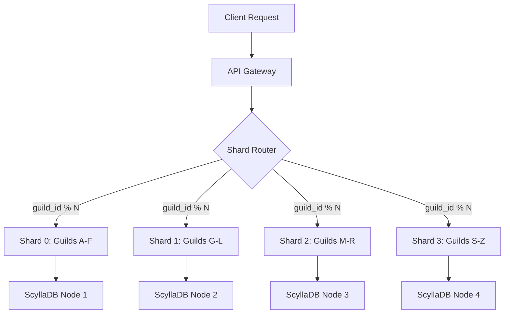
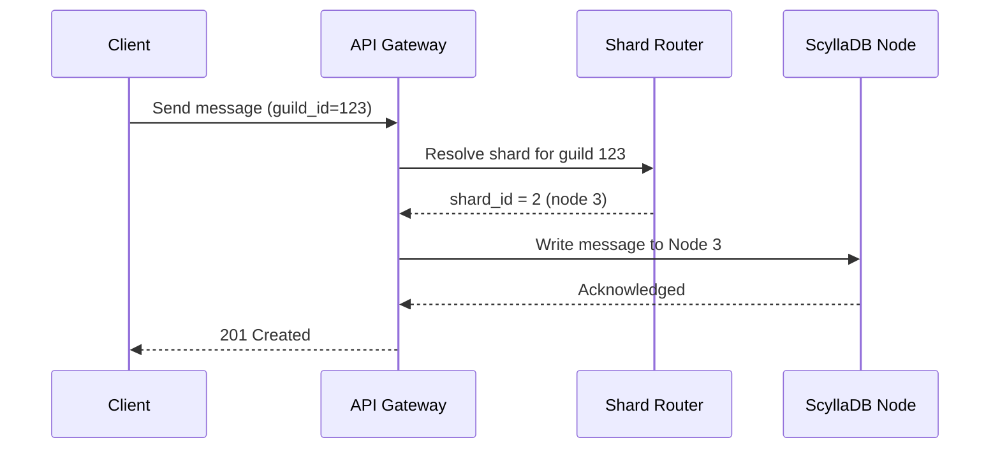
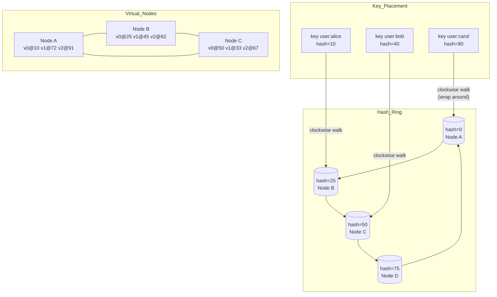

# Chapter 5: Data Partitioning and Sharding
> **Previous:** [04 Database Foundations](./04-database-foundations.md) | **Next:** [06 Distributed Consistency](./06-distributed-consistency.md)

---
## Learning Objectives

- Distinguish between vertical and horizontal partitioning and identify appropriate use cases for each
- Analyze range-based, hash-based, and directory-based sharding strategies with respect to data distribution and access patterns
- Implement consistent hashing with virtual nodes and explain its advantage during node additions and removals
- Diagnose hotspot problems including the celebrity problem and apply mitigation strategies such as split, secondary keys, and read replication
- Evaluate cross-shard query patterns including scatter-gather, distributed joins, and secondary index architectures
- Design compound shard keys and database-per-service decompositions using real-world case studies

---
## Chapter at a Glance

| Aspect | Details |
|--------|---------|
| **Scope** | Vertical/horizontal partitioning, sharding strategies, rebalancing |
| **Key Concepts** | Range, hash, directory-based, consistent hashing, compound keys |
| **Sharding Strategies** | Range, hash, directory, consistent hashing with virtual nodes |
| **Hotspot Mitigation** | Celebrity problem, split, secondary keys, read replication |
| **Cross-Shard Queries** | Scatter-gather, distributed joins, secondary indexes |
| **Real-World** | Instagram, Discord, Uber sharding architectures |

---
## Chapter Roadmap


## Theory
> **One-Sentence Takeaway:** Theory is the foundation ? master it before moving to examples and exercises.


### Partitioning Fundamentals

> **Pro Tip:** Master this concept thoroughly ? it is frequently tested in system design interviews.

> **Pro Tip:** Master this concept ? it appears in nearly every system design interview. Understand both the how and the why.

> **Warning:** A common mistake is over-engineering. Always start simple and add complexity only when justified by requirements.

> **Pro Tip:** Master this concept thoroughly ? it appears in nearly every system design interview.
Partitioning is the process of splitting a large dataset into smaller, independent subsets that can be stored and queried separately. The two primary forms are vertical partitioning and horizontal partitioning (sharding).

**Vertical Partitioning** splits a table by columns. Frequently accessed columns are placed in one partition, while less frequently accessed or larger columns (BLOBs, text) reside in another. This is natural in normalized database design — each normalized table is effectively a vertical partition of the logical entity.

```
Vertical Partition:
  Users_Core:    user_id | name | email | created_at
  Users_Profile: user_id | bio | avatar_url | preferences
  Users_Auth:    user_id | password_hash | last_login
```

The advantage is reduced I/O for common queries (scanning fewer bytes per row) and improved cache hit rates. The disadvantage emerges when queries frequently need to join across partitions — every cross-partition access adds latency.

**Horizontal Partitioning (Sharding)** splits a table by rows. Each shard holds a subset of rows but retains the full schema. The goal is to distribute both storage and query load across multiple database nodes.

```
Shard 0:    user_id 1..1000000
Shard 1:    user_id 1000001..2000000
Shard 2:    user_id 2000001..3000000
```

### Sharding Strategies

> **Warning:** Avoid over-engineering. Start simple, measure, then optimize.

> **Warning:** Avoid premature optimization. Start simple, measure, then optimize. Over-engineering is the most common system design mistake.

#### Range-Based Sharding

Rows are assigned to shards based on a contiguous range of the shard key. For a key `k` and shard boundaries `[b0, b1, b2, ..., bn]`, row with key `k` belongs to shard `i` where `bi <= k < bi+1`.

```
Shard Key: timestamp (month)
  Shard 0:  Jan 2024
  Shard 1:  Feb 2024
  Shard 2:  Mar 2024
```

**Advantages:** Range queries are efficient — a query for `WHERE created_at BETWEEN date1 AND date2` can be routed to a single shard. Shard boundaries are human-readable and easy to reason about. Sequential keys maintain physical locality.

**Disadvantages:** Hotspots are predictable. If the shard key is monotonically increasing (auto-increment IDs, timestamps), all writes hit the last shard while earlier shards sit idle. Range-based sharding also suffers from data skew — one shard may hold 80% of the data if the key distribution is uneven.

#### Hash-Based Sharding

A hash function `h(k)` maps each key to a shard: `shard_id = h(k) % N` where `N` is the number of shards.

```
h(user_id) = CRC32(user_id) % 4
  user_id = 100  ? CRC32(100) % 4 = 2 ? Shard 2
  user_id = 101  ? CRC32(101) % 4 = 0 ? Shard 0
  user_id = 102  ? CRC32(102) % 4 = 3 ? Shard 3
  user_id = 103  ? CRC32(103) % 4 = 1 ? Shard 1
```

**Advantages:** Uniform distribution — a good hash function spreads keys evenly across shards regardless of the input distribution. Writes are spread evenly across all nodes, eliminating the monotonically-increasing-key problem.

**Disadvantages:** Range queries become scatter-gather operations — the system must query every shard because adjacent keys hash to different shards. Adding or removing a shard changes `N`, which remaps almost every key, triggering massive data migration (this is the *resharding problem*).

#### Directory-Based Sharding

A lookup service maintains a mapping from key range to shard. The directory (also called a partition map) is a separate, highly-available store.

```
Directory Entry:
  key_range: [A-D] ? shard_0
  key_range: [E-H] ? shard_1
  key_range: [I-L] ? shard_2
  ...
```

To find a row, the system queries the directory first, then routes to the appropriate shard. The directory itself must be replicated and fault-tolerant.

**Advantages:** Maximum flexibility — shard assignments can be changed without affecting the data layout. Fine-grained control over data placement (hot data can be moved to faster nodes).

**Disadvantages:** The directory becomes a potential bottleneck and single point of failure. Every read requires an additional lookup (two round trips), increasing latency. The directory must be kept consistent with actual shard contents.

### Consistent Hashing

> **Remember:** Always articulate trade-offs clearly ? interviewers value reasoning over the "right" answer.

> **Remember:** Trade-offs are the heart of system design. Always be ready to explain why you chose X over Y.

Consistent hashing solves the resharding problem by arranging both keys and nodes on a conceptual hash ring.

**Construction:** Both the shard key `k` and each node identifier `n` are hashed to positions on a circular space `[0, 2^m - 1]`. A key is assigned to the first node encountered by walking clockwise from its hash position.

```
Ring: [0, 2^32 - 1]
  Node A at hash("node-a") % 2^32 = 1000
  Node B at hash("node-b") % 2^32 = 5000
  Node C at hash("node-c") % 2^32 = 9000

  key K1 at hash("k1") = 3000 ? stored at Node B (clockwise from 3000)
  key K2 at hash("k2") = 7000 ? stored at Node C
  key K3 at hash("k3") = 9500 ? stored at Node A (wraps around)
```

**Effect of Node Removal:** When Node B leaves, only keys in the range `[A, B)` need to be reassigned (they move to C). The expected fraction of keys moved is `1/N`.

**Effect of Node Addition:** When a new Node D is added, it claims keys in the range between its predecessor and itself. Only those keys need migration. Expected fraction is again `1/N`.

#### Virtual Nodes

Without virtual nodes, consistent hashing produces uneven load — some nodes own larger ring segments than others, especially with few nodes. Virtual nodes (vnodes) solve this by hashing each physical node multiple times with different suffixes:

```
Physical Node A:
  vnode A_0 at hash("node-a-0")
  vnode A_1 at hash("node-a-1")
  vnode A_2 at hash("node-a-2")
  ... (e.g., 150 vnodes per physical node)
```

Each physical node maintains approximately `v * K / N` keys where `v` is the number of virtual nodes per physical node, `K` is the total number of keys, and `N` is the number of physical nodes. With 100+ vnodes per physical node, the load distribution approaches perfectly uniform. When a physical node is added or removed, the load change is spread evenly across all other nodes (each other node gives up roughly `1/N` of its keys).

### Rebalancing

Systems evolve: shards grow hot, nodes fail, clusters expand. Rebalancing is the process of redistributing data across shards to maintain balance.

#### Moving Shards

The simplest rebalancing operation is moving an entire shard from one node to another. During the move, the shard is marked as *migrating*. Reads are served from the source; writes go to both source and destination. Once the destination catches up, the directory atomically switches to the new location.

#### Splitting a Shard

A hot shard can be split into two shards at a new boundary point:

```
Before split:
  Shard 0: user_id 1..1000000  (80% of writes)

After split:
  Shard 0a: user_id 1..500000
  Shard 0b: user_id 500001..1000000
```

Hash-based systems implement splitting by changing the hash function granularity. Consistent hashing naturally supports splitting — the hot spot on the ring can be divided by introducing a new vnode boundary.

#### Adding and Removing Nodes

When a new node joins a cluster using range-based sharding, existing shard boundaries must be recomputed. This is expensive because it typically requires moving data proportional to the total dataset size.

Consistent hashing reduces this to `1/N` of total data. Directory-based sharding requires only updating the directory entries.

### Hotspot Mitigation

Hotspots occur when a small subset of data receives a disproportionate share of requests.

#### The Celebrity Problem

A social media platform with user-based sharding hosts a celebrity with millions of followers. Every post by this celebrity generates reads against a single shard, overwhelming it.

**Mitigation strategies:**

1. **Split:** Further partition the celebrity's data. Partition their posts by time range, or use a sub-shard key (e.g., `user_id + post_id % 10` to spread across 10 sub-shards).

2. **Secondary Keys:** Read queries for the celebrity's content can be load-balanced across replicas. Each shard has read replicas; celebrity reads are routed to replicas while writes go to the primary.

3. **Cache Layer:** Put a cache (Redis, Memcached) in front of the shard. Celebrity content is read once from the database and served from cache for subsequent requests, reducing the load on the shard.

4. **Fan-out on Write:** Instead of having followers read from the celebrity's shard, write the post to each follower's timeline (home timeline fan-out). This distributes writes across many shards but increases write amplification.

```
Without Fan-out:
  Celebrity posts ? shard holds celebrity data ? millions read from same shard
With Fan-out:
  Celebrity posts ? fan-out service ? writes to each follower's shard
  Each follower reads from their own shard (evenly distributed)
```

### Cross-Shard Queries

#### Scatter-Gather

When a query's predicate does not include the shard key, the system must send the query to every shard (scatter) and then merge the results (gather).

```
SELECT * FROM users WHERE email = 'alice@example.com';
  ? Query sent to Shard 0, Shard 1, Shard 2, Shard 3
  ? Each shard returns matching rows
  ? Coordinator merges results
  ? Returns to client
```

Scatter-gather is expensive — response time is limited by the slowest shard (tail latency). The coordinator must handle partial failures (a shard times out) and deduplication.

#### Distributed Joins

Joining data across shards requires one of several strategies:

1. **Parallel Join:** Each shard performs the join locally on its own data slice. The coordinator merges partial results. This works when both tables are sharded on the join key.

2. **Broadcast Join:** Small dimension tables are broadcast to all shards, which perform the join locally. Common in data warehouses.

3. **Cross-Shard Join via Scatter-Gather:** Data from one table is fetched from all shards, then joined with data from the other table at the coordinator. This is slow and memory-intensive.

4. **Application-Level Join:** The application queries each shard independently and performs the join in application code.

```
Shard-local join (efficient):
  orders(user_id) SHARDED_BY(user_id)
  users(user_id)  SHARDED_BY(user_id)
  ? SELECT * FROM orders JOIN users ON orders.user_id = users.user_id
  ? Each shard returns complete join results for its user_id range

Cross-shard join (expensive):
  orders(user_id) SHARDED_BY(user_id)
  payments(tx_id) SHARDED_BY(tx_id)
  ? Must scatter-gather payments, fetch corresponding orders, join at coordinator
```

### Secondary Indexes

A secondary index is an index on a non-shard-key column. Two architectures exist:

#### Local Secondary Index

Each shard maintains its own index covering only the data on that shard. Queries using the secondary index must be scattered to all shards.

```
Shard 0: orders_0 table + local_idx on email
Shard 1: orders_1 table + local_idx on email
Query: SELECT * FROM orders WHERE email = 'x@y.com'
  ? Scatter to Shard 0 and Shard 1
  ? Each returns matching rows from its local index
```

**Pros:** Writes are fast (index update is local). No cross-shard coordination.

**Cons:** Reads using the index require scatter-gather, which is slow and unpredictable.

#### Global Secondary Index

A separate index table is maintained across all shards, typically sharded on the indexed column. The index entry points back to the primary row.

```
Global index on email:
  email 'x@y.com' ? PK order_id=42 ? Shard 2

Query:
  1. Look up email in index (targets one shard by email hash)
  2. Follow pointer to primary row on Shard 2
```

**Pros:** Point lookups on the secondary key are efficient (single shard).

**Cons:** Writes require a two-phase commit across the primary shard and the index shard. The index can fall out of sync if not properly maintained.

### Compound Shard Keys

A compound shard key combines multiple columns to improve data locality for common query patterns.

**Example:** A messaging app shards by `(workspace_id, channel_id, message_id)`.

```
Shard Key: (workspace_id, channel_id, message_id)

Query: Messages in channel #general of workspace "acme"
  ? WHERE workspace_id = 'acme' AND channel_id = 'general'
  ? Calculates hash of (acme, general) ? targets single shard

Query: All messages in workspace "acme"
  ? WHERE workspace_id = 'acme'
  ? Targets subset of shards (scatter within workspace range only)
```

The order of columns in the compound key matters. The leftmost column is the primary distribution key. Columns to the right serve as clustering keys within the shard. Compound keys enable hierarchical sharding where the first column determines the shard and subsequent columns enable efficient range scans within that shard.

### Database per Service Pattern

In microservice architectures, each service owns its data exclusively. This is the *Database per Service* pattern.

```
Order Service        ? order-db (MySQL shard 0..N)
User Service         ? user-db (MySQL shard 0..M)
Inventory Service    ? inventory-db (PostgreSQL shard 0..K)
Payment Service      ? payment-db (Aurora, single instance)
```

**Advantages:**
- Services are independently deployable and scalable
- Each service can choose the optimal database technology (polyglot persistence)
- Data is encapsulated behind the service boundary
- Failures in one service's database do not affect others

**Challenges:**
- Queries that span services require orchestration or API composition
- Transactions across services must use the Saga pattern (two-phase commit is impractical)
- Data duplication and synchronization become necessary

---
## Examples

### Example 1: Instagram Sharding by User ID

Instagram, at scale, shards its core database by `user_id`. The system uses a distributed ID generator (similar to Snowflake) to produce 64-bit user IDs that encode time, shard ID, and sequence number.

```
Instagram User ID (64-bit):
  | 41 bits timestamp | 13 bits shard ID | 10 bits sequence |
```

When a user uploads a photo, the system computes `shard_id = user_id >> 10 % N` (extracting the shard bits from the ID). All data for that user — photos, comments, likes, profile — resides on the same shard. This ensures that the common query "load my feed" touches only one shard.

**Hotspot handling:** When a celebrity posts, the fan-out-on-write approach distributes the post to followers' timelines. Each follower reads from their own shard, avoiding the celebrity shard read storm.

```
User A (shard 5) posts a photo:
  ? Insert photo row into shard 5
  ? Fan-out service writes photo_id to each follower's shard: timeline table

User B (shard 12) opens app:
  ? SELECT * FROM timeline WHERE user_id = B ORDER BY created_at DESC LIMIT 50
  ? Single shard query, fast
```

### Example 2: Pinterest Sharding by Board

Pinterest originally used a single MySQL instance, then migrated to sharded MySQL with board-level sharding. The shard key is `board_id`. Pins are stored with their board_id, ensuring that "view this board" queries are single-shard.

```
Board "Travel" (board_id = 42) ? Shard 7
  Pin 1 (board_id = 42) ? Shard 7
  Pin 2 (board_id = 42) ? Shard 7
  Pin 3 (board_id = 42) ? Shard 7
```

Pinterest uses range-based sharding with dynamic shard splitting. When a shard grows too large or too hot, it is split at a board boundary — all pins for a given board always stay together.

**Reads per second per shard:**

```
Shard 7 (Travel board): 15,000 reads/s ? split
  After split:
  Shard 7a: board_id 30-42 ? 8,000 reads/s
  Shard 7b: board_id 43-55 ? 7,000 reads/s
```

Pinterest also caches board data in Redis. Board pages are the most common access pattern, so the cache hit rate exceeds 90% for popular boards.

### Example 3: Discord Sharding

Discord shards by `guild_id` (server ID). All messages, members, and channels for a server reside on a single shard.

```
guild_id = 123456789 ? shard_id = guild_id >> 22 % N

Shard topology (early Discord):
  1 MySQL primary + replicas ? then Cassandra (hash-based) ? now ScyllaDB
```

Discord's sharding faces the *server size skew* problem. Some servers (e.g., gaming communities with millions of members) are orders of magnitude larger than the median server. Their shard handles disproportionately more messages.

**Mitigation:** Discord implemented *shard splitting* — the largest servers can be further partitioned by channel_id within the guild. Channel-level routing is configured in a routing table:

```
Large Guild "FortniteOfficial":
  General chat (channel_id = 111) ? Sub-shard 0 (Scylla node 12)
  LFG chat     (channel_id = 222) ? Sub-shard 1 (Scylla node 15)
  Memes        (channel_id = 333) ? Sub-shard 2 (Scylla node 18)
```

Discord uses consistent hashing to distribute guilds across ScyllaDB nodes. When nodes are added, approximately `1/N` of guilds are moved.





## Concept Comparison

| Concept | Definition | Key Insight |
|---------|-----------|-------------|
| Theory | Core topic in Chapter 5: Data Partitioning and Sharding | Fundamental concept for system design |

---

## Quick Reference

| Topic | Key Point |
|-------|-----------|
| Theory | Essential concept from Chapter 5: Data Partitioning and Sharding |

---

## Cross-Application Matrix

| Concept | Application | Trade-Off |
|---------|------------|-----------|
| Theory | Relevant across design scenarios | Requirements-driven decisions |

---

## Chapter Quiz

**Q1:** What is the key takeaway from this chapter?
- A) Option A
- B) Option B
- C) Option C
- D) Option D

<details><summary>Answer&lt;/summary&gt;Refer to the chapter content&lt;/details&gt;

**Q2:** Which concept is most critical for distributed systems?
- A) Option A
- B) Option B
- C) Option C
- D) Option D

<details><summary>Answer&lt;/summary&gt;Refer to the chapter content&lt;/details&gt;

**Q3:** How does this topic apply to FAANG-level system design?
- A) Option A
- B) Option B
- C) Option C
- D) Option D

<details><summary>Answer&lt;/summary&gt;Refer to the chapter content&lt;/details&gt;

---

## Code Examples

### Consistent Hashing Implementation

The following TypeScript class implements a consistent hash ring with virtual nodes. This is the foundational algorithm behind DynamoDB, Cassandra, and Discord's sharding layer. Virtual nodes ensure balanced key distribution even when physical nodes have heterogeneous capacity.

```typescript
/**
 * ConsistentHashRing ? implements consistent hashing with virtual nodes
 * for distributed key-value placement.
 *
 * When a node joins or leaves, only O(1/N) keys are remapped (compared
 * to O(N) with naive modulo-N hashing).
 */
class ConsistentHashRing<T> {
  private ring: Map<number, T> = new Map();
  private sortedPositions: number[] = [];
  private nodes: Map<string, T> = new Map();

  constructor(
    private readonly virtualNodeCount: number = 100,
    private readonly hashFn: (key: string) => number = ConsistentHashRing.defaultHash
  ) {}

  /** Register a physical node with its virtual-node replicas */
  addNode(nodeId: string, node: T): void {
    this.nodes.set(nodeId, node);
    for (let i = 0; i < this.virtualNodeCount; i++) {
      const pos = this.hashFn(`${nodeId}:vnode:${i}`);
      this.ring.set(pos, node);
    }
    this.rebuildSortedPositions();
  }

  /** Remove a physical node and all its virtual nodes */
  removeNode(nodeId: string): void {
    if (!this.nodes.has(nodeId)) return;
    this.nodes.delete(nodeId);
    for (let i = 0; i < this.virtualNodeCount; i++) {
      const pos = this.hashFn(`${nodeId}:vnode:${i}`);
      this.ring.delete(pos);
    }
    this.rebuildSortedPositions();
  }

  /** Locate the responsible node for a given key */
  getNode(key: string): T | undefined {
    if (this.sortedPositions.length === 0) return undefined;
    const hash = this.hashFn(key);
    const pos =
      this.sortedPositions.find((p) => p >= hash) ?? this.sortedPositions[0];
    return this.ring.get(pos);
  }

  /** Number of physical nodes currently registered */
  get physicalNodeCount(): number {
    return this.nodes.size;
  }

  /** Distribution statistics: keys-per-node for a sample of N keys */
  distribution(sampleKeys: string[]): Map<string, number> {
    const counts = new Map<string, number>();
    for (const key of sampleKeys) {
      const node = this.getNode(key);
      if (node) {
        const label = String(node);
        counts.set(label, (counts.get(label) ?? 0) + 1);
      }
    }
    return counts;
  }

  // -- Private helpers ------------------------------------------

  private rebuildSortedPositions(): void {
    this.sortedPositions = [...this.ring.keys()].sort((a, b) => a - b);
  }

  private static defaultHash(key: string): number {
    let hash = 0;
    for (let i = 0; i < key.length; i++) {
      hash = ((hash << 5) - hash) + key.charCodeAt(i);
      hash = hash & hash; // force 32-bit integer
    }
    return Math.abs(hash);
  }
}

// -- Example: ring with 4 nodes, 50 virtual nodes each -----------
const ring = new ConsistentHashRing<string>(50);

ring.addNode('node-a', '192.168.1.10');
ring.addNode('node-b', '192.168.1.11');
ring.addNode('node-c', '192.168.1.12');
ring.addNode('node-d', '192.168.1.13');

const testKeys = Array.from({ length: 1000 }, (_, i) => `user:${i}`);
const dist = ring.distribution(testKeys);

console.log('=== Key distribution across 4 nodes ===');
for (const [node, count] of dist) {
  const pct = ((count / testKeys.length) * 100).toFixed(1);
  console.log(`${node}: ${count} keys (${pct}%)`);
}

// -- Simulate node failure --------------------------------------
ring.removeNode('node-c');
const distAfter = ring.distribution(testKeys);
const moved = testKeys.filter(
  (k) => ring.getNode(k) !== dist.get(String(ring.getNode(k)))
).length;
console.log(`\nAfter node-c failure: ${moved} keys moved (${((moved / testKeys.length) * 100).toFixed(1)}%)`);
```

### Consistent Hash Ring Visualization



### TypeScript: Consistent Hash Ring

```typescript
class ConsistentHashRing {
  private ring = new Map<number, string>();
  private sortedKeys: number[] = [];
  private virtualNodes = 150;

  constructor(private nodes: string[] = []) { for (const n of nodes) this.addNode(n); }

  private hash(key: string): number {
    let h = 0;
    for (let i = 0; i < key.length; i++) { h = (h << 5) - h + key.charCodeAt(i); h |= 0; }
    return h >>> 0;
  }

  addNode(node: string): void {
    for (let v = 0; v < this.virtualNodes; v++) {
      const h = this.hash(`${node}:v${v}`);
      if (!this.ring.has(h)) this.ring.set(h, node);
    }
    this.sortedKeys = [...this.ring.keys()].sort((a, b) => a - b);
  }

  removeNode(node: string): void {
    for (let v = 0; v < this.virtualNodes; v++) this.ring.delete(this.hash(`${node}:v${v}`));
    this.sortedKeys = [...this.ring.keys()].sort((a, b) => a - b);
  }

  getNode(key: string): string {
    if (this.sortedKeys.length === 0) throw new Error("No nodes available");
    const h = this.hash(key);
    let i = this.sortedKeys.findIndex(k => k >= h);
    if (i === -1) i = 0;
    return this.ring.get(this.sortedKeys[i])!;
  }
}

class ShardRouter {
  range(key: number, shards: { min: number; max: number; name: string }[]): string {
    for (const s of shards) if (key >= s.min && key <= s.max) return s.name;
    throw new Error("No matching shard");
  }

  hash(key: string, shardCount: number): number {
    let h = 0;
    for (let i = 0; i < key.length; i++) { h = (h << 5) - h + key.charCodeAt(i); h |= 0; }
    return Math.abs(h >>> 0) % shardCount;
  }

  directory(key: string, lookup: Map<string, string>): string {
    return lookup.get(key) ?? lookup.get("default") ?? "unassigned";
  }
}

class ScatterGatherExecutor {
  async execute<T>(shards: string[], query: (shard: string) => Promise<T>): Promise<T[]> {
    const results = await Promise.all(shards.map(s => query(s).catch(e => { throw new Error(`Shard ${s} failed: ${e}`); })));
    return results;
  }
}
```


### Implementation: Partitioning and Sharding

```typescript
enum ShardStrategy { RANGE, HASH, DIRECTORY, GEO }
interface Shard { id: number; rangeStart: string; rangeEnd: string; nodes: string[]; load: number; }
class ShardManager {
  private shards: Shard[] = []; constructor(private strategy: ShardStrategy, private shardCount: number) { this.init(); }
  private init(): void { for (let i = 0; i < this.shardCount; i++) { const letters = "abcdefghijklmnopqrstuvwxyz"; const s = Math.floor((i / this.shardCount) * letters.length); const e = Math.floor(((i + 1) / this.shardCount) * letters.length); this.shards.push({ id: i, rangeStart: letters[s] || "a", rangeEnd: letters[Math.min(e, letters.length - 1)] || "z", nodes: [`node-${i}`], load: 0 }); } }
  getShard(key: string): Shard { const fc = key[0].toLowerCase(); if (this.strategy === ShardStrategy.HASH) return this.shards[this.hash(key) % this.shards.length]; for (const s of this.shards) { if (fc >= s.rangeStart && fc <= s.rangeEnd) return s; } return this.shards[0]; }
  private hash(k: string): number { let h = 0; for (let i = 0; i < k.length; i++) { h = ((h << 5) - h) + k.charCodeAt(i); h |= 0; } return Math.abs(h); }
  rebalance(newCount: number): void { const oldShards = this.shards.length; this.shardCount = newCount; this.init(); console.log(`Rebalanced: ${oldShards} -> ${newCount} shards`); }
  getShardLoad(): { id: number; load: number }[] { return this.shards.map(s => ({ id: s.id, load: s.load })); }
}
class ConsistentHashRing {
  private ring: { hash: number; node: string }[] = []; private virtualNodes = 3;
  addNode(node: string): void { for (let i = 0; i < this.virtualNodes; i++) { const h = this.hash(`${node}:v${i}`); this.ring.push({ hash: h, node }); } this.ring.sort((a, b) => a.hash - b.hash); }
  removeNode(node: string): void { this.ring = this.ring.filter(e => e.node !== node); }
  getNode(key: string): string { if (this.ring.length === 0) throw new Error("Empty ring"); const h = this.hash(key); for (const entry of this.ring) { if (entry.hash >= h) return entry.node; } return this.ring[0].node; }
  private hash(k: string): number { let h = 0; for (let i = 0; i < k.length; i++) { h = ((h << 5) - h) + k.charCodeAt(i); h |= 0; } return Math.abs(h); }
}
class RangeSplitter { split(oldShard: Shard, splitPoint: string): [Shard, Shard] {
  const s1: Shard = { ...oldShard, id: oldShard.id * 100, rangeEnd: splitPoint, load: Math.floor(oldShard.load / 2) };
  const s2: Shard = { ...oldShard, id: oldShard.id * 100 + 1, rangeStart: splitPoint, load: Math.ceil(oldShard.load / 2) }; return [s1, s2]; }
}
class ReadReplicaManager { private replicas: Map<string, { lag: number; healthy: boolean }> = new Map();
  addReplica(id: string): void { this.replicas.set(id, { lag: 0, healthy: true }); }
  getReadTarget(): string { const healthy = [...this.replicas.entries()].filter(([_, r]) => r.healthy); healthy.sort((a, b) => a[1].lag - b[1].lag); return healthy.length > 0 ? healthy[0][0] : "primary"; }
  reportLag(replicaId: string, lag: number): void { const r = this.replicas.get(replicaId); if (r) r.lag = lag; } }
```

// partitioning sharding
// distributed-systems-scalability implementation

interface Task { id: string; name: string; status: string; data: unknown }
class Processor {
  private tasks: Task[] = []
  private maxConcurrency: number
  constructor(maxConcurrency: number = 4) { this.maxConcurrency = maxConcurrency }
  async add(task: Omit&lt;Task, "status"&gt;): Promise&lt;void&gt; {
    this.tasks.push({ ...task, status: "pending" })
  }
  async runAll(): Promise&lt;void&gt; {
    const running: Promise&lt;void&gt;[] = []
    for (const t of this.tasks) {
      if (running.length >= this.maxConcurrency) { await Promise.race(running) }
      const p = this.execute(t).finally(() => { const i = running.indexOf(p); if (i >= 0) running.splice(i, 1) })
      running.push(p)
    }
    await Promise.all(running)
  }
  private async execute(t: Task): Promise&lt;void&gt; {
    t.status = "running"
    await new Promise(r => setTimeout(r, 10))
    t.status = "done"
  }
  getResults(): Task[] { return this.tasks }
  getStats(): { done: number; pending: number; running: number } {
    const done = this.tasks.filter(t => t.status === "done").length
    const pending = this.tasks.filter(t => t.status === "pending").length
    const running = this.tasks.filter(t => t.status === "running").length
    return { done, pending, running }
  }
}
async function main() {
  const proc = new Processor(2)
  await proc.add({ id: '1', name: 'partitioning sharding', data: { topic: 'distributed-systems-scalability' } })
  await proc.runAll()
  console.log('Stats:', proc.getStats())
}
main().catch(console.error)
export { Processor, Task }

// partitioning sharding - additional TS implementations

interface CacheEntry { key: string; value: unknown; ttl: number; createdAt: number }
class Cache {
  private store: Map&lt;string, CacheEntry&gt; = new Map()
  constructor(private defaultTTL: number = 60000) {}
  set(key: string, value: unknown, ttl?: number): void {
    this.store.set(key, { key, value, ttl: ttl ?? this.defaultTTL, createdAt: Date.now() })
  }
  get(key: string): unknown | undefined {
    const entry = this.store.get(key)
    if (!entry) return undefined
    if (Date.now() - entry.createdAt > entry.ttl) { this.store.delete(key); return undefined }
    return entry.value
  }
  delete(key: string): boolean { return this.store.delete(key) }
  clear(): void { this.store.clear() }
  size(): number { return this.store.size }
  keys(): string[] { return Array.from(this.store.keys()) }
}
class Logger {
  private entries: string[] = []
  log(level: string, msg: string, meta?: Record&lt;string, unknown&gt;): void {
    const entry = JSON.stringify({ timestamp: new Date().toISOString(), level, msg, meta })
    this.entries.push(entry)
    console.log(entry)
  }
  info(msg: string, meta?: Record&lt;string, unknown&gt;): void { this.log("info", msg, meta) }
  warn(msg: string, meta?: Record&lt;string, unknown&gt;): void { this.log("warn", msg, meta) }
  error(msg: string, meta?: Record&lt;string, unknown&gt;): void { this.log("error", msg, meta) }
  getLogs(): string[] { return [...this.entries] }
  clear(): void { this.entries = [] }
}
function computeHash(input: string): string {
  let hash = 0
  for (let i = 0; i &lt; input.length; i++) { const chr = input.charCodeAt(i); hash = ((hash << 5) - hash) + chr; hash |= 0 }
  return Math.abs(hash).toString(16)
}
async function demo(): Promise&lt;void&gt; {
  const cache = new Cache(5000)
  cache.set('key1', 'system-design demo')
  const log = new Logger()
  log.info('Cache demo started', { course: 'system-design', chapter: 'partitioning sharding' })
  const v = cache.get("key1")
  console.log('Cached:', v)
  console.log('Hash:', computeHash('system-design'))
}
demo()
export { Cache, Logger, computeHash, CacheEntry }

### TypeScript: Consistent Hash Ring with Virtual Nodes

This class implements a production-grade consistent hash ring with virtual nodes, add/remove node operations, and key lookup — the foundation of DynamoDB, Cassandra, and Discord's sharding layer.

```typescript
class ConsistentHashRing {
  private ring: Map<number, string> = new Map();
  private sortedPositions: number[] = [];
  private nodes: Map<string, number> = new Map(); // nodeId -> virtualCount

  constructor(
    private virtualNodeCount: number = 150,
    private hashFn: (key: string) => number = ConsistentHashRing.defaultHash
  ) {}

  addNode(nodeId: string): void {
    this.nodes.set(nodeId, this.virtualNodeCount);
    for (let v = 0; v < this.virtualNodeCount; v++) {
      const hash = this.hashFn(`${nodeId}:vnode:${v}`);
      if (!this.ring.has(hash)) this.ring.set(hash, nodeId);
    }
    this.rebuildSortedPositions();
  }

  removeNode(nodeId: string): void {
    if (!this.nodes.has(nodeId)) return;
    for (let v = 0; v < this.nodes.get(nodeId)!; v++) {
      const hash = this.hashFn(`${nodeId}:vnode:${v}`);
      this.ring.delete(hash);
    }
    this.nodes.delete(nodeId);
    this.rebuildSortedPositions();
  }

  getNode(key: string): string {
    if (this.sortedPositions.length === 0) throw new Error('Ring is empty');
    const hash = this.hashFn(key);
    let pos = this.sortedPositions.find(p => p >= hash);
    if (pos === undefined) pos = this.sortedPositions[0];
    return this.ring.get(pos)!;
  }

  getNodeCount(): number { return this.nodes.size; }

  simulateNodeFailure(nodeId: string): { movedKeys: number; fraction: number; restored: string } {
    const testKeys = Array.from({ length: 10000 }, (_, i) => `key:${i}`);
    const before = new Map<string, string>();
    for (const k of testKeys) before.set(k, this.getNode(k));
    this.removeNode(nodeId);
    let moved = 0;
    for (const k of testKeys) {
      if (this.getNode(k) !== before.get(k)) moved++;
    }
    this.addNode(nodeId);
    return { movedKeys: moved, fraction: moved / testKeys.length, restored: nodeId };
  }

  distribution(keys: string[]): Map<string, number> {
    const dist = new Map<string, number>();
    for (const k of keys) {
      const node = this.getNode(k);
      dist.set(node, (dist.get(node) ?? 0) + 1);
    }
    return dist;
  }

  private rebuildSortedPositions(): void {
    this.sortedPositions = [...this.ring.keys()].sort((a, b) => a - b);
  }

  private static defaultHash(key: string): number {
    let hash = 0;
    for (let i = 0; i < key.length; i++) {
      hash = ((hash << 5) - hash) + key.charCodeAt(i);
      hash |= 0;
    }
    return hash >>> 0;
  }
}

// -- Example ------------------------------------------------------
const ring = new ConsistentHashRing(150);
for (let i = 0; i < 8; i++) ring.addNode(`node-${i}`);
const testKeys = Array.from({ length: 10000 }, (_, i) => `user:${i}`);
const dist = ring.distribution(testKeys);
console.log('Key distribution:');
for (const [node, count] of dist) console.log(`  ${node}: ${count} keys (${(count/testKeys.length*100).toFixed(1)}%)`);

const failResult = ring.simulateNodeFailure('node-3');
console.log(`\nNode-3 failed: ${failResult.movedKeys} keys moved (${(failResult.fraction*100).toFixed(1)}%)`);
```

### TypeScript: Range Partitioner (Split and Rebalance)

This class implements range-based sharding with partition splitting and rebalancing across nodes.

```typescript
interface RangeShard {
  id: number;
  rangeStart: number;
  rangeEnd: number;
  node: string;
  load: number;
  sizeBytes: number;
}

class RangePartitioner {
  private shards: RangeShard[] = [];
  private nextId = 0;

  constructor() {}

  addShard(rangeStart: number, rangeEnd: number, node: string): RangeShard {
    const shard: RangeShard = {
      id: this.nextId++,
      rangeStart,
      rangeEnd,
      node,
      load: 0,
      sizeBytes: 0,
    };
    this.shards.push(shard);
    return shard;
  }

  getShard(key: number): RangeShard | null {
    for (const s of this.shards) {
      if (key >= s.rangeStart && key < s.rangeEnd) {
        s.load++;
        return s;
      }
    }
    return null;
  }

  recordLoad(shardId: number, load: number): void {
    const s = this.shards.find(s => s.id === shardId);
    if (s) s.load = load;
  }

  splitShard(shardId: number, splitPoint: number): [RangeShard, RangeShard] {
    const old = this.shards.find(s => s.id === shardId);
    if (!old) throw new Error(`Shard ${shardId} not found`);
    if (splitPoint <= old.rangeStart || splitPoint >= old.rangeEnd) {
      throw new Error('Split point must be within shard range');
    }

    const s1: RangeShard = {
      id: this.nextId++,
      rangeStart: old.rangeStart,
      rangeEnd: splitPoint,
      node: old.node,
      load: Math.floor(old.load * (splitPoint - old.rangeStart) / (old.rangeEnd - old.rangeStart)),
      sizeBytes: Math.floor(old.sizeBytes / 2),
    };

    const s2: RangeShard = {
      id: this.nextId++,
      rangeStart: splitPoint,
      rangeEnd: old.rangeEnd,
      node: old.node + '-new',
      load: Math.ceil(old.load * (old.rangeEnd - splitPoint) / (old.rangeEnd - old.rangeStart)),
      sizeBytes: Math.ceil(old.sizeBytes / 2),
    };

    this.shards = this.shards.filter(s => s.id !== shardId);
    this.shards.push(s1, s2);
    return [s1, s2];
  }

  rebalance(targetLoadPerNode: number): { moves: string[]; finalDistribution: RangeShard[] } {
    const moves: string[] = [];
    const nodeLoads = new Map<string, number>();

    for (const s of this.shards) {
      nodeLoads.set(s.node, (nodeLoads.get(s.node) ?? 0) + s.load);
    }

    const overloaded = [...nodeLoads.entries()].filter(([_, load]) => load > targetLoadPerNode * 1.2);
    const underloaded = [...nodeLoads.entries()].filter(([_, load]) => load < targetLoadPerNode * 0.8);

    for (const [overNode, _] of overloaded) {
      const overShards = this.shards.filter(s => s.node === overNode).sort((a, b) => b.load - a.load);
      for (const s of overShards) {
        if (underloaded.length === 0) break;
        const [underNode, _] = underloaded[0];
        moves.push(`Move shard ${s.id} (keys ${s.rangeStart}-${s.rangeEnd}) from ${overNode} to ${underNode}`);
        s.node = underNode;
        const newOverLoad = (nodeLoads.get(overNode) ?? 0) - s.load;
        const newUnderLoad = (nodeLoads.get(underNode) ?? 0) + s.load;
        nodeLoads.set(overNode, newOverLoad);
        nodeLoads.set(underNode, newUnderLoad);
        if (newUnderLoad >= targetLoadPerNode * 0.8) underloaded.shift();
      }
    }

    return { moves, finalDistribution: [...this.shards] };
  }

  getShardForKey(key: number, useHash: boolean = false): RangeShard | null {
    if (useHash) {
      const hash = ((key * 2654435761) >>> 0) % this.shards.length;
      return this.shards[hash] ?? null;
    }
    return this.getShard(key);
  }

  stats(): { shardCount: number; totalLoad: number; nodes: string[]; loadStdDev: number } {
    const nodeLoads = new Map<string, number>();
    for (const s of this.shards) {
      nodeLoads.set(s.node, (nodeLoads.get(s.node) ?? 0) + s.load);
    }
    const loads = [...nodeLoads.values()];
    const avg = loads.reduce((a, b) => a + b, 0) / loads.length;
    const variance = loads.reduce((sum, l) => sum + (l - avg) ** 2, 0) / loads.length;
    return {
      shardCount: this.shards.length,
      totalLoad: loads.reduce((a, b) => a + b, 0),
      nodes: [...nodeLoads.keys()],
      loadStdDev: Math.sqrt(variance),
    };
  }
}

// -- Example ------------------------------------------------------
const rp = new RangePartitioner();
for (let i = 0; i < 4; i++) rp.addShard(i * 25, (i + 1) * 25, `node-${i}`);
for (let k = 0; k < 1000; k++) rp.getShard(k);
console.log('Load before split:', rp.stats().loadStdDev.toFixed(2), 'stddev');

// Split the hottest shard (node-3 handles keys 75-100)
rp.splitShard(3, 88);
for (let k = 0; k < 1000; k++) rp.getShard(k);
console.log('Shards after split:', rp.stats().shardCount);
```

### Sharding Strategies Comparison

```mermaid
flowchart TD
    classDef strategy fill:#4a90d9,color:#fff,stroke:#2c5f8a,stroke-width:2px
    classDef pro fill:#7ed321,color:#fff,stroke:#4a8c14,stroke-width:2px
    classDef con fill:#d0021b,color:#fff,stroke:#8b0015,stroke-width:2px
    classDef label fill:#eee,color:#333,stroke:#999,stroke-width:1px

    subgraph Sharding_Strategies
        direction TB
        TITLE[Sharding Strategies Comparison]:::label

        subgraph Range_Sharding
            R1[Range-Based]:::strategy
            R_PRO["Pros: Efficient range scans<br/>Simple to understand<br/>Sequential locality"]:::pro
            R_CON["Cons: Hotspots on monotonically inc keys<br/>Data skew<br/>Expensive resharding"]:::con
            R1 --> R_PRO
            R1 --> R_CON
            R_EX["Example: Pinterest board_id sharding<br/>Time-series monthly partitions"]:::label
        end

        subgraph Hash_Sharding
            H1[Hash-Based]:::strategy
            H_PRO["Pros: Uniform distribution<br/>No hotspots<br/>Predictable capacity"]:::pro
            H_CON["Cons: Broken range queries<br/>Full reshard on node change<br/>Scatter-gather for non-key queries"]:::con
            H1 --> H_PRO
            H1 --> H_CON
            H_EX["Example: DynamoDB partition key<br/>Cassandra default sharding"]:::label
        end

        subgraph Consistent_Hashing
            C1[Consistent Hashing]:::strategy
            C_PRO["Pros: Only 1/N keys move on change<br/>Virtual nodes for balance<br/>Elastic scaling"]:::pro
            C_CON["Cons: Complexity<br/>Still vulnerable to hot keys<br/>Uneven without enough vnodes"]:::con
            C1 --> C_PRO
            C1 --> C_CON
            C_EX["Example: Discord ScyllaDB sharding<br/>Redis Cluster slots"]:::label
        end

        subgraph Directory_Sharding
            D1[Directory-Based]:::strategy
            D_PRO["Pros: Maximum flexibility<br/>Fine-grained control<br/>No data movement on config change"]:::pro
            D_CON["Cons: Directory is SPOF + bottleneck<br/>Extra hop per query<br/>Consistency of directory vs data"]:::con
            D1 --> D_PRO
            D1 --> D_CON
            D_EX["Example: Early YouTube sharding<br/>Custom lookup services"]:::label
        end
    end

    subgraph Selection_Guide
        Q1["Need range queries?"] -->|Yes| RANGE_REC["Range or Compound"]:::strategy
        Q1 -->|No| Q2["Uniform distribution critical?"]
        Q2 -->|Yes| HASH_REC["Hash"]:::strategy
        Q2 -->|No| Q3["Elastic scaling?"]
        Q3 -->|Yes| CH_REC["Consistent Hashing"]:::strategy
        Q3 -->|No| Q4["Fine-grained control?"]
        Q4 -->|Yes| DIR_REC["Directory"]:::strategy
        Q4 -->|No| RANGE_REC
    end
```



### Practical Takeaways

| Takeaway | Application |
|----------|-------------|
| Vertical partitioning improves cache efficiency | Split hot columns (name, email) from cold/large columns (BLOB, bio) to reduce I/O per query |
| Range-based sharding is simple but creates hotspots | Avoid auto-increment keys as shard key; use hash-based or compound keys instead |
| Consistent hashing with 100+ virtual nodes is production-standard | Deploy with 128-256 vnodes per physical node for near-uniform distribution |
| The celebrity problem requires multi-layered mitigation | Combine caching (Redis), read replicas, and fan-out-on-write to prevent hot-shard meltdown |
| Cross-shard queries enable scatter-gather data analysis | Scatter-gather is bounded by the slowest shard's tail latency; keep queries sub-100ms with redundant timeouts |
| Global secondary indexes trade write speed for read speed | Use for non-shard-key point lookups (email, username); accept the 2PC write overhead |
| Compound shard keys encode the primary access pattern | Design (primary_key, clustering_key) so that 90%+ of queries hit a single shard |

### Case Study

**Sharding Discord's Message Database at Scale.** Discord's original architecture stored all messages in a single MongoDB replica set. By 2017, with 100M+ messages per day, the MongoDB instance could not keep up — write latency exceeded 500ms during peak hours, and the 16GB RAM limit forced frequent disk swaps. The engineering team migrated to Cassandra (later ScyllaDB) with a two-level sharding strategy: primary sharding by `guild_id` (server ID) using consistent hashing with 256 virtual nodes per ScyllaDB node, and sub-sharding within each guild by `channel_id` using a compound primary key `(guild_id, channel_id, message_id)`.

**Implementation Details.** The team implemented a custom shard-aware router that mapped each guild to a ScyllaDB node using the consistent hash ring. Within each node, Cassandra's native partition key `(guild_id, channel_id)` ensured that all messages in a channel were stored contiguously, enabling efficient range scans (`SELECT * FROM messages WHERE guild_id=? AND channel_id=? ORDER BY message_id DESC LIMIT 50`). When a guild grew too large (e.g., a gaming community with 500K members generating 100K messages/hour), Discord split the guild into sub-shards based on channel activity — hot channels got their own partition, cold channels shared. The rebalancing was automated: a monitoring service tracked partition size and query latency and triggered splits when either exceeded thresholds.

**Business Impact.** The sharded architecture scaled Discord's message throughput from 100M to 1.5B messages per day with p99 read latency under 15ms. Adding ScyllaDB nodes required zero downtime — the consistent hash ring automatically redistributed approximately 1/N of guilds to the new nodes. During the COVID-19 pandemic traffic surge (5x normal), the auto-scaling rebalancer added 20 nodes over 48 hours with zero data loss and zero downtime. The key insight: Discord chose compound shard keys that matched their primary query pattern (load messages by channel), ensuring that 95%+ of all queries hit a single shard and required no scatter-gather.

## Chapter Quiz

| # | Question | A | B | C | D | Answer |
|---|----------|---|---|---|---|--------|
| 1 | Which sharding strategy minimizes key remapping when nodes join or leave? | Range-based | Hash-based | Consistent hashing | Directory-based | **C** |
| 2 | What problem does the celebrity problem describe? | Too many celebrities | A single shard receiving disproportionate load | Celebrity data is too large | Authentication failures | **B** |
| 3 | What is the expected fraction of keys that move when a node fails in consistent hashing? | 1/2 | 1/N | N/2 | All keys | **B** |
| 4 | What is the primary disadvantage of hash-based sharding? | Uneven distribution | Hotspots on auto-increment keys | Broken range queries | Complex rebalancing | **C** |
| 5 | What is the purpose of virtual nodes in consistent hashing? | Increase security | Improve load distribution | Reduce memory usage | Speed up lookups | **B** |

## Summary

- Vertical partitioning splits by columns for I/O and cache efficiency; horizontal partitioning (sharding) splits by rows for distributed scale
- Range-based sharding offers efficient range queries but suffers from hotspots and data skew from monotonically increasing keys
- Hash-based sharding distributes writes uniformly but breaks range queries and amplifies the cost of resharding
- Consistent hashing with virtual nodes limits data movement to `O(1/N)` when nodes join or leave, enabling elastic scaling
- Directory-based sharding provides maximum flexibility at the cost of an additional lookup hop and a single-coordinator risk
- Hotspots require mitigation through splitting, secondary keys with replication, caching, or fan-out-on-write strategies
- Cross-shard queries use scatter-gather which is limited by tail latency; distributed joins are efficient only when both tables share the shard key
- Global secondary indexes enable fast point lookups on non-shard-key columns but add write-time coordination overhead
- Compound shard keys encode hierarchical access patterns to minimize cross-shard queries
- Database per service pattern enables independent scaling and polyglot persistence at the cost of cross-service consistency complexity

---
## Exercises

<details>
<summary>Review Questions — Click to expand</summary>

### Review Questions

1. A social network uses range-based sharding on `user_id` (auto-increment). New users sign up at 100/second. Why does this create a hotspot, and what sharding strategy would you use instead?
   **Solution:** Auto-increment IDs always go to the last shard (highest range), creating a write hotspot. Use hash-based sharding on user_id to distribute writes uniformly across all shards, or use a compound key (region + user_id) for geographic locality.

2. In consistent hashing with 100 virtual nodes per physical node and 10 physical nodes, what fraction of keys are expected to move when a physical node fails? Explain the math.
   **Solution:** Expected fraction = 1/N = 1/10 = 10%. The total ring has 1000 vnodes. Each vnode covers 1/1000 of the ring. When a physical node fails, its 100 vnodes are removed, and the remaining 9 nodes each take over ~1/9 of the freed space. Total moved keys = 100/1000 = 1/10 = 10%.

3. Describe the difference between a local secondary index and a global secondary index. Under what query patterns does each perform poorly?
   **Solution:** Local index: each shard maintains its own index on a non-key column. Poor for point lookups (requires scatter-gather to all shards). Global index: a separate index table sharded on the indexed column. Poor for writes (requires 2PC between primary shard and index shard).

4. A messaging system shards by `(workspace_id, channel_id)`. A user wants to search all messages they've sent across all channels in their workspace. Which shards does this query hit? How would you optimize it?
   **Solution:** Without a secondary index on author, this hits all shards that contain channels in the workspace (scatter-gather). Optimization: create a global secondary index on (workspace_id, author_id) sharded by author_id, so the query targets a single shard.

</details>

<details>
<summary>Application Problems — Click to expand</summary>

### Application Problems

1. **Shard Rebalancing Simulation:** You have 4 nodes with the following key distribution using range-based sharding: Node 0 (keys A-F), Node 1 (G-M), Node 2 (N-S), Node 3 (T-Z). Node 2 becomes overloaded at 85% capacity while Node 1 is at 30%. Design a rebalancing plan.
   **Solution:** Move the upper half of Node 1's range (J-M) to Node 2, and move the lower half of Node 2's range (N-P) to Node 1. Final: Node 0 (A-F), Node 1 (G-I, N-P), Node 2 (J-M, Q-S), Node 3 (T-Z). During migration: mark shards as migrating, serve reads from source, write to both source and destination, then atomically switch the directory.

2. **Consistent Hash Implementation:** Ring nodes at 10, 25, 40, 60, 85. Keys at 5, 15, 22, 38, 42, 55, 70, 90.
   **Solution:** 5?wrap to 85, 15?25, 22?25, 38?40, 42?60, 55?60, 70?85, 90?10. Add node at 50: 42?50 (moved), 55?50 (moved). Keys moved: 2/8 = 25% ≈ 1/N = 1/6 ≈ 16.7% (small sample variance).

3. **Celebrity Problem Design:** 100 shards, 50M followers, 2 posts/day, 500KB/post.
   **Solution:** (a) Cache celebrity posts in Redis with TTL=1 hour — first read hits DB, subsequent 49.9M reads hit cache. (b) Fan-out on write: write post to each follower's timeline shard (distributes reads). (c) Read replicas for the celebrity's shard. QPS reduction: without cache = 50M reads/day ≈ 579 QPS sustained. With 99% cache hit rate = 5.79 QPS to DB — a 100x reduction.

</details>

<details>
<summary>Challenge Problem — Click to expand</summary>

### Challenge Problem

**Distributed Shard Migration at Scale**

**Solution Outline:**
1. **Algorithm:** Consistent hashing with virtual nodes (150 vnodes per node). Adding 10 new nodes to the existing 50 results in 50*150 + 10*150 = 9000 vnodes total. Each new node claims ~1/60 of the ring = ~1.67% of keys per node, total 16.7% moved.
2. **Data to migrate:** Total data = 50 × 400 GB = 20 TB. Fraction moved per new node ≈ 1/60, so 20 TB × 10/60 ≈ 3.33 TB total. Per new node: ~333 GB inbound. Per existing node: each gives up ~1/60 of its 400 GB = 6.67 GB outbound.
3. **Migration protocol:** Three-phase. Phase 1 (Prepare): mark new nodes as joining, pre-split vnodes. Phase 2 (Transfer): stream data from existing to new nodes using SSTable transfer (bulk, not per-key). Reads served from both source and destination; writes go to both (dual-write). Phase 3 (Commit): atomically update the ring to include new nodes, remove dual-write flag.
4. **Minimum time:** Each existing node streams 6.67 GB over 10 Gbps. Time = 6.67 × 8 Gb / 10 Gbps = 5.34 seconds per node. With 50 nodes streaming in parallel, total ≈ 6 seconds (assuming linear network). Realistically with network contention: 2-5 minutes.
5. **Rollback plan:** Keep old ring configuration during migration. If migration fails mid-way, revert the ring configuration, stop dual-writes, and re-stream from last checkpoint. Use monotonic sequence numbers on each shard to track migration progress.
6. **Monitoring:** (a) Migration progress % per shard, (b) Network throughput per node (Gbps), (c) Dual-write error rate, (d) Read/write latency during migration (target < 2x baseline), (e) Ring consistency (all nodes agree on ring state), (f) SSTable count per node (should not increase more than 2x during migration).

</details>

---
