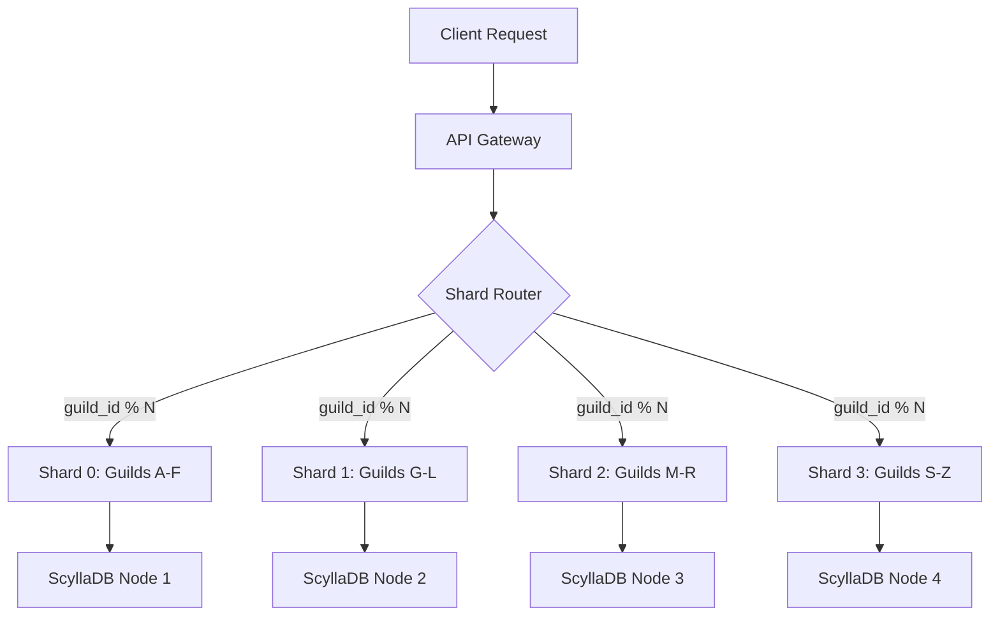
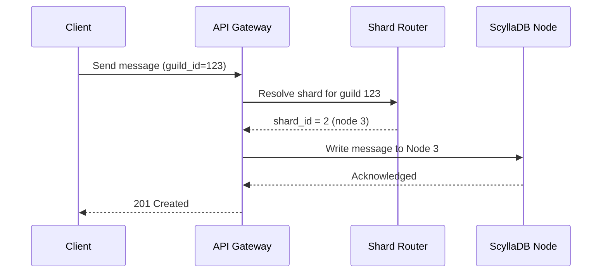

# Chapter 5: Data Partitioning and Sharding

---
## Learning Objectives

- Distinguish between vertical and horizontal partitioning and identify appropriate use cases for each
- Analyze range-based, hash-based, and directory-based sharding strategies with respect to data distribution and access patterns
- Implement consistent hashing with virtual nodes and explain its advantage during node additions and removals
- Diagnose hotspot problems including the celebrity problem and apply mitigation strategies such as split, secondary keys, and read replication
- Evaluate cross-shard query patterns including scatter-gather, distributed joins, and secondary index architectures
- Design compound shard keys and database-per-service decompositions using real-world case studies

---
## Theory


### Partitioning Fundamentals

Partitioning is the process of splitting a large dataset into smaller, independent subsets that can be stored and queried separately. The two primary forms are vertical partitioning and horizontal partitioning (sharding).

**Vertical Partitioning** splits a table by columns. Frequently accessed columns are placed in one partition, while less frequently accessed or larger columns (BLOBs, text) reside in another. This is natural in normalized database design — each normalized table is effectively a vertical partition of the logical entity.

```
Vertical Partition:
  Users_Core:    user_id | name | email | created_at
  Users_Profile: user_id | bio | avatar_url | preferences
  Users_Auth:    user_id | password_hash | last_login
```

The advantage is reduced I/O for common queries (scanning fewer bytes per row) and improved cache hit rates. The disadvantage emerges when queries frequently need to join across partitions — every cross-partition access adds latency.

**Horizontal Partitioning (Sharding)** splits a table by rows. Each shard holds a subset of rows but retains the full schema. The goal is to distribute both storage and query load across multiple database nodes.

```
Shard 0:    user_id 1..1000000
Shard 1:    user_id 1000001..2000000
Shard 2:    user_id 2000001..3000000
```

### Sharding Strategies

#### Range-Based Sharding

Rows are assigned to shards based on a contiguous range of the shard key. For a key `k` and shard boundaries `[b0, b1, b2, ..., bn]`, row with key `k` belongs to shard `i` where `bi <= k < bi+1`.

```
Shard Key: timestamp (month)
  Shard 0:  Jan 2024
  Shard 1:  Feb 2024
  Shard 2:  Mar 2024
```

**Advantages:** Range queries are efficient — a query for `WHERE created_at BETWEEN date1 AND date2` can be routed to a single shard. Shard boundaries are human-readable and easy to reason about. Sequential keys maintain physical locality.

**Disadvantages:** Hotspots are predictable. If the shard key is monotonically increasing (auto-increment IDs, timestamps), all writes hit the last shard while earlier shards sit idle. Range-based sharding also suffers from data skew — one shard may hold 80% of the data if the key distribution is uneven.

#### Hash-Based Sharding

A hash function `h(k)` maps each key to a shard: `shard_id = h(k) % N` where `N` is the number of shards.

```
h(user_id) = CRC32(user_id) % 4
  user_id = 100  → CRC32(100) % 4 = 2 → Shard 2
  user_id = 101  → CRC32(101) % 4 = 0 → Shard 0
  user_id = 102  → CRC32(102) % 4 = 3 → Shard 3
  user_id = 103  → CRC32(103) % 4 = 1 → Shard 1
```

**Advantages:** Uniform distribution — a good hash function spreads keys evenly across shards regardless of the input distribution. Writes are spread evenly across all nodes, eliminating the monotonically-increasing-key problem.

**Disadvantages:** Range queries become scatter-gather operations — the system must query every shard because adjacent keys hash to different shards. Adding or removing a shard changes `N`, which remaps almost every key, triggering massive data migration (this is the *resharding problem*).

#### Directory-Based Sharding

A lookup service maintains a mapping from key range to shard. The directory (also called a partition map) is a separate, highly-available store.

```
Directory Entry:
  key_range: [A-D] → shard_0
  key_range: [E-H] → shard_1
  key_range: [I-L] → shard_2
  ...
```

To find a row, the system queries the directory first, then routes to the appropriate shard. The directory itself must be replicated and fault-tolerant.

**Advantages:** Maximum flexibility — shard assignments can be changed without affecting the data layout. Fine-grained control over data placement (hot data can be moved to faster nodes).

**Disadvantages:** The directory becomes a potential bottleneck and single point of failure. Every read requires an additional lookup (two round trips), increasing latency. The directory must be kept consistent with actual shard contents.

### Consistent Hashing

Consistent hashing solves the resharding problem by arranging both keys and nodes on a conceptual hash ring.

**Construction:** Both the shard key `k` and each node identifier `n` are hashed to positions on a circular space `[0, 2^m - 1]`. A key is assigned to the first node encountered by walking clockwise from its hash position.

```
Ring: [0, 2^32 - 1]
  Node A at hash("node-a") % 2^32 = 1000
  Node B at hash("node-b") % 2^32 = 5000
  Node C at hash("node-c") % 2^32 = 9000

  key K1 at hash("k1") = 3000 → stored at Node B (clockwise from 3000)
  key K2 at hash("k2") = 7000 → stored at Node C
  key K3 at hash("k3") = 9500 → stored at Node A (wraps around)
```

**Effect of Node Removal:** When Node B leaves, only keys in the range `[A, B)` need to be reassigned (they move to C). The expected fraction of keys moved is `1/N`.

**Effect of Node Addition:** When a new Node D is added, it claims keys in the range between its predecessor and itself. Only those keys need migration. Expected fraction is again `1/N`.

#### Virtual Nodes

Without virtual nodes, consistent hashing produces uneven load — some nodes own larger ring segments than others, especially with few nodes. Virtual nodes (vnodes) solve this by hashing each physical node multiple times with different suffixes:

```
Physical Node A:
  vnode A_0 at hash("node-a-0")
  vnode A_1 at hash("node-a-1")
  vnode A_2 at hash("node-a-2")
  ... (e.g., 150 vnodes per physical node)
```

Each physical node maintains approximately `v * K / N` keys where `v` is the number of virtual nodes per physical node, `K` is the total number of keys, and `N` is the number of physical nodes. With 100+ vnodes per physical node, the load distribution approaches perfectly uniform. When a physical node is added or removed, the load change is spread evenly across all other nodes (each other node gives up roughly `1/N` of its keys).

### Rebalancing

Systems evolve: shards grow hot, nodes fail, clusters expand. Rebalancing is the process of redistributing data across shards to maintain balance.

#### Moving Shards

The simplest rebalancing operation is moving an entire shard from one node to another. During the move, the shard is marked as *migrating*. Reads are served from the source; writes go to both source and destination. Once the destination catches up, the directory atomically switches to the new location.

#### Splitting a Shard

A hot shard can be split into two shards at a new boundary point:

```
Before split:
  Shard 0: user_id 1..1000000  (80% of writes)

After split:
  Shard 0a: user_id 1..500000
  Shard 0b: user_id 500001..1000000
```

Hash-based systems implement splitting by changing the hash function granularity. Consistent hashing naturally supports splitting — the hot spot on the ring can be divided by introducing a new vnode boundary.

#### Adding and Removing Nodes

When a new node joins a cluster using range-based sharding, existing shard boundaries must be recomputed. This is expensive because it typically requires moving data proportional to the total dataset size.

Consistent hashing reduces this to `1/N` of total data. Directory-based sharding requires only updating the directory entries.

### Hotspot Mitigation

Hotspots occur when a small subset of data receives a disproportionate share of requests.

#### The Celebrity Problem

A social media platform with user-based sharding hosts a celebrity with millions of followers. Every post by this celebrity generates reads against a single shard, overwhelming it.

**Mitigation strategies:**

1. **Split:** Further partition the celebrity's data. Partition their posts by time range, or use a sub-shard key (e.g., `user_id + post_id % 10` to spread across 10 sub-shards).

2. **Secondary Keys:** Read queries for the celebrity's content can be load-balanced across replicas. Each shard has read replicas; celebrity reads are routed to replicas while writes go to the primary.

3. **Cache Layer:** Put a cache (Redis, Memcached) in front of the shard. Celebrity content is read once from the database and served from cache for subsequent requests, reducing the load on the shard.

4. **Fan-out on Write:** Instead of having followers read from the celebrity's shard, write the post to each follower's timeline (home timeline fan-out). This distributes writes across many shards but increases write amplification.

```
Without Fan-out:
  Celebrity posts → shard holds celebrity data → millions read from same shard
With Fan-out:
  Celebrity posts → fan-out service → writes to each follower's shard
  Each follower reads from their own shard (evenly distributed)
```

### Cross-Shard Queries

#### Scatter-Gather

When a query's predicate does not include the shard key, the system must send the query to every shard (scatter) and then merge the results (gather).

```
SELECT * FROM users WHERE email = 'alice@example.com';
  → Query sent to Shard 0, Shard 1, Shard 2, Shard 3
  → Each shard returns matching rows
  → Coordinator merges results
  → Returns to client
```

Scatter-gather is expensive — response time is limited by the slowest shard (tail latency). The coordinator must handle partial failures (a shard times out) and deduplication.

#### Distributed Joins

Joining data across shards requires one of several strategies:

1. **Parallel Join:** Each shard performs the join locally on its own data slice. The coordinator merges partial results. This works when both tables are sharded on the join key.

2. **Broadcast Join:** Small dimension tables are broadcast to all shards, which perform the join locally. Common in data warehouses.

3. **Cross-Shard Join via Scatter-Gather:** Data from one table is fetched from all shards, then joined with data from the other table at the coordinator. This is slow and memory-intensive.

4. **Application-Level Join:** The application queries each shard independently and performs the join in application code.

```
Shard-local join (efficient):
  orders(user_id) SHARDED_BY(user_id)
  users(user_id)  SHARDED_BY(user_id)
  → SELECT * FROM orders JOIN users ON orders.user_id = users.user_id
  → Each shard returns complete join results for its user_id range

Cross-shard join (expensive):
  orders(user_id) SHARDED_BY(user_id)
  payments(tx_id) SHARDED_BY(tx_id)
  → Must scatter-gather payments, fetch corresponding orders, join at coordinator
```

### Secondary Indexes

A secondary index is an index on a non-shard-key column. Two architectures exist:

#### Local Secondary Index

Each shard maintains its own index covering only the data on that shard. Queries using the secondary index must be scattered to all shards.

```
Shard 0: orders_0 table + local_idx on email
Shard 1: orders_1 table + local_idx on email
Query: SELECT * FROM orders WHERE email = 'x@y.com'
  → Scatter to Shard 0 and Shard 1
  → Each returns matching rows from its local index
```

**Pros:** Writes are fast (index update is local). No cross-shard coordination.

**Cons:** Reads using the index require scatter-gather, which is slow and unpredictable.

#### Global Secondary Index

A separate index table is maintained across all shards, typically sharded on the indexed column. The index entry points back to the primary row.

```
Global index on email:
  email 'x@y.com' → PK order_id=42 → Shard 2

Query:
  1. Look up email in index (targets one shard by email hash)
  2. Follow pointer to primary row on Shard 2
```

**Pros:** Point lookups on the secondary key are efficient (single shard).

**Cons:** Writes require a two-phase commit across the primary shard and the index shard. The index can fall out of sync if not properly maintained.

### Compound Shard Keys

A compound shard key combines multiple columns to improve data locality for common query patterns.

**Example:** A messaging app shards by `(workspace_id, channel_id, message_id)`.

```
Shard Key: (workspace_id, channel_id, message_id)

Query: Messages in channel #general of workspace "acme"
  → WHERE workspace_id = 'acme' AND channel_id = 'general'
  → Calculates hash of (acme, general) → targets single shard

Query: All messages in workspace "acme"
  → WHERE workspace_id = 'acme'
  → Targets subset of shards (scatter within workspace range only)
```

The order of columns in the compound key matters. The leftmost column is the primary distribution key. Columns to the right serve as clustering keys within the shard. Compound keys enable hierarchical sharding where the first column determines the shard and subsequent columns enable efficient range scans within that shard.

### Database per Service Pattern

In microservice architectures, each service owns its data exclusively. This is the *Database per Service* pattern.

```
Order Service        → order-db (MySQL shard 0..N)
User Service         → user-db (MySQL shard 0..M)
Inventory Service    → inventory-db (PostgreSQL shard 0..K)
Payment Service      → payment-db (Aurora, single instance)
```

**Advantages:**
- Services are independently deployable and scalable
- Each service can choose the optimal database technology (polyglot persistence)
- Data is encapsulated behind the service boundary
- Failures in one service's database do not affect others

**Challenges:**
- Queries that span services require orchestration or API composition
- Transactions across services must use the Saga pattern (two-phase commit is impractical)
- Data duplication and synchronization become necessary

---
## Examples

### Example 1: Instagram Sharding by User ID

Instagram, at scale, shards its core database by `user_id`. The system uses a distributed ID generator (similar to Snowflake) to produce 64-bit user IDs that encode time, shard ID, and sequence number.

```
Instagram User ID (64-bit):
  | 41 bits timestamp | 13 bits shard ID | 10 bits sequence |
```

When a user uploads a photo, the system computes `shard_id = user_id >> 10 % N` (extracting the shard bits from the ID). All data for that user — photos, comments, likes, profile — resides on the same shard. This ensures that the common query "load my feed" touches only one shard.

**Hotspot handling:** When a celebrity posts, the fan-out-on-write approach distributes the post to followers' timelines. Each follower reads from their own shard, avoiding the celebrity shard read storm.

```
User A (shard 5) posts a photo:
  → Insert photo row into shard 5
  → Fan-out service writes photo_id to each follower's shard: timeline table

User B (shard 12) opens app:
  → SELECT * FROM timeline WHERE user_id = B ORDER BY created_at DESC LIMIT 50
  → Single shard query, fast
```

### Example 2: Pinterest Sharding by Board

Pinterest originally used a single MySQL instance, then migrated to sharded MySQL with board-level sharding. The shard key is `board_id`. Pins are stored with their board_id, ensuring that "view this board" queries are single-shard.

```
Board "Travel" (board_id = 42) → Shard 7
  Pin 1 (board_id = 42) → Shard 7
  Pin 2 (board_id = 42) → Shard 7
  Pin 3 (board_id = 42) → Shard 7
```

Pinterest uses range-based sharding with dynamic shard splitting. When a shard grows too large or too hot, it is split at a board boundary — all pins for a given board always stay together.

**Reads per second per shard:**

```
Shard 7 (Travel board): 15,000 reads/s → split
  After split:
  Shard 7a: board_id 30-42 → 8,000 reads/s
  Shard 7b: board_id 43-55 → 7,000 reads/s
```

Pinterest also caches board data in Redis. Board pages are the most common access pattern, so the cache hit rate exceeds 90% for popular boards.

### Example 3: Discord Sharding

Discord shards by `guild_id` (server ID). All messages, members, and channels for a server reside on a single shard.

```
guild_id = 123456789 → shard_id = guild_id >> 22 % N

Shard topology (early Discord):
  1 MySQL primary + replicas → then Cassandra (hash-based) → now ScyllaDB
```

Discord's sharding faces the *server size skew* problem. Some servers (e.g., gaming communities with millions of members) are orders of magnitude larger than the median server. Their shard handles disproportionately more messages.

**Mitigation:** Discord implemented *shard splitting* — the largest servers can be further partitioned by channel_id within the guild. Channel-level routing is configured in a routing table:

```
Large Guild "FortniteOfficial":
  General chat (channel_id = 111) → Sub-shard 0 (Scylla node 12)
  LFG chat     (channel_id = 222) → Sub-shard 1 (Scylla node 15)
  Memes        (channel_id = 333) → Sub-shard 2 (Scylla node 18)
```

Discord uses consistent hashing to distribute guilds across ScyllaDB nodes. When nodes are added, approximately `1/N` of guilds are moved.





---
## Summary

- Vertical partitioning splits by columns for I/O and cache efficiency; horizontal partitioning (sharding) splits by rows for distributed scale
- Range-based sharding offers efficient range queries but suffers from hotspots and data skew from monotonically increasing keys
- Hash-based sharding distributes writes uniformly but breaks range queries and amplifies the cost of resharding
- Consistent hashing with virtual nodes limits data movement to `O(1/N)` when nodes join or leave, enabling elastic scaling
- Directory-based sharding provides maximum flexibility at the cost of an additional lookup hop and a single-coordinator risk
- Hotspots require mitigation through splitting, secondary keys with replication, caching, or fan-out-on-write strategies
- Cross-shard queries use scatter-gather which is limited by tail latency; distributed joins are efficient only when both tables share the shard key
- Global secondary indexes enable fast point lookups on non-shard-key columns but add write-time coordination overhead
- Compound shard keys encode hierarchical access patterns to minimize cross-shard queries
- Database per service pattern enables independent scaling and polyglot persistence at the cost of cross-service consistency complexity

---
## Exercises

### Review Questions

1. A social network uses range-based sharding on `user_id` (auto-increment). New users sign up at 100/second. Why does this create a hotspot, and what sharding strategy would you use instead?

2. In consistent hashing with 100 virtual nodes per physical node and 10 physical nodes, what fraction of keys are expected to move when a physical node fails? Explain the math.

3. Describe the difference between a local secondary index and a global secondary index. Under what query patterns does each perform poorly?

4. A messaging system shards by `(workspace_id, channel_id)`. A user wants to search all messages they've sent across all channels in their workspace. Which shards does this query hit? How would you optimize it?

### Application Problems

1. **Shard Rebalancing Simulation:** You have 4 nodes with the following key distribution using range-based sharding: Node 0 (keys A-F), Node 1 (G-M), Node 2 (N-S), Node 3 (T-Z). Node 2 becomes overloaded at 85% capacity while Node 1 is at 30%. Design a rebalancing plan. Describe which ranges move, how you manage data during migration, and what the final distribution looks like.

2. **Consistent Hash Implementation:** Given a hash ring with nodes at positions 10, 25, 40, 60, 85 on a 0-100 ring, and keys hashing to positions 5, 15, 22, 38, 42, 55, 70, 90, determine which node stores each key. Then add a node at position 50. Which keys move? What fraction of total keys does this represent?

3. **Celebrity Problem Design:** A social platform has 100 database shards. A celebrity with 50 million followers posts twice per day. Each post generates 500 KB of content. Design a system that prevents the celebrity's shard from being overwhelmed. Specify your caching strategy, any data replication, and the read/write path for a follower viewing the post. Calculate the estimated QPS reduction on the database shard.

### Challenge Problem

**Distributed Shard Migration at Scale**

Design a shard rebalancing system for a real-time multiplayer game with the following constraints:

- 200 million users, 50 shards, each shard 400 GB
- Each shard handles approximately 50,000 writes/second and 200,000 reads/second
- Shard key is `player_id` (hash-based, 50 shards)
- The system is growing: you need to add 10 new shards to handle load

Your design must:
1. Specify the rebalancing algorithm (consistent hashing with virtual nodes, or a two-phase split)
2. Calculate the total data that must be migrated (in TB and as a fraction of total)
3. Design the migration protocol: how do you ensure reads and writes are served correctly during migration?
4. Calculate the minimum time required for migration given a 10 Gbps network link per node
5. Include a rollback plan if the migration fails mid-way through
6. Identify the monitoring metrics (at least 5) that would indicate the migration is progressing safely

Provide a timeline diagram showing the phases of the migration from start to completion.

---
