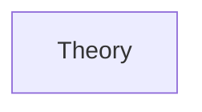
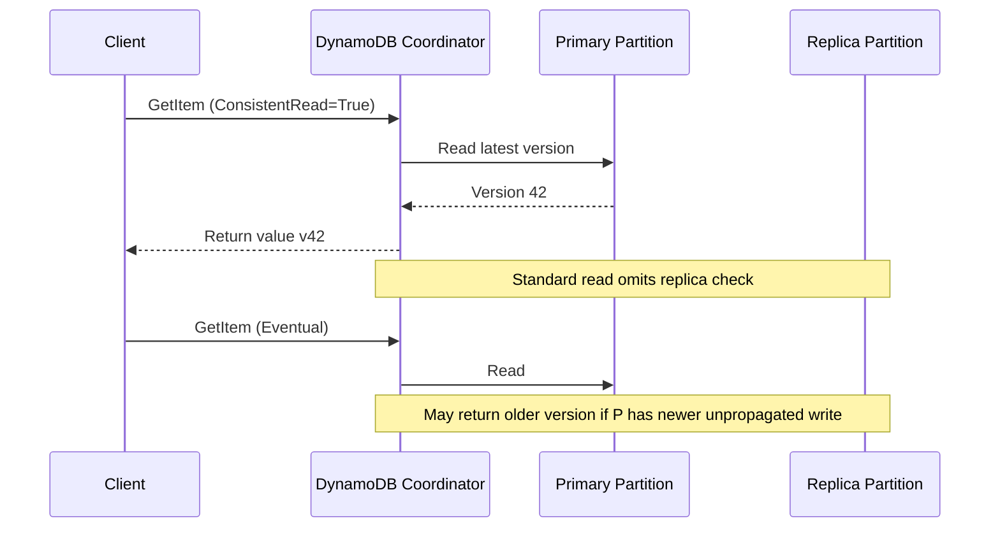
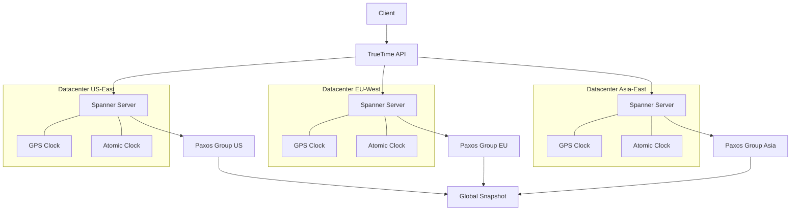

# Chapter 6: CAP Theorem and Distributed Consistency
> **Previous:** [05 Partitioning Sharding](./05-partitioning-sharding.md) | **Next:** [07 Message Queues](./07-message-queues.md)

---
## Learning Objectives

- Prove the CAP theorem using Gilbert and Lynch's argument and explain its practical implications for distributed system design
- Extend the CAP framework with PACELC to capture trade-offs during normal operation
- Distinguish strong, eventual, causal, and external consistency models with concrete operational examples
- Design quorum systems using the `W + R > N` inequality and analyze how different quorum configurations affect read/write latency and consistency
- Implement conflict-free replicated data types including G-Counter, PN-Counter, and OR-Set
- Apply Lamport clocks and vector clocks to order events in distributed systems, and detect concurrent updates
- Explain how Merkle trees enable efficient anti-entropy and how the Chandy-Lamport algorithm captures consistent global snapshots

---
## Chapter at a Glance

| Aspect | Details |
|--------|---------|
| **Scope** | Consistency models, CAP theorem, consensus, distributed transactions |
| **Key Concepts** | Strong vs eventual consistency, linearizability, serializability |
| **CAP Theorem** | Consistency, Availability, Partition Tolerance ? choose two |
| **Consensus** | Paxos, Raft, Zab ? how distributed systems agree on state |
| **Distributed Transactions** | 2PC, SAGA, TCC patterns for multi-node atomicity |
| **Real-World** | Google Spanner, etcd, ZooKeeper, Cosmos DB |

---
## Chapter Roadmap



## Theory
> **One-Sentence Takeaway:** Theory is the foundation ? master it before moving to examples and exercises.


### The CAP Theorem

> **Pro Tip:** Master this concept thoroughly ? it is frequently tested in system design interviews.

> **Pro Tip:** Master this concept ? it appears in nearly every system design interview. Understand both the how and the why.

> **Warning:** A common mistake is over-engineering. Always start simple and add complexity only when justified by requirements.

> **Pro Tip:** Master this concept thoroughly ? it appears in nearly every system design interview.
The CAP theorem, formalized by Seth Gilbert and Nancy Lynch in 2002, states that a distributed data store can simultaneously provide at most two of three guarantees: Consistency, Availability, and Partition Tolerance.

**Definitions:**

- **Consistency (C):** Every read receives the most recent write or an error. All nodes see the same data at the same time. This is *linearizability* — operations appear to execute atomically at a single instant between invocation and response.
- **Availability (A):** Every request receives a non-error response, without guarantee that it contains the most recent write. The system continues to function even when nodes are down.
- **Partition Tolerance (P):** The system continues to operate despite an arbitrary number of messages being dropped or delayed between nodes (network partition).

#### Gilbert and Lynch's Proof

Assume a system with two nodes, G1 and G2, each storing value `v0`.

```
Initial state: v0 on G1, v0 on G2
Time t0: Client writes v1 to G1
Time t1: Network partition occurs between G1 and G2
Time t2: Client reads from G2 ? G2 still has v0
```

During a partition:
- If the system returns v0 from G2, it is available but not consistent (G1 has v1).
- If the system refuses to return a value from G2 (blocks until partition heals), it is consistent but not available.
- The system cannot be both consistent and available during a partition.

Therefore: during a network partition, you must choose between consistency and availability.

#### CAP Misconceptions

The CAP theorem is often misunderstood. Key clarifications:

1. **CAP is about partitions.** In the absence of partitions (the normal case), you can have both C and A. The choice only matters when failures occur.

2. **CAP is not 2-out-of-3.** You don't "pick two" at design time. You design for consistency or availability when partitions happen. Most systems choose CP or AP.

3. **CAP ignores latency.** Partition-like behavior can occur even without a network cut — if two datacenters are connected by a high-latency link, a synchronous write may time out, forcing a choice between consistency and availability.

### PACELC Extension

> **Warning:** Avoid over-engineering. Start simple, measure, then optimize.

> **Warning:** Avoid premature optimization. Start simple, measure, then optimize. Over-engineering is the most common system design mistake.

Daniel Abadi proposed PACELC in 2010 to capture what happens *during* partitions and *during normal operation*:

**PACELC:** If there is a Partition (P), choose between Availability (A) and Consistency (C); Else (E), choose between Latency (L) and Consistency (C).

```
PACELC Trade-off Space:
  DynamoDB:               PA/EL  (prioritize availability and low latency)
  Bigtable/Spanner:       PC/EC  (prioritize consistency)
  Cassandra:              PA/EL  (tunable, defaults to available)
  PNUTS (Yahoo!):         PC/EL  (consistent during partition, latency during normal ops)
```

This captures the real design space: even when no partition exists, systems choose between low latency (eventual consistency) and strong consistency (higher latency due to coordination).

### Consistency Models

> **Remember:** Always articulate trade-offs clearly ? interviewers value reasoning over the "right" answer.

> **Remember:** Trade-offs are the heart of system design. Always be ready to explain why you chose X over Y.

#### Strong Consistency (Linearizability)

All operations appear to execute atomically in a global order consistent with real time. After a write completes, all subsequent reads (from any node) return the written value.

```
Client 1: write(x=1) ? ACK
             ? time
Client 2: read(x) ? returns 1 (guaranteed)
Client 3: read(x) ? returns 1 (guaranteed)
```

**Implementation:** Requires majority acknowledgment before returning to the client. In a quorum system, a write must reach `W` nodes and a read must reach `R` nodes such that `W + R > N`.

**Cost:** Higher latency — every write must coordinate with multiple nodes. During failures, the system may become unavailable (CP sacrifice).

#### Sequential Consistency

Operations appear in program order per process, but the global order does not need to match real time. Reads may return stale values in some cases.

```
Process 1: write(x=1) ? write(x=2)
Process 2: read(x) ? 2
Process 3: read(x) ? 1 (allowed, even if later in real time)
```

Sequential consistency is weaker than linearizability but easier to implement efficiently.

#### Causal Consistency

Writes that are causally related (one depends on another) must be seen in the same order by all processes. Concurrent writes (no causal relationship) can be seen in different orders.

```
Related writes (causal):
  Process 1: write(x=1) ? write(y=x+1)
  Process 2: read(y) ? 2 implies read(x) ? 1

Concurrent writes (no causal relationship):
  Process 1: write(x=1)
  Process 2: write(x=2)
  Process 3: read(x) ? 1 or 2 (either is valid)
```

Causal consistency captures the *happens-before* relationship. It is typically implemented using vector clocks.

#### Eventual Consistency

If no new updates are made to a data item, eventually all reads will return the last updated value. There is no time bound — the system converges eventually.

```
Write to Node A: x=42
... time passes ...
Read from Node B: x=0 (stale)
Read from Node C: x=42 (converged)
Read from Node B: x=42 (finally converged)
```

Eventual consistency is the weakest model. It provides the best availability and latency because reads and writes can complete without waiting for other nodes. However, application complexity increases — developers must handle stale reads and resolve conflicts.

**Convergence requires conflict resolution.** Two widely used approaches:

1. **Last-Writer-Wins (LWW):** Each write carries a timestamp; the write with the highest timestamp wins. Simple but may lose data (two concurrent writes to different fields of the same record).

2. **CRDTs:** Conflict-Free Replicated Data Types that mathematically guarantee convergence without coordination.

### Quorum Systems

A quorum is the minimum number of nodes that must participate in a read or write operation for it to be valid. In a system with `N` replicas, a read quorum `R` and write quorum `W` satisfy:

**`W + R > N`**

This ensures that any read quorum intersects with any write quorum — at least one node holds the latest write.

#### Quorum Configurations

| Configuration | R | W | Consistency Level | Characteristics |
|---|---|---|---|---|
| Strong | N | N | Strong | Highest latency, lowest availability |
| Write-fast | 1 | N | Strong | Reads are slow (must read all nodes) |
| Read-fast | N | 1 | Strong | Writes are slow (must write all nodes) |
| Quorum | R+W>N | R+W>N | Strong | Balanced, e.g., N=3, R=2, W=2 |
| Write-all | 1 | N | Not applicable without R=N | Write latency = slowest node |
| Eventual | 1 | 1 | Weak | Highest availability, lowest consistency |

**Proof of quorum intersection:** Given `W` nodes written and `R` nodes read, the write set and read set must overlap because `|WriteSet| + |ReadSet| = W + R > N = |TotalSet|`. The pigeonhole principle guarantees at least one node is in both sets.

**Proof of consistency:** After a write completes at `W` nodes, a subsequent read of `R` nodes must include at least one node from the write set. That node returns the latest value. Therefore the read observes the written value (or a more recent one).

**Example with N=5:**

```
N=5, W=3, R=3
Write to nodes: {1, 2, 3} ? ACK after 3 responses
Read from nodes: {3, 4, 5} ? reads latest value from node 3 (intersection)
```

#### Read Repair

When a read discovers a stale value (the read quorum found at least one node behind), the system writes the latest value back to the stale node during the read path. This repairs inconsistency proactively.

```
Read path:
  1. Send read request to R nodes
  2. Compare versions; latest = v3
  3. Return v3 to client
  4. Background: send v3 to any nodes that returned stale values
```

#### Hinted Handoff

When a write target node is unavailable, the coordinator picks an alternative node and stores the write with a *hint* indicating the intended recipient. When the downed node recovers, the hinted write is forwarded.

```
Intended target: Node 3 (down)
  ? Coordinator writes to Node 5 with hint: "this belongs to Node 3"
  ? When Node 3 recovers, Node 5 delivers the write
```

Hinted handoff improves availability — writes succeed even when some replicas are temporarily unavailable. However, it can weaken consistency guarantees if the hint is lost before delivery.

### Gossip Protocol

Gossip protocols (also called epidemic protocols) disseminate information through a system in a manner analogous to the spread of an infection.

#### Infection-Style Gossip

Each node periodically contacts one or more randomly selected nodes and exchanges state information.

```
Round 1: Node A infects Node C
Round 2: Node A infects Node B, Node C infects Node D
Round 3: All 4 nodes infected

Growth rate: O(log N) rounds to infect all N nodes
```

**Fanout:** If each node contacts `f` peers per round, the system converges in `O(log_f N)` rounds. With fanout=1, convergence takes `O(log N)` rounds; with fanout=3, it takes `O(log_3 N)`.

**Message complexity per round:** `O(N)` for the whole system (each of N nodes sends to f peers).

#### SWIM Protocol

SWIM (Scalable Weakly-consistent Infection-style Process Group Membership Protocol) combines gossip with a failure detection mechanism.

**SWIM operates in two components:**

1. **Failure Detector:** Each node periodically picks a random member and sends a ping. If the ping times out, the node sends indirect pings through k other nodes to confirm the failure. After confirmation, the node is declared failed.

2. **Dissemination Component:** Membership updates (joins, leaves, failures) are propagated via gossip — each piggyback update is attached to the ping/pong messages.

```
Node A ? ping ? Node B (random target)
  If B responds ? continue
  If B times out:
    A ? ping ? C ? Node B (indirect)
    C ? ack ? A (confirmed or not)
  If confirmed failed: A updates membership, gossips to D, E, F
```

SWIM converges membership information in `O(log N)` rounds and detects failures with high probability within a configurable timeout period.

### CRDTs (Conflict-Free Replicated Data Types)

CRDTs are data structures that can be replicated across multiple nodes and updated concurrently without coordination, yet still converge to the same state. Two flavors exist: **operation-based (CvRDT)** and **state-based (CmRDT)**.

#### G-Counter (Grow-Only Counter)

A G-Counter supports only increment operations. Each node maintains its own count; the total is the sum across all nodes.

```
G-Counter state: {node_0: 3, node_1: 5, node_2: 2}
Total value: 3 + 5 + 2 = 10

Operation: increment()
  ? node_i.counter += 1

Merge (state-based):
  new_counters[i] = max(local[i], remote[i]) for each i
```

```python
class GCounter:
    def __init__(self, node_id, n_nodes):
        self.node_id = node_id
        self.counters = [0] * n_nodes

    def increment(self):
        self.counters[self.node_id] += 1

    def value(self):
        return sum(self.counters)

    def merge(self, other):
        for i in range(len(self.counters)):
            self.counters[i] = max(self.counters[i], other.counters[i])
```

The G-Counter converges because max is commutative, associative, and idempotent (a CRDT requirement).

#### PN-Counter (Positive-Negative Counter)

A PN-Counter extends the G-Counter to support both increment and decrement. It uses two G-Counters internally: one for increments, one for decrements.

```python
class PNCounter:
    def __init__(self, node_id, n_nodes):
        self.p = GCounter(node_id, n_nodes)  # increments
        self.n = GCounter(node_id, n_nodes)  # decrements

    def increment(self):
        self.p.increment()

    def decrement(self):
        self.n.increment()

    def value(self):
        return self.p.value() - self.n.value()

    def merge(self, other):
        self.p.merge(other.p)
        self.n.merge(other.n)
```

#### OR-Set (Observed-Remove Set)

An OR-Set supports add and remove operations. Elements are tagged with unique identifiers and a "remove-side" tombstone list.

```python
class ORSet:
    def __init__(self):
        self.elements = {}  # element ? set of unique tags

    def add(self, element, tag):
        if element not in self.elements:
            self.elements[element] = set()
        self.elements[element].add(tag)

    def remove(self, element):
        # Remove all tags for this element (marks for deletion)
        self.elements[element] = set()

    def value(self):
        return {e for e, tags in self.elements.items() if tags}

    def merge(self, other):
        for element, other_tags in other.elements.items():
            if element in self.elements:
                self.elements[element] |= other_tags
            else:
                self.elements[element] = set(other_tags)
```

Two concurrent `add("x")` operations produce the same result as one `add("x")` — the union of tags converges. A concurrent add and remove: if the remove has seen the add's tag, the element stays removed; otherwise the remove is ignored.

### Logical Clocks

Physical clocks are unreliable in distributed systems — clock skew can produce incorrect orderings. Logical clocks capture causality without relying on synchronized wall clocks.

#### Lamport Clocks

Each process maintains an integer counter. On each event, the counter increments. Messages carry the sender's timestamp. The receiver updates `C = max(C, timestamp) + 1`.

```
Process P1:        Process P2:
C=0                 C=0
C=1 (internal)      ? receives msg with timestamp 1 ? C=max(0,1)+1=2
C=2 (send msg)      C=3 (internal)
                    C=4 (send msg)
? receives ts 4 ? C=max(2,4)+1=5
```

**Property:** If `a happens-before b` (causal relationship), then `C(a) < C(b)`. However, `C(a) < C(b)` does NOT imply `a happens-before b` — Lamport clocks cannot detect concurrent events.

#### Vector Clocks

Each process maintains a vector of counters — one entry per process. Updates track causality more precisely.

```
Process P1:        Process P2:
[0,0,0]            [0,0,0]
[1,0,0] (internal)
[2,0,0] (send msg)

? P2 receives: [2,0,0] ? max([0,0,0],[2,0,0])+1 = [2,1,0]
[2,1,0] (internal)
[2,2,0] (send msg to P3)

? P3 receives: [2,2,0] and [0,0,1] (concurrent self-event)
  max([2,2,0],[0,0,1])+1 = [2,2,1]
```

**Comparison rules:**
- V(a) <= V(b) if for all i, V(a)[i] <= V(b)[i]
- V(a) < V(b) if V(a) <= V(b) and V(a) != V(b) (causal order)
- V(a) || V(b) if neither <= the other (concurrent)

**Use in Dynamo-style databases:** Vector clocks track version branches. When a read returns multiple conflicting versions (from different causally concurrent writes), the application must resolve them.

### Merkle Trees for Anti-Entropy

A Merkle tree is a hash tree where leaf nodes contain hashes of data blocks and internal nodes contain hashes of their children. The root hash summarizes the entire data set.

```
        Root = H(H01 + H23)
       /                  \
    H01=H(H0+H1)    H23=H(H2+H3)
    /       \          /       \
  H0=H(D0)  H1=H(D1)  H2=H(D2) H3=H(D3)
```

**Anti-entropy protocol:**

1. Each replica maintains a Merkle tree of its key range.
2. Replicas periodically exchange root hashes.
3. If root hashes differ, they recursively descend to find which subtrees differ.
4. Only the leaf-level differences (actual key-value pairs) are transferred.

**Efficiency:** With N keys in a range, the expected number of exchanged hashes is O(log N) for comparing trees, and O(D * log N) for finding D differences. Without Merkle trees, two replicas would need to compare all N keys (O(N)).

**Use in Dynamo:** Each node maintains a Merkle tree per key range. The tree depth is configurable — a depth-16 tree for 2^16 keys means only 16 hashes are exchanged to detect differences in that entire range. Once a mismatch is found at a specific hash level, the nodes drill down to the exact differing keys.

### Distributed Snapshots (Chandy-Lamport Algorithm)

The Chandy-Lamport algorithm captures a consistent global snapshot of a distributed system without halting computation. A *consistent cut* includes all events that happened-before the snapshot, but no events that depend on events after the snapshot.

#### Algorithm

1. **Initiator:** A process records its local state and sends a marker message on all outgoing channels.

2. **Marker reception rules:**
   - If a process receives a marker on channel C and has not yet recorded its state:
     - It records the channel state of C as empty
     - Records its local state
     - Sends markers on all outgoing channels
   - If a process has already recorded its state:
     - Records the channel state of C as all messages received since the state was recorded

3. **Termination:** When all processes have received markers and recorded channel states, the snapshot is complete.

```
Initial state:
  P1 ? [msg1] ? P2 ? [msg2] ? P3

Snapshot initiated by P1:
  Step 1: P1 records state S1, sends marker M1 on outbound channel
  Step 2: P2 receives marker on incoming channel from P1
          ? Records incoming channel from P1 as empty (no in-flight messages)
          ? Records local state S2
          ? Sends M2 on outbound channel to P3
  Step 3: P3 receives M2
          ? Records incoming channel from P2 as empty
          ? Records state S3

Global snapshot = {S1, S2, S3, channel_states}
```

The snapshot is *consistent*: it respects happened-before relationships. No message is recorded as received but not sent, or sent but not recorded if it should have been received before the cut.

---
## Examples

### Example 1: DynamoDB Tunable Consistency

Amazon DynamoDB, derived from the Dynamo paper, offers tunable consistency levels:

```
Consistency Levels:
  EVENTUAL:     R=1, W=1 (fastest, weakest)
  STRONG:       R=N, W=N (slowest, strongest) — not available in standard DynamoDB
  CONSISTENT_READ: R=1 with read-after-write consistency guarantee via coordinator
```

DynamoDB actually offers **read-after-write consistency** for `ConsistentRead` mode. This is achieved by routing reads to the partition that holds the authoritative copy. The trade-off: consistent reads use half the throughput of eventually consistent reads.

```python
# Eventually consistent read (default)
response = table.get_item(Key={'user_id': '123'})
# May return stale data, but lower latency and higher throughput

# Strongly consistent read
response = table.get_item(
    Key={'user_id': '123'},
    ConsistentRead=True
)
# Returns latest write, higher latency, consumes 2x read capacity
```

**Latency comparison (p99):**

| Consistency | Read Latency | Write Latency | Throughput |
|---|---|---|---|
| Eventual | 5ms | 5ms | 100% |
| Strong | 10ms | 5ms | 50% |



### Example 2: Cassandra Tunable Consistency

Apache Cassandra exposes consistency per query level, defined by `W` and `R` (and `CL`):

```
CL = ONE:     W=1, R=1 (eventual)
CL = QUORUM:  W=N/2+1, R=N/2+1 (strong if W+R > N)
CL = ALL:     W=N, R=N (strongest, lowest availability)
CL = ANY:     W=1, R=0 at quorum (writes always succeed via hinted handoff)
```

**Example with N=3, replication factor=3:**

```sql
-- Strong consistency: write to 2 nodes, read from 2 nodes
-- W=2, R=2, N=3 ? W+R=4 > 3=v
SELECT * FROM users WHERE user_id = 42 USING CONSISTENCY QUORUM;

-- Eventual: write to 1, read from 1
INSERT INTO users (user_id, name) VALUES (42, 'Alice') USING CONSISTENCY ONE;
SELECT * FROM users WHERE user_id = 42 USING CONSISTENCY ONE;
```

**Latency characteristics:**

```
CL.ONE read: response as soon as fastest replica responds (p50 ~2ms, p99 ~10ms)
CL.QUORUM read: response when 2 of 3 replicas respond (p50 ~5ms, p99 ~25ms)
CL.ALL read: response when all 3 replicas respond (p50 ~10ms, p99 ~50ms)
```

### Example 3: Google Spanner External Consistency

Google Spanner provides *external consistency* — the strongest consistency model for geographically distributed databases. It is equivalent to linearizability but across datacenters.

**Mechanism:** Spanner uses the TrueTime API, which exposes a time interval `[earliest, latest]` for the current time. TrueTime guarantees bounded clock skew of `< 7ms` using GPS clocks and atomic clocks.

```
TrueTime.now() returns [t_earliest, t_latest]

Write commit protocol:
  1. Assign commit timestamp = t_latest of TrueTime.now()
  2. Wait until t_earliest > assigned timestamp (commit wait)
  3. Commit to Paxos group

This ensures that:
  - A read after a write always sees the write (t_earliest > commit_ts)
  - Global ordering of transactions is consistent with real time
```

```sql
-- Global consistent read across datacenters
BEGIN;
  SELECT * FROM users WHERE region = 'US' AND region = 'EU';
  -- Reads from US datacenter and EU datacenter
  -- Both results are from a single consistent snapshot
COMMIT;
```

**TrueTime skew bound:** 1-7ms. Spanner waits 7ms between `t_latest` assignment and commit, ensuring all clocks in the system have passed the assigned timestamp. This "commit wait" is the performance cost of external consistency.

```
Timeline:
  Coordinator: assigns commit_ts = T_latest = 10
  Coordinator: sleeps until TrueTime.earliest > 10 (minimum 7ms)
  Coordinator: commits, now safe because all clocks > 10
  Client reads after commit ? all nodes have time > 10 ? sees write
```



## Concept Comparison

| Concept | Definition | Key Insight |
|---------|-----------|-------------|
| Theory | Core topic in Chapter 6: CAP Theorem and Distributed Consistency | Fundamental concept for system design |

---

## Quick Reference

| Topic | Key Point |
|-------|-----------|
| Theory | Essential concept from Chapter 6: CAP Theorem and Distributed Consistency |

---

## Cross-Application Matrix

| Concept | Application | Trade-Off |
|---------|------------|-----------|
| Theory | Relevant across design scenarios | Requirements-driven decisions |

---

## Chapter Quiz

**Q1:** What is the key takeaway from this chapter?
- A) Option A
- B) Option B
- C) Option C
- D) Option D

<details><summary>Answer</summary>Refer to the chapter content</details>

**Q2:** Which concept is most critical for distributed systems?
- A) Option A
- B) Option B
- C) Option C
- D) Option D

<details><summary>Answer</summary>Refer to the chapter content</details>

**Q3:** How does this topic apply to FAANG-level system design?
- A) Option A
- B) Option B
- C) Option C
- D) Option D

<details><summary>Answer</summary>Refer to the chapter content</details>

---

### TypeScript: Quorum, Vector Clock, CRDT, and CAP Simulator

```typescript
class QuorumReader {
  constructor(private n: number, private w: number, private r: number) {
    if (w + r <= n) throw new Error("Quorum condition W+R > N not met");
  }

  async write(key: string, value: string, replicas: { write: (k: string, v: string) => Promise<boolean> }[]): Promise<number> {
    let acks = 0;
    for (const rep of replicas) { try { if (await rep.write(key, value)) acks++; } catch {} }
    if (acks < this.w) throw new Error(`Write failed: ${acks}/${this.w} acks`);
    return acks;
  }

  async read<T>(key: string, replicas: { read: (k: string) => Promise<T | null> }[]): Promise<{ value: T | null; version: number }[]> {
    const results: { value: T | null; version: number }[] = [];
    for (const rep of replicas) {
      try { const val = await rep.read(key); if (val !== null) results.push({ value: val, version: 1 }); } catch {}
    }
    if (results.length < this.r) throw new Error(`Read failed: ${results.length}/${this.r} responses`);
    return results;
  }
}

class VectorClock {
  private clock = new Map<string, number>();

  tick(nodeId: string): void { this.clock.set(nodeId, (this.clock.get(nodeId) ?? 0) + 1); }

  get(nodeId: string): number { return this.clock.get(nodeId) ?? 0; }

  isAfter(other: VectorClock): boolean {
    let atLeastOneGreater = false;
    const allNodes = new Set([...this.clock.keys(), ...other.clock.keys()]);
    for (const n of allNodes) {
      if (this.get(n) < other.get(n)) return false;
      if (this.get(n) > other.get(n)) atLeastOneGreater = true;
    }
    return atLeastOneGreater;
  }

  isConcurrent(other: VectorClock): boolean { return !this.isAfter(other) && !other.isAfter(this); }

  merge(other: VectorClock): void {
    const allNodes = new Set([...this.clock.keys(), ...other.clock.keys()]);
    for (const n of allNodes) this.clock.set(n, Math.max(this.get(n), other.get(n)));
  }
}

class GCounter {
  private counts = new Map<string, number>();

  increment(nodeId: string): void { this.counts.set(nodeId, (this.counts.get(nodeId) ?? 0) + 1); }

  value(): number { return [...this.counts.values()].reduce((a, b) => a + b, 0); }

  merge(other: GCounter): void {
    const allNodes = new Set([...this.counts.keys(), ...other.counts.keys()]);
    for (const n of allNodes) this.counts.set(n, Math.max(this.counts.get(n) ?? 0, other.counts.get(n) ?? 0));
  }
}

class CAPSimulator {
  simulatePartition(chooseConsistency: boolean): string[] {
    const events: string[] = [];
    events.push("Network partition occurs - clients cannot reach all replicas");
    if (chooseConsistency) {
      events.push("System chooses CONSISTENCY: rejects writes to minority partition");
      events.push("Minority partition becomes unavailable (CP)");
      events.push("All clients see the same data when the partition heals");
    } else {
      events.push("System chooses AVAILABILITY: accepts writes on both sides");
      events.push("Both partitions remain fully available (AP)");
      events.push("Data diverges; conflict resolution needed when partition heals");
    }
    return events;
  }
}
```


### Implementation: Distributed Consensus and Replication

```typescript
enum RaftRole { FOLLOWER, CANDIDATE, LEADER }
interface LogEntry { term: number; command: string; index: number; }
class RaftNode {
  public role = RaftRole.FOLLOWER; public currentTerm = 0; public votedFor: string | null = null;
  public log: LogEntry[] = []; public commitIndex = 0; public lastApplied = 0;
  constructor(public id: string, private peers: string[]) {}
  startElection(): { term: number; votes: number; won: boolean } {
    this.role = RaftRole.CANDIDATE; this.currentTerm++; this.votedFor = this.id; let votes = 1;
    for (const p of this.peers) { if (this.requestVote(p)) votes++; }
    const won = votes > this.peers.length / 2;
    if (won) this.role = RaftRole.LEADER;
    return { term: this.currentTerm, votes, won }; }
  private requestVote(peer: string): boolean { return true; }
  appendEntries(entries: LogEntry[]): boolean {
    if (this.role !== RaftRole.FOLLOWER) return false;
    this.log.push(...entries); this.commitIndex = this.log.length - 1; return true; }
}
class PaxosProposer { public proposalNum = 0; public value: any = null;
  prepare(acceptors: PaxosAcceptor[]): { ok: boolean; lastValue: any } {
    this.proposalNum++; let promises = 0; let lastValue: any = null;
    for (const a of acceptors) { const r = a.prepare(this.proposalNum); if (r.promise) promises++; if (r.lastAccepted !== null) lastValue = r.lastAccepted; }
    return { ok: promises > acceptors.length / 2, lastValue }; }
  accept(acceptors: PaxosAcceptor[], value: any): boolean {
    this.value = value; let accepted = 0;
    for (const a of acceptors) { if (a.accept(this.proposalNum, value)) accepted++; }
    return accepted > acceptors.length / 2; }
}
class PaxosAcceptor {
  public minProposal = 0; public acceptedProposal = 0; public acceptedValue: any = null;
  prepare(n: number): { promise: boolean; lastAccepted: any } {
    if (n > this.minProposal) { this.minProposal = n; return { promise: true, lastAccepted: this.acceptedValue }; }
    return { promise: false, lastAccepted: null }; }
  accept(n: number, value: any): boolean {
    if (n >= this.minProposal) { this.minProposal = n; this.acceptedProposal = n; this.acceptedValue = value; return true; }
    return false; }
}
class GossipProtocol {
  private state = new Map<string, { value: any; version: number }>(); private peers: string[] = [];
  addPeer(id: string): void { this.peers.push(id); }
  update(key: string, value: any): void { const ver = (this.state.get(key)?.version || 0) + 1; this.state.set(key, { value, version: ver }); }
  gossip(): { key: string; value: any; version: number }[] { return [...this.state.entries()].map(([k, v]) => ({ key: k, value: v.value, version: v.version })); }
  merge(updates: { key: string; value: any; version: number }[]): void { for (const u of updates) { const existing = this.state.get(u.key); if (!existing || u.version > existing.version) this.state.set(u.key, { value: u.value, version: u.version }); } }
}
class TwoPC { private cohort: string[] = []; addCohort(id: string): void { this.cohort.push(id); } prepare(txn: string): boolean { console.log(`Prepare ${txn} on ${this.cohort.length} cohorts`); return true; } commit(txn: string): void { console.log(`Commit ${txn}`); } abort(txn: string): void { console.log(`Abort ${txn}`); } }
```

// distributed consistency
// distributed-systems-scalability implementation

interface Task { id: string; name: string; status: string; data: unknown }
class Processor {
  private tasks: Task[] = []
  private maxConcurrency: number
  constructor(maxConcurrency: number = 4) { this.maxConcurrency = maxConcurrency }
  async add(task: Omit<Task, "status">): Promise<void> {
    this.tasks.push({ ...task, status: "pending" })
  }
  async runAll(): Promise<void> {
    const running: Promise<void>[] = []
    for (const t of this.tasks) {
      if (running.length >= this.maxConcurrency) { await Promise.race(running) }
      const p = this.execute(t).finally(() => { const i = running.indexOf(p); if (i >= 0) running.splice(i, 1) })
      running.push(p)
    }
    await Promise.all(running)
  }
  private async execute(t: Task): Promise<void> {
    t.status = "running"
    await new Promise(r => setTimeout(r, 10))
    t.status = "done"
  }
  getResults(): Task[] { return this.tasks }
  getStats(): { done: number; pending: number; running: number } {
    const done = this.tasks.filter(t => t.status === "done").length
    const pending = this.tasks.filter(t => t.status === "pending").length
    const running = this.tasks.filter(t => t.status === "running").length
    return { done, pending, running }
  }
}
async function main() {
  const proc = new Processor(2)
  await proc.add({ id: '1', name: 'distributed consistency', data: { topic: 'distributed-systems-scalability' } })
  await proc.runAll()
  console.log('Stats:', proc.getStats())
}
main().catch(console.error)
export { Processor, Task }

// distributed consistency - additional TS implementations

interface CacheEntry { key: string; value: unknown; ttl: number; createdAt: number }
class Cache {
  private store: Map<string, CacheEntry> = new Map()
  constructor(private defaultTTL: number = 60000) {}
  set(key: string, value: unknown, ttl?: number): void {
    this.store.set(key, { key, value, ttl: ttl ?? this.defaultTTL, createdAt: Date.now() })
  }
  get(key: string): unknown | undefined {
    const entry = this.store.get(key)
    if (!entry) return undefined
    if (Date.now() - entry.createdAt > entry.ttl) { this.store.delete(key); return undefined }
    return entry.value
  }
  delete(key: string): boolean { return this.store.delete(key) }
  clear(): void { this.store.clear() }
  size(): number { return this.store.size }
  keys(): string[] { return Array.from(this.store.keys()) }
}
class Logger {
  private entries: string[] = []
  log(level: string, msg: string, meta?: Record<string, unknown>): void {
    const entry = JSON.stringify({ timestamp: new Date().toISOString(), level, msg, meta })
    this.entries.push(entry)
    console.log(entry)
  }
  info(msg: string, meta?: Record<string, unknown>): void { this.log("info", msg, meta) }
  warn(msg: string, meta?: Record<string, unknown>): void { this.log("warn", msg, meta) }
  error(msg: string, meta?: Record<string, unknown>): void { this.log("error", msg, meta) }
  getLogs(): string[] { return [...this.entries] }
  clear(): void { this.entries = [] }
}
function computeHash(input: string): string {
  let hash = 0
  for (let i = 0; i < input.length; i++) { const chr = input.charCodeAt(i); hash = ((hash << 5) - hash) + chr; hash |= 0 }
  return Math.abs(hash).toString(16)
}
async function demo(): Promise<void> {
  const cache = new Cache(5000)
  cache.set('key1', 'system-design demo')
  const log = new Logger()
  log.info('Cache demo started', { course: 'system-design', chapter: 'distributed consistency' })
  const v = cache.get("key1")
  console.log('Cached:', v)
  console.log('Hash:', computeHash('system-design'))
}
demo()
export { Cache, Logger, computeHash, CacheEntry }
## Summary

- The CAP theorem proves that during a network partition, a distributed system must choose between consistency and availability; it does not apply when the network is healthy
- PACELC extends CAP by also addressing the latency-vs-consistency trade-off that exists during normal operation
- Strong consistency (linearizability) provides the simplest programming model but requires majority coordination and sacrifices availability under partition
- Eventual consistency offers maximum availability and low latency but requires application-level conflict resolution
- Quorum systems guarantee consistency when `W + R > N` and can be tuned per operation for latency-vs-consistency trade-offs
- Read repair and hinted handoff are repair mechanisms that prevent inconsistency from accumulating
- Gossip protocols (infection-style, SWIM) enable failure detection and information dissemination in `O(log N)` rounds
- CRDTs (G-Counter, PN-Counter, OR-Set) mathematically guarantee convergence without coordination by using commutative, associative, idempotent merge functions
- Lamport clocks order causally related events but cannot detect concurrency; vector clocks capture full causality and enable concurrent-write detection
- Merkle trees enable efficient anti-entropy by exchanging `O(log N)` hashes instead of `O(N)` keys
- The Chandy-Lamport algorithm captures consistent global snapshots without halting the system by using marker messages

---
## Exercises

### Review Questions

1. Prove that a quorum system with `N=5`, `W=3`, `R=3` guarantees that a read always observes the latest completed write. What happens if `W=2` and `R=3` with `N=5`?

2. You have a vector clock `[3, 0, 5]` from process 0 and `[2, 4, 0]` from process 1. Are these causally related or concurrent? Show the comparison.

3. In the Chandy-Lamport snapshot algorithm, what guarantees that two markers sent by the same process on two different channels are received in an order that preserves the consistent cut?

4. Why does DynamoDB's strongly consistent read consume twice the read capacity compared to an eventually consistent read? Explain the internal mechanism.

5. Spanner's TrueTime waits for a commit-wait interval of 7ms. What would happen if this interval were reduced to 0? What consistency violation could occur?

### Application Problems

1. **Design a quorum configuration:** A globally distributed database has `N=7` replicas across 3 datacenters (3 in US, 2 in EU, 2 in Asia). 60% of reads come from US, 30% from EU, 10% from Asia. Design a quorum configuration that provides strong consistency while minimizing the median read latency. Justify your choice of W and R and explain the expected failure scenarios.

2. **Vector clock merges:** Three processes P0, P1, P2 maintain a key-value store with vector clock versioning. P0 writes x=1 at vector [1,0,0]. P1 reads x=1 and writes x=2 at [1,1,0]. Concurrently, P2 writes x=3 at [0,0,1]. Show the vector clock tree after these operations. When a client reads from P1 and gets [1,1,0] and reads from P2 and gets [0,0,1], what does Dynamo-style "read repair" do with these conflicting versions?

3. **Gossip convergence analysis:** A cluster of 1000 nodes uses infection-style gossip with fanout=3. How many rounds are required for a single membership update to reach all nodes with >99% probability? Provide your calculation and the formula. Compare with fanout=1.

### Challenge Problem

> **Remember:** Trade-offs are the heart of system design. Always be ready to explain why you chose X over Y.
**Design a Multi-Datacenter CRDT-Based Shopping Cart**

Design a shopping cart system that operates across 3 datacenters (US-East, EU-West, Asia-Pacific) using CRDTs for conflict-free convergence without cross-datacenter coordination.

**Requirements:**
- The cart supports: `add_item(product_id, quantity)`, `remove_item(product_id)`, `update_quantity(product_id, new_quantity)`, `clear_cart()`
- Users can add items from any datacenter
- Items should never be lost (two concurrent adds of the same product must combine quantities)
- A concurrent add and remove should result in the item being added (add wins)
- A concurrent clear and add should result in a cart containing only the added item (add wins)
- Each datacenter serves reads with p99 latency < 50ms
- Cross-datacenter replication uses gossip with converge in < 60 seconds

**Deliverables:**

1. Specify the CRDT data structure(s) for the shopping cart. Provide full pseudocode for merge operations.

2. Show the state evolution for the following concurrent scenario:
   - DC1: add_item("A", 2)
   - DC2: add_item("B", 1)
   - DC1: add_item("A", 1)
   - DC3: remove_item("A")
   - All three concurrently; show the cart state at each DC before and after replication

3. Design the replication protocol: how does each datacenter disseminate its CRDT state to the others? Specify the gossip round interval, target fanout, and anti-entropy mechanism.

4. Analyze the worst-case memory overhead of the tombstone-based CRDT. If 10,000 unique products are added and removed over 24 hours, how large does the state grow? Propose an optimization to bound memory growth.

5. Explain how your design handles the case where a network partition splits EU-West from the other two datacenters for 30 seconds. What happens to consistency when the partition heals?

---
