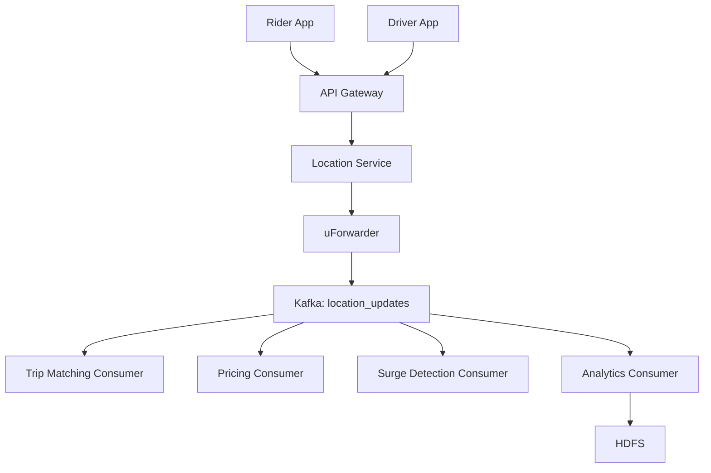
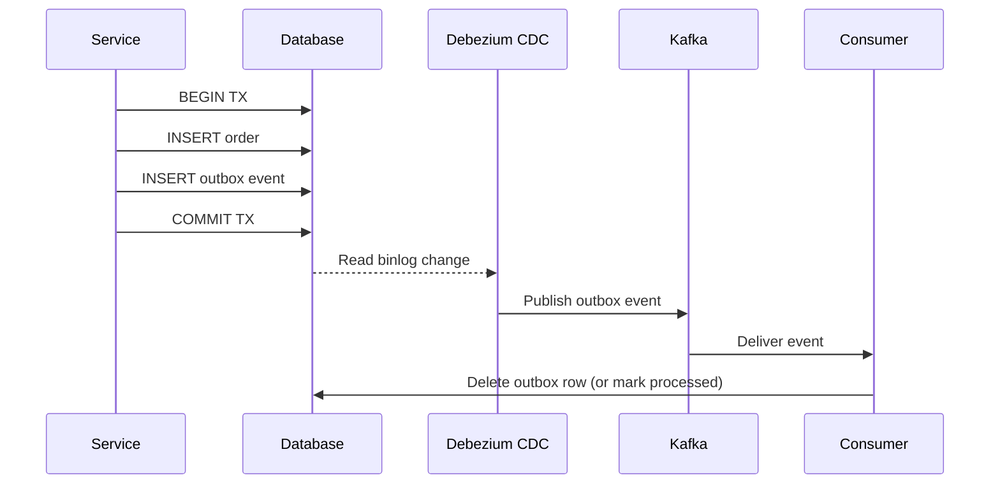

# Chapter 7: Message Queues and Event-Driven Architecture

---
## Learning Objectives

- Contrast synchronous and asynchronous communication patterns in distributed systems and identify when each is appropriate
- Differentiate point-to-point queues from publish-subscribe topics in terms of delivery semantics, fan-out, and coupling
- Design Kafka-based event pipelines with partitioned topics, consumer groups, and offset management
- Analyze delivery guarantees (at-most-once, at-least-once, exactly-once) and their implementations at the producer, broker, and consumer levels
- Implement event sourcing patterns using an event store with state reconstruction and change data capture
- Apply backpressure handling strategies and priority queue patterns in real-time systems

---
## Theory


### Synchronous vs Asynchronous Communication

In distributed systems, services communicate either synchronously or asynchronously.

**Synchronous communication** blocks the caller until a response is received. HTTP/REST and gRPC are synchronous by default.

```
Client → HTTP POST → Service A → blocks → Service B → blocks → Database
Client ← ← ← ← ← ← ← ← ← ← ← ← ← ← ← ← ← ← ← ← ← ← ← Response
```

**Asynchronous communication** decouples the sender and receiver through an intermediary (message broker). The sender publishes a message and continues immediately.

```
Client → HTTP POST → Service A → Publish → [Queue] → Service B (eventually)
Client ← ← ← ← 202 Accepted (immediate)
                                         → Service B processes in background
```

| Aspect | Synchronous | Asynchronous |
|---|---|---|
| Coupling | Tight — caller knows callee's location | Loose — only the broker is known |
| Latency | Sum of all service times | Just the publish latency |
| Availability | Requires all services up | Degrades gracefully |
| Error handling | Immediate failure notification | Needs retry/DLQ mechanisms |
| Observability | Natural trace context propagation | Distributed tracing required |
| Throughput | Limited by slowest service | Can buffer spikes |

### Point-to-Point vs Publish-Subscribe

**Point-to-Point (Queue):** A message is consumed by exactly one consumer. Multiple consumers compete for messages — Kafka consumer groups implement this model.

```
Producer → [Queue] → Consumer A (takes message)
                       Consumer B (takes next)
                       Consumer C (idle)
```

**Publish-Subscribe (Topic):** A message is delivered to all subscribers. Each subscriber gets every published message.

```
Producer → [Topic] → Subscriber A
                     Subscriber B
                     Subscriber C (all get the same message)
```

| Feature | Queue | Topic |
|---|---|---|
| Delivery | One consumer per message | All subscribers |
| Message retention | Deleted after ack | Retained for configured time |
| Scaling | Add consumers for parallelism | Each subscriber scales independently |
| Use case | Task distribution | Event broadcasting |

### Apache Kafka

Apache Kafka is a distributed event streaming platform organized as a commit log. Its architecture centers on topics, partitions, offsets, and consumer groups.

#### Topics and Partitions

A **topic** is a logical channel for messages of a particular type. Each topic is divided into **partitions** — ordered, immutable sequences of messages.

```
Topic "orders":
  Partition 0: [msg0, msg1, msg2, msg3, ...]
  Partition 1: [msg0, msg1, msg2, msg3, ...]
  Partition 2: [msg0, msg1, msg2, msg3, ...]
```

Each message within a partition has a unique **offset** (sequential ID). Messages within a partition are strictly ordered — message at offset 10 was published before offset 11. There is no ordering guarantee across partitions.

**Partition assignment:** The producer chooses which partition to write to. Common strategies:
- **Round-robin:** Even distribution, no ordering guarantee
- **Key-based:** `partition_id = hash(key) % num_partitions` — ensures all messages with the same key go to the same partition (and thus are ordered)

#### Consumer Groups

Consumers coordinate as a **consumer group** to share the load of reading from a topic. Each partition is assigned to exactly one consumer within a group.

```
Topic with 4 partitions:
  Partition 0 → Consumer A
  Partition 1 → Consumer B
  Partition 2 → Consumer C
  Partition 3 → Consumer A (balanced, A handles 2 partitions)
```

If a consumer fails, its partitions are rebalanced to the remaining members. Rebalancing triggers a *stop-the-world* phase where no messages are consumed — this is the cost of the consumer group protocol.

**Offset management:** Each consumer group tracks its committed offset per partition — the position of the last processed message. When a consumer restarts, it resumes from the committed offset.

```
Consumer group "order-processor", topic "orders", partition 0:
  Committed offset: 42
  Next read: offset 43
```

#### ISR (In-Sync Replicas)

Each partition is replicated across multiple brokers. The **leader** handles all reads and writes for the partition. **Followers** replicate the leader's log.

The ISR set contains all followers that are fully caught up with the leader. A follower is in-sync if it has not fallen behind by more than `replica.lag.time.max.ms` (default: 30s).

```
Partition with replication factor 3:
  Leader: Broker 0 (handles reads/writes)
  Follower: Broker 1 (in ISR)
  Follower: Broker 2 (out of ISR — lagging by 45s → removed from ISR)
```

**`acks` producer setting:**

```
acks=0:  Fire-and-forget. Producer does not wait for acknowledgment.
         Highest throughput, possible data loss.

acks=1:  Leader acknowledges after writing to its log.
         Durable on the leader. If leader crashes before replication, data lost.

acks=all (or -1): Leader waits for all ISR replicas to acknowledge.
                  Strongest durability. Highest latency.
```

### RabbitMQ

RabbitMQ is a message broker implementing the AMQP 0-9-1 protocol. It centers on exchanges, queues, and bindings.

#### Exchanges

A producer sends messages to an **exchange**, which routes them to queues based on binding rules. RabbitMQ supports four exchange types:

```
Direct Exchange:
  Routing key exact match. "orders.create" → bound queue "order_queue"

Topic Exchange:
  Routing key pattern match. "orders.*" → matches "orders.create", "orders.update"

Fanout Exchange:
  Broadcast to all bound queues, ignoring routing key.
  Ideal for events that all services should receive.

Headers Exchange:
  Route based on header attributes instead of routing key.
```

#### Bindings

A **binding** connects a queue to an exchange with an optional routing key pattern.

```python
# Create exchange and queue
channel.exchange_declare(exchange='orders', exchange_type='topic')
channel.queue_declare(queue='email_notifications')

# Bind queue to exchange with routing pattern
channel.queue_bind(
    exchange='orders',
    queue='email_notifications',
    routing_key='order.confirmed'
)

# Publish
channel.basic_publish(
    exchange='orders',
    routing_key='order.confirmed',
    body=json.dumps(order_data)
)
```

#### Message Lifecycle

1. Producer publishes to exchange
2. Exchange routes to queues via bindings
3. Message sits in queue until a consumer picks it up
4. Consumer acknowledges (acks) after processing
5. Broker removes acknowledged message
6. If consumer dies without ack, message is requeued

### AWS SQS and SNS

**Amazon SQS (Simple Queue Service)** is a fully managed message queue with two types:

- **Standard:** High throughput (virtually unlimited), at-least-once delivery, best-effort ordering
- **FIFO:** First-in-first-out, exactly-once processing, limited to 3000 TPS with batching

```
SQS Standard:
  Producer → SQS → Consumer A
                     Consumer B (may receive duplicate)

SQS FIFO:
  Producer (with MessageGroupId) → SQS FIFO → Consumer
  Messages in the same MessageGroupId are delivered in order
```

**Amazon SNS (Simple Notification Service)** is a pub-sub messaging service. SNS pushes messages to subscribers, which can be SQS queues, Lambda functions, HTTP endpoints, email, or SMS.

```
SNS Topic "order_events":
  Subscriber: SQS queue (email service)
  Subscriber: SQS queue (analytics service)
  Subscriber: Lambda function (inventory update)
  Subscriber: HTTP endpoint (legacy system)
```

**SNS + SQS fan-out pattern** is the standard way to broadcast events in AWS:

```
Producer → SNS Topic → SQS Queue A → Service A
                       SQS Queue B → Service B
                       SQS Queue C → Service C
```

This combines SNS fan-out (each service gets all events) with SQS buffering (services can process at their own pace).

### Delivery Guarantees

#### At-Most-Once

Messages are delivered zero or one time. The producer does not retry on failure. This is the weakest guarantee but offers the lowest latency.

```
Producer → sends message (no retry) → Broker → forwards to consumer (no retry)
If any step fails → message is lost
```

**Kafka:** `acks=0` with no retries from the producer.

**Use case:** Metrics, monitoring data where losing occasional samples is acceptable.

#### At-Least-Once

Messages are retried until acknowledged. A consumer may process the same message multiple times.

```
Producer → sends → retry on failure → Broker → forwards → consumer acks → done
If consumer crashes before ack → message is redelivered → processed twice
```

**Kafka:** `acks=all` with `enable.idempotence=true` at the producer level. At the consumer level, messages are redelivered if the consumer fails before committing the offset.

**Use case:** Must not lose data, can tolerate duplicates (or can deduplicate at the application level).

#### Exactly-Once

Messages are delivered exactly once, even in the presence of failures. This is the hardest guarantee to achieve in a distributed system.

**Exactly-once in Kafka (EOS):**
1. **Idempotent producer:** Each batch carries a unique producer ID (PID) and sequence number. The broker deduplicates based on this — if a batch is received twice with the same PID and sequence number, it is ignored.

2. **Transactional writes:** The producer wraps multiple messages into a transaction. All messages in the transaction become visible atomically. The broker writes a *commit marker* to the log.

3. **Consumer isolation:** Consumers read only committed messages by setting `isolation.level=read_committed`.

```
Kafka exactly-once flow:
  Producer → BEGIN TRANSACTION → write msg1 → write msg2 → COMMIT TRANSACTION
  Broker: writes msg1, msg2, then commit marker
  Consumer (read_committed): sees msg1, msg2 only after commit marker
```

**Limitation:** Exactly-once guarantees apply within a single Kafka cluster and single producer-consumer pair. Cross-system exactly-once (Kafka → Database) requires the **transactional outbox pattern** or idempotent consumers.

### Kafka Partitioning and Ordering Guarantees

Ordering in Kafka is guaranteed **within a partition** only. Messages with the same key always go to the same partition, preserving their order.

```
Topic "user-events", partitioned by user_id:
  Partition 0 (user_id % 3 = 0):
    msg: user_3 login
    msg: user_3 page_view
    msg: user_3 logout
    (All events for user_3 are in order)

  Partition 1 (user_id % 3 = 1):
    msg: user_1 login
    msg: user_1 page_view
    (User_1 events in order)

There is NO ordering guarantee between partition 0 and partition 1.
```

**If global ordering is required:** Use a single partition. This limits parallelism to 1 consumer. In practice, most systems need ordering within an entity (user, order) rather than global ordering.

### Dead-Letter Queues

A dead-letter queue (DLQ) stores messages that cannot be processed successfully. Messages go to the DLQ after exceeding the retry limit.

```
Consumer → processing fails → retry_queue (with delay)
             → retry 1 (fails) → retry 2 (fails) → retry 3 (fails)
             → dead_letter_queue (manual inspection)
```

**Common reasons for DLQ placement:**
- Deserialization failure (malformed payload)
- Downstream service unavailable (persistent)
- Business logic violation
- Message exceeds time-to-live

**DLQ analysis:** A growing DLQ indicates systemic issues. Monitor DLQ depth and alert when it exceeds thresholds. Tools like Kafka's `kafkacat` or AWS SQS DLQ redrive allow re-processing after fixes.

### Event Sourcing

Event sourcing persists state changes as a sequence of events rather than storing the current state directly. The current state is derived by replaying events (projection).

```
Event Store (ordered sequence):
  Event 1: AccountCreated(id=42, owner="Alice")
  Event 2: MoneyDeposited(account=42, amount=500)
  Event 3: MoneyWithdrawn(account=42, amount=100)
  Event 4: AccountFrozen(account=42)

Current state (replay all events):
  Account 42: balance=400, status=FROZEN
```

#### Advantages

- **Complete audit log:** Every state change is recorded with full history
- **Temporal queries:** "What was the balance on March 15?" (replay up to that point)
- **Debugging:** Reconstruct the exact state that led to a bug
- **Alternative projections:** Build read models for different use cases from the same events

#### Rebuilding State

```python
def rebuild_account_state(events):
    account = None
    for event in events:
        if event.type == "AccountCreated":
            account = Account(event.id, event.owner, 0)
        elif event.type == "MoneyDeposited":
            account.balance += event.amount
        elif event.type == "MoneyWithdrawn":
            account.balance -= event.amount
        elif event.type == "AccountFrozen":
            account.status = "FROZEN"
    return account
```

#### Snapshotting

Replaying all events from the beginning becomes expensive. Snapshots periodically save the current state. Rebuilding from a snapshot requires replaying only events after the snapshot.

```
Snapshot at event 1000:
  Account 42: balance=250, status=ACTIVE

Rebuild after snapshot:
  Read snapshot → replay events 1001, 1002, 1003
```

### Change Data Capture (CDC)

CDC captures row-level changes in a database and streams them as events. Debezium is the most popular CDC platform.

```
MySQL → Debezium → Kafka Topic "db.orders.orders"
  Event: {
    "op": "c",          // create
    "before": null,
    "after": {
      "id": 42,
      "status": "CREATED",
      "total": 99.99
    },
    "source": {
      "db": "orders",
      "table": "orders",
      "ts_ms": 1234567890
    }
  }
```

**Debezium connectors:**
- MySQL/PostgreSQL: Reads binlog/WAL
- MongoDB: Reads oplog
- SQL Server: Reads CDC tables
- Oracle: Reads LogMiner or XStream

**Use Cases:**
- Streaming data to search indexes (Elasticsearch)
- Invalidating caches
- Populating analytics data warehouses
- Triggering microservice workflows

### Backpressure

Backpressure occurs when a consumer cannot process messages as fast as the producer publishes them. Without backpressure, the system degrades — queues grow unbounded, memory fills, and latency increases.

**Strategies:**

1. **Blocking producer:** The consumer signals the producer to slow down (throttling at the protocol level). The producer blocks when the buffer is full.

2. **Drop messages:** The system discards excess messages. Acceptable for metrics where freshness matters more than completeness.

3. **Back-pressure via bounded queues:** The broker enforces a maximum queue size. Once full, new messages are rejected or old ones evicted.

4. **Reactive streams (Reactive Manifesto):** Protocol-level backpressure (e.g., RSocket, ReactiveX). The consumer tells the producer exactly how many more items it can handle.

```java
// ReactiveX example — backpressure via request(n)
Observable.range(1, 1000)
    .subscribe(new Subscriber<Integer>() {
        @Override
        public void onStart() {
            request(1);  // start with 1
        }

        @Override
        public void onNext(Integer n) {
            process(n);  // process
            request(1);  // request next
        }
    });
```

**Kafka backpressure:** Kafka handles backpressure through consumer polling. The consumer calls `poll(maxRecords)` — the broker sends at most `maxRecords` messages. The consumer controls the rate. If the consumer falls behind, messages accumulate on the broker (retained for `retention.ms`). This provides natural backpressure — the consumer processes at its own speed.

### Priority Queues

A priority queue delivers higher-priority messages before lower-priority ones. Implementation approaches:

1. **Separate queues per priority level:** Consumers drain higher-priority queues first.

```
Priority Queue Pattern:
  High-priority queue → consumer (drains this first)
  Medium-priority queue → consumer (drains this when high is empty)
  Low-priority queue → consumer (drains when above are empty)
```

2. **Priority field in message:** Consumer sorts by priority before processing. Works for small batches but does not scale.

3. **Dedicated broker feature:** RabbitMQ supports priority queues via the `x-max-priority` argument.

```python
# RabbitMQ priority queue
channel.queue_declare(
    queue='task_queue',
    arguments={'x-max-priority': 10}
)

channel.basic_publish(
    exchange='',
    routing_key='task_queue',
    body=message,
    properties=pika.BasicProperties(
        priority=5   # 0-10
    )
)
```

---
## Examples

### Example 1: LinkedIn's Kafka Migration

LinkedIn built Kafka to solve the problem of data integration across hundreds of services. Before Kafka, LinkedIn used point-to-point connections:

```
LinkedIn before Kafka:
  Service A → direct HTTP → Service B
  Service A → database poll → Service C
  Service A → custom socket → analytics
  Each integration required custom code, different protocols
```

**Kafka Architecture at LinkedIn:**

```
Services → Kafka Broker Cluster → Multiple consumers:
  → Hadoop (batch analytics)
  → Espresso (real-time serving)
  → Search index
  → Monitoring dashboards
  → Downstream services
```

**Key design decisions:**
- 100+ partitions per topic for parallelism
- Consumer groups for independent scaling
- Retention-based storage (7 days by default)
- Replication factor of 3 for durability

**Migration strategy:** Each integration was migrated one at a time. The old system and Kafka ran in parallel until the new pipeline was verified. LinkedIn reported a 10x throughput improvement and elimination of custom integration code.

**Metrics after migration:**
- 7 million messages/second peak throughput
- 50 brokers in the largest cluster
- p99 latency under 50ms

### Example 2: Uber's Distributed Event Bus

Uber built its event bus (uForwarder) on Kafka to handle its microservice ecosystem.

**Uber's topology:**

```
Ringpop (consistent hashing) → Kafka Cluster
  Each ringpop node runs a uForwarder process
  uForwarder writes to Kafka partitions

Services publish to:
  Topic: "location_updates" (100 partitions)
    Partition 0: GPS data for California
    Partition 1: GPS data for New York
    ...

Consumers:
  Trip matching service
  Pricing engine
  Surge detection
  Driver tracking
  ETA predictions
```

**Partitioning strategy:** Uber partitions by geographical region (city/state). All events for a city go to the same partition, ensuring ordering for trip events.

**Challenge:** The original Kafka deployment had a single Kafka cluster. When a broker failed, partitions were rebalanced across remaining brokers, causing load spikes. Uber mitigated this by:
- Pre-allocating more partitions than brokers for even distribution
- Using dedicated Kafka clusters per use case (logs, events, metrics)
- Implementing rack-aware partition assignment



### Example 3: Transactional Outbox Pattern

The transactional outbox pattern ensures reliable message publication alongside database writes.

**Problem:** Sending a message to Kafka after updating a database is not atomic. The database write may succeed but the Kafka publish may fail (or vice versa).

```
Naive approach (not safe):
  BEGIN TRANSACTION
    INSERT INTO orders (id, amount) VALUES (42, 99.99)
  COMMIT
  kafka.publish("order_created", event)  // if this crashes, message is lost
```

**Outbox pattern solution:** Write the event to an `outbox` table in the same database transaction. A separate process (CDC or poller) reads from the outbox table and publishes to Kafka.

```
Safe approach (outbox pattern):
  BEGIN TRANSACTION
    INSERT INTO orders (id, amount) VALUES (42, 99.99)
    INSERT INTO outbox (event_type, payload) VALUES ("order_created", '{...}')
  COMMIT
  // Outbox publisher reads from outbox table and publishes to Kafka
  // After successful Kafka publish, deletes the outbox row
```

**Implementation with Debezium:**

```
Database → binlog → Debezium → Kafka Topic "outbox.orders" → downstream services
```

The outbox table can be compacted (tombstone after publish) or kept for auditing. This guarantees exactly-once delivery if the consumer is idempotent.



---
## Summary

- Asynchronous communication decouples services via a message broker, improving resilience and allowing independent scaling at the cost of increased system complexity
- Kafka's partitioned commit log provides durable, ordered storage with consumer groups enabling parallel processing and rebalance tolerance
- At-least-once delivery is the most practical guarantee for most systems; exactly-once requires idempotent producers and transactional coordination across broker and consumer
- RabbitMQ's exchange/queue/binding model offers flexible routing (direct, topic, fanout, headers) for different message distribution patterns
- Dead-letter queues provide a safety net for messages that cannot be processed, enabling redrive after issue resolution
- Event sourcing stores all state changes as an ordered event sequence, enabling complete audit trails, temporal queries, and multiple projections from the same event stream
- Change data capture with Debezium bridges databases and event streams without application-level code changes
- Backpressure must be explicitly managed — Kafka's consumer pull model provides natural rate limiting, while reactive streams implement protocol-level demand signaling
- Priority queues enable time-critical processing by draining higher-priority messages first
- The transactional outbox pattern solves the dual-write problem by atomically writing events alongside business data in the same transaction

---
## Exercises

### Review Questions

1. Explain the difference between a Kafka consumer group partition assignment and a RabbitMQ competing consumer pattern. How does each handle consumer failure?

2. A system uses Kafka with `acks=1`. A leader broker receives a write, acknowledges it, then crashes before replicating to any follower. The failed leader never recovers. What happens to this message? How would `acks=all` change the outcome?

3. What is the dual-write problem? Describe how the transactional outbox pattern solves it, and what happens if the outbox publisher crashes mid-publish.

4. In Kafka, why is exactly-once delivery impossible between two independent systems (e.g., Kafka → Database) without additional coordination? What guarantees must the consumer implement?

### Application Problems

1. **Design a Kafka topology for a food delivery platform.** The system has: Order Service, Restaurant Service, Delivery Service, Notification Service, and Analytics Service. Define topics, partitions, consumer groups, and the schema for at least 5 event types. Specify which event ordering guarantees are needed and how you achieve them.

2. **Dead-letter queue analysis:** A notification service consumes from a Kafka topic at 500 messages/second. After a deployment bug, 15% of messages went to the DLQ over 2 hours. The DLQ contains 540,000 messages. Design a redrive strategy that: (a) processes all DLQ messages without overwhelming the system, (b) preserves original ordering within each partition, and (c) prevents duplicate notifications to users. Provide the Kafka producer and consumer configuration parameters.

3. **Priority queue implementation:** A ticket system has three priority levels: Critical (SLA: 5 minutes), High (SLA: 30 minutes), Low (SLA: 4 hours). 5% of tickets are Critical, 15% High, 80% Low. Design a queue architecture that guarantees Critical tickets are processed within 2 minutes of arrival while Low tickets do not starve. Show the consumer logic for draining queues, and calculate the maximum processing capacity required per consumer.

### Challenge Problem

**Design a Financial Event Sourcing System**

Design an event-sourced ledger system for a financial exchange processing 50,000 trades/second.

**Requirements:**
- Each trade involves a buy order and a sell order, debiting one account and crediting another
- Balances must be reconstructable from the event stream at any point in time
- The system must support 50,000 events/second ingestion
- Auditors must be able to query the state at any previous timestamp
- Multiple read projections (real-time balances, P&L reports, risk exposure) must be supported
- The system must never lose events

**Deliverables:**

1. **Event schema:** Define the event types (at least 4) and their schemas. Use a compact event format (Avro or Protobuf specification).

2. **Event store topology:** Design the Kafka topology. Specify topic names, partition count, replication factor, retention policy, compaction settings, and consumer groups. Justify each choice.

3. **Projection design:** Show the code for rebuilding an account balance from the event stream. Then design a snapshot strategy — specify snapshot interval (based on event count), snapshot schema, and how rebuilding works from a snapshot.

4. **Exactly-once reconciliation:** Design a reconciliation process that runs nightly. It compares the event-sourced ledger balances with the actual database balances. If discrepancies exist, explain how you trace back through the event stream to find the root cause.

5. **Audit query optimization:** An auditor needs to query the balance of account 12345 as of March 15, 2024 at 14:30:00 UTC. Current event volume is 4.3 billion events. Describe the query path (snapshot lookup + event replay) and estimate the expected query time. How would you optimize for sub-second audit queries?

6. **Failure scenarios:** Describe what happens in each scenario — how events are recovered and whether any data is lost:
   - Kafka broker fails (disk corruption)
   - Consumer crashes after processing an event but before committing the offset
   - The event store's snapshot table becomes corrupted
   - A bug in a projection causes incorrect balances for 3 hours before detection

---
