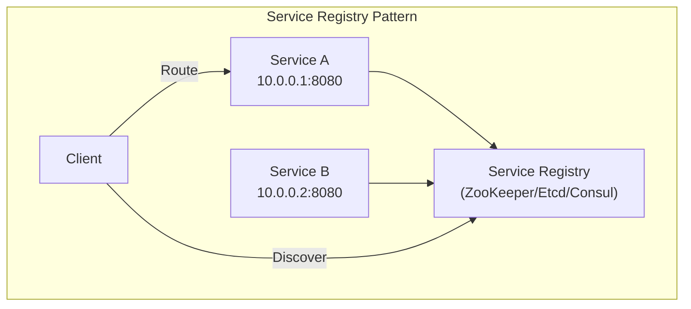
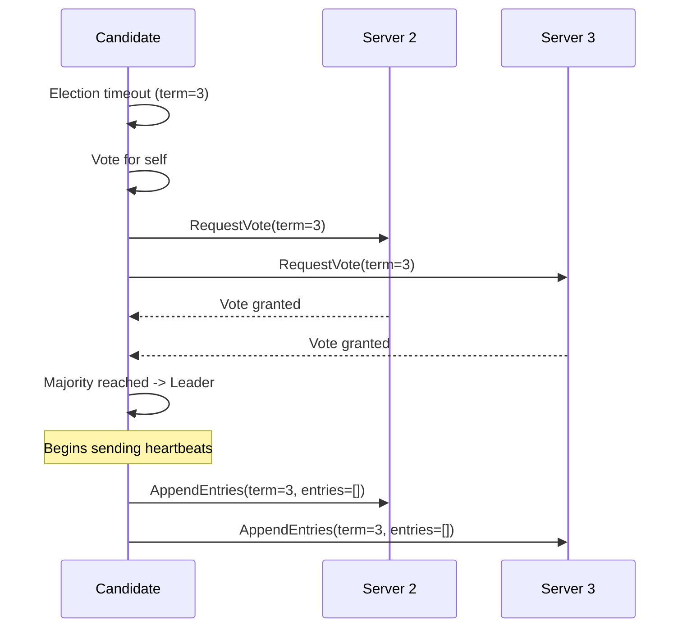

# Chapter 9: Distributed Coordination and Service Discovery

---
## Learning Objectives

- Implement service registry patterns and contrast client-side vs server-side service discovery for different deployment topologies
- Design ZooKeeper-based coordination using the Zab protocol, znode hierarchies, watches, and the leader election recipe
- Analyze the Raft consensus algorithm across leader election, log replication, and safety properties, with detailed crash recovery analysis
- Compare Paxos, Raft, and Zab consensus protocols on the dimensions of understandability, performance, and safety guarantees
- Implement distributed locks with fencing tokens and evaluate their correctness in the presence of process pauses and clock skew
- Apply Phi-accrual failure detectors and SWIM membership protocols for robust failure detection
- Design coordination-free systems that avoid consensus entirely using CRDTs and idempotent operations

---
## Theory


### Service Registry Pattern

A service registry is a database of available service instances and their network locations. Services register themselves on startup and deregister on shutdown. Clients or routers query the registry to find service endpoints.

```
Service Instance A (10.0.0.1:8080) -> Register at Registry
Service Instance B (10.0.0.2:8080) -> Register at Registry
Service Instance C (10.0.0.3:8080) -> Register at Registry
Client -> "Find user-service instances" -> Registry
Registry -> [10.0.0.1:8080, 10.0.0.2:8080, 10.0.0.3:8080]
```

**Implementation options:**
- **ZooKeeper / Etcd / Consul:** Dedicated, highly-available coordination services
- **Eureka (Netflix):** AP-oriented registry (prioritizes availability over consistency)
- **Kubernetes Services:** DNS-based registry built into the platform

### Client-Side vs Server-Side Discovery

#### Client-Side Discovery

The client queries the service registry directly and selects an instance using a load-balancing algorithm.

```
Client -> queries Service Registry -> gets [10.0.0.1:8080, 10.0.0.2:8080]
Client -> round-robin -> selects 10.0.0.1:8080
Client -> HTTP -> 10.0.0.1:8080
```

**Advantages:** Simpler deployment (no extra proxy). Client can implement sophisticated load balancing (weighted, least connections, zone-aware).

**Disadvantages:** Client must implement discovery logic (typically via a library). Every language/framework needs a library. Tight coupling between client and registry.

**Netflix Eureka + Ribbon** is the classic client-side discovery implementation.

#### Server-Side Discovery

The client sends requests to a load balancer (or API gateway), which queries the registry and routes to a healthy instance.

```
Client -> API Gateway -> queries Registry -> gets [10.0.0.1:8080]
Client -> API Gateway -> forwards to 10.0.0.1:8080
Client <- response
```

**Advantages:** Client is simple (just makes HTTP calls). Discovery logic is in the infrastructure. No client library dependency.

**Disadvantages:** Load balancer is a deployment and scaling concern. Must be highly available. Adds a network hop.

**Kubernetes Services** use server-side discovery via kube-proxy.

### ZooKeeper

Apache ZooKeeper is a centralized coordination service for distributed systems. It provides a hierarchical namespace (znodes), watches, and a consensus protocol (Zab).

#### Zab Protocol

ZooKeeper Atomic Broadcast (Zab) is ZooKeeper's crash-recovery consensus protocol. It ensures that updates are applied in the same order across all servers.

**Zab has three phases:**

1. **Discovery:** A newly elected leader finds the latest epoch (term) and the latest accepted proposals from a quorum of followers.

2. **Synchronization:** The leader ensures all followers have the same state by transmitting any missing proposals.

3. **Broadcast:** The leader processes client requests, assigns a monotonically increasing ZooKeeper transaction ID (zxid), and broadcasts them to followers. A proposal is committed when a majority acknowledges it.

```
Leader -> propose(zxid, data) -> Follower A, Follower B, Follower C
Follower A -> ack(leader)
Follower B -> ack(leader)
Leader: majority (2/3) -> commit
```

Zab's key insight: it guarantees **primary order** -- if a leader commits proposal p with zxid z, then any future leader must have all proposals with zxid < z committed before it can accept new proposals.

#### Znodes

Znodes are ZooKeeper's data nodes, organized in a hierarchical tree.

```
/zookeeper
  /services
    /user-service
      /instance-abc (data: "10.0.0.1:8080")
      /instance-def (data: "10.0.0.2:8080")
    /order-service
      /instance-ghi (data: "10.0.0.3:8080")
  /config
    /database-url (data: "postgres://...")
    /feature-flags
      /new-ui (data: "true")
```

**Znode types:**
- **Persistent:** Exists until explicitly deleted
- **Ephemeral:** Deleted automatically when the session that created it ends (client disconnect)
- **Sequential:** Appended with a monotonically increasing sequence number (e.g., lock-0000000042)
- **Container:** (ZooKeeper 3.5+) Deleted when all children are removed

#### Watches

A watch is a one-time notification trigger. A client sets a watch on a znode; when that znode changes (data update, child added/removed, deletion), the server sends a notification.

```
Client A: getData("/services/user-service", watch=true)
... time passes ...
Client B: setData("/services/user-service", "10.0.0.5:8080")
Server -> notification to Client A: "/services/user-service data changed"
```

**Properties:**
- One-shot: after triggering, the watch must be re-registered
- Ordered: notifications are delivered before the triggering operation's result
- Best-effort: clients may miss a change if they reconnect between setting and triggering

#### Leader Election Recipe

The most common ZooKeeper recipe for leader election:

```python
def elect_leader():
    candidate_path = zk.create("/election/node-", ephemeral=True, sequential=True)
    sequence = int(candidate_path.split("-")[-1])
    children = zk.get_children("/election")
    sorted_children = sorted(children)
    if sequence == min(sequences):
        return {"role": "leader"}
    else:
        predecessor = sorted_children[sequences.index(sequence) - 1]
        zk.get_data(f"/election/{predecessor}", watch=True)
        return {"role": "follower", "watching": predecessor}
```

When the leader fails, its ephemeral znode is deleted, triggering the next in line to become leader. The sequential chaining pattern limits notifications to one candidate, avoiding a herd effect.

### Etcd

Etcd is a strongly consistent, distributed key-value store that uses the Raft consensus protocol. It is the primary coordination store in Kubernetes.

#### Leases

A lease is a time-bound contract. The holder of a lease is guaranteed that its key will not expire before the lease expires. Leases are refreshed (kept alive) by periodic heartbeats.

```bash
# Create a lease with 10-second TTL
etcdctl lease grant 10
# lease 694d71e5c8a7b3f0 granted with TTL(10s)

# Put a key with the lease (key dies when lease expires)
etcdctl put --lease=694d71e5c8a7b3f0 /my-key "my-value"

# Keep the lease alive
etcdctl lease keep-alive 694d71e5c8a7b3f0
```

#### Watch API

Etcd provides a watch API for monitoring key changes. Watches are long-lived (not one-shot like ZooKeeper).

```python
import etcd3
client = etcd3.client()
watch = client.add_watch_callback('/services/', callback=handle_service_change)
for event in watch:
    print(f"Key: {event.key}, Value: {event.value}, Type: {event.type}")
```

### Raft Consensus Algorithm

Raft is a consensus algorithm designed for understandability. It breaks consensus into three sub-problems: leader election, log replication, and safety.

#### Server States

Each Raft server is in one of three states:

```
Leader: Handles all client requests, manages log replication
Follower: Passive, responds to leader requests
Candidate: Intermediate state during leader election
```

State transitions:
```
Follower -> (timeout, starts election) -> Candidate
Candidate -> (receives majority votes) -> Leader
Leader -> (discovers higher term) -> Follower
Candidate -> (discovers higher term) -> Follower
```

#### Leader Election

**Election process:**

1. A follower starts an election when its election timeout expires (150-300ms randomized).
2. The follower increments its term, becomes a candidate, votes for itself, and sends RequestVote RPCs to all other servers.
3. If the candidate receives votes from a majority (itself + N/2 other servers), it becomes leader.
4. If the candidate receives a message from a leader with a higher or equal term, it reverts to follower.
5. If no majority is reached within the timeout, a new election begins with a higher term.

```
Term 3:
  Server 1: election timeout -> candidate (term=3)
           -> votes for self
           -> RequestVote to Server 2, Server 3
  Server 2: grants vote (hasn't voted in term 3)
  Server 3: grants vote (hasn't voted in term 3)
  Server 1: majority (3/3) -> becomes leader
```

**Safety of elections:** Each server grants at most one vote per term. A server only grants its vote to a candidate whose log is at least as up-to-date as its own.

#### Log Replication

Once a leader is elected, it handles all client requests:

1. **Append entry:** Client sends a command to the leader. The leader appends the command to its log.
2. **Replicate:** The leader sends AppendEntries RPCs to all followers, containing the new log entry.
3. **Acknowledge:** Followers append the entry to their logs and acknowledge.
4. **Commit:** Once the leader receives acknowledgments from a majority, it commits the entry (applies it to the state machine).
5. **Respond:** The leader responds to the client.

```
Client -> set(x=5) -> Leader
Leader: append entry {term=3, index=5, cmd=set(x=5)} to log
Leader -> AppendEntries -> Follower A
Leader -> AppendEntries -> Follower B
Follower A -> ack
Follower B -> ack
Leader: majority -> commit index 5
Leader: apply set(x=5) -> client: OK
```

**Log structure:** Each log entry has a term number and an index.

```
Log on Leader:
  Index:       1          2          3          4          5
  Term:        1          1          2          2          3
  Command:     set(x=1)   set(y=2)   set(x=3)   del(y)     set(x=5)
```

#### Safety Properties

Raft guarantees these safety properties:

1. **Election safety:** At most one leader can be elected in a given term.
2. **Leader append-only:** A leader never overwrites or deletes entries in its log; it only appends.
3. **Log matching:** If two logs contain an entry with the same index and term, the logs are identical in all preceding entries.
4. **Leader completeness:** If a log entry is committed in a given term, then that entry will be present in the logs of all future leaders.
5. **State machine safety:** If a server has applied a log entry at a given index to its state machine, no other server will apply a different entry at the same index.

**Log Matching Proof:** When a leader sends AppendEntries for a new entry, it includes the term and index of the previous entry. If the follower does not have a matching entry at that position, it rejects the RPC. The leader then decrements the nextIndex for that follower and retries. This ensures logs converge.

### Paxos vs Raft vs Zab

| Aspect | Paxos | Raft | Zab |
|---|---|---|---|
| Year | 1998 (published) | 2013 | 2008 (ZooKeeper) |
| Approach | Multiple phases | Leader-elected, log-replicated | Leader-based atomic broadcast |
| Understandability | Notoriously difficult | Designed for understandability | Moderate |
| Leader election | Distinguished proposer | Explicit with timeouts | Integrated into discovery |
| Log structure | Implicit (ballot numbers) | Explicit term + index | zxid (epoch + counter) |
| Membership changes | Joint consensus | Joint consensus | Dynamic reconfiguration |
| Typical usage | Chubby, Spanner | Etcd, Consul, TiKV | ZooKeeper |
| Simplicity of implementation | Complex | Well-defined, many impls | Moderate |

**When to choose each:**
- **Raft** for new systems (simplicity, good documentation)
- **Zab** when ZooKeeper is in your infrastructure
- **Paxos** when building on proven implementations (not from scratch)

### Distributed Locks

Distributed locks prevent multiple processes from simultaneously accessing a shared resource.

#### Implementation with ZooKeeper

The lock is represented by an ephemeral sequential znode. The process with the lowest sequence number holds the lock.

```python
def acquire_lock(lock_path):
    lock_node = zk.create(f"{lock_path}/lock-", b"", ephemeral=True, sequential=True)
    lock_id = int(lock_node.split("-")[-1])
    while True:
        children = zk.get_children(lock_path)
        sorted_locks = sorted(children)
        if lock_id == min(sorted_locks):
            return
        predecessor = f"{lock_path}/{sorted_locks[sorted_locks.index(lock_node) - 1]}"
        zk.get_data(predecessor, watch=True)
        wait_for_watch()
```

#### Fencing Tokens

A fencing token monotonically increases with each lock grant. The protected resource checks the token to ensure requests are from valid lock holders.

```
Process A acquires lock (token=42)
Process A pauses (GC pause, 5 seconds)
Process A's lock expires
Process B acquires lock (token=43)
Process B updates resource (token=43 -> valid)
Process A resumes, tries to update resource (token=42 -> stale)
Resource rejects because 42 < 43
```

```python
def acquire_lock(client_id):
    lock_node = create_ephemeral_sequential("/locks/resource-", client_id)
    success, token = wait_for_lock(lock_node)
    return {"locked": True, "fencing_token": token}

def update_resource(key, value, fencing_token):
    current_token = get_current_lock_token(key)
    if fencing_token >= current_token:
        set_data(key, value, fencing_token)
        return OK
    else:
        return STALE_LOCK_ERROR
```

### Heartbeats and Failure Detection

#### Phi-Accrual Failure Detector

The Phi-accrual failure detector, used in Cassandra and Akka, computes a suspicion level (phi) rather than a binary alive/dead judgment.

**How it works:**
1. Track inter-arrival times of heartbeats.
2. Maintain a sliding window of recent inter-arrival times.
3. Compute the probability that the current gap would occur given the observed distribution.
4. Convert probability to phi: `phi = -log10(probability)`.

```
Heartbeat history (ms): [100, 150, 90, 110, 130, 95, 105, 120]
Current gap: 500ms since last heartbeat
Probability of gap >= 500ms: ~0.001
phi = -log10(0.001) = 3.0

Threshold:
  phi < 1:   probably alive
  phi < 3:   mildly suspicious
  phi >= 3:  suspected dead
  phi >= 10: confirmed dead
```

**Advantages over fixed timeout:** Adapts to network conditions. Continuous suspicion level. Lower false positives in high-latency environments.

### SWIM Membership Protocol

SWIM (Scalable Weakly-consistent Infection-style Process Group Membership Protocol) provides failure detection and membership dissemination.

**Two components:**

1. **Failure Detector:** Each member picks a random target and sends a ping every T milliseconds. If the ping times out, indirect probes through k other members are attempted. If all probes fail, the target is marked as failed.

2. **Dissemination:** Membership updates are piggybacked on ping/pong messages and spread through gossip.

```
SWIM parameters:
  T = 100ms (ping interval)
  k = 3 (indirect probes)
  timeout = 200ms (per probe)

Node A at t=0: sends ping to random member B -> pong -> alive
Node A at t=100ms: sends ping to random member C
  -> no pong by t=300ms
  -> sends indirect ping to D, E, F -> ask C
  -> if any respond: C is alive
  -> if all timeout: C is suspected failed -> gossip
```

**Scalability:** Each member sends O(1) messages per interval. Total: O(N * (1 + k)). This scales linearly with N.

### Coordination-Free Systems

Not every distributed problem requires consensus.

#### When Coordination Can Be Avoided

- **Read-only workloads:** Replicas serve reads without coordination if staleness is acceptable.
- **Idempotent operations:** Same operation produces same result regardless of execution order.
- **Unique key generation:** Use UUIDs (no central coordinator) vs auto-increment.
- **Conflict-free data types:** CRDTs converge without coordination.
- **Best-effort computations:** Approximate counting, sketch algorithms, sampling.

#### Design Principles

1. **Idempotency:** Operations that can be applied multiple times with the same result.
2. **Commutativity:** Operations that commute do not need ordering guarantees.
3. **Associativity:** Operations grouped in any order converge to the same result.

```
CRDT Counter (coordination-free):
  Node 1: increment() -> local_count = 5
  Node 2: increment() -> local_count = 3
  Node 3: increment() -> local_count = 7
  Any merge order: max(5,3) + max(3,7) + max(5,7) = 19
```

---
## Examples

### Example 1: Kubernetes and Etcd

Kubernetes uses Etcd as its backing store for all cluster state.

**Etcd in Kubernetes:**

```
Kubernetes State stored in Etcd:
  /registry/pods/default/my-pod -> pod spec and status
  /registry/services/default/my-service -> service spec
  /registry/deployments/default/my-deployment -> deployment spec
  /registry/configmaps/my-config -> configuration data
```

**Etcd leader election in Kubernetes:** If the Etcd leader fails, the remaining nodes hold a Raft election. During the election (typically < 1 second), the Kubernetes API Server cannot write to Etcd.

```
Kubernetes etcd cluster (3 nodes):
  Node 1: Leader
  Node 2: Follower
  Node 3: Follower

  Node 1 fails -> Node 2 and Node 3 detect election timeout
  -> Node 2 becomes candidate (term=5)
  -> Node 2 gets vote from Node 3
  -> Node 2 becomes leader
  -> Total downtime: ~300-500ms
```

**Etcd compaction:** Kubernetes compacts Etcd's history to prevent unbounded growth. By default, Etcd retains 5000 revisions. Older revisions are compacted.

### Example 2: Apache Kafka and KRaft

Kafka traditionally used ZooKeeper for metadata management. Starting with Kafka 2.8, ZooKeeper can be replaced with KRaft (Kafka Raft Metadata mode).

**Before (ZooKeeper-based):**
```
Kafka Broker -> ZooKeeper: broker registration, topic config, leader election
ZooKeeper -> maintains controller election, ISR management
```

**After (KRaft):**
```
Kafka Broker -> KRaft quorum (embedded Raft): metadata management
No ZooKeeper dependency
```

**KRaft replaces ZooKeeper with:**
- **Metadata log:** Stored in `__cluster_metadata` topic. All metadata changes go through Raft.
- **Controller quorum:** Brokers form Raft quorum. Active leader manages metadata.
- **Metadata records:** Partition assignments, broker registrations, configs, ACLs.

```
KRaft Cluster:
  Controller 1 (leader): active metadata management
  Controller 2 (voter): replicates metadata log
  Controller 3 (voter): replicates metadata log
```

**Benefits:** Simpler operations (one fewer system), faster failover (sub-second), linear scalability to more partitions.

### Example 3: HashiCorp Consul

**Consul** provides service discovery, health checking, and a distributed key-value store.

Service registration in Consul:

```hcl
service {
  name = "web"
  port = 8080
  check {
    http     = "http://localhost:8080/health"
    interval = "10s"
    timeout  = "5s"
  }
}
```

Service discovery via DNS:
```bash
dig web.service.consul
```

**Consul's architecture:**
- **Consul servers:** Run Raft consensus (cluster of 3 or 5)
- **Consul clients:** Run on each node, forward requests
- **Gossip protocol:** Serf-based (SWIM-derived) for health dissemination
- **Health checks:** Performed by clients, results gossiped to servers

**HashiCorp Nomad** uses Consul for service discovery and cluster coordination.

```
Nomad Job Spec -> Nomad Server -> Consul (service registration)
                                -> Nomad Client -> runs workload
                                -> Consul health check monitors
```

### Example 4: Consul Distributed Lock

```python
def consul_lock(key, session_ttl="10s"):
    session_id = consul.session.create(behavior="delete", ttl=session_ttl)
    acquired = consul.kv.put(key=key, value=session_id, acquire=session_id)
    if not acquired:
        consul.session.destroy(session_id)
        return None
    def renew():
        consul.session.renew(session_id)
    return {"session": session_id, "renew": renew}

def consul_unlock(session_id):
    consul.session.destroy(session_id)
```

This lock uses Consul's session mechanism: when the session expires (process crash or network partition), the key is automatically released.

### Mermaid Diagrams





---
## Summary

- Service registries maintain dynamic mappings between service names and network locations; ZooKeeper, Etcd, Consul, and Eureka are common implementations
- Client-side discovery places load-balancing logic in the client library; server-side discovery uses a central load balancer or API gateway
- ZooKeeper's Zab protocol provides linearizable writes via a leader-based atomic broadcast with ordered zxid sequences
- Raft decomposes consensus into leader election (randomized timeouts), log replication (AppendEntries RPCs), and safety (log matching, leader completeness)
- Raft ensures safety by guaranteeing that a leader elected in a given term holds all previously committed entries
- Distributed locks require fencing tokens to prevent stale lock holders from corrupting shared state after GC pauses or network delays
- Phi-accrual failure detectors model inter-arrival times statistically, producing suspicion levels that adapt to network conditions
- SWIM combines direct pings with indirect probes (k-ary) for failure detection and gossip-based piggybacking for membership dissemination
- Coordination-free systems avoid consensus by using idempotent, commutative, and associative operations (CRDTs)

---
## Exercises

### Review Questions

1. A ZooKeeper client sets a watch on `/services/db` and then disconnects for 2 seconds. When it reconnects, the watch fires immediately even though no change occurred. Explain why and how to design around it.

2. In Raft, a candidate with term 4 receives an AppendEntries RPC from a leader with term 5 before the election completes. What should the candidate do and why?

3. Why is a fencing token necessary even when using ZooKeeper ephemeral znodes for locks? What scenario allows a lock holder to act after the lock is released?

4. What is the herd effect in ZooKeeper leader election, and how does sequential chaining mitigate it?

### Application Problems

1. **ZooKeeper leader election with 10 candidates:** Ten processes run ZooKeeper leader election using ephemeral sequential znodes. Process 1 has the lowest sequence number and is the leader. Processes 2-10 watch their predecessor. Process 1 crashes. Walk through the events: which watchers fire, who becomes the new leader, how many rounds? Calculate worst-case election time if each ZK operation takes 5ms.

2. **Raft log inconsistency recovery:** Five Raft servers (S1-S5) with S1 as leader:
   - S1 (leader): `[1:set(x=1), 1:set(y=2), 3:set(z=3), 4:set(w=4)]`
   - S2: `[1:set(x=1), 1:set(y=2), 3:set(z=3)]`
   - S3: `[1:set(x=1), 1:set(y=2), 2:set(a=99)]`
   - S4: `[1:set(x=1)]`
   - S5: `[1:set(x=1), 1:set(y=2), 3:set(z=3), 4:set(w=4)]`
   
   Trace AppendEntries for S3 and S4 when the leader replicates index 5. Show nextIndex after each round.

3. **Phi-accrual threshold tuning:** Mean heartbeat interval = 100ms, std = 20ms (normal). Detect failures within 500ms with < 1% false positives. Calculate the appropriate phi threshold.

### Challenge Problem

**Design a Coordination System for Global Leader Election**

Design a fault-tolerant leader election system across 3 regions (US-East, EU-West, Asia-Pacific), 5 nodes per region (15 total).

**Requirements:**
- One active leader globally at any time
- If the leader's region partitions, a new leader is elected from a reachable region
- Leader failover within 5 seconds
- Tolerate 2 simultaneous node failures and one full region failure
- Query current leader within 10ms p99
- Metadata survives full cluster crash (durable to disk)

**Deliverables:**

1. **Architecture decision:** Choose ZooKeeper, Etcd, or Consul. Justify with comparison table.

2. **Topology design:** Deployment across three regions. Specify coordination nodes per region, quorum size, leader preference, region failure behavior.

3. **Implementation:** Provide pseudocode for leader election including: leader selection, failure detection, term tracking, and stale leader prevention.

4. **Latency analysis:** US-East to EU-West = 30ms, US-East to Asia-Pacific = 150ms. Calculate p99 for:
   - Election when US-East leader fails
   - Query from Asia-Pacific client
   - 2PC across all three regions

5. **Failure scenarios:** Trace behavior for:
   - All 5 US-East nodes fail
   - US-East to EU-West link severed for 10s
   - Slow EU-West node causes timeouts
   - Leader crashes every 4 minutes (thrashing)

6. **Observability:** 8+ metrics (leader term changes, election latency, quorum health) with alerting thresholds.

---
