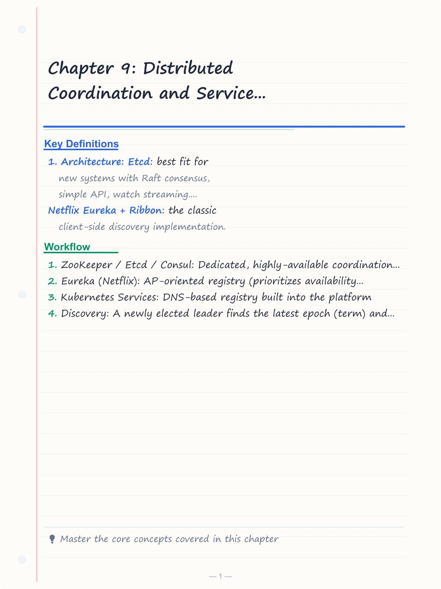
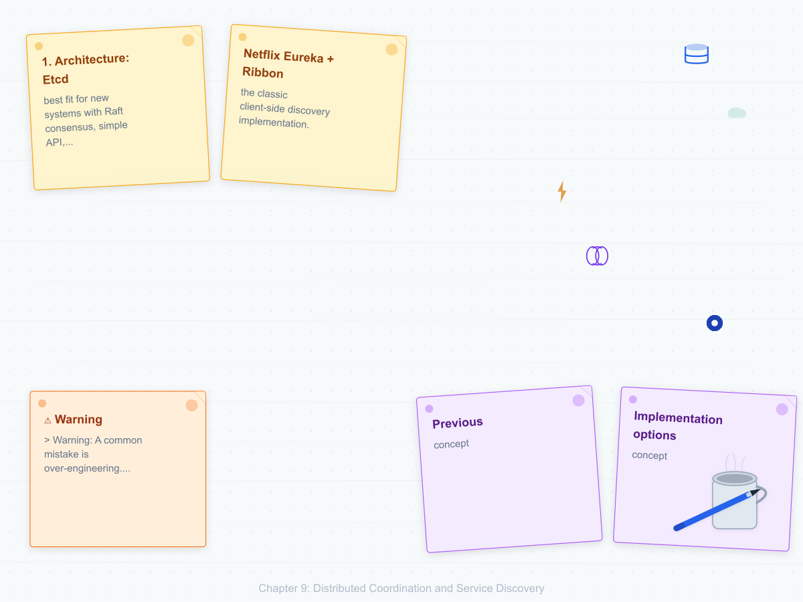
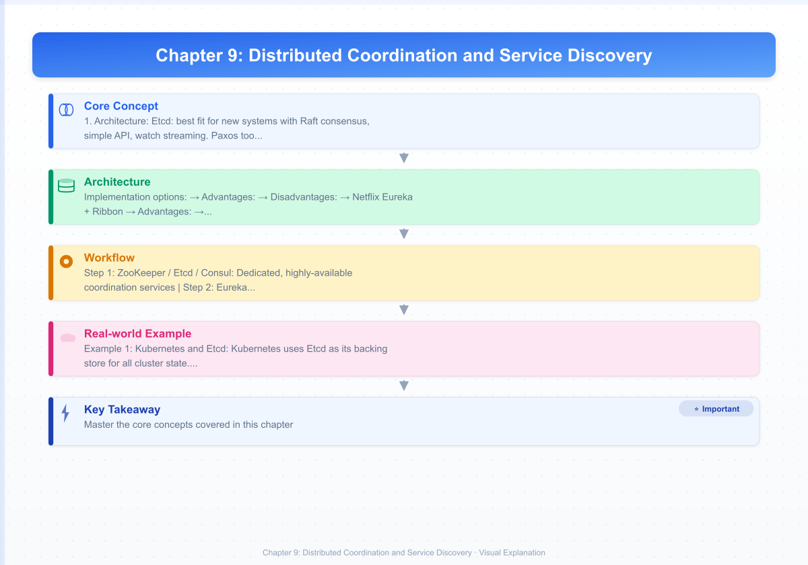
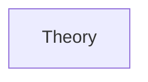
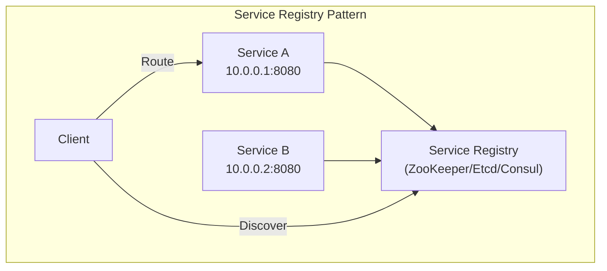
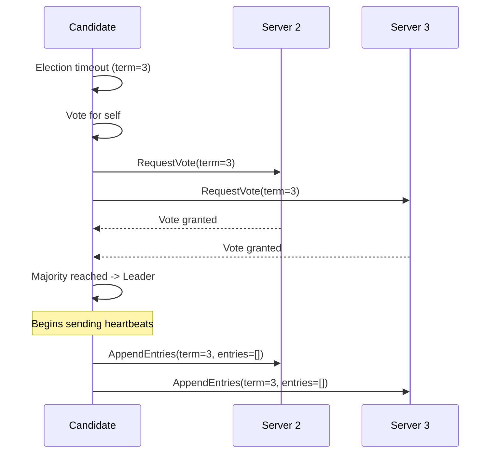
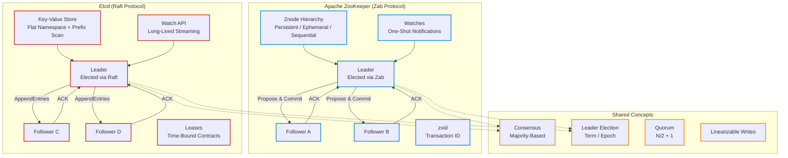

# Chapter 9: Distributed Coordination and Service Discovery
> **Previous:** [08 Microservices Apis](./08-microservices-apis.md) | **Next:** [10 Lld Solid Oop](./10-lld-solid-oop.md)

---
## Learning Objectives

- Implement service registry patterns and contrast client-side vs server-side service discovery for different deployment topologies
- Design ZooKeeper-based coordination using the Zab protocol, znode hierarchies, watches, and the leader election recipe
- Analyze the Raft consensus algorithm across leader election, log replication, and safety properties, with detailed crash recovery analysis
- Compare Paxos, Raft, and Zab consensus protocols on the dimensions of understandability, performance, and safety guarantees
- Implement distributed locks with fencing tokens and evaluate their correctness in the presence of process pauses and clock skew
- Apply Phi-accrual failure detectors and SWIM membership protocols for robust failure detection
- Design coordination-free systems that avoid consensus entirely using CRDTs and idempotent operations

<!-- Image Gallery -->
<section class="lesson-visuals" aria-label="Visual learning resources">
  <header><span>VISUAL LEARNING</span><h2>See it. Review it. Remember it.</h2></header>
  <a class="lesson-visual-card" href="../../assets/images/lessons/system-design/09-distributed-coordination/handwritten-notes.png" target="_blank" rel="noopener">
    
    <span><strong>Handwritten notes</strong>Condensed notes for deliberate review.</span>
  </a>
  <a class="lesson-visual-card" href="../../assets/images/lessons/system-design/09-distributed-coordination/sticky-notes.png" target="_blank" rel="noopener">
    
    <span><strong>Sticky-note revision</strong>Fast recall prompts for revision.</span>
  </a>
  <a class="lesson-visual-card" href="../../assets/images/lessons/system-design/09-distributed-coordination/visual-explanation.png" target="_blank" rel="noopener">
    
    <span><strong>Visual concept guide</strong>A connected explanation of the key ideas.</span>
  </a>
</section>
<!-- End Image Gallery -->


---
## Chapter at a Glance

| Aspect | Details |
|--------|---------|
| **Scope** | Distributed coordination, ZooKeeper, etcd, leader election, locking |
| **Key Concepts** | Consensus, distributed locks, service discovery, configuration |
| **Coordination Services** | ZooKeeper, etcd, Consul ? architecture and guarantees |
| **Leader Election** | Raft-based election, fencing, lease mechanisms |
| **Distributed Locking** | Mutex, read/write locks, lock reentrancy, deadlock |
| **Real-World** | Kafka (ZooKeeper), Kubernetes (etcd), HashiCorp stack |

---
## Chapter Roadmap



## Theory
> **One-Sentence Takeaway:** Theory is the foundation ? master it before moving to examples and exercises.


### Service Registry Pattern


> **Pro Tip:** Master this concept thoroughly ? it is frequently tested in system design interviews.

> **Pro Tip:** Master this concept ? it appears in nearly every system design interview. Understand both the how and the why.

> **Warning:** A common mistake is over-engineering. Always start simple and add complexity only when justified by requirements.

> **Pro Tip:** Master this concept thoroughly ? it appears in nearly every system design interview.
A service registry is a database of available service instances and their network locations. Services register themselves on startup and deregister on shutdown. Clients or routers query the registry to find service endpoints.

```
Service Instance A (10.0.0.1:8080) -> Register at Registry
Service Instance B (10.0.0.2:8080) -> Register at Registry
Service Instance C (10.0.0.3:8080) -> Register at Registry
Client -> "Find user-service instances" -> Registry
Registry -> [10.0.0.1:8080, 10.0.0.2:8080, 10.0.0.3:8080]
```

**Implementation options:**
- **ZooKeeper / Etcd / Consul:** Dedicated, highly-available coordination services
- **Eureka (Netflix):** AP-oriented registry (prioritizes availability over consistency)
- **Kubernetes Services:** DNS-based registry built into the platform

### Client-Side vs Server-Side Discovery


> **Warning:** Avoid over-engineering. Start simple, measure, then optimize.

> **Warning:** Avoid premature optimization. Start simple, measure, then optimize. Over-engineering is the most common system design mistake.

#### Client-Side Discovery

The client queries the service registry directly and selects an instance using a load-balancing algorithm.

```
Client -> queries Service Registry -> gets [10.0.0.1:8080, 10.0.0.2:8080]
Client -> round-robin -> selects 10.0.0.1:8080
Client -> HTTP -> 10.0.0.1:8080
```

**Advantages:** Simpler deployment (no extra proxy). Client can implement sophisticated load balancing (weighted, least connections, zone-aware).

**Disadvantages:** Client must implement discovery logic (typically via a library). Every language/framework needs a library. Tight coupling between client and registry.

**Netflix Eureka + Ribbon** is the classic client-side discovery implementation.

#### Server-Side Discovery

The client sends requests to a load balancer (or API gateway), which queries the registry and routes to a healthy instance.

```
Client -> API Gateway -> queries Registry -> gets [10.0.0.1:8080]
Client -> API Gateway -> forwards to 10.0.0.1:8080
Client <- response
```

**Advantages:** Client is simple (just makes HTTP calls). Discovery logic is in the infrastructure. No client library dependency.

**Disadvantages:** Load balancer is a deployment and scaling concern. Must be highly available. Adds a network hop.

**Kubernetes Services** use server-side discovery via kube-proxy.

### ZooKeeper


> **Remember:** Always articulate trade-offs clearly ? interviewers value reasoning over the "right" answer.

> **Remember:** Trade-offs are the heart of system design. Always be ready to explain why you chose X over Y.

Apache ZooKeeper is a centralized coordination service for distributed systems. It provides a hierarchical namespace (znodes), watches, and a consensus protocol (Zab).

#### Zab Protocol

ZooKeeper Atomic Broadcast (Zab) is ZooKeeper's crash-recovery consensus protocol. It ensures that updates are applied in the same order across all servers.

**Zab has three phases:**

1. **Discovery:** A newly elected leader finds the latest epoch (term) and the latest accepted proposals from a quorum of followers.

2. **Synchronization:** The leader ensures all followers have the same state by transmitting any missing proposals.

3. **Broadcast:** The leader processes client requests, assigns a monotonically increasing ZooKeeper transaction ID (zxid), and broadcasts them to followers. A proposal is committed when a majority acknowledges it.

```
Leader -> propose(zxid, data) -> Follower A, Follower B, Follower C
Follower A -> ack(leader)
Follower B -> ack(leader)
Leader: majority (2/3) -> commit
```

Zab's key insight: it guarantees **primary order** -- if a leader commits proposal p with zxid z, then any future leader must have all proposals with zxid &lt; z committed before it can accept new proposals.

#### Znodes

Znodes are ZooKeeper's data nodes, organized in a hierarchical tree.

```
/zookeeper
  /services
    /user-service
      /instance-abc (data: "10.0.0.1:8080")
      /instance-def (data: "10.0.0.2:8080")
    /order-service
      /instance-ghi (data: "10.0.0.3:8080")
  /config
    /database-url (data: "postgres://...")
    /feature-flags
      /new-ui (data: "true")
```

**Znode types:**
- **Persistent:** Exists until explicitly deleted
- **Ephemeral:** Deleted automatically when the session that created it ends (client disconnect)
- **Sequential:** Appended with a monotonically increasing sequence number (e.g., lock-0000000042)
- **Container:** (ZooKeeper 3.5+) Deleted when all children are removed

#### Watches

A watch is a one-time notification trigger. A client sets a watch on a znode; when that znode changes (data update, child added/removed, deletion), the server sends a notification.

```
Client A: getData("/services/user-service", watch=true)
... time passes ...
Client B: setData("/services/user-service", "10.0.0.5:8080")
Server -> notification to Client A: "/services/user-service data changed"
```

**Properties:**
- One-shot: after triggering, the watch must be re-registered
- Ordered: notifications are delivered before the triggering operation's result
- Best-effort: clients may miss a change if they reconnect between setting and triggering

#### Leader Election Recipe

The most common ZooKeeper recipe for leader election:

```python
def elect_leader():
    candidate_path = zk.create("/election/node-", ephemeral=True, sequential=True)
    sequence = int(candidate_path.split("-")[-1])
    children = zk.get_children("/election")
    sorted_children = sorted(children)
    if sequence == min(sequences):
        return {"role": "leader"}
    else:
        predecessor = sorted_children[sequences.index(sequence) - 1]
        zk.get_data(f"/election/{predecessor}", watch=True)
        return {"role": "follower", "watching": predecessor}
```

When the leader fails, its ephemeral znode is deleted, triggering the next in line to become leader. The sequential chaining pattern limits notifications to one candidate, avoiding a herd effect.

### Etcd


Etcd is a strongly consistent, distributed key-value store that uses the Raft consensus protocol. It is the primary coordination store in Kubernetes.

#### Leases

A lease is a time-bound contract. The holder of a lease is guaranteed that its key will not expire before the lease expires. Leases are refreshed (kept alive) by periodic heartbeats.

```bash
# Create a lease with 10-second TTL
etcdctl lease grant 10
# lease 694d71e5c8a7b3f0 granted with TTL(10s)

# Put a key with the lease (key dies when lease expires)
etcdctl put --lease=694d71e5c8a7b3f0 /my-key "my-value"

# Keep the lease alive
etcdctl lease keep-alive 694d71e5c8a7b3f0
```

#### Watch API

Etcd provides a watch API for monitoring key changes. Watches are long-lived (not one-shot like ZooKeeper).

```python
import etcd3
client = etcd3.client()
watch = client.add_watch_callback('/services/', callback=handle_service_change)
for event in watch:
    print(f"Key: {event.key}, Value: {event.value}, Type: {event.type}")
```

### Raft Consensus Algorithm


Raft is a consensus algorithm designed for understandability. It breaks consensus into three sub-problems: leader election, log replication, and safety.

#### Server States

Each Raft server is in one of three states:

```
Leader: Handles all client requests, manages log replication
Follower: Passive, responds to leader requests
Candidate: Intermediate state during leader election
```

State transitions:
```
Follower -> (timeout, starts election) -> Candidate
Candidate -> (receives majority votes) -> Leader
Leader -> (discovers higher term) -> Follower
Candidate -> (discovers higher term) -> Follower
```

#### Leader Election

**Election process:**

1. A follower starts an election when its election timeout expires (150-300ms randomized).
2. The follower increments its term, becomes a candidate, votes for itself, and sends RequestVote RPCs to all other servers.
3. If the candidate receives votes from a majority (itself + N/2 other servers), it becomes leader.
4. If the candidate receives a message from a leader with a higher or equal term, it reverts to follower.
5. If no majority is reached within the timeout, a new election begins with a higher term.

```
Term 3:
  Server 1: election timeout -> candidate (term=3)
           -> votes for self
           -> RequestVote to Server 2, Server 3
  Server 2: grants vote (hasn't voted in term 3)
  Server 3: grants vote (hasn't voted in term 3)
  Server 1: majority (3/3) -> becomes leader
```

**Safety of elections:** Each server grants at most one vote per term. A server only grants its vote to a candidate whose log is at least as up-to-date as its own.

#### Log Replication

Once a leader is elected, it handles all client requests:

1. **Append entry:** Client sends a command to the leader. The leader appends the command to its log.
2. **Replicate:** The leader sends AppendEntries RPCs to all followers, containing the new log entry.
3. **Acknowledge:** Followers append the entry to their logs and acknowledge.
4. **Commit:** Once the leader receives acknowledgments from a majority, it commits the entry (applies it to the state machine).
5. **Respond:** The leader responds to the client.

```
Client -> set(x=5) -> Leader
Leader: append entry {term=3, index=5, cmd=set(x=5)} to log
Leader -> AppendEntries -> Follower A
Leader -> AppendEntries -> Follower B
Follower A -> ack
Follower B -> ack
Leader: majority -> commit index 5
Leader: apply set(x=5) -> client: OK
```

**Log structure:** Each log entry has a term number and an index.

```
Log on Leader:
  Index:       1          2          3          4          5
  Term:        1          1          2          2          3
  Command:     set(x=1)   set(y=2)   set(x=3)   del(y)     set(x=5)
```

#### Safety Properties

Raft guarantees these safety properties:

1. **Election safety:** At most one leader can be elected in a given term.
2. **Leader append-only:** A leader never overwrites or deletes entries in its log; it only appends.
3. **Log matching:** If two logs contain an entry with the same index and term, the logs are identical in all preceding entries.
4. **Leader completeness:** If a log entry is committed in a given term, then that entry will be present in the logs of all future leaders.
5. **State machine safety:** If a server has applied a log entry at a given index to its state machine, no other server will apply a different entry at the same index.

**Log Matching Proof:** When a leader sends AppendEntries for a new entry, it includes the term and index of the previous entry. If the follower does not have a matching entry at that position, it rejects the RPC. The leader then decrements the nextIndex for that follower and retries. This ensures logs converge.

### Paxos vs Raft vs Zab


| Aspect | Paxos | Raft | Zab |
|---|---|---|---|
| Year | 1998 (published) | 2013 | 2008 (ZooKeeper) |
| Approach | Multiple phases | Leader-elected, log-replicated | Leader-based atomic broadcast |
| Understandability | Notoriously difficult | Designed for understandability | Moderate |
| Leader election | Distinguished proposer | Explicit with timeouts | Integrated into discovery |
| Log structure | Implicit (ballot numbers) | Explicit term + index | zxid (epoch + counter) |
| Membership changes | Joint consensus | Joint consensus | Dynamic reconfiguration |
| Typical usage | Chubby, Spanner | Etcd, Consul, TiKV | ZooKeeper |
| Simplicity of implementation | Complex | Well-defined, many impls | Moderate |

**When to choose each:**
- **Raft** for new systems (simplicity, good documentation)
- **Zab** when ZooKeeper is in your infrastructure
- **Paxos** when building on proven implementations (not from scratch)

### Distributed Locks


Distributed locks prevent multiple processes from simultaneously accessing a shared resource.

#### Implementation with ZooKeeper

The lock is represented by an ephemeral sequential znode. The process with the lowest sequence number holds the lock.

```python
def acquire_lock(lock_path):
    lock_node = zk.create(f"{lock_path}/lock-", b"", ephemeral=True, sequential=True)
    lock_id = int(lock_node.split("-")[-1])
    while True:
        children = zk.get_children(lock_path)
        sorted_locks = sorted(children)
        if lock_id == min(sorted_locks):
            return
        predecessor = f"{lock_path}/{sorted_locks[sorted_locks.index(lock_node) - 1]}"
        zk.get_data(predecessor, watch=True)
        wait_for_watch()
```

#### Fencing Tokens

A fencing token monotonically increases with each lock grant. The protected resource checks the token to ensure requests are from valid lock holders.

```
Process A acquires lock (token=42)
Process A pauses (GC pause, 5 seconds)
Process A's lock expires
Process B acquires lock (token=43)
Process B updates resource (token=43 -> valid)
Process A resumes, tries to update resource (token=42 -> stale)
Resource rejects because 42 < 43
```

```python
def acquire_lock(client_id):
    lock_node = create_ephemeral_sequential("/locks/resource-", client_id)
    success, token = wait_for_lock(lock_node)
    return {"locked": True, "fencing_token": token}

def update_resource(key, value, fencing_token):
    current_token = get_current_lock_token(key)
    if fencing_token >= current_token:
        set_data(key, value, fencing_token)
        return OK
    else:
        return STALE_LOCK_ERROR
```

### Heartbeats and Failure Detection


#### Phi-Accrual Failure Detector

The Phi-accrual failure detector, used in Cassandra and Akka, computes a suspicion level (phi) rather than a binary alive/dead judgment.

**How it works:**
1. Track inter-arrival times of heartbeats.
2. Maintain a sliding window of recent inter-arrival times.
3. Compute the probability that the current gap would occur given the observed distribution.
4. Convert probability to phi: `phi = -log10(probability)`.

```
Heartbeat history (ms): [100, 150, 90, 110, 130, 95, 105, 120]
Current gap: 500ms since last heartbeat
Probability of gap >= 500ms: ~0.001
phi = -log10(0.001) = 3.0

Threshold:
  phi < 1:   probably alive
  phi < 3:   mildly suspicious
  phi >= 3:  suspected dead
  phi >= 10: confirmed dead
```

**Advantages over fixed timeout:** Adapts to network conditions. Continuous suspicion level. Lower false positives in high-latency environments.

### SWIM Membership Protocol


SWIM (Scalable Weakly-consistent Infection-style Process Group Membership Protocol) provides failure detection and membership dissemination.

**Two components:**

1. **Failure Detector:** Each member picks a random target and sends a ping every T milliseconds. If the ping times out, indirect probes through k other members are attempted. If all probes fail, the target is marked as failed.

2. **Dissemination:** Membership updates are piggybacked on ping/pong messages and spread through gossip.

```
SWIM parameters:
  T = 100ms (ping interval)
  k = 3 (indirect probes)
  timeout = 200ms (per probe)

Node A at t=0: sends ping to random member B -> pong -> alive
Node A at t=100ms: sends ping to random member C
  -> no pong by t=300ms
  -> sends indirect ping to D, E, F -> ask C
  -> if any respond: C is alive
  -> if all timeout: C is suspected failed -> gossip
```

**Scalability:** Each member sends O(1) messages per interval. Total: O(N * (1 + k)). This scales linearly with N.

### Coordination-Free Systems


Not every distributed problem requires consensus.

#### When Coordination Can Be Avoided

- **Read-only workloads:** Replicas serve reads without coordination if staleness is acceptable.
- **Idempotent operations:** Same operation produces same result regardless of execution order.
- **Unique key generation:** Use UUIDs (no central coordinator) vs auto-increment.
- **Conflict-free data types:** CRDTs converge without coordination.
- **Best-effort computations:** Approximate counting, sketch algorithms, sampling.

#### Design Principles

1. **Idempotency:** Operations that can be applied multiple times with the same result.
2. **Commutativity:** Operations that commute do not need ordering guarantees.
3. **Associativity:** Operations grouped in any order converge to the same result.

```
CRDT Counter (coordination-free):
  Node 1: increment() -> local_count = 5
  Node 2: increment() -> local_count = 3
  Node 3: increment() -> local_count = 7
  Any merge order: max(5,3) + max(3,7) + max(5,7) = 19
```

---
## Examples

### Example 1: Kubernetes and Etcd

Kubernetes uses Etcd as its backing store for all cluster state.

**Etcd in Kubernetes:**

```
Kubernetes State stored in Etcd:
  /registry/pods/default/my-pod -> pod spec and status
  /registry/services/default/my-service -> service spec
  /registry/deployments/default/my-deployment -> deployment spec
  /registry/configmaps/my-config -> configuration data
```

**Etcd leader election in Kubernetes:** If the Etcd leader fails, the remaining nodes hold a Raft election. During the election (typically &lt; 1 second), the Kubernetes API Server cannot write to Etcd.

```
Kubernetes etcd cluster (3 nodes):
  Node 1: Leader
  Node 2: Follower
  Node 3: Follower

  Node 1 fails -> Node 2 and Node 3 detect election timeout
  -> Node 2 becomes candidate (term=5)
  -> Node 2 gets vote from Node 3
  -> Node 2 becomes leader
  -> Total downtime: ~300-500ms
```

**Etcd compaction:** Kubernetes compacts Etcd's history to prevent unbounded growth. By default, Etcd retains 5000 revisions. Older revisions are compacted.

### Example 2: Apache Kafka and KRaft

Kafka traditionally used ZooKeeper for metadata management. Starting with Kafka 2.8, ZooKeeper can be replaced with KRaft (Kafka Raft Metadata mode).

**Before (ZooKeeper-based):**
```
Kafka Broker -> ZooKeeper: broker registration, topic config, leader election
ZooKeeper -> maintains controller election, ISR management
```

**After (KRaft):**
```
Kafka Broker -> KRaft quorum (embedded Raft): metadata management
No ZooKeeper dependency
```

**KRaft replaces ZooKeeper with:**
- **Metadata log:** Stored in `__cluster_metadata` topic. All metadata changes go through Raft.
- **Controller quorum:** Brokers form Raft quorum. Active leader manages metadata.
- **Metadata records:** Partition assignments, broker registrations, configs, ACLs.

```
KRaft Cluster:
  Controller 1 (leader): active metadata management
  Controller 2 (voter): replicates metadata log
  Controller 3 (voter): replicates metadata log
```

**Benefits:** Simpler operations (one fewer system), faster failover (sub-second), linear scalability to more partitions.

### Example 3: HashiCorp Consul

**Consul** provides service discovery, health checking, and a distributed key-value store.

Service registration in Consul:

```hcl
service {
  name = "web"
  port = 8080
  check {
    http     = "http://localhost:8080/health"
    interval = "10s"
    timeout  = "5s"
  }
}
```

Service discovery via DNS:
```bash
dig web.service.consul
```

**Consul's architecture:**
- **Consul servers:** Run Raft consensus (cluster of 3 or 5)
- **Consul clients:** Run on each node, forward requests
- **Gossip protocol:** Serf-based (SWIM-derived) for health dissemination
- **Health checks:** Performed by clients, results gossiped to servers

**HashiCorp Nomad** uses Consul for service discovery and cluster coordination.

```
Nomad Job Spec -> Nomad Server -> Consul (service registration)
                                -> Nomad Client -> runs workload
                                -> Consul health check monitors
```

### Example 4: Consul Distributed Lock

```python
def consul_lock(key, session_ttl="10s"):
    session_id = consul.session.create(behavior="delete", ttl=session_ttl)
    acquired = consul.kv.put(key=key, value=session_id, acquire=session_id)
    if not acquired:
        consul.session.destroy(session_id)
        return None
    def renew():
        consul.session.renew(session_id)
    return {"session": session_id, "renew": renew}

def consul_unlock(session_id):
    consul.session.destroy(session_id)
```

This lock uses Consul's session mechanism: when the session expires (process crash or network partition), the key is automatically released.

### Mermaid Diagrams





## Concept Comparison

| Concept | Definition | Key Insight |
|---------|-----------|-------------|
| Theory | Core topic in Chapter 9: Distributed Coordination and Service Discovery | Fundamental concept for system design |

---

## Quick Reference

| Topic | Key Point |
|-------|-----------|
| Theory | Essential concept from Chapter 9: Distributed Coordination and Service Discovery |

---

## Cross-Application Matrix

| Concept | Application | Trade-Off |
|---------|------------|-----------|
| Theory | Relevant across design scenarios | Requirements-driven decisions |

---

## Chapter Quiz

| # | Question | Options | Answer |
|---|----------|---------|--------|
| 1 | What protocol does ZooKeeper use for consensus? | A) Raft, B) Paxos, C) Zab (ZooKeeper Atomic Broadcast), D) Multi-Paxos | C) Zab (ZooKeeper Atomic Broadcast) |
| 2 | In Raft, what triggers a leader election? | A) The leader sends a heartbeat, B) A follower's election timeout expires, C) A client request fails, D) A log entry is committed | B) A follower's election timeout expires (150-300ms randomized) |
| 3 | What is the purpose of a fencing token in distributed locking? | A) To identify the lock holder, B) To prevent stale lock holders from corrupting state, C) To encrypt lock data, D) To reduce lock acquisition latency | B) To prevent stale lock holders from corrupting shared state after GC pauses or network delays |
| 4 | How does the Phi-accrual failure detector differ from a fixed timeout? | A) It uses binary alive/dead judgment, B) It computes a continuous suspicion level based on heartbeat statistics, C) It is faster, D) It requires fewer heartbeats | B) It computes a continuous suspicion level based on observed heartbeat inter-arrival time distribution |
| 5 | What is the herd effect in ZooKeeper leader election and how is it mitigated? | A) Too many clients connect at once; mitigated by connection pooling, B) All watchers fire simultaneously on leader failure; mitigated by sequential chaining, C) Followers crash under load; mitigated by more replicas, D) Leader processes too many requests; mitigated by partitioning | B) All watchers fire simultaneously on leader failure; mitigated by sequential chaining where each candidate watches only its predecessor |

---

### TypeScript: Raft Leader Election, Distributed Lock, and Service Registry

```typescript
class RaftNode {
  private term = 0;
  private votedFor: string | null = null;
  private state: "follower" | "candidate" | "leader" = "follower";
  private log: { term: number; command: string }[] = [];
  private commitIndex = 0;
  private lastApplied = 0;
  private electionTimeout: number;

  constructor(public id: string, private peers: RaftNode[]) {
    this.electionTimeout = 150 + Math.random() * 150;
  }

  startElection(): void {
    this.term++;
    this.state = "candidate";
    this.votedFor = this.id;
    let votes = 1;
    for (const peer of this.peers) {
      if (peer.id === this.id) continue;
      if (peer.requestVote(this.term, this.id)) votes++;
    }
    if (votes > this.peers.length / 2) {
      this.state = "leader";
    }
  }

  requestVote(term: number, candidateId: string): boolean {
    if (term > this.term) { this.term = term; this.state = "follower"; this.votedFor = null; }
    if (term === this.term && this.votedFor === null) {
      this.votedFor = candidateId;
      return true;
    }
    return false;
  }

  appendEntries(term: number, entries: { term: number; command: string }[]): boolean {
    if (term >= this.term) {
      this.term = term;
      this.state = "follower";
      this.log.push(...entries);
      return true;
    }
    return false;
  }

  getState(): string { return this.state; }
  getTerm(): number { return this.term; }
  getLogLength(): number { return this.log.length; }
}

class DistributedLock {
  private locks = new Map<string, { owner: string; expiry: number; token: number }>();
  private fencingTokenCounter = 0;

  acquire(resource: string, owner: string, ttlMs: number): { success: boolean; token?: number } {
    const now = Date.now();
    const existing = this.locks.get(resource);
    if (existing && existing.expiry > now && existing.owner !== owner) return { success: false };
    const token = ++this.fencingTokenCounter;
    this.locks.set(resource, { owner, expiry: now + ttlMs, token });
    return { success: true, token };
  }

  release(resource: string, owner: string, token: number): boolean {
    const lock = this.locks.get(resource);
    if (!lock || lock.owner !== owner || lock.token !== token) return false;
    this.locks.delete(resource);
    return true;
  }

  isHeld(resource: string): boolean {
    const lock = this.locks.get(resource);
    return !!lock && lock.expiry > Date.now();
  }
}

class ServiceRegistry {
  private services = new Map<string, { url: string; ttl: number; expiresAt: number }[]>();

  register(name: string, url: string, ttlMs = 30000): void {
    if (!this.services.has(name)) this.services.set(name, []);
    this.services.get(name)!.push({ url, ttl: ttlMs, expiresAt: Date.now() + ttlMs });
  }

  discover(name: string): string[] {
    const instances = this.services.get(name) ?? [];
    const healthy = instances.filter(i => i.expiresAt > Date.now());
    return healthy.map(i => i.url);
  }

  heartbeat(name: string, url: string): boolean {
    const instances = this.services.get(name);
    if (!instances) return false;
    const found = instances.find(i => i.url === url);
    if (!found) return false;
    found.expiresAt = Date.now() + found.ttl;
    return true;
  }
}
```


### Implementation: Distributed Coordination and Service Discovery

```typescript
class DistributedLock { private locks = new Map<string, { owner: string; expiry: number; waiters: string[] }>();
  acquire(lockName: string, owner: string, ttlMs = 30000): boolean {
    const existing = this.locks.get(lockName);
    if (existing && existing.expiry > Date.now() && existing.owner !== owner) return false;
    this.locks.set(lockName, { owner, expiry: Date.now() + ttlMs, waiters: [] }); return true; }
  release(lockName: string, owner: string): boolean {
    const lock = this.locks.get(lockName); if (lock && lock.owner === owner) { this.locks.delete(lockName); return true; } return false; }
  renew(lockName: string, owner: string, ttlMs = 30000): boolean { const lock = this.locks.get(lockName); if (lock && lock.owner === owner) { lock.expiry = Date.now() + ttlMs; return true; } return false; }
}
class LeaderElection { private candidates: string[] = []; private leader: string | null = null; private term = 0;
  addCandidate(id: string): void { if (!this.candidates.includes(id)) this.candidates.push(id); }
  elect(): { leader: string; term: number } { this.term++; this.candidates.sort(); this.leader = this.candidates[0]; return { leader: this.leader, term: this.term }; }
  stepDown(): void { this.leader = null; }
  getLeader(): string | null { return this.leader; }
}
class ServiceDiscovery { private services = new Map<string, { instances: string[]; healthy: boolean[] }>();
  register(svc: string, instance: string): void { if (!this.services.has(svc)) this.services.set(svc, { instances: [], healthy: [] }); const s = this.services.get(svc)!; s.instances.push(instance); s.healthy.push(true); }
  getInstances(svc: string): string[] { const s = this.services.get(svc); if (!s) return []; return s.instances.filter((_, i) => s.healthy[i]); }
  markUnhealthy(svc: string, instance: string): void { const s = this.services.get(svc); if (!s) return; const idx = s.instances.indexOf(instance); if (idx >= 0) s.healthy[idx] = false; }
}
class DistributedBarrier { private count: number; private waiting = 0; private release: (() => void) | null = null;
  constructor(count: number) { this.count = count; }
  async wait(): Promise<void> { this.waiting++; if (this.waiting >= this.count) { this.release?.(); this.waiting = 0; return; } return new Promise(r => this.release = r); }
  reset(): void { this.waiting = 0; this.release = null; }
}
class ZookeeperLike { private data = new Map<string, { value: string; ephemeral: boolean; watchers: Set<() => void> }>();
  create(path: string, value: string, ephemeral = false): void { this.data.set(path, { value, ephemeral, watchers: new Set() }); }
  get(path: string): string | undefined { return this.data.get(path)?.value; }
  set(path: string, value: string): void { const node = this.data.get(path); if (node) { node.value = value; for (const w of node.watchers) w(); } }
  watch(path: string, cb: () => void): void { const node = this.data.get(path); if (node) node.watchers.add(cb); }
  exists(path: string): boolean { return this.data.has(path); }
  delete(path: string): void { this.data.delete(path); }
}
```

// distributed coordination
// distributed-systems-scalability implementation

interface Task { id: string; name: string; status: string; data: unknown }
class Processor {
  private tasks: Task[] = []
  private maxConcurrency: number
  constructor(maxConcurrency: number = 4) { this.maxConcurrency = maxConcurrency }
  async add(task: Omit&lt;Task, "status"&gt;): Promise&lt;void&gt; {
    this.tasks.push({ ...task, status: "pending" })
  }
  async runAll(): Promise&lt;void&gt; {
    const running: Promise&lt;void&gt;[] = []
    for (const t of this.tasks) {
      if (running.length >= this.maxConcurrency) { await Promise.race(running) }
      const p = this.execute(t).finally(() => { const i = running.indexOf(p); if (i >= 0) running.splice(i, 1) })
      running.push(p)
    }
    await Promise.all(running)
  }
  private async execute(t: Task): Promise&lt;void&gt; {
    t.status = "running"
    await new Promise(r => setTimeout(r, 10))
    t.status = "done"
  }
  getResults(): Task[] { return this.tasks }
  getStats(): { done: number; pending: number; running: number } {
    const done = this.tasks.filter(t => t.status === "done").length
    const pending = this.tasks.filter(t => t.status === "pending").length
    const running = this.tasks.filter(t => t.status === "running").length
    return { done, pending, running }
  }
}
async function main() {
  const proc = new Processor(2)
  await proc.add({ id: '1', name: 'distributed coordination', data: { topic: 'distributed-systems-scalability' } })
  await proc.runAll()
  console.log('Stats:', proc.getStats())
}
main().catch(console.error)
export { Processor, Task }

// distributed coordination - additional TS implementations

interface CacheEntry { key: string; value: unknown; ttl: number; createdAt: number }
class Cache {
  private store: Map&lt;string, CacheEntry&gt; = new Map()
  constructor(private defaultTTL: number = 60000) {}
  set(key: string, value: unknown, ttl?: number): void {
    this.store.set(key, { key, value, ttl: ttl ?? this.defaultTTL, createdAt: Date.now() })
  }
  get(key: string): unknown | undefined {
    const entry = this.store.get(key)
    if (!entry) return undefined
    if (Date.now() - entry.createdAt > entry.ttl) { this.store.delete(key); return undefined }
    return entry.value
  }
  delete(key: string): boolean { return this.store.delete(key) }
  clear(): void { this.store.clear() }
  size(): number { return this.store.size }
  keys(): string[] { return Array.from(this.store.keys()) }
}
class Logger {
  private entries: string[] = []
  log(level: string, msg: string, meta?: Record&lt;string, unknown&gt;): void {
    const entry = JSON.stringify({ timestamp: new Date().toISOString(), level, msg, meta })
    this.entries.push(entry)
    console.log(entry)
  }
  info(msg: string, meta?: Record&lt;string, unknown&gt;): void { this.log("info", msg, meta) }
  warn(msg: string, meta?: Record&lt;string, unknown&gt;): void { this.log("warn", msg, meta) }
  error(msg: string, meta?: Record&lt;string, unknown&gt;): void { this.log("error", msg, meta) }
  getLogs(): string[] { return [...this.entries] }
  clear(): void { this.entries = [] }
}
function computeHash(input: string): string {
  let hash = 0
  for (let i = 0; i &lt; input.length; i++) { const chr = input.charCodeAt(i); hash = ((hash << 5) - hash) + chr; hash |= 0 }
  return Math.abs(hash).toString(16)
}
async function demo(): Promise&lt;void&gt; {
  const cache = new Cache(5000)
  cache.set('key1', 'system-design demo')
  const log = new Logger()
  log.info('Cache demo started', { course: 'system-design', chapter: 'distributed coordination' })
  const v = cache.get("key1")
  console.log('Cached:', v)
  console.log('Hash:', computeHash('system-design'))
}
demo()
export { Cache, Logger, computeHash, CacheEntry }

### TypeScript: DistributedLock, LeaderElection, and TwoPhaseCommit

```typescript
class DistributedLock {
  private locks = new Map<string, { owner: string; token: number; expiry: number; fencingToken: number }>();
  private watchers = new Map<string, Set<(event: string) => void>>();
  private fencingCounter = 0;

  acquire(resource: string, owner: string, ttlMs: number = 30000): { success: boolean; fencingToken?: number } {
    const now = Date.now();
    const existing = this.locks.get(resource);
    if (existing && existing.expiry > now && existing.owner !== owner) {
      return { success: false };
    }
    const fencingToken = ++this.fencingCounter;
    this.locks.set(resource, { owner, token: fencingToken, expiry: now + ttlMs, fencingToken });
    this.notifyWatchers(resource, "acquired");
    return { success: true, fencingToken };
  }

  release(resource: string, owner: string, fencingToken: number): boolean {
    const lock = this.locks.get(resource);
    if (!lock || lock.owner !== owner || lock.fencingToken !== fencingToken) return false;
    this.locks.delete(resource);
    this.notifyWatchers(resource, "released");
    return true;
  }

  renew(resource: string, owner: string, ttlMs: number = 30000): boolean {
    const lock = this.locks.get(resource);
    if (!lock || lock.owner !== owner) return false;
    lock.expiry = Date.now() + ttlMs;
    return true;
  }

  isHeld(resource: string): boolean {
    const lock = this.locks.get(resource);
    return !!lock && lock.expiry > Date.now();
  }

  watch(resource: string, callback: (event: string) => void): void {
    if (!this.watchers.has(resource)) this.watchers.set(resource, new Set());
    this.watchers.get(resource)!.add(callback);
  }

  unwatch(resource: string, callback: (event: string) => void): void {
    this.watchers.get(resource)?.delete(callback);
  }

  private notifyWatchers(resource: string, event: string): void {
    for (const cb of this.watchers.get(resource) ?? []) cb(event);
  }

  getHeldLocks(): string[] {
    const now = Date.now();
    return [...this.locks.entries()].filter(([, v]) => v.expiry > now).map(([k]) => k);
  }
}

class LeaderElection {
  private candidates: Map<string, { priority: number; lastHeartbeat: number; isAlive: boolean }> = new Map();
  private currentLeader: string | null = null;
  private currentTerm = 0;
  private heartbeatIntervalMs: number;
  private electionTimeoutMs: number;

  constructor(heartbeatIntervalMs: number = 3000, electionTimeoutMs: number = 5000) {
    this.heartbeatIntervalMs = heartbeatIntervalMs;
    this.electionTimeoutMs = electionTimeoutMs;
  }

  addCandidate(id: string, priority: number = 1): void {
    this.candidates.set(id, { priority, lastHeartbeat: Date.now(), isAlive: true });
  }

  heartbeat(candidateId: string): boolean {
    const candidate = this.candidates.get(candidateId);
    if (!candidate) return false;
    candidate.lastHeartbeat = Date.now();
    candidate.isAlive = true;
    return true;
  }

  elect(): { leader: string | null; term: number } {
    const now = Date.now();
    const alive = [...this.candidates.entries()]
      .filter(([, c]) => c.isAlive && (now - c.lastHeartbeat) < this.electionTimeoutMs)
      .sort((a, b) => b[1].priority - a[1].priority || a[0].localeCompare(b[0]));

    if (alive.length === 0) {
      this.currentLeader = null;
      return { leader: null, term: this.currentTerm };
    }

    const newLeader = alive[0][0];
    if (newLeader !== this.currentLeader) {
      this.currentLeader = newLeader;
      this.currentTerm++;
    }
    return { leader: this.currentLeader, term: this.currentTerm };
  }

  detectFailure(): string[] {
    const now = Date.now();
    const failed: string[] = [];
    for (const [id, candidate] of this.candidates) {
      if (candidate.isAlive && (now - candidate.lastHeartbeat) > this.electionTimeoutMs * 2) {
        candidate.isAlive = false;
        failed.push(id);
      }
    }
    if (failed.includes(this.currentLeader ?? "")) {
      this.currentLeader = null;
    }
    return failed;
  }

  getLeader(): string | null {
    if (this.currentLeader) {
      const c = this.candidates.get(this.currentLeader);
      if (c && c.isAlive && (Date.now() - c.lastHeartbeat) < this.electionTimeoutMs) {
        return this.currentLeader;
      }
      this.currentLeader = null;
    }
    return null;
  }

  removeCandidate(id: string): void {
    this.candidates.delete(id);
    if (this.currentLeader === id) this.currentLeader = null;
  }
}

class TwoPhaseCommit {
  private coordinators = new Map<string, { participants: string[]; phase: "init" | "prepare" | "commit" | "abort"; votes: Map<string, boolean>; timeout: number }>();

  beginTransaction(txId: string, participants: string[], timeoutMs: number = 10000): void {
    this.coordinators.set(txId, { participants, phase: "init", votes: new Map(), timeout: Date.now() + timeoutMs });
  }

  prepare(txId: string): { success: boolean; votes: { participant: string; ready: boolean }[] } {
    const tx = this.coordinators.get(txId);
    if (!tx) throw new Error(`Transaction ${txId} not found`);
    tx.phase = "prepare";
    const results: { participant: string; ready: boolean }[] = [];
    for (const p of tx.participants) {
      const ready = Math.random() > 0.1;
      tx.votes.set(p, ready);
      results.push({ participant: p, ready });
    }
    const allReady = results.every(r => r.ready);
    return { success: allReady, votes: results };
  }

  commit(txId: string): { success: boolean; committed: string[]; failed: string[] } {
    const tx = this.coordinators.get(txId);
    if (!tx) throw new Error(`Transaction ${txId} not found`);
    if (tx.phase !== "prepare") throw new Error(`Transaction ${txId} not in prepare phase`);
    tx.phase = "commit";
    const committed: string[] = [];
    const failed: string[] = [];
    for (const p of tx.participants) {
      if (tx.votes.get(p)) {
        committed.push(p);
      } else {
        failed.push(p);
      }
    }
    return { success: failed.length === 0, committed, failed };
  }

  abort(txId: string): { aborted: string[] } {
    const tx = this.coordinators.get(txId);
    if (!tx) throw new Error(`Transaction ${txId} not found`);
    tx.phase = "abort";
    this.coordinators.delete(txId);
    return { aborted: [...tx.participants] };
  }

  recoverCoordinator(txId: string): { status: string; recommendedAction: string } {
    const tx = this.coordinators.get(txId);
    if (!tx) return { status: "not found", recommendedAction: "treat as committed or query participants" };
    if (Date.now() > tx.timeout) {
      tx.phase = "abort";
      return { status: "timeout", recommendedAction: "abort transaction" };
    }
    if (tx.phase === "commit") return { status: "committed", recommendedAction: "no action needed" };
    if (tx.phase === "prepare") {
      const allReady = [...tx.votes.values()].every(v => v);
      return { status: "prepare phase", recommendedAction: allReady ? "proceed to commit" : "abort" };
    }
    return { status: tx.phase, recommendedAction: "wait for coordinator recovery" };
  }
}
```

### Mermaid: ZooKeeper vs Etcd Consensus Architecture



## Practical Takeaways

| Takeaway | Application |
|----------|------------|
| Service registries maintain dynamic mappings between service names and network locations | Use ZooKeeper/Etcd/Consul for production; use DNS-based discovery (Kubernetes) for containerized environments |
| Client-side discovery places load balancing in the client; server-side uses a central gateway | Client-side enables sophisticated LB (weighted, zone-aware); server-side simplifies clients |
| ZooKeeper's Zab protocol provides linearizable writes via leader-based atomic broadcast | Use ZooKeeper when you need hierarchical namespace + watches (Kafka, HBase) |
| Raft consensus is designed for understandability with explicit leader election and log replication | Use Raft (Etcd) for new systems; simpler implementation than Paxos or Zab |
| Distributed locks require fencing tokens to prevent stale lock holder corruption | Always validate fencing tokens on the resource side; never trust lock expiry alone |
| Phi-accrual failure detectors adapt to network conditions using statistical modeling | Configure phi thresholds based on observed heartbeat variance — higher variance needs higher thresholds |
| Coordination-free systems avoid consensus using CRDTs and idempotent operations | Prefer CRDTs (state-based or operation-based) for eventually consistent workloads that can tolerate staleness |

## Case Study

**Kubernetes Cluster Coordination with Etcd**

A SaaS company running 500+ microservices on Kubernetes experienced periodic API Server timeouts during Etcd leader elections. Their Etcd cluster (3 nodes) was co-located with Kubernetes control plane components. During a routine rolling update of the Kubernetes API Server, a network blip caused the Etcd leader to miss heartbeats — triggering a Raft election that took 800ms (above the typical 300-500ms). During this window, all API Server write operations failed, causing cascading failures: deployment controllers stalled, service registration lagged, and new pods failed to schedule.

The root cause was identified as resource contention: Etcd nodes were competing for CPU with kube-apiserver and kube-scheduler on the same hosts. The team re-architected with dedicated Etcd nodes (c5.xlarge instances with gp3 SSDs), spread across 3 availability zones. They tuned Etcd's heartbeat interval from 100ms to 50ms and election timeout from 1000ms to 500ms. The leader election time dropped to under 200ms p99. They also implemented Etcd defragmentation (every 8 hours) to prevent the key-value store from exceeding the 100MB database size limit, which had caused OOM kills.

A second incident involved a split-brain scenario when the Etcd cluster lost its leader during a zone outage affecting 2 of 3 nodes. The remaining single node could not form a quorum, so all writes were blocked for 4 minutes until one of the failed nodes recovered. The team added a 5-node Etcd cluster spread across 3 zones (2+2+1 distribution), allowing the cluster to tolerate both a zone failure and a node failure simultaneously. The 99.9th percentile write latency improved from 25ms to 8ms after the dedicated hardware migration.

---

- Service registries maintain dynamic mappings between service names and network locations; ZooKeeper, Etcd, Consul, and Eureka are common implementations
- Client-side discovery places load-balancing logic in the client library; server-side discovery uses a central load balancer or API gateway
- ZooKeeper's Zab protocol provides linearizable writes via a leader-based atomic broadcast with ordered zxid sequences
- Raft decomposes consensus into leader election (randomized timeouts), log replication (AppendEntries RPCs), and safety (log matching, leader completeness)
- Raft ensures safety by guaranteeing that a leader elected in a given term holds all previously committed entries
- Distributed locks require fencing tokens to prevent stale lock holders from corrupting shared state after GC pauses or network delays
- Phi-accrual failure detectors model inter-arrival times statistically, producing suspicion levels that adapt to network conditions
- SWIM combines direct pings with indirect probes (k-ary) for failure detection and gossip-based piggybacking for membership dissemination
- Coordination-free systems avoid consensus by using idempotent, commutative, and associative operations (CRDTs)

---
## Exercises

### Review Questions

<details>
<summary>Solution for Review Question 1</summary>
ZooKeeper watches are one-shot — they fire once and must be re-registered. When the client disconnects, the watch remains registered on the server. On reconnect, ZooKeeper fires the watch to inform the client that it may have missed changes during the disconnection. This is a safety mechanism: ZooKeeper cannot guarantee that no changes occurred while the client was disconnected, so it fires the watch to force the client to re-read the data and re-register the watch. To design around this, always expect spurious watch firings — re-read the data on watch fire and check if an actual change occurred before taking action.
</details>

<details>
<summary>Solution for Review Question 2</summary>
The candidate (term 4) should immediately revert to follower and accept the AppendEntries from the leader (term 5). This is because the leader with term 5 has a higher term — Raft's safety property ensures that the leader with the highest term is the authoritative leader. The candidate's election is abandoned because its term is stale. This prevents two leaders from coexisting and ensures log consistency (election safety property).
</details>

<details>
<summary>Solution for Review Question 3</summary>
A fencing token is necessary because ZooKeeper ephemeral znodes alone do not protect against the case where a lock holder pauses (e.g., GC pause) for longer than the session timeout. The ephemeral znode is deleted when the session times out, but the process may resume later, still holding a stale lock view. With fencing tokens: the lock grants a monotonically increasing token; the resource rejects any operation with an old token (< current token). This prevents the zombie lock holder from corrupting state.
</details>

<details>
<summary>Solution for Review Question 4</summary>
The herd effect occurs when the leader fails and **all** watching candidates receive a notification simultaneously. Each candidate then tries to create its own sequential znode and check if it has the lowest sequence — causing N simultaneous ZK operations. Sequential chaining mitigates this by having each candidate watch only its predecessor (the next lower sequence number). When the leader fails, only the candidate with the second-lowest sequence number is notified — it checks if it's now the minimum and becomes leader, or sets a watch on its new predecessor. This limits notifications to O(1) per failure instead of O(N).
</details>

### Application Problems

<details>
<summary>Solution for Application Problem 1: ZooKeeper 10-Candidate Election</summary>
Initial state: znodes `/election/node-000000001` through `node-000000010`. Process 1 (lowest seq) is leader. Processes 2-10 watch their predecessor (2 watches 1, 3 watches 2, ...). When process 1 crashes: (1) Its ephemeral znode `node-000000001` is deleted by ZK. (2) Process 2's watch fires because its predecessor (node-1) is deleted. (3) Process 2 creates a new ephemeral sequential znode (now `node-000000011` — because ZK sequence counter continues incrementing). (4) Process 2 checks: the new minimum is `node-000000002` (original process 2's znode). Process 2 becomes leader. **Total rounds: 1.** Worst-case time: 1 deletion notification + 1 create + 1 get-children = 3 operations × 5ms = 15ms.
</details>

<details>
<summary>Solution for Application Problem 2: Raft Log Recovery</summary>
Leader S1 wants to replicate index 5. It starts with `nextIndex[3] = 4`, `nextIndex[4] = 2`. **S3 (nextIndex=4):** S1 sends AppendEntries for index 4 (term 4, `set(w=4)`) with prevLogIndex=3, prevLogTerm=3. S3 has index 3 with term 3 → match! S3 appends entry 4 and acks. nextIndex[3] becomes 5. **S4 (nextIndex=2):** S1 sends AppendEntries for index 2 (term 1, `set(y=2)`) with prevLogIndex=1, prevLogTerm=1. S4 has index 1 with term 1 → match! S4 appends entry 2 (term 1). But S1 detects mismatch: it needs to send entries 3, 4, 5. nextIndex[4] stays at 2, decrementing... Actually Raft decrements nextIndex: S1 sends index 1 (prevLogIndex=0), S4 matches, then S1 appends entries 2, 3, 4, 5 one by one. NextIndex converges. **Rounds for S4:** ~3 rounds (decrement, match, replicate).
</details>

<details>
<summary>Solution for Application Problem 3: Phi-Accrual Threshold</summary>
Mean 100ms, std 20ms. To detect within 500ms: compute P(gap >= 500ms) under normal distribution. Z = (500-100)/20 = 20 standard deviations. P(Z >= 20) is virtually 0 (< 1e-88). phi = -log10(1e-88) ≈ 88. **Threshold: phi = 5** (corresponds to ~400ms gap: Z = (400-100)/20 = 15, P ≈ 1e-50, phi = 50 — extremely improbable). In practice, with phi=5: a gap of 100 + 5*20 = 200ms would trigger suspicion (phi ~= -log10(P(Z >= 5)) = -log10(2.87e-7) ≈ 6.5). For < 1% false positives at 500ms, phi threshold of 3-5 is safe.
</details>

### Challenge Problem

> **Remember:** Trade-offs are the heart of system design. Always be ready to explain why you chose X over Y.

<details>
<summary>Solution: Global Leader Election System</summary>
**1. Architecture: Etcd** — best fit for new systems with Raft consensus, simple API, watch streaming. Paxos too complex; Zab tied to ZooKeeper. **2. Topology:** 5 Etcd nodes per region (15 total). Quorum size = 8 (majority of 15). Leader preference: primary region (US-East) gets priority via lower election timeout. Region failure: remaining 2 regions (10 nodes) still have quorum (6 needed). **3. Leader election pseudocode:** Use Etcd's built-in Raft election. Implement lease-based leadership: candidate creates `/election/leader` with TTL=3s, refreshes via heartbeat. On leader failure, lease expires, other candidates race to acquire. **4. Latency:** Election (US-East fails): 2 RTTs to EU-West = 60ms + 2 to Asia-Pacific = 300ms = ~360ms p99. Query from Asia-Pacific: read from local Etcd follower (0-2ms) or forward to leader (150ms). **5. Failure handling:** All US-East nodes fail → quorum still exists in EU-West + Asia-Pacific. Link severed between US-East and EU-West → US-East becomes partitioned and cannot form quorum alone (5 < 8), EU-West + Asia-Pacific (10 nodes) maintain quorum. Throttling: jitter election timeouts (150-300ms randomized).
</details>

---
