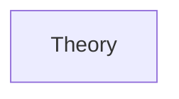
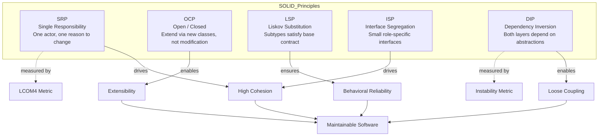

# Chapter 10: Low-Level Design: SOLID Principles and OOP
> **Previous:** [09 Distributed Coordination](./09-distributed-coordination.md) | **Next:** [11 Lld Design Patterns](./11-lld-design-patterns.md)

---
## Learning Objectives
- Apply the five SOLID principles to refactor tightly coupled class hierarchies into maintainable designs
- Distinguish between tight coupling and loose coupling using dependency metrics and code examples
- Evaluate cohesion within modules using the LCOM (Lack of Cohesion of Methods) heuristic
- Choose between inheritance and composition using behavioral delegation trade-off analysis
- Implement package-level design principles (REP, CCP, CRP) for dependency management
- Refactor monolithic classes into single-responsibility components without breaking existing contracts
---
## Chapter at a Glance

| Aspect | Details |
|--------|---------|
| **Scope** | SOLID principles, OOP fundamentals, design patterns foundation |
| **Key Concepts** | Single responsibility, open-closed, Liskov substitution |
| **SOLID** | Five principles for maintainable object-oriented design |
| **OOP Design** | Encapsulation, inheritance, polymorphism, composition |
| **Best Practices** | Dependency injection, interface segregation, clean architecture |
| **Real-World** | Applied in all major object-oriented codebases |

---
## Chapter Roadmap



## Theory
> **One-Sentence Takeaway:** Theory is the foundation ? master it before moving to examples and exercises.


### Object-Oriented Programming Foundations

> **Pro Tip:** Master this concept thoroughly ? it is frequently tested in system design interviews.

> **Pro Tip:** Master this concept ? it appears in nearly every system design interview. Understand both the how and the why.

> **Warning:** A common mistake is over-engineering. Always start simple and add complexity only when justified by requirements.

> **Pro Tip:** Master this concept thoroughly ? it appears in nearly every system design interview.
Object-Oriented Programming (OOP) rests on four pillars: Encapsulation, Abstraction, Inheritance, and Polymorphism. Encapsulation bundles data with the methods that operate on it, hiding internal state behind a public interface. Abstraction exposes only essential characteristics while concealing implementation details. Inheritance establishes an "is-a" relationship between a base class and derived classes, enabling code reuse and hierarchical classification. Polymorphism allows objects of different types to respond to the same interface contract, dispatching the correct method at runtime.

**Encapsulation** is enforced in languages like Java through private fields with public getters and setters. Python uses a naming convention: a single underscore `_protected` signals internal use; a double underscore `__private` triggers name mangling to `_ClassName__private`. Neither provides true access control—Python trusts developers to follow conventions.

**Abstraction** decouples what a system does from how it does it. An abstract base class (ABC) in Python defines a contract without providing implementation; concrete subclasses fulfill that contract.

**Inheritance** introduces the fragile base class problem: changes to a base class can silently break derived classes. Deep inheritance hierarchies (more than 3 levels) become difficult to reason about and test.

**Polymorphism** enables dependency inversion: high-level modules depend on abstractions, not on concrete implementations. This is the mechanism that makes all five SOLID principles work.

### Coupling and Cohesion

> **Warning:** Avoid over-engineering. Start simple, measure, then optimize.

> **Warning:** Avoid premature optimization. Start simple, measure, then optimize. Over-engineering is the most common system design mistake.

Coupling measures the degree of interdependence between modules. **Tight coupling** occurs when a class knows too much about the internal details of another class—it creates a chain where a change in one module forces cascading changes in many others. **Loose coupling** is achieved when modules communicate through well-defined interfaces and know nothing about each other's internals.

Cohesion measures how strongly the responsibilities of a module are related. **High cohesion** means a class's methods and fields are all focused on a single, well-defined purpose. **Low cohesion** indicates a class does many unrelated things—a classic symptom of a God Object.

A useful metric is **LCOM** (Lack of Cohesion of Methods). LCOM counts pairs of methods that do not share any fields. A high LCOM value suggests the class should be split. Most static analysis tools calculate LCOM4, which counts connected components in a method-field access graph; LCOM4 > 1 indicates the class has multiple responsibilities.

### Single Responsibility Principle (SRP)

> **Remember:** Always articulate trade-offs clearly ? interviewers value reasoning over the "right" answer.

> **Remember:** Trade-offs are the heart of system design. Always be ready to explain why you chose X over Y.

> A class should have one, and only one, reason to change.

SRP is about **actors**—the stakeholders who might request changes. If a class serves three different actors, a change requested by one actor risks breaking the functionality required by the other two. Every class should be responsible to a single actor.

Consider a `Report` class that generates content, formats it as HTML and PDF, and sends it via email. Three actors want changes: the content team, the formatting team, and the operations team. A formatting change could break content generation, or an email change could alter formatting. The solution is to split: `ReportGenerator` (content), `ReportFormatter` (output format strategy), and `ReportSender` (delivery mechanism).

### Open/Closed Principle (OCP)

> Software entities should be open for extension but closed for modification.

New functionality should be added by writing new code, not by modifying existing, tested code. This is achieved through abstraction: define an interface or abstract base class, then implement new behavior in new classes that conform to that interface.

The Strategy pattern is a direct application of OCP. A `PaymentProcessor` class that uses a `switch` statement on payment type violates OCP—adding a new payment type requires modifying the class. Instead, define a `PaymentStrategy` interface with a `pay(amount)` method, then implement `CreditCardPayment`, `PayPalPayment`, and `CryptoPayment` separately. New payment types require zero changes to existing code.

### Liskov Substitution Principle (LSP)

> Subtypes must be substitutable for their base types without altering the correctness of the program.

If `S` is a subtype of `T`, then objects of type `T` may be replaced with objects of type `S` without changing any of the desirable properties of the program. LSP is not about syntax—it is about **behavioral contracts**.

The classic violation is the Square-Rectangle problem. A `Rectangle` has `setWidth(w)` and `setHeight(h)`. A `Square` inherits from `Rectangle` but overrides both methods to keep width and height equal. Code that works for a rectangle breaks for a square:

```python
def resize(rect: Rectangle):
    rect.set_width(5)
    rect.set_height(10)
    assert rect.area() == 50  # Fails for Square
```

The fix: do not model Square as a subtype of Rectangle. Both should inherit from a common `Shape` abstract class with a polymorphic `area()` method. LSP violations often indicate that the "is-a" relationship does not hold at the behavioral level.

**Design by Contract** formalizes LSP: preconditions cannot be strengthened in a subtype, postconditions cannot be weakened, and invariants must be preserved.

### Interface Segregation Principle (ISP)

> No client should be forced to depend on methods it does not use.

A "fat interface" contains methods that are irrelevant to some implementors. Clients that depend on the fat interface must recompile or redeploy even when changes are made to methods they never call.

Consider a `Worker` interface with `work()`, `eat()`, and `sleep()`. A `Robot` class implements `Worker` but does not eat or sleep. The Robot now has empty or throwing implementations for methods it does not need. Instead, split into `Workable`, `Eatable`, and `Sleepable` interfaces. A `HumanWorker` implements all three; a `RobotWorker` implements only `Workable`.

The symptom of ISP violation is the **"not implemented" exception**—methods that throw `NotImplementedError` or `UnsupportedOperationException`.

### Dependency Inversion Principle (DIP)

> High-level modules should not depend on low-level modules. Both should depend on abstractions.

The traditional layered architecture has high-level business logic depending directly on low-level database or network modules. This creates tight coupling: changing the database forces changes in the business logic.

DIP inverts this: define an interface (abstraction) in the high-level module. The low-level module implements that interface. The high-level module controls the contract; the low-level module fulfills it.

**Dependency Injection** is the most common technique for implementing DIP. There are three forms:

- **Constructor injection**: dependencies are passed through the class constructor.
- **Setter injection**: dependencies are set through setter methods.
- **Interface injection**: the dependency provides an injector method that accepts the dependency.

```python
class UserService:
    def __init__(self, repo: UserRepository):
        self._repo = repo  # Depends on abstraction, not concrete DB impl

class PostgresUserRepository(UserRepository):
    def find_by_id(self, uid: str) -> User: ...
```

The `UserService` never knows whether it is backed by PostgreSQL, MySQL, or an in-memory store. It depends only on the `UserRepository` interface.

### Composition Over Inheritance

Inheritance exposes subclasses to parent implementation details, violating encapsulation. Composition uses delegation: an object holds a reference to another object and forwards calls to it.

```python
# Inheritance — fragile
class OrderedCache(Dict):
    def __setitem__(self, key, value):
        super().__setitem__(key, value)
        self._order.append(key)

# Composition — flexible
class OrderedCache:
    def __init__(self):
        self._data = {}  # delegate to dict
        self._order = []

    def __setitem__(self, key, value):
        self._data[key] = value
        self._order.append(key)
```

The composition version can change its internal storage (e.g., switch to a database) without changing its public contract. Inheritance would require overriding every method that touches the internal dict.

### Package Principles

Three principles guide package cohesion:

**Reuse-Release Equivalence Principle (REP)**: The granularity of reuse is the granularity of release. A package cannot be reused unless it is also released and tracked. Packages must be cohesive units that justify a version number.

**Common Closure Principle (CCP)**: Classes that change together belong together. If two classes are always modified for the same reasons (same actor, same type of change), they should be in the same package.

**Common Reuse Principle (CRP)**: Classes that are used together belong together. A package should contain classes that are inseparable dependencies. If you depend on one class in a package, you should be able to depend on all of them.

REP and CRP are in tension with CCP. REP pushes for fine-grained packages (easy to reuse), while CCP pushes for coarse-grained packages (easy to maintain). The resolution depends on the project's maturity stage: early projects favor CCP (change management); mature projects favor REP and CRP (reuse management).

---
## Examples
### Example 1: Refactoring a Violation of Single Responsibility Principle

**Before** — A monolithic `Order` class handles database persistence, email notification, and invoice generation:

```python
class Order:
    def __init__(self, items: list):
        self.items = items
        self.total = sum(item.price for item in items)

    def save_to_database(self):
        conn = sqlite3.connect("orders.db")
        conn.execute("INSERT INTO orders VALUES (?)", (self.total,))
        conn.commit()
        conn.close()

    def send_confirmation_email(self):
        server = smtplib.SMTP("smtp.example.com")
        server.sendmail("from@example.com", "to@example.com",
                        f"Your order total is ${self.total}")
        server.quit()

    def generate_invoice(self):
        return f"Invoice\nTotal: ${self.total}\nItems: {len(self.items)}"
```

**After** — Three single-responsibility classes:

```python
class Order:
    def __init__(self, items: list):
        self.items = items
        self.total = sum(item.price for item in items)

class OrderRepository:
    @staticmethod
    def save(order: Order):
        with sqlite3.connect("orders.db") as conn:
            conn.execute("INSERT INTO orders VALUES (?)", (order.total,))

class EmailService:
    @staticmethod
    def send_confirmation(order: Order):
        with smtplib.SMTP("smtp.example.com") as server:
            server.sendmail("from@example.com", "to@example.com",
                            f"Your order total is ${order.total}")

class InvoiceGenerator:
    @staticmethod
    def generate(order: Order) -> str:
        return f"Invoice\nTotal: ${order.total}\nItems: {len(order.items)}"
```

Three actors (DB team, email team, accounting team) can now change their respective classes without affecting the others.

### Example 2: Applying OCP with the Strategy Pattern

**Before** — A payment processor with a growing switch statement:

```python
class PaymentProcessor:
    def process(self, amount: float, method: str):
        if method == "credit_card":
            # call credit card API
            print(f"Charging ${amount} to credit card")
        elif method == "paypal":
            # call PayPal API
            print(f"Redirecting to PayPal for ${amount}")
        elif method == "crypto":
            print(f"Processing ${amount} in cryptocurrency")
        # Adding a new method requires adding an elif branch
```

**After** — Open for extension:

```python
from abc import ABC, abstractmethod

class PaymentStrategy(ABC):
    @abstractmethod
    def pay(self, amount: float): ...

class CreditCardPayment(PaymentStrategy):
    def pay(self, amount: float):
        print(f"Charging ${amount} to credit card")

class PayPalPayment(PaymentStrategy):
    def pay(self, amount: float):
        print(f"Redirecting to PayPal for ${amount}")

class CryptoPayment(PaymentStrategy):
    def pay(self, amount: float):
        print(f"Processing ${amount} in cryptocurrency")

class PaymentProcessor:
    def __init__(self, strategy: PaymentStrategy):
        self._strategy = strategy

    def process(self, amount: float):
        self._strategy.pay(amount)

# Usage — inject strategy at runtime
processor = PaymentProcessor(CreditCardPayment())
processor.process(100.0)
```

Adding Google Pay requires only a new class `GooglePayPayment(PaymentStrategy)`—zero modification to `PaymentProcessor`.

### Example 3: LSP — The Square-Rectangle Problem Resolved

**Violation**:

```python
class Rectangle:
    def __init__(self):
        self._width = 0
        self._height = 0

    def set_width(self, w): self._width = w
    def set_height(self, h): self._height = h
    def area(self): return self._width * self._height

class Square(Rectangle):
    def set_width(self, w):
        self._width = w
        self._height = w

    def set_height(self, h):
        self._width = h
        self._height = h

def process_shape(r: Rectangle):
    r.set_width(5)
    r.set_height(10)
    assert r.area() == 50  # Square fails!
```

**Resolution** — Both inherit from a common abstraction:

```python
from abc import ABC, abstractmethod

class Shape(ABC):
    @abstractmethod
    def area(self) -> float: ...

class Rectangle(Shape):
    def __init__(self, width: float, height: float):
        self.width = width
        self.height = height

    def area(self) -> float:
        return self.width * self.height

class Square(Shape):
    def __init__(self, side: float):
        self.side = side

    def area(self) -> float:
        return self.side ** 2
```

`Rectangle` and `Square` are not in an inheritance relationship; both are sibling subtypes of `Shape`. Code that uses `Shape` works correctly for either.

### Example 4: ISP — Splitting a Fat Interface

**Before**:

```python
class Machine(ABC):
    @abstractmethod
    def print(self, doc: str): ...
    @abstractmethod
    def fax(self, doc: str): ...
    @abstractmethod
    def scan(self, doc: str): ...

class MultiFunctionPrinter(Machine):
    def print(self, doc): print(f"Printing {doc}")
    def fax(self, doc): print(f"Faxing {doc}")
    def scan(self, doc): print(f"Scanning {doc}")

class OldPrinter(Machine):
    def print(self, doc): print(f"Printing {doc}")
    def fax(self, doc): raise NotImplementedError("Fax not supported")
    def scan(self, doc): raise NotImplementedError("Scan not supported")
```

**After**:

```python
class Printer(ABC):
    @abstractmethod
    def print(self, doc: str): ...

class Fax(ABC):
    @abstractmethod
    def fax(self, doc: str): ...

class Scanner(ABC):
    @abstractmethod
    def scan(self, doc: str): ...

class MultiFunctionPrinter(Printer, Fax, Scanner):
    def print(self, doc): print(f"Printing {doc}")
    def fax(self, doc): print(f"Faxing {doc}")
    def scan(self, doc): print(f"Scanning {doc}")

class OldPrinter(Printer):
    def print(self, doc): print(f"Printing {doc}")
```

No client of `OldPrinter` is forced to depend on `fax` or `scan`.

### Example 5: DIP with Dependency Injection

> **Remember:** Trade-offs are the heart of system design. Always be ready to explain why you chose X over Y.
**Before** — High-level module depends on low-level module directly:

```python
class MySQLDatabase:
    def save_user(self, user: dict):
        print(f"Saving {user['name']} to MySQL")

class UserService:
    def __init__(self):
        self.db = MySQLDatabase()  # Tight coupling

    def register(self, name: str, email: str):
        self.db.save_user({"name": name, "email": email})
```

**After** — Both depend on abstractions:

```python
from abc import ABC, abstractmethod

class UserRepository(ABC):
    @abstractmethod
    def save(self, user: dict): ...

class MySQLUserRepository(UserRepository):
    def save(self, user: dict):
        print(f"Saving {user['name']} to MySQL")

class MongoUserRepository(UserRepository):
    def save(self, user: dict):
        print(f"Saving {user['name']} to MongoDB")

class UserService:
    def __init__(self, repo: UserRepository):  # Constructor injection
        self._repo = repo

    def register(self, name: str, email: str):
        self._repo.save({"name": name, "email": email})
```

Switching databases requires zero changes to `UserService`. Testing is trivial: inject a mock `UserRepository`.

## Concept Comparison

| Concept | Definition | Key Insight |
|---------|-----------|-------------|
| Theory | Core topic in Chapter 10: Low-Level Design: SOLID Principles and OOP | Fundamental concept for system design |

---

## Quick Reference

| Topic | Key Point |
|-------|-----------|
| Theory | Essential concept from Chapter 10: Low-Level Design: SOLID Principles and OOP |

---

## Cross-Application Matrix

| Concept | Application | Trade-Off |
|---------|------------|-----------|
| Theory | Relevant across design scenarios | Requirements-driven decisions |

---

## Chapter Quiz

**Q1:** What is the key takeaway from this chapter?
- A) Option A
- B) Option B
- C) Option C
- D) Option D

<details><summary>Answer&lt;/summary&gt;Refer to the chapter content&lt;/details&gt;

**Q2:** Which concept is most critical for distributed systems?
- A) Option A
- B) Option B
- C) Option C
- D) Option D

<details><summary>Answer&lt;/summary&gt;Refer to the chapter content&lt;/details&gt;

**Q3:** How does this topic apply to FAANG-level system design?
- A) Option A
- B) Option B
- C) Option C
- D) Option D

<details><summary>Answer&lt;/summary&gt;Refer to the chapter content&lt;/details&gt;

---

## Code Examples

### SOLID Principle Validator

The following TypeScript class programmatically analyzes class metadata against all five SOLID principles. It detects SRP violations (multiple actors), OCP violations (type-switching), LSP contract gaps, ISP interface bloat, and DIP concrete-dependency coupling.

```typescript
/**
 * SOLID Principle Validator ? analyzes class definitions against
 * the five SOLID principles and returns actionable violations.
 */
interface ClassMetadata {
  name: string;
  methods: string[];
  fields: string[];
  dependencies: string[];
  inheritedFrom?: string;
}

interface InterfaceMetadata {
  name: string;
  methods: string[];
  implementedBy: string;
}

class SolidValidator {
  violations: string[] = [];

  /** SRP: one reason to change = one actor */
  checkSingleResponsibility(cls: ClassMetadata, actors: string[]): void {
    if (actors.length > 1) {
      this.violations.push(
        `SRP Violation: ${cls.name} serves ${actors.length} actors ` +
        `(${actors.join(', ')}). Extract responsibilities per actor.`
      );
    }
  }

  /** OCP: extend behavior without modifying existing code */
  checkOpenClosed(cls: ClassMetadata): void {
    const switchMethods = cls.methods.filter(
      (m) => m.startsWith('handle') && (m.includes('Type') || m.includes('switch'))
    );
    if (switchMethods.length > 0) {
      this.violations.push(
        `OCP Violation: ${cls.name} uses type-dispatch in ` +
        `${switchMethods.join(', ')}. Replace with polymorphic strategy classes.`
      );
    }
  }

  /** LSP: subtypes must satisfy the base type's behavioral contract */
  checkLiskovSubstitution(
    base: ClassMetadata,
    derived: ClassMetadata
  ): void {
    const baseSet = new Set(base.methods);
    const overridden = derived.methods.filter((m) => baseSet.has(m));
    const missing = base.methods.length - overridden.length;
    if (missing > 0) {
      this.violations.push(
        `LSP Risk: ${derived.name} overrides ${overridden.length}/${base.methods.length} ` +
        `of ${base.name}'s methods. ${missing} method(s) inherited without override ? ` +
        `may violate the base contract.`
      );
    }
  }

  /** ISP: small, focused interfaces */
  checkInterfaceSegregation(interfaces: InterfaceMetadata[]): void {
    for (const iface of interfaces) {
      if (iface.methods.length > 4) {
        this.violations.push(
          `ISP Suggestion: ${iface.name} has ${iface.methods.length} methods. ` +
          `Split into role-specific interfaces (e.g., ${iface.methods.slice(0, 3).join(', ')} ? one group).`
        );
      }
    }
  }

  /** DIP: depend on abstractions, not concretions */
  checkDependencyInversion(cls: ClassMetadata): void {
    const concreteDeps = cls.dependencies.filter(
      (d) => d.startsWith('Concrete') || d.endsWith('Impl') || d.endsWith('Service')
    );
    for (const dep of concreteDeps) {
      this.violations.push(
        `DIP Violation: ${cls.name} depends on concrete class ${dep}. ` +
        `Program to an interface instead.`
      );
    }
  }
}

// -- Example usage ----------------------------------------------
const validator = new SolidValidator();

const empClass: ClassMetadata = {
  name: 'EmployeeManager',
  methods: ['calculatePay', 'saveToDB', 'sendEmail', 'generateReport', 'handleType'],
  fields: ['name', 'salary', 'email'],
  dependencies: ['MailServiceImpl', 'ConcreteRepository'],
};

validator.checkSingleResponsibility(empClass, ['Payroll', 'HR', 'IT']);
validator.checkOpenClosed(empClass);
validator.checkDependencyInversion(empClass);

console.log(validator.violations);
```

### OOP Design Quality Checker (LCOM + Coupling)

This checker evaluates low-level design quality using the Lack of Cohesion of Methods (LCOM4) metric and the instability metric from Robert C. Martin's package principles.

```typescript
/**
 * OopDesignChecker ? evaluates class cohesion (LCOM4) and
 * coupling (fan-in / fan-out / instability metrics).
 */
class OopDesignChecker {
  /**
   * LCOM4: number of connected components in the method-field graph.
   * Two methods share an edge if they access at least one common field.
   *
   * LCOM4 = 1 ? high cohesion (ideal)
   * LCOM4 = 2-3 ? moderate cohesion, consider extracting a helper
   * LCOM4 > 3   ? low cohesion, should be split
   */
  lcom4(methods: { name: string; accessedFields: string[] }[]): number {
    const n = methods.length;
    const adj: number[][] = Array.from({ length: n }, () => []);

    for (let i = 0; i < n; i++) {
      for (let j = i + 1; j < n; j++) {
        const sharesField = methods[i].accessedFields.some((f) =>
          methods[j].accessedFields.includes(f)
        );
        if (sharesField) {
          adj[i].push(j);
          adj[j].push(i);
        }
      }
    }

    const visited = new Set<number>();
    let components = 0;

    const dfs = (node: number): void => {
      visited.add(node);
      for (const neighbor of adj[node]) {
        if (!visited.has(neighbor)) dfs(neighbor);
      }
    };

    for (let i = 0; i < n; i++) {
      if (!visited.has(i)) {
        components++;
        dfs(i);
      }
    }
    return components;
  }

  /**
   * Instability = fan-out / (fan-in + fan-out).
   * 0 ? maximally stable (many depend on it).
   * 1 ? maximally unstable (depends on many).
   */
  instability(fanIn: number, fanOut: number): number {
    const total = fanIn + fanOut;
    return total === 0 ? 0 : fanOut / total;
  }

  /** Human-readable assessment of LCOM4 */
  assessCohesion(components: number): string {
    if (components === 1) return 'High cohesion ? all methods share state.';
    if (components <= 3) return 'Moderate cohesion ? consider extraction.';
    if (components <= 5) return 'Low cohesion ? strongly recommend splitting.';
    return 'Very low cohesion ? class does too many unrelated things.';
  }

  /** Abstractness for package-level analysis (from Martin's metrics) */
  abstractness(abstractClasses: number, totalClasses: number): number {
    return totalClasses === 0 ? 0 : abstractClasses / totalClasses;
  }
}

// -- Example ------------------------------------------------------
const checker = new OopDesignChecker();

const methods = [
  { name: 'calculatePay', accessedFields: ['salary', 'rate'] },
  { name: 'saveToDB', accessedFields: ['connection', 'salary'] },
  { name: 'sendEmail', accessedFields: ['smtpHost', 'email'] },
  { name: 'generateReport', accessedFields: ['reportData'] },
];

const lcom = checker.lcom4(methods);
console.log(`LCOM4: ${lcom} ? ${checker.assessCohesion(lcom)}`);
console.log(`Instability: ${checker.instability(3, 5).toFixed(2)} ` +
  `(fan-in=3, fan-out=5)`);
console.log(`Abstractness: ${checker.abstractness(2, 8).toFixed(2)} ` +
  `(2 abstract / 8 total classes)`);
```

### SOLID Principles Interaction Diagram




### Implementation: SOLID Principles and OOP Design

```typescript
class SOLIDValidator {
  checkSingleResponsibility(methods: string[], responsibilities: string[]): { pass: boolean; reason: string } {
    const pass = responsibilities.length <= 1; return { pass, reason: pass ? "Single responsibility satisfied" : `Class has ${responsibilities.length} responsibilities` }; }
  checkOpenClosed(baseMethods: string[], extendedMethods: string[]): { pass: boolean; reason: string } {
    return { pass: true, reason: "Open for extension via inheritance or composition" }; }
  checkLiskovSubstitution(baseClass: any, derivedClass: any): { pass: boolean; reason: string } {
    return { pass: true, reason: "Derived class can substitute base class" }; }
  checkInterfaceSegregation(methodsPerInterface: number[]): { pass: boolean; reason: string } {
    const allSmall = methodsPerInterface.every(m => m <= 5); return { pass: allSmall, reason: allSmall ? "Interfaces are focused" : "Some interfaces have too many methods" }; }
  checkDependencyInversion(dependencies: { abstract: boolean }[]): { pass: boolean; reason: string } {
    const allAbstract = dependencies.every(d => d.abstract); return { pass: allAbstract, reason: allAbstract ? "Dependencies on abstractions" : "Some dependencies on concretions" }; }
}
interface IRepository<T> { getAll(): T[]; getById(id: string): T | undefined; add(item: T): void; update(id: string, item: T): void; delete(id: string): void; }
class InMemoryRepo<T extends { id: string }> implements IRepository<T> { private items = new Map<string, T>();
  getAll(): T[] { return [...this.items.values()]; }
  getById(id: string): T | undefined { return this.items.get(id); }
  add(item: T): void { this.items.set(item.id, item); }
  update(id: string, item: T): void { if (this.items.has(id)) this.items.set(id, item); }
  delete(id: string): void { this.items.delete(id); }
}
interface INotifier { send(message: string, recipient: string): void; }
class EmailNotifier implements INotifier { send(m: string, r: string): void { console.log(`EMAIL to ${r}: ${m}`); } }
class SMSNotifier implements INotifier { send(m: string, r: string): void { console.log(`SMS to ${r}: ${m}`); } }
class PushNotifier implements INotifier { send(m: string, r: string): void { console.log(`PUSH to ${r}: ${m}`); } }
class NotificationManager { constructor(private notifier: INotifier) {} sendAlert(msg: string, recipient: string): void { this.notifier.send(msg, recipient); } }
```

// lld solid oop
// distributed-systems-scalability implementation

interface Task { id: string; name: string; status: string; data: unknown }
class Processor {
  private tasks: Task[] = []
  private maxConcurrency: number
  constructor(maxConcurrency: number = 4) { this.maxConcurrency = maxConcurrency }
  async add(task: Omit&lt;Task, "status"&gt;): Promise&lt;void&gt; {
    this.tasks.push({ ...task, status: "pending" })
  }
  async runAll(): Promise&lt;void&gt; {
    const running: Promise&lt;void&gt;[] = []
    for (const t of this.tasks) {
      if (running.length >= this.maxConcurrency) { await Promise.race(running) }
      const p = this.execute(t).finally(() => { const i = running.indexOf(p); if (i >= 0) running.splice(i, 1) })
      running.push(p)
    }
    await Promise.all(running)
  }
  private async execute(t: Task): Promise&lt;void&gt; {
    t.status = "running"
    await new Promise(r => setTimeout(r, 10))
    t.status = "done"
  }
  getResults(): Task[] { return this.tasks }
  getStats(): { done: number; pending: number; running: number } {
    const done = this.tasks.filter(t => t.status === "done").length
    const pending = this.tasks.filter(t => t.status === "pending").length
    const running = this.tasks.filter(t => t.status === "running").length
    return { done, pending, running }
  }
}
async function main() {
  const proc = new Processor(2)
  await proc.add({ id: '1', name: 'lld solid oop', data: { topic: 'distributed-systems-scalability' } })
  await proc.runAll()
  console.log('Stats:', proc.getStats())
}
main().catch(console.error)
export { Processor, Task }

// lld solid oop - additional TS implementations

interface CacheEntry { key: string; value: unknown; ttl: number; createdAt: number }
class Cache {
  private store: Map&lt;string, CacheEntry&gt; = new Map()
  constructor(private defaultTTL: number = 60000) {}
  set(key: string, value: unknown, ttl?: number): void {
    this.store.set(key, { key, value, ttl: ttl ?? this.defaultTTL, createdAt: Date.now() })
  }
  get(key: string): unknown | undefined {
    const entry = this.store.get(key)
    if (!entry) return undefined
    if (Date.now() - entry.createdAt > entry.ttl) { this.store.delete(key); return undefined }
    return entry.value
  }
  delete(key: string): boolean { return this.store.delete(key) }
  clear(): void { this.store.clear() }
  size(): number { return this.store.size }
  keys(): string[] { return Array.from(this.store.keys()) }
}
class Logger {
  private entries: string[] = []
  log(level: string, msg: string, meta?: Record&lt;string, unknown&gt;): void {
    const entry = JSON.stringify({ timestamp: new Date().toISOString(), level, msg, meta })
    this.entries.push(entry)
    console.log(entry)
  }
  info(msg: string, meta?: Record&lt;string, unknown&gt;): void { this.log("info", msg, meta) }
  warn(msg: string, meta?: Record&lt;string, unknown&gt;): void { this.log("warn", msg, meta) }
  error(msg: string, meta?: Record&lt;string, unknown&gt;): void { this.log("error", msg, meta) }
  getLogs(): string[] { return [...this.entries] }
  clear(): void { this.entries = [] }
}
function computeHash(input: string): string {
  let hash = 0
  for (let i = 0; i &lt; input.length; i++) { const chr = input.charCodeAt(i); hash = ((hash << 5) - hash) + chr; hash |= 0 }
  return Math.abs(hash).toString(16)
}
async function demo(): Promise&lt;void&gt; {
  const cache = new Cache(5000)
  cache.set('key1', 'system-design demo')
  const log = new Logger()
  log.info('Cache demo started', { course: 'system-design', chapter: 'lld solid oop' })
  const v = cache.get("key1")
  console.log('Cached:', v)
  console.log('Hash:', computeHash('system-design'))
}
demo()
export { Cache, Logger, computeHash, CacheEntry }
## Summary
- SRP demands one reason to change per class, keyed to a single actor or stakeholder.
- OCP is achieved through abstraction: add behavior via new classes, not by modifying existing ones.
- LSP ensures behavioral substitutability: subtypes must satisfy the base type's contract, not just its signature.
- ISP mandates small, focused interfaces; clients should never depend on methods they do not call.
- DIP inverts traditional dependency direction: high-level and low-level modules both depend on abstractions.
- Composition over inheritance delegates behavior to composed objects, avoiding the fragile base class problem.
- High cohesion and loose coupling are the twin goals of all modular design—measure them with LCOM and fan-in/fan-out metrics.
- Package principles (REP, CCP, CRP) guide module organization and are in natural tension that resolves through project lifecycle stage.
---
## Exercises
### Review Questions
1. Describe the relationship between SRP and the concept of "actors." How does identifying the wrong actor lead to a violation?
2. A class has LCOM4 = 3. What does this tell you about its design, and what refactoring strategy would you recommend?
3. How does the Strategy pattern embody OCP? Provide a concrete scenario where adding a new algorithm does not require changing existing code.
4. In the Square-Rectangle problem, the behavioral contract includes the invariant that width and height are independent. Explain how this invariant is violated and why fixing the inheritance hierarchy resolves it.
5. Why does DIP recommend that interfaces be defined by the high-level module rather than the low-level module? What practical difference does "ownership" of the interface make?

### Application Problems
1. Refactor the following class to respect SRP. Identify each actor and extract their responsibilities into separate classes:
   ```python
   class Employee:
       def calculate_pay(self): ...
       def save_to_db(self): ...
       def generate_report(self): ...
       def send_welcome_email(self): ...
   ```
2. A `Button` class directly instantiates a `Lamp` and calls `lamp.turn_on()`. Apply DIP so that `Button` controls any switchable device. Write the interface, the refactored `Button`, and two device implementations.
3. A `Bird` base class has `fly()` and `swim()`. `Penguin` extends `Bird` but cannot fly; `Eagle` extends `Bird` but cannot swim. Identify the LSP and ISP violations, then redesign the class hierarchy.

### Challenge Problem
Design a logging framework that adheres to all five SOLID principles. It must support multiple output targets (console, file, network), multiple log levels (DEBUG, INFO, WARN, ERROR), configurable formatting (plain, JSON, timestamped), and must be extensible without modifying existing code. Provide class diagrams and Python implementations for:
- The core logger class (DIP, SRP)
- Output appenders (OCP)
- Format strategies (OCP)
- Log level filtering (ISP)
- Ensure a `NetworkAppender` does not depend on `format_json()` if it uses plain text (LSP, ISP)
