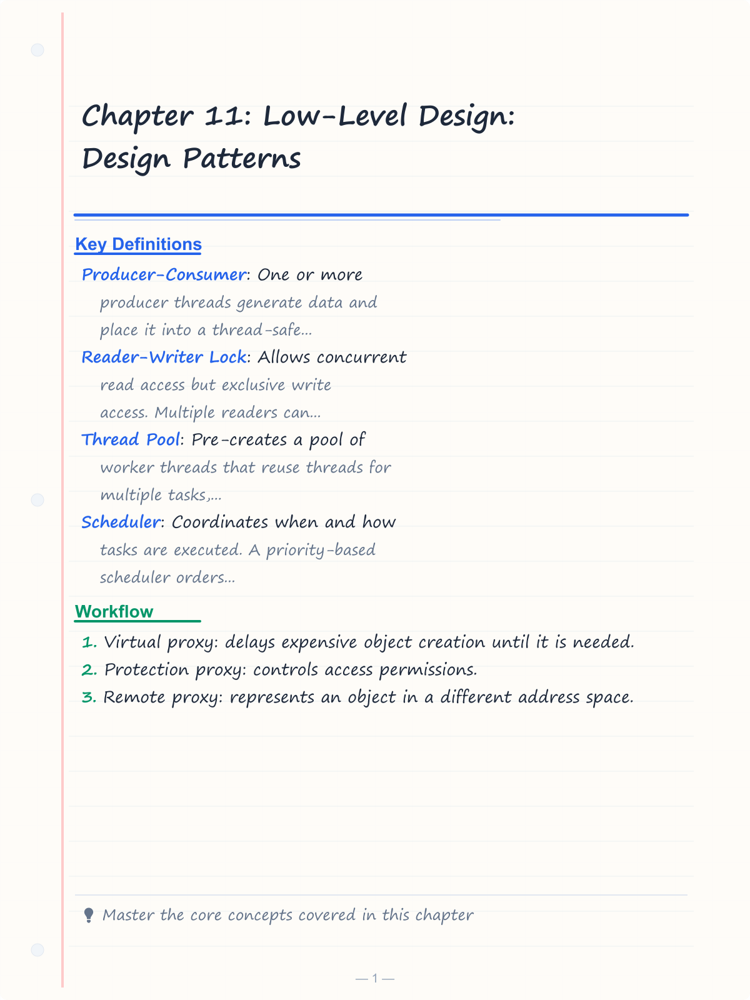
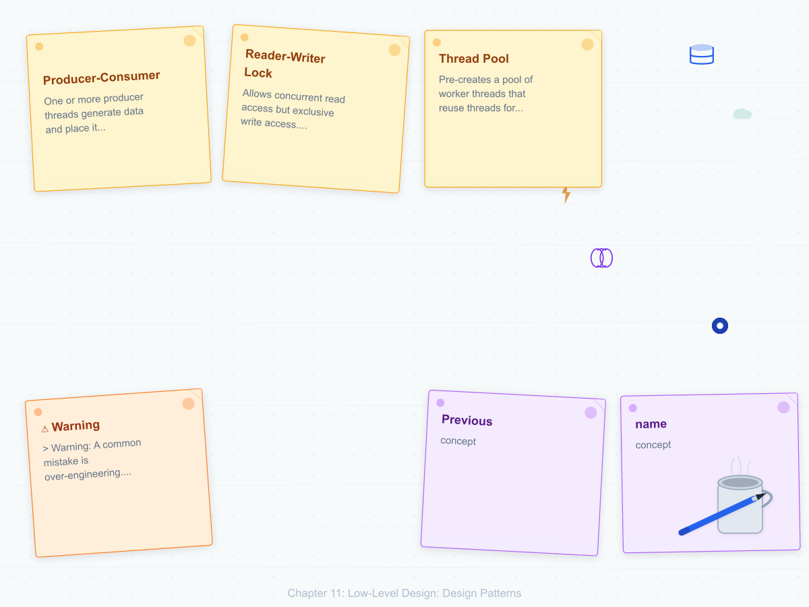
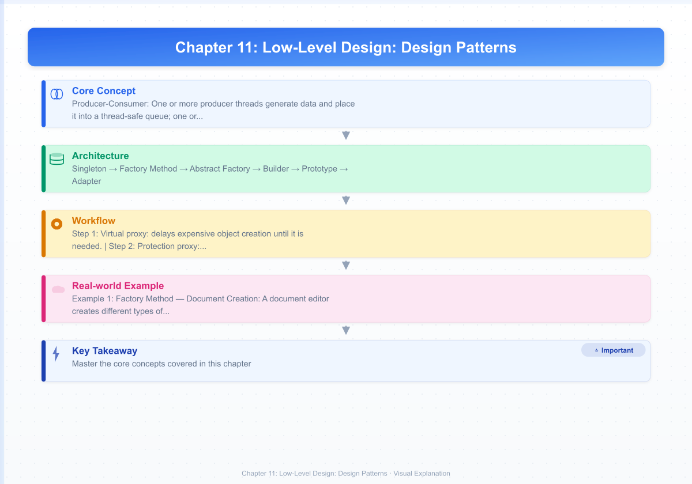
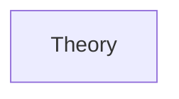

# Chapter 11: Low-Level Design: Design Patterns
> **Previous:** [10 Lld Solid Oop](./10-lld-solid-oop.md) | **Next:** [12 Lld Component Design](./12-lld-component-design.md)

---
## Learning Objectives
- Classify design patterns into creational, structural, behavioral, and concurrency categories
- Implement thread-safe Singleton with double-checked locking and understand its trade-offs
- Apply the Decorator pattern to add cross-cutting concerns without modifying existing classes
- Distinguish between the Observer and Mediator patterns for event-driven architectures
- Identify anti-patterns (God Object, Spaghetti Code, Lava Flow) in legacy codebases
- Choose among similar patterns (Factory vs Abstract Factory vs Builder) based on construction complexity
---

<!-- Image Gallery -->
<section class="lesson-visuals" aria-label="Visual learning resources">
  <header><span>VISUAL LEARNING</span><h2>See it. Review it. Remember it.</h2></header>
  <a class="lesson-visual-card" href="../../assets/images/lessons/system-design/11-lld-design-patterns/handwritten-notes.png" target="_blank" rel="noopener">
    
    <span><strong>Handwritten notes</strong>Condensed notes for deliberate review.</span>
  </a>
  <a class="lesson-visual-card" href="../../assets/images/lessons/system-design/11-lld-design-patterns/sticky-notes.png" target="_blank" rel="noopener">
    
    <span><strong>Sticky-note revision</strong>Fast recall prompts for revision.</span>
  </a>
  <a class="lesson-visual-card" href="../../assets/images/lessons/system-design/11-lld-design-patterns/visual-explanation.png" target="_blank" rel="noopener">
    
    <span><strong>Visual concept guide</strong>A connected explanation of the key ideas.</span>
  </a>
</section>
<!-- End Image Gallery -->

## Chapter at a Glance

| Aspect | Details |
|--------|---------|
| **Scope** | Creational, structural, behavioral design patterns with examples |
| **Key Concepts** | Singleton, Factory, Observer, Strategy, Adapter, Decorator |
| **Creational** | Singleton, Factory, Builder, Prototype |
| **Structural** | Adapter, Decorator, Proxy, Facade, Composite |
| **Behavioral** | Observer, Strategy, Command, Template, Iterator |
| **Real-World** | Used extensively in Java, C++, Python frameworks |

---
## Chapter Roadmap



## Theory
> **One-Sentence Takeaway:** Theory is the foundation ? master it before moving to examples and exercises.
### What Are Design Patterns?


> **Pro Tip:** Master this concept thoroughly ? it is frequently tested in system design interviews.

> **Pro Tip:** Master this concept ? it appears in nearly every system design interview. Understand both the how and the why.

> **Warning:** A common mistake is over-engineering. Always start simple and add complexity only when justified by requirements.

> **Pro Tip:** Master this concept thoroughly ? it appears in nearly every system design interview.
Design patterns are reusable, battle-tested solutions to recurring design problems. They are not code templates but rather formalized best practices that provide a shared vocabulary for designers. The Gang of Four (GoF) book "Design Patterns: Elements of Reusable Object-Oriented Software" (1994) cataloged 23 patterns into three categories: Creational, Structural, and Behavioral.

A pattern has four essential elements: a **name** (shared vocabulary), a **problem** (when to apply it), a **solution** (the abstraction and relationships), and **consequences** (trade-offs and results).


### Creational Patterns


> **Warning:** Avoid over-engineering. Start simple, measure, then optimize.

> **Warning:** Avoid premature optimization. Start simple, measure, then optimize. Over-engineering is the most common system design mistake.

Creational patterns abstract the instantiation process, making a system independent of how its objects are created, composed, and represented.

**Singleton** ensures a class has exactly one instance and provides a global access point. The challenge is thread safety. Double-checked locking (DCL) acquires a lock only when the instance is null, then checks again after acquiring the lock to avoid a race condition on first access.

```python
import threading

class Singleton:
    _instance = None
    _lock = threading.Lock()

    def __new__(cls):
        if cls._instance is None:           # First check (no lock)
            with cls._lock:                 # Acquire lock
                if cls._instance is None:    # Second check (with lock)
                    cls._instance = super().__new__(cls)
        return cls._instance
```

Singleton is controversial. It introduces global state, making tests interdependent and hiding dependencies. Many modern frameworks use dependency injection containers instead, which manage object lifecycles without global state.

**Factory Method** defines an interface for creating an object but lets subclasses decide which class to instantiate. The creation logic is deferred to subclasses.

**Abstract Factory** provides an interface for creating families of related objects without specifying their concrete classes. A GUI toolkit might have `Button`, `Checkbox`, and `Slider` families for Windows, macOS, and Linux themes.

**Builder** separates the construction of a complex object from its representation, allowing the same construction process to produce different representations. A **fluent interface** chains method calls for readability:

```python
class PizzaBuilder:
    def __init__(self):
        self._size = None
        self._cheese = False
        self._toppings = []

    def set_size(self, size): self._size = size; return self
    def add_cheese(self): self._cheese = True; return self
    def add_topping(self, t): self._toppings.append(t); return self

    def build(self) -> Pizza:
        return Pizza(self._size, self._cheese, self._toppings)

pizza = PizzaBuilder().set_size("large").add_cheese().add_topping("pepperoni").build()
```

**Prototype** creates new objects by cloning an existing instance (the prototype), avoiding costly construction. The prototype pattern is particularly useful when object creation is expensive and most instances are similar to an existing one.

### Structural Patterns


> **Remember:** Always articulate trade-offs clearly ? interviewers value reasoning over the "right" answer.

> **Remember:** Trade-offs are the heart of system design. Always be ready to explain why you chose X over Y.

Structural patterns concern class and object composition—how entities use each other to form larger structures.

**Adapter** converts the interface of a class into another interface that clients expect. A **class adapter** uses multiple inheritance; an **object adapter** uses composition. The object adapter is more flexible because it adapts not just a class but an entire hierarchy.

**Decorator** attaches additional responsibilities to an object dynamically. Decorators provide a flexible alternative to subclassing for extending functionality. Python's function decorators (`@decorator`) are a language-level implementation of this pattern.

```python
from functools import wraps

def log_calls(func):
    @wraps(func)
    def wrapper(*args, **kwargs):
        print(f"Calling {func.__name__} with {args}")
        return func(*args, **kwargs)
    return wrapper

@log_calls
def compute(x: int) -> int:
    return x * 2
```

**Facade** provides a unified interface to a set of interfaces in a subsystem. It defines a higher-level interface that makes the subsystem easier to use. The Facade does not encapsulate the subsystem—it merely provides a simplified interface.

**Proxy** provides a surrogate or placeholder for another object to control access to it. Variants include:
- **Virtual proxy**: delays expensive object creation until it is needed.
- **Protection proxy**: controls access permissions.
- **Remote proxy**: represents an object in a different address space.

**Composite** composes objects into tree structures to represent part-whole hierarchies. Clients treat individual objects and compositions uniformly through a common `Component` interface.

### Behavioral Patterns


Behavioral patterns concern algorithms and the assignment of responsibilities between objects.

**Observer** defines a one-to-many dependency between objects such that when one object changes state, all its dependents are notified and updated automatically. The publisher (subject) maintains a list of subscribers and broadcasts events to them.

```python
class EventBus:
    def __init__(self):
        self._subscribers = {}

    def subscribe(self, event_type: str, callback):
        self._subscribers.setdefault(event_type, []).append(callback)

    def publish(self, event_type: str, data):
        for callback in self._subscribers.get(event_type, []):
            callback(data)
```

**Strategy** defines a family of algorithms, encapsulates each one, and makes them interchangeable. Strategy lets the algorithm vary independently from the clients that use it.

**Command** encapsulates a request as an object, thereby letting consumers parameterize clients with different requests, queue or log requests, and support undoable operations. Each command implements `execute()` and optional `undo()`. Commands can be stored in a history stack to support multi-level undo.

**State** allows an object to alter its behavior when its internal state changes. The object appears to change its class. Each state is a separate class implementing a common interface; transitions are handled within state classes.

**Template Method** defines the skeleton of an algorithm in a base class, deferring some steps to subclasses. Subclasses redefine certain steps without changing the algorithm's structure. It is one of the most common patterns—essentially "Hollywood Principle": don't call us, we'll call you.

**Chain of Responsibility** passes a request along a chain of handlers. Each handler decides either to process the request or to pass it to the next handler in the chain. Middleware pipelines in web frameworks (Express.js, ASP.NET Core) are textbook examples.

**Iterator** provides a way to access the elements of an aggregate object sequentially without exposing its underlying representation. Python's `__iter__` and `__next__` protocols make any class iterable.

**Mediator** defines an object that encapsulates how a set of objects interact. It promotes loose coupling by keeping objects from referring to each other explicitly. An air traffic control tower is the real-world analogy—planes communicate through the tower, not directly with each other.

### Concurrency Patterns


Concurrency patterns address the complexities of coordinating multiple threads of execution.

**Producer-Consumer**: One or more producer threads generate data and place it into a thread-safe queue; one or more consumer threads retrieve and process it. Python's `queue.Queue` handles the synchronization.

**Reader-Writer Lock**: Allows concurrent read access but exclusive write access. Multiple readers can hold the lock simultaneously; a writer must wait for all readers to release. Python's `threading.RLock` or `asyncio.Lock` can be extended for this.

**Thread Pool**: Pre-creates a pool of worker threads that reuse threads for multiple tasks, avoiding the overhead of thread creation and destruction. The `concurrent.futures.ThreadPoolExecutor` in Python is a production-grade implementation.

**Scheduler**: Coordinates when and how tasks are executed. A priority-based scheduler orders tasks by their scheduled time. A work-stealing scheduler dynamically rebalances load across worker queues (used by Go's goroutine scheduler and Java's ForkJoinPool).

**Active Object**: Decouples method execution from method invocation to enhance concurrency and simplify synchronized access. Each object has its own thread of control and a queue of pending requests.

### Anti-Patterns


Anti-patterns are common but ineffective solutions that appear attractive at first but create long-term maintenance problems.

**God Object** (aka Blob): A single class that knows too much or does too much. Symptoms include hundreds of methods and fields across dozens of responsibilities. Resolution: decompose by SRP.

**Spaghetti Code**: Code with an unstructured, tangled control flow. Characterized by extensive use of `goto` (or its equivalents—deeply nested conditionals, exception-based control flow). Resolution: apply structured programming and extract methods.

**Copy-Paste Programming**: Duplicating code instead of abstracting common behavior. Leads to inconsistent fixes (fixed in one copy but not another). Resolution: extract duplicated logic into shared methods or classes.

**Lava Flow**: Dead code, commented-out blocks, and abandoned experimental code left in the production codebase. Developers are afraid to remove it. Resolution: aggressively delete; source control preserves history.

### Pattern Comparison


| Pattern | Category | When to Use |
|---------|----------|-------------|
| Singleton | Creational | Exactly one instance required; global access point acceptable |
| Factory Method | Creational | A class cannot anticipate the class of objects it must create |
| Abstract Factory | Creational | Families of related products must be created together |
| Builder | Creational | Construction has many steps and different representations |
| Prototype | Creational | Object creation is expensive; instances are similar |
| Adapter | Structural | Incompatible interfaces need to work together |
| Decorator | Structural | Responsibilities must be added dynamically without subclassing |
| Facade | Structural | A simple interface to a complex subsystem is needed |
| Proxy | Structural | Access to an object must be controlled or deferred |
| Composite | Structural | Part-whole hierarchies must be treated uniformly |
| Observer | Behavioral | One object needs to broadcast state changes to many others |
| Strategy | Behavioral | Algorithm selection must vary independently from clients |
| Command | Behavioral | Requests must be queued, logged, or undone |
| State | Behavioral | Object behavior changes with internal state |
| Template Method | Behavioral | Algorithm skeleton is fixed; steps vary |
| Chain of Responsibility | Behavioral | Request processing should be dynamic and ordered |
| Mediator | Behavioral | Many-to-many communication needs central coordination |

---
## Examples
### Example 1: Factory Method — Document Creation

A document editor creates different types of documents. The editor should not know the concrete document type at compile time.

```python
from abc import ABC, abstractmethod

class Document(ABC):
    @abstractmethod
    def open(self): ...
    @abstractmethod
    def save(self): ...

class TextDocument(Document):
    def open(self): print("Opening text document")
    def save(self): print("Saving text document")

class SpreadsheetDocument(Document):
    def open(self): print("Opening spreadsheet")
    def save(self): print("Saving spreadsheet")

class Application(ABC):
    @abstractmethod
    def create_document(self) -> Document: ...

    def new_document(self):
        doc = self.create_document()
        doc.open()
        return doc

class TextEditor(Application):
    def create_document(self) -> Document:
        return TextDocument()

class SpreadsheetApp(Application):
    def create_document(self) -> Document:
        return SpreadsheetDocument()
```

### Example 2: Decorator — Adding Compression and Encryption to a Data Stream

The base component reads/writes raw data. Decorators add compression and encryption without modifying the base class.

```python
from abc import ABC, abstractmethod

class DataSource(ABC):
    @abstractmethod
    def write(self, data: str): ...
    @abstractmethod
    def read(self) -> str: ...

class FileDataSource(DataSource):
    def __init__(self, path: str):
        self._path = path

    def write(self, data: str):
        with open(self._path, 'w') as f:
            f.write(data)

    def read(self) -> str:
        with open(self._path, 'r') as f:
            return f.read()

class DataSourceDecorator(DataSource):
    def __init__(self, source: DataSource):
        self._wraps = source

    def write(self, data: str):
        self._wraps.write(data)

    def read(self) -> str:
        return self._wraps.read()

class CompressionDecorator(DataSourceDecorator):
    def write(self, data: str):
        compressed = f"[COMPRESSED]{data}[/COMPRESSED]"
        super().write(compressed)

    def read(self) -> str:
        raw = super().read()
        return raw.replace("[COMPRESSED]", "").replace("[/COMPRESSED]", "")

class EncryptionDecorator(DataSourceDecorator):
    def write(self, data: str):
        encrypted = f"[ENCRYPTED]{data}[/ENCRYPTED]"
        super().write(encrypted)

    def read(self) -> str:
        raw = super().read()
        return raw.replace("[ENCRYPTED]", "").replace("[/ENCRYPTED]", "")

# Usage — compose decorators at runtime
source = FileDataSource("data.txt")
source = CompressionDecorator(source)
source = EncryptionDecorator(source)
source.write("Hello World")
print(source.read())  # Hello World
```

Decorators can be stacked in any order, providing enormous flexibility at composition time.

### Example 3: Command Pattern — Undo in a Text Editor

Each operation is a command object that knows how to execute and undo itself.

```python
from abc import ABC, abstractmethod

class Command(ABC):
    @abstractmethod
    def execute(self): ...
    @abstractmethod
    def undo(self): ...

class InsertTextCommand(Command):
    def __init__(self, buffer: list, text: str, pos: int):
        self._buffer = buffer
        self._text = text
        self._pos = pos

    def execute(self):
        self._buffer.insert(self._pos, self._text)

    def undo(self):
        self._buffer.pop(self._pos)

class DeleteTextCommand(Command):
    def __init__(self, buffer: list, pos: int):
        self._buffer = buffer
        self._pos = pos
        self._deleted = None

    def execute(self):
        self._deleted = self._buffer.pop(self._pos)

    def undo(self):
        self._buffer.insert(self._pos, self._deleted)

class Editor:
    def __init__(self):
        self._buffer = []
        self._history = []

    def execute(self, cmd: Command):
        cmd.execute()
        self._history.append(cmd)

    def undo(self):
        if self._history:
            cmd = self._history.pop()
            cmd.undo()

# Usage
editor = Editor()
editor.execute(InsertTextCommand(editor._buffer, "Hello", 0))
editor.execute(InsertTextCommand(editor._buffer, "World", 1))
editor.undo()  # Removes "World"
print(editor._buffer)  # ['Hello']
```

### Example 4: Observer — Stock Price Notification

Multiple displays observe stock price changes without the stock exchange knowing about them.

```python
class StockExchange:
    def __init__(self):
        self._observers = []
        self._price = 0.0

    def attach(self, observer):
        self._observers.append(observer)

    def detach(self, observer):
        self._observers.remove(observer)

    def _notify(self):
        for obs in self._observers:
            obs.update(self._price)

    def set_price(self, price: float):
        self._price = price
        self._notify()

class Display:
    def update(self, price: float):
        print(f"Display: Stock price is now ${price:.2f}")

class AlertSystem:
    def update(self, price: float):
        if price > 150:
            print(f"Alert: Price threshold exceeded! ${price:.2f}")

# Usage
exchange = StockExchange()
exchange.attach(Display())
exchange.attach(AlertSystem())
exchange.set_price(155.0)
# Output:
# Display: Stock price is now $155.00
# Alert: Price threshold exceeded! $155.00
```

### Example 5: State Pattern — Vending Machine

A vending machine behaves differently based on whether it is idle, has money inserted, or is dispensing a product.

```python
from abc import ABC, abstractmethod

class VendingMachineState(ABC):
    @abstractmethod
    def insert_money(self, amount: float): ...
    @abstractmethod
    def select_product(self, code: str): ...
    @abstractmethod
    def dispense(self): ...

class IdleState(VendingMachineState):
    def __init__(self, machine):
        self._machine = machine

    def insert_money(self, amount: float):
        self._machine.balance = amount
        self._machine.set_state(self._machine.has_money_state)
        print(f"Inserted ${amount}")

    def select_product(self, code: str):
        print("Insert money first")

    def dispense(self):
        print("Insert money first")

class HasMoneyState(VendingMachineState):
    def __init__(self, machine):
        self._machine = machine

    def insert_money(self, amount: float):
        self._machine.balance += amount
        print(f"Balance: ${self._machine.balance}")

    def select_product(self, code: str):
        product = self._machine.products.get(code)
        if product and product.price <= self._machine.balance:
            self._machine.selected = product
            self._machine.set_state(self._machine.dispensing_state)
            print(f"Selected {product.name}")
        else:
            print("Insufficient funds or invalid code")

    def dispense(self):
        print("Select product first")

class DispensingState(VendingMachineState):
    def __init__(self, machine):
        self._machine = machine

    def insert_money(self, amount: float):
        print("Please collect your product first")

    def select_product(self, code: str):
        print("Please collect your product first")

    def dispense(self):
        product = self._machine.selected
        self._machine.balance -= product.price
        print(f"Dispensing {product.name}")
        self._machine.set_state(self._machine.idle_state)

class Product:
    def __init__(self, name: str, price: float):
        self.name = name
        self.price = price

class VendingMachine:
    def __init__(self):
        self.idle_state = IdleState(self)
        self.has_money_state = HasMoneyState(self)
        self.dispensing_state = DispensingState(self)
        self.state = self.idle_state
        self.balance = 0.0
        self.selected = None
        self.products = {"A1": Product("Soda", 1.50), "B2": Product("Chips", 2.00)}

    def set_state(self, state: VendingMachineState):
        self.state = state

    def insert_money(self, amount): self.state.insert_money(amount)
    def select_product(self, code): self.state.select_product(code)
    def dispense(self): self.state.dispense()

# Usage
vm = VendingMachine()
vm.insert_money(2.00)
vm.select_product("A1")
vm.dispense()
```

The state pattern eliminates the messy `if state == IDLE` conditionals. Each state encapsulates its own behavior, and transitions are explicit in the state methods.

### Example 6: Producer-Consumer with Thread-Safe Queue

> **Remember:** Trade-offs are the heart of system design. Always be ready to explain why you chose X over Y.
```python
import threading
import queue
import time
import random

def producer(q: queue.Queue, items: int):
    for i in range(items):
        item = f"item-{i}"
        q.put(item)
        print(f"Produced {item}")
        time.sleep(random.uniform(0.1, 0.3))

def consumer(q: queue.Queue, name: str):
    while True:
        item = q.get()
        if item is None:  # Poison pill signals shutdown
            q.task_done()
            break
        print(f"{name} consumed {item}")
        q.task_done()
        time.sleep(random.uniform(0.2, 0.5))

q = queue.Queue(maxsize=5)
prod = threading.Thread(target=producer, args=(q, 10))
cons = [threading.Thread(target=consumer, args=(q, f"Consumer-{i}")) for i in range(2)]

for c in cons: c.start()
prod.start()
prod.join()

q.join()  # Wait for all items to be processed
for _ in cons: q.put(None)  # Send poison pills
for c in cons: c.join()
```

## Concept Comparison

| Concept | Definition | Key Insight |
|---------|-----------|-------------|
| Theory | Core topic in Chapter 11: Low-Level Design: Design Patterns | Fundamental concept for system design |

---

## Quick Reference

| Topic | Key Point |
|-------|-----------|
| Theory | Essential concept from Chapter 11: Low-Level Design: Design Patterns |

---

## Cross-Application Matrix

| Concept | Application | Trade-Off |
|---------|------------|-----------|
| Theory | Relevant across design scenarios | Requirements-driven decisions |

---

## Chapter Quiz

| # | Question | Options | Answer |
|---|----------|---------|--------|
| 1 | Which pattern category does Singleton belong to? | A) Structural, B) Behavioral, C) Creational, D) Concurrency | C) Creational |
| 2 | How does the Decorator pattern add behavior differently than subclassing? | A) At compile time via inheritance, B) Dynamically at runtime by wrapping objects, C) By modifying the original class, D) By using global state | B) Dynamically at runtime by wrapping objects with additional responsibilities |
| 3 | In the Command pattern, what enables undo functionality? | A) The execute method, B) The history stack storing executed commands with undo logic, C) The Strategy interface, D) The Observer notification | B) The history stack storing executed commands, each implementing execute() and undo() |
| 4 | What distinguishes the State pattern from the Strategy pattern? | A) State changes behavior based on internal state; Strategy allows interchangeable algorithms, B) They are identical, C) State is for concurrency, D) Strategy is for object creation | A) State pattern changes behavior based on internal state transitions; Strategy pattern allows client to select interchangeable algorithms |
| 5 | What is the poison pill pattern in Producer-Consumer? | A) A malicious message, B) A special sentinel message that signals consumers to shut down, C) A message that causes errors, D) A high-priority message | B) A special sentinel message placed on the queue that causes consumers to exit their processing loop gracefully |

---

### TypeScript: Design Pattern Implementations

```typescript
// --- Singleton ---
class ConfigManager {
  private static instance: ConfigManager;
  private settings = new Map<string, string>();
  private constructor() {}
  static getInstance(): ConfigManager {
    if (!ConfigManager.instance) ConfigManager.instance = new ConfigManager();
    return ConfigManager.instance;
  }
  set(key: string, value: string): void { this.settings.set(key, value); }
  get(key: string): string | undefined { return this.settings.get(key); }
}

// --- Factory Method ---
interface DatabaseConnection { query(sql: string): any[]; }
class MySQLConnection implements DatabaseConnection {
  query(sql: string): any[] { return [`MySQL result for: ${sql}`]; }
}
class PostgresConnection implements DatabaseConnection {
  query(sql: string): any[] { return [`Postgres result for: ${sql}`]; }
}
abstract class DatabaseFactory { abstract createConnection(): DatabaseConnection; }
class MySQLFactory extends DatabaseFactory {
  createConnection(): DatabaseConnection { return new MySQLConnection(); }
}
class PostgresFactory extends DatabaseFactory {
  createConnection(): DatabaseConnection { return new PostgresConnection(); }
}

// --- Observer ---
interface Observer { update(event: string, data: any): void; }
class EventBus {
  private subscribers = new Map<string, Observer[]>();
  subscribe(event: string, observer: Observer): void {
    if (!this.subscribers.has(event)) this.subscribers.set(event, []);
    this.subscribers.get(event)!.push(observer);
  }
  publish(event: string, data: any): void {
    for (const obs of this.subscribers.get(event) ?? []) obs.update(event, data);
  }
}

// --- Strategy ---
interface CompressionStrategy { compress(data: string): string; }
class GzipCompression implements CompressionStrategy {
  compress(data: string): string { return `gzip(${data.slice(0, 10)}...)`; }
}
class SnappyCompression implements CompressionStrategy {
  compress(data: string): string { return `snappy(${data.slice(0, 10)}...)`; }
}
class Compressor {
  constructor(private strategy: CompressionStrategy) {}
  setStrategy(s: CompressionStrategy): void { this.strategy = s; }
  compress(data: string): string { return this.strategy.compress(data); }
}

// --- Decorator ---
interface DataSource { write(data: string): void; read(): string; }
class FileDataSource implements DataSource {
  private data = "";
  write(data: string): void { this.data = data; }
  read(): string { return this.data; }
}
class EncryptionDecorator implements DataSource {
  constructor(private wrapper: DataSource) {}
  write(data: string): void { this.wrapper.write(`encrypted(${data})`); }
  read(): string { const d = this.wrapper.read(); return d.startsWith("encrypted(") ? d.slice(10, -1) : d; }
}
class CompressionDecorator implements DataSource {
  constructor(private wrapper: DataSource) {}
  write(data: string): void { this.wrapper.write(`compressed(${data})`); }
  read(): string { const d = this.wrapper.read(); return d.startsWith("compressed(") ? d.slice(11, -1) : d; }
}
```


### Implementation: Design Patterns and Architecture

```typescript
abstract class Creator { abstract factoryMethod(): Product; operation(): string { return `Creator: ${this.factoryMethod().operation()}`; } }
class ConcreteCreatorA extends Creator { factoryMethod(): Product { return new ConcreteProductA(); } }
class ConcreteCreatorB extends Creator { factoryMethod(): Product { return new ConcreteProductB(); } }
interface Product { operation(): string; }
class ConcreteProductA implements Product { operation(): string { return "Product A"; } }
class ConcreteProductB implements Product { operation(): string { return "Product B"; } }
class BuilderPattern { private parts: string[] = []; add(part: string): this { this.parts.push(part); return this; } build(): string { const r = this.parts.join(" -> "); this.parts = []; return r; } }
class SingletonClass { private static instance: SingletonClass; private constructor() { this.data = Math.random(); } readonly data: number; static getInstance(): SingletonClass { if (!SingletonClass.instance) SingletonClass.instance = new SingletonClass(); return SingletonClass.instance; } }
class ObserverPattern { private subs = new Map<string, Set<(data: any) => void>>();
  subscribe(event: string, cb: (data: any) => void): void { if (!this.subs.has(event)) this.subs.set(event, new Set()); this.subs.get(event)!.add(cb); }
  emit(event: string, data: any): void { this.subs.get(event)?.forEach(cb => cb(data)); }
  unsubscribe(event: string, cb: (data: any) => void): void { this.subs.get(event)?.delete(cb); }
}
class StrategyPattern { constructor(private fn: (a: number) => number) {} execute(value: number): number { return this.fn(value); } setStrategy(fn: (a: number) => number): void { this.fn = fn; } }
class DecoratorPattern { operation(): string { return "base"; } }
class DecoratedA extends DecoratorPattern { constructor(private comp: DecoratorPattern) { super(); } operation(): string { return `A(${this.comp.operation()})`; } }
class FacadePattern { private sub1 = new SubSystemA(); private sub2 = new SubSystemB(); execute(): string { return `${this.sub1.prepare()} -> ${this.sub2.finalize()}`; } }
class SubSystemA { prepare(): string { return "SubA ready"; } }
class SubSystemB { finalize(): string { return "SubB done"; } }
class CommandPattern { private history: string[] = []; execute(cmd: string): void { this.history.push(cmd); } undo(): string | undefined { return this.history.pop(); } getHistory(): string[] { return [...this.history]; } }
```

// lld design patterns
// distributed-systems-scalability implementation

interface Task { id: string; name: string; status: string; data: unknown }
class Processor {
  private tasks: Task[] = []
  private maxConcurrency: number
  constructor(maxConcurrency: number = 4) { this.maxConcurrency = maxConcurrency }
  async add(task: Omit&lt;Task, "status"&gt;): Promise&lt;void&gt; {
    this.tasks.push({ ...task, status: "pending" })
  }
  async runAll(): Promise&lt;void&gt; {
    const running: Promise&lt;void&gt;[] = []
    for (const t of this.tasks) {
      if (running.length >= this.maxConcurrency) { await Promise.race(running) }
      const p = this.execute(t).finally(() => { const i = running.indexOf(p); if (i >= 0) running.splice(i, 1) })
      running.push(p)
    }
    await Promise.all(running)
  }
  private async execute(t: Task): Promise&lt;void&gt; {
    t.status = "running"
    await new Promise(r => setTimeout(r, 10))
    t.status = "done"
  }
  getResults(): Task[] { return this.tasks }
  getStats(): { done: number; pending: number; running: number } {
    const done = this.tasks.filter(t => t.status === "done").length
    const pending = this.tasks.filter(t => t.status === "pending").length
    const running = this.tasks.filter(t => t.status === "running").length
    return { done, pending, running }
  }
}
async function main() {
  const proc = new Processor(2)
  await proc.add({ id: '1', name: 'lld design patterns', data: { topic: 'distributed-systems-scalability' } })
  await proc.runAll()
  console.log('Stats:', proc.getStats())
}
main().catch(console.error)
export { Processor, Task }

// lld design patterns - additional TS implementations

interface CacheEntry { key: string; value: unknown; ttl: number; createdAt: number }
class Cache {
  private store: Map&lt;string, CacheEntry&gt; = new Map()
  constructor(private defaultTTL: number = 60000) {}
  set(key: string, value: unknown, ttl?: number): void {
    this.store.set(key, { key, value, ttl: ttl ?? this.defaultTTL, createdAt: Date.now() })
  }
  get(key: string): unknown | undefined {
    const entry = this.store.get(key)
    if (!entry) return undefined
    if (Date.now() - entry.createdAt > entry.ttl) { this.store.delete(key); return undefined }
    return entry.value
  }
  delete(key: string): boolean { return this.store.delete(key) }
  clear(): void { this.store.clear() }
  size(): number { return this.store.size }
  keys(): string[] { return Array.from(this.store.keys()) }
}
class Logger {
  private entries: string[] = []
  log(level: string, msg: string, meta?: Record&lt;string, unknown&gt;): void {
    const entry = JSON.stringify({ timestamp: new Date().toISOString(), level, msg, meta })
    this.entries.push(entry)
    console.log(entry)
  }
  info(msg: string, meta?: Record&lt;string, unknown&gt;): void { this.log("info", msg, meta) }
  warn(msg: string, meta?: Record&lt;string, unknown&gt;): void { this.log("warn", msg, meta) }
  error(msg: string, meta?: Record&lt;string, unknown&gt;): void { this.log("error", msg, meta) }
  getLogs(): string[] { return [...this.entries] }
  clear(): void { this.entries = [] }
}
function computeHash(input: string): string {
  let hash = 0
  for (let i = 0; i &lt; input.length; i++) { const chr = input.charCodeAt(i); hash = ((hash << 5) - hash) + chr; hash |= 0 }
  return Math.abs(hash).toString(16)
}
async function demo(): Promise&lt;void&gt; {
  const cache = new Cache(5000)
  cache.set('key1', 'system-design demo')
  const log = new Logger()
  log.info('Cache demo started', { course: 'system-design', chapter: 'lld design patterns' })
  const v = cache.get("key1")
  console.log('Cached:', v)
  console.log('Hash:', computeHash('system-design'))
}
demo()
export { Cache, Logger, computeHash, CacheEntry }

### TypeScript: SingletonRegistry, EventBus, and StrategyRouter

```typescript
class SingletonRegistry {
  private static instances = new Map<string, any>();
  private static locks = new Map<string, boolean>();
  private static creating = new Map<string, boolean>();

  static getInstance<T>(key: string, factory: () => T): T {
    if (this.instances.has(key)) return this.instances.get(key) as T;

    if (!this.creating.get(key)) {
      this.creating.set(key, true);
      const instance = factory();
      this.instances.set(key, instance);
      this.creating.set(key, false);
      return instance;
    }

    while (this.creating.get(key)) {
      // spin-wait for concurrent creation
    }
    return this.instances.get(key) as T;
  }

  static register<T>(key: string, instance: T): void {
    if (!this.instances.has(key)) {
      this.instances.set(key, instance);
    }
  }

  static clear(): void {
    this.instances.clear();
    this.creating.clear();
  }

  static getKeys(): string[] {
    return [...this.instances.keys()];
  }
}

class EventBus {
  private handlers = new Map<string, Set<{ handler: (event: any) => void; async: boolean }>>();
  private history = new Map<string, any[]>();

  on<T>(event: string, handler: (event: T) => void): void {
    if (!this.handlers.has(event)) this.handlers.set(event, new Set());
    this.handlers.get(event)!.add({ handler, async: false });
  }

  asyncOn<T>(event: string, handler: (event: T) => void): void {
    if (!this.handlers.has(event)) this.handlers.set(event, new Set());
    this.handlers.get(event)!.add({ handler, async: true });
  }

  emit<T>(event: string, data: T): void {
    const handlers = this.handlers.get(event);
    if (!handlers) return;
    if (!this.history.has(event)) this.history.set(event, []);
    this.history.get(event)!.push(data);

    for (const entry of handlers) {
      if (entry.async) {
        setTimeout(() => entry.handler(data), 0);
      } else {
        entry.handler(data);
      }
    }
  }

  off(event: string, handler: (event: any) => void): void {
    const handlers = this.handlers.get(event);
    if (!handlers) return;
    for (const entry of handlers) {
      if (entry.handler === handler) {
        handlers.delete(entry);
        return;
      }
    }
  }

  getHistory(event: string): any[] {
    return [...(this.history.get(event) ?? [])];
  }

  clearHistory(event?: string): void {
    if (event) this.history.delete(event);
    else this.history.clear();
  }
}

class StrategyRouter {
  private strategies = new Map<string, (payload: any) => any>();
  private defaultStrategy: ((payload: any) => any) | null = null;

  register(method: string, handler: (payload: any) => any): void {
    this.strategies.set(method.toLowerCase(), handler);
  }

  setDefault(handler: (payload: any) => any): void {
    this.defaultStrategy = handler;
  }

  route(method: string, payload: any): any {
    const handler = this.strategies.get(method.toLowerCase());
    if (!handler) {
      if (this.defaultStrategy) return this.defaultStrategy(payload);
      throw new Error(`No strategy registered for method: ${method}`);
    }
    return handler(payload);
  }

  hasStrategy(method: string): boolean {
    return this.strategies.has(method.toLowerCase());
  }

  getRegisteredMethods(): string[] {
    return [...this.strategies.keys()];
  }
}

// Usage example for StrategyRouter
const paymentRouter = new StrategyRouter();
paymentRouter.register("credit_card", (p: any) => ({ status: "paid", method: "credit_card", id: p.orderId }));
paymentRouter.register("paypal", (p: any) => ({ status: "paid", method: "paypal", id: p.orderId }));
paymentRouter.register("crypto", (p: any) => ({ status: "paid", method: "crypto", id: p.orderId }));
paymentRouter.setDefault((p: any) => ({ status: "rejected", method: "unknown", id: p.orderId }));
```

### Mermaid: Design Pattern Taxonomy

```mermaid
graph TD
    classDef creational fill#e1f5fe,stroke:#0288d1,stroke-width:2px
    classDef structural fill#e8f5e9,stroke:#2e7d32,stroke-width:2px
    classDef behavioral fill#fff3e0,stroke:#e65100,stroke-width:2px
    classDef concurrency fill#fce4ec,stroke:#c62828,stroke-width:2px

    subgraph "Design Pattern Taxonomy"
        DP["Gang of Four<br/>Design Patterns"]:::creational
    end

    subgraph "Creational Patterns"
        C1["Singleton<br/>One instance, global access"]:::creational
        C2["Factory Method<br/>Deferred creation to subclass"]:::creational
        C3["Abstract Factory<br/>Product families"]:::creational
        C4["Builder<br/>Stepwise construction"]:::creational
        C5["Prototype<br/>Clone existing"]:::creational
    end

    subgraph "Structural Patterns"
        S1["Adapter<br/>Interface translation"]:::structural
        S2["Decorator<br/>Dynamic responsibility"]:::structural
        S3["Facade<br/>Simplified interface"]:::structural
        S4["Proxy<br/>Controlled access"]:::structural
        S5["Composite<br/>Tree structure"]:::structural
        S6["Bridge<br/>Abstraction vs implementation"]:::structural
    end

    subgraph "Behavioral Patterns"
        B1["Observer<br/>One-to-many notification"]:::behavioral
        B2["Strategy<br/>Interchangeable algorithms"]:::behavioral
        B3["Command<br/>Undoable operations"]:::behavioral
        B4["State<br/>State-driven behavior"]:::behavioral
        B5["Template Method<br/>Algorithm skeleton"]:::behavioral
        B6["Chain of Resp.<br/>Dynamic dispatch"]:::behavioral
        B7["Mediator<br/>Central coordination"]:::behavioral
        B8["Iterator<br/>Sequential access"]:::behavioral
    end

    subgraph "Concurrency Patterns"
        CC1["Producer-Consumer<br/>Buffered work"]:::concurrency
        CC2["Thread Pool<br/>Worker reuse"]:::concurrency
        CC3["Reader-Writer Lock<br/>Concurrent reads"]:::concurrency
        CC4["Active Object<br/>Decoupled execution"]:::concurrency
    end

    DP --> C1 & C2 & C3 & C4 & C5
    DP --> S1 & S2 & S3 & S4 & S5 & S6
    DP --> B1 & B2 & B3 & B4 & B5 & B6 & B7 & B8
    DP --> CC1 & CC2 & CC3 & CC4
```



## Practical Takeaways

| Takeaway | Application |
|----------|------------|
| Creational patterns abstract object creation to make systems independent of how objects are built | Use Singleton sparingly (prefer DI containers); use Factory Method when a class cannot anticipate the concrete type it needs |
| Structural patterns compose objects to form larger structures without tight coupling | Use Decorator for adding cross-cutting concerns (logging, caching, compression); use Adapter to integrate incompatible interfaces |
| Behavioral patterns manage algorithms and responsibility distribution | Use Observer for broadcast notifications; use Strategy for interchangeable algorithms; use Command for undoable operations |
| The Singleton pattern introduces global state and testability problems | Replace Singleton with dependency injection containers that manage object lifecycles with injection scopes |
| The Decorator pattern is more flexible than subclassing for adding behavior | Stack decorators at runtime for different combinations (compression + encryption + logging) without class explosion |
| The State pattern eliminates complex if/else chains tied to object state | Each state is a separate class with its own behavior; transitions are explicit in state methods |
| Anti-patterns (God Object, Spaghetti, Lava Flow) indicate design decay over time | Apply SRP aggressively; set CI gates on complexity metrics; aggressively delete dead code |

## Case Study

**E-Commerce Checkout Framework Using Design Patterns**

A team building a white-label e-commerce platform needed a checkout framework that could be customized for each merchant (100+ merchants with different payment methods, shipping rules, tax calculations, and discount strategies). The initial implementation used a monolithic `CheckoutService` with 40+ configuration flags and massive if/else chains — adding a new merchant required 2-3 weeks and frequently broke existing merchants.

The team redesigned the framework using design patterns. **Strategy Pattern**: Tax calculation was extracted into a `TaxStrategy` interface with implementations (`USTax`, `EUVATax`, `CanadaGST`, `ZeroTax`). A new country required only a new strategy class. **Decorator Pattern**: Order total calculation used decorators — `BaseOrderTotal` wrapped by `DiscountDecorator`, `ShippingDecorator`, `TaxDecorator`, `GiftWrapDecorator`. Merchants composed their decorator chain at configuration time. **Observer Pattern**: The `OrderEventBus` published events (`OrderPlaced`, `PaymentReceived`, `OrderShipped`). Downstream services (Inventory, Analytics, Email, Fraud Detection) subscribed independently — adding a new subscriber required zero changes to the order flow. **Command Pattern**: Each checkout step (`ValidateCart`, `ReserveInventory`, `ProcessPayment`, `SendConfirmation`) was a Command with `execute()` and `undo()`. A failure in any step triggered a compensating rollback of previous steps (Saga pattern). **Factory Method**: The `PaymentGatewayFactory` created gateway-specific handlers — each payment method (Stripe, PayPal, Braintree, Klarna) had its own factory subclass.

The result: new merchant onboarding dropped from 2-3 weeks to 2-3 days. The checkout flow handled 10,000 orders/hour with 99.99% success rate. The codebase grew by only 15% while supporting 5x more merchants. The team attributed the success to pattern-based design — each pattern solved a specific dimension of variability, and patterns composed cleanly without tight coupling between dimensions.

---
- Creational patterns abstract object creation: Singleton (single instance), Factory Method (deferred creation), Abstract Factory (product families), Builder (stepwise construction), Prototype (cloning).
- Structural patterns compose objects: Adapter (interface translation), Decorator (dynamic responsibility), Facade (simplified interface), Proxy (controlled access), Composite (uniform tree handling).
- Behavioral patterns manage algorithms and responsibility: Observer (one-to-many notification), Strategy (interchangeable algorithms), Command (undoable operations), State (state-driven behavior), Template Method (algorithm skeleton), Chain of Responsibility (dynamic dispatch).
- Concurrency patterns address thread safety: Producer-Consumer (buffered work distribution), Reader-Writer Lock (concurrent reads), Thread Pool (worker reuse).
- Anti-patterns to avoid: God Object, Spaghetti Code, Copy-Paste Programming, Lava Flow.
- Pattern selection depends on the problem characteristics: use Strategy for interchangeable algorithms, State for state-dependent behavior, Command for undoable operations, and Observer for broadcast notifications.
---
## Exercises
### Review Questions
<details>
<summary>Solution for Review Question 1</summary>
Singleton is considered an anti-pattern because it introduces global state, makes unit tests interdependent (tests share the singleton state), hides dependencies (classes call `Singleton.getInstance()` instead of receiving dependencies via constructor), and violates SRP (manages its own lifecycle + business logic). Alternatives: Dependency Injection containers (manage object scope per request/session), module-level instances (Python modules are natural singletons), or passing shared state explicitly through constructor parameters.
</details>

<details>
<summary>Solution for Review Question 2</summary>
**Class adapter** uses multiple inheritance: the adapter inherits both the target interface and the adaptee class. It adapts a specific class and cannot adapt its subclasses. **Object adapter** uses composition: the adapter holds a reference to the adaptee object and delegates calls. It can adapt the adaptee class and all its subclasses. Choose class adapter when you need to override adaptee behavior. Choose object adapter when you need flexibility (most common) — it's the recommended approach in the GoF book.
</details>

<details>
<summary>Solution for Review Question 3</summary>
The history stack stores executed Command objects. Each command implements both `execute()` and `undo()`. For undo: pop the last command from the history stack and call its `undo()` method. For redo: push the undone command onto a redo stack and call `execute()`. A command must store enough state to reverse its effect — typically the "before" state (deleted text, old values, previous positions) captured during `execute()` and used during `undo()`. For example, a `DeleteTextCommand` stores the deleted text and its position.
</details>

<details>
<summary>Solution for Review Question 4</summary>
**Observer** allows one-to-many broadcast where any number of subscribers can receive events from a subject. Communication is indirect but subscribers know about the subject (or at least the event type). **Mediator** centralizes many-to-many communication — objects communicate through the mediator instead of directly with each other. Choose Mediator when: (a) you have complex inter-object dependencies that create a "spaghetti" of direct connections, (b) you need to control or coordinate interactions centrally, (c) the set of interacting objects changes frequently. Example: Air traffic control (mediator) vs. social media followers (observer).
</details>

<details>
<summary>Solution for Review Question 5</summary>
The poison pill is a special sentinel message placed on the queue after all real work items. When a consumer receives the poison pill, it knows to shut down gracefully — finish processing current item, release resources, and exit the loop. It is preferable to forcefully stopping threads because: (a) graceful shutdown — the consumer can complete in-flight work, (b) no resource leaks — files, connections, locks are properly released, (c) predictable — all items before the poison pill are guaranteed processed, (d) no thread interruption exceptions or corrupted state. Each consumer gets its own poison pill.
</details>

### Application Problems
<details>
<summary>Solution for Application Problem 1: Thread-Safe Singleton</summary>
```python
# Module-level singleton (Python modules are singletons)
# logger.py
import logging
_logger = logging.getLogger("app")
def get_logger(): return _logger

# Double-checked locking
class ThreadSafeSingleton:
    _instance = None
    _lock = threading.Lock()
    def __new__(cls):
        if cls._instance is None:
            with cls._lock:
                if cls._instance is None:
                    cls._instance = super().__new__(cls)
        return cls._instance
```
Module-level is simpler and always thread-safe (import lock), but is eagerly loaded (import time). DCL is lazy (created on first use) but requires careful implementation.
</details>

<details>
<summary>Solution for Application Problem 2: Discount Strategy</summary>
```python
from abc import ABC, abstractmethod
class DiscountStrategy(ABC):
    @abstractmethod
    def apply(self, total: float) -> float: ...

class RegularDiscount(DiscountStrategy):
    def apply(self, total): return total

class VIPDiscount(DiscountStrategy):
    def apply(self, total): return total * 0.85

class EmployeeDiscount(DiscountStrategy):
    def apply(self, total): return total * 0.70

class Order:
    def __init__(self, total: float, strategy: DiscountStrategy):
        self.total = total
        self._strategy = strategy
    def calculate_total(self): return self._strategy.apply(self.total)
```
Adding a new discount type (e.g., SeasonalDiscount) requires only a new class — no modification to Order (OCP).
</details>

<details>
<summary>Solution for Application Problem 3: Middleware Chain</summary>
```python
from abc import ABC, abstractmethod
class Middleware(ABC):
    def __init__(self):
        self._next = None
    def set_next(self, middleware): self._next = middleware; return self._next
    def handle(self, request):
        if self._next: return self._next.handle(request)
        return True

class AuthMiddleware(Middleware):
    def handle(self, request):
        if not request.get("token"): return False
        print(f"Auth passed for {request['token']}")
        return super().handle(request)

class LoggingMiddleware(Middleware):
    def handle(self, request):
        print(f"Request: {request}")
        return super().handle(request)

class RateLimitMiddleware(Middleware):
    def __init__(self, max_requests=10):
        super().__init__(); self._count = 0; self._max = max_requests
    def handle(self, request):
        self._count += 1
        if self._count > self._max: return False
        return super().handle(request)

# Build chain
auth = AuthMiddleware()
logging = LoggingMiddleware()
rate = RateLimitMiddleware(100)
auth.set_next(logging).set_next(rate)
result = auth.handle({"token": "abc123", "path": "/api/data"})
```
</details>

### Challenge Problem
<details>
<summary>Solution: Pattern-Based Logging Framework</summary>
```python
import threading, json, queue, time
from abc import ABC, abstractmethod

# Singleton
class LoggerCore:
    _instance = None; _lock = threading.Lock()
    def __new__(cls):
        if cls._instance is None:
            with cls._lock:
                if cls._instance is None:
                    cls._instance = super().__new__(cls)
                    cls._instance._initialized = False
        return cls._instance

    def configure(self, formatter, appenders, level, buffer_size=10):
        if not self._initialized:
            self._formatter = formatter; self._appenders = appenders
            self._level = level; self._queue = queue.Queue(maxsize=buffer_size)
            self._flush_thread = threading.Thread(target=self._flush_loop, daemon=True)
            self._flush_thread.start(); self._initialized = True

    def log(self, level, msg):
        if level >= self._level:
            entry = self._formatter.format(level, msg)
            self._queue.put(entry)  # Command pattern: deferred write

    def _flush_loop(self):
        while True:
            try:
                entry = self._queue.get(timeout=1)
                for a in self._appenders:
                    a.append(entry)  # Observer pattern: broadcast
            except queue.Empty:
                pass

# Strategy
class Formatter(ABC):
    @abstractmethod
    def format(self, level, msg): ...

class JsonFormatter(Formatter):
    def format(self, level, msg): return json.dumps({"level": level, "msg": msg, "time": time.time()})

# Observer: appenders
class Appender(ABC):
    @abstractmethod
    def append(self, entry): ...

class FileAppender(Appender):
    def __init__(self, path): self.path = path
    def append(self, entry):
        with open(self.path, 'a') as f: f.write(entry + '\n')

# Chain of Responsibility for level filtering
class LevelFilter:
    def __init__(self, min_level): self._min = min_level
    def filter(self, level): return level >= self._min

# Builder
class LoggerBuilder:
    def __init__(self): self._formatter = None; self._appenders = []; self._level = 0
    def with_json(self): self._formatter = JsonFormatter(); return self
    def with_file(self, path): self._appenders.append(FileAppender(path)); return self
    def with_level(self, level): self._level = level; return self
    def build(self):
        core = LoggerCore()
        core.configure(self._formatter, self._appenders, self._level)
        return core

# Usage
logger = LoggerBuilder().with_json().with_file("log.json").with_level(2).build()
for i in range(10): logger.log(2, f"Message {i}")
time.sleep(2)  # Let flush complete
```
</details>
