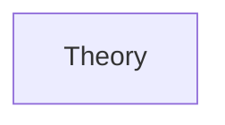

# Chapter 11: Low-Level Design: Design Patterns
> **Previous:** [10 Lld Solid Oop](./10-lld-solid-oop.md) | **Next:** [12 Lld Component Design](./12-lld-component-design.md)

---
## Learning Objectives
- Classify design patterns into creational, structural, behavioral, and concurrency categories
- Implement thread-safe Singleton with double-checked locking and understand its trade-offs
- Apply the Decorator pattern to add cross-cutting concerns without modifying existing classes
- Distinguish between the Observer and Mediator patterns for event-driven architectures
- Identify anti-patterns (God Object, Spaghetti Code, Lava Flow) in legacy codebases
- Choose among similar patterns (Factory vs Abstract Factory vs Builder) based on construction complexity
---
## Chapter at a Glance

| Aspect | Details |
|--------|---------|
| **Scope** | Creational, structural, behavioral design patterns with examples |
| **Key Concepts** | Singleton, Factory, Observer, Strategy, Adapter, Decorator |
| **Creational** | Singleton, Factory, Builder, Prototype |
| **Structural** | Adapter, Decorator, Proxy, Facade, Composite |
| **Behavioral** | Observer, Strategy, Command, Template, Iterator |
| **Real-World** | Used extensively in Java, C++, Python frameworks |

---
## Chapter Roadmap



## Theory
> **One-Sentence Takeaway:** Theory is the foundation — master it before moving to examples and exercises.
### What Are Design Patterns?

> **Pro Tip:** Master this concept thoroughly — it is frequently tested in system design interviews.

> **Pro Tip:** Master this concept — it appears in nearly every system design interview. Understand both the how and the why.

> **Warning:** A common mistake is over-engineering. Always start simple and add complexity only when justified by requirements.

> **Pro Tip:** Master this concept thoroughly — it appears in nearly every system design interview.
Design patterns are reusable, battle-tested solutions to recurring design problems. They are not code templates but rather formalized best practices that provide a shared vocabulary for designers. The Gang of Four (GoF) book "Design Patterns: Elements of Reusable Object-Oriented Software" (1994) cataloged 23 patterns into three categories: Creational, Structural, and Behavioral.

A pattern has four essential elements: a **name** (shared vocabulary), a **problem** (when to apply it), a **solution** (the abstraction and relationships), and **consequences** (trade-offs and results).


### Creational Patterns

> **Warning:** Avoid over-engineering. Start simple, measure, then optimize.

> **Warning:** Avoid premature optimization. Start simple, measure, then optimize. Over-engineering is the most common system design mistake.

Creational patterns abstract the instantiation process, making a system independent of how its objects are created, composed, and represented.

**Singleton** ensures a class has exactly one instance and provides a global access point. The challenge is thread safety. Double-checked locking (DCL) acquires a lock only when the instance is null, then checks again after acquiring the lock to avoid a race condition on first access.

```python
import threading

class Singleton:
    _instance = None
    _lock = threading.Lock()

    def __new__(cls):
        if cls._instance is None:           # First check (no lock)
            with cls._lock:                 # Acquire lock
                if cls._instance is None:    # Second check (with lock)
                    cls._instance = super().__new__(cls)
        return cls._instance
```

Singleton is controversial. It introduces global state, making tests interdependent and hiding dependencies. Many modern frameworks use dependency injection containers instead, which manage object lifecycles without global state.

**Factory Method** defines an interface for creating an object but lets subclasses decide which class to instantiate. The creation logic is deferred to subclasses.

**Abstract Factory** provides an interface for creating families of related objects without specifying their concrete classes. A GUI toolkit might have `Button`, `Checkbox`, and `Slider` families for Windows, macOS, and Linux themes.

**Builder** separates the construction of a complex object from its representation, allowing the same construction process to produce different representations. A **fluent interface** chains method calls for readability:

```python
class PizzaBuilder:
    def __init__(self):
        self._size = None
        self._cheese = False
        self._toppings = []

    def set_size(self, size): self._size = size; return self
    def add_cheese(self): self._cheese = True; return self
    def add_topping(self, t): self._toppings.append(t); return self

    def build(self) -> Pizza:
        return Pizza(self._size, self._cheese, self._toppings)

pizza = PizzaBuilder().set_size("large").add_cheese().add_topping("pepperoni").build()
```

**Prototype** creates new objects by cloning an existing instance (the prototype), avoiding costly construction. The prototype pattern is particularly useful when object creation is expensive and most instances are similar to an existing one.

### Structural Patterns

> **Remember:** Always articulate trade-offs clearly — interviewers value reasoning over the "right" answer.

> **Remember:** Trade-offs are the heart of system design. Always be ready to explain why you chose X over Y.

Structural patterns concern class and object composition—how entities use each other to form larger structures.

**Adapter** converts the interface of a class into another interface that clients expect. A **class adapter** uses multiple inheritance; an **object adapter** uses composition. The object adapter is more flexible because it adapts not just a class but an entire hierarchy.

**Decorator** attaches additional responsibilities to an object dynamically. Decorators provide a flexible alternative to subclassing for extending functionality. Python's function decorators (`@decorator`) are a language-level implementation of this pattern.

```python
from functools import wraps

def log_calls(func):
    @wraps(func)
    def wrapper(*args, **kwargs):
        print(f"Calling {func.__name__} with {args}")
        return func(*args, **kwargs)
    return wrapper

@log_calls
def compute(x: int) -> int:
    return x * 2
```

**Facade** provides a unified interface to a set of interfaces in a subsystem. It defines a higher-level interface that makes the subsystem easier to use. The Facade does not encapsulate the subsystem—it merely provides a simplified interface.

**Proxy** provides a surrogate or placeholder for another object to control access to it. Variants include:
- **Virtual proxy**: delays expensive object creation until it is needed.
- **Protection proxy**: controls access permissions.
- **Remote proxy**: represents an object in a different address space.

**Composite** composes objects into tree structures to represent part-whole hierarchies. Clients treat individual objects and compositions uniformly through a common `Component` interface.

### Behavioral Patterns

Behavioral patterns concern algorithms and the assignment of responsibilities between objects.

**Observer** defines a one-to-many dependency between objects such that when one object changes state, all its dependents are notified and updated automatically. The publisher (subject) maintains a list of subscribers and broadcasts events to them.

```python
class EventBus:
    def __init__(self):
        self._subscribers = {}

    def subscribe(self, event_type: str, callback):
        self._subscribers.setdefault(event_type, []).append(callback)

    def publish(self, event_type: str, data):
        for callback in self._subscribers.get(event_type, []):
            callback(data)
```

**Strategy** defines a family of algorithms, encapsulates each one, and makes them interchangeable. Strategy lets the algorithm vary independently from the clients that use it.

**Command** encapsulates a request as an object, thereby letting consumers parameterize clients with different requests, queue or log requests, and support undoable operations. Each command implements `execute()` and optional `undo()`. Commands can be stored in a history stack to support multi-level undo.

**State** allows an object to alter its behavior when its internal state changes. The object appears to change its class. Each state is a separate class implementing a common interface; transitions are handled within state classes.

**Template Method** defines the skeleton of an algorithm in a base class, deferring some steps to subclasses. Subclasses redefine certain steps without changing the algorithm's structure. It is one of the most common patterns—essentially "Hollywood Principle": don't call us, we'll call you.

**Chain of Responsibility** passes a request along a chain of handlers. Each handler decides either to process the request or to pass it to the next handler in the chain. Middleware pipelines in web frameworks (Express.js, ASP.NET Core) are textbook examples.

**Iterator** provides a way to access the elements of an aggregate object sequentially without exposing its underlying representation. Python's `__iter__` and `__next__` protocols make any class iterable.

**Mediator** defines an object that encapsulates how a set of objects interact. It promotes loose coupling by keeping objects from referring to each other explicitly. An air traffic control tower is the real-world analogy—planes communicate through the tower, not directly with each other.

### Concurrency Patterns

Concurrency patterns address the complexities of coordinating multiple threads of execution.

**Producer-Consumer**: One or more producer threads generate data and place it into a thread-safe queue; one or more consumer threads retrieve and process it. Python's `queue.Queue` handles the synchronization.

**Reader-Writer Lock**: Allows concurrent read access but exclusive write access. Multiple readers can hold the lock simultaneously; a writer must wait for all readers to release. Python's `threading.RLock` or `asyncio.Lock` can be extended for this.

**Thread Pool**: Pre-creates a pool of worker threads that reuse threads for multiple tasks, avoiding the overhead of thread creation and destruction. The `concurrent.futures.ThreadPoolExecutor` in Python is a production-grade implementation.

**Scheduler**: Coordinates when and how tasks are executed. A priority-based scheduler orders tasks by their scheduled time. A work-stealing scheduler dynamically rebalances load across worker queues (used by Go's goroutine scheduler and Java's ForkJoinPool).

**Active Object**: Decouples method execution from method invocation to enhance concurrency and simplify synchronized access. Each object has its own thread of control and a queue of pending requests.

### Anti-Patterns

Anti-patterns are common but ineffective solutions that appear attractive at first but create long-term maintenance problems.

**God Object** (aka Blob): A single class that knows too much or does too much. Symptoms include hundreds of methods and fields across dozens of responsibilities. Resolution: decompose by SRP.

**Spaghetti Code**: Code with an unstructured, tangled control flow. Characterized by extensive use of `goto` (or its equivalents—deeply nested conditionals, exception-based control flow). Resolution: apply structured programming and extract methods.

**Copy-Paste Programming**: Duplicating code instead of abstracting common behavior. Leads to inconsistent fixes (fixed in one copy but not another). Resolution: extract duplicated logic into shared methods or classes.

**Lava Flow**: Dead code, commented-out blocks, and abandoned experimental code left in the production codebase. Developers are afraid to remove it. Resolution: aggressively delete; source control preserves history.

### Pattern Comparison

| Pattern | Category | When to Use |
|---------|----------|-------------|
| Singleton | Creational | Exactly one instance required; global access point acceptable |
| Factory Method | Creational | A class cannot anticipate the class of objects it must create |
| Abstract Factory | Creational | Families of related products must be created together |
| Builder | Creational | Construction has many steps and different representations |
| Prototype | Creational | Object creation is expensive; instances are similar |
| Adapter | Structural | Incompatible interfaces need to work together |
| Decorator | Structural | Responsibilities must be added dynamically without subclassing |
| Facade | Structural | A simple interface to a complex subsystem is needed |
| Proxy | Structural | Access to an object must be controlled or deferred |
| Composite | Structural | Part-whole hierarchies must be treated uniformly |
| Observer | Behavioral | One object needs to broadcast state changes to many others |
| Strategy | Behavioral | Algorithm selection must vary independently from clients |
| Command | Behavioral | Requests must be queued, logged, or undone |
| State | Behavioral | Object behavior changes with internal state |
| Template Method | Behavioral | Algorithm skeleton is fixed; steps vary |
| Chain of Responsibility | Behavioral | Request processing should be dynamic and ordered |
| Mediator | Behavioral | Many-to-many communication needs central coordination |

---
## Examples
### Example 1: Factory Method — Document Creation

A document editor creates different types of documents. The editor should not know the concrete document type at compile time.

```python
from abc import ABC, abstractmethod

class Document(ABC):
    @abstractmethod
    def open(self): ...
    @abstractmethod
    def save(self): ...

class TextDocument(Document):
    def open(self): print("Opening text document")
    def save(self): print("Saving text document")

class SpreadsheetDocument(Document):
    def open(self): print("Opening spreadsheet")
    def save(self): print("Saving spreadsheet")

class Application(ABC):
    @abstractmethod
    def create_document(self) -> Document: ...

    def new_document(self):
        doc = self.create_document()
        doc.open()
        return doc

class TextEditor(Application):
    def create_document(self) -> Document:
        return TextDocument()

class SpreadsheetApp(Application):
    def create_document(self) -> Document:
        return SpreadsheetDocument()
```

### Example 2: Decorator — Adding Compression and Encryption to a Data Stream

The base component reads/writes raw data. Decorators add compression and encryption without modifying the base class.

```python
from abc import ABC, abstractmethod

class DataSource(ABC):
    @abstractmethod
    def write(self, data: str): ...
    @abstractmethod
    def read(self) -> str: ...

class FileDataSource(DataSource):
    def __init__(self, path: str):
        self._path = path

    def write(self, data: str):
        with open(self._path, 'w') as f:
            f.write(data)

    def read(self) -> str:
        with open(self._path, 'r') as f:
            return f.read()

class DataSourceDecorator(DataSource):
    def __init__(self, source: DataSource):
        self._wraps = source

    def write(self, data: str):
        self._wraps.write(data)

    def read(self) -> str:
        return self._wraps.read()

class CompressionDecorator(DataSourceDecorator):
    def write(self, data: str):
        compressed = f"[COMPRESSED]{data}[/COMPRESSED]"
        super().write(compressed)

    def read(self) -> str:
        raw = super().read()
        return raw.replace("[COMPRESSED]", "").replace("[/COMPRESSED]", "")

class EncryptionDecorator(DataSourceDecorator):
    def write(self, data: str):
        encrypted = f"[ENCRYPTED]{data}[/ENCRYPTED]"
        super().write(encrypted)

    def read(self) -> str:
        raw = super().read()
        return raw.replace("[ENCRYPTED]", "").replace("[/ENCRYPTED]", "")

# Usage — compose decorators at runtime
source = FileDataSource("data.txt")
source = CompressionDecorator(source)
source = EncryptionDecorator(source)
source.write("Hello World")
print(source.read())  # Hello World
```

Decorators can be stacked in any order, providing enormous flexibility at composition time.

### Example 3: Command Pattern — Undo in a Text Editor

Each operation is a command object that knows how to execute and undo itself.

```python
from abc import ABC, abstractmethod

class Command(ABC):
    @abstractmethod
    def execute(self): ...
    @abstractmethod
    def undo(self): ...

class InsertTextCommand(Command):
    def __init__(self, buffer: list, text: str, pos: int):
        self._buffer = buffer
        self._text = text
        self._pos = pos

    def execute(self):
        self._buffer.insert(self._pos, self._text)

    def undo(self):
        self._buffer.pop(self._pos)

class DeleteTextCommand(Command):
    def __init__(self, buffer: list, pos: int):
        self._buffer = buffer
        self._pos = pos
        self._deleted = None

    def execute(self):
        self._deleted = self._buffer.pop(self._pos)

    def undo(self):
        self._buffer.insert(self._pos, self._deleted)

class Editor:
    def __init__(self):
        self._buffer = []
        self._history = []

    def execute(self, cmd: Command):
        cmd.execute()
        self._history.append(cmd)

    def undo(self):
        if self._history:
            cmd = self._history.pop()
            cmd.undo()

# Usage
editor = Editor()
editor.execute(InsertTextCommand(editor._buffer, "Hello", 0))
editor.execute(InsertTextCommand(editor._buffer, "World", 1))
editor.undo()  # Removes "World"
print(editor._buffer)  # ['Hello']
```

### Example 4: Observer — Stock Price Notification

Multiple displays observe stock price changes without the stock exchange knowing about them.

```python
class StockExchange:
    def __init__(self):
        self._observers = []
        self._price = 0.0

    def attach(self, observer):
        self._observers.append(observer)

    def detach(self, observer):
        self._observers.remove(observer)

    def _notify(self):
        for obs in self._observers:
            obs.update(self._price)

    def set_price(self, price: float):
        self._price = price
        self._notify()

class Display:
    def update(self, price: float):
        print(f"Display: Stock price is now ${price:.2f}")

class AlertSystem:
    def update(self, price: float):
        if price > 150:
            print(f"Alert: Price threshold exceeded! ${price:.2f}")

# Usage
exchange = StockExchange()
exchange.attach(Display())
exchange.attach(AlertSystem())
exchange.set_price(155.0)
# Output:
# Display: Stock price is now $155.00
# Alert: Price threshold exceeded! $155.00
```

### Example 5: State Pattern — Vending Machine

A vending machine behaves differently based on whether it is idle, has money inserted, or is dispensing a product.

```python
from abc import ABC, abstractmethod

class VendingMachineState(ABC):
    @abstractmethod
    def insert_money(self, amount: float): ...
    @abstractmethod
    def select_product(self, code: str): ...
    @abstractmethod
    def dispense(self): ...

class IdleState(VendingMachineState):
    def __init__(self, machine):
        self._machine = machine

    def insert_money(self, amount: float):
        self._machine.balance = amount
        self._machine.set_state(self._machine.has_money_state)
        print(f"Inserted ${amount}")

    def select_product(self, code: str):
        print("Insert money first")

    def dispense(self):
        print("Insert money first")

class HasMoneyState(VendingMachineState):
    def __init__(self, machine):
        self._machine = machine

    def insert_money(self, amount: float):
        self._machine.balance += amount
        print(f"Balance: ${self._machine.balance}")

    def select_product(self, code: str):
        product = self._machine.products.get(code)
        if product and product.price <= self._machine.balance:
            self._machine.selected = product
            self._machine.set_state(self._machine.dispensing_state)
            print(f"Selected {product.name}")
        else:
            print("Insufficient funds or invalid code")

    def dispense(self):
        print("Select product first")

class DispensingState(VendingMachineState):
    def __init__(self, machine):
        self._machine = machine

    def insert_money(self, amount: float):
        print("Please collect your product first")

    def select_product(self, code: str):
        print("Please collect your product first")

    def dispense(self):
        product = self._machine.selected
        self._machine.balance -= product.price
        print(f"Dispensing {product.name}")
        self._machine.set_state(self._machine.idle_state)

class Product:
    def __init__(self, name: str, price: float):
        self.name = name
        self.price = price

class VendingMachine:
    def __init__(self):
        self.idle_state = IdleState(self)
        self.has_money_state = HasMoneyState(self)
        self.dispensing_state = DispensingState(self)
        self.state = self.idle_state
        self.balance = 0.0
        self.selected = None
        self.products = {"A1": Product("Soda", 1.50), "B2": Product("Chips", 2.00)}

    def set_state(self, state: VendingMachineState):
        self.state = state

    def insert_money(self, amount): self.state.insert_money(amount)
    def select_product(self, code): self.state.select_product(code)
    def dispense(self): self.state.dispense()

# Usage
vm = VendingMachine()
vm.insert_money(2.00)
vm.select_product("A1")
vm.dispense()
```

The state pattern eliminates the messy `if state == IDLE` conditionals. Each state encapsulates its own behavior, and transitions are explicit in the state methods.

### Example 6: Producer-Consumer with Thread-Safe Queue

> **Remember:** Trade-offs are the heart of system design. Always be ready to explain why you chose X over Y.
```python
import threading
import queue
import time
import random

def producer(q: queue.Queue, items: int):
    for i in range(items):
        item = f"item-{i}"
        q.put(item)
        print(f"Produced {item}")
        time.sleep(random.uniform(0.1, 0.3))

def consumer(q: queue.Queue, name: str):
    while True:
        item = q.get()
        if item is None:  # Poison pill signals shutdown
            q.task_done()
            break
        print(f"{name} consumed {item}")
        q.task_done()
        time.sleep(random.uniform(0.2, 0.5))

q = queue.Queue(maxsize=5)
prod = threading.Thread(target=producer, args=(q, 10))
cons = [threading.Thread(target=consumer, args=(q, f"Consumer-{i}")) for i in range(2)]

for c in cons: c.start()
prod.start()
prod.join()

q.join()  # Wait for all items to be processed
for _ in cons: q.put(None)  # Send poison pills
for c in cons: c.join()
```

## Concept Comparison

| Concept | Definition | Key Insight |
|---------|-----------|-------------|
| Theory | Core topic in Chapter 11: Low-Level Design: Design Patterns | Fundamental concept for system design |

---

## Quick Reference

| Topic | Key Point |
|-------|-----------|
| Theory | Essential concept from Chapter 11: Low-Level Design: Design Patterns |

---

## Cross-Application Matrix

| Concept | Application | Trade-Off |
|---------|------------|-----------|
| Theory | Relevant across design scenarios | Requirements-driven decisions |

---

## Chapter Quiz

**Q1:** What is the key takeaway from this chapter?
- A) Option A
- B) Option B
- C) Option C
- D) Option D

<details><summary>Answer</summary>Refer to the chapter content</details>

**Q2:** Which concept is most critical for distributed systems?
- A) Option A
- B) Option B
- C) Option C
- D) Option D

<details><summary>Answer</summary>Refer to the chapter content</details>

**Q3:** How does this topic apply to FAANG-level system design?
- A) Option A
- B) Option B
- C) Option C
- D) Option D

<details><summary>Answer</summary>Refer to the chapter content</details>

---

### TypeScript: Design Pattern Implementations

```typescript
// --- Singleton ---
class ConfigManager {
  private static instance: ConfigManager;
  private settings = new Map<string, string>();
  private constructor() {}
  static getInstance(): ConfigManager {
    if (!ConfigManager.instance) ConfigManager.instance = new ConfigManager();
    return ConfigManager.instance;
  }
  set(key: string, value: string): void { this.settings.set(key, value); }
  get(key: string): string | undefined { return this.settings.get(key); }
}

// --- Factory Method ---
interface DatabaseConnection { query(sql: string): any[]; }
class MySQLConnection implements DatabaseConnection {
  query(sql: string): any[] { return [`MySQL result for: ${sql}`]; }
}
class PostgresConnection implements DatabaseConnection {
  query(sql: string): any[] { return [`Postgres result for: ${sql}`]; }
}
abstract class DatabaseFactory { abstract createConnection(): DatabaseConnection; }
class MySQLFactory extends DatabaseFactory {
  createConnection(): DatabaseConnection { return new MySQLConnection(); }
}
class PostgresFactory extends DatabaseFactory {
  createConnection(): DatabaseConnection { return new PostgresConnection(); }
}

// --- Observer ---
interface Observer { update(event: string, data: any): void; }
class EventBus {
  private subscribers = new Map<string, Observer[]>();
  subscribe(event: string, observer: Observer): void {
    if (!this.subscribers.has(event)) this.subscribers.set(event, []);
    this.subscribers.get(event)!.push(observer);
  }
  publish(event: string, data: any): void {
    for (const obs of this.subscribers.get(event) ?? []) obs.update(event, data);
  }
}

// --- Strategy ---
interface CompressionStrategy { compress(data: string): string; }
class GzipCompression implements CompressionStrategy {
  compress(data: string): string { return `gzip(${data.slice(0, 10)}...)`; }
}
class SnappyCompression implements CompressionStrategy {
  compress(data: string): string { return `snappy(${data.slice(0, 10)}...)`; }
}
class Compressor {
  constructor(private strategy: CompressionStrategy) {}
  setStrategy(s: CompressionStrategy): void { this.strategy = s; }
  compress(data: string): string { return this.strategy.compress(data); }
}

// --- Decorator ---
interface DataSource { write(data: string): void; read(): string; }
class FileDataSource implements DataSource {
  private data = "";
  write(data: string): void { this.data = data; }
  read(): string { return this.data; }
}
class EncryptionDecorator implements DataSource {
  constructor(private wrapper: DataSource) {}
  write(data: string): void { this.wrapper.write(`encrypted(${data})`); }
  read(): string { const d = this.wrapper.read(); return d.startsWith("encrypted(") ? d.slice(10, -1) : d; }
}
class CompressionDecorator implements DataSource {
  constructor(private wrapper: DataSource) {}
  write(data: string): void { this.wrapper.write(`compressed(${data})`); }
  read(): string { const d = this.wrapper.read(); return d.startsWith("compressed(") ? d.slice(11, -1) : d; }
}
```

## Summary
- Creational patterns abstract object creation: Singleton (single instance), Factory Method (deferred creation), Abstract Factory (product families), Builder (stepwise construction), Prototype (cloning).
- Structural patterns compose objects: Adapter (interface translation), Decorator (dynamic responsibility), Facade (simplified interface), Proxy (controlled access), Composite (uniform tree handling).
- Behavioral patterns manage algorithms and responsibility: Observer (one-to-many notification), Strategy (interchangeable algorithms), Command (undoable operations), State (state-driven behavior), Template Method (algorithm skeleton), Chain of Responsibility (dynamic dispatch).
- Concurrency patterns address thread safety: Producer-Consumer (buffered work distribution), Reader-Writer Lock (concurrent reads), Thread Pool (worker reuse).
- Anti-patterns to avoid: God Object, Spaghetti Code, Copy-Paste Programming, Lava Flow.
- Pattern selection depends on the problem characteristics: use Strategy for interchangeable algorithms, State for state-dependent behavior, Command for undoable operations, and Observer for broadcast notifications.
---
## Exercises
### Review Questions
1. Why is the Singleton pattern considered an anti-pattern in large systems? What alternatives exist for managing shared state?
2. Explain the difference between a class adapter and an object adapter. When would you choose one over the other?
3. In the Command pattern, how does the history stack support undo and redo? What must a command store to reverse its effect?
4. Compare the Observer and Mediator patterns. In what scenarios would you choose Mediator over Observer?
5. What is the "poison pill" pattern in Producer-Consumer, and why is it preferable to forcefully stopping consumer threads?

### Application Problems
1. Implement a thread-safe Singleton using the module-level pattern (Python modules are singletons). Compare it to the double-checked locking approach in terms of laziness and thread safety.
2. Refactor this class to use the Strategy pattern for discount calculation:
   ```python
   class Order:
       def calculate_total(self):
           if self.customer == "regular": return self.total
           elif self.customer == "vip": return self.total * 0.85
           elif self.customer == "employee": return self.total * 0.70
   ```
3. A web framework's middleware pipeline uses Chain of Responsibility. Implement a middleware chain that authenticates, logs, and rate-limits requests before passing them to the handler. Each middleware either blocks the request or passes it to the next in the chain.

### Challenge Problem
Design and implement a complete logging framework using the following patterns:
- **Singleton** for the core logger instance
- **Strategy** for log formatting (plain text, JSON, XML)
- **Chain of Responsibility** for log level filtering (DEBUG passes all; ERROR blocks DEBUG/INFO)
- **Observer** for broadcast-style appenders (console writer, file writer, network writer all receive events)
- **Command** for deferred writes (log entries are queued and flushed batch-wise)
- **Builder** for constructing a logger with custom configuration

Implement all components with thread safety. Demonstrate an end-to-end scenario: configure a JSON-formatted logger with file and network appenders that only processes messages above WARN level, write 10 log entries, and verify the output.
