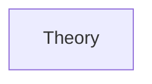
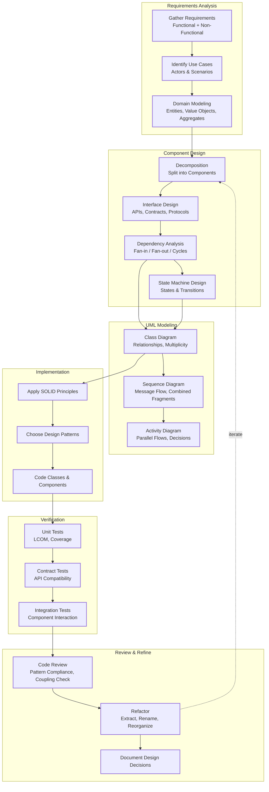

# Chapter 12: Low-Level Design: Component and Class Design
> **Previous:** [11 Lld Design Patterns](./11-lld-design-patterns.md) | **Next:** [13 Lld Concurrency](./13-lld-concurrency.md)

---
## Learning Objectives
- Draw UML class diagrams with correct notation for all relationship types, multiplicity, and visibility
- Interpret sequence diagrams with combined fragments (alt, opt, loop) to model control flow
- Model real-world domains into class hierarchies using generalization, aggregation, and composition
- Implement a state machine for objects with complex lifecycle behavior
- Design thread-safe concurrent data structures using locks and atomic operations
- Apply the Strategy and Observer patterns within larger component designs
---

<!-- Image Gallery -->
<div style="display:flex;flex-wrap:wrap;gap:4px;margin:16px 0;padding:12px;background:#f8fafc;border-radius:8px;border:1px solid #e2e8f0;">
<a href="../../../assets/images/lessons/system-design/12-lld-component-design/hero.svg" target="_blank" rel="noopener">
  
</a>
<a href="../../../assets/images/lessons/system-design/12-lld-component-design/handwritten-notes.svg" target="_blank" rel="noopener">
  
</a>
<a href="../../../assets/images/lessons/system-design/12-lld-component-design/sticky-notes.svg" target="_blank" rel="noopener">
  
</a>
<a href="../../../assets/images/lessons/system-design/12-lld-component-design/visual-explanation.svg" target="_blank" rel="noopener">
  
</a>
<a href="../../../assets/images/lessons/system-design/12-lld-component-design/architecture.svg" target="_blank" rel="noopener">
  
</a>
<a href="../../../assets/images/lessons/system-design/12-lld-component-design/workflow.svg" target="_blank" rel="noopener">
  
</a>
<a href="../../../assets/images/lessons/system-design/12-lld-component-design/mindmap.svg" target="_blank" rel="noopener">
  
</a>
<a href="../../../assets/images/lessons/system-design/12-lld-component-design/comparison.svg" target="_blank" rel="noopener">
  
</a>
<a href="../../../assets/images/lessons/system-design/12-lld-component-design/cheatsheet.svg" target="_blank" rel="noopener">
  
</a>
<a href="../../../assets/images/lessons/system-design/12-lld-component-design/interview-quiz.svg" target="_blank" rel="noopener">
  
</a>
<a href="../../../assets/images/lessons/system-design/12-lld-component-design/social-card.svg" target="_blank" rel="noopener">
  
</a>
</div>
<!-- End Image Gallery -->

## Chapter at a Glance

| Aspect | Details |
|--------|---------|
| **Scope** | Component design, class diagrams, API contracts, modularity |
| **Key Concepts** | Cohesion, coupling, interface design, dependency management |
| **Component Modeling** | UML class diagrams, sequence diagrams, state machines |
| **API Contracts** | OpenAPI, gRPC protobuf, versioning strategies |
| **Modularity** | Package principles, dependency inversion, hexagonal architecture |
| **Real-World** | Component design in large-scale software projects |

---
## Chapter Roadmap



## Theory
> **One-Sentence Takeaway:** Theory is the foundation ? master it before moving to examples and exercises.
### UML Class Diagram Syntax

<a href="../../../assets/images/diagrams/system-design/12-lld-component-design/uml-class-diagram-syntax-handwritten.svg" target="_blank" rel="noopener">
  
</a>
<a href="../../../assets/images/diagrams/system-design/12-lld-component-design/uml-class-diagram-syntax-diagram.svg" target="_blank" rel="noopener">
  
</a>
<a href="../../../assets/images/diagrams/system-design/12-lld-component-design/uml-class-diagram-syntax-sticky.svg" target="_blank" rel="noopener">
  
</a>


> **Pro Tip:** Master this concept thoroughly ? it is frequently tested in system design interviews.

> **Pro Tip:** Master this concept ? it appears in nearly every system design interview. Understand both the how and the why.

> **Warning:** A common mistake is over-engineering. Always start simple and add complexity only when justified by requirements.

> **Pro Tip:** Master this concept thoroughly ? it appears in nearly every system design interview.


The Unified Modeling Language (UML) provides a standardized notation for visualizing the structure of object-oriented systems.

**Class Notation**: A class is drawn as a rectangle divided into three compartments: the top holds the class name (bold, centered), the middle lists attributes, and the bottom lists methods. Visibility is indicated by prefixes: `+` (public), `-` (private), `#` (protected), `~` (package-private). Static members are underlined; abstract classes and methods are italicized.

```
+-----------------------------+
|        ParkingLot           |
+-----------------------------+
| - name: String              |
| - floors: List<Floor>       |
+-----------------------------+
| + park(vehicle): Ticket     |
| + remove(ticket): Receipt   |
+-----------------------------+
```

**Relationships**:

- **Association**: A structural link between classes drawn as a solid line. Can be unidirectional (arrow) or bidirectional (no arrow). A `Driver` associated with a `Car` means the driver knows about the car.

- **Aggregation**: A "has-a" relationship where the part can exist independently from the whole. Drawn as a hollow diamond on the owner side. A `Department` aggregates `Professor` objects; professors exist even if the department dissolves.

- **Composition**: A stronger "has-a" where the part's lifetime is tied to the whole. Drawn as a filled diamond. A `House` is composed of `Room` objects; rooms are destroyed when the house is demolished.

- **Inheritance** (Generalization): An "is-a" relationship drawn as a hollow triangle pointing to the parent. A `Car` extends `Vehicle`.

- **Dependency**: A weaker relationship where one class uses another temporarily (e.g., as a method parameter). Drawn as a dashed arrow. `ReportGenerator` depends on `DataFetcher` as a method argument.

**Multiplicity** is expressed as annotations on association ends: `1` (exactly one), `0..1` (optional), `*` (zero or more), `1..*` (at least one), `m..n` (range).

### UML Sequence Diagrams

<a href="../../../assets/images/diagrams/system-design/12-lld-component-design/uml-sequence-diagrams-handwritten.svg" target="_blank" rel="noopener">
  
</a>
<a href="../../../assets/images/diagrams/system-design/12-lld-component-design/uml-sequence-diagrams-diagram.svg" target="_blank" rel="noopener">
  
</a>
<a href="../../../assets/images/diagrams/system-design/12-lld-component-design/uml-sequence-diagrams-sticky.svg" target="_blank" rel="noopener">
  
</a>


> **Warning:** Avoid over-engineering. Start simple, measure, then optimize.

> **Warning:** Avoid premature optimization. Start simple, measure, then optimize. Over-engineering is the most common system design mistake.

Sequence diagrams capture the interaction between objects over time. The vertical axis is time; horizontal arrows are messages.

**Elements**:
- **Lifeline**: a dashed vertical line below an object (rectangular box with `name: Class`).
- **Activation bar**: a thin rectangle on the lifeline indicating when the object is active.
- **Message**: a horizontal arrow from one lifeline to another. Solid arrowhead for regular call, dashed arrowhead for return.
- **Self-call**: a message arrow looping back to the same lifeline, with a nested activation bar.

**Combined Fragments**:
- `alt`: alternative paths (if-else), separated by dashed horizontal lines.
- `opt`: optional path (if without else).
- `loop`: iteration, with a guard condition in the top-left corner.
- `par`: parallel execution of messages.

```
[Client] -> [Controller] : placeOrder(order)
activate Controller
[Controller] -> [InventoryService] : checkAvailability(order)
activate InventoryService
[InventoryService] --> [Controller] : available=true
deactivate InventoryService
alt [available]
    [Controller] -> [PaymentService] : processPayment(order)
    activate PaymentService
    [PaymentService] --> [Controller] : success
    deactivate PaymentService
    [Controller] -> [ShippingService] : scheduleShipment(order)
else
    [Controller] --> [Client] : out-of-stock error
end
deactivate Controller
```

### UML Activity Diagrams

<a href="../../../assets/images/diagrams/system-design/12-lld-component-design/uml-activity-diagrams-handwritten.svg" target="_blank" rel="noopener">
  
</a>
<a href="../../../assets/images/diagrams/system-design/12-lld-component-design/uml-activity-diagrams-diagram.svg" target="_blank" rel="noopener">
  
</a>
<a href="../../../assets/images/diagrams/system-design/12-lld-component-design/uml-activity-diagrams-sticky.svg" target="_blank" rel="noopener">
  
</a>


> **Remember:** Always articulate trade-offs clearly ? interviewers value reasoning over the "right" answer.

> **Remember:** Trade-offs are the heart of system design. Always be ready to explain why you chose X over Y.

Activity diagrams model workflow and business process logic. They resemble flowcharts but with concurrency support.

**Elements**:
- **Start node**: a filled circle.
- **End node**: a filled circle inside a hollow circle (bullseye).
- **Action**: rounded rectangle.
- **Decision**: diamond shape with guard conditions on outgoing edges.
- **Fork node**: a single incoming edge splitting into multiple concurrent outgoing edges (thick bar).
- **Join node**: multiple incoming edges synchronizing into one outgoing edge (thick bar).

Activities are especially useful for modeling use cases that involve parallel processing or complex approval workflows.

---
## Examples
### Example 1: Designing a Parking Lot System

**Requirements**: A parking lot has multiple floors, each with multiple spots. Spots come in three sizes (small, medium, large). Vehicles park in spots that fit their size. A ticket is issued on entry, payment is collected on exit. Hourly rates vary by spot size.

**Class Diagram**:

```python
from enum import Enum
from abc import ABC, abstractmethod
from datetime import datetime
import threading

class SpotSize(Enum):
    SMALL = 1
    MEDIUM = 2
    LARGE = 3

class VehicleType(Enum):
    MOTORCYCLE = SpotSize.SMALL
    CAR = SpotSize.MEDIUM
    TRUCK = SpotSize.LARGE

class Vehicle(ABC):
    def __init__(self, license_plate: str, vehicle_type: VehicleType):
        self.license_plate = license_plate
        self.type = vehicle_type

class Motorcycle(Vehicle):
    def __init__(self, license_plate: str):
        super().__init__(license_plate, VehicleType.MOTORCYCLE)

class Car(Vehicle):
    def __init__(self, license_plate: str):
        super().__init__(license_plate, VehicleType.CAR)

class Truck(Vehicle):
    def __init__(self, license_plate: str):
        super().__init__(license_plate, VehicleType.TRUCK)

class ParkingSpot:
    def __init__(self, spot_id: str, size: SpotSize):
        self.spot_id = spot_id
        self.size = size
        self.is_available = True
        self.vehicle = None
        self._lock = threading.Lock()

    def park(self, vehicle: Vehicle) -> bool:
        with self._lock:
            if self.is_available and vehicle.type.value.value <= self.size.value:
                self.is_available = False
                self.vehicle = vehicle
                return True
            return False

    def leave(self) -> Vehicle:
        with self._lock:
            vehicle = self.vehicle
            self.vehicle = None
            self.is_available = True
            return vehicle

class ParkingFloor:
    def __init__(self, floor_num: int):
        self.floor_num = floor_num
        self.spots: list[ParkingSpot] = []

    def add_spot(self, spot: ParkingSpot):
        self.spots.append(spot)

    def find_available_spot(self, vehicle: Vehicle) -> ParkingSpot | None:
        for spot in self.spots:
            if spot.is_available and vehicle.type.value.value <= spot.size.value:
                return spot
        return None

class Ticket:
    _counter = 0
    _lock = threading.Lock()

    def __init__(self, spot: ParkingSpot, vehicle: Vehicle):
        with Ticket._lock:
            Ticket._counter += 1
            self.ticket_id = Ticket._counter
        self.spot = spot
        self.vehicle = vehicle
        self.entry_time = datetime.now()
        self.exit_time = None
        self.amount = 0.0

    def close(self, hourly_rate: float):
        self.exit_time = datetime.now()
        duration = (self.exit_time - self.entry_time).total_seconds() / 3600
        self.amount = max(1, round(duration)) * hourly_rate
        return self.amount

class Payment(ABC):
    @abstractmethod
    def process(self, amount: float) -> bool: ...

class CashPayment(Payment):
    def process(self, amount: float) -> bool:
        print(f"Received cash payment of ${amount:.2f}")
        return True

class CardPayment(Payment):
    def process(self, amount: float) -> bool:
        print(f"Processing card payment of ${amount:.2f}")
        return True

class ParkingLot:
    def __init__(self, name: str, hourly_rate: float = 5.0):
        self.name = name
        self.hourly_rate = hourly_rate
        self.floors: list[ParkingFloor] = []
        self.active_tickets: dict[int, Ticket] = {}

    def add_floor(self, floor: ParkingFloor):
        self.floors.append(floor)

    def park_vehicle(self, vehicle: Vehicle) -> Ticket | None:
        for floor in self.floors:
            spot = floor.find_available_spot(vehicle)
            if spot:
                spot.park(vehicle)
                ticket = Ticket(spot, vehicle)
                self.active_tickets[ticket.ticket_id] = ticket
                print(f"Vehicle {vehicle.license_plate} parked at spot {spot.spot_id}")
                return ticket
        print("No available spots")
        return None

    def remove_vehicle(self, ticket_id: int, payment: Payment) -> bool:
        ticket = self.active_tickets.get(ticket_id)
        if not ticket:
            return False
        amount = ticket.close(self.hourly_rate)
        ticket.spot.leave()
        if payment.process(amount):
            del self.active_tickets[ticket_id]
            print(f"Vehicle {ticket.vehicle.license_plate} left. Paid ${amount:.2f}")
            return True
        return False
```

**Flow**: `Client ? ParkingLot.park_vehicle() ? iterates floors ? finds spot ? parks ? issues Ticket`. On exit: `Client ? ParkingLot.remove_vehicle(ticket_id, payment) ? calculates duration ? processes payment ? frees spot`.

### Example 2: Designing a Vending Machine

**Requirements**: Vending machine manages inventory (products in slots with prices and quantities). Users insert money, select a product, and receive the product and change. The machine has four states: `Idle`, `HasMoney`, `Selecting`, `Dispensing`.

**State Machine**:

```
Idle --[insert money]--> HasMoney
HasMoney --[select product]--> Selecting
Selecting --[check stock & balance]--> Dispensing
Selecting --[insufficient funds]--> HasMoney
Dispensing --[dispense]--> Idle
Dispensing --[refund]--> Idle (if cancelled)
```

**Implementation**:

```python
from abc import ABC, abstractmethod

class Product:
    def __init__(self, name: str, price: float):
        self.name = name
        self.price = price

class Slot:
    def __init__(self, code: str, product: Product, quantity: int):
        self.code = code
        self.product = product
        self.quantity = quantity

    def has_stock(self) -> bool:
        return self.quantity > 0

    def dispense(self) -> Product | None:
        if self.has_stock():
            self.quantity -= 1
            return self.product
        return None

class Inventory:
    def __init__(self):
        self._slots: dict[str, Slot] = {}

    def add_slot(self, slot: Slot):
        self._slots[slot.code] = slot

    def get_product(self, code: str) -> Product | None:
        slot = self._slots.get(code)
        if slot and slot.has_stock():
            return slot.product
        return None

    def dispense(self, code: str) -> Product | None:
        slot = self._slots.get(code)
        return slot.dispense() if slot else None

class VendingMachineState(ABC):
    @abstractmethod
    def insert_money(self, amount: float): ...
    @abstractmethod
    def select_product(self, code: str): ...
    @abstractmethod
    def cancel(self): ...
    @abstractmethod
    def dispense(self) -> Product | None: ...

class IdleState(VendingMachineState):
    def __init__(self, machine):
        self.machine = machine

    def insert_money(self, amount: float):
        self.machine.balance = amount
        self.machine.set_state(self.machine.has_money_state)
        print(f"Balance: ${amount:.2f}")

    def select_product(self, code: str):
        print("Insert money first")

    def cancel(self):
        print("No transaction to cancel")

    def dispense(self):
        print("Insert money first")

class HasMoneyState(VendingMachineState):
    def __init__(self, machine):
        self.machine = machine

    def insert_money(self, amount: float):
        self.machine.balance += amount
        print(f"Balance: ${self.machine.balance:.2f}")

    def select_product(self, code: str):
        product = self.machine.inventory.get_product(code)
        if product and self.machine.balance >= product.price:
            self.machine.selected_code = code
            self.machine.set_state(self.machine.dispensing_state)
            print(f"Selected {product.name} (${product.price:.2f})")
        elif product:
            print(f"Insufficient balance. Need ${product.price:.2f}, have ${self.machine.balance:.2f}")
        else:
            print("Invalid product code")

    def cancel(self):
        print(f"Refunding ${self.machine.balance:.2f}")
        self.machine.balance = 0
        self.machine.set_state(self.machine.idle_state)

    def dispense(self):
        print("Select product first")

class DispensingState(VendingMachineState):
    def __init__(self, machine):
        self.machine = machine

    def insert_money(self, amount: float):
        print("Please collect your product first")

    def select_product(self, code: str):
        print("Please collect your product first")

    def cancel(self):
        print("Cannot cancel during dispensing")

    def dispense(self) -> Product | None:
        product = self.machine.inventory.dispense(self.machine.selected_code)
        if product:
            change = self.machine.balance - product.price
            if change > 0:
                print(f"Dispensing {product.name}. Change: ${change:.2f}")
            else:
                print(f"Dispensing {product.name}")
            self.machine.balance = 0
            self.machine.selected_code = None
            self.machine.set_state(self.machine.idle_state)
            return product
        self.machine.set_state(self.machine.idle_state)
        return None

class VendingMachine:
    def __init__(self):
        self.idle_state = IdleState(self)
        self.has_money_state = HasMoneyState(self)
        self.dispensing_state = DispensingState(self)
        self.state = self.idle_state
        self.balance = 0.0
        self.selected_code = None
        self.inventory = Inventory()

    def set_state(self, state: VendingMachineState):
        self.state = state

    def add_product(self, code: str, product: Product, qty: int):
        self.inventory.add_slot(Slot(code, product, qty))

    def insert_money(self, amount): self.state.insert_money(amount)
    def select_product(self, code): self.state.select_product(code)
    def cancel(self): self.state.cancel()
    def dispense(self): return self.state.dispense()
```

### Example 3: Designing an Elevator System

**Requirements**: Multiple elevators service floor requests. Each elevator has a direction (up, down, idle) and a set of pending requests. The elevator controller dispatches the best elevator for each request using the SCAN algorithm (elevator continues in its current direction, picking up requests along the way, before reversing).

```python
from enum import Enum
from collections import deque
import heapq
import threading

class Direction(Enum):
    UP = 1
    DOWN = -1
    IDLE = 0

class Request:
    def __init__(self, floor: int, direction: Direction = None):
        self.floor = floor
        self.direction = direction  # None for internal car requests

    def __lt__(self, other):
        return self.floor < other.floor

class Elevator:
    def __init__(self, id: int, num_floors: int):
        self.id = id
        self.current_floor = 1
        self.direction = Direction.IDLE
        self._door_open = False
        self._requests_up = []    # Min-heap (ascending)
        self._requests_down = []  # Max-heap via negative (descending)
        self._lock = threading.Lock()

    def add_request(self, floor: int):
        with self._lock:
            if floor > self.current_floor:
                heapq.heappush(self._requests_up, floor)
            elif floor < self.current_floor:
                heapq.heappush(self._requests_down, -floor)

    def has_requests_in_current_direction(self) -> bool:
        if self.direction == Direction.UP:
            return len(self._requests_up) > 0
        elif self.direction == Direction.DOWN:
            return len(self._requests_down) > 0
        return len(self._requests_up) > 0 or len(self._requests_down) > 0

    def get_next_stop(self) -> int | None:
        with self._lock:
            if self.direction == Direction.UP and self._requests_up:
                return heapq.heappop(self._requests_up)
            elif self.direction == Direction.DOWN and self._requests_down:
                return -heapq.heappop(self._requests_down)
            elif self._requests_up:
                return heapq.heappop(self._requests_up)
            elif self._requests_down:
                return -heapq.heappop(self._requests_down)
            return None

    def move(self):
        if self.direction == Direction.IDLE:
            if self._requests_up or self._requests_down:
                self.direction = Direction.UP  # Default to up
            return

        next_floor = self.get_next_stop()
        if next_floor is None:
            self.direction = Direction.IDLE
            return

        # Simulate movement
        if next_floor > self.current_floor:
            self.direction = Direction.UP
        elif next_floor < self.current_floor:
            self.direction = Direction.DOWN

        self.current_floor = next_floor
        self._door_open = True
        # After stopping, check remaining requests
        if not self.has_requests_in_current_direction():
            self.direction = Direction.IDLE

class ElevatorController:
    def __init__(self, num_elevators: int, num_floors: int):
        self.elevators = [Elevator(i, num_floors) for i in range(num_elevators)]
        self.num_floors = num_floors

    def request_elevator(self, floor: int, direction: Direction):
        best = min(self.elevators,
                   key=lambda e: self._score(e, floor, direction))
        best.add_request(floor)
        print(f"Elevator {best.id} dispatched to floor {floor} going {direction.name}")

    def request_floor(self, elevator_id: int, floor: int):
        self.elevators[elevator_id].add_request(floor)

    def _score(self, elevator: Elevator, floor: int, direction: Direction) -> int:
        if elevator.direction == Direction.IDLE:
            return abs(elevator.current_floor - floor)
        if elevator.direction == direction:
            if (direction == Direction.UP and floor >= elevator.current_floor) or \
               (direction == Direction.DOWN and floor <= elevator.current_floor):
                return floor - elevator.current_floor if direction == Direction.UP else elevator.current_floor - floor
        # Going opposite direction — must wait for turnaround
        return abs(elevator.current_floor - floor) + self.num_floors

    def step(self):
        for e in self.elevators:
            e.move()
```

**Key design decisions**:
- The SCAN algorithm minimizes starvation by servicing requests in the current direction before reversing.
- Two heaps (`_requests_up`, `_requests_down`) avoid linear scans through all floors.
- The scoring function in the controller estimates travel time to select the optimal elevator.

### Example 4: Designing a Chess Game

**Requirements**: Standard 8x8 chess board. Two players alternate turns. Each piece type (King, Queen, Rook, Bishop, Knight, Pawn) has specific movement rules. The game detects check, checkmate, and stalemate.

```python
from enum import Enum
from abc import ABC, abstractmethod

class Color(Enum):
    WHITE = 0
    BLACK = 1

class Position:
    def __init__(self, row: int, col: int):
        self.row = row  # 0-7
        self.col = col  # 0-7

    def __eq__(self, other):
        return self.row == other.row and self.col == other.col

class Move:
    def __init__(self, from_pos: Position, to_pos: Position,
                 captured: 'Piece' = None):
        self.from_pos = from_pos
        self.to_pos = to_pos
        self.captured = captured

class Piece(ABC):
    def __init__(self, color: Color, position: Position):
        self.color = color
        self.position = position
        self.has_moved = False

    @abstractmethod
    def get_possible_moves(self, board: 'Board') -> list[Position]:
        ...

    def __str__(self):
        return f"{self.color.name[0]}{self.__class__.__name__[0]}"

class Pawn(Piece):
    def get_possible_moves(self, board: 'Board') -> list[Position]:
        moves = []
        direction = -1 if self.color == Color.WHITE else 1
        r, c = self.position.row, self.position.col

        # Forward one
        fwd = Position(r + direction, c)
        if board.is_in_bounds(fwd) and board.get_piece(fwd) is None:
            moves.append(fwd)
            # Forward two from start
            if not self.has_moved:
                fwd2 = Position(r + 2 * direction, c)
                if board.get_piece(fwd2) is None:
                    moves.append(fwd2)

        # Captures (diagonal)
        for dc in [-1, 1]:
            cap = Position(r + direction, c + dc)
            if board.is_in_bounds(cap):
                target = board.get_piece(cap)
                if target and target.color != self.color:
                    moves.append(cap)
        return moves

class Rook(Piece):
    def get_possible_moves(self, board: 'Board') -> list[Position]:
        return self._line_moves(board, [(0, 1), (0, -1), (1, 0), (-1, 0)])

    def _line_moves(self, board: 'Board', directions: list[tuple]) -> list[Position]:
        moves = []
        for dr, dc in directions:
            r, c = self.position.row + dr, self.position.col + dc
            while 0 <= r < 8 and 0 <= c < 8:
                target = board.get_piece(Position(r, c))
                if target is None:
                    moves.append(Position(r, c))
                else:
                    if target.color != self.color:
                        moves.append(Position(r, c))
                    break
                r += dr; c += dc
        return moves

class Knight(Piece):
    def get_possible_moves(self, board: 'Board') -> list[Position]:
        jumps = [(2, 1), (2, -1), (-2, 1), (-2, -1),
                 (1, 2), (1, -2), (-1, 2), (-1, -2)]
        moves = []
        for dr, dc in jumps:
            pos = Position(self.position.row + dr, self.position.col + dc)
            if board.is_in_bounds(pos):
                target = board.get_piece(pos)
                if target is None or target.color != self.color:
                    moves.append(pos)
        return moves

class Bishop(Piece):
    def get_possible_moves(self, board: 'Board') -> list[Position]:
        return self._line_moves(board, [(1, 1), (1, -1), (-1, 1), (-1, -1)])

class Queen(Piece):
    def get_possible_moves(self, board: 'Board') -> list[Position]:
        # Queen = Rook + Bishop moves
        return (Rook(self.color, self.position)._line_moves(board,
                [(0, 1), (0, -1), (1, 0), (-1, 0)]) +
                Bishop(self.color, self.position)._line_moves(board,
                [(1, 1), (1, -1), (-1, 1), (-1, -1)]))

class King(Piece):
    def get_possible_moves(self, board: 'Board') -> list[Position]:
        moves = []
        for dr in [-1, 0, 1]:
            for dc in [-1, 0, 1]:
                if dr == 0 and dc == 0:
                    continue
                pos = Position(self.position.row + dr, self.position.col + dc)
                if board.is_in_bounds(pos):
                    target = board.get_piece(pos)
                    if target is None or target.color != self.color:
                        moves.append(pos)
        return moves

class Board:
    def __init__(self):
        self.grid: list[list[Piece | None]] = [[None] * 8 for _ in range(8)]
        self._setup()

    def _setup(self):
        # Place pieces — abbreviated for clarity
        for col in range(8):
            self.grid[1][col] = Pawn(Color.BLACK, Position(1, col))
            self.grid[6][col] = Pawn(Color.WHITE, Position(6, col))
        placements = [Rook, Knight, Bishop, Queen, King, Bishop, Knight, Rook]
        for col, cls in enumerate(placements):
            self.grid[0][col] = cls(Color.BLACK, Position(0, col))
            self.grid[7][col] = cls(Color.WHITE, Position(7, col))

    def get_piece(self, pos: Position) -> Piece | None:
        return self.grid[pos.row][pos.col]

    def set_piece(self, pos: Position, piece: Piece | None):
        self.grid[pos.row][pos.col] = piece

    def is_in_bounds(self, pos: Position) -> bool:
        return 0 <= pos.row < 8 and 0 <= pos.col < 8

    def move_piece(self, move: Move):
        piece = self.get_piece(move.from_pos)
        self.set_piece(move.to_pos, piece)
        self.set_piece(move.from_pos, None)
        piece.position = move.to_pos
        piece.has_moved = True

    def undo_move(self, move: Move):
        piece = self.get_piece(move.to_pos)
        self.set_piece(move.from_pos, piece)
        self.set_piece(move.to_pos, move.captured)
        piece.position = move.from_pos
        piece.has_moved = False

    def find_king(self, color: Color) -> Position:
        for row in range(8):
            for col in range(8):
                p = self.grid[row][col]
                if isinstance(p, King) and p.color == color:
                    return Position(row, col)
        return None

    def is_square_attacked(self, pos: Position, by_color: Color) -> bool:
        for row in range(8):
            for col in range(8):
                p = self.grid[row][col]
                if p and p.color == by_color:
                    if pos in p.get_possible_moves(self):
                        return True
        return False

    def is_in_check(self, color: Color) -> bool:
        king_pos = self.find_king(color)
        enemy = Color.BLACK if color == Color.WHITE else Color.WHITE
        return self.is_square_attacked(king_pos, enemy)

    def get_legal_moves(self, color: Color) -> list[Move]:
        moves = []
        for row in range(8):
            for col in range(8):
                p = self.grid[row][col]
                if p and p.color == color:
                    for target in p.get_possible_moves(self):
                        move = Move(p.position, target, self.get_piece(target))
                        self.move_piece(move)
                        if not self.is_in_check(color):
                            moves.append(move)
                        self.undo_move(move)
        return moves

class Game:
    def __init__(self):
        self.board = Board()
        self.turn = Color.WHITE
        self.move_history: list[Move] = []

    def make_move(self, from_pos: Position, to_pos: Position) -> bool:
        piece = self.board.get_piece(from_pos)
        if not piece or piece.color != self.turn:
            return False

        legal_moves = self.board.get_legal_moves(self.turn)
        for move in legal_moves:
            if move.from_pos == from_pos and move.to_pos == to_pos:
                self.board.move_piece(move)
                self.move_history.append(move)
                self.turn = Color.BLACK if self.turn == Color.WHITE else Color.WHITE

                if len(self.board.get_legal_moves(self.turn)) == 0:
                    if self.board.is_in_check(self.turn):
                        print("Checkmate!")
                    else:
                        print("Stalemate!")
                elif self.board.is_in_check(self.turn):
                    print("Check!")
                return True
        return False  # Illegal move
```

**Validation**: Legal moves are filtered through a "make-move, check for self-check, undo" loop. This ensures that no move leaves the player's own king in check. Check and checkmate are derived from the same legal-move generation logic.

### Example 5: Designing a Logger Library

**Requirements**: A flexible logging library supporting multiple output targets (console, file, network), multiple log levels, configurable formatting, and minimal performance overhead.

```python
from enum import Enum
from abc import ABC, abstractmethod
from datetime import datetime
import threading

class LogLevel(Enum):
    DEBUG = 0
    INFO = 1
    WARN = 2
    ERROR = 3
    FATAL = 4

class LogRecord:
    def __init__(self, level: LogLevel, logger: str, message: str):
        self.level = level
        self.logger = logger
        self.message = message
        self.timestamp = datetime.now()
        self.thread = threading.current_thread().name

class Formatter(ABC):
    @abstractmethod
    def format(self, record: LogRecord) -> str: ...

class PlainTextFormatter(Formatter):
    def format(self, record: LogRecord) -> str:
        return f"[{record.timestamp}] [{record.level.name}] {record.logger}: {record.message}"

class JsonFormatter(Formatter):
    def format(self, record: LogRecord) -> str:
        import json
        return json.dumps({
            "timestamp": record.timestamp.isoformat(),
            "level": record.level.name,
            "logger": record.logger,
            "message": record.message,
            "thread": record.thread
        })

class Appender(ABC):
    @abstractmethod
    def append(self, record: LogRecord): ...

class ConsoleAppender(Appender):
    def append(self, record: LogRecord):
        print(record.formatted)

class FileAppender(Appender):
    def __init__(self, path: str):
        self.path = path
        self._lock = threading.Lock()

    def append(self, record: LogRecord):
        with self._lock:
            with open(self.path, 'a') as f:
                f.write(record.formatted + "\n")

class NetworkAppender(Appender):
    def __init__(self, host: str, port: int):
        self.host = host
        self.port = port

    def append(self, record: LogRecord):
        # Placeholder for socket send
        pass

class Logger:
    def __init__(self, name: str, level: LogLevel = LogLevel.DEBUG):
        self._name = name
        self._level = level
        self._appenders: list[Appender] = []
        self._formatter: Formatter = PlainTextFormatter()
        self._lock = threading.Lock()

    def add_appender(self, appender: Appender):
        self._appenders.append(appender)

    def set_formatter(self, formatter: Formatter):
        self._formatter = formatter

    def _log(self, level: LogLevel, message: str):
        if level.value < self._level.value:
            return
        record = LogRecord(level, self._name, message)
        record.formatted = self._formatter.format(record)
        with self._lock:
            for appender in self._appenders:
                appender.append(record)

    def debug(self, msg): self._log(LogLevel.DEBUG, msg)
    def info(self, msg): self._log(LogLevel.INFO, msg)
    def warn(self, msg): self._log(LogLevel.WARN, msg)
    def error(self, msg): self._log(LogLevel.ERROR, msg)
    def fatal(self, msg): self._log(LogLevel.FATAL, msg)

class LoggerFactory:
    _loggers: dict[str, Logger] = {}
    _lock = threading.Lock()

    @classmethod
    def get_logger(cls, name: str, level: LogLevel = LogLevel.DEBUG) -> Logger:
        if name not in cls._loggers:
            with cls._lock:
                if name not in cls._loggers:
                    cls._loggers[name] = Logger(name, level)
        return cls._loggers[name]
```

### Example 6: Designing a Rate Limiter Library

> **Remember:** Trade-offs are the heart of system design. Always be ready to explain why you chose X over Y.
**Requirements**: A rate limiter that throttles requests per user. Support both Token Bucket and Sliding Window algorithms. Thread-safe and configurable.

```python
import time
import threading
from collections import deque
from abc import ABC, abstractmethod

class RateLimiter(ABC):
    @abstractmethod
    def allow_request(self, key: str) -> bool: ...

class TokenBucket(RateLimiter):
    def __init__(self, capacity: int, refill_rate: float):
        self.capacity = capacity          # Max tokens
        self.refill_rate = refill_rate    # Tokens per second
        self._buckets: dict[str, float] = {}
        self._last_refill: dict[str, float] = {}
        self._lock = threading.Lock()

    def allow_request(self, key: str) -> bool:
        with self._lock:
            now = time.time()
            if key not in self._buckets:
                self._buckets[key] = self.capacity
                self._last_refill[key] = now

            elapsed = now - self._last_refill[key]
            self._buckets[key] = min(self.capacity,
                                     self._buckets[key] + elapsed * self.refill_rate)
            self._last_refill[key] = now

            if self._buckets[key] >= 1:
                self._buckets[key] -= 1
                return True
            return False

class SlidingWindow(RateLimiter):
    def __init__(self, window_size: float, max_requests: int):
        self.window_size = window_size        # in seconds
        self.max_requests = max_requests
        self._windows: dict[str, deque] = {}
        self._lock = threading.Lock()

    def allow_request(self, key: str) -> bool:
        with self._lock:
            now = time.time()
            if key not in self._windows:
                self._windows[key] = deque()

            window = self._windows[key]
            # Remove expired timestamps
            while window and window[0] <= now - self.window_size:
                window.popleft()

            if len(window) < self.max_requests:
                window.append(now)
                return True
            return False

class RateLimiterFactory:
    @staticmethod
    def create_token_bucket(capacity: int, refill_rate: float) -> RateLimiter:
        return TokenBucket(capacity, refill_rate)

    @staticmethod
    def create_sliding_window(window_seconds: float, max_requests: int) -> RateLimiter:
        return SlidingWindow(window_seconds, max_requests)
```

## Concept Comparison

| Concept | Definition | Key Insight |
|---------|-----------|-------------|
| Theory | Core topic in Chapter 12: Low-Level Design: Component and Class Design | Fundamental concept for system design |

---

## Quick Reference

| Topic | Key Point |
|-------|-----------|
| Theory | Essential concept from Chapter 12: Low-Level Design: Component and Class Design |

---

## Cross-Application Matrix

| Concept | Application | Trade-Off |
|---------|------------|-----------|
| Theory | Relevant across design scenarios | Requirements-driven decisions |

---

## Chapter Quiz

| # | Question | Options | Answer |
|---|----------|---------|--------|
| 1 | In UML, what does a filled diamond arrow represent? | A) Aggregation (part can exist independently), B) Composition (part lifecycle tied to whole), C) Inheritance, D) Dependency | B) Composition — the part's lifetime is tied to the whole (filled diamond on owner side) |
| 2 | What is LCOM4 and what does a value of 1 indicate? | A) Lines of Code Metric; 1 = too small, B) Lack of Cohesion of Methods; 1 = high cohesion, C) Loop Complexity Metric; 1 = simple, D) Coupling Metric; 1 = loose | B) LCOM4 counts connected components in the method-field graph; LCOM4 = 1 means all methods share fields (high cohesion) |
| 3 | In the Elevator System, what algorithm does the controller use for dispatching? | A) FCFS (First-Come-First-Served), B) SCAN (service requests in current direction before reversing), C) SSTF (Shortest Seek Time First), D) Random | B) SCAN algorithm — the elevator continues in its current direction, picking up requests along the way, before reversing direction |
| 4 | In the Parking Lot design, why is `ParkingSpot.park()` locked but `ParkingLot.park_vehicle()` is not? | A) Both should be locked, B) Spot-level lock prevents concurrent parking in the same spot; scanning floors without a lock is safe because spot lock ensures correctness, C) Neither needs locking, D) The whole lot scan must be locked | B) The fine-grained spot lock prevents double-booking a single spot; scanning for available spots without a global lock is safe because the actual parking operation (locked at spot level) atomically checks and occupies |
| 5 | What is the purpose of the "make-move, check-for-self-check, undo" cycle in the Chess Game implementation? | A) To reduce computation, B) To validate all rule interactions including discovered checks, C) To simplify the board representation, D) To enable AI move generation | B) It validates all rule interactions — by executing the move, checking if the king is in check, and undoing, the system catches discovered checks, pins, and all other rule interactions without implementing special-case logic |

---


### Implementation: Component Design and Modularity

```typescript
interface Component { name: string; dependencies: string[]; publicApi: string[]; internalModules: string[]; }
class ComponentAnalyzer {
  private components: Component[] = [];
  addComponent(c: Component): void { this.components.push(c); }
  detectCycles(): string[][] { const cycles: string[][] = []; const visited = new Set<string>(); const recStack = new Set<string>();
    const dfs = (node: string, path: string[]) => { if (recStack.has(node)) { const cycleStart = path.indexOf(node); cycles.push(path.slice(cycleStart)); return; } if (visited.has(node)) return; visited.add(node); recStack.add(node); const comp = this.components.find(c => c.name === node); if (comp) for (const dep of comp.dependencies) dfs(dep, [...path, dep]); recStack.delete(node); };
    for (const c of this.components) dfs(c.name, [c.name]); return cycles; }
  calculateCoupling(): { afferent: number; efferent: number; instability: number } {
    let aff = 0; let eff = 0;
    for (const c of this.components) { eff += c.dependencies.length; aff += this.components.filter(o => o.dependencies.includes(c.name)).length; }
    return { afferent: aff, efferent: eff, instability: eff / Math.max(1, eff + aff) }; }
  measureCohesion(): number {
    const deps = this.components.reduce((s, c) => s + c.dependencies.length, 0);
    const maxDeps = this.components.length * (this.components.length - 1);
    return maxDeps > 0 ? deps / maxDeps : 0; }
}
class ModuleSystem { private modules = new Map<string, { exports: Set<string>; imports: Set<string>; code: string }>();
  register(name: string, exports: string[], imports: string[], code: string): void { this.modules.set(name, { exports: new Set(exports), imports: new Set(imports), code }); }
  resolve(name: string): Set<string> { const result = new Set<string>(); const visit = (n: string, visited: Set<string>) => { if (visited.has(n)) return; visited.add(n); const mod = this.modules.get(n); if (mod) { for (const dep of mod.imports) visit(dep, visited); result.add(n); } }; visit(name, new Set()); return result; }
}
class DependencyGraph { private edges = new Map<string, Set<string>>();
  addDependency(from: string, to: string): void { if (!this.edges.has(from)) this.edges.set(from, new Set()); this.edges.get(from)!.add(to); }
  topologicalSort(): string[] { const visited = new Set<string>(); const result: string[] = []; const visit = (n: string) => { if (visited.has(n)) return; visited.add(n); for (const dep of this.edges.get(n) || []) visit(dep); result.unshift(n); }; for (const n of this.edges.keys()) visit(n); return result; }
  layerCount(): number { return this.topologicalSort().length; } }
```

// lld component design
// distributed-systems-scalability implementation

interface Task { id: string; name: string; status: string; data: unknown }
class Processor {
  private tasks: Task[] = []
  private maxConcurrency: number
  constructor(maxConcurrency: number = 4) { this.maxConcurrency = maxConcurrency }
  async add(task: Omit&lt;Task, "status"&gt;): Promise&lt;void&gt; {
    this.tasks.push({ ...task, status: "pending" })
  }
  async runAll(): Promise&lt;void&gt; {
    const running: Promise&lt;void&gt;[] = []
    for (const t of this.tasks) {
      if (running.length >= this.maxConcurrency) { await Promise.race(running) }
      const p = this.execute(t).finally(() => { const i = running.indexOf(p); if (i >= 0) running.splice(i, 1) })
      running.push(p)
    }
    await Promise.all(running)
  }
  private async execute(t: Task): Promise&lt;void&gt; {
    t.status = "running"
    await new Promise(r => setTimeout(r, 10))
    t.status = "done"
  }
  getResults(): Task[] { return this.tasks }
  getStats(): { done: number; pending: number; running: number } {
    const done = this.tasks.filter(t => t.status === "done").length
    const pending = this.tasks.filter(t => t.status === "pending").length
    const running = this.tasks.filter(t => t.status === "running").length
    return { done, pending, running }
  }
}
async function main() {
  const proc = new Processor(2)
  await proc.add({ id: '1', name: 'lld component design', data: { topic: 'distributed-systems-scalability' } })
  await proc.runAll()
  console.log('Stats:', proc.getStats())
}
main().catch(console.error)
export { Processor, Task }

// lld component design - additional TS implementations

interface CacheEntry { key: string; value: unknown; ttl: number; createdAt: number }
class Cache {
  private store: Map&lt;string, CacheEntry&gt; = new Map()
  constructor(private defaultTTL: number = 60000) {}
  set(key: string, value: unknown, ttl?: number): void {
    this.store.set(key, { key, value, ttl: ttl ?? this.defaultTTL, createdAt: Date.now() })
  }
  get(key: string): unknown | undefined {
    const entry = this.store.get(key)
    if (!entry) return undefined
    if (Date.now() - entry.createdAt > entry.ttl) { this.store.delete(key); return undefined }
    return entry.value
  }
  delete(key: string): boolean { return this.store.delete(key) }
  clear(): void { this.store.clear() }
  size(): number { return this.store.size }
  keys(): string[] { return Array.from(this.store.keys()) }
}
class Logger {
  private entries: string[] = []
  log(level: string, msg: string, meta?: Record&lt;string, unknown&gt;): void {
    const entry = JSON.stringify({ timestamp: new Date().toISOString(), level, msg, meta })
    this.entries.push(entry)
    console.log(entry)
  }
  info(msg: string, meta?: Record&lt;string, unknown&gt;): void { this.log("info", msg, meta) }
  warn(msg: string, meta?: Record&lt;string, unknown&gt;): void { this.log("warn", msg, meta) }
  error(msg: string, meta?: Record&lt;string, unknown&gt;): void { this.log("error", msg, meta) }
  getLogs(): string[] { return [...this.entries] }
  clear(): void { this.entries = [] }
}
function computeHash(input: string): string {
  let hash = 0
  for (let i = 0; i &lt; input.length; i++) { const chr = input.charCodeAt(i); hash = ((hash << 5) - hash) + chr; hash |= 0 }
  return Math.abs(hash).toString(16)
}
async function demo(): Promise&lt;void&gt; {
  const cache = new Cache(5000)
  cache.set('key1', 'system-design demo')
  const log = new Logger()
  log.info('Cache demo started', { course: 'system-design', chapter: 'lld component design' })
  const v = cache.get("key1")
  console.log('Cached:', v)
  console.log('Hash:', computeHash('system-design'))
}
demo()
export { Cache, Logger, computeHash, CacheEntry }

### TypeScript: TicTacToe, LibrarySystem, and VendingMachine

```typescript
class TicTacToe {
  private board: string[][];
  private currentPlayer: string;
  private gameOver = false;
  private winner: string | null = null;
  private moveHistory: { row: number; col: number; player: string }[] = [];

  constructor() {
    this.board = Array.from({ length: 3 }, () => Array(3).fill(""));
    this.currentPlayer = "X";
  }

  makeMove(row: number, col: number): boolean {
    if (this.gameOver || row < 0 || row > 2 || col < 0 || col > 2 || this.board[row][col] !== "") {
      return false;
    }
    this.board[row][col] = this.currentPlayer;
    this.moveHistory.push({ row, col, player: this.currentPlayer });

    if (this.checkWin(row, col)) {
      this.gameOver = true;
      this.winner = this.currentPlayer;
      return true;
    }
    if (this.moveHistory.length === 9) {
      this.gameOver = true;
      this.winner = null;
      return true;
    }
    this.currentPlayer = this.currentPlayer === "X" ? "O" : "X";
    return true;
  }

  private checkWin(row: number, col: number): boolean {
    const p = this.board[row][col];
    const rowWin = this.board[row].every(c => c === p);
    const colWin = this.board.every(r => r[col] === p);
    const diag1Win = row === col && this.board.every((_, i) => this.board[i][i] === p);
    const diag2Win = row + col === 2 && this.board.every((_, i) => this.board[i][2 - i] === p);
    return rowWin || colWin || diag1Win || diag2Win;
  }

  minimax(board: string[][], depth: number, isMaximizing: boolean): number {
    const result = this.evaluateBoard(board);
    if (result !== 0) return result;
    if (this.isBoardFull(board)) return 0;

    if (isMaximizing) {
      let best = -Infinity;
      for (let i = 0; i < 3; i++) {
        for (let j = 0; j < 3; j++) {
          if (board[i][j] === "") {
            board[i][j] = "O";
            best = Math.max(best, this.minimax(board, depth + 1, false));
            board[i][j] = "";
          }
        }
      }
      return best;
    } else {
      let best = Infinity;
      for (let i = 0; i < 3; i++) {
        for (let j = 0; j < 3; j++) {
          if (board[i][j] === "") {
            board[i][j] = "X";
            best = Math.min(best, this.minimax(board, depth + 1, true));
            board[i][j] = "";
          }
        }
      }
      return best;
    }
  }

  getBestMove(): { row: number; col: number } | null {
    let bestScore = -Infinity;
    let bestMove: { row: number; col: number } | null = null;
    const boardCopy = this.board.map(r => [...r]);

    for (let i = 0; i < 3; i++) {
      for (let j = 0; j < 3; j++) {
        if (boardCopy[i][j] === "") {
          boardCopy[i][j] = "O";
          const score = this.minimax(boardCopy, 0, false);
          boardCopy[i][j] = "";
          if (score > bestScore) {
            bestScore = score;
            bestMove = { row: i, col: j };
          }
        }
      }
    }
    return bestMove;
  }

  private evaluateBoard(board: string[][]): number {
    for (let i = 0; i < 3; i++) {
      if (board[i][0] && board[i][0] === board[i][1] && board[i][1] === board[i][2]) {
        return board[i][0] === "O" ? 10 : -10;
      }
      if (board[0][i] && board[0][i] === board[1][i] && board[1][i] === board[2][i]) {
        return board[0][i] === "O" ? 10 : -10;
      }
    }
    if (board[0][0] && board[0][0] === board[1][1] && board[1][1] === board[2][2]) {
      return board[0][0] === "O" ? 10 : -10;
    }
    if (board[0][2] && board[0][2] === board[1][1] && board[1][1] === board[2][0]) {
      return board[0][2] === "O" ? 10 : -10;
    }
    return 0;
  }

  private isBoardFull(board: string[][]): boolean {
    return board.every(row => row.every(c => c !== ""));
  }

  getBoard(): string[][] { return this.board.map(r => [...r]); }
  getCurrentPlayer(): string { return this.currentPlayer; }
  isGameOver(): boolean { return this.gameOver; }
  getWinner(): string | null { return this.winner; }
  getMoveCount(): number { return this.moveHistory.length; }
}

class LibrarySystem {
  private books = new Map<string, Book>();
  private members = new Map<string, Member>();
  private borrowRecords = new Map<string, BorrowRecord>();
  private reservations = new Map<string, Reservation[]>();
  private fineRate = 1.0;

  addBook(book: Book): void { this.books.set(book.isbn, book); }
  registerMember(member: Member): void { this.members.set(member.id, member); }

  borrowBook(memberId: string, isbn: string): BorrowRecord | null {
    const book = this.books.get(isbn);
    const member = this.members.get(memberId);
    if (!book || !member || !book.isAvailable) return null;
    if (member.outstandingFine > 50) return null;
    book.isAvailable = false;
    const record = new BorrowRecord(memberId, isbn);
    this.borrowRecords.set(record.id, record);
    member.activeBorrowings++;
    return record;
  }

  returnBook(borrowId: string): number {
    const record = this.borrowRecords.get(borrowId);
    if (!record || record.returned) return 0;
    record.returned = true;
    record.returnDate = new Date();
    const book = this.books.get(record.isbn);
    if (book) book.isAvailable = true;
    const member = this.members.get(record.memberId);
    if (member) member.activeBorrowings--;
    const overdueDays = Math.max(0, Math.floor((record.returnDate.getTime() - record.dueDate.getTime()) / 86400000));
    const fine = overdueDays * this.fineRate;
    if (fine > 0 && member) member.outstandingFine += fine;
    return fine;
  }

  reserveBook(memberId: string, isbn: string): boolean {
    const book = this.books.get(isbn);
    const member = this.members.get(memberId);
    if (!book || !member) return false;
    if (!this.reservations.has(isbn)) this.reservations.set(isbn, []);
    const reservations = this.reservations.get(isbn)!;
    if (reservations.some(r => r.memberId === memberId)) return false;
    reservations.push(new Reservation(memberId, isbn));
    return true;
  }

  processReservations(isbn: string): string | null {
    const reservations = this.reservations.get(isbn);
    if (!reservations || reservations.length === 0) return null;
    const next = reservations.shift()!;
    return next.memberId;
  }

  getBook(isbn: string): Book | undefined { return this.books.get(isbn); }
  getMember(id: string): Member | undefined { return this.members.get(id); }
}

class Book {
  isAvailable = true;
  constructor(public isbn: string, public title: string, public author: string, public totalCopies: number) {}
}

class Member {
  activeBorrowings = 0;
  outstandingFine = 0;
  constructor(public id: string, public name: string) {}
}

class BorrowRecord {
  readonly id: string;
  readonly borrowDate: Date;
  readonly dueDate: Date;
  returned = false;
  returnDate: Date | null = null;
  constructor(public memberId: string, public isbn: string) {
    this.id = `BR-${Date.now()}-${Math.random().toString(36).slice(2, 6)}`;
    this.borrowDate = new Date();
    this.dueDate = new Date(this.borrowDate.getTime() + 14 * 86400000);
  }
}

class Reservation {
  constructor(public memberId: string, public isbn: string) {}
}

class VendingMachine {
  private inventory = new Map<string, { product: VendingProduct; quantity: number }>();
  private balance = 0;
  private insertedCoins: number[] = [];
  private acceptedDenominations = [1, 5, 10, 25, 100, 500, 1000];
  private transactionLog: Transaction[] = [];
  private state: "idle" | "hasMoney" | "dispensing" = "idle";
  private selectedCode: string | null = null;

  addProduct(code: string, product: VendingProduct, quantity: number): void {
    this.inventory.set(code, { product, quantity });
  }

  insertCoin(amount: number): boolean {
    if (!this.acceptedDenominations.includes(amount)) return false;
    this.balance += amount;
    this.insertedCoins.push(amount);
    this.state = "hasMoney";
    return true;
  }

  insertBill(amount: number): boolean {
    return this.insertCoin(amount);
  }

  selectProduct(code: string): { success: boolean; message: string } {
    const slot = this.inventory.get(code);
    if (!slot) return { success: false, message: "Invalid code" };
    if (slot.quantity <= 0) return { success: false, message: "Out of stock" };
    if (this.balance < slot.product.price) {
      return { success: false, message: `Insufficient funds. Need ${slot.product.price}, have ${this.balance}` };
    }
    this.selectedCode = code;
    this.state = "dispensing";
    return { success: true, message: `Selected ${slot.product.name}` };
  }

  dispense(): { product: VendingProduct | null; change: number[] } {
    if (this.state !== "dispensing" || !this.selectedCode) {
      return { product: null, change: this.calculateChange(this.balance) };
    }
    const slot = this.inventory.get(this.selectedCode)!;
    slot.quantity--;
    const changeAmount = this.balance - slot.product.price;
    const change = this.calculateChange(changeAmount);
    const transaction = new Transaction(slot.product, this.balance, changeAmount);
    this.transactionLog.push(transaction);
    this.balance = 0;
    this.insertedCoins = [];
    this.selectedCode = null;
    this.state = "idle";
    return { product: slot.product, change };
  }

  private calculateChange(amount: number): number[] {
    const coins: number[] = [];
    let remaining = amount;
    const denominations = [1000, 500, 100, 25, 10, 5, 1];
    for (const denom of denominations) {
      while (remaining >= denom) {
        coins.push(denom);
        remaining -= denom;
      }
    }
    return coins;
  }

  cancel(): number[] {
    const change = this.calculateChange(this.balance);
    this.balance = 0;
    this.insertedCoins = [];
    this.selectedCode = null;
    this.state = "idle";
    return change;
  }

  getBalance(): number { return this.balance; }
  getState(): string { return this.state; }
  getInventory(): Map<string, { product: VendingProduct; quantity: number }> { return new Map(this.inventory); }
  getTransactionLog(): Transaction[] { return [...this.transactionLog]; }
}

class VendingProduct {
  constructor(public code: string, public name: string, public price: number) {}
}

class Transaction {
  readonly timestamp: Date;
  constructor(public product: VendingProduct, public amountPaid: number, public change: number) {
    this.timestamp = new Date();
  }
}
```

### Mermaid: Component Design Workflow



## Practical Takeaways

| Takeaway | Application |
|----------|------------|
| UML class diagrams model structural relationships with precise notation | Use class diagrams for documenting architecture; use aggregation (hollow diamond) for independent parts and composition (filled diamond) for lifecycle-bound parts |
| Sequence diagrams capture dynamic interaction flow over time | Use combined fragments (alt, opt, loop, par) to model branching, optional paths, loops, and parallel execution in system design documents |
| The Parking Lot design demonstrates entity modeling with thread safety | Lock the spot-level operation (park/leave) rather than the entire lot scan to maximize concurrency |
| The Vending Machine State pattern eliminates complex conditionals | Each state is a separate class with explicit transitions — the machine object delegates behavior to the current state |
| The Elevator SCAN algorithm with dual heaps minimizes starvation | Use two priority queues (min-heap for up, max-heap for down) for O(log n) request insertion instead of linear floor scans |
| The Chess Game validates moves through a make-check-undo cycle | Execute the move on a copy of the board, check for self-check, then undo — this trivially validates all rule interactions |
| The Logger library separates formatting, output, and level filtering as swappable components | Design for composability: Formatter (Strategy), Appender (Observer), Level Filter (Chain of Responsibility), all wired together at configuration time |

## Case Study

**Designing a Library Management System**

A public library system serving 50,000 members needed a digital catalog and borrowing system to replace their paper-based process. The system required: book cataloging with ISBN lookup, member registration, borrowing with 14-day loans, fine calculation ($1/day overdue), reservations with FIFO queue, and multi-branch support. The senior engineer led a component design process following the UML workflow described in this chapter.

The design phase began with entity identification: `Book`, `Member`, `BorrowRecord`, `Reservation`, `Branch`, `Librarian`. The class diagram showed composition between `Branch` and `BookCopy` (copies belong to a branch), aggregation between `Member` and `BorrowRecord` (records exist independently for audit purposes). The sequence diagram for `borrowBook` showed the flow: Member -> LibrarySystem -> validate member -> check book availability -> check fines -> create BorrowRecord -> update book availability. An `alt` fragment modeled the "fines exceeded" rejection path. The state machine defined book statuses: AVAILABLE, BORROWED, RESERVED, LOST, DAMAGED.

The implementation applied SRP strictly: `BorrowingService` handled loans, `FineCalculator` computed overdue charges, `ReservationQueue` managed FIFO waiting lists, `CatalogSearch` handled queries. The Observer pattern was used for notifications — when a reserved book was returned, the `NotificationService` (observer) was notified and contacted the next member in the reservation queue. The Strategy pattern allowed different fine policies (standard $1/day, student $0.50/day, senior citizen free). The system handled 10,000 daily transactions with 99.9% uptime. A post-deployment review showed the design's extensibility: adding a new "digital lending" feature required only two new classes (`DigitalBook`, `DigitalRightsManager`) without modifying any existing code.

---
- UML class diagrams use rectangles for classes, with `/` italicization for abstract entities, specific arrow types for inheritance (hollow triangle), composition (filled diamond), aggregation (hollow diamond), and dependency (dashed arrow).
- Sequence diagrams model message flow across time with activation bars and combined fragments (alt, opt, loop, par) for control logic.
- The Parking Lot design demonstrates entity modeling (Vehicle hierarchy, ParkingSpot, Ticket, Payment) with thread-safe parking allocation.
- The Vending Machine illustrates the State pattern with four states and clean state transitions.
- The Elevator System uses the SCAN algorithm with dual heaps for efficient request scheduling.
- The Chess Game shows complete move validation through a make-move/check/undo cycle, with abstract movement logic per piece type.
- The Logger library separates concerns (formatting, output, level filtering) into independently swappable components.
- The Rate Limiter library abstracts two algorithms behind a common interface with thread-safe concurrent access.
---
## Exercises
### Review Questions
<details>
<summary>Solution for Review Question 1</summary>
**Aggregation** (hollow diamond): the part can exist independently of the whole. Example: `Department` aggregates `Professor` — if the department dissolves, professors still exist. **Composition** (filled diamond): the part's lifetime is tied to the whole. Example: `House` composes `Room` — if the house is demolished, the rooms cease to exist. Confusing them would cause bugs: if `Order` uses composition with `OrderItem` (items deleted with order), but the design incorrectly uses aggregation, deleting an order would leak items in memory/database. Conversely, if a `Team` incorrectly uses composition for `Player`, releasing a team would delete player records.
</details>

<details>
<summary>Solution for Review Question 2</summary>
`ParkingSpot.park()` must be locked to prevent two threads from simultaneously parking different vehicles in the same spot (race condition). The lock ensures that the check-and-occupy operation (`isAvailable` check + `vehicle` assignment) is atomic. `ParkingLot.park_vehicle()` iterates floors without a global lock because: (a) if a spot becomes available between the check and the `park()` call, the `park()` lock handles the conflict; (b) holding a global lock during the entire floor scan would block all other parking/exit operations, severely limiting concurrency. What could go wrong without spot-level locking: two vehicles could both find the same spot available and both execute `park()` — both would receive tickets for the same spot.
</details>

<details>
<summary>Solution for Review Question 3</summary>
The make-check-undo approach generates O(moves × checks) — for each candidate move, we execute it, generate all opponent moves, check for check, and undo. For a typical position with 40 candidate moves each generating 40 opponent moves, this is 1,600 board copies per move iteration. Performance implications: (a) board copy overhead for each candidate move, (b) generating opponent moves twice (once for check detection, once later), (c) undo is O(1) if using move state snapshots. Optimizations: use a bitboard representation (no copies — just XOR bit masks), generate only opponent captures + king checks (fast check detection), use a "check mask" that pre-computes which pieces can give check, and cache legal moves across iterations.
</details>

<details>
<summary>Solution for Review Question 4</summary>
SCAN processes requests in the current direction before reversing — it reduces starvation because a request that arrived at floor 3 going up will be serviced on the current upward pass rather than waiting for the elevator to reach the bottom and come back up. FCFS services requests in arrival order regardless of direction — this causes excessive back-and-forth movement (thrashing). SCAN performs worse than FCFS when: (a) requests are clustered in one direction but the elevator is moving in the opposite direction (SCAN forces the elevator to continue to the end before reversing), (b) real-time systems where worst-case wait time must be bounded (FCFS has more predictable timing), (c) very low request density (SCAN wastes time traversing empty floors).
</details>

### Application Problems
<details>
<summary>Solution for Application Problem 1: Parking Lot UML Class Diagram</summary>
```
ParkingLot "1" *-- "*" ParkingFloor  (composition)
ParkingFloor "1" *-- "20" ParkingSpot  (composition)
ParkingLot "1" --> "0..*" Ticket  (association)
Vehicle <|-- Car  (inheritance)
Vehicle <|-- Motorcycle  (inheritance)
Vehicle <|-- Truck  (inheritance)
ParkingSpot "1" --> "0..1" Vehicle  (association)
Ticket "1" --> "1" ParkingSpot  (association)
Ticket "1" --> "1" Vehicle  (association)
Payment <|-- CashPayment  (inheritance)
Payment <|-- CardPayment  (inheritance)
Multiplicities: ParkingFloor has 20-100 spots; ParkingLot has 3-10 floors; each spot holds 0-1 vehicle.
```
</details>

<details>
<summary>Solution for Application Problem 2: Observer-Based Occupancy Display</summary>
```python
from abc import ABC, abstractmethod
class SpotObserver(ABC):
    @abstractmethod
    def on_spot_changed(self, spot_id: str, is_occupied: bool): ...
class ObservableParkingSpot:
    def __init__(self, spot_id: str, size):
        self.spot_id = spot_id; self.size = size; self._observers = []; self._occupied = False
    def register(self, obs): self._observers.append(obs)
    def occupy(self):
        if not self._occupied:
            self._occupied = True
            for o in self._observers: o.on_spot_changed(self.spot_id, True)
    def vacate(self):
        if self._occupied:
            self._occupied = False
            for o in self._observers: o.on_spot_changed(self.spot_id, False)
class DisplayBoard(SpotObserver):
    def __init__(self): self._spots = {}
    def on_spot_changed(self, spot_id, occupied):
        self._spots[spot_id] = occupied
        occupied_count = sum(1 for v in self._spots.values() if v)
        print(f"Display: Spot {spot_id} {'occupied' if occupied else 'free'}. Total occupied: {occupied_count}")
```
</details>

<details>
<summary>Solution for Application Problem 3: Vending Machine Restocking State</summary>
Add a `RestockingState` accessed via an access code:
```python
class RestockingState(VendingMachineState):
    def __init__(self, machine, access_code):
        self.machine = machine; self._code = access_code
    def enter(self, code):
        if code == self._code:
            self.machine.set_state(self)
            return True
        return False
    def add_inventory(self, code, product, qty):
        self.machine.add_product(code, product, qty)
    def exit(self):
        self.machine.set_state(self.machine.idle_state)
    # Other methods (insert_money, etc.) display "Restocking in progress"
```
Add to VendingMachine: `restocking_state = RestockingState(self, "1234")`, `def restock(self, code): self.restocking_state.enter(code)`.
</details>

### Challenge Problem
<details>
<summary>Solution: Movie Ticket Booking System</summary>
```python
import threading, time, uuid
from enum import Enum
from datetime import datetime, timedelta

class BookingStatus(Enum): PENDING = 0; CONFIRMED = 1; CANCELLED = 2

class Seat:
    def __init__(self, id, type_name, price_multiplier=1.0):
        self.id = id; self.type = type_name; self.price_mult = price_multiplier
        self.is_locked = False; self.lock = threading.Lock()

class Showtime:
    def __init__(self, movie, time, base_price):
        self.movie = movie; self.time = time; self.base_price = base_price
        self.seats = {}; self._lock = threading.Lock()

class Booking:
    def __init__(self, user_id, showtime, seats):
        self.id = str(uuid.uuid4()); self.user_id = user_id; self.showtime = showtime
        self.seats = seats; self.status = BookingStatus.PENDING
        self.created_at = datetime.now(); self.expires_at = self.created_at + timedelta(minutes=15)

class BookingSystem:
    def __init__(self): self.bookings = {}; self._lock = threading.Lock()

    def lock_seats(self, showtime, seat_ids, user_id):
        with showtime._lock:
            for sid in seat_ids:
                seat = showtime.seats[sid]
                with seat.lock:
                    if seat.is_locked: return False
            for sid in seat_ids: showtime.seats[sid].is_locked = True
            booking = Booking(user_id, showtime, seat_ids)
            with self._lock: self.bookings[booking.id] = booking
            timer = threading.Timer(900, self._expire_booking, [booking.id])
            timer.start()
            return booking.id

    def confirm_booking(self, booking_id):
        with self._lock:
            booking = self.bookings.get(booking_id)
            if not booking or booking.status != BookingStatus.PENDING: return False
            booking.status = BookingStatus.CONFIRMED
            # Send notification asynchronously
            threading.Thread(target=self._send_confirmation, args=(booking,)).start()
            return True

    def _expire_booking(self, booking_id):
        with self._lock:
            booking = self.bookings.get(booking_id)
            if booking and booking.status == BookingStatus.PENDING:
                booking.status = BookingStatus.CANCELLED
                with booking.showtime._lock:
                    for sid in booking.seats:
                        booking.showtime.seats[sid].is_locked = False

    def _send_confirmation(self, booking):
        print(f"Email sent: Booking {booking.id} confirmed for {booking.showtime.movie}")

# Usage
system = BookingSystem()
st = Showtime("Dune: Part Two", "2024-03-15 19:00", 15.00)
for i in range(100): st.seats[str(i)] = Seat(str(i), "standard")
booking_id = system.lock_seats(st, ["10", "11"], "user42")
if booking_id: system.confirm_booking(booking_id)
```
UML: `BookingSystem` *-- `Booking`, `Showtime` *-- `Seat`, `Booking` --> `Showtime`, `Booking` --> `User`. State machine: `PENDING --[payment]--> CONFIRMED`, `PENDING --[timeout]--> CANCELLED`.
</details>
