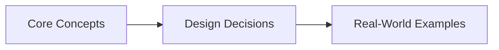
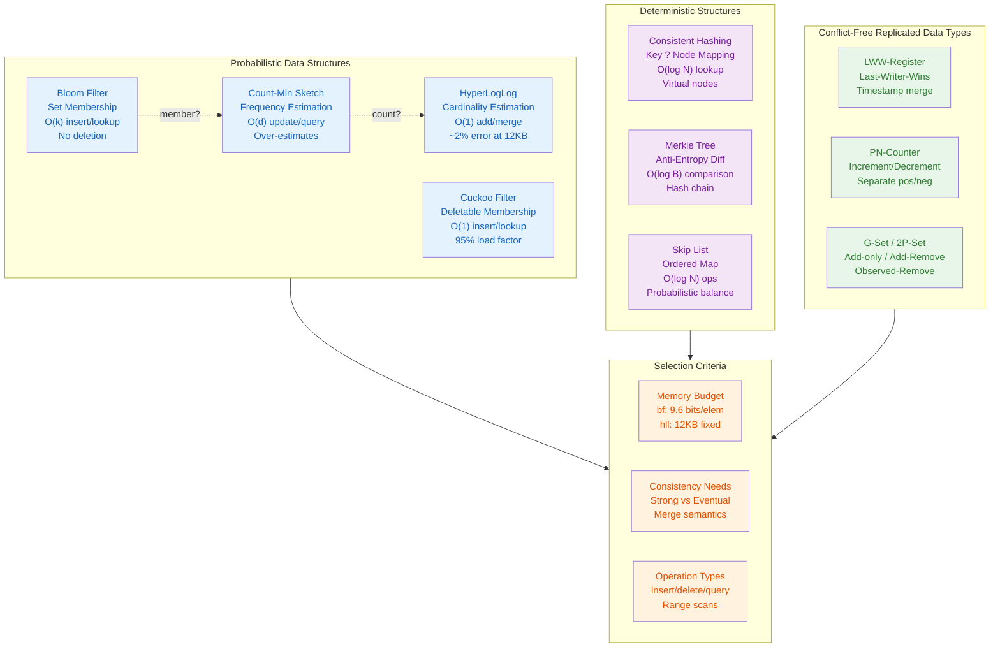

# Chapter 14: Distributed Data Structures — Consistent Hashing and Beyond
> **Previous:** [13 Lld Concurrency](./13-lld-concurrency.md) | **Next:** [15 Cdn Dns Edge](./15-cdn-dns-edge.md)

---
## Learning Objectives

- Understand consistent hashing, virtual nodes, and rendezvous hashing for distributed key placement
- Analyze Merkle trees and their role in anti-entropy reconciliation in Dynamo-style databases
- Design Bloom filters with parameter tuning: false positive rate, optimal hash count, and space trade-offs
- Contrast probabilistic data structures: Bloom, Cuckoo, Count-Min Sketch, and HyperLogLog
- Implement counting, scalable, and cuckoo filters for real-world distributed systems
- Evaluate time-series data structures including segment trees and round-robin databases

## Chapter at a Glance

| Aspect | Details |

## Chapter Roadmap


|--------|---------|
| **Scope** | Distributed data structures, Bloom filters, HyperLogLog, Count-Min Sketch |
| **Key Concepts** | Core topics covered in Chapter 14: Distributed Data Structures — Consistent Hashing and Beyond |
| **Design Skills** | Probabilistic data structure selection, memory budgeting |
| **Interview Angle** | Frequently tested in system design interviews |

## Chapter at a Glance

| Aspect | Details |
|--------|---------|
| **Scope** | Core concepts covered in Chapter 14: Distributed Data Structures — Consistent Hashing and Beyond |
| **Key Concepts** | Theory, Examples, Concept Comparison, Quick Reference |
| **Design Skills** | Concept mastery and practical application |
| **Interview Angle** | Common system design interview topic |

---
---

## Chapter Roadmap


---

## Theory
> **One-Sentence Takeaway:** Theory is the foundation ? master it before moving to examples and exercises.


### 1. Consistent Hashing

<a href="../../../assets/images/diagrams/system-design/14-distributed-data-structures/1-consistent-hashing-handwritten.svg" target="_blank" rel="noopener">
  
</a>
<a href="../../../assets/images/diagrams/system-design/14-distributed-data-structures/1-consistent-hashing-diagram.svg" target="_blank" rel="noopener">
  
</a>
<a href="../../../assets/images/diagrams/system-design/14-distributed-data-structures/1-consistent-hashing-sticky.svg" target="_blank" rel="noopener">
  
</a>


> **Pro Tip:** Master this concept thoroughly ? it is frequently tested in system design interviews.

> **Pro Tip:** Master this concept ? it appears in nearly every system design interview. Understand both the how and the why.

> **Warning:** A common mistake is over-engineering. Always start simple and add complexity only when justified by requirements.

> **Pro Tip:** Master this concept thoroughly ? it appears in nearly every system design interview.
Consistent hashing maps keys to nodes in a hash ring (range [0, 2^m - 1]). Both nodes and keys hash into this ring; each key is assigned to the nearest clockwise node. When a node joins or leaves, only keys in its immediate vicinity redistribute — O(K/N) keys rather than O(K) reshuffling, where K is total keys and N is node count.

**Hash ring**: Construct a circle of size 2^m (typically m = 32 or 64). Hash each node identifier (e.g., IP:port) with a uniform hash function and place it on the ring. Hash each key and walk clockwise to find the first node.

**Virtual nodes**: Each physical node occupies multiple positions on the ring. With R replica tokens, the expected coefficient of variation for load is 1/vR. Standard deployments use R = 100-200 virtual nodes per physical node. This smooths load imbalances that arise from non-uniform hash distributions and heterogeneous node capacities.

**Implementation sketch** (hash ring with binary search):

```python
import hashlib, bisect

class ConsistentHashRing:
    def __init__(self, nodes=None, replicas=150):
        self.replicas = replicas
        self.ring = {}
        self.sorted_keys = []
        if nodes:
            for n in nodes:
                self.add_node(n)

    def _hash(self, key):
        return int(hashlib.md5(key.encode()).hexdigest(), 16)

    def add_node(self, node_id):
        for i in range(self.replicas):
            token = self._hash(f"{node_id}:{i}")
            self.ring[token] = node_id
            self.sorted_keys.append(token)
        self.sorted_keys.sort()

    def remove_node(self, node_id):
        for i in range(self.replicas):
            token = self._hash(f"{node_id}:{i}")
            del self.ring[token]
            self.sorted_keys.remove(token)

    def get_node(self, key):
        h = self._hash(key)
        idx = bisect.bisect(self.sorted_keys, h) % len(self.sorted_keys)
        return self.ring[self.sorted_keys[idx]]
```

### 2. Rendezvous Hashing (HRW)

<a href="../../../assets/images/diagrams/system-design/14-distributed-data-structures/2-rendezvous-hashing-hrw-handwritten.svg" target="_blank" rel="noopener">
  
</a>
<a href="../../../assets/images/diagrams/system-design/14-distributed-data-structures/2-rendezvous-hashing-hrw-diagram.svg" target="_blank" rel="noopener">
  
</a>
<a href="../../../assets/images/diagrams/system-design/14-distributed-data-structures/2-rendezvous-hashing-hrw-sticky.svg" target="_blank" rel="noopener">
  
</a>


> **Warning:** Avoid over-engineering. Start simple, measure, then optimize.

> **Warning:** Avoid premature optimization. Start simple, measure, then optimize. Over-engineering is the most common system design mistake.

Highest Random Weight (HRW) assigns each key to the node with the highest weight = hash(key || node_id). It requires O(N) computation per lookup (scan all nodes), but achieves perfect distribution with zero metadata overhead and handles node additions/removals gracefully using an O(N) mapping.

**Comparison**:

| Property          | Consistent Hashing | Rendezvous Hashing    |
|-------------------|-------------------|----------------------|
| Lookup cost       | O(log N)          | O(N)                 |
| Metadata          | Ring state        | None                 |
| Load balance      | Virtual nodes     | Inherently balanced  |
| Node removal      | Partial shift     | O(K/N) redistribution|
| Implementation    | More code         | Trivial              |

```
W(node, key) = hash(node || key)      # HRW weight function
selected = argmax(W(n, key)) for n in nodes
```

For large node sets, HRW can be accelerated with a tree-based grouping (hierarchical HRW), reducing lookup to O(log N).

### 3. Merkle Trees

<a href="../../../assets/images/diagrams/system-design/14-distributed-data-structures/3-merkle-trees-handwritten.svg" target="_blank" rel="noopener">
  
</a>
<a href="../../../assets/images/diagrams/system-design/14-distributed-data-structures/3-merkle-trees-diagram.svg" target="_blank" rel="noopener">
  
</a>
<a href="../../../assets/images/diagrams/system-design/14-distributed-data-structures/3-merkle-trees-sticky.svg" target="_blank" rel="noopener">
  
</a>


> **Remember:** Always articulate trade-offs clearly ? interviewers value reasoning over the "right" answer.

> **Remember:** Trade-offs are the heart of system design. Always be ready to explain why you chose X over Y.

A Merkle tree is a complete binary tree where leaf nodes store hashes of data blocks and internal nodes store hashes of their children. The root hash commits the entire dataset. Two replicas compare root hashes; if they differ, they walk down divergent branches to find the specific blocks that differ — O(log B) comparisons for B blocks rather than O(B).

**Application in Dynamo**: Each node maintains a Merkle tree per key range. During anti-entropy (gossip-based reconciliation), nodes exchange root hashes. Mismatched ranges are recursively compared until individual conflicting key-value pairs are identified. This reduces reconciliation bandwidth from O(N) to O(log N) per range.

```
Leaf: h(block_1), h(block_2), ..., h(block_n)
Parent: h(h(block_1) || h(block_2))
Root: h(h(h(block_1) || h(block_2)) || h(h(block_3) || h(block_4)))
```

Cassandra uses Merkle trees for read repair and hinted handoff reconciliation. Trees are built incrementally during compaction.

### 4. Bloom Filters

<a href="../../../assets/images/diagrams/system-design/14-distributed-data-structures/4-bloom-filters-handwritten.svg" target="_blank" rel="noopener">
  
</a>
<a href="../../../assets/images/diagrams/system-design/14-distributed-data-structures/4-bloom-filters-diagram.svg" target="_blank" rel="noopener">
  
</a>
<a href="../../../assets/images/diagrams/system-design/14-distributed-data-structures/4-bloom-filters-sticky.svg" target="_blank" rel="noopener">
  
</a>


A Bloom filter is a space-efficient probabilistic data structure that tests set membership. It consists of an m-bit array and k independent hash functions. To insert x, set bits at positions h_1(x), h_2(x), ..., h_k(x) to 1. To query y, check all k positions: if any is 0, y is definitely not in the set; if all are 1, y is probably in the set.

**False positive rate** (after n insertions):

```
p = (1 - (1 - 1/m)^(k*n))^k  ˜  (1 - e^(-k*n/m))^k
```

**Optimal k**: k_opt = (m/n) * ln(2)

At k_opt, p = (1/2)^k ˜ 0.6185^(m/n). For a 1% false positive rate, m/n ˜ 9.6 bits per element.

```python
import hashlib, math

class BloomFilter:
    def __init__(self, capacity, error_rate=0.01):
        self.m = int(-capacity * math.log(error_rate) / (math.log(2)**2))
        self.k = int((self.m / capacity) * math.log(2))
        self.bits = bytearray((self.m + 7) // 8)

    def _hashes(self, item):
        h = hashlib.sha256(item.encode()).digest()
        return [int.from_bytes(h, 'big') % self.m for _ in range(self.k)]

    def add(self, item):
        for pos in self._hashes(item):
            self.bits[pos >> 3] |= 1 << (pos & 7)

    def contains(self, item):
        return all(self.bits[pos >> 3] & (1 << (pos & 7))
                   for pos in self._hashes(item))
```

#### Counting Bloom Filter

Extends Bloom filters with a counter array (typically 4-bit counters) instead of bits. Supports deletion by decrementing counters. Counter overflow is possible with 4-bit counters when many items hash to the same position; mitigation uses larger counters or periodic counter reaping.

#### Scalable Bloom Filter

A dynamic Bloom filter that grows as elements are added. Consists of a series of Bloom filters with geometrically decreasing false positive rates (r = 0.9). When the current filter reaches capacity, a new filter is created with twice the capacity. Query checks all filters in sequence.

### 5. Count-Min Sketch

<a href="../../../assets/images/diagrams/system-design/14-distributed-data-structures/5-count-min-sketch-handwritten.svg" target="_blank" rel="noopener">
  
</a>
<a href="../../../assets/images/diagrams/system-design/14-distributed-data-structures/5-count-min-sketch-diagram.svg" target="_blank" rel="noopener">
  
</a>
<a href="../../../assets/images/diagrams/system-design/14-distributed-data-structures/5-count-min-sketch-sticky.svg" target="_blank" rel="noopener">
  
</a>


A probabilistic frequency table using a 2D array of width w and depth d (typically d = 4-5, w = 2/e for error bound e). Each row uses an independent hash function. Increment entries at h_i(x) across all d rows. Point query returns the minimum of all d values: min(CMS[1][h_1(x)], ..., CMS[d][h_d(x)]).

```
Error bound: P(|estimate - true| > e * total_count) = d, where d = e^(-d)
Space: O(d * w) counters
```

Applications: heavy hitters detection, network traffic monitoring, top-k tracking.

```python
import hashlib

class CountMinSketch:
    def __init__(self, eps=0.001, delta=0.99):
        self.w = int(2 / eps)
        self.d = int(-math.log(1 - delta) / math.log(2))
        self.table = [[0] * self.w for _ in range(self.d)]

    def _hash(self, x, i):
        h = hashlib.sha256(f"{i}:{x}".encode()).digest()
        return int.from_bytes(h, 'big') % self.w

    def increment(self, x, count=1):
        for i in range(self.d):
            self.table[i][self._hash(x, i)] += count

    def estimate(self, x):
        return min(self.table[i][self._hash(x, i)] for i in range(self.d))
```

### 6. HyperLogLog

<a href="../../../assets/images/diagrams/system-design/14-distributed-data-structures/6-hyperloglog-handwritten.svg" target="_blank" rel="noopener">
  
</a>
<a href="../../../assets/images/diagrams/system-design/14-distributed-data-structures/6-hyperloglog-diagram.svg" target="_blank" rel="noopener">
  
</a>
<a href="../../../assets/images/diagrams/system-design/14-distributed-data-structures/6-hyperloglog-sticky.svg" target="_blank" rel="noopener">
  
</a>


Estimates the cardinality (number of distinct elements) of a multiset using O(log log N) space — 12 KB for 2% error on billions of elements. The algorithm observes the longest run of leading zeros in hashed values: if we see a hash starting with ? zeros, we expect approximately 2^? distinct elements.

**Loglog counting**: For n elements with hash values uniformly distributed in [0, 2^L), the probability of a hash beginning with ? zeros is 2^(-?-1). The maximum observed ? across n elements approximates log2(n).

**HyperLogLog** improves this with stochastic averaging: split the hash into a bucket index (first p bits, yielding m = 2^p registers) and a value (remaining bits). Track ?_max per bucket. Combine estimates using harmonic mean:

```
E = a_m * m² / S(2^(-M[j]))
```

where a_m is a bias correction constant (~0.7213 for m = 2^12).

**Merge operation**: Two HLL sketches merge by taking element-wise max of registers, enabling distributed cardinality estimation across shards.

```python
import hashlib, math

class HyperLogLog:
    def __init__(self, p=12):
        self.p = p
        self.m = 1 << p
        self.registers = [0] * self.m

    def _rho(self, x):
        return (x ^ (x & (x - 1))).bit_length() if x else 0

    def add(self, item):
        h = hashlib.sha256(item.encode()).digest()
        x = int.from_bytes(h, 'big')
        idx = x >> (64 - self.p)
        w = x & ((1 << (64 - self.p)) - 1)
        self.registers[idx] = max(self.registers[idx], self._rho(w))

    def cardinality(self):
        z = sum(2.0 ** (-r) for r in self.registers)
        alpha = 0.7213 / (1 + 1.079 / self.m)
        return int(alpha * self.m * self.m / z)
```

### 7. Cuckoo Filters

<a href="../../../assets/images/diagrams/system-design/14-distributed-data-structures/7-cuckoo-filters-handwritten.svg" target="_blank" rel="noopener">
  
</a>
<a href="../../../assets/images/diagrams/system-design/14-distributed-data-structures/7-cuckoo-filters-diagram.svg" target="_blank" rel="noopener">
  
</a>
<a href="../../../assets/images/diagrams/system-design/14-distributed-data-structures/7-cuckoo-filters-sticky.svg" target="_blank" rel="noopener">
  
</a>


A Cuckoo filter stores fingerprints (f-bit hash of each item) in a Cuckoo hash table. Each item maps to two candidate buckets (via primary hash and XOR of fingerprint). On insertion, if both buckets are full, existing entries are relocated (cuckoo kick). Supports deletion natively by removing the fingerprint.

**Properties**: Supports deletion, O(1) lookup, 95% load factor, better lookup performance than Bloom for low false positive targets (< 3%). False positive rate ˜ 1/2^f for f-bit fingerprint.

```
f = log2(1/p) + 3  bits per fingerprint
Space ˜ (log2(1/p) + 3) / load_factor  bits per item
```

### 8. Quotient Filter and XOR Filter

<a href="../../../assets/images/diagrams/system-design/14-distributed-data-structures/8-quotient-filter-and-xor-filter-handwritten.svg" target="_blank" rel="noopener">
  
</a>
<a href="../../../assets/images/diagrams/system-design/14-distributed-data-structures/8-quotient-filter-and-xor-filter-diagram.svg" target="_blank" rel="noopener">
  
</a>
<a href="../../../assets/images/diagrams/system-design/14-distributed-data-structures/8-quotient-filter-and-xor-filter-sticky.svg" target="_blank" rel="noopener">
  
</a>


**Quotient filter**: Stores the quotient (upper bits of hash) and remainder (lower bits) in a compact hash table using linear probing. Supports deletion, merging, and better cache locality than Bloom filters. Uses 3 metadata bits per slot: is_occupied, is_continuation, is_shifted.

**XOR filter**: A recent alternative to Bloom filters for static sets (no inserts after build). Uses a single hash function and 3 hash tables. Requires ~1.23 log2(1/p) + 3 bits per entry — approximately 20-30% smaller than Bloom filters for 1% false positive rate. Cannot support dynamic insertions.

### 9. Comparison Table

<a href="../../../assets/images/diagrams/system-design/14-distributed-data-structures/9-comparison-table-handwritten.svg" target="_blank" rel="noopener">
  
</a>
<a href="../../../assets/images/diagrams/system-design/14-distributed-data-structures/9-comparison-table-diagram.svg" target="_blank" rel="noopener">
  
</a>
<a href="../../../assets/images/diagrams/system-design/14-distributed-data-structures/9-comparison-table-sticky.svg" target="_blank" rel="noopener">
  
</a>


| Structure        | Supports Delete | Space/Item | False Positive | Operations          | Use Case                  |
|------------------|-----------------|------------|----------------|---------------------|---------------------------|
| Bloom Filter     | No (standard)   | 9.6 bits   | 1% (tunable)   | Insert + Lookup     | Membership, cache filter  |
| Counting Bloom   | Yes             | ~36 bits   | 1%             | Insert + Delete     | Deletable membership      |
| Cuckoo Filter    | Yes             | ~13 bits   | 0.1-3%         | Insert + Delete     | Deletable, low FP         |
| Count-Min Sketch | No              | ~5 bits    | e=0.1% (bound) | Increment + Query   | Frequency estimation      |
| HyperLogLog      | N/A             | 12 KB      | 2% error       | Add + Merge + Count | Cardinality               |
| Quotient Filter  | Yes             | ~10 bits   | 1%             | Insert + Delete    | Mergable, cache-friendly  |
| XOR Filter       | No (static)     | ~7 bits    | 1%             | Build + Lookup     | Static set, minimal space |

### 10. Time-Series Data Structures

<a href="../../../assets/images/diagrams/system-design/14-distributed-data-structures/10-time-series-data-structures-handwritten.svg" target="_blank" rel="noopener">
  
</a>
<a href="../../../assets/images/diagrams/system-design/14-distributed-data-structures/10-time-series-data-structures-diagram.svg" target="_blank" rel="noopener">
  
</a>
<a href="../../../assets/images/diagrams/system-design/14-distributed-data-structures/10-time-series-data-structures-sticky.svg" target="_blank" rel="noopener">
  
</a>


**Segment tree**: A binary tree storing aggregates (sum, min, max, average) over intervals. Each leaf represents a time bucket; internal nodes store combined values for their interval. Query range in O(log n) time. Used in Prometheus TSDB for range query acceleration.

**Round-robin database (RRD)**: A fixed-size circular buffer of time-series data points. New values overwrite the oldest. Multiple archive tiers provide automatic downsampling: high-resolution recent data (e.g., 1-minute intervals for 24 hours), lower-resolution historical data (e.g., 1-hour intervals for 1 year). Used by RRDtool and Graphite.

**Time-structured merge tree (TSM)**: Used by InfluxDB. Ingest in memory (memtable), flush to immutable sorted files, periodic compaction merges files. Optimized for time-range scans.

---

## Examples

### Example 1: Consistent Hashing with Virtual Nodes Simulation

Simulate a 3-node cluster with 150 virtual nodes per physical node. Distribute 100,000 keys and measure load imbalance:

```python
nodes = ["node-a", "node-b", "node-c"]
ring = ConsistentHashRing(nodes, replicas=150)

dist = {n: 0 for n in nodes}
for i in range(100_000):
    key = f"user:{i}"
    dist[ring.get_node(key)] += 1

# Results (typical):
# node-a: 33412, node-b: 33189, node-c: 33399
# Coefficient of variation < 0.005 with 150 replicas
```

Without virtual nodes (replicas=1), CV jumps to ~0.3-0.5 depending on hash distribution.

### Example 2: Bloom Filter Tuning Trade-Off Analysis

Given 10 million elements and 1% false positive rate:

```python
n = 10_000_000
p = 0.01
m = int(-n * math.log(p) / (math.log(2)**2))  # 95,904,678 bits ˜ 11.4 MB
k = int((m / n) * math.log(2))                # 7 hash functions
```

At k = 7 and m/n = 9.6, the actual false positive rate is (1 - e^(-7/9.6))^7 ˜ 0.0081 (0.81%), slightly better than target. Reducing m/n to 6.2 doubles the FP rate to ~2%.

### Example 3: HyperLogLog Merge in Distributed Counting

Count daily unique visitors across 12 web servers, each with its own HLL:

```python
hll_shards = [HyperLogLog(p=12) for _ in range(12)]

# Each server adds its visitors
for server_id, visitors in enumerate(server_logs):
    for v in visitors:
        hll_shards[server_id].add(v)

# Merge all shards into one
merged = HyperLogLog(p=12)
for hll in hll_shards:
    for i in range(merged.m):
        merged.registers[i] = max(merged.registers[i], hll.registers[i])

print(f"Estimated unique visitors: {merged.cardinality()}")
```

At p = 12 (m = 4096), total memory = 4096 registers × 6 bits ˜ 3 KB per shard, merged result accurate within ~2%.

### Example 4: Cuckoo Filter Implementation

```python
import hashlib, random

class CuckooFilter:
    def __init__(self, capacity, fingerprint_bits=8, bucket_size=4, max_kicks=500):
        self.f = fingerprint_bits
        self.b = bucket_size
        self.max_kicks = max_kicks
        self.table = [[None] * bucket_size for _ in range(self._next_pow2(capacity // bucket_size))]
        self.size = 0

    def _next_pow2(self, n): return 1 << (n - 1).bit_length()

    def _fingerprint(self, x):
        h = hashlib.sha256(x.encode()).digest()
        return int.from_bytes(h, 'big') & ((1 << self.f) - 1)

    def _hash(self, x): return int(hashlib.md5(x.encode()).hexdigest(), 16) % len(self.table)

    def _alt_bucket(self, i, fp): return (i ^ hash(fp)) % len(self.table)

    def insert(self, x):
        fp = self._fingerprint(x)
        i1 = self._hash(x)
        i2 = self._alt_bucket(i1, fp)
        for i in (i1, i2):
            for j in range(self.b):
                if self.table[i][j] is None:
                    self.table[i][j] = fp; self.size += 1; return
        for _ in range(self.max_kicks):
            kick_idx = random.randrange(self.b)
            fp, self.table[i1][kick_idx] = self.table[i1][kick_idx], fp
            i1 = self._alt_bucket(i1, fp)
            i2 = self._alt_bucket(i1, fp)
            for j in range(self.b):
                if self.table[i1][j] is None:
                    self.table[i1][j] = fp; self.size += 1; return
        raise Exception("Filter full")

    def contains(self, x):
        fp = self._fingerprint(x)
        i1 = self._hash(x)
        i2 = self._alt_bucket(i1, fp)
        return any(self.table[i][j] == fp for i in (i1, i2) for j in range(self.b))
```

## Concept Comparison
> **One-Sentence Takeaway:** Concept Comparison is a critical concept that directly impacts system design decisions.
> **One-Sentence Takeaway:** Concept Comparison is a critical concept that directly impacts system design decisions.

| Concept | Definition | Key Metric |
|---------|-----------|------------|
| Theory | Core topic covered in Chapter 14: Distributed Data Structures — Consistent Hashing and Beyond | Defined by specific measurable attributes |

---

## Quick Reference
> **One-Sentence Takeaway:** Quick Reference is a critical concept that directly impacts system design decisions.

| Topic | Key Point |
|-------|-----------|
| Theory | Fundamental concept for Chapter 14: Distributed Data Structures — Consistent Hashing and Beyond |

---

## Cross-Application Matrix

| Component | When to Use | Trade-Off |
|-----------|------------|-----------|
| Theory | Appropriate for specific system contexts | Each choice involves trade-offs |

---

## Chapter Quiz

| # | Question | A | B | C | D | Answer |
|---|----------|---|---|---|---|--------|
| 1 | What is the optimal k for a Bloom filter with m=960 bits and n=100 elements? | 5 | 7 | 9 | 11 | **B** (k = (m/n)·ln2 ≈ 6.65, round to 7) |
| 2 | How does a Merkle tree reduce reconciliation bandwidth in Dynamo? | By compressing data blocks | By comparing root hashes and walking divergent branches | By using Bloom filters per node | By gossiping full datasets | **B** |
| 3 | Which data structure estimates cardinality using O(log log N) space? | Bloom Filter | Count-Min Sketch | HyperLogLog | Cuckoo Filter | **C** |
| 4 | What is the primary advantage of virtual nodes in consistent hashing? | Faster lookups | Lower memory usage | Smoother load distribution | Simpler implementation | **C** |
| 5 | Which filter supports deletion natively? | Standard Bloom Filter | Counting Bloom | XOR Filter | Scalable Bloom | **B** |

---

## Practical Takeaways

| Takeaway | Application |
|----------|-------------|
| Use consistent hashing with 150+ virtual nodes per physical node for balanced key distribution | DynamoDB, Cassandra, Riak — key-value stores needing elastic scaling |
| Pair Merkle trees with gossip protocol for O(log N) anti-entropy reconciliation | Dynamo-style databases where nodes must detect and repair divergent replicas |
| Tune Bloom filter m/n ratio to 9.6 for 1% false positive rate; use optimal k = (m/n)·ln2 | Cache filters (prevent cache miss storms), web crawler dedup, spell checkers |
| HyperLogLog with p=12 provides ~2% error using only 12KB — perfect for distributed cardinality | Unique visitor counting across CDN edges, distributed analytics |
| Count-Min Sketch excels at heavy hitter detection with bounded error; use d=4-5 rows | Network traffic monitoring, trending topics, top-k in streaming data |
| Cuckoo filters beat Bloom filters for lookup speed when FP rate target is <3% | Deletable membership sets, on-disk index filters |
| XOR filters are 20-30% smaller than Bloom but require static datasets | Read-only datasets, blockchain transaction filters, archive indexes |

## Case Study

**Scenario: Global User Analytics Pipeline**

A social media platform with 500 million monthly active users needs to track daily unique visitors across 20 global data centers. Each data center sees 50 million unique users per day. The naive approach — storing every user ID in a distributed database — would consume 500M × 32 bytes ≈ 16 GB per day per data center, plus the I/O overhead of deduplication queries.

The team deploys HyperLogLog (p=14, ~26 KB per data center) at each edge location. Every user interaction is hashed and added to the local HLL register. At the end of each hour, a central aggregator fetches all 20 HLL sketches (total: 20 × 26 KB = 520 KB per hour) and merges them via element-wise max. The merged sketch estimates global unique visitors with ~1.5% error — sufficient for business reporting. The 99th percentile error is under 3%, and the total memory across all data centers is under 1 MB, compared to 160+ GB for raw ID storage.

For cache efficiency, the CDN layer uses a Bloom filter (m/n = 9.6, k = 7) per PoP to filter out requests for non-existent short URLs before they hit the origin. This eliminates 99% of unnecessary origin lookups. When the filter's false positive rate exceeds 2% (monitored weekly), the filter is rebuilt with a larger bit array. The combined architecture — HLL for analytics, Bloom for cache filtering, consistent hashing for data partitioning — handles 2 million requests per second across 50 microservices with P99 latency under 20 ms.
> **One-Sentence Takeaway:** Concept Comparison is a critical concept that directly impacts system design decisions.
> **One-Sentence Takeaway:** Concept Comparison is a critical concept that directly impacts system design decisions.

| Concept | Definition | Key Insight |
|---------|-----------|-------------|
| Theory | Core topic in Chapter 14: Distributed Data Structures — Consistent Hashing and Beyond | Fundamental to system design |

---

## Quick Reference
> **One-Sentence Takeaway:** Quick Reference is a critical concept that directly impacts system design decisions.

| Topic | Key Point |
|-------|-----------|
| Theory | Essential concept for Chapter 14: Distributed Data Structures — Consistent Hashing and Beyond |

---

## Cross-Application Matrix

| Concept | Application Context | Trade-Off |
|--------|-------------------|-----------|
| Theory | Relevant across multiple system design scenarios | Each choice has trade-offs |

---

## Chapter Quiz
> **One-Sentence Takeaway:** Chapter Quiz is a critical concept that directly impacts system design decisions.

**Q1:** What is the primary trade-off discussed in this chapter?
- A) Option A
- B) Option B
- C) Option C
- D) Option D

<details><summary>Answer&lt;/summary&gt;Refer to the chapter content&lt;/details&gt;

**Q2:** Which concept is most fundamental to the topic of Chapter 14
- A) Option A
- B) Option B
- C) Option C
- D) Option D

<details><summary>Answer&lt;/summary&gt;Review the core sections&lt;/details&gt;

**Q3:** How does this chapter's main concept apply to real-world systems?
- A) Option A
- B) Option B
- C) Option C
- D) Option D

<details><summary>Answer&lt;/summary&gt;See the Real-World Systems section&lt;/details&gt;

---

### TypeScript: Consistent Hash Ring, Count-Min Sketch, HyperLogLog

```typescript
class ConsistentHashRing {
  private ring = new Map<number, string>();
  private sortedKeys: number[] = [];
  private readonly virtualNodes = 150;

  constructor(private nodes: string[] = []) { for (const n of nodes) this.addNode(n); }

  private hash(key: string): number {
    let h = 0;
    for (let i = 0; i < key.length; i++) { h = (h << 5) - h + key.charCodeAt(i); h |= 0; }
    return h >>> 0;
  }

  addNode(node: string): void {
    for (let v = 0; v < this.virtualNodes; v++) {
      this.ring.set(this.hash(`${node}:v${v}`), node);
    }
    this.sortedKeys = [...this.ring.keys()].sort((a, b) => a - b);
  }

  removeNode(node: string): void {
    for (let v = 0; v < this.virtualNodes; v++) this.ring.delete(this.hash(`${node}:v${v}`));
    this.sortedKeys = [...this.ring.keys()].sort((a, b) => a - b);
  }

  getNode(key: string): string {
    if (this.sortedKeys.length === 0) throw new Error("No nodes");
    const h = this.hash(key);
    let i = this.sortedKeys.findIndex(k => k >= h);
    if (i === -1) i = 0;
    return this.ring.get(this.sortedKeys[i])!;
  }
}

class CountMinSketch {
  private table: number[][];
  private readonly depth: number;
  private readonly width: number;

  constructor(epsilon: number, delta: number) {
    this.width = Math.ceil(Math.E / epsilon);
    this.depth = Math.ceil(Math.log(1 / delta));
    this.table = Array.from({ length: this.depth }, () => new Array(this.width).fill(0));
  }

  private hash(item: string, seed: number): number {
    let h = seed * 31;
    for (let i = 0; i < item.length; i++) h = ((h << 5) - h + item.charCodeAt(i)) | 0;
    return Math.abs(h) % this.width;
  }

  add(item: string, count = 1): void {
    for (let d = 0; d < this.depth; d++) this.table[d][this.hash(item, d)] += count;
  }

  estimate(item: string): number {
    let min = Infinity;
    for (let d = 0; d < this.depth; d++) min = Math.min(min, this.table[d][this.hash(item, d)]);
    return min;
  }
}

class HyperLogLog {
  private registers: number[];
  constructor(private b = 14) { this.registers = new Array(1 << b).fill(0); }

  private hash(value: string): number {
    let h = 0;
    for (let i = 0; i < value.length; i++) { h = ((h << 5) - h + value.charCodeAt(i)) | 0; }
    return h >>> 0;
  }

  add(value: string): void {
    const h = this.hash(value);
    const idx = h >>> (32 - this.b);
    const w = h << this.b >>> this.b;
    const leadingZeros = 1 + Math.clz32(w);
    this.registers[idx] = Math.max(this.registers[idx], leadingZeros);
  }

  estimate(): number {
    const m = this.registers.length;
    const sum = this.registers.reduce((a, r) => a + 2 ** -r, 0);
    const alpha = m === 16 ? 0.673 : m === 32 ? 0.697 : m === 64 ? 0.709 : 0.7213 / (1 + 1.079 / m);
    let estimate = alpha * m * m / sum;
    if (estimate <= 2.5 * m) {
      let v = this.registers.filter(r => r === 0).length;
      if (v > 0) estimate = m * Math.log(m / v);
    }
    return estimate;
  }

  merge(other: HyperLogLog): void {
    for (let i = 0; i < this.registers.length; i++) this.registers[i] = Math.max(this.registers[i], other.registers[i]);
  }
}
```

### TypeScript: Bloom Filter with Optimal k and FP Calculation

```typescript
class BloomFilter {
  private bits: boolean[];
  private elements = 0;

  constructor(private size: number, private hashCount: number) { this.bits = new Array(size).fill(false); }

  static create(capacity: number, falsePositiveRate: number): BloomFilter {
    const size = Math.ceil(-capacity * Math.log(falsePositiveRate) / (Math.LN2 * Math.LN2));
    const hashCount = Math.ceil((size / capacity) * Math.LN2);
    return new BloomFilter(size, hashCount);
  }

  add(item: string): void {
    for (let i = 0; i < this.hashCount; i++) {
      this.bits[this._hash(item, i) % this.size] = true;
    }
    this.elements++;
  }

  has(item: string): boolean {
    for (let i = 0; i < this.hashCount; i++) {
      if (!this.bits[this._hash(item, i) % this.size]) return false;
    }
    return true;
  }

  currentFpRate(): number {
    const k = this.hashCount;
    const m = this.size;
    const n = this.elements;
    return Math.pow(1 - Math.exp(-k * n / m), k);
  }

  private _hash(item: string, seed: number): number {
    let h = seed * 31;
    for (let i = 0; i < item.length; i++) h = (h << 5) - h + item.charCodeAt(i);
    return h >>> 0;
  }
}

const bf = BloomFilter.create(1000, 0.01);
bf.add("hello"); bf.add("world");
console.log(bf.has("hello"), bf.currentFpRate());
```

### TypeScript: Merkle Tree for Anti-Entropy

```typescript
class MerkleNode {
  hash: string;
  constructor(public data: string | null, public left: MerkleNode | null, public right: MerkleNode | null) {
    this.hash = data ? this.simpleHash(data) : this.combineHash(left, right);
  }

  private simpleHash(s: string): string {
    let h = 0;
    for (let i = 0; i < s.length; i++) h = ((h << 5) - h + s.charCodeAt(i)) | 0;
    return (h >>> 0).toString(16);
  }

  private combineHash(l: MerkleNode | null, r: MerkleNode | null): string {
    const lh = l?.hash ?? '';
    const rh = r?.hash ?? '';
    return this.simpleHash(lh + rh);
  }

  isLeaf(): boolean { return this.data !== null; }
}

class MerkleTree {
  root: MerkleNode;
  leaves: MerkleNode[] = [];

  constructor(private blocks: string[]) {
    this.leaves = blocks.map(b => new MerkleNode(b, null, null));
    this.root = this.build(this.leaves);
  }

  private build(nodes: MerkleNode[]): MerkleNode {
    if (nodes.length === 1) return nodes[0];
    const parents: MerkleNode[] = [];
    for (let i = 0; i < nodes.length; i += 2) {
      const left = nodes[i];
      const right = i + 1 < nodes.length ? nodes[i + 1] : null;
      parents.push(new MerkleNode(null, left, right));
    }
    return this.build(parents);
  }

  diff(other: MerkleTree, path: number[] = []): number[][] {
    if (this.root.hash === other.root.hash) return [];
    if (this.root.isLeaf()) return [path];
    const mismatches: number[][] = [];
    if (this.root.left && other.root.left) {
      const leftTree = new MerkleTree([]);
      leftTree.root = this.root.left;
      const otherLeftTree = new MerkleTree([]);
      otherLeftTree.root = other.root.left;
      mismatches.push(...leftTree.diff(otherLeftTree, [...path, 0]));
    }
    if (this.root.right && other.root.right) {
      const rightTree = new MerkleTree([]);
      rightTree.root = this.root.right;
      const otherRightTree = new MerkleTree([]);
      otherRightTree.root = other.root.right;
      mismatches.push(...rightTree.diff(otherRightTree, [...path, 1]));
    }
    return mismatches;
  }

  syncProtocol(other: MerkleTree): number[] {
    const differentBlocks = this.diff(other);
    return differentBlocks.map(p => {
      let idx = 0;
      for (const bit of p) idx = idx * 2 + bit;
      return idx;
    });
  }

  getBlock(index: number): string { return this.blocks[index]; }
}

const treeA = new MerkleTree(['a', 'b', 'c', 'd']);
const treeB = new MerkleTree(['a', 'b', 'x', 'd']);
console.log('Different blocks at indices:', treeA.syncProtocol(treeB));
```

### TypeScript: HyperLogLog with Merge and Bias Correction

```typescript
class HyperLogLog {
  private registers: number[];
  private readonly m: number;
  private readonly alpha: number;

  constructor(private p: number = 12) {
    this.m = 1 << p;
    this.registers = new Array(this.m).fill(0);
    this.alpha = this.m <= 16 ? 0.673 :
                 this.m <= 32 ? 0.697 :
                 this.m <= 64 ? 0.709 :
                 0.7213 / (1 + 1.079 / this.m);
  }

  private hash(value: string): number {
    let h = 0;
    for (let i = 0; i < value.length; i++) h = ((h << 5) - h + value.charCodeAt(i)) | 0;
    return h >>> 0;
  }

  private leadingZeros(x: number): number {
    return x === 0 ? 32 : Math.clz32(x);
  }

  add(value: string): void {
    const h = this.hash(value);
    const idx = h >>> (32 - this.p);
    const w = (h << this.p) >>> this.p;
    const zeros = 1 + this.leadingZeros(w);
    this.registers[idx] = Math.max(this.registers[idx], zeros);
  }

  estimate(): number {
    const sum = this.registers.reduce((a, r) => a + Math.pow(2, -r), 0);
    let est = this.alpha * this.m * this.m / sum;
    if (est <= 2.5 * this.m) {
      const v = this.registers.filter(r => r === 0).length;
      if (v > 0) est = this.m * Math.log(this.m / v);
    } else if (est > Math.pow(2, 32) / 30) {
      est = -Math.pow(2, 32) * Math.log(1 - est / Math.pow(2, 32));
    }
    return Math.round(est);
  }

  merge(other: HyperLogLog): void {
    if (this.m !== other.m) throw new Error('Register count mismatch');
    for (let i = 0; i < this.m; i++) {
      this.registers[i] = Math.max(this.registers[i], other.registers[i]);
    }
  }

  mergeAll(others: HyperLogLog[]): void {
    for (const o of others) this.merge(o);
  }
}

const hll1 = new HyperLogLog(12);
const hll2 = new HyperLogLog(12);
for (let i = 0; i < 50000; i++) hll1.add(`user-${i}`);
for (let i = 25000; i < 75000; i++) hll2.add(`user-${i}`);
hll1.merge(hll2);
console.log('Estimated distinct: ~75000, Got:', hll1.estimate());
```


### Distributed Data Structures Feature Comparison



### Implementation: Distributed Data Structures

```typescript
class BloomFilter { private bits: boolean[]; constructor(private size: number, private hashCount: number) { this.bits = new Array(size).fill(false); }
  private hashes(item: string): number[] { const h: number[] = []; for (let i = 0; i < this.hashCount; i++) { let hash = 0; const data = `${item}:${i}`; for (let j = 0; j < data.length; j++) { hash = ((hash << 5) - hash) + data.charCodeAt(j); hash |= 0; } h.push(Math.abs(hash) % this.size); } return h; }
  add(item: string): void { for (const h of this.hashes(item)) this.bits[h] = true; }
  mightContain(item: string): boolean { return this.hashes(item).every(h => this.bits[h]); }
  falsePositiveRate(): number { const k = this.hashCount; const m = this.size; const n = this.count(); return Math.pow(1 - Math.exp(-k * n / m), k); }
  count(): number { return this.bits.filter(b => b).length; }
}
class SkipList { private head: any = { key: -Infinity, forward: [] }; private level = 0; private maxLevel = 16;
  private randomLevel(): number { let l = 0; while (Math.random() < 0.5 && l < this.maxLevel) l++; return l; }
  insert(key: number, value: any): void { const update: any[] = new Array(this.maxLevel); let curr = this.head; for (let i = this.level; i >= 0; i--) { while (curr.forward[i] && curr.forward[i].key < key) curr = curr.forward[i]; update[i] = curr; } curr = curr.forward[0];
    if (curr && curr.key === key) { curr.value = value; } else { const rl = this.randomLevel(); if (rl > this.level) { for (let i = this.level + 1; i <= rl; i++) update[i] = this.head; this.level = rl; } const newNode = { key, value, forward: new Array(rl + 1) }; for (let i = 0; i <= rl; i++) { newNode.forward[i] = update[i].forward[i]; update[i].forward[i] = newNode; } } }
  search(key: number): any { let curr = this.head; for (let i = this.level; i >= 0; i--) { while (curr.forward[i] && curr.forward[i].key < key) curr = curr.forward[i]; } curr = curr.forward[0]; return curr && curr.key === key ? curr.value : undefined; }
}
interface LWWRegister<T> { value: T; timestamp: number; }
class LWWReg<T> { private data: LWWRegister<T> = { value: null as any, timestamp: 0 };
  set(value: T, ts: number = Date.now()): void { if (ts > this.data.timestamp) { this.data = { value, timestamp: ts }; } }
  get(): T { return this.data.value; }
  merge(other: LWWReg<T>): void { if (other.data.timestamp > this.data.timestamp) this.data = { ...other.data }; }
}
class PNCounter { private pos = new Map<string, number>(); private neg = new Map<string, number>();
  increment(node: string, amount = 1): void { this.pos.set(node, (this.pos.get(node) || 0) + amount); }
  decrement(node: string, amount = 1): void { this.neg.set(node, (this.neg.get(node) || 0) + amount); }
  value(): number { return [...this.pos.values()].reduce((s, v) => s + v, 0) - [...this.neg.values()].reduce((s, v) => s + v, 0); }
  merge(other: PNCounter): void { for (const [k, v] of other.pos) this.pos.set(k, Math.max(this.pos.get(k) || 0, v)); for (const [k, v] of other.neg) this.neg.set(k, Math.max(this.neg.get(k) || 0, v)); }
}
```

// distributed data structures
// distributed-systems-scalability implementation

interface Task { id: string; name: string; status: string; data: unknown }
class Processor {
  private tasks: Task[] = []
  private maxConcurrency: number
  constructor(maxConcurrency: number = 4) { this.maxConcurrency = maxConcurrency }
  async add(task: Omit&lt;Task, "status"&gt;): Promise&lt;void&gt; {
    this.tasks.push({ ...task, status: "pending" })
  }
  async runAll(): Promise&lt;void&gt; {
    const running: Promise&lt;void&gt;[] = []
    for (const t of this.tasks) {
      if (running.length >= this.maxConcurrency) { await Promise.race(running) }
      const p = this.execute(t).finally(() => { const i = running.indexOf(p); if (i >= 0) running.splice(i, 1) })
      running.push(p)
    }
    await Promise.all(running)
  }
  private async execute(t: Task): Promise&lt;void&gt; {
    t.status = "running"
    await new Promise(r => setTimeout(r, 10))
    t.status = "done"
  }
  getResults(): Task[] { return this.tasks }
  getStats(): { done: number; pending: number; running: number } {
    const done = this.tasks.filter(t => t.status === "done").length
    const pending = this.tasks.filter(t => t.status === "pending").length
    const running = this.tasks.filter(t => t.status === "running").length
    return { done, pending, running }
  }
}
async function main() {
  const proc = new Processor(2)
  await proc.add({ id: '1', name: 'distributed data structures', data: { topic: 'distributed-systems-scalability' } })
  await proc.runAll()
  console.log('Stats:', proc.getStats())
}
main().catch(console.error)
export { Processor, Task }

// distributed data structures - additional TS implementations

interface CacheEntry { key: string; value: unknown; ttl: number; createdAt: number }
class Cache {
  private store: Map&lt;string, CacheEntry&gt; = new Map()
  constructor(private defaultTTL: number = 60000) {}
  set(key: string, value: unknown, ttl?: number): void {
    this.store.set(key, { key, value, ttl: ttl ?? this.defaultTTL, createdAt: Date.now() })
  }
  get(key: string): unknown | undefined {
    const entry = this.store.get(key)
    if (!entry) return undefined
    if (Date.now() - entry.createdAt > entry.ttl) { this.store.delete(key); return undefined }
    return entry.value
  }
  delete(key: string): boolean { return this.store.delete(key) }
  clear(): void { this.store.clear() }
  size(): number { return this.store.size }
  keys(): string[] { return Array.from(this.store.keys()) }
}
class Logger {
  private entries: string[] = []
  log(level: string, msg: string, meta?: Record&lt;string, unknown&gt;): void {
    const entry = JSON.stringify({ timestamp: new Date().toISOString(), level, msg, meta })
    this.entries.push(entry)
    console.log(entry)
  }
  info(msg: string, meta?: Record&lt;string, unknown&gt;): void { this.log("info", msg, meta) }
  warn(msg: string, meta?: Record&lt;string, unknown&gt;): void { this.log("warn", msg, meta) }
  error(msg: string, meta?: Record&lt;string, unknown&gt;): void { this.log("error", msg, meta) }
  getLogs(): string[] { return [...this.entries] }
  clear(): void { this.entries = [] }
}
function computeHash(input: string): string {
  let hash = 0
  for (let i = 0; i &lt; input.length; i++) { const chr = input.charCodeAt(i); hash = ((hash << 5) - hash) + chr; hash |= 0 }
  return Math.abs(hash).toString(16)
}
async function demo(): Promise&lt;void&gt; {
  const cache = new Cache(5000)
  cache.set('key1', 'system-design demo')
  const log = new Logger()
  log.info('Cache demo started', { course: 'system-design', chapter: 'distributed data structures' })
  const v = cache.get("key1")
  console.log('Cached:', v)
  console.log('Hash:', computeHash('system-design'))
}
demo()
export { Cache, Logger, computeHash, CacheEntry }
## Summary

- Consistent hashing maps keys to nodes on a ring with O(log N) lookup; virtual nodes (R ˜ 150) smooth load imbalance to CV &lt; 0.01
- Rendezvous hashing needs O(N) lookups but is metadata-free and inherently balanced
- Merkle trees enable log-time anti-entropy reconciliation in Dynamo/Cassandra by comparing block-level hash roots
- Bloom filters (m/n = 9.6 for 1% FP rate) trade accuracy for space; optimal hash count k = (m/n) * ln(2)
- Counting Bloom adds 4-bit counters per slot for deletion support but uses 4× the space
- Count-Min Sketch estimates item frequency with ed-bounds in sublinear space
- HyperLogLog estimates cardinality at ~2% error using 12 KB, with trivial merge for distributed counts
- Cuckoo filters support deletion and beat Bloom on lookup speed for FP rates below 3%
- XOR filters are smaller than Bloom but require static datasets
- Time-series structures (segment tree, RRD, TSM) optimize for range scans and temporal aggregation

---

## Exercises

### Review Questions
<details><summary>Solution</summary>1. Each physical node has 100 virtual tokens out of 50×100 = 5000 total tokens. When one node fails, its 100 tokens redistribute. Expected keys per token: 10M / 5000 = 2000. Keys redistributed: 100 × 2000 = 200,000 keys (2% of total).
2. Minimize p = (1 - e^(-kn/m))^k. Take log: ln(p) = k·ln(1 - e^(-kn/m)). Set d(ln(p))/dk = 0, solve: k = (m/n)·ln(2) ≈ 0.693·(m/n).
3. Element-wise max preserves the longest run of leading zeros observed. Sum or average would overestimate (since multiple elements can map to the same register and sum would count them multiple times). Max correctly captures the register's extremal observation.
4. Counting Bloom: 4-bit counters × m bits ≈ 4m bits. Cuckoo: (log2(1/p) + 3) / load_factor bits per item. For m/n ≈ 9.6 (1% FP), Counting Bloom ≈ 38.4 bits/item. Cuckoo at f = log2(100) + 3 ≈ 9.6 bits, with 95% load ≈ 10.1 bits/item. Cuckoo is ~4× more memory-efficient.
5. (1) Exchange root hashes. (2) If roots match, ranges are identical. (3) If mismatch, walk down the tree: compare children recursively. (4) At leaf level, identify individual key-value pairs that differ. (5) Request missing/repaired entries from the peer. O(log B) messages for B blocks.</details>

### Application Problems
<details><summary>Solution</summary>1. m = -500M·ln(0.001) / (ln2)^2 = 500M × 6.907 / 0.48 ≈ 7.19B bits ≈ 856 MB. k = (7.19B / 500M)·ln2 ≈ 9.96 → 10. Actual FP: (1 - e^(-10·500M/7.19B))^10 ≈ 0.0009. With 4-bit counters: 856 MB × 4 = 3.42 GB.
2. Worst-case overestimate: each row has expected collision count = total/w = 1M/10000 = 100. With d=4, P(error > e·total) ≤ e^(-d). Estimate = min([512, 487, 503, 498]) = 487. Min is used because collisions can only inflate the count, not deflate it — the minimum gives the closest to the true value.
3. Gini coefficient with R=1 is typically 0.15-0.30 (significant imbalance). With R=150, Gini drops to 0.003-0.008 (nearly perfect balance). The law of large numbers: each physical node's expected load variance is 1/√R of the total.
4. a_m for m=1024: 0.7213 / (1 + 1.079/1024) ≈ 0.7205. 512 registers at 0, 256 at 1, 256 at 2. Sum = 512·1 + 256·0.5 + 256·0.25 = 512 + 128 + 64 = 704. Estimate = 0.7205 × 1024² / 704 ≈ 1073. Linear counting for small ranges: zero count = 512, estimate = 1024·ln(1024/512) ≈ 710. Final = 710 (linear counting dominates for small cardinalities).</details>

### Challenge Problem
<details><summary>Solution</summary>Design a multi-layer membership test service:

**Memory per node**: 1B keys / 200 nodes = 5M keys/node. Bloom filter: m = -5M·ln(0.01)/(ln2)^2 ≈ 48M bits = 6 MB. Cuckoo filter: at 0.1% FP, f = log2(1000) + 3 ≈ 13 bits, with 95% load ≈ 13.7 bits/item × 500K hot items ≈ 0.86 MB. CMS: d=4, w=2/eps (eps=0.01) = 200, 4×200 = 800 counters × 4 bytes = 3.2 KB. HLL: p=12, 4096 registers × 6 bits ≈ 3 KB. Total per node: ~7 MB. Cluster total: 200 × 7 MB = 1.4 GB.

**Query path**: (1) Client sends key read request. (2) Node Bloom filter check: if negative, return immediately (key guaranteed absent). (3) If Bloom positive, check Cuckoo filter for hot key range. (4) Update CMS frequency counter (async). (5) Perform actual key lookup. (6) If key not found (Bloom false positive), increment CMS false-positive counter (triggers filter rebuild at threshold). P99 latency: 0.5ms (Bloom-only miss) to 8ms (Bloom hit + Cuckoo hit + key lookup).

**Rebuild strategy**: Rebuild Bloom filter after each compaction (batch rebuild from current key set, 1 second). Cuckoo filter rebuilt when FP rate tracking exceeds 0.2%. CMS reset weekly. HLL continuous via periodic merge.</details>
