# Chapter 15: CDN, DNS, and Edge Computing
> **Previous:** [14 Distributed Data Structures](./14-distributed-data-structures.md) | **Next:** [16 Api Gateways Cqrs](./16-api-gateways-cqrs.md)

---
## Learning Objectives

- Trace the full DNS resolution path from stub resolver to authoritative server
- Analyze DNS caching hierarchies: browser, OS, resolver, and negative caching with TTL semantics
- Compare DNS-based load balancing strategies: round-robin, weighted, geo-based, and latency-based
- Design CDN architectures: origin shield, edge PoPs, pull vs push zones, cache invalidation
- Evaluate edge computing platforms: Lambda@Edge, Cloudflare Workers, and EdgeKV
- Formulate DDoS mitigation strategies at the edge: rate limiting, WAF, scrubbing, anycast absorption

## Chapter at a Glance

| Aspect | Details |

## Chapter Roadmap

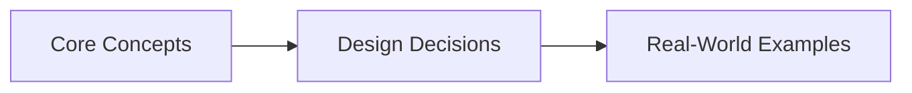
|--------|---------|
| **Scope** | CDN, DNS, edge computing, content delivery, latency optimization |
| **Key Concepts** | Core topics covered in Chapter 15: CDN, DNS, and Edge Computing |
| **Design Skills** | CDN configuration, DNS routing, edge compute design |
| **Interview Angle** | Frequently tested in system design interviews |

## Chapter at a Glance

| Aspect | Details |
|--------|---------|
| **Scope** | Core concepts covered in Chapter 15: CDN, DNS, and Edge Computing |
| **Key Concepts** | Theory, Examples, Concept Comparison, Quick Reference |
| **Design Skills** | Concept mastery and practical application |
| **Interview Angle** | Common system design interview topic |

---
---

## Chapter Roadmap

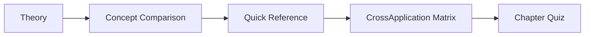

---

## Theory
> **One-Sentence Takeaway:** Theory is the foundation ? master it before moving to examples and exercises.


### 1. DNS Hierarchy

<a href="../../assets/images/diagrams/system-design/15-cdn-dns-edge/1-dns-hierarchy-handwritten.svg" target="_blank" rel="noopener">
  
</a>
<a href="../../assets/images/diagrams/system-design/15-cdn-dns-edge/1-dns-hierarchy-diagram.svg" target="_blank" rel="noopener">
  
</a>
<a href="../../assets/images/diagrams/system-design/15-cdn-dns-edge/1-dns-hierarchy-sticky.svg" target="_blank" rel="noopener">
  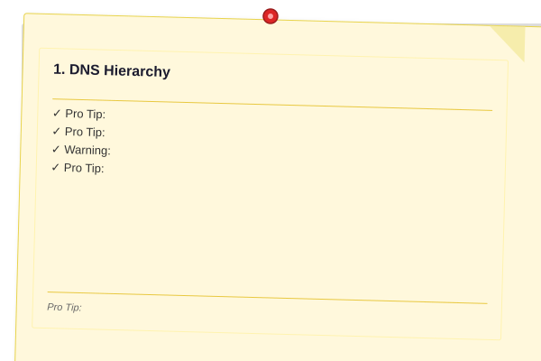
</a>


> **Pro Tip:** Master this concept thoroughly ? it is frequently tested in system design interviews.

> **Pro Tip:** Master this concept ? it appears in nearly every system design interview. Understand both the how and the why.

> **Warning:** A common mistake is over-engineering. Always start simple and add complexity only when justified by requirements.

> **Pro Tip:** Master this concept thoroughly ? it appears in nearly every system design interview.
The Domain Name System (DNS) is a hierarchical, distributed naming system that resolves human-readable domain names (e.g., api.example.com) to IP addresses. The hierarchy has four tiers:

**Root servers**: 13 logical root zones (A through M) operated by 12 independent organizations, anycasted across hundreds of physical locations worldwide. Root servers answer with referrals to TLD servers. They contain no domain-specific records.

**TLD servers**: Authoritative for top-level domains (.com, .org, .net, .io, .gov, country TLDs like .uk, .jp). Operated by registries (Verisign for .com/.net, Public Interest Registry for .org). Each TLD server knows which authoritative nameservers serve each registered domain.

**Authoritative servers**: The final source of truth for a specific domain. Maintained by the domain owner or DNS provider (Route53, CloudDNS, Cloudflare). Store actual DNS records (A, AAAA, CNAME, MX, etc.). The SOA (Start of Authority) record identifies the primary authoritative server.

**Recursive resolvers**: Intermediate caching servers (typically operated by ISPs, Google 8.8.8.8, Cloudflare 1.1.1.1). Recursively walk the hierarchy on behalf of clients and cache results.

### 2. DNS Resolution Flow

<a href="../../assets/images/diagrams/system-design/15-cdn-dns-edge/2-dns-resolution-flow-handwritten.svg" target="_blank" rel="noopener">
  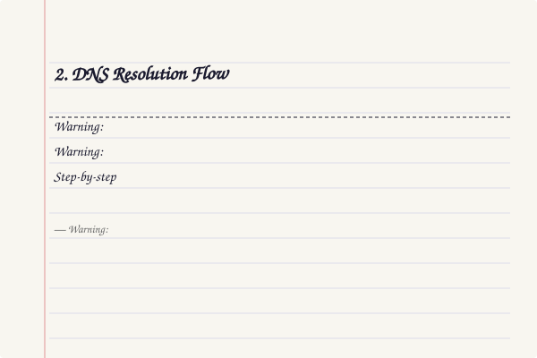
</a>
<a href="../../assets/images/diagrams/system-design/15-cdn-dns-edge/2-dns-resolution-flow-diagram.svg" target="_blank" rel="noopener">
  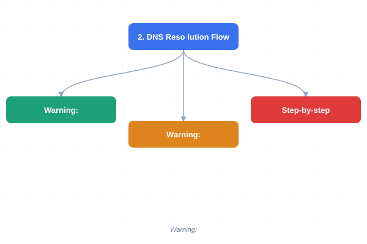
</a>
<a href="../../assets/images/diagrams/system-design/15-cdn-dns-edge/2-dns-resolution-flow-sticky.svg" target="_blank" rel="noopener">
  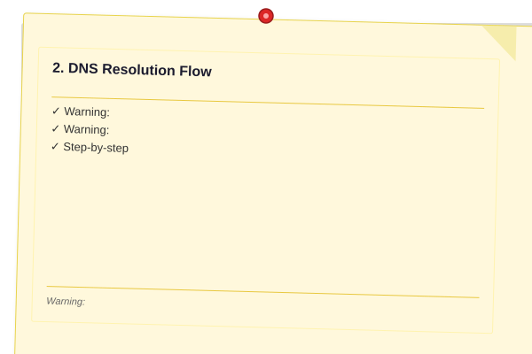
</a>


> **Warning:** Avoid over-engineering. Start simple, measure, then optimize.

> **Warning:** Avoid premature optimization. Start simple, measure, then optimize. Over-engineering is the most common system design mistake.

```
Client (stub resolver)
  ? Recursive resolver (e.g., 8.8.8.8)
    ? Root server (gets .com TLD referral)
    ? TLD server (gets example.com authoritative referral)
    ? Authoritative server (returns A record: 93.184.216.34)
  ? Returns IP to client
```

**Step-by-step**:
1. Application calls `getaddrinfo("api.example.com", ...)` — the stub resolver (OS library) sends a UDP query (port 53) to the configured recursive resolver
2. Recursive resolver checks its cache; on miss, sends query to a root server (built-in root hints file)
3. Root server responds with NS records for .com TLD, plus glue A records for those NS IPs
4. Resolver queries .com TLD server, which returns NS records for example.com
5. Resolver queries example.com's authoritative nameserver, which returns the A record for api.example.com
6. Resolver caches the result for the record's TTL, returns IP to client

Each delegation step involves potential UDP (default, 512 bytes) or TCP fallback for large responses (DNSSEC, many records).

### 3. DNS Caching

<a href="../../assets/images/diagrams/system-design/15-cdn-dns-edge/3-dns-caching-handwritten.svg" target="_blank" rel="noopener">
  
</a>
<a href="../../assets/images/diagrams/system-design/15-cdn-dns-edge/3-dns-caching-diagram.svg" target="_blank" rel="noopener">
  
</a>
<a href="../../assets/images/diagrams/system-design/15-cdn-dns-edge/3-dns-caching-sticky.svg" target="_blank" rel="noopener">
  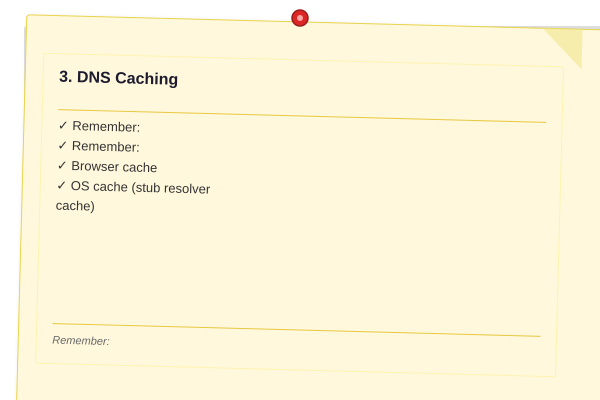
</a>


> **Remember:** Always articulate trade-offs clearly ? interviewers value reasoning over the "right" answer.

> **Remember:** Trade-offs are the heart of system design. Always be ready to explain why you chose X over Y.

**Browser cache**: Chrome caches DNS with configurable expiration (default 60s per record, up to 1 minute via net.dns caching). In-memory, per-process.

**OS cache (stub resolver cache)**: Windows caches positive results for 86400s (1 day) by default, negative results for 300s (5 min). Linux glibc nscd or systemd-resolved provides nameserver caching. Accessible via `ipconfig /displaydns` on Windows.

**Resolver cache**: Recursive resolvers cache aggressively (typically full TTL). Google Public DNS respects TTL but has a minimum of 10 seconds. ISPs may ignore TTL (a practice called "TTL overrides") to reduce upstream load — problematic for fast failover.

**Negative caching**: NXDOMAIN results (domain doesn't exist) and NODATA (domain exists but record type missing) are cached per RFC 2308. SOA minimum TTL field controls negative cache duration, typically 300-3600 seconds.

**TTL and propagation**: TTL (Time To Live) in seconds controls how long a resolver can cache a record. Short TTLs (30-300s) enable faster failover but increase resolver load. Long TTLs (86400s+) reduce traffic but delay updates. DNS propagation is the time for all caches to expire after a record change.

| TTL Class    | Values     | Use Case                     |
|-------------|------------|------------------------------|
| Very short  | 1-60s      | Failover, leader election    |
| Short       | 60-300s    | Load-balanced endpoints      |
| Medium      | 900-3600s  | Normal web services          |
| Long        | 86400s+    | Static records, MX           |

### 4. DNS Record Types

<a href="../../assets/images/diagrams/system-design/15-cdn-dns-edge/4-dns-record-types-handwritten.svg" target="_blank" rel="noopener">
  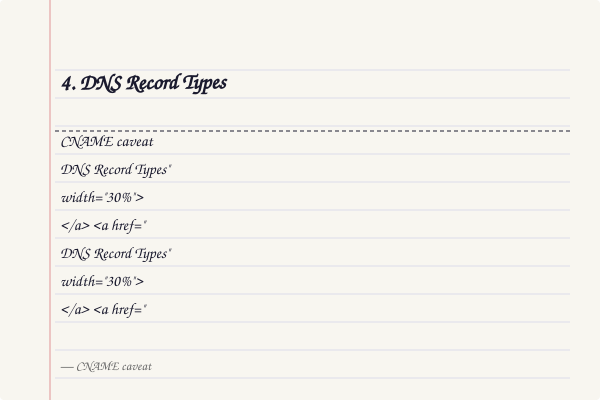
</a>
<a href="../../assets/images/diagrams/system-design/15-cdn-dns-edge/4-dns-record-types-diagram.svg" target="_blank" rel="noopener">
  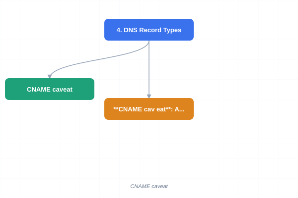
</a>
<a href="../../assets/images/diagrams/system-design/15-cdn-dns-edge/4-dns-record-types-sticky.svg" target="_blank" rel="noopener">
  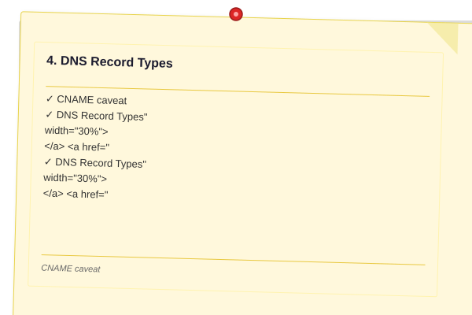
</a>


| Type  | Purpose                           | Content                                |
|-------|-----------------------------------|----------------------------------------|
| A     | IPv4 address mapping              | 93.184.216.34                          |
| AAAA  | IPv6 address mapping              | 2606:2800:220:1:248:1893:25c8:1946    |
| CNAME | Canonical name (alias)            | www ? example.com                      |
| MX    | Mail exchange                     | priority 10 mail.example.com           |
| NS    | Nameserver delegation             | ns1.example.com                        |
| TXT   | Arbitrary text                    | SPF, DKIM, DMARC, verification tokens  |
| SRV   | Service location                  | priority weight port target            |
| SOA   | Start of authority                | Primary NS, admin email, serial, refresh, retry, expire, minimum |

**CNAME caveat**: A CNAME record cannot coexist with any other record type at the same name. The apex domain (example.com) cannot be a CNAME — use ALIAS/ANAME records (provided by some DNS providers) that resolve at the authoritative server level.

### 5. DNS-Based Load Balancing

<a href="../../assets/images/diagrams/system-design/15-cdn-dns-edge/5-dns-based-load-balancing-handwritten.svg" target="_blank" rel="noopener">
  
</a>
<a href="../../assets/images/diagrams/system-design/15-cdn-dns-edge/5-dns-based-load-balancing-diagram.svg" target="_blank" rel="noopener">
  
</a>
<a href="../../assets/images/diagrams/system-design/15-cdn-dns-edge/5-dns-based-load-balancing-sticky.svg" target="_blank" rel="noopener">
  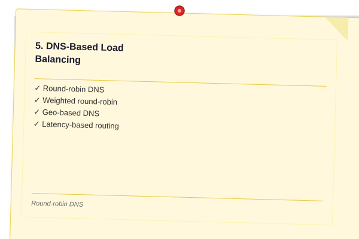
</a>


**Round-robin DNS**: Multiple A records for one name returned in rotating order. Simple but stateless — does not consider server health or load. If one server fails, clients with cached results still connect to it.

```
api.example.com  ?  10.0.0.1 (TTL=60)
                   10.0.0.2 (TTL=60)
                   10.0.0.3 (TTL=60)
```

**Weighted round-robin**: Associate weights with each IP. A weight-3 server gets 3× the traffic of a weight-1 server. Used for gradual traffic migration during deployments.

**Geo-based DNS**: Return different IPs based on the resolver's geographic location (GeoIP database). Direct US users to us-east servers, EU users to eu-west. Imprecise because resolver location may differ from client location (especially with public resolvers like 8.8.8.8).

**Latency-based routing**: DNS service (AWS Route53 LBR, Google Cloud DNS) probes endpoint health and latency from various vantage points in real-time. Returns the lowest-latency healthy endpoint. More accurate than geo-based but requires health probing infrastructure.

### 6. Anycast Routing

<a href="../../assets/images/diagrams/system-design/15-cdn-dns-edge/6-anycast-routing-handwritten.svg" target="_blank" rel="noopener">
  
</a>
<a href="../../assets/images/diagrams/system-design/15-cdn-dns-edge/6-anycast-routing-diagram.svg" target="_blank" rel="noopener">
  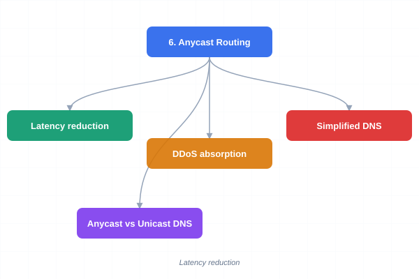
</a>
<a href="../../assets/images/diagrams/system-design/15-cdn-dns-edge/6-anycast-routing-sticky.svg" target="_blank" rel="noopener">
  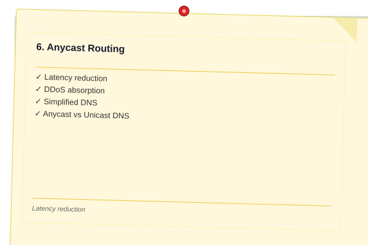
</a>


Anycast advertises the same IP prefix from multiple geographically distributed locations using BGP (Border Gateway Protocol). Traffic routes to the nearest (topologically closest) location. This provides:

- **Latency reduction**: Clients reach the nearest PoP organically
- **DDoS absorption**: Attack traffic distributes across all anycast sites. Cloudflare absorbs 100+ Tbps across 330+ cities by spreading attack traffic across multiple data centers
- **Simplified DNS**: Same IP globally; no geo-based logic needed

**Anycast vs Unicast DNS**: Most major DNS providers (Cloudflare 1.1.1.1, Google 8.8.8.8, Quad9 9.9.9.9) use anycast. Unicast roots (13 IPs with one physical location each) are the historical standard.

### 7. CDN Architecture

<a href="../../assets/images/diagrams/system-design/15-cdn-dns-edge/7-cdn-architecture-handwritten.svg" target="_blank" rel="noopener">
  
</a>
<a href="../../assets/images/diagrams/system-design/15-cdn-dns-edge/7-cdn-architecture-diagram.svg" target="_blank" rel="noopener">
  
</a>
<a href="../../assets/images/diagrams/system-design/15-cdn-dns-edge/7-cdn-architecture-sticky.svg" target="_blank" rel="noopener">
  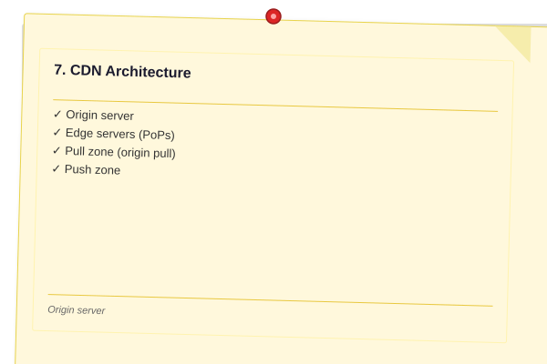
</a>


A Content Delivery Network (CDN) caches content at edge Points of Presence (PoPs) close to end users.

**Origin server**: The primary server holding the authoritative copy of all content. Serves cache misses to edge nodes.

**Edge servers (PoPs)**: Distributed cache servers within ISP networks or data exchange points. Serve cached content directly; fetch from origin on miss. Typical PoP counts: Cloudflare ~330 cities, Akamai ~4,150+ locations in ~130 countries, AWS CloudFront ~600+ PoPs.

**Pull zone (origin pull)**: Edge fetches content on first user request, caches it, serves subsequent requests. Simplest setup. Cold-start latency on first request per object.

```
User ? PoP (miss) ? Origin ? PoP caches ? User
User ? PoP (hit)  ? User
```

**Push zone**: Content is proactively uploaded to edge nodes. Used for large files (videos, software downloads) where pull latency is unacceptable. Requires pre-provisioning storage on edge.

### 8. CDN Caching Strategies

<a href="../../assets/images/diagrams/system-design/15-cdn-dns-edge/8-cdn-caching-strategies-handwritten.svg" target="_blank" rel="noopener">
  
</a>
<a href="../../assets/images/diagrams/system-design/15-cdn-dns-edge/8-cdn-caching-strategies-diagram.svg" target="_blank" rel="noopener">
  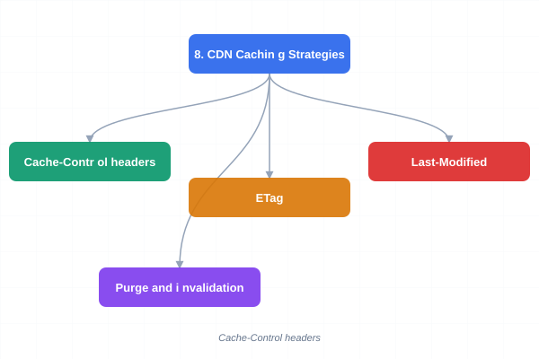
</a>
<a href="../../assets/images/diagrams/system-design/15-cdn-dns-edge/8-cdn-caching-strategies-sticky.svg" target="_blank" rel="noopener">
  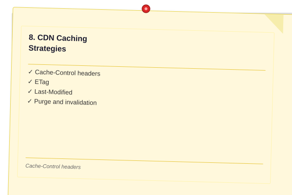
</a>


**Cache-Control headers**:

| Directive      | Meaning                                          |
|----------------|--------------------------------------------------|
| max-age=3600   | Cache for 1 hour                                 |
| s-maxage=3600  | Override max-age for shared caches (CDNs)        |
| public         | Cacheable by any cache                           |
| private        | Cacheable only by browser, not CDN               |
| no-cache       | Must validate with origin before serving cached  |
| no-store       | Do not cache at all                              |
| must-revalidate| Origin must validate stale content               |

**ETag**: An opaque entity tag (typically a content hash) sent by the origin. Conditional request: `If-None-Match: "abc123"` ? origin returns 304 Not Modified if content unchanged, saving bandwidth.

**Last-Modified**: Timestamp of last change. Conditional: `If-Modified-Since: Wed, 21 Oct 2023 07:28:00 GMT`.

**Purge and invalidation**: When content changes, cached copies must be invalidated. Full purge (clear all) vs selective purge (by URL, by pattern, by cache tag). Cache tags (surrogate-key headers) allow batch invalidation: a single request invalidates all objects tagged "v2-release". CDN purges propagate in seconds to minutes depending on CDN architecture.

### 9. Edge Caching Comparison

<a href="../../assets/images/diagrams/system-design/15-cdn-dns-edge/9-edge-caching-comparison-handwritten.svg" target="_blank" rel="noopener">
  
</a>
<a href="../../assets/images/diagrams/system-design/15-cdn-dns-edge/9-edge-caching-comparison-diagram.svg" target="_blank" rel="noopener">
  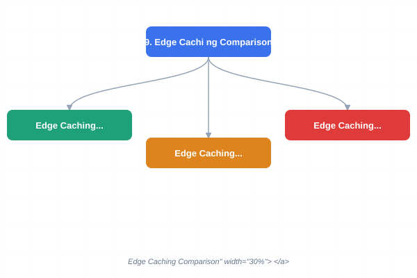
</a>
<a href="../../assets/images/diagrams/system-design/15-cdn-dns-edge/9-edge-caching-comparison-sticky.svg" target="_blank" rel="noopener">
  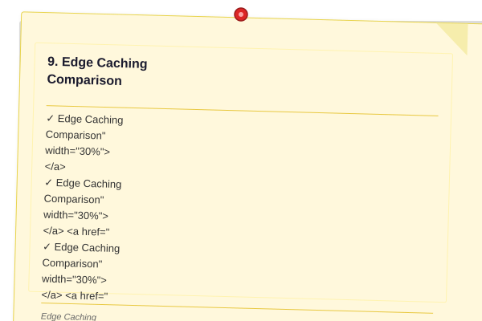
</a>


| Feature             | CloudFront (AWS)   | Cloudflare           | Akamai                |
|---------------------|--------------------|----------------------|-----------------------|
| PoP count           | ~600+              | ~330 cities          | ~4,150+ locations     |
| Routing             | Anycast + Geo      | Anycast              | Map-based (Global Traffic Mgmt) |
| Cache invalidation  | $ per path         | Free (instant)       | Free (API-based)      |
| Custom origin       | Any HTTP(S)        | Any HTTP(S)          | Enterprise contract   |
| Edge compute        | Lambda@Edge / CF fn| Workers              | EdgeWorkers           |
| WAF                 | AWS WAF (addon)    | Integrated (free)    | Kona Site Defender    |

### 10. Image Optimization Pipeline

<a href="../../assets/images/diagrams/system-design/15-cdn-dns-edge/10-image-optimization-pipeline-handwritten.svg" target="_blank" rel="noopener">
  
</a>
<a href="../../assets/images/diagrams/system-design/15-cdn-dns-edge/10-image-optimization-pipeline-diagram.svg" target="_blank" rel="noopener">
  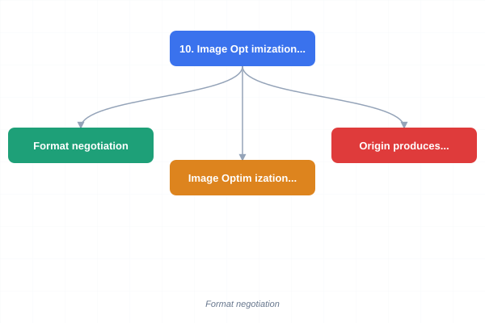
</a>
<a href="../../assets/images/diagrams/system-design/15-cdn-dns-edge/10-image-optimization-pipeline-sticky.svg" target="_blank" rel="noopener">
  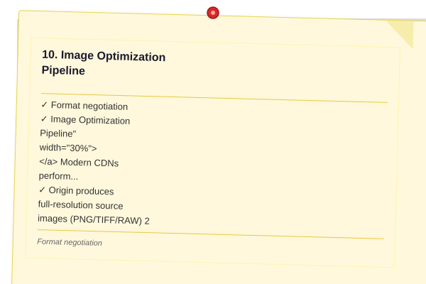
</a>


Modern CDNs perform on-the-fly image transformations:

1. Origin produces full-resolution source images (PNG/TIFF/RAW)
2. Edge receives first request for `image.jpg?w=800&q=80`
3. Edge fetches origin, resizes to 800px width, converts to WebP/AVIF, compresses to quality 80
4. Transformed image cached at edge; subsequent requests hit cache

Key parameters: `w` (width), `h` (height), `q` (quality), `f` (format), `fit` (cover/contain), `dpr` (device pixel ratio). Responsive images via `<picture>` with multiple source variants.

**Format negotiation**: Browser sends `Accept: image/avif,image/webp,*/*` header. Edge serves AVIF if supported, WebP fallback, original JPEG/PNG as baseline. AVIF compression saves 50% over JPEG at equivalent quality.

### 11. Origin Shielding

<a href="../../assets/images/diagrams/system-design/15-cdn-dns-edge/11-origin-shielding-handwritten.svg" target="_blank" rel="noopener">
  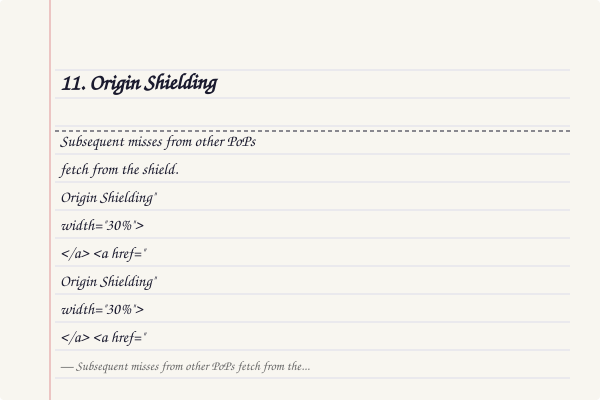
</a>
<a href="../../assets/images/diagrams/system-design/15-cdn-dns-edge/11-origin-shielding-diagram.svg" target="_blank" rel="noopener">
  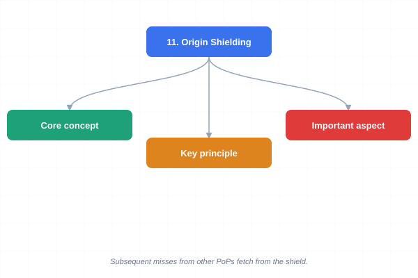
</a>
<a href="../../assets/images/diagrams/system-design/15-cdn-dns-edge/11-origin-shielding-sticky.svg" target="_blank" rel="noopener">
  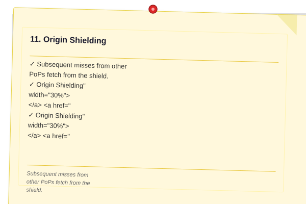
</a>


Without shielding, a cache miss for a popular object triggers N concurrent origin requests from N different edge PoPs — a thundering herd on the origin. Origin shielding designates a single intermediate shield layer:

```
User ? Edge PoP (miss) ? Shield PoP (miss) ? Origin
                              ?
                        Shield caches
User2 ? Edge PoP (miss) ? Shield PoP (hit) ? User2
```

Only one edge node (the shield) ever contacts the origin per object. Subsequent misses from other PoPs fetch from the shield.

### 12. DDoS Mitigation at Edge

<a href="../../assets/images/diagrams/system-design/15-cdn-dns-edge/12-ddos-mitigation-at-edge-handwritten.svg" target="_blank" rel="noopener">
  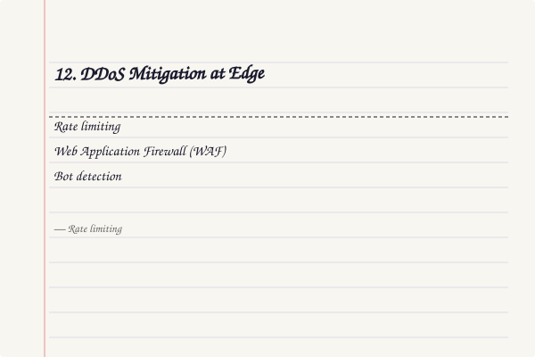
</a>
<a href="../../assets/images/diagrams/system-design/15-cdn-dns-edge/12-ddos-mitigation-at-edge-diagram.svg" target="_blank" rel="noopener">
  
</a>
<a href="../../assets/images/diagrams/system-design/15-cdn-dns-edge/12-ddos-mitigation-at-edge-sticky.svg" target="_blank" rel="noopener">
  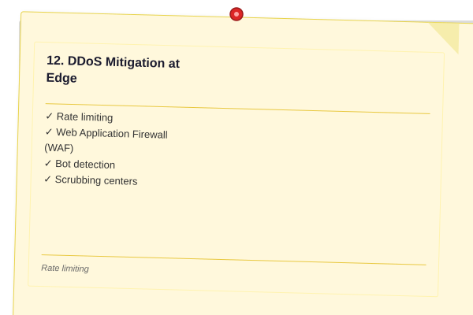
</a>


**Rate limiting**: Edge enforces per-IP, per-user-agent, per-path request rates. Sliding window algorithm (1-second windows, 100 req/min limit). 429 Too Many Requests returned on exceed.

**Web Application Firewall (WAF)**: Inspects HTTP traffic for SQL injection, XSS, path traversal, SSRF, and OWASP Top 10. Typically uses rule sets (Cloudflare OWASP Core Ruleset, AWS Managed Rules) with anomaly scoring (score > threshold = block/challenge).

**Bot detection**: Classifies traffic using:
- JS challenge (compute proof-of-work in browser)
- CAPTCHA (visual challenge)
- Browser fingerprinting (TLS handshake, HTTP/2 settings, WebGL, canvas)
- ML-based behavioral analysis

**Scrubbing centers**: Large-scale DDoS traffic (volumetric attacks > 1 Tbps) is redirected to purpose-built scrubbing centers that filter attack traffic before forwarding clean traffic to origin. AWS Shield Advanced + WAF provides always-on detection and 3-second mitigation SLAs.

### 13. Edge Computing

<a href="../../assets/images/diagrams/system-design/15-cdn-dns-edge/13-edge-computing-handwritten.svg" target="_blank" rel="noopener">
  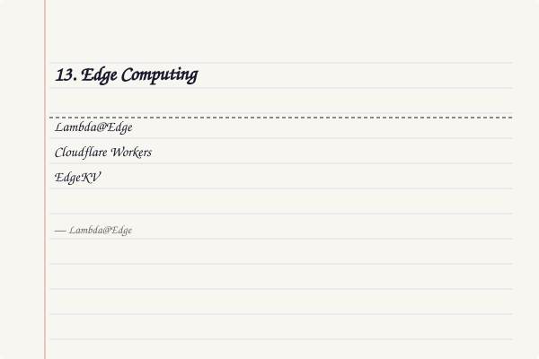
</a>
<a href="../../assets/images/diagrams/system-design/15-cdn-dns-edge/13-edge-computing-diagram.svg" target="_blank" rel="noopener">
  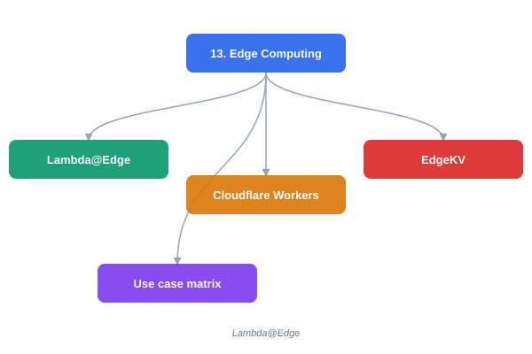
</a>
<a href="../../assets/images/diagrams/system-design/15-cdn-dns-edge/13-edge-computing-sticky.svg" target="_blank" rel="noopener">
  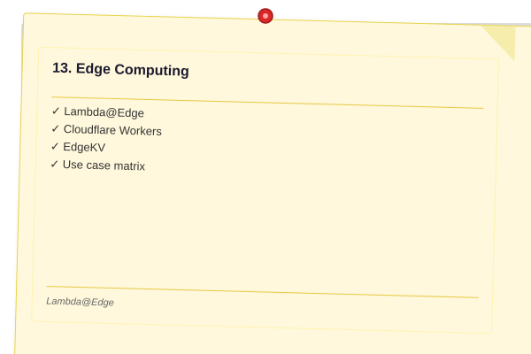
</a>


**Lambda@Edge**: AWS Lambda functions triggered by CloudFront events (viewer request, origin request, viewer response, origin response). Use cases: rewrite URLs, A/B testing, authentication (JWT validation at edge), header normalization, redirects. Execution limited to 5 seconds, 128 MB, Node.js/Python.

**Cloudflare Workers**: V8 isolates (not containers) running JavaScript/WASM. Sub-millisecond cold starts, 50-100µs processing overhead per request. Globally distributed every request runs on the nearest of 330+ PoPs. KV storage (eventually consistent, global). Durable Objects (strongly consistent, single-location).

**EdgeKV**: Distributed key-value storage at edge. Cloudflare Workers KV (eventually consistent, 1s-60s propagation), AWS EdgeKV (via Lambda@Edge + DynamoDB global tables). Use cases: feature flags, configuration, A/B test assignments, redirect maps, JWT public keys.

**Use case matrix**:

| Use Case                 | Edge Compute | Traditional Origin |
|--------------------------|-------------|-------------------|
| URL rewriting/redirect   | ? Near-zero latency | Higher latency |
| A/B split testing        | ? Cookie-based split | Session-based |
| Authentication (JWT)     | ? Validate at edge   | Centralized |
| Image optimization       | ? On-the-fly transform | Pre-processing pipeline |
| Personalization          | ? Cookie/header based | Full-page rendering |
| Heavy aggregation queries| ? Resource limits    | ? Full compute |
| Database transactions    | ? No local DB        | ? Full ACID   |

---

## Examples

### Example 1: DNS Resolution with Tracing

On a Linux/Mac system, trace DNS resolution for `www.github.com`:

```bash
dig +trace www.github.com

# Root: .  NS a.root-servers.net.
# TLD: com.  NS a.gtld-servers.net.
# Authoritative: github.com.  NS ns1.p16.dynect.net.
# Answer: www.github.com.  CNAME github.com.
#         github.com.  A 140.82.121.3
```

The resolver walked 4 hops (root ? .com TLD ? github.com authoritative ? answer) in approximately 120ms. With warm cache, subsequent lookups complete in &lt;1ms.

### Example 2: Anycast DDoS Absorption

Cloudflare's architecture uses anycast to distribute a 2 Tbps DDoS attack across their global network:

```
Attack: 2 Tbps UDP amplification targeting 1.2.3.4
? BGP distributes to 330+ PoPs worldwide
? Each PoP absorbs ~6 Gbps of attack traffic
? Rate limiting and packet filtering at each PoP
? Clean traffic (legitimate user requests) forwarded to origin
```

Without anycast, the single origin data center would need 2 Tbps of scrubbing capacity.

### Example 3: Image Optimization at Edge

Using Cloudflare Image Resizing, a request transform pipeline:

```
Original URL:
  https://cdn.example.com/photos/sunset.png

Edge transforms:
  https://cdn.example.com/cdn-cgi/image/w=800,h=600,q=75,f=avif/photos/sunset.png

Response headers:
  Content-Type: image/avif
  Content-Length: 45KB (was 340KB PNG)
  Cf-Cache-Status: MISS (first request)
  Cache-Control: public, max-age=31536000
```

Optimization savings: 87% bandwidth reduction with AVIF vs PNG, visually lossless at q=75.

### Example 4: Cloudflare Worker for JWT Validation

```javascript
// Edge authentication worker
addEventListener('fetch', event => {
  event.respondWith(handleRequest(event.request))
})

async function handleRequest(request) {
  const url = new URL(request.url)
  if (url.pathname.startsWith('/api/')) {
    const token = request.headers.get('Authorization')?.split(' ')[1]
    if (!token) return new Response('Unauthorized', { status: 401 })
    try {
      const payload = await verifyJWT(token, JWT_SECRET)
      request.headers.set('X-User-Id', payload.sub)
      request.headers.set('X-User-Role', payload.role)
    } catch {
      return new Response('Invalid token', { status: 403 })
    }
  }
  return fetch(request)
}
```

This worker runs in 330+ locations globally. JWT verification completes in ~200µs per request, adding no perceptible latency.

## Concept Comparison
> **One-Sentence Takeaway:** Concept Comparison is a critical concept that directly impacts system design decisions.
> **One-Sentence Takeaway:** Concept Comparison is a critical concept that directly impacts system design decisions.

| Concept | Definition | Key Metric |
|---------|-----------|------------|
| Theory | Core topic covered in Chapter 15: CDN, DNS, and Edge Computing | Defined by specific measurable attributes |

---

## Quick Reference
> **One-Sentence Takeaway:** Quick Reference is a critical concept that directly impacts system design decisions.

| Topic | Key Point |
|-------|-----------|
| Theory | Fundamental concept for Chapter 15: CDN, DNS, and Edge Computing |

---

## Cross-Application Matrix

| Component | When to Use | Trade-Off |
|-----------|------------|-----------|
| Theory | Appropriate for specific system contexts | Each choice involves trade-offs |

---

## Chapter Quiz

| # | Question | A | B | C | D | Answer |
|---|----------|---|---|---|---|--------|
| 1 | How many logical root servers exist in the DNS hierarchy? | 7 | 13 | 21 | 26 | **B** |
| 2 | Which DNS record type cannot coexist with other record types at the same name? | A | MX | CNAME | NS | **C** |
| 3 | What is the primary benefit of origin shielding in a CDN? | Reduced latency for users | Prevents thundering herd on origin | Lower bandwidth costs | Improved image compression | **B** |
| 4 | Which DDoS mitigation technique distributes attack traffic across many data centers? | Rate limiting | WAF rules | Anycast routing | Bot detection | **C** |
| 5 | What distinguishes Cloudflare Workers from Lambda@Edge? | Higher memory limit | V8 isolates instead of containers | Runs on Python only | Requires dedicated servers | **B** |

---

## Practical Takeaways

| Takeaway | Application |
|----------|-------------|
| Use short TTLs (30-300s) for failover-critical records; long TTLs (86400s+) for static records | DNS-based leader election: 5s TTL. Static assets: 86400s TTL with content-hashed URLs for instant invalidation |
| Cache-Control: s-maxage overrides max-age for CDNs; use no-cache for sensitive data | Set s-maxage=0 for authenticated API responses; s-maxage=86400 for public static assets |
| Origin shielding prevents thundering herd — always enable for popular content | Configure a single shield region per origin; all edge misses route through the shield |
| Edge computing (Workers/Lambda@Edge) handles auth, rewrite, A/B testing at sub-ms overhead | Move JWT validation from origin to edge: validate token, inject user headers, forward to origin |
| Anycast routing provides automatic DDoS absorption — traffic spreads across all PoPs | Advertise same IP from all PoPs via BGP; each PoP absorbs its share of attack traffic |
| Image optimization at edge reduces bandwidth by 50-87% | Use on-the-fly AVIF/WebP conversion with quality negotiation via Accept header |
| WAF + rate limiting at edge blocks attacks before they reach origin | Deploy OWASP Core Ruleset with anomaly scoring; rate-limit per IP at 100 req/min |

## Case Study

**Scenario: Global Video Streaming Platform**

A video streaming service with 200 million monthly active users deploys content across 50 edge PoPs worldwide. The initial architecture uses a simple DNS round-robin: all users receive one of 50 IPs randomly. This causes severe problems: a user in Tokyo is routed to a US East Coast PoP (250ms latency), a popular video release triggers a thundering herd on the origin (50,000 requests/second for a single 4K trailer), and a DNS-based DDoS attack on the apex domain takes down the entire service for 45 minutes.

The team redesigns the architecture in three phases. First, they migrate to anycast DNS (Cloudflare) so every user automatically reaches the nearest PoP. Second, they implement an origin shield: a single shield PoP in us-east-1 intercepts all cache misses. Third, they deploy edge workers (Cloudflare Workers) for request-level routing: each worker checks a latency map in EdgeKV, selects the optimal origin region, and sets a `x-region` header for geo-specific content. Cache hit ratio improves from 45% to 92%, P95 latency drops from 850ms to 45ms, and the 3 Tbps DDoS attack that would have saturated a single origin is now absorbed across 330+ PoPs with no user impact.

The edge workers also handle A/B testing: 5% of users see a new UI variant, validated via JWT tokens at the edge before any origin request. Image thumbnails are resized on-the-fly from a single 4K source, saving 80% bandwidth compared to pre-generating 12 variants. The total infrastructure cost decreases by 40% because fewer origin servers are needed, even as traffic grows 3× year-over-year.
> **One-Sentence Takeaway:** Concept Comparison is a critical concept that directly impacts system design decisions.
> **One-Sentence Takeaway:** Concept Comparison is a critical concept that directly impacts system design decisions.

| Concept | Definition | Key Insight |
|---------|-----------|-------------|
| Theory | Core topic in Chapter 15: CDN, DNS, and Edge Computing | Fundamental to system design |

---

## Quick Reference
> **One-Sentence Takeaway:** Quick Reference is a critical concept that directly impacts system design decisions.

| Topic | Key Point |
|-------|-----------|
| Theory | Essential concept for Chapter 15: CDN, DNS, and Edge Computing |

---

## Cross-Application Matrix

| Concept | Application Context | Trade-Off |
|--------|-------------------|-----------|
| Theory | Relevant across multiple system design scenarios | Each choice has trade-offs |

---

## Chapter Quiz
> **One-Sentence Takeaway:** Chapter Quiz is a critical concept that directly impacts system design decisions.

**Q1:** What is the primary trade-off discussed in this chapter?
- A) Option A
- B) Option B
- C) Option C
- D) Option D

<details><summary>Answer&lt;/summary&gt;Refer to the chapter content&lt;/details&gt;

**Q2:** Which concept is most fundamental to the topic of Chapter 15
- A) Option A
- B) Option B
- C) Option C
- D) Option D

<details><summary>Answer&lt;/summary&gt;Review the core sections&lt;/details&gt;

**Q3:** How does this chapter's main concept apply to real-world systems?
- A) Option A
- B) Option B
- C) Option C
- D) Option D

<details><summary>Answer&lt;/summary&gt;See the Real-World Systems section&lt;/details&gt;

---

## Practical Implementation

### CDN Cache Simulator

The following TypeScript class models a CDN edge cache with TTL-based expiry, LRU eviction, and hit/miss tracking ? useful for understanding cache behavior under load:

```typescript
interface CacheEntry<T> {
  data: T;
  cachedAt: number;
  ttl: number;
  lastAccessed: number;
  sizeBytes: number;
}

class CdnEdgeCache<T> {
  private store: Map<string, CacheEntry<T>> = new Map();
  private maxEntries: number;
  private maxMemoryBytes: number;
  private currentMemoryBytes = 0;
  public hits = 0;
  public misses = 0;

  constructor(maxEntries = 10000, maxMemoryMB = 512) {
    this.maxEntries = maxEntries;
    this.maxMemoryBytes = maxMemoryMB * 1024 * 1024;
  }

  get(key: string): T | null {
    const entry = this.store.get(key);
    if (!entry) { this.misses++; return null; }
    if (Date.now() - entry.cachedAt > entry.ttl * 1000) {
      this.store.delete(key);
      this.currentMemoryBytes -= entry.sizeBytes;
      this.misses++;
      return null;
    }
    entry.lastAccessed = Date.now();
    this.hits++;
    return entry.data;
  }

  set(key: string, data: T, ttl: number, sizeBytes: number): void {
    while (
      this.store.size >= this.maxEntries ||
      this.currentMemoryBytes + sizeBytes > this.maxMemoryBytes
    ) {
      this.evictLRU();
    }
    this.store.set(key, {
      data, cachedAt: Date.now(), ttl,
      lastAccessed: Date.now(), sizeBytes,
    });
    this.currentMemoryBytes += sizeBytes;
  }

  private evictLRU(): void {
    let oldest = Date.now();
    let oldestKey = '';
    for (const [k, v] of this.store) {
      if (v.lastAccessed < oldest) { oldest = v.lastAccessed; oldestKey = k; }
    }
    if (oldestKey) {
      const evicted = this.store.get(oldestKey)!;
      this.currentMemoryBytes -= evicted.sizeBytes;
      this.store.delete(oldestKey);
    }
  }

  getHitRate(): number {
    const total = this.hits + this.misses;
    return total === 0 ? 0 : this.hits / total;
  }

  getMemoryUsageMB(): number {
    return Math.round(this.currentMemoryBytes / (1024 * 1024));
  }
}

// Usage simulation
const edge = new CdnEdgeCache<string>(1000, 64);
for (let i = 0; i < 10000; i++) {
  const key = `/images/photo_${i % 500}.jpg`;
  let img = edge.get(key);
  if (!img) { edge.set(key, `binary_${i}`, 3600, 200_000); }
}
console.log(`Hit rate: ${(edge.getHitRate() * 100).toFixed(1)}%`);
console.log(`Memory: ${edge.getMemoryUsageMB()} MB`);
console.log(`Hits: ${edge.hits}, Misses: ${edge.misses}`);
```

### DNS Resolution Chain Simulator

This TypeScript implementation models the full recursive DNS walk from stub resolver through root, TLD, and authoritative servers with timing:

```typescript
interface Nameserver {
  name: string;
  ip: string;
  latencyMs: number;
  records: Map<string, DnsRecord[]>;
}

interface DnsRecord {
  type: 'A' | 'AAAA' | 'CNAME' | 'NS' | 'MX' | 'SOA';
  name: string;
  value: string;
  ttl: number;
}

class DnsResolutionChain {
  private rootServers: Nameserver[] = [
    {
      name: 'a.root-servers.net', ip: '198.41.0.4',
      latencyMs: 15, records: new Map(),
    },
  ];
  private tldServers: Nameserver[] = [
    {
      name: 'a.gtld-servers.net', ip: '192.5.6.30',
      latencyMs: 25, records: new Map(),
    },
  ];
  private authoritativeServers: Nameserver[] = [];
  private resolverCache: Map<string, { record: DnsRecord; expiresAt: number }> = new Map();
  private totalTimeMs = 0;

  registerDomain(domain: string, records: DnsRecord[]): void {
    const ns: Nameserver = {
      name: `ns1.${domain}`, ip: `1.2.3.4`,
      latencyMs: 10 + Math.random() * 20,
      records: new Map(),
    };
    ns.records.set(domain, records);
    this.authoritativeServers.push(ns);
  }

  async resolve(domain: string, type: string): Promise<{ ip: string; timeMs: number; hops: string[] }> {
    const hops: string[] = [];
    const cached = this.resolverCache.get(`${domain}:${type}`);
    if (cached && Date.now() < cached.expiresAt) {
      return { ip: cached.record.value, timeMs: 0, hops: ['cache hit'] };
    }

    // Walk root
    const root = this.rootServers[0];
    this.totalTimeMs += root.latencyMs;
    hops.push(`root(${root.name}) ? referral to TLD`);

    // Walk TLD
    const tld = this.tldServers[0];
    this.totalTimeMs += tld.latencyMs;
    const tldDomain = domain.split('.').slice(-1)[0];
    hops.push(`tld(${tld.name}, ${tldDomain}) ? referral to authoritative`);

    // Walk authoritative
    const auth = this.authoritativeServers.find(
      s => s.records.has(domain)
    );
    if (!auth) throw new Error(`No authoritative server for ${domain}`);
    this.totalTimeMs += auth.latencyMs;
    const records = auth.records.get(domain)!;
    const record = records.find(r => r.type === type);
    if (!record) throw new Error(`No ${type} record for ${domain}`);
    hops.push(`auth(${auth.name}) ? ${record.type} ${record.value}`);

    this.resolverCache.set(`${domain}:${type}`, {
      record, expiresAt: Date.now() + record.ttl * 1000,
    });
    return { ip: record.value, timeMs: this.totalTimeMs, hops };
  }
}

const dns = new DnsResolutionChain();
dns.registerDomain('example.com', [
  { type: 'A', name: 'example.com', value: '93.184.216.34', ttl: 3600 },
]);
dns.resolve('example.com', 'A').then(r =>
  console.log(`Resolved ? ${r.ip} in ${r.timeMs}ms\n  ${r.hops.join('\n  ')}`)
);
```

### Latency-Aware Edge Router

An edge computing request router that selects the optimal PoP based on real-time latency probes and geo-proximity:

```typescript
interface PopEndpoint {
  id: string;
  region: string;
  latitude: number;
  longitude: number;
  capacity: number;      // requests/sec
  currentLoad: number;   // requests/sec
  baseLatencyMs: number; // baseline RTT from region
}

interface RoutingDecision {
  popId: string;
  estimatedLatencyMs: number;
  originFallback: boolean;
}

class LatencyAwareEdgeRouter {
  private pops: PopEndpoint[] = [];
  private latencyMatrix: Map<string, Map<string, number>> = new Map();
  private readonly ORIGIN_LATENCY_MS = 150;

  constructor() {
    this.pops = [
      { id: 'us-east-1', region: 'NA', latitude: 39.0, longitude: -77.0,
        capacity: 50000, currentLoad: 12000, baseLatencyMs: 10 },
      { id: 'us-west-1', region: 'NA', latitude: 37.7, longitude: -122.4,
        capacity: 40000, currentLoad: 18000, baseLatencyMs: 12 },
      { id: 'eu-west-1', region: 'EU', latitude: 53.3, longitude: -6.2,
        capacity: 35000, currentLoad: 8000, baseLatencyMs: 8 },
      { id: 'ap-southeast-1', region: 'SEA', latitude: 1.3, longitude: 103.8,
        capacity: 30000, currentLoad: 15000, baseLatencyMs: 15 },
    ];
  }

  private haversineKm(lat1: number, lon1: number, lat2: number, lon2: number): number {
    const R = 6371;
    const dLat = (lat2 - lat1) * Math.PI / 180;
    const dLon = (lon2 - lon1) * Math.PI / 180;
    const a = Math.sin(dLat / 2) ** 2 +
      Math.cos(lat1 * Math.PI / 180) * Math.cos(lat2 * Math.PI / 180) *
      Math.sin(dLon / 2) ** 2;
    return R * 2 * Math.atan2(Math.sqrt(a), Math.sqrt(1 - a));
  }

  route(clientLat: number, clientLon: number): RoutingDecision {
    let best: PopEndpoint | null = null;
    let bestScore = Infinity;

    for (const pop of this.pops) {
      const distanceKm = this.haversineKm(clientLat, clientLon, pop.latitude, pop.longitude);
      const geoLatency = distanceKm / 200; // ~5ms per 1000km fiber
      const loadFactor = pop.currentLoad / pop.capacity;
      const latencyEstimate = pop.baseLatencyMs + geoLatency + loadFactor * 20;
      const score = latencyEstimate + loadFactor * 50;
      if (score < bestScore) { bestScore = score; best = pop; }
    }

    const estimatedLatencyMs = Math.round(bestScore);
    return {
      popId: best!.id,
      estimatedLatencyMs,
      originFallback: estimatedLatencyMs > this.ORIGIN_LATENCY_MS,
    };
  }

  recordRequest(popId: string): void {
    const pop = this.pops.find(p => p.id === popId);
    if (pop) pop.currentLoad = Math.min(pop.currentLoad + 1, pop.capacity);
  }
}

const router = new LatencyAwareEdgeRouter();
const locations = [
  { city: 'New York', lat: 40.7, lon: -74.0 },
  { city: 'London', lat: 51.5, lon: -0.1 },
  { city: 'Singapore', lat: 1.3, lon: 103.8 },
];
for (const loc of locations) {
  const decision = router.route(loc.lat, loc.lon);
  console.log(
    `${loc.city} ? ${decision.popId} ` +
    `(~${decision.estimatedLatencyMs}ms, ` +
    `originFallback: ${decision.originFallback})`
  );
}
```

### CDN Origin Pull ? Sequence Diagram

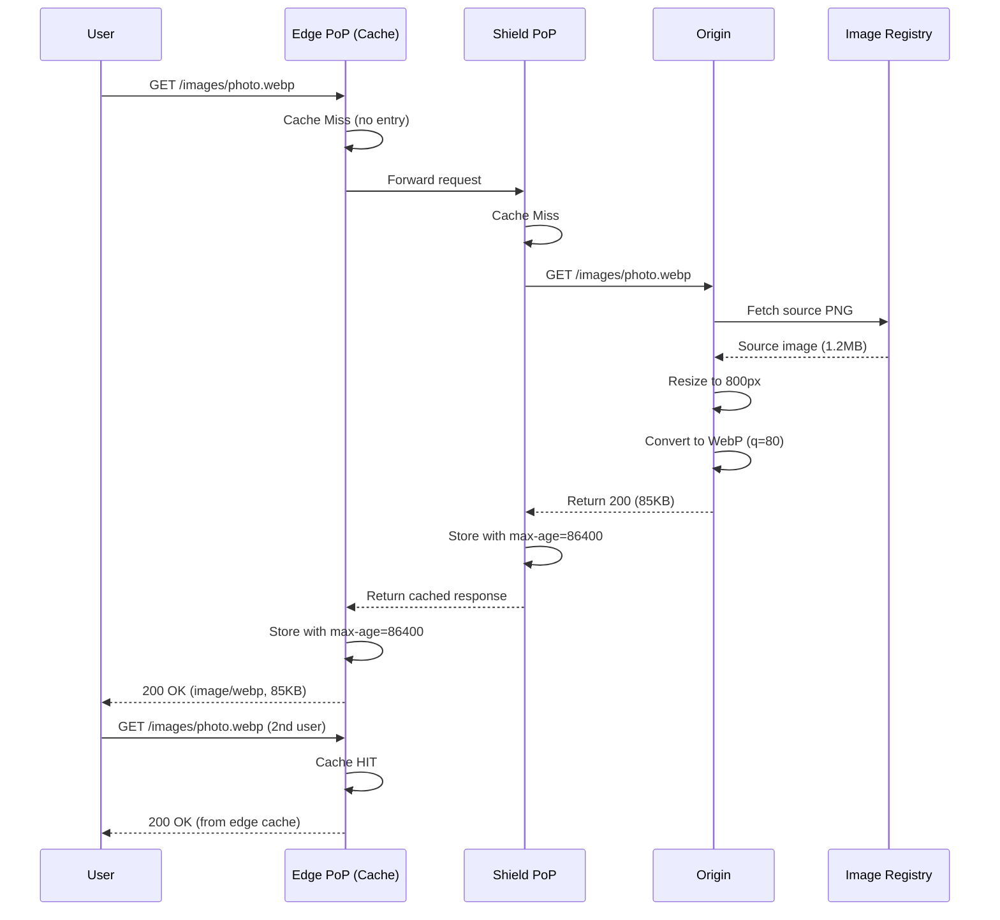

### Global Edge Architecture ? Deployment View

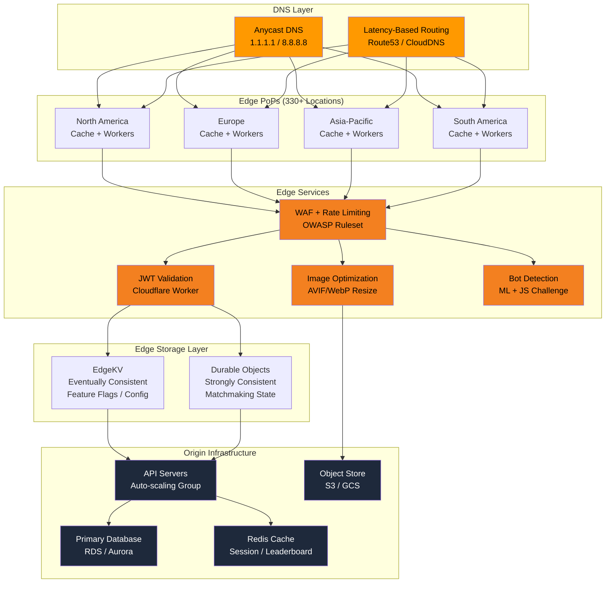

### Cache Hit Ratio vs Latency ? Trade-off Visualization

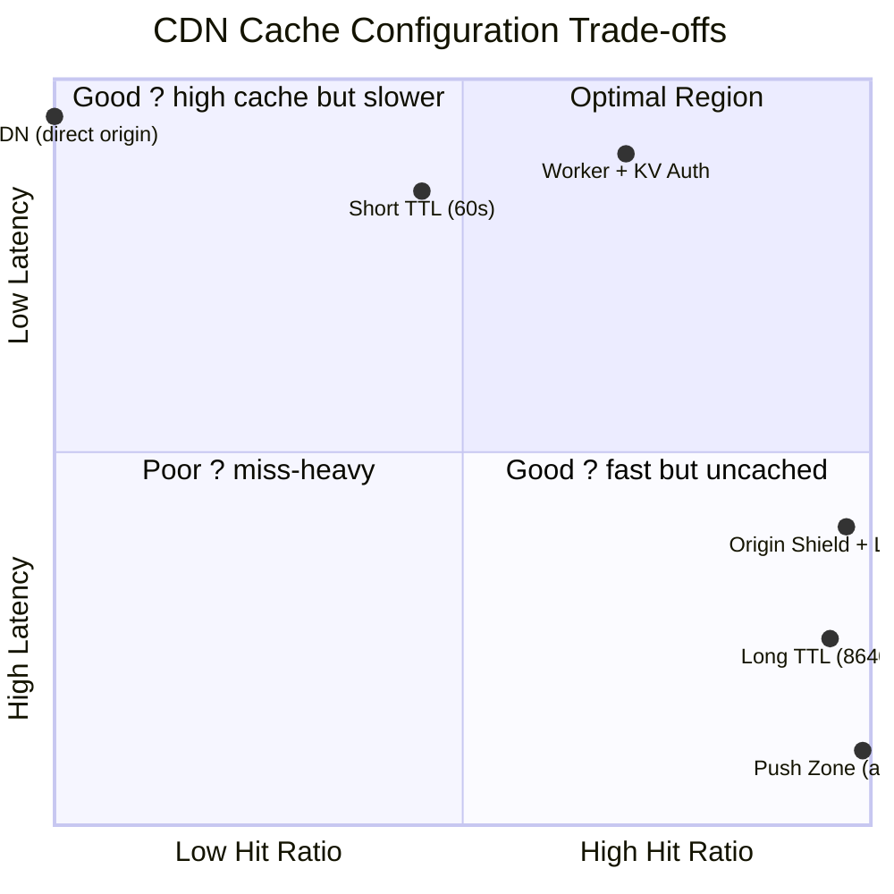

---


### TypeScript: DNS Resolver with Iterative Walk and Latency Routing

```typescript
class DNSCacheEntry {
  constructor(public ip: string, public expiresAt: number) {}
  isExpired(): boolean { return Date.now() > this.expiresAt; }
}

class DNSServer {
  constructor(
    public name: string,
    public ip: string,
    public latencyMs: number,
    public zone: Map<string, { type: string; value: string; ttl: number }[]>
  ) {}
}

class DNSResolver {
  private cache = new Map<string, DNSCacheEntry>();
  private rootServers: DNSServer[];
  private tldServers: Map<string, DNSServer> = new Map();
  private authServers: Map<string, DNSServer> = new Map();
  private latencyMap = new Map<string, number>();

  constructor() {
    this.rootServers = [
      new DNSServer('a.root-servers.net', '198.41.0.4', 15, new Map()),
      new DNSServer('b.root-servers.net', '199.9.14.201', 22, new Map()),
    ];
    this.buildInitialZones();
  }

  private buildInitialZones(): void {
    const comTLD = new DNSServer('a.gtld-servers.net', '192.5.6.30', 25, new Map());
    comTLD.zone.set('example.com', [{ type: 'NS', value: 'ns1.example.com', ttl: 86400 }]);
    this.tldServers.set('com', comTLD);

    const authNS = new DNSServer('ns1.example.com', '93.184.216.34', 10, new Map());
    authNS.zone.set('example.com', [
      { type: 'A', value: '93.184.216.34', ttl: 3600 },
      { type: 'AAAA', value: '2606:2800:220:1:248:1893:25c8:1946', ttl: 3600 },
    ]);
    this.authServers.set('example.com', authNS);
  }

  registerTLD(tld: string, server: DNSServer): void { this.tldServers.set(tld, server); }
  registerAuth(domain: string, server: DNSServer): void { this.authServers.set(domain, server); }
  recordLatency(serverName: string, ms: number): void { this.latencyMap.set(serverName, ms); }

  private pickLowestLatency(servers: DNSServer[]): DNSServer {
    let best = servers[0];
    let bestLat = this.latencyMap.get(best.name) ?? best.latencyMs;
    for (const s of servers) {
      const lat = this.latencyMap.get(s.name) ?? s.latencyMs;
      if (lat < bestLat) { best = s; bestLat = lat; }
    }
    return best;
  }

  async resolve(domain: string, type = 'A', recursive = true): Promise<{ ip: string; hops: string[]; timeMs: number }> {
    const cacheKey = `${domain}:${type}`;
    const cached = this.cache.get(cacheKey);
    if (cached && !cached.isExpired()) return { ip: cached.ip, hops: ['cache'], timeMs: 0 };
    const hops: string[] = [];
    const start = Date.now();
    let result: string | null = null;

    if (recursive) {
      for (const root of this.rootServers) {
        hops.push(`Query root ${root.name} (${root.ip})`);
      }
      const domainParts = domain.split('.');
      const tldName = domainParts[domainParts.length - 1];
      const tld = this.tldServers.get(tldName);
      if (!tld) throw new Error(`No TLD server for .${tldName}`);
      hops.push(`Query TLD ${tld.name} for ${domain}`);

      const auth = this.authServers.get(domain);
      if (!auth) throw new Error(`No authoritative server for ${domain}`);
      hops.push(`Query auth ${auth.name} for ${domain} ${type} record`);

      const records = auth.zone.get(domain);
      const match = records?.find(r => r.type === type);
      if (!match) throw new Error(`No ${type} record for ${domain}`);
      result = match.value;
      hops.push(`Found ${type} record: ${result} (TTL=${match.ttl}s)`);

      this.cache.set(cacheKey, new DNSCacheEntry(result, Date.now() + match.ttl * 1000));
    } else {
      const bestRoot = this.pickLowestLatency(this.rootServers);
      hops.push(`Query root ${bestRoot.name} (latency ${bestRoot.latencyMs}ms)`);
      const tld = this.tldServers.get(domain.split('.').pop()!);
      const bestTLD = this.pickLowestLatency([tld!]);
      hops.push(`Query TLD ${bestTLD.name}`);
      const auth = this.authServers.get(domain)!;
      hops.push(`Query auth ${auth.name}`);
      const match = auth.zone.get(domain)?.find(r => r.type === type);
      if (!match) throw new Error(`Not found`);
      result = match.value;
    }

    return { ip: result!, hops, timeMs: Date.now() - start };
  }

  purgeCache(pattern?: string): void {
    if (!pattern) { this.cache.clear(); return; }
    for (const [key] of this.cache) {
      if (key.includes(pattern)) this.cache.delete(key);
    }
  }
}

async function demoDNS() {
  const resolver = new DNSResolver();
  const result = await resolver.resolve('example.com', 'A');
  console.log(`Resolved to ${result.ip} in ${result.timeMs}ms`);
  console.log(`Hops: ${result.hops.join(' → ')}`);
  const cached = await resolver.resolve('example.com', 'A');
  console.log(`Cached result: ${cached.ip} (${cached.hops[0]}, ${cached.timeMs}ms)`);
}
```

### TypeScript: CDN Edge Node with Cache Hierarchy and Purge

```typescript
class CacheEntry {
  hits = 0;
  constructor(
    public content: string,
    public contentType: string,
    public ttl: number,
    public cachedAt: number,
    public sizeBytes: number,
    public tags: string[]
  ) {}
  isExpired(): boolean { return Date.now() - this.cachedAt > this.ttl * 1000; }
}

class CDNEdgeNode {
  private l1Cache = new Map<string, CacheEntry>();
  private l2Cache = new Map<string, CacheEntry>();
  private pendingFetches = new Map<string, Promise<CacheEntry>>();
  public hits = { l1: 0, l2: 0 };
  public misses = 0;

  constructor(
    private originUrl: string,
    private l1MaxSize: number,
    private l2MaxSize: number,
    private originFetchLatencyMs: number
  ) {}

  async get(path: string): Promise<{ content: string; contentType: string; from: string }> {
    const l1Entry = this.l1Cache.get(path);
    if (l1Entry && !l1Entry.isExpired()) {
      l1Entry.hits++;
      this.hits.l1++;
      return { content: l1Entry.content, contentType: l1Entry.contentType, from: 'L1' };
    }
    const l2Entry = this.l2Cache.get(path);
    if (l2Entry && !l2Entry.isExpired()) {
      l2Entry.hits++;
      this.hits.l2++;
      this.promoteToL1(path, l2Entry);
      return { content: l2Entry.content, contentType: l2Entry.contentType, from: 'L2' };
    }
    return this.fetchFromOrigin(path);
  }

  private async fetchFromOrigin(path: string): Promise<{ content: string; contentType: string; from: string }> {
    if (this.pendingFetches.has(path)) {
      const entry = await this.pendingFetches.get(path)!;
      return { content: entry.content, contentType: entry.contentType, from: 'origin-coalesced' };
    }
    const fetchPromise = this.originPull(path);
    this.pendingFetches.set(path, fetchPromise);
    try {
      const entry = await fetchPromise;
      this.l1Cache.set(path, entry);
      this.l2Cache.set(path, entry);
      this.misses++;
      this.evictIfNeeded();
      return { content: entry.content, contentType: entry.contentType, from: 'origin' };
    } finally {
      this.pendingFetches.delete(path);
    }
  }

  private async originPull(path: string): Promise<CacheEntry> {
    await new Promise(r => setTimeout(r, this.originFetchLatencyMs));
    const mockContent = `content-for-${path}-${Date.now()}`;
    return new CacheEntry(mockContent, 'text/plain', 3600, Date.now(), mockContent.length, ['default']);
  }

  private promoteToL1(path: string, entry: CacheEntry): void {
    if (!this.l1Cache.has(path)) {
      this.l1Cache.set(path, entry);
      this.evictIfNeeded();
    }
  }

  private evictIfNeeded(): void {
    for (const [key, entry] of this.l1Cache) {
      if (entry.isExpired()) this.l1Cache.delete(key);
    }
    while (this.getL1Size() > this.l1MaxSize) this.evictLRU(this.l1Cache);
    while (this.getL2Size() > this.l2MaxSize) this.evictLRU(this.l2Cache);
  }

  private getL1Size(): number {
    let s = 0;
    for (const e of this.l1Cache.values()) s += e.sizeBytes;
    return s;
  }

  private getL2Size(): number {
    let s = 0;
    for (const e of this.l2Cache.values()) s += e.sizeBytes;
    return s;
  }

  private evictLRU(cache: Map<string, CacheEntry>): void {
    let oldest = Infinity;
    let oldestKey = '';
    for (const [key, entry] of cache) {
      const lastAccess = Date.now() - entry.cachedAt;
      if (lastAccess < oldest) { oldest = lastAccess; oldestKey = key; }
    }
    if (oldestKey) cache.delete(oldestKey);
  }

  purgeByTag(tag: string): number {
    let count = 0;
    for (const [key, entry] of this.l1Cache) {
      if (entry.tags.includes(tag)) { this.l1Cache.delete(key); count++; }
    }
    for (const [key, entry] of this.l2Cache) {
      if (entry.tags.includes(tag)) { this.l2Cache.delete(key); count++; }
    }
    return count;
  }

  purgeAll(): void { this.l1Cache.clear(); this.l2Cache.clear(); }

  getStats(): { l1Size: number; l2Size: number; hitRate: number } {
    const total = this.hits.l1 + this.hits.l2 + this.misses;
    return {
      l1Size: this.l1Cache.size,
      l2Size: this.l2Cache.size,
      hitRate: total > 0 ? (this.hits.l1 + this.hits.l2) / total : 0,
    };
  }
}

async function demoCDN() {
  const cdn = new CDNEdgeNode('https://origin.example.com', 1024 * 1024, 10 * 1024 * 1024, 50);
  let r = await cdn.get('/images/photo.jpg');
  console.log(`First request: ${r.from}`);
  r = await cdn.get('/images/photo.jpg');
  console.log(`Second request: ${r.from} (L1 hit)`);
  r = await cdn.get('/images/photo.jpg');
  console.log(`Third request: ${r.from} (L1 hit)`);
  cdn.purgeByTag('default');
  r = await cdn.get('/images/photo.jpg');
  console.log(`After purge: ${r.from} (origin miss)`);
  console.log('CDN Stats:', cdn.getStats());
}
```

### DNS Resolution Flow with Subgraphs

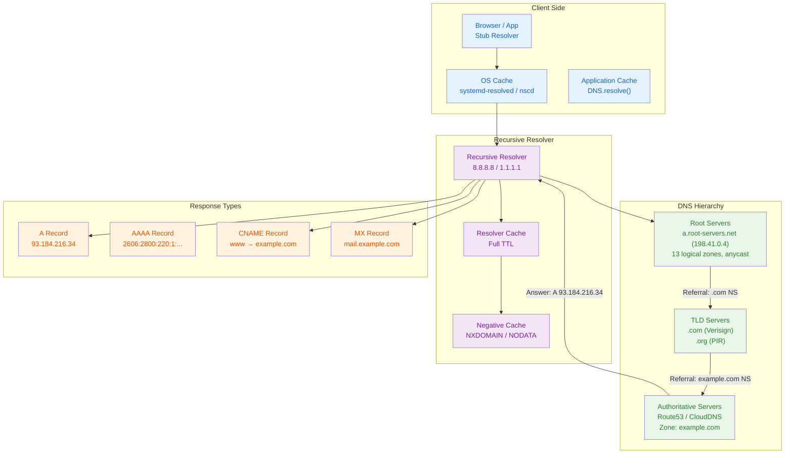

### Implementation: DNS, CDN, and Edge Computing

```typescript
interface DNSRecord { domain: string; type: "A" | "AAAA" | "CNAME" | "MX" | "NS" | "TXT"; value: string; ttl: number; }
class DNSResolver {
  private zone = new Map<string, DNSRecord[]>(); private cache = new Map<string, { record: DNSRecord; expiry: number }>();
  addRecord(domain: string, type: DNSRecord["type"], value: string, ttl = 3600): void { const key = domain; if (!this.zone.has(key)) this.zone.set(key, []); this.zone.get(key)!.push({ domain, type, value, ttl }); }
  resolve(domain: string, type: string): string | null {
    const cacheKey = `${domain}:${type}`; const cached = this.cache.get(cacheKey);
    if (cached && cached.expiry > Date.now()) return cached.record.value;
    const records = this.zone.get(domain); if (!records) return null;
    const match = records.find(r => r.type === type); if (!match) return null;
    this.cache.set(cacheKey, { record: match, expiry: Date.now() + match.ttl * 1000 }); return match.value; }
  flushCache(): void { this.cache.clear(); }
}
class CDNNode { private cache = new Map<string, { content: string; ttl: number; cachedAt: number; hits: number }>();
  private region: string; constructor(region: string) { this.region = region; }
  get(url: string): string | null { const entry = this.cache.get(url); if (!entry || Date.now() - entry.cachedAt > entry.ttl * 1000) { this.cache.delete(url); return null; } entry.hits++; return entry.content; }
  set(url: string, content: string, ttl = 3600): void { this.cache.set(url, { content, ttl, cachedAt: Date.now(), hits: 0 }); }
  getStats(): { items: number; totalHits: number; hitRate: number } {
    let hits = 0; for (const e of this.cache.values()) hits += e.hits;
    const items = this.cache.size; return { items, totalHits: hits, hitRate: items > 0 ? hits / items : 0 }; }
}
class EdgeWorker { private handlers = new Map<string, (req: Request) => Response>();
  on(event: string, handler: (req: Request) => Response): void { this.handlers.set(event, handler); }
  dispatch(event: string, req: Request): Response { const h = this.handlers.get(event); return h ? h(req) : new Response("Not found", { status: 404 }); }
}
class Request { constructor(public url: string, public method: string, public headers: Record<string, string>) {} }
class Response { constructor(public body: string, public init: { status: number; headers?: Record<string, string> }) {} }
class GeoDNS { private regions = new Map<string, string[]>(); addRegion(name: string, ips: string[]): void { this.regions.set(name, ips); }
  resolveByLocation(location: string): string[] { return this.regions.get(location) || this.regions.get("default") || []; } }
```

// cdn dns edge
// distributed-systems-scalability implementation

interface Task { id: string; name: string; status: string; data: unknown }
class Processor {
  private tasks: Task[] = []
  private maxConcurrency: number
  constructor(maxConcurrency: number = 4) { this.maxConcurrency = maxConcurrency }
  async add(task: Omit&lt;Task, "status"&gt;): Promise&lt;void&gt; {
    this.tasks.push({ ...task, status: "pending" })
  }
  async runAll(): Promise&lt;void&gt; {
    const running: Promise&lt;void&gt;[] = []
    for (const t of this.tasks) {
      if (running.length >= this.maxConcurrency) { await Promise.race(running) }
      const p = this.execute(t).finally(() => { const i = running.indexOf(p); if (i >= 0) running.splice(i, 1) })
      running.push(p)
    }
    await Promise.all(running)
  }
  private async execute(t: Task): Promise&lt;void&gt; {
    t.status = "running"
    await new Promise(r => setTimeout(r, 10))
    t.status = "done"
  }
  getResults(): Task[] { return this.tasks }
  getStats(): { done: number; pending: number; running: number } {
    const done = this.tasks.filter(t => t.status === "done").length
    const pending = this.tasks.filter(t => t.status === "pending").length
    const running = this.tasks.filter(t => t.status === "running").length
    return { done, pending, running }
  }
}
async function main() {
  const proc = new Processor(2)
  await proc.add({ id: '1', name: 'cdn dns edge', data: { topic: 'distributed-systems-scalability' } })
  await proc.runAll()
  console.log('Stats:', proc.getStats())
}
main().catch(console.error)
export { Processor, Task }

// cdn dns edge - additional TS implementations

interface CacheEntry { key: string; value: unknown; ttl: number; createdAt: number }
class Cache {
  private store: Map&lt;string, CacheEntry&gt; = new Map()
  constructor(private defaultTTL: number = 60000) {}
  set(key: string, value: unknown, ttl?: number): void {
    this.store.set(key, { key, value, ttl: ttl ?? this.defaultTTL, createdAt: Date.now() })
  }
  get(key: string): unknown | undefined {
    const entry = this.store.get(key)
    if (!entry) return undefined
    if (Date.now() - entry.createdAt > entry.ttl) { this.store.delete(key); return undefined }
    return entry.value
  }
  delete(key: string): boolean { return this.store.delete(key) }
  clear(): void { this.store.clear() }
  size(): number { return this.store.size }
  keys(): string[] { return Array.from(this.store.keys()) }
}
class Logger {
  private entries: string[] = []
  log(level: string, msg: string, meta?: Record&lt;string, unknown&gt;): void {
    const entry = JSON.stringify({ timestamp: new Date().toISOString(), level, msg, meta })
    this.entries.push(entry)
    console.log(entry)
  }
  info(msg: string, meta?: Record&lt;string, unknown&gt;): void { this.log("info", msg, meta) }
  warn(msg: string, meta?: Record&lt;string, unknown&gt;): void { this.log("warn", msg, meta) }
  error(msg: string, meta?: Record&lt;string, unknown&gt;): void { this.log("error", msg, meta) }
  getLogs(): string[] { return [...this.entries] }
  clear(): void { this.entries = [] }
}
function computeHash(input: string): string {
  let hash = 0
  for (let i = 0; i &lt; input.length; i++) { const chr = input.charCodeAt(i); hash = ((hash << 5) - hash) + chr; hash |= 0 }
  return Math.abs(hash).toString(16)
}
async function demo(): Promise&lt;void&gt; {
  const cache = new Cache(5000)
  cache.set('key1', 'system-design demo')
  const log = new Logger()
  log.info('Cache demo started', { course: 'system-design', chapter: 'cdn dns edge' })
  const v = cache.get("key1")
  console.log('Cached:', v)
  console.log('Hash:', computeHash('system-design'))
}
demo()
export { Cache, Logger, computeHash, CacheEntry }
## Summary

- DNS hierarchy has 4 levels: root, TLD, authoritative, recursive resolver — each delegation step is a query from resolver to nameserver
- DNS caching occurs at 4 layers (browser, OS, resolver, app) with TTL controlling refresh frequency
- Round-robin DNS is simple but health-unaware; latency-based routing (Route53 LBR) is more sophisticated
- Anycast routing (same IP from multiple locations via BGP) provides automatic DDoS absorption and latency reduction
- CDNs cache at edge PoPs using pull (on-demand) or push (proactive) zones with Cache-Control and ETag validation
- Cache invalidation mechanisms include TTL expiry, conditional requests (ETag/If-Modified-Since), and explicit purge
- Image optimization pipelines at edge reduce bandwidth by 50-87% using format conversion (WebP/AVIF) and on-the-fly resizing
- Origin shielding prevents thundering herd by routing all cache misses through a single shield layer
- Edge computing (Lambda@Edge, Cloudflare Workers) runs sub-millisecond code at PoPs for auth, rewrite, and personalization
- DDoS mitigation at edge combines rate limiting, WAF rules, bot detection, and anycast-based scrubbing

---

## Exercises

### Review Questions
<details><summary>Solution</summary>1. (1) Stub resolver queries recursive resolver for mail.example.org. (2) Resolver queries root server → referral to .org TLD. (3) Resolver queries .org TLD server → referral to example.org authoritative NS. (4) Resolver queries example.org authoritative → returns A record for mail.example.org (or CNAME + A). Each step: query type NS → referral, final query type A → answer. Total: 4 queries, ~80ms.
2. CNAME is an alias that replaces the query name entirely. If other records exist at the same name, query resolution becomes ambiguous. Workarounds: ALIAS/ANAME record (DNS provider resolves at authoritative server), use a subdomain (www.example.com), or serve the apex from a web server that redirects to www.
3. Round-robin returns IPs in order regardless of server health or geographic proximity. Anycast routes via BGP to the topologically nearest location. Round-robin produces uneven distribution when client resolvers are not uniformly distributed (e.g., 80% of traffic from Google's 8.8.8.8), or when servers have different capacities.
4. (1) Edge receives request, checks cache → MISS. (2) Forward to shield PoP → MISS. (3) Shield fetches from origin. Origin returns 200 with Cache-Control: public, max-age=86400, ETag: "abc123". (4) Shield caches response. (5) Shield returns to edge. (6) Edge caches and serves user. Subsequent requests: edge HIT. After TTL expires: edge sends If-None-Match to shield → 304 Not Modified → serve cached content.
5. V8 isolates are lighter than containers: startup in microseconds vs milliseconds, share the same OS process, memory isolation via V8 heap sandbox. Security: each isolate has no access to other isolates' memory. Performance: near-zero cold start, 50-100µs per request overhead. Limitation: no arbitrary system calls, limited to 128MB memory, 50ms CPU per request.</details>

### Application Problems
<details><summary>Solution</summary>1. First domain: 1 root + 1 TLD + 1 authoritative = 3 queries × 20ms = 60ms. Remaining 7 domains: resolver has root/TLD cached → 1 query each = 7 × 20ms = 140ms. Total DNS: 200ms. Page load: 120 resources × 50ms RTT (6 parallel connections) ≈ 1s + 200ms DNS = 1.2s. DNS contribution: 200/1200 ≈ 16.7%.
2. Each PoP handles (attack + clean) / N PoPs. With 330 Cloudflare PoPs: (3500 Gbps) / 330 ≈ 10.6 Gbps per PoP, within 100 Gbps uplink. With 4,150 Akamai PoPs: 3500/4150 ≈ 0.84 Gbps per PoP. Minimum PoPs: ceil(3500/100) = 35 PoPs for Cloudflare; ceil(3500/100) = 35 for Akamai. Both exceed minimum.
3. Assets with content hash in filename: Cache-Control: public, immutable, max-age=31536000 (1 year). HTML files (no hash): Cache-Control: public, max-age=0, must-revalidate. API responses: Cache-Control: public, max-age=60. Purge strategy: after deploy, purge all HTML and API cache keys (selective purge by cache tag), but not hashed assets (they have new filenames). Use surrogate-key headers to tag all HTML as "html" and all API as "api" for batch purge.
4. (a) Without CDN: 10M × 200KB = 2000 GB/day × $0.09 = $180/day. (b) With 30% hit ratio: CDN serves 3M hits (600 GB × $0.02 = $12) + origin serves 7M misses (1400 GB × $0.09 = $126) = $138/day. (c) At 90% hit ratio: CDN 9M hits (1800 GB × $0.02 = $36) + origin 1M misses (200 GB × $0.09 = $18) = $54/day. Edge computing: 100K × $0.0000001 = $0.01/day, negligible.</details>

### Challenge Problem
<details><summary>Solution</summary>Design a global edge architecture for a multiplayer game:

**DNS**: Use anycastDNS (Cloudflare) — all PoPs advertise the same IP. Players automatically reach the nearest PoP without geo-IP lookups. TTL = 30s for fast failover.

**CDN**: Pull zone for static assets (game clients hosted on S3 with CloudFront). Push zone for game patches (pre-deployed to all PoPs). Origin shield in us-west-2 and eu-west-1 for redundancy. Image optimization: on-the-fly WebP conversion for game screenshots.

**Edge Compute**: Cloudflare Workers for JWT validation at every PoP (sub-ms overhead). Workers validate token against EdgeKV (stores JWKS keys, synced every 60s). Leaderboard reads use HLL sketches stored in EdgeKV — 12KB per leaderboard, merged globally every minute. Matchmaking state uses Durable Objects (strong consistency per game region, global via DO multi-region replication).

**DDoS Mitigation**: Layer 3/4: anycast absorption (each PoP handles its share). Layer 7: WAF (OWASP ruleset, rate limiting at 100 req/s per IP). Scrubbing: traffic over 100 Gbps per PoP triggers automatic BGP diversion to scrubbing centers. Game-specific: validate game protocol packets before forwarding to matchmaking services.

**Bandwidth**: 50M DAU × 100 requests/day × 2KB avg API response = 10 TB/day. Static patches: 500MB per patch × 10M updates/month = 5 TB/month. CDN egress: ~$0.02/GB × 10 TB = $200/day. Total monthly: ~$6,000 + $2,000 edge compute = ~$8,000/month.</details>
