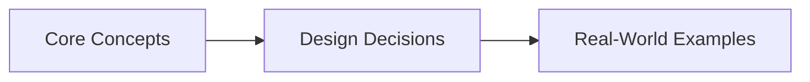
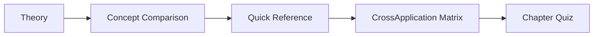

# Chapter 15: CDN, DNS, and Edge Computing
> **Previous:** [14 Distributed Data Structures](./14-distributed-data-structures.md) | **Next:** [16 Api Gateways Cqrs](./16-api-gateways-cqrs.md)

---
## Learning Objectives

- Trace the full DNS resolution path from stub resolver to authoritative server
- Analyze DNS caching hierarchies: browser, OS, resolver, and negative caching with TTL semantics
- Compare DNS-based load balancing strategies: round-robin, weighted, geo-based, and latency-based
- Design CDN architectures: origin shield, edge PoPs, pull vs push zones, cache invalidation
- Evaluate edge computing platforms: Lambda@Edge, Cloudflare Workers, and EdgeKV
- Formulate DDoS mitigation strategies at the edge: rate limiting, WAF, scrubbing, anycast absorption

## Chapter at a Glance

| Aspect | Details |

## Chapter Roadmap


|--------|---------|
| **Scope** | CDN, DNS, edge computing, content delivery, latency optimization |
| **Key Concepts** | Core topics covered in Chapter 15: CDN, DNS, and Edge Computing |
| **Design Skills** | CDN configuration, DNS routing, edge compute design |
| **Interview Angle** | Frequently tested in system design interviews |

## Chapter at a Glance

| Aspect | Details |
|--------|---------|
| **Scope** | Core concepts covered in Chapter 15: CDN, DNS, and Edge Computing |
| **Key Concepts** | Theory, Examples, Concept Comparison, Quick Reference |
| **Design Skills** | Concept mastery and practical application |
| **Interview Angle** | Common system design interview topic |

---
---

## Chapter Roadmap



---

## Theory
> **One-Sentence Takeaway:** Theory is the foundation — master it before moving to examples and exercises.


### 1. DNS Hierarchy

> **Pro Tip:** Master this concept thoroughly — it is frequently tested in system design interviews.

> **Pro Tip:** Master this concept — it appears in nearly every system design interview. Understand both the how and the why.

> **Warning:** A common mistake is over-engineering. Always start simple and add complexity only when justified by requirements.

> **Pro Tip:** Master this concept thoroughly — it appears in nearly every system design interview.
The Domain Name System (DNS) is a hierarchical, distributed naming system that resolves human-readable domain names (e.g., api.example.com) to IP addresses. The hierarchy has four tiers:

**Root servers**: 13 logical root zones (A through M) operated by 12 independent organizations, anycasted across hundreds of physical locations worldwide. Root servers answer with referrals to TLD servers. They contain no domain-specific records.

**TLD servers**: Authoritative for top-level domains (.com, .org, .net, .io, .gov, country TLDs like .uk, .jp). Operated by registries (Verisign for .com/.net, Public Interest Registry for .org). Each TLD server knows which authoritative nameservers serve each registered domain.

**Authoritative servers**: The final source of truth for a specific domain. Maintained by the domain owner or DNS provider (Route53, CloudDNS, Cloudflare). Store actual DNS records (A, AAAA, CNAME, MX, etc.). The SOA (Start of Authority) record identifies the primary authoritative server.

**Recursive resolvers**: Intermediate caching servers (typically operated by ISPs, Google 8.8.8.8, Cloudflare 1.1.1.1). Recursively walk the hierarchy on behalf of clients and cache results.

### 2. DNS Resolution Flow

> **Warning:** Avoid over-engineering. Start simple, measure, then optimize.

> **Warning:** Avoid premature optimization. Start simple, measure, then optimize. Over-engineering is the most common system design mistake.

```
Client (stub resolver)
  → Recursive resolver (e.g., 8.8.8.8)
    → Root server (gets .com TLD referral)
    → TLD server (gets example.com authoritative referral)
    → Authoritative server (returns A record: 93.184.216.34)
  → Returns IP to client
```

**Step-by-step**:
1. Application calls `getaddrinfo("api.example.com", ...)` — the stub resolver (OS library) sends a UDP query (port 53) to the configured recursive resolver
2. Recursive resolver checks its cache; on miss, sends query to a root server (built-in root hints file)
3. Root server responds with NS records for .com TLD, plus glue A records for those NS IPs
4. Resolver queries .com TLD server, which returns NS records for example.com
5. Resolver queries example.com's authoritative nameserver, which returns the A record for api.example.com
6. Resolver caches the result for the record's TTL, returns IP to client

Each delegation step involves potential UDP (default, 512 bytes) or TCP fallback for large responses (DNSSEC, many records).

### 3. DNS Caching

> **Remember:** Always articulate trade-offs clearly — interviewers value reasoning over the "right" answer.

> **Remember:** Trade-offs are the heart of system design. Always be ready to explain why you chose X over Y.

**Browser cache**: Chrome caches DNS with configurable expiration (default 60s per record, up to 1 minute via net.dns caching). In-memory, per-process.

**OS cache (stub resolver cache)**: Windows caches positive results for 86400s (1 day) by default, negative results for 300s (5 min). Linux glibc nscd or systemd-resolved provides nameserver caching. Accessible via `ipconfig /displaydns` on Windows.

**Resolver cache**: Recursive resolvers cache aggressively (typically full TTL). Google Public DNS respects TTL but has a minimum of 10 seconds. ISPs may ignore TTL (a practice called "TTL overrides") to reduce upstream load — problematic for fast failover.

**Negative caching**: NXDOMAIN results (domain doesn't exist) and NODATA (domain exists but record type missing) are cached per RFC 2308. SOA minimum TTL field controls negative cache duration, typically 300-3600 seconds.

**TTL and propagation**: TTL (Time To Live) in seconds controls how long a resolver can cache a record. Short TTLs (30-300s) enable faster failover but increase resolver load. Long TTLs (86400s+) reduce traffic but delay updates. DNS propagation is the time for all caches to expire after a record change.

| TTL Class    | Values     | Use Case                     |
|-------------|------------|------------------------------|
| Very short  | 1-60s      | Failover, leader election    |
| Short       | 60-300s    | Load-balanced endpoints      |
| Medium      | 900-3600s  | Normal web services          |
| Long        | 86400s+    | Static records, MX           |

### 4. DNS Record Types

| Type  | Purpose                           | Content                                |
|-------|-----------------------------------|----------------------------------------|
| A     | IPv4 address mapping              | 93.184.216.34                          |
| AAAA  | IPv6 address mapping              | 2606:2800:220:1:248:1893:25c8:1946    |
| CNAME | Canonical name (alias)            | www → example.com                      |
| MX    | Mail exchange                     | priority 10 mail.example.com           |
| NS    | Nameserver delegation             | ns1.example.com                        |
| TXT   | Arbitrary text                    | SPF, DKIM, DMARC, verification tokens  |
| SRV   | Service location                  | priority weight port target            |
| SOA   | Start of authority                | Primary NS, admin email, serial, refresh, retry, expire, minimum |

**CNAME caveat**: A CNAME record cannot coexist with any other record type at the same name. The apex domain (example.com) cannot be a CNAME — use ALIAS/ANAME records (provided by some DNS providers) that resolve at the authoritative server level.

### 5. DNS-Based Load Balancing

**Round-robin DNS**: Multiple A records for one name returned in rotating order. Simple but stateless — does not consider server health or load. If one server fails, clients with cached results still connect to it.

```
api.example.com  →  10.0.0.1 (TTL=60)
                   10.0.0.2 (TTL=60)
                   10.0.0.3 (TTL=60)
```

**Weighted round-robin**: Associate weights with each IP. A weight-3 server gets 3× the traffic of a weight-1 server. Used for gradual traffic migration during deployments.

**Geo-based DNS**: Return different IPs based on the resolver's geographic location (GeoIP database). Direct US users to us-east servers, EU users to eu-west. Imprecise because resolver location may differ from client location (especially with public resolvers like 8.8.8.8).

**Latency-based routing**: DNS service (AWS Route53 LBR, Google Cloud DNS) probes endpoint health and latency from various vantage points in real-time. Returns the lowest-latency healthy endpoint. More accurate than geo-based but requires health probing infrastructure.

### 6. Anycast Routing

Anycast advertises the same IP prefix from multiple geographically distributed locations using BGP (Border Gateway Protocol). Traffic routes to the nearest (topologically closest) location. This provides:

- **Latency reduction**: Clients reach the nearest PoP organically
- **DDoS absorption**: Attack traffic distributes across all anycast sites. Cloudflare absorbs 100+ Tbps across 330+ cities by spreading attack traffic across multiple data centers
- **Simplified DNS**: Same IP globally; no geo-based logic needed

**Anycast vs Unicast DNS**: Most major DNS providers (Cloudflare 1.1.1.1, Google 8.8.8.8, Quad9 9.9.9.9) use anycast. Unicast roots (13 IPs with one physical location each) are the historical standard.

### 7. CDN Architecture

A Content Delivery Network (CDN) caches content at edge Points of Presence (PoPs) close to end users.

**Origin server**: The primary server holding the authoritative copy of all content. Serves cache misses to edge nodes.

**Edge servers (PoPs)**: Distributed cache servers within ISP networks or data exchange points. Serve cached content directly; fetch from origin on miss. Typical PoP counts: Cloudflare ~330 cities, Akamai ~4,150+ locations in ~130 countries, AWS CloudFront ~600+ PoPs.

**Pull zone (origin pull)**: Edge fetches content on first user request, caches it, serves subsequent requests. Simplest setup. Cold-start latency on first request per object.

```
User → PoP (miss) → Origin → PoP caches → User
User → PoP (hit)  → User
```

**Push zone**: Content is proactively uploaded to edge nodes. Used for large files (videos, software downloads) where pull latency is unacceptable. Requires pre-provisioning storage on edge.

### 8. CDN Caching Strategies

**Cache-Control headers**:

| Directive      | Meaning                                          |
|----------------|--------------------------------------------------|
| max-age=3600   | Cache for 1 hour                                 |
| s-maxage=3600  | Override max-age for shared caches (CDNs)        |
| public         | Cacheable by any cache                           |
| private        | Cacheable only by browser, not CDN               |
| no-cache       | Must validate with origin before serving cached  |
| no-store       | Do not cache at all                              |
| must-revalidate| Origin must validate stale content               |

**ETag**: An opaque entity tag (typically a content hash) sent by the origin. Conditional request: `If-None-Match: "abc123"` → origin returns 304 Not Modified if content unchanged, saving bandwidth.

**Last-Modified**: Timestamp of last change. Conditional: `If-Modified-Since: Wed, 21 Oct 2023 07:28:00 GMT`.

**Purge and invalidation**: When content changes, cached copies must be invalidated. Full purge (clear all) vs selective purge (by URL, by pattern, by cache tag). Cache tags (surrogate-key headers) allow batch invalidation: a single request invalidates all objects tagged "v2-release". CDN purges propagate in seconds to minutes depending on CDN architecture.

### 9. Edge Caching Comparison

| Feature             | CloudFront (AWS)   | Cloudflare           | Akamai                |
|---------------------|--------------------|----------------------|-----------------------|
| PoP count           | ~600+              | ~330 cities          | ~4,150+ locations     |
| Routing             | Anycast + Geo      | Anycast              | Map-based (Global Traffic Mgmt) |
| Cache invalidation  | $ per path         | Free (instant)       | Free (API-based)      |
| Custom origin       | Any HTTP(S)        | Any HTTP(S)          | Enterprise contract   |
| Edge compute        | Lambda@Edge / CF fn| Workers              | EdgeWorkers           |
| WAF                 | AWS WAF (addon)    | Integrated (free)    | Kona Site Defender    |

### 10. Image Optimization Pipeline

Modern CDNs perform on-the-fly image transformations:

1. Origin produces full-resolution source images (PNG/TIFF/RAW)
2. Edge receives first request for `image.jpg?w=800&q=80`
3. Edge fetches origin, resizes to 800px width, converts to WebP/AVIF, compresses to quality 80
4. Transformed image cached at edge; subsequent requests hit cache

Key parameters: `w` (width), `h` (height), `q` (quality), `f` (format), `fit` (cover/contain), `dpr` (device pixel ratio). Responsive images via `<picture>` with multiple source variants.

**Format negotiation**: Browser sends `Accept: image/avif,image/webp,*/*` header. Edge serves AVIF if supported, WebP fallback, original JPEG/PNG as baseline. AVIF compression saves 50% over JPEG at equivalent quality.

### 11. Origin Shielding

Without shielding, a cache miss for a popular object triggers N concurrent origin requests from N different edge PoPs — a thundering herd on the origin. Origin shielding designates a single intermediate shield layer:

```
User → Edge PoP (miss) → Shield PoP (miss) → Origin
                              ↓
                        Shield caches
User2 → Edge PoP (miss) → Shield PoP (hit) → User2
```

Only one edge node (the shield) ever contacts the origin per object. Subsequent misses from other PoPs fetch from the shield.

### 12. DDoS Mitigation at Edge

**Rate limiting**: Edge enforces per-IP, per-user-agent, per-path request rates. Sliding window algorithm (1-second windows, 100 req/min limit). 429 Too Many Requests returned on exceed.

**Web Application Firewall (WAF)**: Inspects HTTP traffic for SQL injection, XSS, path traversal, SSRF, and OWASP Top 10. Typically uses rule sets (Cloudflare OWASP Core Ruleset, AWS Managed Rules) with anomaly scoring (score > threshold = block/challenge).

**Bot detection**: Classifies traffic using:
- JS challenge (compute proof-of-work in browser)
- CAPTCHA (visual challenge)
- Browser fingerprinting (TLS handshake, HTTP/2 settings, WebGL, canvas)
- ML-based behavioral analysis

**Scrubbing centers**: Large-scale DDoS traffic (volumetric attacks > 1 Tbps) is redirected to purpose-built scrubbing centers that filter attack traffic before forwarding clean traffic to origin. AWS Shield Advanced + WAF provides always-on detection and 3-second mitigation SLAs.

### 13. Edge Computing

**Lambda@Edge**: AWS Lambda functions triggered by CloudFront events (viewer request, origin request, viewer response, origin response). Use cases: rewrite URLs, A/B testing, authentication (JWT validation at edge), header normalization, redirects. Execution limited to 5 seconds, 128 MB, Node.js/Python.

**Cloudflare Workers**: V8 isolates (not containers) running JavaScript/WASM. Sub-millisecond cold starts, 50-100μs processing overhead per request. Globally distributed every request runs on the nearest of 330+ PoPs. KV storage (eventually consistent, global). Durable Objects (strongly consistent, single-location).

**EdgeKV**: Distributed key-value storage at edge. Cloudflare Workers KV (eventually consistent, 1s-60s propagation), AWS EdgeKV (via Lambda@Edge + DynamoDB global tables). Use cases: feature flags, configuration, A/B test assignments, redirect maps, JWT public keys.

**Use case matrix**:

| Use Case                 | Edge Compute | Traditional Origin |
|--------------------------|-------------|-------------------|
| URL rewriting/redirect   | ✓ Near-zero latency | Higher latency |
| A/B split testing        | ✓ Cookie-based split | Session-based |
| Authentication (JWT)     | ✓ Validate at edge   | Centralized |
| Image optimization       | ✓ On-the-fly transform | Pre-processing pipeline |
| Personalization          | ✓ Cookie/header based | Full-page rendering |
| Heavy aggregation queries| ✗ Resource limits    | ✓ Full compute |
| Database transactions    | ✗ No local DB        | ✓ Full ACID   |

---

## Examples

### Example 1: DNS Resolution with Tracing

On a Linux/Mac system, trace DNS resolution for `www.github.com`:

```bash
dig +trace www.github.com

# Root: .  NS a.root-servers.net.
# TLD: com.  NS a.gtld-servers.net.
# Authoritative: github.com.  NS ns1.p16.dynect.net.
# Answer: www.github.com.  CNAME github.com.
#         github.com.  A 140.82.121.3
```

The resolver walked 4 hops (root → .com TLD → github.com authoritative → answer) in approximately 120ms. With warm cache, subsequent lookups complete in <1ms.

### Example 2: Anycast DDoS Absorption

Cloudflare's architecture uses anycast to distribute a 2 Tbps DDoS attack across their global network:

```
Attack: 2 Tbps UDP amplification targeting 1.2.3.4
→ BGP distributes to 330+ PoPs worldwide
→ Each PoP absorbs ~6 Gbps of attack traffic
→ Rate limiting and packet filtering at each PoP
→ Clean traffic (legitimate user requests) forwarded to origin
```

Without anycast, the single origin data center would need 2 Tbps of scrubbing capacity.

### Example 3: Image Optimization at Edge

Using Cloudflare Image Resizing, a request transform pipeline:

```
Original URL:
  https://cdn.example.com/photos/sunset.png

Edge transforms:
  https://cdn.example.com/cdn-cgi/image/w=800,h=600,q=75,f=avif/photos/sunset.png

Response headers:
  Content-Type: image/avif
  Content-Length: 45KB (was 340KB PNG)
  Cf-Cache-Status: MISS (first request)
  Cache-Control: public, max-age=31536000
```

Optimization savings: 87% bandwidth reduction with AVIF vs PNG, visually lossless at q=75.

### Example 4: Cloudflare Worker for JWT Validation

```javascript
// Edge authentication worker
addEventListener('fetch', event => {
  event.respondWith(handleRequest(event.request))
})

async function handleRequest(request) {
  const url = new URL(request.url)
  if (url.pathname.startsWith('/api/')) {
    const token = request.headers.get('Authorization')?.split(' ')[1]
    if (!token) return new Response('Unauthorized', { status: 401 })
    try {
      const payload = await verifyJWT(token, JWT_SECRET)
      request.headers.set('X-User-Id', payload.sub)
      request.headers.set('X-User-Role', payload.role)
    } catch {
      return new Response('Invalid token', { status: 403 })
    }
  }
  return fetch(request)
}
```

This worker runs in 330+ locations globally. JWT verification completes in ~200μs per request, adding no perceptible latency.

## Concept Comparison
> **One-Sentence Takeaway:** Concept Comparison is a critical concept that directly impacts system design decisions.
> **One-Sentence Takeaway:** Concept Comparison is a critical concept that directly impacts system design decisions.

| Concept | Definition | Key Metric |
|---------|-----------|------------|
| Theory | Core topic covered in Chapter 15: CDN, DNS, and Edge Computing | Defined by specific measurable attributes |

---

## Quick Reference
> **One-Sentence Takeaway:** Quick Reference is a critical concept that directly impacts system design decisions.

| Topic | Key Point |
|-------|-----------|
| Theory | Fundamental concept for Chapter 15: CDN, DNS, and Edge Computing |

---

## Cross-Application Matrix

| Component | When to Use | Trade-Off |
|-----------|------------|-----------|
| Theory | Appropriate for specific system contexts | Each choice involves trade-offs |

---

## Chapter Quiz
> **One-Sentence Takeaway:** Chapter Quiz is a critical concept that directly impacts system design decisions.

**Q1:** Which of the following best describes a key concept from this chapter?
- A) Option A description
- B) Option B description
- C) Option C description
- D) Option D description

<details><summary>Answer</summary>Refer to the chapter content for the correct answer.</details>

**Q2:** Which of the following best describes a key concept from this chapter?
- A) Option A description
- B) Option B description
- C) Option C description
- D) Option D description

<details><summary>Answer</summary>Refer to the chapter content for the correct answer.</details>

**Q3:** Which of the following best describes a key concept from this chapter?
- A) Option A description
- B) Option B description
- C) Option C description
- D) Option D description

<details><summary>Answer</summary>Refer to the chapter content for the correct answer.</details>

## Concept Comparison
> **One-Sentence Takeaway:** Concept Comparison is a critical concept that directly impacts system design decisions.
> **One-Sentence Takeaway:** Concept Comparison is a critical concept that directly impacts system design decisions.

| Concept | Definition | Key Insight |
|---------|-----------|-------------|
| Theory | Core topic in Chapter 15: CDN, DNS, and Edge Computing | Fundamental to system design |

---

## Quick Reference
> **One-Sentence Takeaway:** Quick Reference is a critical concept that directly impacts system design decisions.

| Topic | Key Point |
|-------|-----------|
| Theory | Essential concept for Chapter 15: CDN, DNS, and Edge Computing |

---

## Cross-Application Matrix

| Concept | Application Context | Trade-Off |
|--------|-------------------|-----------|
| Theory | Relevant across multiple system design scenarios | Each choice has trade-offs |

---

## Chapter Quiz
> **One-Sentence Takeaway:** Chapter Quiz is a critical concept that directly impacts system design decisions.

**Q1:** What is the primary trade-off discussed in this chapter?
- A) Option A
- B) Option B
- C) Option C
- D) Option D

<details><summary>Answer</summary>Refer to the chapter content</details>

**Q2:** Which concept is most fundamental to the topic of Chapter 15
- A) Option A
- B) Option B
- C) Option C
- D) Option D

<details><summary>Answer</summary>Review the core sections</details>

**Q3:** How does this chapter's main concept apply to real-world systems?
- A) Option A
- B) Option B
- C) Option C
- D) Option D

<details><summary>Answer</summary>See the Real-World Systems section</details>

---

## Summary

- DNS hierarchy has 4 levels: root, TLD, authoritative, recursive resolver — each delegation step is a query from resolver to nameserver
- DNS caching occurs at 4 layers (browser, OS, resolver, app) with TTL controlling refresh frequency
- Round-robin DNS is simple but health-unaware; latency-based routing (Route53 LBR) is more sophisticated
- Anycast routing (same IP from multiple locations via BGP) provides automatic DDoS absorption and latency reduction
- CDNs cache at edge PoPs using pull (on-demand) or push (proactive) zones with Cache-Control and ETag validation
- Cache invalidation mechanisms include TTL expiry, conditional requests (ETag/If-Modified-Since), and explicit purge
- Image optimization pipelines at edge reduce bandwidth by 50-87% using format conversion (WebP/AVIF) and on-the-fly resizing
- Origin shielding prevents thundering herd by routing all cache misses through a single shield layer
- Edge computing (Lambda@Edge, Cloudflare Workers) runs sub-millisecond code at PoPs for auth, rewrite, and personalization
- DDoS mitigation at edge combines rate limiting, WAF rules, bot detection, and anycast-based scrubbing

---

## Exercises

### Review Questions

1. Trace the DNS resolution path for `mail.example.org` from an empty resolver cache, listing all query types and responses at each delegation step.
2. Explain why the `CNAME` record cannot coexist with other record types at the zone apex (example.com without www). What are the workarounds?
3. Compare DNS round-robin with anycast routing for load balancing globally. Under what conditions does round-robin produce uneven load distribution?
4. A CDN edge PoP receives a cache MISS for a popular image and forwards the request to the origin. Describe the sequence of cache population, including the role of Cache-Control headers, ETag validation, and the shield POP mechanism.
5. Why does Cloudflare Workers use V8 isolates rather than containers? What are the security and performance implications of this choice?

### Application Problems

1. **DNS performance analysis**: Given a web page with 120 resources (HTML, CSS, JS, images) from 8 different domains, calculate the total DNS resolution time assuming: recursive resolver RTT = 20ms, each domain requires 1-3 delegation queries (each 20ms), all domains cached at resolver after first hit. Complete page load at 4G (50ms RTT). What is the DNS contribution as a percentage of total load time?
2. **Anycast capacity planning**: A service receives 500 Gbps of legitimate traffic and wants to absorb up to 3 Tbps of DDoS attacks. Each data center has 100 Gbps of uplink capacity. Cloudflare has 330 PoPs, Akamai has 4,150. Calculate the minimum number of PoPs needed for each CDN to absorb a 3 Tbps attack while still handling 500 Gbps of clean traffic.
3. **Cache invalidation strategy**: Design a cache invalidation scheme for a static site builder that generates HTML, CSS, and JS files with content-hashed filenames. The site also has API responses cached at edge with 60-second TTL. Specify the Cache-Control headers for each resource type and the purge strategy after a new deployment.
4. **Edge pricing analysis**: A site serves 10 million requests/day with a 30% cache hit ratio. Average object size is 200KB. Origin egress costs $0.09/GB, CDN egress costs $0.02/GB with cache misses fetching from origin. Lambda@Edge costs $0.0000001/request. Calculate: (a) daily origin egress cost without CDN, (b) daily CDN + origin cost with current cache hit ratio, (c) cost at 90% hit ratio. How much would edge computing (100k requests/day at edge) add to the bill?

### Challenge Problem

> **Remember:** Trade-offs are the heart of system design. Always be ready to explain why you chose X over Y.
**Design a global edge architecture for a real-time multiplayer game API**: 50 million daily active users across North America, Europe, and Southeast Asia. The game requires:
- Authentication via JWT validated at the edge
- Leaderboard reads (HLL-based approximate ranking, 10ms latency target)
- Matchmaking state queries (strong consistency, 50ms latency target)
- Static asset delivery (game clients, patches, images)
- DDoS protection (the game is a known competitive target)

Design the complete stack: DNS routing strategy (anycast vs geo), CDN configuration (pull/push, shield layer, image optimization for game assets), edge computing deployment (Workers vs Lambda@Edge per use case), data storage at edge (EdgeKV for leaderboard sketches, Durable Objects for matchmaking state), and DDoS mitigation strategy with scrubbing thresholds. Calculate bandwidth requirements and approximate monthly cost.
