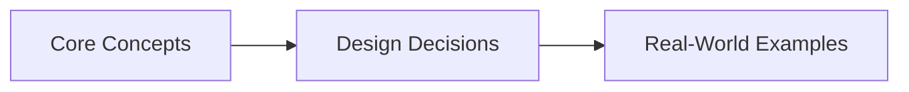
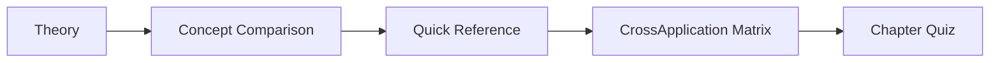

# Chapter 16: API Gateways, CQRS, and Event Sourcing
> **Previous:** [15 Cdn Dns Edge](./15-cdn-dns-edge.md) | **Next:** [17 Observability Resiliency](./17-observability-resiliency.md)

---
## Learning Objectives

- Distinguish API gateway responsibilities from load balancers and service meshes
- Implement gateway patterns: single gateway, BFF (Backend for Frontend), and gateway per domain
- Design distributed rate limiting using token buckets and sliding window algorithms with Redis
- Model CQRS as separate command and query models with denormalized read projections
- Implement event sourcing with an append-only event store, upcasting, and snapshot rebuilding
- Evaluate trade-offs: when CQRS/ES simplifies vs overcomplicates a system

## Chapter at a Glance

| Aspect | Details |

## Chapter Roadmap


|--------|---------|
| **Scope** | API gateways, CQRS, event sourcing, backend-for-frontend |
| **Key Concepts** | Core topics covered in Chapter 16: API Gateways, CQRS, and Event Sourcing |
| **Design Skills** | API gateway policy, CQRS separation, event sourcing |
| **Interview Angle** | Frequently tested in system design interviews |

## Chapter at a Glance

| Aspect | Details |
|--------|---------|
| **Scope** | Core concepts covered in Chapter 16: API Gateways, CQRS, and Event Sourcing |
| **Key Concepts** | Theory, Examples, Concept Comparison, Quick Reference |
| **Design Skills** | Concept mastery and practical application |
| **Interview Angle** | Common system design interview topic |

---
---

## Chapter Roadmap



---

## Theory
> **One-Sentence Takeaway:** Theory is the foundation — master it before moving to examples and exercises.


### 1. API Gateway vs Load Balancer

> **Pro Tip:** Master this concept thoroughly — it is frequently tested in system design interviews.

> **Pro Tip:** Master this concept — it appears in nearly every system design interview. Understand both the how and the why.

> **Warning:** A common mistake is over-engineering. Always start simple and add complexity only when justified by requirements.

> **Pro Tip:** Master this concept thoroughly — it appears in nearly every system design interview.
A **load balancer** (e.g., Nginx, HAProxy, AWS ELB) distributes traffic across backend servers at L4 (TCP) or L7 (HTTP). It handles connection pooling, SSL termination, and health checks. It operates at the transport or application layer but does not understand application semantics.

An **API gateway** sits between clients and microservices and handles:

| Responsibility        | Gateway | Load Balancer |
|-----------------------|---------|---------------|
| Request routing       | ✓ Path/header/host-based | ✓ Round-robin/least-conn |
| Authentication        | ✓ JWT, OAuth2, API keys | ✗                              |
| Rate limiting         | ✓ Per-client, per-endpoint | ✗ (basic connection limiting)  |
| Request aggregation   | ✓ Compose N responses → 1 | ✗                              |
| Circuit breaking      | ✓ Per-service health tracking | ✗                              |
| Protocol translation  | ✓ HTTP→gRPC, HTTP→WebSocket | ✗                              |
| Response transformation| ✓ Header rewrite, body transform | ✗                              |
| Caching               | ✓ Response caching | ✗                              |
| API versioning        | ✓ /v1/ vs /v2/ routing | ✗                              |
| Canary deployments    | ✓ Weighted traffic split | ✓ (weighted pools)             |

### 2. API Gateway Patterns

> **Warning:** Avoid over-engineering. Start simple, measure, then optimize.

> **Warning:** Avoid premature optimization. Start simple, measure, then optimize. Over-engineering is the most common system design mistake.

**Single gateway per system**: One gateway handles all client traffic. Simple, but becomes a single point of failure and bottleneck. All services must evolve in lock-step with the gateway contract.

```
Client → [Gateway] → Service A
                  → Service B
                  → Service C
```

**Gateway per frontend (BFF)**: Each client type (mobile, web, IoT) gets its own gateway. Mobile BFF returns smaller payloads (limited bandwidth), web BFF returns full HTML + API data. Each BFF team owns their interface independently.

```
Mobile App → [Mobile BFF]
Web App   → [Web BFF]
IoT        → [IoT Gateway]
```

**Gateway per domain**: Different business domains each have their own gateway (Orders Gateway, Users Gateway, Payments Gateway). Aligns with domain-driven design bounded contexts. Preferred for large organizations with independent service teams.

### 3. Rate Limiting in Gateways

> **Remember:** Always articulate trade-offs clearly — interviewers value reasoning over the "right" answer.

> **Remember:** Trade-offs are the heart of system design. Always be ready to explain why you chose X over Y.

**Token bucket algorithm**: A bucket holds T tokens. Each request consumes 1 token. Tokens refill at rate R per second. Bursts up to T allowed. Implementation:

```python
import time

class TokenBucket:
    def __init__(self, rate, burst):
        self.rate = rate          # tokens per second
        self.burst = burst        # max bucket size
        self.tokens = burst
        self.last_refill = time.monotonic()

    def allow(self):
        now = time.monotonic()
        elapsed = now - self.last_refill
        self.tokens = min(self.burst, self.tokens + elapsed * self.rate)
        self.last_refill = now
        if self.tokens >= 1:
            self.tokens -= 1
            return True
        return False
```

**Sliding window log**: Maintain a sorted set of request timestamps per client. Remove timestamps older than window W. Count remaining. Reject if count > limit L. More accurate than fixed window but uses O(N) memory per client.

**Sliding window counter**: Hybrid approach using Redis. Track previous window counter + current window counter. Approximate current count: prev * (1 - overlap_ratio) + current. Memory-efficient, within ~5% accuracy of precise sliding window.

**Distributed rate limiting with Redis**:

```python
import time, redis

r = redis.Redis()
def sliding_window_rate_limit(client_id, max_requests=100, window_ms=1000):
    key = f"rate_limit:{client_id}:{int(time.time() * 1000 / window_ms)}"
    current = r.incr(key)
    if current == 1:
        r.expire(key, window_ms // 1000 + 1)
    return current <= max_requests
```

### 4. Authentication at Gateway

**JWT validation**: Gateway validates the JWT token on every request before forwarding to backend.

```python
import jwt

def gateway_auth(request):
    token = request.headers.get("Authorization", "").removeprefix("Bearer ")
    try:
        payload = jwt.decode(token, PUBLIC_KEY, algorithms=["RS256"])
        request.headers["X-User-Id"] = payload["sub"]
        request.headers["X-User-Roles"] = ",".join(payload.get("roles", []))
        return request  # forward to backend
    except jwt.ExpiredSignatureError:
        return 401 {"error": "token_expired"}
    except jwt.InvalidTokenError:
        return 403 {"error": "invalid_token"}
```

**OAuth2 token exchange**: Gateway accepts opaque access tokens, exchanges them for JWT via introspection endpoint, injects claims. The backend never sees the original token.

**API key check**: Simple HMAC-based key validation. Gateway checks key against a database (or cached in Redis). Rate limiting per key.

### 5. Request Aggregation

The gateway fetches data from multiple services and merges into a single response. Without aggregation:

```
Client → /order/123
  Gateway:
    1. GET /order-service/orders/123 → {order data}
    2. GET /user-service/users/456   → {user data}
    3. GET /payment-service/payments/789 → {payment data}
  Response: merged {order, user, payment}
```

N+1 request problem for list endpoints:

```
Client → GET /orders?user=456
  Without aggregation:
    Gateway → order-service → returns [order1, order2, ...]
    Gateway → for each order, call user-service (N requests)
    Gateway → for each order, call payment-service (N requests)
  With batch aggregation:
    Gateway → order-service → returns [order1, order2, ...]
    Gateway → user-service batch(user_ids) → returns all users
    Gateway → payment-service batch(order_ids) → returns all payments
```

GraphQL gateways (Apollo Federation, Hasura) push aggregation responsibility to the query layer — clients specify exactly which data they need, gateway optimizes the fetch plan.

### 6. CQRS Pattern

Command Query Responsibility Segregation separates the write model (Commands) from the read model (Queries).

```
Command Side:                    Query Side:
  Client sends Command             Client sends Query
  → Validate business rules        → Read from read-optimized store
  → Write to write model           → Return denormalized DTO
  → Publish event
  → Event handler updates read model
```

**Without CQRS**: Single model for reads and writes. Complex JOIN-based queries compete for resources with write operations. Object-relational impedance mismatch: domain objects (rich, behavior-laden) map poorly to relational tables.

**With CQRS**: Write model uses normalized tables optimized for transactional integrity. Read model uses denormalized tables, materialized views, or even a different database technology (Elasticsearch for full-text search, Redis for fast reads).

```python
# Command side
class OrderCommandService:
    def place_order(self, user_id, items):
        order = Order.create(user_id, items)
        total = sum(item.price * item.qty for item in items)
        order.calculate_discounts()
        if order.total > user.credit_limit:
            raise InsufficientCredit()
        order.save()
        event_bus.publish(OrderPlaced(order.id, user_id, items, total))
        return order.id

# Query side (separate database)
class OrderQueryService:
    def get_order_summary(self, order_id):
        # Read from denormalized read-optimized store
        return read_db.query(
            "SELECT * FROM order_summaries WHERE order_id = ?", order_id
        )
```

### 7. CQRS Without Event Sourcing

Simpler than full CQRS+ES. The command side writes to the write database; on write completion, the command handler updates the read database directly (dual-write).

```
Client → Command Handler → Write DB (normalized)
  → Handler also writes to Read DB (denormalized)
Client → Query Handler → Read DB → Response
```

**Trade-offs**: Simpler than ES but has dual-write problem (use transactional outbox), lacks audit log, and cannot rebuild read models from scratch.

### 8. Event Sourcing Fundamentals

Event sourcing stores all changes as an append-only sequence of events. Current state is derived by folding over events. Each event has: event_id, aggregate_id, event_type, payload, version, timestamp, and tracing metadata.

```
Events for Order#123: v1: OrderPlaced, v2: PaymentReceived, v3: OrderShipped, v4: OrderDelivered
Current state (fold): placed, paid, shipped, delivered ✓
```

Events are immutable facts — correction events (e.g., PaymentRefunded) are appended. **Snapshotting** saves aggregated state at version V, avoiding replay of millions of events. Rebuild: load snapshot, replay from V+1.

### 9. Event Store Design

**Event versioning**: Two strategies — versioned event types (`OrderPlacedV1` → `OrderPlacedV2`) handled by branching code, or **upcasting** (transform old events to latest schema on read):

```python
class Upcaster:
    @classmethod
    def register(cls, event_type, version, fn): cls.VERSIONS[(event_type, version)] = fn
    @classmethod
    def upcast(cls, event):
        while (event["type"], event.get("version", 1)) in cls.VERSIONS:
            event = cls.VERSIONS[(event["type"], event["version"])](event)
        return event

Upcaster.register("OrderPlaced", 1, lambda e: {**e, "version": 2, "currency": "USD"})
```

**Schema evolution**: Use protobuf/Avro with forward/backward compatibility. Never delete fields — make them optional.

### 10. Rebuilding State: Projections and Snapshots

**Projection**: A read model built by subscribing to events. For example, an `OrderSummaryProjection` listens to `OrderPlaced`, `OrderShipped`, `OrderDelivered` events and maintains a denormalized summary table.

```python
class OrderSummaryProjection:
    def __init__(self, read_db):
        self.db = read_db

    def handle(self, event):
        if event.type == "OrderPlaced":
            self.db.insert("order_summaries", {
                "id": event.order_id,
                "user_id": event.user_id,
                "total": event.total,
                "status": "placed",
                "items": json.dumps(event.items),
                "updated_at": event.timestamp
            })
        elif event.type == "OrderShipped":
            self.db.update("order_summaries",
                {"status": "shipped", "updated_at": event.timestamp},
                {"id": event.order_id})
```

**Catch-up**: New projection must replay all historical events to build current state. The event store provides a position marker; the projection reads from position 0 forward.

**Snapshotting**: Save aggregated state periodically. In PostgreSQL, a `snapshots` table: (aggregate_id, version, state_data, created_at). On rebuild, read latest snapshot, query events from snapshot.version + 1.

### 11. Event Sourcing + CQRS Integration

```
Command Side:
  1. Client sends PlaceOrder command
  2. Command handler validates (inventory check, credit check)
  3. Appends OrderPlaced event to Event Store
  4. Returns success to client

Event Bus:
  5. Event Store publishes OrderPlaced event
  6. Multiple subscribers receive the event

Query Side (Projections):
  7a. OrderSummaryProjection updates read DB
  7b. EmailProjection sends confirmation email
  7c. AnalyticsProjection updates dashboards
  7d. SearchProjection indexes order in Elasticsearch
```

**Key insight**: The command side NEVER directly updates the read model. It only appends events. Projections handle read-side updates asynchronously. This means eventual consistency between command and query — a client that writes then immediately reads may see stale data.

### 12. Practical Trade-offs

**Use CQRS + ES when**:
- Full audit trail required (financial systems, compliance)
- Complex business rules with state changes over time
- Multiple read models serving different purposes
- Temporal queries needed ("what did the data look like at time T?")
- Team is comfortable with eventual consistency

**Don't use CQRS + ES when**:
- Simple CRUD operations (just use a database)
- Always need strongly consistent reads
- Small team unfamiliar with these patterns
- Rapid prototyping / MVP phase
- The read model is the same as the write model

**Production considerations**:
- Eventual consistency adds complexity: clients must handle stale reads
- Event schema evolution requires discipline (upcasters, versioning)
- Rebuilding large event streams is slow without snapshots
- Testing requires managing temporal state (events in the past)

### 13. Real-World Implementations

**Event Store DB**: Purpose-built event store. Supports projections (continuous, transient, by category), subscriptions (volatile, persistent, catch-up), and atomically append events with expected version checks for optimistic concurrency.

**Axon Framework**: Java framework for CQRS/ES. Provides Aggregate annotation, Command Handler, Event Sourcing Handler, and Saga orchestration. Integrates with any event store (Axon Server, Kafka, PostgreSQL).

**Kafka as event store**: Kafka's log-compacted topics serve as an append-only event store. Key properties: ordered, durable, replayable. Each partition is an ordered sequence of events. Log compaction retains the latest value per key — acts as a distributed snapshot. Widely used as the backbone in CQRS architectures.

**Bank ledger systems**: Every transaction is an event (Deposited, Withdrawn, Transferred). Account balance = sum of all Deposit amounts - sum of all Withdrawal amounts. No records are ever deleted or modified. This gives complete audit trail and regulatory compliance.

---

## Examples

### Example 1: Distributed Rate Limiting with Redis Sliding Window

```python
import time, hashlib, redis

class DistributedRateLimiter:
    def __init__(self, redis_client):
        self.r = redis_client

    def _window_key(self, key, window_ms):
        now = int(time.time() * 1000)
        return f"rl:{key}:{now // window_ms}"

    def allow(self, key, max_requests=100, window_ms=1000):
        # Current window
        cur_key = self._window_key(key, window_ms)
        cur_count = self.r.incr(cur_key)
        if cur_count == 1:
            self.r.expire(cur_key, window_ms // 1000 + 1, nx=True)

        # Previous window overlap
        prev_key = self._window_key(key, window_ms - window_ms)
        prev_count = int(self.r.get(prev_key) or 0)
        overlap_ratio = (time.time() * 1000 % window_ms) / window_ms
        approx = prev_count * (1 - overlap_ratio) + cur_count
        return approx <= max_requests
```

This limits to 100 requests per second with ~2-5% error margin versus precise windows. Memory: 2 Redis keys per client per second.

### Example 2: Gateway per Frontend (BFF) in Python

```python
from flask import Flask, request, jsonify
import httpx

mobile_gateway = Flask(__name__)
web_gateway = Flask(__name__)

# Mobile BFF — compact payloads, low bandwidth
@mobile_gateway.route("/feed")
def mobile_feed():
    user_id = request.headers["X-User-Id"]
    posts = httpx.get(f"http://post-service/feed?user={user_id}").json()
    # Mobile: only return id + title + thumbnail
    return jsonify([{
        "id": p["id"], "title": p["title"][:80],
        "thumbnail": p.get("images", [None])[0]
    } for p in posts])

# Web BFF — rich content, full HTML
@web_gateway.route("/feed")
def web_feed():
    user_id = request.headers["X-User-Id"]
    posts = httpx.get(f"http://post-service/feed?user={user_id}").json()
    authors_resp = httpx.post("http://user-service/batch",
        json={"ids": list(set(p["author_id"] for p in posts))})
    authors = {a["id"]: a for a in authors_resp.json()}
    # Web: full content, author details, comments count
    return jsonify([{
        **p, "author": authors[p["author_id"]],
        "comment_count": httpx.get(
            f"http://comment-service/count?post_id={p['id']}"
        ).json()["count"]
    } for p in posts])
```

Mobile BFF returns 1.2 KB average per post (5 fields); Web BFF returns 4.8 KB per post (12 fields + nested author + comment count).

### Example 3: Event Sourcing with Snapshotting

```python
class EventStore:
    def __init__(self, db):
        self.db = db

    def append(self, aggregate_id, events, expected_version=None):
        # Append events atomically with optimistic concurrency check
        for i, event in enumerate(events):
            self.db.execute(
                "INSERT INTO events (aggregate_id, version, type, data, created_at) "
                "VALUES (?, ?, ?, ?, ?)",
                aggregate_id, expected_version + 1 + i,
                event["type"], json.dumps(event["data"]), event["timestamp"]
            )

class SnapshotRepository:
    def __init__(self, event_store, snapshot_frequency=100):
        self.event_store = event_store
        self.snapshot_freq = snapshot_frequency

    def save(self, aggregate):
        self.event_store.append(aggregate.id, aggregate.new_events(), aggregate.version)
        if aggregate.version % self.snapshot_freq == 0:
            self.db.execute("UPSERT INTO snapshots VALUES (?, ?, ?)",
                aggregate.id, aggregate.version, json.dumps(aggregate.state()))

    def load(self, aggregate_id):
        row = self.db.query("SELECT * FROM snapshots WHERE aggregate_id = ? "
                            "ORDER BY version DESC LIMIT 1", aggregate_id)
        state = json.loads(row["state"]) if row else {}
        version = row["version"] if row else 0
        events = self.event_store.read_events(aggregate_id, version)
        for event in events:
            self._apply(state, event)
        return Aggregate(aggregate_id, state, version + len(events))
```

### Example 4: CQRS with Kafka as Event Bus

Command side publishes events to Kafka; query side consumes and updates denormalized read models:

```python
# Command side
class OrderService:
    def place_order(self, user_id, items):
        order_id = str(uuid.uuid4())
        event = {"aggregate_id": order_id, "type": "OrderPlaced",
                 "data": {"user_id": user_id, "total": sum(i["price"] for i in items)}}
        KafkaProducer(value_serializer=lambda v: json.dumps(v).encode()) \
            .send("orders", key=order_id.encode(), value=event)
        return order_id

# Query side projection
class OrderProjection:
    def run(self):
        consumer = KafkaConsumer("orders",
            value_deserializer=lambda v: json.loads(v.decode()))
        for msg in consumer:
            ev = msg.value
            if ev["type"] == "OrderPlaced":
                sqlite3.connect("read_model.db").execute(
                    "INSERT INTO order_summaries VALUES (?, ?, ?, 'placed')",
                    (ev["aggregate_id"], ev["data"]["user_id"], ev["data"]["total"]))
```

## Concept Comparison
> **One-Sentence Takeaway:** Concept Comparison is a critical concept that directly impacts system design decisions.
> **One-Sentence Takeaway:** Concept Comparison is a critical concept that directly impacts system design decisions.

| Concept | Definition | Key Metric |
|---------|-----------|------------|
| Theory | Core topic covered in Chapter 16: API Gateways, CQRS, and Event Sourcing | Defined by specific measurable attributes |

---

## Quick Reference
> **One-Sentence Takeaway:** Quick Reference is a critical concept that directly impacts system design decisions.

| Topic | Key Point |
|-------|-----------|
| Theory | Fundamental concept for Chapter 16: API Gateways, CQRS, and Event Sourcing |

---

## Cross-Application Matrix

| Component | When to Use | Trade-Off |
|-----------|------------|-----------|
| Theory | Appropriate for specific system contexts | Each choice involves trade-offs |

---

## Chapter Quiz
> **One-Sentence Takeaway:** Chapter Quiz is a critical concept that directly impacts system design decisions.

**Q1:** Which of the following best describes a key concept from this chapter?
- A) Option A description
- B) Option B description
- C) Option C description
- D) Option D description

<details><summary>Answer</summary>Refer to the chapter content for the correct answer.</details>

**Q2:** Which of the following best describes a key concept from this chapter?
- A) Option A description
- B) Option B description
- C) Option C description
- D) Option D description

<details><summary>Answer</summary>Refer to the chapter content for the correct answer.</details>

**Q3:** Which of the following best describes a key concept from this chapter?
- A) Option A description
- B) Option B description
- C) Option C description
- D) Option D description

<details><summary>Answer</summary>Refer to the chapter content for the correct answer.</details>

## Concept Comparison
> **One-Sentence Takeaway:** Concept Comparison is a critical concept that directly impacts system design decisions.
> **One-Sentence Takeaway:** Concept Comparison is a critical concept that directly impacts system design decisions.

| Concept | Definition | Key Insight |
|---------|-----------|-------------|
| Theory | Core topic in Chapter 16: API Gateways, CQRS, and Event Sourcing | Fundamental to system design |

---

## Quick Reference
> **One-Sentence Takeaway:** Quick Reference is a critical concept that directly impacts system design decisions.

| Topic | Key Point |
|-------|-----------|
| Theory | Essential concept for Chapter 16: API Gateways, CQRS, and Event Sourcing |

---

## Cross-Application Matrix

| Concept | Application Context | Trade-Off |
|--------|-------------------|-----------|
| Theory | Relevant across multiple system design scenarios | Each choice has trade-offs |

---

## Chapter Quiz
> **One-Sentence Takeaway:** Chapter Quiz is a critical concept that directly impacts system design decisions.

**Q1:** What is the primary trade-off discussed in this chapter?
- A) Option A
- B) Option B
- C) Option C
- D) Option D

<details><summary>Answer</summary>Refer to the chapter content</details>

**Q2:** Which concept is most fundamental to the topic of Chapter 16
- A) Option A
- B) Option B
- C) Option C
- D) Option D

<details><summary>Answer</summary>Review the core sections</details>

**Q3:** How does this chapter's main concept apply to real-world systems?
- A) Option A
- B) Option B
- C) Option C
- D) Option D

<details><summary>Answer</summary>See the Real-World Systems section</details>

---

## Summary

- API gateways handle routing, auth, rate limiting, aggregation, circuit breaking, and protocol translation — distinct from load balancers which only distribute traffic
- BFF pattern (gateway per frontend) optimizes payloads per client type; gateway per domain aligns with bounded contexts
- Distributed rate limiting uses token bucket (burst-tolerant) or sliding window (memory-expensive) algorithms with Redis backend
- Request aggregation at the gateway eliminates N+1 fetch patterns from clients by composing microservice responses server-side
- CQRS separates write models (commands, normalized, transactional) from read models (queries, denormalized, optimized)
- Event sourcing stores all state changes as an append-only log; current state is a fold over all past events
- Event versioning and upcasting handle schema evolution without modifying historical events
- Snapshots prevent unbounded replay costs by saving aggregated state at periodic intervals
- Kafka serves as a scalable event bus connecting command-side writes to query-side projections
- CQRS/ES adds significant complexity — use for audit trails and temporal queries, not simple CRUD
- Financial systems, Axon Framework, and Event Store DB are canonical real-world applications

---

## Exercises

### Review Questions

1. Compare the single-gateway pattern with BFF. Under what conditions does BFF reduce development friction and latency?
2. Explain the dual-write problem in CQRS without event sourcing. How does the transactional outbox pattern resolve it?
3. In event sourcing, what is the difference between a "snapshot" and a "projection"? Why are both needed in production?
4. An event schema changes: the `OrderPlaced` event now includes a `discount_code` field. Describe the upcasting process for existing events that lack this field.
5. Why does the token bucket algorithm allow short bursts while the sliding window algorithm enforces a stricter rate? Sketch the traffic patterns for both under a sudden spike.

### Application Problems

1. **Rate limiting design**: A gateway serves 50,000 requests/minute from 10,000 unique API keys. Design a rate limiter allowing 100 req/min per key with 5 req/s burst, using the sliding window counter in Redis. Calculate memory requirements and peak Redis throughput.
2. **Aggregation optimization**: A product page requires data from 5 services (product, inventory, pricing, reviews, recommendations). Each service call takes 50ms. Calculate P95 latency with sequential aggregation vs parallel aggregation vs batch aggregation. How does this change with 10 services?
3. **Event store migration**: A system has accumulated 50 million events over 3 years. The average aggregate has 200 events. Design a snapshot strategy: snapshot frequency, storage format, retention policy for old events. How long does a full catch-up take at 10,000 events/second read throughput?
4. **CQRS read model consistency**: A user places an order, then immediately opens the order page. With CQRS (eventual consistency), the read model may not yet reflect the new order. Propose three solutions ranked by consistency strength vs complexity. Include an idempotency key approach.

### Challenge Problem

> **Remember:** Trade-offs are the heart of system design. Always be ready to explain why you chose X over Y.
**Design a financial trading ledger using CQRS + Event Sourcing**: Each account has a balance derived from a stream of Deposit, Withdraw, TradeExecuted, and FeeCharged events. Regulatory requirements demand:
- Complete audit trail of every balance change for 7 years
- Current balance queries under 10ms P99
- Balance at any past date queryable
- 100,000 trades/second peak
- Strong consistency on withdrawals (must not overdraft)
- Read replicas for reporting dashboards (eventually consistent, < 5s lag)

Design the architecture covering: event schema with causation tracking, snapshot strategy (periodic + daily archival), optimistic concurrency for overdraft prevention, read-side projections for dashboards, and Kafka partitioning for 100K TPS. Address single-account event ordering, the hot account problem, and corrupted read model rebuild procedures.
