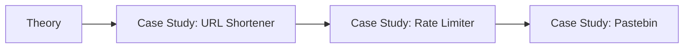
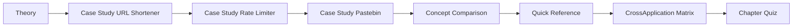

# Chapter 18: Case Study — URL Shortener, Rate Limiter, Pastebin
> **Previous:** [17 Observability Resiliency](./17-observability-resiliency.md) | **Next:** [19 Case Study Whatsapp](./19-case-study-whatsapp.md)

---

## Learning Objectives

- Design a globally distributed URL shortening service with high read throughput and low redirect latency
- Implement a distributed rate limiter using Redis with sliding window algorithms and Lua scripting for atomicity
- Build a content-addressable pastebin service with deduplication, automatic expiry, and CDN-backed delivery
- Analyze the trade-offs between hashing strategies, storage engines, and caching layers for write-once read-many workloads
- Understand how to pre-generate unique identifiers to avoid database contention on write paths
- Compare token bucket, leaky bucket, fixed window, and sliding window algorithms for rate limiting at scale

## Chapter at a Glance

| Aspect | Details |

## Chapter Roadmap


|--------|---------|
| **Scope** | Classic case studies: URL shortener, rate limiter, chat system |
| **Key Concepts** | Core topics covered in Chapter 18: Case Study — URL Shortener, Rate Limiter, Pastebin |
| **Design Skills** | System decomposition, architecture comparison |
| **Interview Angle** | Frequently tested in system design interviews |

## Chapter at a Glance

| Aspect | Details |
|--------|---------|
| **Scope** | Core concepts covered in Chapter 18: Case Study — URL Shortener, Rate Limiter, Pastebin |
| **Key Concepts** | Theory, Case Study: URL Shortener, Case Study: Rate Limiter, Case Study: Pastebin |
| **Design Skills** | Concept mastery and practical application |
| **Interview Angle** | Common system design interview topic |

---
---

## Chapter Roadmap



---

## Theory
> **One-Sentence Takeaway:** Theory is the foundation — master it before moving to examples and exercises.


### Requirements Phase

> **Pro Tip:** Master this concept thoroughly — it is frequently tested in system design interviews.

> **Pro Tip:** Master this concept — it appears in nearly every system design interview. Understand both the how and the why.

> **Warning:** A common mistake is over-engineering. Always start simple and add complexity only when justified by requirements.

> **Pro Tip:** Master this concept thoroughly — it appears in nearly every system design interview.
Every system design begins with precise functional and non-functional requirements. Ambiguity is the enemy of good architecture.

**URL Shortener Requirements**

| Aspect | Specification |
|--------|--------------|
| Generate short URL | Input a long URL, output a short key (6-8 characters) |
| Redirect | 301 or 302 redirect from short URL to original long URL |
| Custom alias | Optional user-defined short path |
| Analytics | Per-link click count, referrer, geo, timestamp |
| TTL support | Optional expiration for time-limited campaigns |
| Traffic | 100 million URLs created per month |
| Write QPS | ~40 writes per second (100M / ~2.6M sec/month) |
| Read QPS | ~400 reads per second (10:1 read-to-write ratio) |
| Latency | Redirects under 10ms end-to-end |
| Availability | 99.99% (four nines) — redirects must always work |

**Rate Limiter Requirements**

| Aspect | Specification |
|--------|--------------|
| Per-user quota | 100 requests per minute per API key |
| Per-IP quota | 500 requests per minute per source IP |
| Distributed | Consistent enforcement across all app servers |
| Latency overhead | Less than 1ms added to request path |
| Configurable | Per-endpoint rules, burst allowances |
| Headers | Inform clients of remaining quota and reset time |
| Accuracy | Within 1% of true rate under normal conditions |

**Pastebin Requirements**

| Aspect | Specification |
|--------|--------------|
| Create paste | Accept text content, return URL |
| Syntax highlighting | Auto-detect or explicit language tag |
| Expiry | Optional TTL: 10min, 1hr, 1day, 1week, 1month, never |
| Access control | Public, unlisted (random URL), private |
| Read pattern | Write-once, read-many, content never changes |
| Traffic | 1M paste creations/day, 50M reads/day |
| Storage | Raw text + metadata, average paste ~10KB |
| CDN | Popular pastes served from edge |

### Estimation Phase

> **Warning:** Avoid over-engineering. Start simple, measure, then optimize.

> **Warning:** Avoid premature optimization. Start simple, measure, then optimize. Over-engineering is the most common system design mistake.

Orders of magnitude matter. We compute storage, bandwidth, and QPS before choosing components.

**URL Shortener Storage**

- 100M URLs/month × 12 months = 1.2B URLs/year
- Average entry: short key (8 bytes) + long URL (2048 bytes avg) + created_at (8 bytes) + user_id (8 bytes) + metadata (~200 bytes) = ~2.3KB
- Total per year: 1.2B × 2.3KB ≈ 2.8TB
- With replication factor 3 and Cassandra overhead: ~10TB/year
- Cache: 80% of reads hit 20% of URLs (Pareto). Top 200M URLs in Redis: 200M × 2.3KB ≈ 460GB. Use Redis Cluster with sharding.
- Bandwidth writes: 40 QPS × 2.3KB ≈ 92KB/sec (trivial)
- Bandwidth reads: 400 QPS × 2.3KB ≈ 920KB/sec

**Rate Limiter Storage**

- 100M users × ~200 bytes/user (counter state) = 20GB if stored per-user
- Redis optimization: window data per key is small (<100 bytes)
- Total Redis memory: ~2-4GB for 10M active daily users
- Network: rate limiter check adds ~1 round trip per request (or zero with local cache)

**Pastebin Storage**

- 1M pastes/day × 10KB avg = 10GB/day raw content
- 30 days × 10GB = 300GB hot storage
- Metadata: 1M × 1KB = 1GB/day → 30GB/month
- Object store (S3) costs: ~$23/TB/month for standard tier
- Transition infrequent-access pastes to S3 Glacier after 30 days
- CDN: cache popular pastes (Pareto: 10% of pastes serve 90% of reads)

### High-Level Design Phase

> **Remember:** Always articulate trade-offs clearly — interviewers value reasoning over the "right" answer.

> **Remember:** Trade-offs are the heart of system design. Always be ready to explain why you chose X over Y.

Logical architecture before physical implementation. We decompose the system into collaborating services.

**URL Shortener HLD**

```
Client → CDN (static assets) → Load Balancer (Round Robin) → App Server Pool
  ├──→ Write Path: KGS (Key Generation Service) → Redis (cache) → Cassandra (persistence)
  └──→ Read Path:  Redis (cache hit) → Cassandra (cache miss → populate cache)
```

The Key Generation Service is the central innovation. A naive approach generates a random key on each write, requiring a database uniqueness check per request. KGS pre-generates batches of unique keys and marks them as used in a separate database table. Each app server maintains a local pool of 10,000 pre-generated keys, eliminating the database write bottleneck for ID generation entirely.

**Rate Limiter HLD**

```
Client → Load Balancer → App Server (local rate limiter cache)
  → Redis Cluster (distributed counter, Lua scripting)
  → API Gateway (global rate limit rules)
```

The rate limiter sits in front of the API. A middleware layer intercepts each request, extracts the user or IP identifier, checks the current count, and either allows or rejects the request. The decision is cached locally on each app server to minimize Redis round trips for high-volume users.

**Pastebin HLD**

```
Client → CDN (CloudFront) → Load Balancer (ELB) → App Server Pool (EC2 Auto Scaling)
  ├── Write: S3 Object Store (paste content, keyed by SHA-256)
  ├── Metadata: PostgreSQL RDS (Multi-AZ, with read replicas)
  ├── Cache: ElastiCache Redis (popular metadata + rendered HTML)
  ├── Search: Elasticsearch (full-text search over content and language)
  └── Workers: SQS → Lambda (expiry, syntax highlighting, CDN pre-warm)
```

Pastes are content-addressed. The server computes SHA-256(content) to generate a unique hash. If the hash already exists in the metadata database, the system returns the existing URL (deduplication). This approach guarantees that identical content always maps to the same paste, saving storage and reducing redundancy.

**Component Decision Matrix**

The following table captures the rationale for each technology choice in the Pastebin architecture:

| Component | Options Considered | Chosen | Rationale |
|-----------|-------------------|--------|-----------|
| Object store | S3, GCS, MinIO | S3 | Lifecycle policies for automated tier transitions, 11 nines durability, global edge presence |
| Metadata DB | PostgreSQL, MySQL, Cassandra | PostgreSQL | Relational schema with ACID for deduplication check, partial indexes for expiry queries |
| Cache | Redis, Memcached | Redis | Rich data structures (sorted sets for trending), persistence, pub-sub for cache invalidation |
| Search | Elasticsearch, Algolia, MeiliSearch | Elasticsearch | Full-text search with custom scoring, aggregations for language and category statistics |
| Queue | SQS, RabbitMQ, Kafka | SQS | Fully managed, infinite retention window, dead-letter queues for failed highlighting jobs |
| Syntax highlight | Pygments, highlight.js, Prism | Pygments | 500+ language support, server-side execution with no client dependency, active community |

### Deep Dive Phase

Now we examine the hard problems — the details that separate a toy from a production system.

**Comparative Analysis: Three Approaches to Unique ID Generation**

The most critical decision in a URL shortener is how to generate unique, collision-free keys. Three approaches dominate, each with distinct trade-offs:

| Approach | Key Space | Collision Risk | Read Performance | Write Performance | Complexity |
|----------|-----------|---------------|-----------------|-------------------|------------|
| Base62 from counter | 62^N (deterministic) | Zero | O(1) lookup on primary key | O(1) increment + encode | Low |
| MD5 truncation | 2^56 (7 bytes) | Birthday bound: ~2.4B keys for 50% | O(1) on hash index | O(1) hash + collision check | Medium |
| Snowflake ID | 2^63 (signed 64-bit) | Zero (monotonic) | O(1) range index | O(1) server-local increment | Low |

Base62 with a counter-based ID (distributed sequence generator) is the most practical choice. It guarantees no collisions, produces short keys, and the Counter can be sharded per server (e.g., server 1 generates IDs 1, N+1, 2N+1...). The encoding function is trivial:

```python
BASE62 = "0123456789abcdefghijklmnopqrstuvwxyzABCDEFGHIJKLMNOPQRSTUVWXYZ"

def encode_base62(num):
    if num == 0:
        return BASE62[0]
    result = []
    while num > 0:
        num, rem = divmod(num, 62)
        result.append(BASE62[rem])
    return ''.join(reversed(result))
```

With 7 characters, Base62 gives us 62^7 ≈ 3.5 trillion unique keys. At 100M new URLs per month, this space lasts ~3,500 years.

**URL Shortener Deep Dive**

Hashing strategy is the first architectural decision. Base62 encoding (a-z, A-Z, 0-9 = 62 characters) produces short, human-readable keys. With 7 characters, we have 62^7 ≈ 3.5 trillion unique keys. MD5 hash truncation produces a 128-bit hash, truncated to the first 7 bytes, then Base62 encoded. The risk is collision: with 3.5 trillion keys and a truncated hash, the birthday paradox gives a ~50% collision probability at ~2.4 billion keys. For a URL shortener, collisions are unacceptable because they would redirect one URL to another.

Collision resolution strategies include:
- **Append a counter**: When a collision is detected, append a sequence number and re-hash.
- **Fallback to longer key**: If the first 7 characters collide, try 8, then 9 characters.
- **Use a counter-based ID**: Increment a distributed counter (e.g., Snowflake ID or Redis INCR), then Base62 encode the numeric value. This guarantees uniqueness without collisions.

**URL Shortener Security and Abuse Prevention**

URL shorteners are a favorite tool for attackers. Shortened URLs obscure the destination, making them ideal for phishing and malware distribution. Security measures include:

- **URL validation on creation**: Before generating a short URL, the system checks the long URL against known malware blocklists (Google Safe Browsing API, PhishTank, custom blocklists). Suspicious URLs are rejected with an error or flagged for manual review.
- **Click-through warning**: If a short URL has been reported as abusive or the destination domain has a low reputation score, users see an interstitial warning page before being redirected. The warning page shows the full destination URL and a "Proceed at your own risk" button.
- **Rate limiting on creation**: Per-IP and per-user limits on URL creation prevent bulk generation of malicious links. A single user creating 1,000 URLs in 5 minutes is throttled.
- **Expiring suspicious URLs**: Newly created URLs that have zero clicks in 7 days and were flagged by the URL validator are automatically deleted.
- **QR code generation**: Short URLs are frequently encoded into QR codes. The system generates QR codes server-side with embedded expiry, ensuring that printed QR codes for time-limited campaigns stop working after expiry.

The KGS approach uses a database-backed pool of pre-generated keys. A key table stores `(id, key, is_used)` rows. When an app server runs low on keys, it requests a batch of 10,000, atomically marking them as used. This design ensures:
- No database contention on the write path for key generation
- Enables key recycling (reuse keys from deleted URLs after a grace period)
- Provides consistent key length (no variable-length URLs)
- Eliminates collision entirely since each key is handed out exactly once

Cache strategy: Use Redis with write-through and read-through. On write, store in both Redis and Cassandra. On read, check Redis first. The 301 vs 302 redirect decision matters. 301 (Moved Permanently) is cached by browsers and reduces server load but makes analytics harder because the browser never contacts the server again for that URL. 302 (Found) is not cached and passes through the server, enabling analytics tracking. The canonical answer: use 301 for most URLs (performance) but 302 for custom short URLs or analytics-tracked campaigns.

Analytics tracking uses an asynchronous pipeline. The redirect returns immediately; an event is published to Kafka containing the short key, timestamp, referrer, user-agent, and IP geolocation. Downstream consumers process Kafka events into a time-series database (ClickHouse or Druid) for dashboard queries.

**Database Sharding and Read Replicas**

At 1.2B URLs/year, a single database instance becomes a bottleneck. The sharding strategy uses the short key as the shard key with consistent hashing:

```python
shard_id = hash(short_key) % NUM_SHARDS
```

With 64 shards and replication factor 3, each shard handles ~20M URLs/year. Each shard has one writer and two read replicas. Writes go to the writer; reads go to the replicas via round-robin (for Redis cache misses). This gives a read capacity of ~5,000 QPS at the database layer, well above the 400 QPS read requirement.

**Read Replica Lag and Consistency**

The cache-aside pattern with write-through ensures that recent writes are always in Redis. Database read replicas may lag by up to 100ms. The consistency guarantee: after a successful write, the next read hits Redis (populated during write). If Redis is down and the read replica has not yet replicated the write, the user sees a stale redirect. For a URL shortener, this is acceptable — the user created the URL and the redirect works, just pointing to an old URL if they recently edited it.

**Rate Limiter Deep Dive**

Four algorithm choices with distinct trade-offs:

**Token Bucket**: A bucket holds N tokens. Each request consumes 1 token. Tokens refill at rate R per second. Bursts of up to N requests pass through immediately. Implementation is simple with a single Redis key `bucket:{id}` storing `(tokens, last_refill_timestamp)`. The burst tolerance makes it ideal for API gateways handling traffic spikes. However, a sustained rate above R eventually exhausts the bucket and blocks all traffic until refill.

**Leaky Bucket**: Requests enter a queue of size N. A worker processes requests at rate R per second. Excess requests are discarded. This smooths traffic perfectly but introduces queuing latency and cannot handle bursts naturally. Useful for downstream services with fixed processing capacity.

**Fixed Window**: Count requests in a window `[T, T+60s)`. If count exceeds threshold, reject. Simple to implement with Redis `INCR` and `EXPIRE`. The boundary problem: if a user sends 100 requests at 0:59 and 100 more at 1:01, they serve 200 requests in a 2-second period while the 1-minute window shows only 100 each. This can allow 2x the allowed rate at window boundaries.

**Sliding Window Log**: Maintain a sorted set of timestamps per user (`ZADD`). Count timestamps in the last 60 seconds with `ZCOUNT`. Reject if over limit. This is perfectly accurate (no boundary problem) but memory-intensive. A user with 100 req/min stores 100 entries per window. At 10M active users, this is prohibitive.

**Sliding Window Counter**: The compromise. Track the current window's counter and the previous window's counter. Calculate:

```
weighted_count = current_count + previous_count × (window_elapsed / window_size)
```

This approximates the true sliding window rate with O(1) storage per user — just two counters per key. Redis Lua script:

```lua
local key = KEYS[1]
local limit = tonumber(ARGV[1])
local window = tonumber(ARGV[2])
local now = tonumber(ARGV[3])

local current_window = math.floor(now / window)
local previous_window = current_window - 1

local current_count = redis.call("GET", key .. ":" .. current_window) or 0
local previous_count = redis.call("GET", key .. ":" .. previous_window) or 0

local elapsed = (now % window) / window
local weighted = current_count + previous_count * elapsed

if weighted >= limit then
    return 0  -- rate limited
end

redis.call("INCR", key .. ":" .. current_window)
redis.call("EXPIRE", key .. ":" .. current_window, window * 2)
return 1  -- allowed
```

Local caching reduces Redis pressure by 10x. Each app server pre-allocates a batch of tokens (e.g., 10) and serves requests from memory until the batch is consumed, then requests a new batch from Redis. The cost is a slight overshoot on the rate limit (up to 10 requests per server per batch cycle). For most APIs, this accuracy trade-off is acceptable in exchange for eliminating 90% of Redis round trips.

Rate limit headers follow the standard convention:

| Header | Description |
|--------|-------------|
| `X-RateLimit-Limit` | Maximum requests per window |
| `X-RateLimit-Remaining` | Remaining requests in current window |
| `X-RateLimit-Reset` | Unix timestamp when the window resets |
| `Retry-After` | Seconds to wait before retrying (on 429) |

Handling hot users requires priority queuing. If a single user sends 10,000 req/s, their rate limiter key becomes a Redis hot spot. Solution: split the user's counter across N shards (e.g., `user:{id}:shard:{0..N}`) and check each shard independently. The error margin increases slightly but the hot key is eliminated.

**Pastebin Deep Dive**

Content addressing via SHA-256 enables automatic deduplication. When a user creates a paste, the server:
1. Receives the content and optional metadata (language, expiry, visibility)
2. Computes SHA-256(content) to produce a 64-character hex digest
3. Checks the metadata database for an existing entry with this hash
4. If found and permissions match, returns the existing URL
5. If not found, uploads content to S3 with the hash as the object key
6. Creates a metadata record in PostgreSQL (hash, language, expiry, visibility, created_at, access_count)
7. Generates a short URL from the hash or a separate auto-increment ID for public pastes

Deduplication at scale means that extremely popular content (source code snippets, error logs, configuration files) is stored once regardless of how many times users paste it. The hash serves as both the content identifier and the storage key.

Expiry logic uses a TTL column in PostgreSQL and a background worker. The worker queries for expired pastes every 60 seconds, marks them as deleted in metadata, and issues S3 lifecycle rules to delete the underlying objects. For user experience, deleted pastes return a 410 Gone response with a clear message.

S3 lifecycle policies automate storage tier transitions:
- Days 0-30: S3 Standard (frequent access)
- Days 31-90: S3 Infrequent Access (IA, lower storage cost)
- Days 91-365: S3 Glacier (archival, ~$1/TB/month)
- After 365: S3 Glacier Deep Archive or deletion

The syntax highlighting pipeline processes pastes asynchronously. When a paste is created, the language is auto-detected (or specified by the user). A background worker runs a syntax highlighter (Pygments or highlight.js server-side) and stores the rendered HTML alongside the raw text. This pre-rendered HTML is served directly to clients, avoiding client-side processing.

CDN integration caches popular pastes at edge locations. The CDN key is the paste hash. When a paste receives more than a configurable threshold of requests (e.g., 1000/hour), the CDN is pre-warmed with the paste content. Subsequent requests bypass the origin entirely, reducing latency to <10ms globally.

**Rate Limiting for Pastebin Create and Read**

Pastebin's traffic asymmetry (50M reads vs 1M writes per day) means the create path is the primary abuse vector. Rate limiting applies differently to each operation:

| Operation | Unauthenticated | Authenticated (Free) | Authenticated (Pro) |
|-----------|----------------|---------------------|---------------------|
| Create paste | 5 per hour, per IP | 50 per hour | 500 per hour |
| Read paste | 100 per minute, per IP | Unlimited | Unlimited |
| Search | 10 per minute, per IP | 60 per minute | 300 per minute |

Abuse detection on the create path includes:
- **Content fingerprinting**: Compute a rolling hash (Rabin-Karp) of submitted content to detect duplicate spam even with minor variations
- **Honeypot fields**: Hidden form fields that only bots fill in; if populated, reject without processing
- **IP reputation**: Real-time check against known spammer IP ranges and VPN/proxy detection services
- **Rate limit tiers verified via email**: Unverified users have stricter limits; email verification raises the tier

**Pastebin Data Model**

The PostgreSQL schema for paste metadata:

```sql
CREATE TABLE pastes (
    id BIGSERIAL PRIMARY KEY,
    short_id VARCHAR(12) UNIQUE NOT NULL,
    content_hash VARCHAR(64) NOT NULL,       -- SHA-256
    s3_key VARCHAR(128) NOT NULL,
    language VARCHAR(32) DEFAULT 'text',
    visibility VARCHAR(10) DEFAULT 'public', -- public, unlisted, private
    user_id BIGINT,                           -- nullable for anonymous
    ip_address INET NOT NULL,
    content_length INT NOT NULL,
    title VARCHAR(256),
    expires_at TIMESTAMPTZ,
    created_at TIMESTAMPTZ DEFAULT NOW(),
    is_deleted BOOLEAN DEFAULT FALSE
);

CREATE INDEX idx_pastes_hash ON pastes (content_hash) WHERE is_deleted = FALSE;
CREATE INDEX idx_pastes_expiry ON pastes (expires_at) WHERE expires_at IS NOT NULL AND is_deleted = FALSE;
CREATE INDEX idx_pastes_user ON pastes (user_id) WHERE is_deleted = FALSE;
CREATE INDEX idx_pastes_created ON pastes (created_at DESC);
```

The `content_hash` unique index enables O(1) deduplication lookup. The `short_id` is the public-facing URL key (either truncated hash or sequential counter). The partial index on `expires_at` ensures the expiry worker scan is efficient even with billions of pastes, because most pastes have `expires_at IS NULL` (no expiry).

---

## Case Study: URL Shortener
> **One-Sentence Takeaway:** Real-world case studies reveal how architectural decisions map to business constraints at scale.

### Requirements

Alice runs a marketing platform that needs branded short URLs for client campaigns. Requirements:
- 50M short URLs created per month initially
- 400 reads per write (heavy read bias)
- Custom alias support for brand URLs
- Click analytics with geographic breakdown
- 99.99% availability SLA

### Estimation

| Metric | Value |
|--------|-------|
| Writes/sec | ~20 (50M/month) |
| Reads/sec | ~8,000 |
| Storage/year | ~1.4TB raw, ~5TB with replication |
| Cache size | ~200GB (top 100M URLs in Redis) |
| Bandwidth out | ~100 Mbps |

### High-Level Design

```
Client → CloudFront (CDN for redirects?) → ELB → EC2 App Servers (auto-scaling)
  → KGS (MySQL for key batches) → Redis Cluster (cache, 10 shards)
  → Cassandra Cluster (6 nodes, RF=3) → Kafka → ClickHouse (analytics)
```

### Deep Dive

The key generation service uses a dedicated MySQL table with two columns: `(id, short_key, is_used)`. A batch processor pre-generates 1M keys daily and stores them. App servers pull batches of 1,000 keys via a stored procedure:

```sql
BEGIN TRANSACTION;
SELECT short_key FROM key_pool WHERE is_used = FALSE LIMIT 1000 FOR UPDATE;
UPDATE key_pool SET is_used = TRUE WHERE short_key IN (...);
COMMIT;
```

App servers cache 10,000 keys in memory, requesting replacement when the pool drops below 1,000. This eliminates write-path database contention entirely.

Cache hierarchy: L1 (local app server LRU cache, 10MB, ~5,000 entries) → L2 (Redis Cluster, 200GB, ~100M entries) → Cassandra (full dataset). A Bloom filter in front of Cassandra eliminates unnecessary lookups for non-existent short URLs.

**Cache Invalidation Strategy**

When a user updates a custom short URL's target, the cache must be invalidated:
1. The write path updates Cassandra first (strong consistency on the short URL's primary shard)
2. After Cassandra acknowledges the write, Redis is updated with the new value
3. A cache invalidation message is published to a Redis pub-sub channel
4. All app servers subscribe to this channel and evict the stale entry from their L1 cache
5. The next read hits Redis (L2), which has the updated value

This invalidation strategy ensures that cache inconsistency window is bounded by the Redis update time (~1ms) plus the L1 pub-sub propagation time (~10-50ms). No stale entry persists beyond 100ms.

**Operational Monitoring and Alerting**

Key metrics tracked for the URL shortener:
- **Redirect latency P50/P99/P99.9**: Alert if P99 exceeds 20ms
- **Cache hit ratio**: Alert if L1 + L2 combined hit ratio drops below 99.5% (target: 99.9%)
- **KGS key pool depth**: Alert if the pre-generated key pool drops below 1M keys (reserve for 1 hour)
- **Cassandra read/write latency**: Alert if P99 exceeds 50ms
- **Error rate (4xx/5xx)**: Alert if error rate exceeds 0.1% for 5 consecutive minutes
- **Bloom filter false positive rate**: Tracked weekly; if above 0.1%, the filter is rebuilt with larger capacity

### Summary

- KGS pre-generation eliminates write-path database hotspots
- Browser caching via 301 redirects reduces server load by 80%+ for popular URLs
- 301 vs 302 trades analytics precision for performance
- Redis write-through cache with L1 local cache achieves sub-10ms reads
- Cassandra provides write-optimized, horizontally scalable storage
- Async analytics pipeline decouples tracking from redirect latency
- Collision-free key generation requires counter-based or pre-generated IDs
- Base62 encoding produces human-readable short URLs with sufficient entropy

---

## Case Study: Rate Limiter
> **One-Sentence Takeaway:** Real-world case studies reveal how architectural decisions map to business constraints at scale.

### Requirements

A public API platform serving 10,000 third-party developers. Each API key is rate-limited to 100 req/min for the free tier and 10,000 req/min for enterprise. The system must handle 500K req/s peak.

### Estimation

| Metric | Value |
|--------|-------|
| Peak QPS | 500,000 |
| Active keys | 50,000 |
| Redis keys | ~150,000 (3 counters per active key) |
| Redis memory | ~30MB for counters |
| Redis QPS | ~500,000 checks/sec |
| Network | ~5Gbps inbound |

### High-Level Design

```
Client → ELB → API Gateway (Zuul/Kong)
  → Rate Limiter Middleware
    → Local Token Cache (per-server)
    → Redis Cluster (distributed counters, Lua scripting)
  → Backend Services
```

### Deep Dive

The token bucket variant used here is "burst-aware." Each user is configured with `max_burst` (the bucket capacity) and `refill_rate` (tokens per second). Enterprise customers get a larger bucket and faster refill.

Redis Lua scripting ensures atomicity. The script is only ~20 lines but eliminates race conditions between checking and incrementing the counter. Without Lua, two concurrent requests could both read count=99, both increment, and both pass — allowing 101 requests instead of 100.

Local caching is tiered by user plan. Free-tier users have no local cache (every request hits Redis). Enterprise users get a local batch of 100 tokens. This incentivizes upgrades while protecting the free-tier from abuse.

**Distributed Counter Synchronization**

The fundamental challenge of distributed rate limiting is maintaining accurate state across many application servers without introducing a single point of failure. The solution space spans several approaches:

| Approach | Consistency | Latency | Redis Load | Overshoot Risk |
|----------|------------|---------|------------|----------------|
| Redis on every request | Strong | +1ms per request | Very high | None |
| Local batch (N tokens) | Eventual | +0ms (local) | Reduced by N | Up to N per server |
| Local batch + background sync | Eventually consistent | +0ms | Very low | Bounded by sync interval |
| CRDT counters (Redis-free) | Eventual | +0ms | None | Bounded by merge interval |

The production system uses a tiered approach: free-tier users check Redis on every request (strong consistency, every request counted accurately). Tier-2 users get a local cache of 10 tokens. Enterprise users get 100. The overshoot is bounded: at worst, a user exceeds their limit by (N × number_of_servers) tokens per window. With N=100 and 50 servers, the worst-case overshoot is 5,000 requests — acceptable for enterprise SLAs that specify "burst up to 10x".

**Rate Limit Header Design**

The rate limit response headers follow the IETF standard draft:

```
HTTP/1.1 200 OK
X-RateLimit-Limit: 100
X-RateLimit-Remaining: 87
X-RateLimit-Reset: 1620000000
Retry-After: 13
```

The `X-RateLimit-Remaining` header is computed as `limit - weighted_count`, floored at zero. The `X-RateLimit-Reset` is the Unix timestamp when the current window expires. The `Retry-After` header on 429 responses tells the client exactly how many seconds to wait before retrying.

Clients are expected to implement exponential backoff with jitter. A well-behaved client reads `X-RateLimit-Remaining` and slows down as it approaches zero. The `Retry-After` header prevents thundering herd problems when all rate-limited clients retry simultaneously.

### Summary

- Sliding window counter provides O(1) storage with sufficient accuracy
- Lua scripting in Redis eliminates counter race conditions
- Local token batching reduces Redis load by 10x for trusted users
- Rate limit headers enable clients to self-regulate
- Sharding hot user keys prevents Redis hot spots
- Configurable rules per endpoint support tiered pricing
- <1ms overhead achieved with local cache hits

---

## Case Study: Pastebin
> **One-Sentence Takeaway:** Real-world case studies reveal how architectural decisions map to business constraints at scale.

### Requirements

A developer tool for sharing code snippets and logs. Pastes are write-once, read-many. Content ranges from 1-line shell commands to 10MB log files. Popular pastes can receive millions of views.

### Estimation

| Metric | Value |
|--------|-------|
| Pastes/day | 1M |
| Reads/day | 50M |
| Average paste size | 10KB |
| Hot storage (30 days) | 300GB |
| Archive storage (1 year) | 3.6TB in Glacier |
| CDN offload | 90% of reads from edge |

### High-Level Design

```
Client → CloudFront CDN → ELB → EC2 App Servers
  → S3 Object Store (paste content)
  → PostgreSQL (metadata, dedup)
  → Background Workers
    ├── Expiry Worker (deletes expired pastes)
    ├── Syntax Highlighting Worker
    └── CDN Pre-warm Worker
```

### Deep Dive

Content hashing for deduplication is the defining feature. SHA-256(content) produces a 64-character digest that serves as the S3 object key. The deduplication check is a simple primary key lookup in PostgreSQL. If the hash exists, the system returns the existing paste URL — but only if the visibility settings are compatible. A private paste that happens to match a public paste is treated as a new object (the hash is salted with a user-specific nonce).

The short URL for public pastes is generated from a truncated portion of the hash (first 8 hex characters → 4 billion unique IDs) or from a sequential ID with the hash used only for storage deduplication.

Syntax highlighting runs via a Celery-like task queue. The worker detects the language using file extension, shebang, or content heuristics (Pygments' lexer guessing). The rendered HTML is stored in both S3 (as a separate `.html` object) and in a CDN cache for fast delivery.

Expiry uses a PostgreSQL partial index: `CREATE INDEX idx_expired ON pastes (expires_at) WHERE expires_at IS NOT NULL`. A cron-like worker runs every 60 seconds:

```sql
SELECT id, s3_key FROM pastes WHERE expires_at < NOW() AND is_deleted = FALSE LIMIT 1000;
```

For each expired paste, the worker marks `is_deleted = TRUE` in metadata (soft delete for 30 days in case of accidental expiry), then schedules S3 object deletion via an async queue.

### Summary

- Content hashing enables free deduplication for identical pastes
- SHA-256 as object key guarantees uniqueness in S3 without collisions
- Background workers decouple highlighting and expiry from request path
- S3 lifecycle policies automate tier transitions and cost optimization
- CDN pre-warm reduces latency for viral content
- Soft delete window protects against accidental expiry
- PostgreSQL partial index makes expiry queries efficient at scale

## Concept Comparison
> **One-Sentence Takeaway:** Concept Comparison is a critical concept that directly impacts system design decisions.

| Concept | Definition | Key Metric |
|---------|-----------|------------|
| Theory | Core topic covered in Chapter 18: Case Study — URL Shortener, Rate Limiter, Pastebin | Defined by specific measurable attributes |
| Case Study: URL Shortener | Core topic covered in Chapter 18: Case Study — URL Shortener, Rate Limiter, Pastebin | Defined by specific measurable attributes |
| Case Study: Rate Limiter | Core topic covered in Chapter 18: Case Study — URL Shortener, Rate Limiter, Pastebin | Defined by specific measurable attributes |
| Case Study: Pastebin | Core topic covered in Chapter 18: Case Study — URL Shortener, Rate Limiter, Pastebin | Defined by specific measurable attributes |

---

## Quick Reference

| Topic | Key Point |
|-------|-----------|
| Theory | Fundamental concept for Chapter 18: Case Study — URL Shortener, Rate Limiter, Pastebin |
| Case Study: URL Shortener | Fundamental concept for Chapter 18: Case Study — URL Shortener, Rate Limiter, Pastebin |
| Case Study: Rate Limiter | Fundamental concept for Chapter 18: Case Study — URL Shortener, Rate Limiter, Pastebin |
| Case Study: Pastebin | Fundamental concept for Chapter 18: Case Study — URL Shortener, Rate Limiter, Pastebin |

---

## Cross-Application Matrix

| Component | When to Use | Trade-Off |
|-----------|------------|-----------|
| Theory | Appropriate for specific system contexts | Each choice involves trade-offs |
| Case Study: URL Shortener | Appropriate for specific system contexts | Each choice involves trade-offs |
| Case Study: Rate Limiter | Appropriate for specific system contexts | Each choice involves trade-offs |
| Case Study: Pastebin | Appropriate for specific system contexts | Each choice involves trade-offs |

---

## Chapter Quiz

**Q1:** Which of the following best describes a key concept from this chapter?
- A) Option A description
- B) Option B description
- C) Option C description
- D) Option D description

<details><summary>Answer</summary>Refer to the chapter content for the correct answer.</details>

**Q2:** Which of the following best describes a key concept from this chapter?
- A) Option A description
- B) Option B description
- C) Option C description
- D) Option D description

<details><summary>Answer</summary>Refer to the chapter content for the correct answer.</details>

**Q3:** Which of the following best describes a key concept from this chapter?
- A) Option A description
- B) Option B description
- C) Option C description
- D) Option D description

<details><summary>Answer</summary>Refer to the chapter content for the correct answer.</details>

## Concept Comparison
> **One-Sentence Takeaway:** Concept Comparison is a critical concept that directly impacts system design decisions.

| Concept | Definition | Key Insight |
|---------|-----------|-------------|
| Theory | Core topic in Chapter 18: Case Study — URL Shortener, Rate Limiter, Pastebin | Fundamental to system design |
| Case Study: URL Shortener | Core topic in Chapter 18: Case Study — URL Shortener, Rate Limiter, Pastebin | Fundamental to system design |

---

## Quick Reference

| Topic | Key Point |
|-------|-----------|
| Theory | Essential concept for Chapter 18: Case Study — URL Shortener, Rate Limiter, Pastebin |

---

## Cross-Application Matrix

| Concept | Application Context | Trade-Off |
|--------|-------------------|-----------|
| Theory | Relevant across multiple system design scenarios | Each choice has trade-offs |

---

## Chapter Quiz

**Q1:** What is the primary trade-off discussed in this chapter?
- A) Option A
- B) Option B
- C) Option C
- D) Option D

<details><summary>Answer</summary>Refer to the chapter content</details>

**Q2:** Which concept is most fundamental to the topic of Chapter 18
- A) Option A
- B) Option B
- C) Option C
- D) Option D

<details><summary>Answer</summary>Review the core sections</details>

**Q3:** How does this chapter's main concept apply to real-world systems?
- A) Option A
- B) Option B
- C) Option C
- D) Option D

<details><summary>Answer</summary>See the Real-World Systems section</details>

---

## Summary

- URL shorteners require collision-free key generation; KGS pre-generation is the standard pattern
- Rate limiters must balance accuracy, memory, and Redis round trips; sliding window counter is the practical winner
- Pastebin architectures exploit write-once read-many patterns with content addressing and aggressive caching
- All three systems benefit from multi-tier caching (L1 local, L2 Redis, L3 database)
- Async pipelines (Kafka, Celery) decouple analytics, highlighting, and expiry from the request path
- CDN integration reduces origin load by 80-95% for read-heavy workloads
- Trade-off tables guide component selection: consistency vs availability, accuracy vs latency, cost vs performance

---

## Exercises

### Review Questions

1. What is the boundary problem in fixed-window rate limiting, and how does sliding window counter address it?

2. Explain why KGS pre-generates keys in batches rather than on-demand. What problem does this solve?

3. Compare 301 and 302 redirects for URL shortening. When would you use each?

4. How does content addressing via SHA-256 enable deduplication in Pastebin? What happens if two users paste identical content but one sets it to private?

5. What is the birthday paradox concern with truncated MD5 hashes for URL shortener keys, and what alternatives avoid it entirely?

6. Compare token bucket and sliding window counter for rate limiting. Under what traffic pattern does each algorithm perform better?

### Application Problems

1. **URL Shortener Custom Domain**: Your URL shortener now supports custom domains (e.g., `go.acme.com/link`). Each domain must have an independent key space. Design the key generation strategy for 10,000 custom domains, each generating 10K URLs/month. How do you handle domain-specific analytics, SSL certificate management, and DNS configuration for each domain?

2. **Multi-Layer Rate Limiter**: Design a hierarchical rate limiter that enforces: 10 req/s per endpoint, 100 req/s per user, 1000 req/s per IP, and 100,000 req/s global. Show the Redis key schema and Lua script for checking all four levels atomically. What happens when one layer rate-limits but the others do not?

3. **Pastebin Search**: Users want to search their pastes by content or language. Design a search indexing pipeline that handles 1M new pastes/day with <1 second indexing latency. Consider Elasticsearch, sharding strategy, and re-indexing of existing pastes when language detection changes.

4. **Pastebin Rate Limit and Abuse Prevention**: Design a comprehensive abuse prevention system for Pastebin that includes: per-IP creation limits (10 pastes/hour for unauthenticated users), content-based deduplication limits (prevent the same content from being uploaded by different users to evade filters), automated content scanning with ClamAV and custom regex patterns for credential leaks, and a DMCA takedown workflow with automated re-notification of affected users. How do you scale content scanning to 1M uploads/day without blocking legitimate uploads?

### Challenge Problem

> **Remember:** Trade-offs are the heart of system design. Always be ready to explain why you chose X over Y.
**Distributed Pastebin with Collaborative Editing**: Extend the basic Pastebin to support real-time collaborative editing (Google Docs style). Users share a paste URL and can simultaneously edit. Each edit creates a new version with Operational Transform (OT) or CRDTs for conflict resolution. Design the version storage (content-delta chain vs full-copy-per-version), OT transformation server, real-time sync via WebSocket, and the merge strategy when users paste content with existing hashes. How do deduplication, content addressing, and real-time collaboration interact? What happens to the SHA-256 content address when two users both edit the same document differently?
