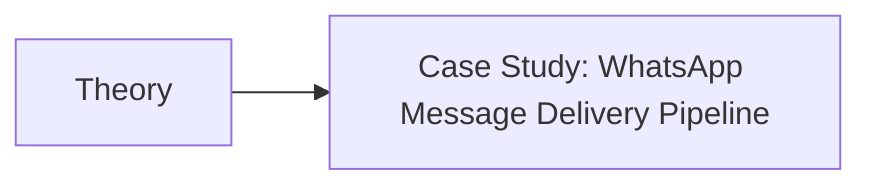
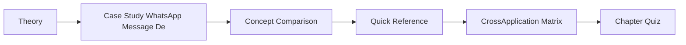
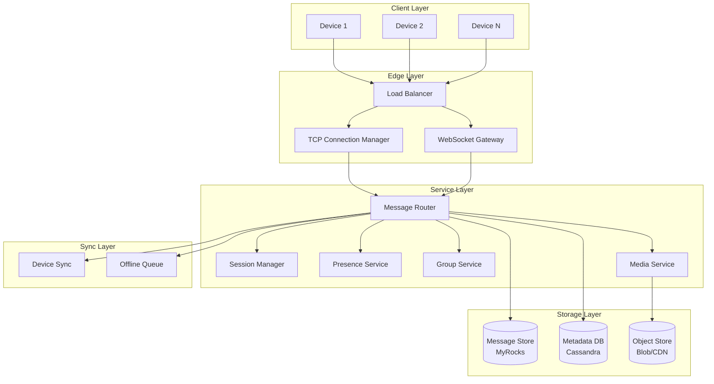
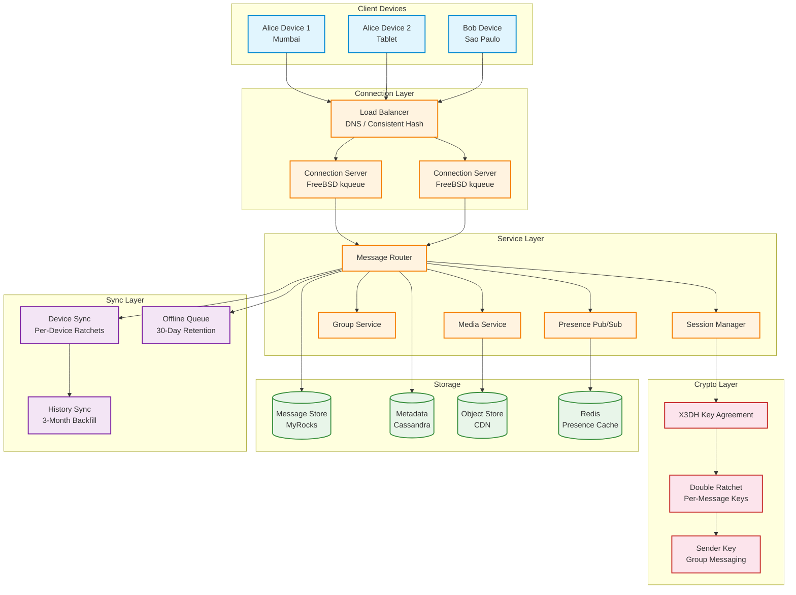

# Chapter 19: Case Study — WhatsApp and Real-Time Messaging
> **Previous:** [18 Case Studies Classic](./18-case-studies-classic.md) | **Next:** [20 Case Study Netflix](./20-case-study-netflix.md)

---

## Learning Objectives

- Design a real-time messaging system supporting 2B+ users with under 100ms delivery latency
- Analyze message fan-out strategies for group chats: fan-on-write vs fan-on-read vs hybrid approaches
- Implement end-to-end encryption using the Signal Protocol including X3DH key agreement and Double Ratchet
- Architect persistent TCP connection management at massive scale with FreeBSD kqueue and connection multiplexing
- Design multi-device synchronization with per-device Ed25519 key pairs and message history sync protocols
- Evaluate the trade-offs between server-side message storage, offline message queuing, and delivery semantics

## Chapter at a Glance

| Aspect | Details |

## Chapter Roadmap


|--------|---------|
| **Scope** | WhatsApp architecture: Erlang, custom server, E2E encryption, 2B users |
| **Key Concepts** | Core topics covered in Chapter 19: Case Study — WhatsApp and Real-Time Messaging |
| **Design Skills** | Real-time messaging, E2E encryption, Erlang/OTP patterns |
| **Interview Angle** | Frequently tested in system design interviews |

## Chapter at a Glance

| Aspect | Details |
|--------|---------|
| **Scope** | Core concepts covered in Chapter 19: Case Study — WhatsApp and Real-Time Messaging |
| **Key Concepts** | Theory, Case Study: WhatsApp Message Delivery Pipeline, Concept Comparison, Quick Reference |
| **Design Skills** | Concept mastery and practical application |
| **Interview Angle** | Common system design interview topic |

---
---

## Chapter Roadmap



---

## Theory
> **One-Sentence Takeaway:** Theory is the foundation ? master it before moving to examples and exercises.


### Requirements Phase


> **Pro Tip:** Master this concept thoroughly ? it is frequently tested in system design interviews.

> **Pro Tip:** Master this concept ? it appears in nearly every system design interview. Understand both the how and the why.

> **Warning:** A common mistake is over-engineering. Always start simple and add complexity only when justified by requirements.

> **Pro Tip:** Master this concept thoroughly ? it appears in nearly every system design interview.
WhatsApp processes over 100 billion messages daily across 2 billion+ users. Understanding these requirements is essential before any design work begins.

**Functional Requirements**

| Requirement | Specification |
|-------------|---------------|
| Direct messaging | 1:1 text, images, video, documents, voice notes |
| Group messaging | Up to 1024 members per group |
| Broadcast lists | One-to-many message distribution |
| End-to-end encryption | Default for all content, including group messages |
| Multi-device | Up to 4 devices per account, independent connection |
| Voice/video calls | Peer-to-peer with relay fallback (STUN/TURN) |
| Status/Stories | 24-hour disappearing photo/video updates |
| Media sharing | Inline images, videos up to 16MB, documents up to 100MB |
| Last seen/Read receipts | Visible presence indicators, configurable privacy |
| Offline messages | Server-side queuing, delivery on reconnection |
| Message sync | Cross-device history synchronization |

**Non-Functional Requirements**

| Aspect | Specification |
|--------|--------------|
| Scale | 2B+ users, 100B+ messages/day |
| Peak throughput | 1M+ messages/sec during global events |
| Delivery latency | <100ms median, &lt;500ms P99 |
| Availability | 99.999% (five nines) for messaging |
| Durability | No message loss once acknowledged by server |
| Consistency | Messages delivered in order within a conversation |
| Security | End-to-end encrypted by default, zero-knowledge server |
| Storage | Messages stored only until delivered across all devices |

### Estimation Phase


> **Warning:** Avoid over-engineering. Start simple, measure, then optimize.

> **Warning:** Avoid premature optimization. Start simple, measure, then optimize. Over-engineering is the most common system design mistake.

**Message Volume**

- 100B messages/day = 1.16M messages/sec average
- Peak: 3-5x average during holidays ? ~5M messages/sec
- Average message size: ~200 bytes (text) + media attachments
- Text data: 100B × 200 bytes = 20TB/day = 7.3PB/year
- Media: billions of images/videos per day, ~500MB-1PB/day depending on compression

**Connection Management**

- 2B users, ~30% online concurrently at peak = 600M concurrent connections
- Each connection: TCP socket (~20KB kernel memory) + app state (~50KB) = ~70KB
- Total server memory for connections: 600M × 70KB ˜ 42TB
- At 100K connections per server: 6,000 servers for connection handling alone
- FreeBSD kqueue handles 1M+ connections per well-tuned machine ? ~600 servers

**Storage Per User**

- Average conversation history: ~500MB over lifetime (text + media)
- 2B users × 500MB = 1EB total storage
- Each user's last 30 days of messages stored on server for multi-device sync
- Active users (~1.5B): 1.5B × 50MB (30 days text) ˜ 75PB hot storage
- Media stored in CDN/object store, deduplicated per hash

**Bandwidth**

- 1.16M msg/sec × 200 bytes = 232 MB/sec text
- Media adds 10-50x more bandwidth
- Total outbound: ~10-50 Gbps per datacenter
- Multi-datacenter replication: multiply by replication factor

### High-Level Design Phase


> **Remember:** Always articulate trade-offs clearly ? interviewers value reasoning over the "right" answer.

> **Remember:** Trade-offs are the heart of system design. Always be ready to explain why you chose X over Y.

The architecture evolved through distinct phases. Understanding the evolution is as important as the final design.

**Phase 1: Erlang/ejabberd (XMPP)**

WhatsApp was founded in 2009 using ejabberd, an Erlang-based XMPP server. Erlang's actor model (lightweight processes, message passing, supervision trees) was a natural fit for messaging. Each user session was an Erlang process. XMPP provided XML-based messaging, presence, and roster management out of the box.

Limitations discovered at scale:
- XMPP's XML parsing overhead became significant at billions of messages
- XML payloads added 5-10x overhead to message size
- XMPP extension complexity (XEPs) became unmanageable
- The ejabberd single-node queue model created bottlenecks

**Phase 2: Custom C++ Server with FreeBSD kqueue**

WhatsApp replaced ejabberd with a custom C++ server designed for maximum connection density. FreeBSD's kqueue event notification system was chosen over Linux epoll because:
- kqueue supports one-shot notifications (edge-triggered, no re-registration)
- Better handling of 1M+ concurrent connections with lower CPU overhead
- Superior sendfile integration for zero-copy data transfer
- The team had deep FreeBSD expertise (Jan Koum and Brian Acton came from Yahoo!)

The custom server architecture:

```
Client Device ? (Persistent TCP/WebSocket) ? WhatsApp Server (C++, FreeBSD)
  +-- Connection Manager (kqueue event loop, multiplexed sockets)
  +-- Session Manager (user state, presence, routing table)
  +-- Message Router (inbox routing, group fan-out, offline queue)
  +-- Media Handler (upload proxy, thumbnail generation)
  +-- Storage Layer (MyRocks, custom message store)
```

**Phase 3: Facebook Infrastructure (Post-2014)**

After the Facebook acquisition, WhatsApp migrated some backends to Facebook's infrastructure stack:
- Custom message store maintained but backed by Facebook's TAO (graph) and MyRocks (RocksDB + MySQL)
- ML models for spam detection using Facebook's AI infrastructure
- Content delivery via Facebook's global CDN network
- Infrastructure monitoring via Facebook's operational tooling

**Current Architecture (2024+)**



### Deep Dive Phase


**Message Store Design**

WhatsApp's message store is one of the least documented but most critical components. It must handle 100B messages/day while supporting:
- Per-user inbox/outbox with ordered message retrieval
- Multi-device sync (read from any device)
- Offline message queueing with per-message delivery status
- Deletion for everyone ("unsend")
- Message expiration (disappearing messages)

The store uses a custom MyRocks (RocksDB + MySQL) deployment with a specific schema designed for message ordering:

```sql
CREATE TABLE messages (
    user_id BIGINT NOT NULL,          -- recipient
    conversation_id BIGINT NOT NULL,  -- 1:1 or group identifier
    message_id BIGINT NOT NULL,       -- Snowflake-style global ID
    sender_id BIGINT NOT NULL,
    content_type TINYINT NOT NULL,    -- 0=text, 1=image, 2=video, 3=audio, 4=doc
    content_hash VARCHAR(64),         -- for media messages, references blob store
    encryption_key_id INT,            -- which pre-key bundle was used
    ciphertext BLOB NOT NULL,         -- Double Ratchet encrypted payload
    server_timestamp BIGINT NOT NULL,
    expires_at BIGINT,                -- NULL for permanent, epoch for disappearing
    delivery_status TINYINT DEFAULT 0,-- 0=sent, 1=delivered, 2=read
    PRIMARY KEY (user_id, conversation_id, message_id)
) PARTITION BY HASH(user_id) PARTITIONS 1024;
```

The partition key is `user_id`, ensuring all messages for a user are on the same physical shard. The compound primary key enables efficient range scans: `SELECT * FROM messages WHERE user_id = ? AND conversation_id = ? ORDER BY message_id DESC LIMIT 50`.

RocksDB's LSM-tree architecture provides excellent write throughput — critical for the spikey write patterns of messaging. Writes are sequential (append to memtable), and the sorted nature of the primary key means reads within a conversation are fast range scans on the same SST files.

For disappearing messages, the `expires_at` column enables a background compaction process. RocksDB's compaction filters can drop expired messages during normal compaction cycles, making deletion essentially free — the expired data is simply not written to the next SST level.

**Connection Management at Scale**

WhatsApp maintains a persistent TCP connection with each device. When the app is in the foreground, the connection is active. When backgrounded, the OS may suspend it, but WhatsApp uses platform-specific push APIs (FCM on Android, APNs on iOS) to wake the app.

The connection multiplexer on the server handles 100K-1M connections per machine:

```
struct connection {
    int fd;                    // socket descriptor
    uint64_t user_id;          // identifier for routing
    struct sockaddr_in6 addr;  // client address
    uint8_t state;             // CONNECTED, AUTHENTICATED, DISCONNECTING
    uint8_t *read_buf;         // read buffer (64KB)
    queue<message_t> outbox;   // pending outgoing messages
    uint64_t last_active;      // timestamp for keepalive
    uint8_t device_id;         // which device on the account
};
```

The kqueue event loop registers all socket descriptors and uses `kevent()` with EV_ONESHOT. Each event is dispatched to a worker thread pool. The one-shot mode means the event must be re-registered after processing, providing natural rate limiting and fairness across connections.

Connection affinity is achieved through DNS-based routing. Each user is mapped to a connection server via a consistent hash of their phone number (pre-decimalization) or user ID. This ensures all messages for a user route to the server holding their connection state.

WebSocket is used as a fallback for networks that block non-standard ports or have aggressive NAT timeouts. The protocol negotiation works:
1. Client attempts TCP connection on port 5222 (custom protocol)
2. If connection fails or times out, fall back to WebSocket on port 443
3. WebSocket connection uses standard TLS and passes through proxy/firewall

Long-polling is the last resort for severely degraded networks (e.g., China where WebSocket connections may be interrupted). The client polls for new messages every N seconds, and the server either responds immediately with queued messages or holds the connection open until a message arrives or timeout.

**Message Fan-Out Strategy**

Message routing is the core architectural decision. The three strategies are:

**Fan-on-Write (Small Groups)**

For 1:1 chats and groups with fewer than 32 members, when Alice sends a message:
1. Server receives the message from Alice's connection
2. Server writes one copy to Alice's outbox table
3. Server writes one copy to each recipient's inbox table
4. Server finds recipient connections and pushes messages

This is called "fan-on-write" because the work happens at write time. The inbox/outbox pattern is a classic database design from email systems. Each user has an inbox (messages addressed to them) and an outbox (messages they sent). The inbox acts as a message queue per user.

For a group of 32 members, one message produces 32 inbox writes plus the sender's outbox write. This is acceptable for small groups but becomes prohibitive for large groups.

**Fan-on-Read (Large Groups)**

For groups with 1024 members (WhatsApp's limit), fan-on-write would require 1024 inbox writes per message. Instead:

1. Server writes the message once to a group timeline (shared ordered log)
2. Each member reads from the group timeline independently
3. The timeline is indexed by `(group_id, message_id)` for efficient range queries

This is "fan-on-read": the write cost is O(1), but the read cost scales with group size. Each member must poll or be notified to read new messages from the timeline.

**Hybrid (Medium Groups)**

For groups of 32-256 members, WhatsApp uses a hybrid approach:
1. Message is written to the group timeline (one write)
2. Active members (currently connected) receive the message via their persistent connection with a "new message in group X" notification
3. The notification includes the group_id and message_id
4. The client reads the actual content from the group timeline on demand
5. Inactive members discover the message when they reconnect and sync

This hybrid approach:
- Reduces write amplification (one write per message instead of N)
- Eliminates read amplification for active members (pushed via connection)
- Provides exactly-once delivery semantics via message IDs and deduplication
- Handles bursty group activity without write-storming the inbox table

**message_id Generation**

Message IDs must be globally unique, monotonically increasing, and sortable by time. WhatsApp uses a 64-bit ID similar to Snowflake:

| Bits | Field | Description |
|------|-------|-------------|
| 41 | Timestamp | Milliseconds since epoch |
| 10 | Server ID | Data center + server within data center |
| 12 | Sequence | Per-server monotonic counter |

The 41-bit timestamp covers ~69 years. The 10-bit server ID supports 1024 servers. The 12-bit sequence allows 4096 messages per millisecond per server — sufficient for peak rates.

**End-to-End Encryption**

WhatsApp uses the Signal Protocol for end-to-end encryption. The protocol has three layers:

**X3DH Key Agreement** (Extended Triple Diffie-Hellman):
- Each user generates a long-term Curve25519 identity key pair `(IK_A, IK_B)`
- Each user pre-generates a set of signed pre-keys `(SPK_A, SPK_B)` and one-time pre-keys `(OPK_B)`
- When Alice wants to message Bob for the first time, she fetches Bob's pre-key bundle from the server
- Alice performs a DH exchange: `DH(IK_A, SPK_B) || DH(EK_A, IK_B) || DH(EK_A, SPK_B) || DH(EK_A, OPK_B)`
- The resulting shared secret `SK` is used as the root key for the Double Ratchet
- Bob's OPK is consumed (server deletes it) to prevent replays

The server is a "directory service" for pre-keys. It stores users' identity keys and pre-key bundles but cannot decrypt messages because it does not know any private keys.

**Double Ratchet** (Per-Message Keys):
- After X3DH establishes the root key `RK`, both sides initialize a sending ratchet and a receiving ratchet
- Each message derives a new message key using a KDF chain:
  - Root Key (RK) ? Chain Key (CK) ? Message Key (MK)
- The Diffie-Hellman ratchet provides forward secrecy: if a chain key is compromised, past message keys cannot be recovered
- The symmetric ratchet provides "break-in recovery": after compromise, a DH exchange with new ephemeral keys re-establishes security
- Each message includes the sender's current ephemeral public key and a message number

For a conversation with 100 messages per day, the double ratchet produces 200 new keys per day (one per message in each direction). The storage per conversation is minimal — just the current state of each ratchet chain.

**Secure Group Messaging** (Sender Keys):
- For groups, WhatsApp uses the Sender Key protocol (a push from the Signal Protocol)
- Each sender maintains a symmetric "sender key" for each group they belong to
- The sender key is distributed to all group members out-of-band (encrypted with pairwise double ratchet sessions)
- When Alice sends a group message, she encrypts with her sender key, and all recipients can decrypt
- When a member joins or leaves, all members generate new sender keys and distribute them
- This is more efficient than pairwise encryption: O(1) encryption per message (sender encrypts once) instead of O(N) (encrypt for each recipient)

**Group Chat**

Group management is a significant engineering challenge at WhatsApp's scale:

**Group Creation and Membership**:
- A group is created with `(group_id, creator_uid, member_set, admin_set, group_name, avatar, created_at)`
- Membership is stored as a sorted set in the metadata database
- Group updates (add/remove member, change name) are themselves encrypted messages with a special system message type
- System messages are processed by clients to update local group state

**Message History for New Members**:
- When a new member joins, they see only messages sent after joining
- The group timeline stores messages by `(group_id, message_id, server_timestamp)`
- New members start reading from their join timestamp
- For "history on join" scenarios, the server replays the last N messages from the timeline

**Admin Operations**:
- Admin-only messaging (only admins can send)
- Member approval (new members require admin approval)
- Temporary groups (disappearing after event)
- Group invite links (tokens that grant membership)

**Spam and Abuse Detection**

At 100B messages/day, spam detection must be automated, real-time, and privacy-preserving (messages are end-to-end encrypted, so content inspection is impossible). WhatsApp's approach relies entirely on metadata and behavioral patterns:

- **Behavioral signals**: Rate of new group creation, frequency of messaging unknown contacts, blast radius (how many non-contacts receive messages from a single user).
- **Account age**: New accounts that immediately broadcast to 100+ recipients are flagged. Phone numbers registered within the last 24 hours are restricted to messaging only contacts saved in the address book.
- **Forwarding limits**: Labeled forwarding ("Forwarded many times") is applied after a message chain exceeds 5 hops. Forwarding is restricted to one chat at a time after 100+ forwards.
- **Hardware attestation**: Android SafetyNet and iOS DeviceCheck attestations during registration prevent automated bulk account creation.
- **IP-based clustering**: Multiple registrations from the same IP range are correlated and flagged for manual review.

The detection pipeline computes a per-user abuse score every 5 minutes using a gradient-boosted model trained on labeled abuse patterns. Features include: messages per hour, unique recipients per day, groups joined per hour, and account age in hours. Users above threshold are "shadow banned" — their messages are delivered normally, but they are not notified of the restriction. This prevents abuse pattern adaptation.

**Two-Phase Registration**

Registration at WhatsApp scale requires defending against SMS verification abuse, SIM swapping, and bulk account creation:
1. **SMS verification**: 6-digit code sent via carrier SMS, valid for 5 minutes.
2. **Voice fallback**: Automated voice call reads the code if SMS is not delivered within 60 seconds.
3. **Rate limits**: Maximum 3 verification attempts per phone number per hour.
4. **VoIP blocking**: Phone numbers from known VoIP carriers (Google Voice, TextNow) are blocked.
5. **CAPTCHA**: Presented after repeated SMS delivery failures to prevent automated abuse of the voice fallback channel.

**Media Sharing**

Media messages follow a different flow than text:

1. Alice selects an image and presses send
2. The WhatsApp client uploads the image to blob storage (CDN) via a direct HTTPS upload
3. The upload generates an encrypted blob with an expiring URL (valid for 1 hour)
4. The server stores a mapping: `(media_hash ? encrypted_blob_url, thumbnail_url)`
5. The message sent to Bob contains only the media hash, encryption key (from Double Ratchet), and thumbnail
6. Bob's client receives the message, resolves the media hash to the CDN URL, and downloads the encrypted blob

Image compression happens on-device before upload:
- Images are compressed to ~100-200KB (from multi-MB originals)
- Resolution is reduced to 1600px on the longest edge
- WebP format for supported devices
- Thumbnails (100x100) are generated client-side for inline preview

Video compression:
- Limited to 16MB (earlier) now extended to 2GB for some regions
- H.264 encoding, 30fps, resolution capped at 720p for standard, 1080p for HD
- Streaming for large videos: byte-range requests from CDN

**Last Seen, Typing Indicators, Read Receipts**

Presence information is a real-time pub-sub problem:

- Each user's presence state is maintained in Redis: `presence:{user_id} ? {status, last_seen, device_list}`
- When a user connects, their online status is published to a Redis pub-sub channel
- Subscribers (contacts who have the user in their address book) receive the presence update via their persistent connection
- For large contact lists (up to 1000 contacts), presence is aggregated: the server batches presence updates and sends a single batch message

Typing indicators:
- Client sends a "typing" event on every keystroke (but throttled to 1 per 2 seconds)
- Server routes to the conversation partner's connection
- No persistence — purely in-memory
- Automatically expires after 5 seconds of inactivity

Read receipts:
- Each message has a `(message_id, recipient_id, status)` tracking record
- Status states: SENT, DELIVERED, READ
- DELIVERED is set when the message reaches the recipient's device
- READ is set when the recipient opens the conversation
- Read receipts for groups: batched — one update per N receipts

**Offline Messages**

When a user is offline, messages are stored server-side. The design:
- Each user has a message queue (inbox) in the message store
- Messages are kept for 30 days (or until delivered across all devices)
- The queue stores the last ~1000 messages per conversation
- When the user reconnects, the server sends queued messages in order
- Messages older than 30 days are deleted from the queue
- Media URLs expire; for very old offline messages, the client receives a notification but the media must be re-uploaded by the sender

The sync protocol on reconnection:
1. Client sends its last known message ID per conversation
2. Server replies with all messages after that ID for each conversation
3. Messages are sent in batch, ordered by server timestamp
4. Client processes messages, decrypts, and renders
5. Client acknowledges delivery with the last received message ID
6. Server marks messages as delivered and may remove from offline queue

**Multi-Device Support**

Multi-device support (added 2021) eliminated the requirement for the phone to stay connected. The architecture:

- Each device generates its own Curve25519 identity key pair (Ed25519 for signing)
- The primary device maintains the account identity
- Secondary devices are linked via QR code scan (encrypted channel)
- Each device maintains its own ratchet state with each conversation partner
- The server maintains a device list per user: `devices:{user_id} ? [{device_id, identity_key, signed_pre_key, ...}]`

Message delivery with multi-device:
- When Alice sends a message from Device 1, the server delivers it to Bob's Device 1, Device 2, etc.
- Alice's other devices also receive the message via the server (for sync)
- Each device independently decrypts using its own ratchet state
- The server is responsible for fan-out across devices

History sync:
- When a new device is linked, it receives the last ~3 months of conversation history
- History is sent as encrypted batches from the primary device
- Media thumbnails are included; full media is downloaded on demand

---

## Case Study: WhatsApp Message Delivery Pipeline
> **One-Sentence Takeaway:** Message queues decouple producers from consumers, enabling resilient async architectures.

### Requirements

Design the message delivery path for a 1:1 message from Alice (India) to Bob (Brazil). Both are online. The system must deliver in &lt;100ms across continents.

### High-Level Design

```
Alice's Phone (Mumbai, India)
  ? (TCP connection, encrypted with Double Ratchet)
  ?
Mumbai Connection Server (CS-IN-42)
  ? (internal RPC)
  ?
Message Router (determines Bob is on CS-BR-17)
  ? (internal RPC, data center hop via Facebook backbone)
  ?
Sao Paulo Connection Server (CS-BR-17)
  ? (TCP push, encrypted)
  ?
Bob's Phone (Sao Paulo, Brazil)
```

### Deep Dive

The message router maintains a distributed hash table mapping `user_id ? connection_server`. This is stored in a consistent hash ring backed by ZooKeeper. When Alice sends a message:

1. CS-IN-42 receives the encrypted payload. It does not decrypt — the server is zero-knowledge for message content.
2. CS-IN-42 looks up Bob's connection server. If Bob is online in the same server, routing is local. If on a different server (as in our cross-continent case), it routes via the internal RPC network.
3. The RPC uses a custom binary protocol over TCP (not HTTP) to minimize overhead.
4. The datacenter-to-datacenter link runs over Facebook's private backbone (not the public internet), ensuring predictable latency.
5. CS-BR-17 receives the message, looks up Bob's current connection, and pushes the encrypted payload directly to Bob's TCP socket.

Total latency budget:
- Alice ? Mumbai CS: 5ms (local mobile network)
- Mumbai CS ? Router: 1ms (in-datacenter)
- Router lookup: &lt;1ms
- Mumbai ? Sao Paulo RPC: 80ms (transatlantic backbone)
- Sao Paulo CS ? Bob: 5ms (local mobile network)
- Total: ~92ms — under the 100ms target

#
### Implementation: WhatsApp Architecture Case Study

```typescript
class WhatsAppSimulator {
  private users = new Map<string, { status: "online" | "offline"; lastSeen: number }>();
  private messages = new Map<string, { id: string; from: string; to: string; text: string; ts: number; delivered: boolean; read: boolean }[]>();
  private groups = new Map<string, { name: string; members: Set<string>; messages: any[] }>();
  connectUser(id: string): void { this.users.set(id, { status: "online", lastSeen: Date.now() }); }
  disconnectUser(id: string): void { const u = this.users.get(id); if (u) { u.status = "offline"; u.lastSeen = Date.now(); } }
  sendMessage(from: string, to: string, text: string): { id: string; ts: number } {
    const key = [from, to].sort().join(":"); if (!this.messages.has(key)) this.messages.set(key, []);
    const msg = { id: `msg-${Date.now()}`, from, to, text, ts: Date.now(), delivered: false, read: false };
    this.messages.get(key)!.push(msg); return { id: msg.id, ts: msg.ts }; }
  getConversation(user1: string, user2: string, limit = 50): any[] {
    const key = [user1, user2].sort().join(":"); return (this.messages.get(key) || []).slice(-limit); }
  markDelivered(msgId: string): void { for (const msgs of this.messages.values()) { const m = msgs.find(m => m.id === msgId); if (m) { m.delivered = true; break; } } }
  markRead(msgId: string): void { for (const msgs of this.messages.values()) { const m = msgs.find(m => m.id === msgId); if (m) { m.read = true; break; } } }
  createGroup(name: string, creator: string): string { const id = `group-${Date.now()}`; this.groups.set(id, { name, members: new Set([creator]), messages: [] }); return id; }
  addToGroup(groupId: string, userId: string): void { this.groups.get(groupId)?.members.add(userId); }
  sendGroupMessage(groupId: string, from: string, text: string): void { const g = this.groups.get(groupId); if (g && g.members.has(from)) g.messages.push({ from, text, ts: Date.now() }); }
}
class EndToEndEncryption { generateKeys(): { pub: string; priv: string } { return { pub: `pk-${Math.random().toString(36).slice(2)}`, priv: `sk-${Math.random().toString(36).slice(2)}` }; } }
class MediaSharing { estimateUploadTime(fileSizeMB: number, bandwidthMbps: number): number { return (fileSizeMB * 8) / bandwidthMbps; }
  compressImage(width: number, height: number, quality: number): { width: number; height: number; sizeReduction: number } { const newW = Math.round(width * quality); const newH = Math.round(height * quality); return { width: newW, height: newH, sizeReduction: 1 - quality }; } }
```

// case study whatsapp
// distributed-systems-scalability implementation

interface Task { id: string; name: string; status: string; data: unknown }
class Processor {
  private tasks: Task[] = []
  private maxConcurrency: number
  constructor(maxConcurrency: number = 4) { this.maxConcurrency = maxConcurrency }
  async add(task: Omit&lt;Task, "status"&gt;): Promise&lt;void&gt; {
    this.tasks.push({ ...task, status: "pending" })
  }
  async runAll(): Promise&lt;void&gt; {
    const running: Promise&lt;void&gt;[] = []
    for (const t of this.tasks) {
      if (running.length >= this.maxConcurrency) { await Promise.race(running) }
      const p = this.execute(t).finally(() => { const i = running.indexOf(p); if (i >= 0) running.splice(i, 1) })
      running.push(p)
    }
    await Promise.all(running)
  }
  private async execute(t: Task): Promise&lt;void&gt; {
    t.status = "running"
    await new Promise(r => setTimeout(r, 10))
    t.status = "done"
  }
  getResults(): Task[] { return this.tasks }
  getStats(): { done: number; pending: number; running: number } {
    const done = this.tasks.filter(t => t.status === "done").length
    const pending = this.tasks.filter(t => t.status === "pending").length
    const running = this.tasks.filter(t => t.status === "running").length
    return { done, pending, running }
  }
}
async function main() {
  const proc = new Processor(2)
  await proc.add({ id: '1', name: 'case study whatsapp', data: { topic: 'distributed-systems-scalability' } })
  await proc.runAll()
  console.log('Stats:', proc.getStats())
}
main().catch(console.error)
export { Processor, Task }

// case study whatsapp - additional TS implementations

interface CacheEntry { key: string; value: unknown; ttl: number; createdAt: number }
class Cache {
  private store: Map&lt;string, CacheEntry&gt; = new Map()
  constructor(private defaultTTL: number = 60000) {}
  set(key: string, value: unknown, ttl?: number): void {
    this.store.set(key, { key, value, ttl: ttl ?? this.defaultTTL, createdAt: Date.now() })
  }
  get(key: string): unknown | undefined {
    const entry = this.store.get(key)
    if (!entry) return undefined
    if (Date.now() - entry.createdAt > entry.ttl) { this.store.delete(key); return undefined }
    return entry.value
  }
  delete(key: string): boolean { return this.store.delete(key) }
  clear(): void { this.store.clear() }
  size(): number { return this.store.size }
  keys(): string[] { return Array.from(this.store.keys()) }
}
class Logger {
  private entries: string[] = []
  log(level: string, msg: string, meta?: Record&lt;string, unknown&gt;): void {
    const entry = JSON.stringify({ timestamp: new Date().toISOString(), level, msg, meta })
    this.entries.push(entry)
    console.log(entry)
  }
  info(msg: string, meta?: Record&lt;string, unknown&gt;): void { this.log("info", msg, meta) }
  warn(msg: string, meta?: Record&lt;string, unknown&gt;): void { this.log("warn", msg, meta) }
  error(msg: string, meta?: Record&lt;string, unknown&gt;): void { this.log("error", msg, meta) }
  getLogs(): string[] { return [...this.entries] }
  clear(): void { this.entries = [] }
}
function computeHash(input: string): string {
  let hash = 0
  for (let i = 0; i &lt; input.length; i++) { const chr = input.charCodeAt(i); hash = ((hash << 5) - hash) + chr; hash |= 0 }
  return Math.abs(hash).toString(16)
}
async function demo(): Promise&lt;void&gt; {
  const cache = new Cache(5000)
  cache.set('key1', 'system-design demo')
  const log = new Logger()
  log.info('Cache demo started', { course: 'system-design', chapter: 'case study whatsapp' })
  const v = cache.get("key1")
  console.log('Cached:', v)
  console.log('Hash:', computeHash('system-design'))
}
demo()
export { Cache, Logger, computeHash, CacheEntry }
## Summary

- Persistent TCP connections with FreeBSD kqueue handle 1M+ concurrent connections per server
- Custom binary protocol eliminates XML overhead of the original XMPP design
- Hybrid fan-out strategy scales from 1:1 to 1024-member groups
- Signal Protocol (X3DH + Double Ratchet) provides end-to-end encryption with forward secrecy
- Server is zero-knowledge: messages are encrypted before reaching the server
- Multi-device sync uses per-device identity keys and independent ratchet states
- Offline messages are queued per-user and delivered on reconnection with sync protocol
- Facebook's private backbone provides predictable cross-region latency
- Media is uploaded directly to CDN; messages contain only hashes and encryption keys
- Presence and typing indicators use Redis pub-sub with throttling and aggregation

## Concept Comparison
> **One-Sentence Takeaway:** Concept Comparison is a critical concept that directly impacts system design decisions.

| Concept | Definition | Key Metric |
|---------|-----------|------------|
| Theory | Core topic covered in Chapter 19: Case Study — WhatsApp and Real-Time Messaging | Defined by specific measurable attributes |
| Case Study: WhatsApp Message Delivery Pipeline | Core topic covered in Chapter 19: Case Study — WhatsApp and Real-Time Messaging | Defined by specific measurable attributes |

---

## Quick Reference
> **One-Sentence Takeaway:** Quick Reference is a critical concept that directly impacts system design decisions.

| Topic | Key Point |
|-------|-----------|
| Theory | Fundamental concept for Chapter 19: Case Study — WhatsApp and Real-Time Messaging |
| Case Study: WhatsApp Message Delivery Pipeline | Fundamental concept for Chapter 19: Case Study — WhatsApp and Real-Time Messaging |

---

## Cross-Application Matrix

| Component | When to Use | Trade-Off |
|-----------|------------|-----------|
| Theory | Appropriate for specific system contexts | Each choice involves trade-offs |
| Case Study: WhatsApp Message Delivery Pipeline | Appropriate for specific system contexts | Each choice involves trade-offs |

---

## Chapter Quiz

| # | Question | Options | Answer |
|---|----------|---------|--------|
| 1 | What is the primary architectural advantage of using FreeBSD kqueue over Linux epoll for WhatsApp's connection servers? | A) Better XML parsing, B) One-shot notifications with lower CPU overhead, C) Built-in TLS support, D) Superior load balancing | B |
| 2 | Which fan-out strategy does WhatsApp use for groups with 32-256 members? | A) Pure fan-on-write, B) Pure fan-on-read, C) Hybrid (timeline write + active member push), D) Broadcast to all devices | C |
| 3 | How does the Double Ratchet algorithm provide forward secrecy? | A) By using static keys that never change, B) By deriving new message keys from a KDF chain where past keys cannot be recovered, C) By encrypting messages twice, D) By storing keys on the server | B |
| 4 | What is the primary limitation of WhatsApp's current disappearing messages implementation? | A) Messages cannot be recovered, B) Deletion relies on client cooperation and a malicious client could save messages, C) Only works for text, D) Requires both users to be online | B |
| 5 | How does WhatsApp handle media sharing without exposing content to the server? | A) The server encrypts media before storage, B) Media is uploaded directly to CDN and messages carry only hashes and encryption keys, C) Media is sent peer-to-peer only, D) Media is never stored on servers | B |

---

### TypeScript: Message Fan-Out, E2E Encryption, and Presence Tracker

```typescript
class MessageFanOut {
  private groupMembers = new Map<string, string[]>();
  private readonly fanOutThreshold = 1024;

  createGroup(groupId: string, members: string[]): void { this.groupMembers.set(groupId, members); }

  async sendMessage(groupId: string, senderId: string, content: string): Promise<{ strategy: string; deliveries: number }> {
    const members = this.groupMembers.get(groupId) ?? [];
    const recipients = members.filter(m => m !== senderId);
    const strategy = recipients.length <= this.fanOutThreshold ? "fan-on-write" : "fan-on-read";
    return { strategy, deliveries: recipients.length };
  }
}

class SignalProtocol {
  private keyPairs = new Map<string, { pub: string; priv: string }>();
  private sessions = new Map<string, { rootKey: string; chainKey: string; ratchetKey: string }>();

  generateKeyPair(): { pub: string; priv: string } {
    const pub = `pub-${Math.random().toString(36).slice(2, 10)}`;
    const priv = `priv-${Math.random().toString(36).slice(2, 10)}`;
    this.keyPairs.set(pub, { pub, priv });
    return { pub, priv };
  }

  x3dhInitiate(recipientPubKey: string): { ephemeralKey: string; sharedSecret: string } {
    const ephemeral = this.generateKeyPair();
    const sharedSecret = `derived-${recipientPubKey}-${ephemeral.pub}`;
    this.sessions.set(recipientPubKey, { rootKey: sharedSecret, chainKey: sharedSecret, ratchetKey: ephemeral.pub });
    return { ephemeralKey: ephemeral.pub, sharedSecret };
  }

  doubleRatchetEncrypt(sessionKey: string, plaintext: string): string {
    const session = this.sessions.get(sessionKey);
    if (!session) throw new Error("No session");
    const msgKey = this.kdf(session.chainKey, "message");
    session.chainKey = this.kdf(session.chainKey, "chain");
    const ciphertext = this.xor(plaintext, msgKey);
    return `encrypted(${ciphertext})`;
  }

  doubleRatchetDecrypt(sessionKey: string, ciphertext: string): string {
    const session = this.sessions.get(sessionKey);
    if (!session) throw new Error("No session");
    const msgKey = this.kdf(session.chainKey, "message");
    session.chainKey = this.kdf(session.chainKey, "chain");
    const stripped = ciphertext.replace("encrypted(", "").replace(")", "");
    return this.xor(stripped, msgKey);
  }

  private kdf(key: string, purpose: string): string { return `kdf(${key}|${purpose})`; }
  private xor(a: string, b: string): string { return [...a].map((c, i) => String.fromCharCode(c.charCodeAt(0) ^ b.charCodeAt(i % b.length))).join(""); }
}

class PresenceTracker {
  private presence = new Map<string, { status: "online" | "offline" | "away"; lastSeen: number }>();
  private watchers = new Map<string, Set<string>>();

  setStatus(userId: string, status: "online" | "offline" | "away"): void {
    this.presence.set(userId, { status, lastSeen: Date.now() });
    for (const watcher of this.watchers.get(userId) ?? []) {
      this.notify(watcher, userId, status);
    }
  }

  watch(watcherId: string, targetId: string): void {
    if (!this.watchers.has(targetId)) this.watchers.set(targetId, new Set());
    this.watchers.get(targetId)!.add(watcherId);
  }

  getStatus(userId: string): { status: string; lastSeen: number } {
    return this.presence.get(userId) ?? { status: "offline", lastSeen: 0 };
  }

  private notify(watcherId: string, userId: string, status: string): void {
    console.log(`[Presence] Notify ${watcherId}: ${userId} is ${status}`);
  }
}

### TypeScript: Chat Server, Message Store, and Advanced Presence

```typescript
class ChatServer {
  private connections = new Map<string, WebSocket>();
  private messageQueues = new Map<string, string[]>();
  private onlineStatus = new Set<string>();

  connect(userId: string, ws: WebSocket): void {
    this.connections.set(userId, ws);
    this.onlineStatus.add(userId);
    this.broadcastStatus(userId, "online");
    this.flushQueue(userId);
  }

  disconnect(userId: string): void {
    this.connections.delete(userId);
    this.onlineStatus.delete(userId);
    this.broadcastStatus(userId, "offline");
  }

  relayMessage(from: string, to: string, content: string): boolean {
    const target = this.connections.get(to);
    if (target) {
      target.send(JSON.stringify({ from, content, ts: Date.now() }));
      return true;
    }
    if (!this.messageQueues.has(to)) this.messageQueues.set(to, []);
    this.messageQueues.get(to)!.push(JSON.stringify({ from, content, ts: Date.now(), queued: true }));
    return false;
  }

  private flushQueue(userId: string): void {
    const queue = this.messageQueues.get(userId) ?? [];
    const ws = this.connections.get(userId);
    if (ws) {
      for (const msg of queue) ws.send(msg);
      this.messageQueues.delete(userId);
    }
  }

  private broadcastStatus(userId: string, status: string): void {
    for (const [uid, ws] of this.connections) {
      if (uid !== userId) ws.send(JSON.stringify({ type: "presence", userId, status }));
    }
  }

  isOnline(userId: string): boolean { return this.onlineStatus.has(userId); }
}

interface WebSocket { send(data: string): void; }

class MessageStore {
  private conversations = new Map<string, { id: string; from: string; to: string; text: string; ts: number; seq: number }[]>();
  private crdtCounters = new Map<string, Map<string, number>>();
  private lastSeen = new Map<string, Map<string, number>>();

  appendMessage(conversationId: string, msg: { id: string; from: string; to: string; text: string; ts: number }): number {
    if (!this.conversations.has(conversationId)) {
      this.conversations.set(conversationId, []);
      this.crdtCounters.set(conversationId, new Map());
    }
    const conv = this.conversations.get(conversationId)!;
    const counters = this.crdtCounters.get(conversationId)!;
    const seq = (counters.get(msg.from) ?? 0) + 1;
    counters.set(msg.from, seq);
    conv.push({ ...msg, seq });
    return seq;
  }

  mergeRemote(conversationId: string, remoteMessages: { id: string; from: string; to: string; text: string; ts: number; seq: number }[]): number {
    if (!this.conversations.has(conversationId)) this.conversations.set(conversationId, []);
    const conv = this.conversations.get(conversationId)!;
    const existingIds = new Set(conv.map(m => m.id));
    let merged = 0;
    for (const msg of remoteMessages) {
      if (!existingIds.has(msg.id)) {
        conv.push(msg);
        existingIds.add(msg.id);
        merged++;
      }
    }
    conv.sort((a, b) => a.ts - b.ts);
    return merged;
  }

  getMessages(conversationId: string, sinceTs?: number, limit = 50): { id: string; from: string; to: string; text: string; ts: number; seq: number }[] {
    const conv = this.conversations.get(conversationId) ?? [];
    const filtered = sinceTs ? conv.filter(m => m.ts > sinceTs) : conv;
    return filtered.slice(-limit);
  }

  updateLastSeen(conversationId: string, userId: string, ts: number): void {
    if (!this.lastSeen.has(conversationId)) this.lastSeen.set(conversationId, new Map());
    this.lastSeen.get(conversationId)!.set(userId, ts);
  }

  getLastSeen(conversationId: string, userId: string): number {
    return this.lastSeen.get(conversationId)?.get(userId) ?? 0;
  }

  getSyncPayload(userId: string, deviceLastSeen: Map<string, number>): Map<string, { id: string; from: string; to: string; text: string; ts: number; seq: number }[]> {
    const payload = new Map<string, { id: string; from: string; to: string; text: string; ts: number; seq: number }[]>();
    for (const [convId, conv] of this.conversations) {
      if (conv.some(m => m.from === userId || m.to === userId)) {
        const since = deviceLastSeen.get(convId) ?? 0;
        const recent = conv.filter(m => m.ts > since);
        if (recent.length > 0) payload.set(convId, recent);
      }
    }
    return payload;
  }
}

class AdvancedPresenceTracker {
  private status = new Map<string, { state: "online" | "offline" | "typing"; lastHeartbeat: number; deviceList: string[] }>();
  private subscriptions = new Map<string, Set<string>>();
  private readonly heartbeatTimeout = 30000;
  private readonly typingTimeout = 5000;

  setStatus(userId: string, state: "online" | "offline" | "typing", deviceId?: string): void {
    const prev = this.status.get(userId) ?? { state: "offline" as const, lastHeartbeat: 0, deviceList: [] };
    if (state === "online" && deviceId && !prev.deviceList.includes(deviceId)) prev.deviceList.push(deviceId);
    prev.state = state;
    prev.lastHeartbeat = Date.now();
    this.status.set(userId, prev);
    this.publish(userId, state);
  }

  subscribe(watcherId: string, targetId: string): void {
    if (!this.subscriptions.has(targetId)) this.subscriptions.set(targetId, new Set());
    this.subscriptions.get(targetId)!.add(watcherId);
  }

  unsubscribe(watcherId: string, targetId: string): void {
    this.subscriptions.get(targetId)?.delete(watcherId);
  }

  handleHeartbeat(userId: string): boolean {
    const entry = this.status.get(userId);
    if (!entry) return false;
    entry.lastHeartbeat = Date.now();
    if (entry.state === "offline") {
      entry.state = "online";
      this.publish(userId, "online");
    }
    return true;
  }

  checkTimeouts(): string[] {
    const now = Date.now();
    const timedOut: string[] = [];
    for (const [userId, entry] of this.status) {
      if (entry.state === "online" && now - entry.lastHeartbeat > this.heartbeatTimeout) {
        if (entry.state === "typing") entry.state = "online";
        else {
          entry.state = "offline";
          timedOut.push(userId);
          this.publish(userId, "offline");
        }
      }
      if (entry.state === "typing" && now - entry.lastHeartbeat > this.typingTimeout) {
        entry.state = "online";
        this.publish(userId, "online");
      }
    }
    return timedOut;
  }

  getStatus(userId: string): { state: string; lastHeartbeat: number; devices: string[] } {
    const entry = this.status.get(userId);
    return entry ? { state: entry.state, lastHeartbeat: entry.lastHeartbeat, devices: [...entry.deviceList] }
      : { state: "offline", lastHeartbeat: 0, devices: [] };
  }

  private publish(userId: string, state: string): void {
    const watchers = this.subscriptions.get(userId);
    if (watchers) {
      for (const w of watchers) {
        console.log(`[Presence] ${w}: ${userId} is ${state}`);
      }
    }
  }
}
```



## Practical Takeaways

| Takeaway | Application |
|----------|-------------|
| Persistent TCP connections with kqueue achieve 1M+ connections/server | Use kqueue/epoll with one-shot events for high-density connection servers; fall back to WebSocket through firewalls |
| Hybrid fan-out reduces write amplification for group chats | Fan-on-write for groups <32, hybrid for 32-256, fan-on-read for >256 members |
| End-to-end encryption requires the server to be zero-knowledge | Use X3DH for initial key agreement, Double Ratchet for forward secrecy, Sender Keys for group efficiency |
| Message IDs need global uniqueness and temporal ordering | Use Snowflake-style 64-bit IDs: 41-bit timestamp + 10-bit server ID + 12-bit sequence |
| Offline queuing with 30-day retention balances storage vs availability | Per-user inbox with LRU eviction; sync protocol sends only messages after last-known ID |
| Multi-device requires per-device key pairs and independent ratchet states | Each device generates its own identity key; server maintains device list and fans out messages |
| Presence pub/sub with throttling prevents notification storms | Redis pub-sub with 2-second typing throttle; batch presence updates for large contact lists |

## Case Study: Group Chat Fan-Out During a Global Event

A WhatsApp group with 1,024 members (family/friends) is coordinating during a New Year's Eve celebration. Messages are flowing at 50 per minute during the countdown. The group uses the hybrid fan-out strategy: each message is written once to the group timeline, and active members (those connected to the server) receive a notification via their persistent TCP connection with the group ID and message ID. Inactive members (about 40% during the event's peak hour) discover messages when they reconnect and sync from the group timeline.

The server handles this load by maintaining the group timeline as a shared ordered log in MyRocks, indexed by `(group_id, message_id)`. Active members' connections are tracked in memory: when a new message arrives for the group, the message router looks up all connected members from the session manager and pushes notifications. Each notification is a lightweight message (~50 bytes) containing only the group ID and message ID. The client then fetches the actual content (which may include media attachments up to 16MB) from the CDN using an encrypted blob URL and the decryption key derived from the Double Ratchet.

The critical challenge is the write spike at midnight: expected message rate spikes to 500 messages in 60 seconds. The fan-on-read approach means the write cost is O(1) per message regardless of group size, so the MyRocks LSM-tree handles the burst easily. However, the notification fan-out to 600+ active members creates a notification burst of 500 × 600 = 300,000 push operations in 60 seconds. To prevent connection server overload, notifications are batched: the server queues notifications for 100ms windows and sends a single batch message with up to 50 message IDs. This reduces the per-connection push rate from ~500 pushes in 60 seconds to ~10 batch pushes, well within the capacity of a kqueue event loop handling 1M connections.

## Case Study: Multi-Device Reconciliation After Offline Period

Alice returns from a 2-week hiking trip with no cellular service. During her offline period, Bob sent 200 messages and Alice's tablet (left at home, connected to WiFi) received and displayed all of them. Alice's phone has been offline for the entire 2 weeks. When Alice's phone reconnects to WhatsApp, it must reconcile 14 days of missed messages across all conversations while maintaining per-device encryption states.

The sync protocol begins with Alice's phone sending its last known message ID per conversation to the server. The server responds with all messages after those IDs, batched by conversation and ordered by server timestamp. For each conversation with Bob, the server sends the 200 messages Bob sent. Alice's phone independently decrypts each message using its own ratchet state (which has diverged from the tablet's ratchet state, because the tablet has already received messages and advanced its ratchet). The server also sends a device list for Alice's account showing that the tablet is active with its own device ID and identity key.

The key architectural insight is that each device maintains independent ratchet states with each conversation partner. Alice's phone's ratchet with Bob is paused at the state where Alice sent her last message before going offline. The server delivers Bob's 200 messages, and the Double Ratchet advances forward from the stored state. Alice's tablet, which received messages during the offline period, has a different ratchet state because it received the messages from the server with its own ratchet advancement. This per-device independence means device reconciliation is handled entirely server-side: the server fans out messages to all devices, and each device independently processes and decrypts them without needing to coordinate with other devices.

## Summary

- WhatsApp's architecture evolved from Erlang/ejabberd (XMPP) to custom C++ on FreeBSD with kqueue for maximum connection density
- Message fan-out uses a three-tier strategy: fan-on-write for small groups, fan-on-read for large groups, hybrid for medium groups
- End-to-end encryption with the Signal Protocol is mandatory for all content; the server has zero knowledge of message contents
- Persistent TCP connections with WebSocket fallback and long-polling as a last resort ensure connectivity across all network conditions
- Multi-device support uses independent Ed25519 key pairs per device, eliminating phone-as-hub dependency
- Offline message storage is per-user with a 30-day retention window and batched delivery on reconnection
- Media upload is client-to-CDN with encrypted blobs and expiring URLs — messages only carry hashes and decryption keys
- Presence and typing use Redis pub-sub with aggregation for large contact lists
- Message IDs use a Snowflake-style 64-bit scheme for global uniqueness and temporal ordering
- The system achieves &lt;100ms median delivery latency across continents using Facebook's private backbone

---

## Exercises

### Review Questions

<details><summary>Solution</summary>1. **Fan-on-write** is better for small groups (≤32 members) because write amplification is proportional to group size but read is O(1). **Fan-on-read** is better for large groups (>1024) because write is O(1) but each member must read from the group timeline. The **hybrid approach** (32-256) writes once to timeline and pushes notifications to active members.

2. **X3DH** uses a Diffie-Hellman exchange combining Alice's identity key with Bob's signed pre-key and one-time pre-key, producing a shared secret the server cannot derive. The server acts as a directory service storing pre-key bundles but never learns private keys.

3. The **Diffie-Hellman ratchet** provides forward secrecy by generating new ephemeral keys for each message — compromising the current key does not reveal past message keys. The **symmetric ratchet** provides break-in recovery by continuously deriving new chain keys from the root key — after compromise, a new DH exchange re-establishes security.

4. **TCP** (port 5222, custom protocol) is the primary connection. **WebSocket** (port 443) falls back when networks block non-standard ports or have aggressive NAT timeouts. **Long-polling** is the last resort for severely degraded networks where WebSocket connections are interrupted.

5. **Multi-device** uses per-device Ed25519 identity key pairs. Each device independently establishes ratchet states with conversation partners. The server maintains a device list and fans out messages to all devices. No device acts as a relay for another.
</details>

### Application Problems

<details><summary>Solution</summary>1. **Group Chat Fan-Out**: For 10,000 members, fan-on-write would require 10,000 inbox writes per message — prohibitive. Fan-on-read (O(1) write) is the only viable strategy. With 60% active, the read amplification of 6,000 reads per message is manageable using a group timeline with indexed range queries. Active members receive push notifications; inactive members sync on reconnect.

2. **Media CDN**: Upload source to blob storage, trigger a transcoding pipeline that generates 5 quality tiers in parallel using FFmpeg workers. Generate thumbnail and GIF preview from the first keyframe. Make the lowest tier available immediately (<2 seconds) while higher tiers complete asynchronously. Use HLS with multiple quality variants.

3. **Serverless WhatsApp**: Workable for low-volume messaging (<1M messages/day) with API Gateway WebSocket for connections, DynamoDB for message storage, and SQS for offline queuing. Breaks down at scale due to Lambda's 15-minute execution limit, lack of persistent connections for presence, and DynamoDB's limited fan-out capabilities.
</details>

### Challenge Problem

<details><summary>Solution</summary>
**Disappearing Messages with Cryptographic Enforcement**

Design a time-based key hierarchy: Long-term identity keys → session keys (established via X3DH) → time-window keys (derived from epoch windows, e.g., 1-hour windows) → message keys. The server issues ephemeral decryption keys that expire after the configured time limit (24h–90d). The server encrypts each message with the current time-window key. When a recipient opens a message 1 minute before the window expires, they must fetch the next window's key before it is available — preventing early access. Backward compatibility requires clients that support time-window encryption to signal this capability during session establishment. If the server is compromised, an attacker cannot recover expired messages because the time-window keys for past windows are deleted by the server. However, an attacker who compromises the server at time T can read all messages whose time windows are still valid — a fundamental tension between server-enforced policies and zero-knowledge architecture.
</details>
