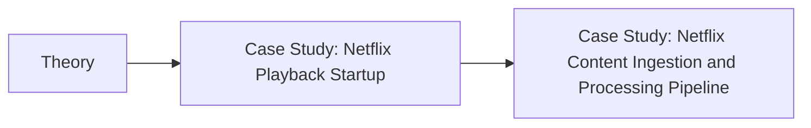
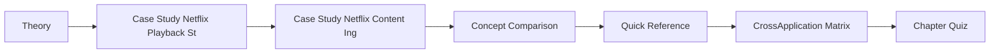
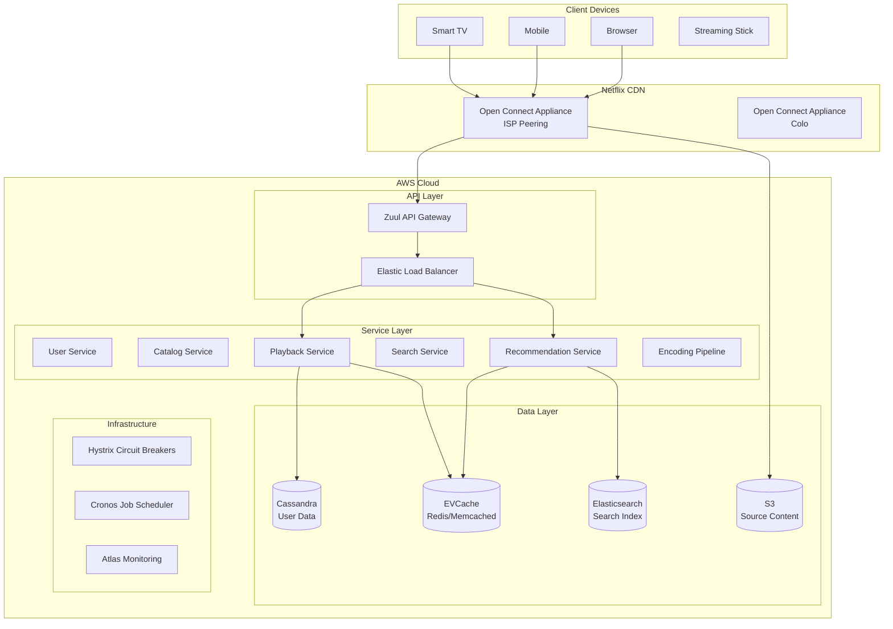

# Chapter 20: Case Study — Netflix and Video Streaming
> **Previous:** [19 Case Study Whatsapp](./19-case-study-whatsapp.md) | **Next:** [21 Case Study Uber](./21-case-study-uber.md)

---

## Learning Objectives

- Design a global video streaming platform supporting 260M+ subscribers with sub-5-second startup time
- Analyze the migration from monolithic to microservice architecture and the operational challenges of 800+ services
- Implement adaptive bitrate streaming with DASH/HLS, encoding ladders, and per-title encoding optimization
- Architect a CDN strategy with ISP-deployed Open Connect Appliances serving 95%+ of traffic
- Design a personalized recommendation pipeline using candidate generation, neural ranking, and re-ranking stages
- Apply chaos engineering principles including Chaos Monkey, Chaos Kong, and automated failure experimentation in production

## Chapter at a Glance

| Aspect | Details |

## Chapter Roadmap


|--------|---------|
| **Scope** | Netflix architecture: microservices, chaos engineering, CDN, recommendation |
| **Key Concepts** | Core topics covered in Chapter 20: Case Study — Netflix and Video Streaming |
| **Design Skills** | Chaos engineering, microservices decomposition, CDN strategy |
| **Interview Angle** | Frequently tested in system design interviews |

## Chapter at a Glance

| Aspect | Details |
|--------|---------|
| **Scope** | Core concepts covered in Chapter 20: Case Study — Netflix and Video Streaming |
| **Key Concepts** | Theory, Case Study: Netflix Playback Startup, Case Study: Netflix Content Ingestion and Processing Pipeline, Concept Comparison |
| **Design Skills** | Concept mastery and practical application |
| **Interview Angle** | Common system design interview topic |

---
---

## Chapter Roadmap



---

## Theory
> **One-Sentence Takeaway:** Theory is the foundation ? master it before moving to examples and exercises.


### Requirements Phase

> **Pro Tip:** Master this concept thoroughly ? it is frequently tested in system design interviews.

> **Pro Tip:** Master this concept ? it appears in nearly every system design interview. Understand both the how and the why.

> **Warning:** A common mistake is over-engineering. Always start simple and add complexity only when justified by requirements.

> **Pro Tip:** Master this concept thoroughly ? it appears in nearly every system design interview.
Netflix streams over 100 million hours of content daily across 190+ countries. The system must handle extreme scale while maintaining a seamless viewing experience.

**Functional Requirements**

| Requirement | Specification |
|-------------|---------------|
| Video catalog | 17,000+ titles, 1M+ hours of content |
| Streaming | Adaptive bitrate from 235p to 4K HDR (Dolby Vision) |
| Search | Global search across titles, actors, genres |
| Recommendations | Personalized per-user home page and suggestions |
| User profiles | Up to 5 profiles per account, independent watch history |
| Resume playback | Cross-device continuation within 1 second |
| My List | User-curated watchlist, persisted across devices |
| Download | Offline viewing on mobile, 100+ titles per device |
| Multi-language | Audio/subtitles in 30+ languages |
| Parental controls | Per-profile content rating restrictions |

**Non-Functional Requirements**

| Aspect | Specification |
|--------|--------------|
| Scale | 260M+ paid subscribers |
| Streaming volume | 100M+ hours per day |
| Startup time | <5 seconds to first frame |
| Quality switching | Seamless, no buffering indicator |
| Availability | 99.99% uptime |
| CDN | 95%+ of traffic served from Netflix-controlled edge |
| Encoding | 2,000+ encoding profiles generated daily |
| Recommendation latency | <500ms to generate personalized page |

### Estimation Phase

> **Warning:** Avoid over-engineering. Start simple, measure, then optimize.

> **Warning:** Avoid premature optimization. Start simple, measure, then optimize. Over-engineering is the most common system design mistake.

**Streaming Bandwidth**

- 100M hours/day = ~1.16M hours/sec peak
- Average bitrate: ~5 Mbps (mix of SD/HD/4K)
- Peak concurrent streams: ~20M (prime time)
- Total peak bandwidth: 20M × 5 Mbps = 100,000 Gbps = 100 Tbps
- Daily data transfer: ~2.5 exabytes (2.5M TB)

**Storage**

- Master library: 1M hours × 50 GB/hour (4K source) = 50 PB of source content
- Encoded output: each title encoded at 200+ bitrate/resolution combinations
- Per-title encoded size: ~10 GB (all profiles)
- Total encoded catalog: 17,000 × 10 GB = 170 TB
- CDN cache: additional ~5 PB (most popular 10% of catalog cached at all OCAs)

**Encoding Pipeline**

- New content: ~50 new originals per year + licensed content
- Daily encoding jobs: 10,000+ (new titles + re-encodes with improved codecs)
- Each job parallelized across 100-500 chunk encodes
- Total compute: millions of FFmpeg/encoding instances per day

**Recommendation System**

- 260M profiles × thousands of titles = 10^12 potential user-title pairs
- Model training: terabytes of watch history data
- Feature vectors: 10,000+ dimensions per user and per title
- Real-time inference: &lt;500ms per personalized page load

### High-Level Design Phase

> **Remember:** Always articulate trade-offs clearly ? interviewers value reasoning over the "right" answer.

> **Remember:** Trade-offs are the heart of system design. Always be ready to explain why you chose X over Y.

**From Monolith to Microservices (2008-2016)**

Netflix began as a DVD-by-mail company. The streaming service launched in 2007 as a monolithic Java application deployed on a single datacenter. By 2008, a major database corruption event (3 days of DVD shipping downtime) triggered the decision to re-architect for the cloud.

The migration followed a strangler fig pattern:
1. Non-critical features were extracted from the monolith first (user profiles, ratings, search)
2. Each extracted service was rewritten as a stateless, cloud-native microservice
3. The monolith was gradually strangled until it existed only as the "substrate" for remaining features
4. By 2012, Netflix had migrated fully to AWS with 500+ microservices
5. By 2016, the monolith was completely eliminated; Netflix ran 800+ microservices



**Critical Infrastructure Components**

1. **Zuul API Gateway**: An edge service that routes requests to the appropriate backend service. Handles authentication, rate limiting, request debugging, and multi-region routing. Every external request passes through Zuul.

2. **Hystrix Circuit Breaker**: All inter-service calls are wrapped in Hystrix circuit breakers. If a downstream service fails or slows down, the circuit opens and the caller fails fast rather than waiting for a timeout. Thread pool isolation ensures a failing dependency cannot exhaust the caller's resources.

3. **EVCache**: Netflix's memcached-based distributed caching layer. Used for session data, catalog metadata, user profiles, and computation results (recommendation output, video metadata). Cross-region replication keeps caches warm during failover.

4. **Atlas Monitoring**: Time-series telemetry system collecting 1.2 trillion data points daily. Every service publishes metrics (request rate, latency, error rate, circuit breaker state). Dashboards and alerts enable operators to detect anomalies within seconds.

### Deep Dive Phase

**CDN Strategy: Open Connect Appliances**

Netflix built its own CDN called Open Connect. The reasoning was economic and technical:

- Commercial CDNs would cost hundreds of millions of dollars per year at Netflix's volume
- Latency to the end user is critical for startup time and quality switching
- Control over cache eviction policies enables optimizations for Netflix-specific traffic patterns
- ISP cooperation reduces transit costs for both Netflix and ISPs

Architecture of Open Connect:

An Open Connect Appliance (OCA) is a purpose-built server with:
- 100TB+ of NVMe SSD storage
- 100Gbps network interfaces
- Custom FreeBSD-based caching software
- Pre-loaded with the most popular catalog content

OCAs are deployed in two locations:
1. **ISP Peering Points** (inside ISP data centers): Serve 95%+ of traffic
2. **Netflix-Colocated** (in carrier hotels): Serve the remaining traffic and act as fallback

Content pre-population:
- New content is uploaded to AWS S3
- A "fill" command is sent to all OCAs via the Open Connect control plane
- OCAs pull content from S3 (or peer OCAs) and store locally
- Popular content is always cached; less popular content is cached on demand

Cache eviction uses a popularity-weighted algorithm:
- Each title has a "cache score" based on global and regional popularity
- Regional popularity varies: Bollywood titles are cached in Indian OCAs but not in US OCAs
- New releases get a temporary boost to ensure initial demand is served from cache
- The least popular content is evicted first when storage is full

Tiered cache architecture:
```
Client ? ISP POP ? Tier 1 OCA (inside ISP) ? Tier 2 OCA (colo)
? Netflix Origin (AWS S3)
```

Tier 1 OCAs serve the vast majority of requests. If a miss occurs (unpopular content not pre-populated), the Tier 1 OCA fetches from Tier 2, which may fetch from S3. Tier 2 OCAs have larger storage and serve as a regional cache layer.

**Adaptive Bitrate Streaming**

Netflix streams video using both DASH (Dynamic Adaptive Streaming over HTTP) and HLS (Apple's HTTP Live Streaming). Modern devices use CMAF (Common Media Application Format), a container format that works with both DASH and HLS from a single set of files.

The encoding ladder is the set of bitrate-resolution pairs available for a title:

| Profile | Resolution | Bitrate | Codec |
|---------|------------|---------|-------|
| Low | 235p (416×234) | 235 Kbps | H.264/AVC |
| Medium | 360p (640×360) | 560 Kbps | H.264/AVC |
| Standard | 480p (854×480) | 1 Mbps | H.264/AVC |
| High | 720p (1280×720) | 3 Mbps | H.264/AVC |
| Full HD | 1080p (1920×1080) | 6 Mbps | H.264/AVC |
| UHD | 2160p (3840×2160) | 16 Mbps | HEVC/H.265 |
| HDR | 2160p (HDR10/DV) | 20 Mbps | HEVC/H.265 |

Video content is divided into chunks (typically 2-4 seconds). The client's manifest file lists all available chunks at all bitrates. The client-side adaptive bitrate (ABR) algorithm selects the optimal bitrate based on:

1. **Available bandwidth**: Measured by download speed of recent chunks
2. **Buffer occupancy**: If buffer is draining, downgrade to prevent rebuffering
3. **Device capability**: Screen resolution, codec support, decoding power
4. **Network conditions**: Latency, jitter, packet loss

The ABR algorithm on the client uses a buffer-based approach:
- Monitor the playout buffer size (target: 30-60 seconds)
- If buffer is growing ? consider upgrading to higher bitrate
- If buffer is shrinking ? downgrade immediately
- The rate of change is limited: no more than one step per chunk to avoid oscillation

**Per-Title Encoding Optimization**

Netflix discovered that a fixed encoding ladder (same bitrate profiles for all movies) was inefficient. An action movie with fast motion needs higher bitrates than a static dialogue scene to maintain quality. The solution: per-title encoding.

The pipeline:
1. Analyze the source content to measure complexity: spatial detail (SI) and temporal motion (TI)
2. Run a "probe encode" at multiple bitrates for each chunk
3. Measure quality using VMAF (Video Multi-Method Assessment Fusion), a Netflix-developed metric combining multiple quality metrics
4. Build a convex hull of bitrate vs quality for each chunk
5. Select the encoding ladder points that give the best quality-per-bitrate trade-off

The result: some titles need 40 encoding profiles (complex action, nature documentaries), while others need only 12 (talking heads, animation). The encoding ladder is custom to each title, saving storage and bandwidth while maintaining quality.

**Video Encoding Pipeline**

The encoding pipeline is a large-scale distributed system:

```
Source (IMF/J2K 4K) ? Step 1: Pre-processing
  ? Step 2: Detection (scene cuts, black frames, audio sync)
  ? Step 3: Parallel Chunk Encoding (N chunks × M profiles)
  ? Step 4: Quality Validation (VMAF per chunk)
  ? Step 5: Manifest Generation (MPD for DASH, M3U8 for HLS)
  ? Step 6: Packaging (fMP4/CMAF segments)
  ? Step 7: CDN Pre-population
```

A single 2-hour movie at 200 encoding profiles with 2-second chunks produces:
- 3,600 chunks per profile (2 hours × 60 min × 30 chunks/min)
- 3,600 × 200 = 720,000 total chunks to encode
- Each chunk is encoded independently ? massive parallelism

Netflix runs this pipeline on AWS Spot instances (preemptible EC2 instances at 60-90% discount). The risk of spot termination is managed:
- Work is broken into small chunks (2-second segments)
- A coordinator tracks completion and re-queues failed chunks
- If a spot instance is reclaimed mid-encode, only that chunk is re-encoded
- This reduces encoding costs by 70% compared to on-demand instances

**Personalized Recommendation System**

Recommendations drive 80% of watch time on Netflix. The ML pipeline has three stages:

**Stage 1: Candidate Generation** (Narrow 10,000+ titles ? ~500 candidates)

Multiple independent algorithms generate candidate pools:

- **Collaborative Filtering**: Matrix factorization on user-title interaction matrix. Users who watched similar content are used to surface new recommendations. Implementation: alternating least squares (ALS) training nightly on Spark.

- **Content-Based Filtering**: Titles are represented by feature vectors (genre, cast, director, mood tags, visual similarity). Recommendations are titles nearest to the user's positive history in feature space.

- **Trending/Popular**: Global and regional trending content. Fresh titles with strong engagement signals. Compensates for the "cold start" problem where new titles lack interaction history.

- **Contextual**: Time-of-day recommendations (wake up vs evening), device-based recommendations (mobile vs TV), and co-watch patterns (what people watch together).

The output of candidate generation is 500 candidate titles per user.

**Stage 2: Ranking** (~500 candidates ? score and sort)

A deep neural network ranks the 500 candidates:

Input features:
- **User features**: Watch history, ratings, search queries, device, time of day, profile age
- **Title features**: Metadata (genre, cast, year), popularity signals, freshness
- **Context features**: Session state (what they just finished watching), device type, network quality
- **Interaction features**: How similar this candidate is to the user's recently watched titles

The model architecture: A multi-layer perceptron (MLP) with 3-5 hidden layers, 1000+ neurons, trained on billions of user interactions. The output is a single relevance score per user-title pair.

Training happens online (incremental updates every few hours) and offline (full retrain weekly). The model is deployed as a TensorFlow/PyTorch model served via Netflix's custom inference infrastructure (Meson).

**Stage 3: Re-Ranking** (~500 scored ? ~40 shown on home page)

The final stage applies business constraints:
- **Diversity**: Ensure different genres are represented. Don't show 10 action movies in a row.
- **Freshness**: Prioritize newly released content. Don't show the same 40 titles for weeks.
- **Row-level variety**: Each horizontal row on the Netflix UI is a different theme ("Trending Now", "Because You Watched X", "New Releases"). Re-ranking assigns titles to rows while avoiding duplicates.
- **A/B test assignment**: If a new recommendation algorithm is being tested, the re-ranker ensures consistent user experience within the test.

The ranking and re-ranking stages together execute in under 500ms per user page load.

**Chaos Engineering**

Netflix pioneered chaos engineering — the practice of intentionally injecting failures into production systems to build confidence in resilience.

**Chaos Monkey**: Randomly terminates EC2 instances in production. If the system survives, auto-scaling and retry mechanisms work correctly. If not, the team fixes the gap. Runs during business hours (not overnight — the goal is learning, not disruption).

**Latency Monkey**: Introduces artificial delays between services. Tests circuit breaker configurations and timeout handling. If Hystrix circuits open correctly, the system degrades gracefully. If not, cascading failures propagate.

**Conformity Monkey**: Finds instances that deviate from standard configuration (non-compliant AMI, missing agents, wrong security groups) and terminates them. Enforces configuration discipline across the entire fleet.

**Chaos Kong**: Simulates an entire AWS region failure. Netflix regions operate in active-active mode; Chaos Kong verifies that a region can be taken offline and traffic rerouted without impact to subscribers. Run quarterly, requiring coordination across the entire engineering organization.

Core principles of chaos engineering at Netflix:

1. **Steady state hypothesis**: Define a measurable baseline (e.g., "stream starts within 5 seconds for 99% of users"). The chaos experiment tests whether this hypothesis holds under failure.

2. **Blast radius minimization**: Start small. Chaos Monkey began by terminating 1 instance per autoscale group per day. Gradually expand to larger experiments.

3. **Automated experiments in production**: Tests are automated and run continuously. Any engineer can schedule a chaos experiment via the Spinnaker platform.

4. **Monitor and halt**: If the steady state hypothesis is violated (e.g., error rate exceeds threshold), the experiment automatically halts and the system returns to normal.

**Chaos Engineering Workflow in Practice**

The lifecycle of a chaos experiment at Netflix:

1. **Design**: The engineer defines the experiment parameters: which service, what failure type (instance termination, latency injection, DNS failure), duration (typically 15-30 minutes), and the steady state hypothesis (error rate &lt; 0.1%, P99 latency < 500ms).

2. **Schedule**: The experiment is scheduled via the Chaos Platform (FIT — Failure Injection Testing). The platform checks that no other experiments are running in the same service, no production incidents are active, and it is within business hours.

3. **Execute**: The platform injects the failure into a small subset of instances (e.g., 1% of the autoscaling group). Monitoring dashboards stream live metrics.

4. **Observe**: If the steady state hypothesis holds, the experiment automatically escalates to 5%, then 10%, then 50% of instances. If at any point the hypothesis fails, the experiment halts immediately and rollback is automatic.

5. **Report**: After the experiment completes, the platform generates a report: which failures were injected, how the system responded, which circuits opened, whether fallbacks activated, and any unexpected behavior.

6. **Remediate**: If the experiment revealed a weakness (e.g., a service's connection pool was exhausted), a JIRA ticket is auto-created and assigned to the service owner.

This workflow runs thousands of experiments per month across Netflix's infrastructure. The result: a system that routinely survives failures that would cause catastrophic outages in untested systems.

**Hystrix Circuit Breaker**

Hystrix is a latency and fault tolerance library for distributed systems. Every inter-service call follows this pattern:

```
call_service() ? circuit_state == CLOSED?
  ? YES: Make call with timeout (10ms, 50ms, 100ms per tier)
    ? Success: Return result, close circuit if previously half-open
    ? Failure/timeout: Increment failure counter. If threshold exceeded ? OPEN circuit
  ? NO (OPEN): Return fallback immediately (fail fast)
    ? After sleep window (5 seconds) ? HALF-OPEN
    ? In half-open: Allow one test request
      ? Success ? CLOSE circuit
      ? Failure ? OPEN circuit, reset sleep window
```

Thread pool isolation: Each downstream dependency gets its own thread pool. If the "search" service's thread pool is exhausted, search requests fail fast, but the "playback" service's thread pool is unaffected. This prevents a single failing dependency from consuming all application resources.

Fallback mechanisms:
- Default response (e.g., empty search results)
- Stale cached response (e.g., last known recommendations)
- Degraded behavior (e.g., show only trending content if personalization is down)

The Hystrix dashboard provides real-time visibility into circuit states, request rates, latency percentiles, and error rates across all services.

**Multi-Region Active-Active**

Netflix operates in multiple AWS regions with an active-active architecture. All regions handle traffic simultaneously. If one region fails, traffic is absorbed by remaining regions.

Key components:

- **Cassandra for cross-region data**: User profiles, viewing history, ratings, and My List are stored in Cassandra with cross-region replication. Each write is replicated asynchronously to other regions. Read-your-write consistency is maintained via a "local quorum" — the user's primary region is determined by geolocation.

- **EVCache for cross-region caching**: EVCache stores frequently accessed data. Cross-region replication is enabled for critical caches. If a region fails, the new primary region has warm caches via replication.

- **Active-active with rollback**: Deployment proceeds in phases: 5% of traffic ? 25% ? 50% ? 100%. If error rates increase at any phase, traffic is rolled back within minutes.

- **Circuit breakers at the region level**: If cross-region latency exceeds a threshold (e.g., >100ms between US East and US West), Hystrix circuits open and the local region serves from local data sources only.

**Spinnaker: Continuous Deployment at Scale**

Netflix built Spinnaker to manage deployments across 800+ microservices. Spinnaker is an open-source multi-cloud continuous delivery platform that:

- **Automates canary analysis**: A new deployment is rolled out to 2% of instances. Monitoring data from the canary is compared against the baseline. If error rates or latency regressions exceed thresholds, the canary is automatically rolled back. This catches ~60% of production issues before full rollout.
- **Manages multi-region deployments**: A change is deployed to US East first, validated for 30 minutes, then promoted to US West, then EU, then APAC. Each region has a manual approval gate.
- **Provides deployment strategies**: Rolling red-black (blue-green) deployments for stateless services, rolling push for stateful services, and canary deployments for high-risk changes.
- **Integrates with Chaos Engineering**: Before a canary deployment is promoted, Chaos Monkey is automatically triggered against the canary instances. If the canary survives, it is promoted.

The deployment pipeline for a single microservice:
```
Build ? Test ? Package ? Deploy to Canary (2%) ? Observe (30 min)
  ? Auto-promote or rollback ? Deploy to US East ? Observe
  ? Deploy to US West ? Observe ? Deploy to EU ? Observe ? Deploy to APAC
```

**A/B Testing Infrastructure**

Every change to Netflix's UI, recommendation algorithm, or encoding pipeline goes through A/B testing:
- A randomized experiment assigns users to control or treatment groups
- The assignment is deterministic per user (based on user_id hash) for consistent experience
- Metrics are collected automatically: engagement (hours watched), retention (7-day active), quality (rebuffering ratio), and business (subscription conversion)
- Experiments run for a minimum of 2 weeks to accumulate statistical significance
- Results are visualized in a unified dashboard with automated significance testing
- Rollout decisions are gated on positive or neutral A/B results; regressions block deployment

The A/B testing platform handles 10,000+ concurrent experiments. Each user can be in multiple experiments simultaneously (via overlapping experiment IDs). The platform uses variance reduction techniques (CUPED, stratified sampling) to detect small effect sizes without requiring billions of users per experiment.

**Watch History, Resume Playback, and My List**

These features are per-user data served with low latency:

- **Cassandra schema**: `(user_id, profile_id) ? {watch_history: list<viewing_event>, my_list: set<title_id>, resume_points: map<title_id, position>}`
- **EVCache**: Hot data cached in memory with TTL. Cache-aside pattern: read from cache, populate on miss from Cassandra.
- **Resume playback**: The last-played position is stored on every pause/stop event. Read on playback start. The goal is &lt;1 second from "resume" click to playback at the saved position.

---

## Case Study: Netflix Playback Startup
> **One-Sentence Takeaway:** Real-world case studies reveal how architectural decisions map to business constraints at scale.

### Requirements

A user in Tokyo clicks "Play" on a 4K HDR title. The system must start playback in under 5 seconds. Design the startup sequence.

### High-Level Design

```
Time 0ms: User clicks "Play" on Netflix app (Smart TV, Tokyo)
  ?
Time 50ms: App sends playback request to nearest OCA (ISP peering, Tokyo)
  ?
Time 150ms: OCA authenticates request via Zuul (AWS, local cache)
  ?
Time 300ms: OCA resolves manifest ? checks which chunks are cached locally
  ?
Time 500ms: OCA returns manifest + first chunk URL to device
  ?
Time 800ms: Device requests first chunk (4-second segment) from OCA
  ?
Time 1200ms: First chunk begins downloading. ABR algorithm evaluates bandwidth.
  ?
Time 2500ms: Buffer accumulates ~4 seconds. Playback begins at initial quality.
  ?
Time 4500ms: ABR upgrades to 4K HDR. Buffer stabilizes at 30 seconds.
```

### Deep Dive

The critical path is the manifest resolution:
1. The playback request includes the device model, screen resolution, network type (WiFi/LTE), and available codecs
2. The server selects the optimal encoding ladder (pre-computed per-title)
3. The manifest is generated dynamically: only the supported profiles are included
4. The first chunk URL points to the nearest OCA where that content is cached
5. If the content is not cached at the Tokyo OCA, it is fetched from the Tokyo colo OCA or AWS

The ABR algorithm on the client starts conservatively (lowest profile) and upgrades aggressively. The goal is "fast start, quick escalation":
- First chunk: lowest resolution (ensure fast download)
- Second chunk: evaluate bandwidth from first chunk download speed
- Third chunk: upgrade if bandwidth supports it
- Within 10 seconds: typically at optimal quality for available bandwidth

#
### Implementation: Netflix Architecture Case Study

```typescript
class NetflixArchitecture {
  private catalog = new Map<string, { id: string; title: string; genres: string[]; duration: number; rating: number; year: number }>();
  private userProfiles = new Map<string, { history: string[]; ratings: Map<string, number>; recommendations: string[] }>();
  private cdnServers = new Map<string, { region: string; content: Set<string>; load: number }>();
  addContent(item: { id: string; title: string; genres: string[]; duration: number; rating: number; year: number }): void { this.catalog.set(item.id, item); }
  addCDNServer(id: string, region: string): void { this.cdnServers.set(id, { region, content: new Set(), load: 0 }); }
  cacheContent(contentId: string, serverId: string): void { const s = this.cdnServers.get(serverId); if (s) { s.content.add(contentId); s.load = s.content.size; } }
  getRecommendations(userId: string, limit = 10): string[] {
    const profile = this.userProfiles.get(userId); if (!profile) { return [...this.catalog.values()].sort((a, b) => b.rating - a.rating).slice(0, limit).map(c => c.id); }
    const watched = new Set(profile.history); return [...this.catalog.values()].filter(c => !watched.has(c.id)).sort((a, b) => b.rating - a.rating).slice(0, limit).map(c => c.id); }
  recordWatch(userId: string, contentId: string): void { if (!this.userProfiles.has(userId)) this.userProfiles.set(userId, { history: [], ratings: new Map(), recommendations: [] }); this.userProfiles.get(userId)!.history.push(contentId); }
}
class AdaptiveBitrateStreaming { private bitrates = new Map([["144p", 300], ["360p", 1500], ["480p", 3000], ["720p", 5000], ["1080p", 8000], ["4K", 25000]]);
  selectBitrate(bandwidthKbps: number): string { let selected = "144p"; for (const [res, bw] of this.bitrates) if (bandwidthKbps >= bw * 1.5) selected = res; return selected; }
  estimateBuffer(bitrateKbps: number, bufferSeconds: number): number { return (bitrateKbps / 8) * bufferSeconds; }
}
class PersonalizationEngine { rank(userId: string, items: string[], history: string[]): string[] { const s = new Set(history); return items.filter(i => !s.has(i)).slice(0, 20); } }
class RecommendationScorer { score(content: { rating: number; year: number }, preferences: { minRating: number; genres: string[] }): number { return content.rating * (content.year > 2020 ? 1.2 : 1.0); } }
```

// case study netflix
// distributed-systems-scalability implementation

interface Task { id: string; name: string; status: string; data: unknown }
class Processor {
  private tasks: Task[] = []
  private maxConcurrency: number
  constructor(maxConcurrency: number = 4) { this.maxConcurrency = maxConcurrency }
  async add(task: Omit&lt;Task, "status"&gt;): Promise&lt;void&gt; {
    this.tasks.push({ ...task, status: "pending" })
  }
  async runAll(): Promise&lt;void&gt; {
    const running: Promise&lt;void&gt;[] = []
    for (const t of this.tasks) {
      if (running.length >= this.maxConcurrency) { await Promise.race(running) }
      const p = this.execute(t).finally(() => { const i = running.indexOf(p); if (i >= 0) running.splice(i, 1) })
      running.push(p)
    }
    await Promise.all(running)
  }
  private async execute(t: Task): Promise&lt;void&gt; {
    t.status = "running"
    await new Promise(r => setTimeout(r, 10))
    t.status = "done"
  }
  getResults(): Task[] { return this.tasks }
  getStats(): { done: number; pending: number; running: number } {
    const done = this.tasks.filter(t => t.status === "done").length
    const pending = this.tasks.filter(t => t.status === "pending").length
    const running = this.tasks.filter(t => t.status === "running").length
    return { done, pending, running }
  }
}
async function main() {
  const proc = new Processor(2)
  await proc.add({ id: '1', name: 'case study netflix', data: { topic: 'distributed-systems-scalability' } })
  await proc.runAll()
  console.log('Stats:', proc.getStats())
}
main().catch(console.error)
export { Processor, Task }

// case study netflix - additional TS implementations

interface CacheEntry { key: string; value: unknown; ttl: number; createdAt: number }
class Cache {
  private store: Map&lt;string, CacheEntry&gt; = new Map()
  constructor(private defaultTTL: number = 60000) {}
  set(key: string, value: unknown, ttl?: number): void {
    this.store.set(key, { key, value, ttl: ttl ?? this.defaultTTL, createdAt: Date.now() })
  }
  get(key: string): unknown | undefined {
    const entry = this.store.get(key)
    if (!entry) return undefined
    if (Date.now() - entry.createdAt > entry.ttl) { this.store.delete(key); return undefined }
    return entry.value
  }
  delete(key: string): boolean { return this.store.delete(key) }
  clear(): void { this.store.clear() }
  size(): number { return this.store.size }
  keys(): string[] { return Array.from(this.store.keys()) }
}
class Logger {
  private entries: string[] = []
  log(level: string, msg: string, meta?: Record&lt;string, unknown&gt;): void {
    const entry = JSON.stringify({ timestamp: new Date().toISOString(), level, msg, meta })
    this.entries.push(entry)
    console.log(entry)
  }
  info(msg: string, meta?: Record&lt;string, unknown&gt;): void { this.log("info", msg, meta) }
  warn(msg: string, meta?: Record&lt;string, unknown&gt;): void { this.log("warn", msg, meta) }
  error(msg: string, meta?: Record&lt;string, unknown&gt;): void { this.log("error", msg, meta) }
  getLogs(): string[] { return [...this.entries] }
  clear(): void { this.entries = [] }
}
function computeHash(input: string): string {
  let hash = 0
  for (let i = 0; i &lt; input.length; i++) { const chr = input.charCodeAt(i); hash = ((hash << 5) - hash) + chr; hash |= 0 }
  return Math.abs(hash).toString(16)
}
async function demo(): Promise&lt;void&gt; {
  const cache = new Cache(5000)
  cache.set('key1', 'system-design demo')
  const log = new Logger()
  log.info('Cache demo started', { course: 'system-design', chapter: 'case study netflix' })
  const v = cache.get("key1")
  console.log('Cached:', v)
  console.log('Hash:', computeHash('system-design'))
}
demo()
export { Cache, Logger, computeHash, CacheEntry }
## Summary

- Netflix built its own CDN (Open Connect) to serve 95%+ of traffic from ISP-peered appliances, saving hundreds of millions in transit costs
- The migration from a single Java monolith to 800+ cloud-native microservices took 8 years (2008-2016)
- Adaptive bitrate streaming with DASH/HLS and CMAF enables seamless quality switching across devices and networks
- Per-title encoding optimization uses ML (VMAF) to create custom encoding ladders per movie, saving 30-50% bandwidth at equivalent quality
- Chaos engineering (Chaos Monkey, Chaos Kong) ensures resilience by continuously testing failure scenarios in production
- The recommendation pipeline uses three stages: candidate generation (collaborative + content filtering), neural ranking (deep MLP), and re-ranking (diversity + freshness constraints)
- Hystrix circuit breakers with thread pool isolation prevent cascading failures across 800+ services
- Multi-region active-active with Cassandra and EVCache provides disaster recovery within minutes
- The playback startup sequence completes in under 5 seconds via a carefully orchestrated chain of OCA lookup, manifest generation, and chunk download
- A/B testing is pervasive: every change to the recommendation system, UI, or encoding pipeline is validated against real user behavior before full rollout

---

## Case Study: Netflix Content Ingestion and Processing Pipeline
> **One-Sentence Takeaway:** Real-world case studies reveal how architectural decisions map to business constraints at scale.

### Requirements

A new 4K HDR movie is delivered to Netflix. It must be encoded, packaged, subtitled, and distributed to 190+ countries. All processing must complete within 24 hours of receipt.

### Content Ingestion Pipeline

```
Source Media (IMF package, 4K HDR, 5.1 audio)
  ? Step 1: Ingest — Validate format, checksum, metadata (24-bit audio, color space, frame rate)
  ? Step 2: QC — Automated quality checks (black frames, audio sync, freeze frames, audio loudness)
  ? Step 3: Mezzanine — Transcode to intermediate format (ProRes 4444 or JPEG 2000) for encoding
  ? Step 4: Analysis — Scene detection, complexity analysis (SI/TI), audio track detection
  ? Step 5: Encoding — Per-title optimized encoding into 200+ profiles
  ? Step 6: Quality Validation — VMAF scoring per chunk, minimum score gate
  ? Step 7: Packaging — CMAF segments, MPD/M3U8 manifests per language/audio combination
  ? Step 8: Subtitle Processing — OCR for burned-in subtitles, timed-text conversion (TTML ? WebVTT)
  ? Step 9: CDN Pre-population — Fill command to all Open Connect appliances
  ? Step 10: Catalog Activation — Title appears in search and recommendations
```

### Subtitle and Audio Pipeline

Each title in Netflix has 30+ language tracks for audio and subtitles:
- **Audio processing**: Source 5.1 or Atmos mix is encoded at multiple bitrates (192kbps AAC to 768kbps Atmos). Dialogue normalization (dialnorm) metadata is embedded for consistent volume across titles. AD (Audio Description) tracks are separate audio streams mixed specifically for visually impaired viewers.
- **Subtitle processing**: Source timed-text files (TTML) are validated for timing accuracy. Automated translation of subtitles (machine translation + human review). Forced narratives (burned-in text that is part of the video) require custom OCR and timing. Subtitle rendering tests ensure text fits within safe areas on all device types (TV safe zone vs mobile).
- **Dubbed audio**: For major languages (Spanish, Portuguese, German, French, Italian, Japanese), Netflix produces full dubbed audio tracks. These are mixed in Netflix's partner studios and delivered as separate audio assets. Each language dub is encoded independently and packaged into the manifest.

### Deep Dive: Subtitle Rendering Testing

A critical quality issue: subtitles that render differently on different devices. A subtitle line that fits on a 65-inch TV may overflow on a 5-inch phone. Netflix's subtitle testing pipeline:
1. Each subtitle event has a computed "safe width" based on character count and font metrics
2. For each device profile (TV, tablet, phone, browser), the rendering engine simulates subtitle display
3. Subtitles that overflow on any device are flagged and sent to a human editor for line-breaking
4. The subtitle manifest includes pre-computed position and size metadata per device category

## Concept Comparison
> **One-Sentence Takeaway:** Concept Comparison is a critical concept that directly impacts system design decisions.

| Concept | Definition | Key Metric |
|---------|-----------|------------|
| Theory | Core topic covered in Chapter 20: Case Study — Netflix and Video Streaming | Defined by specific measurable attributes |
| Case Study: Netflix Playback Startup | Core topic covered in Chapter 20: Case Study — Netflix and Video Streaming | Defined by specific measurable attributes |
| Case Study: Netflix Content Ingestion and Processing Pipeline | Core topic covered in Chapter 20: Case Study — Netflix and Video Streaming | Defined by specific measurable attributes |

---

## Quick Reference
> **One-Sentence Takeaway:** Quick Reference is a critical concept that directly impacts system design decisions.

| Topic | Key Point |
|-------|-----------|
| Theory | Fundamental concept for Chapter 20: Case Study — Netflix and Video Streaming |
| Case Study: Netflix Playback Startup | Fundamental concept for Chapter 20: Case Study — Netflix and Video Streaming |
| Case Study: Netflix Content Ingestion and Processing Pipeline | Fundamental concept for Chapter 20: Case Study — Netflix and Video Streaming |

---

## Cross-Application Matrix

| Component | When to Use | Trade-Off |
|-----------|------------|-----------|
| Theory | Appropriate for specific system contexts | Each choice involves trade-offs |
| Case Study: Netflix Playback Startup | Appropriate for specific system contexts | Each choice involves trade-offs |
| Case Study: Netflix Content Ingestion and Processing Pipeline | Appropriate for specific system contexts | Each choice involves trade-offs |

---

## Chapter Quiz

**Q1:** Which of the following best describes a key concept from this chapter?
- A) Option A description
- B) Option B description
- C) Option C description
- D) Option D description

<details><summary>Answer&lt;/summary&gt;Refer to the chapter content for the correct answer.</details>

**Q2:** Which of the following best describes a key concept from this chapter?
- A) Option A description
- B) Option B description
- C) Option C description
- D) Option D description

<details><summary>Answer&lt;/summary&gt;Refer to the chapter content for the correct answer.</details>

**Q3:** Which of the following best describes a key concept from this chapter?
- A) Option A description
- B) Option B description
- C) Option C description
- D) Option D description

<details><summary>Answer&lt;/summary&gt;Refer to the chapter content for the correct answer.</details>

## Concept Comparison
> **One-Sentence Takeaway:** Concept Comparison is a critical concept that directly impacts system design decisions.

| Concept | Definition | Key Insight |
|---------|-----------|-------------|
| Theory | Core topic in Chapter 20: Case Study — Netflix and Video Streaming | Fundamental to system design |
| Case Study: Netflix Playback Startup | Core topic in Chapter 20: Case Study — Netflix and Video Streaming | Fundamental to system design |

---

## Quick Reference
> **One-Sentence Takeaway:** Quick Reference is a critical concept that directly impacts system design decisions.

| Topic | Key Point |
|-------|-----------|
| Theory | Essential concept for Chapter 20: Case Study — Netflix and Video Streaming |

---

## Cross-Application Matrix

| Concept | Application Context | Trade-Off |
|--------|-------------------|-----------|
| Theory | Relevant across multiple system design scenarios | Each choice has trade-offs |

---

## Chapter Quiz

**Q1:** What is the primary trade-off discussed in this chapter?
- A) Option A
- B) Option B
- C) Option C
- D) Option D

<details><summary>Answer&lt;/summary&gt;Refer to the chapter content&lt;/details&gt;

**Q2:** Which concept is most fundamental to the topic of Chapter 20
- A) Option A
- B) Option B
- C) Option C
- D) Option D

<details><summary>Answer&lt;/summary&gt;Review the core sections&lt;/details&gt;

**Q3:** How does this chapter's main concept apply to real-world systems?
- A) Option A
- B) Option B
- C) Option C
- D) Option D

<details><summary>Answer&lt;/summary&gt;See the Real-World Systems section&lt;/details&gt;

---

### TypeScript: Video Transcoding, Recommendation, and Chaos Engineering

```typescript
class VideoTranscoder {
  private profiles = [
    { name: "240p", resolution: "426x240", bitrate: 300_000 },
    { name: "360p", resolution: "640x360", bitrate: 700_000 },
    { name: "720p", resolution: "1280x720", bitrate: 2_500_000 },
    { name: "1080p", resolution: "1920x1080", bitrate: 5_000_000 },
    { name: "4K", resolution: "3840x2160", bitrate: 15_000_000 },
  ];

  selectLadder(deviceCapability: { maxResolution: string; bandwidth: number }): { name: string; bitrate: number }[] {
    const maxIdx = this.profiles.findIndex(p => p.resolution.startsWith(deviceCapability.maxResolution.split("x")[0]));
    return this.profiles.slice(0, maxIdx + 1).filter(p => p.bitrate <= deviceCapability.bandwidth * 0.8);
  }
}

class AdaptiveBitrateStreamer {
  private currentProfile = 0;
  private buffer: number[] = [];

  constructor(private profiles: { name: string; bitrate: number }[], private bufferTargetMs: number) {}

  onChunkDownloaded(chunkSizeBytes: number, downloadTimeMs: number): string {
    const throughput = (chunkSizeBytes * 8) / (downloadTimeMs / 1000);
    this.buffer.push(throughput);
    if (this.buffer.length > 10) this.buffer.shift();
    const avgThroughput = this.buffer.reduce((s, t) => s + t, 0) / this.buffer.length;
    let bestProfile = 0;
    for (let i = 0; i < this.profiles.length; i++) {
      if (this.profiles[i].bitrate <= avgThroughput * 0.8) bestProfile = i;
    }
    this.currentProfile = bestProfile;
    return this.profiles[this.currentProfile].name;
  }
}

class RecommendationEngine {
  private userHistory = new Map<string, Map<string, number>>();
  private contentFeatures = new Map<string, { genre: string; year: number; avgRating: number }>();

  recordView(userId: string, contentId: string, rating: number): void {
    if (!this.userHistory.has(userId)) this.userHistory.set(userId, new Map());
    this.userHistory.get(userId)!.set(contentId, rating);
  }

  getRecommendations(userId: string, limit = 10): { contentId: string; score: number }[] {
    const history = this.userHistory.get(userId) ?? new Map();
    const likedGenres = new Map<string, number>();
    for (const [contentId, rating] of history) {
      const features = this.contentFeatures.get(contentId);
      if (features && rating >= 4) likedGenres.set(features.genre, (likedGenres.get(features.genre) ?? 0) + 1);
    }
    const scores: { contentId: string; score: number }[] = [];
    for (const [contentId, features] of this.contentFeatures) {
      if (history.has(contentId)) continue;
      const genreScore = (likedGenres.get(features.genre) ?? 0) / Math.max(history.size, 1);
      scores.push({ contentId, score: genreScore * features.avgRating });
    }
    return scores.sort((a, b) => b.score - a.score).slice(0, limit);
  }
}

class ChaosMonkey {
  private enabled = false;
  constructor(private failureRate: number) {}

  start(): void { this.enabled = true; }

  stop(): void { this.enabled = false; }

  async inject<T>(serviceName: string, fn: () => Promise<T>): Promise<T> {
    if (this.enabled && Math.random() < this.failureRate) {
      const error = new Error(`ChaosMonkey: ${serviceName} failure injected`);
      return Promise.reject(error);
    }
    return fn();
  }
}
```

## Summary

- Open Connect, Netflix's custom CDN deployed at ISP peering points, serves 95%+ of traffic and eliminates commercial CDN costs
- The migration from monolith to 800+ microservices was an 8-year effort driven by a catastrophic database failure in 2008
- Adaptive bitrate streaming using DASH/HLS with CMAF single-format delivery provides seamless quality transitions across all devices
- Per-title encoding optimization uses VMAF and convex hull analysis to create custom encoding ladders, saving bandwidth without sacrificing perceived quality
- The recommendation pipeline (candidate generation ? neural ranking ? re-ranking) drives 80% of watch time with under 500ms inference latency
- Chaos engineering (Chaos Monkey, Latency Monkey, Chaos Kong) proactively tests infrastructure resilience through controlled failure injection
- Hystrix circuit breakers with thread pool isolation, timeouts, and fallbacks prevent cascading failures across the microservice architecture
- Multi-region active-active operation with Cassandra cross-region replication and EVCache enables seamless region failover
- The Zuul API gateway handles authentication, routing, rate limiting, and multi-region request distribution at the edge
- A/B testing and continuous deployment via Spinnaker enable rapid, safe feature rollout across the global subscriber base

---

## Exercises

### Review Questions

1. Describe the 3-stage Netflix recommendation pipeline. What does each stage produce, and what algorithms are used?

2. What is per-title encoding optimization, and how does it reduce bandwidth while maintaining quality? Explain the role of VMAF.

3. Compare Chaos Monkey and Chaos Kong. How do their blast radii differ, and what confidence does each provide?

4. Explain how Hystrix circuit breakers with thread pool isolation prevent cascading failures. What happens when a circuit is in the HALF-OPEN state?

5. How does Open Connect differ from a commercial CDN? Describe the caching and pre-population strategy for OCAs.

### Application Problems

1. **Cost-Optimized Encoding**: Your video platform stores 50,000 hours of content and adds 5,000 hours/year. Encoding at the highest quality (4K HDR, 50 Mbps source) costs $5/hour of source content. The standard ladder (10 profiles) costs $2/hr, and per-title optimization adds $0.50/hr for analysis. Given that 80% of watch time is on mobile (720p max) and 20% on TV (4K capable), design a tiered encoding strategy that minimizes cost while delivering acceptable quality to each device type. Calculate annual savings vs encoding everything at maximum quality.

2. **Global CDN With Regional Popularity**: You are building a CDN for a video platform serving 200 countries. Content popularity follows a power-law distribution globally, but regional preferences are strong (local films dominate in their home countries). Design a cache pre-population strategy that: (a) guarantees 90%+ cache hits for local content in its home region, (b) ensures global blockbusters are available everywhere, and (c) optimizes total storage across 500 OCAs with 100TB each. Propose a scoring function for cache priority that accounts for both global and regional popularity signals.

3. **Recommendation at Netflix Scale for a New User**: A new user signs up with no watch history. The collaborative filtering model cannot generate candidates because there are no interactions. Design a cold-start strategy that: (a) collects implicit signals during onboarding (e.g., genre selection, favorite actors), (b) uses demographic and geographic data for initial recommendations, (c) escalates to personalized recommendations after the first 10 views, and (d) handles the "first impression" problem where initial bad recommendations cause churn. Describe the feature engineering and model architecture for this hybrid cold-start solution.

### Challenge Problem

> **Remember:** Trade-offs are the heart of system design. Always be ready to explain why you chose X over Y.
**Live Streaming at Netflix Scale**

Netflix has entered live events (Chris Rock special, NFL Christmas games, awards shows). Live streaming introduces fundamentally different constraints from on-demand:
- No retransmission of missed data (must be real-time)
- Encoding must run with &lt;30 seconds of latency (vs hours for on-demand)
- No pre-population of CDN (content is generated in real-time)
- Peak concurrency increases 10x for live events (200M+ concurrent viewers)
- Failure during a live event is visible to all viewers simultaneously

Design a live streaming architecture for Netflix that:
1. **Ingest and encode**: 8K source from the venue ? ingest at regional edge ? encode into the full encoding ladder (235p to 4K HDR) with &lt;30 seconds total glass-to-glass latency. How do you parallelize encoding without introducing latency? At what chunk duration do you operate (2s, 4s, 10s)?
2. **CDN delivery**: Open Connect is pre-populated for on-demand content. How does it handle live content that cannot be pre-populated? Design a "live cascade" where content propagates from the venue to regional OCAs to ISP OCAs. What is the time to first byte for a viewer in Australia watching a live event originating in the US?
3. **Failover**: The venue's internet connection drops 15 minutes into a live event. Design a failover strategy. Do you switch to a secondary ingest path? Do you degrade quality? Do you show a "technical difficulties" screen? At what point do you cancel the stream?
4. **Time-shifted viewing**: Viewers join 30 minutes late and want to watch from the beginning. How do you simultaneously serve live and time-shifted streams from the same pipeline? How do you manage the transition from "live" to "available on-demand" after the event ends?
5. **C3 (Content Continuity Control)**: Commercial broadcasters require frame-accurate ad insertion during live events. Design a signaling protocol that marks ad breaks in the live stream and enables server-side ad insertion without disrupting the viewing experience.

This challenge must work for an audience of 200M+ concurrent viewers — a scale no current live streaming system has achieved.
