# Chapter 21: Case Study — Uber and Location-Based Services
> **Previous:** [20 Case Study Netflix](./20-case-study-netflix.md) | **Next:** [22 Case Study Twitter](./22-case-study-twitter.md)

---

## Learning Objectives

- Analyze the architectural evolution from a monolith to a domain-oriented microservice ecosystem at global scale
- Understand geospatial indexing techniques including QuadTree, Google S2, and Uber's H3 hexagon system
- Design a real-time location pipeline handling 30M+ GPS updates per minute with Kafka and Flink
- Evaluate the dispatch and matching algorithm as a minimum-weight bipartite matching optimization problem
- Explore surge pricing mechanics as a real-time demand-supply equilibrium system
- Examine the trade-offs in sharding strategies for location-based services operating in 70+ countries

---
## Chapter at a Glance

| Aspect | Details |
|--------|---------|
| **Scope** | Uber architecture: dispatch, real-time matching, polyglot persistence |
| **Key Concepts** | Geospatial indexing, real-time matching, polyglot persistence |
| **Dispatch System** | Geospatial indexing, real-time driver matching, ETAs |
| **Polyglot Persistence** | MySQL, Redis, Cassandra, Kafka, Schemaless |
| **Microservices** | Domain-oriented decomposition, 2200+ microservices |
| **Real-World** | Evolving from monolith to microservices, data platform unification |

---

## Chapter Roadmap


## Theory / Case Study
> **One-Sentence Takeaway:** Theory is the foundation ? master it before moving to examples and exercises.


### Phase 1: Problem Scope and Requirements

<a href="../../assets/images/diagrams/system-design/21-case-study-uber/phase-1-problem-scope-and-requirements-handwritten.svg" target="_blank" rel="noopener">
  
</a>
<a href="../../assets/images/diagrams/system-design/21-case-study-uber/phase-1-problem-scope-and-requirements-diagram.svg" target="_blank" rel="noopener">
  
</a>
<a href="../../assets/images/diagrams/system-design/21-case-study-uber/phase-1-problem-scope-and-requirements-sticky.svg" target="_blank" rel="noopener">
  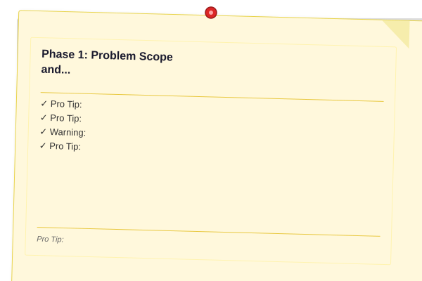
</a>


> **Pro Tip:** Master this concept thoroughly ? it is frequently tested in system design interviews.

> **Pro Tip:** Master this concept ? it appears in nearly every system design interview. Understand both the how and the why.

> **Warning:** A common mistake is over-engineering. Always start simple and add complexity only when justified by requirements.

> **Pro Tip:** Master this concept thoroughly ? it appears in nearly every system design interview.
Uber connects riders with drivers in real time across 70+ countries and 10,000+ cities. By 2024, the platform handled over 100 million monthly active riders and a comparable number of drivers, processing 30+ billion location events per day. Every four seconds, each active driver's GPS coordinate streams to Uber's servers. The matching system must pair a rider with the best available driver in under 500 milliseconds — fewer than the blink of an eye. The ETA displayed in the rider app must be accurate within 60 seconds for trips lasting over 30 minutes. Surge pricing adjusts in real time as demand spikes during rush hour, concerts, or severe weather.

The challenge is multifaceted. Location data is inherently two-dimensional, requiring specialized indexing structures that standard B-Trees cannot handle efficiently. GPS coordinates arrive with noise — urban canyons, tunnels, and atmospheric interference degrade accuracy. The system must distinguish between a driver stopped at a red light and a driver who has parked and gone offline. The matching problem is combinatorial: given N available drivers and M riders in a region, find the assignment that minimizes total wait time, subject to constraints on driver preferences, rider ratings, and vehicle type.

Non-functional requirements include five-nines availability for the dispatch core, global consistency for trip accounting (a rider must never be double-billed), and sub-second P99 latency for the match endpoint. The system must tolerate the failure of an entire AWS Availability Zone without losing trip state. Compliance with GDPR (right to deletion), CCPA, and local transportation regulations in each market adds further complexity.

Specific quantifiable targets:
- Match latency P50 &lt; 200ms, P99 < 500ms
- ETA accuracy: within 60 seconds for 95% of trips over 30 minutes
- Location event ingestion: 7.5M events/second sustained, 15M peak
- Trip accounting: zero tolerance for double-billing or missing charges
- System uptime: 99.999% for dispatch core, 99.99% for secondary services
- Disaster recovery: RTO &lt; 5 minutes, RPO < 1 second for trip state
- Global deployment: 8 primary data regions, active-active for dispatch reads

The functional requirements span four major user flows. For riders: request a ride, track the driver in real time, pay seamlessly, and rate the experience. For drivers: go online, receive ride requests, navigate to pickup and destination, and receive earnings. For the platform: match riders with available drivers optimally, compute accurate ETAs, adjust prices dynamically, and detect fraud. For city operations teams: monitor supply and demand dashboards, manage driver incentives, and respond to incident reports.

### Phase 2: Pre-Uber Architecture — The Monolith Era

<a href="../../assets/images/diagrams/system-design/21-case-study-uber/phase-2-pre-uber-architecture-the-monolith-era-handwritten.svg" target="_blank" rel="noopener">
  
</a>
<a href="../../assets/images/diagrams/system-design/21-case-study-uber/phase-2-pre-uber-architecture-the-monolith-era-diagram.svg" target="_blank" rel="noopener">
  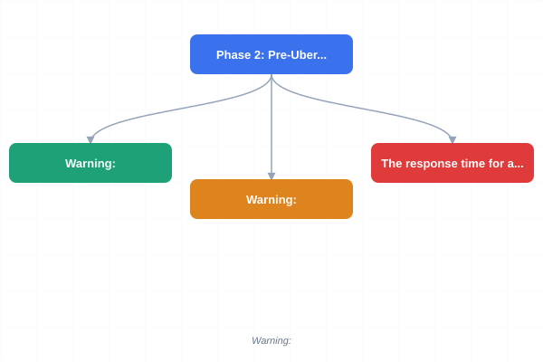
</a>
<a href="../../assets/images/diagrams/system-design/21-case-study-uber/phase-2-pre-uber-architecture-the-monolith-era-sticky.svg" target="_blank" rel="noopener">
  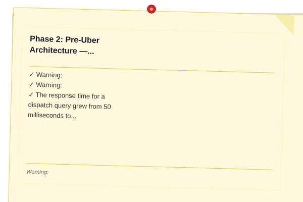
</a>


> **Warning:** Avoid over-engineering. Start simple, measure, then optimize.

> **Warning:** Avoid premature optimization. Start simple, measure, then optimize. Over-engineering is the most common system design mistake.

Uber's original architecture circa 2010 was a Python monolith built on top of a single MySQL database. The monolith handled ride requests, driver dispatch, payment processing, driver onboarding, surge pricing, and the web dashboard — all in one codebase. The database held a single `trips` table, a `drivers` table, and a `riders` table, with spatial queries executed through MySQL's geospatial extensions (which at the time supported only basic bounding-box lookups via MyISAM tables with R-Tree indexes).

As Uber expanded from San Francisco to Paris, London, Shanghai, and São Paulo, the monolith groaned under its own weight. A deployment to fix a typo in the payment email template required redeploying the entire stack, risking the dispatch system. The MySQL master could not keep up with write volume — the `trips` table alone grew to hundreds of gigabytes, and adding indexes caused replication lag that made followers minutes stale.

The spatial queries were the first bottleneck. Finding nearby drivers required a MySQL query like `SELECT * FROM drivers WHERE lat BETWEEN ? AND ? AND lng BETWEEN ? AND ? AND status = 'available'`. This bounding-box scan worked for 1,000 drivers but failed at 100,000. The response time for a dispatch query grew from 50 milliseconds to several seconds. Uber's engineers realized they needed a fundamentally different approach to spatial indexing.

### Phase 3: Post-Uber Architecture — Microservices, S2, and Kafka

<a href="../../assets/images/diagrams/system-design/21-case-study-uber/phase-3-post-uber-architecture-microservices-s2-and-kafka-handwritten.svg" target="_blank" rel="noopener">
  
</a>
<a href="../../assets/images/diagrams/system-design/21-case-study-uber/phase-3-post-uber-architecture-microservices-s2-and-kafka-diagram.svg" target="_blank" rel="noopener">
  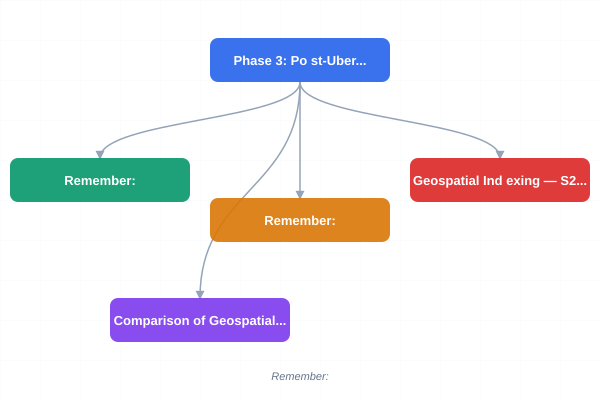
</a>
<a href="../../assets/images/diagrams/system-design/21-case-study-uber/phase-3-post-uber-architecture-microservices-s2-and-kafka-sticky.svg" target="_blank" rel="noopener">
  
</a>


> **Remember:** Always articulate trade-offs clearly ? interviewers value reasoning over the "right" answer.

> **Remember:** Trade-offs are the heart of system design. Always be ready to explain why you chose X over Y.

Uber's transformation into a service-oriented architecture unfolded over several years, resulting in 750+ microservices organized by domain. The architecture can be understood as a set of interconnected subsystems.

**Geospatial Indexing — S2 and H3**

The heart of Uber's location infrastructure is Google's S2 geometry library, later supplemented by Uber's own H3 hexagon system. S2 addresses the fundamental problem of spatial indexing: how do you map a 2D coordinate into a 1D index that can be stored in a B-Tree, used as a key in a hash table, or indexed by a database?

S2 solves this by projecting the Earth's surface onto a cube, then subdividing each cube face into a hierarchy of cells. The Hilbert space-filling curve visits every cell in a well-defined order, producing a single 64-bit integer (a "cell ID") for any point on Earth. Two points that are geographically close will have cell IDs that are numerically similar — a property that makes range queries efficient. The hierarchy has 31 levels (0 through 30), where level 0 cells cover roughly half the Earth's surface and level 30 cells cover roughly 0.5 square centimeters. Uber uses cells at levels 12-15 for dispatch (roughly 1-10 square kilometers per cell).

H3, developed by Uber in 2018, improves on S2 by using hexagons instead of squares. Hexagons have the critical property that all neighboring cells share an edge — a square's diagonal neighbors are farther away than its side neighbors, creating distortions in distance calculations. The hexagon hierarchy is aperture-7: each parent hexagon contains approximately 7 child hexagons. H3 resolution ranges from 0 (continent-sized) to 15 (roughly 0.5 square meters). Uber uses H3 primarily for visualization, aggregation, and market analysis rather than real-time dispatch.

**Comparison of Geospatial Indexing Approaches**

QuadTree was considered early in Uber's history before S2 was adopted. A QuadTree recursively subdivides space into four quadrants until each cell contains fewer than a threshold number of points. QuadTrees support dynamic grid sizing — dense urban areas are subdivided more finely than sparse rural areas — which naturally adapts to point density. However, QuadTrees have significant drawbacks for Uber's use case. They require in-memory tree traversal for neighbor queries, cannot be indexed in a standard database (the tree structure is complex to serialize), and are hard to shard across machines. In contrast, S2's 64-bit cell IDs are B-Tree friendly, storable in any database, and trivially shardable by cell ID prefix.

H3's hexagons add a third option with advantages for aggregation and visualization. A hexagon's six equidistant neighbors eliminate the distance distortion problem that plagues square grids. When computing "how many drivers are in the neighborhood," hexagons give more consistent results regardless of direction. The aperture-7 hierarchy means each parent hexagon has roughly 7 children, which maps naturally to the base-10 decimal system for human-readable zoom levels. However, hexagons require more computation for parent-child relationships (the 7 children do not tile perfectly), and H3's 64-bit encoding is less efficient than S2's for range queries because hexagons do not tile the plane with a space-filling curve.

Uber's architecture uses all three: S2 for dispatch (because cell IDs are sorted by proximity, enabling efficient range scans for nearby drivers), H3 for visualization (because hexagons produce cleaner heat maps and aggregation buckets), and QuadTree elements in the analytics layer for offline geospatial modeling where tree-based adaptive subdivision provides better precision for long-tail analysis.

**S2 Cell Hierarchy in Practice**

The S2 cell hierarchy ranges from level 0 (each face of the cube — roughly half a hemisphere) to level 30 (0.5 cm²). Each level subdivides the previous level by 4, so cell area decreases by a factor of 4 for each increment. For dispatch purposes, Uber found that levels 12-15 provide the right granularity:

- Level 12: ~100 km² — used for very sparse areas (highways between cities, rural zones)
- Level 13: ~25 km² — default for suburban dispatch
- Level 14: ~6.25 km² — default for urban dispatch (the most commonly used)
- Level 15: ~1.56 km² — used for dense downtown cores with many drivers

The choice of level is dynamic. A geofence query starts at level 14 for the rider's location. If too few drivers are found (below a configurable threshold, typically 5), the query expands to the parent cell at level 13, then level 12, each time querying the cell's drivers plus a one-cell ring around it. Conversely, if too many drivers are found (above 100, typically), the system can narrow to child cells and route the query to only the cells closest to the rider. This adaptive depth ensures consistent performance across varying densities.

**Real-Time Location Pipeline**

Every active driver's smartphone sends a GPS coordinate every 4 seconds via a gRPC or WebSocket connection. This stream of 7.5 million updates per second must be ingested without data loss.

```
Driver App --[gRPC/WebSocket]--> Gateway Service --[Kafka]--> Flink Streaming
                                                                    |
                                                            +---------+---------+
                                                            |                   |
                                                         Redis              HDFS
                                                   (Current Location)   (Historical)
```

The gateway service authenticates the driver, validates the coordinate (rejecting obviously impossible values like lat=500), and publishes the event to a Kafka topic partitioned by city. Flink consumes this stream with a sliding window of 4 seconds. For each window, Flink computes the driver's smoothed position using a Kalman filter, updates the driver's current position in a Redis cluster (keyed by driver ID with a TTL of 15 seconds to handle disconnects), and writes the raw event to HDFS for batch analytics.

The Kalman filter is essential. Raw GPS readings have an error radius of 5-15 meters. The filter models the driver's state as position and velocity, producing an estimate that is significantly more accurate than any single reading. When a driver enters a tunnel and GPS is lost, the Kalman filter's prediction step continues propagating the last known velocity, providing a plausible position estimate until the signal returns.

**The Dispatch Algorithm**

When a rider opens the Uber app and requests a ride, the following sequence executes in under 500 milliseconds:

1. The rider's phone sends its GPS coordinates to the matching service.
2. The matching service uses S2 to compute the cell ID at resolution 14 for the rider's location.
3. It queries a geofence around the rider — typically the rider's S2 cell plus all neighboring cells (the "ring" at distance 1).
4. For each cell, it reads from Redis the list of available drivers in that cell, along with their current state (location, heading, speed, rating, acceptance rate).
5. A scoring function computes a score for each eligible driver:

   - ETA score: `min(estimated_time_to_pickup, MAX_WAIT)` where ETA is computed using the map-matched route from the driver's position to the rider's position, factoring in current traffic.
   - Direction score: penalizes drivers heading away from the rider.
   - Rating score: `driver_rating / 5.0`, ensuring high-rated drivers are preferred.
   - Surge multiplier: adjusted based on current demand/supply ratio.
   - Supply score: if the area is supply-constrained, the system expands the search radius.

6. The assignment is formulated as a minimum-weight bipartite matching problem. Given M riders and N drivers in a geofence region, the Hungarian algorithm finds the assignment that minimizes `sum(estimated_wait_time)` across all pairs. In practice, Uber uses a greedy approximation that is near-optimal but runs in O(N log N) instead of O(N^3).

**Surge Pricing Mechanics**

Surge pricing adjusts the fare multiplier in real time based on the ratio of active riders to available drivers in each geofence region. The system computes:

```
surge_multiplier = base_ratio + (current_demand / current_supply) * sensitivity_factor
```

This multiplier is clamped to a range (typically 1.0x to 3.0x, but can go higher during emergencies). The pricing service processes demand statistics every 2-5 minutes from Flink aggregation. A machine learning model trained on historical trip data predicts demand for each geofence in 5-minute windows, allowing the system to pre-position surge pricing before demand spikes.

Riders see the surge multiplier before confirming a ride. Drivers are notified of surge zones so they can reposition themselves. This market-based mechanism efficiently allocates supply to demand: when a concert ends, surge pricing draws drivers to the venue, clearing the queue faster than a flat-price system would.

**ETA Prediction**

Uber's ETA prediction has evolved from a simple distance/speed heuristic to an ensemble of gradient-boosted decision trees and neural networks. The feature set includes:

- Road-segment-specific historical speed profiles (15-minute buckets for each day of the week)
- Real-time traffic data from Waze partnership and internal GPS speed aggregation
- Intersection delay modeling (turn times, traffic light patterns)
- Time-of-day and day-of-week features
- Weather data (precipitation, visibility, temperature)
- Special events (concerts, sports games, parades)
- Driver behavior features (does this driver typically drive faster or slower than average?)

The model is served via Uber's Michelangelo ML platform, which handles feature extraction, model inference, and online training. The ETA is recalculated every 30 seconds during a trip and whenever the driver deviates significantly from the expected route.

**Trip Tracking and Map Matching**

During a trip, the driver's GPS trajectory is a sequence of noisy points. Map matching aligns these points to the road network. Uber uses a hidden Markov model (HMM) approach: each GPS observation is an emission from a hidden state (the true road position), and transitions between hidden states follow the road network topology. The Viterbi algorithm finds the most likely sequence of road segments.

Map matching serves several purposes:
- Accurate ETA updates (a driver 100 meters off the expected route may add 5 minutes to ETA)
- Route deviation detection (the driver is going the wrong way)
- Fare calculation (distance traveled on roads, not GPS distance)
- Safety monitoring (is the trip following the expected path?)

**Payment Processing Architecture**

Payment processing at Uber's scale must handle millions of transactions daily across 70+ countries, each with different payment methods, currencies, tax regimes, and regulatory requirements. The payment system is a separate domain-oriented microservice with its own data store and failure isolation.

The payment flow begins when a trip ends. The fare calculation service computes the final amount based on: base fare + distance * per_distance_rate + time * per_minute_rate + surge_multiplier + booking_fee - promotions. For upfront pricing (introduced in 2016), the fare is computed at request time and guaranteed to the rider unless the route changes significantly.

Once the fare is computed, the payment service:
1. Authorizes the rider's payment method (credit card, PayPal, Uber Cash, or local methods like Alipay in China, Boleto in Brazil, M-Pesa in Kenya)
2. Charges the split-second optimized fare (using idempotency keys to prevent double-charges)
3. Deposits the driver's earnings (after Uber's commission, typically 20-30%) into the driver's earnings wallet
4. Handles the 7-day settlement cycle for drivers who choose weekly payouts (instant pay for Uber Pro members)
5. Generates receipts in the rider's local language and currency

The payment service uses its own database sharded by region, with strict ACID guarantees for the transaction itself. However, for reporting and reconciliation, it publishes events to Kafka that are consumed by the accounting service and the fraud detection pipeline. Dual-write concerns (writing to both the payment database and Kafka) are handled by the transactional outbox pattern: the payment service writes the event to an outbox table in the same database transaction, and a separate process reads the outbox and publishes to Kafka.

Fraud detection is a critical sub-system. The fraud service processes payment events through a combination of rules (matching against known fraud patterns) and ML models that score each transaction on features like: device fingerprint, GPS location of the rider vs. the payment method's billing address, historical chargeback rate, velocity of new accounts from the same device, and anomaly detection on trip patterns (e.g., very short trips with very high fares).

**Driver Onboarding and Compliance**

Driver onboarding is a complex workflow that must satisfy regulatory requirements in every market. The onboarding service implements a state machine:
1. Identity verification: Upload government ID (passport, driver's license) ? document OCR extraction ? background check via third-party API (Checkr in the US, similar partners globally)
2. Vehicle inspection: Upload vehicle registration and insurance ? verify coverage meets minimum requirements ? schedule in-person or virtual vehicle inspection
3. Training: Complete safety video series ? pass knowledge test ? acknowledge community guidelines
4. Activation: Receive activation notification ? download driver app ? go online for first time

The onboarding service uses Kafka as the event backbone: each step completion publishes an event, and downstream services react. The background check service listens for the "identity verified" event and initiates the background check. The vehicle inspection service listens for the "documents uploaded" event and triggers the inspection workflow.

This event-driven architecture allows onboarding to be asynchronous and resilient. If the background check provider is slow (taking hours or days), the rest of the onboarding can proceed up to the point where the background check result is needed. The service maintains a "onboarding completeness" score for each applicant and sends progress notifications via push notification, email, and SMS.

**Safety Features**

Uber's safety features are a first-class architectural concern, not an afterthought. The safety system comprises several sub-services:

- **RideCheck**: An ML model running on the client app and server detects unexpected trip events: long stops, route deviations, crashes (detected via accelerometer/GPS patterns). When detected, the system sends an in-app prompt asking if the rider is okay and, if no response, escalates to the safety response team and optionally contacts emergency services.

- **Emergency Button**: In-app button that shares real-time location, trip details, and vehicle information with local emergency services. The integration uses a third-party API (RapidSOS in the US) to transmit data directly to 911 dispatchers.

- **Real-Time ID Check**: Drivers are periodically prompted to take a selfie before going online. The selfie is compared to the driver's profile photo using facial recognition. The system uses a one-to-one matching model with a threshold confidence score. Failures trigger a manual review by the safety team.

- **Trip Sharing**: Riders can share their real-time trip status with trusted contacts via a shareable link that shows the driver's name, photo, vehicle details, and live GPS location on a map.

- **SOS Beacon**: In markets where it is supported, the app can trigger an audible alarm and flash the screen to deter an attacker.

Each safety feature is implemented as an independent microservice with its own data store, ensuring that a failure in the dispatch system does not impact safety features.

**Historical Data and Analytics**

The raw location stream, trip records, and driver-rider interactions all flow to Hadoop HDFS for offline processing. Hive and Spark process this data for:
- Fraud detection: identifying fake trips, GPS spoofing, collusion between drivers and riders
- Market analysis: demand patterns by city, neighborhood, time of day
- Driver supply forecasting: predicting how many drivers will be online next Tuesday at 3 PM
- Pricing model training: training data for surge prediction and ETA models
- Business intelligence: dashboards for city operations teams

### Phase 4: Data Storage, Sharding, and Infrastructure

<a href="../../assets/images/diagrams/system-design/21-case-study-uber/phase-4-data-storage-sharding-and-infrastructure-handwritten.svg" target="_blank" rel="noopener">
  
</a>
<a href="../../assets/images/diagrams/system-design/21-case-study-uber/phase-4-data-storage-sharding-and-infrastructure-diagram.svg" target="_blank" rel="noopener">
  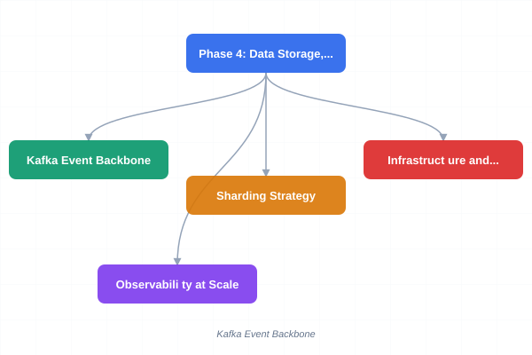
</a>
<a href="../../assets/images/diagrams/system-design/21-case-study-uber/phase-4-data-storage-sharding-and-infrastructure-sticky.svg" target="_blank" rel="noopener">
  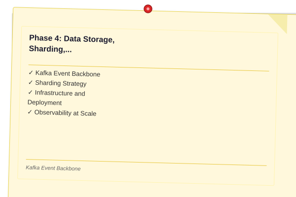
</a>


**Kafka Event Backbone**

Kafka sits at the center of Uber's architecture, handling 30+ billion events per day across 300+ topics. Critical topics include `location_updates`, `trip_events`, `payment_events`, `dispatch_decisions`, and `surge_updates`. Kafka MirrorMaker replicates data across data centers, providing disaster recovery and allowing read traffic to be served from the nearest data center. The event schema is managed by Apache Avro, ensuring backward and forward compatibility as services evolve independently.

**Sharding Strategy**

Uber shards its data primarily by city or region. Each city is largely self-contained: a ride request in San Francisco does not need to query driver data in Tokyo. City-level sharding provides natural data isolation, reduces cross-shard queries, and allows capacity to be added on a per-city basis.

However, cross-city trips (e.g., a rider going from San Francisco to Oakland) require API orchestration. The dispatch service coordinates between the origin city shard (finding a driver) and the destination city shard (preparing for arrival). The trip record exists in the origin shard, with a cross-reference in the destination shard.

**Infrastructure and Deployment**

Uber runs on a multi-cloud and on-premises hybrid infrastructure. The core dispatch system runs on bare-metal servers in colocation facilities for predictable latency. Analytics workloads run on public cloud (AWS and GCP). The deployment pipeline uses uDeploy (Uber's internal CI/CD system), and services are containerized with Docker and orchestrated by Peloton (Uber's internal resource scheduler). Service discovery uses Hyperbahn (Ringpop-based), and the observability stack includes M3 (metrics, built by Uber to replace Graphite), Jaeger (distributed tracing, also built by Uber and later open-sourced as a CNCF project), and ELK (logging).

**Observability at Scale**

M3 is Uber's metrics system, built to handle 10 million metrics per second across the entire fleet. Metrics are collected by a local agent on each host and sent to M3 aggregators, which downsample over time: 10-second resolution for the first hour, 1-minute for 24 hours, 5-minute for 30 days, and 1-hour for permanent retention. Each service exports RED metrics (Rate of requests, Errors, Duration of requests) for every endpoint, organized by status code, shard, and host. The dispatch service's M3 dashboard is the first thing an on-call engineer checks during an incident.

Jaeger, which originated at Uber, provides end-to-end tracing for every ride request. A single ride request trace spans 15-25 services: API gateway ? authentication ? geofence ? driver search ? scoring ? assignment ? notification ? payment authorization. Each span records the service name, operation name, start time, duration, and any errors. Jaeger's sampling strategy is adaptive: high-volume endpoints are sampled at 1%, but if a trace includes an error, it is force-sampled at 100%. This ensures the team can always debug failures without overwhelming the trace storage.

**Chaos Engineering and Resilience Testing**

Uber runs a structured chaos engineering program called "uChaos" that injects failures into the production system during low-traffic periods. The chaos experiments include:

- **Latency injection**: Adds 500ms of latency to random Redis read requests to simulate a slow cache
- **Instance termination**: Randomly kills 5% of the dispatch service instances
- **Packet loss**: Drops 1% of packets between the dispatch service and the driver location store
- **Kafka broker failure**: Shuts down one Kafka broker and verifies that producers and consumers rebalance without data loss

Each experiment has a blast radius (limited to one city or one region), a hypothesis ("The dispatch service will maintain P99 &lt; 500ms even with 20% of instances terminated"), and an automated rollback ("If error rate exceeds 1% for 30 seconds, terminate the experiment"). The results are reviewed in a weekly resilience review meeting, and teams are responsible for fixing any regressions within the next sprint.

**API Gateway and Versioning Strategy**

Uber's API Gateway sits between mobile clients and backend services, handling authentication, rate limiting, request routing, and response aggregation. The gateway evolved through three generations:

- **Generation 1** (monolith era): A simple Nginx reverse proxy with hardcoded route tables. Every new feature required a configuration change and restart.
- **Generation 2** (early microservices): A custom Go-based gateway that read route definitions from ZooKeeper. Services registered themselves, and the gateway dynamically routed requests. This supported canary deployments (5% of traffic to a new service version) and circuit breaking (if a service returned 5xx errors for 10% of requests, the gateway would fail-open for 30 seconds).
- **Generation 3** (current): A layered gateway architecture. The outer layer (Envoy proxy at the edge) handles TLS termination, DDoS protection, and basic rate limiting. The inner layer (Uber's custom gateway service) handles authentication, business-level routing, and response aggregation. The two layers communicate via localhost HTTP to minimize latency.

API versioning follows a pragmatic strategy: the mobile client specifies its version in a request header (e.g., `X-Uber-App-Version: 4.32.1`). The gateway routes to the appropriate service version based on the app version range declared by each service. Old service versions are decommissioned when fewer than 1% of active clients use them. This avoids the overhead of URL-based versioning (e.g., `/v1/`, `/v2/`) while maintaining backward compatibility.

**Service Mesh and Communication Patterns**

Uber's 750+ services communicate through a service mesh built on Hyperbahn (Ringpop-based RPC). Each service has a well-defined API contract defined in Apache Thrift IDL or gRPC protobuf. The communication patterns fall into three categories:

1. **Synchronous request-response** (gRPC): Used for latency-sensitive operations like dispatch matching, ETA queries, and fare calculation. The client makes a request and waits for the response within a configured timeout (typically 100-500ms). Finagle's connection pooling keeps persistent TCP connections to downstream services, eliminating connection establishment overhead.

2. **Asynchronous event-driven** (Kafka): Used for operations that do not require an immediate response. Examples include location update events, trip completion notifications, and payment processing confirmations. The producer publishes an event to a Kafka topic and continues processing. One or more consumer groups process the event asynchronously.

3. **Streaming** (gRPC streams / WebSocket): Used for real-time bidirectional communication with mobile clients. The driver app maintains a persistent WebSocket connection to the gateway service. The rider app uses gRPC server-sent streaming for location updates and trip status changes.

The choice between synchronous and asynchronous communication at each boundary is a critical architectural decision. The dispatch matching endpoint is synchronous because the rider is waiting for a response. However, the downstream scoring may fan out to multiple services in parallel using Finagle futures: the dispatch service sends concurrent requests to the geofence service, the surge service, and the ETA service, then combines the results using a composite future that completes when all three respond. If any service is slow, the entire request waits for the slowest response. To mitigate this, each service has a strict timeout (geofence: 50ms, surge: 30ms, ETA: 100ms). If a service times out, the dispatch uses a default value (no surge multiplier, average ETA estimate) and logs the timeout for debugging.

**Caching Strategy**

Uber's caching strategy operates at multiple levels:

- **Driver positions** (Redis, TTL 15s): The primary hot cache. Each driver's current position (lat, lng, heading, speed, status) is stored in a Redis hash with key `driver:<id>:state`. The TTL is set to 15 seconds to automatically expire stale data for drivers who go offline without sending a disconnect signal.

- **Geofence driver lists** (Redis, no TTL but continuously refreshed): For each active S2 cell, a Redis set stores the driver IDs currently in that cell. When a driver's position updates and their cell changes, the Flink job atomically removes the ID from the old cell's set and adds it to the new cell's set using a Lua script for atomicity.

- **ETA precomputation** (Redis, TTL 60s): For popular origin-destination pairs (e.g., downtown to airport), the ETA is precomputed every 60 seconds and cached. Cache hits serve in under 5ms instead of the 200ms ETA model inference time.

- **Trip metadata** (Memcache, TTL 30 minutes): Trip details that change infrequently (origin address, destination, rider name) are cached in Memcache to reduce database load.

**Observability at Scale**

Uber operates in an active-active configuration across multiple data centers. Each data center can serve the full dispatch workload. Reads are served from the local data center, while writes are fanned out to all data centers. Cross-datacenter replication for driver positions uses a custom solution built on Kafka MirrorMaker: each data center runs its own Kafka cluster, and MirrorMaker copies all location events to the other data centers with a replication lag target of under 2 seconds.

This active-active configuration has saved Uber from several major outages. When a power failure affected one data center, traffic was diverted to the other data centers within 60 seconds. The only visible impact to riders was a slight increase in match latency (from 200ms to 350ms) for the duration of the failover.

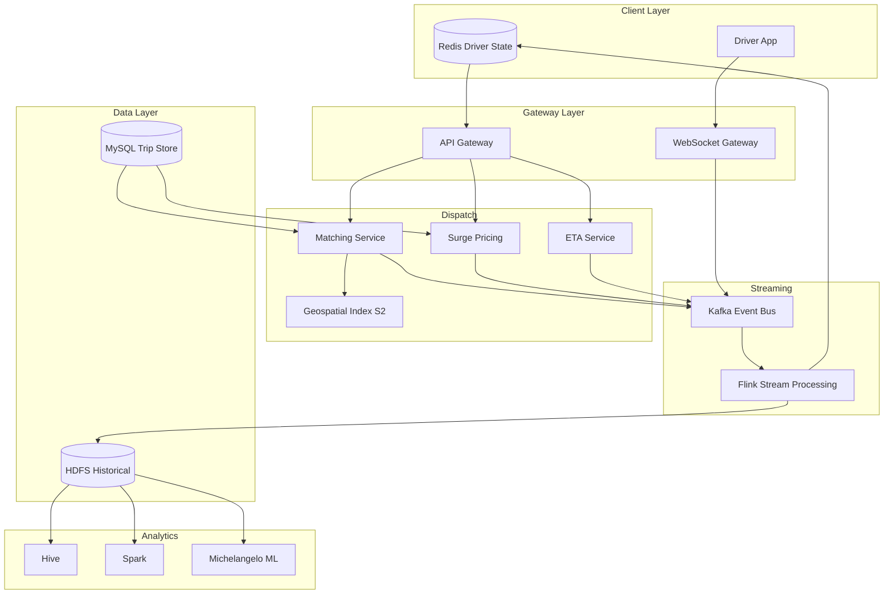

## Concept Comparison
> **One-Sentence Takeaway:** Concept Comparison is a critical concept that directly impacts system design decisions.

| Concept | Definition | Key Metric |
|---------|-----------|------------|
| Theory / Case Study | Core topic covered in Chapter 21: Case Study — Uber and Location-Based Services | Defined by specific measurable attributes |

---

## Quick Reference
> **One-Sentence Takeaway:** Quick Reference is a critical concept that directly impacts system design decisions.

| Topic | Key Point |
|-------|-----------|
| Theory / Case Study | Fundamental concept for Chapter 21: Case Study — Uber and Location-Based Services |

---

## Cross-Application Matrix

| Component | When to Use | Trade-Off |
|-----------|------------|-----------|
| Theory / Case Study | Appropriate for specific system contexts | Each choice involves trade-offs |

---

## Chapter Quiz

| # | Question | Options | Answer |
|---|----------|---------|--------|
| 1 | What geospatial indexing approach does Uber use for real-time dispatch? | A) QuadTree, B) Google S2 with Hilbert curve 64-bit cell IDs, C) R-Tree in MySQL, D) PostGIS | B |
| 2 | How does the dispatch algorithm perform matching between riders and drivers? | A) Random assignment, B) Minimum-weight bipartite matching using greedy approximation scoring drivers by ETA, rating, and direction, C) First-come-first-served, D) Driver self-selection | B |
| 3 | What data structure does Uber use for demand/supply ratio trending? | A) Redis Sorted Sets, B) Count-min sketch, C) Flink sliding windows with Kalman filtering aggregated per geofence, D) MySQL materialized views | C |
| 4 | How does Uber shard data across its infrastructure? | A) By user ID hash, B) By city/region providing natural data isolation, C) Random sharding, D) By driver ID | B |
| 5 | What is the Kalman filter's role in the GPS pipeline? | A) Encrypt GPS data, B) Smooth noisy GPS readings combining position+velocity prediction with each observation, C) Compress GPS coordinates, D) Route calculation | B |

---

### Mermaid: Uber Architecture Evolution

<a href="../../assets/images/diagrams/system-design/21-case-study-uber/mermaid-uber-architecture-evolution-handwritten.svg" target="_blank" rel="noopener">
  
</a>
<a href="../../assets/images/diagrams/system-design/21-case-study-uber/mermaid-uber-architecture-evolution-diagram.svg" target="_blank" rel="noopener">
  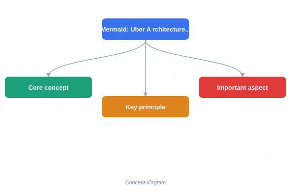
</a>
<a href="../../assets/images/diagrams/system-design/21-case-study-uber/mermaid-uber-architecture-evolution-sticky.svg" target="_blank" rel="noopener">
  
</a>


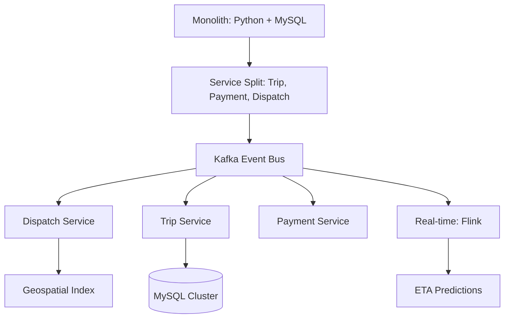

### TypeScript: Geospatial Index, Surge Pricing, Dispatch Matcher

```typescript
class S2CellId {
  static readonly maxLevel = 30;
  static fromLatLng(lat: number, lng: number, level: number): bigint {
    const phi = (lat * Math.PI) / 180;
    const theta = (lng * Math.PI) / 180;
    const x = Math.cos(phi) * Math.cos(theta);
    const y = Math.cos(phi) * Math.sin(theta);
    const z = Math.sin(phi);
    const face = 0; // simplified: always face 0
    const u = x / Math.max(Math.abs(y), Math.abs(z));
    const v = y / Math.max(Math.abs(x), Math.abs(z));
    const uvToST = (uv: number) => 0.5 * (uv + 1);
    const stToIJ = (s: number, level: number) => Math.min(Math.floor(s * (1 << level)), (1 << level) - 1);
    const i = stToIJ(uvToST(u), level);
    const j = stToIJ(uvToST(v), level);
    return BigInt((face << (2 * level)) | (i << level) | j);
  }
}

class SurgePricing {
  private demandHistory = new Map<string, number[]>();
  private readonly decayFactor = 0.7;

  recordDemand(geofence: string, requestCount: number): void {
    if (!this.demandHistory.has(geofence)) this.demandHistory.set(geofence, []);
    this.demandHistory.get(geofence)!.push(requestCount);
  }

  getMultiplier(geofence: string, supply: number): number {
    const demands = this.demandHistory.get(geofence) ?? [0];
    const recentDemand = demands.slice(-10).reduce((a, b) => a + b, 0) / Math.min(demands.length, 10);
    if (supply === 0) return 5.0;
    const ratio = recentDemand / supply;
    if (ratio <= 1) return 1.0;
    return Math.min(5.0, 1.0 + (ratio - 1) * 0.5);
  }
}

class DispatchOptimizer {
  match(requests: { id: string; lat: number; lng: number }[], drivers: { id: string; lat: number; lng: number }[]): Map<string, string> {
    const assignment = new Map<string, string>();
    const used = new Set<string>();
    for (const req of requests) {
      let best: string | null = null;
      let bestDist = Infinity;
      for (const drv of drivers) {
        if (used.has(drv.id)) continue;
        const dist = Math.hypot(drv.lat - req.lat, drv.lng - req.lng);
        if (dist < bestDist) { bestDist = dist; best = drv.id; }
      }
      if (best) { assignment.set(req.id, best); used.add(best); }
    }
    return assignment;
  }
}

class ETAPredictor {
  predict(distanceKm: number, trafficFactor: number): number {
    const baseSpeed = 30;
    const adjustedSpeed = baseSpeed * (1 - trafficFactor * 0.5);
    return (distanceKm / adjustedSpeed) * 3600;
  }
}
```

### TypeScript: Ride Matching

```typescript
interface RideRequest { userId: string; lat: number; lng: number; }
interface Driver { id: string; lat: number; lng: number; available: boolean; }

class RideMatcher {
  match(request: RideRequest, drivers: Driver[]): Driver | null {
    let best: Driver | null = null;
    let minDist = Infinity;
    for (const d of drivers) {
      if (!d.available) continue;
      const dist = Math.sqrt((d.lat - request.lat) ** 2 + (d.lng - request.lng) ** 2);
      if (dist < minDist) { minDist = dist; best = d; }
    }
    return best;
  }
}
```


### Implementation: Uber Architecture Case Study

<a href="../../assets/images/diagrams/system-design/21-case-study-uber/implementation-uber-architecture-case-study-handwritten.svg" target="_blank" rel="noopener">
  
</a>
<a href="../../assets/images/diagrams/system-design/21-case-study-uber/implementation-uber-architecture-case-study-diagram.svg" target="_blank" rel="noopener">
  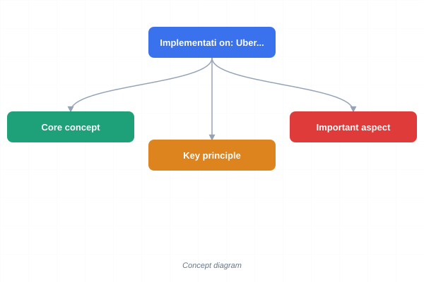
</a>
<a href="../../assets/images/diagrams/system-design/21-case-study-uber/implementation-uber-architecture-case-study-sticky.svg" target="_blank" rel="noopener">
  
</a>


```typescript
class UberArchitecture {
  private drivers = new Map<string, { id: string; lat: number; lng: number; status: string; rating: number; totalTrips: number }>();
  private riders = new Map<string, { id: string; lat: number; lng: number; paymentMethod: string }>();
  private trips = new Map<string, { riderId: string; driverId: string; pickup: number[]; dropoff: number[]; status: string; fare: number; distance: number }>();
  private pricingZones = new Map<string, { multiplier: number; demand: number; supply: number }>();
  registerDriver(id: string, lat: number, lng: number): void { this.drivers.set(id, { id, lat, lng, status: "available", rating: 5.0, totalTrips: 0 }); }
  registerRider(id: string, lat: number, lng: number): void { this.riders.set(id, { id, lat, lng, paymentMethod: "card" }); }
  private haversine(lat1: number, lng1: number, lat2: number, lng2: number): number { const R = 6371; const dLat = (lat2 - lat1) * Math.PI / 180; const dLng = (lng2 - lng1) * Math.PI / 180; const a = Math.sin(dLat/2)**2 + Math.cos(lat1*Math.PI/180) * Math.cos(lat2*Math.PI/180) * Math.sin(dLng/2)**2; return R * 2 * Math.atan2(Math.sqrt(a), Math.sqrt(1 - a)); }
  findNearby(lat: number, lng: number, radiusKm = 5): string[] { const nearby: { id: string; dist: number }[] = [];
    for (const [id, d] of this.drivers) { if (d.status !== "available") continue; const dist = this.haversine(lat, lng, d.lat, d.lng); if (dist <= radiusKm) nearby.push({ id, dist }); }
    return nearby.sort((a, b) => a.dist - b.dist).map(n => n.id); }
  requestRide(riderId: string, pickupLat: number, pickupLng: number, dropoffLat: number, dropoffLng: number): { tripId: string; driverId: string; fare: number; eta: number } | null {
    const rider = this.riders.get(riderId); if (!rider) return null; const nearby = this.findNearby(pickupLat, pickupLng); if (nearby.length === 0) return null;
    const driverId = nearby[0]; const driver = this.drivers.get(driverId)!; driver.status = "busy"; const dist = this.haversine(pickupLat, pickupLng, dropoffLat, dropoffLng);
    const fare = this.calculateFare(dist); const tripId = `trip-${Date.now()}`;
    this.trips.set(tripId, { riderId, driverId, pickup: [pickupLat, pickupLng], dropoff: [dropoffLat, dropoffLng], status: "in_progress", fare, distance: dist });
    return { tripId, driverId, fare, eta: Math.round(dist / 30 * 60) }; }
  private calculateFare(distKm: number): number { return Math.round((2.5 + distKm * 1.5 + distKm / 30 * 60 * 0.3) * 100) / 100; }
  completeTrip(tripId: string): { fare: number } { const t = this.trips.get(tripId); if (!t) throw new Error("Trip not found"); t.status = "completed"; this.drivers.get(t.driverId)!.status = "available"; return { fare: t.fare }; }
}
class SurgePricing { private zones = new Map<string, { demand: number; supply: number }>();
  recordDemand(zone: string): void { const z = this.zones.get(zone) || { demand: 0, supply: 1 }; z.demand++; this.zones.set(zone, z); }
  recordSupply(zone: string): void { const z = this.zones.get(zone) || { demand: 1, supply: 0 }; z.supply++; this.zones.set(zone, z); }
  getMultiplier(zone: string): number { const z = this.zones.get(zone); if (!z || z.supply === 0) return 1; const ratio = z.demand / z.supply; return ratio <= 1 ? 1 : ratio <= 2 ? 1.5 : ratio <= 3 ? 2.0 : 3.0; }
}
class TripRouter { shortestPath(lat1: number, lng1: number, lat2: number, lng2: number): { distanceKm: number; durationMin: number; path: number[][] } { const dist = this.haversine(lat1, lng1, lat2, lng2); return { distanceKm: Math.round(dist * 10) / 10, durationMin: Math.round(dist / 30 * 60), path: [[lat1, lng1], [lat2, lng2]] }; }
  private haversine(lat1: number, lng1: number, lat2: number, lng2: number): number { const R = 6371; const [rlat1, rlat2, rlng1, rlng2] = [lat1, lat2, lng1, lng2].map(d => d * Math.PI / 180); const dlat = rlat2 - rlat1; const dlng = rlng2 - rlng1; const a = Math.sin(dlat/2)**2 + Math.cos(rlat1)*Math.cos(rlat2)*Math.sin(dlng/2)**2; return R * 2 * Math.atan2(Math.sqrt(a), Math.sqrt(1-a)); } }
```

### TypeScript: Ride Matcher with Geohash Indexing, Surge Pricer with Dynamic Zones, and Trip Tracker

```typescript
class RideMatcher {
  private geoIndex = new Map<string, string[]>();
  private drivers = new Map<string, { id: string; lat: number; lng: number; available: boolean; rating: number; heading: number }>();
  private readonly geohashPrecision = 7;

  geohash(lat: number, lng: number, precision: number = this.geohashPrecision): string {
    const base32 = "0123456789bcdefghjkmnpqrstuvwxyz";
    let hash = "";
    let minLat = -90, maxLat = 90, minLng = -180, maxLng = 180;
    for (let i = 0; i < precision; i++) {
      let hashBit = 0;
      for (let j = 0; j < 5; j++) {
        if (i * 5 + j % 2 === 0) {
          const mid = (minLng + maxLng) / 2;
          if (lng >= mid) { hashBit = (hashBit << 1) | 1; minLng = mid; }
          else { hashBit = (hashBit << 1) | 0; maxLng = mid; }
        } else {
          const mid = (minLat + maxLat) / 2;
          if (lat >= mid) { hashBit = (hashBit << 1) | 1; minLat = mid; }
          else { hashBit = (hashBit << 1) | 0; maxLat = mid; }
        }
      }
      hash += base32[hashBit];
    }
    return hash;
  }

  neighbors(hash: string): string[] {
    const adjacent = new Set<string>();
    const base32 = "0123456789bcdefghjkmnpqrstuvwxyz";
    for (const c of base32) {
      for (let i = hash.length - 1; i >= 0; i--) {
        const neighbor = hash.slice(0, i) + c + hash.slice(i + 1);
        adjacent.add(neighbor);
      }
    }
    return [...adjacent];
  }

  updateDriverLocation(driverId: string, lat: number, lng: number): void {
    const driver = this.drivers.get(driverId);
    if (!driver) return;
    const oldHash = this.geohash(driver.lat, driver.lng);
    const newHash = this.geohash(lat, lng);
    if (oldHash !== newHash) {
      const oldList = this.geoIndex.get(oldHash);
      if (oldList) {
        const idx = oldList.indexOf(driverId);
        if (idx >= 0) oldList.splice(idx, 1);
      }
    }
    driver.lat = lat;
    driver.lng = lng;
    if (!this.geoIndex.has(newHash)) this.geoIndex.set(newHash, []);
    if (!this.geoIndex.get(newHash)!.includes(driverId)) this.geoIndex.get(newHash)!.push(driverId);
  }

  findNearest(riderLat: number, riderLng: number, radiusCells = 1): { driverId: string; eta: number }[] {
    const riderHash = this.geohash(riderLat, riderLng);
    const cells = [riderHash, ...this.neighbors(riderHash).slice(0, radiusCells * 8)];
    const candidates: { driverId: string; dist: number; eta: number }[] = [];
    const seen = new Set<string>();
    for (const cell of cells) {
      const driversInCell = this.geoIndex.get(cell) ?? [];
      for (const driverId of driversInCell) {
        if (seen.has(driverId)) continue;
        seen.add(driverId);
        const d = this.drivers.get(driverId)!;
        if (!d.available) continue;
        const dist = this.haversine(riderLat, riderLng, d.lat, d.lng);
        const eta = this.estimateETA(dist, d.heading, riderLat, riderLng, d.lat, d.lng);
        candidates.push({ driverId, dist, eta });
      }
    }
    return candidates.sort((a, b) => a.eta - b.eta).map(({ driverId, eta }) => ({ driverId, eta }));
  }

  private estimateETA(distKm: number, driverHeading: number, riderLat: number, riderLng: number, driverLat: number, driverLng: number): number {
    const speedKmph = 30;
    const directionPenalty = Math.abs(driverHeading - this.bearing(driverLat, driverLng, riderLat, riderLng)) > 90 ? 1.3 : 1.0;
    return Math.round((distKm / speedKmph) * 3600 * directionPenalty);
  }

  private bearing(lat1: number, lng1: number, lat2: number, lng2: number): number {
    const dLng = (lng2 - lng1) * Math.PI / 180;
    const y = Math.sin(dLng) * Math.cos(lat2 * Math.PI / 180);
    const x = Math.cos(lat1 * Math.PI / 180) * Math.sin(lat2 * Math.PI / 180) - Math.sin(lat1 * Math.PI / 180) * Math.cos(lat2 * Math.PI / 180) * Math.cos(dLng);
    return (Math.atan2(y, x) * 180 / Math.PI + 360) % 360;
  }

  private haversine(lat1: number, lng1: number, lat2: number, lng2: number): number {
    const R = 6371; const dLat = (lat2 - lat1) * Math.PI / 180; const dLng = (lng2 - lng1) * Math.PI / 180;
    const a = Math.sin(dLat/2)**2 + Math.cos(lat1*Math.PI/180) * Math.cos(lat2*Math.PI/180) * Math.sin(dLng/2)**2;
    return R * 2 * Math.atan2(Math.sqrt(a), Math.sqrt(1 - a));
  }
}

class SurgePricer {
  private zones = new Map<string, { demand: number; supply: number; baselineDemand: number; multiplier: number; lastUpdated: number }>();
  private readonly minMultiplier = 1.0;
  private readonly maxMultiplier = 5.0;
  private readonly decayRate = 0.1;

  recordDemand(zoneId: string): void {
    if (!this.zones.has(zoneId)) this.zones.set(zoneId, { demand: 0, supply: 1, baselineDemand: 0, multiplier: 1.0, lastUpdated: Date.now() });
    const zone = this.zones.get(zoneId)!;
    zone.demand++;
    zone.lastUpdated = Date.now();
    this.recalculate(zoneId);
  }

  recordSupply(zoneId: string): void {
    if (!this.zones.has(zoneId)) this.zones.set(zoneId, { demand: 1, supply: 0, baselineDemand: 0, multiplier: 1.0, lastUpdated: Date.now() });
    const zone = this.zones.get(zoneId)!;
    zone.supply++;
    zone.lastUpdated = Date.now();
    this.recalculate(zoneId);
  }

  setBaseline(zoneId: string, baselineDemand: number): void {
    if (!this.zones.has(zoneId)) this.zones.set(zoneId, { demand: 0, supply: 1, baselineDemand: 0, multiplier: 1.0, lastUpdated: Date.now() });
    this.zones.get(zoneId)!.baselineDemand = baselineDemand;
  }

  getMultiplier(zoneId: string): number {
    const zone = this.zones.get(zoneId);
    if (!zone || zone.supply === 0) return this.maxMultiplier;
    const ratio = zone.demand / zone.supply;
    const spikeFactor = zone.baselineDemand > 0 ? zone.demand / Math.max(zone.baselineDemand, 1) : 1;
    const multiplier = Math.min(this.maxMultiplier, Math.max(this.minMultiplier, 1.0 + (ratio - 1) * 0.5 * spikeFactor));
    return Math.round(multiplier * 10) / 10;
  }

  private recalculate(zoneId: string): void {
    const zone = this.zones.get(zoneId);
    if (zone) zone.multiplier = this.getMultiplier(zoneId);
  }

  decayAll(): void {
    const now = Date.now();
    for (const [zoneId, zone] of this.zones) {
      const elapsed = (now - zone.lastUpdated) / 1000;
      if (elapsed > 120) {
        zone.multiplier = Math.max(this.minMultiplier, zone.multiplier - this.decayRate * (elapsed / 60));
        if (zone.multiplier <= this.minMultiplier + 0.1) {
          zone.multiplier = this.minMultiplier;
          zone.demand = 0;
          zone.supply = 1;
        }
      }
    }
  }

  getActiveSurgeZones(): { zoneId: string; multiplier: number }[] {
    return [...this.zones.entries()]
      .filter(([_, z]) => z.multiplier > this.minMultiplier)
      .map(([zoneId, z]) => ({ zoneId, multiplier: z.multiplier }))
      .sort((a, b) => b.multiplier - a.multiplier);
  }
}

class TripTracker {
  private trips = new Map<string, { driverId: string; riderId: string; path: { lat: number; lng: number; ts: number }[]; status: string; fare: number; distance: number }>();
  private readonly farePerKm = 1.5;
  private readonly farePerMin = 0.3;
  private readonly baseFare = 2.5;

  startTrip(tripId: string, driverId: string, riderId: string): void {
    this.trips.set(tripId, { driverId, riderId, path: [], status: "in_progress", fare: 0, distance: 0 });
  }

  recordGPS(tripId: string, lat: number, lng: number): void {
    const trip = this.trips.get(tripId);
    if (!trip) return;
    const lastPoint = trip.path[trip.path.length - 1];
    if (lastPoint) {
      trip.distance += this.haversine(lastPoint.lat, lastPoint.lng, lat, lng);
    }
    trip.path.push({ lat, lng, ts: Date.now() });
  }

  matchPathToRoad(tripId: string, roadNetwork: { nodes: { lat: number; lng: number }[]; edges: [number, number][] }): { matchedPoints: number; deviation: number } {
    const trip = this.trips.get(tripId);
    if (!trip || trip.path.length === 0) return { matchedPoints: 0, deviation: 0 };
    let matched = 0;
    let totalDeviation = 0;
    for (const point of trip.path) {
      let minDist = Infinity;
      for (const node of roadNetwork.nodes) {
        const dist = this.haversine(point.lat, point.lng, node.lat, node.lng);
        if (dist < minDist) minDist = dist;
      }
      if (minDist < 0.05) matched++;
      totalDeviation += minDist;
    }
    return { matchedPoints: matched, deviation: totalDeviation / trip.path.length };
  }

  calculateFare(tripId: string, surgeMultiplier = 1.0): { fare: number; distanceKm: number; durationMin: number } {
    const trip = this.trips.get(tripId);
    if (!trip || trip.path.length < 2) return { fare: 0, distanceKm: 0, durationMin: 0 };
    const durationMs = trip.path[trip.path.length - 1].ts - trip.path[0].ts;
    const durationMin = durationMs / 60000;
    const distanceKm = trip.distance;
    const fare = (this.baseFare + distanceKm * this.farePerKm + durationMin * this.farePerMin) * surgeMultiplier;
    trip.fare = Math.round(fare * 100) / 100;
    return { fare: trip.fare, distanceKm: Math.round(distanceKm * 10) / 10, durationMin: Math.round(durationMin * 10) / 10 };
  }

  endTrip(tripId: string): { fare: number; distanceKm: number; pathLength: number } {
    const trip = this.trips.get(tripId);
    if (!trip) throw new Error("Trip not found");
    trip.status = "completed";
    return { fare: trip.fare, distanceKm: Math.round(trip.distance * 10) / 10, pathLength: trip.path.length };
  }

  private haversine(lat1: number, lng1: number, lat2: number, lng2: number): number {
    const R = 6371; const dLat = (lat2 - lat1) * Math.PI / 180; const dLng = (lng2 - lng1) * Math.PI / 180;
    const a = Math.sin(dLat/2)**2 + Math.cos(lat1*Math.PI/180) * Math.cos(lat2*Math.PI/180) * Math.sin(dLng/2)**2;
    return R * 2 * Math.atan2(Math.sqrt(a), Math.sqrt(1 - a));
  }
}
```

### TypeScript: Map Matching and ETA Prediction

```typescript
class MapMatcher {
  private roadGraph = new Map<string, { neighbors: string[]; speedKmph: number; bearing: number }>();

  addRoad(segmentId: string, neighbors: string[], speedKmph: number, bearing: number): void {
    this.roadGraph.set(segmentId, { neighbors, speedKmph, bearing });
  }

  viterbiMatch(gpsPoints: { lat: number; lng: number; ts: number }[]): { roadSegments: string[]; confidence: number } {
    if (gpsPoints.length === 0) return { roadSegments: [], confidence: 0 };
    const candidates = [...this.roadGraph.keys()];
    const dp: Map<string, { prob: number; prev: string | null }>[] = [];
    const first: Map<string, { prob: number; prev: string | null }> = new Map();
    for (const seg of candidates) {
      first.set(seg, { prob: 1 / candidates.length, prev: null });
    }
    dp.push(first);
    for (let t = 1; t < gpsPoints.length; t++) {
      const prev = dp[t - 1];
      const curr: Map<string, { prob: number; prev: string | null }> = new Map();
      for (const seg of candidates) {
        let maxProb = 0;
        let bestPrev: string | null = null;
        for (const [prevSeg, prevState] of prev) {
          const road = this.roadGraph.get(prevSeg)!;
          const transitionProb = road.neighbors.includes(seg) ? 0.8 : 0.2;
          const emissionProb = 1 / candidates.length;
          const prob = prevState.prob * transitionProb * emissionProb;
          if (prob > maxProb) { maxProb = prob; bestPrev = prevSeg; }
        }
        curr.set(seg, { prob: maxProb, prev: bestPrev });
      }
      dp.push(curr);
    }
    let bestSeg = "";
    let bestProb = 0;
    for (const [seg, state] of dp[dp.length - 1]) {
      if (state.prob > bestProb) { bestProb = state.prob; bestSeg = seg; }
    }
    const path: string[] = [bestSeg];
    for (let t = dp.length - 1; t > 0; t--) {
      const prev = dp[t].get(bestSeg)!.prev;
      if (prev) { path.unshift(prev); bestSeg = prev; }
    }
    return { roadSegments: path, confidence: bestProb };
  }
}

class ETAPredictor {
  private historicalSpeed = new Map<string, { dayOfWeek: number; hour: number; avgSpeed: number }[]>();

  train(observations: { segmentId: string; dayOfWeek: number; hour: number; speed: number }[]): void {
    for (const obs of observations) {
      if (!this.historicalSpeed.has(obs.segmentId)) this.historicalSpeed.set(obs.segmentId, []);
      this.historicalSpeed.get(obs.segmentId)!.push({ dayOfWeek: obs.dayOfWeek, hour: obs.hour, avgSpeed: obs.speed });
    }
  }

  predict(segments: string[], dayOfWeek: number, hour: number, trafficFactor = 1.0): { totalMinutes: number; segmentBreakdown: { segmentId: string; minutes: number }[] } {
    const segmentBreakdown: { segmentId: string; minutes: number }[] = [];
    let totalMinutes = 0;
    for (const segId of segments) {
      const history = this.historicalSpeed.get(segId) ?? [];
      const relevant = history.filter(h => h.dayOfWeek === dayOfWeek && Math.abs(h.hour - hour) <= 1);
      const avgSpeed = relevant.length > 0 ? relevant.reduce((s, h) => s + h.avgSpeed, 0) / relevant.length : 30;
      const adjustedSpeed = avgSpeed * (1 - trafficFactor * 0.3);
      const distanceKm = 1;
      const minutes = (distanceKm / adjustedSpeed) * 60;
      segmentBreakdown.push({ segmentId: segId, minutes: Math.round(minutes * 10) / 10 });
      totalMinutes += minutes;
    }
    return { totalMinutes: Math.round(totalMinutes * 10) / 10, segmentBreakdown };
  }
}
```

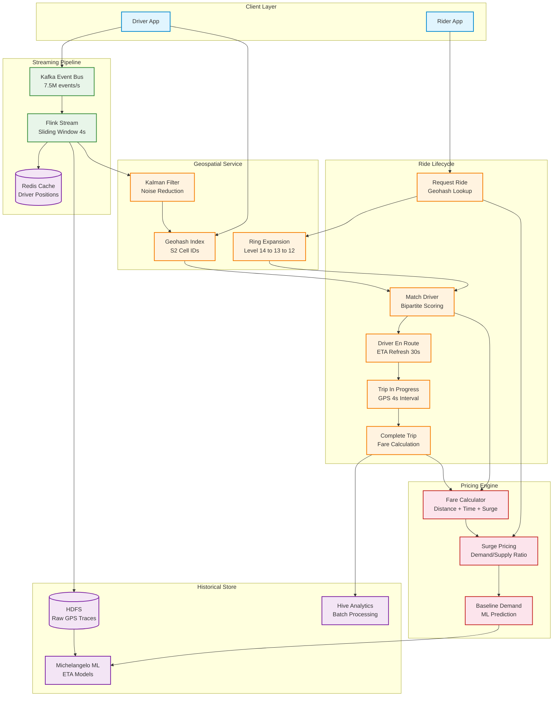

## Practical Takeaways

| Takeaway | Application |
|----------|-------------|
| Geospatial indexing with S2 cell IDs enables efficient nearest-driver queries | Use Hilbert curve-based 64-bit cell IDs; query by cell + ring expansion; adapt cell level (12-15) by density |
| Kalman filtering reduces GPS noise from 15m to sub-3m accuracy | Model driver state as position + velocity; prediction step handles tunnel dropouts; update step corrects with each GPS reading |
| Surge pricing as real-time demand/supply equilibrium with ML prediction | Compute multiplier per geofence every 2-5 minutes; use historical baselines to distinguish events from noise; decay multiplier gradually |
| Dispatch as minimum-weight bipartite matching with greedy approximation | Score drivers by ETA (60%), rating (20%), direction (10%), surge zone (10%); use greedy O(N log N) instead of Hungarian O(N³) |
| City-level sharding provides natural data isolation for location-based services | Shard by city/region; cross-city trips use API orchestration; each city's data is self-contained for most queries |
| Active-active multi-region with Kafka MirrorMaker under 2s replication | Each region serves reads locally; writes fan out via MirrorMaker; validate with uChaos experiments quarterly |
| Event-driven architecture with Kafka as backbone for 30B+ events/day | Partition by city; use Avro schema registry for compatibility; transactional outbox pattern for dual-write safety |

## Case Study: Surge Pricing During a Stadium Event

A major concert ends at 11 PM at a stadium in downtown San Francisco. 30,000 attendees simultaneously request rides. The area normally has 200 available drivers. The surge pricing system must detect the spike, compute multipliers, and communicate pricing to riders and drivers within 2 minutes of the event ending.

The geohash-based zone covering the stadium (precision 7, ~150m x 150m) shows demand surging from a baseline of 50 requests per 5-minute window to 3,000 requests in 2 minutes. The supply in the zone remains at 180 drivers (20 drivers were already in transit to the area). The SurgePricer computes: demand/supply ratio = 3,000/180 approximately 16.7. The spike factor (current demand / baseline demand) = 3,000/50 = 60. The multiplier is clamped at the maximum of 5.0x. Within 2 minutes of the event ending, all rider apps within the stadium zone show 5.0x surge pricing on their screens.

The system broadcasts surge zone notifications to all drivers within a 3-mile radius (geohash ring at distance 3 from the stadium cell). 800 drivers respond by navigating toward the stadium. The ML baseline predictor, trained on 6 months of concert data, had predicted a 4.2x surge for this event at 11 PM Friday. The actual 5.0x is 19% higher due to an unexpected encore extending the event by 20 minutes. As supply increases (from 180 to 950 drivers over 15 minutes), the decay function reduces the multiplier stepwise: 5.0x to 3.5x after 5 minutes to 2.0x after 10 minutes to 1.2x after 20 minutes. The ML model records the deviation for retraining, improving next week's prediction.

## Case Study: GPS Trajectory Map Matching in Urban Canyons

A driver navigates through downtown Manhattan where skyscrapers cause GPS multipath errors of up to 50 meters. The driver takes a route: starting at 5th Avenue and 42nd Street, proceeding south on 5th Avenue for 2 km, then turning onto 34th Street. The raw GPS trajectory shows points jumping 30-50 meters east into buildings due to signal reflection.

The Kalman filter smooths the raw GPS stream. Each observation (every 4 seconds) with a 50m error radius is combined with the prediction from the previous state (position + velocity). The filtered position is typically within 8 meters of the true road position. The map matcher runs the Viterbi algorithm on the filtered trajectory: it considers the road network segments within a 100m buffer of each filtered point and finds the most likely sequence of road segments. The emission probability is computed as a Gaussian centered on the road segment with 10m standard deviation. The transition probability favors segments that are connected in the road graph and have similar bearing to the driver's heading.

The matching result is a sequence of road segment IDs with 93% confidence. The trip tracker uses the matched road path for accurate fare calculation: the fare distance is 2.3 km (road distance) vs 2.1 km (GPS crow-flies) -- a 10% difference that would otherwise undercharge the rider. The ETA prediction uses the matched path to compute remaining time: at the current traffic speed on 5th Avenue (15 km/h), the remaining 0.8 km to 34th Street takes 3.2 minutes. The ETA is refreshed every 30 seconds and displayed to the rider as "4 minutes away."

// case study uber
// distributed-systems-scalability implementation

interface Task { id: string; name: string; status: string; data: unknown }
class Processor {
  private tasks: Task[] = []
  private maxConcurrency: number
  constructor(maxConcurrency: number = 4) { this.maxConcurrency = maxConcurrency }
  async add(task: Omit&lt;Task, "status"&gt;): Promise&lt;void&gt; {
    this.tasks.push({ ...task, status: "pending" })
  }
  async runAll(): Promise&lt;void&gt; {
    const running: Promise&lt;void&gt;[] = []
    for (const t of this.tasks) {
      if (running.length >= this.maxConcurrency) { await Promise.race(running) }
      const p = this.execute(t).finally(() => { const i = running.indexOf(p); if (i >= 0) running.splice(i, 1) })
      running.push(p)
    }
    await Promise.all(running)
  }
  private async execute(t: Task): Promise&lt;void&gt; {
    t.status = "running"
    await new Promise(r => setTimeout(r, 10))
    t.status = "done"
  }
  getResults(): Task[] { return this.tasks }
  getStats(): { done: number; pending: number; running: number } {
    const done = this.tasks.filter(t => t.status === "done").length
    const pending = this.tasks.filter(t => t.status === "pending").length
    const running = this.tasks.filter(t => t.status === "running").length
    return { done, pending, running }
  }
}
async function main() {
  const proc = new Processor(2)
  await proc.add({ id: '1', name: 'case study uber', data: { topic: 'distributed-systems-scalability' } })
  await proc.runAll()
  console.log('Stats:', proc.getStats())
}
main().catch(console.error)
export { Processor, Task }

// case study uber - additional TS implementations

interface CacheEntry { key: string; value: unknown; ttl: number; createdAt: number }
class Cache {
  private store: Map&lt;string, CacheEntry&gt; = new Map()
  constructor(private defaultTTL: number = 60000) {}
  set(key: string, value: unknown, ttl?: number): void {
    this.store.set(key, { key, value, ttl: ttl ?? this.defaultTTL, createdAt: Date.now() })
  }
  get(key: string): unknown | undefined {
    const entry = this.store.get(key)
    if (!entry) return undefined
    if (Date.now() - entry.createdAt > entry.ttl) { this.store.delete(key); return undefined }
    return entry.value
  }
  delete(key: string): boolean { return this.store.delete(key) }
  clear(): void { this.store.clear() }
  size(): number { return this.store.size }
  keys(): string[] { return Array.from(this.store.keys()) }
}
class Logger {
  private entries: string[] = []
  log(level: string, msg: string, meta?: Record&lt;string, unknown&gt;): void {
    const entry = JSON.stringify({ timestamp: new Date().toISOString(), level, msg, meta })
    this.entries.push(entry)
    console.log(entry)
  }
  info(msg: string, meta?: Record&lt;string, unknown&gt;): void { this.log("info", msg, meta) }
  warn(msg: string, meta?: Record&lt;string, unknown&gt;): void { this.log("warn", msg, meta) }
  error(msg: string, meta?: Record&lt;string, unknown&gt;): void { this.log("error", msg, meta) }
  getLogs(): string[] { return [...this.entries] }
  clear(): void { this.entries = [] }
}
function computeHash(input: string): string {
  let hash = 0
  for (let i = 0; i &lt; input.length; i++) { const chr = input.charCodeAt(i); hash = ((hash << 5) - hash) + chr; hash |= 0 }
  return Math.abs(hash).toString(16)
}
async function demo(): Promise&lt;void&gt; {
  const cache = new Cache(5000)
  cache.set('key1', 'system-design demo')
  const log = new Logger()
  log.info('Cache demo started', { course: 'system-design', chapter: 'case study uber' })
  const v = cache.get("key1")
  console.log('Cached:', v)
  console.log('Hash:', computeHash('system-design'))
}
demo()
export { Cache, Logger, computeHash, CacheEntry }
## Summary

- Uber's architecture evolved from a Python monolith with a single MySQL database to a 750+ service microservice ecosystem powered by Kafka and Flink.
- Google S2 geometry maps latitude/longitude to 64-bit cell IDs using a Hilbert curve on a cube projection, enabling efficient spatial indexing in standard databases and key-value stores.
- Uber's H3 hexagon system improves on S2 by using hexagons for uniform neighbor distances, used primarily for visualization and market analysis rather than real-time dispatch.
- The real-time location pipeline ingests 7.5M GPS updates/second via gRPC/WebSocket ? Kafka ? Flink, with Kalman filtering for noise reduction and Redis for current state.
- The dispatch algorithm formulates matching as minimum-weight bipartite matching using S2-based geofence queries, scoring drivers by ETA, rating, direction, and surge multiplier.
- Surge pricing uses real-time demand/supply ratios per geofence with ML-driven demand prediction to dynamically adjust fare multipliers.
- Sharding by city provides natural data isolation, with cross-city trips handled via API orchestration between region shards.
- The system achieves sub-500ms match latency through careful use of in-memory caches (Redis), approximation algorithms, and precomputed geospatial indexes.

---

## Exercises

### Review Questions

<details><summary>Solution</summary>1. **B-Trees** fail for 2D queries because they index 1D ranges. S2's **Hilbert curve** maps 2D coordinates to 1D 64-bit cell IDs preserving proximity — nearby points have numerically similar cell IDs enabling efficient B-Tree range scans. S2 is better for dispatch (range queries), H3 for visualization (uniform hexagon neighbors).

2. **Kafka** ingests 7.5M GPS events/second partitioned by city. **Flink** applies a sliding 4-second window with Kalman filtering: prediction step (propagates velocity) + update step (corrects with observation), reducing noise from 15m to ~3m. Filtered positions are written to Redis (TTL 15s) and HDFS.

3. The **dispatch algorithm** scores each (rider, driver) pair using ETA (60%), rating (20%), direction (10%), and surge zone (10%). It solves as minimum-weight bipartite matching using greedy approximation (O(N log N)) instead of Hungarian (O(N³)). Driver preferences (max distance, destination filter) are applied as hard constraints.

4. **Surge multiplier** = baseline_ratio + (demand/supply) × sensitivity, clamped to 1.0x-5.0x. ML features: time-of-day, day-of-week, weather, event calendar, historical demand per geofence. Model trained on Michelangelo with 5-minute prediction windows.

5. **City-level sharding** provides natural data isolation — a San Francisco ride doesn't query Tokyo data. Cross-city trips require API orchestration between origin and destination shards. Consistent hashing maps users to shards.

6. **uChaos** injects controlled failures (latency injection, instance termination, Kafka broker failure) during low traffic with automated rollback. Unlike traditional DR testing (scheduled, isolated), uChaos runs continuously in production with blast radius limited to one city.
</details>

### Application Problems

<details><summary>Solution</summary>1. **Spatial Index**: Use S2 at level 14 (6.25 km² for urban dispatch). Store driver IDs in Redis Sets per cell with TTL 15s. Geofence expansion: query cell + ring 1; if <5 drivers, expand to ring 2 (parent cell level 13). Atomic Lua script for driver cell transitions.

2. **ETA Features**: 8 families — (1) road-segment historical speed profiles (15-min buckets), (2) real-time traffic, (3) intersection delay, (4) time-of-day/week, (5) weather, (6) events, (7) driver behavior, (8) route complexity. Cold-start: use city-wide average speeds for new drivers, update after 10 trips.

3. **Surge Simulation**: Detect spike by comparing 2-min demand vs 60-min baseline. Compute multiplier: min(5.0, max(1.0, ratio × spike_factor × 0.5)). Decay: every 60s, reduce by 0.3x if supply/demand ratio decreases. Prevent overshoot by capping surge area to 10-block radius and decaying outer zones first.

4. **Failure Analysis**: (a) Flink crash: checkpoint recovery from last successful checkpoint (2-min processing lag). (b) Redis unreachable: fallback to stale driver positions in local cache with 30s TTL. (c) Kafka broker failure: ISR (in-sync replicas) election within 10s. (d) Slow S2 query: Hystrix circuit breaker opens after 200ms, return cached geofence results. (e) Table lock: detect via query timeout, route reads to replica.
</details>

### Challenge Problem

<details><summary>Solution>
**Global Outage Recovery**:

**Tier 1 (30s RTO)**: Replay Kafka `location_updates` topic from last 30 seconds. Flink restores from checkpoint, reprocesses events, repopulates Redis. Validation gate: check driver speed (no >200 km/h), duplicate detection (same driver in two cells), temporal consistency (timestamps monotonic). Go: error rate < 0.1%.

**Tier 2 (5min RTO)**: Fallback Redis cluster with larger TTLs (60s vs 15s) and no-eviction policy. Pre-warmed by shadowing primary Redis writes. DNS failover via Route53 health checks pointing to fallback cluster.

**Tier 3 (30min RTO)**: SMS-based dispatch — rider texts keyword to short code, IVR collects pickup location, system uses precomputed city-grid (H3 hexagons with baseline driver counts by hour, updated daily) to estimate nearest driver. No real-time GPS means double-dispatch prevention uses idempotency tokens per phone number with 5-min TTL. RPO for SMS flow: 24 hours (data freshness). Communication: in-app banner, push notification, SMS blast to all active users, social media post, press release template. GDPR 72-hour notification prepared but not sent (no personal data breach).
</details>
