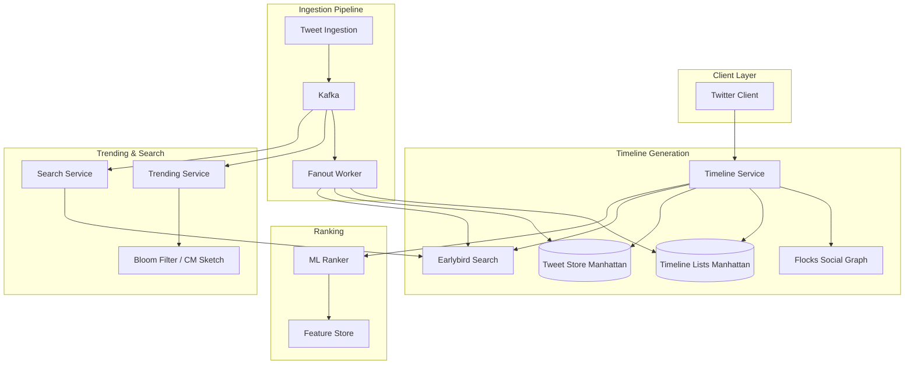

# Chapter 22: Case Study — Twitter and News Feed

---

## Learning Objectives

- Understand the timeline generation challenge and evaluate fan-on-write, fan-on-read, and hybrid fan-out strategies at scale
- Analyze how Twitter evolved from a Ruby on Rails monolith to a Scala/Finagle/JVM-based architecture
- Design real-time trending topic detection using Bloom filters, Count-min sketches, and min-heaps
- Examine the trade-offs between reverse-chronological and ML-ranked timeline generation
- Evaluate the Earlybird search engine architecture for real-time tweet indexing
- Understand rate limiting, social graph storage, and disaster recovery lessons from the "Fail Whale" era

---

## Theory / Case Study


### Phase 1: Problem Scope and Requirements

Twitter serves 330+ million monthly active users who generate 500+ million tweets per day. Every user expects to see their timeline load in under 5 seconds, no matter how many accounts they follow. When a breaking news event occurs — an earthquake, a political announcement, a celebrity death — Twitter must surface relevant tweets within seconds, not minutes. The character limit started at 140 and expanded to 280 in 2017, which fundamentally changed the distribution of tweet lengths and engagement patterns.

The core challenge is the fan-out problem. A single tweet from a popular account must appear in the timelines of every one of that account's followers. When @BarackObama tweets — with 60+ million followers — the system must insert that tweet into 60 million timelines. If 10 celebrities tweet in the same second, that is 600 million timeline insertions. Doing this instantly is impossible; doing it in seconds requires careful architectural choices.

Non-functional requirements include high write availability (tweets must never be lost), eventual consistency for timelines (it is acceptable if a tweet appears slightly late for some users), and resistance to abuse (spam, harassment, coordinated disinformation campaigns must be detectable and filterable). The platform operates under significant legal pressure regarding content moderation in different jurisdictions (Germany's NetzDG, India's IT Rules).

### Phase 2: Timeline Generation — Fan-Out Strategies

The timeline generation problem admits three fundamental approaches, each with different trade-offs.

**Fan-on-Write (Push Model)**

In the pure push model, when a user tweets, the tweet is immediately inserted into a Redis list for each follower's timeline. The timeline is a simple list of tweet IDs. When the follower opens the app, they fetch their timeline list from Redis and hydrate the tweets from a key-value store.

```
Pros:
- O(1) read: reading the timeline is a single Redis LRANGE call
- Simple client logic: the timeline is pre-computed
- Low read latency: typically under 10ms

Cons:
- O(followers) write: each tweet triggers N insertions
- Celebrity problem: one tweet by an account with 60M followers generates 60M Redis writes
- Storage amplification: a tweet may be stored millions of times
- Cold-start problem: offline users accumulate stale data in their timeline list
```

For a user following 200 average accounts (each with 1,000 followers), a single read costs one Redis call. The write cost is proportional to the number of followers. In practice, the push model works well for users with fewer than ~100,000 followers, which describes 99.9% of Twitter accounts.

**Fan-on-Read (Pull Model)**

In the pure pull model, tweets are stored once in a global tweet store. When a user requests their timeline, the system reads the list of accounts the user follows (the "followees"), queries the N most recent tweets from each followee's tweet list, and merges them into a single reverse-chronological timeline.

```
Pros:
- O(1) write: store the tweet once
- No storage amplification
- Works for celebrities: no massive fan-out
- Fresh data always: no stale timeline lists

Cons:
- O(followees) read: must query N followees' recent tweets and merge
- High read latency: merging 1,000 followees' tweets takes time
- Complex caching: individual followee timelines must be cached
- Read amplification: a user refreshing their timeline 100 times causes 100 * followees queries
```

For a user following 1,000 accounts, a timeline request requires querying 1,000 tweet lists, merging the results, deduplicating, and sorting. This is computationally expensive but manageable with aggressive caching. The read load is proportional to follows, not followers.

**Hybrid Approach**

Twitter's production system uses a hybrid approach that combines both strategies:

1. A threshold T (determined empirically) separates "normal" users from "celebrities."
2. Users with followers < T use fan-on-write (push). Their tweets are fanned out to all followers' timeline lists.
3. Users with followers >= T use fan-on-read (pull). Celebrity tweets go into a separate "celebrity tweet" list per celebrity. When a follower reads their timeline, the system merges:
   - The pre-computed timeline list (from normal users they follow)
   - The recent tweets from each celebrity they follow (pulled on read)

This hybrid approach achieves the best of both worlds:
- Normal users get O(1) timeline reads
- Celebrities do not overwhelm the system on write
- The merge operation adds ~50-100ms to P99 latency, which is acceptable

The threshold T has been tuned over the years. Initially set at around 10,000 followers, it has been adjusted as infrastructure improved. With better caching and faster storage, the threshold can be increased, moving more users to the push model.

**Cost Analysis of Fan-Out Strategies**

To understand the trade-offs quantitatively, consider the cost model. Let:
- T = total tweets per day = 500M
- U = total users = 330M
- F_avg = average followers per user ≈ 200
- F_celeb = followers of a celebrity account (e.g., @BarackObama = 60M)
- R = timeline reads per day ≈ 2B (each user reads ~6 timelines/day)

Under pure fan-on-write:
- Write operations per day = sum over all tweets of (follower_count) ≈ T * F_avg ≈ 500M * 200 = 100B writes
- Read operations per day = R ≈ 2B reads
- Total ops = ~102B

Under pure fan-on-read:
- Write operations per day = T = 500M writes
- Read operations per day = R * F_avg_followees ≈ 2B * 200 = 400B reads (each timeline read queries every followee's recent tweets)
- Total ops = ~400B

The hybrid with threshold T where 99.9% of users have < T followers:
- 99.9% of tweets use push (500M * 0.999 = 499.5M tweets, each fanned out to F_avg = 200 followers = 99.9B writes)
- 0.1% of tweets use pull (500K celebrity tweets, written once = 500K writes, then merged on read by their followers)
- Read merge: each timeline read merges ~200 normal entries (from Redis list) + N_celeb_followed celebrity tweets
- Total ops ≈ 100B (write-dominant, roughly same as pure push for normal users)

This analysis explains the hybrid threshold. Since 99.9% of users have followers well below the threshold, their tweets are pushed normally. The threshold effectively isolates the 0.1% of celebrity accounts whose follower counts would cause O(100B) additional writes per day under full push. The marginal cost of the read-time merge (pulling celebrity tweets) is small relative to the saved write costs.

### Phase 3: The Evolution of Twitter's Architecture

**The Ruby on Rails Monolith (2006-2010)**

Twitter's original architecture was a Ruby on Rails application with a MySQL database. The "Fail Whale" — a cartoon whale being lifted by birds — became famous as the error page users saw when the site was down, which was frequently. The monolith struggled with:

- MySQL replication lag: writes to the master caused followers to fall behind, serving stale data
- Slow queries: timeline generation queries joined multiple tables and took seconds
- Memory pressure: Ruby's memory footprint per process was large, limiting the number of concurrent requests per server
- Deployment risk: any change risked the entire site

The tipping point was the 2008 US presidential election, where traffic spikes caused repeated outages. Twitter's engineering team recognized that Rails could not scale to their growth trajectory.

**Migration to Scala and the JVM (2010-2014)**

Twitter's engineering team rebuilt the backend from the ground up, making the bet that the JVM with its mature garbage collection, profiling tools, and threading model would provide the performance and stability they needed. The key components of the new architecture were:

- **Finagle**: A protocol-agnostic RPC system built on Netty, providing connection pooling, circuit breaking, load balancing, and request timeouts. Finagle allowed services to communicate with configurable reliability policies — retry budgets (max 5% retries), fail-fast patterns, and distributed tracing via Zipkin.

- **Scala**: Chosen for its functional programming features (immutability, pattern matching) running on the JVM. Scala's concurrency model (Futures, Promises) integrated naturally with Finagle's async I/O.

- **Manhattan**: A distributed key-value and time-series store built on top of MySQL, replacing direct MySQL usage for tweet storage and user data. Manhattan provided automatic sharding, replication, and consistent reads.

- **Flocks**: A C++/Memcache-based service for storing and querying the social graph (who follows whom). Flocks stored the graph in memory across a cluster of machines, providing sub-millisecond lookups for follow relationships.

- **Earlybird**: A Lucene-based real-time search engine built in Java, designed to index tweets within seconds of publication.

**Timeline Service Architecture (Current)**

The timeline service sits at the center of Twitter's architecture, implementing the hybrid fan-out strategy described above. The service is written in Scala using Finagle for RPC. Its internal flow:

1. Receive a request for user U's timeline (cursor-based pagination).
2. Query Flocks to get the list of user IDs that U follows.
3. For each followee, check if they are a "celebrity" (followers > threshold).
4. For normal followees: query the pre-computed timeline list in Manhattan (the fan-on-write result).
5. For celebrity followees: query each celebrity's recent tweet index in Earlybird (fan-on-read).
6. Merge the two result sets, deduplicate (in case of overlap), sort by timestamp.
7. Apply ML ranking (if enabled) to reorder the timeline.
8. Return the timeline to the client as a list of tweet IDs.
9. The client hydrates the tweets by fetching full metadata (text, media, engagement counts) from the tweet hydration service.



### Phase 3 (continued): Deep Dives

**Trending Topics Detection**

Twitter's trending topics algorithm must identify which topics are spiking in usage right now, distinguish organic trends from coordinated spam, and display them to users in real time. The pipeline works as follows:

1. A Flink job consumes the raw tweet stream from Kafka.
2. For each tweet, it extracts hashtags, cashtags, and performs entity recognition (people, places, products mentioned in the text).
3. Each entity is hashed and inserted into a Count-min sketch (CM sketch) data structure with a 15-minute time window.
4. Separately, a Bloom filter tracks which entities have been seen in the current window, used for deduplication.
5. The CM sketch provides approximate frequency counts with a known error bound. For each entity, the actual count is approximately count + epsilon * total_items.
6. Every 60 seconds, the top K entities by frequency are extracted from the CM sketch using a min-heap.
7. The candidate trends are filtered: must exceed a minimum frequency threshold, must not be a promoted trend (those are injected separately), must not be spam (detected by velocity anomaly — a topic spiking at 100x normal rate is likely bot-driven).
8. Trends are ranked by a composite score: `frequency * (1 + acceleration) * novelty_score`, where acceleration is the rate of change of frequency and novelty_score is lower for topics that have been trending recently.
9. Geotagged trends: the pipeline also maintains per-city CM sketches for location-specific trends in New York, Tokyo, London, etc.

The choice of CM sketch over exact counting is deliberate. An exact count would require storing the full set of entities and their counts in memory, which could be millions of entries. The CM sketch uses sub-linear memory — typically a 2D array of 1000x10 integers — and provides accuracy within 1-2% for top-K queries, which is more than sufficient for trending topics.

**Tweet Indexing with Earlybird**

Earlybird is Twitter's real-time search engine, built on top of Apache Lucene. Key architectural decisions:

- **In-memory inverted index**: The index lives in main memory (not on disk), enabling sub-100ms query latency.
- **Partial updates**: Unlike traditional search engines that rebuild indexes daily, Earlybird supports incremental updates for engagement signals. When a tweet gets a retweet, the engagement score in the index is updated without reindexing the entire document.
- **Reverse-chronological index**: In addition to the relevance-based inverted index, Earlybird maintains a reverse-chronological index that is used for timeline queries (fan-on-read for celebrities).
- **Partitioned index**: The index is sharded by tweet ID hash across multiple Earlybird instances, allowing parallel query execution.
- **Owl**: Twitter's real-time query engine that evaluates queries against the Earlybird index and serves results to the search API and timeline service.

Earlybird ingests tweets from Kafka within seconds of publication. The ingestion pipeline tokenizes the text, extracts entities, computes initial engagement signals (all zeros for a new tweet), and writes to the inverted index. When a tweet receives engagement, the update flows through Kafka to Earlybird's partial update handler.

**Media Pipeline**

Twitter's media pipeline handles images, videos, and GIFs uploaded by users. Approximately 40% of tweets now contain media, making the media pipeline a critical path for both ingestion and serving.

The upload flow:
1. User selects media in the tweet composer. The client begins uploading immediately (before the user sends the tweet) to reduce perceived latency.
2. The media upload service receives the file via a resumable upload protocol (similar to Tus). Uploads can be paused and resumed if the user loses connectivity.
3. Once uploaded, the media processing service asynchronously processes the file:
   - Images: Generate thumbnails at 3 sizes (small: 240x240, medium: 480x480, large: 1024x1024). Apply EXIF rotation. Strip GPS metadata for privacy.
   - Videos: Transcode to H.264 and VP9 codecs at multiple bitrates (240p, 480p, 720p, 1080p, 4K for supported accounts). Generate thumbnail frames at 0s, 5s, and 30s. Extract audio track.
   - GIFs: Convert animated GIFs to video (MP4/WebM) for bandwidth efficiency, using a poster frame for the timeline and playing the video on tap.
4. Media is stored in Manhattan (metadata) and a blob store (the actual bytes, stored on HDFS and served through a CDN).
5. NSFW detection runs in parallel using Google Cloud Vision API or an internal ML model. Detected sensitive content is flagged with a `sensitive_content` boolean and blurred by default in timelines.

The media processing pipeline uses a priority queue in Kafka. Time-sensitive processing (thumbnail generation for real-time display) is high priority. Resource-intensive processing (4K video transcoding) is low priority. Worker nodes pick up tasks based on availability, with GPU-equipped nodes handling video transcoding.

**Content Moderation Architecture**

Content moderation at Twitter's scale is a hybrid system combining automated ML classifiers, human reviewers, and user reports. The architecture is designed to balance speed (removing harmful content quickly) with accuracy (minimizing false positives that censor legitimate speech).

The moderation pipeline:
1. **Pre-publication filtering** (fast path): Every tweet passes through a set of lightweight classifiers before it is indexed by Earlybird. These check for: exact-match spam URLs (against a blocklist of 10M+ domains embedded in a Bloom filter), known CSAM hashes (PhotoDNA), and duplicate detection (a tweet posted verbatim 1000 times in 60 seconds is likely spam). This filter runs in under 5ms per tweet.

2. **Post-publication detection** (deep path): The full moderation ML models run asynchronously on the Kafka stream. Multiple models run in parallel:
   - Toxicity classifier: BERT-based model scoring tweets on hate speech, harassment, and violence
   - Misinformation classifier: Fact-check claim matching against known false narratives
   - Bot/spam classifier: Feature-based model analyzing account age, tweet velocity, follower/followee ratio, content similarity
   - Coordinated behavior detection: Graph-based model identifying clusters of accounts that act in concert

3. **Human review queue**: Tweets that cross a confidence threshold but not a certainty threshold are queued for human review. The review queue is prioritized: tweets with high impressions (viral content) are reviewed first. Human reviewers use a custom tool that shows the tweet in context (replies, author history) and provides action options (leave up, label with warning, remove, suspend author).

4. **Appeals**: Users can appeal moderation decisions. Appeals are reviewed by a separate team using the same tooling. The appeals database tracks the original decision, the appeal reason, and the final resolution, providing a feedback loop for the ML models.

The moderation system handles 500M tweets per day, of which approximately 1-2% are actioned (labeled, hidden, or removed). The system processes approximately 1M human review decisions per day, supported by 5M automated actions (spam removal, bot suspensions).

**ML-Based Timeline Ranking**

Twitter's timeline evolved from pure reverse-chronological to algorithmically ranked. The ranking model is a neural network (TensorFlow) that scores each tweet in a candidate pool. Features include:

- **Recency**: time since tweet was created, with exponential decay
- **Engagement velocity**: likes/second, retweets/second in the first N minutes
- **Author features**: author's average engagement rate, the user's historical engagement with this author
- **Content features**: contains media (image/video), contains link, tweet length, language match
- **User preferences**: inferred topic interests, mute/block history, like history
- **Session features**: time of day, device type, recent interaction patterns
- **Relationship strength**: how often the user interacts with this author (likes, retweets, replies, DMs)

Tweets are scored and ranked. The top N (typically 50-100) are returned as the timeline. The ranking improves engagement metrics significantly: with the ML-ranked timeline, Twitter reported a 15-20% increase in likes, retweets, and replies compared to reverse-chronological. Users can still switch to "Latest Tweets" mode for the reverse-chronological view.

**Search Architecture**

Twitter search combines the Earlybird real-time index with Blender (ML ranking for search results). When a user searches for "basketball highlights":

1. The query is sent to Earlybird, which performs a full-text search against the reverse index.
2. Earlybird returns candidate tweets with relevance scores (BM25 variant).
3. Blender applies ML ranking on top of the Earlybird results, using features similar to the timeline ranking model plus query-specific features (query intent classification, query-user affinity).
4. Results are filtered for safety (NSFW detection, blocked accounts, sensitive content flags).
5. The top results are returned, typically within 200ms.

**Rate Limiting Architecture**

Rate limiting at Twitter's scale requires distributed coordination. The rate limiter tracks requests per user per endpoint per time window. Implementation:

- Redis sorted sets (ZSET) with timestamp as score: `ZREMRANGEBYSCORE key 0 (now - window)`
- Each request adds the current timestamp to the user's set for that endpoint
- The count is `ZCARD key`
- If count > limit, the request is rejected with HTTP 429
- Limits are tiered: free users (~300 tweets/day), verified users (higher limits), API tiers (application-based limits)
- Distributed: multiple Redis instances, each handling a shard of users (hash(user_id) % N)
- Token bucket variant: for burstier workloads (search, timeline), a token bucket algorithm with configurable refill rate

**The "Fail Whale" Era: Lessons Learned**

Twitter's early outages provide a catalog of failure modes at scale, each with a corresponding architectural improvement:

- **The 2008 MySQL meltdown**: The database could not handle the write load. Lesson: monolithic databases do not scale for social applications. Solution: Manhattan (custom sharded store).

- **The 2010 "over-capacity" errors**: Ruby on Rails processes consumed too much memory per request, causing the server to swap. Lesson: memory management and request lifecycle matter. Solution: JVM (Scala/Java) with deterministic memory model.

- **The 2012 tweet-storm cascade**: A single user with millions of followers tweeted, triggering fan-out that saturated the Redis cluster, causing all timeline reads to fail. Lesson: celebrity fan-out must be isolated. Solution: hybrid fan-out (fan-on-read for celebrities).

- **The 2014 search outage**: Earlybird's index rebuild failed, causing search to return results 12 hours stale. Lesson: index rebuilds must be tested at full scale. Solution: blue-green deployment for index versions.

- **The 2016 trending topic manipulation**: A botnet gamed the trending algorithm, putting a spam hashtag in the top 10. Lesson: raw frequency counts are vulnerable to manipulation. Solution: velocity anomaly detection and spam filters in the trending pipeline.

### Phase 4: Data Model and Storage

**Tweet Storage (Manhattan)**

Tweets are stored in Manhattan as key-value pairs with time-series ordering. The primary key is `(user_id, tweet_id)` allowing efficient queries for "N most recent tweets by user X." The value includes the tweet text, media URLs, engagement counts, creation timestamp, and metadata flags (sensitive content, verified author, geo-tag).

Manhattan's time-series bucket: tweets from the last 7 days are stored in hot storage (SSD-backed in-memory), older tweets are moved to warm storage (HDD with memory cache), and tweets older than 90 days are archived to cold storage (HDFS).

**Social Graph (Flocks)**

Flocks stores the follow graph as two adjacency lists per user:
- `following[user_id]`: set of user IDs this user follows
- `followers[user_id]`: set of user IDs that follow this user

Both lists are stored in Memcache (in-memory) across a cluster of machines. The service provides `GET_FOLLOWING(user_id, cursor, count)` and `GET_FOLLOWER_COUNT(user_id)` with sub-millisecond latency. Flocks uses consistent hashing to distribute user data across the cluster.

**Redis Timeline Lists**

The pre-computed timeline lists (fan-on-write output) are stored in Redis as lists keyed by user ID. Each list contains tweet IDs in reverse-chronological order. The list is capped at 800 entries — older tweets are evicted. When a user reads their timeline, the timeline service reads the list with `LRANGE user:<id>:timeline 0 799` and hydrates the tweet metadata from Manhattan.

---

## Summary

- The timeline fan-out problem requires choosing between push (O(1) read, O(followers) write) and pull (O(1) write, O(followees) read); Twitter uses a hybrid approach with a follower-count threshold.
- Twitter's architecture evolved from a Ruby on Rails monolith to 750+ Scala/Finagle JVM services, solving the scaling problems that caused the "Fail Whale" era.
- The hybrid fan-out stores pre-computed timeline lists for normal users and pulls celebrity tweets on read, merging them with ~50-100ms added latency.
- Trending topics use Count-min sketches for approximate frequency counting over sliding windows, with velocity anomaly detection to filter spam manipulation.
- Earlybird provides real-time tweet search through an in-memory Lucene inverted index with partial updates for engagement signals.
- ML timeline ranking uses TensorFlow with features spanning recency, engagement velocity, author relationship strength, and user preferences.
- Rate limiting is implemented via Redis sorted sets with tiered limits per user per endpoint, using distributed token buckets.
- Social graph storage (Flocks) uses Memcache-based adjacency lists with consistent hashing for sub-millisecond follow-graph queries.

---

## Exercises

### Review Questions

1. Compare fan-on-write and fan-on-read for timeline generation. Under what conditions does each strategy perform poorly, and how does Twitter's hybrid approach balance the trade-offs?

2. How does Earlybird achieve real-time search latency? Describe the role of in-memory inverted indexes, partial updates for engagement signals, and partitioned indexing.

3. Explain how Count-min sketches work for trending topic detection. Why was this probabilistic data structure chosen over exact counting, and what accuracy guarantees does it provide?

4. Describe Twitter's migration from Rails to Scala/Finagle. What specific problems did Rails have at scale, and how did Finagle's connection pooling, circuit breaking, and retry budgets solve them?

5. How has Twitter's timeline ranking evolved from pure reverse-chronological to ML-based? What features does the ranking model use, and what was the reported impact on engagement?

6. Describe the content moderation pipeline, distinguishing between pre-publication filtering and post-publication detection. What role does the human review queue play, and how is it prioritized?

### Application Problems

1. **Fan-Out Threshold Tuning**: Given a Twitter-like system with 500M tweets/day and 300M users, design an experiment to determine the optimal fan-out threshold T. The cost function is `total_read_latency * read_volume + total_write_latency * write_volume`. How would you measure the components empirically? What data would you collect over what time window?

   Your answer should include: (a) a formal expression for the cost function in terms of T, F_avg, F_celeb, and the distribution of follower counts, (b) the measurement methodology (what metrics to collect, from which services, over what duration), (c) the decision rule for selecting T from the empirical data, and (d) how you would validate the chosen threshold with an A/B experiment on 1% of users.

2. **Trending Topics Anomaly Detection**: A botnet with 10,000 accounts is programmed to simultaneously tweet the same hashtag 50 times each (500,000 total tweets). Design a detection algorithm that catches this attack within 60 seconds without false-positive on a legitimate viral event. Specify the data structures, threshold values, and filtering logic.

   In your design, address: (a) the specific Count-min sketch parameters (width, depth, hash functions) and how they bound the error, (b) the velocity metric that distinguishes bot-driven spikes from organic virality, (c) the temporal window sizes for short-term vs. long-term frequency comparison, and (d) the action taken when a trending candidate is flagged as spam (remove from trending list? shadowban? label?).

3. **Timeline Cache Design**: Design a multi-tier cache for the timeline service. The service handles 10,000 requests/second. Each timeline request reads a Redis list (average 50 tweet IDs) and hydrates the tweets from Manhattan (50 key lookups). Propose a caching strategy that reduces P99 latency by 60%. Specify cache sizes, TTLs, eviction policies, and invalidation triggers.

   Consider: (a) a local L1 cache in the timeline service process (what data, what size, what eviction), (b) a distributed L2 cache (Redis/Memcache — what key structure, what TTL), (c) cache invalidation when a new tweet appears in the timeline, and (d) how your cache handles the celebrity edge case (a user who follows 10,000 accounts).

4. **API Rate Limiting Design**: Twitter's API serves 10M+ developer requests per second across hundreds of endpoints. Design a distributed rate limiting system that:

   (a) Enforces per-endpoint limits for each API key (e.g., 300 requests per 15-minute window for the statuses/user_timeline endpoint)
   (b) Supports burst allowance (a token bucket variant that allows short bursts up to 2x the sustained limit)
   (c) Returns standard rate limit headers (X-RateLimit-Limit, X-RateLimit-Remaining, X-RateLimit-Reset) with globally consistent counts
   (d) Works across multiple data centers — a request to US-EAST and EU-WEST must count toward the same limit
   
   Compare the Redis sorted set approach (ZADD + ZREMRANGEBYSCORE + ZCARD) with the sliding window counter approach (increment Redis counter for the current second, maintain a rolling sum), and justify which one you would choose for each endpoint category.

### Challenge Problem

**Global Event Handling**: A major global event (e.g., a World Cup final goal) causes a traffic spike: tweets per second go from 6,000 to 150,000 in 10 seconds. The timeline service is overwhelmed. Design a system that:

- Automatically detects the traffic onset within 5 seconds and classifies it as a global event (not a DDoS)
- Spawns additional capacity (describe the auto-scaling mechanism, including cold-start mitigation for new instances)
- Degrades gracefully: list at least 4 specific degradation modes ranked by severity (e.g., disable ML ranking → disable media loading → serve stale timelines → show "Trending" landing page instead of user timeline)
- Prevents cascading failure to downstream services (Earlybird, Flocks, Manhattan) through circuit breakers and request prioritization
- Provides a post-event analysis: what data would you log to understand the event's impact on P50/P95/P99 latency, error rate, and user retention?

Your design must assume that the event lasts 15 minutes and Twitter cannot simply "ride it out" — the platform must remain usable throughout.

Provide specific detail for each capacity dimension:

**Autoscaling Architecture**:
- How many new timeline service instances are needed? (compute from baseline capacity of 10K req/s per instance, new load of 250K req/s)
- What is the cold-start time for a new instance? (container pull, JVM warmup, cache preheat)
- How do you mitigate the cold-start gap? (pre-provision 20% headroom? use spot instances? have a warm pool?)
- What metric triggers the scale-up? (CPU? request queue depth? P95 latency?)

**Circuit Breaker Configuration**:
- For Earlybird: if searches failing, what error threshold trips the breaker? (50% errors in 10 second window? 30% errors in 30 seconds?)
- For Flocks: if follow-graph lookups are slow (>100ms), what is the fallback? (cache the user's follow graph locally with what TTL?)
- For Manhattan: if tweet hydration is slow, what is the degradation? (show tweet IDs only without metadata? collapse to "Tweet unavailable"?)

**Client-Side Mitigation**:
- How does the mobile client adapt to server overload? (increase polling interval from 30s to 120s? batch timeline requests? suppress animations?)
- What feedback does the server send to the client to signal overload? (HTTP 503 with Retry-After header? custom response header "X-Twitter-Overload-Level: 1-5"?)
- How does the client handle these signals differently on Android vs iOS vs web?

**Post-Event Analysis**:
- Design a dashboard with 6 specific charts that the on-call engineer would review after the event
- For each chart, specify: the metric name, the aggregation function, the time window, and the comparison baseline
- Example: "Chart 1: Timeline P99 latency (1-minute rolling percentile, 60-minute window, compared to same-day-prior-week baseline)"
