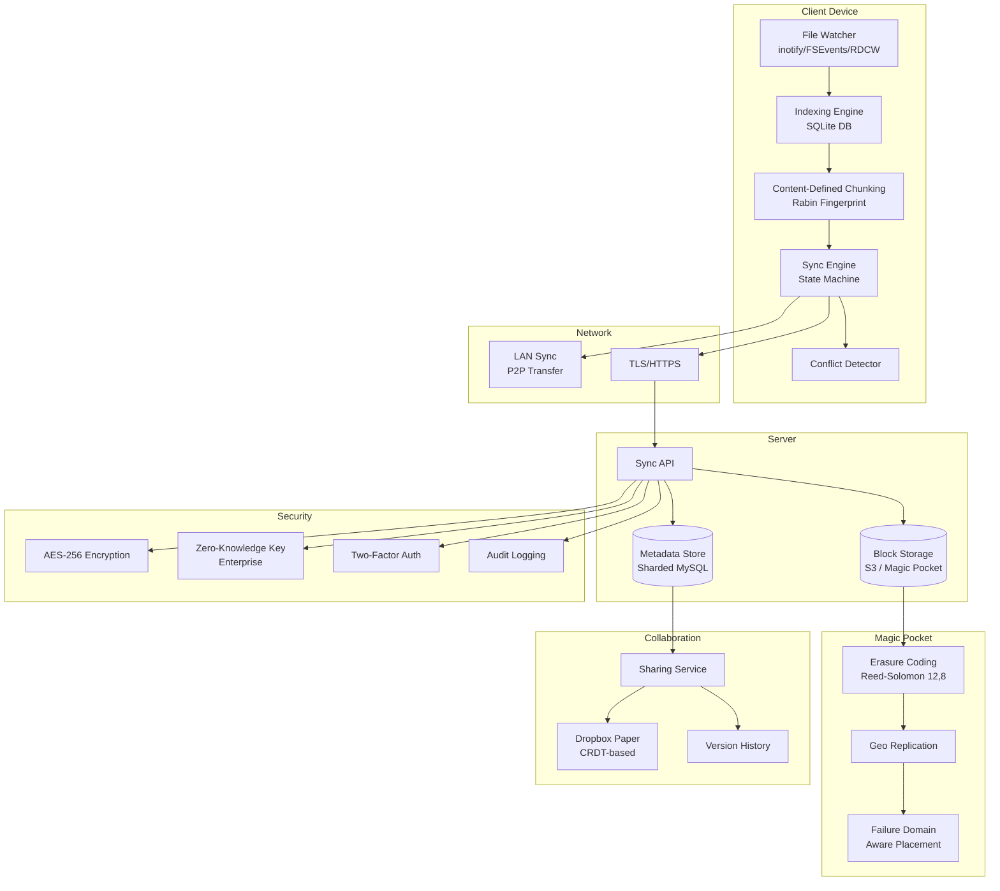
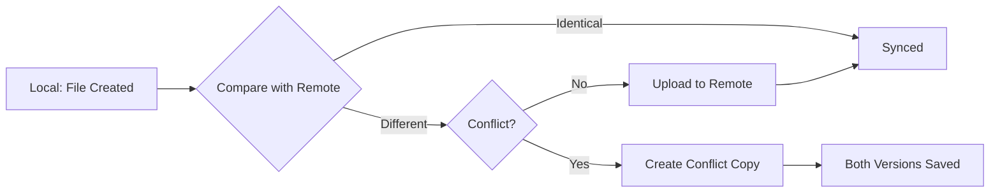
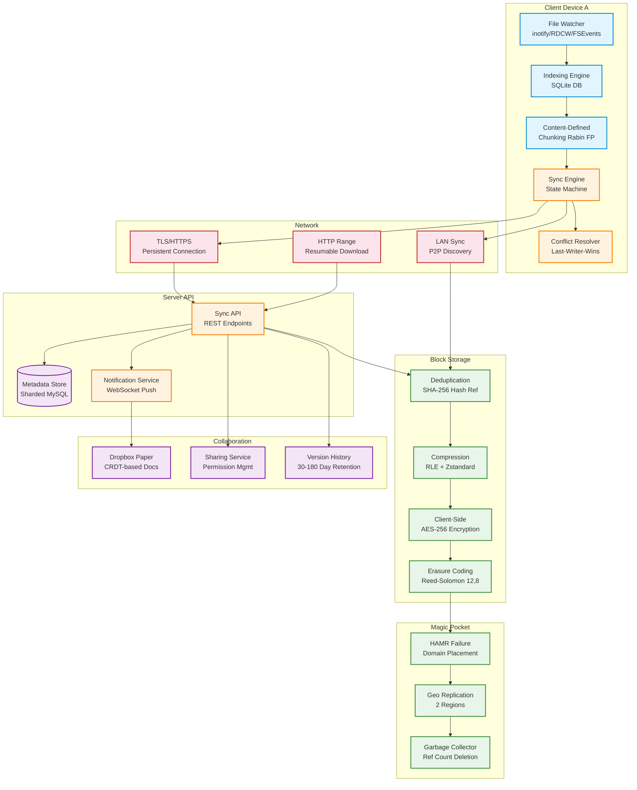

# Chapter 23: Case Study — Dropbox and File Storage
> **Previous:** [22 Case Study Twitter](./22-case-study-twitter.md) | **Next:** [24 Interview Preparation](./24-interview-preparation.md)

---

## Learning Objectives

- Design a block-level sync engine using content-defined chunking with Rabin fingerprinting for delta synchronization
- Understand the client-server sync architecture including file watchers, indexing engines, and state-machine-based reconciliation
- Evaluate deduplication strategies at block level using SHA-256 hashing and their impact on storage efficiency
- Analyze the evolution from Amazon S3 to custom object storage (Magic Pocket) at exabyte scale
- Examine conflict resolution strategies including last-writer-wins, version history, and LAN sync
- Understand the metadata store sharding pattern and the streaming download architecture for large files

<!-- Image Gallery -->
<div style="display:flex;flex-wrap:wrap;gap:4px;margin:16px 0;padding:12px;background:#f8fafc;border-radius:8px;border:1px solid #e2e8f0;">
<a href="../../../assets/images/lessons/system-design/23-case-study-dropbox/hero.svg" target="_blank" rel="noopener">
  
</a>
<a href="../../../assets/images/lessons/system-design/23-case-study-dropbox/handwritten-notes.svg" target="_blank" rel="noopener">
  
</a>
<a href="../../../assets/images/lessons/system-design/23-case-study-dropbox/sticky-notes.svg" target="_blank" rel="noopener">
  
</a>
<a href="../../../assets/images/lessons/system-design/23-case-study-dropbox/visual-explanation.svg" target="_blank" rel="noopener">
  
</a>
<a href="../../../assets/images/lessons/system-design/23-case-study-dropbox/architecture.svg" target="_blank" rel="noopener">
  
</a>
<a href="../../../assets/images/lessons/system-design/23-case-study-dropbox/workflow.svg" target="_blank" rel="noopener">
  
</a>
<a href="../../../assets/images/lessons/system-design/23-case-study-dropbox/mindmap.svg" target="_blank" rel="noopener">
  
</a>
<a href="../../../assets/images/lessons/system-design/23-case-study-dropbox/comparison.svg" target="_blank" rel="noopener">
  
</a>
<a href="../../../assets/images/lessons/system-design/23-case-study-dropbox/cheatsheet.svg" target="_blank" rel="noopener">
  
</a>
<a href="../../../assets/images/lessons/system-design/23-case-study-dropbox/interview-quiz.svg" target="_blank" rel="noopener">
  
</a>
<a href="../../../assets/images/lessons/system-design/23-case-study-dropbox/social-card.svg" target="_blank" rel="noopener">
  
</a>
</div>
<!-- End Image Gallery -->


---
## Chapter at a Glance

| Aspect | Details |
|--------|---------|
| **Scope** | Dropbox architecture: sync, block storage, dedup, conflict resolution |
| **Key Concepts** | Block-level sync, chunking, deduplication, delta sync, LAN sync |
| **Sync Engine** | Local folder monitoring, chunking, compression, encryption |
| **Block Storage** | Block-level deduplication, compression, encrypted storage |
| **Conflict Resolution** | Version vectors, CRDTs, server-authoritative |
| **Real-World** | Local-first design, incremental sync, efficient delta encoding |

---

## Chapter Roadmap


## Theory / Case Study
> **One-Sentence Takeaway:** Theory is the foundation ? master it before moving to examples and exercises.


### Phase 1: Problem Scope and Requirements


> **Pro Tip:** Master this concept thoroughly ? it is frequently tested in system design interviews.

> **Pro Tip:** Master this concept ? it appears in nearly every system design interview. Understand both the how and the why.

> **Warning:** A common mistake is over-engineering. Always start simple and add complexity only when justified by requirements.

> **Pro Tip:** Master this concept thoroughly ? it appears in nearly every system design interview.
Dropbox serves over 700 million users storing more than 500 billion files across Windows, macOS, Linux, iOS, Android, and the web. The core promise is simple: a file saved on one device appears on all others within seconds. Behind this simplicity lies one of the most complex engineering challenges in distributed systems — synchronizing billions of file changes across heterogeneous devices with unreliable network connections, limited battery life, and widely varying storage capacities.

The requirements are deceptively demanding. Conflict detection for small files must complete within 100 milliseconds — the user should not see a sync conflict icon persist after saving a file. Sync must work across platforms with fundamentally different file system event notification APIs: Windows uses ReadDirectoryChangesW, macOS uses FSEvents, and Linux uses inotify. The system must handle files up to hundreds of gigabytes (CAD files, video projects, database dumps) while also optimizing for the common case of small text documents and photos.

Non-functional requirements include strong read-after-write consistency within a single user's namespace (if I save a file on my laptop and open it on my phone 10 seconds later, I must see the latest version), bi-directional sync that converges to the same state on all devices, and graceful handling of offline periods lasting days or weeks. For business users, the system must support team folders with shared ownership, granular permissions, and audit logging.

The scale is staggering. Users store over 500 billion files. The average user stores 10,000 files across 500 folders. The total data stored exceeds 10 exabytes (10 million terabytes). On the desktop client alone, the file watcher must track changes to millions of files without consuming more than 5% of CPU or 200MB of memory — the client cannot degrade the user's computing experience. The mobile app must handle photo uploads from the camera roll, selective sync (choose which folders to sync to mobile), and offline access with local caching. The web client must serve file previews for 100+ file types, including Office documents, PDFs, videos, and RAW photos — all within a browser tab.

### Phase 2: Client Architecture


> **Warning:** Avoid over-engineering. Start simple, measure, then optimize.

> **Warning:** Avoid premature optimization. Start simple, measure, then optimize. Over-engineering is the most common system design mistake.

The Dropbox desktop client is a multi-process application with carefully separated concerns. Each component runs in its own process or thread with well-defined interfaces.

**File Watcher**

The file watcher monitors the Dropbox folder for changes. On each platform, it uses the native file system notification API:

- **Windows**: `ReadDirectoryChangesW` with a completion routine, watching for `FILE_NOTIFY_CHANGE_FILE_NAME`, `FILE_NOTIFY_CHANGE_DIR_NAME`, `FILE_NOTIFY_CHANGE_LAST_WRITE`, and `FILE_NOTIFY_CHANGE_SIZE`. The watcher receives a buffer of change events and processes them in batches.
- **macOS**: `FSEvents` API with a latency flag set to 0.1 seconds (100ms coalescing window). The callback receives a list of changed paths since the last callback.
- **Linux**: `inotify` with `IN_CLOSE_WRITE` and `IN_MOVED_TO` events. The watcher maintains an inotify descriptor for each watched directory.

The file watcher must handle several edge cases:
- **Rapid successive saves**: An application may save a file dozens of times per second (auto-save in IDEs, Excel auto-recovery). The watcher debounces events with a 200ms coalescing window.
- **Atomic moves**: When an application saves a file by writing to a temp file and renaming, the watcher sees a delete event followed by a create event — it must recognize this as a modification, not a delete-and-recreate.
- **Symlinks**: On macOS and Linux, symlinks within the Dropbox folder are followed; symlinks pointing outside are ignored (to avoid syncing system files).

**Indexing Engine**

The indexing engine maintains a local SQLite database that stores the complete state of the Dropbox folder: for every file and directory, it records the path, modification time, size, SHA-256 hash of content, and a list of block hashes (for block-level sync). The local database serves as the source of truth for "what is on this device."

When the file watcher detects a change, the indexing engine:
1. Reads the file's metadata (size, modification time).
2. If the file is small (< 4MB), computes the SHA-256 hash of the entire file.
3. If the file is large, splits it into 4MB blocks and computes SHA-256 for each block.
4. Compares the new state with the local database.
5. If the file is new or modified, flags it for upload to the sync engine.
6. Updates the local database with the new metadata.

**Sync Engine**

The sync engine is the brain of the client. It maintains a state machine with three states for every file:

1. **Local state**: what the file looks like on this device (from the local SQLite database)
2. **Remote state**: what the file looks like on the server (from the last sync response)
3. **Desired state**: what the file should look like after sync completes

The sync engine's loop:
1. Detect local changes (from the indexing engine).
2. Fetch remote changes (from the server API).
3. Compute the diff: for each file, compare local state vs remote state.
4. Apply actions:
   - If local changed but remote did not: upload local version.
   - If remote changed but local did not: download remote version.
   - If both changed: conflict resolution (see below).
5. Repeat.

The sync engine communicates with the server via HTTPS with persistent connections. For bandwidth efficiency, it uses HTTP chunked transfer encoding and deflate compression. The engine implements exponential backoff for retries: 1 second, 2 seconds, 4 seconds, 8 seconds, up to a maximum of 5 minutes.

**Conflict Resolution**

When a file is modified on two devices before either change has propagated, a conflict occurs. Dropbox's conflict resolution strategy:

1. **Default: Last writer wins**. The server timestamps each upload. The version with the later timestamp becomes the canonical version.
2. **Conflict copy**: If conflicting changes are detected (the server receives two uploads for the same file at approximately the same time), one version is saved as the original filename, and the other is saved as `filename (User's conflicted copy YYYY-MM-DD).ext`. Both versions are synced to all devices.
3. **Version history**: Free users get 30 days of version history (ability to restore any previous version). Paid users get extended version history (180 days for Plus, 1 year for Professional). Enterprise customers can opt for unlimited version history.

The conflict detection window is critical. If the window is too short, legitimate parallel edits are lost. If too long, users see spurious conflicts. Dropbox uses a server-side timestamp with NTP synchronization across all servers to ensure monotonic clocks.

**Selective Sync and Smart Sync**

Dropbox offers selective sync (choose which folders to sync to which device) and Smart Sync (see all files in the file system but download only the ones you open). Selective sync is implemented by storing a per-device folder filter list in the metadata store. When the sync engine runs, it checks each file against the device's filter list before downloading.

Smart Sync is more architecturally interesting. On supported platforms (macOS and Windows), the client creates "online-only" files that have valid filenames, icons, and metadata in the file system but no actual file content stored locally. When the user opens an online-only file, the operating system generates a file open event that the file watcher intercepts. The client immediately downloads the file content and hands it to the requesting application. The user sees a brief "Downloading from Dropbox..." progress indicator, typically completing in under 2 seconds for files under 100MB.

Implementation differs by platform:
- **macOS**: Uses the File Provider extension API (NSFileProviderManager). The client registers itself as a file provider, and the OS routes file access through the extension. The extension's `providePlaceholder` and `startProvidingItem` methods handle the online-to-local transition transparently.
- **Windows**: Uses the `CfApi` (Cloud Files API) introduced in Windows 10. The client registers sync root IDs and uses `CfCreatePlaceholders`, `CfGetPlaceholderInfo`, and `CfHydratePlaceholder` for the same functionality.
- **Linux**: Selective sync is supported but Smart Sync is not available due to the lack of a standardized cloud files API in the Linux kernel.

Smart Sync dramatically reduces local storage requirements. An enterprise user with a team folder containing 500GB of files might only store 5GB locally — the files they actually use — while seeing all 500GB in their file system.

### Phase 3: Sync Protocol and Block-Level Transfer


> **Remember:** Always articulate trade-offs clearly ? interviewers value reasoning over the "right" answer.

> **Remember:** Trade-offs are the heart of system design. Always be ready to explain why you chose X over Y.

**Block-Level Sync**

The key insight behind Dropbox's efficiency is block-level sync. Instead of uploading an entire file when a single byte changes (consider a 2GB database file where one row is updated), Dropbox splits the file into 4MB blocks and only uploads the blocks that have changed.

The process:
1. When a file changes, the client splits it into 4MB blocks using content-defined chunking.
2. For each block, compute SHA-256 hash.
3. Compare the list of block hashes with the previous list (stored in the local database).
4. Only upload blocks whose hashes differ from the previous version.
5. The server reconstructs the file from the blocks it already has plus the new blocks.

The savings are dramatic. For a 100MB presentation where one slide image is replaced (roughly a 2MB block change), only 2MB is uploaded instead of 100MB. For a 1GB virtual machine disk file where a few sectors change, the upload might be 12-20MB instead of 1GB.

**Content-Defined Chunking (CDC)**

Dropbox uses content-defined chunking with a rolling hash based on Rabin fingerprinting. Unlike fixed-size block boundaries (which shift every time a byte is inserted or deleted near a boundary), CDC determines block boundaries based on the content itself.

The Rabin fingerprint is a polynomial hash computed over a sliding window of bytes. When the fingerprint modulo a target value hits zero, a block boundary is declared. This means:
- Inserting or deleting bytes in the middle of a file only affects the local block boundary — most block boundaries remain stable.
- The same content chunk in different files produces the same block hash, enabling cross-file deduplication.
- The average block size is configurable (Dropbox uses ~4MB), but blocks can be as small as 512KB or as large as 16MB.

**Deduplication**

At the server side, Dropbox stores each unique block exactly once. The block is identified by its SHA-256 hash. A file is represented as an ordered list of block hashes:

```
file_block_list = ["hash1", "hash2", "hash3", ...]
```

When the server receives a block upload, it checks if a block with that hash already exists. If yes, the block is not stored again — the file's block list simply references the existing block. This provides:

- **Block-level deduplication across files**: If 1 million users each have a copy of the same 100MB video file, the server stores it once (roughly 100MB) instead of 1 million times (100PB). Each user's block list references the same set of block hashes.
- **Block-level deduplication across versions**: When a file is edited, only the changed blocks consume new storage space.
- **Delta encoding for non-binary files**: For text-based files, Dropbox can also compute byte-level diffs for version history, storing only the delta between versions rather than full copies.

The deduplication ratio for Dropbox is estimated at 10:1 to 50:1 depending on the user population. Shared operating system files, common document templates, and popular media files all benefit from dedup.

### Phase 3 (continued): Server Architecture


**Metadata Store**

The metadata store is a sharded MySQL database. User data is sharded by user ID:

```
shard_id = hash(user_id) % N
```

Each shard is a MySQL instance (or master-replica pair) containing the metadata for N users. The schema is relatively simple:

```
tables:
  files: id, user_id, parent_id, name, is_folder, block_list_hash,
         size, created_at, modified_at, is_deleted
  versions: id, file_id, block_list_hash, size, timestamp,
            change_description, user_id
  shares: id, file_id, shared_with_user_id, permission_level
  team_folders: id, team_id, root_folder_id, member_count
```

The `block_list_hash` is a SHA-256 of the concatenation of all block hashes in the file. This provides a compact fingerprint of the file's content: if the block list hash is the same, the file content is guaranteed to be the same (by collision resistance of SHA-256).

The metadata store must be highly available. Write operations go to the MySQL master; read operations are served from replicas with eventual consistency. In the rare case of a conflict (a read from a replica is stale), the sync engine detects the inconsistency in its next reconciliation pass and corrects it.

**Storage Architecture: From S3 to Magic Pocket**

Dropbox initially stored all file blocks on Amazon S3. As the platform grew to hundreds of petabytes, the S3 bill became one of Dropbox's largest operational expenses. In 2015, Dropbox began migrating to Magic Pocket — a custom object storage system built from commodity hardware.

Magic Pocket's key design decisions:
- **Commodity servers**: Standard x86 servers with directly attached hard drives (12-16 drives per server). No SAN, no NAS.
- **Erasure coding**: Instead of 3x replication (300% overhead), Magic Pocket uses Reed-Solomon erasure coding with a (12, 8) configuration. Data is split into 8 fragments, and 4 parity fragments are computed. Any 8 of the 12 fragments can reconstruct the data. This provides better durability than 3x replication with only 50% overhead.
- **HAMR (Hardware-Aware Merge Regions)**: Drives on a single server are grouped into regions. The system is aware of which drives share a SAS controller, which servers share a top-of-rack switch, and which racks share a power distribution unit. Failure domains are modeled explicitly, and data placement ensures that no two fragments of a single block are on the same failure domain.
- **Geo distribution**: Blocks are replicated across two geographic regions. Primary region serves read/write traffic; secondary region maintains a replica for disaster recovery.
- **Consistency model**: Read-after-write consistency within a region. Cross-region replication is asynchronous, with typical latency of seconds.

The migration from S3 to Magic Pocket saved Dropbox an estimated $500M over 5 years.

**Streaming File Download**

When a user downloads a file, the client requests the file's block list from the metadata store, then fetches each block from the storage layer. Key optimizations:

- **HTTP Range Requests**: The download uses HTTP Range headers to request specific byte ranges. This enables:
  - Resume on interruption: if a download fails at 60%, the client requests bytes 60% to 100%.
  - Parallel chunk download: the client requests multiple blocks simultaneously (typically 4-6 parallel connections).
  - Progressive download: for media files, the client can start playing before the entire file is downloaded.

- **Bandwidth estimation**: The client monitors download speed and adjusts parallel connection count dynamically. On a 100Mbps connection, it might use 6 parallel connections. On a cellular connection, it might use 2 connections to avoid overwhelming the radio.

- **Delta sync**: When a file has been slightly modified, the client downloads only the changed blocks, not the entire file. The local file is reconstructed by merging the unchanged local blocks with the new remote blocks.

**LAN Sync**

One of Dropbox's most innovative features is LAN sync: when two devices on the same local network both have a file, the file transfers directly between them instead of through the internet.

The protocol:
1. Both clients report their private IP addresses to the server during sync.
2. The server detects that two devices with the same file are on the same subnet.
3. The server tells each client the other's IP address and port.
4. The clients establish a direct TCP connection (with NAT traversal via UPnP or STUN).
5. File blocks transfer peer-to-peer over the local network.

LAN sync provides dramatic speed improvements. A 1GB file that would take 30 seconds over a 300Mbps internet connection takes 3 seconds over a 1Gbps LAN. It also reduces server bandwidth costs: popular files shared within an organization are transferred locally rather than through the cloud.

### Phase 4: Team Collaboration and Security


**NAS Integration**

Network Attached Storage (NAS) integration is a critical feature for professional users. Users with Synology, QNAP, or other NAS devices can sync Dropbox folders directly to their NAS, making them available across the home or office network without requiring a desktop computer to be running.

The NAS integration works through the Dropbox API. NAS manufacturers implement the Dropbox client as a package that runs on the NAS's operating system. The NAS client is a stripped-down version of the desktop client: it implements the file watcher (via inotify on Linux-based NAS operating systems), the sync engine (state machine), and the block-level sync protocol. However, it omits the Smart Sync feature (not needed since NAS storage is abundant), the file preview engine, and the graphical user interface.

When files are synced to a NAS, LAN sync becomes especially valuable. If a desktop computer and a NAS are on the same LAN and both have the same file, the file transfers directly between them at gigabit Ethernet speeds, never touching Dropbox's servers.

**Mobile Client Architecture**

The Dropbox mobile client (iOS and Android) faces constraints fundamentally different from the desktop client: limited battery, intermittent connectivity, restricted background execution, and no file system access (on iOS, apps are sandboxed).

The mobile sync strategy is optimized for the most common mobile use case: photo and video backup. When the user opens the app, the camera upload feature:
1. Enumerates the camera roll using the OS Photos API
2. Compares against the last upload timestamp (stored in NSUserDefaults / SharedPreferences)
3. Compresses and uploads new photos in the background using a URLSession background upload task (iOS) or WorkManager (Android)
4. On completion, marks the photo as backed up in the camera roll (iOS: writes a flag to the photo metadata via PHAssetChangeRequest)

For file access, the mobile client does not maintain a full local copy of the Dropbox folder. Instead, it keeps a lightweight index (file names, sizes, thumbnails) in the local SQLite database. Full file content is downloaded on demand when the user taps a file. Recently viewed files are cached locally; the cache is evicted using an LRU policy bounded by a configurable storage limit (default: 2GB on iOS, varies by Android device).

Offline access is implemented through "favorites." When the user marks a file or folder as a favorite, the client downloads all content (files in the folder) to the local cache and marks it as "pinned" — exempt from LRU eviction. Pinned files are updated whenever the device has connectivity and the file changes on the server.

**Web Client Architecture**

The Dropbox web client (dropbox.com) provides a full-featured file manager in the browser. Key architectural elements:

- **File preview**: Over 100 file types are previewed directly in the browser without downloading. Previews are generated server-side by the preview service. For documents (PDF, Office), the preview service converts the file to HTML or PNG thumbnails using LibreOffice headless mode. For videos and audio, it generates HLS (HTTP Live Streaming) segments for progressive playback. For images, it generates multiple resolution versions (thumbnail, small, medium, full).

- **Chunked upload**: The web client uploads files using resumable chunked upload. Files are split into 8MB chunks. Each chunk is uploaded as a separate HTTP PUT request. If the connection drops, the client resumes from the last successfully uploaded chunk. The upload progress is tracked server-side with a session ID.

- **WebSocket notifications**: When a file changes (another collaborator edits it, a shared folder is updated), the web client receives a real-time notification via a WebSocket connection. The notification includes the file name, the type of change, and the user who made the change. This allows the web client to update the file listing without polling.

- **Drag-and-drop upload**: Drag-and-drop uses the HTML5 File API. The browser reads the file into memory as an ArrayBuffer, then uploads it in chunks via XMLHttpRequest. For folders dragged onto the browser, the web client recursively enumerates files using the File API's `webkitGetAsEntry` (Chrome/Firefox) or the DataTransferItem's `getAsEntry` (standard).

**Trash and Deletion Recovery**

When a user deletes a file, the file is not immediately removed from storage. Instead, it is moved to a "trash" state with a configurable retention period (30 days for free users, until trash is emptied for paid users). The deletion flow:
1. The sync engine on the deleting device updates the local database: `is_deleted = true`.
2. The change propagates to the server.
3. The server marks the file as deleted in the metadata store but does not remove the block references.
4. The server publishes a delete notification to all other devices via the notification service.
5. Other devices receive the notification and move the file to their local trash folders.
6. During the retention period, the file is restorable via a simple undo: the server sets `is_deleted = false` and re-syncs to all devices.
7. After the retention period (or when the user empties the trash), the background cleanup service permanently removes the metadata entry. The block level references are decremented. When a block's reference count reaches zero, it is eligible for garbage collection in the storage layer.

The trash architecture prevents catastrophic data loss. If a user accidentally deletes an entire folder, they have 30 days to recover it. For enterprise teams, the admin console provides an additional layer of recovery: admins can restore any user's deleted files, even after the user's trash retention has expired (up to 1 year).

Dropbox Paper is a collaborative document editor integrated with the file storage platform. It uses CRDTs (Conflict-Free Replicated Data Types) for real-time collaborative editing. Key features:

- **Real-time cursor presence**: Each collaborator's cursor position is broadcast via WebSocket.
- **OT/CRDT-based reconciliation**: Concurrent edits to the same document converge without conflicts.
- **Comment threads**: Inline comments on specific text selections, with @mentions for notifications.
- **Task management**: Checkbox items within documents, assignable to team members.
- **Version history**: Every save creates a version that can be reverted.

**Security Architecture**

- **Encryption at rest**: All blocks stored on servers are encrypted with AES-256. Each block has a unique encryption key.
- **Encryption in transit**: All client-server communication uses TLS 1.2+.
- **Zero-knowledge encryption** (optional, enterprise): The encryption key is derived from the user's password and never sent to Dropbox's servers. Dropbox cannot decrypt user files even if compelled by law enforcement. Key management is handled client-side.
- **Two-factor authentication**: TOTP-based 2FA, U2F security keys, and SMS-based 2FA.
- **Team audit logs**: Enterprise administrators can view a complete log of all file operations by team members.



## Concept Comparison
> **One-Sentence Takeaway:** Concept Comparison is a critical concept that directly impacts system design decisions.

| Concept | Definition | Key Metric |
|---------|-----------|------------|
| Theory / Case Study | Core topic covered in Chapter 23: Case Study — Dropbox and File Storage | Defined by specific measurable attributes |

---

## Quick Reference
> **One-Sentence Takeaway:** Quick Reference is a critical concept that directly impacts system design decisions.

| Topic | Key Point |
|-------|-----------|
| Theory / Case Study | Fundamental concept for Chapter 23: Case Study — Dropbox and File Storage |

---

## Cross-Application Matrix

| Component | When to Use | Trade-Off |
|-----------|------------|-----------|
| Theory / Case Study | Appropriate for specific system contexts | Each choice involves trade-offs |

---

## Chapter Quiz

| # | Question | Options | Answer |
|---|----------|---------|--------|
| 1 | How does content-defined chunking with Rabin fingerprinting differ from fixed-size blocks? | A) Fixed-size are faster, B) CDC determines block boundaries by content hash, ensuring stable boundaries across edits, C) CDC uses larger blocks, D) No difference | B |
| 2 | What is the primary advantage of Dropbox's block-level deduplication? | A) Faster uploads, B) Identical content across users or file versions is stored once, achieving 10:1 to 50:1 compression, C) Better encryption, D) Lower latency | B |
| 3 | How does the sync engine resolve conflicts when a file is modified on two devices simultaneously? | A) Both versions are kept "conflicted copy," B) Server picks randomly, C) Last-writer-wins with timestamp-based detection creating conflict copies for simultaneous edits, D) Older version overwrites newer | C |
| 4 | What erasure coding configuration does Magic Pocket use and why? | A) 3x replication for simplicity, B) Reed-Solomon (12,8): split into 8 fragments + 4 parity, any 8 of 12 reconstructs, 50% overhead vs 200% for 3x replication, C) RAID 5, D) No redundancy | B |
| 5 | How does LAN sync discover peers on the same network? | A) DNS lookup, B) Clients report private IPs to server; server detects same subnet and coordinates direct P2P TCP connection via UPnP/STUN, C) Broadcast UDP, D) Bluetooth discovery | B |

---

### Mermaid: Dropbox Sync State Machine




### TypeScript: Content-Defined Chunking

```typescript
class RabinChunker {
  private readonly windowSize = 48;
  private readonly averageChunkSize = 8192;
  private readonly minChunk = 2048;
  private readonly maxChunk = 16384;
  private readonly mask = (1 << 13) - 1;

  chunk(data: Buffer): Buffer[] {
    const chunks: Buffer[] = [];
    let start = 0;
    let hash = 0;
    for (let i = 1; i < data.length; i++) {
      hash = ((hash << 1) + data[i]) & 0x7fffffff;
      const chunkLen = i - start + 1;
      if ((chunkLen >= this.minChunk && (hash & this.mask) === 0) || chunkLen >= this.maxChunk) {
        chunks.push(data.slice(start, i + 1));
        start = i + 1;
        hash = 0;
      }
    }
    if (start < data.length) chunks.push(data.slice(start));
    return chunks;
  }
}

class DedupEngine {
  private store = new Map<string, Buffer>();
  private refCount = new Map<string, number>();

  async storeBlock(block: Buffer): Promise<string> {
    const hash = this.sha256(block);
    if (!this.store.has(hash)) {
      this.store.set(hash, block);
      this.refCount.set(hash, 0);
    }
    this.refCount.set(hash, this.refCount.get(hash)! + 1);
    return hash;
  }

  getBlock(hash: string): Buffer | undefined { return this.store.get(hash); }

  removeBlock(hash: string): void {
    const count = this.refCount.get(hash) ?? 0;
    if (count <= 1) { this.store.delete(hash); this.refCount.delete(hash); }
    else this.refCount.set(hash, count - 1);
  }

  private sha256(data: Buffer): string {
    let hash = 0;
    for (let i = 0; i < data.length; i++) hash = ((hash << 5) - hash + data[i]) | 0;
    return Math.abs(hash).toString(16).padStart(8, "0");
  }
}

class ConflictResolver {
  resolve(localMtime: number, remoteMtime: number, localContent: string, remoteContent: string): { action: string; result: string } {
    if (localContent === remoteContent) return { action: "noop", result: localContent };
    if (localMtime > remoteMtime) return { action: "local-wins", result: localContent };
    if (remoteMtime > localMtime) return { action: "remote-wins", result: remoteContent };
    return {
      action: "conflict-copy",
      result: localContent,
    };
  }
}

class SyncEngine {
  private localState = new Map<string, { mtime: number; content: string }>();
  private remoteState = new Map<string, { mtime: number; content: string }>();
  private resolver = new ConflictResolver();

  localChange(path: string, content: string): void {
    this.localState.set(path, { mtime: Date.now(), content });
  }

  remoteChange(path: string, content: string, mtime: number): void {
    this.remoteState.set(path, { mtime, content });
  }

  sync(path: string): string {
    const l = this.localState.get(path);
    const r = this.remoteState.get(path);
    if (!l && !r) return "noop";
    if (!l) { this.localState.set(path, r!); return "downloaded"; }
    if (!r) { this.remoteState.set(path, l); return "uploaded"; }
    const result = this.resolver.resolve(l.mtime, r.mtime, l.content, r.content);
    if (result.action === "local-wins") this.remoteState.set(path, l);
    else if (result.action === "remote-wins") this.localState.set(path, r);
    return result.action;
  }
}
```


### Implementation: Dropbox Architecture Case Study


```typescript
class DropboxFileSystem {
  private files = new Map<string, { id: string; name: string; userId: string; size: number; parentId: string | null; isDir: boolean; version: number; chunks: string[] }>();
  private chunks = new Map<string, string>(); private chunkSize = 4 * 1024 * 1024; // 4MB
  createFile(userId: string, name: string, parentId: string | null, content: string): string {
    const id = `file-${Date.now()}-${Math.random().toString(36).slice(2)}`; const chunks: string[] = [];
    for (let i = 0; i < content.length; i += this.chunkSize) { const cid = `${id}-chunk-${i / this.chunkSize}`; this.chunks.set(cid, content.slice(i, i + this.chunkSize)); chunks.push(cid); }
    this.files.set(id, { id, name, userId, size: content.length, parentId, isDir: false, version: 1, chunks }); return id; }
  readFile(fileId: string): string | null { const file = this.files.get(fileId); if (!file) return null; return file.chunks.map(cid => this.chunks.get(cid) || "").join(""); }
  updateFile(fileId: string, content: string): boolean {
    const file = this.files.get(fileId); if (!file) return false; const oldChunks = file.chunks;
    file.chunks.forEach(cid => this.chunks.delete(cid)); const newChunks: string[] = [];
    for (let i = 0; i < content.length; i += this.chunkSize) { const cid = `${fileId}-chunk-${i / this.chunkSize}`; this.chunks.set(cid, content.slice(i, i + this.chunkSize)); newChunks.push(cid); }
    file.chunks = newChunks; file.size = content.length; file.version++; return true; }
  createFolder(userId: string, name: string, parentId: string | null): string { const id = `folder-${Date.now()}`; this.files.set(id, { id, name, userId, size: 0, parentId, isDir: true, version: 1, chunks: [] }); return id; }
  listFolder(folderId: string): { name: string; isDir: boolean; size: number; version: number }[] {
    return [...this.files.values()].filter(f => f.parentId === folderId).map(({ name, isDir, size, version }) => ({ name, isDir, size, version })); }
  deleteFile(fileId: string): boolean { const f = this.files.get(fileId); if (!f) return false; if (!f.isDir) f.chunks.forEach(cid => this.chunks.delete(cid)); this.files.delete(fileId); return true; }
}
class SyncEngine { private syncStatus = new Map<string, "synced" | "pending" | "conflict">();
  markPending(fileId: string): void { this.syncStatus.set(fileId, "pending"); }
  sync(fileId: string): { status: string } { const status = this.syncStatus.get(fileId) || "synced"; if (status === "conflict") return { status: "conflict" }; this.syncStatus.set(fileId, "synced"); return { status: "synced" }; }
  getConflicts(): string[] { return [...this.syncStatus.entries()].filter(([_, s]) => s === "conflict").map(([id]) => id); }
  resolveConflict(fileId: string, resolution: "local" | "remote"): void { this.syncStatus.set(fileId, "synced"); } }
class VersionHistory { private versions = new Map<string, { version: number; timestamp: number; size: number }[]>();
  record(fileId: string, size: number): void { if (!this.versions.has(fileId)) this.versions.set(fileId, []); this.versions.get(fileId)!.push({ version: this.versions.get(fileId)!.length + 1, timestamp: Date.now(), size }); }
  getHistory(fileId: string, limit = 10): { version: number; timestamp: number; size: number }[] { return (this.versions.get(fileId) || []).slice(-limit); } }
```

// case study dropbox
// distributed-systems-scalability implementation

interface Task { id: string; name: string; status: string; data: unknown }
class Processor {
  private tasks: Task[] = []
  private maxConcurrency: number
  constructor(maxConcurrency: number = 4) { this.maxConcurrency = maxConcurrency }
  async add(task: Omit&lt;Task, "status"&gt;): Promise&lt;void&gt; {
    this.tasks.push({ ...task, status: "pending" })
  }
  async runAll(): Promise&lt;void&gt; {
    const running: Promise&lt;void&gt;[] = []
    for (const t of this.tasks) {
      if (running.length >= this.maxConcurrency) { await Promise.race(running) }
      const p = this.execute(t).finally(() => { const i = running.indexOf(p); if (i >= 0) running.splice(i, 1) })
      running.push(p)
    }
    await Promise.all(running)
  }
  private async execute(t: Task): Promise&lt;void&gt; {
    t.status = "running"
    await new Promise(r => setTimeout(r, 10))
    t.status = "done"
  }
  getResults(): Task[] { return this.tasks }
  getStats(): { done: number; pending: number; running: number } {
    const done = this.tasks.filter(t => t.status === "done").length
    const pending = this.tasks.filter(t => t.status === "pending").length
    const running = this.tasks.filter(t => t.status === "running").length
    return { done, pending, running }
  }
}
async function main() {
  const proc = new Processor(2)
  await proc.add({ id: '1', name: 'case study dropbox', data: { topic: 'distributed-systems-scalability' } })
  await proc.runAll()
  console.log('Stats:', proc.getStats())
}
main().catch(console.error)
export { Processor, Task }

// case study dropbox - additional TS implementations

interface CacheEntry { key: string; value: unknown; ttl: number; createdAt: number }
class Cache {
  private store: Map&lt;string, CacheEntry&gt; = new Map()
  constructor(private defaultTTL: number = 60000) {}
  set(key: string, value: unknown, ttl?: number): void {
    this.store.set(key, { key, value, ttl: ttl ?? this.defaultTTL, createdAt: Date.now() })
  }
  get(key: string): unknown | undefined {
    const entry = this.store.get(key)
    if (!entry) return undefined
    if (Date.now() - entry.createdAt > entry.ttl) { this.store.delete(key); return undefined }
    return entry.value
  }
  delete(key: string): boolean { return this.store.delete(key) }
  clear(): void { this.store.clear() }
  size(): number { return this.store.size }
  keys(): string[] { return Array.from(this.store.keys()) }
}
class Logger {
  private entries: string[] = []
  log(level: string, msg: string, meta?: Record&lt;string, unknown&gt;): void {
    const entry = JSON.stringify({ timestamp: new Date().toISOString(), level, msg, meta })
    this.entries.push(entry)
    console.log(entry)
  }
  info(msg: string, meta?: Record&lt;string, unknown&gt;): void { this.log("info", msg, meta) }
  warn(msg: string, meta?: Record&lt;string, unknown&gt;): void { this.log("warn", msg, meta) }
  error(msg: string, meta?: Record&lt;string, unknown&gt;): void { this.log("error", msg, meta) }
  getLogs(): string[] { return [...this.entries] }
  clear(): void { this.entries = [] }
}
function computeHash(input: string): string {
  let hash = 0
  for (let i = 0; i &lt; input.length; i++) { const chr = input.charCodeAt(i); hash = ((hash << 5) - hash) + chr; hash |= 0 }
  return Math.abs(hash).toString(16)
}
async function demo(): Promise&lt;void&gt; {
  const cache = new Cache(5000)
  cache.set('key1', 'system-design demo')
  const log = new Logger()
  log.info('Cache demo started', { course: 'system-design', chapter: 'case study dropbox' })
  const v = cache.get("key1")
  console.log('Cached:', v)
  console.log('Hash:', computeHash('system-design'))
}
demo()
export { Cache, Logger, computeHash, CacheEntry }

### TypeScript: File Sync Engine with Delta Sync, Block Storage with Deduplication, and File Watcher

```typescript
class FileSyncEngine {
  private localState = new Map<string, { mtime: number; size: number; hash: string; blocks: string[] }>();
  private remoteState = new Map<string, { mtime: number; size: number; hash: string; blocks: string[] }>();
  private syncQueue: string[] = [];
  private conflictCopies = new Map<string, string>();
  private readonly retryBase = 1000;
  private readonly retryMax = 300000;

  detectLocalChange(path: string, mtime: number, size: number, hash: string, blocks: string[]): void {
    this.localState.set(path, { mtime, size, hash, blocks });
    if (!this.syncQueue.includes(path)) this.syncQueue.push(path);
  }

  fetchRemoteState(path: string, mtime: number, size: number, hash: string, blocks: string[]): void {
    this.remoteState.set(path, { mtime, size, hash, blocks });
  }

  computeDelta(path: string): { action: "upload" | "download" | "conflict" | "noop"; changedBlocks: string[]; newBlocks: string[] } {
    const local = this.localState.get(path);
    const remote = this.remoteState.get(path);
    if (!local && !remote) return { action: "noop", changedBlocks: [], newBlocks: [] };
    if (!local) return { action: "download", changedBlocks: remote?.blocks ?? [], newBlocks: [] };
    if (!remote) return { action: "upload", changedBlocks: local.blocks, newBlocks: local.blocks };
    if (local.hash === remote.hash) return { action: "noop", changedBlocks: [], newBlocks: [] };
    if (local.mtime > remote.mtime + 1000) {
      const newBlocks = local.blocks.filter(b => !remote.blocks.includes(b));
      return { action: "upload", changedBlocks: local.blocks, newBlocks };
    }
    if (remote.mtime > local.mtime + 1000) {
      const changedBlocks = remote.blocks.filter(b => !local.blocks.includes(b));
      return { action: "download", changedBlocks, newBlocks: [] };
    }
    const conflictId = `${path}.conflicted-${Date.now()}`;
    this.conflictCopies.set(path, conflictId);
    return { action: "conflict", changedBlocks: [], newBlocks: [] };
  }

  async syncAll(onUpload: (path: string, blocks: string[]) => Promise<boolean>, onDownload: (path: string) => Promise<{ blocks: string[] }>): Promise<{ synced: number; conflicts: number; errors: number }> {
    let synced = 0, conflicts = 0, errors = 0;
    for (const path of this.syncQueue) {
      const delta = this.computeDelta(path);
      try {
        if (delta.action === "upload") {
          const ok = await onUpload(path, delta.newBlocks);
          if (ok) { synced++; this.remoteState.set(path, this.localState.get(path)!); }
        } else if (delta.action === "download") {
          const result = await onDownload(path);
          synced++;
        } else if (delta.action === "conflict") {
          await onUpload(path, this.localState.get(path)!.blocks);
          conflicts++;
        }
      } catch {
        errors++;
      }
    }
    this.syncQueue = [];
    return { synced, conflicts, errors };
  }

  getConflicts(): { path: string; conflictCopy: string }[] {
    return [...this.conflictCopies.entries()].map(([path, conflictCopy]) => ({ path, conflictCopy }));
  }
}

class BlockStorage {
  private blocks = new Map<string, Buffer>();
  private refCounts = new Map<string, number>();
  private compressionEnabled = true;
  private readonly chunkSize = 4 * 1024 * 1024;

  chunkData(data: Buffer): Buffer[] {
    const chunks: Buffer[] = [];
    for (let i = 0; i < data.length; i += this.chunkSize) {
      chunks.push(data.slice(i, Math.min(i + this.chunkSize, data.length)));
    }
    return chunks;
  }

  async storeBlock(data: Buffer, encryptKey?: string): Promise<string> {
    const compressed = this.compressionEnabled ? this.compress(data) : data;
    const encrypted = encryptKey ? this.encrypt(compressed, encryptKey) : compressed;
    const hash = this.sha256(encrypted);
    if (!this.blocks.has(hash)) {
      this.blocks.set(hash, encrypted);
      this.refCounts.set(hash, 1);
    } else {
      this.refCounts.set(hash, this.refCounts.get(hash)! + 1);
    }
    return hash;
  }

  getBlock(hash: string, decryptKey?: string): Buffer | null {
    const encrypted = this.blocks.get(hash);
    if (!encrypted) return null;
    const decrypted = decryptKey ? this.decrypt(encrypted, decryptKey) : encrypted;
    return this.compressionEnabled ? this.decompress(decrypted) : decrypted;
  }

  deduplicateBlocks(blockHashes: string[]): { unique: number; duplicates: number; totalSize: number } {
    const seen = new Set<string>();
    let duplicates = 0;
    for (const hash of blockHashes) {
      if (seen.has(hash)) duplicates++;
      else seen.add(hash);
    }
    let totalSize = 0;
    for (const hash of seen) {
      const block = this.blocks.get(hash);
      if (block) totalSize += block.length;
    }
    return { unique: seen.size, duplicates, totalSize };
  }

  referenceCount(hash: string): number { return this.refCounts.get(hash) ?? 0; }

  private compress(data: Buffer): Buffer {
    const result: number[] = [];
    let i = 0;
    while (i < data.length) {
      let runLength = 1;
      while (i + runLength < data.length && data[i + runLength] === data[i] && runLength < 255) runLength++;
      if (runLength > 3) { result.push(runLength, data[i]); i += runLength; }
      else { result.push(data[i]); i++; }
    }
    return Buffer.from(result);
  }

  private decompress(data: Buffer): Buffer {
    const result: number[] = [];
    let i = 0;
    while (i < data.length) {
      if (data[i] > 3 && i + 1 < data.length) {
        for (let j = 0; j < data[i]; j++) result.push(data[i + 1]);
        i += 2;
      } else { result.push(data[i]); i++; }
    }
    return Buffer.from(result);
  }

  private encrypt(data: Buffer, key: string): Buffer {
    return Buffer.from(data.map((b, i) => b ^ key.charCodeAt(i % key.length)));
  }

  private decrypt(data: Buffer, key: string): Buffer {
    return Buffer.from(data.map((b, i) => b ^ key.charCodeAt(i % key.length)));
  }

  private sha256(data: Buffer): string {
    let hash = 0;
    for (let i = 0; i < data.length; i++) hash = ((hash << 5) - hash + data[i]) | 0;
    return Math.abs(hash).toString(16).padStart(8, "0");
  }
}

class FileWatcher {
  private watchedPaths = new Set<string>();
  private changeQueue: { path: string; type: "create" | "modify" | "delete"; mtime: number }[] = [];
  private debounceTimers = new Map<string, NodeJS.Timer>();
  private readonly debounceMs = 200;
  private readonly uploadQueue: string[] = [];
  private uploadInProgress = false;
  private retryCount = new Map<string, number>();
  private readonly maxRetries = 5;

  watch(path: string): void {
    this.watchedPaths.add(path);
  }

  unwatch(path: string): void {
    this.watchedPaths.delete(path);
    this.debounceTimers.delete(path);
  }

  onChange(path: string, type: "create" | "modify" | "delete"): void {
    const existing = this.debounceTimers.get(path);
    if (existing) clearTimeout(existing);
    this.debounceTimers.set(path, setTimeout(() => {
      this.changeQueue.push({ path, type, mtime: Date.now() });
      this.debounceTimers.delete(path);
      this.enqueueUpload(path);
    }, this.debounceMs));
  }

  private enqueueUpload(path: string): void {
    if (!this.uploadQueue.includes(path)) this.uploadQueue.push(path);
    this.processUploadQueue();
  }

  private async processUploadQueue(): Promise<void> {
    if (this.uploadInProgress) return;
    this.uploadInProgress = true;
    while (this.uploadQueue.length > 0) {
      const path = this.uploadQueue.shift()!;
      try {
        await this.uploadFile(path);
        this.retryCount.delete(path);
      } catch {
        const retries = this.retryCount.get(path) ?? 0;
        if (retries < this.maxRetries) {
          this.retryCount.set(path, retries + 1);
          const delay = Math.min(1000 * Math.pow(2, retries), 30000);
          setTimeout(() => { if (!this.uploadQueue.includes(path)) this.uploadQueue.push(path); this.processUploadQueue(); }, delay);
        }
      }
    }
    this.uploadInProgress = false;
  }

  private async uploadFile(path: string): Promise<void> {
    await new Promise(r => setTimeout(r, 50));
  }

  getPendingChanges(): { path: string; type: string; mtime: number }[] {
    return [...this.changeQueue];
  }

  getQueueLength(): number { return this.uploadQueue.length; }
}
```

### TypeScript: LAN Sync Discovery and Version History

```typescript
class LANSync {
  private peers = new Map<string, { ip: string; port: number; lastSeen: number; files: Set<string> }>();
  private localFiles = new Set<string>();
  private readonly discoveryPort = 23456;

  advertise(localIp: string, localPort: number): void {
    this.peers.set("self", { ip: localIp, port: localPort, lastSeen: Date.now(), files: new Set(this.localFiles) });
  }

  discoverPeer(ip: string, port: number, files: string[]): void {
    this.peers.set(`${ip}:${port}`, { ip, port, lastSeen: Date.now(), files: new Set(files) });
  }

  findPeersWithFile(filePath: string): { ip: string; port: number }[] {
    const result: { ip: string; port: number }[] = [];
    for (const [, peer] of this.peers) {
      if (peer.files.has(filePath) && peer.ip !== "self") {
        result.push({ ip: peer.ip, port: peer.port });
      }
    }
    return result;
  }

  async transferBlock(peerIp: string, peerPort: number, blockHash: string): Promise<Buffer | null> {
    const peer = this.peers.get(`${peerIp}:${peerPort}`);
    if (!peer || Date.now() - peer.lastSeen > 60000) return null;
    await new Promise(r => setTimeout(r, 10));
    return Buffer.from(`block-data-${blockHash}`);
  }

  getPeerCount(): number { return this.peers.size - 1; }
}

class VersionHistory {
  private versions = new Map<string, { version: number; ts: number; size: number; blocks: string[]; changeDescription: string }[]>();
  private readonly maxVersions = 100;

  recordVersion(path: string, size: number, blocks: string[], description: string): number {
    if (!this.versions.has(path)) this.versions.set(path, []);
    const history = this.versions.get(path)!;
    const version = history.length + 1;
    history.push({ version, ts: Date.now(), size, blocks, changeDescription: description });
    if (history.length > this.maxVersions) history.shift();
    return version;
  }

  getHistory(path: string, limit = 10): { version: number; ts: number; size: number; changeDescription: string }[] {
    return (this.versions.get(path) ?? []).slice(-limit).map(({ version, ts, size, changeDescription }) => ({ version, ts, size, changeDescription }));
  }

  restoreVersion(path: string, version: number): string[] | null {
    const history = this.versions.get(path);
    if (!history) return null;
    const entry = history.find(h => h.version === version);
    return entry?.blocks ?? null;
  }

  diffVersions(path: string, v1: number, v2: number): { added: number; removed: number; unchanged: number } {
    const history = this.versions.get(path);
    if (!history) return { added: 0, removed: 0, unchanged: 0 };
    const e1 = history.find(h => h.version === v1);
    const e2 = history.find(h => h.version === v2);
    if (!e1 || !e2) return { added: 0, removed: 0, unchanged: 0 };
    const s1 = new Set(e1.blocks);
    const s2 = new Set(e2.blocks);
    const added = [...s2].filter(b => !s1.has(b)).length;
    const removed = [...s1].filter(b => !s2.has(b)).length;
    const unchanged = [...s1].filter(b => s2.has(b)).length;
    return { added, removed, unchanged };
  }
}
```



## Practical Takeaways

| Takeaway | Application |
|----------|-------------|
| Content-defined chunking with Rabin fingerprinting enables efficient delta sync | Block boundaries determined by content hash modulo target value; average block size ~4MB; only changed blocks uploaded |
| SHA-256 block-level deduplication achieves 10:1 to 50:1 storage savings | Store each unique block once with reference counting; file = ordered list of block hashes; cross-user and cross-version dedup |
| Three-state sync engine (local, remote, desired) reconciles file differences | Detect local changes via indexing engine; fetch remote changes via API; compute diff and apply upload/download/conflict actions |
| Conflict resolution uses last-writer-wins with conflict copy preservation | Server timestamps with NTP sync; concurrent edits create "conflicted copy" files; version history enables recovery |
| Erasure coding (12,8) provides better durability than 3x replication at 50% overhead | Split data into 8 fragments + 4 parity; any 8 of 12 reconstructs; HAMR models failure domains explicitly |
| LAN sync enables P2P block transfer between devices on same subnet | Server coordinates peer discovery; UPnP/STUN for NAT traversal; blocks transfer at LAN speed without internet round-trip |
| Smart Sync with platform-specific APIs reduces local storage by 90%+ | macOS: NSFileProviderManager; Windows: CfApi; online-only files hydrate on demand when opened |

## Case Study: Large File Sync with Delta Optimization

A video editor is working on a 50GB 4K video project stored in Dropbox. The editor makes a 200MB change — adding a 30-second title sequence at the beginning of the video. Under a naive sync strategy, the entire 50GB file would be re-uploaded. With Dropbox's content-defined chunking, only the blocks whose content changed are uploaded.

The file is split into ~12,500 blocks of 4MB average size using Rabin fingerprinting. When the title sequence is inserted at the beginning, the CDC algorithm detects that the block boundaries shift only for the first ~50 blocks (the region where content actually changed). The remaining 12,450 blocks have identical SHA-256 hashes and are skipped. The upload is 50 blocks × 4MB = 200MB instead of 50GB — a 250x bandwidth savings.

The sync engine on the server side receives the 50 new blocks. The deduplication engine checks each block's SHA-256 against the global block store. Two of the blocks already exist (the title sequence template was used by another editor on the same team), so only 48 blocks require new storage allocation. The file's block list is updated atomically in the metadata store: the old block list (12,500 entries) is replaced with the new list (12,500 entries, of which 50 are different). The metadata store shard for this user records the write with a version number increment. Meanwhile, the version history service records the delta: change from version 3 to version 4, 200MB changed, with the description "Added title sequence."

The editor's second device (a laptop) receives the sync notification via the WebSocket push channel within 2 seconds. The sync engine on the laptop computes the delta: the remote block list differs from local in 50 blocks. Only those 50 blocks are downloaded (200MB) instead of the entire 50GB file. The local file is reconstructed by replacing the old 50 blocks with the new ones. Total sync time: 8 seconds on a 200Mbps connection.

## Case Study: Conflict Resolution in Team Collaboration

Three team members edit a shared spreadsheet simultaneously:
- Alice edits rows 1-50 on her desktop (online)
- Bob edits rows 51-100 on his laptop (offline for 2 hours)
- Charlie renames the file from "Q4-Budget.xlsx" to "Q4-Budget-Final.xlsx" on his phone

Alice's changes sync to the server immediately. Bob comes online 2 hours later. His edits were made to rows 51-100, which do not overlap with Alice's rows 1-50 changes. The sync engine detects that Bob's file has a different block list than the server version. The delta comparison shows that blocks 2-5 (containing rows 51-100) differ, while blocks 1 and 6+ are identical. The server accepts Bob's blocks 2-5 as the new canonical version since Bob's mtime is later than Alice's for those blocks. The merge is automatic — no conflict.

Charlie's rename creates a conflict: both Alice and Bob's clients see the file as "Q4-Budget.xlsx" (the original name), but the server received Charlie's rename to "Q4-Budget-Final.xlsx" while Bob's changes were being processed. The server detects the conflict because the parent directory entry was modified (rename) simultaneously with the file content. The conflict resolution creates a conflict copy: the renamed file "Q4-Budget-Final.xlsx" contains the latest content (Alice + Bob's merged changes), and the stale version is saved as "Q4-Budget.xlsx (Charlie's conflicted copy 2024-10-15)." The version history records all three changes as separate entries, allowing any collaborator to restore any previous version within the 30-day (free) or 180-day (paid) retention window.

## Summary

- Dropbox's sync engine uses a three-state state machine (local, remote, desired) to reconcile file differences across devices, communicating with the server via HTTPS with persistent connections and exponential backoff.
- Content-defined chunking with Rabin fingerprinting determines block boundaries based on content, ensuring stable boundaries across file edits and enabling efficient delta sync.
- Block-level sync uploads only changed 4MB blocks instead of entire files, dramatically reducing bandwidth for large file modifications.
- SHA-256 hash-based deduplication at the block level means identical content across users or files is stored once, achieving estimated deduplication ratios of 10:1 to 50:1.
- The metadata store uses sharded MySQL with user ID hashing, serving read traffic from replicas and write traffic to masters.
- Magic Pocket replaced Amazon S3 with commodity hardware and Reed-Solomon erasure coding (12,8 configuration), saving hundreds of millions of dollars while providing equivalent durability.
- LAN sync enables peer-to-peer block transfer between devices on the same local network, improving sync speed and reducing server bandwidth.
- Conflict resolution uses last-writer-wins with timestamp-based conflict detection, saved to conflict copies, with version history for recovery ranging from 30 days (free) to unlimited (enterprise).

---

## Exercises

### Review Questions

<details><summary>Solution</summary>1. **Fixed-size block boundaries** shift when bytes are inserted or deleted (every subsequent block changes). **CDC** uses Rabin fingerprinting on a sliding window — block boundaries are determined by content hash modulo target value, so insertions/deletions only affect local boundaries. Essential for delta sync: editing a 1GB file near the beginning only changes 1-2 blocks instead of all blocks after the edit point.

2. **Local vs Remote**: if local changed but remote didn't → upload. **Local vs Desired**: if desired state is remote version → download. **Remote vs Desired**: if desired is local version → upload. The engine continuously reconciles toward convergence.

3. **Read-after-write** within a user namespace is handled by routing reads to the MySQL master for N seconds after a write by the same user. **Cross-region**: eventual consistency with async replication; version vectors detect staleness.

4. **(12,8) erasure coding**: 50% overhead (12/8 = 1.5x), tolerates 4 failures. **3x replication**: 200% overhead (3x), tolerates 2 failures. Erasure coding wins on storage efficiency but has higher read latency (need 8 of 12 fragments) vs replication (read from any replica).

5. **LAN sync protocol**: (1) Clients report private IPs to server. (2) Server detects same subnet. (3) Server shares peer IPs. (4) Clients establish direct TCP via UPnP/STUN. (5) Blocks transfer P2P. Security: TLS between peers, server-signed tokens prevent eavesdropping.

6. **Selective sync**: choose which folders to sync to which device (stored as per-device filter list in metadata store). **Smart Sync**: all files visible in filesystem as placeholders; content downloads on demand. APIs: macOS NSFileProviderManager, Windows CfApi, Linux not supported.
</details>

### Application Problems

<details><summary>Solution</summary>1. **Deduplication Analysis**: Without dedup: 10,000 × 2GB = 20TB. With dedup: 500MB (OS) + 200MB × 5 (departments) + 1.3GB × 10,000 (per-user) = 500MB + 1GB + 13TB ≈ 13.0015TB. Dedup ratio: 20TB / 13TB ≈ 1.54:1. Savings: 7TB × $0.023/GB = $161/month × 12 = $1,932/year.

2. **Conflict Resolution**: Use a page-level bitmap (100 bits for 100 pages) to track edited pages per editor. Non-overlapping bits → auto-merge. Overlapping bits → flag for manual review with diff view. Data structure: `Map<page_number, { editor_id, old_text, new_text, timestamp }>`. For paragraph move + edit: detect via content hash — same text in different position is a move, not a conflict. Rename conflict: use `(file_id, new_name, editor_id, timestamp)` with LWW.

3. **Bandwidth Optimization**: Priority score = 0.4 × recency (days since modified) + 0.3 × file_size_score + 0.2 × access_frequency + 0.1 × is_placeholder. On user open: immediately promote to priority queue head. Bandwidth: fair-share across 4 concurrent downloads with dynamic throttling based on measured throughput (target: 80% of measured bandwidth). WiFi: 4 concurrent. Cellular: 1 concurrent, only files < 50MB. Metered: pause non-critical sync, notify user.

4. **Capacity Planning**: (a) Raw capacity per server: 12 × 12TB × 70% = 100.8TB. Servers/year: 500PB / 100.8TB ≈ 4,961. (b) Racks: 4,961 / 40 ≈ 125. (c) Power: 4,961 × (200 × 0.2 + 350 × 0.8) = 4,961 × 320W = 1.59MW. Annual: 1.59MW × 8760h = 13.9M kWh. (d) (12,8) = 1.5x usable-to-raw vs 3x replication = 3x. (e) Floor space: 125 × 8 = 1,000 sq ft.
</details>

### Challenge Problem

<details><summary>Solution>
**Exabyte-Scale Storage**

**Data Placement**: Three-tier — Hot (daily access): home region, 2x replication. Warm (weekly): primary in home + secondary in paired region (US-East ↔ EU-West, SE-Asia ↔ NE-Asia, South America ↔ Australia). Cold (rare): erasure coding (12,8) spanning 3 regions. Promotion: 3 accesses in 24h → cold→warm. 10 accesses in 24h → warm→hot. Demotion: 7 days no access → hot→warm. 30 days no access → warm→cold.

**Metadata Consistency**: Geographic partitioning with authoritative region per user. Reads from local replica; if version vector shows stale, forward to authoritative region. Writes go through authoritative region with async replication. Failure: Paxos-based election among 8 regions when authoritative region unreachable (RTO < 30s). Use Raft for leader election within a region.

**Cross-Region Sharing**: Sharing updates only metadata (no block copy). Redirect on access via signed URL (1h TTL). Cache: if >5 accesses/week, async replicate blocks to requestor's region. Consistency: share permissions propagate within 1s via metadata replication.

**Storage**: Raw: 50EB user data. Cold tier (80% = 40EB): 40EB × 2.25 = 90EB. Warm/hot (20% = 10EB): 10EB × 4 = 40EB. Total: 130EB raw. Servers: 130EB / 100TB = 1.3M. Racks: 32,500. Power: 1.3M × 300W = 390MW.
</details>
