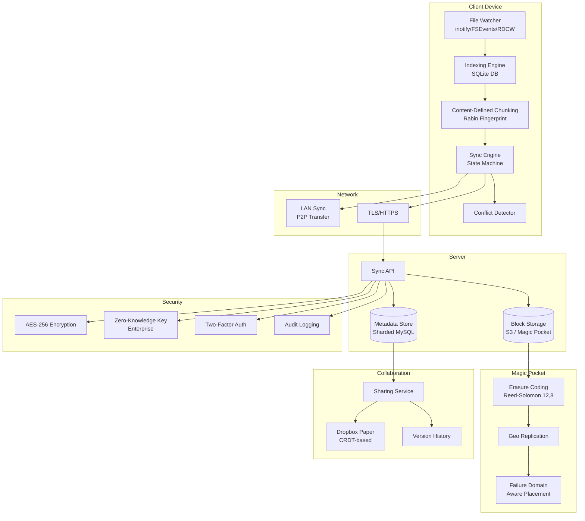

# Chapter 23: Case Study — Dropbox and File Storage
> **Previous:** [22 Case Study Twitter](./22-case-study-twitter.md) | **Next:** [24 Interview Preparation](./24-interview-preparation.md)

---

## Learning Objectives

- Design a block-level sync engine using content-defined chunking with Rabin fingerprinting for delta synchronization
- Understand the client-server sync architecture including file watchers, indexing engines, and state-machine-based reconciliation
- Evaluate deduplication strategies at block level using SHA-256 hashing and their impact on storage efficiency
- Analyze the evolution from Amazon S3 to custom object storage (Magic Pocket) at exabyte scale
- Examine conflict resolution strategies including last-writer-wins, version history, and LAN sync
- Understand the metadata store sharding pattern and the streaming download architecture for large files

---
## Chapter at a Glance

| Aspect | Details |
|--------|---------|
| **Scope** | Dropbox architecture: sync, block storage, dedup, conflict resolution |
| **Key Concepts** | Block-level sync, chunking, deduplication, delta sync, LAN sync |
| **Sync Engine** | Local folder monitoring, chunking, compression, encryption |
| **Block Storage** | Block-level deduplication, compression, encrypted storage |
| **Conflict Resolution** | Version vectors, CRDTs, server-authoritative |
| **Real-World** | Local-first design, incremental sync, efficient delta encoding |

---

## Chapter Roadmap


## Theory / Case Study
> **One-Sentence Takeaway:** Theory is the foundation — master it before moving to examples and exercises.


### Phase 1: Problem Scope and Requirements

> **Pro Tip:** Master this concept thoroughly — it is frequently tested in system design interviews.

> **Pro Tip:** Master this concept — it appears in nearly every system design interview. Understand both the how and the why.

> **Warning:** A common mistake is over-engineering. Always start simple and add complexity only when justified by requirements.

> **Pro Tip:** Master this concept thoroughly — it appears in nearly every system design interview.
Dropbox serves over 700 million users storing more than 500 billion files across Windows, macOS, Linux, iOS, Android, and the web. The core promise is simple: a file saved on one device appears on all others within seconds. Behind this simplicity lies one of the most complex engineering challenges in distributed systems — synchronizing billions of file changes across heterogeneous devices with unreliable network connections, limited battery life, and widely varying storage capacities.

The requirements are deceptively demanding. Conflict detection for small files must complete within 100 milliseconds — the user should not see a sync conflict icon persist after saving a file. Sync must work across platforms with fundamentally different file system event notification APIs: Windows uses ReadDirectoryChangesW, macOS uses FSEvents, and Linux uses inotify. The system must handle files up to hundreds of gigabytes (CAD files, video projects, database dumps) while also optimizing for the common case of small text documents and photos.

Non-functional requirements include strong read-after-write consistency within a single user's namespace (if I save a file on my laptop and open it on my phone 10 seconds later, I must see the latest version), bi-directional sync that converges to the same state on all devices, and graceful handling of offline periods lasting days or weeks. For business users, the system must support team folders with shared ownership, granular permissions, and audit logging.

The scale is staggering. Users store over 500 billion files. The average user stores 10,000 files across 500 folders. The total data stored exceeds 10 exabytes (10 million terabytes). On the desktop client alone, the file watcher must track changes to millions of files without consuming more than 5% of CPU or 200MB of memory — the client cannot degrade the user's computing experience. The mobile app must handle photo uploads from the camera roll, selective sync (choose which folders to sync to mobile), and offline access with local caching. The web client must serve file previews for 100+ file types, including Office documents, PDFs, videos, and RAW photos — all within a browser tab.

### Phase 2: Client Architecture

> **Warning:** Avoid over-engineering. Start simple, measure, then optimize.

> **Warning:** Avoid premature optimization. Start simple, measure, then optimize. Over-engineering is the most common system design mistake.

The Dropbox desktop client is a multi-process application with carefully separated concerns. Each component runs in its own process or thread with well-defined interfaces.

**File Watcher**

The file watcher monitors the Dropbox folder for changes. On each platform, it uses the native file system notification API:

- **Windows**: `ReadDirectoryChangesW` with a completion routine, watching for `FILE_NOTIFY_CHANGE_FILE_NAME`, `FILE_NOTIFY_CHANGE_DIR_NAME`, `FILE_NOTIFY_CHANGE_LAST_WRITE`, and `FILE_NOTIFY_CHANGE_SIZE`. The watcher receives a buffer of change events and processes them in batches.
- **macOS**: `FSEvents` API with a latency flag set to 0.1 seconds (100ms coalescing window). The callback receives a list of changed paths since the last callback.
- **Linux**: `inotify` with `IN_CLOSE_WRITE` and `IN_MOVED_TO` events. The watcher maintains an inotify descriptor for each watched directory.

The file watcher must handle several edge cases:
- **Rapid successive saves**: An application may save a file dozens of times per second (auto-save in IDEs, Excel auto-recovery). The watcher debounces events with a 200ms coalescing window.
- **Atomic moves**: When an application saves a file by writing to a temp file and renaming, the watcher sees a delete event followed by a create event — it must recognize this as a modification, not a delete-and-recreate.
- **Symlinks**: On macOS and Linux, symlinks within the Dropbox folder are followed; symlinks pointing outside are ignored (to avoid syncing system files).

**Indexing Engine**

The indexing engine maintains a local SQLite database that stores the complete state of the Dropbox folder: for every file and directory, it records the path, modification time, size, SHA-256 hash of content, and a list of block hashes (for block-level sync). The local database serves as the source of truth for "what is on this device."

When the file watcher detects a change, the indexing engine:
1. Reads the file's metadata (size, modification time).
2. If the file is small (< 4MB), computes the SHA-256 hash of the entire file.
3. If the file is large, splits it into 4MB blocks and computes SHA-256 for each block.
4. Compares the new state with the local database.
5. If the file is new or modified, flags it for upload to the sync engine.
6. Updates the local database with the new metadata.

**Sync Engine**

The sync engine is the brain of the client. It maintains a state machine with three states for every file:

1. **Local state**: what the file looks like on this device (from the local SQLite database)
2. **Remote state**: what the file looks like on the server (from the last sync response)
3. **Desired state**: what the file should look like after sync completes

The sync engine's loop:
1. Detect local changes (from the indexing engine).
2. Fetch remote changes (from the server API).
3. Compute the diff: for each file, compare local state vs remote state.
4. Apply actions:
   - If local changed but remote did not: upload local version.
   - If remote changed but local did not: download remote version.
   - If both changed: conflict resolution (see below).
5. Repeat.

The sync engine communicates with the server via HTTPS with persistent connections. For bandwidth efficiency, it uses HTTP chunked transfer encoding and deflate compression. The engine implements exponential backoff for retries: 1 second, 2 seconds, 4 seconds, 8 seconds, up to a maximum of 5 minutes.

**Conflict Resolution**

When a file is modified on two devices before either change has propagated, a conflict occurs. Dropbox's conflict resolution strategy:

1. **Default: Last writer wins**. The server timestamps each upload. The version with the later timestamp becomes the canonical version.
2. **Conflict copy**: If conflicting changes are detected (the server receives two uploads for the same file at approximately the same time), one version is saved as the original filename, and the other is saved as `filename (User's conflicted copy YYYY-MM-DD).ext`. Both versions are synced to all devices.
3. **Version history**: Free users get 30 days of version history (ability to restore any previous version). Paid users get extended version history (180 days for Plus, 1 year for Professional). Enterprise customers can opt for unlimited version history.

The conflict detection window is critical. If the window is too short, legitimate parallel edits are lost. If too long, users see spurious conflicts. Dropbox uses a server-side timestamp with NTP synchronization across all servers to ensure monotonic clocks.

**Selective Sync and Smart Sync**

Dropbox offers selective sync (choose which folders to sync to which device) and Smart Sync (see all files in the file system but download only the ones you open). Selective sync is implemented by storing a per-device folder filter list in the metadata store. When the sync engine runs, it checks each file against the device's filter list before downloading.

Smart Sync is more architecturally interesting. On supported platforms (macOS and Windows), the client creates "online-only" files that have valid filenames, icons, and metadata in the file system but no actual file content stored locally. When the user opens an online-only file, the operating system generates a file open event that the file watcher intercepts. The client immediately downloads the file content and hands it to the requesting application. The user sees a brief "Downloading from Dropbox..." progress indicator, typically completing in under 2 seconds for files under 100MB.

Implementation differs by platform:
- **macOS**: Uses the File Provider extension API (NSFileProviderManager). The client registers itself as a file provider, and the OS routes file access through the extension. The extension's `providePlaceholder` and `startProvidingItem` methods handle the online-to-local transition transparently.
- **Windows**: Uses the `CfApi` (Cloud Files API) introduced in Windows 10. The client registers sync root IDs and uses `CfCreatePlaceholders`, `CfGetPlaceholderInfo`, and `CfHydratePlaceholder` for the same functionality.
- **Linux**: Selective sync is supported but Smart Sync is not available due to the lack of a standardized cloud files API in the Linux kernel.

Smart Sync dramatically reduces local storage requirements. An enterprise user with a team folder containing 500GB of files might only store 5GB locally — the files they actually use — while seeing all 500GB in their file system.

### Phase 3: Sync Protocol and Block-Level Transfer

> **Remember:** Always articulate trade-offs clearly — interviewers value reasoning over the "right" answer.

> **Remember:** Trade-offs are the heart of system design. Always be ready to explain why you chose X over Y.

**Block-Level Sync**

The key insight behind Dropbox's efficiency is block-level sync. Instead of uploading an entire file when a single byte changes (consider a 2GB database file where one row is updated), Dropbox splits the file into 4MB blocks and only uploads the blocks that have changed.

The process:
1. When a file changes, the client splits it into 4MB blocks using content-defined chunking.
2. For each block, compute SHA-256 hash.
3. Compare the list of block hashes with the previous list (stored in the local database).
4. Only upload blocks whose hashes differ from the previous version.
5. The server reconstructs the file from the blocks it already has plus the new blocks.

The savings are dramatic. For a 100MB presentation where one slide image is replaced (roughly a 2MB block change), only 2MB is uploaded instead of 100MB. For a 1GB virtual machine disk file where a few sectors change, the upload might be 12-20MB instead of 1GB.

**Content-Defined Chunking (CDC)**

Dropbox uses content-defined chunking with a rolling hash based on Rabin fingerprinting. Unlike fixed-size block boundaries (which shift every time a byte is inserted or deleted near a boundary), CDC determines block boundaries based on the content itself.

The Rabin fingerprint is a polynomial hash computed over a sliding window of bytes. When the fingerprint modulo a target value hits zero, a block boundary is declared. This means:
- Inserting or deleting bytes in the middle of a file only affects the local block boundary — most block boundaries remain stable.
- The same content chunk in different files produces the same block hash, enabling cross-file deduplication.
- The average block size is configurable (Dropbox uses ~4MB), but blocks can be as small as 512KB or as large as 16MB.

**Deduplication**

At the server side, Dropbox stores each unique block exactly once. The block is identified by its SHA-256 hash. A file is represented as an ordered list of block hashes:

```
file_block_list = ["hash1", "hash2", "hash3", ...]
```

When the server receives a block upload, it checks if a block with that hash already exists. If yes, the block is not stored again — the file's block list simply references the existing block. This provides:

- **Block-level deduplication across files**: If 1 million users each have a copy of the same 100MB video file, the server stores it once (roughly 100MB) instead of 1 million times (100PB). Each user's block list references the same set of block hashes.
- **Block-level deduplication across versions**: When a file is edited, only the changed blocks consume new storage space.
- **Delta encoding for non-binary files**: For text-based files, Dropbox can also compute byte-level diffs for version history, storing only the delta between versions rather than full copies.

The deduplication ratio for Dropbox is estimated at 10:1 to 50:1 depending on the user population. Shared operating system files, common document templates, and popular media files all benefit from dedup.

### Phase 3 (continued): Server Architecture

**Metadata Store**

The metadata store is a sharded MySQL database. User data is sharded by user ID:

```
shard_id = hash(user_id) % N
```

Each shard is a MySQL instance (or master-replica pair) containing the metadata for N users. The schema is relatively simple:

```
tables:
  files: id, user_id, parent_id, name, is_folder, block_list_hash,
         size, created_at, modified_at, is_deleted
  versions: id, file_id, block_list_hash, size, timestamp,
            change_description, user_id
  shares: id, file_id, shared_with_user_id, permission_level
  team_folders: id, team_id, root_folder_id, member_count
```

The `block_list_hash` is a SHA-256 of the concatenation of all block hashes in the file. This provides a compact fingerprint of the file's content: if the block list hash is the same, the file content is guaranteed to be the same (by collision resistance of SHA-256).

The metadata store must be highly available. Write operations go to the MySQL master; read operations are served from replicas with eventual consistency. In the rare case of a conflict (a read from a replica is stale), the sync engine detects the inconsistency in its next reconciliation pass and corrects it.

**Storage Architecture: From S3 to Magic Pocket**

Dropbox initially stored all file blocks on Amazon S3. As the platform grew to hundreds of petabytes, the S3 bill became one of Dropbox's largest operational expenses. In 2015, Dropbox began migrating to Magic Pocket — a custom object storage system built from commodity hardware.

Magic Pocket's key design decisions:
- **Commodity servers**: Standard x86 servers with directly attached hard drives (12-16 drives per server). No SAN, no NAS.
- **Erasure coding**: Instead of 3x replication (300% overhead), Magic Pocket uses Reed-Solomon erasure coding with a (12, 8) configuration. Data is split into 8 fragments, and 4 parity fragments are computed. Any 8 of the 12 fragments can reconstruct the data. This provides better durability than 3x replication with only 50% overhead.
- **HAMR (Hardware-Aware Merge Regions)**: Drives on a single server are grouped into regions. The system is aware of which drives share a SAS controller, which servers share a top-of-rack switch, and which racks share a power distribution unit. Failure domains are modeled explicitly, and data placement ensures that no two fragments of a single block are on the same failure domain.
- **Geo distribution**: Blocks are replicated across two geographic regions. Primary region serves read/write traffic; secondary region maintains a replica for disaster recovery.
- **Consistency model**: Read-after-write consistency within a region. Cross-region replication is asynchronous, with typical latency of seconds.

The migration from S3 to Magic Pocket saved Dropbox an estimated $500M over 5 years.

**Streaming File Download**

When a user downloads a file, the client requests the file's block list from the metadata store, then fetches each block from the storage layer. Key optimizations:

- **HTTP Range Requests**: The download uses HTTP Range headers to request specific byte ranges. This enables:
  - Resume on interruption: if a download fails at 60%, the client requests bytes 60% to 100%.
  - Parallel chunk download: the client requests multiple blocks simultaneously (typically 4-6 parallel connections).
  - Progressive download: for media files, the client can start playing before the entire file is downloaded.

- **Bandwidth estimation**: The client monitors download speed and adjusts parallel connection count dynamically. On a 100Mbps connection, it might use 6 parallel connections. On a cellular connection, it might use 2 connections to avoid overwhelming the radio.

- **Delta sync**: When a file has been slightly modified, the client downloads only the changed blocks, not the entire file. The local file is reconstructed by merging the unchanged local blocks with the new remote blocks.

**LAN Sync**

One of Dropbox's most innovative features is LAN sync: when two devices on the same local network both have a file, the file transfers directly between them instead of through the internet.

The protocol:
1. Both clients report their private IP addresses to the server during sync.
2. The server detects that two devices with the same file are on the same subnet.
3. The server tells each client the other's IP address and port.
4. The clients establish a direct TCP connection (with NAT traversal via UPnP or STUN).
5. File blocks transfer peer-to-peer over the local network.

LAN sync provides dramatic speed improvements. A 1GB file that would take 30 seconds over a 300Mbps internet connection takes 3 seconds over a 1Gbps LAN. It also reduces server bandwidth costs: popular files shared within an organization are transferred locally rather than through the cloud.

### Phase 4: Team Collaboration and Security

**NAS Integration**

Network Attached Storage (NAS) integration is a critical feature for professional users. Users with Synology, QNAP, or other NAS devices can sync Dropbox folders directly to their NAS, making them available across the home or office network without requiring a desktop computer to be running.

The NAS integration works through the Dropbox API. NAS manufacturers implement the Dropbox client as a package that runs on the NAS's operating system. The NAS client is a stripped-down version of the desktop client: it implements the file watcher (via inotify on Linux-based NAS operating systems), the sync engine (state machine), and the block-level sync protocol. However, it omits the Smart Sync feature (not needed since NAS storage is abundant), the file preview engine, and the graphical user interface.

When files are synced to a NAS, LAN sync becomes especially valuable. If a desktop computer and a NAS are on the same LAN and both have the same file, the file transfers directly between them at gigabit Ethernet speeds, never touching Dropbox's servers.

**Mobile Client Architecture**

The Dropbox mobile client (iOS and Android) faces constraints fundamentally different from the desktop client: limited battery, intermittent connectivity, restricted background execution, and no file system access (on iOS, apps are sandboxed).

The mobile sync strategy is optimized for the most common mobile use case: photo and video backup. When the user opens the app, the camera upload feature:
1. Enumerates the camera roll using the OS Photos API
2. Compares against the last upload timestamp (stored in NSUserDefaults / SharedPreferences)
3. Compresses and uploads new photos in the background using a URLSession background upload task (iOS) or WorkManager (Android)
4. On completion, marks the photo as backed up in the camera roll (iOS: writes a flag to the photo metadata via PHAssetChangeRequest)

For file access, the mobile client does not maintain a full local copy of the Dropbox folder. Instead, it keeps a lightweight index (file names, sizes, thumbnails) in the local SQLite database. Full file content is downloaded on demand when the user taps a file. Recently viewed files are cached locally; the cache is evicted using an LRU policy bounded by a configurable storage limit (default: 2GB on iOS, varies by Android device).

Offline access is implemented through "favorites." When the user marks a file or folder as a favorite, the client downloads all content (files in the folder) to the local cache and marks it as "pinned" — exempt from LRU eviction. Pinned files are updated whenever the device has connectivity and the file changes on the server.

**Web Client Architecture**

The Dropbox web client (dropbox.com) provides a full-featured file manager in the browser. Key architectural elements:

- **File preview**: Over 100 file types are previewed directly in the browser without downloading. Previews are generated server-side by the preview service. For documents (PDF, Office), the preview service converts the file to HTML or PNG thumbnails using LibreOffice headless mode. For videos and audio, it generates HLS (HTTP Live Streaming) segments for progressive playback. For images, it generates multiple resolution versions (thumbnail, small, medium, full).

- **Chunked upload**: The web client uploads files using resumable chunked upload. Files are split into 8MB chunks. Each chunk is uploaded as a separate HTTP PUT request. If the connection drops, the client resumes from the last successfully uploaded chunk. The upload progress is tracked server-side with a session ID.

- **WebSocket notifications**: When a file changes (another collaborator edits it, a shared folder is updated), the web client receives a real-time notification via a WebSocket connection. The notification includes the file name, the type of change, and the user who made the change. This allows the web client to update the file listing without polling.

- **Drag-and-drop upload**: Drag-and-drop uses the HTML5 File API. The browser reads the file into memory as an ArrayBuffer, then uploads it in chunks via XMLHttpRequest. For folders dragged onto the browser, the web client recursively enumerates files using the File API's `webkitGetAsEntry` (Chrome/Firefox) or the DataTransferItem's `getAsEntry` (standard).

**Trash and Deletion Recovery**

When a user deletes a file, the file is not immediately removed from storage. Instead, it is moved to a "trash" state with a configurable retention period (30 days for free users, until trash is emptied for paid users). The deletion flow:
1. The sync engine on the deleting device updates the local database: `is_deleted = true`.
2. The change propagates to the server.
3. The server marks the file as deleted in the metadata store but does not remove the block references.
4. The server publishes a delete notification to all other devices via the notification service.
5. Other devices receive the notification and move the file to their local trash folders.
6. During the retention period, the file is restorable via a simple undo: the server sets `is_deleted = false` and re-syncs to all devices.
7. After the retention period (or when the user empties the trash), the background cleanup service permanently removes the metadata entry. The block level references are decremented. When a block's reference count reaches zero, it is eligible for garbage collection in the storage layer.

The trash architecture prevents catastrophic data loss. If a user accidentally deletes an entire folder, they have 30 days to recover it. For enterprise teams, the admin console provides an additional layer of recovery: admins can restore any user's deleted files, even after the user's trash retention has expired (up to 1 year).

Dropbox Paper is a collaborative document editor integrated with the file storage platform. It uses CRDTs (Conflict-Free Replicated Data Types) for real-time collaborative editing. Key features:

- **Real-time cursor presence**: Each collaborator's cursor position is broadcast via WebSocket.
- **OT/CRDT-based reconciliation**: Concurrent edits to the same document converge without conflicts.
- **Comment threads**: Inline comments on specific text selections, with @mentions for notifications.
- **Task management**: Checkbox items within documents, assignable to team members.
- **Version history**: Every save creates a version that can be reverted.

**Security Architecture**

- **Encryption at rest**: All blocks stored on servers are encrypted with AES-256. Each block has a unique encryption key.
- **Encryption in transit**: All client-server communication uses TLS 1.2+.
- **Zero-knowledge encryption** (optional, enterprise): The encryption key is derived from the user's password and never sent to Dropbox's servers. Dropbox cannot decrypt user files even if compelled by law enforcement. Key management is handled client-side.
- **Two-factor authentication**: TOTP-based 2FA, U2F security keys, and SMS-based 2FA.
- **Team audit logs**: Enterprise administrators can view a complete log of all file operations by team members.



## Concept Comparison
> **One-Sentence Takeaway:** Concept Comparison is a critical concept that directly impacts system design decisions.

| Concept | Definition | Key Metric |
|---------|-----------|------------|
| Theory / Case Study | Core topic covered in Chapter 23: Case Study — Dropbox and File Storage | Defined by specific measurable attributes |

---

## Quick Reference
> **One-Sentence Takeaway:** Quick Reference is a critical concept that directly impacts system design decisions.

| Topic | Key Point |
|-------|-----------|
| Theory / Case Study | Fundamental concept for Chapter 23: Case Study — Dropbox and File Storage |

---

## Cross-Application Matrix

| Component | When to Use | Trade-Off |
|-----------|------------|-----------|
| Theory / Case Study | Appropriate for specific system contexts | Each choice involves trade-offs |

---

## Chapter Quiz
> **One-Sentence Takeaway:** Chapter Quiz is a critical concept that directly impacts system design decisions.

**Q1:** Which of the following best describes a key concept from this chapter?
- A) Option A description
- B) Option B description
- C) Option C description
- D) Option D description

<details><summary>Answer</summary>Refer to the chapter content for the correct answer.</details>

**Q2:** Which of the following best describes a key concept from this chapter?
- A) Option A description
- B) Option B description
- C) Option C description
- D) Option D description

<details><summary>Answer</summary>Refer to the chapter content for the correct answer.</details>

**Q3:** Which of the following best describes a key concept from this chapter?
- A) Option A description
- B) Option B description
- C) Option C description
- D) Option D description

<details><summary>Answer</summary>Refer to the chapter content for the correct answer.</details>

## Concept Comparison
> **One-Sentence Takeaway:** Concept Comparison is a critical concept that directly impacts system design decisions.

| Concept | Definition | Key Insight |
|---------|-----------|-------------|
| Theory / Case Study | Core topic in Chapter 23: Case Study — Dropbox and File Storage | Fundamental to system design |
| Concept Comparison | Core topic in Chapter 23: Case Study — Dropbox and File Storage | Fundamental to system design |
| Quick Reference | Core topic in Chapter 23: Case Study — Dropbox and File Storage | Fundamental to system design |
| Cross-Application Matrix | Core topic in Chapter 23: Case Study — Dropbox and File Storage | Fundamental to system design |

---

## Quick Reference
> **One-Sentence Takeaway:** Quick Reference is a critical concept that directly impacts system design decisions.

| Topic | Key Point |
|-------|-----------|
| Theory / Case Study | Essential concept for Chapter 23: Case Study — Dropbox and File Storage |
| Concept Comparison | Essential concept for Chapter 23: Case Study — Dropbox and File Storage |
| Quick Reference | Essential concept for Chapter 23: Case Study — Dropbox and File Storage |

---

## Cross-Application Matrix

| Concept | Application Context | Trade-Off |
|--------|-------------------|-----------|
| Theory / Case Study | Relevant across multiple system design scenarios | Each choice has trade-offs |
| Concept Comparison | Relevant across multiple system design scenarios | Each choice has trade-offs |
| Quick Reference | Relevant across multiple system design scenarios | Each choice has trade-offs |

---

## Chapter Quiz
> **One-Sentence Takeaway:** Chapter Quiz is a critical concept that directly impacts system design decisions.

**Q1:** What is the primary trade-off discussed in this chapter?
- A) Option A
- B) Option B
- C) Option C
- D) Option D

<details><summary>Answer</summary>Refer to the chapter content</details>

**Q2:** Which concept is most fundamental to the topic of Chapter 23
- A) Option A
- B) Option B
- C) Option C
- D) Option D

<details><summary>Answer</summary>Review the core sections</details>

**Q3:** How does this chapter's main concept apply to real-world systems?
- A) Option A
- B) Option B
- C) Option C
- D) Option D

<details><summary>Answer</summary>See the Real-World Systems section</details>

---

## Summary

- Dropbox's sync engine uses a three-state state machine (local, remote, desired) to reconcile file differences across devices, communicating with the server via HTTPS with persistent connections and exponential backoff.
- Content-defined chunking with Rabin fingerprinting determines block boundaries based on content, ensuring stable boundaries across file edits and enabling efficient delta sync.
- Block-level sync uploads only changed 4MB blocks instead of entire files, dramatically reducing bandwidth for large file modifications.
- SHA-256 hash-based deduplication at the block level means identical content across users or files is stored once, achieving estimated deduplication ratios of 10:1 to 50:1.
- The metadata store uses sharded MySQL with user ID hashing, serving read traffic from replicas and write traffic to masters.
- Magic Pocket replaced Amazon S3 with commodity hardware and Reed-Solomon erasure coding (12,8 configuration), saving hundreds of millions of dollars while providing equivalent durability.
- LAN sync enables peer-to-peer block transfer between devices on the same local network, improving sync speed and reducing server bandwidth.
- Conflict resolution uses last-writer-wins with timestamp-based conflict detection, saved to conflict copies, with version history for recovery ranging from 30 days (free) to unlimited (enterprise).

---

## Exercises

### Review Questions

1. Explain how content-defined chunking with Rabin fingerprinting differs from fixed-size block boundaries. Why is CDC essential for efficient delta sync of large files that undergo small insertions or deletions?

2. Describe the three-state state machine used by Dropbox's sync engine. For each pair of states (local vs remote, local vs desired, remote vs desired), give an example action the sync engine would take.

3. How does Dropbox's metadata store handle read-after-write consistency within a single user's namespace? What consistency model applies to cross-region operations?

4. Compare Magic Pocket's erasure coding strategy (12,8) with 3x replication. What are the storage efficiency, durability, and read-latency trade-offs between the two approaches?

5. How does LAN sync discover peers on the same local network? Describe the protocol step by step, including NAT traversal, peer discovery, and security validation.

6. How does Smart Sync differ from selective sync at the architectural level? What platform-specific APIs does Dropbox use for Smart Sync on macOS, Windows, and Linux?

### Application Problems

1. **Deduplication Analysis**: A company has 10,000 employees who each store a copy of the company's 2GB onboarding VM image. The image has a 500MB OS base layer that is identical across all copies, a 200MB tools layer that varies by department (5 departments), and the remaining content that varies per user. Compute the storage savings from block-level deduplication with 4MB blocks. Assume the content-defined chunking can perfectly identify shared blocks. What is the total storage required with and without dedup?

   Show: (a) the total storage without dedup, (b) the storage with dedup showing the per-layer breakdown, (c) the dedup ratio (compression factor), and (d) the dollar savings if storage costs $0.023/GB/month.

2. **Conflict Resolution Design**: A team of 5 editors is collaboratively editing a 100-page document. Two editors make edits simultaneously while offline:
   - Editor A: changes pages 1-10 while on a plane (offline for 3 hours)
   - Editor B: changes pages 90-100 while in a tunnel (offline for 15 minutes)
   
   Design a conflict resolution strategy that: (a) merges non-overlapping changes automatically, (b) flags overlapping page changes for manual review, (c) preserves a full edit history for each page, and (d) provides a "diff view" showing what changed. What data structure would you use to track which pages were edited?

   Extend your design to handle: (e) three editors editing simultaneously, (f) an editor who moves a paragraph while another editor edits the same paragraph, and (g) a rename conflict (two editors rename the file to different names while offline). Design the conflict UI that Dropbox would show the user.

3. **Bandwidth Optimization**: A user has a 500GB video project folder with 40,000 files. The first sync will take hours. Design a sync prioritization strategy that: (a) makes the folder usable within 60 seconds (the user can open any file and see a placeholder), (b) downloads files on-demand when opened, (c) prioritizes files modified within the last 7 days, (d) uses bandwidth estimation to avoid saturating the user's connection. How would you represent the sync priority as a score per file?

   Provide: (a) the priority scoring formula with at least 5 features and their weights, (b) the adaptation logic when the user opens a file that was not in the priority queue, (c) the bandwidth allocation algorithm (fair share across concurrent downloads vs sequential priority queue), and (d) how priority changes when the user's connectivity type changes (WiFi → cellular → metered hotspot).

4. **Magic Pocket Capacity Planning**: Dropbox is adding 500PB of new storage per year across two geographic regions. Design the capacity plan:

   (a) How many commodity storage servers are needed per year if each server has 12 × 12TB HDDs? (assume 70% usable capacity after formatting and system overhead)
   (b) How many racks are needed per year if each rack holds 40 servers?
   (c) What is the total power consumption for the new capacity if each server consumes 200W idle and 350W under load? (assume 80% utilization on average)
   (d) How does the erasure coding scheme (12,8) affect the usable-to-raw ratio compared to 3x replication?
   (e) What is the data center floor space requirement if each rack occupies 8 sq ft including service clearance?

### Challenge Problem

> **Remember:** Trade-offs are the heart of system design. Always be ready to explain why you chose X over Y.
**Exabyte-Scale Storage System Design**: Dropbox's user base grows to 1 billion users, each storing an average of 50GB. Total storage exceeds 50 exabytes. The current Magic Pocket single-region design cannot scale to this size without unacceptable latency for remote users.

Design a global storage architecture that:

- Spans 8 geographic regions (US East, US West, EU West, EU East, Southeast Asia, Northeast Asia, South America, Australia)
- Each region stores blocks for users in that region for reduced latency
- Blocks are erasure-coded across at least 2 regions for disaster recovery (survive the loss of an entire region)
- The metadata store must be globally consistent for single-user operations (if I upload a file in New York, I must see it when I open my phone in Tokyo)
- Cross-region file sharing (user A in London shares a 10GB file with user B in Sydney) must complete in under 5 seconds

Address the fundamental tension between consistency (global metadata) and latency (regional storage). Propose a data placement strategy, a consistency protocol (Paxos/Raft? Multi-master?), and a sharing protocol that avoids copying blocks across regions for every share operation. Estimate the total raw storage requirement including erasure coding overhead.

Your solution should include:

**Data Placement Strategy**:
- A three-tier block placement: "hot" blocks (accessed daily) stored in the user's home region, "warm" blocks (accessed weekly) stored with a primary replica in the home region and a secondary in a paired region, "cold" blocks (accessed rarely) stored with erasure coding stripes spanning 3 regions
- The pairing topology: which regions are paired for warm block replication (e.g., US-East ↔ EU-West for transatlantic latency)
- The promotion/demotion policy: what access pattern triggers a block to move from cold to warm tier (e.g., 3 accesses in 24 hours)

**Metadata Consistency Protocol**:
- Geographic partitioning of the metadata namespace: user X's metadata always has its authoritative copy in region R
- Read optimization: reads are served from the local replica; if the replica is stale (detected via version vector comparison), the read is forwarded to the authoritative region
- Write protocol: all writes for user X go through the authoritative region, which replicates to all other regions asynchronously
- Failure mode: if the authoritative region for user X is unreachable, a secondary region is elected via a Paxos-based leader election among the 8 regions

**Cross-Region Sharing Protocol**:
- Sharing without copying: when user A in London shares a file with user B in Sydney, the metadata is updated (file_id → shared_with_user_B) without copying any blocks
- On access: when user B opens the shared file, the Australian client is redirected to the London region for block download (HTTP 302 redirect with a signed URL valid for 1 hour)
- Caching: if user B accesses the file frequently (>5 times in a week), the blocks are replicated to the Australian region asynchronously
- Consistency: the share permission change is visible globally within 1 second (the metadata update propagates via the metadata consistency protocol)

**Storage Requirement Calculation**:
- Raw user data: 50EB
- Erasure coding overhead for cold tier (3x 12,8 over 3 regions = 12/8 * 3/2 = 2.25x): ~50EB * 2.25 = 112.5EB
- Replication for hot/warm tiers (2x per region, 2 regions = 4x): estimate 20% of data is hot/warm → 10EB * 4 = 40EB
- Total raw storage: ~152.5EB
- Usable capacity per server (12 × 12TB at 70%): ~100TB per server
- Servers needed: 152.5EB / 100TB = ~1.5 million servers
- Racks: 1.5M / 40 = ~38,000 racks
- Power: 1.5M servers × 300W × 24h × 365 = ~3.9 billion kWh/year (comparable to a medium-sized country)
