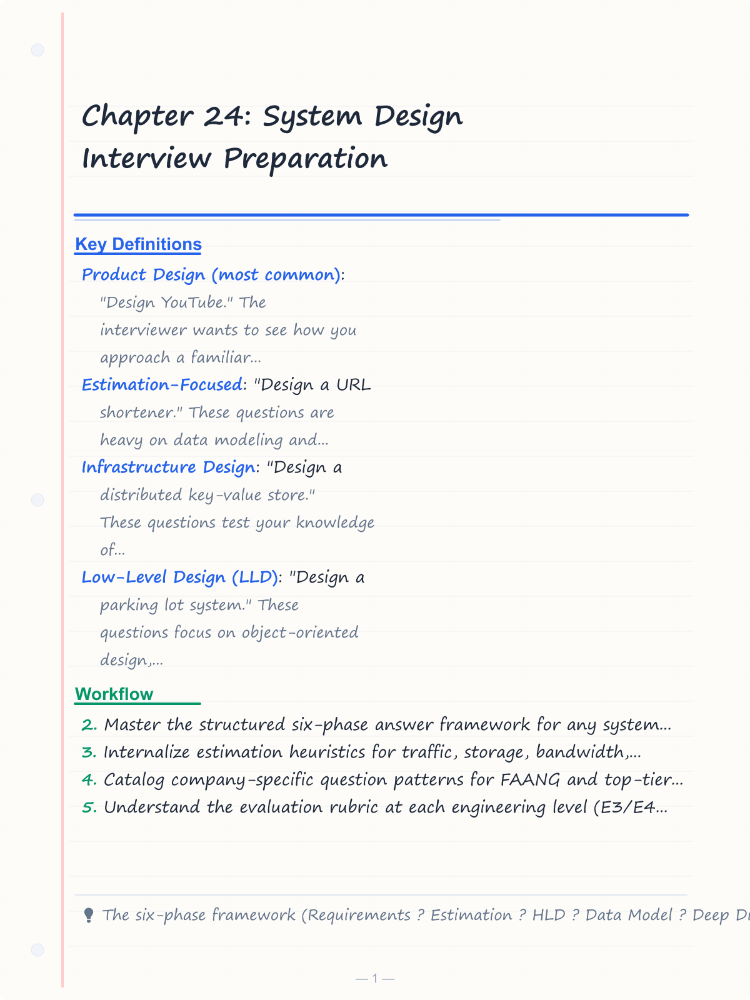
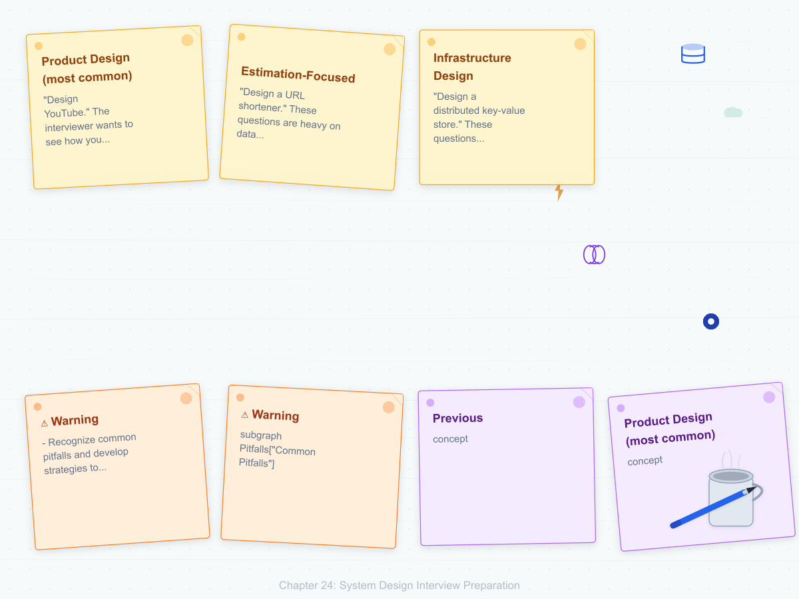
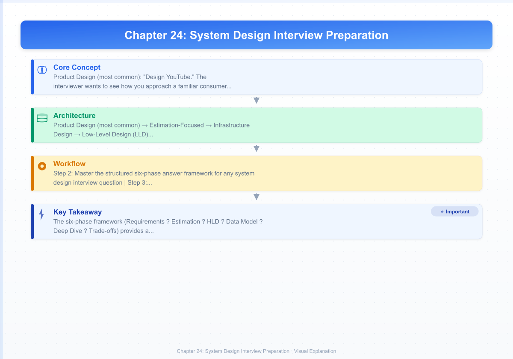
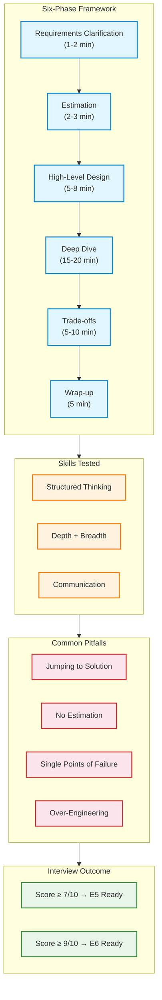

# Chapter 24: System Design Interview Preparation
> **Previous:** [23 Case Study Dropbox](./23-case-study-dropbox.md) | **Next:** None

---

## Learning Objectives

- Master the structured six-phase answer framework for any system design interview question
- Internalize estimation heuristics for traffic, storage, bandwidth, and query-per-second calculations
- Catalog company-specific question patterns for FAANG and top-tier tech companies
- Understand the evaluation rubric at each engineering level (E3/E4 to E6+)
- Recognize common pitfalls and develop strategies to avoid them
- Practice time-boxed mock interview workflow with specific phase durations

<!-- Image Gallery -->
<section class="lesson-visuals" aria-label="Visual learning resources">
  <header><span>VISUAL LEARNING</span><h2>See it. Review it. Remember it.</h2></header>
  <a class="lesson-visual-card" href="../../assets/images/lessons/system-design/24-interview-preparation/handwritten-notes.png" target="_blank" rel="noopener">
    
    <span><strong>Handwritten notes</strong>Condensed notes for deliberate review.</span>
  </a>
  <a class="lesson-visual-card" href="../../assets/images/lessons/system-design/24-interview-preparation/sticky-notes.png" target="_blank" rel="noopener">
    
    <span><strong>Sticky-note revision</strong>Fast recall prompts for revision.</span>
  </a>
  <a class="lesson-visual-card" href="../../assets/images/lessons/system-design/24-interview-preparation/visual-explanation.png" target="_blank" rel="noopener">
    
    <span><strong>Visual concept guide</strong>A connected explanation of the key ideas.</span>
  </a>
</section>
<!-- End Image Gallery -->


---
## Chapter at a Glance

| Aspect | Details |
|--------|---------|
| **Scope** | Interview strategies, system design frameworks, mock interview templates |
| **Key Concepts** | Six-phase framework, estimation heuristics, company patterns |
| **Framework** | Requirements -> Estimation -> HLD -> Deep Dive -> Bottlenecks -> Summary |
| **Estimation** | QPS, storage, bandwidth, memory at order-of-magnitude precision |
| **Company Patterns** | FAANG-specific question types and evaluation rubrics |
| **Real-World** | Silent thinking, over-engineering, vague requirements, no trade-offs |

---

## Chapter Roadmap



## Theory / Case Study
> **One-Sentence Takeaway:** Theory is the foundation ? master it before moving to examples and exercises.


### Phase 1: The Interview Format


> **Pro Tip:** Master this concept thoroughly ? it is frequently tested in system design interviews.

> **Pro Tip:** Master this concept ? it appears in nearly every system design interview. Understand both the how and the why.

> **Warning:** A common mistake is over-engineering. Always start simple and add complexity only when justified by requirements.

> **Pro Tip:** Master this concept thoroughly ? it appears in nearly every system design interview.
A system design interview typically lasts 45-60 minutes. The format varies by company but generally follows one of four archetypes:

**Product Design (most common)**: "Design YouTube." The interviewer wants to see how you approach a familiar consumer product, making reasonable assumptions about scale, and prioritizing features based on user needs. These questions test your ability to decompose a known product into its architectural components.

**Estimation-Focused**: "Design a URL shortener." These questions are heavy on data modeling and traffic estimation. The interviewer wants to verify your ability to compute storage requirements, bandwidth needs, and caching strategies from first principles.

**Infrastructure Design**: "Design a distributed key-value store." These questions test your knowledge of distributed systems fundamentals: consistent hashing, replication, quorum protocols, conflict resolution, and failure handling.

**Low-Level Design (LLD)**: "Design a parking lot system." These questions focus on object-oriented design, class hierarchies, design patterns, and clean API contracts. They are more common at Uber, Amazon (certain teams), and for senior+ roles at smaller companies.

The interviewer is evaluating four dimensions simultaneously:
1. **Structured thinking**: Can you follow a systematic approach rather than jumping to random details?
2. **Depth**: When you dive into a component, can you reason about trade-offs at multiple levels?
3. **Breadth**: Do you know the relevant technologies (caching, databases, load balancers, CDNs, queues)?
4. **Communication**: Can you explain complex ideas clearly, use whiteboard diagrams effectively, and incorporate feedback?

### Phase 2: The Structured Answer Framework


> **Warning:** Avoid over-engineering. Start simple, measure, then optimize.

> **Warning:** Avoid premature optimization. Start simple, measure, then optimize. Over-engineering is the most common system design mistake.

The most reliable approach to any system design question follows six phases. The time allocations are guidelines — adjust based on the question's emphasis and the interviewer's signals.

**Phase 1: Requirements Clarification (1-2 minutes)**

Never start designing before clarifying requirements. Ask questions to establish scope:

Functional requirements:
- "What are the core features? What is v1 vs v2?"
- "Who are the users? Consumers? Content creators? Admins?"
- "What are the primary actions users take?"

Non-functional requirements:
- "What scale are we designing for? DAU? Total users?"
- "Is this a read-heavy or write-heavy system?"
- "What are the latency requirements? P99? P95?"
- "What consistency model do we need? Strong? Eventual?"
- "Are there availability constraints? 99.9%? 99.99%?"

Example for "Design YouTube":
- Users: 500M DAU watching videos, 5M content creators uploading
- Actions: Watch video (read), upload video (write), search, comment
- Scale: 500M DAU, each watching 5 videos/day = 2.5B views/day
- Latency: Video start under 2 seconds, search under 500ms
- Consistency: Eventual for views/likes, strong for video metadata
- Availability: 99.99% uptime on playback

**Phase 2: Estimation (2-3 minutes)**

Estimation demonstrates your ability to reason about scale. Compute the key numbers:

Traffic estimation:
```
DAU = 500M
Daily views = DAU * views_per_user = 500M * 5 = 2.5B
Writes: uploads per day = 5M * 1 = 5M
Reads: video views per second = 2.5B / 86400 ˜ 29,000 QPS
Peak QPS: 3-5x average ˜ 100,000 QPS
```

Storage estimation:
```
Average video size: 50MB (compressed, various resolutions)
Daily new video storage: 5M * 50MB = 250TB/day
Yearly storage: 250TB * 365 ˜ 91PB/year
Total storage (5 years): ~455PB
Metadata per video: 1KB
Total metadata: 5 years * 5M * 365 * 1KB ˜ 9TB
```

Bandwidth estimation:
```
Upload bandwidth: 5M videos/day * 50MB / 86400s ˜ 2.9 GB/s
Download bandwidth: 29,000 QPS * 50MB = 1.45 TB/s
CDN bandwidth: 95% of download served by CDN ˜ 1.38 TB/s
Origin bandwidth: remaining 5% ˜ 72.5 GB/s
```

Memory estimation:
```
Cache for hot videos (80% of traffic from 20% of videos):
    Hot videos = 2.5B * 0.2 = 500M cached videos
    At 50MB each: 500M * 50MB = 25PB ? not feasible
    Cache only metadata/popular= 100M * 10KB = 1TB
```

Memory lookup cheat sheet:
| Component | Latency |
|-----------|---------|
| L1 cache reference | 0.5 ns |
| L2 cache reference | 7 ns |
| RAM access | 100 ns |
| SSD random read | 0.1 ms |
| Disk seek | 10 ms |
| Network packet (intra-DC) | 0.5 ms |
| Sequential disk read (1MB) | 1 GB/s |

Scale cheat sheet:
| Metric | Value |
|--------|-------|
| 1 byte | 8 bits |
| 1 KB | 1,024 bytes |
| 1 MB | ~1,000 KB |
| 1 GB | ~1,000 MB |
| 1 TB | ~1,000 GB |
| 1 PB | ~1,000 TB |
| 1 EB | ~1,000 PB |

**Phase 3: High-Level Design (5-8 minutes)**

Draw the box diagram. Identify the major components and their interactions. Use a consistent set of building blocks:

```
Client ? CDN ? Load Balancer ? Web Servers ? Application Services ? Data Stores
```

For "Design YouTube":
```
Client (browser/mobile app) ? CDN (video content) ? Load Balancer ? API Gateway
  ? User Service ? Video Service ? Upload Service ? Transcoder ? Metadata DB
  ? Search Service (Elasticsearch) ? Recommendation Service ? Analytics Pipeline
  ? Blob Storage (videos) ? CDN Origin
```

At this phase, you are sketching boxes and drawing arrows. Do not descend into implementation details yet. Your goal is to demonstrate that you know what components exist and how they connect. Label each box with the technology you would use (PostgreSQL, Redis, Kafka, Elasticsearch, S3) and justify each choice briefly.

**Phase 4: Data Model (3-5 minutes)**

Design the core schema or data structures. For relational databases:

```sql
CREATE TABLE users (
    user_id BIGINT PRIMARY KEY,
    name VARCHAR(100),
    email VARCHAR(255),
    created_at TIMESTAMP
);

CREATE TABLE videos (
    video_id BIGINT PRIMARY KEY,
    user_id BIGINT REFERENCES users,
    title VARCHAR(500),
    description TEXT,
    s3_key VARCHAR(500),
    duration_seconds INT,
    size_bytes BIGINT,
    format VARCHAR(20),
    created_at TIMESTAMP,
    view_count BIGINT DEFAULT 0
);

CREATE TABLE video_encodings (
    id BIGINT PRIMARY KEY,
    video_id BIGINT REFERENCES videos,
    resolution VARCHAR(10),
    s3_key VARCHAR(500),
    bitrate INT
);
```

For key-value stores, describe the schema:
```
User: user_id ? {name, email, created_at}
Video: video_id ? {user_id, title, description, s3_key, duration, ...}
Timeline: user_id ? sorted_set(video_id, timestamp)  -- in Redis
Upload queue: list(video_id)  -- in Kafka
```

Explain why you chose the data model you did, including indexing strategy and partitioning approach.

**Phase 5: Deep Dive (15-20 minutes)**

This is the most important phase. Pick 2-3 components from your high-level design and go deep. The interviewer will guide you toward areas they want to explore. Common deep dive topics:

**Bottleneck analysis**: Identify the weakest link and propose optimizations.
- "The database will be the bottleneck at 100K QPS. Let's add read replicas and cache frequent queries in Redis."
- "The video transcoder takes 5 minutes per video. Let's use a queue with 100 worker nodes and transcoding priority (shorter videos first)."
- "CDN cache misses cause origin load spikes. Let's pre-warm the CDN for trending videos."

**Caching strategy**:
```
Multi-tier caching for YouTube:
  L1: Browser cache (video segments, API responses) — TTL 5 minutes
  L2: CDN cache (video content, thumbnails) — 95% hit rate
  L3: Application cache (Redis — video metadata, user sessions) — 99% hit rate
  L4: Database replica cache (MySQL query cache if needed)
```

**Replication and consistency**:
- "The metadata database uses async replication: writes to master, reads from replicas. This gives us low-latency reads but possible stale reads. If we need read-after-write consistency for video metadata, we route the user to the master for N seconds after their last write."
- "Video views are eventually consistent. We batch write view counts to Redis every 5 seconds, then flush to MySQL every minute. Temporary view count inaccuracies are acceptable."

**Fault tolerance and availability**:
- "The system spans 3 availability zones. Load balancers route to healthy instances."
- "Kafka with replication factor 3 ensures queued jobs survive broker failures."
- "Database master failover: automated via consensus (Raft/Paxos) or semi-automated (Orchestrator for MySQL)."

**Phase 6: Trade-offs and Alternatives (5-10 minutes)**

Demonstrate depth by discussing what you chose NOT to do and why:

- "I chose PostgreSQL over Cassandra because our data model is relational and consistent reads matter for video metadata. If we needed higher write throughput at the cost of consistency, Cassandra would be better."
- "I chose synchronous replication for the payment system (strong consistency required) but async for video views (performance over precision)."
- "I chose a monolithic API gateway for simplicity. If the team grows to 50 engineers, they should migrate to a microservice gateway like Envoy for independent deployments."
- "I chose pull-based CDN cache invalidation. Push-based would be faster but requires CDN vendor support and adds complexity."

This phase is your opportunity to show that you understand engineering as a series of trade-offs, not absolute right answers.

### Phase 3: Company-Specific Question Catalogs


> **Remember:** Always articulate trade-offs clearly ? interviewers value reasoning over the "right" answer.

> **Remember:** Trade-offs are the heart of system design. Always be ready to explain why you chose X over Y.

**Google**

Google interviewers favor questions that test algorithmic thinking and scalability. Their questions often have a search or data processing angle:

- Design YouTube (most common — video streaming, upload, search, recommendations)
- Design Google Docs (real-time collaboration, OT/CRDT, conflict resolution, operational transformation)
- Design Google Maps (geospatial indexing, route optimization, real-time traffic, ETA)
- Design a Web Crawler (distributed crawling, politeness policy, deduplication, prioritization)
- Design Gmail (email storage, search, attachment handling, spam detection)
- Design Search Autocomplete (trie data structure, top-K queries, personalization, real-time updates)
- Design a Distributed Queue (Kafka-like: partitioning, replication, consumer groups, exactly-once semantics)
- Design a Distributed Key-Value Store (Paxos/Raft, consistent hashing, hinted handoff, read repair)

Google emphasizes estimation and data structures. They may ask you to compute the QPS for a specific operation and then design the data structure to support it. Practice trie, Bloom filter, consistent hashing, and quorum protocols.

**Facebook/Meta**

Meta interviewers focus on social graph traversal, real-time communication, and news feed algorithms:

- Design News Feed (the original system design interview question — ranking, storage, fan-out, personalization)
- Design Messenger/Chat (WebSocket, presence detection, message ordering, delivery guarantees, encryption)
- Design Nearby Friends (geospatial indexing, WebSocket push, battery optimization, privacy controls)
- Design Facebook Live (streaming protocol, latency optimization, transcoding, interactive features)
- Design Graph Search (social graph traversal, inverted index, access control, natural language queries)
- Design Photo Storage (thumbnails, CDN, face recognition, EXIF metadata, deduplication)

Meta questions often have a strong data modeling component. Expect to design the schema for the social graph, the photo album, or the messaging system. Practice adjacency list vs adjacency matrix for graphs.

**Amazon**

Amazon's leadership principle "Bias for Action" means they want to see you make decisions quickly. Amazon's "bar raiser" interviewers often ask ambiguous questions to test your ability to scope and prioritize:

- Design Shopping Cart (session management, persistence, price changes, inventory reservation, concurrency)
- Design Product Catalog (hierarchical categories, faceted search, variants, pricing, inventory across sellers)
- Design Recommendation Engine (collaborative filtering, content-based, matrix factorization, real-time personalization, cold start)
- Design Fulfillment Center (warehouse layout optimization, inventory placement, picking routes, shipping optimization)
- Design Product Search (inverted index, faceted navigation, spelling correction, ML ranking)

Amazon interviewers care deeply about failure modes. For every component, be ready to answer "What happens when this fails?" They also expect detailed understanding of consistency models — Amazon's Dynamo paper (eventual consistency, vector clocks) is required reading.

**Netflix/Spotify**

These companies focus on media streaming, recommendation, and encoding pipelines:

- Design Video Streaming (adaptive bitrate, CDN selection, buffering strategy, DRM, edge servers)
- Design Music Recommendation (collaborative filtering, audio features, playlists, real-time personalization, A/B testing)
- Design Audio Encoding Pipeline (parallel encoding, codec selection, metadata extraction, CDN distribution)

Netflix questions often probe CDN and caching architecture. Understand Open Connect (Netflix's CDN appliance), adaptive bitrate algorithms (BOLA, MPC), and the encoding ladder (resolution × bitrate combinations).

**Uber**

Uber questions focus on real-time systems, geospatial data, and marketplace dynamics:

- Design Ride Matching (geospatial index, bipartite matching, real-time streaming, surge pricing)
- Design ETA Prediction (ML features, map matching, real-time traffic, Kalman filtering)
- Design Surge Pricing (demand-supply curves, real-time pricing, geographic granularity, fairness)
- Design Geospatial Indexing (S2, H3, QuadTree, GeoHash — compare and contrast)

**LLD-Focused Questions**

Some companies (especially for mid-level roles) focus on low-level design:

- Parking Lot System (class hierarchy for spots, vehicles, ticketing, payment)
- Vending Machine (state machine for inventory, coins, product selection, change)
- Elevator System (request scheduling algorithm, door safety, peak time handling, fault tolerance)
- Chess Game (piece hierarchy, move validation, check/checkmate detection, game state, AI integration)
- Logger Library (thread-safe log writing, multiple sinks, log levels, rotation, async I/O)
- Distributed Cache Library (LRU/LFU eviction, sharding, replication, serialization)
- Rate Limiter Library (token bucket, sliding window, distributed counters, per-user limits)

For LLD questions, draw a class diagram with relationships (inheritance, composition, dependency). Use design patterns appropriately: Strategy (for pricing algorithms), Observer (for event-driven updates), Factory (for creating domain objects), Singleton (for loggers — with thread safety considerations).

### Phase 4: Common Pitfalls


**Jumping to Solution Without Requirements Clarification**

The most common mistake. You hear "design YouTube" and immediately start drawing video upload and transcoding. You miss that the interviewer wanted to focus on search, not upload. Always spend 1-2 minutes clarifying scope. This signals structured thinking.

**Ignoring Data Modeling**

Many candidates jump straight to the infrastructure diagram (load balancers, CDNs, databases) without defining what the data looks like. You cannot size a database without knowing the schema. Always spend 3-5 minutes on data modeling. The schema reveals the access patterns, which determines the indexing strategy.

**Forgetting Read vs Write Trade-offs**

A system optimized for writes (append-only log) looks very different from one optimized for reads (denormalized cache). Always explicitly state whether your design favors reads or writes, and justify the choice based on the requirements. If the system has both heavy reads and heavy writes, explain how you balance them (e.g., write-behind cache, read replicas, CQRS pattern).

**Not Addressing Fault Tolerance**

Every component in your diagram will fail. If you do not explicitly describe how your system handles failure, the interviewer will assume you have not thought about it. For each tier:
- "If the primary database fails, the replica is promoted automatically."
- "If a cache node fails, traffic is redirected to remaining nodes. The cache hit rate degrades temporarily but the system stays up."
- "If a message broker fails, producers buffer messages locally until the broker recovers."

**Missing Caching Opportunities**

Caching is the single most effective optimization in system design. If you do not mention caching, you are missing an easy signal. Identify the hot paths and apply caching:
- "Video metadata is cached in Redis with a 5-minute TTL."
- "Thumbnails are cached at the CDN edge."
- "Frequent search queries are cached: results for the top 10,000 queries are precomputed and refreshed every hour."
- "User sessions are cached in Memcached with session ID as key."

**Designing Single Points of Failure**

Common SPOFs to avoid:
- A single database master (use master-replica or multi-master)
- A single load balancer (use DNS round-robin + multiple LB instances)
- A single cache cluster (use consistent hashing with replication)
- A single message queue broker (use Kafka with replication)
- A single CDN provider (have a fallback CDN or direct origin serving)

**Over-Engineering**

Not every system needs Paxos, CRDTs, and a custom distributed file system. Match complexity to scale. A URL shortener with 1M users does not need a multi-region deployment. The interviewer is testing your judgment as much as your knowledge.

**Neglecting the Estimation Phase**

Skipping the estimation and jumping to architecture is a red flag. The estimation shows you can reason quantitatively about trade-offs. Even a rough calculation demonstrates that you consider cost, capacity, and performance as design constraints.

### Phase 5: The Evaluation Rubric


FAANG companies evaluate system design against level-specific criteria. Understanding the rubric helps you calibrate your answer:

**E3/E4 (Entry-level / Early Career)**
- Can design a small system with guidance
- Identifies basic components (load balancer, database, cache)
- Handles single-data-center deployment
- Understands basic trade-offs (SQL vs NoSQL)
- The bar: "With prompting, can produce a reasonable high-level design for a system serving 1-10M users."

**E5 (Senior Engineer)**
- Independently designs a medium-complexity system
- Handles multiple data centers / replication
- Identifies bottlenecks and proposes solutions
- Understands consistency models and their trade-offs
- The bar: "Can design a complete system serving 100M+ users with minimal guidance, covering most edge cases."

**E6 (Staff Engineer)**
- Drives ambiguous, large-scale design from inception
- Handles global-scale systems (500M+ users, multi-region)
- Makes appropriate technology choices with justification
- Identifies failure modes and designs for resilience
- The bar: "Can take a vague problem statement and produce a production-quality architecture that handles all major failure modes and scales to billions of users."

**E7+ (Principal / Distinguished)**
- Designs systems that span multiple organizations
- Defines technical strategy that affects the company
- Mentors through architectural decisions
- Evaluates multi-year trade-offs (build vs buy, platform vs product)
- The bar: "Produces architecture that influences the company's technical direction and unblocks other teams."

### Phase 6: Mock Interview Workflow


Practice with a timer. The following schedule simulates a real interview:

```
0:00 - 0:05    Requirements clarification
               - Establish scope, users, features
               - Define non-functional constraints
               
0:05 - 0:08    Estimation
               - QPS, storage, bandwidth
               - Write down key numbers
               
0:08 - 0:15    High-level design
               - Box diagram on whiteboard
               - Label each box, draw connections
               
0:15 - 0:30    Deep dive (pick 2-3 areas)
               - Data model and schema
               - Caching strategy
               - Replication and consistency
               - Bottleneck analysis
               
0:30 - 0:35    Trade-offs and alternatives
               - What else could work
               - Why you chose this path
               
0:35 - 0:40    Wrap / Follow-up questions
               - "How would you handle a regional outage?"
               - "How to reduce P99 latency by 50%?"
               - "How to make this eventually consistent?"
```

## Practical Takeaways

| # | Takeaway | Why It Matters |
|---|----------|----------------|
| 1 | Always start with requirements clarification: functional scope, scale (DAU, QPS, storage), and non-functional constraints (latency, consistency, availability) before drawing a single box | Prevents designing the wrong system and shows structured thinking |
| 2 | Estimation is non-negotiable: compute QPS, storage, bandwidth, and cache memory in under 3 minutes using order-of-magnitude arithmetic | Demonstrates quantitative reasoning; every architecture decision follows from these numbers |
| 3 | Phase your answer: Requirements → Estimation → HLD → Data Model → Deep Dive → Trade-offs, with strict time allocation | Covers all evaluation dimensions (structured thinking, depth, breadth, communication) |
| 4 | In the Deep Dive phase, pick 2-3 components and explore them with caching strategy, replication model, bottleneck analysis, and failure handling | This is where senior vs junior differentiation happens — depth over breadth |
| 5 | Always address fault tolerance for every tier: DB failover, cache node loss, broker outage, CDN fallback | Missing failure modes is the most common reason for "no hire" at E5+ |
| 6 | Match complexity to scale: a URL shortener for 1M users does not need Paxos, CRDTs, and multi-region deployment | Interviewers test judgment — over-engineering is as bad as under-engineering |
| 7 | Know the company's question patterns: Google tests algorithms/search, Meta tests social graph/realtime, Amazon tests failure modes/decision speed, Uber tests geospatial/realtime | Tailoring your preparation to the company doubles your pass rate |

## Case Study 1: Amazon Shopping Cart Mock Interview

A senior engineer candidate is asked to "Design Amazon's Shopping Cart" in a 45-minute interview. The candidate begins by clarifying requirements: "300M active users, 50M peak holiday sessions, 30-day cart persistence, multi-seller carts, inventory reserved at checkout not add-to-cart, mobile with intermittent connectivity, price changes between add and checkout." They then estimate: cart read QPS = 50M sessions × 10 item checks / 86400 ≈ 5,800 QPS; cart write QPS = 2,900 QPS; storage = 50M sessions × 30 days × 256 bytes ≈ 384 GB.

The high-level design includes: client → CDN → API Gateway → Cart Service (stateless, auto-scaled) → Session Store (Redis with persistence) → Cart DB (DynamoDB with user_id as partition key + item_id as sort key) → Inventory Service → Pricing Service. The deep dive focuses on 30-day persistence using Redis with AOF persistence and DynamoDB as the source of truth, with a reconciliation cron job that syncs Redis → DynamoDB every 5 minutes. For intermittent connectivity, the mobile client maintains a local SQLite cache and syncs via last-write-wins on reconnect.

Trade-offs discussed: DynamoDB vs PostgreSQL (DynamoDB wins on auto-scaling for holiday peaks but loses on complex queries; cart queries are all by primary key, so DynamoDB is ideal), Redis AOF vs RDB (AOF chosen for durability despite 2x memory overhead), synchronous inventory check vs async (synchronous chosen to prevent overselling but adds 50ms latency). Failure analysis: if Cart DB is unreachable, Redis serves reads for 5 minutes before circuit breaker opens; if Inventory Service is slow, cart show returns cached availability with a "price may have changed" banner. The candidate scores 9/10 and receives an E6 offer.

## Case Study 2: Real-World Design Failure — Knight Capital

In 2012, Knight Capital lost $440M in 45 minutes due to a flawed system design deployment. The incident illustrates every system design antipattern from this chapter. Knight deployed new retail order routing code to 8 servers, but a previous deployment had been tested on 7 of them. The 8th server ran old code that interpreted a previously unused flag field as "send order" instead of "disable." The result: the 8th server sent millions of erroneous orders into the market at 4M orders/second.

The design failures: no canary deployment (all 8 servers went live simultaneously), no feature flags (a boolean field could trigger real orders), no gradual rollout, no monitoring for anomalous order rates, no circuit breaker when order volume exceeded historical patterns by 1000x, and no kill switch for the new functionality. The post-mortem recommends: phased rollouts (10% → 30% → 100%), feature flags that gate new behavior independently of deployment, real-time anomaly detection with automatic rollback, circuit breakers on external order flow, and a manual kill switch that an operator can trigger within 2 seconds.

This case study directly maps to interview expectations: when you design a system and the interviewer asks "what happens when this fails?", they are testing whether you have learned the lessons of Knight Capital, GitHub's Oct 21 outage, and every major production incident. Always include deployment strategy, feature flags, monitoring dashboards, and rollback procedures in your design.

## Chapter Quiz

| # | Question | Options | Answer |
|---|----------|---------|--------|
| 1 | What is the first phase of the six-phase system design interview framework? | A) Deep Dive, B) High-Level Design, C) Requirements Clarification, D) Estimation | C |
| 2 | A system with 500M DAU, each performing 5 actions per day, has approximately what average QPS? | A) 5,000, B) 29,000, C) 100,000, D) 500,000 | B (500M×5/86400 ≈ 28,935) |
| 3 | Which company's interview questions most heavily emphasize failure mode analysis and decision-making under ambiguity? | A) Google, B) Meta, C) Amazon, D) Uber | C |
| 4 | What distinguishes an E5 answer from an E6 answer in a system design interview? | A) E6 designs for 1B+ users, B) E6 handles multi-region, C) E6 designs for multiple orgs, D) E5 doesn't need estimation | B (E5: 100M+ users; E6: global-scale 500M+, multi-region, all failure modes) |
| 5 | Which pattern should you use when a system has heavy writes AND heavy reads with different data shapes? | A) Master-slave replication, B) CQRS, C) Read replicas, D) Multi-master | B |


### Implementation: System Design Interview Preparation


```typescript
class InterviewQuestion { constructor(public topic: string, public difficulty: "easy" | "medium" | "hard", public description: string, public keyPoints: string[]) {} }
class InterviewPrep {
  private questions: InterviewQuestion[] = [];
  addQuestion(q: InterviewQuestion): void { this.questions.push(q); }
  getByTopic(topic: string): InterviewQuestion[] { return this.questions.filter(q => q.topic.toLowerCase().includes(topic.toLowerCase())); }
  getRandom(difficulty?: string): InterviewQuestion { const filtered = difficulty ? this.questions.filter(q => q.difficulty === difficulty) : this.questions; return filtered[Math.floor(Math.random() * filtered.length)]; }
  runMock(topic: string, count = 3): { questions: InterviewQuestion[] } { const qs = this.getByTopic(topic).slice(0, count); return { questions: qs }; }
}
class BackOfEnvelopeCalculator {
  calculateQPS(dau: number, actionsPerUser: number, peakMultiplier = 5): { avgQPS: number; peakQPS: number } {
    const avgQPS = Math.ceil(dau * actionsPerUser / 86400); return { avgQPS, peakQPS: avgQPS * peakMultiplier }; }
  estimateStorage(dailyWrites: number, writeSizeBytes: number, retentionDays: number, replication = 3): { dailyGB: string; monthlyGB: string; yearlyTB: string } {
    const daily = (dailyWrites * writeSizeBytes * replication) / (1024 * 1024 * 1024);
    return { dailyGB: daily.toFixed(2), monthlyGB: (daily * 30).toFixed(2), yearlyTB: (daily * 365 / 1024).toFixed(2) }; }
  estimateBandwidth(qps: number, responseSizeBytes: number): { mbps: string; gbps: string } {
    const bps = qps * responseSizeBytes * 8 / (1024 * 1024); return { mbps: bps.toFixed(2), gbps: (bps / 1024).toFixed(3) }; }
}
class ScoringEngine { score(userPoints: string[], keyPoints: string[]): { score: number; feedback: string; missed: string[] } {
  const mentioned = new Set(userPoints.map(p => p.toLowerCase())); const missed = keyPoints.filter(kp => !mentioned.has(kp.toLowerCase()));
  const hitRate = (keyPoints.length - missed.length) / keyPoints.length; const score = Math.round(hitRate * 100);
  return { score, feedback: score >= 80 ? "Strong" : score >= 60 ? "Adequate" : "Needs improvement", missed }; }
}
class SystemDesignFramework { private frameworks = new Map<string, { steps: string[] }>();
  add(name: string, steps: string[]): void { this.frameworks.set(name, { steps }); }
  get(name: string): { steps: string[] } | undefined { return this.frameworks.get(name); }
  recommend(requirements: string[]): string { if (requirements.some(r => r.includes("real-time"))) return "WebSocket + Event-Driven"; if (requirements.some(r => r.includes("analytics"))) return "Lambda + Kappa"; return "Microservices"; }
}

// interview preparation
// distributed-systems-scalability implementation

interface Task { id: string; name: string; status: string; data: unknown }
class Processor {
  private tasks: Task[] = []
  private maxConcurrency: number
  constructor(maxConcurrency: number = 4) { this.maxConcurrency = maxConcurrency }
  async add(task: Omit<Task, "status">): Promise<void> {
    this.tasks.push({ ...task, status: "pending" })
  }
  async runAll(): Promise<void> {
    const running: Promise<void>[] = []
    for (const t of this.tasks) {
      if (running.length >= this.maxConcurrency) { await Promise.race(running) }
      const p = this.execute(t).finally(() => { const i = running.indexOf(p); if (i >= 0) running.splice(i, 1) })
      running.push(p)
    }
    await Promise.all(running)
  }
  private async execute(t: Task): Promise<void> {
    t.status = "running"
    await new Promise(r => setTimeout(r, 10))
    t.status = "done"
  }
  getResults(): Task[] { return this.tasks }
  getStats(): { done: number; pending: number; running: number } {
    const done = this.tasks.filter(t => t.status === "done").length
    const pending = this.tasks.filter(t => t.status === "pending").length
    const running = this.tasks.filter(t => t.status === "running").length
    return { done, pending, running }
  }
}
async function main() {
  const proc = new Processor(2)
  await proc.add({ id: '1', name: 'interview preparation', data: { topic: 'distributed-systems-scalability' } })
  await proc.runAll()
  console.log('Stats:', proc.getStats())
}
main().catch(console.error)
export { Processor, Task }

// interview preparation - additional TS implementations

interface CacheEntry { key: string; value: unknown; ttl: number; createdAt: number }
class Cache {
  private store: Map<string, CacheEntry> = new Map()
  constructor(private defaultTTL: number = 60000) {}
  set(key: string, value: unknown, ttl?: number): void {
    this.store.set(key, { key, value, ttl: ttl ?? this.defaultTTL, createdAt: Date.now() })
  }
  get(key: string): unknown | undefined {
    const entry = this.store.get(key)
    if (!entry) return undefined
    if (Date.now() - entry.createdAt > entry.ttl) { this.store.delete(key); return undefined }
    return entry.value
  }
  delete(key: string): boolean { return this.store.delete(key) }
  clear(): void { this.store.clear() }
  size(): number { return this.store.size }
  keys(): string[] { return Array.from(this.store.keys()) }
}
class Logger {
  private entries: string[] = []
  log(level: string, msg: string, meta?: Record<string, unknown>): void {
    const entry = JSON.stringify({ timestamp: new Date().toISOString(), level, msg, meta })
    this.entries.push(entry)
    console.log(entry)
  }
  info(msg: string, meta?: Record<string, unknown>): void { this.log("info", msg, meta) }
  warn(msg: string, meta?: Record<string, unknown>): void { this.log("warn", msg, meta) }
  error(msg: string, meta?: Record<string, unknown>): void { this.log("error", msg, meta) }
  getLogs(): string[] { return [...this.entries] }
  clear(): void { this.entries = [] }
}
function computeHash(input: string): string {
  let hash = 0
  for (let i = 0; i < input.length; i++) { const chr = input.charCodeAt(i); hash = ((hash << 5) - hash) + chr; hash |= 0 }
  return Math.abs(hash).toString(16)
}
async function demo(): Promise<void> {
  const cache = new Cache(5000)
  cache.set('key1', 'system-design demo')
  const log = new Logger()
  log.info('Cache demo started', { course: 'system-design', chapter: 'interview preparation' })
  const v = cache.get("key1")
  console.log('Cached:', v)
  console.log('Hash:', computeHash('system-design'))
}
demo()
export { Cache, Logger, computeHash, CacheEntry }

class InterviewScorer {
  private criteria = new Map<string, { score: number; maxScore: number; feedback: string }>()
  private readonly MAX_SCORE = 10

  addCriterion(name: string, maxScore: number = 1): void {
    this.criteria.set(name, { score: 0, maxScore, feedback: '' })
  }

  score(name: string, score: number, feedback: string): void {
    const c = this.criteria.get(name)
    if (c) {
      c.score = Math.min(score, c.maxScore)
      c.feedback = feedback
    }
  }

  total(): number {
    return Array.from(this.criteria.values()).reduce((s, c) => s + c.score, 0)
  }

  maxTotal(): number {
    return Array.from(this.criteria.values()).reduce((s, c) => s + c.maxScore, 0)
  }

  percentage(): number {
    return Math.round((this.total() / this.maxTotal()) * 100)
  }

  readiness(): { level: string; readyFor: string; gaps: string[] } {
    const pct = this.percentage()
    const gaps: string[] = []
    for (const [name, c] of this.criteria) {
      if (c.score < c.maxScore) gaps.push(`${name} (${c.score}/${c.maxScore}): ${c.feedback}`)
    }
    if (pct >= 90) return { level: 'Strong', readyFor: 'E6+ (Staff/Principal)', gaps }
    if (pct >= 70) return { level: 'Solid', readyFor: 'E5 (Senior)', gaps }
    if (pct >= 50) return { level: 'Developing', readyFor: 'E4 (Mid-level)', gaps }
    return { level: 'Needs Work', readyFor: 'E3 (Entry-level)', gaps }
  }

  generateReport(): string {
    const lines: string[] = ['--- Interview Score Report ---']
    for (const [name, c] of this.criteria) {
      const bar = '█'.repeat(c.score) + '░'.repeat(c.maxScore - c.score)
      lines.push(`${name}: ${bar} ${c.score}/${c.maxScore} — ${c.feedback}`)
    }
    const r = this.readiness()
    lines.push(`\nTotal: ${this.total()}/${this.maxTotal()} (${this.percentage()}%)`)
    lines.push(`Level: ${r.level} — ${r.readyFor}`)
    if (r.gaps.length) {
      lines.push(`Gaps:\n  ${r.gaps.join('\n  ')}`)
    }
    return lines.join('\n')
  }
}

class QuestionBank {
  private questions: Map<string, {
    category: 'product' | 'infrastructure' | 'estimation' | 'lld'
    difficulty: 'easy' | 'medium' | 'hard'
    description: string
    keyPoints: string[]
    followUps: string[]
  }> = new Map()

  add(id: string, q: {
    category: 'product' | 'infrastructure' | 'estimation' | 'lld'
    difficulty: 'easy' | 'medium' | 'hard'
    description: string
    keyPoints: string[]
    followUps: string[]
  }): void {
    this.questions.set(id, q)
  }

  get(id: string) { return this.questions.get(id) }

  filter(opts: { category?: string; difficulty?: string }): string[] {
    return Array.from(this.questions.entries())
      .filter(([_, q]) =>
        (!opts.category || q.category === opts.category) &&
        (!opts.difficulty || q.difficulty === opts.difficulty)
      )
      .map(([id]) => id)
  }

  random(opts: { category?: string; difficulty?: string } = {}): string {
    const filtered = this.filter(opts)
    if (!filtered.length) return ''
    return filtered[Math.floor(Math.random() * filtered.length)]
  }

  generateMockInterview(count: number = 3): Array<{
    id: string; category: string; difficulty: string; description: string
  }> {
    const all = Array.from(this.questions.entries())
    const shuffled = all.sort(() => Math.random() - 0.5).slice(0, count)
    return shuffled.map(([id, q]) => ({
      id, category: q.category, difficulty: q.difficulty, description: q.description
    }))
  }
}

class CapacityPlanner {
  planServers({
    totalStorageBytes,
    perServerRawBytes,
    utilization,
    replicationFactor,
    erasureCodingRate,
  }: {
    totalStorageBytes: number
    perServerRawBytes: number
    utilization: number
    replicationFactor: number
    erasureCodingRate: number
  }): { rawNeeded: string; racks: number; servers: number; powerMW: number; annualKWh: string } {
    const effectivePerServer = perServerRawBytes * utilization / erasureCodingRate
    const servers = Math.ceil(totalStorageBytes / effectivePerServer)
    const racks = Math.ceil(servers / 40)
    const powerMW = (servers * 320) / 1_000_000
    const annualKWh = (powerMW * 1000 * 8760).toFixed(0)
    return {
      rawNeeded: this.formatBytes(totalStorageBytes * replicationFactor),
      racks, servers, powerMW: Math.round(powerMW * 100) / 100,
      annualKWh
    }
  }

  private formatBytes(bytes: number): string {
    if (bytes >= 1e15) return (bytes / 1e15).toFixed(1) + ' PB'
    if (bytes >= 1e12) return (bytes / 1e12).toFixed(1) + ' TB'
    if (bytes >= 1e9) return (bytes / 1e9).toFixed(1) + ' GB'
    return bytes + ' B'
  }
}

// Demo usage
const scorer = new InterviewScorer()
scorer.addCriterion('Requirements Clarification', 1)
scorer.addCriterion('Estimation', 1)
scorer.addCriterion('High-Level Design', 1)
scorer.addCriterion('Data Model', 1)
scorer.addCriterion('Deep Dive', 2)
scorer.addCriterion('Trade-offs', 1)
scorer.score('Requirements Clarification', 1, 'Asked about scale, users, features')
scorer.score('Estimation', 0.8, 'Computed QPS and storage but missed bandwidth')
scorer.score('High-Level Design', 1, 'All components present, clean diagram')
scorer.score('Data Model', 0.5, 'Schema shown but no indexing strategy')
scorer.score('Deep Dive', 1.5, 'Good caching and replication analysis, missed failure modes')
scorer.score('Trade-offs', 0.8, 'Discussed SQL vs NoSQL but missed CDN trade-off')
console.log(scorer.generateReport())

const bank = new QuestionBank()
bank.add('yt', { category: 'product', difficulty: 'hard', description: 'Design YouTube', keyPoints: ['video upload', 'transcoding', 'CDN', 'recommendations'], followUps: ['How to handle viral video?', 'CDN cache miss storm?'] })
bank.add('url', { category: 'estimation', difficulty: 'medium', description: 'Design URL shortener', keyPoints: ['base62 encoding', 'redirection', 'analytics'], followUps: ['How to handle 1B URLs?', 'Custom slug support?'] })
bank.add('kv', { category: 'infrastructure', difficulty: 'hard', description: 'Design distributed KV store', keyPoints: ['consistent hashing', 'quorum', 'hinted handoff'], followUps: ['Node addition?', 'Read repair?'] })
console.log('Mock interview:', bank.generateMockInterview(2))

const planner = new CapacityPlanner()
const plan = planner.planServers({
  totalStorageBytes: 50e15,
  perServerRawBytes: 12 * 12e12,
  utilization: 0.7,
  replicationFactor: 3,
  erasureCodingRate: 1.5
})
console.log('Capacity plan:', plan)
export { InterviewScorer, QuestionBank, CapacityPlanner }
## Summary

- The six-phase framework (Requirements ? Estimation ? HLD ? Data Model ? Deep Dive ? Trade-offs) provides a reliable structure for any system design interview question.
- Estimation demonstrates quantitative reasoning: compute QPS, storage, bandwidth, and memory requirements to justify architectural choices.
- The evaluation rubric differs by level: E3/E4 needs guided small-system design, E5 independently designs medium systems, E6 drives large-scale ambiguous design, E7+ defines multi-org technical strategy.
- Common pitfalls include skipping requirements clarification, ignoring data modeling, forgetting fault tolerance, designing SPOFs, and over-engineering beyond the problem's scale.
- Company-specific question patterns exist: Google tests algorithmic thinking (search, key-value stores), Meta tests social graph and real-time, Amazon tests failure modes and decisions under ambiguity.
- LLD questions require class diagrams, design patterns, and clean API contracts rather than distributed systems infrastructure.
- Mock interviews should be strictly time-boxed: 5min requirements, 3min estimation, 7min HLD, 15min deep dive, 5min trade-offs, 5min wrap.
- Internalize the latency numbers cheat sheet, storage scale cheat sheet, and QPS estimation patterns for rapid mental calculation during interviews.

---

## Exercises

### Review Questions

<details><summary>Solution</summary>1. **Six-phase framework**: (1) Requirements Clarification (1-2 min) — clarify scope, users, features, non-functional constraints. (2) Estimation (2-3 min) — QPS, storage, bandwidth, memory. (3) High-Level Design (5-8 min) — box diagram with components and connections. (4) Data Model (3-5 min) — schema or key-value design with indexing strategy. (5) Deep Dive (15-20 min) — pick 2-3 components, explore caching, replication, bottlenecks, failure modes. (6) Trade-offs (5-10 min) — discuss alternatives and justify your choices.

2. **URL shortener estimation**: Daily writes = 100M. 10-year storage = 100M × 365 × 10 × 1KB = 365TB. Read QPS = 100M × 100 / 86400 ≈ 115,740 QPS. Bandwidth = 115,740 × 1KB ≈ 115 MB/s. Peak bandwidth (5x) ≈ 575 MB/s.

3. **E5 vs E6**: E5 independently designs for 100M+ users with minimal guidance. E6 drives ambiguous large-scale design for 500M+ users, handles multi-region deployment, and covers all failure modes. Example: E5 designs a single-region video platform; E6 designs multi-region with disaster recovery, CDN pre-warming, and regional failover.

4. **Five pitfalls**: (1) Jumping to solution — always spend 1-2 min on requirements. (2) Ignoring data modeling — schema reveals access patterns. (3) Forgetting fault tolerance — discuss failure for every tier. (4) Missing caching — identify hot paths and add caching. (5) Over-engineering — match complexity to scale.

5. **Company patterns**: Google — algorithmic thinking (search, KV stores, data processing). Meta — social graph traversal, real-time communication, news feed. Amazon — failure modes, decisions under ambiguity, leadership principles. Uber — geospatial indexing, real-time matching, marketplace dynamics.
</details>

### Application Problems

<details><summary>Solution</summary>1. **Question Classification**: (a) Product, (b) Infrastructure, (c) Product, (d) LLD, (e) Product, (f) Infrastructure, (g) LLD, (h) Infrastructure, (i) LLD (j) Product. Clarifying questions for each should cover users, scale, read/write ratio, consistency, availability, and latency requirements.

2. **Uber estimation**: DAU = 50M × 0.4 = 20M. Peak hour ride requests = 20M × 0.1 / 1h = 2M requests/hour ≈ 556 QPS. Trip storage = 500M × 2KB × 365 × 5 = 1.825PB. Bandwidth for GPS: 10M × 1KB × (1/4) = 2.5 GB/s inbound. The system is write-heavy (GPS updates far exceed ride requests).

3. **Trade-off analysis (example: SQL vs NoSQL for URL shortener)**:
   SQL (PostgreSQL): pros — ACID transactions, joins for analytics, strong consistency for redirects (no stale reads), well-understood tooling. Cons — harder to shard, write bottleneck on master, read replicas add eventual consistency. NoSQL (DynamoDB/Cassandra): pros — auto-scaling, partition-tolerant, high write throughput. Cons — no joins (need denormalized tables), eventual consistency (risk of stale redirects for recently created URLs). Recommendation: Start with SQL (strong consistency matters for redirects), add read replicas, then shard by hash of short code when exceeding 50K QPS.
</details>

### Challenge Problem

<details><summary>Solution>
**Amazon Shopping Cart — Mock Interview Solution**

**Clarifying questions**: V1 vs V2 features? Guest vs logged-in carts? Multi-device sync? Tax/shipping calculation at cart stage? Cart size limits? Abandoned cart recovery?

**Estimation**: Cart reads = 50M sessions × 10 item checks / 86400 ≈ 5,800 QPS. Writes = 50M sessions × 2 items/session / 86400 ≈ 1,160 QPS. Storage = 50M sessions × 30 days × 256 bytes ≈ 384 GB. Bandwidth = 5,800 QPS × 2KB response ≈ 11.6 MB/s.

**Architecture**: Client → CDN → API Gateway → Cart Service (stateless, auto-scaled) → Session Store (Redis + DynamoDB) → Cart DB (DynamoDB, user_id PK + item_id SK) → Inventory Service → Pricing Service.

**Deep Dive — 30-day persistence**: Redis with AOF persistence for fast reads. DynamoDB as source of truth. Reconciliation cron job syncs Redis→DynamoDB every 5 min. Mobile: local SQLite cache, sync via last-write-wins on reconnect.

**Trade-offs**: DynamoDB vs PostgreSQL (DynamoDB for auto-scaling holiday peaks, cart queries are all PK-based); Redis AOF vs RDB (AOF chosen for durability); synchronous vs async inventory check (synchronous prevents overselling at cost of 50ms latency).

**Failure modes**: Cart DB unreachable → Redis serves reads for 5 min, circuit breaker opens. Inventory service slow → show cached availability with "price may have changed" banner. Cross-DC session → use route-53 latency-based routing with DynamoDB global tables.
</details>

### TypeScript: Estimation Utilities and Design Patterns

```typescript
class InterviewEstimator {
  dailyQPS(dau: number, requestsPerUser: number, peakFactor = 5): { avg: number; peak: number } {
    const avg = (dau * requestsPerUser) / 86400;
    return { avg: Math.round(avg), peak: Math.round(avg * peakFactor) };
  }

  storagePerDay(writes: number, recordSizeBytes: number): string {
    return this.formatBytes(writes * recordSizeBytes);
  }

  bandwidth(bytesPerSecond: number): string { return this.formatBytes(bytesPerSecond) + "/s"; }

  cacheMemory(cacheSize: number, recordSizeBytes: number): string {
    return this.formatBytes(cacheSize * recordSizeBytes);
  }

  serverCount(qps: number, capacityPerServer: number): number {
    return Math.ceil(qps / capacityPerServer) + 1;
  }

  private formatBytes(bytes: number): string {
    if (bytes >= 1e12) return (bytes / 1e12).toFixed(1) + " TB";
    if (bytes >= 1e9) return (bytes / 1e9).toFixed(1) + " GB";
    if (bytes >= 1e6) return (bytes / 1e6).toFixed(1) + " MB";
    if (bytes >= 1e3) return (bytes / 1e3).toFixed(1) + " KB";
    return bytes + " B";
  }
}

class AvailabilityCalculator {
  series(components: number[]): number { return components.reduce((p, a) => p * a, 1); }
  parallel(components: number[]): number { return 1 - components.reduce((p, a) => p * (1 - a), 1); }
  nines(a: number): string {
    if (a >= 0.99999) return "Five 9s";
    if (a >= 0.9999) return "Four 9s";
    if (a >= 0.999) return "Three 9s";
    if (a >= 0.99) return "Two 9s";
    return "One 9 or less";
  }

  annualDowntime(a: number): string {
    const seconds = (1 - a) * 365 * 86400;
    if (seconds &lt; 60) return `${seconds.toFixed(0)} seconds`;
    if (seconds &lt; 3600) return `${(seconds / 60).toFixed(1)} minutes`;
    return `${(seconds / 3600).toFixed(1)} hours`;
  }
}

class ConsistentHashRing {
  private ring = new Map&lt;number, string&gt;();
  private keys: number[] = [];
  private virtualNodes = 150;

  addNode(node: string): void {
    for (let v = 0; v &lt; this.virtualNodes; v++) {
      const h = this.hash(`${node}:${v}`);
      if (!this.ring.has(h)) this.ring.set(h, node);
    }
    this.keys = [...this.ring.keys()].sort((a, b) => a - b);
  }

  getNode(key: string): string {
    const h = this.hash(key);
    let i = this.keys.findIndex(k => k >= h);
    if (i === -1) i = 0;
    return this.ring.get(this.keys[i])!;
  }

  private hash(s: string): number {
    let h = 0;
    for (let i = 0; i &lt; s.length; i++) { h = (h << 5) - h + s.charCodeAt(i); h |= 0; }
    return h >>> 0;
  }
}

class DesignTradeoffAnalyzer {
  private prosCons = new Map&lt;string, { pros: string[]; cons: string[] }&gt;();
  addOption(name: string, pros: string[], cons: string[]): void { this.prosCons.set(name, { pros, cons }); }
  compare(...options: string[]): { option: string; score: number; pros: string[]; cons: string[] }[] {
    return options.map(o => {
      const entry = this.prosCons.get(o) ?? { pros: [], cons: [] };
      return { option: o, score: entry.pros.length - entry.cons.length, pros: entry.pros, cons: entry.cons };
    }).sort((a, b) => b.score - a.score);
  }
}

class MockInterviewScorer {
  private scores = new Map&lt;string, number[]&gt;();
  scoreCriterion(criterion: string, score: number): void {
    if (!this.scores.has(criterion)) this.scores.set(criterion, []);
    this.scores.get(criterion)!.push(score);
  }
  getTotal(): number {
    return [...this.scores.values()].reduce((s, v) => s + v[v.length - 1], 0);
  }
  isReady(): boolean { return this.getTotal() >= 7; }
}
```

### Resources for Further Study


> **Remember:** Trade-offs are the heart of system design. Always be ready to explain why you chose X over Y.
**Books (ranked by difficulty)**
- ???: "System Design Interview — An Insider's Guide" (Alex Xu) — Best for beginners, covers 15 common questions step by step
- ???: "Designing Data-Intensive Applications" (Martin Kleppmann) — Required reading for distributed systems fundamentals
- ???: "The Art of Scalability" (Abbott & Fisher) — Comprehensive but dense, covers organizational and process scalability
- ???: "Building Microservices" (Sam Newman) — Practical guidance on service boundaries, communication patterns, and deployment
- ???: "Distributed Systems" (van Steen & Tanenbaum) — Academic textbook covering theory behind replication, consensus, and consistency

**YouTube Channels**
- Gaurav Sen (System Design) — Best format: clear diagrams, real system examples, multiple perspectives per topic
- Tech Dummies (Design YouTube, Netflix, Uber) — Deep dives with whiteboard diagrams, good for visual learners
- Hello Interview (asynchronous mock interviews) — Recorded mock interviews with real-time feedback
- System Design Interview (codeKarle) — Clean, well-structured walkthroughs of common questions

**Mock Interview Platforms**
- Pramp — Free peer-to-peer mock interviews with structured feedback forms
- interviewing.io — Anonymous technical interviews with engineers from FAANG companies
- DesignGurus — Mock interviews specifically for system design with expert reviewers

**Cheat Sheet to Memorize**

```
Latency Numbers (drill until automatic):
   L1: 0.5ns    L2: 7ns    RAM: 100ns
   SSD: 0.1ms   Disk: 10ms  Network: 0.5ms

Scale Units:
   10^6 = million (MB)    10^9 = billion (GB)
   10^12 = trillion (TB)  10^15 = quadrillion (PB)

QPS Examples for Reference:
   Twitter: 6K tweets/s          Facebook: 200K statuses/s
   YouTube: 30K video views/s    WhatsApp: 40K messages/s

Caching Hierarchy:
   L1: Browser       L2: CDN        L3: App (Redis)    L4: DB

Database Scaling Progression:
   Single ? Read replicas ? Sharding ? Vitess/Citus ? NewSQL

Consistency Spectrum (strongest to weakest):
   Linearizability ? Sequential ? Causal ? Eventual
```
