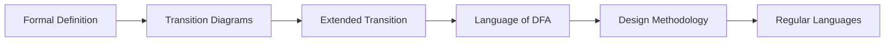

# Chapter 1: Deterministic Finite Automata

> **Previous:** None | **Next:** [Nondeterministic Finite Automata](./02-nfa.md)


> **Previous:** None | **Next:** [Nondeterministic Finite Automata](./02-nfa.md)


## Learning Objectives

- Define a deterministic finite automaton (DFA) formally as a 5-tuple.
- Construct transition diagrams and transition tables from DFA specifications.
- Trace the computation of a DFA on an input string.
- Determine the language accepted by a given DFA.
- Design DFAs for specific regular languages.
- Prove properties of DFA-recognizable languages.


## Chapter at a Glance
| Topic | Key Insight | Practical Takeaway |
|-------|------------|-------------------|
| DFA Definition | 5-tuple (Q, Σ, δ, q₀, F) deterministic | Foundation for automata theory |
| Transition Diagrams | Graphs showing state changes | Visual protocol debugging |
| Extended Transition | δ̂(q, w) for whole strings | Formal acceptance model |
| DFA Design | States = essential memory | Systematic language recognition |
| Regular Languages | Languages recognized by DFA | Finite-memory solvable problems |


## Chapter Roadmap


## Chapter at a Glance
| Topic | Key Insight | Practical Takeaway |
|-------|------------|-------------------|
| DFA Definition | 5-tuple (Q, Σ, δ, q₀, F) with deterministic transitions | Foundation for all automata theory |
| Transition Diagrams | Directed graphs representing state changes | Visual debugging of protocol logic |
| Extended Transition Function | δ̂(q, w) generalizes δ to entire strings | Formal model for string acceptance |
| DFA Design | States encode essential memory about input read | Systematic method for regular language recognition |
| Regular Languages | Languages recognized by some DFA | Class of problems solvable with finite memory |
## Theory
## Chapter Roadmap
`mermaid
flowchart LR
    A[Formal Definition] --> B[Transition Diagrams]
    B --> C[Extended Transition Function]
    C --> D[Language of a DFA]
    D --> E[Design Methodology]
    E --> F[Regular Languages]
    F --> G[Closure Properties]
`


> **One-Sentence Takeaway:** A DFA is the simplest computational model with finite memory, where each state-symbol pair has exactly one next state.

### 1.1 What is a Finite Automaton?

A finite automaton is a simplest computational model with **finite memory**. It reads an input string one symbol at a time, moves through a sequence of states, and decides whether to accept or reject the string. The memory is limited — the automaton cannot store arbitrary amounts of data; only its current state matters.

> **One-Sentence Takeaway:** The formal 5-tuple definition provides a precise mathematical framework for describing deterministic computation.

> **Pro Tip:** Name states descriptively (e.g., seen_at_least_one_1) rather than abstract q₀, q₁ — it makes verification vastly easier.

> **Warning:** Every DFA state must have exactly one transition for each input symbol. Missing transitions mean the automaton is incomplete.

### 1.2 Formal Definition of a DFA

A **deterministic finite automaton (DFA)** is a 5-tuple (Q, Σ, δ, q₀, F) where:

- **Q** is a finite set of **states**.
- **Σ** is a finite **input alphabet**.
- **δ: Q × Σ → Q** is the **transition function**.
- **q₀ ∈ Q** is the **start state**.
- **F ⊆ Q** is the set of **accepting (final) states**.

The term *deterministic* means that for each state and each input symbol, there is exactly one next state. The transition function δ(q, a) = p means: when the automaton is in state q and reads symbol a, it moves to state p.

> **One-Sentence Takeaway:** Transition diagrams and tables are equivalent visual and tabular representations of the same DFA transition function.

### 1.3 Transition Diagrams and Transition Tables

**Transition Diagram:** A directed graph where:
- Vertices represent states (circles with state names inside).
- Accepting states are drawn as double circles.
- The start state is indicated by an incoming arrow from nowhere.
- Edges labeled with input symbols represent transitions δ(q, a) = p.

**Transition Table:** A tabular representation where rows are states, columns are symbols, and entries are the next states.

*Example for a DFA that accepts strings ending with '01' over Σ = {0, 1}:*

Transition Diagram (text description):
```
Three states: q0 (start), q1, q2 (accept)
q0 --0--> q0, q0 --1--> q1
q1 --0--> q2, q1 --1--> q1
q2 --0--> q0, q2 --1--> q1
```

Transition Table:
| State | 0 | 1 |
|-------|---|---|
| →q₀   | q₀ | q₁ |
| q₁    | q₂ | q₁ |
| *q₂   | q₀ | q₁ |

> **One-Sentence Takeaway:** The extended transition function lets us formally define what it means for a DFA to accept or reject any given string.

### 1.4 Language of a DFA

The **extended transition function** δ̂: Q × Σ* → Q generalizes δ to strings:
- δ̂(q, ε) = q
- δ̂(q, wa) = δ(δ̂(q, w), a) for string w and symbol a

A DFA **accepts** string w if δ̂(q₀, w) ∈ F.

The **language recognized** by DFA M is:
L(M) = { w ∈ Σ* | δ̂(q₀, w) ∈ F }

A language is called **regular** if some DFA recognizes it.

> **One-Sentence Takeaway:** A systematic 6-step methodology ensures correct state identification and transition definitions for any regular language.

### 1.5 DFA Design Methodology

To design a DFA for a language L:

1. **Understand the acceptance condition.** What property must the input have?
2. **Identify the essential information** that must be remembered. This becomes the states.
3. **Assign meaning to each state.** For each state, describe what the DFA knows about the input read so far.
4. **Define transitions.** For each state and symbol, determine what the new state of knowledge should be.
5. **Identify accepting states.** Which states correspond to a valid prefix or complete string?
6. **Verify.** Test the DFA on representative strings (both accepted and rejected).

> **One-Sentence Takeaway:** DFA computation is a simple iterative process — start in q₀, follow transitions per symbol, accept if final state is in F.

### 1.6 Formal Description of DFA Computation

A DFA M = (Q, Σ, δ, q₀, F) on input w = w₁w₂…wₙ (each wᵢ ∈ Σ) computes as follows:
- Start in state qâ‚€.
- For i = 1 to n: replace current state r with δ(r, wᵢ).
- Accept if final state r ∈ F; reject otherwise.

> **One-Sentence Takeaway:** A language is regular precisely when some DFA recognizes it — the fundamental connection between automata and formal languages.

### 1.7 Regular Languages

A language is **regular** if there exists some DFA that recognizes it. The class of regular languages has important closure properties (Chapter 4) and corresponds exactly to what can be expressed with regular expressions (Chapter 3).

## Examples

### Example 1.1: DFA for Strings Starting with '0'

Design a DFA over Σ = {0, 1} that accepts strings that begin with 0.

**Solution:**

We need to remember whether we have seen the first symbol and whether it was 0.

- qâ‚€: Start state, haven't read any symbol yet.
- q₁: First symbol was 0 (good — maybe accept).
- q₂: First symbol was 1 (bad — will never accept).
- q₃: Dead state for strings that already failed.

Transition Table:
| State | 0 | 1 |
|-------|---|---|
| →q₀   | q₁ | q₂ |
| *q₁   | q₁ | q₁ |
| q₂    | q₃ | q₃ |
| q₃    | q₃ | q₃ |

Accepting state: q₁. Any string beginning with 0 stays in q₁ and is accepted. Any string beginning with 1 goes to q₂ then q₃ and is rejected. The empty string ε begins with nothing, so it is rejected (not accepted as it doesn't start with 0).

### Example 1.2: DFA for Exactly Two '1's

Design a DFA over Σ = {0, 1} that accepts strings containing exactly two 1s.

**Solution:**

We count the number of 1s seen, up to 3 where we stop caring (beyond 2 is already too many).

- qâ‚€: Seen zero 1s (start).
- q₁: Seen exactly one 1.
- qâ‚‚: Seen exactly two 1s (accept).
- q₃: Seen three or more 1s (dead).

Transitions:
| State | 0 | 1 |
|-------|---|---|
| →q₀   | q₀ | q₁ |
| q₁    | q₁ | q₂ |
| *q₂   | q₂ | q₃ |
| q₃    | q₃ | q₃ |

On 0, each state stays in itself (count of 1s doesn't change). On 1, we advance to the next state. L(M) = { w | w contains exactly two 1s }.

### Example 1.3: DFA for Binary Numbers Divisible by 3

Design a DFA over Σ = {0, 1} that accepts binary strings representing numbers divisible by 3 (leading zeros allowed).

**Solution:**

When we read a binary string left to right, we can track the remainder modulo 3. If the current remainder is r and we read bit b, the new remainder is (2r + b) mod 3.

- q₀: remainder 0 (start, accept — empty string represents 0).
- q₁: remainder 1.
- qâ‚‚: remainder 2.

Transitions (from remainder r with bit b to (2r + b) mod 3):
| State | 0 | 1 |
|-------|---|---|
| *→q₀  | q₀ | q₁ |
| q₁    | q₂ | q₀ |
| q₂    | q₁ | q₂ |

Check: On input "110" (binary for 6): q₀ → q₁ (1) → q₀ (1) → q₀ (0). Accept. On input "100" (binary for 4): q₀ → q₁ (1) → q₂ (0) → q₁ (0). Reject.


## Concept Comparison Table
| Concept | DFA | NFA | Regular Expression |
|---------|-----|-----|-------------------|
| State transitions | Exactly one per symbol | Zero or more per symbol | Not applicable |
| Acceptance | Single path required | Any path leads to accept | Pattern match semantics |
| Expressiveness | Regular languages | Regular languages | Regular languages |
| Design complexity | Higher (more states) | Lower (fewer states) | Medium |
| Determinism | Always deterministic | Nondeterministic | Not applicable |

## Quick Reference
| DFA Component | Symbol | Description |
|--------------|--------|-------------|
| States | Q | Finite set of states |
| Alphabet | Σ | Finite set of input symbols |
| Transition function | δ: Q × Σ → Q | Maps (state, symbol) to next state |
| Start state | q₀ ∈ Q | Initial state before reading input |
| Accept states | F ⊆ Q | States indicating acceptance |
| Extended transition | δ̂(q, w) | State after reading string w |

## Cross-Application Matrix
| Application Area | How DFA Is Used |
|-----------------|-----------------|
| Lexical analysis | Token recognition in compilers |
| Protocol verification | State machine for protocol logic |
| Text processing | Pattern matching and input validation |
| Hardware design | Finite-state machine controllers |
| Network security | Signature-based intrusion detection |

## Chapter Quiz

**Q1.** What is the value of the extended transition function δ̂(q, ε)?
- A) ∅
- B) {q}
- C) q
- D) δ(q, ε)

<details>
<summary>Answer</summary>
**C)** By definition, δ̂(q, ε) = q — reading no input leaves the DFA in its current state.
</details>

**Q2.** Which language below is regular?
- A) { aⁿbⁿ | n ≥ 0 }
- B) { ww | w ∈ {a,b}* }
- C) { w ∈ {0,1}* | w ends with 01 }
- D) { aⁿbⁿcⁿ | n ≥ 0 }

<details>
<summary>Answer</summary>
**C)** Strings ending with "01" can be recognized by a 3-state DFA. The others need more memory than a DFA provides.
</details>

**Q3.** In a DFA transition function δ: Q × Σ → Q, the codomain is:
- A) A set of states
- B) A single state
- C) The power set of states
- D) A Boolean value

<details>
<summary>Answer</summary>
**B)** Unlike an NFA where δ returns a set of states, a DFA returns exactly one state — this is what determinism means.
</details>

**Q4.** How many states does a minimal DFA for binary strings divisible by 3 require?
- A) 2
- B) 3
- C) 4
- D) 5

<details>
<summary>Answer</summary>
**B)** Three states corresponding to remainders 0, 1, 2 modulo 3. The start state (remainder 0) is also accepting.
</details>

**Q5.** What technique proves { aⁿbⁿ | n ≥ 0 } is not regular?
- A) State elimination
- B) Arden's lemma
- C) Pumping lemma
- D) Subset construction

<details>
<summary>Answer</summary>
**C)** The pumping lemma shows any sufficiently long string in a regular language can be "pumped"; { aⁿbⁿ } violates this property.
</details>


## Concept Comparison Table
## Summary

- A DFA is a 5-tuple (Q, Σ, δ, q₀, F) with a deterministic transition function.
- The transition diagram and transition table are equivalent representations.
- The extended transition function δ̂ processes strings inductively.
- A language recognized by some DFA is called regular.
- DFA design requires identifying the finite-state information needed to determine acceptance.
- Every DFA has exactly one computation path for any input string.

## Exercises

### Basic

1. Design a DFA over Σ = {a, b} that accepts strings ending with "aa".
2. Design a DFA over Σ = {0, 1} that accepts strings of odd length.
3. Design a DFA over Σ = {a, b} that accepts strings where the first and last symbols are the same.
4. For the DFA in Example 1.1, list 3 strings that are accepted and 3 that are rejected.
5. Design a DFA over Σ = {0, 1} that accepts strings containing "000" as a substring.

### Intermediate

6. Design a DFA for binary strings that contain an even number of 0s and an odd number of 1s.
7. Design a DFA over Σ = {a, b} that accepts strings where every occurrence of "ab" is followed immediately by "a".
8. Design a DFA that accepts strings over {0, 1} where the binary number represented is at least 4 (leading zeros allowed).
9. Design a DFA for strings over {a, b} where the number of a's is a multiple of 3 and the number of b's is even.
10. Prove that the language L = { w ∈ {0,1}* | w = reverse(w) } (palindromes) is NOT regular, using the pigeonhole principle and DFA state arguments. (Hint: assume a DFA with k states exists and consider strings 0ⁱ1 for i = 1,…,k+1.)

### Advanced

11. Let L = { w ∈ {0,1}* | the number of occurrences of "01" as a substring equals the number of occurrences of "10" }. Design a DFA for L.
12. Show that the class of regular languages is closed under complement (if L is regular, then L̅ = Σ* − L is regular) by constructing a DFA for L̅ from a DFA for L.
13. Design a DFA for the language L = { w ∈ {a,b}* | |w| mod 3 = 0 and w contains at least one 'a' and at least one 'b' }.
14. Prove formally that the DFA in Example 1.3 correctly recognizes binary strings divisible by 3 by induction on string length.
15. Let M₁ accept L₁ and M₂ accept L₂. Show how to construct a DFA that accepts L₁ ∪ L₂ using the Cartesian product of states. Apply this to combine the DFA from Example 1.2 with the DFA from Example 1.3.
