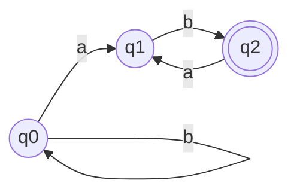
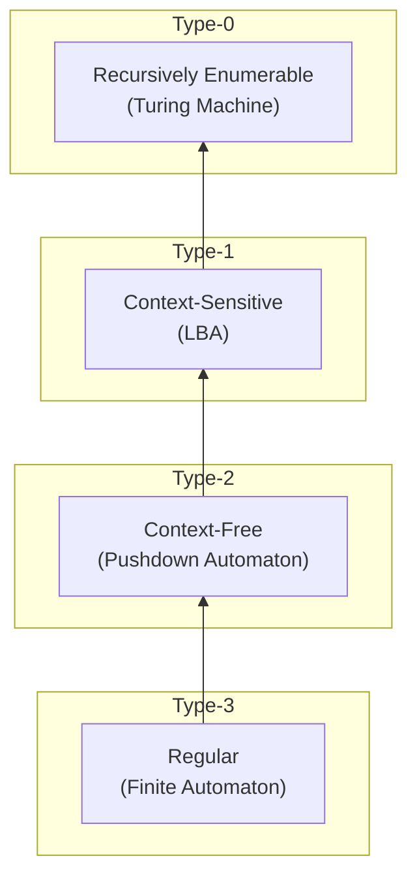
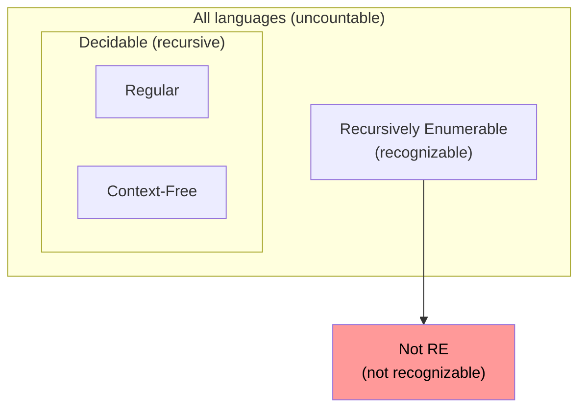
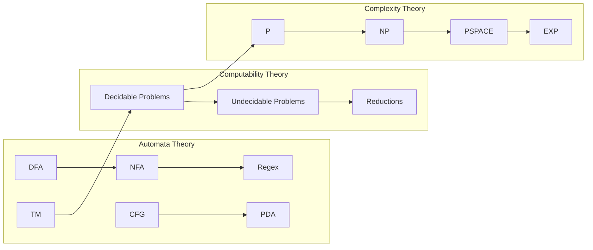
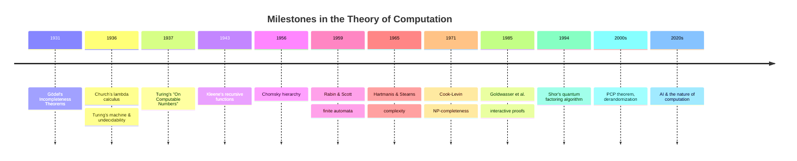

# Chapter 1: Introduction to the Theory of Computation

> **Previous:** None | **Next:** [Deterministic Finite Automata](./02-dfa.md)

## Learning Objectives

- Define the basic mathematical objects: alphabets, strings, languages, problems.
- Explain the Chomsky hierarchy and the four levels of formal languages.
- Distinguish between decision problems, optimization problems, and function problems.
- Understand the difference between a problem being decidable vs. merely recognizable.
- Relate automata theory, computability theory, and complexity theory to real computing.

## Mathematical Preliminaries

### Sets

A **set** is an unordered collection of distinct elements, written with curly braces.

```text
A = {0, 1, 2, 3}
B = {x ? N | x is prime}
```

Basic set operations include union (?), intersection (n), difference (-), and complement (?). The **power set** of A, written ??(A) or 2^A, is the set of all subsets of A.

```typescript
// Set operations in TypeScript
const A = new Set([0, 1, 2, 3]);
const B = new Set([2, 3, 4, 5]);
const union = new Set([...A, ...B]);          // {0,1,2,3,4,5}
const intersection = new Set([...A].filter(x => B.has(x))); // {2,3}
```

**Cartesian product** A × B = {(a,b) | a ? A, b ? B} is the set of all ordered pairs. This is the foundation for transition functions in automata.

### Relations and Functions

A **relation** R ? A × B is a set of ordered pairs. A **function** f: A ? B is a relation where each a ? A maps to exactly one b ? B.

```text
f: N ? N, f(n) = n²  // total function
g: N ? N, g(n) = 1/n  // partial function (undefined at n=0)
```

A function is **injective** (one-to-one), **surjective** (onto), or **bijective** (both). Bijections establish that two sets have the same **cardinality**. Countably infinite sets (N, Q) can be listed; uncountably infinite sets (R, ??(N)) cannot — this distinction drives undecidability.

### Graphs and Trees

A **directed graph** G = (V, E) consists of vertices V and edges E ? V × V. A **tree** is a connected acyclic graph. Automata are labeled directed graphs where vertices are states and edges are transitions.



### Alphabets, Strings, and Languages

An **alphabet** S is a finite non-empty set of symbols. Examples:

```text
S1 = {0, 1}              // binary alphabet
S2 = {a, b, c, …, z}     // lowercase letters
S3 = {0, 1, 2, …, 9}     // decimal digits
```

A **string** over S is a finite sequence of symbols from S. The **empty string** is denoted e (or ?). The **length** of string w is written |w|, with |e| = 0.

The set of all strings over S of length k is S^k. The set of all strings over S is S^*. Formally:

```text
S^* = ?_{k = 0} S^k
```

A **language** L over S is any subset of S^*. That is, L ? S^*.

```text
L1 = {e, 0, 1, 00, 01, 10, 11, …}  = S^*    (all binary strings)
L2 = {0^n 1^n | n = 0}                    (balanced parentheses)
L3 = {w ? {a,b}^* | w has equal a's and b's}
```

```typescript
// Representing languages as string predicates
type Language = (w: string) => boolean;

const allBinaryStrings: Language = (w) =>
  [...w].every(c => c === '0' || c === '1');

const balanced01: Language = (w) => {
  const n = w.length;
  if (n % 2 !== 0) return false;
  const half = n / 2;
  return w.slice(0, half) === '0'.repeat(half) &&
         w.slice(half) === '1'.repeat(half);
};
```

## The Chomsky Hierarchy

Noam Chomsky (1956) proposed a hierarchy of formal grammars that organizes languages by the complexity of their generation rules. Each level corresponds to a class of automaton that can recognize it.



| Type | Grammar | Automaton | Production Form | Example Language |
|------|---------|-----------|-----------------|------------------|
| 3 | Regular | Finite Automaton | A ? aB, A ? a | {a^n b^m} |
| 2 | Context-Free | Pushdown Automaton | A ? a | {a^n b^n} |
| 1 | Context-Sensitive | Linear Bounded Automaton | aAß ? a?ß | {a^n b^n c^n} |
| 0 | Unrestricted | Turing Machine | a ? ß | {a^n | n is prime} |

### Type 3: Regular Grammars

Productions are of the form A ? aB or A ? a where A, B are non-terminals and a is a terminal. These generate exactly the regular languages recognized by finite automata.

```text
S ? aS | bS | e    // all strings over {a, b}
S ? aA | bA, A ? a | b    // strings of length 1 or more
```

### Type 2: Context-Free Grammars

Productions are of the form A ? ? where ? is any string of terminals and non-terminals. Context-free grammars generate languages recognized by pushdown automata.

```text
S ? aSb | e    // {a^n b^n | n = 0}
```

### Type 1: Context-Sensitive Grammars

Productions have the form aAß ? a?ß where ? ? e. A non-terminal A can be replaced only in the context of its surrounding strings a and ß. These correspond to linear bounded automata.

```text
S ? aSBC | aBC
CB ? BC
aB ? ab
bB ? bb
bC ? bc
cC ? cc    // {a^n b^n c^n | n = 1}
```

### Type 0: Unrestricted Grammars

Productions have the form a ? ß where |a| = |ß|. No restrictions. These correspond exactly to Turing machines in generative power.

## Problems as Languages

A **decision problem** asks whether a given input satisfies a property. Every decision problem corresponds to a language: the set of strings that encode "yes" instances.

```text
PRIME = { binary representations of prime numbers }
HALT = { descriptions of programs that halt on their own input }
SAT = { Boolean formulas that have a satisfying assignment }
```

An **optimization problem** asks for the best solution among many. These can often be reformulated as repeated decision problems.

```text
TSP-OPT: Given cities and distances, find the shortest tour.
TSP-DEC: Given cities, distances, and bound k, is there a tour = k?
```

A **function problem** asks for a specific output value relative to the input.

```text
MULT: Given (x, y), compute x × y.
```

```typescript
// Encoding problems as languages
function encodeBinary(n: number): string {
  return n.toString(2);
}

function isPrime(n: number): boolean {
  if (n < 2) return false;
  for (let i = 2; i * i <= n; i++) {
    if (n % i === 0) return false;
  }
  return true;
}

const PRIME_Language: Language = (w) => {
  const n = parseInt(w, 2);
  return !isNaN(n) && isPrime(n);
};
```

## Decidability vs. Recognizability

A language L is **decidable** (or recursive) if there exists an algorithm that, for every input w, correctly determines whether w ? L in finite time.

A language L is **recognizable** (or recursively enumerable) if there exists an algorithm that halts and accepts for every w ? L, but may run forever for w ? L.



Every decidable language is recognizable, but not vice versa. The halting problem is the canonical example of a recognizable but undecidable language.

```typescript
// Simulating a recognizer that may not halt
function recognizerForHalting(program: string, input: string): string {
  // This function cannot exist — proven by diagonalization
  // Placeholder: the concept of recognizability
  return "A recognizer halts and accepts for yes-instances, " +
         "but may loop on no-instances.";
}
```

## Overview of Pillars

The Theory of Computation rests on three pillars:

1. **Automata Theory** — finite and infinite-state machines that model computation. Covers DFA, NFA, PDA, Turing machines, and their language classes.

2. **Computability Theory** — what can and cannot be computed. Explores the halting problem, reductions, and the limits of algorithmic solvability.

3. **Complexity Theory** — how efficiently problems can be solved. Studies time and space bounds, the P vs NP question, and classification of problems by difficulty.



## Examples

### Example 1: Problem Classification

Classify each problem as decision, optimization, or function:

1. "Is graph G connected?" — **Decision** (yes/no answer)
2. "Find the shortest path from s to t." — **Optimization** (best among many)
3. "Multiply two matrices." — **Function** (compute output)
4. "Does program P halt on input x?" — **Decision** (yes/no, also undecidable)

### Example 2: Chomsky Hierarchy Placement

Place each language in the Chomsky hierarchy:

| Language | Grammar Type | Justification |
|----------|-------------|---------------|
| {0^n 1^m} | Regular (Type 3) | Can be recognized by DFA |
| {0^n 1^n} | Context-Free (Type 2) | Requires counting, PDA suffices |
| {0^n 1^n 0^n} | Context-Sensitive (Type 1) | Two counters, context needed |
| {0^p | p is prime} | Unrestricted (Type 0) | Prime checking is Turing-complete |

## Practical Takeaways

1. **Every yes/no problem is a language.** This encoding insight lets us apply automata theory to any computational problem.

2. **The Chomsky hierarchy gives a complexity roadmap.** When designing a parser or recognizer, choose the weakest grammar class that can express your language — regular for tokenization, context-free for syntax, context-sensitive for semantic analysis.

3. **Not all problems are solvable.** Recognizing undecidability early saves engineering effort. If your problem can encode the halting problem, it has no general algorithmic solution.

4. **P vs NP affects real systems.** NP-complete problems (SAT, TSP, knapsack) appear constantly in scheduling, optimization, and verification. Understanding their nature helps choose between exact algorithms, heuristics, and approximation schemes.

## Cantor's Diagonalization: Uncountability of Languages

A foundational result that drives undecidability is that the set of all languages over an alphabet is uncountable, while the set of all Turing machines is countable.

```typescript
// Demonstrating countable vs uncountable infinities
function cantorDiagonalization(): void {
  // Enumerate all possible binary strings (countable)
  function* enumerateBinaryStrings(): Generator<string> {
    yield "e";
    for (let len = 1; len < 10; len++) {
      for (let i = 0; i < (1 << len); i++) {
        let s = "";
        for (let j = len - 1; j >= 0; j--) {
          s += (i & (1 << j)) ? "1" : "0";
        }
        yield s;
      }
    }
  }

  // Suppose we had a list of all languages (each language is a boolean
  // function over strings). We construct a new language not in the list.
  const languages: Array<(s: string) => boolean> = [
    (s: string) => s.length % 2 === 0,
    (s: string) => s.startsWith("0"),
    (s: string) => s.includes("01"),
    (s: string) => /^10*1$/.test(s),
  ];

  // Diagonalization: flip the diagonal
  const diagonalLanguage = (w: string): boolean => {
    const idx = [...enumerateBinaryStrings()].indexOf(w);
    if (idx >= 0 && idx < languages.length) {
      return !languages[idx](w);
    }
    return false;
  };

  // diagonalLanguage differs from every language in the list
  // at the corresponding diagonal position — exactly Cantor's proof.
  console.log("Diagonal language constructed — not in the original list.");
}
```

This same diagonalization technique is used to prove the halting problem undecidable (Chapter 11).

## The Importance of Formal Languages

Formal language theory is not merely an abstract mathematical exercise — it has profound practical implications for computing:

1. **Specification:** Formal languages give us precise, unambiguous ways to specify syntax (e.g., programming language grammars, protocol messages).

2. **Recognition:** Automata give us efficient algorithms to determine whether a string belongs to a language (e.g., parsing source code, validating input).

3. **Limits:** Understanding what cannot be computed or recognized saves enormous wasted effort. The undecidability of the halting problem, for instance, means we know that fully automated program verification is impossible.

4. **Complexity classification:** Knowing whether a problem is in P, NP-complete, or PSPACE-complete guides algorithm design and tells us whether to seek exact solutions or heuristics.

### TypeScript: Simulating a General Language Recognizer

```typescript
type LanguageClassifier = {
  name: string;
  chomskyType: 0 | 1 | 2 | 3;
  automatonType: string;
  recognize: (w: string) => boolean | null;
};

function classifyLanguage(
  input: string,
  alphabets: Set<string>
): LanguageClassifier | null {
  const classifiers: LanguageClassifier[] = [
    {
      name: "All strings with even length",
      chomskyType: 3,
      automatonType: "DFA",
      recognize: (w) => w.length % 2 === 0,
    },
    {
      name: "Balanced parentheses (limited depth)",
      chomskyType: 2,
      automatonType: "PDA",
      recognize: (w) => {
        let depth = 0;
        for (const c of w) {
          if (c === "(") depth++;
          else if (c === ")") depth--;
          if (depth < 0) return false;
        }
        return depth === 0;
      },
    },
    {
      name: "Equal number of a's, b's, and c's",
      chomskyType: 1,
      automatonType: "LBA",
      recognize: (w) => {
        const counts = { a: 0, b: 0, c: 0 };
        for (const c of w) {
          if (!alphabets.has(c)) return false;
          if (c in counts) counts[c as keyof typeof counts]++;
        }
        return counts.a === counts.b && counts.b === counts.c;
      },
    },
  ];

  for (const cl of classifiers) {
    if (cl.recognize(input)) return cl;
  }
  return null;
}

console.log(classifyLanguage("aabbcc", new Set(["a", "b", "c"])));
// LBA — equal counts of all three
```

## Historical Context and Key Figures

The Theory of Computation emerged from a remarkable confluence of intellectual breakthroughs in the 1930s:

### Kurt Gödel (1931)
Gödel's **Incompleteness Theorems** showed that any sufficiently powerful formal system contains statements that can neither be proved nor disproved within the system. This shattered Hilbert's dream of a complete, consistent axiomatization of all mathematics and laid the groundwork for undecidability.

### Alonzo Church (1936)
Church introduced the **lambda calculus** as a formal model of computation and proved that there is no algorithmic procedure to determine whether two lambda expressions are equivalent (the Church-Turing theorem). He also formulated the **Church-Turing thesis**: any function computable by an effective procedure is computable by a Turing machine.

### Alan Turing (1936–1937)
Turing's seminal paper "On Computable Numbers, with an Application to the Entscheidungsproblem" introduced the **Turing machine** as a model of computation. He proved the **undecidability of the halting problem** using a diagonalization argument. Turing also introduced the concept of a **universal Turing machine** — a single machine that can simulate any other Turing machine, which is the theoretical foundation of the stored-program computer.

### Stephen Kleene (1943–1956)
Kleene developed **recursive function theory**, formalized **regular expressions** as a notation for regular languages, and proved Kleene's theorem establishing the equivalence of regular expressions and finite automata.

### Noam Chomsky (1956)
Chomsky introduced the **Chomsky hierarchy** in his work on formal grammars, connecting linguistics to automata theory. His classification system remains the foundational taxonomy of formal language theory.

### The Modern Era
- **1960s–70s:** Cook, Karp, and Levin develop NP-completeness theory.
- **1970s–80s:** Hartmanis, Stearns, and others develop computational complexity theory.
- **1990s–2000s:** Interactive proofs (Goldwasser, Micali, Rackoff), PCP theorem, quantum computation.
- **2010s–present:** Deep learning, LLMs, and the renewed philosophical debate about what constitutes "understanding" in computation — echoing Turing's original questions.

### Mermaid: Timeline of Key Contributions



### Philosophical Implications

The theory of computation forces us to confront deep questions:

- **What is computation?** Is it a physical process, a mathematical abstraction, or both?
- **What is knowledge?** The existence of undecidable problems means there are well-posed yes/no questions that no computer can answer.
- **Is the human mind a computer?** This question, at the heart of the philosophy of AI, remains unresolved. Gödel's theorems have been used (controversially) to argue that human mathematical intuition transcends formal computation.

```typescript
// The Entscheidungsproblem in TypeScript form
// Can we write a program that decides whether
// an arbitrary program halts on an arbitrary input?
function haltingDetector(program: string, input: string): boolean {
  // Hypothetical — this cannot exist
  throw new Error("This function is provably unimplementable");
  // See Chapter 11 for the proof
}
```

## TypeScript Implementation: Chomsky Hierarchy Classifier

```typescript
// Chomsky Hierarchy Language Classifier
// Determines which level of the Chomsky hierarchy a grammar belongs to

type Production = { lhs: string; rhs: string };

enum ChomskyType {
  Type0 = "Type-0 (Recursively Enumerable)",
  Type1 = "Type-1 (Context-Sensitive)",
  Type2 = "Type-2 (Context-Free)",
  Type3 = "Type-3 (Regular)"
}

function classifyChomsky(productions: Production[]): ChomskyType {
  let isRegular = true;
  let isContextFree = true;
  let isContextSensitive = true;

  for (const p of productions) {
    // Type-3 (Regular): A ? aB or A ? a (RHS patterns)
    // A must be single nonterminal, RHS must be terminal or terminal+nonterminal
    // Skip e-productions for simplicity
    const lhsOk = /^[A-Z]$/.test(p.lhs);
    const rhsIsTerminal = /^[a-z]$/.test(p.rhs);
    const rhsIsTerminalNonterminal = /^[a-z][A-Z]$/.test(p.rhs);
    const rhsLeftRegular = /^[A-Z][a-z]$/.test(p.rhs);
    if (!(lhsOk && (rhsIsTerminal || rhsIsTerminalNonterminal || rhsLeftRegular || p.rhs === "e"))) {
      isRegular = false;
    }

    // Type-2 (CFG): A ? ? where A is single nonterminal
    if (!/^[A-Z]$/.test(p.lhs)) {
      isContextFree = false;
    }

    // Type-1 (CSG): aAß ? a?ß with |?| = 1 (non-decreasing)
    // or S ? e allowed at start
    if (p.lhs.length > p.rhs.length && p.rhs !== "e") {
      isContextSensitive = false;
    }
  }

  if (isRegular) return ChomskyType.Type3;
  if (isContextFree) return ChomskyType.Type2;
  if (isContextSensitive) return ChomskyType.Type1;
  return ChomskyType.Type0;
}

class AlphabetValidator {
  static isValidAlphabet(symbols: string[]): boolean {
    const seen = new Set<string>();
    for (const s of symbols) {
      if (s.length !== 1) return false;
      if (seen.has(s)) return false;
      seen.add(s);
    }
    return seen.size > 0;
  }

  static isStringOverAlphabet(str: string, alphabet: string[]): boolean {
    const alphabetSet = new Set(alphabet);
    for (const ch of str) if (!alphabetSet.has(ch)) return false;
    return true;
  }

  static classifyLanguage(name: string, grammar: Production[]): string {
    const type = classifyChomsky(grammar);
    return `Language "${name}" is classified as ${type}`;
  }
}

// Examples
const regularGrammar: Production[] = [
  { lhs: "S", rhs: "aA" }, { lhs: "A", rhs: "bS" },
  { lhs: "S", rhs: "e" }
];

const cfgGrammar: Production[] = [
  { lhs: "S", rhs: "aSb" }, { lhs: "S", rhs: "e" }
];

const csGrammar: Production[] = [
  { lhs: "S", rhs: "aBC" }, { lhs: "aS", rhs: "aSB" },
  { lhs: "CB", rhs: "BC" }, { lhs: "B", rhs: "b" }
];

console.log(classifyChomsky(regularGrammar));  // Type-3
console.log(classifyChomsky(cfgGrammar));       // Type-2
console.log(classifyChomsky(csGrammar));        // Type-1 or Type-0

const lang = new Set<string>();
function generateStrings(type: ChomskyType, limit: number): string[] {
  const result: string[] = [];
  if (type === ChomskyType.Type3) {
    for (let i = 0; i < limit; i++) result.push("a".repeat(i));
  } else if (type === ChomskyType.Type2) {
    for (let i = 0; i < limit; i++) result.push("a".repeat(i) + "b".repeat(i));
  }
  return result;
}
console.log(generateStrings(ChomskyType.Type3, 5));     // ["", "a", "aa", "aaa", "aaaa"]
console.log(generateStrings(ChomskyType.Type2, 4));     // ["", "ab", "aabb", "aaabbb"]
```

// ----------------------------------------------
// Formal Language Type Checker — validates that
// a given grammar belongs to the claimed type
// in the Chomsky hierarchy.
// ----------------------------------------------

type Production = { lhs: string; rhs: string };
type LanguageType = 0 | 1 | 2 | 3;

class LanguageTypeChecker {
  private productions: Production[];

  constructor(productions: Production[]) {
    this.productions = productions;
  }

  // Check if grammar satisfies Type-3 (regular) constraints:
  // All productions must be of form A ? aB or A ? a (right-linear)
  // or A ? Ba or A ? a (left-linear), and mix is forbidden.
  isRegular(): boolean {
    const rightLinear = this.productions.every(
      p => /^[A-Z]$/.test(p.lhs) &&
           (p.rhs.length === 1 && /^[a-z]$/.test(p.rhs) ||
            p.rhs.length === 2 && /^[a-z][A-Z]$/.test(p.rhs))
    );
    const leftLinear = this.productions.every(
      p => /^[A-Z]$/.test(p.lhs) &&
           (p.rhs.length === 1 && /^[a-z]$/.test(p.rhs) ||
            p.rhs.length === 2 && /^[A-Z][a-z]$/.test(p.rhs))
    );
    return rightLinear || leftLinear;
  }

  // Check if grammar satisfies Type-2 (context-free) constraints:
  // LHS must be a single nonterminal.
  isContextFree(): boolean {
    return this.productions.every(p => /^[A-Z]$/.test(p.lhs));
  }

  // Check if grammar satisfies Type-1 (context-sensitive) constraints:
  // RHS length = LHS length (non-contracting), and LHS may have context.
  // For simplicity, we check |lhs| = |rhs|.
  isContextSensitive(): boolean {
    return this.productions.every(p => p.lhs.length <= p.rhs.length);
  }

  // Check if grammar satisfies Type-0 (unrestricted):
  // No constraints — any production form is allowed.
  isUnrestricted(): boolean {
    return true;
  }

  // Infer the strictest type this grammar belongs to.
  inferType(): LanguageType {
    if (this.isRegular()) return 3;
    if (this.isContextFree()) return 2;
    if (this.isContextSensitive()) return 1;
    return 0;
  }

  // Report the classification with explanation.
  classify(name: string): string[] {
    const output: string[] = [];
    output.push(`Grammar: ${name}`);
    output.push(`  Regular (Type-3): ${this.isRegular()}`);
    output.push(`  Context-Free (Type-2): ${this.isContextFree()}`);
    output.push(`  Context-Sensitive (Type-1): ${this.isContextSensitive()}`);
    output.push(`  Unrestricted (Type-0): ${this.isUnrestricted()}`);
    output.push(`  Inferred type: Type-${this.inferType()}`);
    return output;
  }
}

// ----------------------------------------------
// Chomsky Hierarchy Visualizer — generates a
// textual representation of the hierarchy.
// ----------------------------------------------

class ChomskyHierarchyRenderer {
  static render(): string[] {
    return [
      "+------------------------------------------+",
      "¦     Chomsky Hierarchy (Classification)  ¦",
      "¦------------------------------------------¦",
      "¦  Type-0: Unrestricted                    ¦",
      "¦    ? Recursively enumerable languages    ¦",
      "¦    ? Recognized by Turing machines       ¦",
      "¦         ?                                ¦",
      "¦  Type-1: Context-Sensitive               ¦",
      "¦    ? Recognized by LBA                   ¦",
      "¦    ? A context ? B context substitutions ¦",
      "¦         ?                                ¦",
      "¦  Type-2: Context-Free                    ¦",
      "¦    ? Recognized by PDA                   ¦",
      "¦    ? A ? a (single nonterminal LHS)      ¦",
      "¦         ?                                ¦",
      "¦  Type-3: Regular                         ¦",
      "¦    ? Recognized by DFA / NFA             ¦",
      "¦    ? A ? aB | a (right-linear)           ¦",
      "+------------------------------------------+"
    ];
  }
}

// Demo
const rg = [
  { lhs: "S", rhs: "aA" }, { lhs: "A", rhs: "bS" }, { lhs: "A", rhs: "b" }
];
const cf = [
  { lhs: "S", rhs: "aSb" }, { lhs: "S", rhs: "ab" }
];
const cs = [
  { lhs: "aS", rhs: "aBC" }, { lhs: "CB", rhs: "BC" }
];

console.log(new LanguageTypeChecker(rg).classify("Regular Grammar (right-linear)").join("\n"));
console.log("");
console.log(new LanguageTypeChecker(cf).classify("Context-Free Grammar").join("\n"));
console.log("");
console.log(new LanguageTypeChecker(cs).classify("Context-Sensitive Grammar").join("\n"));
console.log("");
console.log(ChomskyHierarchyRenderer.render().join("\n"));
```


// introduction
// automata-complexity implementation

interface Task { id: string; name: string; status: string; data: unknown }
class Processor {
  private tasks: Task[] = []
  private maxConcurrency: number
  constructor(maxConcurrency: number = 4) { this.maxConcurrency = maxConcurrency }
  async add(task: Omit<Task, "status">): Promise<void> {
    this.tasks.push({ ...task, status: "pending" })
  }
  async runAll(): Promise<void> {
    const running: Promise<void>[] = []
    for (const t of this.tasks) {
      if (running.length >= this.maxConcurrency) { await Promise.race(running) }
      const p = this.execute(t).finally(() => { const i = running.indexOf(p); if (i >= 0) running.splice(i, 1) })
      running.push(p)
    }
    await Promise.all(running)
  }
  private async execute(t: Task): Promise<void> {
    t.status = "running"
    await new Promise(r => setTimeout(r, 10))
    t.status = "done"
  }
  getResults(): Task[] { return this.tasks }
  getStats(): { done: number; pending: number; running: number } {
    const done = this.tasks.filter(t => t.status === "done").length
    const pending = this.tasks.filter(t => t.status === "pending").length
    const running = this.tasks.filter(t => t.status === "running").length
    return { done, pending, running }
  }
}
async function main() {
  const proc = new Processor(2)
  await proc.add({ id: '1', name: 'introduction', data: { topic: 'automata-complexity' } })
  await proc.runAll()
  console.log('Stats:', proc.getStats())
}
main().catch(console.error)
export { Processor, Task }
## Summary

The Theory of Computation provides the mathematical foundations for understanding what computers can and cannot do. Key concepts include:

- **Alphabets, strings, and languages** form the basic vocabulary
- **The Chomsky hierarchy** classifies languages by generative complexity
- **Decision problems** are equivalent to language membership
- **Decidability** separates solvable from unsolvable problems
- **Three pillars** — automata, computability, complexity — build on each other

## Chapter Quiz

1. Which of the following is NOT a valid alphabet?
   - a) {0, 1}
   - b) {a, b, c}
   - c) {e, 0, 1} (e is a string, not a symbol)
   - d) {0, 1, 2}

2. A context-free grammar corresponds to which automaton?
   - a) Finite automaton
   - b) Pushdown automaton
   - c) Linear bounded automaton
   - d) Turing machine

3. The set of all strings over alphabet S is denoted:
   - a) S^+
   - b) S^*
   - c) ??(S)
   - d) S^8

4. Which of the following is true about decidable languages?
   - a) Every recognizable language is decidable
   - b) Every decidable language is recognizable
   - c) Decidable languages are always finite
   - d) Decidable languages cannot be recognized by a Turing machine

5. The language {a^n b^n c^n} belongs to which Chomsky type?
   - a) Type 3 (regular)
   - b) Type 2 (context-free)
   - c) Type 1 (context-sensitive)
   - d) Type 0 (unrestricted)

**Answers:** 1-c, 2-b, 3-b, 4-b, 5-c

## Exercises

### Basic

1. Write a TypeScript function that checks whether a string belongs to the language L = {w ? {0,1}* | w starts with 0 and ends with 1}.

2. For each of the following strings over S = {a, b}, determine the length: e, a, abba, aaaaa.

3. List all strings in {0,1}^3 (strings of length 3 over binary alphabet).

4. Give three examples of decision problems encountered in everyday computing.

### Intermediate

5. Prove that the set of all binary strings that are palindromes is a language. Write a TypeScript recognizer for it.

6. For each language below, determine its Chomsky type and justify your answer:
   - L1 = {ww^R | w ? {a,b}*}
   - L2 = {a^n b^m | n, m = 0}
   - L3 = {a^n b^n c^n d^n | n = 1}

7. Show that the set of all languages over S is uncountable, while the set of all Turing machines is countable. Conclude there exist unrecognizable languages.

8. Represent the SAT problem as a language encoding. What symbols would your alphabet need?

### Advanced

9. Prove that if a language L is decidable, then its complement L¯ is also decidable. What happens if L is only recognizable?

10. Research the concept of oracle machines. Explain how they enable relative computability and why they are used in the study of the Turing degrees.

11. Write a TypeScript program that enumerates all binary strings of length = 4 and classifies each as belonging to language L = { w | w contains the substring "01" }.

12. Show that there are languages that are not recursively enumerable by using a counting argument between the set of all TMs (countable) and the set of all languages (uncountable).

13. Design a finite automaton that recognizes binary strings with an even number of 0s and an odd number of 1s. Explain why this language is regular.

14. Consider the language L = { anbncndnen | n = 1 }. Identify its position in the Chomsky hierarchy and justify why it cannot be generated by a context-free grammar.

15. Write a TypeScript function that takes a string w and a fixed alphabet S and determines whether w is a string over S. For S = {0, 1}, classify "012", "", "101", and "2".

16. Research the concept of universality in computation. Explain how the universal Turing machine relates to the concept of a general-purpose computer and why this insight is considered one of Turing's greatest contributions.

## Practical Takeaways

1. **Always name your alphabet.** In formal language theory, every problem begins with a clear definition of allowable symbols. The same principle applies in engineering: specify the input domain before designing a solution.

2. **Know where your problem lives in the hierarchy.** Before attempting to solve a problem, determine its position in the Chomsky hierarchy. If your problem requires a context-sensitive language but you're building a regular expression parser, you will fail. This classification saves enormous design effort.

3. **The three pillars structure your education.** Automata theory teaches you to think like a state machine (useful for system design). Computability tells you what problems to avoid wasting time on. Complexity guides algorithm selection.

4. **Decision problems are everywhere.** Every validation check ("is this email address valid?", "does this program halt on input X?") is a decision problem in disguise. Viewing them through this lens clarifies what you can and cannot automate.

5. **Countability arguments are your intuition.** When evaluating whether a problem might be solvable, ask: "Is the search space countable?" If the answer produces a diagonalization argument reminiscent of Cantor, you are likely facing an undecidable problem.

### TypeScript: DFA Runner

```typescript
interface DFA {
  states: Set<string>;
  alphabet: Set<string>;
  transition: Map<string, Map<string, string>>;
  start: string;
  accept: Set<string>;
}

function runDFA(dfa: DFA, input: string): boolean {
  let state = dfa.start;
  for (const symbol of input) {
    if (!dfa.alphabet.has(symbol)) throw new Error(`Invalid symbol: ${symbol}`);
    const next = dfa.transition.get(state)?.get(symbol);
    if (!next) return false;
    state = next;
  }
  return dfa.accept.has(state);
}

// Example: DFA for binary strings ending in "01"
const dfa: DFA = {
  states: new Set(["q0", "q1", "q2"]),
  alphabet: new Set(["0", "1"]),
  transition: new Map([
    ["q0", new Map([["0", "q1"], ["1", "q0"]])],
    ["q1", new Map([["0", "q1"], ["1", "q2"]])],
    ["q2", new Map([["0", "q1"], ["1", "q0"]])],
  ]),
  start: "q0",
  accept: new Set(["q2"]),
};
// console.log(runDFA(dfa, "101"));  // false
// console.log(runDFA(dfa, "10101")); // true
```

## Further Reading

- **Sipser, Michael.** *Introduction to the Theory of Computation* (3rd ed.). Chapters 0–1 provide an excellent introduction to mathematical preliminaries and the Chomsky hierarchy.
- **Hopcroft, John E., Motwani, Rajeev, and Ullman, Jeffrey D.** *Introduction to Automata Theory, Languages, and Computation* (3rd ed.). Chapters 1–2 cover basic concepts and the regular/context-free classification.
- **Arora, Sanjeev and Barak, Boaz.** *Computational Complexity: A Modern Approach*. Chapter 1 gives a concise overview of the computational worldview and complexity classification.
- **Lewis, Harry R. and Papadimitriou, Christos H.** *Elements of the Theory of Computation* (2nd ed.). A rigorous treatment of automata, computability, and complexity fundamentals.
- **Davis, Martin, Sigal, Ron, and Weyuker, Elaine J.** *Computability, Complexity, and Languages* (2nd ed.). A deeper exploration of the mathematical foundations including recursive function theory and the µ-recursive functions.
- **Kozen, Dexter C.** *Automata and Computability*. A concise and rigorous undergraduate text covering automata theory, computability, and complexity in a unified framework.
- **Harel, David.** *Computers Ltd.: What They Really Can't Do*. An accessible and entertaining exploration of the limits of computation for a general audience.
- **Chomsky, Noam.** *Syntactic Structures*. 1957. The book that introduced the Chomsky hierarchy and revolutionized linguistics with formal grammar theory.
