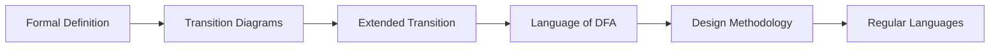
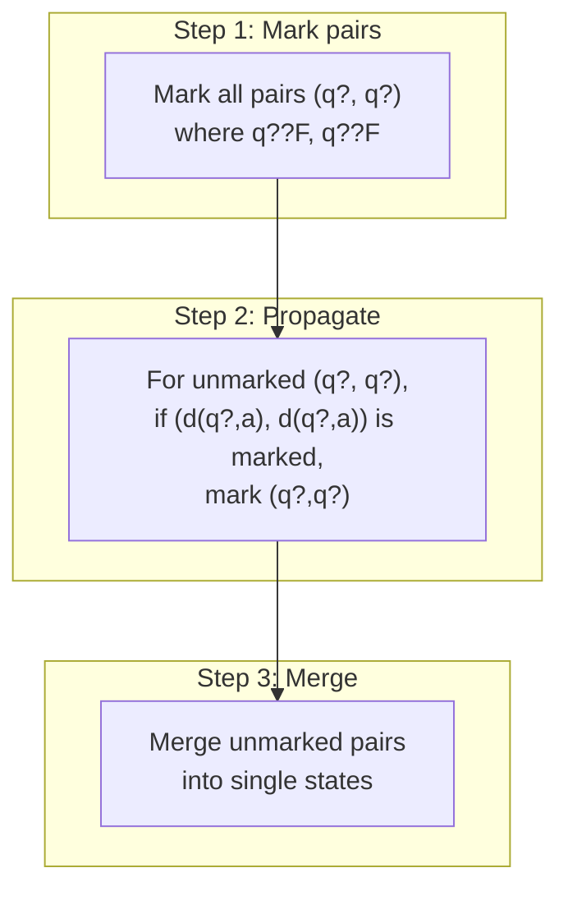
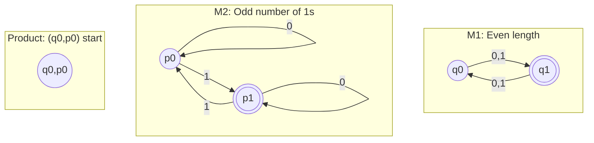
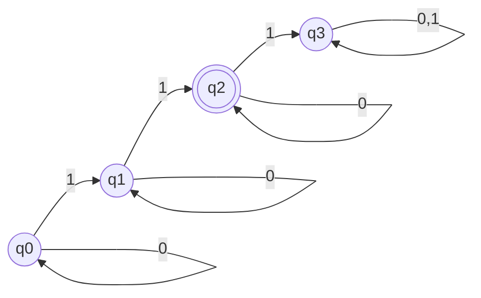

# Chapter 2: Deterministic Finite Automata

> **Previous:** [Introduction](./01-introduction.md) | **Next:** [Nondeterministic Finite Automata](./03-nfa.md)


> **Previous:** [Introduction](./01-introduction.md) | **Next:** [Nondeterministic Finite Automata](./03-nfa.md)


## Learning Objectives

- Define a deterministic finite automaton (DFA) formally as a 5-tuple.
- Construct transition diagrams and transition tables from DFA specifications.
- Trace the computation of a DFA on an input string.
- Determine the language accepted by a given DFA.
- Design DFAs for specific regular languages.
- Prove properties of DFA-recognizable languages.


## Chapter Roadmap


## TypeScript DFA Simulator

A DFA can be implemented as a generic class in TypeScript:

```typescript
type State = string;
type Alphabet = string;

class DFA {
  constructor(
    private Q: Set<State>,
    private sigma: Set<Alphabet>,
    private delta: Map<string, State>,
    private q0: State,
    private F: Set<State>
  ) {}

  private transitionKey(q: State, a: Alphabet): string {
    return `${q},${a}`;
  }

  simulate(input: string): boolean {
    let current = this.q0;
    for (const symbol of input) {
      const key = this.transitionKey(current, symbol);
      if (!this.delta.has(key)) return false;
      current = this.delta.get(key)!;
    }
    return this.F.has(current);
  }
}

// DFA for binary numbers divisible by 3
const delta = new Map<string, State>([
  ['q0,0', 'q0'], ['q0,1', 'q1'],
  ['q1,0', 'q2'], ['q1,1', 'q0'],
  ['q2,0', 'q1'], ['q2,1', 'q2'],
]);
const dfa = new DFA(
  new Set(['q0', 'q1', 'q2']),
  new Set(['0', '1']),
  delta, 'q0', new Set(['q0'])
);
console.log(dfa.simulate('110'));  // true (6)
console.log(dfa.simulate('100'));  // false (4)
```

## DFA Minimization via Table-Filling Algorithm

Every regular language has a unique minimal DFA up to isomorphism. The **table-filling algorithm** (Myhill-Nerode) finds it:



The minimized DFA has the fewest possible states. Two states are **distinguishable** if there exists a string that leads from one to accept and the other to reject.

### TypeScript: Table-Filling Minimization Algorithm

```typescript
function minimizeDFA(states: string[], accept: Set<string>,
                     delta: Map<string, string>): Set<[string, string]> {
  const n = states.length;
  const distinguishable = new Array(n).fill(0)
    .map(() => new Array(n).fill(false));

  // Step 1: Mark all pairs where one is accepting and one is not
  for (let i = 0; i < n; i++) {
    for (let j = 0; j < n; j++) {
      if (accept.has(states[i]) !== accept.has(states[j])) {
        distinguishable[i][j] = true;
      }
    }
  }

  // Step 2: Propagate — if (d(q?,a), d(q?,a)) is marked, mark (q?,q?)
  let changed = true;
  while (changed) {
    changed = false;
    for (let i = 0; i < n; i++) {
      for (let j = 0; j < n; j++) {
        if (distinguishable[i][j]) continue;
        for (const sym of ['0', '1']) {
          const keyI = `${states[i]},${sym}`;
          const keyJ = `${states[j]},${sym}`;
          if (!delta.has(keyI) || !delta.has(keyJ)) continue;
          const nextI = states.indexOf(delta.get(keyI)!);
          const nextJ = states.indexOf(delta.get(keyJ)!);
          if (distinguishable[nextI][nextJ]) {
            distinguishable[i][j] = true;
            changed = true;
          }
        }
      }
    }
  }

  // Return unmarked pairs (these are equivalent states to merge)
  const equivalent: Set<[string, string]> = new Set();
  for (let i = 0; i < n; i++) {
    for (let j = i + 1; j < n; j++) {
      if (!distinguishable[i][j]) {
        equivalent.add([states[i], states[j]]);
      }
    }
  }
  return equivalent;
}

// Test on DFA for strings ending with "0"
const states = ['q0', 'q1'];
const accept = new Set(['q1']);
const delta = new Map<string, string>([
  ['q0,0', 'q1'], ['q0,1', 'q0'],
  ['q1,0', 'q1'], ['q1,1', 'q0'],
]);
const equiv = minimizeDFA(states, accept, delta);
console.log('Equivalent state pairs:', [...equiv]);
// None — this DFA is already minimal
```


> **One-Sentence Takeaway:** A DFA is the simplest computational model with finite memory, where each state-symbol pair has exactly one next state.

### 1.1 What is a Finite Automaton?

A finite automaton is a simplest computational model with **finite memory**. It reads an input string one symbol at a time, moves through a sequence of states, and decides whether to accept or reject the string. The memory is limited — the automaton cannot store arbitrary amounts of data; only its current state matters.

> **One-Sentence Takeaway:** The formal 5-tuple definition provides a precise mathematical framework for describing deterministic computation.

> **Pro Tip:** Name states descriptively (e.g., seen_at_least_one_1) rather than abstract q0, q1 — it makes verification vastly easier.

> **Warning:** Every DFA state must have exactly one transition for each input symbol. Missing transitions mean the automaton is incomplete.

### 1.2 Formal Definition of a DFA

A **deterministic finite automaton (DFA)** is a 5-tuple (Q, Σ, δ, q₀, F) where:

- **Q** is a finite set of **states**.
- **Σ** is a finite **input alphabet**.
- **δ: Q × Σ → Q** is the **transition function**.
- **q₀ ∈ Q** is the **start state**.
- **F ⊆ Q** is the set of **accepting (final) states**.

The term *deterministic* means that for each state and each input symbol, there is exactly one next state. The transition function δ(q, a) = p means: when the automaton is in state q and reads symbol a, it moves to state p.

> **One-Sentence Takeaway:** Transition diagrams and tables are equivalent visual and tabular representations of the same DFA transition function.

### 1.3 Transition Diagrams and Transition Tables

**Transition Diagram:** A directed graph where:
- Vertices represent states (circles with state names inside).
- Accepting states are drawn as double circles.
- The start state is indicated by an incoming arrow from nowhere.
- Edges labeled with input symbols represent transitions δ(q, a) = p.

**Transition Table:** A tabular representation where rows are states, columns are symbols, and entries are the next states.

*Example for a DFA that accepts strings ending with '01' over Σ = {0, 1}:*

Transition Diagram (text description):
```
Three states: q0 (start), q1, q2 (accept)
q0 --0--> q0, q0 --1--> q1
q1 --0--> q2, q1 --1--> q1
q2 --0--> q0, q2 --1--> q1
```

Transition Table:
| State | 0 | 1 |
|-------|---|---|
| →q₀   | q₀ | q₁ |
| q₁    | q₂ | q₁ |
| *q₂   | q₀ | q₁ |

> **One-Sentence Takeaway:** The extended transition function lets us formally define what it means for a DFA to accept or reject any given string.

### 1.4 Language of a DFA

The **extended transition function** δ̂: Q × Σ* → Q generalizes δ to strings:
- δ̂(q, ε) = q
- δ̂(q, wa) = δ(δ̂(q, w), a) for string w and symbol a

A DFA **accepts** string w if δ̂(q₀, w) ∈ F.

The **language recognized** by DFA M is:
L(M) = { w ∈ Σ* | δ̂(q₀, w) ∈ F }

A language is called **regular** if some DFA recognizes it.

> **One-Sentence Takeaway:** A systematic 6-step methodology ensures correct state identification and transition definitions for any regular language.

### 1.5 DFA Design Methodology

To design a DFA for a language L:

1. **Understand the acceptance condition.** What property must the input have?
2. **Identify the essential information** that must be remembered. This becomes the states.
3. **Assign meaning to each state.** For each state, describe what the DFA knows about the input read so far.
4. **Define transitions.** For each state and symbol, determine what the new state of knowledge should be.
5. **Identify accepting states.** Which states correspond to a valid prefix or complete string?
6. **Verify.** Test the DFA on representative strings (both accepted and rejected).

> **One-Sentence Takeaway:** DFA computation is a simple iterative process — start in q0, follow transitions per symbol, accept if final state is in F.

### 1.6 Formal Description of DFA Computation

A DFA M = (Q, Σ, δ, q₀, F) on input w = w₁w₂…wₙ (each wᵢ ∈ Σ) computes as follows:
- Start in state qâ‚€.
- For i = 1 to n: replace current state r with δ(r, wᵢ).
- Accept if final state r ∈ F; reject otherwise.

> **One-Sentence Takeaway:** A language is regular precisely when some DFA recognizes it — the fundamental connection between automata and formal languages.

### 1.7 Regular Languages

A language is **regular** if there exists some DFA that recognizes it. The class of regular languages has important closure properties (Chapter 4) and corresponds exactly to what can be expressed with regular expressions (Chapter 3).

## DFA Product Construction: Union and Intersection

Given two DFAs, we can construct a single DFA that recognizes the union or intersection of their languages using the **Cartesian product** of states.

### Formal Definition

Let \(M_1 = (Q_1, \Sigma, \delta_1, q_1, F_1)\) and \(M_2 = (Q_2, \Sigma, \delta_2, q_2, F_2)\) be two DFAs over the same alphabet. The **product DFA** \(M_\times\) is:

- \(Q_\times = Q_1 \times Q_2 = \{(q_i, p_j) \mid q_i \in Q_1, p_j \in Q_2\}\)
- \(\delta_\times((q,p), a) = (\delta_1(q,a), \delta_2(p,a))\)
- Start state: \((q_1, q_2)\)
- For **intersection:** \(F_\times = F_1 \times F_2\) (both must accept)
- For **union:** \(F_\times = (F_1 \times Q_2) \cup (Q_1 \times F_2)\) (at least one accepts)

### TypeScript: Product Construction

```typescript
class ProductDFA {
  private delta: Map<string, string>;

  constructor(m1: DFA, m2: DFA, mode: 'intersection' | 'union') {
    this.delta = new Map();
    const q1 = [...m1['Q']];
    const q2 = [...m2['Q']];
    const sigma = [...m1['sigma']];

    for (const s1 of q1) {
      for (const s2 of q2) {
        for (const sym of sigma) {
          const k1 = `${s1},${sym}`;
          const k2 = `${s2},${sym}`;
          if (!m1['delta'].has(k1) || !m2['delta'].has(k2)) continue;
          const next1 = m1['delta'].get(k1)!;
          const next2 = m2['delta'].get(k2)!;
          const key = `${s1},${s2},${sym}`;
          this.delta.set(key, `${next1},${next2}`);
        }
      }
    }
  }
}

// Example: DFA for even length (M1) × DFA for odd number of 1s (M2)
// The product DFA recognizes strings with even length AND odd number of 1s
```

### Mermaid: Product Construction Visualization



The product construction proves that the class of regular languages is closed under boolean operations — a key property used throughout automata theory.

## Examples

Design a DFA over Σ = {0, 1} that accepts strings that begin with 0.

**Solution:**

We need to remember whether we have seen the first symbol and whether it was 0.

- qâ‚€: Start state, haven't read any symbol yet.
- q₁: First symbol was 0 (good — maybe accept).
- q₂: First symbol was 1 (bad — will never accept).
- q₃: Dead state for strings that already failed.

Transition Table:
| State | 0 | 1 |
|-------|---|---|
| →q₀   | q₁ | q₂ |
| *q₁   | q₁ | q₁ |
| q₂    | q₃ | q₃ |
| q₃    | q₃ | q₃ |

Accepting state: q₁. Any string beginning with 0 stays in q₁ and is accepted. Any string beginning with 1 goes to q₂ then q₃ and is rejected. The empty string ε begins with nothing, so it is rejected (not accepted as it doesn't start with 0).

### Example 1.2: DFA for Exactly Two '1's

Design a DFA over Σ = {0, 1} that accepts strings containing exactly two 1s.

**Solution:**

We count the number of 1s seen, up to 3 where we stop caring (beyond 2 is already too many).

- qâ‚€: Seen zero 1s (start).
- q₁: Seen exactly one 1.
- qâ‚‚: Seen exactly two 1s (accept).
- q₃: Seen three or more 1s (dead).

Transitions:
| State | 0 | 1 |
|-------|---|---|
| →q₀   | q₀ | q₁ |
| q₁    | q₁ | q₂ |
| *q₂   | q₂ | q₃ |
| q₃    | q₃ | q₃ |



On 0, each state stays in itself (count of 1s doesn't change). On 1, we advance to the next state. L(M) = { w | w contains exactly two 1s }.

### Example 1.3: DFA for Binary Numbers Divisible by 3

Design a DFA over Σ = {0, 1} that accepts binary strings representing numbers divisible by 3 (leading zeros allowed).

**Solution:**

When we read a binary string left to right, we can track the remainder modulo 3. If the current remainder is r and we read bit b, the new remainder is (2r + b) mod 3.

- q₀: remainder 0 (start, accept — empty string represents 0).
- q₁: remainder 1.
- qâ‚‚: remainder 2.

Transitions (from remainder r with bit b to (2r + b) mod 3):
| State | 0 | 1 |
|-------|---|---|
| *→q₀  | q₀ | q₁ |
| q₁    | q₂ | q₀ |
| q₂    | q₁ | q₂ |

Check: On input "110" (binary for 6): q₀ → q₁ (1) → q₀ (1) → q₀ (0). Accept. On input "100" (binary for 4): q₀ → q₁ (1) → q₂ (0) → q₁ (0). Reject.


## Concept Comparison Table
| Concept | DFA | NFA | Regular Expression |
|---------|-----|-----|-------------------|
| State transitions | Exactly one per symbol | Zero or more per symbol | Not applicable |
| Acceptance | Single path required | Any path leads to accept | Pattern match semantics |
| Expressiveness | Regular languages | Regular languages | Regular languages |
| Design complexity | Higher (more states) | Lower (fewer states) | Medium |
| Determinism | Always deterministic | Nondeterministic | Not applicable |

## Quick Reference
| DFA Component | Symbol | Description |
|--------------|--------|-------------|
| States | Q | Finite set of states |
| Alphabet | S | Finite set of input symbols |
| Transition function | d: Q × S ? Q | Maps (state, symbol) to next state |
| Start state | q0 ? Q | Initial state before reading input |
| Accept states | F ? Q | States indicating acceptance |
| Extended transition | d^(q, w) | State after reading string w |

## Cross-Application Matrix
| Application Area | How DFA Is Used |
|-----------------|-----------------|
| Lexical analysis | Token recognition in compilers |
| Protocol verification | State machine for protocol logic |
| Text processing | Pattern matching and input validation |
| Hardware design | Finite-state machine controllers |
| Network security | Signature-based intrusion detection |

## Chapter Quiz

**Q1.** What is the value of the extended transition function d^(q, e)?
- A) Ø
- B) {q}
- C) q
- D) d(q, e)

<details>
<summary>Answer</summary>
**C)** By definition, d^(q, e) = q — reading no input leaves the DFA in its current state.
</details>

**Q2.** Which language below is regular?
- A) { anbn | n = 0 }
- B) { ww | w ? {a,b}* }
- C) { w ? {0,1}* | w ends with 01 }
- D) { anbncn | n = 0 }

<details>
<summary>Answer</summary>
**C)** Strings ending with "01" can be recognized by a 3-state DFA. The others need more memory than a DFA provides.
</details>

**Q3.** In a DFA transition function d: Q × S ? Q, the codomain is:
- A) A set of states
- B) A single state
- C) The power set of states
- D) A Boolean value

<details>
<summary>Answer</summary>
**B)** Unlike an NFA where d returns a set of states, a DFA returns exactly one state — this is what determinism means.
</details>

**Q4.** How many states does a minimal DFA for binary strings divisible by 3 require?
- A) 2
- B) 3
- C) 4
- D) 5

<details>
<summary>Answer</summary>
**B)** Three states corresponding to remainders 0, 1, 2 modulo 3. The start state (remainder 0) is also accepting.
</details>

**Q5.** What technique proves { anbn | n = 0 } is not regular?
- A) State elimination
- B) Arden's lemma
- C) Pumping lemma
- D) Subset construction

<details>
<summary>Answer</summary>
**C)** The pumping lemma shows any sufficiently long string in a regular language can be "pumped"; { anbn } violates this property.
</details>

## Practical Takeaways

1. **States encode finite memory.** Every distinct piece of information the DFA needs to remember becomes a state. If you can solve a problem while remembering only a bounded amount of information, the language is regular.

2. **DFAs are everywhere in practice.** Regular expression engines, lexical analyzers (lex/flex), network protocol parsers, and UI state machines all use DFA concepts under the hood.

3. **Design with purpose.** Name states for what they remember (e.g., `seen_00`, `remainder_2`). This makes the DFA self-documenting and easier to verify.

4. **Complementation is free.** Given a DFA, swapping accepting and non-accepting states gives a DFA for the complement language — trivially proving closure under complement.

## DFA Equivalence Testing

Two DFAs \(M_1\) and \(M_2\) are **equivalent** if they recognize the same language, i.e., \(L(M_1) = L(M_2)\). We can test equivalence in polynomial time using the **table-filling algorithm** on the product automaton.

### Algorithm

1. Construct a DFA \(M_\times\) with start state \((q_1, q_2)\) and no accepting states.
2. Run the table-filling algorithm on \(M_\times\).
3. If \((q_1, q_2)\) is distinguishable, the DFAs are **not equivalent**.

Intuitively, we are checking whether there exists any string that is accepted by one DFA but rejected by the other. If such a string exists, the pair \((q_1, q_2)\) will be marked distinguishable.

```typescript
function areEquivalent(m1: DFA, m2: DFA): boolean {
  const states1 = [...m1['Q']];
  const states2 = [...m2['Q']];
  const sigma = [...m1['sigma']];
  const produce: Array<[string, string]> = [[m1['q0'], m2['q0']]];
  const visited = new Set<string>();

  while (produce.length > 0) {
    const [s1, s2] = produce.pop()!;
    const key = `${s1},${s2}`;
    if (visited.has(key)) continue;
    visited.add(key);

    const s1Accept = m1['F'].has(s1);
    const s2Accept = m2['F'].has(s2);
    if (s1Accept !== s2Accept) return false;

    for (const sym of sigma) {
      const k1 = `${s1},${sym}`;
      const k2 = `${s2},${sym}`;
      if (m1['delta'].has(k1) && m2['delta'].has(k2)) {
        produce.push([m1['delta'].get(k1)!, m2['delta'].get(k2)!]);
      }
    }
  }
  return true;
}

// DFAs for "ends with 0" and "starts with 0" are NOT equivalent
const endsWith0 = new DFA(
  new Set(['q0', 'q1']),
  new Set(['0', '1']),
  new Map([['q0,0','q1'], ['q0,1','q0'], ['q1,0','q1'], ['q1,1','q0']]),
  'q0', new Set(['q1'])
);
const startsWith0 = new DFA(
  new Set(['q0', 'q1', 'q2']),
  new Set(['0', '1']),
  new Map([['q0,0','q1'], ['q0,1','q2'], ['q1,0','q1'], ['q1,1','q1'], ['q2,0','q2'], ['q2,1','q2']]),
  'q0', new Set(['q1'])
);
console.log(areEquivalent(endsWith0, startsWith0));
// false — "0" is accepted by both but "10" is accepted only by endsWith0
```

## TypeScript Implementation: DFA Simulator with Minimization

```typescript
// DFA Simulator and Minimizer

type State = string;
type Alphabet = string;
type TransitionTable = Map<string, State>;  // key: "state,symbol"

class DFA {
  constructor(
    public states: Set<State>,
    public alphabet: Set<Alphabet>,
    public transitions: TransitionTable,
    public start: State,
    public accept: Set<State>
  ) {}

  simulate(input: string): boolean {
    let current = this.start;
    for (const symbol of input) {
      const key = `${current},${symbol}`;
      if (!this.transitions.has(key)) return false;
      current = this.transitions.get(key)!;
    }
    return this.accept.has(current);
  }

  runWithTrace(input: string): State[] {
    const trace: State[] = [this.start];
    let current = this.start;
    for (const symbol of input) {
      const key = `${current},${symbol}`;
      if (!this.transitions.has(key)) return [];
      current = this.transitions.get(key)!;
      trace.push(current);
    }
    return trace;
  }

  minimize(): DFA {
    // Table-filling algorithm for DFA minimization
    const states = [...this.states];
    const pairs = new Map<string, boolean>(); // true = distinguishable

    // Initialize: accept vs non-accept pairs are distinguishable
    for (let i = 0; i < states.length; i++) {
      for (let j = i + 1; j < states.length; j++) {
        const key = `${states[i]},${states[j]}`;
        const iAccept = this.accept.has(states[i]);
        const jAccept = this.accept.has(states[j]);
        pairs.set(key, iAccept !== jAccept);
      }
    }

    // Iteratively mark distinguishable pairs
    let changed = true;
    while (changed) {
      changed = false;
      for (let i = 0; i < states.length; i++) {
        for (let j = i + 1; j < states.length; j++) {
          const key = `${states[i]},${states[j]}`;
          if (pairs.get(key)) continue;
          for (const sym of this.alphabet) {
            const k1 = `${states[i]},${sym}`;
            const k2 = `${states[j]},${sym}`;
            const t1 = this.transitions.get(k1);
            const t2 = this.transitions.get(k2);
            if (t1 && t2 && t1 !== t2) {
              const [a, b] = t1 < t2 ? [t1, t2] : [t2, t1];
              if (pairs.get(`${a},${b}`)) {
                pairs.set(key, true);
                changed = true;
                break;
              }
            }
          }
        }
      }
    }

    // Group equivalent states
    const groups = new Map<string, State[]>();
    const assigned = new Set<State>();
    for (const s1 of states) {
      if (assigned.has(s1)) continue;
      const group: State[] = [s1];
      assigned.add(s1);
      for (const s2 of states) {
        if (assigned.has(s2)) continue;
        const [a, b] = s1 < s2 ? [s1, s2] : [s2, s1];
        if (!pairs.get(`${a},${b}`)) {
          group.push(s2);
          assigned.add(s2);
        }
      }
      groups.set(group[0], group);
    }

    // Build minimized DFA
    const newStates = new Set([...groups.keys()]);
    const newTransitions = new TransitionTable();
    const newAccept = new Set<State>();
    let newStart = this.start;

    for (const [rep, _] of groups) {
      if (this.accept.has(rep)) newAccept.add(rep);
      for (const sym of this.alphabet) {
        const oldKey = `${rep},${sym}`;
        const oldTarget = this.transitions.get(oldKey);
        if (oldTarget) {
          const newTarget = [...groups].find(([_, g]) => g.includes(oldTarget))?.[0];
          if (newTarget) newTransitions.set(`${rep},${sym}`, newTarget);
        }
      }
    }

    return new DFA(newStates, this.alphabet, newTransitions, newStart, newAccept);
  }

  acceptsAnyString(): boolean {
    // BFS from start to see if any accept state is reachable
    const visited = new Set<State>();
    const queue: State[] = [this.start];
    while (queue.length > 0) {
      const current = queue.shift()!;
      if (visited.has(current)) continue;
      visited.add(current);
      if (this.accept.has(current)) return true;
      for (const sym of this.alphabet) {
        const next = this.transitions.get(`${current},${sym}`);
        if (next && !visited.has(next)) queue.push(next);
      }
    }
    return false;
  }
}

const dfa = new DFA(
  new Set(["q0", "q1", "q2"]),
  new Set(["0", "1"]),
  new Map([
    ["q0,0", "q1"], ["q0,1", "q2"],
    ["q1,0", "q0"], ["q1,1", "q1"],
    ["q2,0", "q2"], ["q2,1", "q2"]
  ]),
  "q0", new Set(["q1"])
);

console.log(dfa.simulate("0"));      // true (ends in q1)
console.log(dfa.simulate("1"));      // false (ends in q2)
console.log(dfa.simulate("010"));    // true
console.log(dfa.runWithTrace("010")); // ["q0","q1","q0","q1"]
console.log(dfa.acceptsAnyString()); // true
```

// --------------------------------------------------
// DFA Table-Filling Minimizer (Hopcroft-Ullman)
// Finds indistinguishable state pairs and merges them
// to produce the unique minimal DFA.
// --------------------------------------------------

class DFAMinimizer {
  states: Set<string>;
  alphabet: Set<string>;
  transitions: Map<string, string>;
  start: string;
  accept: Set<string>;

  constructor(
    states: Set<string>, alphabet: Set<string>,
    transitions: Map<string, string>, start: string, accept: Set<string>
  ) {
    this.states = states; this.alphabet = alphabet;
    this.transitions = transitions; this.start = start; this.accept = accept;
  }

  // Table-filling algorithm: mark distinguishable pairs
  minimize(): { states: Set<string>; transitions: Map<string, string>; start: string; accept: Set<string> } {
    const stateList = [...this.states];
    const marked = new Set<string>();

    // Phase 1: mark (accept, non-accept) pairs
    for (let i = 0; i < stateList.length; i++) {
      for (let j = i + 1; j < stateList.length; j++) {
        const si = stateList[i], sj = stateList[j];
        if (this.accept.has(si) !== this.accept.has(sj)) {
          marked.add(`${si},${sj}`);
        }
      }
    }

    // Phase 2: iteratively mark pairs whose transitions lead to marked pairs
    let changed = true;
    while (changed) {
      changed = false;
      for (let i = 0; i < stateList.length; i++) {
        for (let j = i + 1; j < stateList.length; j++) {
          const pair = `${stateList[i]},${stateList[j]}`;
          if (marked.has(pair)) continue;
          for (const sym of this.alphabet) {
            const t1 = this.transitions.get(`${stateList[i]},${sym}`);
            const t2 = this.transitions.get(`${stateList[j]},${sym}`);
            if (t1 !== undefined && t2 !== undefined && t1 !== t2) {
              const mp = [t1, t2].sort().join(",");
              if (marked.has(mp)) { marked.add(pair); changed = true; break; }
            }
          }
        }
      }
    }

    // Phase 3: build merged states from unmarked pairs
    const unmarked = new Set<string>();
    for (let i = 0; i < stateList.length; i++) {
      for (let j = i + 1; j < stateList.length; j++) {
        if (!marked.has(`${stateList[i]},${stateList[j]}`)) {
          unmarked.add(`${stateList[i]},${stateList[j]}`);
        }
      }
    }

    const parent = new Map<string, string>();
    for (const s of stateList) parent.set(s, s);

    const find = (x: string): string => {
      while (parent.get(x) !== x) { parent.set(x, parent.get(x)!); x = parent.get(x)!; }
      return x;
    };

    for (const p of unmarked) {
      const [a, b] = p.split(",");
      const ra = find(a), rb = find(b);
      if (ra !== rb) parent.set(ra, rb);
    }

    // Build new transition table
    const mergedStates = new Set([...new Set(stateList.map(s => find(s)))]);
    const newTrans = new Map<string, string>();
    const newAccept = new Set<string>();

    for (const s of mergedStates) {
      if (this.accept.has(s)) newAccept.add(s);
      for (const sym of this.alphabet) {
        const t = this.transitions.get(`${s},${sym}`);
        if (t !== undefined) newTrans.set(`${s},${sym}`, find(t));
      }
    }

    return { states: mergedStates, transitions: newTrans, start: find(this.start), accept: newAccept };
  }
}

// --------------------------------------------------
// Product DFA Builder — constructs the product
// automaton of two DFAs for intersection/union/difference
// --------------------------------------------------

class ProductDFABuilder {
  static buildProduct(
    dfa1: { states: Set<string>; alphabet: Set<string>; transitions: Map<string, string>; start: string; accept: Set<string> },
    dfa2: { states: Set<string>; alphabet: Set<string>; transitions: Map<string, string>; start: string; accept: Set<string> },
    acceptCondition: (s1: string, s2: string) => boolean
  ) {
    const productStates = new Set<string>();
    const productTrans = new Map<string, string>();
    let productStart = `${dfa1.start},${dfa2.start}`;
    const productAccept = new Set<string>();

    for (const s1 of dfa1.states) {
      for (const s2 of dfa2.states) {
        const ps = `${s1},${s2}`;
        productStates.add(ps);
        if (acceptCondition(s1, s2)) productAccept.add(ps);
      }
    }

    for (const s1 of dfa1.states) {
      for (const s2 of dfa2.states) {
        for (const sym of dfa1.alphabet) {
          const t1 = dfa1.transitions.get(`${s1},${sym}`);
          const t2 = dfa2.transitions.get(`${s2},${sym}`);
          if (t1 !== undefined && t2 !== undefined) {
            productTrans.set(`${s1},${s2},${sym}`, `${t1},${t2}`);
          }
        }
      }
    }

    return { states: productStates, transitions: productTrans, start: productStart, accept: productAccept };
  }
}

// Demo: minimize the example DFA
const dfaStates = new Set(["q0", "q1", "q2", "q3"]);
const dfaAlphabet = new Set(["0", "1"]);
const dfaTransitions = new Map([
  ["q0,0", "q1"], ["q0,1", "q2"],
  ["q1,0", "q0"], ["q1,1", "q3"],
  ["q2,0", "q3"], ["q2,1", "q0"],
  ["q3,0", "q2"], ["q3,1", "q1"]
]);
const dfaAccept = new Set(["q1"]);

const minimizer = new DFAMinimizer(dfaStates, dfaAlphabet, dfaTransitions, "q0", dfaAccept);
const minimized = minimizer.minimize();
console.log(`Minimized states: ${[...minimized.states].join(", ")}`);
console.log(`Minimized transitions: ${[...minimized.transitions].map(([k, v]) => `${k}?${v}`).join(", ")}`);
```


// dfa
// automata-complexity implementation

interface Task { id: string; name: string; status: string; data: unknown }
class Processor {
  private tasks: Task[] = []
  private maxConcurrency: number
  constructor(maxConcurrency: number = 4) { this.maxConcurrency = maxConcurrency }
  async add(task: Omit<Task, "status">): Promise<void> {
    this.tasks.push({ ...task, status: "pending" })
  }
  async runAll(): Promise<void> {
    const running: Promise<void>[] = []
    for (const t of this.tasks) {
      if (running.length >= this.maxConcurrency) { await Promise.race(running) }
      const p = this.execute(t).finally(() => { const i = running.indexOf(p); if (i >= 0) running.splice(i, 1) })
      running.push(p)
    }
    await Promise.all(running)
  }
  private async execute(t: Task): Promise<void> {
    t.status = "running"
    await new Promise(r => setTimeout(r, 10))
    t.status = "done"
  }
  getResults(): Task[] { return this.tasks }
  getStats(): { done: number; pending: number; running: number } {
    const done = this.tasks.filter(t => t.status === "done").length
    const pending = this.tasks.filter(t => t.status === "pending").length
    const running = this.tasks.filter(t => t.status === "running").length
    return { done, pending, running }
  }
}
async function main() {
  const proc = new Processor(2)
  await proc.add({ id: '1', name: 'dfa', data: { topic: 'automata-complexity' } })
  await proc.runAll()
  console.log('Stats:', proc.getStats())
}
main().catch(console.error)
export { Processor, Task }
## Summary

- A DFA is a 5-tuple (Q, Σ, δ, q₀, F) with a deterministic transition function.
- The transition diagram and transition table are equivalent representations.
- The extended transition function δ̂ processes strings inductively.
- A language recognized by some DFA is called regular.
- DFA design requires identifying the finite-state information needed to determine acceptance.
- Every DFA has exactly one computation path for any input string.
- **Product construction** enables building complex DFAs from simpler ones.
- **Table-filling** minimization yields the unique minimal DFA for any regular language.
- **Equivalence testing** can be done efficiently using the product construction.

## Exercises

### Basic

1. Design a DFA over Σ = {a, b} that accepts strings ending with "aa".
2. Design a DFA over Σ = {0, 1} that accepts strings of odd length.
3. Design a DFA over Σ = {a, b} that accepts strings where the first and last symbols are the same.
4. For the DFA in Example 1.1, list 3 strings that are accepted and 3 that are rejected.
5. Design a DFA over Σ = {0, 1} that accepts strings containing "000" as a substring.

### Intermediate

6. Design a DFA for binary strings that contain an even number of 0s and an odd number of 1s.
7. Design a DFA over Σ = {a, b} that accepts strings where every occurrence of "ab" is followed immediately by "a".
8. Design a DFA that accepts strings over {0, 1} where the binary number represented is at least 4 (leading zeros allowed).
9. Design a DFA for strings over {a, b} where the number of a's is a multiple of 3 and the number of b's is even.
10. Prove that the language L = { w ∈ {0,1}* | w = reverse(w) } (palindromes) is NOT regular, using the pigeonhole principle and DFA state arguments. (Hint: assume a DFA with k states exists and consider strings 0ⁱ1 for i = 1,…,k+1.)

### Advanced

11. Let L = { w ∈ {0,1}* | the number of occurrences of "01" as a substring equals the number of occurrences of "10" }. Design a DFA for L.
12. Show that the class of regular languages is closed under complement (if L is regular, then L̅ = Σ* − L is regular) by constructing a DFA for L̅ from a DFA for L.
13. Design a DFA for the language L = { w ∈ {a,b}* | |w| mod 3 = 0 and w contains at least one 'a' and at least one 'b' }.
14. Prove formally that the DFA in Example 1.3 correctly recognizes binary strings divisible by 3 by induction on string length.
15. Let M₁ accept L₁ and M₂ accept L₂. Show how to construct a DFA that accepts L₁ ∪ L₂ using the Cartesian product of states. Apply this to combine the DFA from Example 1.2 with the DFA from Example 1.3.
16. Write a TypeScript function `productDFA(m1, m2, 'union')` that returns a DFA for L(m1) ? L(m2). Test it on the "even length" and "odd number of 1s" DFAs constructed earlier.
17. Prove that the class of regular languages is closed under the **set difference** operation (L1 - L2) using DFA product construction.
18. Implement a DFA minimization function that takes a DFA and returns the minimized version by merging equivalent states identified by the table-filling algorithm.
