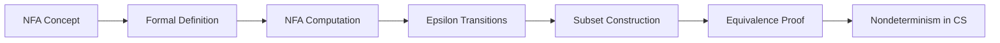

# Chapter 2: Nondeterministic Finite Automata

> **Previous:** [Deterministic Finite Automata](./01-dfa.md) | **Next:** [Regular Expressions](./03-regex.md)

## Learning Objectives

- Define nondeterministic finite automata formally.
- Differentiate between NFA and DFA computation.
- Trace NFA execution using computation trees.
- Construct NFAs with and without epsilon transitions.
- Apply the subset construction algorithm to convert an NFA to a DFA.
- Prove the equivalence of NFA and DFA.
- Understand when nondeterminism simplifies automaton design.

## Chapter at a Glance
| Topic | Key Insight | Practical Takeaway |
|-------|------------|-------------------|
| Nondeterminism | Multiple next states per symbol | Simpler automata than DFA |
| NFA Definition | δ: Q × Σ → P(Q) | Accept if any path accepts |
| Epsilon | ε-transitions consume no input | Modular automata construction |
| Subset Construction | NFA → DFA via state sets | DFA may need exponential states |
| Equivalence | NFA = DFA in power | Convenience ≠ more power |

## Chapter Roadmap

## Theory

### 2.1 The Concept of Nondeterminism

In a DFA, for each state and symbol there is exactly one next state. In an **NFA (nondeterministic finite automaton)**, from a given state and symbol, there may be **zero, one, or multiple** possible next states. When presented with choices, the NFA is said to "guess" the correct path — it accepts the input if *some* sequence of choices leads to an accepting state.

Nondeterminism is a powerful *descriptive* tool: many languages are much easier to describe with an NFA than a DFA. Remarkably, NFAs are **no more powerful** than DFAs — every NFA can be converted to an equivalent DFA, though the DFA may require exponentially more states.

### 2.2 Formal Definition of an NFA

An **NFA** is a 5-tuple (Q, Σ, δ, q₀, F) where:

- **Q** is a finite set of states.
- **Σ** is a finite input alphabet.
- **δ: Q × Σ → P(Q)** is the transition function (where P(Q) is the power set of Q).
- **q₀ ∈ Q** is the start state.
- **F ⊆ Q** is the set of accepting states.

The key difference from DFA: δ returns a **set** of possible next states rather than a single state.

### 2.3 Computation of an NFA

For an NFA on input w = w₁w₂…wₙ:
- The NFA starts in state qâ‚€.
- After reading each symbol wáµ¢, the NFA may be in any of the states reachable via the transition function from any of the current states.
- The NFA **accepts** w if there exists **at least one** path from qâ‚€ to some accepting state after processing all symbols.
- The NFA **rejects** w if no path leads to an accepting state.

The set of all possible states after reading a prefix is called the **configuration** or **computation tree** of the NFA.

Extended transition function for NFA: δ̂(q, w) = set of states reachable from q by reading w. Formally:
- δ̂(q, ε) = {q}
- δ̂(q, wa) = ∪_{r ∈ δ̂(q, w)} δ(r, a)

Language recognized: L(N) = { w | δ̂(q₀, w) ∩ F ≠ ∅ }

### 2.4 NFA with Epsilon Transitions

An NFA-ε extends the NFA to allow **ε-transitions** — transitions that occur without consuming any input symbol. The transition function becomes:
δ: Q × (Σ ∪ {ε}) → P(Q)

The **ε-closure** of a state q, denoted ECLOSE(q), is the set of all states reachable from q using only ε-transitions (including q itself).

To compute the extended transition function for an NFA-ε:
1. Start with the ε-closure of the start state.
2. For each symbol, take the ε-closure of the union of all transitions from the current set of states.

NFA-ε are strictly a convenience — they add no computational power. Both standard NFA and NFA-ε are equivalent to DFA.

### 2.5 Equivalence of NFA and DFA: Subset Construction

The **subset construction** converts any NFA into an equivalent DFA. The key insight: the state of the DFA represents the **set of states** the NFA could be in at that point.

**Algorithm: Subset Construction**

Given NFA N = (Q_N, Σ, δ_N, q₀, F_N), construct DFA D = (Q_D, Σ, δ_D, q₀_D, F_D):

1. Q_D = { S ⊆ Q_N | S is reachable from the start state } (each DFA state is a set of NFA states).
2. q₀_D = ECLOSE(q₀) (for NFA-ε; otherwise just {q₀}).
3. δ_D(S, a) = ∪_{r ∈ S} ECLOSE(δ_N(r, a)) (for NFA-ε; omit ECLOSE for standard NFA).
4. F_D = { S ∈ Q_D | S ∩ F_N ≠ ∅ } (any DFA state containing an accepting NFA state is accepting).

**Number of states:** The DFA may have up to 2^|Q_N| states, though in practice many are unreachable.

### 2.6 Why Nondeterminism Matters

Nondeterminism is a central concept in theoretical computer science. It appears again in:
- **Pushdown automata** (Chapter 6): NPDA are strictly more powerful than DPDA.
- **Turing machines** (Chapter 8): NTM are equivalent to DTM but may be exponentially faster.
- **Complexity theory** (Chapter 12): The P vs NP question asks whether nondeterminism adds polynomial-time power.

NDFA/DFA equivalence is special: for finite automata, nondeterminism adds convenience but not power or efficiency (the DFA may be exponentially larger but still finite).

## Examples

### Example 2.1: NFA for Strings Where the Third-Last Symbol is '1'

Design an NFA over Σ = {0, 1} that accepts strings where the third symbol from the end is 1.

**Solution with NFA:**

We can "guess" where the third-last symbol is. The NFA has 4 states:
- q₀: Start — haven't guessed yet.
- q₁: Guessed — just read the candidate third-last symbol as 1.
- qâ‚‚: Two more symbols consumed.
- q₃: Three more symbols consumed (accept if we reach here).

NFA transitions:
- q₀ --1--> q₁ (guess this 1 is the third-last), q₀ --0,1--> q₀ (keep looking)
- q₁ --0,1--> q₂
- q₂ --0,1--> q₃
- q₃ is accepting

The NFA nondeterministically chooses when to start counting. If the guess is correct (the position was indeed the third-last), the string is accepted.

**Compare with DFA:** The minimal DFA for this language requires 8 states. The NFA captures the same language with 4 states and intuitive logic.

### Example 2.2: NFA-ε for Zero or More 'ab' Followed by 'ba'

Design an NFA-ε over Σ = {a, b} for L = { (ab)* ba }.

**Solution:**

- q₀ (start) --ε--> q₁ (optionally start the (ab)* loop)
- q₀ --ε--> q₄ (skip straight to 'ba' part)
- q₁ --a--> q₂, q₂ --b--> q₁ (the (ab)* loop)
- q₁ --ε--> q₄ (exit loop to 'ba' part)
- q₄ --b--> q₅, q₅ --a--> q₆ (accept)

ECLOSE(q₀) = {q₀, q₁, q₄}. The ε-transitions let the NFA "decide" when to stop looping without consuming symbols.

### Example 2.3: Subset Construction — Convert NFA to DFA

Convert this NFA over Σ = {a, b} to a DFA:
- States: {q₀, q₁, q₂}, start q₀, accept {q₂}
- δ(q₀, a) = {q₀, q₁}, δ(q₀, b) = {q₀}
- δ(q₁, a) = ∅, δ(q₁, b) = {q₂}
- δ(q₂, a) = ∅, δ(q₂, b) = ∅

**Step 1:** Start state of DFA = {qâ‚€}.

**Step 2:** Compute transitions:
- δ_D({q₀}, a) = δ(q₀, a) = {q₀, q₁}
- δ_D({q₀}, b) = δ(q₀, b) = {q₀}

**Step 3:** Process new state {q₀, q₁}:
- δ_D({q₀, q₁}, a) = δ(q₀, a) ∪ δ(q₁, a) = {q₀, q₁} ∪ ∅ = {q₀, q₁}
- δ_D({q₀, q₁}, b) = δ(q₀, b) ∪ δ(q₁, b) = {q₀} ∪ {q₂} = {q₀, q₂}

**Step 4:** Process {qâ‚€, qâ‚‚}:
- δ_D({q₀, q₂}, a) = {q₀, q₁} ∪ ∅ = {q₀, q₁}
- δ_D({q₀, q₂}, b) = {q₀} ∪ ∅ = {q₀}

**Step 5:** Accepting states: {qâ‚€, qâ‚‚} (contains qâ‚‚).

The resulting DFA has 3 states: {q₀}, {q₀, q₁}, {q₀, q₂}, with {q₀, q₂} as the only accepting state.

### Example 2.4: NFA for Union Without Nondeterminism

To accept L₁ ∪ L₂ where L₁ = strings ending with "ab" and L₂ = strings starting with "b":

DFA approach: product construction, 4-6 states.
NFA approach: add a new start state q with ε-transitions to the start states of L₁'s and L₂'s automata. The NFA nondeterministically chooses which language to match against.

This shows why nondeterminism simplifies **modular** automaton construction.

## Concept Comparison Table
| Feature | DFA | NFA | NFA-ε |
|---------|-----|-----|-------|
| δ returns | Single state | Set of states | Set of states |
| ε-transitions | Not allowed | Not allowed | Allowed |
| State count | Potentially large | Potentially smaller | Potentially smaller |
| Design ease | Harder | Easier | Easiest |
| Power | Regular langs | Regular langs | Regular langs |

## Quick Reference
| NFA Concept | Definition |
|-------------|-----------|
| Formal NFA | (Q, Σ, δ, q₀, F), δ: Q × Σ → P(Q) |
| Extended δ̂ | { r | q₀ →* r reading w } |
| Acceptance | δ̂(q₀, w) ∩ F ≠ ∅ |
| ε-closure(q) | States reachable via ε* |
| NFA-ε δ | δ: Q × (Σ ∪ {ε}) → P(Q) |

## Cross-Application Matrix
| Domain | Application |
|--------|------------|
| Compilers | Combined NFA for token recognition |
| Text search | Regex search engines |
| Protocol analysis | Concurrent system behavior |
| Network security | Intrusion pattern matching |
| Bioinformatics | Sequence motif search |

## Chapter Quiz

**Q1.** NFA transition function returns:
- A) A single state
- B) A set of states ✓
- C) A Boolean
- D) A string

Answer

**B)** NFA δ returns a set of possible next states — this is the key difference from DFA.

**Q2.** An NFA accepts w if:
- A) All paths lead to accept
- B) At least one path leads to accept ✓
- C) The NFA reads all symbols
- D) No path rejects

Answer

**B)** NFA acceptance requires at least one computation path to an accepting state.

**Q3.** ε-closure(q) contains:
- A) States reachable by one symbol
- B) States reachable via ε-transitions only ✓
- C) All reachable states
- D) Only q itself

Answer

**B)** ε-closure(q) = { r | q →* r using only ε-transitions }.

**Q4.** Subset construction DFA may have up to:
- A) Same as NFA
- B) Twice the NFA
- C) 2^|Q_NFA| states ✓
- D) |Q_NFA| log |Q_NFA|

Answer

**C)** Each DFA state = subset of NFA states, so up to 2^k states.

**Q5.** Are NFA more powerful than DFA?
- A) Yes, NFA recognize more languages
- B) No, they are equivalent ✓
- C) Only NFA-ε are more powerful
- D) Only if ε-transitions are used

Answer

**B)** NFA and DFA recognize exactly the same class: regular languages.

## Summary

- NFA generalizes DFA by allowing multiple or zero next states per input symbol.
- NFA accepts a string if at least one computation path leads to acceptance.
- NFA-ε adds transitions that consume no input; ε-closure captures all states reachable via ε-steps.
- **Subset construction** converts any NFA to an equivalent DFA by tracking sets of NFA states.
- The DFA may have up to exponentially more states than the NFA.
- NFA and DFA recognize exactly the same class of languages: the regular languages.
- Nondeterminism simplifies automaton design for many languages.

## Exercises

### Basic

1. Design an NFA over Σ = {a, b} that accepts strings where the second-last symbol is 'a'.
2. Design an NFA-ε for the language L = a* b* c*.
3. Compute the ε-closure of each state in an NFA-ε where: q₀ --ε--> q₁, q₁ --ε--> q₂, q₂ --a--> q₀.
4. Convert the NFA from Example 2.1 to a DFA using subset construction.
5. Design an NFA for L = { w ∈ {0,1}* | w contains both "00" and "11" as substrings }.

### Intermediate

6. Convert the following NFA-ε to a DFA: Q={q₀,q₁,q₂}, Σ={a,b}, δ(q₀,ε)={q₁}, δ(q₁,a)={q₁,q₂}, δ(q₁,b)={q₀}, δ(q₂,a)={q₂}, F={q₂}.
7. Prove formally that if L is recognized by an NFA with k states, then L is recognized by a DFA with at most 2ᵏ states.
8. Design an NFA for L = { w ∈ {a,b}* | |w| ≥ 3 and the third symbol equals the last symbol }.
9. Show that NFA-ε are equivalent to NFA by showing how to eliminate ε-transitions.
10. Design an NFA that accepts strings over {0,1} where there are at most two 1s or the string length is even. Convert to DFA.

### Advanced

11. Prove that the subset construction produces the minimal DFA for a given NFA (i.e., show that any DFA equivalent to the NFA must have at least as many states as the reachable subsets).
12. Consider the language L = { w ∈ {0,1}* | w interpreted as binary is congruent to 1 mod 4 OR w contains an even number of 0s }. Design an NFA with at most 6 states using ε-transitions. Convert to DFA.
13. Prove that for any NFA, the subset construction yields a DFA with at most 2ⁿ states, and that this bound is tight — exhibit a family of languages Lₙ that require a DFA with 2ⁿ states but only an NFA with n+1 states.
14. Design an NFA-ε where ε-transitions create exponentially many states in the equivalent DFA. Show the full subset construction.
15. Given two NFA-ε N₁ and N₂, show how to construct an NFA-ε for L(N₁)L(N₂) (concatenation) and L(N₁)* (Kleene star) using ε-transitions. Prove the constructions correct.
