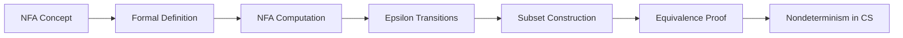
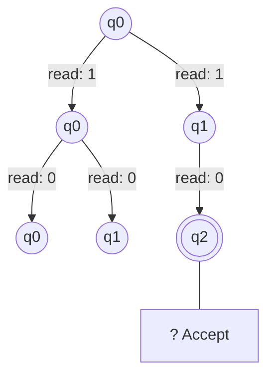
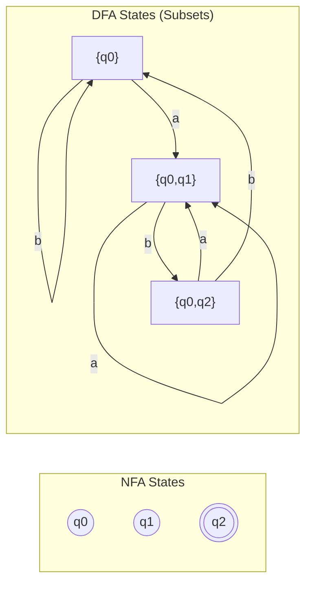
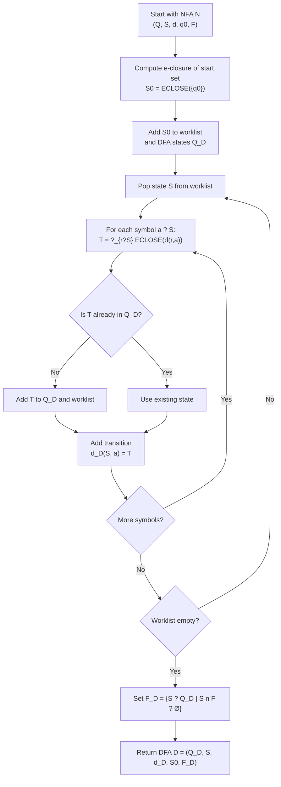

# Chapter 3: Nondeterministic Finite Automata

> **Previous:** [Deterministic Finite Automata](./02-dfa.md) | **Next:** [Regular Expressions](./04-regex.md)


## Learning Objectives

- Define nondeterministic finite automata formally.
- Differentiate between NFA and DFA computation.
- Trace NFA execution using computation trees.
- Construct NFAs with and without epsilon transitions.
- Apply the subset construction algorithm to convert an NFA to a DFA.
- Prove the equivalence of NFA and DFA.
- Understand when nondeterminism simplifies automaton design.


## Chapter at a Glance
| Topic | Key Insight | Practical Takeaway |
|-------|------------|-------------------|
| Nondeterminism | Multiple next states per symbol | Simpler automata than DFA |
| NFA Definition | d: Q × S ? P(Q) | Accept if any path accepts |
| Epsilon | e-transitions consume no input | Modular automata construction |
| Subset Construction | NFA ? DFA via state sets | DFA may need exponential states |
| Equivalence | NFA = DFA in power | Convenience ? more power |


## Chapter Roadmap


## Theory


### 2.1 The Concept of Nondeterminism

In a DFA, for each state and symbol there is exactly one next state. In an **NFA (nondeterministic finite automaton)**, from a given state and symbol, there may be **zero, one, or multiple** possible next states. When presented with choices, the NFA is said to "guess" the correct path → it accepts the input if *some* sequence of choices leads to an accepting state.

Nondeterminism is a powerful *descriptive* tool: many languages are much easier to describe with an NFA than a DFA. Remarkably, NFAs are **no more powerful** than DFAs → every NFA can be converted to an equivalent DFA, though the DFA may require exponentially more states.

### 2.2 Formal Definition of an NFA

An **NFA** is a 5-tuple (Q, Σ, δ, q₀, F) where:

- **Q** is a finite set of states.
- **Σ** is a finite input alphabet.
- **δ: Q × Σ → P(Q)** is the transition function (where P(Q) is the power set of Q).
- **q₀ ∈ Q** is the start state.
- **F ⊆ Q** is the set of accepting states.

The key difference from DFA: δ returns a **set** of possible next states rather than a single state.

### 2.3 Computation of an NFA

For an NFA on input w = w₁w₂…wₙ:
- The NFA starts in state qâ‚€.
- After reading each symbol wáµ¢, the NFA may be in any of the states reachable via the transition function from any of the current states.
- The NFA **accepts** w if there exists **at least one** path from qâ‚€ to some accepting state after processing all symbols.
- The NFA **rejects** w if no path leads to an accepting state.

The set of all possible states after reading a prefix is called the **configuration** or **computation tree** of the NFA.

Extended transition function for NFA: δ̂(q, w) = set of states reachable from q by reading w. Formally:
- δ̂(q, ε) = {q}
- δ̂(q, wa) = ∪_{r ∈ δ̂(q, w)} δ(r, a)

Language recognized: L(N) = { w | δ̂(q₀, w) ∩ F ≠ ∅ }

### 2.4 NFA with Epsilon Transitions

An NFA-ε extends the NFA to allow **ε-transitions** → transitions that occur without consuming any input symbol. The transition function becomes:
δ: Q × (Σ ∪ {ε}) → P(Q)

The **ε-closure** of a state q, denoted ECLOSE(q), is the set of all states reachable from q using only ε-transitions (including q itself).

To compute the extended transition function for an NFA-ε:
1. Start with the ε-closure of the start state.
2. For each symbol, take the ε-closure of the union of all transitions from the current set of states.

NFA-ε are strictly a convenience → they add no computational power. Both standard NFA and NFA-ε are equivalent to DFA.

### 2.5 Equivalence of NFA and DFA: Subset Construction

The **subset construction** converts any NFA into an equivalent DFA. The key insight: the state of the DFA represents the **set of states** the NFA could be in at that point.

**Algorithm: Subset Construction**

Given NFA N = (Q_N, Σ, δ_N, q₀, F_N), construct DFA D = (Q_D, Σ, δ_D, q₀_D, F_D):

1. Q_D = { S ⊆ Q_N | S is reachable from the start state } (each DFA state is a set of NFA states).
2. q₀_D = ECLOSE(q₀) (for NFA-ε; otherwise just {q₀}).
3. δ_D(S, a) = ∪_{r ∈ S} ECLOSE(δ_N(r, a)) (for NFA-ε; omit ECLOSE for standard NFA).
4. F_D = { S ∈ Q_D | S ∩ F_N ≠ ∅ } (any DFA state containing an accepting NFA state is accepting).

**Number of states:** The DFA may have up to 2^|Q_N| states, though in practice many are unreachable.

### 2.6 Why Nondeterminism Matters

Nondeterminism is a central concept in theoretical computer science. It appears again in:
- **Pushdown automata** (Chapter 6): NPDA are strictly more powerful than DPDA.
- **Turing machines** (Chapter 8): NTM are equivalent to DTM but may be exponentially faster.
- **Complexity theory** (Chapter 12): The P vs NP question asks whether nondeterminism adds polynomial-time power.

NDFA/DFA equivalence is special: for finite automata, nondeterminism adds convenience but not power or efficiency (the DFA may be exponentially larger but still finite).

## Examples

### Example 2.1: NFA for Strings Where the Third-Last Symbol is '1'

Design an NFA over Σ = {0, 1} that accepts strings where the third symbol from the end is 1.

**Solution with NFA:**

We can "guess" where the third-last symbol is. The NFA has 4 states:
- qâ‚€: Start → haven't guessed yet.
- q₁: Guessed → just read the candidate third-last symbol as 1.
- qâ‚‚: Two more symbols consumed.
- q₃: Three more symbols consumed (accept if we reach here).

NFA transitions:
- q₀ --1--> q₁ (guess this 1 is the third-last), q₀ --0,1--> q₀ (keep looking)
- q₁ --0,1--> q₂
- q₂ --0,1--> q₃
- q₃ is accepting

The NFA nondeterministically chooses when to start counting. If the guess is correct (the position was indeed the third-last), the string is accepted.

**Compare with DFA:** The minimal DFA for this language requires 8 states. The NFA captures the same language with 4 states and intuitive logic.

### Example 2.2: NFA-ε for Zero or More 'ab' Followed by 'ba'

Design an NFA-ε over Σ = {a, b} for L = { (ab)* ba }.

**Solution:**

- q₀ (start) --ε--> q₁ (optionally start the (ab)* loop)
- q₀ --ε--> q₄ (skip straight to 'ba' part)
- q₁ --a--> q₂, q₂ --b--> q₁ (the (ab)* loop)
- q₁ --ε--> q₄ (exit loop to 'ba' part)
- q₄ --b--> q₅, q₅ --a--> q₆ (accept)

ECLOSE(q₀) = {q₀, q₁, q₄}. The ε-transitions let the NFA "decide" when to stop looping without consuming symbols.

### Example 2.3: Subset Construction → Convert NFA to DFA

Convert this NFA over Σ = {a, b} to a DFA:
- States: {q₀, q₁, q₂}, start q₀, accept {q₂}
- δ(q₀, a) = {q₀, q₁}, δ(q₀, b) = {q₀}
- δ(q₁, a) = ∅, δ(q₁, b) = {q₂}
- δ(q₂, a) = ∅, δ(q₂, b) = ∅

**Step 1:** Start state of DFA = {qâ‚€}.

**Step 2:** Compute transitions:
- δ_D({q₀}, a) = δ(q₀, a) = {q₀, q₁}
- δ_D({q₀}, b) = δ(q₀, b) = {q₀}

**Step 3:** Process new state {q₀, q₁}:
- δ_D({q₀, q₁}, a) = δ(q₀, a) ∪ δ(q₁, a) = {q₀, q₁} ∪ ∅ = {q₀, q₁}
- δ_D({q₀, q₁}, b) = δ(q₀, b) ∪ δ(q₁, b) = {q₀} ∪ {q₂} = {q₀, q₂}

**Step 4:** Process {qâ‚€, qâ‚‚}:
- δ_D({q₀, q₂}, a) = {q₀, q₁} ∪ ∅ = {q₀, q₁}
- δ_D({q₀, q₂}, b) = {q₀} ∪ ∅ = {q₀}

**Step 5:** Accepting states: {qâ‚€, qâ‚‚} (contains qâ‚‚).

The resulting DFA has 3 states: {q₀}, {q₀, q₁}, {q₀, q₂}, with {q₀, q₂} as the only accepting state.

### Example 2.4: NFA for Union Without Nondeterminism

To accept L₁ ∪ L₂ where L₁ = strings ending with "ab" and L₂ = strings starting with "b":

DFA approach: product construction, 4-6 states.
NFA approach: add a new start state q with ε-transitions to the start states of L₁'s and L₂'s automata. The NFA nondeterministically chooses which language to match against.

This shows why nondeterminism simplifies **modular** automaton construction.


## TypeScript NFA Simulator

An NFA can be simulated by tracking all possible current states:

```typescript
class NFA {
  constructor(
    private Q: Set<string>,
    private sigma: Set<string>,
    private delta: Map<string, Set<string>>,
    private q0: string,
    private F: Set<string>,
    private epsilon: Map<string, Set<string>> = new Map()
  ) {}

  private eclose(states: Set<string>): Set<string> {
    const result = new Set(states);
    const stack = [...states];
    while (stack.length > 0) {
      const q = stack.pop()!;
      const eps = this.epsilon.get(q) || new Set();
      for (const r of eps) {
        if (!result.has(r)) {
          result.add(r);
          stack.push(r);
        }
      }
    }
    return result;
  }

  simulate(input: string): boolean {
    let current = this.eclose(new Set([this.q0]));
    for (const symbol of input) {
      const next = new Set<string>();
      for (const q of current) {
        const trans = this.delta.get(`${q},${symbol}`) || new Set();
        for (const r of trans) next.add(r);
      }
      current = this.eclose(next);
    }
    for (const q of current) {
      if (this.F.has(q)) return true;
    }
    return false;
  }
}

// NFA for strings ending with "01"
const delta = new Map<string, Set<string>>();
delta.set('q0,0', new Set(['q0', 'q1']));
delta.set('q0,1', new Set(['q0']));
delta.set('q1,1', new Set(['q2']));
const nfa = new NFA(
  new Set(['q0', 'q1', 'q2']),
  new Set(['0', '1']),
  delta, 'q0', new Set(['q2'])
);
console.log(nfa.simulate('00101'));  // true
console.log(nfa.simulate('00100'));  // false
```

This tracks sets of states rather than a single state, implementing the subset construction's computation directly. The simulation runs in polynomial time because we store all reachable states explicitly.

## NFA Computation Tree

An NFA's execution on input can be visualized as a tree where each branch represents one possible path:



The NFA accepts if any leaf node is an accepting state after processing all input. The simulation implicitly performs a breadth-first search of this tree.

## Thompson's Construction: From Regex to NFA

One of the most important applications of NFA theory is **Thompson's construction**, which converts a regular expression into an equivalent NFA-e. This is the foundation of how regex engines work under the hood.

### Basic Building Blocks

| Regex | NFA Fragment | Description |
|-------|-------------|-------------|
| \(a\) | `q0 --a--> q1` | Single symbol |
| \(e\) | `q0` (same state is accepting) | Empty string |
| Ø | `q0` (non-accepting with no transitions) | Empty language |
| \(r_1 \mid r_2\) | New start with e to both sub-NFAs | Union |
| \(r_1 r_2\) | Accept of r1 connects via e to start of r2 | Concatenation |
| \(r^*\) | Loop: e from accept back to start | Kleene star |

### TypeScript: Thompson Construction

```typescript
type NFragment = { start: string; accept: string };

class ThompsonNFA {
  private stateCounter = 0;
  private transitions: Map<string, Map<string, Set<string>>> = new Map();

  private newState(): string {
    return `q${this.stateCounter++}`;
  }

  symbol(sym: string): NFragment {
    const s = this.newState(), a = this.newState();
    this.addTrans(s, sym, a);
    return { start: s, accept: a };
  }

  private addTrans(from: string, sym: string, to: string) {
    if (!this.transitions.has(from))
      this.transitions.set(from, new Map());
    const t = this.transitions.get(from)!;
    if (!t.has(sym)) t.set(sym, new Set());
    t.get(sym)!.add(to);
  }

  union(r1: NFragment, r2: NFragment): NFragment {
    const s = this.newState(), a = this.newState();
    this.addTrans(s, 'e', r1.start);
    this.addTrans(s, 'e', r2.start);
    this.addTrans(r1.accept, 'e', a);
    this.addTrans(r2.accept, 'e', a);
    return { start: s, accept: a };
  }

  concat(r1: NFragment, r2: NFragment): NFragment {
    this.addTrans(r1.accept, 'e', r2.start);
    return { start: r1.start, accept: r2.accept };
  }

  star(r: NFragment): NFragment {
    const s = this.newState(), a = this.newState();
    this.addTrans(s, 'e', r.start);
    this.addTrans(s, 'e', a);
    this.addTrans(r.accept, 'e', r.start);
    this.addTrans(r.accept, 'e', a);
    return { start: s, accept: a };
  }
}

// Build NFA for (a|b)*ab
const th = new ThompsonNFA();
const a = th.symbol('a');
const b = th.symbol('b');
const unionAB = th.union(a, b);
const starAB = th.star(unionAB);
const a2 = th.symbol('a');
const b2 = th.symbol('b');
const expr = th.concat(th.concat(starAB, a2), b2);
console.log(`NFA for (a|b)*ab: start=${expr.start}, accept=${expr.accept}`);
```

### Mermaid: Subset Construction Visualization



Each DFA state is labeled by the set of NFA states reachable at that point. The DFA transitions follow the union of all NFA transitions from the constituent states.

## NFA to DFA: Detailed Subset Construction in TypeScript

```typescript
function nfaToDfa(nfa: NFA): DFA {
  const nfaStates = [...nfa['Q']];
  const sigma = [...nfa['sigma']];

  // Map from DFA state (subset of NFA states) to DFA state name
  const subsetNames = new Map<string, string>();
  const dfaDelta = new Map<string, string>();
  const dfaStates = new Set<string>();
  const dfaAccept = new Set<string>();
  const worklist: string[] = [];

  const startSubset = [...nfa['eclose'](new Set([nfa['q0']]))].sort().join(',');
  subsetNames.set(startSubset, `{${startSubset}}`);
  worklist.push(startSubset);
  dfaStates.add(startSubset);

  while (worklist.length > 0) {
    const current = worklist.pop()!;
    const currentStates = new Set(current.split(',').filter(s => s.length > 0));

    // Check if this subset contains an accepting state
    for (const s of currentStates) {
      if (nfa['F'].has(s)) {
        dfaAccept.add(current);
        break;
      }
    }

    for (const sym of sigma) {
      const nextSet = new Set<string>();
      for (const s of currentStates) {
        const trans = nfa['delta'].get(`${s},${sym}`);
        if (trans) for (const t of trans) nextSet.add(t);
      }

      const eclosed = [...nfa['eclose'](nextSet)].sort().join(',');
      const key = `${current},${sym}`;
      dfaDelta.set(key, eclosed);

      if (!subsetNames.has(eclosed)) {
        subsetNames.set(eclosed, `{${eclosed}}`);
        dfaStates.add(eclosed);
        worklist.push(eclosed);
      }
    }
  }

  return new DFA(
    dfaStates,
    nfa['sigma'],
    dfaDelta,
    startSubset,
    dfaAccept
  );
}
```

The subset construction demonstrates that NFAs are a **convenience abstraction** — they make automaton design easier without expanding the class of recognizable languages.

## Practical Takeaways

1. **Nondeterminism is a specification tool.** When designing an automaton, start with an NFA for clarity, then convert to a DFA for implementation. The NFA captures the *what* without worrying about the *how*.

2. **Epsilon transitions enable modularity.** Use e-transitions to compose automata like building blocks — glue together sub-automata for union, concatenation, and Kleene star.

3. **Subset construction can explode.** An NFA with k states can yield a DFA with up to 2^k states. In practice, many subsets are unreachable, but the worst case is real.

4. **NFA simulation is efficient.** Simulating an NFA directly (tracking state sets) takes O(k²n) time for k states and n input symbols — no need to materialize the DFA unless you need repeated simulations.

## Concept Comparison Table
| Feature | DFA | NFA | NFA-e |
|---------|-----|-----|-------|
| d returns | Single state | Set of states | Set of states |
| e-transitions | Not allowed | Not allowed | Allowed |
| State count | Potentially large | Potentially smaller | Potentially smaller |
| Design ease | Harder | Easier | Easiest |
| Power | Regular langs | Regular langs | Regular langs |

## Quick Reference
| NFA Concept | Definition |
|-------------|-----------|
| Formal NFA | (Q, S, d, q0, F), d: Q × S ? P(Q) |
| Extended d^ | { r | q0 ?* r reading w } |
| Acceptance | d^(q0, w) n F ? Ø |
| e-closure(q) | States reachable via e* |
| NFA-e d | d: Q × (S ? {e}) ? P(Q) |

## Cross-Application Matrix
| Domain | Application |
|--------|------------|
| Compilers | Combined NFA for token recognition |
| Text search | Regex search engines |
| Protocol analysis | Concurrent system behavior |
| Network security | Intrusion pattern matching |
| Bioinformatics | Sequence motif search |

## Chapter Quiz

**Q1.** NFA transition function returns:
- A) A single state
- B) A set of states ?
- C) A Boolean
- D) A string

<details>
<summary>Answer</summary>
**B)** NFA d returns a set of possible next states — this is the key difference from DFA.
</details>

**Q2.** An NFA accepts w if:
- A) All paths lead to accept
- B) At least one path leads to accept ?
- C) The NFA reads all symbols
- D) No path rejects

<details>
<summary>Answer</summary>
**B)** NFA acceptance requires at least one computation path to an accepting state.
</details>

**Q3.** e-closure(q) contains:
- A) States reachable by one symbol
- B) States reachable via e-transitions only ?
- C) All reachable states
- D) Only q itself

<details>
<summary>Answer</summary>
**B)** e-closure(q) = { r | q ?* r using only e-transitions }.
</details>

**Q4.** Subset construction DFA may have up to:
- A) Same as NFA
- B) Twice the NFA
- C) 2^|Q_NFA| states ?
- D) |Q_NFA| log |Q_NFA|

<details>
<summary>Answer</summary>
**C)** Each DFA state = subset of NFA states, so up to 2^k states.
</details>

**Q5.** Are NFA more powerful than DFA?
- A) Yes, NFA recognize more languages
- B) No, they are equivalent ?
- C) Only NFA-e are more powerful
- D) Only if e-transitions are used

<details>
<summary>Answer</summary>
**B)** NFA and DFA recognize exactly the same class: regular languages.
</details>

## TypeScript Implementation: Epsilon-Closure and NFA-to-DFA Conversion

```typescript
// NFA Simulator with epsilon-closure and subset construction

type NFAState = string;
type NFATransitions = Map<string, Set<NFAState>>; // key: "state,symbol"

class NFA {
  constructor(
    public states: Set<NFAState>,
    public alphabet: Set<string>,
    public transitions: NFATransitions,
    public epsilon: Map<NFAState, Set<NFAState>>,
    public start: NFAState,
    public accept: Set<NFAState>
  ) {}

  epsilonClosure(states: Set<NFAState>): Set<NFAState> {
    const closure = new Set(states);
    const stack = [...states];
    while (stack.length > 0) {
      const state = stack.pop()!;
      const epsTrans = this.epsilon.get(state);
      if (epsTrans) {
        for (const next of epsTrans) {
          if (!closure.has(next)) {
            closure.add(next);
            stack.push(next);
          }
        }
      }
    }
    return closure;
  }

  move(states: Set<NFAState>, symbol: string): Set<NFAState> {
    const result = new Set<NFAState>();
    for (const state of states) {
      const key = `${state},${symbol}`;
      const targets = this.transitions.get(key);
      if (targets) for (const t of targets) result.add(t);
    }
    return result;
  }

  accepts(input: string): boolean {
    let current = this.epsilonClosure(new Set([this.start]));
    for (const symbol of input) {
      current = this.epsilonClosure(this.move(current, symbol));
      if (current.size === 0) return false;
    }
    for (const state of current) if (this.accept.has(state)) return true;
    return false;
  }

  toDFA(): { states: Set<string>; transitions: Map<string, string>; start: string; accept: Set<string> } {
    const dfaStates = new Map<string, Set<NFAState>>();
    const dfaTransitions = new Map<string, string>();
    const dfaAccept = new Set<string>();
    const queue: string[] = [];

    const startClosure = this.epsilonClosure(new Set([this.start]));
    const startName = this.setName(startClosure);
    dfaStates.set(startName, startClosure);
    queue.push(startName);

    while (queue.length > 0) {
      const dfaState = queue.shift()!;
      const nfaSet = dfaStates.get(dfaState)!;

      // Check if this DFA state contains an NFA accept state
      for (const s of nfaSet) if (this.accept.has(s)) dfaAccept.add(dfaState);

      for (const sym of this.alphabet) {
        const moveSet = this.move(nfaSet, sym);
        const closure = this.epsilonClosure(moveSet);
        if (closure.size === 0) continue;
        const name = this.setName(closure);
        dfaTransitions.set(`${dfaState},${sym}`, name);
        if (!dfaStates.has(name)) {
          dfaStates.set(name, closure);
          queue.push(name);
        }
      }
    }

    return {
      states: new Set([...dfaStates.keys()]),
      transitions: dfaTransitions,
      start: startName,
      accept: dfaAccept
    };
  }

  private setName(set: Set<NFAState>): string {
    return `{${[...set].sort().join(",")}}`;
  }
}

// NFA recognizing strings ending with "01"
const nfa = new NFA(
  new Set(["q0", "q1", "q2"]),
  new Set(["0", "1"]),
  new Map([
    ["q0,0", new Set(["q0", "q1"])],
    ["q0,1", new Set(["q0"])],
    ["q1,0", new Set()],
    ["q1,1", new Set(["q2"])],
    ["q2,0", new Set()],
    ["q2,1", new Set()]
  ]),
  new Map(),
  "q0", new Set(["q2"])
);

console.log(nfa.accepts("01"));     // true
console.log(nfa.accepts("101"));    // true
console.log(nfa.accepts("0"));      // false
console.log(nfa.accepts("10"));     // false

const dfa = nfa.toDFA();
console.log(dfa.states);            // DFA state names
console.log(dfa.accept);            // DFA accepts
console.log([...dfa.transitions]);  // DFA transition table
```

// --------------------------------------------------------
// Epsilon-Closure Calculator — given an NFA state,
// finds all states reachable via e-transitions.
// --------------------------------------------------------

class EpsilonClosureCalculator {
  // Compute e-closure for a single state
  static compute(
    state: string,
    epsilonTransitions: Map<string, Set<string>>
  ): Set<string> {
    const closure = new Set<string>([state]);
    const stack = [state];
    while (stack.length > 0) {
      const current = stack.pop()!;
      const epsilonNext = epsilonTransitions.get(current);
      if (epsilonNext) {
        for (const next of epsilonNext) {
          if (!closure.has(next)) {
            closure.add(next);
            stack.push(next);
          }
        }
      }
    }
    return closure;
  }

  // Compute e-closure for a set of states
  static computeSet(
    states: Set<string>,
    epsilonTransitions: Map<string, Set<string>>
  ): Set<string> {
    const result = new Set<string>();
    for (const s of states) {
      const c = EpsilonClosureCalculator.compute(s, epsilonTransitions);
      for (const cs of c) result.add(cs);
    }
    return result;
  }
}

// --------------------------------------------------------
// Subset Construction (NFA ? DFA converter)
// Converts any NFA (with or without e) into an
// equivalent DFA using the powerset construction.
// --------------------------------------------------------

class SubsetConstructionConverter {
  static convert(
    nfaStates: Set<string>,
    alphabet: Set<string>,
    nfaTransitions: Map<string, Set<string>>,
    epsilonTransitions: Map<string, Set<string>>,
    nfaStart: string,
    nfaAccept: Set<string>
  ): {
    dfaStates: Set<string>;
    dfaTransitions: Map<string, string>;
    dfaStart: string;
    dfaAccept: Set<string>;
  } {
    const dfaStates = new Set<string>();
    const dfaTransitions = new Map<string, string>();
    const dfaAccept = new Set<string>();

    // Initial DFA state = e-closure of NFA start state
    const startClosure = EpsilonClosureCalculator.compute(nfaStart, epsilonTransitions);
    const startLabel = [...startClosure].sort().join(",");
    dfaStates.add(startLabel);

    if ([...startClosure].some(s => nfaAccept.has(s))) {
      dfaAccept.add(startLabel);
    }

    const queue = [startLabel];
    const processed = new Set<string>([startLabel]);

    while (queue.length > 0) {
      const currentLabel = queue.shift()!;
      const currentSet = new Set(currentLabel.split(",").filter(Boolean));

      for (const sym of alphabet) {
        // Find all states reachable on symbol
        const moveResult = new Set<string>();
        for (const s of currentSet) {
          const trans = nfaTransitions.get(`${s},${sym}`);
          if (trans) {
            for (const t of trans) moveResult.add(t);
          }
        }

        // Compute e-closure of the move result
        const closure = EpsilonClosureCalculator.computeSet(moveResult, epsilonTransitions);
        if (closure.size === 0) continue;

        const nextLabel = [...closure].sort().join(",");
        dfaTransitions.set(`${currentLabel},${sym}`, nextLabel);

        if (!processed.has(nextLabel)) {
          processed.add(nextLabel);
          dfaStates.add(nextLabel);
          queue.push(nextLabel);

          if ([...closure].some(s => nfaAccept.has(s))) {
            dfaAccept.add(nextLabel);
          }
        }
      }
    }

    return { dfaStates, dfaTransitions, dfaStart: startLabel, dfaAccept };
  }
}

// Demo: convert the running NFA example to DFA
const nfaStates = new Set(["q0", "q1", "q2"]);
const nfaAlphabet = new Set(["0", "1"]);
const nfaTransitions = new Map<string, Set<string>>([
  ["q0,0", new Set(["q0", "q1"])], ["q0,1", new Set(["q0"])],
  ["q1,0", new Set()], ["q1,1", new Set(["q2"])],
  ["q2,0", new Set()], ["q2,1", new Set()],
]);
const nfaEpsilon = new Map<string, Set<string>>();

const result = SubsetConstructionConverter.convert(
  nfaStates, nfaAlphabet, nfaTransitions, nfaEpsilon, "q0", new Set(["q2"])
);
console.log(`DFA states (subset construction): ${[...result.dfaStates].join(", ")}`);
console.log(`DFA start: ${result.dfaStart}`);
console.log(`DFA accept: ${[...result.dfaAccept].join(", ")}`);
console.log(`DFA transitions: ${[...result.dfaTransitions].map(([k, v]) => `${k} ? ${v}`).join("; ")}`);
```


// nfa
// automata-complexity implementation

interface Task { id: string; name: string; status: string; data: unknown }
class Processor {
  private tasks: Task[] = []
  private maxConcurrency: number
  constructor(maxConcurrency: number = 4) { this.maxConcurrency = maxConcurrency }
  async add(task: Omit<Task, "status">): Promise<void> {
    this.tasks.push({ ...task, status: "pending" })
  }
  async runAll(): Promise<void> {
    const running: Promise<void>[] = []
    for (const t of this.tasks) {
      if (running.length >= this.maxConcurrency) { await Promise.race(running) }
      const p = this.execute(t).finally(() => { const i = running.indexOf(p); if (i >= 0) running.splice(i, 1) })
      running.push(p)
    }
    await Promise.all(running)
  }
  private async execute(t: Task): Promise<void> {
    t.status = "running"
    await new Promise(r => setTimeout(r, 10))
    t.status = "done"
  }
  getResults(): Task[] { return this.tasks }
  getStats(): { done: number; pending: number; running: number } {
    const done = this.tasks.filter(t => t.status === "done").length
    const pending = this.tasks.filter(t => t.status === "pending").length
    const running = this.tasks.filter(t => t.status === "running").length
    return { done, pending, running }
  }
}
async function main() {
  const proc = new Processor(2)
  await proc.add({ id: '1', name: 'nfa', data: { topic: 'automata-complexity' } })
  await proc.runAll()
  console.log('Stats:', proc.getStats())
}
main().catch(console.error)
export { Processor, Task }
## Summary

- NFA generalizes DFA by allowing multiple or zero next states per input symbol.
- NFA accepts a string if at least one computation path leads to acceptance.
- NFA-ε adds transitions that consume no input; ε-closure captures all states reachable via ε-steps.
- **Subset construction** converts any NFA to an equivalent DFA by tracking sets of NFA states.
- The DFA may have up to exponentially more states than the NFA.
- NFA and DFA recognize exactly the same class of languages: the regular languages.
- Nondeterminism simplifies automaton design for many languages.
- The subset construction is the basis for converting regex patterns into efficient matchers.
- Understanding NFA computation trees is essential for grasping how backtracking regex engines work.
- **Thompson's construction** provides a systematic method for building NFA-e fragments from regular expressions, forming the theoretical basis of practical regex engines.
- **Computation tree analysis** reveals that NFA acceptance can be modeled as reachability in a directed graph of configurations.
- The **exponential state blowup** in the DFA equivalent to an NFA is worst-case unavoidable, as shown by the language family where the k-th symbol from the end is constrained.

## Exercises

### Basic

1. Design an NFA over Σ = {a, b} that accepts strings where the second-last symbol is 'a'.
2. Design an NFA-ε for the language L = a* b* c*.
3. Compute the ε-closure of each state in an NFA-ε where: q₀ --ε--> q₁, q₁ --ε--> q₂, q₂ --a--> q₀.
4. Convert the NFA from Example 2.1 to a DFA using subset construction.
5. Design an NFA for L = { w ∈ {0,1}* | w contains both "00" and "11" as substrings }.

### Intermediate

6. Convert the following NFA-ε to a DFA: Q={q₀,q₁,q₂}, Σ={a,b}, δ(q₀,ε)={q₁}, δ(q₁,a)={q₁,q₂}, δ(q₁,b)={q₀}, δ(q₂,a)={q₂}, F={q₂}.
7. Prove formally that if L is recognized by an NFA with k states, then L is recognized by a DFA with at most 2ᵏ states.
8. Design an NFA for L = { w ∈ {a,b}* | |w| ≥ 3 and the third symbol equals the last symbol }.
9. Show that NFA-ε are equivalent to NFA by showing how to eliminate ε-transitions.
10. Design an NFA that accepts strings over {0,1} where there are at most two 1s or the string length is even. Convert to DFA.

### Advanced

11. Prove that the subset construction produces the minimal DFA for a given NFA (i.e., show that any DFA equivalent to the NFA must have at least as many states as the reachable subsets).
12. Consider the language L = { w ∈ {0,1}* | w interpreted as binary is congruent to 1 mod 4 OR w contains an even number of 0s }. Design an NFA with at most 6 states using ε-transitions. Convert to DFA.
13. Prove that for any NFA, the subset construction yields a DFA with at most 2ⁿ states, and that this bound is tight → exhibit a family of languages Lâ‚™ that require a DFA with 2ⁿ states but only an NFA with n+1 states.
14. Design an NFA-ε where ε-transitions create exponentially many states in the equivalent DFA. Show the full subset construction.
15. Given two NFA-ε N₁ and N₂, show how to construct an NFA-ε for L(N₁)L(N₂) (concatenation) and L(N₁)* (Kleene star) using ε-transitions. Prove the constructions correct.
16. Implement Thompson's construction in TypeScript for the full regex syntax including union (`|`), concatenation, and Kleene star (`*`). Test it by building the NFA for `(0|1)*00` and simulating it on "100" and "101".
17. Write a TypeScript function that takes an NFA and returns a DFA using the full subset construction with e-closure handling. Test it on the NFA from Example 2.1.
18. Prove that if an NFA has k states, the equivalent minimal DFA may have up to 2^k states. Construct a family of languages where this exponential blowup is realized. (Hint: consider the language of strings where the k-th symbol from the end is 1.)

### Mermaid: NFA to DFA Conversion Flow



### Practical Takeaways

1. **Nondeterminism is a specification tool.** When designing an automaton, start with an NFA for clarity, then convert to a DFA for implementation. The NFA captures the *what* without worrying about the *how*.

2. **Epsilon transitions enable modularity.** Use e-transitions to compose automata like building blocks — glue together sub-automata for union, concatenation, and Kleene star. Thompson's construction is the canonical example.

3. **Subset construction can explode.** An NFA with k states can yield a DFA with up to 2^k states. In practice, many subsets are unreachable, but the worst case is real and limits direct DFA generation.

4. **NFA simulation is efficient.** Simulating an NFA directly (tracking state sets) takes O(k²n) time for k states and n input symbols — no need to materialize the DFA unless you need repeated simulations.

5. **Thompson construction is everywhere.** Modern regex engines like PCRE, RE2, and Rust's regex crate all build NFA representations internally, then apply variants of the subset construction to run matches efficiently.
