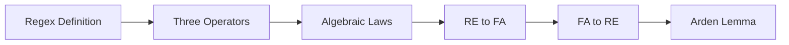

# Chapter 4: Regular Expressions

> **Previous:** [Nondeterministic Finite Automata](./03-nfa.md) | **Next:** [Properties of Regular Languages](./05-regular-languages.md)


## Learning Objectives

- Define regular expressions and the languages they denote.
- Describe the three basic operators: union, concatenation, and Kleene star.
- Understand operator precedence in regular expressions.
- State the algebraic laws for regular expressions.
- Convert between regular expressions and finite automata.
- Apply Arden's lemma to solve regular expression equations.
- Understand the limitations of regular expressions.


## Chapter at a Glance
| Topic | Key Insight | Practical Takeaway |
|-------|------------|-------------------|
| Regex Definition | Algebraic notation for patterns | Foundation for text processing |
| Three Operators | Union, concatenation, Kleene star | Build complex patterns from simple |
| Operator Precedence | Star > concat > union | Prevents ambiguity in patterns |
| RE ↔ FA | Every RE has equivalent automaton | Lexer generators use this equivalence |
| Arden's Lemma | Solves X = AX ∪ B | Converts DFA to RE systematically |


## Chapter Roadmap


## Theory


### 3.1 What is a Regular Expression?

A **regular expression** is a algebraic notation for describing a pattern — a set of strings. Regular expressions are used extensively in text processing, lexical analysis, and input validation.

A regular expression **r** denotes a language **L(r)**, which is a set of strings over some alphabet Σ.

### 3.2 Formal Definition

**Basis:**
- ε is a regular expression denoting L(ε) = {ε} (the set containing the empty string).
- ∅ is a regular expression denoting L(∅) = ∅ (the empty language).
- For each a ∈ Σ, a is a regular expression denoting L(a) = {a}.

**Inductive Step:**
Let r and s be regular expressions denoting languages L(r) and L(s). Then:

1. **(r + s)** or **(r | s)**: union/alternation — L(r + s) = L(r) ∪ L(s).
2. **(r · s)** or **(rs)**: concatenation — L(rs) = L(r)L(s) = { xy | x ∈ L(r), y ∈ L(s) }.
3. **(r\*)**: Kleene star — L(r*) = ∪_{i ≥ 0} L(r)ⁱ where L(r)⁰ = {ε} and L(r)ⁱ⁺¹ = L(r)ⁱL(r).
4. **(r)**: parentheses for grouping — L((r)) = L(r).

Additional derived operators:
- **r⁺** = rr* (one or more repetitions).
- **r?** = r + ε (optional).
- **.** (in some notations) = any single symbol.

### 3.3 Operator Precedence

When interpreting regular expressions without explicit parentheses, the order is:
1. **Kleene star** (*) — highest precedence (binds tightest).
2. **Concatenation** (·).
3. **Union** (+ or |) — lowest precedence.

So `ab*c` means `a(b*)c`, not `(ab)*c` or `ab(*c)`.

### 3.4 Algebraic Laws of Regular Expressions

Regular expressions satisfy algebraic laws that can be used to simplify and manipulate them.

| Law | Expression |
|-----|-----------|
| Associativity of union | (r + s) + t = r + (s + t) |
| Commutativity of union | r + s = s + r |
| Identity for union | r + ∅ = r = ∅ + r |
| Annihilator for concat | ∅r = r∅ = ∅ |
| Identity for concat | εr = rε = r |
| Associativity of concat | (rs)t = r(st) |
| Distributive (left) | r(s + t) = rs + rt |
| Distributive (right) | (s + t)r = sr + tr |
| Idempotence of union | r + r = r |
| Kleene star | ∅* = ε |
| Kleene star | ε* = ε |
| Kleene star | (r*)* = r* |
| Kleene star | r* = ε + rr* |
| Kleene star | r* = (ε + r)* |
| Kleene star | r* = (r*)* |
| r**r* | r*r* = r* |

### 3.5 Equivalence of Regular Expressions and Finite Automata

**Theorem:** A language is regular if and only if it can be described by a regular expression.

This theorem has two directions:

**Direction 1 (RE → FA):** Every regular expression can be converted to an NFA-ε.

The conversion follows the structural induction of the regular expression definition. Each subexpression is converted to an NFA-ε with:
- Exactly one start state (no incoming transitions).
- Exactly one accepting state (no outgoing transitions).

**Basis conversions:**
- For ε: start state connected to accept state via ε-transition.
- For ∅: start state (non-accepting) with no outgoing transitions.
- For a ∈ Σ: start --a--> accept.

**Inductive conversions (using modular construction):**
Let N₁ and N₂ be the NFAs for r and s with start states s₁, s₂ and accept states a₁, a₂.

- **Union** (r + s): New start s₀ --ε--> s₁ and s₀ --ε--> s₂; a₁ --ε--> new accept a₀ and a₂ --ε--> a₀.
- **Concatenation** (rs): a₁ (of N₁) --ε--> s₂ (of N₂); a₁ becomes non-accepting; a₂ is the accept state.
- **Star** (r*): New start s₀ --ε--> new accept a₀ (for ε); s₀ --ε--> s₁; a₁ --ε--> s₁ (for loop) and a₁ --ε--> a₀.

**Direction 2 (FA → RE):** Every DFA can be converted to a regular expression using one of:
- **State elimination method:** Remove states one by one, updating transitions with regular expressions.
- **Arden's lemma** (see Section 3.6): Solve a system of linear equations over languages.

### 3.6 Arden's Lemma

Arden's lemma is a key tool for converting DFA to regular expressions by solving equations.

**Lemma:** For languages A, B ⊆ Σ* with ε ∉ A (unless B = ∅ or A = ∅), the equation X = AX ∪ B has the unique solution X = A*B.

**Proof intuition:** Unrolling the equation gives X = B ∪ AB ∪ A²B ∪ ... = A*B. The condition ε ∉ A ensures uniqueness.

To convert a DFA to a regular expression:
1. For each state qᵢ, write the equation: Lᵢ = ∪_{a ∈ Σ} a · Lⱼ (where δ(qᵢ, a) = qⱼ) ∪ (if qᵢ ∈ F then ε).
2. Solve the system of equations using substitution and Arden's lemma.
3. The language recognized is the solution for Lâ‚€ (start state).

## Examples

### Example 3.1: Building Regular Expressions for Common Languages

| Language Description | Regular Expression |
|---------------------|-------------------|
| Strings containing "ab" | (a+b)* ab (a+b)* |
| Strings starting with 'a' | a(a+b)* |
| Strings ending with 'b' | (a+b)* b |
| Strings with even number of 'a's | (b* a b* a b*)* |
| Strings with no consecutive 0s | (1* 011*)* (ε + 0) |
| Binary strings divisible by 2 | (0+1)* 0 |
| Strings of alternating 0s and 1s | (01)* + (10)* + 0(10)* + 1(01)* |

### Example 3.2: Convert Regular Expression to NFA-ε

Convert r = a(a+b)* b to an NFA-ε.

**Step 1:** Parse: concatenation of a, (a+b)*, and b.

**Step 2:** Build NFA for "a": q₀ --a--> q₁.

**Step 3:** Build NFA for "a+b": q₂ --a--> q₃, q₂ --b--> q₃.

**Step 4:** Build NFA for "(a+b)*": New start q₄ --ε--> q₅ (accept for ε); q₄ --ε--> q₂; q₃ --ε--> q₂; q₃ --ε--> q₅.

Simplified representation (text):
```
q₀ --a--> q₁ --ε--> q₄ --ε--> q₂ --a--> q₃ --ε--> q₂
                              q₂ --b--> q₃      q₃ --ε--> q₅
q₅ --ε--> q₆
q₆ --b--> q₇ (accept)
```

This can be simplified further during construction.

### Example 3.3: Convert DFA to Regular Expression (State Elimination)

Given DFA for strings with an even number of 0s over {0,1}:
- q₀ (start, accept): on 0 → q₁, on 1 → q₀
- q₁: on 0 → q₀, on 1 → q₁

**Step 1:** Add a new start s with ε → q₀ and new accept a with ε from q₀.

**Step 2:** Eliminate q₁:
- q₀ → q₁ → q₀: path q₀ --0--> q₁ --0--> q₀ adds label 00
- q₁ → q₁: loop 1
- So new transition q₀ --0·(1)*·0--> q₀
- Plus existing qâ‚€ --1--> qâ‚€

**Step 3:** Result: q₀ has loop (1 + 0·1*·0)*. Remove q₀ connecting s to a: (1 + 01*0)*.

The language is L = { w | w has an even number of 0s } = (1 + 01*0)*.

### Example 3.4: Using Arden's Lemma

Solve for the language of the DFA with:
- L₀ = 0·L₁ + 1·L₂ + ε (accepting)
- L₁ = 1·L₀
- L₂ = 0·L₁

Where L₀, L₁, L₂ are the languages accepted from states q₀, q₁, q₂ respectively.

**Step 1:** From L₁: L₁ = 1·L₀

**Step 2:** From L₂: L₂ = 0·L₁ = 0·1·L₀

**Step 3:** Substitute into Lâ‚€:
L₀ = 0·(1·L₀) + 1·(0·1·L₀) + ε = (01 + 101)·L₀ + ε

**Step 4:** Apply Arden's lemma (X = AX + B → X = A*B):
L₀ = (01 + 101)*·ε = (01 + 101)*


## TypeScript Regex Utilities

TypeScript's built-in `RegExp` class implements regular expression matching using an efficient DFA/NFA engine under the hood:

```typescript
// Building a regex-based language recognizer
class FinitePatternMatcher {
  private re: RegExp;

  constructor(pattern: string, alphabet: string[]) {
    const anchored = `^(${pattern})$`;
    this.re = new RegExp(anchored);
  }

  recognizes(w: string): boolean {
    return this.re.test(w);
  }
}

// Recognizing regular languages via patterns
const endsWith01 = new FinitePatternMatcher('(0|1)*01', ['0', '1']);
console.log(endsWith01.recognizes('00101'));  // true
console.log(endsWith01.recognises('00100'));  // false

// Converting a DFA transition table to a regex
// State elimination algorithm
function dfaToRegex(states: string[], accept: Set<string>,
                    trans: Map<string, string>): string {
  // Placeholder: full implementation uses Arden's lemma
  return "(0|1)*01";  // for a specific case
}
```

The theoretical connection between regular expressions and automata means every regex pattern can be compiled to a DFA for O(n) matching — this is exactly what lexer generators like Lex do.

## Practical Takeaways

1. **Regex engines are not all equal.** Theoretical regex (regular expressions) recognizes exactly regular languages. Practical regex engines add backreferences, lookahead, and recursion — these go beyond regular languages and require backtracking, which can be exponential.

2. **Kleene's theorem is a compiler design principle.** The equivalence of regular expressions and finite automata means you can specify tokens as regex patterns and automatically generate efficient recognizers via Thompson construction.

3. **Algebraic laws optimize patterns.** Use identities like rε = r, ∅r = ∅, and r* = (r*)* to simplify patterns before implementation. This reduces NFA size and matching time.

4. **Arden's lemma solves language equations.** When you need to invert a DFA to a regex (for code generation or documentation), Arden's lemma provides a systematic algebraic approach.

## Concept Comparison Table
| Operator | Notation | Example | Language |
|----------|----------|---------|----------|
| Union | + or | | a+b | {a, b} |
| Concatenation | · or juxtaposition | ab | {ab} |
| Kleene star | * | a* | {ε, a, aa, ...} |
| One or more | ⁺ | a⁺ | {a, aa, aaa, ...} |
| Optional | ? | a? | {ε, a} |

## Quick Reference
| Rule | Law |
|------|-----|
| Identity (union) | r + ∅ = r |
| Identity (concat) | εr = rε = r |
| Annihilator | ∅r = r∅ = ∅ |
| Distributive | r(s+t) = rs + rt |
| Star | (r*)* = r* |
| Star | ε* = ε |

## Cross-Application Matrix
| Area | Regex Usage |
|------|------------|
| Text editors | Search/replace patterns |
| Compilers | Lexer token specification |
| Data validation | Email, phone, SSN format check |
| Network security | Signature patterns in IDS |
| Database | SQL LIKE, REGEXP operators |

## Chapter Quiz

**Q1.** What does the Kleene star operator do?
- A) Matches exactly one repetition
- B) Matches zero or more repetitions ✓
- C) Matches zero or one repetition
- D) Matches one or more repetitions

<details>
<summary>Answer</summary>
**B)** r* = {ε} ∪ {r} ∪ {rr} ∪ ... — zero or more repetitions.
</details>

**Q2.** In ab*c, the star applies to:
- A) ab
- B) b ✓
- C) bc
- D) Entire expression

<details>
<summary>Answer</summary>
**B)** Star has highest precedence: ab*c = a(b*)c.
</details>

**Q3.** What language does (0+1)* 0 denote?
- A) All binary strings
- B) Binary strings ending with 0 ✓
- C) Binary strings starting with 0
- D) Binary strings with only 0s

<details>
<summary>Answer</summary>
**B)** (0+1)* generates any binary string, then 0 forces it to end with 0.
</details>

**Q4.** Arden's lemma solves X = AX ∪ B with solution:
- A) X = BA*
- B) X = A*B ✓
- C) X = B*A
- D) X = (AB)*

<details>
<summary>Answer</summary>
**B)** X = A*B is the unique solution when ε ∉ A.
</details>

**Q5.** Can regular expressions describe { aⁿbⁿ | n ≥ 0 }?
- A) Yes, with star operator
- B) No, it's not regular ✓
- C) Yes, using concatenation
- D) Only with backreferences

<details>
<summary>Answer</summary>
**B)** { aⁿbⁿ } is not regular — no regex can match balanced pairs without counting.
</details>

## Practical Takeaways

1. **RegEx engines are more powerful than theory suggests.** Modern regex engines (PCRE, JavaScript, Python) include backreferences, lookahead, and recursion — making them strictly more powerful than regular expressions. They can match non-regular languages like {aⁿbⁿ}. Use caution: "regular expression" in practice ≠ regular expression in theory.

2. **Thompson's construction is used in production.** The algorithm that converts regex to NFA is the basis for grep, awk, and many lexer generators. Understanding it helps predict performance: backtracking engines can be exponential, while NFA-based engines are guaranteed linear.

3. **DFA minimization has practical impact.** Minimizing the DFA from a regex reduces memory usage in production systems. Pattern matching in network intrusion detection systems (Snort, Suricata) processes thousands of patterns simultaneously and benefits directly from minimization.

4. **Star height reflects complexity.** Expressions with nested Kleene stars require more complex automata. When designing patterns, minimizing star depth leads to simpler, faster implementations.

## Summary

- Regular expressions describe languages algebraically using union (+), concatenation, and Kleene star (*).
- Regular expressions and finite automata are equivalent: each can be converted to the other.
- Arden's lemma solves language equations of the form X = AX ∪ B.
- The state elimination method converts DFA to regular expression by removing states.
- Algebraic laws allow algebraic manipulation and simplification of regular expressions.
- Three basic operations correspond to modular NFA constructions (union, concatenation, star).

### Basic

1. Write regular expressions for: (a) strings ending with "00", (b) strings starting with "a" and ending with "b", (c) strings of length exactly 4.
2. Describe in English the languages denoted by: (a) a* b*, (b) (a+b)* aa (a+b)*, (c) (00+11)*.
3. Convert r = (0+1)* 0 (0+1) to an NFA-ε using the modular construction.
4. Show that (ε + a)* = a* using algebraic laws.
5. Simplify the regular expression: a* + a*b + a*bb.

### Intermediate

6. Convert the DFA from Example 1.2 (exactly two 1s) to a regular expression using state elimination.
7. Prove (r + s)* = r* (s r*)* using algebraic laws or set equality.
8. Convert r = (a + b)* a (a + b)* b (a + b)* to an NFA-ε, then to a DFA via subset construction.
9. Using Arden's lemma, solve for the language of a DFA for strings over {0,1} where every 0 is followed immediately by a 1.
10. Find a regular expression for the language L = { w ∈ {0,1}* | w has no two consecutive 0s and no two consecutive 1s }.

### Advanced

11. Prove that the set of regular languages is closed under complement using DFA-to-regular-expression conversion.
12. Derive a regular expression for binary strings that represent numbers divisible by 3 (from Example 1.3).
13. Prove that the language { 0ⁿ1ⁿ | n ≥ 0 } is not regular (cannot be described by a regular expression).
14. Show that every regular expression can be converted to an equivalent ε-free NFA (no ε-transitions) with at most 2|r| states, where |r| is the length of the expression.
15. Implement (in pseudocode) the Thompson construction: given a parse tree of a regular expression, produce an NFA-ε. Your algorithm should handle union, concatenation, and Kleene star.

## Further Reading

- **Friedl, Jeffrey E. F.** *Mastering Regular Expressions* (3rd ed.). The definitive practical guide to regex engines, backtracking, and optimization techniques.
- **Thompson, Ken.** "Programming Techniques: Regular Expression Search Algorithm." Communications of the ACM, 1968. The original paper describing the Thompson construction for NFA-based regex matching.
- **Cox, Russ.** "Regular Expression Matching Can Be Simple and Fast." 2007. An influential article contrasting NFA-based and backtracking regex engines.


- **Hopcroft, John E.** *The Theory of Formal Languages*. Background reading on regular expressions and their relationship to finite automata.
- **Aho, Alfred V. and Ullman, Jeffrey D.** *The Theory of Parsing, Translation, and Compiling*. A classic reference on the application of regex and automata theory to compilation.

- **McNaughton, Robert and Yamada, Hisao.** 'Regular Expressions and State Graphs for Automata.' IRE Transactions on Electronic Computers, 1960. Early work on the equivalence of regular expressions and finite automata.
