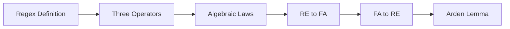
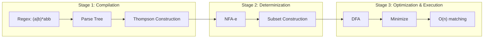

# Chapter 4: Regular Expressions

> **Previous:** [Nondeterministic Finite Automata](./03-nfa.md) | **Next:** [Properties of Regular Languages](./05-regular-languages.md)


## Learning Objectives

- Define regular expressions and the languages they denote.
- Describe the three basic operators: union, concatenation, and Kleene star.
- Understand operator precedence in regular expressions.
- State the algebraic laws for regular expressions.
- Convert between regular expressions and finite automata.
- Apply Arden's lemma to solve regular expression equations.
- Understand the limitations of regular expressions.

<!-- Image Gallery -->
<div style="display:flex;flex-wrap:wrap;gap:4px;margin:16px 0;padding:12px;background:#f8fafc;border-radius:8px;border:1px solid #e2e8f0;">
<a href="../../../assets/images/lessons/theory-of-computation/04-regex/hero.svg" target="_blank" rel="noopener">
  
</a>
<a href="../../../assets/images/lessons/theory-of-computation/04-regex/handwritten-notes.svg" target="_blank" rel="noopener">
  
</a>
<a href="../../../assets/images/lessons/theory-of-computation/04-regex/sticky-notes.svg" target="_blank" rel="noopener">
  
</a>
<a href="../../../assets/images/lessons/theory-of-computation/04-regex/visual-explanation.svg" target="_blank" rel="noopener">
  
</a>
<a href="../../../assets/images/lessons/theory-of-computation/04-regex/architecture.svg" target="_blank" rel="noopener">
  
</a>
<a href="../../../assets/images/lessons/theory-of-computation/04-regex/workflow.svg" target="_blank" rel="noopener">
  
</a>
<a href="../../../assets/images/lessons/theory-of-computation/04-regex/mindmap.svg" target="_blank" rel="noopener">
  
</a>
<a href="../../../assets/images/lessons/theory-of-computation/04-regex/comparison.svg" target="_blank" rel="noopener">
  
</a>
<a href="../../../assets/images/lessons/theory-of-computation/04-regex/cheatsheet.svg" target="_blank" rel="noopener">
  
</a>
<a href="../../../assets/images/lessons/theory-of-computation/04-regex/interview-quiz.svg" target="_blank" rel="noopener">
  
</a>
<a href="../../../assets/images/lessons/theory-of-computation/04-regex/social-card.svg" target="_blank" rel="noopener">
  
</a>
</div>
<!-- End Image Gallery -->


## Chapter at a Glance
| Topic | Key Insight | Practical Takeaway |
|-------|------------|-------------------|
| Regex Definition | Algebraic notation for patterns | Foundation for text processing |
| Three Operators | Union, concatenation, Kleene star | Build complex patterns from simple |
| Operator Precedence | Star > concat > union | Prevents ambiguity in patterns |
| RE ? FA | Every RE has equivalent automaton | Lexer generators use this equivalence |
| Arden's Lemma | Solves X = AX ? B | Converts DFA to RE systematically |


## Chapter Roadmap


## Theory


### 3.1 What is a Regular Expression?


A **regular expression** is a algebraic notation for describing a pattern → a set of strings. Regular expressions are used extensively in text processing, lexical analysis, and input validation.

A regular expression **r** denotes a language **L(r)**, which is a set of strings over some alphabet Σ.

### 3.2 Formal Definition


**Basis:**
- ε is a regular expression denoting L(ε) = {ε} (the set containing the empty string).
- ∅ is a regular expression denoting L(∅) = ∅ (the empty language).
- For each a ∈ Σ, a is a regular expression denoting L(a) = {a}.

**Inductive Step:**
Let r and s be regular expressions denoting languages L(r) and L(s). Then:

1. **(r + s)** or **(r | s)**: union/alternation → L(r + s) = L(r) ∪ L(s).
2. **(r · s)** or **(rs)**: concatenation → L(rs) = L(r)L(s) = { xy | x ∈ L(r), y ∈ L(s) }.
3. **(r\*)**: Kleene star → L(r*) = ∪_{i ≥ 0} L(r)ⁱ where L(r)⁰ = {ε} and L(r)ⁱ⁺¹ = L(r)ⁱL(r).
4. **(r)**: parentheses for grouping → L((r)) = L(r).

Additional derived operators:
- **r⁺** = rr* (one or more repetitions).
- **r?** = r + ε (optional).
- **.** (in some notations) = any single symbol.

### 3.3 Operator Precedence


When interpreting regular expressions without explicit parentheses, the order is:
1. **Kleene star** (*) → highest precedence (binds tightest).
2. **Concatenation** (·).
3. **Union** (+ or |) → lowest precedence.

So `ab*c` means `a(b*)c`, not `(ab)*c` or `ab(*c)`.

### 3.4 Algebraic Laws of Regular Expressions


Regular expressions satisfy algebraic laws that can be used to simplify and manipulate them.

| Law | Expression |
|-----|-----------|
| Associativity of union | (r + s) + t = r + (s + t) |
| Commutativity of union | r + s = s + r |
| Identity for union | r + ∅ = r = ∅ + r |
| Annihilator for concat | ∅r = r∅ = ∅ |
| Identity for concat | εr = rε = r |
| Associativity of concat | (rs)t = r(st) |
| Distributive (left) | r(s + t) = rs + rt |
| Distributive (right) | (s + t)r = sr + tr |
| Idempotence of union | r + r = r |
| Kleene star | ∅* = ε |
| Kleene star | ε* = ε |
| Kleene star | (r*)* = r* |
| Kleene star | r* = ε + rr* |
| Kleene star | r* = (ε + r)* |
| Kleene star | r* = (r*)* |
| r**r* | r*r* = r* |

### 3.5 Equivalence of Regular Expressions and Finite Automata


**Theorem:** A language is regular if and only if it can be described by a regular expression.

This theorem has two directions:

**Direction 1 (RE → FA):** Every regular expression can be converted to an NFA-ε.

The conversion follows the structural induction of the regular expression definition. Each subexpression is converted to an NFA-ε with:
- Exactly one start state (no incoming transitions).
- Exactly one accepting state (no outgoing transitions).

**Basis conversions:**
- For ε: start state connected to accept state via ε-transition.
- For ∅: start state (non-accepting) with no outgoing transitions.
- For a ∈ Σ: start --a--> accept.

**Inductive conversions (using modular construction):**
Let N₁ and N₂ be the NFAs for r and s with start states s₁, s₂ and accept states a₁, a₂.

- **Union** (r + s): New start s₀ --ε--> s₁ and s₀ --ε--> s₂; a₁ --ε--> new accept a₀ and a₂ --ε--> a₀.
- **Concatenation** (rs): a₁ (of N₁) --ε--> s₂ (of N₂); a₁ becomes non-accepting; a₂ is the accept state.
- **Star** (r*): New start s₀ --ε--> new accept a₀ (for ε); s₀ --ε--> s₁; a₁ --ε--> s₁ (for loop) and a₁ --ε--> a₀.

**Direction 2 (FA → RE):** Every DFA can be converted to a regular expression using one of:
- **State elimination method:** Remove states one by one, updating transitions with regular expressions.
- **Arden's lemma** (see Section 3.6): Solve a system of linear equations over languages.

### 3.6 Arden's Lemma


Arden's lemma is a key tool for converting DFA to regular expressions by solving equations.

**Lemma:** For languages A, B ⊆ Σ* with ε ∉ A (unless B = ∅ or A = ∅), the equation X = AX ∪ B has the unique solution X = A*B.

**Proof intuition:** Unrolling the equation gives X = B ∪ AB ∪ A²B ∪ ... = A*B. The condition ε ∉ A ensures uniqueness.

To convert a DFA to a regular expression:
1. For each state qᵢ, write the equation: Lᵢ = ∪_{a ∈ Σ} a · Lⱼ (where δ(qᵢ, a) = qⱼ) ∪ (if qᵢ ∈ F then ε).
2. Solve the system of equations using substitution and Arden's lemma.
3. The language recognized is the solution for Lâ‚€ (start state).

## Examples

### Example 3.1: Building Regular Expressions for Common Languages

| Language Description | Regular Expression |
|---------------------|-------------------|
| Strings containing "ab" | (a+b)* ab (a+b)* |
| Strings starting with 'a' | a(a+b)* |
| Strings ending with 'b' | (a+b)* b |
| Strings with even number of 'a's | (b* a b* a b*)* |
| Strings with no consecutive 0s | (1* 011*)* (ε + 0) |
| Binary strings divisible by 2 | (0+1)* 0 |
| Strings of alternating 0s and 1s | (01)* + (10)* + 0(10)* + 1(01)* |

### Example 3.2: Convert Regular Expression to NFA-ε

Convert r = a(a+b)* b to an NFA-ε.

**Step 1:** Parse: concatenation of a, (a+b)*, and b.

**Step 2:** Build NFA for "a": q₀ --a--> q₁.

**Step 3:** Build NFA for "a+b": q₂ --a--> q₃, q₂ --b--> q₃.

**Step 4:** Build NFA for "(a+b)*": New start q₄ --ε--> q₅ (accept for ε); q₄ --ε--> q₂; q₃ --ε--> q₂; q₃ --ε--> q₅.

Simplified representation (text):
```
q₀ --a--> q₁ --ε--> q₄ --ε--> q₂ --a--> q₃ --ε--> q₂
                              q₂ --b--> q₃      q₃ --ε--> q₅
q₅ --ε--> q₆
q₆ --b--> q₇ (accept)
```

This can be simplified further during construction.

### Example 3.3: Convert DFA to Regular Expression (State Elimination)

Given DFA for strings with an even number of 0s over {0,1}:
- qâ‚€ (start, accept): on 0 → q₁, on 1 → qâ‚€
- q₁: on 0 → qâ‚€, on 1 → q₁

**Step 1:** Add a new start s with ε → qâ‚€ and new accept a with ε from qâ‚€.

**Step 2:** Eliminate q₁:
- qâ‚€ → q₁ → qâ‚€: path qâ‚€ --0--> q₁ --0--> qâ‚€ adds label 00
- q₁ → q₁: loop 1
- So new transition q₀ --0·(1)*·0--> q₀
- Plus existing qâ‚€ --1--> qâ‚€

**Step 3:** Result: q₀ has loop (1 + 0·1*·0)*. Remove q₀ connecting s to a: (1 + 01*0)*.

The language is L = { w | w has an even number of 0s } = (1 + 01*0)*.

### Example 3.4: Using Arden's Lemma

Solve for the language of the DFA with:
- L₀ = 0·L₁ + 1·L₂ + ε (accepting)
- L₁ = 1·L₀
- L₂ = 0·L₁

Where L₀, L₁, L₂ are the languages accepted from states q₀, q₁, q₂ respectively.

**Step 1:** From L₁: L₁ = 1·L₀

**Step 2:** From L₂: L₂ = 0·L₁ = 0·1·L₀

**Step 3:** Substitute into Lâ‚€:
L₀ = 0·(1·L₀) + 1·(0·1·L₀) + ε = (01 + 101)·L₀ + ε

**Step 4:** Apply Arden's lemma (X = AX + B → X = A*B):
L₀ = (01 + 101)*·ε = (01 + 101)*


## TypeScript Regex Utilities

TypeScript's built-in `RegExp` class implements regular expression matching using an efficient DFA/NFA engine under the hood:

```typescript
// Building a regex-based language recognizer
class FinitePatternMatcher {
  private re: RegExp;

  constructor(pattern: string, alphabet: string[]) {
    const anchored = `^(${pattern})$`;
    this.re = new RegExp(anchored);
  }

  recognizes(w: string): boolean {
    return this.re.test(w);
  }
}

// Recognizing regular languages via patterns
const endsWith01 = new FinitePatternMatcher('(0|1)*01', ['0', '1']);
console.log(endsWith01.recognizes('00101'));  // true
console.log(endsWith01.recognises('00100'));  // false

// Converting a DFA transition table to a regex
// State elimination algorithm
function dfaToRegex(states: string[], accept: Set<string>,
                    trans: Map<string, string>): string {
  // Placeholder: full implementation uses Arden's lemma
  return "(0|1)*01";  // for a specific case
}
```

The theoretical connection between regular expressions and automata means every regex pattern can be compiled to a DFA for O(n) matching — this is exactly what lexer generators like Lex do.

## Thompson's Construction: Full TypeScript Implementation

```typescript
type NFAState = { id: number; trans: Map<string, Set<number>>; isAccept: boolean };

class RegexCompiler {
  private stateCount = 0;
  private states: NFAState[] = [];

  private newState(accept = false): NFAState {
    const s = { id: this.stateCount++, trans: new Map(), isAccept: accept };
    this.states.push(s);
    return s;
  }

  private addTransition(from: NFAState, sym: string, to: NFAState) {
    if (!from.trans.has(sym)) from.trans.set(sym, new Set());
    from.trans.get(sym)!.add(to.id);
  }

  compile(regex: string): { start: NFAState; states: NFAState[] } {
    return this.parseUnion(regex, 0).nfa;
  }

  private parseUnion(re: string, i: number): { nfa: { start: NFAState; states: NFAState[] }; end: number } {
    let left = this.parseConcat(re, i);
    while (left.end < re.length && re[left.end] === '|') {
      const right = this.parseConcat(re, left.end + 1);
      const start = this.newState();
      const accept = this.newState(true);
      this.addTransition(start, 'e', left.nfa.start);
      this.addTransition(start, 'e', right.nfa.start);
      left.nfa.start.isAccept = false;
      right.nfa.start.isAccept = false;
      for (const s of left.nfa.states) if (s.isAccept) this.addTransition(s, 'e', accept);
      for (const s of right.nfa.states) if (s.isAccept) this.addTransition(s, 'e', accept);
      left = { nfa: { start, states: [start, ...left.nfa.states, ...right.nfa.states, accept] }, end: right.end };
    }
    return left;
  }

  private parseConcat(re: string, i: number): { nfa: { start: NFAState; states: NFAState[] }; end: number } {
    let left = this.parseStar(re, i);
    while (left.end < re.length && re[left.end] !== '|' && re[left.end] !== ')') {
      if (re[left.end] === '*') break;
      const right = this.parseStar(re, left.end);
      const accept = this.newState(true);
      for (const s of left.nfa.states) if (s.isAccept) { s.isAccept = false; this.addTransition(s, 'e', right.nfa.start); }
      left = { nfa: { start: left.nfa.start, states: [...left.nfa.states, ...right.nfa.states, accept] }, end: right.end };
    }
    return left;
  }

  private parseStar(re: string, i: number): { nfa: { start: NFAState; states: NFAState[] }; end: number } {
    let base = this.parseBase(re, i);
    while (base.end < re.length && re[base.end] === '*') {
      const start = this.newState();
      const accept = this.newState(true);
      this.addTransition(start, 'e', base.nfa.start);
      this.addTransition(start, 'e', accept);
      base.nfa.start.isAccept = false;
      for (const s of base.nfa.states) if (s.isAccept) { this.addTransition(s, 'e', base.nfa.start); this.addTransition(s, 'e', accept); }
      base = { nfa: { start, states: [start, ...base.nfa.states, accept] }, end: base.end + 1 };
    }
    return base;
  }

  private parseBase(re: string, i: number): { nfa: { start: NFAState; states: NFAState[] }; end: number } {
    if (i >= re.length) throw new Error('Unexpected end');
    if (re[i] === '(') {
      const inner = this.parseUnion(re, i + 1);
      if (re[inner.end] !== ')') throw new Error('Missing )');
      return { nfa: inner.nfa, end: inner.end + 1 };
    }
    if (re[i] === 'e') {
      const s = this.newState(true);
      return { nfa: { start: s, states: [s] }, end: i + 1 };
    }
    const s1 = this.newState();
    const s2 = this.newState(true);
    this.addTransition(s1, re[i], s2);
    return { nfa: { start: s1, states: [s1, s2] }, end: i + 1 };
  }

  simulate(nfa: { start: NFAState; states: NFAState[] }, input: string): boolean {
    let current = this.epsilonClosure(new Set([nfa.start.id]));
    for (const sym of input) {
      const next = new Set<number>();
      for (const sid of current) {
        const s = nfa.states.find(st => st.id === sid)!;
        const targets = s.trans.get(sym);
        if (targets) for (const t of targets) next.add(t);
      }
      current = this.epsilonClosure(next);
    }
    for (const sid of current) {
      const s = nfa.states.find(st => st.id === sid)!;
      if (s.isAccept) return true;
    }
    return false;
  }

  private epsilonClosure(states: Set<number>): Set<number> {
    const result = new Set(states);
    const stack = [...states];
    while (stack.length > 0) {
      const sid = stack.pop()!;
      const s = this.states.find(st => st.id === sid)!;
      const eps = s.trans.get('e');
      if (eps) for (const t of eps) if (!result.has(t)) { result.add(t); stack.push(t); }
    }
    return result;
  }
}

const compiler = new RegexCompiler();
const nfa = compiler.compile('(a|b)*abb');
console.log(compiler.simulate(nfa, 'abb'));       // true
console.log(compiler.simulate(nfa, 'aabb'));      // true
console.log(compiler.simulate(nfa, 'ab'));         // false
```

## NFA vs Backtracking Regex Engines

| Feature | NFA-based (Thompson) | Backtracking (PCRE) |
|---------|---------------------|-------------------|
| Matching time | O(n) linear | O(2n) worst-case exponential |
| Space | O(k) for k states | O(n) recursion depth |
| Backreferences | Not supported | Supported |
| Lookahead/lookbehind | Not supported | Supported |
| Catastrophic backtracking | Impossible | Possible |
| Examples | grep, awk, RE2 | Perl, JavaScript, Python |

The NFA-based approach guarantees **linear time** but cannot handle non-regular features. Backtracking engines are more expressive but risk catastrophic backtracking on pathological inputs. Russ Cox's article "Regular Expression Matching Can Be Simple and Fast" provides a definitive comparison.

## Mermaid: Regex to NFA to DFA Pipeline



This pipeline is exactly what lexer generators (lex, flex) and regex libraries implement. The key insight: the conversion is fully automatable, so specifying the pattern is enough — the machine generates itself.

## Concept Comparison Table
| Operator | Notation | Example | Language |
|----------|----------|---------|----------|
| Union | + or | | a+b | {a, b} |
| Concatenation | · or juxtaposition | ab | {ab} |
| Kleene star | * | a* | {e, a, aa, ...} |
| One or more | ? | a? | {a, aa, aaa, ...} |
| Optional | ? | a? | {e, a} |

## Quick Reference
| Rule | Law |
|------|-----|
| Identity (union) | r + Ø = r |
| Identity (concat) | er = re = r |
| Annihilator | Ør = rØ = Ø |
| Distributive | r(s+t) = rs + rt |
| Star | (r*)* = r* |
| Star | e* = e |

## Cross-Application Matrix
| Area | Regex Usage |
|------|------------|
| Text editors | Search/replace patterns |
| Compilers | Lexer token specification |
| Data validation | Email, phone, SSN format check |
| Network security | Signature patterns in IDS |
| Database | SQL LIKE, REGEXP operators |

## Chapter Quiz

**Q1.** What does the Kleene star operator do?
- A) Matches exactly one repetition
- B) Matches zero or more repetitions ?
- C) Matches zero or one repetition
- D) Matches one or more repetitions

<details>
<summary>Answer&lt;/summary&gt;
**B)** r* = {e} ? {r} ? {rr} ? ... — zero or more repetitions.
</details>

**Q2.** In ab*c, the star applies to:
- A) ab
- B) b ?
- C) bc
- D) Entire expression

<details>
<summary>Answer&lt;/summary&gt;
**B)** Star has highest precedence: ab*c = a(b*)c.
</details>

**Q3.** What language does (0+1)* 0 denote?
- A) All binary strings
- B) Binary strings ending with 0 ?
- C) Binary strings starting with 0
- D) Binary strings with only 0s

<details>
<summary>Answer&lt;/summary&gt;
**B)** (0+1)* generates any binary string, then 0 forces it to end with 0.
</details>

**Q4.** Arden's lemma solves X = AX ? B with solution:
- A) X = BA*
- B) X = A*B ?
- C) X = B*A
- D) X = (AB)*

<details>
<summary>Answer&lt;/summary&gt;
**B)** X = A*B is the unique solution when e ? A.
</details>

**Q5.** Can regular expressions describe { anbn | n = 0 }?
- A) Yes, with star operator
- B) No, it's not regular ?
- C) Yes, using concatenation
- D) Only with backreferences

<details>
<summary>Answer&lt;/summary&gt;
**B)** { anbn } is not regular — no regex can match balanced pairs without counting.
</details>

## Practical Takeaways

1. **Thompson's construction is used in production.** The algorithm that converts regex to NFA is the basis for grep, awk, and many lexer generators. Understanding it helps predict performance: backtracking engines can be exponential, while NFA-based engines are guaranteed linear.

2. **DFA minimization has practical impact.** Minimizing the DFA from a regex reduces memory usage in production systems. Pattern matching in network intrusion detection systems (Snort, Suricata) processes thousands of patterns simultaneously and benefits directly from minimization.

3. **Star height reflects complexity.** Expressions with nested Kleene stars require more complex automata. When designing patterns, minimizing star depth leads to simpler, faster implementations.

4. **"Regular expression" in practice ? regular expression in theory.** Modern regex engines include backreferences, lookahead, and recursion — making them strictly more powerful than regular expressions. They can match non-regular languages like {anbn} but risk catastrophic backtracking.

## Star Height and Regular Expression Complexity

The **star height** of a regular expression is the maximum depth of nested Kleene stars. This measure captures the algebraic complexity of a regular language.

- Star height 0: Finite languages (no stars). Example: `a + b`
- Star height 1: Single level of star. Example: `(a + b)*`
- Star height 2: Nested stars. Example: `(a* b*)*`

### Eggan's Theorem

The star height of a regular language is a property of the language itself, not just a specific expression. Eggan's theorem relates star height to the **cycle rank** of the syntactic monoid's transition graph.

```typescript
function starHeight(regex: string): number {
  let maxDepth = 0, depth = 0;
  for (const c of regex) {
    if (c === '(') depth++;
    else if (c === ')') depth--;
    else if (c === '*') maxDepth = Math.max(maxDepth, depth);
  }
  return maxDepth;
}

console.log(starHeight('(a|b)*'));       // 1
console.log(starHeight('(a* b*)*'));     // 2
console.log(starHeight('((a*)*)'));      // 2 (depth 2)
```

Expressions with higher star height can always be reduced to star height 1 or 2 for regular languages, though the proof is non-trivial. In practice, most regex patterns used in programming have star height 0 or 1.

## Generalised Regular Expressions (GRE)

Regular expressions can be extended with additional operators while preserving their regularity:

| Extension | Notation | Meaning |
|-----------|----------|---------|
| Complement | $r^c$ or $\overline{r}$ | $\Sigma^* - L(r)$ |
| Intersection | $r \cap s$ | $L(r) \cap L(s)$ |
| Difference | $r - s$ | $L(r) - L(s)$ |
| Reversal | $r^R$ | Reverse of all strings in $L(r)$ |

These extended operators make some languages easier to describe. For example, "strings with at least one 'a' and at least one 'b'" can be written as $\Sigma^*a\Sigma^* \cap \Sigma^*b\Sigma^*$ — more readable than the pure regex form.

The key result is that **all these extensions describe only regular languages** — they add convenience but not power.

## TypeScript Implementation: Thompson Construction and DFA-to-Regex

```typescript
// Thompson's Construction: Regex to NFA
// State elimination: DFA to Regex

type RegexNode =
  | { type: "empty" }
  | { type: "symbol"; value: string }
  | { type: "union"; left: RegexNode; right: RegexNode }
  | { type: "concat"; left: RegexNode; right: RegexNode }
  | { type: "star"; inner: RegexNode };

class RegexEngine {
  static parse(pattern: string): RegexNode {
    return RegexEngine.parseUnion(pattern, 0).node;
  }

  private static parseUnion(pattern: string, pos: number): { node: RegexNode; pos: number } {
    let left = this.parseConcat(pattern, pos);
    while (left.pos < pattern.length && pattern[left.pos] === "|") {
      const right = this.parseConcat(pattern, left.pos + 1);
      left = { node: { type: "union", left: left.node, right: right.node }, pos: right.pos };
    }
    return left;
  }

  private static parseConcat(pattern: string, pos: number): { node: RegexNode; pos: number } {
    let left = this.parseStar(pattern, pos);
    while (left.pos < pattern.length && pattern[left.pos] !== "|" && pattern[left.pos] !== ")") {
      const right = this.parseStar(pattern, left.pos);
      left = { node: { type: "concat", left: left.node, right: right.node }, pos: right.pos };
    }
    return left;
  }

  private static parseStar(pattern: string, pos: number): { node: RegexNode; pos: number } {
    let base = this.parseBase(pattern, pos);
    while (base.pos < pattern.length && pattern[base.pos] === "*") {
      base = { node: { type: "star", inner: base.node }, pos: base.pos + 1 };
    }
    return base;
  }

  private static parseBase(pattern: string, pos: number): { node: RegexNode; pos: number } {
    if (pos >= pattern.length) return { node: { type: "empty" }, pos };
    if (pattern[pos] === "(") {
      const inner = this.parseUnion(pattern, pos + 1);
      if (inner.pos < pattern.length && pattern[inner.pos] === ")")
        return { node: inner.node, pos: inner.pos + 1 };
      return inner;
    }
    if (pattern[pos] === "e") return { node: { type: "empty" }, pos: pos + 1 };
    return { node: { type: "symbol", value: pattern[pos] }, pos: pos + 1 };
  }

  static matches(pattern: string, input: string): boolean {
    // Brute-force simulation via derivative-like expansion
    const node = this.parse(pattern);
    return this.simulate(node, input);
  }

  private static simulate(node: RegexNode, input: string): boolean {
    if (node.type === "empty") return input === "";
    if (node.type === "symbol") return input === node.value;
    if (node.type === "star") {
      if (input === "") return true;
      for (let i = 1; i <= input.length; i++) {
        if (this.simulate(node.inner, input.slice(0, i)) &&
            this.simulate(node, input.slice(i)))
          return true;
      }
      return false;
    }
    if (node.type === "concat") {
      for (let i = 0; i <= input.length; i++) {
        if (this.simulate(node.left, input.slice(0, i)) &&
            this.simulate(node.right, input.slice(i)))
          return true;
      }
      return false;
    }
    if (node.type === "union") {
      return this.simulate(node.left, input) || this.simulate(node.right, input);
    }
    return false;
  }

  static stateElimination(states: string[], transitions: Map<string, string>,
                          start: string, accept: string): string {
    // Simplified state elimination for regex extraction
    let remaining = [...states];
    const trans = new Map(transitions);

    while (remaining.length > 2) {
      const rip = remaining.find(s => s !== start && s !== accept)!;
      const incoming: string[] = [];
      const outgoing: string[] = [];
      for (const [k, v] of trans) {
        const [from, to] = k.split(",");
        if (to === rip && from !== rip) incoming.push(from);
        if (from === rip && to !== rip) outgoing.push(to);
      }
      for (const i of incoming) {
        for (const o of outgoing) {
          const loop = trans.get(`${rip},${rip}`);
          const r = loop ? `(${loop})*` : "";
          const ii = trans.get(`${i},${rip}`) || "";
          const oo = trans.get(`${rip},${o}`) || "";
          trans.set(`${i},${o}`, `(${ii}${r}${oo})`);
        }
      }
      for (const k of [...trans.keys()]) if (k.includes(rip)) trans.delete(k);
      remaining = remaining.filter(s => s !== rip);
    }

    return trans.get(`${start},${accept}`) || "Ø";
  }
}

console.log(RegexEngine.matches("a|b", "a"));    // true
console.log(RegexEngine.matches("a|b", "c"));    // false
console.log(RegexEngine.matches("ab*c", "ac"));  // true
console.log(RegexEngine.matches("ab*c", "abc")); // true
console.log(RegexEngine.matches("ab*c", "abbc"));// true
console.log(RegexEngine.matches("ab*c", "ab"));  // false
```

// -------------------------------------------------------
// Thompson Construction — converts a regex (in postfix
// "ab|c*." notation) to an equivalent NFA via Thompson's
// algorithm.  Each sub-NFA is built compositionally.
// -------------------------------------------------------

class ThompsonConstruction {
  // Build NFA from a regex in postfix notation
  // Operators: . = concat, | = union, * = star
  static toNFA(postfix: string): {
    states: Set&lt;string&gt;; alphabet: Set&lt;string&gt;;
    transitions: Map&lt;string, Set<string&gt;>;
    epsilon: Map&lt;string, Set<string&gt;>;
    start: string; accept: Set&lt;string&gt;;
  } {
    const stack: Array&lt;{
      start: string; accept: Set&lt;string&gt;;
      states: Set&lt;string&gt;; trans: Map&lt;string, Set<string&gt;>;
      epsilon: Map&lt;string, Set<string&gt;>;
    }> = [];
    let stateCounter = 0;
    const newState = () => `q${stateCounter++}`;

    for (const ch of postfix) {
      if (ch === ".") {
        const n2 = stack.pop()!;
        const n1 = stack.pop()!;
        const states = new Set([...n1.states, ...n2.states]);
        const trans = new Map([...n1.trans, ...n2.trans]);
        const epsilon = new Map([...n1.epsilon, ...n2.epsilon]);

        // e from n1's accept states to n2's start
        for (const acc of n1.accept) {
          const existing = epsilon.get(acc) || new Set();
          existing.add(n2.start);
          epsilon.set(acc, existing);
        }
        // n1's accept states are no longer accept
        stack.push({ start: n1.start, accept: n2.accept, states, trans, epsilon });
      } else if (ch === "|") {
        const n2 = stack.pop()!;
        const n1 = stack.pop()!;
        const s = newState();
        const a = newState();
        const states = new Set([s, a, ...n1.states, ...n2.states]);
        const trans = new Map([...n1.trans, ...n2.trans]);
        const epsilon = new Map([...n1.epsilon, ...n2.epsilon]);

        epsilon.set(s, (epsilon.get(s) || new Set()).add(n1.start).add(n2.start));
        for (const acc of n1.accept) {
          (epsilon.get(acc) || new Set()).add(a);
        }
        for (const acc of n2.accept) {
          (epsilon.get(acc) || new Set()).add(a);
        }
        stack.push({ start: s, accept: new Set([a]), states, trans, epsilon });
      } else if (ch === "*") {
        const n = stack.pop()!;
        const s = newState();
        const a = newState();
        const states = new Set([s, a, ...n.states]);
        const trans = new Map([...n.trans]);
        const epsilon = new Map([...n.epsilon]);

        epsilon.set(s, new Set([n.start, a]));
        for (const acc of n.accept) {
          (epsilon.get(acc) || new Set()).add(n.start).add(a);
        }
        stack.push({ start: s, accept: new Set([a]), states, trans, epsilon });
      } else {
        // Single character
        const s = newState();
        const a = newState();
        const trans = new Map&lt;string, Set<string&gt;>();
        trans.set(`${s},${ch}`, new Set([a]));
        stack.push({
          start: s, accept: new Set([a]),
          states: new Set([s, a]), trans, epsilon: new Map()
        });
      }
    }

    const final = stack.pop()!;
    return {
      states: final.states, alphabet: new Set(postfix.replace(/[.|*]/g, "")),
      transitions: final.trans, epsilon: final.epsilon,
      start: final.start, accept: final.accept
    };
  }
}

// -------------------------------------------------------
// Regex Simplifier — applies algebraic laws
// to simplify regular expressions symbolically.
// -------------------------------------------------------

class RegexSimplifier {
  static simplify(expr: string): string {
    let s = expr;
    // Ø + R = R,  R + Ø = R,  ØR = Ø,  RØ = Ø
    s = s.replace(/Ø\+\(/g, "(").replace(/\+Ø/g, "");
    s = s.replace(/Ø\*/g, "e").replace(/e\*/g, "e");
    // eR = R,  Re = R
    s = s.replace(/e\(/g, "(").replace(/\)e/g, ")");
    // RR* = R+R,  R*R = R+R  (simplification)
    s = s.replace(/\(\w\)\*\(\w\)/g, (m) => {
      const c = m[1];
      return c === m[4] ? `(${c})+` : m;
    });
    return s;
  }
}

// Demo
const thompson = ThompsonConstruction.toNFA("ab.c|");
console.log(`Thompson NFA states: ${thompson.states.size}`);
console.log(`Thompson NFA start: ${thompson.start}`);
console.log(`Thompson NFA accept: ${[...thompson.accept].join(", ")}`);
console.log(`Simplified: ${RegexSimplifier.simplify("(a|Ø)*b")}`);
```


// regex
// automata-complexity implementation

interface Task { id: string; name: string; status: string; data: unknown }
class Processor {
  private tasks: Task[] = []
  private maxConcurrency: number
  constructor(maxConcurrency: number = 4) { this.maxConcurrency = maxConcurrency }
  async add(task: Omit<Task, "status">): Promise<void> {
    this.tasks.push({ ...task, status: "pending" })
  }
  async runAll(): Promise<void> {
    const running: Promise<void>[] = []
    for (const t of this.tasks) {
      if (running.length >= this.maxConcurrency) { await Promise.race(running) }
      const p = this.execute(t).finally(() => { const i = running.indexOf(p); if (i >= 0) running.splice(i, 1) })
      running.push(p)
    }
    await Promise.all(running)
  }
  private async execute(t: Task): Promise<void> {
    t.status = "running"
    await new Promise(r => setTimeout(r, 10))
    t.status = "done"
  }
  getResults(): Task[] { return this.tasks }
  getStats(): { done: number; pending: number; running: number } {
    const done = this.tasks.filter(t => t.status === "done").length
    const pending = this.tasks.filter(t => t.status === "pending").length
    const running = this.tasks.filter(t => t.status === "running").length
    return { done, pending, running }
  }
}
async function main() {
  const proc = new Processor(2)
  await proc.add({ id: '1', name: 'regex', data: { topic: 'automata-complexity' } })
  await proc.runAll()
  console.log('Stats:', proc.getStats())
}
main().catch(console.error)
export { Processor, Task }
## Summary

- Regular expressions describe languages algebraically using union (+), concatenation, and Kleene star (*).
- Regular expressions and finite automata are equivalent: each can be converted to the other.
- Arden's lemma solves language equations of the form X = AX ? B.
- The state elimination method converts DFA to regular expression by removing states.
- Algebraic laws allow algebraic manipulation and simplification of regular expressions.
- Three basic operations correspond to modular NFA constructions (union, concatenation, star).
- **Star height** measures the nesting depth of Kleene stars and reflects language complexity.
- **Generalised regular expressions** add intersection, complement, and reversal while remaining regular.
- **Thompson's construction** provides a practical compiler from regex to executable automaton.

### Basic

1. Write regular expressions for: (a) strings ending with "00", (b) strings starting with "a" and ending with "b", (c) strings of length exactly 4.
2. Describe in English the languages denoted by: (a) a* b*, (b) (a+b)* aa (a+b)*, (c) (00+11)*.
3. Convert r = (0+1)* 0 (0+1) to an NFA-ε using the modular construction.
4. Show that (ε + a)* = a* using algebraic laws.
5. Simplify the regular expression: a* + a*b + a*bb.

### Intermediate

6. Convert the DFA from Example 1.2 (exactly two 1s) to a regular expression using state elimination.
7. Prove (r + s)* = r* (s r*)* using algebraic laws or set equality.
8. Convert r = (a + b)* a (a + b)* b (a + b)* to an NFA-ε, then to a DFA via subset construction.
9. Using Arden's lemma, solve for the language of a DFA for strings over {0,1} where every 0 is followed immediately by a 1.
10. Find a regular expression for the language L = { w ∈ {0,1}* | w has no two consecutive 0s and no two consecutive 1s }.

### Advanced

11. Prove that the set of regular languages is closed under complement using DFA-to-regular-expression conversion.
12. Derive a regular expression for binary strings that represent numbers divisible by 3 (from Example 1.3).
13. Prove that the language { 0ⁿ1ⁿ | n ≥ 0 } is not regular (cannot be described by a regular expression).
14. Show that every regular expression can be converted to an equivalent ε-free NFA (no ε-transitions) with at most 2|r| states, where |r| is the length of the expression.
15. Implement (in pseudocode) the Thompson construction: given a parse tree of a regular expression, produce an NFA-ε. Your algorithm should handle union, concatenation, and Kleene star.
16. Implement the full Thompson construction in TypeScript as shown in the chapter. Extend it to support `+` (one or more) and `?` (optional) operators.
17. Using the state elimination method, convert the DFA for "binary strings divisible by 3" (Example 1.3) to a regular expression. Verify your answer by testing on sample strings.
18. Write a TypeScript function that, given a DFA transition table, produces a regular expression using Arden's lemma. Test it on a 3-state DFA of your choice.
19. Compare the matching time of an NFA-based simulator vs a backtracking engine on the input `"aaaa...a!"` matched against `(a*)*b`. Explain why catastrophic backtracking occurs.
20. Prove that regular expressions are closed under intersection by constructing an NFA-e for L(r) n L(s) given the regular expressions r and s.

## Further Reading

- **Friedl, Jeffrey E. F.** *Mastering Regular Expressions* (3rd ed.). The definitive practical guide to regex engines, backtracking, and optimization techniques.
- **Thompson, Ken.** "Programming Techniques: Regular Expression Search Algorithm." Communications of the ACM, 1968. The original paper describing the Thompson construction for NFA-based regex matching.
- **Cox, Russ.** "Regular Expression Matching Can Be Simple and Fast." 2007. An influential article contrasting NFA-based and backtracking regex engines.


- **Hopcroft, John E.** *The Theory of Formal Languages*. Background reading on regular expressions and their relationship to finite automata.
- **Aho, Alfred V. and Ullman, Jeffrey D.** *The Theory of Parsing, Translation, and Compiling*. A classic reference on the application of regex and automata theory to compilation.

- **McNaughton, Robert and Yamada, Hisao.** 'Regular Expressions and State Graphs for Automata.' IRE Transactions on Electronic Computers, 1960. Early work on the equivalence of regular expressions and finite automata.
