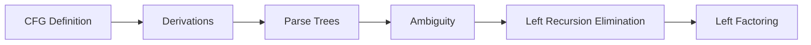

# Chapter 5: Context-Free Grammars

> **Previous:** [Properties of Regular Languages](./04-regular-languages.md) | **Next:** [Pushdown Automata](./06-pda.md)


## Learning Objectives

- Define a context-free grammar (CFG) formally.
- Construct derivations (leftmost, rightmost) and parse trees.
- Determine the language generated by a given CFG.
- Detect and eliminate ambiguity in grammars.
- Eliminate left recursion from CFGs.
- Apply left factoring to CFGs.
- Understand the relationship between CFGs and pushdown automata (preview).


## Chapter at a Glance
| Topic | Key Insight | Practical Takeaway |
|-------|------------|-------------------|
| CFG Definition | 4-tuple (V, Σ, R, S) generative grammar | Describes programming language syntax |
| Derivations | Leftmost/rightmost replacement sequences | Parse trees show structure |
| Ambiguity | Multiple parse trees for one string | Unacceptable in programming languages |
| Left Recursion | A ⇒⁺ Aα breaks top-down parsers | Must eliminate for LL parsing |
| Left Factoring | Common prefixes prevent prediction | Prepares grammar for predictive parsing |


## Chapter Roadmap


## Theory


### 5.1 What is a Context-Free Grammar?

Context-free grammars provide a **generative** description of languages. They are the basis for describing the syntax of most programming languages and are used extensively in compilers.

A CFG consists of:
- A set of **variables** (non-terminals) representing syntactic categories.
- A set of **terminals** representing the basic symbols of the language.
- **Production rules** showing how a variable can be replaced by a string of variables and terminals.
- A designated **start variable**.

### 5.2 Formal Definition

A **context-free grammar** is a 4-tuple G = (V, Σ, R, S) where:

- **V** is a finite set of **variables** (non-terminals), typically uppercase letters.
- **Σ** is a finite set of **terminals** (the alphabet), disjoint from V.
- **R** is a finite set of **productions** (rules) of the form A → α where A ∈ V and α ∈ (V ∪ Σ)*.
- **S ∈ V** is the **start variable**.

The term "context-free" means that a variable can be replaced by its production regardless of the surrounding context (unlike context-sensitive grammars where replacements depend on neighbors).

### 5.3 Derivations

If G has a production A → γ, then we can replace A by γ in any string containing A.

**Definition:** For strings u, v ∈ (V ∪ Σ)*, we write u ⇒ v (u derives v in one step) if:
- u = αAβ and v = αγβ for some production A → γ ∈ R.

We write u ⇒* v if v can be obtained from u by zero or more derivation steps.

The **language generated** by G is:
L(G) = { w ∈ Σ* | S ⇒* w }

### 5.4 Leftmost and Rightmost Derivations

A derivation is **leftmost** if at each step the leftmost remaining variable is replaced. Denoted ⇒ₗ.

A derivation is **rightmost** if at each step the rightmost remaining variable is replaced. Denoted ⇒ᵣ.

For any parse tree, there is exactly one leftmost derivation and exactly one rightmost derivation.

### 5.5 Parse Trees

A **parse tree** (or derivation tree) is a graphical representation of a derivation:
- The root is labeled with the start variable S.
- Each leaf is labeled with a terminal or ε.
- Each interior node is labeled with a variable.
- If node A has children X₁, X₂, …, Xₙ (in order), then A → X₁X₂…Xₙ is a production.
- The yield (leaf string read left to right) gives the derived string.

### 5.6 Ambiguity

A grammar G is **ambiguous** if there exists some string w ∈ L(G) that has two or more distinct parse trees (equivalently, two distinct leftmost derivations).

**Inherent Ambiguity:** A language L is **inherently ambiguous** if every grammar for L is ambiguous. Example: { aⁿbⁿcᵐdᵐ | n,m ≥ 0 } ∪ { aⁿbᵐcᵐdⁿ | n,m ≥ 0 }.

For programming languages, ambiguity is unacceptable — every program must have a unique parse tree. Techniques like **precedence rules** and **associativity** resolve ambiguity in practice.

### 5.7 Left Recursion

A grammar is **left-recursive** if it has a variable A such that A ⇒⁺ Aα for some α. This causes problems for top-down parsers (they may loop infinitely).

**Immediate left recursion:** A → Aα | β (can be eliminated)

**Elimination (simple case):**
Replace A → Aα₁ | Aα₂ | … | Aαₙ | β₁ | β₂ | … | βₘ with:
- A → β₁A' | β₂A' | … | βₘA'
- A' → α₁A' | α₂A' | … | αₙA' | ε

**General left recursion elimination** requires ordering variables and systematically substituting.

### 5.8 Left Factoring

Left factoring is a grammar transformation needed when two productions for the same variable start with the same prefix — this makes prediction difficult for top-down parsers.

**Technique:** If A → αβ₁ | αβ₂, replace with:
- A → αA'
- A' → β₁ | β₂

## Examples

### Example 5.1: CFG for Palindromes

Construct a CFG for PAL = { w ∈ {a,b}* | w = wʀ }.

**Grammar:**
- S → aSa | bSb | ε | a | b

**Derivation** of "abba":
S ⇒ aSa ⇒ abSba ⇒ abbεba = abba

**Parse tree** (text description):
```
      S
    / | \
   a  S  a
    /|\
   b S b
     |
     ε
```

Yield: a b ε b a = abba ✓

### Example 5.2: CFG for Simple Arithmetic Expressions

Generate expressions with + and *, using identifiers (i) and parentheses.

**Grammar:**
- E → E + T | T
- T → T * F | F
- F → (E) | i

This grammar encodes precedence: + is lower than *, which is lower than ().

**Derivation** of "i + i * i":

Leftmost:
E ⇒ E + T ⇒ T + T ⇒ F + T ⇒ i + T ⇒ i + T * F ⇒ i + F * F ⇒ i + i * F ⇒ i + i * i

**Parse tree** (text):
```
      E
    / | \
   E  +  T
   |    /|\
   T   T * F
   |   |   |
   F   F   i
   |   |
   i   i
```

This tree correctly shows i + (i * i), not (i + i) * i.

### Example 5.3: Ambiguity Demonstration

The grammar E → E + E | E * E | (E) | i is ambiguous. The string "i + i * i" has two parse trees:

**Tree 1** (i + (i * i)):
```
    E
  / | \
 E  +  E
 |    /|\
 i   E * E
     |   |
     i   i
```

**Tree 2** ((i + i) * i):
```
      E
    / | \
   E  *  E
  /|\    |
 E + E   i
 |   |
 i   i
```

This ambiguity is resolved in Example 5.2 by introducing T and F to enforce precedence.

### Example 5.4: Eliminating Left Recursion

Original (immediate left recursion):
```
E → E + T | T
T → T * F | F
F → (E) | i
```

Eliminated:
```
E  → T E'
E' → + T E' | ε
T  → F T'
T' → * F T' | ε
F  → (E) | i
```

Now the grammar is suitable for recursive-descent or LL parsing. Derivation of "i + i":
E ⇒ T E' ⇒ F T' E' ⇒ i T' E' ⇒ i ε E' ⇒ i + T E' ⇒ i + F T' E' ⇒ i + i T' E' ⇒ i + i ε ε = i + i

### Example 5.5: CFG for a Simple Programming Language Fragment

```
P  → D ; S
D  → int id | float id
S  → id = E ;
S  → if ( E ) S else S
S  → while ( E ) S
S  → { S S }
E  → E + T | T
T  → T * F | F
F  → (E) | id | num
```

This generates simple programs with declarations, assignments, conditionals, loops, and arithmetic.


## Concept Comparison Table
| Concept | CFG | Regular Expression |
|---------|-----|-------------------|
| Model | Generative (productions) | Descriptive (pattern) |
| Memory | Variables + recursion | None |
| Nested structures | Yes | No |
| Expressiveness | Context-free languages | Regular languages |
| Example | aⁿbⁿ, palindromes | a*b*, (ab)* |

## Quick Reference
| CFG Component | Description |
|--------------|-------------|
| V | Variables (non-terminals) |
| Σ | Terminals (alphabet) |
| R | Productions A → α |
| S | Start variable |
| L(G) | { w ∈ Σ* | S ⇒* w } |

## Cross-Application Matrix
| Domain | CFG Application |
|--------|----------------|
| Compilers | Syntax specification |
| NLP | Sentence parsing |
| Bioinformatics | RNA structure prediction |
| Programming languages | Language design |
| Protocol design | Message format specification |

## Chapter Quiz

**Q1.** A CFG consists of:
- A) 3-tuple
- B) 4-tuple ✓
- C) 5-tuple
- D) 6-tuple

<details>
<summary>Answer</summary>
**B)** CFG is a 4-tuple (V, Σ, R, S): variables, terminals, productions, start.
</details>

**Q2.** What makes a grammar ambiguous?
- A) Left recursion
- B) Multiple parse trees for some string ✓
- C) Too many productions
- D) Missing terminals

<details>
<summary>Answer</summary>
**B)** Ambiguity means at least one string has two or more distinct parse trees.
</details>

**Q3.** Left recursion causes problems for:
- A) Bottom-up parsers
- B) Top-down parsers ✓
- C) All parsers
- D) No parsers

<details>
<summary>Answer</summary>
**B)** Top-down (LL) parsers may loop infinitely on left-recursive grammars.
</details>

**Q4.** Palindromes over {a,b} can be generated by:
- A) A regular expression
- B) A CFG ✓
- C) A DFA
- D) No grammar

<details>
<summary>Answer</summary>
**B)** S → aSa | bSb | ε generates all palindromes — this requires a CFG.
</details>

**Q5.** Left factoring handles:
- A) Left recursion
- B) Common prefixes ✓
- C) Ambiguity
- D) Nullable variables

<details>
<summary>Answer</summary>
**B)** Left factoring extracts common prefixes to enable predictive parsing.
</details>

## Summary

- A CFG consists of variables, terminals, productions, and a start variable.
- Derivations (leftmost/rightmost) and parse trees represent how strings are generated.
- Ambiguity means multiple parse trees exist for some string.
- Left recursion must be eliminated for top-down parsing.
- Left factoring prepares grammars for predictive parsing.
- CFGs can describe nested structures like parentheses, arithmetic expressions, and programming language syntax.

## Exercises

### Basic

1. Find a CFG for L = { aⁿbⁿ | n ≥ 0 }.
2. Find a CFG for L = { aⁿbᵐcⁿ⁺ᵐ | n, m ≥ 0 }.
3. Show leftmost and rightmost derivations for the string "aababb" using grammar: S → aS | Sb | ε.
4. Draw the parse tree (textually) for "i * (i + i)" using the grammar from Example 5.2.
5. Test the grammar S → aS | Sb | ε for ambiguity. Find a string with two derivations.

### Intermediate

6. Eliminate left recursion from: A → Ab | Aa | a | b.
7. Left-factor: S → if E then S else S | if E then S | other.
8. Find a CFG for L = { aⁱbʲcᵏ | i = j or j = k } and show it is ambiguous.
9. Design a CFG for the language of balanced parentheses (all strings of '(' and ')' where parentheses match properly).
10. Prove formally that the grammar E → E + T | T, T → id is unambiguous.

### Advanced

11. Prove that the language { aⁿbⁿcⁿ | n ≥ 0 } is NOT context-free (using the pumping lemma for CFLs, which will be covered in Chapter 7).
12. Write a CFG for the language L = { w ∈ {a,b}* | w has twice as many a's as b's }.
13. Show that every regular language is context-free by constructing a CFG from a DFA.
14. Design a CFG for L = { aⁿbᵐ | n ≠ m } and prove its correctness.
15. Show that the grammar S → SS | aSb | ε generates strings with equal numbers of a's and b's where every prefix has at least as many a's as b's. Prove by induction on string length.
