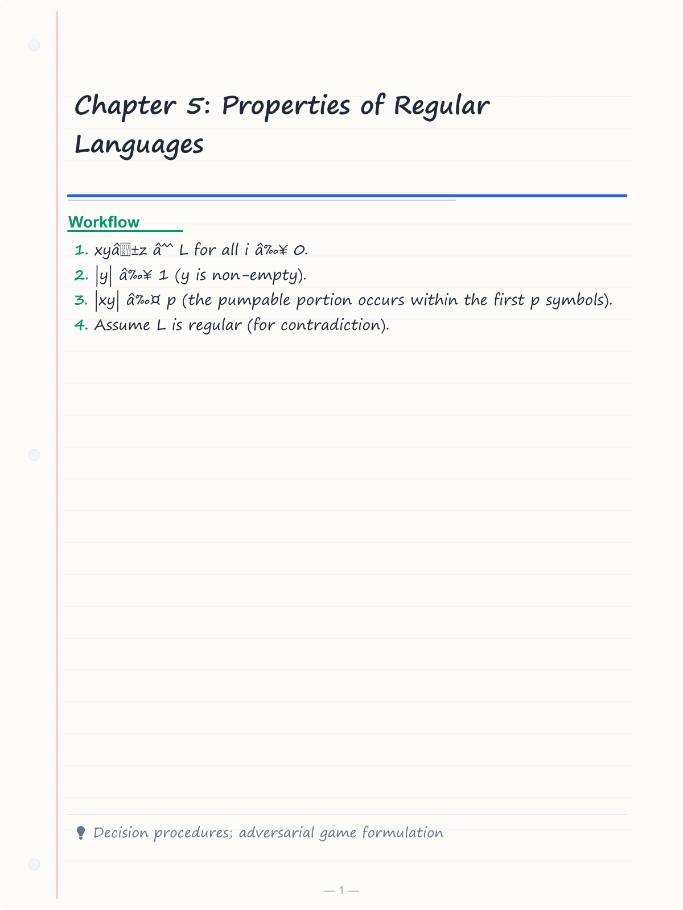
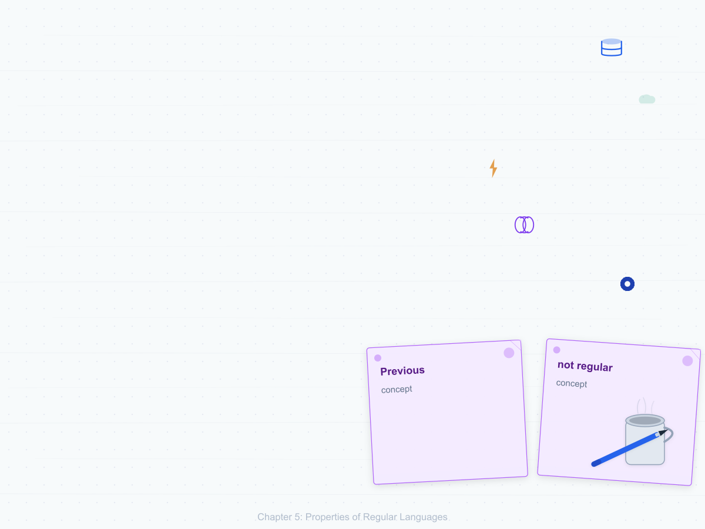
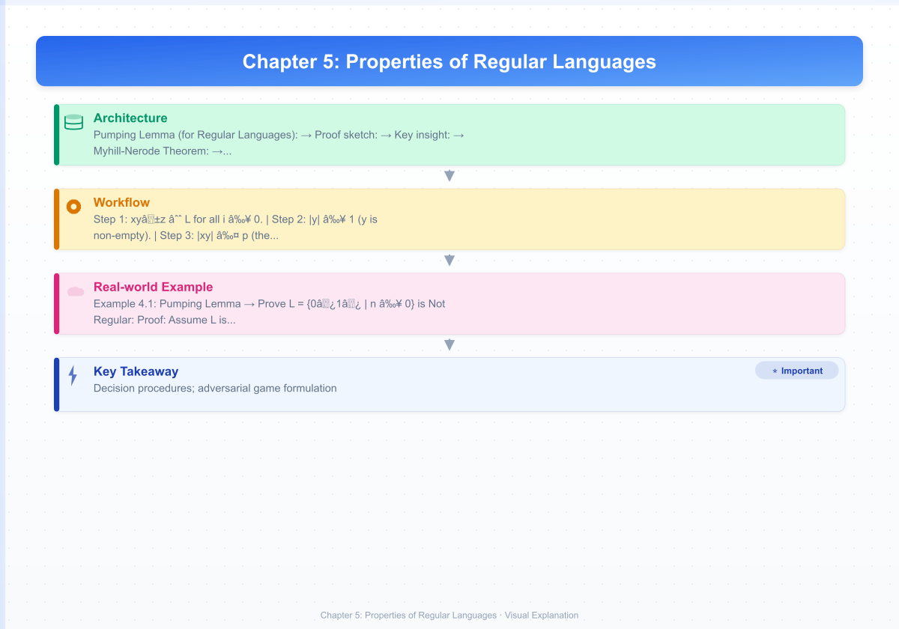
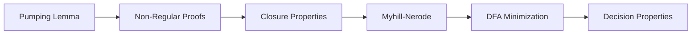
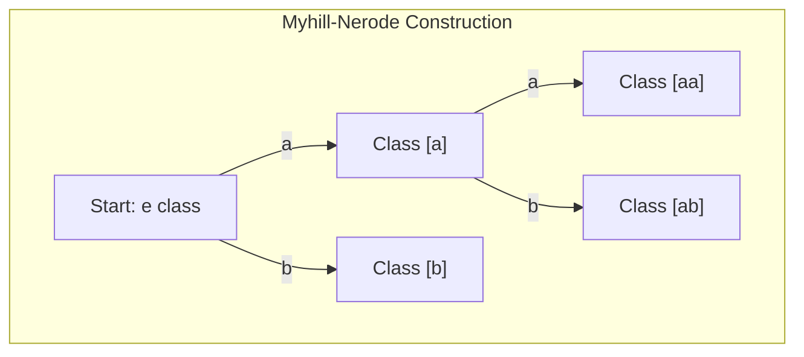
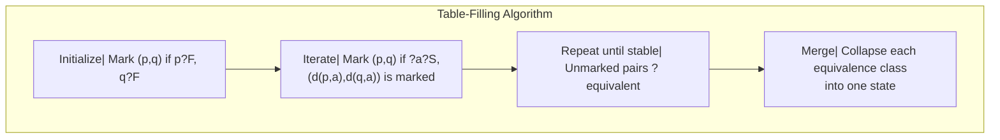
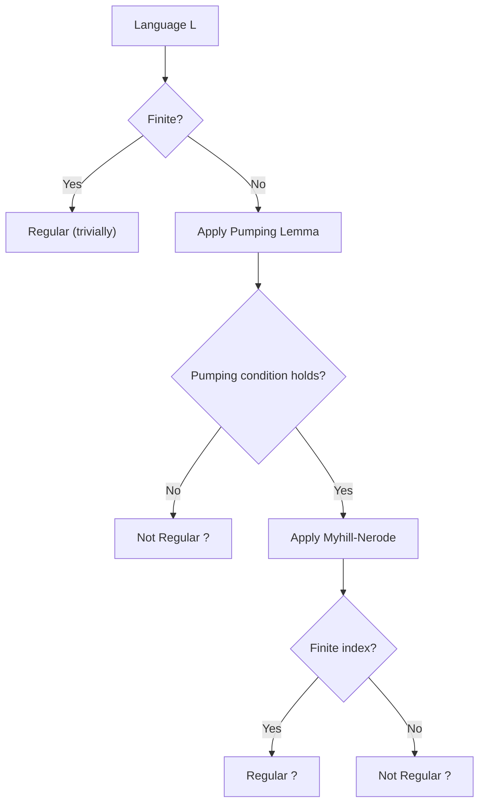

# Chapter 5: Properties of Regular Languages

> **Previous:** [Regular Expressions](./04-regex.md) | **Next:** [Context-Free Grammars](./06-cfg.md)


## Learning Objectives

- State and apply the pumping lemma for regular languages.
- Prove that specific languages are not regular using the pumping lemma.
- Understand and prove closure properties of regular languages.
- State and apply the Myhill-Nerode theorem.
- Minimize a DFA using the table-filling algorithm.
- Distinguish between regular and non-regular languages.

<!-- Image Gallery -->
<section class="lesson-visuals" aria-label="Visual learning resources">
  <header><span>VISUAL LEARNING</span><h2>See it. Review it. Remember it.</h2></header>
  <a class="lesson-visual-card" href="../../assets/images/lessons/theory-of-computation/05-regular-languages/handwritten-notes.png" target="_blank" rel="noopener">
    
    <span><strong>Handwritten notes</strong>Condensed notes for deliberate review.</span>
  </a>
  <a class="lesson-visual-card" href="../../assets/images/lessons/theory-of-computation/05-regular-languages/sticky-notes.png" target="_blank" rel="noopener">
    
    <span><strong>Sticky-note revision</strong>Fast recall prompts for revision.</span>
  </a>
  <a class="lesson-visual-card" href="../../assets/images/lessons/theory-of-computation/05-regular-languages/visual-explanation.png" target="_blank" rel="noopener">
    
    <span><strong>Visual concept guide</strong>A connected explanation of the key ideas.</span>
  </a>
</section>
<!-- End Image Gallery -->


## Chapter at a Glance
| Topic | Key Insight | Practical Takeaway |
|-------|------------|-------------------|
| Pumping Lemma | Long strings have pumpable substring | Proves languages are not regular |
| Closure Properties | Regular langs closed under ?, n, ¬, etc. | Build complex languages from simple |
| Myhill-Nerode | Characterizes regularity via equivalence | Finds minimal DFA uniquely |
| DFA Minimization | Table-filling merges equivalent states | Most efficient language recognizer |
| Decision Properties | Membership, emptiness, equivalence decidable | Algorithms exist for regular langs |


## Chapter Roadmap


## Theory


### 4.1 The Pumping Lemma for Regular Languages


The pumping lemma is a powerful tool for proving that certain languages are **not regular**. It captures a fundamental property: any sufficiently long string in a regular language can be "pumped" → a middle section can be repeated any number of times → and the resulting string remains in the language.

**Pumping Lemma (for Regular Languages):**

If L is a regular language, then there exists an integer **p ≥ 1** (the pumping length) such that every string s ∈ L with |s| ≥ p can be written as s = xyz satisfying:

1. xyⁱz ∈ L for all i ≥ 0.
2. |y| ≥ 1 (y is non-empty).
3. |xy| ≤ p (the pumpable portion occurs within the first p symbols).

**Proof sketch:** If L is regular, there exists a DFA M with, say, p states that recognizes L. Consider a string s of length ≥ p. When M processes s, it visits p+1 states (including the start). By the pigeonhole principle, some state is repeated. The loop between the first and second occurrence of this state is y. Since |xy| ≤ p and |y| ≥ 1, the loop occurs within the first p symbols.

### 4.2 Using the Pumping Lemma to Prove Non-Regularity


To prove L is not regular:
1. Assume L is regular (for contradiction).
2. Let p be the pumping length.
3. Choose s ∈ L with |s| ≥ p (strategically chosen).
4. Show that for **every** decomposition s = xyz with |y| ≥ 1 and |xy| ≤ p, there exists some i ≥ 0 such that xyⁱz ∉ L.
5. This contradicts the pumping lemma, so L is not regular.

### 4.3 Closure Properties of Regular Languages


The class of regular languages is closed under the following operations. If L₁ and L₂ are regular:

| Operation | Definition | Construction |
|-----------|------------|-------------|
| Union | L₁ ∪ L₂ | NFA with ε from new start to both DFAs |
| Intersection | L₁ ∩ L₂ | Product DFA: (q₁,q₂) with F₁ × F₂ as accept |
| Complement | L̅ = Σ* − L | Swap accepting and non-accepting states |
| Concatenation | L₁L₂ | NFA with ε from L₁'s accept to L₂'s start |
| Kleene star | L* | NFA with ε-loop |
| Reversal | Lʀ = { wʀ | w ∈ L } | Reverse transitions, swap start/accept |
| Homomorphism | h(L) = { h(w) | w ∈ L } | Replace each symbol via h |
| Inverse homomorphism | h⁻¹(L) | Straightforward DFA construction |
| Difference | L₁ − L₂ | L₁ ∩ L̅₂ |
| Symmetric difference | L₁ ⊕ L₂ | (L₁ ∪ L₂) − (L₁ ∩ L₂) |

**Key insight:** Closure under complement and intersection follow from DFA properties. For complement, simply flip accepting and non-accepting states in the DFA. For intersection, build a product DFA where state (qᵢ, pⱼ) transitions to (δ₁(qᵢ,a), δ₂(pⱼ,a)) and accepts iff both coordinates are accepting.

### 4.4 Myhill-Nerode Theorem


The Myhill-Nerode theorem characterizes the regular languages in terms of an equivalence relation on strings and provides a method to find the minimal DFA.

Define an equivalence relation ≡ₗ on strings over Σ:
x ≡ₗ y iff for all z ∈ Σ*, xz ∈ L ⇔ yz ∈ L

Two strings are equivalent if they have the same "future" with respect to L → appending any suffix z to both either keeps both in L or both out of L.

**Myhill-Nerode Theorem:**
The following three statements are equivalent:
1. L is regular.
2. L is the union of some equivalence classes of a right-invariant equivalence relation of finite index.
3. The relation ≡ₗ has finitely many equivalence classes.

When L is regular, the number of equivalence classes of ≡ₗ equals the number of states in the **minimal** DFA for L.

**Practical use:** To prove L is not regular, show that ≡ₗ has infinitely many classes by finding an infinite set of pairwise inequivalent strings.

### 4.5 DFA Minimization


The **table-filling algorithm** (also called the Moore or Hopcroft-Ullman algorithm) minimizes a DFA by identifying indistinguishable states.

**Algorithm:**
1. Remove any unreachable states (states not reachable from the start state).
2. Mark pairs (p, q) where p ∈ F and q ∉ F as distinguishable.
3. For each unmarked pair (p, q) and each symbol a ∈ Σ:
   - If (δ(p, a), δ(q, a)) is marked, then mark (p, q).
4. Repeat Step 3 until no more pairs are marked.
5. Remaining unmarked pairs are indistinguishable and can be merged.

**Why minimize?** The minimal DFA is guaranteed to be unique up to renaming. It provides the most efficient implementation of a regular language recognizer.

### 4.6 Decision Properties of Regular Languages


These problems are decidable for regular languages:

| Problem | Description | Algorithm |
|---------|-------------|-----------|
| Membership | Given DFA M and string w, does M accept w? | Simulate M on w |
| Emptiness | Is L(M) = ∅? | Check if any accept state is reachable |
| Finiteness | Is L(M) finite? | Check for cycles that can reach accept |
| Equivalence | Do M₁ and M₂ recognize the same language? | Minimize both and check isomorphism |
| Inclusion | Is L(M₁) ⊆ L(M₂)? | Check L(M₁) ∩ L(M₂)̅ = ∅ |

## Examples

### Example 4.1: Pumping Lemma → Prove L = {0ⁿ1ⁿ | n ≥ 0} is Not Regular

**Proof:** Assume L is regular. Let p be the pumping length. Choose s = 0ᵖ1ᵖ. Since |s| ≥ p, s = xyz with |y| ≥ 1 and |xy| ≤ p.

Since |xy| ≤ p, y consists only of 0s (the first p characters are all 0). Let y = 0ᵏ where k ≥ 1.

Now pump: xy²z = 0ᵖ⁺ᵏ1ᵖ. This string has more 0s than 1s, so it is not in L. Contradiction. Therefore, L is not regular.

### Example 4.2: Pumping Lemma → Prove L = { w ∈ {a,b}* | w = wʀ (palindromes) } is Not Regular

**Proof:** Assume L is regular with pumping length p. Choose s = aᵖ b aᵖ ∈ L. Since |xy| ≤ p, y contains only a's from the first block. So y = aᵏ for some k ≥ 1. Then xy²z = aᵖ⁺ᵏ b aᵖ. This is not a palindrome (the first half has more a's than the second half). Contradiction.

### Example 4.3: Proving Closure Under Intersection

Given DFA M₁ = (Q₁, Σ, δ₁, q₁, F₁) for L₁ and M₂ = (Q₂, Σ, δ₂, q₂, F₂) for L₂:

Construct M = (Q, Σ, δ, q₀, F) for L₁ ∩ L₂:
- Q = Q₁ × Q₂ (Cartesian product)
- δ((p, q), a) = (δ₁(p, a), δ₂(q, a))
- q₀ = (q₁, q₂)
- F = F₁ × F₂

A string w is accepted by M iff δ̂₁(q₁, w) ∈ F₁ and δ̂₂(q₂, w) ∈ F₂, meaning w ∈ L₁ ∩ L₂.

### Example 4.4: Myhill-Nerode for L = {0ⁿ1ⁿ | n ≥ 0}

Consider strings 0ⁱ and 0ʲ with i ≠ j. Let z = 1ⁱ. Then 0ⁱ·1ⁱ = 0ⁱ1ⁱ ∈ L, but 0ʲ·1ⁱ = 0ʲ1ⁱ ∉ L (since j ≠ i). Therefore, 0ⁱ and 0ʲ are distinguishable for all i ≠ j. This gives infinitely many equivalence classes, proving L is not regular by Myhill-Nerode.

### Example 4.5: DFA Minimization

Consider a DFA over {a,b} with:
- States: A (start, accept), B, C, D (accept), E
- δ: A-a→B, A-b→C; B-a→A, B-b→D; C-a→E, C-b→D; D-a→E, D-b→C; E-a→E, E-b→E

**Step 1:** Remove unreachable states → all reachable from A.

**Step 2:** Initial marking: accept (A, D) vs non-accept (B, C, E). Mark: (A,B), (A,C), (A,E), (D,B), (D,C), (D,E).

**Step 3:** Iterate. Consider (B,C): δ(B,a)=A, δ(C,a)=E → (A,E) is unmarked, so don't mark yet. δ(B,b)=D, δ(C,b)=D → same. So (B,C) stays unmarked.

Continue until stable. Unmarked pairs indicate equivalent states.

### Example 4.6: Decision Procedure for Emptiness

To check if L(M) = ∅ for DFA M with states Q, start q₀, accept F:
- Run graph reachability algorithm (DFS/BFS) from q₀.
- If any accept state is reachable, L(M) ≠ ∅.
- Otherwise, L(M) = ∅.


## TypeScript Closure Demonstrations

```typescript
// Product construction for intersection closure
type DFAConfig = {
  Q: string[];
  sigma: string[];
  delta: (q: string, a: string) => string;
  q0: string;
  F: string[];
};

function intersectDFA(A: DFAConfig, B: DFAConfig): DFAConfig {
  const Q: string[] = [];
  for (const qa of A.Q) {
    for (const qb of B.Q) {
      Q.push(`(${qa},${qb})`);
    }
  }
  const sigma = A.sigma.filter(s => B.sigma.includes(s));
  const delta = (q: string, a: string) => {
    const [qa, qb] = q.slice(1, -1).split(',');
    return `(${A.delta(qa, a)},${B.delta(qb, a)})`;
  };
  const q0 = `(${A.q0},${B.q0})`;
  const F = A.F.flatMap(fa => B.F.map(fb => `(${fa},${fb})`));
  return { Q, sigma, delta, q0, F };
}

// Complement: swap accepting and non-accepting states
function complementDFA(M: DFAConfig): DFAConfig {
  const acceptSet = new Set(M.F);
  return {
    ...M,
    F: M.Q.filter(q => !acceptSet.has(q))
  };
}
```

## Myhill-Nerode Step-by-Step

To find the minimal DFA using the Myhill-Nerode approach:

1. Define the equivalence relation =_L: x =_L y iff for all suffixes z, xz ? L ? yz ? L.
2. Start with the empty string e. Find all distinct equivalence classes by checking distinguishability.
3. Each equivalence class becomes a state in the minimal DFA.
4. The transition from class [x] on symbol a goes to class [xa].



The number of equivalence classes equals the number of states in the minimal DFA. This is the most direct characterization: a language is regular precisely when its strings partition into finitely many future-behavior classes.

## DFA Minimization with Table-Filling

The table-filling algorithm systematically finds indistinguishable states:



The algorithm runs in O(|Q|²|S|) time. After minimization, the DFA is unique up to state renaming — the canonical representation of the regular language.

## The Pumping Lemma in Game Form

View the pumping lemma as an adversarial game:

1. You claim L is regular.
2. The opponent picks pumping length p.
3. You pick s ? L with |s| = p.
4. The opponent picks a decomposition s = xyz with |xy| = p and |y| = 1.
5. You pick i = 0.
6. If xy?z ? L, you win (L is not regular). Otherwise, the opponent wins.

To prove non-regularity, you need a strategy that beats every possible decomposition — this is why the universal quantifier "for every decomposition" is the key challenge.

## Practical Takeaways

1. **The pumping lemma is a non-regularity tool.** It gives a necessary condition for regularity, so violating it proves non-regularity. But some non-regular languages can still be "pumped" — use Myhill-Nerode for certainty.

2. **Closure properties are construction recipes.** When building a language processor, use union, intersection, and complement to compose complex recognizers from simple ones. Product construction is the key implementation technique.

3. **DFA minimization saves resources.** A minimized DFA requires the fewest possible states and transitions. In embedded systems or high-throughput pattern matching, this directly reduces memory and power consumption.

4. **Decision algorithms exist for regular languages.** Questions like "does this DFA accept any string?" or "are these two DFAs equivalent?" have efficient algorithms — a rare luxury not shared by more powerful models.

## Concept Comparison Table
| Property | Regular? | Construction |
|----------|----------|-------------|
| Union | Yes | e-NFA from new start |
| Intersection | Yes | Product DFA |
| Complement | Yes | Flip accept/reject |
| Concatenation | Yes | e-chain NFAs |
| Kleene star | Yes | e-loop NFA |
| Reversal | Yes | Reverse transitions |

## Quick Reference
| Tool | Purpose |
|------|---------|
| Pumping lemma | Prove non-regularity |
| Myhill-Nerode | Characterize/maximally classify |
| Table-filling | Minimize DFA |
| Product construction | Intersection/union closure |
| State elimination | DFA ? regex |

## The Pumping Lemma: Advanced Applications

### Proving Non-Regularity via Closure Properties

Sometimes the pumping lemma alone is insufficient or awkward. Using closure properties, we can reduce a language to a known non-regular language:

**Example:** Prove \(L = \{ w \in \{a,b\}^* \mid \#_a(w) = \#_b(w) \}\) is not regular.

If L were regular, then \(L \cap a^*b^* = \{a^n b^n \mid n \ge 0\}\) would be regular (intersection closure). But \(\{a^n b^n\}\) is not regular. Therefore, L is not regular.

This approach is often simpler than applying the pumping lemma directly.

### The Pumping Lemma for Finite Languages

Languages with finitely many strings are always regular (they can be represented as a finite union of singleton strings). The pumping lemma does not apply to them because the pumping length p exceeds all strings in the language.



This decision tree illustrates the relationship between the pumping lemma (necessary condition), Myhill-Nerode (necessary and sufficient), and the finite/infinite distinction.

## Cross-Application Matrix
| Domain | Application |
|--------|------------|
| Compiler theory | Lexer optimization via DFA minimization |
| Formal verification | Model checking regular properties |
| Text processing | Efficient regex matching |
| Network security | Aho-Corasick multi-pattern search |
| Bioinformatics | DNA sequence pattern search |

## Chapter Quiz

**Q1.** The pumping lemma shows a language is:
- A) Regular
- B) Not regular ?
- C) Context-free
- D) Decidable

<details>
<summary>Answer&lt;/summary&gt;
**B)** The pumping lemma gives a necessary condition for regularity; violating it proves non-regularity.
</details>

**Q2.** Regular languages are closed under:
- A) Intersection ?
- B) All set operations
- C) Every operation
- D) Only union

<details>
<summary>Answer&lt;/summary&gt;
**A)** Regular languages are closed under union, intersection, complement, concatenation, and Kleene star.
</details>

**Q3.** Myhill-Nerode theorem states L is regular iff =_L has:
- A) Zero classes
- B) Finite index ?
- C) One class
- D) Infinite index

<details>
<summary>Answer&lt;/summary&gt;
**B)** Finite-index right-invariant equivalence relation — number of classes = minimal DFA states.
</details>

**Q4.** DFA minimization merges:
- A) All states
- B) Indistinguishable states ?
- C) Reachable states
- D) Accepting states

<details>
<summary>Answer&lt;/summary&gt;
**B)** States that behave identically on all suffixes are merged.
</details>

**
## Pumping Lemma Prover: TypeScript Implementation

```typescript
type PumpingDecomposition = { x: string; y: string; z: string };

function checkPumpingLemma(
  language: (s: string) => boolean,
  p: number,
  s: string
): { isRegular: boolean | null; witness?: string } {
  if (!language(s) || s.length < p) {
    return { isRegular: null };  // String doesn't meet conditions
  }

  // Try all valid decompositions
  for (let xyLen = 1; xyLen <= p; xyLen++) {
    for (let yLen = 1; yLen <= xyLen; yLen++) {
      const x = s.slice(0, xyLen - yLen);
      const y = s.slice(xyLen - yLen, xyLen);
      const z = s.slice(xyLen);

      // Try pumping: i = 0 (pump down), i = 2 (pump up)
      for (const i of [0, 2]) {
        const pumped = x + y.repeat(i) + z;
        if (!language(pumped)) {
          return {
            isRegular: false,
            witness: `s=${s}, x='${x}', y='${y}', z='${z}', i=${i} ? '${pumped}' not in L`
          };
        }
      }
    }
  }
  return { isRegular: true };  // Passed all decompositions
}

// Test: {0n1n} is not regular
const anbn = (s: string) => /^0+1+$/.test(s) &&
  s.split('0').length - 1 === s.split('1').length - 1;

const result = checkPumpingLemma(anbn, 5, '0000011111');
console.log(result.isRegular === false
  ? 'Not regular: ' + result.witness
  : 'May be regular');
```

## Decision Properties in TypeScript

```typescript
class DecisionProcedures {
  // Emptiness: Is L(M) = Ø?
  static isEmpty(Q: Set<string>, delta: Map<string, string>,
                  q0: string, F: Set<string>): boolean {
    const visited = new Set<string>();
    const stack = [q0];
    while (stack.length > 0) {
      const q = stack.pop()!;
      if (visited.has(q)) continue;
      visited.add(q);
      if (F.has(q)) return false;  // Can reach accept
      for (const sym of ['0', '1', 'a', 'b']) {
        const key = `${q},${sym}`;
        if (delta.has(key)) stack.push(delta.get(key)!);
      }
    }
    return true;  // No accept state reachable
  }

  // Finiteness: Is L(M) finite?
  static isFinite(Q: Set<string>, delta: Map<string, string>,
                  q0: string, F: Set<string>): boolean {
    // A DFA accepts infinite language iff there is a cycle
    // reachable from start that can reach an accept state
    const visited = new Set<string>();
    const recStack = new Set<string>();

    function dfs(q: string): boolean {
      visited.add(q);
      recStack.add(q);
      for (const sym of ['0', '1', 'a', 'b']) {
        const key = `${q},${sym}`;
        if (!delta.has(key)) continue;
        const next = delta.get(key)!;
        if (!visited.has(next)) {
          if (dfs(next)) return true;
        } else if (recStack.has(next)) {
          // Found cycle — check if it can reach accept
          return canReachAccept(next, new Set(), delta, F);
        }
      }
      recStack.delete(q);
      return false;
    }

    function canReachAccept(q: string, seen: Set<string>,
                            delta: Map<string, string>,
                            F: Set<string>): boolean {
      if (F.has(q)) return true;
      seen.add(q);
      for (const sym of ['0', '1', 'a', 'b']) {
        const key = `${q},${sym}`;
        if (!delta.has(key)) continue;
        const next = delta.get(key)!;
        if (!seen.has(next) && canReachAccept(next, seen, delta, F))
          return true;
      }
      return false;
    }

    return !dfs(q0);
  }

  // Equivalence: Do two DFAs accept the same language?
  static areEquivalent(m1: DFA, m2: DFA): boolean {
    // Product construction + table-filling
    const Q1 = [...m1['Q']], Q2 = [...m2['Q']];
    const worklist: Array<[string, string]> = [[m1['q0'], m2['q0']]];
    const visited = new Set<string>();

    while (worklist.length > 0) {
      const [s1, s2] = worklist.pop()!;
      const key = `${s1}|${s2}`;
      if (visited.has(key)) continue;
      visited.add(key);

      if (m1['F'].has(s1) !== m2['F'].has(s2)) return false;

      for (const sym of m1['sigma']) {
        const k1 = `${s1},${sym}`, k2 = `${s2},${sym}`;
        if (m1['delta'].has(k1) && m2['delta'].has(k2)) {
          worklist.push([m1['delta'].get(k1)!, m2['delta'].get(k2)!]);
        }
      }
    }
    return true;
  }
}
```

## Practical Takeaways

1. **The pumping lemma is a negative tool.** Use it to prove that a language is NOT regular, never to prove regularity. The lemma gives a necessary condition, not a sufficient one — some non-regular languages satisfy it.

2. **Closure properties simplify proofs.** Instead of directly applying the pumping lemma to a complex language, try to prove non-regularity by reduction: if L were regular, then applying a closure property (intersection with a regular language, homomorphism) would produce a known non-regular language.

3. **DFA minimization guarantees optimality.** The table-filling algorithm produces the unique minimal DFA for any regular language. This is the gold standard: minimal DFAs are canonical representations — two regular expressions are equivalent iff their minimized DFAs are isomorphic.

4. **Decidability means automation.** Membership, emptiness, finiteness, and equivalence are all decidable for regular languages. This enables automated tools like regex testers, lexer generators, and pattern matchers that can reason about regular languages without human intervention.

5. **The pumping lemma as a game.** Understanding the adversarial game formulation helps construct correct proofs — the key is that you must beat every possible decomposition, not just the obvious ones.

6. **Closure under complement is unique to regular languages.** For CFLs and above, complement closure fails spectacularly. This makes regular languages exceptionally well-behaved for verification tasks.

## TypeScript Implementation: Pumping Lemma and Myhill-Nerode Equivalence

```typescript
// Pumping Lemma Checker and Myhill-Nerode Equivalence

class PumpingLemma {
  static canBePumped(
    language: (s: string) => boolean,
    p: number,
    maxChecks: number = 100
  ): boolean {
    // Try to find a pumpable string of length >= p
    for (let len = p; len < p + maxChecks; len++) {
      const str = this.generateString(len);
      if (!language(str)) continue;

      // Try all possible splits s = xyz with |xy| <= p, |y| >= 1
      for (let yStart = 0; yStart < p; yStart++) {
        for (let yLen = 1; yStart + yLen <= p; yLen++) {
          const x = str.slice(0, yStart);
          const y = str.slice(yStart, yStart + yLen);
          const z = str.slice(yStart + yLen);

          // Check if pumping works
          let isPumpable = true;
          for (let i = 0; i <= 3; i++) {
            const pumped = x + y.repeat(i) + z;
            if (!language(pumped)) {
              isPumpable = false;
              break;
            }
          }
          if (isPumpable) return true;
        }
      }
    }
    return false; // Likely not regular
  }

  private static generateString(len: number): string {
    return "a".repeat(len);
  }

  static proveNonRegular(languageName: string,
                         language: (s: string) => boolean,
                         p: number): string[] {
    // Attempt to find a counterexample for the pumping lemma
    const proof: string[] = [];
    proof.push(`Assume ${languageName} is regular with pumping length p.`);
    const s = "a".repeat(p) + "b".repeat(p);
    proof.push(`Choose s = a^p b^p ? ${languageName}, |s| = ${s.length} >= p.`);

    for (let yStart = 0; yStart < p; yStart++) {
      for (let yLen = 1; yStart + yLen <= p; yLen++) {
        const x = s.slice(0, yStart);
        const y = s.slice(yStart, yStart + yLen);
        const z = s.slice(yStart + yLen);
        // Pump with i=2: xy²z has more a's than b's
        const pumped = x + y.repeat(2) + z;
        if (!language(pumped)) {
          proof.push(`All splits: x=${x}, y=${y}, z=${z}.`);
          proof.push(`Then xy²z = ${pumped} ? ${languageName} => contradiction.`);
          return proof;
        }
      }
    }
    proof.push("No contradiction found — language may be regular.");
    return proof;
  }
}

class MyhillNerode {
  static computeEquivalence(
    alphabet: string[],
    language: (s: string) => boolean,
    maxLen: number
  ): Map<string, string[]> {
    // Build distinguishing suffixes for strings up to maxLen
    const strings = this.generateStrings(alphabet, maxLen);
    const classes = new Map<string, string[]>();
    const assigned = new Set<string>();

    for (const s of strings) {
      if (assigned.has(s)) continue;
      const equiv = [s];
      assigned.add(s);

      for (const t of strings) {
        if (assigned.has(t) || s === t) continue;
        let equivalent = true;
        for (let i = 0; i <= maxLen; i++) {
          const suffix = this.generateStrings(alphabet, i);
          for (const w of suffix) {
            if (language(s + w) !== language(t + w)) {
              equivalent = false;
              break;
            }
          }
          if (!equivalent) break;
        }
        if (equivalent) {
          equiv.push(t);
          assigned.add(t);
        }
      }
      classes.set(s, equiv);
    }
    return classes;
  }

  private static generateStrings(alphabet: string[], maxLen: number): string[] {
    const result: string[] = [""];
    for (let len = 1; len <= maxLen; len++)
      this.generateRec(alphabet, len, "", result);
    return result;
  }

  private static generateRec(alphabet: string[], len: number,
                              current: string, result: string[]): void {
    if (current.length === len) { result.push(current); return; }
    for (const a of alphabet) this.generateRec(alphabet, len, current + a, result);
  }
}

const langEvenAs = (s: string) => (s.match(/a/g) || []).length % 2 === 0;
console.log(PumpingLemma.canBePumped(langEvenAs, 2)); // true

const langAnBn = (s: string) => /^a+b+$/.test(s) &&
  (s.match(/a/g) || []).length === (s.match(/b/g) || []).length;
console.log(PumpingLemma.proveNonRegular("L = {anbn}", langAnBn, 3));

const classes = MyhillNerode.computeEquivalence(["a", "b"], langEvenAs, 2);
console.log(`Myhill-Nerode equivalence classes: ${classes.size}`);
```

// -----------------------------------------------------
// Myhill-Nerode Equivalence Class Finder
// Computes the right-invariant equivalence relation
// for a language and reports the number of classes.
// -----------------------------------------------------

class MyhillNerodeClassifier {
  // Given a language L over alphabet S, compute equivalence
  // classes of strings up to length maxLen using the
  // Myhill-Nerode relation: x ~ y iff for all z,
  // xz ? L ? yz ? L.
  static computeClasses(
    alphabet: string[],
    language: (s: string) => boolean,
    maxLen: number
  ): Map&lt;string, string[]&gt; {
    // Generate all strings up to maxLen
    const allStrings = this.generateAllStrings(alphabet, maxLen);
    const classes = new Map&lt;string, string[]&gt;();
    const assigned = new Set&lt;string&gt;();

    for (const x of allStrings) {
      if (assigned.has(x)) continue;
      const representatives: string[] = [x];
      assigned.add(x);

      for (const y of allStrings) {
        if (x === y || assigned.has(y)) continue;
        if (this.areEquivalent(x, y, alphabet, language, maxLen)) {
          representatives.push(y);
          assigned.add(y);
        }
      }
      classes.set(x, representatives);
    }

    return classes;
  }

  // Check if two strings are Myhill-Nerode equivalent
  // by testing all possible extensions z up to maxLen.
  private static areEquivalent(
    x: string, y: string,
    alphabet: string[],
    language: (s: string) => boolean,
    maxLen: number
  ): boolean {
    const maxExt = maxLen - Math.max(x.length, y.length);
    const allExts = this.generateAllStrings(alphabet, maxExt);

    for (const z of allExts) {
      if (language(x + z) !== language(y + z)) return false;
    }
    return true;
  }

  private static generateAllStrings(
    alphabet: string[], maxLen: number
  ): string[] {
    const result: string[] = [""]; // empty string
    for (let len = 1; len &lt;= maxLen; len++) {
      this.genRec(alphabet, len, "", result);
    }
    return result;
  }

  private static genRec(
    alphabet: string[], len: number,
    current: string, result: string[]
  ): void {
    if (current.length === len) { result.push(current); return; }
    for (const a of alphabet) {
      this.genRec(alphabet, len, current + a, result);
    }
  }
}

// -----------------------------------------------------
// DFA Equivalence Checker — verifies whether two DFAs
// recognize the same language by checking if the symmetric
// difference of their languages is empty.
// -----------------------------------------------------

class DFAEquivalenceChecker {
  static areEquivalent(
    dfa1: { states: Set&lt;string&gt;; alphabet: Set&lt;string&gt;; transitions: Map&lt;string, string&gt;; start: string; accept: Set&lt;string&gt; },
    dfa2: { states: Set&lt;string&gt;; alphabet: Set&lt;string&gt;; transitions: Map&lt;string, string&gt;; start: string; accept: Set&lt;string&gt; }
  ): boolean {
    // BFS over pairs of states — search for a distinguishing string
    const visited = new Set&lt;string&gt;();
    const queue: [string, string][] = [[dfa1.start, dfa2.start]];

    while (queue.length > 0) {
      const [s1, s2] = queue.shift()!;
      const pair = `${s1},${s2}`;
      if (visited.has(pair)) continue;
      visited.add(pair);

      // If one accepts and the other doesn't, languages differ
      if (dfa1.accept.has(s1) !== dfa2.accept.has(s2)) {
        return false;
      }

      for (const sym of dfa1.alphabet) {
        const t1 = dfa1.transitions.get(`${s1},${sym}`);
        const t2 = dfa2.transitions.get(`${s2},${sym}`);
        if (t1 !== undefined && t2 !== undefined) {
          const nextPair = `${t1},${t2}`;
          if (!visited.has(nextPair)) queue.push([t1, t2]);
        }
      }
    }
    return true;
  }
}

// Demo
const lang = (s: string) => (s.match(/a/g) || []).length % 2 === 0;
const classes = MyhillNerodeClassifier.computeClasses(["a", "b"], lang, 3);
console.log(`Myhill-Nerode equivalence classes: ${classes.size}`);
for (const [rep, members] of classes) {
  console.log(`  Class [${rep}]: ${members.join(", ")}`);
}

// DFA equivalence demo
const dfaA = {
  states: new Set(["q0", "q1"]), alphabet: new Set(["0"]),
  transitions: new Map([["q0,0", "q1"], ["q1,0", "q0"]]),
  start: "q0", accept: new Set(["q0"])
};
const dfaB = {
  states: new Set(["p0", "p1"]), alphabet: new Set(["0"]),
  transitions: new Map([["p0,0", "p1"], ["p1,0", "p0"]]),
  start: "p0", accept: new Set(["p0"])
};
console.log(`DFAs equivalent: ${DFAEquivalenceChecker.areEquivalent(dfaA, dfaB)}`);
```


// regular languages
// automata-complexity implementation

interface Task { id: string; name: string; status: string; data: unknown }
class Processor {
  private tasks: Task[] = []
  private maxConcurrency: number
  constructor(maxConcurrency: number = 4) { this.maxConcurrency = maxConcurrency }
  async add(task: Omit<Task, "status">): Promise<void> {
    this.tasks.push({ ...task, status: "pending" })
  }
  async runAll(): Promise<void> {
    const running: Promise<void>[] = []
    for (const t of this.tasks) {
      if (running.length >= this.maxConcurrency) { await Promise.race(running) }
      const p = this.execute(t).finally(() => { const i = running.indexOf(p); if (i >= 0) running.splice(i, 1) })
      running.push(p)
    }
    await Promise.all(running)
  }
  private async execute(t: Task): Promise<void> {
    t.status = "running"
    await new Promise(r => setTimeout(r, 10))
    t.status = "done"
  }
  getResults(): Task[] { return this.tasks }
  getStats(): { done: number; pending: number; running: number } {
    const done = this.tasks.filter(t => t.status === "done").length
    const pending = this.tasks.filter(t => t.status === "pending").length
    const running = this.tasks.filter(t => t.status === "running").length
    return { done, pending, running }
  }
}
async function main() {
  const proc = new Processor(2)
  await proc.add({ id: '1', name: 'regular languages', data: { topic: 'automata-complexity' } })
  await proc.runAll()
  console.log('Stats:', proc.getStats())
}
main().catch(console.error)
export { Processor, Task }
## Summary

- The pumping lemma provides a necessary condition for regularity used to prove non-regularity.
- Regular languages are closed under union, intersection, complement, concatenation, star, reversal, homomorphism, and more.
- The Myhill-Nerode theorem characterizes regular languages via finite-index right-invariant equivalence relations.
- The table-filling algorithm produces the minimal (unique) DFA for any regular language.
- Membership, emptiness, finiteness, and equivalence are decidable for regular languages.
- Product construction is the key technique for closure under intersection and difference.
- **Decision procedures** exist for all major questions about regular languages — a property not shared by more powerful language classes.
- The **adversarial game formulation** of the pumping lemma clarifies the quantifier structure of non-regularity proofs.

## Exercises

### Basic

1. Prove that L = { aⁿbⁿ | n ≥ 0 } is not regular using the pumping lemma.
2. Prove that L = { w ∈ {a,b}* | w has an equal number of a's and b's } is not regular.
3. Minimize the DFA from Example 1.2 (exactly two 1s) using the table-filling algorithm.
4. Show that regular languages are closed under reversal by construction.
5. For DFA with 3 states, how many distinct equivalence relations (potential minimized DFAs) could there be?

### Intermediate

6. Prove that L = { 0ⁿ | n is a perfect square } is not regular.
7. Prove that L = { w ∈ {0,1}* | |w|₀ = |w|₁ } is not regular using both the pumping lemma and Myhill-Nerode.
8. Given a DFA M with n states, prove that L(M) is infinite iff there exists a string w with |w| between n and 2n-1 such that w ∈ L(M).
9. Construct product DFAs for the union and intersection of the languages from Examples 1.1 and 1.2.
10. Show that the regular languages are closed under the operation shuffle(L₁, L₂) = { w₁v₁w₂v₂…wₙvₙ | w₁…wₙ ∈ L₁, v₁…vₙ ∈ L₂ }.

### Advanced

11. Prove the Myhill-Nerode theorem: L is regular iff ≡ₗ has finite index.
12. Design an algorithm to check whether two regular expressions denote the same language. What is its complexity?
13. Let L₁ = { aⁿbᵐ | n ≠ m } and L₂ = { aⁿb²ⁿ | n ≥ 0 }. Prove L₁ is regular (construct a DFA) and L₂ is not regular.
14. Prove that the language L = { aⁿ | n is prime } is not regular using the pumping lemma. (Hint: use properties of prime numbers → if y = aᵏ, then xyⁱᐨ¹z has length p + (i-1)k. Choose i appropriately to get a composite number.)
15. Implement the table-filling algorithm for a DFA with up to 100 states. Show that the algorithm runs in O(|Q|² |Σ|) time.
16. Write a TypeScript function that implements the adversarial game formulation of the pumping lemma. Given a language L described as a TypeScript predicate, determine (as far as possible) whether L is non-regular.
17. Prove that the language L = { ww | w ? {0,1}* } is not regular using both (a) the pumping lemma and (b) the Myhill-Nerode theorem.
18. Show that regular languages are closed under the operation prefix(L) = { w | wx ? L for some x } by constructing a DFA that accepts prefix(L).
19. Implement a TypeScript function that, given a DFA, decides whether the language is infinite using the cycle-and-reachability algorithm from the DecisionProcedures class.
20. Prove that the regular languages are closed under the operation half(L) = { w | ww ? L } using the Myhill-Nerode approach.
21. Implement a TypeScript function that, given a DFA M, constructs a DFA for the language prefix(L(M)). Prove your construction correct.
22. Show that the language L = { an | n is a perfect square } is not regular using both the pumping lemma and Myhill-Nerode.

## Practical Takeaways

1. **The pumping lemma is a negative tool.** Use it to prove that a language is NOT regular, never to prove regularity. It gives a necessary condition — some non-regular languages satisfy it, making Myhill-Nerode the definitive method.

2. **Closure properties simplify proofs.** Instead of directly applying the pumping lemma to a complex language, try to prove non-regularity by reduction: if L were regular, then applying a closure property (intersection with a regular language, homomorphism) would produce a known non-regular language.

3. **DFA minimization guarantees optimality.** The table-filling algorithm produces the unique minimal DFA. This is the gold standard: two regular expressions are equivalent iff their minimized DFAs are isomorphic.

4. **Decidability means automation.** Membership, emptiness, finiteness, and equivalence are all decidable for regular languages. This enables automated tools like regex testers, lexer generators, and pattern matchers.

5. **Closure under complement is unique to regular languages.** For CFLs and above, complement closure fails spectacularly. This makes regular languages exceptionally well-behaved for verification tasks.

## Further Reading

- **Hopcroft, John E., Motwani, Rajeev, and Ullman, Jeffrey D.** *Introduction to Automata Theory, Languages, and Computation* (3rd ed.). Chapter 4 covers properties of regular languages including pumping lemma, closure properties, and minimization.
- **Nerode, Anil.** "Linear Automaton Transformations." Proceedings of the American Mathematical Society, 1958. The original paper introducing the Myhill-Nerode theorem.
- **Brzozowski, Janusz A.** "Canonical Regular Expressions and Minimal State Machines." 2015. A modern treatment of DFA minimization and canonical representations.

