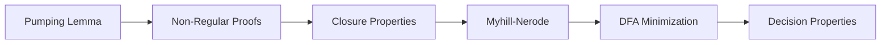
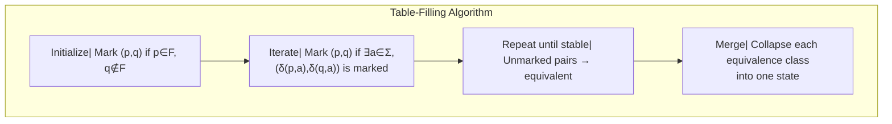

# Chapter 5: Properties of Regular Languages

> **Previous:** [Regular Expressions](./04-regex.md) | **Next:** [Context-Free Grammars](./06-cfg.md)


## Learning Objectives

- State and apply the pumping lemma for regular languages.
- Prove that specific languages are not regular using the pumping lemma.
- Understand and prove closure properties of regular languages.
- State and apply the Myhill-Nerode theorem.
- Minimize a DFA using the table-filling algorithm.
- Distinguish between regular and non-regular languages.


## Chapter at a Glance
| Topic | Key Insight | Practical Takeaway |
|-------|------------|-------------------|
| Pumping Lemma | Long strings have pumpable substring | Proves languages are not regular |
| Closure Properties | Regular langs closed under ∪, ∩, ¬, etc. | Build complex languages from simple |
| Myhill-Nerode | Characterizes regularity via equivalence | Finds minimal DFA uniquely |
| DFA Minimization | Table-filling merges equivalent states | Most efficient language recognizer |
| Decision Properties | Membership, emptiness, equivalence decidable | Algorithms exist for regular langs |


## Chapter Roadmap


## Theory


### 4.1 The Pumping Lemma for Regular Languages

The pumping lemma is a powerful tool for proving that certain languages are **not regular**. It captures a fundamental property: any sufficiently long string in a regular language can be "pumped" — a middle section can be repeated any number of times — and the resulting string remains in the language.

**Pumping Lemma (for Regular Languages):**

If L is a regular language, then there exists an integer **p ≥ 1** (the pumping length) such that every string s ∈ L with |s| ≥ p can be written as s = xyz satisfying:

1. xyⁱz ∈ L for all i ≥ 0.
2. |y| ≥ 1 (y is non-empty).
3. |xy| ≤ p (the pumpable portion occurs within the first p symbols).

**Proof sketch:** If L is regular, there exists a DFA M with, say, p states that recognizes L. Consider a string s of length ≥ p. When M processes s, it visits p+1 states (including the start). By the pigeonhole principle, some state is repeated. The loop between the first and second occurrence of this state is y. Since |xy| ≤ p and |y| ≥ 1, the loop occurs within the first p symbols.

### 4.2 Using the Pumping Lemma to Prove Non-Regularity

To prove L is not regular:
1. Assume L is regular (for contradiction).
2. Let p be the pumping length.
3. Choose s ∈ L with |s| ≥ p (strategically chosen).
4. Show that for **every** decomposition s = xyz with |y| ≥ 1 and |xy| ≤ p, there exists some i ≥ 0 such that xyⁱz ∉ L.
5. This contradicts the pumping lemma, so L is not regular.

### 4.3 Closure Properties of Regular Languages

The class of regular languages is closed under the following operations. If L₁ and L₂ are regular:

| Operation | Definition | Construction |
|-----------|------------|-------------|
| Union | L₁ ∪ L₂ | NFA with ε from new start to both DFAs |
| Intersection | L₁ ∩ L₂ | Product DFA: (q₁,q₂) with F₁ × F₂ as accept |
| Complement | L̅ = Σ* − L | Swap accepting and non-accepting states |
| Concatenation | L₁L₂ | NFA with ε from L₁'s accept to L₂'s start |
| Kleene star | L* | NFA with ε-loop |
| Reversal | Lʀ = { wʀ | w ∈ L } | Reverse transitions, swap start/accept |
| Homomorphism | h(L) = { h(w) | w ∈ L } | Replace each symbol via h |
| Inverse homomorphism | h⁻¹(L) | Straightforward DFA construction |
| Difference | L₁ − L₂ | L₁ ∩ L̅₂ |
| Symmetric difference | L₁ ⊕ L₂ | (L₁ ∪ L₂) − (L₁ ∩ L₂) |

**Key insight:** Closure under complement and intersection follow from DFA properties. For complement, simply flip accepting and non-accepting states in the DFA. For intersection, build a product DFA where state (qᵢ, pⱼ) transitions to (δ₁(qᵢ,a), δ₂(pⱼ,a)) and accepts iff both coordinates are accepting.

### 4.4 Myhill-Nerode Theorem

The Myhill-Nerode theorem characterizes the regular languages in terms of an equivalence relation on strings and provides a method to find the minimal DFA.

Define an equivalence relation ≡ₗ on strings over Σ:
x ≡ₗ y iff for all z ∈ Σ*, xz ∈ L ⇔ yz ∈ L

Two strings are equivalent if they have the same "future" with respect to L — appending any suffix z to both either keeps both in L or both out of L.

**Myhill-Nerode Theorem:**
The following three statements are equivalent:
1. L is regular.
2. L is the union of some equivalence classes of a right-invariant equivalence relation of finite index.
3. The relation ≡ₗ has finitely many equivalence classes.

When L is regular, the number of equivalence classes of ≡ₗ equals the number of states in the **minimal** DFA for L.

**Practical use:** To prove L is not regular, show that ≡ₗ has infinitely many classes by finding an infinite set of pairwise inequivalent strings.

### 4.5 DFA Minimization

The **table-filling algorithm** (also called the Moore or Hopcroft-Ullman algorithm) minimizes a DFA by identifying indistinguishable states.

**Algorithm:**
1. Remove any unreachable states (states not reachable from the start state).
2. Mark pairs (p, q) where p ∈ F and q ∉ F as distinguishable.
3. For each unmarked pair (p, q) and each symbol a ∈ Σ:
   - If (δ(p, a), δ(q, a)) is marked, then mark (p, q).
4. Repeat Step 3 until no more pairs are marked.
5. Remaining unmarked pairs are indistinguishable and can be merged.

**Why minimize?** The minimal DFA is guaranteed to be unique up to renaming. It provides the most efficient implementation of a regular language recognizer.

### 4.6 Decision Properties of Regular Languages

These problems are decidable for regular languages:

| Problem | Description | Algorithm |
|---------|-------------|-----------|
| Membership | Given DFA M and string w, does M accept w? | Simulate M on w |
| Emptiness | Is L(M) = ∅? | Check if any accept state is reachable |
| Finiteness | Is L(M) finite? | Check for cycles that can reach accept |
| Equivalence | Do M₁ and M₂ recognize the same language? | Minimize both and check isomorphism |
| Inclusion | Is L(M₁) ⊆ L(M₂)? | Check L(M₁) ∩ L(M₂)̅ = ∅ |

## Examples

### Example 4.1: Pumping Lemma — Prove L = {0ⁿ1ⁿ | n ≥ 0} is Not Regular

**Proof:** Assume L is regular. Let p be the pumping length. Choose s = 0ᵖ1ᵖ. Since |s| ≥ p, s = xyz with |y| ≥ 1 and |xy| ≤ p.

Since |xy| ≤ p, y consists only of 0s (the first p characters are all 0). Let y = 0ᵏ where k ≥ 1.

Now pump: xy²z = 0ᵖ⁺ᵏ1ᵖ. This string has more 0s than 1s, so it is not in L. Contradiction. Therefore, L is not regular.

### Example 4.2: Pumping Lemma — Prove L = { w ∈ {a,b}* | w = wʀ (palindromes) } is Not Regular

**Proof:** Assume L is regular with pumping length p. Choose s = aᵖ b aᵖ ∈ L. Since |xy| ≤ p, y contains only a's from the first block. So y = aᵏ for some k ≥ 1. Then xy²z = aᵖ⁺ᵏ b aᵖ. This is not a palindrome (the first half has more a's than the second half). Contradiction.

### Example 4.3: Proving Closure Under Intersection

Given DFA M₁ = (Q₁, Σ, δ₁, q₁, F₁) for L₁ and M₂ = (Q₂, Σ, δ₂, q₂, F₂) for L₂:

Construct M = (Q, Σ, δ, q₀, F) for L₁ ∩ L₂:
- Q = Q₁ × Q₂ (Cartesian product)
- δ((p, q), a) = (δ₁(p, a), δ₂(q, a))
- q₀ = (q₁, q₂)
- F = F₁ × F₂

A string w is accepted by M iff δ̂₁(q₁, w) ∈ F₁ and δ̂₂(q₂, w) ∈ F₂, meaning w ∈ L₁ ∩ L₂.

### Example 4.4: Myhill-Nerode for L = {0ⁿ1ⁿ | n ≥ 0}

Consider strings 0ⁱ and 0ʲ with i ≠ j. Let z = 1ⁱ. Then 0ⁱ·1ⁱ = 0ⁱ1ⁱ ∈ L, but 0ʲ·1ⁱ = 0ʲ1ⁱ ∉ L (since j ≠ i). Therefore, 0ⁱ and 0ʲ are distinguishable for all i ≠ j. This gives infinitely many equivalence classes, proving L is not regular by Myhill-Nerode.

### Example 4.5: DFA Minimization

Consider a DFA over {a,b} with:
- States: A (start, accept), B, C, D (accept), E
- δ: A-a→B, A-b→C; B-a→A, B-b→D; C-a→E, C-b→D; D-a→E, D-b→C; E-a→E, E-b→E

**Step 1:** Remove unreachable states — all reachable from A.

**Step 2:** Initial marking: accept (A, D) vs non-accept (B, C, E). Mark: (A,B), (A,C), (A,E), (D,B), (D,C), (D,E).

**Step 3:** Iterate. Consider (B,C): δ(B,a)=A, δ(C,a)=E — (A,E) is unmarked, so don't mark yet. δ(B,b)=D, δ(C,b)=D — same. So (B,C) stays unmarked.

Continue until stable. Unmarked pairs indicate equivalent states.

### Example 4.6: Decision Procedure for Emptiness

To check if L(M) = ∅ for DFA M with states Q, start q₀, accept F:
- Run graph reachability algorithm (DFS/BFS) from qâ‚€.
- If any accept state is reachable, L(M) ≠ ∅.
- Otherwise, L(M) = ∅.


## TypeScript Closure Demonstrations

```typescript
// Product construction for intersection closure
type DFAConfig = {
  Q: string[];
  sigma: string[];
  delta: (q: string, a: string) => string;
  q0: string;
  F: string[];
};

function intersectDFA(A: DFAConfig, B: DFAConfig): DFAConfig {
  const Q: string[] = [];
  for (const qa of A.Q) {
    for (const qb of B.Q) {
      Q.push(`(${qa},${qb})`);
    }
  }
  const sigma = A.sigma.filter(s => B.sigma.includes(s));
  const delta = (q: string, a: string) => {
    const [qa, qb] = q.slice(1, -1).split(',');
    return `(${A.delta(qa, a)},${B.delta(qb, a)})`;
  };
  const q0 = `(${A.q0},${B.q0})`;
  const F = A.F.flatMap(fa => B.F.map(fb => `(${fa},${fb})`));
  return { Q, sigma, delta, q0, F };
}

// Complement: swap accepting and non-accepting states
function complementDFA(M: DFAConfig): DFAConfig {
  const acceptSet = new Set(M.F);
  return {
    ...M,
    F: M.Q.filter(q => !acceptSet.has(q))
  };
}
```

## Myhill-Nerode Step-by-Step

To find the minimal DFA using the Myhill-Nerode approach:

1. Define the equivalence relation ≡_L: x ≡_L y iff for all suffixes z, xz ∈ L ⇔ yz ∈ L.
2. Start with the empty string ε. Find all distinct equivalence classes by checking distinguishability.
3. Each equivalence class becomes a state in the minimal DFA.
4. The transition from class [x] on symbol a goes to class [xa].


The number of equivalence classes equals the number of states in the minimal DFA. This is the most direct characterization: a language is regular precisely when its strings partition into finitely many future-behavior classes.

## DFA Minimization with Table-Filling

The table-filling algorithm systematically finds indistinguishable states:



The algorithm runs in O(|Q|²|Σ|) time. After minimization, the DFA is unique up to state renaming — the canonical representation of the regular language.

## The Pumping Lemma in Game Form

View the pumping lemma as an adversarial game:

1. You claim L is regular.
2. The opponent picks pumping length p.
3. You pick s ∈ L with |s| ≥ p.
4. The opponent picks a decomposition s = xyz with |xy| ≤ p and |y| ≥ 1.
5. You pick i ≥ 0.
6. If xyⁱz ∉ L, you win (L is not regular). Otherwise, the opponent wins.

To prove non-regularity, you need a strategy that beats every possible decomposition — this is why the universal quantifier "for every decomposition" is the key challenge.

## Practical Takeaways

1. **The pumping lemma is a non-regularity tool.** It gives a necessary condition for regularity, so violating it proves non-regularity. But some non-regular languages can still be "pumped" — use Myhill-Nerode for certainty.

2. **Closure properties are construction recipes.** When building a language processor, use union, intersection, and complement to compose complex recognizers from simple ones. Product construction is the key implementation technique.

3. **DFA minimization saves resources.** A minimized DFA requires the fewest possible states and transitions. In embedded systems or high-throughput pattern matching, this directly reduces memory and power consumption.

4. **Decision algorithms exist for regular languages.** Questions like "does this DFA accept any string?" or "are these two DFAs equivalent?" have efficient algorithms — a rare luxury not shared by more powerful models.

## Concept Comparison Table
| Property | Regular? | Construction |
|----------|----------|-------------|
| Union | Yes | ε-NFA from new start |
| Intersection | Yes | Product DFA |
| Complement | Yes | Flip accept/reject |
| Concatenation | Yes | ε-chain NFAs |
| Kleene star | Yes | ε-loop NFA |
| Reversal | Yes | Reverse transitions |

## Quick Reference
| Tool | Purpose |
|------|---------|
| Pumping lemma | Prove non-regularity |
| Myhill-Nerode | Characterize/maximally classify |
| Table-filling | Minimize DFA |
| Product construction | Intersection/union closure |
| State elimination | DFA → regex |

## Cross-Application Matrix
| Domain | Application |
|--------|------------|
| Compiler theory | Lexer optimization via DFA minimization |
| Formal verification | Model checking regular properties |
| Text processing | Efficient regex matching |
| Network security | Aho-Corasick multi-pattern search |
| Bioinformatics | DNA sequence pattern search |

## Chapter Quiz

**Q1.** The pumping lemma shows a language is:
- A) Regular
- B) Not regular ✓
- C) Context-free
- D) Decidable

<details>
<summary>Answer</summary>
**B)** The pumping lemma gives a necessary condition for regularity; violating it proves non-regularity.
</details>

**Q2.** Regular languages are closed under:
- A) Intersection ✓
- B) All set operations
- C) Every operation
- D) Only union

<details>
<summary>Answer</summary>
**A)** Regular languages are closed under union, intersection, complement, concatenation, and Kleene star.
</details>

**Q3.** Myhill-Nerode theorem states L is regular iff ≡_L has:
- A) Zero classes
- B) Finite index ✓
- C) One class
- D) Infinite index

<details>
<summary>Answer</summary>
**B)** Finite-index right-invariant equivalence relation — number of classes = minimal DFA states.
</details>

**Q4.** DFA minimization merges:
- A) All states
- B) Indistinguishable states ✓
- C) Reachable states
- D) Accepting states

<details>
<summary>Answer</summary>
**B)** States that behave identically on all suffixes are merged.
</details>

**
## Practical Takeaways

1. **The pumping lemma is a negative tool.** Use it to prove that a language is NOT regular, never to prove regularity. The lemma gives a necessary condition, not a sufficient one — some non-regular languages satisfy it.

2. **Closure properties simplify proofs.** Instead of directly applying the pumping lemma to a complex language, try to prove non-regularity by reduction: if L were regular, then applying a closure property (intersection with a regular language, homomorphism) would produce a known non-regular language.

3. **DFA minimization guarantees optimality.** The table-filling algorithm produces the unique minimal DFA for any regular language. This is the gold standard: minimal DFAs are canonical representations — two regular expressions are equivalent iff their minimized DFAs are isomorphic.

4. **Decidability means automation.** Membership, emptiness, finiteness, and equivalence are all decidable for regular languages. This enables automated tools like regex testers, lexer generators, and pattern matchers that can reason about regular languages without human intervention.

## Summary

- The pumping lemma provides a necessary condition for regularity used to prove non-regularity.
- Regular languages are closed under union, intersection, complement, concatenation, star, reversal, homomorphism, and more.
- The Myhill-Nerode theorem characterizes regular languages via finite-index right-invariant equivalence relations.
- The table-filling algorithm produces the minimal (unique) DFA for any regular language.
- Membership, emptiness, finiteness, and equivalence are decidable for regular languages.
- Product construction is the key technique for closure under intersection and difference.

## Exercises

### Basic

1. Prove that L = { aⁿbⁿ | n ≥ 0 } is not regular using the pumping lemma.
2. Prove that L = { w ∈ {a,b}* | w has an equal number of a's and b's } is not regular.
3. Minimize the DFA from Example 1.2 (exactly two 1s) using the table-filling algorithm.
4. Show that regular languages are closed under reversal by construction.
5. For DFA with 3 states, how many distinct equivalence relations (potential minimized DFAs) could there be?

### Intermediate

6. Prove that L = { 0ⁿ | n is a perfect square } is not regular.
7. Prove that L = { w ∈ {0,1}* | |w|₀ = |w|₁ } is not regular using both the pumping lemma and Myhill-Nerode.
8. Given a DFA M with n states, prove that L(M) is infinite iff there exists a string w with |w| between n and 2n-1 such that w ∈ L(M).
9. Construct product DFAs for the union and intersection of the languages from Examples 1.1 and 1.2.
10. Show that the regular languages are closed under the operation shuffle(L₁, L₂) = { w₁v₁w₂v₂…wₙvₙ | w₁…wₙ ∈ L₁, v₁…vₙ ∈ L₂ }.

### Advanced

11. Prove the Myhill-Nerode theorem: L is regular iff ≡ₗ has finite index.
12. Design an algorithm to check whether two regular expressions denote the same language. What is its complexity?
13. Let L₁ = { aⁿbᵐ | n ≠ m } and L₂ = { aⁿb²ⁿ | n ≥ 0 }. Prove L₁ is regular (construct a DFA) and L₂ is not regular.
14. Prove that the language L = { aⁿ | n is prime } is not regular using the pumping lemma. (Hint: use properties of prime numbers — if y = aᵏ, then xyⁱᐨ¹z has length p + (i-1)k. Choose i appropriately to get a composite number.)
15. Implement the table-filling algorithm for a DFA with up to 100 states. Show that the algorithm runs in O(|Q|² |Σ|) time.

## Further Reading

- **Hopcroft, John E., Motwani, Rajeev, and Ullman, Jeffrey D.** *Introduction to Automata Theory, Languages, and Computation* (3rd ed.). Chapter 4 covers properties of regular languages including pumping lemma, closure properties, and minimization.
- **Nerode, Anil.** "Linear Automaton Transformations." Proceedings of the American Mathematical Society, 1958. The original paper introducing the Myhill-Nerode theorem.
- **Brzozowski, Janusz A.** "Canonical Regular Expressions and Minimal State Machines." 2015. A modern treatment of DFA minimization and canonical representations.

