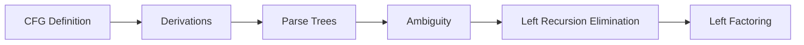
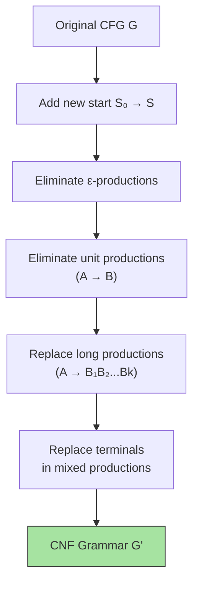
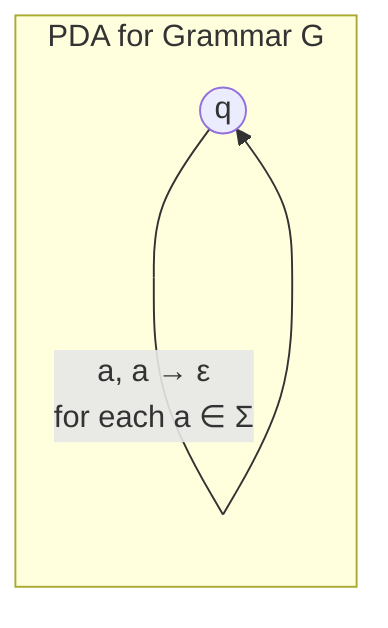

# Chapter 6: Context-Free Grammars

> **Previous:** [Properties of Regular Languages](./05-regular-languages.md) | **Next:** [Pushdown Automata](./07-pda.md)


## Learning Objectives

- Define a context-free grammar (CFG) formally.
- Construct derivations (leftmost, rightmost) and parse trees.
- Determine the language generated by a given CFG.
- Detect and eliminate ambiguity in grammars.
- Eliminate left recursion from CFGs.
- Apply left factoring to CFGs.
- Understand the relationship between CFGs and pushdown automata (preview).


## Chapter at a Glance
| Topic | Key Insight | Practical Takeaway |
|-------|------------|-------------------|
| CFG Definition | 4-tuple (V, Σ, R, S) generative grammar | Describes programming language syntax |
| Derivations | Leftmost/rightmost replacement sequences | Parse trees show structure |
| Ambiguity | Multiple parse trees for one string | Unacceptable in programming languages |
| Left Recursion | A ⇒⁺ Aα breaks top-down parsers | Must eliminate for LL parsing |
| Left Factoring | Common prefixes prevent prediction | Prepares grammar for predictive parsing |


## Chapter Roadmap


## Theory


### 5.1 What is a Context-Free Grammar?

Context-free grammars provide a **generative** description of languages. They are the basis for describing the syntax of most programming languages and are used extensively in compilers.

A CFG consists of:
- A set of **variables** (non-terminals) representing syntactic categories.
- A set of **terminals** representing the basic symbols of the language.
- **Production rules** showing how a variable can be replaced by a string of variables and terminals.
- A designated **start variable**.

### 5.2 Formal Definition

A **context-free grammar** is a 4-tuple G = (V, Σ, R, S) where:

- **V** is a finite set of **variables** (non-terminals), typically uppercase letters.
- **Σ** is a finite set of **terminals** (the alphabet), disjoint from V.
- **R** is a finite set of **productions** (rules) of the form A → α where A ∈ V and α ∈ (V ∪ Σ)*.
- **S ∈ V** is the **start variable**.

The term "context-free" means that a variable can be replaced by its production regardless of the surrounding context (unlike context-sensitive grammars where replacements depend on neighbors).

### 5.3 Derivations

If G has a production A → γ, then we can replace A by γ in any string containing A.

**Definition:** For strings u, v ∈ (V ∪ Σ)*, we write u ⇒ v (u derives v in one step) if:
- u = αAβ and v = αγβ for some production A → γ ∈ R.

We write u ⇒* v if v can be obtained from u by zero or more derivation steps.

The **language generated** by G is:
L(G) = { w ∈ Σ* | S ⇒* w }

### 5.4 Leftmost and Rightmost Derivations

A derivation is **leftmost** if at each step the leftmost remaining variable is replaced. Denoted ⇒ₗ.

A derivation is **rightmost** if at each step the rightmost remaining variable is replaced. Denoted ⇒ᵣ.

For any parse tree, there is exactly one leftmost derivation and exactly one rightmost derivation.

### 5.5 Parse Trees

A **parse tree** (or derivation tree) is a graphical representation of a derivation:
- The root is labeled with the start variable S.
- Each leaf is labeled with a terminal or ε.
- Each interior node is labeled with a variable.
- If node A has children X₁, X₂, …, Xₙ (in order), then A → X₁X₂…Xₙ is a production.
- The yield (leaf string read left to right) gives the derived string.

### 5.6 Ambiguity

A grammar G is **ambiguous** if there exists some string w ∈ L(G) that has two or more distinct parse trees (equivalently, two distinct leftmost derivations).

**Inherent Ambiguity:** A language L is **inherently ambiguous** if every grammar for L is ambiguous. Example: { aⁿbⁿcᵐdᵐ | n,m ≥ 0 } ∪ { aⁿbᵐcᵐdⁿ | n,m ≥ 0 }.

For programming languages, ambiguity is unacceptable — every program must have a unique parse tree. Techniques like **precedence rules** and **associativity** resolve ambiguity in practice.

### 5.7 Left Recursion

A grammar is **left-recursive** if it has a variable A such that A ⇒⁺ Aα for some α. This causes problems for top-down parsers (they may loop infinitely).

**Immediate left recursion:** A → Aα | β (can be eliminated)

**Elimination (simple case):**
Replace A → Aα₁ | Aα₂ | … | Aαₙ | β₁ | β₂ | … | βₘ with:
- A → β₁A' | β₂A' | … | βₘA'
- A' → α₁A' | α₂A' | … | αₙA' | ε

**General left recursion elimination** requires ordering variables and systematically substituting.

### 5.8 Left Factoring

Left factoring is a grammar transformation needed when two productions for the same variable start with the same prefix — this makes prediction difficult for top-down parsers.

**Technique:** If A → αβ₁ | αβ₂, replace with:
- A → αA'
- A' → β₁ | β₂

## Examples

### Example 5.1: CFG for Palindromes

Construct a CFG for PAL = { w ∈ {a,b}* | w = wʀ }.

**Grammar:**
- S → aSa | bSb | ε | a | b

**Derivation** of "abba":
S ⇒ aSa ⇒ abSba ⇒ abbεba = abba

**Parse tree** (text description):
```
      S
    / | \
   a  S  a
    /|\
   b S b
     |
     ε
```

Yield: a b ε b a = abba ✓

### Example 5.2: CFG for Simple Arithmetic Expressions

Generate expressions with + and *, using identifiers (i) and parentheses.

**Grammar:**
- E → E + T | T
- T → T * F | F
- F → (E) | i

This grammar encodes precedence: + is lower than *, which is lower than ().

**Derivation** of "i + i * i":

Leftmost:
E ⇒ E + T ⇒ T + T ⇒ F + T ⇒ i + T ⇒ i + T * F ⇒ i + F * F ⇒ i + i * F ⇒ i + i * i

**Parse tree** (text):
```
      E
    / | \
   E  +  T
   |    /|\
   T   T * F
   |   |   |
   F   F   i
   |   |
   i   i
```

This tree correctly shows i + (i * i), not (i + i) * i.

### Example 5.3: Ambiguity Demonstration

The grammar E → E + E | E * E | (E) | i is ambiguous. The string "i + i * i" has two parse trees:

**Tree 1** (i + (i * i)):
```
    E
  / | \
 E  +  E
 |    /|\
 i   E * E
     |   |
     i   i
```

**Tree 2** ((i + i) * i):
```
      E
    / | \
   E  *  E
  /|\    |
 E + E   i
 |   |
 i   i
```

This ambiguity is resolved in Example 5.2 by introducing T and F to enforce precedence.

### Example 5.4: Eliminating Left Recursion

Original (immediate left recursion):
```
E → E + T | T
T → T * F | F
F → (E) | i
```

Eliminated:
```
E  → T E'
E' → + T E' | ε
T  → F T'
T' → * F T' | ε
F  → (E) | i
```

Now the grammar is suitable for recursive-descent or LL parsing. Derivation of "i + i":
E ⇒ T E' ⇒ F T' E' ⇒ i T' E' ⇒ i ε E' ⇒ i + T E' ⇒ i + F T' E' ⇒ i + i T' E' ⇒ i + i ε ε = i + i

### Example 5.5: CFG for a Simple Programming Language Fragment

```
P  → D ; S
D  → int id | float id
S  → id = E ;
S  → if ( E ) S else S
S  → while ( E ) S
S  → { S S }
E  → E + T | T
T  → T * F | F
F  → (E) | id | num
```

This generates simple programs with declarations, assignments, conditionals, loops, and arithmetic.


## Concept Comparison Table
| Concept | CFG | Regular Expression |
|---------|-----|-------------------|
| Model | Generative (productions) | Descriptive (pattern) |
| Memory | Variables + recursion | None |
| Nested structures | Yes | No |
| Expressiveness | Context-free languages | Regular languages |
| Example | aⁿbⁿ, palindromes | a*b*, (ab)* |

## Quick Reference
| CFG Component | Description |
|--------------|-------------|
| V | Variables (non-terminals) |
| Σ | Terminals (alphabet) |
| R | Productions A → α |
| S | Start variable |
| L(G) | { w ∈ Σ* | S ⇒* w } |

## Cross-Application Matrix
| Domain | CFG Application |
|--------|----------------|
| Compilers | Syntax specification |
| NLP | Sentence parsing |
| Bioinformatics | RNA structure prediction |
| Programming languages | Language design |
| Protocol design | Message format specification |

## Chapter Quiz

**Q1.** A CFG consists of:
- A) 3-tuple
- B) 4-tuple ✓
- C) 5-tuple
- D) 6-tuple

<details>
<summary>Answer</summary>
**B)** CFG is a 4-tuple (V, Σ, R, S): variables, terminals, productions, start.
</details>

**Q2.** What makes a grammar ambiguous?
- A) Left recursion
- B) Multiple parse trees for some string ✓
- C) Too many productions
- D) Missing terminals

<details>
<summary>Answer</summary>
**B)** Ambiguity means at least one string has two or more distinct parse trees.
</details>

**Q3.** Left recursion causes problems for:
- A) Bottom-up parsers
- B) Top-down parsers ✓
- C) All parsers
- D) No parsers

<details>
<summary>Answer</summary>
**B)** Top-down (LL) parsers may loop infinitely on left-recursive grammars.
</details>

**Q4.** Palindromes over {a,b} can be generated by:
- A) A regular expression
- B) A CFG ✓
- C) A DFA
- D) No grammar

<details>
<summary>Answer</summary>
**B)** S → aSa | bSb | ε generates all palindromes — this requires a CFG.
</details>

**Q5.** Left factoring handles:
- A) Left recursion
- B) Common prefixes ✓
- C) Ambiguity
- D) Nullable variables

<details>
<summary>Answer</summary>
**B)** Left factoring extracts common prefixes to enable predictive parsing.
</details>

## Chomsky Normal Form (CNF)

A CFG is in **Chomsky Normal Form** if every production has one of these forms:

1. \(A \to BC\) (two non-terminals)
2. \(A \to a\) (a single terminal)
3. \(S \to \varepsilon\) (only the start variable can derive \(\varepsilon\))

Any CFG can be converted to CNF through a systematic process:

### CNF Conversion Algorithm

1. **Add a new start variable** \(S_0\) with \(S_0 \to S\)
2. **Eliminate \(\varepsilon\)-productions:** Remove \(A \to \varepsilon\) and adjust all rules that use \(A\)
3. **Eliminate unit productions:** Remove \(A \to B\) (single variable on right)
4. **Replace long productions:** \(A \to B_1 B_2 \ldots B_k\) becomes \(A \to B_1 C_1\), \(C_1 \to B_2 C_2\), etc.
5. **Replace terminals in mixed productions:** If \(A \to X Y\) where \(X\) is terminal, add \(X \to a\) and replace

### Why CNF Matters

CNF guarantees that every parse tree for a string of length \(n\) has exactly \(2n-1\) internal nodes (if \(\varepsilon\)-free). This property makes CNF the foundation for:

- **The CYK parsing algorithm** (polynomial-time CFG recognition)
- **Proving the pumping lemma for CFLs**
- **Computing the size of parse trees**

### Mermaid: CNF Conversion Flowchart



### TypeScript: CNF Converter

```typescript
type Production = { lhs: string; rhs: string[] };

function toCNF(productions: Production[]): Production[] {
  const result: Production[] = [];
  let varCounter = 0;
  const newVar = () => `X${varCounter++}`;

  // Step 1: Add new start
  const start = productions.find(p => p.lhs === 'S')!;
  result.push({ lhs: 'S0', rhs: ['S'] });

  // Step 2: Eliminate ε-productions
  const nullable = new Set<string>();
  let changed = true;
  while (changed) {
    changed = false;
    for (const p of productions) {
      if (p.rhs.every(s => s === 'ε' || nullable.has(s))) {
        if (!nullable.has(p.lhs)) { nullable.add(p.lhs); changed = true; }
      }
    }
  }

  // Step 3: Replace long productions
  for (const p of productions) {
    if (p.rhs.length === 1 && /[a-zε]/.test(p.rhs[0])) {
      // Already in form A → a
      result.push(p);
    } else if (p.rhs.length >= 3) {
      // A → B₁ B₂ ... Bₖ
      let lastVar = p.lhs;
      for (let i = 0; i < p.rhs.length - 1; i++) {
        const nextVar = newVar();
        if (i === 0) {
          // Replace original production
          result.push({
            lhs: lastVar,
            rhs: [p.rhs[i], nextVar]
          });
        } else {
          result.push({ lhs: lastVar, rhs: [p.rhs[i], nextVar] });
        }
        lastVar = nextVar;
      }
      result.push({ lhs: lastVar, rhs: [p.rhs[p.rhs.length - 1]] });
    } else {
      result.push(p);
    }
  }

  return result.filter(p => !p.rhs.every(s => s === 'ε'));
}

// Test on arithmetic expression grammar
const exprGrammar: Production[] = [
  { lhs: 'E', rhs: ['E', '+', 'T'] },
  { lhs: 'E', rhs: ['T'] },
  { lhs: 'T', rhs: ['T', '*', 'F'] },
  { lhs: 'T', rhs: ['F'] },
  { lhs: 'F', rhs: ['(', 'E', ')'] },
  { lhs: 'F', rhs: ['id'] },
];

const cnf = toCNF(exprGrammar);
console.log('CNF productions:', cnf.length);
```

## CFG to PDA Conversion

Every CFG can be converted to an equivalent **pushdown automaton** (PDA) — this is a key part of the equivalence proof between CFGs and PDAs.

### Algorithm: CFG → PDA

Given CFG \(G = (V, \Sigma, R, S)\), construct PDA \(P = (\{q\}, \Sigma, V \cup \Sigma \cup \{\$\}, \delta, q, \$\}\):

1. Start by pushing \(S\$\) onto the stack.
2. For each production \(A \to \alpha\), add a transition that pops \(A\) and pushes \(\alpha\).
3. For each terminal \(a\), add a transition that pops \(a\) on matching input \(a\).



The PDA nondeterministically guesses the derivation. If it reaches the bottom-of-stack marker \(\$\) after reading all input, the string is accepted.

### TypeScript: Grammar Derivation Simulator

```typescript
class CFGParser {
  private grammar: Map<string, string[][]>;

  constructor(rules: [string, string[]][]) {
    this.grammar = new Map();
    for (const [lhs, rhs] of rules) {
      if (!this.grammar.has(lhs)) this.grammar.set(lhs, []);
      this.grammar.get(lhs)!.push(rhs);
    }
  }

  /** Check if string can be derived in defined steps */
  canDerive(input: string, maxSteps: number = 100): boolean {
    return this.search('S', input, maxSteps);
  }

  private search(current: string, target: string, steps: number): boolean {
    if (steps <= 0) return false;
    if (current === target) return true;

    // Find first non-terminal
    const match = current.match(/[A-Z']/);
    if (!match) return current === target;

    const pos = match.index!;
    const nt = match[0];
    const alternatives = this.grammar.get(nt);

    if (!alternatives) return false;

    // Try each alternative (backtracking search)
    for (const alt of alternatives) {
      const next = current.slice(0, pos) + alt.join('') + current.slice(pos + 1);
      if (next.length > target.length + 10) continue;
      if (this.search(next, target, steps - 1)) return true;
    }
    return false;
  }
}

// Grammar for aⁿbⁿ
const grammar = new CFGParser([
  ['S', ['a', 'S', 'b']],
  ['S', ['ε']],
]);

console.log(grammar.canDerive('aabb', 50));   // true
console.log(grammar.canDerive('aab', 50));    // false
console.log(grammar.canDerive('aaabbb', 50)); // true
```

## Practical Takeaways

1. **Grammars are the standard for syntax specification.** Most programming languages are defined using CFGs. Understanding derivations, parse trees, and ambiguity is essential for anyone building or using programming languages.

2. **Ambiguity must be eliminated for compilers.** A parse tree determines the meaning of a program. Ambiguous grammars allow multiple interpretations, which is unacceptable. Use precedence and associativity rules to disambiguate.

3. **Left recursion prevents top-down parsing.** Always eliminate left recursion before attempting LL parsing. The transformation preserves the language while making it amenable to predictive parsing.

4. **Left factoring enables lookahead decisions.** When two productions share a prefix, the parser cannot decide which to use. Left factoring delays the decision until enough input is seen.

5. **CFGs are more expressive than regex.** Regular expressions can only describe regular languages. CFGs describe context-free languages, which properly include regular languages. Nested structures like balanced parentheses require CFGs.

6. **Chomsky Normal Form enables polynomial parsing.** The CYK algorithm, which runs in O(n³) time, requires CNF. Converting to CNF is a prerequisite for efficient CFG recognition.

7. **CFG ↔ PDA equivalence** is the foundation for syntax analysis in compilers. Grammars are how we *specify* syntax; PDAs are how we *implement* recognizers.

### TypeScript: CYK Parser

```typescript
type CNFRule = { lhs: string; rhs: string[] };

function cykParse(grammar: CNFRule[], input: string): boolean {
  const n = input.length;
  const table: Set<string>[][] = Array.from({ length: n }, () =>
    Array.from({ length: n }, () => new Set<string>())
  );
  for (let i = 0; i < n; i++)
    for (const r of grammar)
      if (r.rhs.length === 1 && r.rhs[0] === input[i]) table[i][i].add(r.lhs);
  for (let len = 2; len <= n; len++)
    for (let i = 0; i <= n - len; i++) {
      const j = i + len - 1;
      for (let k = i; k < j; k++)
        for (const r of grammar)
          if (r.rhs.length === 2)
            for (const B of table[i][k])
              if (r.rhs[0] === B)
                for (const C of table[k + 1][j])
                  if (r.rhs[1] === C) table[i][j].add(r.lhs);
    }
  return table[0][n - 1].has("S");
}
```

## Summary

- A CFG consists of variables, terminals, productions, and a start variable.
- Derivations (leftmost/rightmost) and parse trees represent how strings are generated.
- Ambiguity means multiple parse trees exist for some string.
- Left recursion must be eliminated for top-down parsing.
- Left factoring prepares grammars for predictive parsing.
- CFGs can describe nested structures like parentheses, arithmetic expressions, and programming language syntax.
- Formal grammars enable precise, unambiguous specification of programming language syntax.
- **Chomsky Normal Form** restricts CFG productions to form \(A \to BC\) or \(A \to a\), enabling the CYK algorithm.
- CFGs and **pushdown automata** are equivalent — every grammar can be converted to a PDA and vice versa.

## Exercises

### Basic

1. Find a CFG for L = { aⁿbⁿ | n ≥ 0 }.
2. Find a CFG for L = { aⁿbᵐcⁿ⁺ᵐ | n, m ≥ 0 }.
3. Show leftmost and rightmost derivations for the string "aababb" using grammar: S → aS | Sb | ε.
4. Draw the parse tree (textually) for "i * (i + i)" using the grammar from Example 5.2.
5. Test the grammar S → aS | Sb | ε for ambiguity. Find a string with two derivations.

### Intermediate

6. Eliminate left recursion from: A → Ab | Aa | a | b.
7. Left-factor: S → if E then S else S | if E then S | other.
8. Find a CFG for L = { aⁱbʲcᵏ | i = j or j = k } and show it is ambiguous.
9. Design a CFG for the language of balanced parentheses (all strings of '(' and ')' where parentheses match properly).
10. Prove formally that the grammar E → E + T | T, T → id is unambiguous.
11. Convert the arithmetic expression grammar (Example 5.2) to Chomsky Normal Form.
12. Write a TypeScript function that, given a CFG, constructs an equivalent PDA using the single-state algorithm.

### Advanced

13. Prove that the language { aⁿbⁿcⁿ | n ≥ 0 } is NOT context-free (using the pumping lemma for CFLs, which will be covered in Chapter 7).
14. Write a CFG for the language L = { w ∈ {a,b}* | w has twice as many a's as b's }.
15. Show that every regular language is context-free by constructing a CFG from a DFA.
16. Design a CFG for L = { aⁿbᵐ | n ≠ m } and prove its correctness.
17. Show that the grammar S → SS | aSb | ε generates strings with equal numbers of a's and b's where every prefix has at least as many a's as b's. Prove by induction on string length.
18. Implement the CYK algorithm in TypeScript for a grammar in CNF. Test it on the grammar for palindromes with input "abba".

## Further Reading

- **Sipser, Michael.** *Introduction to the Theory of Computation* (3rd ed.). Chapter 2 covers context-free grammars in depth including Chomsky Normal Form and ambiguity.
- **Hopcroft, John E., Motwani, Rajeev, and Ullman, Jeffrey D.** *Introduction to Automata Theory, Languages, and Computation* (3rd ed.). Chapter 5 provides comprehensive coverage of CFG simplification and normal forms.
- **Aho, Alfred V., Lam, Monica S., Sethi, Ravi, and Ullman, Jeffrey D.** *Compilers: Principles, Techniques, and Tools* (2nd ed.). Chapters 4-5 cover the practical application of CFGs in parsing and syntax analysis.
- **Grzegorz, Rozenberg and Salomaa, Arto.** *Handbook of Formal Languages* (3 vols.). The definitive reference for formal language theory including context-free grammars.

## Practical Takeaways

1. **Grammars are the standard for syntax specification.** Most programming languages are defined using CFGs. Understanding derivations, parse trees, and ambiguity is essential for anyone building or using programming languages.

2. **Ambiguity must be eliminated for compilers.** A parse tree determines the meaning of a program. Ambiguous grammars allow multiple interpretations. Use precedence and associativity rules to disambiguate.

3. **Left recursion prevents top-down parsing.** Always eliminate left recursion before attempting LL parsing. The transformation preserves the language while making it amenable to predictive parsers.

4. **CNF is a prerequisite for efficient parsing.** The CYK algorithm (O(n³)) requires CNF. Converting to CNF is the first step for any grammar before algorithmic parsing.

5. **CFG ↔ PDA equivalence is foundational.** Grammars specify syntax; PDAs implement recognizers. This pair forms the backbone of compiler frontends.

