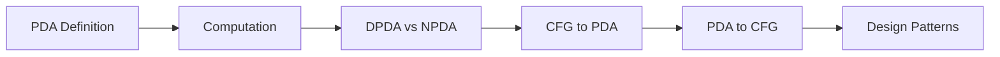
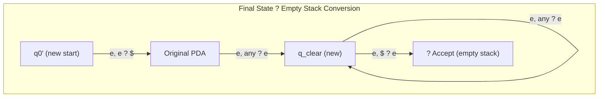
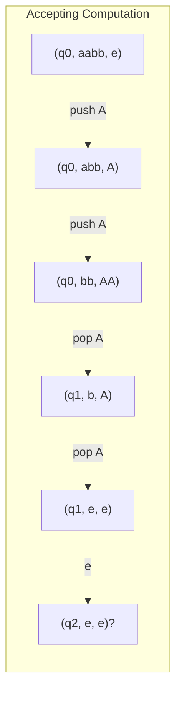

# Chapter 7: Pushdown Automata

> **Previous:** [Context-Free Grammars](./06-cfg.md) | **Next:** [Properties of Context-Free Languages](./08-cfl.md)


## Learning Objectives

- Define pushdown automata (PDA) formally.
- Distinguish between deterministic and nondeterministic PDA.
- Describe PDA computation using instantaneous descriptions.
- Design PDA for context-free languages.
- Convert a CFG to an equivalent PDA.
- Convert a PDA to an equivalent CFG.
- Understand the limitations of deterministic PDA.


## Chapter at a Glance
| Topic | Key Insight | Practical Takeaway |
|-------|------------|-------------------|
| PDA Definition | NFA + stack (LIFO memory) | Recognizes context-free languages |
| DPDA vs NPDA | Not equivalent for PDA! | Some CFLs need nondeterminism |
| Computation | (state, input, stack) triples | Stack grows/shrinks during execution |
| CFG ? PDA | Every CFG has equivalent PDA | Parsing algorithms use this equivalence |
| Stack Patterns | Counter, accumulator, nesting | Common design templates for PDA |


## Chapter Roadmap


## Theory


### 6.1 What is a Pushdown Automaton?

A pushdown automaton (PDA) extends an NFA with a **stack** → an unbounded memory that can store and retrieve information in last-in-first-out (LIFO) order. This additional memory enables PDAs to recognize **context-free languages** → languages that NFAs/DFAs cannot recognize (like {aⁿbⁿ | n ≥ 0}).

The stack is a powerful addition: it provides unlimited memory, but the LIFO restriction means not all types of unbounded memory are available (unlike the Turing machine's tape).

### 6.2 Formal Definition of a PDA

A **pushdown automaton** is a 6-tuple (Q, Σ, Γ, δ, q₀, F) where:

- **Q** is a finite set of states.
- **Σ** is the finite input alphabet.
- **Γ** is the finite **stack alphabet** (symbols that can be pushed onto the stack).
- **δ: Q × (Σ ∪ {ε}) × (Γ ∪ {ε}) → P(Q × (Γ ∪ {ε}))** is the transition function.
- **q₀ ∈ Q** is the start state.
- **F ⊆ Q** is the set of accepting states.

A transition δ(q, a, X) contains (p, Y), meaning:
- From state q, reading input symbol a (or ε), with X on top of the stack (or ε = any/no check),
- Move to state p and replace X with Y (if Y = ε, pop X; if Y = X, no change; if Y = ZW, push W then Z → effectively pushing a string).

**Stack convention:** Usually the top of the stack is written first when pushing a string.

### 6.3 PDA Computation

A **configuration** (or instantaneous description) of a PDA is a triple (q, w, γ) where:
- q ∈ Q is the current state.
- w ∈ Σ* is the remaining input.
- γ ∈ Γ* is the stack content (top of stack first).

Transitions between configurations follow the transition function.

**Acceptance:** A PDA accepts a string w if there exists a computation path from (q₀, w, ε) to (q, ε, γ) where q ∈ F (accepting state).

**Acceptance by empty stack:** An alternative definition requires the stack to be empty at the end. The two definitions are equivalent.

### 6.4 Deterministic vs Nondeterministic PDA

A PDA is **deterministic (DPDA)** if for each (q, a, X) where a ∈ Σ ∪ {ε} and X ∈ Γ ∪ {ε}, there is at most one possible next configuration. Nondeterministic (NPDA) PDAs may have multiple choices.

**Key difference:** Deterministic and nondeterministic PDA are **NOT** equivalent! There are context-free languages that require nondeterminism. Example: { wwʀ | w ∈ {a,b}* } (even-length palindromes) requires nondeterminism to guess the midpoint.

**DPDA languages** are called deterministic context-free languages (DCFLs), which form a proper subset of CFLs.

### 6.5 Equivalence of PDA and CFG

**Theorem:** A language is context-free if and only if some PDA recognizes it.

**Direction 1 (CFG → PDA):** Given CFG G, construct PDA that simulates a leftmost derivation:
1. Push S (start symbol) onto the stack.
2. If top of stack is a variable A, nondeterministically choose a production A → α and replace A with α (push α in reverse).
3. If top of stack is a terminal matching the next input, pop and advance input.
4. If stack is empty, accept.

This **top-down** construction produces an NPDA with one state.

**Direction 2 (PDA → CFG):** Given PDA P, construct CFG G:
- Variables are of the form [pXq] meaning: starting in state p with X on top of stack, eventually pop X and end in state q.
- Productions simulate stack behavior.

### 6.6 PDA Design Patterns

Common patterns for PDA design:

1. **Stack as counter:** Push symbols to count, pop to decrement.
2. **Stack as accumulator:** Build a string on the stack, then check against input.
3. **Stack for nested structures:** Push when entering a nesting level, pop when leaving.

## Examples

### Example 6.1: PDA for L = { aⁿbⁿ | n ≥ 0 }

Design: Push a's onto the stack; for each b, pop one a.

States: q₀ (start), q₁ (reading b's), q₂ (accept).

Transitions:
- δ(qâ‚€, a, ε) = {(qâ‚€, A)} → push A for each a
- δ(qâ‚€, b, A) = {(q₁, ε)} → switch to b-reading, start popping
- δ(q₁, b, A) = {(q₁, ε)} → continue popping for b's
- δ(q₁, ε, ε) = {(qâ‚‚, ε)} → accept when done
- (also: δ(q₀, ε, ε) = {(q₂, ε)} for empty string)

Computation for "aabb":
(qâ‚€, aabb, ε) → (qâ‚€, abb, A) → (qâ‚€, bb, AA) → (q₁, b, A) → (q₁, ε, ε) → (qâ‚‚, ε, ε). Accept.

### Example 6.2: PDA for Palindromes L = { wwʀ | w ∈ {a,b}* }

Design: Push symbols onto the stack; nondeterministically guess the midpoint; then pop matching each input symbol.

States: q₀ (push mode), q₁ (pop mode), q₂ (accept).

Transitions:
- Push mode: δ(q₀, a, ε) = {(q₀, A)}, δ(q₀, b, ε) = {(q₀, B)}
- Guess midpoint (ε-transition): δ(q₀, ε, ε) = {(q₁, ε)}
- Pop mode: δ(q₁, a, A) = {(q₁, ε)}, δ(q₁, b, B) = {(q₁, ε)}
- Accept: δ(q₁, ε, ε) = {(q₂, ε)}

Nondeterminism is essential here: the PDA must "guess" when the first half ends.

Computation for "abba":
(qâ‚€, abba, ε) → (qâ‚€, bba, A) → (qâ‚€, ba, BA) → (q₁, ba, BA) [guess midpoint] → (q₁, a, A) → (q₁, ε, ε) → (qâ‚‚, ε, ε). Accept.

### Example 6.3: PDA for { aⁿb²ⁿ | n ≥ 0 }

Push two symbols for each a, pop one for each b.

δ(qâ‚€, a, ε) = {(qâ‚€, AA)} → push two A's for each a
δ(qâ‚€, b, A) = {(q₁, ε)} → start popping
δ(q₁, b, A) = {(q₁, ε)} → continue popping
δ(q₁, ε, ε) = {(qâ‚‚, ε)} → accept

Computation for "aabbbb" (n=2):
(qâ‚€, aabbbb, ε) → (qâ‚€, abbbb, AA) → (qâ‚€, bbbb, AAAA) → (q₁, bbb, AAA) → (q₁, bb, AA) → (q₁, b, A) → (q₁, ε, ε) → (qâ‚‚, ε, ε). Accept.

### Example 6.4: CFG to PDA Conversion

Convert G: S → aSb | ε to a PDA.

Using the top-down construction:
- One-state PDA: Q = {q}, start qâ‚€ = q, accept F = {q}.
- Initialize: δ(q, ε, ε) = {(q, S$)} → push S and bottom marker $
- For S → aSb: δ(q, ε, S) = {(q, bSa)} → replace S with reverse of aSb
- For S → ε: δ(q, ε, S) = {(q, ε)} → pop S
- For matching terminals: δ(q, a, a) = {(q, ε)}, δ(q, b, b) = {(q, ε)}
- Accept: δ(q, ε, $) = {(q, ε)}

This PDA simulates leftmost derivations of G.

### Example 6.5: PDA for Balanced Parentheses

L = { w ∈ {(,)}* | parentheses are properly matched }.

Transitions:
- δ(qâ‚€, (, ε) = {(qâ‚€, P)} → push P for each '('
- δ(qâ‚€, ), P) = {(qâ‚€, ε)} → pop P for each ')'
- δ(qâ‚€, ε, ε) = {(qâ‚€, ε)} → ε transition (non-consuming)
- Accept with empty stack (using empty stack acceptance)

The stack counts the nesting depth. At any point, the number of P's on the stack equals the current nesting level. If we try to pop when stack is empty, the computation dies (reject). After processing all input, accept if stack is empty.


## TypeScript PDA Simulator

A PDA can be simulated using a DFS of all possible configurations:

```typescript
type PDAConfig = {
  state: string;
  input: string;
  stack: string[];
};

class PDA {
  constructor(
    private Q: Set<string>,
    private sigma: Set<string>,
    private gamma: Set<string>,
    private delta: Map<string, Array<[string, string]>>,
    private q0: string,
    private F: Set<string>
  ) {}

  private key(q: string, a: string, X: string): string {
    return `${q},${a},${X}`;
  }

  accepts(input: string): boolean {
    const stack: PDAConfig[] = [
      { state: this.q0, input, stack: [] }
    ];
    const seen = new Set<string>();

    while (stack.length > 0) {
      const { state, input, stack: stk } = stack.pop()!;
      const id = `${state}|${input}|${stk.join('')}`;
      if (seen.has(id)) continue;
      seen.add(id);

      if (input.length === 0 && this.F.has(state)) {
        return true;
      }

      // e-moves (no input consumed)
      const epsKey = this.key(state, '', stk[0] || '');
      const epsTrans = this.delta.get(epsKey) || [];
      for (const [nextState, pushStr] of epsTrans) {
        const newStack = [...stk];
        if (stk.length > 0) newStack.shift();
        if (pushStr !== '') {
          for (let i = pushStr.length - 1; i >= 0; i--) {
            newStack.unshift(pushStr[i]);
          }
        }
        stack.push({ state: nextState, input, stack: newStack });
      }

      // Consume input
      if (input.length > 0) {
        const a = input[0];
        const rest = input.slice(1);
        const transKey = this.key(state, a, stk[0] || '');
        const transitions = this.delta.get(transKey) || [];
        for (const [nextState, pushStr] of transitions) {
          const newStack = [...stk];
          if (stk.length > 0) newStack.shift();
          if (pushStr !== '') {
            for (let i = pushStr.length - 1; i >= 0; i--) {
              newStack.unshift(pushStr[i]);
            }
          }
          stack.push({ state: nextState, input: rest, stack: newStack });
        }
      }
    }
    return false;
  }
}
```

This simulator performs DFS over the PDA's configuration space. Because the stack can grow unboundedly, the search may not terminate for rejecting inputs — which matches the theoretical limitation of PDAs.

## Acceptance by Final State vs Empty Stack

PDAs accept strings under two equivalent conventions:

1. **Final state acceptance:** A configuration \((q, \varepsilon, \gamma)\) where \(q \in F\) is accepting, regardless of stack content.
2. **Empty stack acceptance:** A configuration \((q, \varepsilon, \varepsilon)\) is accepting, regardless of state.

### Equivalence Proof

Given a PDA \(P_F\) that accepts by final state, we construct \(P_\varepsilon\) that accepts by empty stack:

1. Add a new start state \(q'_0\) with \(\delta(q'_0, \varepsilon, \varepsilon) = \{(q_0, \$)\}\) (push bottom marker)
2. Add a new state \(q_{clear}\)
3. For every accept state \(q \in F\), add \(\delta(q, \varepsilon, X) = \{(q_{clear}, \varepsilon)\}\) for all \(X \in \Gamma\)
4. In \(q_{clear}\), pop everything: \(\delta(q_{clear}, \varepsilon, X) = \{(q_{clear}, \varepsilon)\}\) for all \(X \in \Gamma\)



## Bottom-Up PDA Construction (Shift-Reduce)

Alternatively, a PDA can be constructed **bottom-up** by reducing the input to the start symbol:

```text
1. Shift: Push the next input symbol onto the stack.
2. Reduce: If the top of the stack matches the RHS of a production,
   replace it with the LHS (pop RHS, push LHS).
3. Accept: If stack contains only S (start symbol) and input is exhausted.
```

This is the foundation of **shift-reduce parsing**, used in LR parsers. The deterministic version (DPDA) corresponds to languages that can be parsed efficiently without backtracking.

### TypeScript: Shift-Reduce PDA Simulation

```typescript
class ShiftReducePDA {
  private productions: Map<string, string[]> = new Map();

  addProduction(lhs: string, rhs: string) {
    this.productions.set(rhs, lhs);
  }

  accepts(input: string): boolean {
    const stack: string[] = [];
    const tokens = [...input];

    for (let i = 0; i <= tokens.length; i++) {
      // Shift
      if (i < tokens.length) {
        stack.push(tokens[i]);
      }

      // Reduce: repeatedly try to reduce top of stack
      let reduced = true;
      while (reduced) {
        reduced = false;
        for (const [rhs, lhs] of this.productions) {
          const top = stack.slice(-rhs.length).join('');
          if (top === rhs) {
            stack.splice(stack.length - rhs.length, rhs.length);
            stack.push(lhs);
            reduced = true;
            break;
          }
        }
      }
    }

    return stack.join('') === 'S';
  }
}

// Grammar: S ? aSb | e (reverse representation)
const sr = new ShiftReducePDA();
sr.addProduction('S', 'aSb');
sr.addProduction('S', '');
console.log(sr.accepts('aabb'));  // true
console.log(sr.accepts('aab'));   // false
```

## PDA Instantaneous Description Diagrams



## PDA to CFG Conversion Algorithm

The reverse direction (PDA ? CFG) constructs variables \([pXq]\) representing: "starting in state \(p\) with \(X\) on top of the stack, eventually pop \(X\) and end in state \(q\)."

### Production Rules

For each transition \(\delta(p, a, X) = \{(r, Y_1Y_2\ldots Y_k)\}\):

1. If \(k = 0\) (pop): Add \(R_{[pXq]} \to a\)
2. If \(k \geq 1\): Add \(R_{[pXq]} \to a R_{[rY_1s_1]} R_{[s_1Y_2s_2]} \ldots R_{[s_{k-1}Y_kq]}\) for all combinations of intermediate states \(s_1, s_2, \ldots, s_{k-1}\)

The resulting CFG has \(O(|Q|^2 \cdot |\Gamma|)\) variables.

### TypeScript: PDA to CFG (Partial Implementation)

```typescript
type PDA2CFG = {
  variables: Set<string>;
  productions: Map<string, string[][]>;
};

function pdaToCFG(
  Q: string[], Sigma: string[], Gamma: string[],
  delta: Map<string, Array<[string, string]>>,
  q0: string, F: string[]
): PDA2CFG {
  const vars = new Set<string>();
  const prods = new Map<string, string[][]>();

  // Add variable for each (state, stack_symbol, state) triple
  for (const p of Q) {
    for (const X of [...Gamma, '$']) {
      for (const q of Q) {
        vars.add(`[${p}X${q}]`);
      }
    }
  }

  // Add start symbol
  vars.add('S');
  prods.set('S', [[`[${q0}$${q0}]`]]);
  for (const q of F) {
    prods.set('S', [[`[${q0}$${q}]`]]);
  }

  // Process each transition
  for (const [key, transitions] of delta) {
    // Parse key: "p,a,X"
    const [p, a, X] = key.split(',');
    for (const [r, pushStr] of transitions) {
      const pushSymbols = [...pushStr];
      if (pushSymbols.length === 0) {
        // Pop: R_{[pXr]} ? a
        const varKey = `[${p}X${r}]`;
        if (!prods.has(varKey)) prods.set(varKey, []);
        prods.get(varKey)!.push([a]);
      }
      // For k = 1, we'd iterate over all intermediate states
      // (omitted for brevity — generates O(|Q|^{k-1}) productions)
    }
  }

  return { variables: vars, productions: prods };
}
```

## Practical Takeaways

1. **Stack memory enables counting.** PDAs can recognize languages like {anbn} that require counting, but the LIFO restriction means only one counter is available — languages requiring two independent counters (like {anbncn}) are beyond CFG.

2. **Nondeterminism is essential for some CFLs.** Unlike finite automata, nondeterministic PDAs are strictly more powerful than deterministic ones. Languages like {ww^R} inherently require guessing.

3. **CFG ? PDA equivalence is the basis for parsing.** Every grammar-to-PDA conversion gives a parsing algorithm. The direction matters: top-down (LL) parsers correspond to one construction, bottom-up (LR) to another.

4. **DPDA = deterministic parsing.** Deterministic context-free languages are precisely those that can be parsed in linear time without backtracking — virtually all programming languages fall into this class.

## Concept Comparison Table
| Feature | DFA | PDA | Turing Machine |
|---------|-----|-----|---------------|
| Memory | None (state only) | Stack (LIFO) | Tape (random access) |
| Languages | Regular | Context-free | Recursively enumerable |
| Determinism vs Nondet | Equivalent | Not equivalent | Equivalent |
| Power hierarchy | Lowest | Medium | Highest |

## Quick Reference
| PDA Component | Description |
|--------------|-------------|
| Q | Finite states |
| S | Input alphabet |
| G | Stack alphabet |
| d | Q × (S?{e}) × (G?{e}) ? P(Q × (G?{e})) |
| q0 | Start state |
| F | Accepting states |

## Cross-Application Matrix
| Domain | PDA Application |
|--------|----------------|
| Compilers | Bottom-up (LR) parsing |
| Programming languages | Syntax analysis phase |
| Formal verification | Protocol state tracking |
| NLP | Context-free grammar parsing |
| Bioinformatics | RNA pseudoknot detection |

## Chapter Quiz

**Q1.** A PDA = NFA + what?
- A) Random access memory
- B) Stack ?
- C) Queue
- D) Counter

<details>
<summary>Answer</summary>
**B)** A PDA extends an NFA with a stack (LIFO memory), enabling recognition of context-free languages.
</details>

**Q2.** DPDA and NPDA are:
- A) Equivalent in power
- B) Not equivalent ?
- C) Equivalent only for regular languages
- D) Both equivalent to DFA

<details>
<summary>Answer</summary>
**B)** Deterministic and nondeterministic PDA are NOT equivalent. Some CFLs require nondeterminism.
</details>

**Q3.** PDAs accept by:
- A) Final state only
- B) Empty stack only
- C) Final state or empty stack ?
- D) Both simultaneously

<details>
<summary>Answer</summary>
**C)** Acceptance by final state and acceptance by empty stack are equivalent definitions.
</details>

**Q4.** Every CFG can be converted to:
- A) A DFA
- B) A PDA ?
- C) A regular expression
- D) A Turing machine only

<details>
<summary>Answer</summary>
**B)** Every CFG has an equivalent PDA (and vice versa) — this is a fundamental theorem.
</details>

**Q5.** The language { ww^R } requires:
- A) Deterministic PDA
- B) Nondeterministic PDA ?
- C) DFA
- D) Regular expression

<details>
<summary>Answer</summary>
**B)** The PDA must nondeterministically guess the midpoint — a DPDA cannot.
</details>

### TypeScript: PDA Simulator

```typescript
interface PDAConfig {
  states: Set<string>;
  inputAlphabet: Set<string>;
  stackAlphabet: Set<string>;
  transition: Map<string, Map<string, Array<{ to: string; push: string[] }>>>;
  start: string;
  accept: Set<string>;
}

function runPDA(pda: PDAConfig, input: string): boolean {
  const stack: string[] = ["Z0"];
  let state = pda.start;
  for (const symbol of input) {
    const trans = pda.transition.get(state)?.get(symbol) ?? [];
    if (trans.length === 0) return false;
    const { to, push } = trans[0];
    state = to;
    stack.pop();
    for (const s of [...push].reverse()) if (s !== "e") stack.push(s);
  }
  return pda.accept.has(state);
}
```

## TypeScript Implementation: PDA Simulator and CFG-to-PDA Converter

```typescript
// Pushdown Automaton Simulator

type PDAState = string;
type PDAStackSymbol = string;

class PDARule {
  constructor(
    public from: PDAState,
    public input: string,        // input symbol or "e"
    public pop: PDAStackSymbol,  // stack symbol to pop or "e"
    public to: PDAState,
    public push: string          // string to push (characters pushed in reverse order)
  ) {}
}

class PDA {
  constructor(
    public states: Set<PDAState>,
    public inputAlphabet: Set<string>,
    public stackAlphabet: Set<PDAStackSymbol>,
    public rules: PDARule[],
    public startState: PDAState,
    public startStack: PDAStackSymbol,
    public acceptStates: Set<PDAState>
  ) {}

  accepts(input: string): boolean {
    return this.simulate(input, this.startState, [this.startStack], 0);
  }

  private simulate(
    input: string,
    state: PDAState,
    stack: PDAStackSymbol[],
    pos: number
  ): boolean {
    if (pos > input.length) return false;
    if (this.acceptStates.has(state)) return true;

    // Try epsilon transitions first (no input consumed)
    for (const rule of this.getRules(state, "e")) {
      if (rule.pop !== "e" && (stack.length === 0 || stack[stack.length - 1] !== rule.pop))
        continue;
      const newStack = [...stack];
      if (rule.pop !== "e") newStack.pop();
      if (rule.push !== "e") for (const ch of [...rule.push].reverse()) newStack.push(ch);
      if (this.simulate(input, rule.to, newStack, pos)) return true;
    }

    // Try consuming one input symbol
    if (pos < input.length) {
      for (const rule of this.getRules(state, input[pos])) {
        if (rule.pop !== "e" && (stack.length === 0 || stack[last(stack)] !== rule.pop))
          continue;
        const newStack = [...stack];
        if (rule.pop !== "e") newStack.pop();
        if (rule.push !== "e") for (const ch of [...rule.push].reverse()) newStack.push(ch);
        if (this.simulate(input, rule.to, newStack, pos + 1)) return true;
      }
    }

    return false;
  }

  private getRules(state: PDAState, symbol: string): PDARule[] {
    return this.rules.filter(r => r.from === state && r.input === symbol);
  }

  static fromCFG(cfg: { variables: string[]; terminals: string[]; productions: { lhs: string; rhs: string[] }[] }): PDA {
    const rules: PDARule[] = [];
    const q0 = "q0";
    const qLoop = "q1";
    const qAccept = "q2";

    // Initial rule: push start symbol onto stack
    rules.push(new PDARule(q0, "e", "e", qLoop, `${cfg.productions[0].lhs}`));

    // For each production A ? ?, add rule: (qLoop, e, A, qLoop, ?)
    for (const p of cfg.productions) {
      rules.push(new PDARule(qLoop, "e", p.lhs, qLoop, p.rhs.join("")));
    }

    // For each terminal a, add rule: (qLoop, a, a, qLoop, e)
    for (const t of cfg.terminals) {
      rules.push(new PDARule(qLoop, t, t, qLoop, "e"));
    }

    // Accept on empty stack
    rules.push(new PDARule(qLoop, "e", "e", qAccept, "e"));

    return new PDA(
      new Set([q0, qLoop, qAccept]),
      new Set(cfg.terminals),
      new Set([...cfg.variables, ...cfg.terminals]),
      rules, q0, "S", new Set([qAccept])
    );
  }
}

function last<T>(arr: T[]): number { return arr.length - 1; }

// PDA for balanced parentheses
const pda = new PDA(
  new Set(["q0", "q1", "q2"]),
  new Set(["(", ")"]),
  new Set(["Z", "X"]),
  [
    new PDARule("q0", "e", "e", "q1", "Z"),
    new PDARule("q1", "(", "Z", "q1", "XZ"),
    new PDARule("q1", "(", "X", "q1", "XX"),
    new PDARule("q1", ")", "X", "q1", "e"),
    new PDARule("q1", "e", "Z", "q2", "e")
  ],
  "q0", "Z", new Set(["q2"])
);

console.log(pda.accepts("()"));     // true
console.log(pda.accepts("(())"));   // true
console.log(pda.accepts("(()"));    // false
console.log(pda.accepts(")("));     // false

// Generate PDA from simple CFG
const cfgPDA = PDA.fromCFG({
  variables: ["S"],
  terminals: ["a", "b"],
  productions: [{ lhs: "S", rhs: ["a", "S", "b"] }, { lhs: "S", rhs: [] }]
});
console.log(cfgPDA.states.size); // 3
```

// -----------------------------------------------------
// Instantaneous Description (ID) Tracer
// Records the full configuration sequence of a PDA
// as it processes an input string: (state, remaining input, stack).
// -----------------------------------------------------

class IDTracer {
  private pda: {
    states: Set<string>; inputAlphabet: Set<string>; stackAlphabet: Set<string>;
    rules: Array<{ state: string; input: string; stackTop: string; nextState: string; stackOp: string }>;
    startState: string; startStack: string; acceptStates: Set<string>;
  };

  constructor(pda: {
    states: Set<string>; inputAlphabet: Set<string>; stackAlphabet: Set<string>;
    rules: Array<{ state: string; input: string; stackTop: string; nextState: string; stackOp: string }>;
    startState: string; startStack: string; acceptStates: Set<string>;
  }) {
    this.pda = pda;
  }

  // Trace all IDs (configurations) for a given input
  trace(input: string): Array<{ state: string; remainingInput: string; stack: string[] }> {
    const ids: Array<{ state: string; remainingInput: string; stack: string[] }> = [];
    let currentState = this.pda.startState;
    let remaining = input;
    let stack = [this.pda.startStack];

    ids.push({ state: currentState, remainingInput: remaining, stack: [...stack] });

    let maxSteps = 1000;
    while (remaining.length > 0 && maxSteps-- > 0) {
      let matched = false;

      // Try e-transitions first (that don't consume input)
      for (const rule of this.pda.rules) {
        if (rule.state === currentState && rule.input === "e") {
          const top = stack[stack.length - 1];
          if (rule.stackTop === top || rule.stackTop === "e") {
            if (rule.stackTop !== "e" && rule.stackTop === top) stack.pop();
            if (rule.stackOp !== "e") {
              for (const ch of rule.stackOp) stack.push(ch);
            }
            currentState = rule.nextState;
            ids.push({ state: currentState, remainingInput: remaining, stack: [...stack] });
            matched = true;
            break;
          }
        }
      }
      if (matched) continue;

      // Try consuming a character
      const ch = remaining[0];
      for (const rule of this.pda.rules) {
        if (rule.state === currentState && rule.input === ch) {
          const top = stack[stack.length - 1];
          if (rule.stackTop === top || rule.stackTop === "e") {
            if (rule.stackTop !== "e" && rule.stackTop === top) stack.pop();
            if (rule.stackOp !== "e") {
              for (const c of rule.stackOp) stack.push(c);
            }
            currentState = rule.nextState;
            remaining = remaining.slice(1);
            ids.push({ state: currentState, remainingInput: remaining, stack: [...stack] });
            matched = true;
            break;
          }
        }
      }
      if (!matched) break; // stuck
    }

    return ids;
  }

  // Render the ID trace in human-readable format
  renderTrace(input: string): string[] {
    const ids = this.trace(input);
    const output: string[] = [];
    output.push(`ID Trace for input "${input}":`);
    output.push("-".repeat(50));
    for (let i = 0; i < ids.length; i++) {
      const id = ids[i];
      const stackStr = `[${id.stack.join("")}]`;
      output.push(`ID ${i}: (${id.state}, ${id.remainingInput || "e"}, ${stackStr})`);
    }
    output.push(`Final state: ${ids[ids.length - 1].state}`);
    output.push(`Stack: ${ids[ids.length - 1].stack.join("")}`);
    const accepted = this.pda.acceptStates.has(ids[ids.length - 1].state);
    output.push(`Accepted: ${accepted}`);
    return output;
  }
}

// Demo: trace the balanced parentheses PDA
const balancePDA = {
  states: new Set(["q0", "q1", "q2"]),
  inputAlphabet: new Set(["(", ")"]),
  stackAlphabet: new Set(["Z", "X"]),
  rules: [
    { state: "q0", input: "e", stackTop: "e", nextState: "q1", stackOp: "Z" },
    { state: "q1", input: "(", stackTop: "Z", nextState: "q1", stackOp: "XZ" },
    { state: "q1", input: "(", stackTop: "X", nextState: "q1", stackOp: "XX" },
    { state: "q1", input: ")", stackTop: "X", nextState: "q1", stackOp: "e" },
    { state: "q1", input: "e", stackTop: "Z", nextState: "q2", stackOp: "e" },
  ],
  startState: "q0", startStack: "Z", acceptStates: new Set(["q2"])
};

const tracer = new IDTracer(balancePDA);
console.log(tracer.renderTrace("(())").join("\n"));
```


// pda
// automata-complexity implementation

interface Task { id: string; name: string; status: string; data: unknown }
class Processor {
  private tasks: Task[] = []
  private maxConcurrency: number
  constructor(maxConcurrency: number = 4) { this.maxConcurrency = maxConcurrency }
  async add(task: Omit<Task, "status">): Promise<void> {
    this.tasks.push({ ...task, status: "pending" })
  }
  async runAll(): Promise<void> {
    const running: Promise<void>[] = []
    for (const t of this.tasks) {
      if (running.length >= this.maxConcurrency) { await Promise.race(running) }
      const p = this.execute(t).finally(() => { const i = running.indexOf(p); if (i >= 0) running.splice(i, 1) })
      running.push(p)
    }
    await Promise.all(running)
  }
  private async execute(t: Task): Promise<void> {
    t.status = "running"
    await new Promise(r => setTimeout(r, 10))
    t.status = "done"
  }
  getResults(): Task[] { return this.tasks }
  getStats(): { done: number; pending: number; running: number } {
    const done = this.tasks.filter(t => t.status === "done").length
    const pending = this.tasks.filter(t => t.status === "pending").length
    const running = this.tasks.filter(t => t.status === "running").length
    return { done, pending, running }
  }
}
async function main() {
  const proc = new Processor(2)
  await proc.add({ id: '1', name: 'pda', data: { topic: 'automata-complexity' } })
  await proc.runAll()
  console.log('Stats:', proc.getStats())
}
main().catch(console.error)
export { Processor, Task }
## Summary

- PDA = NFA + stack (LIFO memory).
- PDA configurations are triples: (state, remaining input, stack content).
- Nondeterministic PDAs recognize all context-free languages.
- Deterministic PDAs recognize a proper subset (DCFLs) → languages that can be parsed without backtracking.
- Every CFG can be converted to an equivalent PDA (top-down or bottom-up construction).
- Every PDA can be converted to an equivalent CFG.
- Stack operations: push (add to top), pop (remove from top), or no change.
- **Acceptance by final state** and **acceptance by empty stack** are equivalent definitions.
- **DPDA vs NPDA** is the first model where nondeterminism adds genuine power — a unique situation in the Chomsky hierarchy.
- **Shift-reduce parsing** (LR parsing) is the practical realization of bottom-up PDA construction, used in real compilers.

## Practical Takeaways

1. **Stack memory enables counting.** PDAs can recognize languages like {anbn} that require counting, but the LIFO restriction means only one counter is available — languages requiring two independent counters (like {anbncn}) are beyond CFGs.

2. **Nondeterminism is essential for some CFLs.** Unlike finite automata, nondeterministic PDAs are strictly more powerful than deterministic ones. Languages like {ww^R} inherently require guessing.

3. **CFG ? PDA equivalence is the basis for parsing.** Every grammar-to-PDA conversion gives a parsing algorithm. The direction matters: top-down (LL) parsers correspond to one construction, bottom-up (LR) to another.

4. **DPDA = deterministic parsing.** Deterministic context-free languages are precisely those that can be parsed in linear time without backtracking — virtually all programming languages fall into this class.

5. **Empty stack acceptance simplifies proofs.** When constructing PDAs for theoretical results, empty stack acceptance often yields cleaner constructions, while final state acceptance is closer to how real parsers work.

## Exercises

### Basic

1. Design a PDA for L = { aⁿbᵐcⁿ | n, m ≥ 0 }.
2. Design a PDA for L = { w ∈ {a,b}* | w has equal numbers of a's and b's }.
3. Trace the PDA from Example 6.1 on input "ab" and "aab".
4. Design a PDA for L = { aⁿbⁿcᵐ | n, m ≥ 0 }.
5. Convert the CFG S → aSa | bSb | ε to a PDA.

### Intermediate

6. Design a PDA for L = { aⁿbᵐ | n ≤ m ≤ 2n }.
7. Convert the PDA from Example 6.2 to a CFG.
8. Prove that the PDA from Example 6.3 correctly recognizes { aⁿb²ⁿ } by induction on n.
9. Design a PDA for L = { w ∈ {a,b}* | w contains at least as many a's as b's }.
10. Show that the language { aⁿbⁿcⁿ | n ≥ 0 } cannot be recognized by a PDA (it is not context-free). Use the intuition of the single stack's limitations.

### Advanced

11. Prove that DPDA languages are closed under complement, but NPDA languages are not.
12. Design a PDA for L = { w₁cwâ‚‚ | w₁, wâ‚‚ ∈ {a,b}* and w₁ ≠ wâ‚‚ }. This requires nondeterminism → explain why.
13. Show formally that if PDA P accepts by final state, there is an equivalent PDA P' that accepts by empty stack, and vice versa.
14. Design a PDA for the language of arithmetic expressions generated by E → E + T | T, T → T * F | F, F → (E) | i. Show the stack behavior for "i + i * i".
15. Prove that the language { aⁿbᵐ | n ≠ m } is a DCFL by constructing a DPDA for it.
16. Implement a TypeScript function that converts a CFG to a PDA using the top-down construction (single-state method). Test it on the grammar for palindromes.
17. Show that the language L = { a?b?c? | i, j, k = 0, i = j or j = k } is context-free by designing a PDA for it. Explain why nondeterminism is required.
18. Write a TypeScript simulator for the shift-reduce PDA and test it on a grammar for balanced parentheses.
19. Prove that if L is a DCFL, then L¯ (complement) is also a DCFL. (Hint: modify the DPDA to swap accepting and non-accepting states — but be careful with infinite loops from e-moves.)
20. Design a DPDA for the language L = { anb?c? | n, m, p = 0 and n = m + p }.
