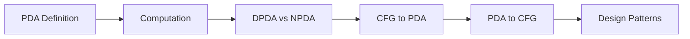
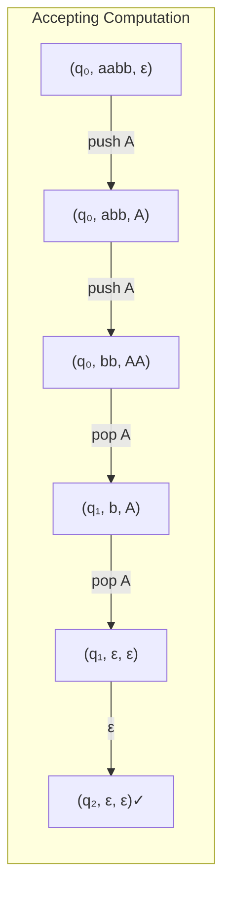

# Chapter 7: Pushdown Automata

> **Previous:** [Context-Free Grammars](./06-cfg.md) | **Next:** [Properties of Context-Free Languages](./08-cfl.md)


## Learning Objectives

- Define pushdown automata (PDA) formally.
- Distinguish between deterministic and nondeterministic PDA.
- Describe PDA computation using instantaneous descriptions.
- Design PDA for context-free languages.
- Convert a CFG to an equivalent PDA.
- Convert a PDA to an equivalent CFG.
- Understand the limitations of deterministic PDA.


## Chapter at a Glance
| Topic | Key Insight | Practical Takeaway |
|-------|------------|-------------------|
| PDA Definition | NFA + stack (LIFO memory) | Recognizes context-free languages |
| DPDA vs NPDA | Not equivalent for PDA! | Some CFLs need nondeterminism |
| Computation | (state, input, stack) triples | Stack grows/shrinks during execution |
| CFG ↔ PDA | Every CFG has equivalent PDA | Parsing algorithms use this equivalence |
| Stack Patterns | Counter, accumulator, nesting | Common design templates for PDA |


## Chapter Roadmap


## Theory


### 6.1 What is a Pushdown Automaton?

A pushdown automaton (PDA) extends an NFA with a **stack** — an unbounded memory that can store and retrieve information in last-in-first-out (LIFO) order. This additional memory enables PDAs to recognize **context-free languages** — languages that NFAs/DFAs cannot recognize (like {aⁿbⁿ | n ≥ 0}).

The stack is a powerful addition: it provides unlimited memory, but the LIFO restriction means not all types of unbounded memory are available (unlike the Turing machine's tape).

### 6.2 Formal Definition of a PDA

A **pushdown automaton** is a 6-tuple (Q, Σ, Γ, δ, q₀, F) where:

- **Q** is a finite set of states.
- **Σ** is the finite input alphabet.
- **Γ** is the finite **stack alphabet** (symbols that can be pushed onto the stack).
- **δ: Q × (Σ ∪ {ε}) × (Γ ∪ {ε}) → P(Q × (Γ ∪ {ε}))** is the transition function.
- **q₀ ∈ Q** is the start state.
- **F ⊆ Q** is the set of accepting states.

A transition δ(q, a, X) contains (p, Y), meaning:
- From state q, reading input symbol a (or ε), with X on top of the stack (or ε = any/no check),
- Move to state p and replace X with Y (if Y = ε, pop X; if Y = X, no change; if Y = ZW, push W then Z — effectively pushing a string).

**Stack convention:** Usually the top of the stack is written first when pushing a string.

### 6.3 PDA Computation

A **configuration** (or instantaneous description) of a PDA is a triple (q, w, γ) where:
- q ∈ Q is the current state.
- w ∈ Σ* is the remaining input.
- γ ∈ Γ* is the stack content (top of stack first).

Transitions between configurations follow the transition function.

**Acceptance:** A PDA accepts a string w if there exists a computation path from (q₀, w, ε) to (q, ε, γ) where q ∈ F (accepting state).

**Acceptance by empty stack:** An alternative definition requires the stack to be empty at the end. The two definitions are equivalent.

### 6.4 Deterministic vs Nondeterministic PDA

A PDA is **deterministic (DPDA)** if for each (q, a, X) where a ∈ Σ ∪ {ε} and X ∈ Γ ∪ {ε}, there is at most one possible next configuration. Nondeterministic (NPDA) PDAs may have multiple choices.

**Key difference:** Deterministic and nondeterministic PDA are **NOT** equivalent! There are context-free languages that require nondeterminism. Example: { wwʀ | w ∈ {a,b}* } (even-length palindromes) requires nondeterminism to guess the midpoint.

**DPDA languages** are called deterministic context-free languages (DCFLs), which form a proper subset of CFLs.

### 6.5 Equivalence of PDA and CFG

**Theorem:** A language is context-free if and only if some PDA recognizes it.

**Direction 1 (CFG → PDA):** Given CFG G, construct PDA that simulates a leftmost derivation:
1. Push S (start symbol) onto the stack.
2. If top of stack is a variable A, nondeterministically choose a production A → α and replace A with α (push α in reverse).
3. If top of stack is a terminal matching the next input, pop and advance input.
4. If stack is empty, accept.

This **top-down** construction produces an NPDA with one state.

**Direction 2 (PDA → CFG):** Given PDA P, construct CFG G:
- Variables are of the form [pXq] meaning: starting in state p with X on top of stack, eventually pop X and end in state q.
- Productions simulate stack behavior.

### 6.6 PDA Design Patterns

Common patterns for PDA design:

1. **Stack as counter:** Push symbols to count, pop to decrement.
2. **Stack as accumulator:** Build a string on the stack, then check against input.
3. **Stack for nested structures:** Push when entering a nesting level, pop when leaving.

## Examples

### Example 6.1: PDA for L = { aⁿbⁿ | n ≥ 0 }

Design: Push a's onto the stack; for each b, pop one a.

States: q₀ (start), q₁ (reading b's), q₂ (accept).

Transitions:
- δ(q₀, a, ε) = {(q₀, A)} — push A for each a
- δ(q₀, b, A) = {(q₁, ε)} — switch to b-reading, start popping
- δ(q₁, b, A) = {(q₁, ε)} — continue popping for b's
- δ(q₁, ε, ε) = {(q₂, ε)} — accept when done
- (also: δ(q₀, ε, ε) = {(q₂, ε)} for empty string)

Computation for "aabb":
(q₀, aabb, ε) → (q₀, abb, A) → (q₀, bb, AA) → (q₁, b, A) → (q₁, ε, ε) → (q₂, ε, ε). Accept.

### Example 6.2: PDA for Palindromes L = { wwʀ | w ∈ {a,b}* }

Design: Push symbols onto the stack; nondeterministically guess the midpoint; then pop matching each input symbol.

States: q₀ (push mode), q₁ (pop mode), q₂ (accept).

Transitions:
- Push mode: δ(q₀, a, ε) = {(q₀, A)}, δ(q₀, b, ε) = {(q₀, B)}
- Guess midpoint (ε-transition): δ(q₀, ε, ε) = {(q₁, ε)}
- Pop mode: δ(q₁, a, A) = {(q₁, ε)}, δ(q₁, b, B) = {(q₁, ε)}
- Accept: δ(q₁, ε, ε) = {(q₂, ε)}

Nondeterminism is essential here: the PDA must "guess" when the first half ends.

Computation for "abba":
(q₀, abba, ε) → (q₀, bba, A) → (q₀, ba, BA) → (q₁, ba, BA) [guess midpoint] → (q₁, a, A) → (q₁, ε, ε) → (q₂, ε, ε). Accept.

### Example 6.3: PDA for { aⁿb²ⁿ | n ≥ 0 }

Push two symbols for each a, pop one for each b.

δ(q₀, a, ε) = {(q₀, AA)} — push two A's for each a
δ(q₀, b, A) = {(q₁, ε)} — start popping
δ(q₁, b, A) = {(q₁, ε)} — continue popping
δ(q₁, ε, ε) = {(q₂, ε)} — accept

Computation for "aabbbb" (n=2):
(q₀, aabbbb, ε) → (q₀, abbbb, AA) → (q₀, bbbb, AAAA) → (q₁, bbb, AAA) → (q₁, bb, AA) → (q₁, b, A) → (q₁, ε, ε) → (q₂, ε, ε). Accept.

### Example 6.4: CFG to PDA Conversion

Convert G: S → aSb | ε to a PDA.

Using the top-down construction:
- One-state PDA: Q = {q}, start qâ‚€ = q, accept F = {q}.
- Initialize: δ(q, ε, ε) = {(q, S$)} — push S and bottom marker $
- For S → aSb: δ(q, ε, S) = {(q, bSa)} — replace S with reverse of aSb
- For S → ε: δ(q, ε, S) = {(q, ε)} — pop S
- For matching terminals: δ(q, a, a) = {(q, ε)}, δ(q, b, b) = {(q, ε)}
- Accept: δ(q, ε, $) = {(q, ε)}

This PDA simulates leftmost derivations of G.

### Example 6.5: PDA for Balanced Parentheses

L = { w ∈ {(,)}* | parentheses are properly matched }.

Transitions:
- δ(q₀, (, ε) = {(q₀, P)} — push P for each '('
- δ(q₀, ), P) = {(q₀, ε)} — pop P for each ')'
- δ(q₀, ε, ε) = {(q₀, ε)} — ε transition (non-consuming)
- Accept with empty stack (using empty stack acceptance)

The stack counts the nesting depth. At any point, the number of P's on the stack equals the current nesting level. If we try to pop when stack is empty, the computation dies (reject). After processing all input, accept if stack is empty.


## TypeScript PDA Simulator

A PDA can be simulated using a DFS of all possible configurations:

```typescript
type PDAConfig = {
  state: string;
  input: string;
  stack: string[];
};

class PDA {
  constructor(
    private Q: Set<string>,
    private sigma: Set<string>,
    private gamma: Set<string>,
    private delta: Map<string, Array<[string, string]>>,
    private q0: string,
    private F: Set<string>
  ) {}

  private key(q: string, a: string, X: string): string {
    return `${q},${a},${X}`;
  }

  accepts(input: string): boolean {
    const stack: PDAConfig[] = [
      { state: this.q0, input, stack: [] }
    ];
    const seen = new Set<string>();

    while (stack.length > 0) {
      const { state, input, stack: stk } = stack.pop()!;
      const id = `${state}|${input}|${stk.join('')}`;
      if (seen.has(id)) continue;
      seen.add(id);

      if (input.length === 0 && this.F.has(state)) {
        return true;
      }

      // ε-moves (no input consumed)
      const epsKey = this.key(state, '', stk[0] || '');
      const epsTrans = this.delta.get(epsKey) || [];
      for (const [nextState, pushStr] of epsTrans) {
        const newStack = [...stk];
        if (stk.length > 0) newStack.shift();
        if (pushStr !== '') {
          for (let i = pushStr.length - 1; i >= 0; i--) {
            newStack.unshift(pushStr[i]);
          }
        }
        stack.push({ state: nextState, input, stack: newStack });
      }

      // Consume input
      if (input.length > 0) {
        const a = input[0];
        const rest = input.slice(1);
        const transKey = this.key(state, a, stk[0] || '');
        const transitions = this.delta.get(transKey) || [];
        for (const [nextState, pushStr] of transitions) {
          const newStack = [...stk];
          if (stk.length > 0) newStack.shift();
          if (pushStr !== '') {
            for (let i = pushStr.length - 1; i >= 0; i--) {
              newStack.unshift(pushStr[i]);
            }
          }
          stack.push({ state: nextState, input: rest, stack: newStack });
        }
      }
    }
    return false;
  }
}
```

This simulator performs DFS over the PDA's configuration space. Because the stack can grow unboundedly, the search may not terminate for rejecting inputs — which matches the theoretical limitation of PDAs.

## Bottom-Up PDA Construction

Alternatively, a PDA can be constructed **bottom-up** by reducing the input to the start symbol:

```text
1. Shift: Push the next input symbol onto the stack.
2. Reduce: If the top of the stack matches the RHS of a production,
   replace it with the LHS (pop RHS, push LHS).
3. Accept: If stack contains only S (start symbol) and input is exhausted.
```

This is the foundation of **shift-reduce parsing**, used in LR parsers (Chapter 10). The deterministic version (DPDA) corresponds to languages that can be parsed efficiently without backtracking.

## PDA Instantaneous Description Diagrams



## Practical Takeaways

1. **Stack memory enables counting.** PDAs can recognize languages like {aⁿbⁿ} that require counting, but the LIFO restriction means only one counter is available — languages requiring two independent counters (like {aⁿbⁿcⁿ}) are beyond CFG.

2. **Nondeterminism is essential for some CFLs.** Unlike finite automata, nondeterministic PDAs are strictly more powerful than deterministic ones. Languages like {ww^R} inherently require guessing.

3. **CFG ↔ PDA equivalence is the basis for parsing.** Every grammar-to-PDA conversion gives a parsing algorithm. The direction matters: top-down (LL) parsers correspond to one construction, bottom-up (LR) to another.

4. **DPDA = deterministic parsing.** Deterministic context-free languages are precisely those that can be parsed in linear time without backtracking — virtually all programming languages fall into this class.

## Concept Comparison Table
| Feature | DFA | PDA | Turing Machine |
|---------|-----|-----|---------------|
| Memory | None (state only) | Stack (LIFO) | Tape (random access) |
| Languages | Regular | Context-free | Recursively enumerable |
| Determinism vs Nondet | Equivalent | Not equivalent | Equivalent |
| Power hierarchy | Lowest | Medium | Highest |

## Quick Reference
| PDA Component | Description |
|--------------|-------------|
| Q | Finite states |
| Σ | Input alphabet |
| Γ | Stack alphabet |
| δ | Q × (Σ∪{ε}) × (Γ∪{ε}) → P(Q × (Γ∪{ε})) |
| q₀ | Start state |
| F | Accepting states |

## Cross-Application Matrix
| Domain | PDA Application |
|--------|----------------|
| Compilers | Bottom-up (LR) parsing |
| Programming languages | Syntax analysis phase |
| Formal verification | Protocol state tracking |
| NLP | Context-free grammar parsing |
| Bioinformatics | RNA pseudoknot detection |

## Chapter Quiz

**Q1.** A PDA = NFA + what?
- A) Random access memory
- B) Stack ✓
- C) Queue
- D) Counter

<details>
<summary>Answer</summary>
**B)** A PDA extends an NFA with a stack (LIFO memory), enabling recognition of context-free languages.
</details>

**Q2.** DPDA and NPDA are:
- A) Equivalent in power
- B) Not equivalent ✓
- C) Equivalent only for regular languages
- D) Both equivalent to DFA

<details>
<summary>Answer</summary>
**B)** Deterministic and nondeterministic PDA are NOT equivalent. Some CFLs require nondeterminism.
</details>

**Q3.** PDAs accept by:
- A) Final state only
- B) Empty stack only
- C) Final state or empty stack ✓
- D) Both simultaneously

<details>
<summary>Answer</summary>
**C)** Acceptance by final state and acceptance by empty stack are equivalent definitions.
</details>

**Q4.** Every CFG can be converted to:
- A) A DFA
- B) A PDA ✓
- C) A regular expression
- D) A Turing machine only

<details>
<summary>Answer</summary>
**B)** Every CFG has an equivalent PDA (and vice versa) — this is a fundamental theorem.
</details>

**Q5.** The language { ww^R } requires:
- A) Deterministic PDA
- B) Nondeterministic PDA ✓
- C) DFA
- D) Regular expression

<details>
<summary>Answer</summary>
**B)** The PDA must nondeterministically guess the midpoint — a DPDA cannot.
</details>

## Summary

- PDA = NFA + stack (LIFO memory).
- PDA configurations are triples: (state, remaining input, stack content).
- Nondeterministic PDAs recognize all context-free languages.
- Deterministic PDAs recognize a proper subset (DCFLs) — languages that can be parsed without backtracking.
- Every CFG can be converted to an equivalent PDA (top-down or bottom-up construction).
- Every PDA can be converted to an equivalent CFG.
- Stack operations: push (add to top), pop (remove from top), or no change.

## Exercises

### Basic

1. Design a PDA for L = { aⁿbᵐcⁿ | n, m ≥ 0 }.
2. Design a PDA for L = { w ∈ {a,b}* | w has equal numbers of a's and b's }.
3. Trace the PDA from Example 6.1 on input "ab" and "aab".
4. Design a PDA for L = { aⁿbⁿcᵐ | n, m ≥ 0 }.
5. Convert the CFG S → aSa | bSb | ε to a PDA.

### Intermediate

6. Design a PDA for L = { aⁿbᵐ | n ≤ m ≤ 2n }.
7. Convert the PDA from Example 6.2 to a CFG.
8. Prove that the PDA from Example 6.3 correctly recognizes { aⁿb²ⁿ } by induction on n.
9. Design a PDA for L = { w ∈ {a,b}* | w contains at least as many a's as b's }.
10. Show that the language { aⁿbⁿcⁿ | n ≥ 0 } cannot be recognized by a PDA (it is not context-free). Use the intuition of the single stack's limitations.

### Advanced

11. Prove that DPDA languages are closed under complement, but NPDA languages are not.
12. Design a PDA for L = { w₁cw₂ | w₁, w₂ ∈ {a,b}* and w₁ ≠ w₂ }. This requires nondeterminism — explain why.
13. Show formally that if PDA P accepts by final state, there is an equivalent PDA P' that accepts by empty stack, and vice versa.
14. Design a PDA for the language of arithmetic expressions generated by E → E + T | T, T → T * F | F, F → (E) | i. Show the stack behavior for "i + i * i".
15. Prove that the language { aⁿbᵐ | n ≠ m } is a DCFL by constructing a DPDA for it.
