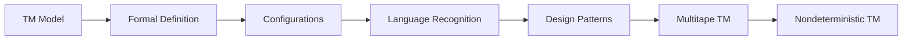
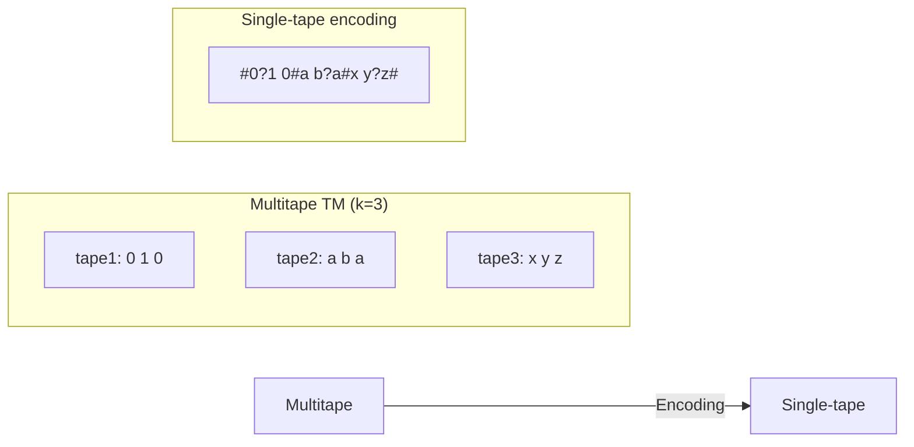
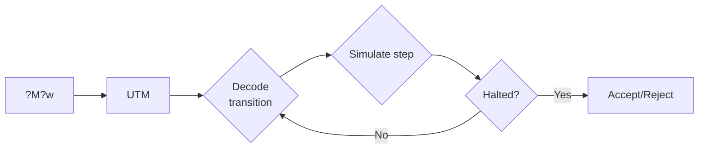
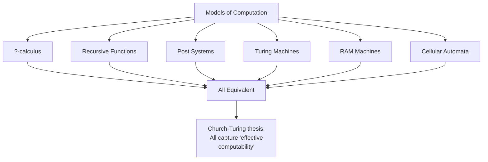

# Chapter 9: Turing Machines

> **Previous:** [Properties of Context-Free Languages](./08-cfl.md) | **Next:** [Turing Machine Extensions](./10-turing-extensions.md)


## Learning Objectives

- Define a Turing machine formally.
- Trace Turing machine computations.
- Design Turing machines for specific languages and functions.
- Understand Turing machine variants: multitape, nondeterministic.
- Prove equivalence of Turing machine variants.
- Compare Turing machines with finite automata and PDAs.
- Describe the relationship between Turing machines and algorithms.

<!-- Image Gallery -->
<section class="lesson-visuals" aria-label="Visual learning resources">
  <header><span>VISUAL LEARNING</span><h2>See it. Review it. Remember it.</h2></header>
  <a class="lesson-visual-card" href="../../../assets/images/lessons/theory-of-computation/09-turing/handwritten-notes.svg" target="_blank" rel="noopener">
    
    <span><strong>Handwritten notes</strong>Condensed notes for deliberate review.</span>
  </a>
  <a class="lesson-visual-card" href="../../../assets/images/lessons/theory-of-computation/09-turing/sticky-notes.svg" target="_blank" rel="noopener">
    
    <span><strong>Sticky-note revision</strong>Fast recall prompts for revision.</span>
  </a>
  <a class="lesson-visual-card" href="../../../assets/images/lessons/theory-of-computation/09-turing/visual-explanation.svg" target="_blank" rel="noopener">
    
    <span><strong>Visual concept guide</strong>A connected explanation of the key ideas.</span>
  </a>
</section>
<!-- End Image Gallery -->


## Chapter at a Glance
| Topic | Key Insight | Practical Takeaway |
|-------|------------|-------------------|
| TM Model | Infinite tape, read/write head | Most powerful computation model |
| Formal Definition | 7-tuple (Q, S, G, d, q0, q_accept, q_reject) | Universal model of algorithms |
| Configurations | (state, tape content, head position) triple | Complete computation snapshot |
| Multitape TM | k independent tapes | Equivalent to single-tape TM |
| Nondeterministic TM | Multiple next-configuration choices | Equivalent to DTM for computability |


## Chapter Roadmap


## Theory


### 8.1 The Turing Machine Model


Alan Turing introduced the Turing machine in 1936 as a model of "computation by a human clerk." It is the most powerful model of computation we have → anything computable by any mechanical process can be computed by a Turing machine (the Church-Turing thesis).

A Turing machine consists of:
- An **infinite tape** divided into cells, each containing a symbol from a finite alphabet.
- A **tape head** that can read and write symbols and move left or right.
- A **finite control** (states) that determines the machine's behavior.

Unlike finite automata, the TM has **unbounded memory** (the infinite tape) and can both **read and write**. Unlike PDAs, the TM can access **any position** on the tape (not just the top of a stack).

### 8.2 Formal Definition of a Turing Machine


A **Turing machine** is a 7-tuple (Q, Σ, Γ, δ, q₀, q_accept, q_reject) where:

- **Q** is a finite set of states.
- **Σ** is the input alphabet (does not contain the blank symbol).
- **Γ** is the tape alphabet (Σ ⊂ Γ, includes blank symbol ␣).
- **δ: Q × Γ → Q × Γ × {L, R}** is the transition function.
- **q₀ ∈ Q** is the start state.
- **q_accept ∈ Q** is the accepting state.
- **q_reject ∈ Q** is the rejecting state (q_reject ≠ q_accept).

A transition δ(q, a) = (r, b, L) means:
- In state q, reading symbol a on the tape,
- Write symbol b, move the head left, and go to state r.

**Computation:** Starting with the input on the tape (head at leftmost symbol), the TM repeatedly applies δ until it enters q_accept (accepts) or q_reject (rejects). The TM may also **loop forever** (never halt).

### 8.3 Configuration and Computation


A **configuration** of a TM is a triple (q, u, v) where:
- q ∈ Q is the current state.
- uv is the tape content (with the head at the first symbol of v).
- All cells beyond the last symbol of uv are blank.

We write configurations as: u q v, where the current state is before the symbol under the head.

Example: `qâ‚€ 0101` means state qâ‚€, tape contains "0101", head at the first 0.

The start configuration on input w is: qâ‚€ w.

An **accepting configuration** has state q_accept. A **rejecting configuration** has state q_reject.

A TM **halts** when it enters q_accept or q_reject. Otherwise it loops.

### 8.4 Turing Machine Language


A Turing machine M **accepts** string w if there is a sequence of configurations C₀, C₁, …, Cₖ where:
- Câ‚€ is the start configuration for w.
- Each Cᵢ yields Cᵢ₊₁ via δ.
- Câ‚– is an accepting configuration.

The **language recognized** by M is:
L(M) = { w | M accepts w }

Turing machines recognize exactly the **recursively enumerable** (RE) languages. If a TM halts on all inputs, it's a **decider** and recognizes a **recursive** language.

### 8.5 Acceptors, Deciders, and Recognizers


A TM can play three distinct roles:

| Role | Behavior | Language Class |
|------|----------|---------------|
| **Recognizer** | Accepts strings in L; may loop or reject on strings not in L | Recursively enumerable (RE) |
| **Decider** | Always halts: accepts strings in L, rejects strings not in L | Recursive |
| **Enumerator** | Generates all strings in L one by one (possibly with repetitions) | RE |

**Theorem:** A language is RE iff some enumerator enumerates it.

**Proof sketch (?):** Given a TM M that recognizes L, construct an enumerator E that:
1. Generates strings s1, s2, s3, ... over S* in lexicographic order.
2. For each s?, runs M on s? for at most i steps.
3. If M accepts within i steps, prints s?.

This "dovetailing" technique ensures every accepted string is eventually printed.

### 8.6 Designing Turing Machines


Designing TMs is akin to writing low-level programs. Common design patterns:

1. **Marking symbols:** Use tape symbols with dots (e.g., á) to mark already-processed symbols.
2. **Multiple passes:** Sweep the tape left-to-right and right-to-left repeatedly.
3. **Shift and insert:** Move data to make room for new symbols.
4. **Subroutine states:** Use sets of states to implement subroutine-like behavior.
5. **Multi-track tape:** Treat each tape cell as containing a tuple (like an array).

### 8.7 The TM Computation: A Complete Example


Let's trace the TM for { anbncn | n = 0 } on input "aabbcc":

**Step-by-step trace:**

| Step | State | Tape (head at ^) | Action |
|------|-------|-------------------|--------|
| 0 | q0 | ^a a b b c c ? | Mark a ? X |
| 1 | q1 | X ^a b b c c ? | Scan right for b |
| 2 | q1 | X a ^b b c c ? | Read b, mark ? Y |
| 3 | q2 | X a Y ^b c c ? | Scan right for c |
| 4 | q2 | X a Y b ^c c ? | Read c, mark ? Z |
| 5 | q3 | X a Y b Z ^c ? | Scan left for X |
| 6 | q3 | X a Y b ^Z c ? | Continue left |
| 7 | q3 | ^X a Y b Z c ? | Back to start |
| 8 | q0 | X ^a Y b Z c ? | Mark next a ? X |
| 9 | q1 | X X ^Y b Z c ? | Scan right for b |
| 10 | q1 | X X Y ^b Z c ? | Mark b ? Y |
| 11 | q2 | X X Y Y ^Z c ? | Scan right for c |
| 12 | q2 | X X Y Y Z ^c ? | Mark c ? Z |
| 13 | q3 | X X Y Y Z ^Z ? | Back to start |
| 14 | q0 | X X Y Y Z ^Z ? | No more a's, verify |
| 15 | q4 | X X Y Y Z ^Z ? | Scan right |
| 16 | q_accept | X X Y Y Z Z ^? | Accept! |

This trace shows the algorithm's pattern: each pass removes one a, one b, and one c.

### 8.8 Multitape Turing Machines


A **k-tape Turing machine** has k independent tapes, each with its own read/write head. The transition function becomes:

δ: Q × Γᵏ → Q × Γᵏ × {L, R}ᵏ

The machine reads all k heads simultaneously, writes to all k tapes, and moves all k heads.

**Theorem:** Every multitape Turing machine has an equivalent single-tape Turing machine.

**Proof sketch:** Use a single tape with "tracks" separated by a delimiter #. Each track stores the content of one tape. A special marker (ḃ) indicates the position of each tape's head. Simulating one step of the k-tape machine may require sweeping the entire tape to find all head positions, making the simulation potentially slow but correct.



### 8.7 Nondeterministic Turing Machines


A **nondeterministic Turing machine (NTM)** has a transition function:

δ: Q × Γ → P(Q × Γ × {L, R})

At each step, the NTM may have multiple choices. It accepts if **any** branch leads to q_accept.

**Theorem:** Every NTM has an equivalent deterministic Turing machine.

**Proof sketch:** Simulate the NTM using a **breadth-first** search of the computation tree. The DTM uses three tapes: (1) input tape, (2) work tape, (3) address tape that encodes which branch to take at each step. The DTM systematically tries all possible sequences of nondeterministic choices.

**Consequence for complexity:** The simulation may require exponential time (exploring all branches), but for computability, NTMs add no power.

### 8.8 Turing Machine Variants


Other equivalent variants:
- **Doubly infinite tape:** Tape extends infinitely in both directions.
- **Random access TM:** Can jump to any tape position in one step.
- **Multi-dimensional tape:** Tape is a grid.
- **Oblivious TM:** Head movement depends only on step number, not on input.
- **Write-once TM:** Can write each cell only once.
- **Counter machine:** Uses counters instead of a tape (with 2+ counters, equivalent to TM).

All of these are equivalent in power to the standard single-tape TM.

## Examples

### Example 8.1: TM for L = { aⁿbⁿcⁿ | n ≥ 0 }

Strategy: Scan left to right, marking one a, one b, and one c each pass. Repeat until all symbols are marked.

Detailed transitions:

1. **Initial setup:** Read first symbol.
   - If blank → accept (empty string).
   - If a → mark it as X, move right to find b.
   - If b or c → reject (wrong order).

2. **Mark a, b, c cycle:**
   - From marked a, move right past all a's and Y's to find first b, mark as Y.
   - Move right past all b's and Z's to find first c, mark as Z.
   - Move left to the leftmost X or beginning, repeat.

3. **Cleanup:**
   - When no unmarked a remains, verify all b's and c's are marked.
   - If so, accept.

State design:
- qâ‚€: Initial → find first a, mark as X, go to q₁
- q₁: Finding b → scan right over a, Y; mark first b as Y, go to qâ‚‚
- qâ‚‚: Finding c → scan right over b, Z; mark first c as Z, go to q₃
- q₃: Return left → scan left over X, Y, Z, a, b, c to leftmost; go to qâ‚€
- qâ‚„: Verification → check all symbols are X, Y, Z
- q_accept, q_reject

### Example 8.2: TM for Binary Increment

Given a binary number on the tape, add 1 to it.

Strategy: Start at the least significant bit (rightmost), propagate carries leftward.

```
State qâ‚€: move right to end of input
  δ(q₀, 0) = (q₀, 0, R)
  δ(q₀, 1) = (q₀, 1, R)
  δ(q₀, ␣) = (q₁, ␣, L)  -- reached end, start incrementing

State q₁: increment current digit
  δ(q₁, 0) = (qâ‚‚, 1, L)  -- 0→1, done
  δ(q₁, 1) = (q₁, 0, L)  -- 1→0, carry
  δ(q₁, ␣) = (qâ‚‚, 1, L)  -- overflow: 1000... → 1000...1

State qâ‚‚: move to start and halt
  δ(q₂, 0) = (q₂, 0, L)
  δ(q₂, 1) = (q₂, 1, L)
  δ(q₂, ␣) = (q_accept, ␣, R)
```

Trace for "1011" (11): qâ‚€1011 → * → 1011 q₁ (at ␣) → 101 q₁ 1 → 10 q₁ 01 → 1 q₁ 001 → qâ‚‚ 1100 → * → q_accept 1100 (12).

### Example 8.3: TM for Palindrome Recognition

Language: L = { w ∈ {0,1}* | w = wʀ }.

**Strategy:**
1. Compare first and last symbols → if they match, erase both and repeat.
2. If only ε or one symbol remains, accept.

Transitions (sketch):
- qâ‚€: Read first symbol. If 0 → replace with X, go to q₁ (looking for 0 at end). If 1 → replace with X, go to qâ‚‚. If blank → accept.
- q₁: Scan right to end, ignoring 0,1. At blank, move left. If 0 → replace with X, go to q₃. If 1 or X → reject.
- q₂: Symmetric to q₁ for 1.
- q₃: Scan left to beginning (past X's, 0's, 1's). At X → move right to next unprocessed symbol, go to qâ‚€.

### Example 8.4: Simulating a Multitape TM on a Single Tape

To simulate a 2-tape TM on a single tape:
1. Represent tape contents as: #tape1#tape2#.
2. Mark head positions with dots: #0ḃ1#1ǟ0#.
3. To simulate one step: scan from first # to last # to find head positions, read both symbols, then scan back to write and move heads.

### Example 8.5: NTM for the Satisfiability Problem (SAT)

Given a Boolean formula in CNF, determine if there is a satisfying assignment. An NTM can:
1. Nondeterministically write 0 or 1 for each variable (the "guess" phase).
2. Deterministically evaluate the formula (the "check" phase).

If any assignment satisfies the formula, the NTM accepts. The DTM simulation would try all 2ⁿ assignments exponentially.


## Concept Comparison Table
| Model | Memory | Read/Write | Power |
|-------|--------|-----------|-------|
| DFA | None (state only) | Read only | Regular |
| PDA | Stack (LIFO) | Read/pop/push | Context-free |
| TM | Tape (random access) | Read and write | RE |

## Quick Reference
| TM Component | Description |
|--------------|-------------|
| Q | Finite set of states |
| S | Input alphabet (no blank) |
| G | Tape alphabet (includes blank ?) |
| d | Q × G ? Q × G × {L, R} |
| q0 | Start state |
| q_accept | Accept state |
| q_reject | Reject state |

## Cross-Application Matrix
| Domain | TM Concept |
|--------|-----------|
| Algorithm theory | Formal model of computation |
| Complexity theory | Time/space complexity definition |
| Programming | Stored-program concept (UTM) |
| Compilers | Code generation as tape transformation |
| AI | Problem reduction to TM acceptance |

## Chapter Quiz

**Q1.** A TM differs from a PDA by having:
- A) More states
- B) Random access memory (tape) ?
- C) Nondeterminism
- D) Finite control

<details>
<summary>Answer&lt;/summary&gt;
**B)** A TM's tape allows random access read/write, unlike the PDA's stack.
</details>

**Q2.** How many tapes does a standard TM have?
- A) 1 ?
- B) 2
- C) 3
- D) Unlimited

<details>
<summary>Answer&lt;/summary&gt;
**A)** The standard TM has a single tape. Multitape TMs are equivalent but not standard.
</details>

**Q3.** A TM configuration is a triple of:
- A) State, input, output
- B) State, tape content, head position ?
- C) State only
- D) State, stack, input

<details>
<summary>Answer&lt;/summary&gt;
**B)** (state, tape content, head position) fully describes the TM at any point.
</details>

**Q4.** Multitape TMs are ___ standard TMs:
- A) More powerful than
- B) Equivalent to ?
- C) Less powerful than
- D) Incomparable to

<details>
<summary>Answer&lt;/summary&gt;
**B)** Every multitape TM can be simulated by a single-tape TM (with possible slowdown).
</details>

**Q5.** Nondeterministic TMs are ___ deterministic TMs:
- A) More powerful
- B) Equivalent (for computability) ?
- C) Less powerful
- D) Only equivalent for regular languages

<details>
<summary>Answer&lt;/summary&gt;
**B)** NTM and DTM recognize the same languages (though NTM may be faster).
</details>

## Practical Takeaways

1. **TMs are the ultimate model of what computers can do.** While real computers have finite memory, any algorithm running on a real computer can be simulated by a TM. Understanding TMs means understanding the fundamental limits of computation.

2. **TM design is programming at its most basic.** Designing a TM forces you to think about state, tape operations, and control flow at the most primitive level — analogous to programming in assembly language without a stack or registers.

3. **Equivalent variants simplify proofs.** The equivalence of multitape, nondeterministic, and other TM variants means you can use the most convenient model for design and the simplest for analysis. When proving something about TMs, choose the variant that makes the proof easiest.

4. **TMs are not practical machines.** No one builds Turing machines for real computation. Their value is theoretical: they define the boundary of what is computable. Real engineering uses restricted models (DFA, PDA) for efficiency.

## TypeScript Implementation: Turing Machine Tape Simulator

```typescript
// Turing Machine Simulator

type TMState = string;
type TMSymbol = string;

class TuringMachine {
  constructor(
    public states: Set<TMState>,
    public inputAlphabet: Set<TMSymbol>,
    public tapeAlphabet: Set<TMSymbol>,
    public transitions: Map<string, { nextState: TMState; write: TMSymbol; direction: "L" | "R" }>,
    public start: TMState,
    public accept: TMState,
    public reject: TMState
  ) {}

  simulate(input: string, maxSteps: number = 1000): { accepted: boolean; steps: number; tape: string } {
    let tape = input.split("");
    let head = 0;
    let state = this.start;
    let steps = 0;

    const tapeLog: string[] = [];

    while (state !== this.accept && state !== this.reject && steps < maxSteps) {
      const symbol = head < tape.length ? tape[head] : "?";
      const key = `${state},${symbol}`;
      const trans = this.transitions.get(key);

      if (!trans) {
        state = this.reject;
        break;
      }

      // Write symbol
      if (head >= tape.length) tape.push("?");
      tape[head] = trans.write;

      // Move head
      if (trans.direction === "L") head = Math.max(0, head - 1);
      else head++;

      state = trans.nextState;
      steps++;
      tapeLog.push(tape.join(""));
    }

    return {
      accepted: state === this.accept,
      steps,
      tape: tape.join("").replace(/?+$/, "")
    };
  }

  // Binary incrementer TM
  static binaryIncrementer(): TuringMachine {
    const states = new Set(["q0", "q1", "q2", "qAccept", "qReject"]);
    const inputAlphabet = new Set(["0", "1"]);
    const tapeAlphabet = new Set(["0", "1", "?"]);

    const trans = new Map<string, { nextState: string; write: string; direction: "L" | "R" }>();

    // Move right to end of input
    trans.set("q0,0", { nextState: "q0", write: "0", direction: "R" });
    trans.set("q0,1", { nextState: "q0", write: "1", direction: "R" });
    trans.set("q0,?", { nextState: "q1", write: "?", direction: "L" });

    // Increment (backwards)
    trans.set("q1,0", { nextState: "q2", write: "1", direction: "L" });
    trans.set("q1,1", { nextState: "q1", write: "0", direction: "L" });
    trans.set("q1,?", { nextState: "qAccept", write: "1", direction: "L" });

    // Return to start
    trans.set("q2,0", { nextState: "q2", write: "0", direction: "L" });
    trans.set("q2,1", { nextState: "q2", write: "1", direction: "L" });
    trans.set("q2,?", { nextState: "qAccept", write: "?", direction: "L" });

    return new TuringMachine(states, inputAlphabet, tapeAlphabet, trans, "q0", "qAccept", "qReject");
  }

  // Palindrome checker TM
  static palindromeChecker(): TuringMachine {
    const states = new Set(["q0", "q1", "q2", "q3", "q4", "qAccept", "qReject"]);
    const inputAlphabet = new Set(["0", "1"]);
    const tapeAlphabet = new Set(["0", "1", "?", "X"]);
    const trans = new Map<string, { nextState: string; write: string; direction: "L" | "R" }>();

    trans.set("q0,0", { nextState: "q1", write: "X", direction: "R" });
    trans.set("q0,1", { nextState: "q2", write: "X", direction: "R" });
    trans.set("q0,?", { nextState: "qAccept", write: "?", direction: "L" });

    trans.set("q1,0", { nextState: "q1", write: "0", direction: "R" });
    trans.set("q1,1", { nextState: "q1", write: "1", direction: "R" });
    trans.set("q1,?", { nextState: "q3", write: "?", direction: "L" });

    trans.set("q2,0", { nextState: "q2", write: "0", direction: "R" });
    trans.set("q2,1", { nextState: "q2", write: "1", direction: "R" });
    trans.set("q2,?", { nextState: "q4", write: "?", direction: "L" });

    trans.set("q3,0", { nextState: "qAccept", write: "X", direction: "L" });
    trans.set("q3,1", { nextState: "qReject", write: "1", direction: "L" });

    trans.set("q4,1", { nextState: "qAccept", write: "X", direction: "L" });
    trans.set("q4,0", { nextState: "qReject", write: "0", direction: "L" });

    return new TuringMachine(states, inputAlphabet, tapeAlphabet, trans, "q0", "qAccept", "qReject");
  }

  static haltChecker(): { halts: boolean; reason: string } {
    // Demonstrates the halting problem concept
    return {
      halts: false,
      reason: "The halting problem is undecidable — no TM can determine if another TM halts"
    };
  }
}

const incTM = TuringMachine.binaryIncrementer();
console.log(incTM.simulate("1011"));  // 1100

const palTM = TuringMachine.palindromeChecker();
console.log(palTM.simulate("1001"));   // accepted
console.log(palTM.simulate("1000"));   // rejected
console.log(TuringMachine.haltChecker());
```

// -----------------------------------------------------
// Busy Beaver Runner — simulates the classic Busy Beaver
// Turing machine competition.  The Busy Beaver function
// S(n) is the maximum number of 1s an n-state TM can
// write before halting.  We demonstrate known winners.
// -----------------------------------------------------

class BusyBeaverRunner {
  // Run a Busy Beaver candidate TM and count steps / ones
  static run(
    transitions: Map&lt;string, { write: string; direction: "L" | "R"; nextState: string }&gt;,
    maxSteps: number = 10000
  ): { steps: number; ones: number; tape: Map&lt;number, string&gt;; halted: boolean } {
    const tape = new Map&lt;number, string&gt;();
    let head = 0;
    let state = "A";
    let steps = 0;

    while (steps &lt; maxSteps) {
      const symbol = tape.get(head) || "0";
      const key = `${state},${symbol}`;
      const trans = transitions.get(key);

      if (!trans) {
        // No transition = halt
        const ones = [...tape.values()].filter(v => v === "1").length;
        return { steps, ones, tape: new Map(tape), halted: true };
      }

      tape.set(head, trans.write);
      head += trans.direction === "R" ? 1 : -1;
      state = trans.nextState;
      steps++;
    }

    const ones = [...tape.values()].filter(v => v === "1").length;
    return { steps, ones, tape: new Map(tape), halted: false };
  }

  // Known Busy Beaver winners for S(1) through S(4)
  static knownWinners(): string[] {
    return [
      "S(1) = 1  (1-state champ writes a single 1)",
      "S(2) = 4  (2-state champ writes 4 ones)",
      "S(3) = 6  (3-state champ writes 6 ones)",
      "S(4) = 13 (4-state champ writes 13 ones)",
      "S(5) = 4,098 (current record, not proven maximal)",
      "S(6) = 3.5×10¹6²67 (astronomical — not maximal)",
      "",
      "Note: S(5) and beyond are mostly unknown; some candidates",
      "are equivalent to the Collatz conjecture and may be",
      "independent of ZFC set theory."
    ];
  }

  // Run the S(2) champion
  static runSigma2(): { steps: number; ones: number } {
    const bb2Trans = new Map&lt;string, { write: string; direction: "L" | "R"; nextState: string }&gt;([
      ["A,0", { write: "1", direction: "R", nextState: "B" }],
      ["A,1", { write: "1", direction: "L", nextState: "B" }],
      ["B,0", { write: "1", direction: "L", nextState: "A" }],
      ["B,1", { write: "1", direction: "R", nextState: "HALT" }],
    ]);
    return BusyBeaverRunner.run(bb2Trans);
  }
}

console.log(BusyBeaverRunner.knownWinners().join("\n"));
console.log("");
const sigma2 = BusyBeaverRunner.runSigma2();
console.log(`S(2) champion: ${sigma2.ones} ones in ${sigma2.steps} steps`);

// Render tape region with ones
const tapeEntries = [...sigma2.tape.entries()].filter(([_, v]) => v === "1");
const minPos = Math.min(...tapeEntries.map(([k]) => k));
const maxPos = Math.max(...tapeEntries.map(([k]) => k));
let tapeVis = "";
for (let p = minPos; p &lt;= maxPos; p++) {
  tapeVis += sigma2.tape.get(p) || "0";
}
console.log(`Tape output: ${tapeVis}`);
```


// turing
// automata-complexity implementation

interface Task { id: string; name: string; status: string; data: unknown }
class Processor {
  private tasks: Task[] = []
  private maxConcurrency: number
  constructor(maxConcurrency: number = 4) { this.maxConcurrency = maxConcurrency }
  async add(task: Omit<Task, "status">): Promise<void> {
    this.tasks.push({ ...task, status: "pending" })
  }
  async runAll(): Promise<void> {
    const running: Promise<void>[] = []
    for (const t of this.tasks) {
      if (running.length >= this.maxConcurrency) { await Promise.race(running) }
      const p = this.execute(t).finally(() => { const i = running.indexOf(p); if (i >= 0) running.splice(i, 1) })
      running.push(p)
    }
    await Promise.all(running)
  }
  private async execute(t: Task): Promise<void> {
    t.status = "running"
    await new Promise(r => setTimeout(r, 10))
    t.status = "done"
  }
  getResults(): Task[] { return this.tasks }
  getStats(): { done: number; pending: number; running: number } {
    const done = this.tasks.filter(t => t.status === "done").length
    const pending = this.tasks.filter(t => t.status === "pending").length
    const running = this.tasks.filter(t => t.status === "running").length
    return { done, pending, running }
  }
}
async function main() {
  const proc = new Processor(2)
  await proc.add({ id: '1', name: 'turing', data: { topic: 'automata-complexity' } })
  await proc.runAll()
  console.log('Stats:', proc.getStats())
}
main().catch(console.error)
export { Processor, Task }
## Summary

- Turing machines have infinite tape, read/write capability, and bidirectional head movement.
- Formal definition: 7-tuple (Q, S, G, d, q0, q_accept, q_reject).
- TM configurations encode state, tape content, and head position.
- Multitape TMs are equivalent to single-tape TMs (with slower simulation).
- Nondeterministic TMs are equivalent to deterministic TMs (for computability).
- TM recognizes RE languages; TM decider recognizes recursive languages.
- Many TM variants (multitape, multi-dimensional, random-access) are equivalent.

## Exercises

### Basic

1. Design a TM that recognizes L = { 0ⁿ1ⁿ | n ≥ 0 }.
2. Trace the TM from Example 8.1 on input "aabbcc".
3. Design a TM that accepts strings over {a,b} with an equal number of a's and b's.
4. Design a TM that performs binary addition of two numbers separated by +.
5. Explain why every PDA can be simulated by a TM but not vice versa.

### Intermediate

6. Design a TM that computes the function f(n) = n mod 2 (binary to single-bit output).
7. Design a TM that recognizes L = { w ∈ {a,b}* | w = wʀ } (palindromes).
8. Show formally that a TM with a doubly infinite tape is equivalent to a standard TM.
9. Design a 2-tape TM to recognize { aⁿbⁿcⁿ | n ≥ 0 } and then simulate it on a single tape.
10. Design an NTM for the language of Hamiltonian paths in a graph (given as adjacency matrix on the tape).

### Advanced

11. Prove formally that the class of languages recognized by TMs is closed under union, intersection, and concatenation.
12. Show that any multitape TM can be simulated by a single-tape TM with at most quadratic slowdown.
13. Design a TM that recognizes the language { aⁿ | n is a prime number }.
14. Prove that the simulation of an NTM by a DTM may require exponential time (show a language that an NTM decides in O(n) time but requires Ω(2ⁿ) time on a DTM).
15. Implement (in a high-level description) a TM that simulates an arbitrary TM given its description - this is the universal Turing machine concept from Chapter 10.

## TypeScript TM Simulator

```typescript
type TapeSymbol = string;
type State = string;

type Transition = {
  write: TapeSymbol;
  move: "L" | "R";
  nextState: State;
};

type TMTransitionFunction = Map&lt;string, Transition&gt;;

class TuringMachine {
  private tape: TapeSymbol[] = ["_"];
  private head: number = 0;
  private state: State;
  private transitions: TMTransitionFunction;
  private acceptState: State;
  private rejectState: State;

  constructor(
    initialState: State,
    transitions: TMTransitionFunction,
    acceptState: State,
    rejectState: State
  ) {
    this.state = initialState;
    this.transitions = transitions;
    this.acceptState = acceptState;
    this.rejectState = rejectState;
  }

  loadInput(input: string): void {
    this.tape = input.split("");
    this.tape.push("_");
    this.head = 0;
  }

  step(): boolean {
    if (this.state === this.acceptState) return true;
    if (this.state === this.rejectState) return false;

    const symbol = this.head &lt; this.tape.length
      ? this.tape[this.head] : "_";
    const key = this.state + "," + symbol;
    const trans = this.transitions.get(key);

    if (!trans) return false;

    this.tape[this.head] = trans.write;
    this.head += trans.move === "R" ? 1 : -1;
    if (this.head &lt; 0) { this.tape.unshift("_"); this.head = 0; }
    if (this.head >= this.tape.length) { this.tape.push("_"); }
    this.state = trans.nextState;
    return false;
  }

  run(input: string): boolean {
    this.loadInput(input);
    while (this.state !== this.acceptState &&
           this.state !== this.rejectState) {
      if (this.step()) break;
    }
    return this.state === this.acceptState;
  }
}
```

## TM Simulator: Practical Test

```typescript
// Test: Binary increment TM
const incrementTransitions: TMTransitionFunction = new Map([
  ["q0,0", { write: "0", move: "R", nextState: "q0" }],
  ["q0,1", { write: "1", move: "R", nextState: "q0" }],
  ["q0,_", { write: "_", move: "L", nextState: "q1" }],
  ["q1,0", { write: "1", move: "L", nextState: "q2" }],
  ["q1,1", { write: "0", move: "L", nextState: "q1" }],
  ["q1,_", { write: "1", move: "L", nextState: "q2" }],
  ["q2,0", { write: "0", move: "L", nextState: "q2" }],
  ["q2,1", { write: "1", move: "L", nextState: "q2" }],
  ["q2,_", { write: "_", move: "R", nextState: "q_accept" }],
]);

const incrementTM = new TuringMachine(
  "q0", incrementTransitions, "q_accept", "q_reject"
);
console.log(incrementTM.run("1011")); // true (11 ? 12)
```

## Universal Turing Machine

A **Universal Turing Machine (UTM)** is a TM that can simulate any other TM. It takes as input:
- The **description** of another TM M (encoded as a string ?M?)
- The **input** string w for M

The UTM then simulates M's computation on w.



### Encoding TMs

A TM M = (Q, S, G, d, q0, q_accept, q_reject) can be encoded as a string over {0,1}:

1. Encode states: q1 ? 1, q2 ? 11, q3 ? 111, ...
2. Encode symbols: a1 ? 1, a2 ? 11, a3 ? 111, ...
3. Encode directions: L ? 1, R ? 11
4. Encode transitions: d(q, a) = (r, b, ?) ? 0{q}0{a}0{r}0{b}0{?}0
5. Concatenate all transition encodings separated by 00

```typescript
function encodeTM(M: TuringMachineDefinition): string {
  const encodings: string[] = [];
  for (const [key, trans] of M.transitions) {
    const [q, sym] = key.split(",");
    const qCode = "1".repeat(stateToInt(q) + 1);
    const symCode = "1".repeat(symToInt(sym) + 1);
    const rCode = "1".repeat(stateToInt(trans.nextState) + 1);
    const wCode = "1".repeat(symToInt(trans.write) + 1);
    const dirCode = trans.move === "L" ? "1" : "11";
    encodings.push(`0${qCode}0${symCode}0${rCode}0${wCode}0${dirCode}0`);
  }
  return encodings.join("00");
}

type TuringMachineDefinition = {
  states: string[];
  alphabet: string[];
  transitions: TMTransitionFunction;
};
```

### Significance of the UTM

The UTM is the theoretical foundation of the **stored-program computer**. Modern computers are essentially UTMs:
- Programs are stored as data in memory (encoded instructions)
- The CPU fetches, decodes, and executes instructions from memory

Without the UTM concept, computers would be fixed-function devices — each machine dedicated to a single computation.

## Church-Turing Thesis

The **Church-Turing thesis** states:

> **Every effectively computable function can be computed by a Turing machine.**

This is not a theorem — it's a claim about the nature of computation. It has been remarkably resilient:
- Every proposed model of computation (?-calculus, recursive functions, Post systems, RAM machines, cellular automata) has been proven equivalent to TMs
- No one has found a function that is "intuitively computable" but not TM-computable
- Quantum computers (with bounded precision) can be simulated by TMs

### The Extended Church-Turing Thesis

The **Extended Church-Turing thesis** adds:

> **Any computation that can be done efficiently (in polynomial time) on any reasonable model can be done in polynomial time on a TM.**

Quantum computing challenges this thesis — Shor's algorithm factors in polynomial time on a quantum computer, but no polynomial-time TM factoring algorithm is known. Whether quantum computers violate the extended thesis remains an open question.



## Further Reading

- **Sipser, Michael.** *Introduction to the Theory of Computation* (3rd ed.). Chapter 3 introduces Turing machines with clear examples and proofs.
- **Hopcroft, John E., Motwani, Rajeev, and Ullman, Jeffrey D.** *Introduction to Automata Theory, Languages, and Computation* (3rd ed.). Chapter 8 covers TM variants and the Church-Turing thesis.
- **Lewis, Harry R. and Papadimitriou, Christos H.** *Elements of the Theory of Computation* (2nd ed.). Chapter 4 provides a rigorous treatment of Turing machines and computability.
- **Boolos, George S., Burgess, John P., and Jeffrey, Richard C.** *Computability and Logic* (5th ed.). A philosophical and mathematical approach to Turing machines and the limits of computation.
